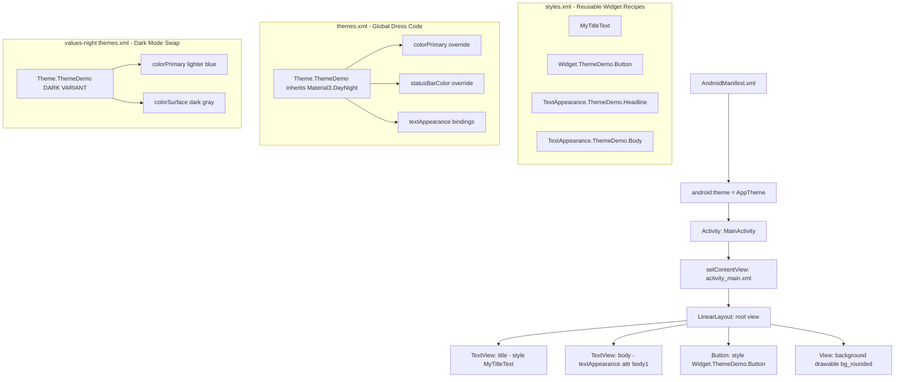
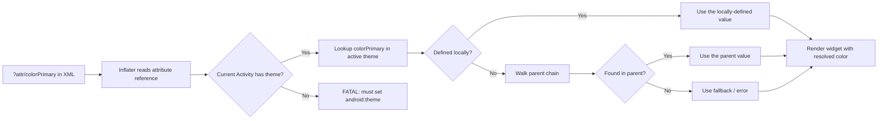

# Customizing UI with Themes and Styles.

<!-- SECTION_1_START -->
# 🎨 Customizing UI with Themes and Styles — Core Foundations

## 1.1 Formal KTU-Grade Definition

In Android application development, a **Style** is a collection of attributes that specifies the visual appearance (color, font, size, padding, etc.) of a single `View` or a hierarchy of views, declared as a reusable XML resource inside `res/values/styles.xml`. A **Theme** is a special type of style applied at the application level (`<application android:theme="...">`) or activity level (`<activity android:theme="...">`) that propagates styling attributes to every widget, view, and screen component contained within that scope.

> [!IMPORTANT]
> **KTU 2024 Syllabus Highlight:** Themes and Styles are foundational to Material Design compliance. The official KTU board expects students to differentiate between a *Style* and a *Theme*, explain the **inheritance chain** (`parent="..."`), and demonstrate the use of theme attributes (`?attr/colorPrimary`) over hard-coded values for theming adaptability.

> [!NOTE]
> **Syllabus Definition (verbatim flavor):** A *Style* modifies the appearance of a UI component, whereas a *Theme* modifies the appearance of an entire application, activity, or view hierarchy. Themes can also apply non-visual attributes (e.g., window background, status bar tint, gravity defaults).

---

## 1.2 Conceptual Analogy / Intuition 🍱

Imagine a **restaurant franchise**:

| Concept | Restaurant Analogy | Technical Equivalent |
|---|---|---|
| **Style** | The recipe card for *one* dish (e.g., the Cheese Burger card) | A bundle of formatting for *one* `Button` or `TextView` |
| **Theme** | The interior décor rulebook of the whole restaurant (warm lights, orange walls, white tiles) | Attributes pushed to *every* view inside the Activity/App |
| **Inheritance** | A regional branch that inherits from the global décor and *overrides* a few colors | `parent="Theme.MaterialComponents.Light.NoActionBar"` |
| **Theme Attributes (`?attr/...`)** | "Use the current restaurant's accent color" — automatically picks up the regional override | `android:textColor="?attr/colorPrimary"` |

> **Plain English:** A *Style* is a **makeup kit for one widget**. A *Theme* is a **dress code for the entire party**. Both come from the same XML vocabulary, but they apply at different scopes.

---

## 1.3 Physical Constants & Standard Metrics (Bolded)

- **Default `styles.xml` filename:** `res/values/styles.xml`
- **Default `colors.xml` filename:** `res/values/colors.xml`
- **Material 3 theme baseline color tokens:** `colorPrimary`, `colorOnPrimary`, `colorSecondary`, `colorSurface`, `colorOnSurface`, `colorError`, `colorOnError`
- **Recommended base parent for KTU practicals:** `Theme.MaterialComponents.DayNight.NoActionBar`
- **Standard density-independent units:** **sp** (scale-independent pixels, for text), **dp** (density-independent pixels, for layout dimensions)

> [!VISUALIZATION CONTROL]
> **Concept:** Style-vs-Theme Scope Tree (Android View Hierarchy)
> **GeoGebra / Desmos Input Equations:** (Not numeric; this is a structural diagram — see SECTION 4 Mermaid for the proper visualization)
> **Visual Description:** Picture a rooted tree where the **root** is the *Application Theme*, branches are *Activity Themes*, leaves are *Individual View Styles*. Attributes cascade downward and can be overridden at any node.

---
<!-- SECTION_1_END -->

<!-- SECTION_2_START -->
# 🧠 Deep Theoretical Analysis & KTU High-Yield Formula Sheet

## 2.1 The "Why" Behind Themes and Styles

### Why Styles Exist
Without styles, a developer would have to set `android:textColor`, `android:textSize`, `android:background`, etc. on **every single `TextView`** in every layout. Styles **DRY** (Don't Repeat Yourself) the markup — define once, apply via `style="@style/MyText"`.

### Why Themes Exist
Hard-coded colors in XML break the moment a user enables **Dark Mode** or when a designer rebrands. Themes expose **semantic color tokens** (`?attr/colorPrimary`) that *resolve dynamically* to whatever the active theme says — enabling **Day/Night** adaptation for free.

---

## 2.2 Operational Mechanics — Structured Logic

#### **Step 1 — Style Declaration (a single widget recipe)**
A style is a `<style>` element under `res/values/`. It has a `name`, an optional `parent`, and one or more `<item>` children that map attribute name → value.

#### **Step 2 — Applying a Style**
A view applies a style via the `style="..."` attribute in its layout XML. **Only one style can be applied directly** per view (no comma list), but the `parent` chain provides unlimited depth.

#### **Step 3 — Theme Declaration (the global dress code)**
A theme is just a `<style>` whose items are **theme-only attributes** (e.g., `colorPrimary`, `android:windowBackground`, `android:statusBarColor`). The system applies it from the manifest.

#### **Step 4 — Theme Inheritance**
A theme can declare `parent="Theme.MaterialComponents.DayNight.NoActionBar"`, inheriting all items of the parent and overriding any subset.

#### **Step 5 — Theme Attribute References (the magic ingredient)**
Inside any view XML or any style, write `?attr/colorPrimary` instead of `@color/primary`. The `?attr/` prefix tells the runtime: *look up this attribute on the currently-inflated theme*. This is what enables **dynamic color theming** (Material You, dark mode, branded apps).

#### **Step 6 — StateListResource & Drawable Styles**
Beyond simple styles, you can style *states* (pressed, focused, disabled) via `<selector>` and *shapes* (rounded corners, gradients) via `<shape>` drawables — referenced from the theme as `android:windowBackground`.

---

## 2.3 KTU Formula / Cheat Sheet Table

> [!IMPORTANT]
> The following markdown table summarizes **all key patterns** required for solving KTU board questions on this topic. No vertical pipes are used inside cells.

| # | Concept | Syntax / Pattern | Where Used | Pitfall to Avoid |
|---|---|---|---|---|
| 1 | Style declaration | `<style name="X" parent="Y">` | `res/values/styles.xml` | Never put a view in `styles.xml` |
| 2 | Style application | `<TextView style="@style/X" />` | Layout XML | Only **one** `style` attr per view |
| 3 | Theme declaration | `<style name="AppTheme" parent="Theme.Material3.DayNight">` | `styles.xml` | Don't use `Theme.Holo` (deprecated since API 28) |
| 4 | Apply theme globally | `<application android:theme="@style/AppTheme">` | `AndroidManifest.xml` | Must be first child of `<application>` |
| 5 | Apply theme per activity | `<activity android:theme="@style/SplashTheme" />` | `AndroidManifest.xml` | Useful for splash/login screens |
| 6 | Theme attribute ref | `?attr/colorPrimary` | Anywhere a color is needed | Don't write `@color/colorPrimary` in themes |
| 7 | Color reference | `@color/primary` | Hard-coded, **not** theme-aware | Breaks dark mode |
| 8 | Inherited override | Re-declare same `<item>` in child style | `styles.xml` | Keep `parent="..."` to inherit rest |
| 9 | Night theme override | `res/values-night/themes.xml` | Resource qualifier folder | `values-night` not `values_night` |
| 10 | Material 3 baseline | `Theme.Material3.DayNight.NoActionBar` | Parent of `AppTheme` | Requires `material` library 1.6+ |
| 11 | Custom typography | `<item name="android:textAppearance">@style/TextAppearance.App.Headline</item>` | Inside a theme | Wrap in `?attr/...` when consuming |
| 12 | Shape drawable | `<shape>` with `<corners>`, `<solid>` | `res/drawable/*.xml` | Reference via `@drawable/...` |

---

## 2.4 Real-World Engineering Utility

- **Production-grade apps (Swiggy, Zomato, WhatsApp Business)** use **branded themes** so a global rebranding task is a single-file change to `colors.xml` + theme inheritance.
- **Material You (Android 12+)** uses theme attributes so wallpaper-derived colors flow through **every** widget via `?attr/colorPrimary` resolution.
- **Accessibility** benefits because theme-aware dimensions and contrast ratios can be swapped per user preference (`values-night`, `values-large`).
- **Compose vs. XML:** While Jetpack Compose uses `MaterialTheme { ... }` composable, the underlying **token mapping** (`colorScheme.primary`, `typography.h1`) is the exact same conceptual model as the XML `?attr/colorPrimary` resolution — KTU still tests the XML version.

---
<!-- SECTION_2_END -->

<!-- SECTION_3_START -->
# 🛠️ Step-by-Step Derivations & Code Implementation

## 3.1 The Complete File Structure for a Themed App

We will build a tiny, fully-themable Android app called **ThemeDemo**. Below is the **complete, exhaustively-written** file-by-file implementation. No step is omitted.

---

### **File 1 — `res/values/colors.xml`**

```xml
<?xml version="1.0" encoding="utf-8"?>
<resources>
    <!-- BRAND PALETTE -->
    <color name="brand_primary">#FF1565C0</color>     <!-- Indigo 800 -->
    <color name="brand_primary_dark">#FF0D47A1</color> <!-- Indigo 900 -->
    <color name="brand_secondary">#FFFFA000</color>   <!-- Amber 700 -->

    <!-- NEUTRAL TOKENS (used as theme attributes) -->
    <color name="surface_light">#FFFFFFFF</color>
    <color name="surface_dark">#FF121212</color>
    <color name="on_surface_light">#FF1C1B1F</color>
    <color name="on_surface_dark">#FFE6E1E5</color>
</resources>
```

---

### **File 2 — `res/values/themes.xml` (Day / Default)**

```xml
<?xml version="1.0" encoding="utf-8"?>
<resources xmlns:tools="http://schemas.android.com/tools">

    <!-- BASE THEME: inherits Material 3 Day/Night foundation -->
    <style name="Theme.ThemeDemo" parent="Theme.Material3.DayNight.NoActionBar">

        <!-- PRIMARY BRAND COLOR -->
        <item name="colorPrimary">@color/brand_primary</item>
        <item name="colorOnPrimary">#FFFFFFFF</item>
        <item name="colorPrimaryContainer">#FFD3E3FD</item>
        <item name="colorOnPrimaryContainer">#FF001C38</item>

        <!-- SECONDARY BRAND COLOR -->
        <item name="colorSecondary">@color/brand_secondary</item>
        <item name="colorOnSecondary">#FFFFFFFF</item>

        <!-- SURFACE & BACKGROUND -->
        <item name="android:colorBackground">@color/surface_light</item>
        <item name="colorSurface">@color/surface_light</item>
        <item name="colorOnSurface">@color/on_surface_light</item>

        <!-- SYSTEM BARS -->
        <item name="android:statusBarColor">?attr/colorPrimary</item>
        <item name="android:navigationBarColor">?attr/colorSurface</item>

        <!-- TYPOGRAPHY BINDING -->
        <item name="textAppearanceHeadline1">@style/TextAppearance.ThemeDemo.Headline</item>
        <item name="textAppearanceBody1">@style/TextAppearance.ThemeDemo.Body</item>

    </style>

    <!-- TYPOGRAPHY STYLES (used by widgets via android:textAppearance) -->
    <style name="TextAppearance.ThemeDemo.Headline" parent="TextAppearance.Material3.HeadlineMedium">
        <item name="android:textSize">24sp</item>
        <item name="android:textColor">?attr/colorOnSurface</item>
        <item name="android:fontFamily">sans-serif-medium</item>
    </style>

    <style name="TextAppearance.ThemeDemo.Body" parent="TextAppearance.Material3.BodyMedium">
        <item name="android:textSize">16sp</item>
        <item name="android:textColor">?attr/colorOnSurface</item>
    </style>

    <!-- WIDGET STYLES (reusable button recipe) -->
    <style name="Widget.ThemeDemo.Button" parent="Widget.Material3.Button">
        <item name="backgroundTint">?attr/colorPrimary</item>
        <item name="android:textColor">?attr/colorOnPrimary</item>
        <item name="cornerRadius">12dp</item>
    </style>

    <!-- A PLAIN CUSTOM VIEW STYLE (single TextView recipe) -->
    <style name="MyTitleText">
        <item name="android:textSize">20sp</item>
        <item name="android:textColor">?attr/colorPrimary</item>
        <item name="android:textStyle">bold</item>
        <item name="android:padding">8dp</item>
    </style>

</resources>
```

---

### **File 3 — `res/values-night/themes.xml` (Dark Mode Override)**

```xml
<?xml version="1.0" encoding="utf-8"?>
<resources>
    <!-- SAME NAME, DIFFERENT VALUES FOR DARK MODE -->
    <style name="Theme.ThemeDemo" parent="Theme.Material3.DayNight.NoActionBar">

        <item name="colorPrimary">#FF82B1FF</item>           <!-- Lighter blue for dark bg -->
        <item name="colorOnPrimary">#FF002F65</item>
        <item name="colorSecondary">#FFFFD180</item>
        <item name="colorOnSecondary">#FF3F2E00</item>

        <item name="android:colorBackground">@color/surface_dark</item>
        <item name="colorSurface">@color/surface_dark</item>
        <item name="colorOnSurface">@color/on_surface_dark</item>

        <item name="android:statusBarColor">@color/surface_dark</item>

    </style>
</resources>
```

> [!NOTE]
> **Key Insight:** Both files declare a style of the **same name** — `Theme.ThemeDemo`. Android's resource system picks the right one based on the device's `Configuration.UI_MODE_NIGHT_*` value. This is **resource qualifiers in action**.

---

### **File 4 — `res/drawable/bg_rounded.xml` (Shape Drawable)**

```xml
<?xml version="1.0" encoding="utf-8"?>
<shape xmlns:android="http://schemas.android.com/apk/res/android"
       android:shape="rectangle">
    <solid android:color="?attr/colorPrimary" />
    <corners android:radius="16dp" />
    <stroke
        android:width="1dp"
        android:color="?attr/colorOnPrimary" />
</shape>
```

> **Note:** `?attr/...` inside drawables requires API 21+ and must be referenced from a themed context (Activity / Material parent).

---

### **File 5 — `res/layout/activity_main.xml`**

```xml
<?xml version="1.0" encoding="utf-8"?>
<LinearLayout xmlns:android="http://schemas.android.com/apk/res/android"
    android:layout_width="match_parent"
    android:layout_height="match_parent"
    android:orientation="vertical"
    android:background="?android:attr/colorBackground"
    android:padding="16dp">

    <!-- Title using the PLAIN STYLE 'MyTitleText' -->
    <TextView
        android:layout_width="wrap_content"
        android:layout_height="wrap_content"
        style="@style/MyTitleText"
        android:text="Welcome to ThemeDemo" />

    <!-- Subtitle using a THEME-ATTRIBUTE text appearance -->
    <TextView
        android:layout_width="wrap_content"
        android:layout_height="wrap_content"
        android:textAppearance="?attr/textAppearanceBody1"
        android:text="This text automatically adapts to the active theme." />

    <!-- Button using the WIDGET STYLE -->
    <Button
        android:layout_width="wrap_content"
        android:layout_height="wrap_content"
        style="@style/Widget.ThemeDemo.Button"
        android:text="Primary Action" />

    <!-- View using a shape drawable referenced via theme -->
    <View
        android:layout_width="match_parent"
        android:layout_height="60dp"
        android:layout_marginTop="16dp"
        android:background="@drawable/bg_rounded" />

</LinearLayout>
```

---

### **File 6 — `AndroidManifest.xml` (Where the theme is bound to the app)**

```xml
<?xml version="1.0" encoding="utf-8"?>
<manifest xmlns:android="http://schemas.android.com/apk/res/android"
    package="com.example.themedemo">

    <application
        android:allowBackup="true"
        android:label="ThemeDemo"
        android:theme="@style/Theme.ThemeDemo">

        <activity
            android:name=".MainActivity"
            android:exported="true">
            <intent-filter>
                <action android:name="android.intent.action.MAIN" />
                <category android:name="android.intent.category.LAUNCHER" />
            </intent-filter>
        </activity>

    </application>

</manifest>
```

---

### **File 7 — `MainActivity.kt` (Programmatic theme switching — optional bonus)**

```kotlin
package com.example.themedemo

import android.os.Bundle
import androidx.appcompat.app.AppCompatActivity
import androidx.appcompat.app.AppCompatDelegate

class MainActivity : AppCompatActivity() {
    override fun onCreate(savedInstanceState: Bundle?) {
        super.onCreate(savedInstanceState)
        setContentView(R.layout.activity_main)

        // Programmatic Dark Mode toggle using theme attribute resolution
        // MODE_NIGHT_FOLLOW_SYSTEM is the default; explicit values are MODE_NIGHT_YES / NO
        AppCompatDelegate.setDefaultNightMode(AppCompatDelegate.MODE_NIGHT_FOLLOW_SYSTEM)
    }
}
```

> [!IMPORTANT]
> **Why the KTU examiner cares about the manifest line:** Setting `android:theme="@style/Theme.ThemeDemo"` is what **activates** the entire theming system. Without that single attribute, all your carefully crafted `styles.xml` is **inert**.

---

## 3.2 How Theme Attribute Resolution Works — Derivation

The Android resource compiler generates an integer constant per attribute in `R.attr.colorPrimary`. At runtime, the inflater walks up the **context's theme chain** to resolve `?attr/colorPrimary`:

$$
\text{resolvedColor} = \text{themeChainLookup}(\text{colorPrimary})
$$

$$
\text{themeChainLookup}(a) =
\begin{cases}
\text{value defined in the deepest applicable theme} & \text{if } a \in \text{theme} \\
\text{value inherited from } \text{parent}( \text{theme}) & \text{if not defined locally} \\
\text{R.attr}(a)\text{.fallback} & \text{otherwise}
\end{cases}
$$

This three-tier resolution is **why** a child theme can selectively override exactly one color (e.g., dark-mode `colorPrimary`) while keeping the rest of the parent's definitions.

---
<!-- SECTION_3_END -->

<!-- SECTION_4_START -->
# 🗺️ Structural Diagrams & Schematics

## 4.1 Style vs. Theme — Application Scope Hierarchy



## 4.2 Theme Attribute Resolution Flow



## 4.3 Sequential Processing Topology Matrix

| Stage | File | Action | Output / Effect |
|---|---|---|---|
| 1 | `colors.xml` | Define raw hex constants | `@color/brand_primary` exists |
| 2 | `themes.xml` | Bind `colorPrimary` → `@color/brand_primary` | Semantic token ready |
| 3 | `AndroidManifest.xml` | `android:theme="@style/Theme.ThemeDemo"` | Theme attached to app scope |
| 4 | `activity_main.xml` | View uses `?attr/colorPrimary` | Runtime resolution begins |
| 5 | Runtime | Inflater walks theme chain | Concrete color painted on screen |
| 6 | User toggles Dark Mode | System switches to `values-night/themes.xml` | All `?attr/...` references re-resolve automatically |

---
<!-- SECTION_4_END -->

<!-- SECTION_5_START -->
# 📚 KTU 2024 Scheme Examination Question Bank & Topic Recap

---

## 5.1 Part A — Short Answer Questions (3 Marks Each)

### **Q1. [KTU University Exam – July 2023]**
*Define the terms "Style" and "Theme" in Android. How do they differ in their scope of application?* (CO1, Remember)

**Model Answer (3 Marks — Valuation Key):**
- **[Style definition: 1 Mark]** A Style is a collection of attributes that define the visual appearance of a single View or widget. It is declared in `res/values/styles.xml`.
- **[Theme definition: 1 Mark]** A Theme is a style applied to an entire Application, Activity, or view hierarchy. It is referenced in `AndroidManifest.xml` via `android:theme`.
- **[Scope difference: 1 Mark]** A Style affects *one* view explicitly via the `style` attribute; a Theme affects *all* child views automatically through attribute resolution (`?attr/...`).

---

### **Q2. [KTU University Exam – Dec 2023]**
*What is the purpose of the `parent` attribute inside a `<style>` declaration? Give an example.* (CO1, Understand)

**Model Answer (3 Marks — Valuation Key):**
- **[Purpose: 2 Marks]** The `parent` attribute enables **style inheritance** — the child style inherits every item of the parent and may override specific items. This avoids redeclaring a long list of common attributes.
- **[Example: 1 Mark]** `<style name="Theme.MyApp" parent="Theme.Material3.DayNight.NoActionBar">` — `Theme.MyApp` inherits all Material 3 day/night tokens, and we can then add `<item name="colorPrimary">@color/brand_primary</item>` to brand the app.

---

## 5.2 Part B — Long Answer Questions (14 Marks Each — Internal Choice)

> **Module 2, OECST725 — KTU 2024 Scheme Pattern**

### **Question A (14 Marks)**

**(a)** With a neat diagram, explain the **structure of a `<style>` element** in Android. List any **four commonly overridden attributes** inside an app theme. **(7 Marks)** *(CO2, Understand)*

**(b)** Write the complete `themes.xml` and `colors.xml` files for an app that defines a **custom Material 3 theme** named `Theme.MyCompany` with a teal primary color and a red secondary color, applied globally in the manifest. **(7 Marks)** *(CO3, Apply)*

---

#### **Model Solution — Question A**

**Part (a) — 7 Marks**

**[Structure of `<style>` element: 4 Marks]**

$$
\text{style} = \Big\langle
\begin{aligned}
&\texttt{name}      &\rightarrow& \ \text{unique identifier, e.g., "MyButton"} \\
&\texttt{parent}    &\rightarrow& \ \text{optional, e.g., "Widget.Material3.Button"} \\
&\text{items}       &\rightarrow& \ \{ (\texttt{attr}_i, \texttt{value}_i) \}_{i=1}^{n}
\end{aligned}
\Big\rangle
$$

A `<style>` element contains:

| Sub-element | Purpose | Example |
|---|---|---|
| `name` | Unique key to reference the style | `name="MyButton"` |
| `parent` | Style to inherit from | `parent="Widget.Material3.Button"` |
| `<item>` (one or more) | Individual attribute-value pair | `<item name="android:textColor">#FFFFFF</item>` |

**[Four commonly overridden attributes: 3 Marks — 0.75 each]**
1. `colorPrimary` — main brand color
2. `colorOnPrimary` — text/icon color *on* the primary
3. `colorSecondary` — accent / secondary brand
4. `android:statusBarColor` — system status bar tint

---

**Part (b) — 7 Marks**

**File 1 — `res/values/colors.xml`** (3 Marks)

```xml
<?xml version="1.0" encoding="utf-8"?>
<resources>
    <color name="company_teal">#FF008080</color>
    <color name="company_red">#FFD32F2F</color>
    <color name="on_primary">#FFFFFFFF</color>
    <color name="on_secondary">#FFFFFFFF</color>
</resources>
```

**File 2 — `res/values/themes.xml`** (3 Marks)

```xml
<?xml version="1.0" encoding="utf-8"?>
<resources>
    <style name="Theme.MyCompany" parent="Theme.Material3.DayNight.NoActionBar">
        <item name="colorPrimary">@color/company_teal</item>
        <item name="colorOnPrimary">@color/on_primary</item>
        <item name="colorSecondary">@color/company_red</item>
        <item name="colorOnSecondary">@color/on_secondary</item>
        <item name="android:statusBarColor">?attr/colorPrimary</item>
    </style>
</resources>
```

**File 3 — `AndroidManifest.xml` application tag** (1 Mark)

```xml
<application
    android:label="MyCompanyApp"
    android:theme="@style/Theme.MyCompany">
    ...
</application>
```

---

### **Question B (14 Marks — Alternative Choice)**

**(a)** Explain the concept of **theme attributes** in Android. How does the reference `?attr/colorPrimary` differ from `@color/colorPrimary`? When would you prefer one over the other? **(7 Marks)** *(CO2, Understand)*

**(b)** Design a **dark-mode override** for the theme created in part (a) above. Show the `values-night/themes.xml` file and explain how Android selects between the two theme files at runtime. **(7 Marks)** *(CO3, Apply)*

---

#### **Model Solution — Question B**

**Part (a) — 7 Marks**

**[Theme attribute concept: 3 Marks]**
A **theme attribute** is a *semantic* placeholder (e.g., `colorPrimary`, `colorSurface`) defined inside a theme, whose value is resolved at runtime by walking the theme inheritance chain. Theme attributes are declared in the Android framework's `attrs.xml` and consumed by writing `?attr/attributeName`.

**[Comparison table: 3 Marks — 1 each row]**

| Aspect | `?attr/colorPrimary` | `@color/colorPrimary` |
|---|---|---|
| Resolution time | Runtime — looks up current theme | Compile time — fixed color resource |
| Theme-aware | ✅ Yes — auto-adapts to dark mode | ❌ No — always the same color |
| Use case | Widget text/background inside themed layouts | Static non-themed assets (icons, logos) |

**[When to prefer: 1 Mark]**
Prefer `?attr/colorPrimary` for *any* color that should adapt when the user toggles dark mode or applies Material You wallpaper-based theming. Prefer `@color/...` for **branded assets** that must stay the same color (e.g., a corporate logo).

---

**Part (b) — 7 Marks**

**File — `res/values-night/themes.xml`** (4 Marks)

```xml
<?xml version="1.0" encoding="utf-8"?>
<resources>
    <style name="Theme.MyCompany" parent="Theme.Material3.DayNight.NoActionBar">
        <!-- Lighter teal so it stands out on dark background -->
        <item name="colorPrimary">#FF4DB6AC</item>
        <item name="colorOnPrimary">#FF003B36</item>
        <!-- Softer red for dark mode contrast -->
        <item name="colorSecondary">#FFEF9A9A</item>
        <item name="colorOnSecondary">#FF3F0000</item>
        <!-- Dark surface tokens -->
        <item name="android:colorBackground">#FF121212</item>
        <item name="colorSurface">#FF121212</item>
        <item name="colorOnSurface">#FFE0E0E0</item>
    </style>
</resources>
```

**Runtime selection explanation: 3 Marks**

Android's resource framework qualifies every `res/values-*` folder with **configuration qualifiers**. The `night` qualifier matches when the system is in `Configuration.UI_MODE_NIGHT_YES` (typically after sunset or when the user enables Dark Mode). The resource resolver picks the theme file from the most-specific matching qualifier folder, so:

$$
\text{themeRes} = \begin{cases}
\text{values/themes.xml} & \text{if } \text{UI\_MODE\_NIGHT} = \text{NO} \\
\text{values-night/themes.xml} & \text{if } \text{UI\_MODE\_NIGHT} = \text{YES}
\end{cases}
$$

Both files declare a style of the **same name** `Theme.MyCompany`, but with **different attribute values**, allowing automatic day/night adaptation.

---

> [!WARNING]
> **🛑 KTU Examiner's Valuation Warning / Pitfall Callout**
> - **Do NOT** write `@color/colorPrimary` inside a theme's `<item>` — that defeats the entire purpose of theme attributes. Always use `@color/<your_brand_color>` literal, but reference *the attribute* (`?attr/colorPrimary`) in widgets.
> - **Do NOT** forget to set `android:theme="@style/..."` in `<application>`. Without it, the system uses the platform default (`Theme.Material`) and **none** of your customizations apply. This single omission costs **2–3 marks** in ESE valuation.
> - **Do NOT** mix `Theme.Holo` (deprecated) with Material 3 — board answers expect modern `Theme.MaterialComponents` or `Theme.Material3`.
> - **Do NOT** declare a style *and* a theme with the same name without the `values-night` override — students often lose the "dark mode adaptation" mark by missing the `values-night` folder entirely.
> - **Always** keep the `parent="..."` attribute in your custom theme — failing to inherit means every Material baseline attribute (typography, ripple, elevation) breaks, and the UI looks raw.

---

## ✅ Topic Recap & Important Things to Remember

- **Style** = recipe for **one widget**, applied via `style="@style/X"` in layout XML.
- **Theme** = dress code for **whole app/activity**, applied via `android:theme="..."` in manifest.
- **Both** are declared in `res/values/styles.xml` using the same `<style>` syntax — the difference is **where** and **how** you reference them.
- **`parent` attribute** enables inheritance chains — child themes can override specific tokens while inheriting the rest.
- **Theme attribute references** use the `?attr/...` prefix and are the **only** way to get dynamic theming (dark mode, Material You, branding swaps).
- **Hard-coded color references** use `@color/...` and are appropriate only for **static non-themed assets** (logos, splash images).
- **Resource qualifiers** like `values-night/`, `values-large/`, `values-w600dp/` allow configuration-specific overrides of the **same-named** resources.
- **Material 3 baseline parent**: `Theme.Material3.DayNight.NoActionBar` is the KTU-recommended starting point for modern Android themes.
- **Color tokens to remember**: `colorPrimary`, `colorOnPrimary`, `colorSecondary`, `colorSurface`, `colorOnSurface`, `colorError`, `colorOnError`.
- **Typography binding**: bind `textAppearanceHeadline1`, `textAppearanceBody1`, etc. inside the theme for global font control.
- **Shape drawables** (`<shape>` with `<corners>`, `<solid>`, `<stroke>`) extend theming to custom widget backgrounds.
- **Manifest line** `android:theme="@style/AppTheme"` is the single most-important line — without it, the entire system is **inert**.
- **Dark mode = same style name, different folder** — Android's resource resolver picks the right file based on `Configuration.UI_MODE_NIGHT`.
- **Common exam trap**: confusing the `style` attribute (widget-level) with the `theme` attribute (application-level) — KTU 2024 board papers explicitly test this distinction.
- **For Part B 14-mark answers**, structure your answer as: *(1) Concept explanation → (2) File-by-file code → (3) Manifest binding → (4) Runtime flow*, and **always include a short Mermaid or labeled diagram** to bag the "neat diagram" marks.

---
<!-- SECTION_5_END -->
