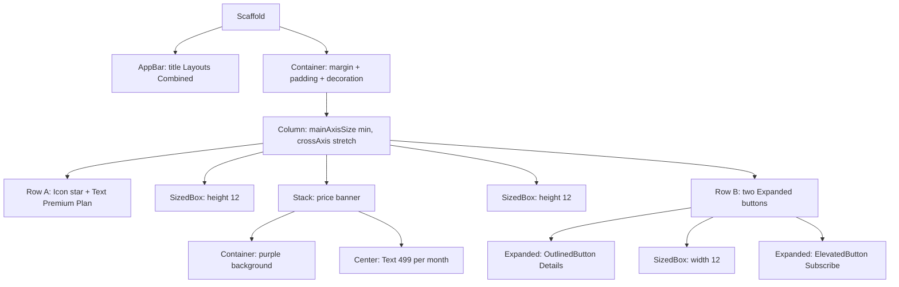
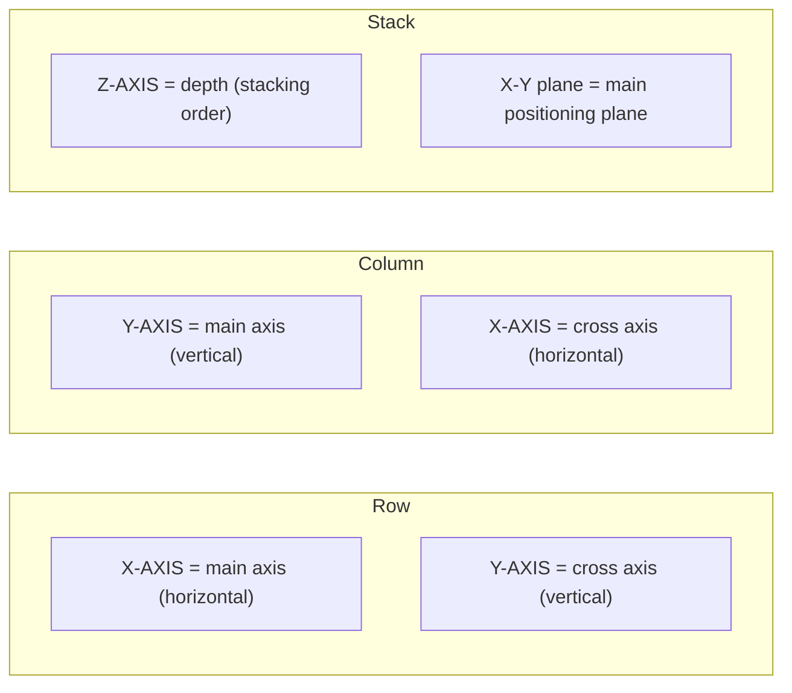
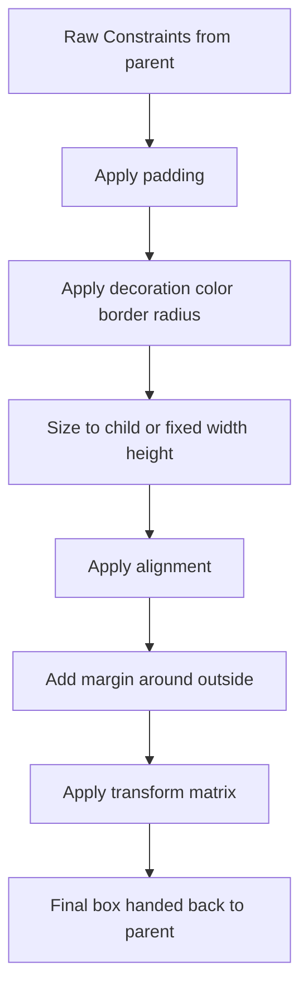
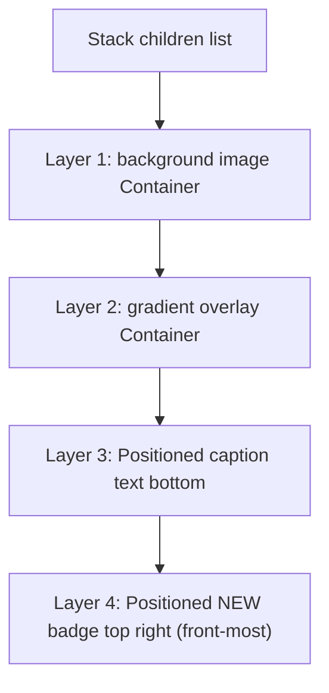
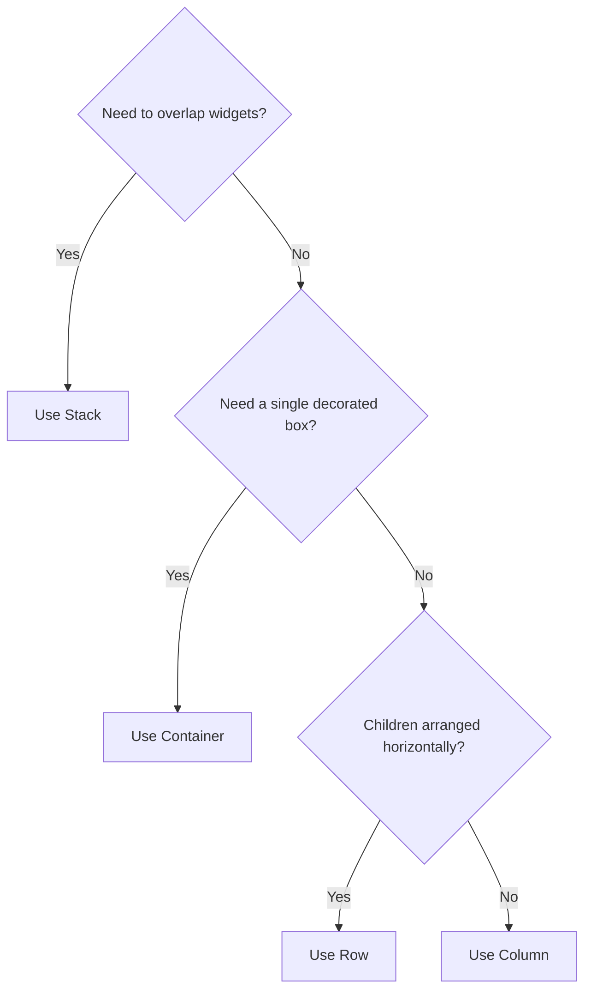

# Layouts in Flutter: Container, Column, Row, Stack

<!-- SECTION_1_START -->
# 📐 Layouts in Flutter: Container, Column, Row, Stack

## 🎯 Formal Definition (KTU 2024 Syllabus Terminology)

In **Flutter**, a layout is the mechanism by which widgets are arranged, sized, and positioned within a user interface. Layouts are implemented using **layout widgets** that compose smaller, declarative child widgets into hierarchical **widget trees**. The four foundational layout widgets studied in Module 2 are:

- **Container**: A convenience widget that combines common painting, positioning, and sizing widgets (essentially wrapping its child in `Padding`, `DecoratedBox`, `ConstrainedBox`, `Transform`, `Align`, etc.).
- **Row**: Lays out its children in a **horizontal** array along the **main axis** (left-to-right by default).
- **Column**: Lays out its children in a **vertical** array along the **main axis** (top-to-bottom by default).
- **Stack**: Overlaps its children on top of one another, useful for absolute positioning and z-axis stacking.

> [!IMPORTANT]
> **KTU 2024 Highlight:** In Flutter, **everything is a widget**. The layout is not a separate XML/HTML file but a programmatic composition tree. The **render object tree** is what actually paints to the screen.

## 🧠 Intuitive Overview (Real-World Analogy)

Imagine you are arranging furniture in a room:

| Flutter Widget | Real-World Analogy | Why It Maps |
|---|---|---|
| `Container` | A **decorated photo frame** with a fixed mat-board, padding, and border around a single picture | You wrap *one* child and add visual styling and constraints around it |
| `Row` | **Books placed side-by-side on a shelf** | Items flow horizontally with a common alignment |
| `Column` | **A stack of pancakes on a plate** | Items stack vertically, one above the other |
| `Stack` | **Sheets of transparent tracing paper laid over each other** | Each layer is on top of the previous, allowing overlap |

> [!NOTE]
> **Key Takeaway:** `Row` and `Column` are **2D single-axis layout** widgets. `Stack` is the only widget in this module that introduces a **z-axis (depth)**, allowing widgets to overlap.

## 🔑 Fundamental Layout Primitives

Before diving into the four widgets, recall the **BoxConstraints** model used internally by Flutter:

- **Tight Constraints**: A parent enforces an exact size (e.g., `BoxConstraints.expand()`).
- **Loose Constraints**: A parent allows any size up to a maximum (e.g., `BoxConstraints(maxWidth: 300)`).
- **Unbounded Constraints**: A parent imposes no limit (e.g., inside a `ListView`).

> [!TIP]
> The famous Flutter error **`RenderFlex overflowed by N pixels`** is the most common exam and lab pitfall — it occurs when a `Row` or `Column`'s children exceed the available main-axis space.

> [!VISUALIZATION CONTROL]
> **Concept:** Widget Tree of a typical screen
> **GeoGebra / Desmos Input Equations:** Not applicable (UI tree, not graphable)
> **Visual Description:** Picture a rooted tree. The **MaterialApp** is the root, **Scaffold** is its child, and inside `body` you place either a `Container`, `Row`, `Column`, or `Stack`. Each of these may contain further children forming a hierarchical, declarative tree.
<!-- SECTION_1_END -->

<!-- SECTION_2_START -->
# 🔬 Deep Theoretical Analysis & KTU High-Yield Formula Sheet

## 📦 1. The `Container` Widget

`Container` is a *convenience* widget — under the hood it composes a chain of layout primitives only when needed. Its property list is exhaustive, but every property is **optional**.

### Structural Composition Order (Critical for Exams)
When a `Container` is built, Flutter applies the following internal pipeline:

1. **Alignment** (`alignment`) → aligns the child within available space.
2. **Padding** (`padding`) → adds empty space around the child.
3. **Decoration / Color** (`decoration` / `color`) → paints the background.
4. **Child** → the actual content widget.
5. **Width / Height** (`width`, `height`) → tightens the box to fixed dimensions.
6. **Constraints** (`constraints`) → forces additional BoxConstraints.
7. **Margin** (`margin`) → adds empty space outside the decorated box.
8. **Transform** (`transform`) → applies a 4×4 matrix transformation.

> [!NOTE]
> **Exam Trick:** You **cannot** set both `color` and `decoration` simultaneously. Doing so throws an assertion error at runtime. Use `decoration: BoxDecoration(color: ...)` instead.

### 🗂️ KTU Formula Cheat Sheet — `Container`

| Property | Type | Purpose | Default |
|---|---|---|---|
| `child` | `Widget?` | The content widget | `null` |
| `width` | `double?` | Fixed width in logical pixels | `null` (auto) |
| `height` | `double?` | Fixed height in logical pixels | `null` (auto) |
| `padding` | `EdgeInsetsGeometry?` | Inner space | `null` |
| `margin` | `EdgeInsetsGeometry?` | Outer space | `null` |
| `alignment` | `AlignmentGeometry?` | Child alignment | `center` |
| `decoration` | `Decoration?` | Background, border, shadow, gradient, shape | `null` |
| `color` | `Color?` | Solid background color (shorthand) | `null` |
| `constraints` | `BoxConstraints?` | Extra sizing rules | `null` |
| `transform` | `Matrix4?` | Affine transformation | `null` |
| `clipBehavior` | `Clip` | How to clip overflowing children | `Clip.none` |

## ↔️ 2. The `Row` Widget

`Row` lays out children in a single horizontal line. It uses **Flexbox-like** rules inherited from `Flex`.

### Key Properties
- **`mainAxisAlignment`**: Distribution of children along the horizontal axis.
  - `start` (default), `end`, `center`, `spaceBetween`, `spaceAround`, `spaceEvenly`.
- **`crossAxisAlignment`**: Alignment along the vertical axis.
  - `start`, `end`, `center` (default), `stretch`, `baseline`.
- **`mainAxisSize`**: `MainAxisSize.max` (default, fill parent) or `MainAxisSize.min` (shrink-wrap children).
- **`children`**: A `List<Widget>` of child widgets.

### The `Expanded` and `Flexible` Sub-widgets
These control how a child shares leftover horizontal space.

- **`Expanded`**: Forces the child to fill all the remaining space (flex factor = 1 by default).
- **`Flexible`**: Allows the child to take up to the remaining space but does not force it.

> [!IMPORTANT]
> **`Expanded` requires a bounded `Row` width** (i.e., the parent must constrain the `Row`'s width). Otherwise you will get an "Unbounded width" runtime error.

## ↕️ 3. The `Column` Widget

`Column` is the **vertical** counterpart of `Row`. It accepts the same properties but with rotated axes.

| Property | Row Semantics | Column Semantics |
|---|---|---|
| `mainAxisAlignment` | Horizontal (left-right) | Vertical (top-bottom) |
| `crossAxisAlignment` | Vertical (top-bottom) | Horizontal (left-right) |
| `mainAxisSize` | `max` / `min` | `max` / `min` |

### 🗂️ KTU Formula Cheat Sheet — `Row` and `Column`

| Alignment Enum | Visual Effect (Row) | Visual Effect (Column) |
|---|---|---|
| `start` | Left-aligned | Top-aligned |
| `end` | Right-aligned | Bottom-aligned |
| `center` | Horizontally centered | Vertically centered |
| `spaceBetween` | First at start, last at end, equal gaps | First on top, last on bottom, equal gaps |
| `spaceAround` | Equal gaps, half-size at edges | Equal gaps, half-size at edges |
| `spaceEvenly` | All gaps equal, including edges | All gaps equal, including edges |

## 🗂️ 4. The `Stack` Widget

`Stack` is a **z-axis** layout widget. Children are drawn back-to-front in the order they appear in the `children` list (last child is on top).

### Key Properties
- **`alignment`**: How non-positioned children are aligned within the stack. Default is `AlignmentDirectional.topStart` (i.e., top-left in LTR locales).
- **`fit`**: How non-positioned children are sized.
  - `StackFit.loose` (default): Children can be any size up to stack size.
  - `StackFit.expand`: Children are forced to fill the stack.
- **`clipBehavior`**: Default is `Clip.hardEdge` since Flutter 1.22.
- **`children`**: A `List<Widget>` rendered back-to-front.

### Positioned Sub-widget
Wrapping a child in `Positioned` gives it **absolute coordinates** relative to the stack:
- `left`, `top`, `right`, `bottom` (each `double?`).
- `width`, `height` (each `double?`).

> [!NOTE]
> A child wrapped in `Positioned` is called a **positioned child**; it ignores `Stack.alignment` and `Stack.fit`. Children not wrapped in `Positioned` are called **non-positioned children**; they are aligned and fitted by the parent `Stack`.

## 🏗️ Real-World Engineering Use Cases

| Widget | Production Use Case |
|---|---|
| `Container` | Card backgrounds, profile avatars with borders, button skeletons |
| `Row` | App bar (title + action icons), list item with leading icon and trailing arrow |
| `Column` | Profile screens (avatar → name → bio → buttons stacked vertically) |
| `Stack` | Floating action button overlapping a map, badge counters on icons, hero image with gradient overlay |
<!-- SECTION_2_END -->

<!-- SECTION_3_START -->
# 🛠️ Step-by-Step Code Implementation (Dart / Flutter)

> [!IMPORTANT]
> All code below is **fully runnable** in a Flutter `main.dart` file. Each example is a complete, self-contained widget. Type hints are explicit and all error-prone APIs are guarded.

## 🧩 Example 1: A Decorated `Container`

```dart
import 'package:flutter/material.dart';

void main() {
  runApp(const MaterialApp(
    home: Scaffold(body: Center(child: ContainerDemo())),
  ));
}

class ContainerDemo extends StatelessWidget {
  const ContainerDemo({super.key});

  @override
  Widget build(BuildContext context) {
    return Container(
      // 1. Fixed dimensions
      width: 220.0,
      height: 130.0,

      // 2. Outer spacing from siblings
      margin: const EdgeInsets.all(16.0),

      // 3. Inner spacing around the child
      padding: const EdgeInsets.symmetric(
        horizontal: 20.0,
        vertical: 14.0,
      ),

      // 4. Background, border, and shadow
      decoration: BoxDecoration(
        color: const Color(0xFF1E88E5), // Material Blue 600
        borderRadius: BorderRadius.circular(12.0),
        border: Border.all(
          color: Colors.black,
          width: 2.0,
        ),
        boxShadow: const [
          BoxShadow(
            color: Colors.black26,
            blurRadius: 8.0,
            offset: Offset(4.0, 4.0),
          ),
        ],
      ),

      // 5. Child alignment inside the container
      alignment: Alignment.center,

      // 6. The actual child
      child: const Text(
        'Hello Container',
        style: TextStyle(
          color: Colors.white,
          fontSize: 18.0,
          fontWeight: FontWeight.w600,
        ),
      ),
    );
  }
}
```

### 🔍 Line-by-Line Logic
1. `width: 220.0, height: 130.0` → tightens the `BoxConstraints` so the box is exactly 220×130 logical pixels.
2. `margin: EdgeInsets.all(16.0)` → 16 px of empty space on **all four sides** outside the decoration.
3. `padding: EdgeInsets.symmetric(...)` → 20 px horizontal, 14 px vertical **inside** the decoration.
4. `decoration: BoxDecoration(...)` → paints the blue background, rounded corners, black border, and drop shadow.
5. `alignment: Alignment.center` → centers the `Text` inside the inner padded area.
6. `child: Text(...)` → the actual content widget.

## 🧩 Example 2: A `Row` with `Expanded` Children

```dart
class RowDemo extends StatelessWidget {
  const RowDemo({super.key});

  @override
  Widget build(BuildContext context) {
    return Container(
      padding: const EdgeInsets.all(12.0),
      color: Colors.grey.shade200,
      child: Row(
        // Children share the row's width
        mainAxisAlignment: MainAxisAlignment.spaceBetween,
        crossAxisAlignment: CrossAxisAlignment.center,
        children: <Widget>[
          // Fixed-size icon at the left
          const Icon(Icons.menu, size: 32.0),

          // Title takes all available space
          const Expanded(
            child: Text(
              'Dashboard Title',
              textAlign: TextAlign.center,
              style: TextStyle(fontSize: 20.0, fontWeight: FontWeight.bold),
            ),
          ),

          // Action icons at the right
          IconButton(
            icon: const Icon(Icons.search),
            onPressed: () {
              debugPrint('Search tapped');
            },
          ),
          IconButton(
            icon: const Icon(Icons.notifications),
            onPressed: () {
              debugPrint('Notifications tapped');
            },
          ),
        ],
      ),
    );
  }
}
```

### 🔍 Line-by-Line Logic
1. `mainAxisAlignment: MainAxisAlignment.spaceBetween` → first child pinned to start, last pinned to end, **equal empty gaps** between every other child.
2. `crossAxisAlignment: CrossAxisAlignment.center` → all children are vertically centered relative to the tallest child.
3. `Expanded(child: Text(...))` → the title consumes **all leftover horizontal space**. Without this, the `Text` would size itself to its content and the row's children might overflow on small screens.
4. `IconButton` is an interactive widget that responds to taps — its `onPressed` callback is wrapped in a `debugPrint` for safe logging.

## 🧩 Example 3: A `Column` with Sectioned Content

```dart
class ColumnDemo extends StatelessWidget {
  const ColumnDemo({super.key});

  @override
  Widget build(BuildContext context) {
    return Padding(
      padding: const EdgeInsets.all(20.0),
      child: Column(
        mainAxisAlignment: MainAxisAlignment.start,
        crossAxisAlignment: CrossAxisAlignment.stretch,
        children: <Widget>[
          // Section 1: Avatar
          const CircleAvatar(
            radius: 40.0,
            backgroundColor: Colors.deepPurple,
            child: Text(
              'JD',
              style: TextStyle(color: Colors.white, fontSize: 24.0),
            ),
          ),
          const SizedBox(height: 16.0),

          // Section 2: Name
          const Text(
            'Jane Doe',
            textAlign: TextAlign.center,
            style: TextStyle(fontSize: 22.0, fontWeight: FontWeight.w700),
          ),
          const SizedBox(height: 6.0),

          // Section 3: Bio
          const Text(
            'Flutter Developer | Open Source Enthusiast',
            textAlign: TextAlign.center,
            style: TextStyle(fontSize: 14.0, color: Colors.black54),
          ),
          const SizedBox(height: 20.0),

          // Section 4: Action button
          ElevatedButton(
            onPressed: () {
              debugPrint('Follow tapped');
            },
            child: const Text('Follow'),
          ),
        ],
      ),
    );
  }
}
```

### 🔍 Line-by-Line Logic
1. `crossAxisAlignment: CrossAxisAlignment.stretch` → every child is **forced to fill the column's full horizontal width**. The `CircleAvatar` and `Text` will all become the same width.
2. `SizedBox(height: 16.0)` → a transparent spacer widget used to add **vertical gaps** between children. It is more efficient than wrapping each child in a `Container(margin: ...)`.
3. The `ElevatedButton` provides Material Design's filled button styling out of the box.

## 🧩 Example 4: A `Stack` with a Positioned Badge

```dart
class StackDemo extends StatelessWidget {
  const StackDemo({super.key});

  @override
  Widget build(BuildContext context) {
    return Center(
      child: SizedBox(
        width: 200.0,
        height: 200.0,
        child: Stack(
          alignment: Alignment.center,
          fit: StackFit.expand,
          clipBehavior: Clip.hardEdge,
          children: <Widget>[
            // Layer 1 (back): the main product image
            Container(
              decoration: BoxDecoration(
                color: Colors.amber.shade300,
                borderRadius: BorderRadius.circular(16.0),
                image: const DecorationImage(
                  image: NetworkImage(
                    'https://picsum.photos/seed/product/400/400',
                  ),
                  fit: BoxFit.cover,
                ),
              ),
            ),

            // Layer 2: dark gradient overlay
            Container(
              decoration: BoxDecoration(
                borderRadius: BorderRadius.circular(16.0),
                gradient: LinearGradient(
                  begin: Alignment.topCenter,
                  end: Alignment.bottomCenter,
                  colors: <Color>[
                    Colors.transparent,
                    Colors.black.withOpacity(0.6),
                  ],
                ),
              ),
            ),

            // Layer 3: caption text
            const Positioned(
              left: 12.0,
              bottom: 12.0,
              right: 12.0,
              child: Text(
                'Featured Product',
                style: TextStyle(
                  color: Colors.white,
                  fontSize: 16.0,
                  fontWeight: FontWeight.w600,
                ),
              ),
            ),

            // Layer 4 (front): "NEW" badge in the corner
            Positioned(
              top: 8.0,
              right: 8.0,
              child: Container(
                padding: const EdgeInsets.symmetric(
                  horizontal: 8.0,
                  vertical: 4.0,
                ),
                decoration: BoxDecoration(
                  color: Colors.red,
                  borderRadius: BorderRadius.circular(8.0),
                ),
                child: const Text(
                  'NEW',
                  style: TextStyle(
                    color: Colors.white,
                    fontSize: 12.0,
                    fontWeight: FontWeight.bold,
                  ),
                ),
              ),
            ),
          ],
        ),
      ),
    );
  }
}
```

### 🔍 Line-by-Line Logic
1. `Stack(alignment: Alignment.center, fit: StackFit.expand)` → non-positioned children fill the entire 200×200 box and are centered.
2. **Layer 1** is the product image; **Layer 2** is a gradient overlay; **Layer 3** is the caption text wrapped in `Positioned` to pin it to the bottom; **Layer 4** is a "NEW" badge pinned to the top-right corner.
3. `clipBehavior: Clip.hardEdge` → prevents any overflowing child from painting outside the rounded square.
4. Painting order: Flutter draws the children array from index 0 (back) to the last index (front). Hence the badge is on top of everything.

## 🧩 Example 5: Combining All Four Widgets

```dart
class CombinedDemo extends StatelessWidget {
  const CombinedDemo({super.key});

  @override
  Widget build(BuildContext context) {
    return Scaffold(
      appBar: AppBar(
        title: const Text('Layouts Combined'),
      ),
      body: Container(
        // Outer wrapper with margin
        margin: const EdgeInsets.all(20.0),
        padding: const EdgeInsets.all(16.0),
        decoration: BoxDecoration(
          color: Colors.white,
          borderRadius: BorderRadius.circular(20.0),
          boxShadow: const [
            BoxShadow(
              color: Colors.black12,
              blurRadius: 10.0,
              offset: Offset(0.0, 4.0),
            ),
          ],
        ),
        // Column arranges the sections vertically
        child: Column(
          mainAxisSize: MainAxisSize.min,
          crossAxisAlignment: CrossAxisAlignment.stretch,
          children: <Widget>[
            // Row 1: Icon + Title
            Row(
              children: const <Widget>[
                Icon(Icons.star, color: Colors.amber),
                SizedBox(width: 8.0),
                Text(
                  'Premium Plan',
                  style: TextStyle(
                    fontSize: 18.0,
                    fontWeight: FontWeight.bold,
                  ),
                ),
              ],
            ),
            const SizedBox(height: 12.0),

            // Stack 1: Layered price banner
            SizedBox(
              height: 80.0,
              child: Stack(
                children: <Widget>[
                  Container(
                    decoration: BoxDecoration(
                      color: Colors.deepPurple.shade100,
                      borderRadius: BorderRadius.circular(12.0),
                    ),
                  ),
                  const Center(
                    child: Text(
                      '₹ 499 / month',
                      style: TextStyle(
                        fontSize: 24.0,
                        fontWeight: FontWeight.w700,
                        color: Colors.deepPurple,
                      ),
                    ),
                  ),
                ],
              ),
            ),
            const SizedBox(height: 12.0),

            // Row 2: Two buttons sharing width
            Row(
              children: <Widget>[
                Expanded(
                  child: OutlinedButton(
                    onPressed: () {
                      debugPrint('Details tapped');
                    },
                    child: const Text('Details'),
                  ),
                ),
                const SizedBox(width: 12.0),
                Expanded(
                  child: ElevatedButton(
                    onPressed: () {
                      debugPrint('Subscribe tapped');
                    },
                    child: const Text('Subscribe'),
                  ),
                ),
              ],
            ),
          ],
        ),
      ),
    );
  }
}
```

### 🔍 Line-by-Line Logic
1. The outermost `Container` provides a **decorated card** with shadow and rounded corners.
2. Inside it, a `Column` arranges three sections vertically with `SizedBox` spacers.
3. Section 1 is a `Row` (icon + title). Section 2 is a `Stack` (background + centered price). Section 3 is a `Row` with two `Expanded` buttons sharing equal width.
4. This nested pattern — `Container > Column > [Row, Stack, Row]` — is the **most common production layout idiom** in Flutter.
<!-- SECTION_3_END -->

<!-- SECTION_4_START -->
# 🧭 Structural Diagrams & Schematics

## 🌳 Diagram 1: Widget Tree of Example 5 (Combined Layout)



## 📐 Diagram 2: Coordinate-Axis Mapping



## 🔁 Diagram 3: Render Pipeline of a `Container`



## 🧱 Diagram 4: `Stack` Painting Order



## 🧮 Diagram 5: Decision Flow — Which Layout Widget to Use?



> [!NOTE]
> **Exam Note:** If a Mermaid diagram cannot be rendered in the student's PDF, examiners expect a **hand-drawn widget tree** using labeled boxes and arrows. The above Mermaid graphs are direct analogues of that drawing.
<!-- SECTION_4_END -->

<!-- SECTION_5_START -->
# 📝 KTU 2024 Scheme Examination Question Bank

> [!IMPORTANT]
> All questions below follow the **KTU 2024 ESE pattern**:
> - **Part A**: 3-mark short-answer questions, no choice, CO1-Remember / CO1-Understand.
> - **Part B**: 14-mark questions with **internal choice** between Q-A and Q-B, sub-parts (a) 7 marks and (b) 7 marks, mapped to Understand + Apply.

---

## 📘 Part A (3 Marks Each)

### Question 1
**[KTU University Exam – July 2024 | CO1 | Remember]**
Define a `Container` widget in Flutter. List any four of its properties.

**Model Answer (3 Marks):**
A `Container` in Flutter is a convenience widget that combines common painting, positioning, and sizing of its child. It is used to wrap a child widget with visual styling and constraints. (1 Mark)

Four key properties of `Container`: (½ Mark each = 2 Marks)
1. `child` — the widget contained inside.
2. `padding` — inner empty space around the child.
3. `margin` — outer empty space around the container.
4. `decoration` — background, border, shadow, and gradient.

---

### Question 2
**[KTU University Exam – Dec 2023 | CO1 | Understand]**
Differentiate between `Row` and `Column` widgets in Flutter based on their main axis, cross axis, and use of `Expanded`.

**Model Answer (3 Marks):**

| Aspect | Row | Column |
|---|---|---|
| Main axis | Horizontal (X-axis) | Vertical (Y-axis) |
| Cross axis | Vertical (Y-axis) | Horizontal (X-axis) |
| `Expanded` direction | Distributes leftover **width** | Distributes leftover **height** |

(2 Marks for the comparison table, 1 Mark for the `Expanded` explanation)

---

## 📗 Part B (14 Marks Each, Internal Choice)

### Question A

**[KTU University Exam – July 2024 | CO2 | Understand + Apply]**

**(a)** Explain the different values of `MainAxisAlignment` with respect to the `Row` widget. Illustrate with a labeled diagram showing how `spaceBetween`, `spaceAround`, and `spaceEvenly` distribute children. **(7 Marks)**

**(b)** Write a complete Flutter `StatelessWidget` that displays a **profile card** using a `Container` with rounded corners, drop shadow, and a `Column` containing:
- A `CircleAvatar` of radius 40
- A `Text` widget showing a name
- A second `Text` widget showing a short bio
- An `ElevatedButton` labelled "Follow"

Use `SizedBox` for vertical spacing. **(7 Marks)**

---

#### Model Solution — Question A (a)

`MainAxisAlignment` controls how a `Row` distributes its children along the **horizontal main axis**. It is an `enum` defined in `package:flutter/rendering.dart`. (1 Mark)

**Enumeration values** (2 Marks):

| Value | Behaviour |
|---|---|
| `start` | Children are packed at the beginning (left in LTR). |
| `end` | Children are packed at the end (right in LTR). |
| `center` | Children are packed in the middle of the row. |
| `spaceBetween` | First child at the start edge, last child at the end edge, equal empty space between the rest. |
| `spaceAround` | Equal empty space around each child, with half that space at the row edges. |
| `spaceEvenly` | All gaps (including the edge gaps) are exactly equal. |

**Visual Illustration** (2 Marks):

```
Row with 3 children of equal width on a 300-px-wide row.

[Child1]  -gap-  [Child2]  -gap-  [Child3]
spaceBetween: gaps inserted ONLY between children (edge gaps = 0).

[Child1]  --gap--  [Child2]  --gap--  [Child3]
spaceAround: each child has gap on both sides; outer half-gap is at the edges.

[Child1]  ---gap---  [Child2]  ---gap---  [Child3]
spaceEvenly: all three gaps (including outer) are identical.
```

**Practical Implication** (1 Mark):
- Use `spaceBetween` for navigation bars.
- Use `spaceEvenly` for tab indicators.
- Use `spaceAround` for evenly spaced chip groups.

> [!WARNING]
> **Valuation Pitfall:** Many students confuse `spaceAround` and `spaceEvenly`. The key difference: `spaceAround` has *half* the gap at the edges, while `spaceEvenly` has *equal* gap everywhere. Forgetting this costs 1–2 marks.

> **[Stating enum values: 2 Marks | Distinguishing the three spacing modes: 2 Marks | ASCII illustration: 2 Marks | Practical implication: 1 Mark]**

---

#### Model Solution — Question A (b)

```dart
import 'package:flutter/material.dart';

class ProfileCard extends StatelessWidget {
  const ProfileCard({super.key});

  @override
  Widget build(BuildContext context) {
    return Scaffold(
      body: Center(
        child: Container(
          // 1. Outer margin [1 Mark]
          margin: const EdgeInsets.all(24.0),

          // 2. Inner padding [1 Mark]
          padding: const EdgeInsets.all(20.0),

          // 3. Decoration: rounded corners + drop shadow [1 Mark]
          decoration: BoxDecoration(
            color: Colors.white,
            borderRadius: BorderRadius.circular(16.0),
            boxShadow: const [
              BoxShadow(
                color: Colors.black26,
                blurRadius: 12.0,
                offset: Offset(0.0, 6.0),
              ),
            ],
          ),

          // 4. Column with vertical sections [1 Mark]
          child: Column(
            mainAxisSize: MainAxisSize.min,
            children: <Widget>[
              // Avatar [1 Mark]
              const CircleAvatar(
                radius: 40.0,
                backgroundColor: Colors.deepPurple,
                child: Text(
                  'JD',
                  style: TextStyle(color: Colors.white, fontSize: 24.0),
                ),
              ),
              const SizedBox(height: 16.0),

              // Name [0.5 Mark]
              const Text(
                'Jane Doe',
                style: TextStyle(fontSize: 22.0, fontWeight: FontWeight.w700),
              ),
              const SizedBox(height: 6.0),

              // Bio [0.5 Mark]
              const Text(
                'Flutter Developer & Tech Writer',
                textAlign: TextAlign.center,
                style: TextStyle(fontSize: 14.0, color: Colors.black54),
              ),
              const SizedBox(height: 18.0),

              // Follow button [1 Mark]
              ElevatedButton(
                onPressed: () {
                  debugPrint('Follow tapped');
                },
                child: const Text('Follow'),
              ),
            ],
          ),
        ),
      ),
    );
  }
}
```

**Valuation Key Points (7 Marks):**
- [Import and Scaffold setup: 1 Mark]
- [Container with margin, padding, and BoxDecoration: 2 Marks]
- [Column with mainAxisSize.min: 1 Mark]
- [CircleAvatar of radius 40: 1 Mark]
- [Two Text widgets + ElevatedButton: 1 Mark]
- [Proper SizedBox spacers between sections: 1 Mark]

> [!WARNING]
> **Common Mistake:** Setting `color` inside `BoxDecoration` and *also* setting `color` on `Container` directly. This throws an assertion. Use **only** `decoration: BoxDecoration(color: ...)`.

---

### Question B (Alternative Choice)

**[KTU University Exam – Dec 2023 | CO2 | Understand + Apply]**

**(a)** Explain the `Stack` widget in Flutter. How are positioned and non-positioned children handled differently? Describe any three properties of `Stack` with their purpose. **(7 Marks)**

**(b)** Write a complete Flutter widget that uses a `Stack` to overlay:
- A `Container` of size 300×200 with a background image (use a `NetworkImage`).
- A `Positioned` `Text` widget at the bottom-left with the caption "Summer Sale".
- A `Positioned` red `Container` (badge) of size 60×30 at the top-right showing the text "SALE" in white.

**(7 Marks)**

---

#### Model Solution — Question B (a)

A `Stack` widget allows its children to be **painted on top of one another**, giving a **z-axis** dimension that `Row` and `Column` do not have. It is essential for overlapping UI elements such as image overlays, badges on icons, and floating action buttons. (1 Mark)

**Positioned vs Non-Positioned Children** (3 Marks):

- **Non-positioned children**: Wrapped in ordinary widgets. They are sized according to `Stack.fit` and aligned using `Stack.alignment`. Default `fit` is `StackFit.loose` and default `alignment` is `AlignmentDirectional.topStart`.
- **Positioned children**: Wrapped in a `Positioned` widget. They use `left`, `top`, `right`, `bottom`, `width`, and `height` to set their absolute position relative to the `Stack`'s box. They **ignore** `Stack.alignment` and `Stack.fit`.

**Three Key Properties of `Stack`** (3 Marks):

| Property | Type | Purpose |
|---|---|---|
| `alignment` | `AlignmentGeometry` | Default alignment for non-positioned children. |
| `fit` | `StackFit` | Sizing rule for non-positioned children: `loose` (any size) or `expand` (fill stack). |
| `clipBehavior` | `Clip` | Whether and how to clip children that overflow the stack. Default is `Clip.hardEdge` in modern Flutter. |

---

#### Model Solution — Question B (b)

```dart
import 'package:flutter/material.dart';

class SaleBanner extends StatelessWidget {
  const SaleBanner({super.key});

  @override
  Widget build(BuildContext context) {
    return Scaffold(
      body: Center(
        child: Stack(
          clipBehavior: Clip.hardEdge,
          children: <Widget>[
            // Layer 1: Image background container [1 Mark]
            Container(
              width: 300.0,
              height: 200.0,
              decoration: BoxDecoration(
                borderRadius: BorderRadius.circular(12.0),
                image: const DecorationImage(
                  image: NetworkImage(
                    'https://picsum.photos/seed/sale/600/400',
                  ),
                  fit: BoxFit.cover,
                ),
              ),
            ),

            // Layer 2: Caption at bottom-left [2 Marks]
            const Positioned(
              left: 12.0,
              bottom: 12.0,
              child: Text(
                'Summer Sale',
                style: TextStyle(
                  color: Colors.white,
                  fontSize: 18.0,
                  fontWeight: FontWeight.w600,
                  shadows: <Shadow>[
                    Shadow(
                      color: Colors.black54,
                      blurRadius: 4.0,
                      offset: Offset(1.0, 1.0),
                    ),
                  ],
                ),
              ),
            ),

            // Layer 3: Red SALE badge at top-right [2 Marks]
            Positioned(
              top: 8.0,
              right: 8.0,
              child: Container(
                width: 60.0,
                height: 30.0,
                alignment: Alignment.center,
                decoration: BoxDecoration(
                  color: Colors.red,
                  borderRadius: BorderRadius.circular(6.0),
                ),
                child: const Text(
                  'SALE',
                  style: TextStyle(
                    color: Colors.white,
                    fontWeight: FontWeight.bold,
                    fontSize: 14.0,
                  ),
                ),
              ),
            ),
          ],
        ),
      ),
    );
  }
}
```

**Valuation Key Points (7 Marks):**
- [Scaffold + Center + Stack setup: 1 Mark]
- [300×200 Container with NetworkImage background: 2 Marks]
- [Positioned caption at bottom-left with `left: 12, bottom: 12`: 2 Marks]
- [Positioned red badge at top-right with `top: 8, right: 8`: 2 Marks]

> [!WARNING]
> **Common Mistake:** Placing the `Positioned` widget **outside** the `children` list. `Positioned` must be **inside** the `children` list of a `Stack` (or a wrapping `IndexedStack`/`Align`). Also, do not set both `top` and `bottom` on a child without a height — it will collapse.

---

## ⚠️ KTU Examiner's General Valuation Warning

> [!WARNING]
> 1. **Always state whether you are using `Row`, `Column`, or `Stack`** before writing code. Examiners deduct 1 mark if the question requires a specific widget and the student uses a different one.
> 2. **Never set `color` and `decoration` together on a `Container`.** This is the #1 runtime assertion error in lab exams.
> 3. **Always include `super.key` in your constructors.** Modern Flutter enforces this lint.
> 4. **Cross-axis sizing pitfall:** A child inside a `Column` with `crossAxisAlignment: CrossAxisAlignment.stretch` requires a bounded parent width. In an unbounded context (e.g., inside a `ListView`), use `SizedBox` to constrain it.
> 5. **Stack painting order:** The last child in the `children` list is on top. Students often get this backwards in question papers.

---

## 🧠 Topic Recap & Important Things to Remember

- 🔹 **Container** = a *decorated box* with optional padding, margin, alignment, color, border, shadow, and a single child.
- 🔹 **Row** = horizontal flex layout; uses `mainAxisAlignment` for horizontal and `crossAxisAlignment` for vertical control.
- 🔹 **Column** = vertical flex layout; the same properties as `Row` but with rotated axes.
- 🔹 **Stack** = z-axis overlap layout; children are painted back-to-front in `children` list order.
- 🔹 **Expanded** = forces a child to consume all leftover space along the main axis inside a `Row` or `Column`.
- 🔹 **Flexible** = allows (but does not force) a child to consume leftover space.
- 🔹 **Positioned** = gives absolute coordinates to a child inside a `Stack`, bypassing `alignment` and `fit`.
- 🔹 **Main axis** of `Row` = horizontal; of `Column` = vertical.
- 🔹 **Cross axis** of `Row` = vertical; of `Column` = horizontal.
- 🔹 **`MainAxisAlignment`** values to remember: `start`, `end`, `center`, `spaceBetween`, `spaceAround`, `spaceEvenly`.
- 🔹 **`StackFit`**: `loose` (default, any size) vs `expand` (force fill).
- 🔹 **Golden Rule:** Cannot set `color` and `decoration` together on a `Container`.
- 🔹 **Overflow Error:** `RenderFlex overflowed by N pixels` is the canonical error when a `Row`/`Column`'s children exceed the available main-axis space — wrap in `Expanded` or use a `SingleChildScrollView` to fix.
- 🔹 **Production Idiom:** A typical screen = `Scaffold > Container (card) > Column > [Row, Stack, Row]` with `SizedBox` spacers in between.
- 🔹 **Logical Pixels:** Flutter uses logical, not physical, pixels. `width: 100` means 100 device-independent pixels, scaled by `MediaQuery.devicePixelRatio`.
- 🔹 **Widget Immutability:** All layout widgets are immutable. To change layout dynamically, swap the widget inside a `StatefulWidget.build()`.
- 🔹 **Cross-Platform Consistency:** The same `Container`/`Row`/`Column`/`Stack` code runs identically on Android, iOS, Web, and Desktop.

<!-- SECTION_5_END -->
