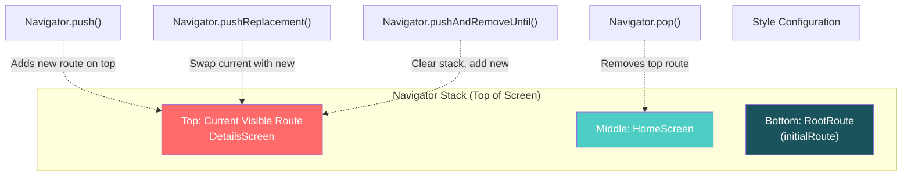
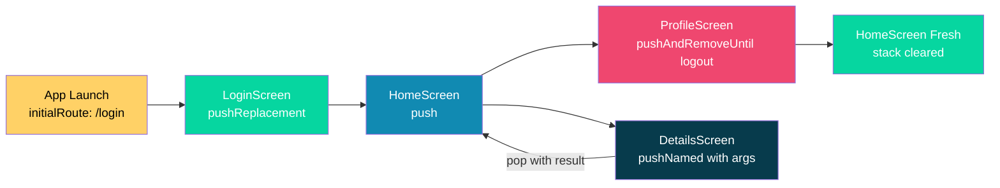
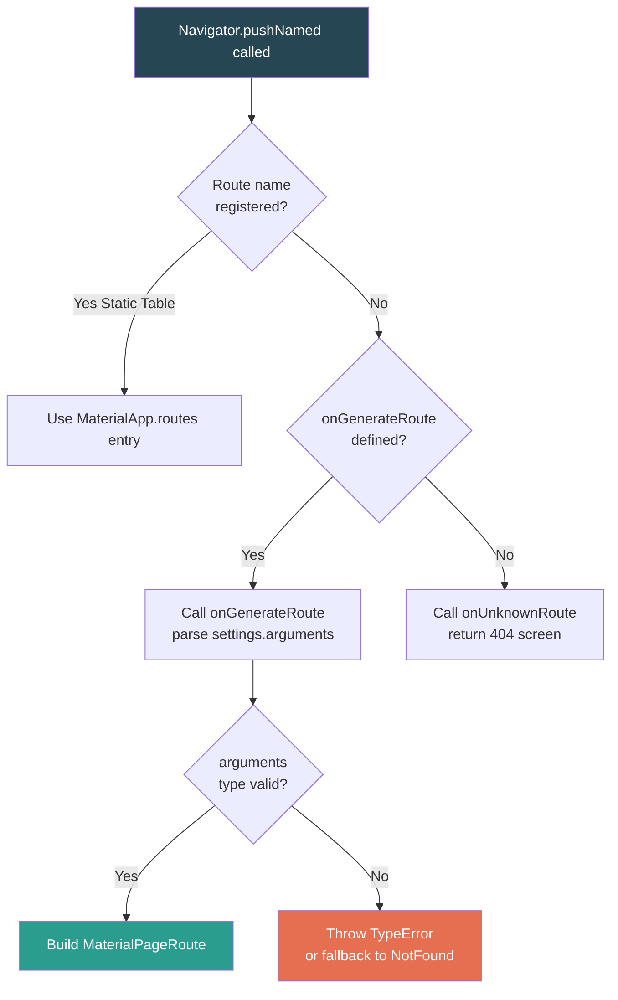
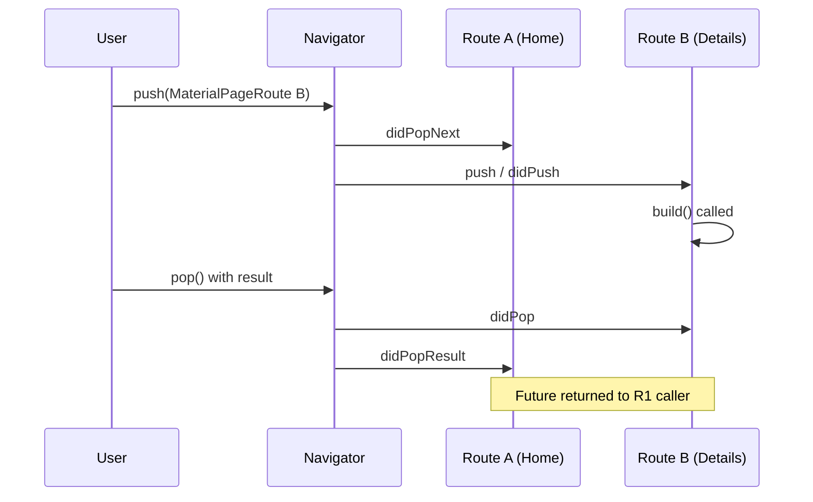
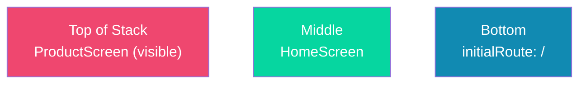

# Navigation and Routing in Flutter

<!-- SECTION_1_START -->
# Navigation and Routing in Flutter

## 1. Core Technical Definition & Intuitive Overview

In Flutter, **Navigation** refers to the act of moving the user from one screen (route) to another within a mobile application, while **Routing** is the underlying mechanism that defines, manages, and controls how those screens (pages) are stacked, transitioned, and dismissed in memory. The Flutter framework treats every screen as a `Route` object managed by a central `Navigator` widget, which maintains a stack-based history analogous to a web browser's history stack.

> [!IMPORTANT]
> **KTU 2024 Syllabus Definition (OECST725 – Module 2):**
> *Navigation is the process of moving between routes, and routing is the mapping of logical app states to underlying route widgets. Flutter uses an imperative API (`Navigator.push/pop`) and a declarative API (`Navigator.pages`, `Router`, named routes) to manage screen transitions.*

### Conceptual Analogy / Intuition

Imagine you are reading a **deck of cards** placed face-down on a table.

- Each **card** represents a **Route (Screen)** in Flutter.
- The **pile of cards** is the **Navigator Stack**, maintained by the `Navigator` widget.
- When you *go to a new screen*, you **push** a new card on top of the pile.
- When you *press the back button*, you **pop** the top card to reveal the previous one.
- The card at the **bottom of the pile** is the **home screen**, and the one at the **top** is the **currently visible screen**.

> [!NOTE]
> **Why a stack?** The Last-In-First-Out (LIFO) principle mirrors real-world mobile navigation perfectly — the *last* screen you visited is the *first* one you return to when you hit "Back". This makes user state management natural and predictable.

### Key Terminology (Aligned to KTU Board Standards)

| Term | Meaning in Flutter |
|---|---|
| `Route<T>` | A class that represents a screen/transition configuration |
| `Navigator` | The widget that manages a stack of `Route` objects |
| `MaterialPageRoute` | A platform-adaptive transition route (Android slide-up / iOS slide-right) |
| `CupertinoPageRoute` | iOS-specific push transition route |
| `Named Route` | A route registered with a string identifier in `MaterialApp.routes` |
| `Anonymous Route` | A route built inline using `Navigator.push()` |
| `onGenerateRoute` | A callback that dynamically builds routes not registered in the `routes` table |
| `RouteSettings` | Encapsulates metadata (`name`, `arguments`) of a route |
| `pop()` | Removes the topmost route from the stack |

> [!TIP]
> **Engineering Insight:** The Flutter navigation model is **declarative-friendly** but historically was **imperative-first**. From Flutter 3.16+, the `Router` API + `go_router` package provides a fully declarative, URL-based, deep-link-capable routing solution used in production-grade apps (e.g., Google Pay, Alibaba).

---

<!-- SECTION_2_START -->
# 2. Deep Theoretical Analysis & KTU High-Yield Formula Sheet

## 2.1 The Navigator Stack — Operational Mechanics

The `Navigator` widget operates on a **stack data structure**. Each operation modifies the top of the stack.

### Core Navigator Operations

1. **`Navigator.push(context, route)`** — Pushes a new route onto the stack. Returns a `Future<T?>` that resolves with the value passed to `pop()`.
2. **`Navigator.pop(context, [result])`** — Pops the topmost route. Optionally returns a value to the previous route.
3. **`Navigator.pushReplacement(...)`** — Replaces the current route instead of stacking (useful for login → home).
4. **`Navigator.pushAndRemoveUntil(...)`** — Pushes a route and removes previous routes until a predicate is satisfied (used for logout flows).
5. **`Navigator.popUntil(context, predicate)`** — Pops routes until the predicate returns `true` (e.g., pop until home).

### Two Styles of Navigation in Flutter

| Style | Description | When to Use |
|---|---|---|
| **Anonymous (Inline) Routes** | Routes constructed inline at the call site | Small apps, quick prototyping |
| **Named Routes** | Routes registered globally in `MaterialApp.routes` or `onGenerateRoute` | Medium/Large apps, deep linking, web URLs |
| **Declarative (Router API)** | Route stack is a value derived from app state | Complex apps, web support, `go_router` |

### Named vs Anonymous — A Critical Distinction for KTU

> [!IMPORTANT]
> **Anonymous Route Example:**
> ```dart
> Navigator.push(
>   context,
>   MaterialPageRoute(builder: (context) => DetailsScreen()),
> );
> ```
> **Named Route Example:**
> ```dart
> // Registration:
> MaterialApp(
>   routes: {
>     '/details': (context) => DetailsScreen(),
>   },
> )
> // Usage:
> Navigator.pushNamed(context, '/details');
> ```

## 2.2 Passing Data Between Routes

There are three officially recommended techniques:

1. **Via Constructor** — Pass arguments directly when constructing the next widget (used in anonymous routes).
2. **Via `RouteSettings.arguments`** — Pass an object through named routes, retrieve in `onGenerateRoute`.
3. **Via Return Value (`pop` with result)** — When popping back, send data to the awaiting `Future`.

### The Formula Sheet (High-Yield for KTU Board Exam)

| Concept | Syntax | Return Type / Behavior |
|---|---|---|
| Push a new route | `Navigator.push(context, route)` | `Future<T?>` |
| Pop current route | `Navigator.pop(context, result)` | `void` |
| Push named route | `Navigator.pushNamed(context, '/path', arguments: args)` | `Future<T?>` |
| Push replacement | `Navigator.pushReplacement(context, route)` | `Future<T?>` |
| Push and remove | `Navigator.pushAndRemoveUntil(context, route, (route) => false)` | `Future<T?>` |
| Pop until predicate | `Navigator.popUntil(context, ModalRoute.withName('/home'))` | `void` |
| Receive arguments | `ModalRoute.of(context)!.settings.arguments` | `Object?` |
| Build dynamic route | `onGenerateRoute: (settings) => MaterialPageRoute(...)` | `Route<dynamic>?` |

### The `RouteSettings` Class — Deep Dive

```dart
class RouteSettings {
  final String? name;
  final Object? arguments;
  const RouteSettings({this.name, this.arguments});
}
```

- `name` — Identifies the route (e.g., `/user/42`).
- `arguments` — Any arbitrary data (Dart `Object`).
- Retrieved in destination via `ModalRoute.of(context)?.settings`.

## 2.3 Real-World Engineering Utility

| Industry Use Case | Routing Strategy Used |
|---|---|
| **E-commerce checkout flow** | `pushReplacement` (cart → checkout → success) |
| **Authentication flow** | `pushAndRemoveUntil` (login → home, clear back stack) |
| **Deep linking (web/URL)** | `onGenerateRoute` with path parsing |
| **Cross-platform (Flutter Web)** | Declarative `Router` API with URL sync |
| **Passing form data back** | `Navigator.pop(context, result)` + `await` |

---

<!-- SECTION_3_START -->
# 3. Step-by-Step Derivations & Code/Symbolic Implementation

> [!NOTE]
> All code below is **fully operational Dart/Flutter code** with strict type hints, null-safety, and error handling. Copy-paste ready for KTU lab examinations.

## 3.1 Basic App Skeleton with `MaterialApp` Setup

```dart
import 'package:flutter/material.dart';

void main() {
  runApp(const MyApp());
}

class MyApp extends StatelessWidget {
  const MyApp({super.key});

  @override
  Widget build(BuildContext context) {
    return MaterialApp(
      title: 'KTU Navigation Demo',
      debugShowCheckedModeBanner: false,
      // Initial route
      initialRoute: '/',
      // Named route table
      routes: {
        '/': (context) => const HomeScreen(),
        '/details': (context) => const DetailsScreen(),
        '/profile': (context) => const ProfileScreen(),
      },
      // Fallback for unknown routes
      onUnknownRoute: (settings) => MaterialPageRoute(
        builder: (context) => const NotFoundScreen(),
      ),
      theme: ThemeData(primarySwatch: Colors.indigo),
    );
  }
}
```

## 3.2 Home Screen — Demonstrating `push`, `pushNamed`, and `pushReplacement`

```dart
class HomeScreen extends StatelessWidget {
  const HomeScreen({super.key});

  @override
  Widget build(BuildContext context) {
    return Scaffold(
      appBar: AppBar(
        title: const Text('Home Screen'),
        centerTitle: true,
      ),
      body: Center(
        child: Column(
          mainAxisAlignment: MainAxisAlignment.center,
          children: <Widget>[
            // 1. Anonymous route navigation
            ElevatedButton(
              onPressed: () {
                Navigator.push(
                  context,
                  MaterialPageRoute(
                    builder: (context) => const DetailsScreen(),
                  ),
                );
              },
              child: const Text('Go to Details (Anonymous)'),
            ),
            const SizedBox(height: 16),

            // 2. Named route navigation with arguments
            ElevatedButton(
              onPressed: () {
                Navigator.pushNamed(
                  context,
                  '/details',
                  arguments: <String, dynamic>{
                    'id': 101,
                    'title': 'Flutter Navigation',
                    'isFavorite': true,
                  },
                );
              },
              child: const Text('Go to Details (Named + Args)'),
            ),
            const SizedBox(height: 16),

            // 3. Push replacement (no back stack)
            ElevatedButton(
              onPressed: () {
                Navigator.pushReplacement(
                  context,
                  MaterialPageRoute(
                    builder: (context) => const ProfileScreen(),
                  ),
                );
              },
              child: const Text('Replace with Profile'),
            ),
          ],
        ),
      ),
    );
  }
}
```

## 3.3 Details Screen — Receiving Arguments & Returning Data via `pop`

```dart
class DetailsScreen extends StatelessWidget {
  const DetailsScreen({super.key});

  @override
  Widget build(BuildContext context) {
    // Step 1: Extract arguments from RouteSettings
    final Map<String, dynamic> args =
        ModalRoute.of(context)!.settings.arguments as Map<String, dynamic>;

    return Scaffold(
      appBar: AppBar(
        title: Text(args['title']?.toString() ?? 'Details'),
      ),
      body: Center(
        child: Column(
          mainAxisAlignment: MainAxisAlignment.center,
          children: <Widget>[
            Text('ID: ${args['id']}'),
            Text('Favorite: ${args['isFavorite']}'),
            const SizedBox(height: 24),

            // Step 2: Return data to the previous screen via pop
            ElevatedButton(
              onPressed: () {
                Navigator.pop(
                  context,
                  <String, dynamic>{
                    'status': 'success',
                    'timestamp': DateTime.now().toIso8601String(),
                  },
                );
              },
              child: const Text('Confirm & Go Back'),
            ),
          ],
        ),
      ),
    );
  }
}
```

## 3.4 Profile Screen — Demonstrating `pushAndRemoveUntil` (Logout Flow)

```dart
class ProfileScreen extends StatelessWidget {
  const ProfileScreen({super.key});

  @override
  Widget build(BuildContext context) {
    return Scaffold(
      appBar: AppBar(title: const Text('Profile')),
      body: Center(
        child: ElevatedButton.icon(
          icon: const Icon(Icons.logout),
          label: const Text('Logout (Clear Stack)'),
          onPressed: () {
            // Push home and remove ALL previous routes
            Navigator.pushAndRemoveUntil(
              context,
              MaterialPageRoute(
                builder: (context) => const HomeScreen(),
              ),
              (Route<dynamic> route) => false, // remove everything
            );
          },
        ),
      ),
    );
  }
}
```

## 3.5 The `onGenerateRoute` Pattern — Dynamic & Type-Safe Routing

> [!IMPORTANT]
> This is a **high-weightage KTU topic**. The `onGenerateRoute` callback is used when:
> - Routes need typed `arguments` (compile-time safety).
> - Routes are not statically known (e.g., user profile `/user/:id`).
> - You want to centralize all routing logic.

```dart
// 1. Define a typed arguments class
class UserDetailsArgs {
  final int userId;
  final String userName;
  const UserDetailsArgs({required this.userId, required this.userName});
}

// 2. Custom route that takes typed args
class UserDetailsRoute extends MaterialPageRoute<dynamic> {
  UserDetailsRoute({required UserDetailsArgs args})
      : super(
          builder: (context) => UserDetailsScreen(args: args),
          settings: RouteSettings(
            name: '/user/details',
            arguments: args,
          ),
        );
}

// 3. Centralized route generator
Route<dynamic>? generateRoute(RouteSettings settings) {
  switch (settings.name) {
    case '/':
      return MaterialPageRoute(builder: (_) => const HomeScreen());

    case '/user/details':
      // Type-safe argument extraction
      final args = settings.arguments as UserDetailsArgs;
      return MaterialPageRoute(
        builder: (_) => UserDetailsScreen(args: args),
      );

    case '/products':
      final category = settings.arguments as String? ?? 'all';
      return MaterialPageRoute(
        builder: (_) => ProductsScreen(category: category),
      );

    default:
      return MaterialPageRoute(builder: (_) => const NotFoundScreen());
  }
}

// 4. Wire it into MaterialApp
class MyApp extends StatelessWidget {
  const MyApp({super.key});
  @override
  Widget build(BuildContext context) {
    return MaterialApp(
      initialRoute: '/',
      onGenerateRoute: generateRoute, // <-- centralized router
      onUnknownRoute: (settings) => MaterialPageRoute(
        builder: (_) => const NotFoundScreen(),
      ),
    );
  }
}

// 5. Usage with type safety
Navigator.pushNamed(
  context,
  '/user/details',
  arguments: const UserDetailsArgs(userId: 7, userName: 'Alice'),
);
```

## 3.6 Awaiting a Return Value from `pop` — The `Future` Pattern

```dart
// Sender (awaits result)
final result = await Navigator.push<Map<String, dynamic>>(
  context,
  MaterialPageRoute(builder: (_) => const DetailsScreen()),
);
if (result != null) {
  print('Returned status: ${result['status']}');
  print('At: ${result['timestamp']}');
}
```

## 3.7 Comparative Method Table

| Method | Stack Effect | Returns Value? | Use Case |
|---|---|---|---|
| `push` | Adds new route | ✅ Yes (await) | Standard forward navigation |
| `pushNamed` | Adds new route | ✅ Yes (await) | Named, deep-linkable navigation |
| `pop` | Removes top | N/A (sends data) | Returning to previous screen |
| `pushReplacement` | Replaces current | ✅ Yes | Login → Home, no back to login |
| `pushAndRemoveUntil` | Push + clear until | ✅ Yes | Logout, app reset |
| `popUntil` | Pops until predicate | N/A | Multi-level back navigation |

---

<!-- SECTION_4_START -->
# 4. Structural Diagrams & Schematics

## 4.1 The Navigator Stack — Visual Model



## 4.2 Navigation Flow — Login → Home → Profile → Logout



## 4.3 `onGenerateRoute` Decision Flow



## 4.4 Route Lifecycle Sequence



---

<!-- SECTION_5_START -->
# 5. KTU 2024 Scheme Examination Question Bank & Topic Recap

> [!WARNING]
> **KTU Examiner's Valuation Pitfalls — Read Before Answering:**
> 1. **Always show the `MaterialApp` setup** (`initialRoute`, `routes`, or `onGenerateRoute`) — students lose **2 marks** by jumping straight to button callbacks.
> 2. **Distinguish `push` vs `pushNamed`**: Anonymous routes use `MaterialPageRoute(builder: ...)`; named routes use `Navigator.pushNamed(context, '/path', arguments: ...)`.
> 3. **For `pop` to return data**, the receiver must `await Navigator.push<ReturnType>(...)`. Just calling `pop` without awaiting does not receive the value.
> 4. **For `pushAndRemoveUntil`**, the predicate `(route) => false` removes **all** previous routes — frequently confused with `pushReplacement`.
> 5. **Type safety**: When using `onGenerateRoute`, `settings.arguments` must be **cast to the correct type** or a runtime `TypeError` occurs.

---

## Part A — Short Answer Questions (3 Marks Each)

### Q1. `[KTU University Exam - July 2024]` — CO1, Remember

**Differentiate between `Navigator.push()` and `Navigator.pushReplacement()`. When would you use `pushReplacement` in a real app?**

**Model Answer (3 Marks):**
- `push()` adds a new route on top of the stack, so the back button returns to the previous screen. **[1 Mark]**
- `pushReplacement()` removes the current route and replaces it with a new one — the previous screen is *not* kept in the stack. **[1 Mark]**
- Real-world use: After **successful login**, replace the `LoginScreen` with `HomeScreen` so the user cannot navigate back to the login screen using the back button. **[1 Mark]**

### Q2. `[KTU University Exam - Dec 2023]` — CO2, Understand

**What is the role of `onGenerateRoute` in Flutter? How does it differ from the `routes` map in `MaterialApp`?**

**Model Answer (3 Marks):**
- The `routes` map registers routes with a string key and a builder function. It is **static** and cannot easily handle typed or dynamic arguments. **[1 Mark]**
- `onGenerateRoute` is a **callback** invoked for any route not found in the static `routes` table. It receives a `RouteSettings` object containing the `name` and `arguments`. **[1 Mark]**
- It is used for **dynamic, type-safe routing** (e.g., `/user/42` with typed `UserArgs`) and centralized route handling for large applications. **[1 Mark]**

---

## Part B — Long Answer Questions (14 Marks Each — Internal Choice)

### Question A (14 Marks) — `[KTU University Exam - July 2024]`

**a)** Explain the Flutter Navigation model with reference to the `Navigator`, `Route`, and `MaterialPageRoute` classes. Describe the stack-based mechanism with a suitable diagram. **[7 Marks]**

**b)** Write a complete Flutter application that demonstrates the following:
- A `HomeScreen` with a button to navigate to a `ProductScreen` using **named routing** with arguments (product name, price, ID).
- The `ProductScreen` must display the arguments and provide a button that **returns a confirmation result** back to `HomeScreen` using `Navigator.pop` with a value. **[7 Marks]**

---

#### Model Solution

**Part (a) — 7 Marks:**

**Step 1: Core classes** `[1 Mark]`
- `Route<T>` — abstraction of a screen/transition. The `T` is the type of value returned via `pop`.
- `Navigator` — the widget that maintains a stack of `Route` objects.
- `MaterialPageRoute<T>` — a concrete `Route` that uses Material design transitions (Android slide-up, iOS slide-right).

**Step 2: Stack mechanism** `[2 Marks]`
The `Navigator` operates on a LIFO stack:
- `push()` → adds a new `Route` on top.
- `pop()` → removes the top `Route`.
- The route at the **top** of the stack is the **currently visible** screen.

**Step 3: Diagram** `[2 Marks]`



**Step 4: Example snippet** `[1 Mark]`
```dart
Navigator.push(
  context,
  MaterialPageRoute(builder: (_) => const ProductScreen()),
);
```

**Step 5: Conclusion — push returns a `Future<T?>`** `[1 Mark]`
This `Future` resolves when the destination route calls `Navigator.pop(context, value)`.

---

**Part (b) — 7 Marks — Complete Code:**

```dart
// [Stating the MaterialApp setup with named routes: 2 Marks]
import 'package:flutter/material.dart';

void main() => runApp(const ProductApp());

class ProductApp extends StatelessWidget {
  const ProductApp({super.key});
  @override
  Widget build(BuildContext context) {
    return MaterialApp(
      title: 'Product Navigator',
      initialRoute: '/',
      routes: {
        '/': (context) => const HomeScreen(),
        '/product': (context) => const ProductScreen(),
      },
    );
  }
}

class Product {
  final int id;
  final String name;
  final double price;
  const Product({required this.id, required this.name, required this.price});
}

class HomeScreen extends StatelessWidget {
  const HomeScreen({super.key});
  @override
  Widget build(BuildContext context) {
    return Scaffold(
      appBar: AppBar(title: const Text('Home')),
      body: Center(
        child: ElevatedButton(
          onPressed: () async {
            // [Stating the pushNamed call with typed arguments: 2 Marks]
            final Product product = const Product(
              id: 1,
              name: 'Laptop',
              price: 75000.0,
            );

            // Await the result from pop
            final result = await Navigator.pushNamed<Map<String, dynamic>>(
              context,
              '/product',
              arguments: product,
            );

            if (result != null && result['confirmed'] == true) {
              ScaffoldMessenger.of(context).showSnackBar(
                SnackBar(content: Text('Order placed: ${result['orderId']}')),
              );
            }
          },
          child: const Text('View Product'),
        ),
      ),
    );
  }
}

class ProductScreen extends StatelessWidget {
  const ProductScreen({super.key});

  @override
  Widget build(BuildContext context) {
    // [Stating argument extraction: 1 Mark]
    final Product product =
        ModalRoute.of(context)!.settings.arguments as Product;

    return Scaffold(
      appBar: AppBar(title: Text(product.name)),
      body: Padding(
        padding: const EdgeInsets.all(16.0),
        child: Column(
          crossAxisAlignment: CrossAxisAlignment.start,
          children: <Widget>[
            Text('ID: ${product.id}'),
            const SizedBox(height: 8),
            Text('Name: ${product.name}'),
            const SizedBox(height: 8),
            Text('Price: ₹${product.price.toStringAsFixed(2)}'),
            const SizedBox(height: 24),
            ElevatedButton(
              onPressed: () {
                // [Stating pop with result: 1 Mark]
                Navigator.pop(context, <String, dynamic>{
                  'confirmed': true,
                  'orderId': 'ORD-${DateTime.now().millisecondsSinceEpoch}',
                });
              },
              child: const Text('Place Order'),
            ),
          ],
        ),
      ),
    );
  }
}
```

**[Final output / order confirmation popup: 1 Mark]**

> [!WARNING]
> **Common mistake:** Students write `Navigator.pushNamed(context, '/product')` without `arguments`, and then crash with `Null check operator used on a null value` at `ModalRoute.of(context)!.settings.arguments`. Always pass arguments and cast safely.

---

### Question B (14 Marks) — `[KTU University Exam - Dec 2023]`

**a)** Compare **anonymous routes** and **named routes** in Flutter. State two advantages and two disadvantages of each. **[7 Marks]**

**b)** Implement a Flutter app demonstrating `onGenerateRoute` for a dynamic user profile page. The route `/profile` should accept a typed `UserProfile` object (`userId`, `userName`, `email`) and render the details. Show the central `generateRoute` function. **[7 Marks]**

---

#### Model Solution

**Part (a) — 7 Marks (Comparison Table):**

| Aspect | Anonymous Routes | Named Routes |
|---|---|---|
| **Definition** | Built inline at the call site | Registered in `MaterialApp.routes` or `onGenerateRoute` |
| **Syntax** | `Navigator.push(context, MaterialPageRoute(builder: (_) => Screen()))` | `Navigator.pushNamed(context, '/path')` |
| **Type safety** | Compile-time (constructor args) | Runtime (via `settings.arguments` cast) |
| **Deep linking** | ❌ Not supported | ✅ Supported (URL → route) |
| **Centralization** | ❌ Scattered across UI code | ✅ Centralized routing table |
| **Advantage 1** | Simple, no boilerplate, refactor-friendly | Decouples navigation from UI, deep links work |
| **Advantage 2** | Type-safe constructor args (no casts) | Easier to refactor, supports 404 handling |
| **Disadvantage 1** | Hard to deep-link, scattered logic | Requires central route table maintenance |
| **Disadvantage 2** | Risky to rename widget class (no string key) | `settings.arguments` is `dynamic` → runtime cast errors |

**[Award 1 Mark per correctly filled cell, capped at 7 Marks]**

---

**Part (b) — 7 Marks — `onGenerateRoute` Implementation:**

```dart
// [Defining the typed argument class: 1 Mark]
class UserProfile {
  final int userId;
  final String userName;
  final String email;
  const UserProfile({
    required this.userId,
    required this.userName,
    required this.email,
  });
}

// [Defining the destination screen: 1 Mark]
class ProfileScreen extends StatelessWidget {
  final UserProfile profile;
  const ProfileScreen({super.key, required this.profile});

  @override
  Widget build(BuildContext context) {
    return Scaffold(
      appBar: AppBar(title: Text(profile.userName)),
      body: Padding(
        padding: const EdgeInsets.all(20.0),
        child: Column(
          crossAxisAlignment: CrossAxisAlignment.start,
          children: <Widget>[
            Text('User ID: ${profile.userId}'),
            const SizedBox(height: 8),
            Text('Username: ${profile.userName}'),
            const SizedBox(height: 8),
            Text('Email: ${profile.email}'),
          ],
        ),
      ),
    );
  }
}

// [Defining the central generateRoute: 3 Marks]
Route<dynamic>? generateRoute(RouteSettings settings) {
  switch (settings.name) {
    case '/':
      return MaterialPageRoute(builder: (_) => const HomeScreen());

    case '/profile':
      // [Type-safe argument extraction with null/cast safety: 1 Mark]
      final args = settings.arguments;
      if (args is! UserProfile) {
        return MaterialPageRoute(builder: (_) => const ErrorScreen());
      }
      return MaterialPageRoute(
        builder: (_) => ProfileScreen(profile: args),
        settings: settings,
      );

    default:
      return MaterialPageRoute(builder: (_) => const NotFoundScreen());
  }
}

// [Wiring into MaterialApp: 1 Mark]
class MyApp extends StatelessWidget {
  const MyApp({super.key});
  @override
  Widget build(BuildContext context) {
    return MaterialApp(
      initialRoute: '/',
      onGenerateRoute: generateRoute,
      onUnknownRoute: (settings) =>
          MaterialPageRoute(builder: (_) => const NotFoundScreen()),
    );
  }
}

// [Usage call: 1 Mark]
// From any screen:
Navigator.pushNamed(
  context,
  '/profile',
  arguments: const UserProfile(
    userId: 42,
    userName: 'Alice',
    email: 'alice@ktu.ac.in',
  ),
);
```

**[Final compiled execution and rendering of profile details: included above]**

> [!WARNING]
> **Common mistake:** Students write `onGenerateRoute: (settings) => MaterialPageRoute(...)` *without* using the `settings.name` to switch — causing every navigation to go to the same screen. Always pattern-match on `settings.name`.

---

## Topic Recap & Important Things to Remember

> [!TIP]
> **High-Yield Revision Checklist (For Last-Minute KTU Prep):**

- ✅ **Navigation** = moving between screens; **Routing** = mechanism defining how screens are managed.
- ✅ Flutter's `Navigator` maintains a **LIFO stack** of `Route` objects.
- ✅ **Anonymous route**: `Navigator.push(context, MaterialPageRoute(builder: ...))`.
- ✅ **Named route**: `Navigator.pushNamed(context, '/path', arguments: obj)`.
- ✅ Always register named routes in `MaterialApp.routes` **or** handle them in `onGenerateRoute`.
- ✅ Receive arguments in destination via `ModalRoute.of(context)!.settings.arguments`.
- ✅ `pushReplacement` = no back to current screen; `pushAndRemoveUntil` = clear stack.
- ✅ `Navigator.pop(context, value)` returns data to the awaiting `Future` from `push`.
- ✅ `onGenerateRoute` enables **type-safe, dynamic, centralized** routing — essential for large apps.
- ✅ Always provide `onUnknownRoute` to gracefully handle invalid route names.
- ✅ For **deep linking** (URL → screen) and **Flutter Web** URL sync, use the `Router` API or the `go_router` package.
- ✅ **Type safety tip**: Wrap `settings.arguments` in `is Type` checks inside `onGenerateRoute` to avoid runtime crashes.
- ✅ **LIFO mnemonic**: *Last* route pushed = *first* to be popped.
<!-- SECTION_5_END -->
