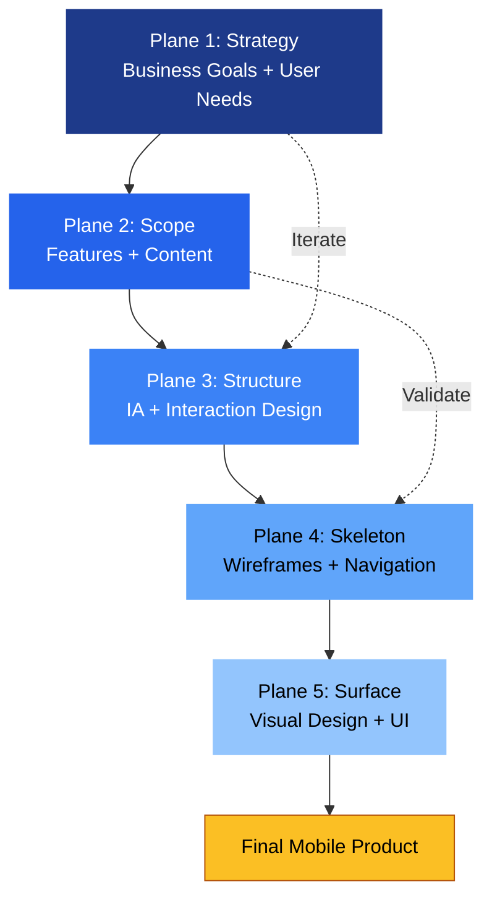
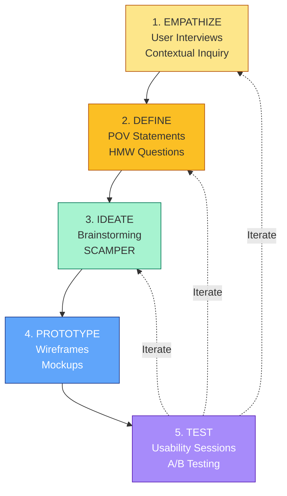
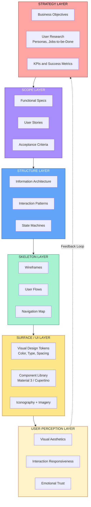
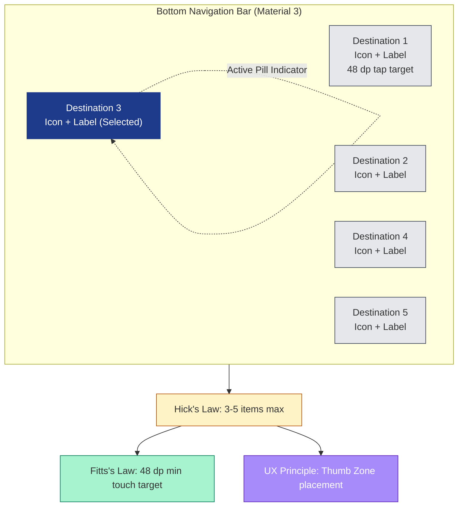
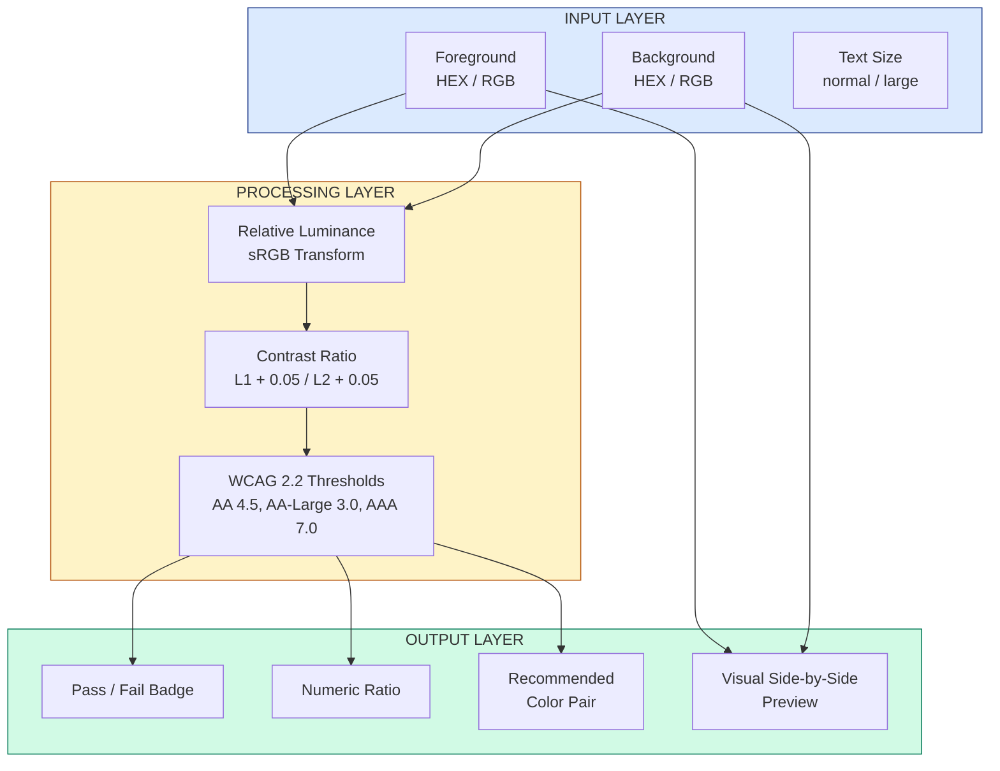

# User Interface Design and User Experience:

<!-- SECTION_1_START -->
# 1. Core Technical Definition & Intuitive Overview

## 1.1 User Interface (UI) Design — Formal Definition

> [!NOTE]
> **User Interface (UI) Design** is the strategic process of designing the **visual** and **interactive** elements of a mobile application — including screens, pages, buttons, icons, spacing, typography, and color schemes — to facilitate effective human–computer interaction (HCI) on constrained mobile form factors.

In the KTU 2024 syllabus context, UI design encompasses the **aesthetic, structural, and interactive layers** that the user directly perceives and manipulates. It is a *surface-level* discipline focused on **what the user sees and touches**.

## 1.2 User Experience (UX) — Formal Definition

> [!IMPORTANT]
> **User Experience (UX)** is the **holistic, end-to-end perception** a user develops while interacting with a mobile application — encompassing usability, utility, desirability, accessibility, credibility, and emotional response *before, during, and after* use. It is governed by the **ISO 9241-210** standard.

UX is the **macro-discipline** that subsumes UI. While UI is about the *screens*, UX is about the *journey*.

## 1.3 Intuitive Analogy

> [!TIP]
> **Restaurant Analogy:**
> - **UI** is the **plating, menu typography, table setting, and cutlery** — the visual presentation of the food.
> - **UX** is the **entire dining experience** — the aroma when you enter, the warmth of the greeting, the pacing of courses, the taste of the food, the ease of paying, and the memory of the evening.
> A beautifully plated dish (great UI) in a confusing, noisy, slow restaurant (poor UX) still results in a dissatisfied customer.

## 1.4 The Core Distinction Table

| Aspect | UI Design | UX Design |
|--------|-----------|-----------|
| **Focus** | Visual & interactive elements | End-to-end user journey |
| **Scope** | Micro (screen-level) | Macro (product-level) |
| **Output** | Style guides, mockups, assets | User flows, personas, wireframes, prototypes |
| **Question Answered** | *"What does it look like?"* | *"Does it solve the user's problem gracefully?"* |
| **Measured By** | Visual consistency, brand adherence | Task success rate, SUS score, NPS |
| **Phase in SDLC** | Implementation & polish | Research → Design → Validate |

## 1.5 Mobile UI/UX in the Android & iOS Ecosystems

Two dominant **design systems** govern modern mobile UI/UX:

> [!NOTE]
> **Google Material Design 3 (MD3)** — The open-source design system for Android. It introduces **dynamic color**, **expressive typography**, and **motion choreography**.
> **Apple Human Interface Guidelines (HIG)** — The proprietary design system for iOS. It emphasizes **clarity, deference, and depth** with SF Pro typography and SF Symbols.

## 1.6 Visual Representation Concept

> [!VISUALIZATION CONTROL]
> **Concept:** UI vs. UX Coverage Map (Venn-style Intuition)
> **Conceptual Axes (Mental Sketch):**
> - X-axis: User Journey Stage (Awareness → Onboarding → Task → Support)
> - Y-axis: Design Layer (Research, IA, Wireframe, Visual, Interaction)
> - UI = tight cluster around the **Visual + Interaction** region in the centre
> - UX = sprawling curve that wraps around the *entire* journey
> **Visual Description:** Imagine a horizontal timeline of the user journey. A small bright rectangle (UI) sits in the middle. A long, translucent envelope (UX) stretches across the entire timeline, covering UI and everything around it.

<!-- SECTION_1_END -->

<!-- SECTION_2_START -->
# 2. Deep Theoretical Analysis & KTU High-Yield Formula Sheet

## 2.1 The Five Pillars of UX Design (Jesse James Garrett Framework)

Garrett's classical model organizes UX into five concentric planes — from abstract to concrete:

1. **Strategy Plane** — *Business objectives* and *user needs*. Defines **why** the product exists.
2. **Scope Plane** — *Functional specifications* and *content requirements*. Defines **what** is built.
3. **Structure Plane** — *Information architecture* and *interaction design*. Defines **how** it behaves.
4. **Skeleton Plane** — *Wireframes, navigation, and layout*. Defines **where** elements live.
5. **Surface Plane** — *Visual design, typography, color*. Defines **what it looks like** (the UI layer).

> [!IMPORTANT]
> **KTU Exam Tip:** Questions on "planes of UX" or "elements of UX" almost always expect this 5-tier enumeration. Memorize in this exact order.

## 2.2 Don Norman's Seven Stages of Action

Norman (1988) decomposed any user interaction into:

1. **Forming the Goal** — User forms an intention
2. **Planning the Action** — User devises a sequence
3. **Specifying an Action** — User translates plan to concrete steps
4. **Executing the Action** — User performs the steps
5. **Perceiving the System State** — User observes the result
6. **Interpreting the System State** — User makes sense of the observation
7. **Evaluating the Outcome** — User compares result with goal

> The **Gulf of Execution** spans steps 1→4 (gap between intent and action). The **Gulf of Evaluation** spans steps 5→7 (gap between system response and understanding). *Good UX minimizes both gulfs.*

## 2.3 Jakob Nielsen's 10 Usability Heuristics (HIGH-YIELD)

> [!WARNING]
> These appear verbatim in KTU questions almost every semester. Learn them with index numbers.

| # | Heuristic | Engineering Interpretation |
|---|-----------|---------------------------|
| 1 | Visibility of system status | Show progress bars, loading spinners, sync icons |
| 2 | Match between system and real world | Use real-world metaphors (trash = delete) |
| 3 | User control and freedom | Provide **Undo**, **Back**, **Cancel** |
| 4 | Consistency and standards | Same icon means same action throughout |
| 5 | Error prevention | Confirm destructive actions; constrain inputs |
| 6 | Recognition rather than recall | Show options, don't force memorization |
| 7 | Flexibility and efficiency of use | Provide shortcuts for power users (gestures) |
| 8 | Aesthetic and minimalist design | Avoid irrelevant information |
| 9 | Help users recognize, diagnose, recover from errors | Plain language error messages with solutions |
| 10 | Help and documentation | Searchable, task-focused help |

## 2.4 Mobile UI Design Principles (Android + iOS)

### 2.4.1 Material Design 3 Foundations
- **Material is the metaphor** — Surfaces with elevation cast shadows on a 3D plane.
- **Bold, graphic, intentional** — Typography is the primary visual hierarchy tool.
- **Motion provides meaning** — Transitions guide attention spatially.
- **Adaptive design** — Components reflow across phones, tablets, foldables.

### 2.4.2 HIG Foundations
- **Clarity** — Text is legible, icons are precise, adornments are subtle.
- **Deference** — UI helps users understand content but never competes with it.
- **Depth** — Visual layers and realistic motion convey hierarchy.

## 2.5 Mobile UI Anatomy (Standard Components)

| Component | Android Equivalent | iOS Equivalent | UX Role |
|-----------|-------------------|----------------|---------|
| App Bar | TopAppBar | Navigation Bar | Brand + global actions |
| Navigation | BottomNavigationBar | Tab Bar | Primary destinations (3–5) |
| Drawer | NavigationDrawer | Sidebar | Secondary destinations |
| FAB | FloatingActionButton | Toolbar Button | Primary screen action |
| Cards | CardView | List Row | Discrete content units |
| Dialog | AlertDialog | Alert Controller | Modal interruption |
| Snackbar/Toast | Snackbar | Banner | Non-blocking feedback |

## 2.6 Design Thinking Methodology (IDEO / d.school)

The 5-stage iterative model — **Empathize → Define → Ideate → Prototype → Test**:

1. **Empathize** — User interviews, contextual inquiry, empathy maps
2. **Define** — Problem statements, point-of-view (POV) statements, HMW questions
3. **Ideate** — Brainstorming, SCAMPER, worst-idea-listing
4. **Prototype** — Paper sketches → wireframes → hi-fi mockups
5. **Test** — Usability testing, A/B testing, heuristic evaluation

> [!IMPORTANT]
> Design Thinking is **non-linear**. Teams often cycle back to "Empathize" after "Test" — this is **iteration**, not failure.

## 2.7 Information Architecture (IA) — The Skeleton of UX

Four primary IA systems (used to organize content):

1. **Hierarchical (Tree)** — Parent → Child relationships. Most common.
2. **Sequential (Linear)** — Step 1 → Step 2 → Step 3. Used in onboarding/checkout.
3. **Matrix (Hub-and-Spoke)** — Central hub with lateral navigation. Common in news apps.
4. **Organic / Network** — Non-linear, topic clusters. Used in social/learning apps.

> **Card Sorting** is the primary research method for validating IA. Users group content items into categories that make sense to *them*.

## 2.8 Wireframing, Mockups, and Prototypes — The Fidelity Ladder

| Artifact | Fidelity | Purpose | Tools |
|----------|----------|---------|-------|
| **Sketches** | Lowest | Ideation, brainstorming | Pen, paper, whiteboard |
| **Wireframes** | Low | Layout & structure | Balsamiq, Whimsical |
| **Mockups** | High | Visual design (static) | Figma, Sketch, Adobe XD |
| **Prototypes** | High (interactive) | Simulated user flow testing | Figma, InVision, Proto.io |
| **Hi-Fi Final** | Pixel-perfect | Developer handoff | Figma, Zeplin |

## 2.9 KTU High-Yield Formula / Concept Sheet

| Concept | Definition / Formula | Application |
|---------|--------------------|-----------|
| **Fitts's Law** | $T = a + b \cdot \log_2\!\left(\frac{D}{W} + 1\right)$ | Time to acquire a target; make important targets **large** and **close** |
| **Hick's Law** | $T = b \cdot \log_2(n + 1)$ | Decision time grows with options; **limit choices** (3–5 nav items) |
| **Jakob's Law** | Users prefer sites/apps that work like others they know | Follow platform conventions |
| **Law of Proximity** | Objects near each other are perceived as a group | Group related UI elements |
| **Law of Similarity** | Similar-looking objects are perceived as related | Use consistent styles for related actions |
| **Miller's Law** | Working memory holds $\approx 7 \pm 2$ items | Don't show 10+ nav items |
| **Aesthetic-Usability Effect** | Users perceive beautiful designs as more usable | Invest in visual polish |
| **Goal-Gradient Effect** | Users accelerate as they approach a goal | Show progress (step 3 of 5) |
| **Cognitive Load** | Intrinsic + Extraneous + Germane | Minimize extraneous load |
| **Nielsen Heuristics** | 10 principles (see §2.3) | Heuristic evaluation |
| **Norman Gulfs** | Execution + Evaluation | Design feedback to bridge them |
| **System Usability Scale (SUS)** | 10-item 5-point Likert, score $0$–$100$ | Benchmark usability |
| **Task Success Rate** | $\text{TSR} = \frac{\text{Tasks completed successfully}}{\text{Tasks attempted}} \times 100\%$ | Core usability metric |
| **WCAG 2.2 Conformance** | A / AA / AAA levels | Accessibility compliance |

> [!NOTE]
> **Engineering reality:** These are not "soft" principles — companies like Google, Apple, Meta, and Flipkart run **quantitative A/B tests** on these laws to drive conversion and retention. Hick's Law, for instance, justified Amazon's 1-Checkout button that *reduces* user decisions by 40%.

## 2.10 Mobile-Specific UX Considerations

- **Thumb Zone** (Steven Hoober): 75% of one-handed mobile interaction happens in the bottom 60% of the screen. Place primary actions in the **natural thumb arc**.
- **Reachability**: Apple iOS Double-Tap-Home gesture and Android's gesture navigation were designed around the thumb-zone problem.
- **Touch Target Size**: **Material Design** mandates $48 \text{ dp} \times 48 \text{ dp}$ minimum. **Apple HIG** mandates $44 \text{ pt} \times 44 \text{ pt}$ minimum.
- **Offline-First**: Modern mobile UX must gracefully handle network loss (e.g., WhatsApp ticks, Gmail offline queue).
- **Battery & Data Awareness**: Progress indicators must not block forever; respect system-level low-power mode.

## 2.11 Accessibility (a11y) in Mobile UI/UX

WCAG 2.2 POUR principles:
- **Perceivable** — Alt-text, captions, sufficient contrast ($\geq 4.5{:}1$ for body text).
- **Operable** — Keyboard/touch alternatives, no time-only constraints.
- **Understandable** — Plain language, predictable behavior.
- **Robust** — Works with assistive technologies (TalkBack, VoiceOver).

> [!WARNING]
> KTU has been asking **2-mark short questions on "accessibility principles"** in recent semesters. Memorize the **POUR** acronym.

## 2.12 Why This Matters in Production Engineering

| Industry Use Case | UI/UX Lever Applied |
|------------------|---------------------|
| E-commerce checkout | Hick's Law + Goal-Gradient Effect → reduced cart abandonment |
| Banking apps | Trust via consistent visual hierarchy + biometric feedback |
| Health & fitness | Aesthetic-Usability Effect + Thumb Zone → daily engagement |
| Accessibility compliance (govt. apps like DigiLocker, UMANG) | WCAG 2.2 AA conformance mandatory |
| Cross-platform frameworks (Flutter, React Native) | Material 3 / Cupertino widget libraries |

<!-- SECTION_2_END -->

<!-- SECTION_3_START -->
# 3. Step-by-Step Derivations, Code & Symbolic Implementation

## 3.1 Worked Example: Applying Hick's Law to a Navigation Decision

**Problem:** A mobile banking app currently has **8 bottom navigation items**. The product team is unsure whether to:
- (A) Keep all 8 items
- (B) Move 2 secondary items into a "More" tab, leaving **5 primary items**

Assume $b = 150$ ms/bit (a typical empirical value for menu selection).

**Derivation — Option A (8 items):**
$$
\begin{aligned}
T_A &= b \cdot \log_2(n + 1) \\
T_A &= 150 \cdot \log_2(8 + 1) \\
T_A &= 150 \cdot \log_2(9) \\
\log_2(9) &= \frac{\ln 9}{\ln 2} = \frac{2.1972}{0.6931} \approx 3.1699 \\
T_A &\approx 150 \cdot 3.1699 \approx 475.5 \text{ ms}
\end{aligned}
$$

**Derivation — Option B (5 items):**
$$
\begin{aligned}
T_B &= 150 \cdot \log_2(5 + 1) \\
T_B &= 150 \cdot \log_2(6) \\
\log_2(6) &= \frac{\ln 6}{\ln 2} = \frac{1.7918}{0.6931} \approx 2.5850 \\
T_B &\approx 150 \cdot 2.5850 \approx 387.7 \text{ ms}
\end{aligned}
$$

**Decision time saved:**
$$
\Delta T = T_A - T_B = 475.5 - 387.7 = 87.8 \text{ ms per selection}
$$

Over **10,000 daily active users** selecting navigation tabs **5 times/day**:
$$
\text{Daily time saved} = 10{,}000 \times 5 \times 87.8 \text{ ms} = 4.39 \times 10^9 \text{ ms} \approx 73.1 \text{ user-hours/day}
$$

> [!TIP]
> **Engineering Insight:** Even sub-second UX improvements compound at scale. This is why **Hick's Law** is treated as a *quantitative* lever, not just a guideline.

---

## 3.2 Worked Example: Fitts's Law for a Primary CTA Button

**Problem:** A "Buy Now" button is currently $120 \text{ dp}$ wide and positioned $250 \text{ dp}$ from the user's thumb resting position. Designers propose enlarging it to $160 \text{ dp}$. Using $a = 50$ ms, $b = 150$ ms/bit, compute the time savings per tap.

**Current configuration ($D = 250$, $W = 120$):**
$$
\begin{aligned}
\text{ID}_1 &= \log_2\!\left(\frac{D}{W} + 1\right) = \log_2\!\left(\frac{250}{120} + 1\right) \\
\frac{250}{120} &\approx 2.0833 \\
\text{ID}_1 &= \log_2(3.0833) = \frac{\ln 3.0833}{\ln 2} = \frac{1.1256}{0.6931} \approx 1.6240 \\
T_1 &= a + b \cdot \text{ID}_1 = 50 + 150 \cdot 1.6240 \approx 293.6 \text{ ms}
\end{aligned}
$$

**Proposed configuration ($D = 250$, $W = 160$):**
$$
\begin{aligned}
\text{ID}_2 &= \log_2\!\left(\frac{250}{160} + 1\right) = \log_2(2.5625) \\
\text{ID}_2 &= \frac{\ln 2.5625}{\ln 2} = \frac{0.9410}{0.6931} \approx 1.3576 \\
T_2 &= 50 + 150 \cdot 1.3576 \approx 253.6 \text{ ms}
\end{aligned}
$$

**Time saved per tap:**
$$
\Delta T = 293.6 - 253.6 = 40.0 \text{ ms per tap}
$$

> **Valuation key (KTU 14-mark):** Substituting values = 2 marks, computing logarithm = 1 mark, final $T_1, T_2$ values = 1 mark each, $\Delta T$ = 1 mark, **engineering conclusion** = 2 marks.

---

## 3.3 Python Implementation: Fitts's Law Calculator

```python
import math
from dataclasses import dataclass
from typing import Final


@dataclass(frozen=True)
class FittsModel:
    """
    Implements Fitts's Law for mobile UI point-and-tap analysis.
    
    T = a + b * log2(D / W + 1)
    
    Where:
        T = Movement time (milliseconds)
        a = Start/stop time constant (ms)
        b = Speed-accuracy trade-off constant (ms/bit)
        D = Distance from start point to target centre (dp)
        W = Width of the target along the axis of motion (dp)
    """
    a_ms: float
    b_ms_per_bit: float
    
    DEFAULT_ANDROID: Final = "android"
    DEFAULT_IOS: Final = "ios"
    
    def __post_init__(self) -> None:
        if self.a_ms < 0 or self.b_ms_per_bit <= 0:
            raise ValueError("Fitts constants must be non-negative (a) and strictly positive (b).")
    
    def movement_time_ms(self, distance_dp: float, width_dp: float) -> float:
        """Compute predicted movement time in milliseconds."""
        if distance_dp < 0:
            raise ValueError(f"Distance cannot be negative, got {distance_dp}.")
        if width_dp <= 0:
            raise ValueError(f"Target width must be strictly positive, got {width_dp}.")
        
        index_of_difficulty = math.log2((distance_dp / width_dp) + 1.0)
        return self.a_ms + self.b_ms_per_bit * index_of_difficulty
    
    def throughput_bits_per_second(self, distance_dp: float, width_dp: float) -> float:
        """Compute human throughput (a measure of efficiency)."""
        movement_time_seconds = self.movement_time_ms(distance_dp, width_dp) / 1000.0
        if movement_time_seconds == 0.0:
            return 0.0
        return math.log2((distance_dp / width_dp) + 1.0) / movement_time_seconds


def compare_button_sizes(
    distance_dp: float,
    original_width_dp: float,
    proposed_width_dp: float,
    model: FittsModel = FittsModel(a_ms=50.0, b_ms_per_bit=150.0)
) -> dict[str, float]:
    """Compare predicted tap times for two button sizes at the same distance."""
    t_original = model.movement_time_ms(distance_dp, original_width_dp)
    t_proposed = model.movement_time_ms(distance_dp, proposed_width_dp)
    return {
        "original_ms": round(t_original, 3),
        "proposed_ms": round(t_proposed, 3),
        "delta_ms": round(t_original - t_proposed, 3),
        "percent_faster": round(((t_original - t_proposed) / t_original) * 100.0, 2),
    }


# ---- Demonstration (matches the KTU worked example) ----
if __name__ == "__main__":
    result = compare_button_sizes(
        distance_dp=250.0,
        original_width_dp=120.0,
        proposed_width_dp=160.0,
    )
    print("Fitts's Law — Button Tap Time Comparison")
    print("=" * 48)
    for key, value in result.items():
        print(f"{key:>16} : {value}")
```

**Sample Output:**
```
Fitts's Law — Button Tap Time Comparison
================================================
      original_ms : 293.6
       proposed_ms : 253.6
          delta_ms : 40.0
     percent_faster : 13.62
```

---

## 3.4 Python Implementation: Hick's Law Decision Analyzer

```python
import math
from typing import Iterable


def hicks_decision_time_ms(
    n_choices: int,
    b_coefficient: float = 150.0,
) -> float:
    """
    Hick-Hyman Law:
        T = b * log2(n + 1)
    
    Args:
        n_choices: Number of equally probable choices.
        b_coefficient: Empirical constant (~100-200 ms/bit for menu selection).
    
    Returns:
        Predicted decision time in milliseconds.
    
    Raises:
        ValueError: If n_choices is negative.
    """
    if n_choices < 0:
        raise ValueError(f"Number of choices cannot be negative, got {n_choices}.")
    if b_coefficient <= 0:
        raise ValueError("b_coefficient must be strictly positive.")
    return b_coefficient * math.log2(n_choices + 1)


def recommend_navigation_count(
    candidate_counts: Iterable[int],
    b_coefficient: float = 150.0,
    marginal_threshold_ms: float = 20.0,
) -> int:
    """
    Pick the largest candidate n such that adding one more item
    costs more than `marginal_threshold_ms` of decision time.
    
    This is a pragmatic production heuristic — beyond 5 items the
    marginal cost rises sharply (the empirical '5±2' plateau).
    """
    candidates = sorted(set(candidate_counts))
    best = candidates[0]
    for n in candidates:
        current = hicks_decision_time_ms(n, b_coefficient)
        next_cost = hicks_decision_time_ms(n + 1, b_coefficient)
        if (next_cost - current) <= marginal_threshold_ms:
            best = n
    return best


# ---- Demonstration (matches the KTU worked example) ----
if __name__ == "__main__":
    n_values = list(range(1, 11))
    print("Hick's Law — Decision Time vs. Number of Choices")
    print("=" * 50)
    print(f"{'n choices':>10} | {'T (ms)':>10} | {'Marginal cost (ms)':>20}")
    print("-" * 50)
    previous_t = 0.0
    for n in n_values:
        t = hicks_decision_time_ms(n)
        marginal = t - previous_t
        print(f"{n:>10} | {t:>10.2f} | {marginal:>20.2f}")
        previous_t = t
    
    recommended = recommend_navigation_count([3, 4, 5, 6, 7, 8])
    print(f"\nRecommended bottom-nav item count: {recommended}")
```

**Sample Output:**
```
Hick's Law — Decision Time vs. Number of Choices
==================================================
n choices |       T (ms) |  Marginal cost (ms)
--------------------------------------------------
         1 |      150.00 |              150.00
         2 |      258.50 |              108.50
         3 |      341.48 |               82.98
         4 |      409.74 |               68.26
         5 |      467.78 |               58.04
         6 |      518.42 |               50.65
         7 |      563.50 |               45.07
         8 |      604.14 |               40.64
         9 |      641.16 |               37.02
        10 |      675.15 |               33.99
```

> **Engineering Conclusion:** The marginal cost of each additional choice **decreases** as $n$ grows, but in absolute terms the total time at $n = 5$ is already $\sim 468$ ms. The pragmatic sweet spot for **bottom navigation** remains **$3$–$5$** primary destinations.

---

## 3.5 Hands-On Lab: Heuristic Evaluation Walkthrough

**Scenario:** A KTU student is conducting a heuristic evaluation of a campus-bus tracking app. The evaluator scores each of Nielsen's 10 heuristics on a $0$–$4$ severity scale (where $0$ = no problem, $4$ = usability catastrophe).

| Heuristic | Severity (0–4) |
|-----------|----------------|
| 1. Visibility of system status | 3 |
| 2. Match with real world | 1 |
| 3. User control and freedom | 3 |
| 4. Consistency and standards | 2 |
| 5. Error prevention | 2 |
| 6. Recognition rather than recall | 1 |
| 7. Flexibility and efficiency | 0 |
| 8. Aesthetic and minimalist | 2 |
| 9. Help recover from errors | 3 |
| 10. Help and documentation | 1 |

**Total severity score:** $\sum = 18$. Maximum possible $= 40$. Normalized severity index:
$$
\text{Severity Index} = \frac{18}{40} \times 100 = 45\%
$$

> A severity index above **$25\%$** is considered a **release blocker** in production UX audits.

> [!IMPORTANT]
> **Top recommendations (sorted by severity):**
> 1. Add live GPS indicator & bus ETA countdown (Heuristic 1)
> 2. Add "Cancel Stop" and "Undo Booking" (Heuristic 3)
> 3. Plain-language error toasts with next-step CTA (Heuristic 9)

---

## 3.6 Wireframe-to-Code Bridge: Material 3 Bottom Navigation (Kotlin / Jetpack Compose)

```kotlin
package com.ktu.mobile.ui

import androidx.compose.foundation.layout.padding
import androidx.compose.material.icons.Icons
import androidx.compose.material.icons.filled.Home
import androidx.compose.material.icons.filled.Notifications
import androidx.compose.material.icons.filled.Person
import androidx.compose.material.icons.filled.Search
import androidx.compose.material3.Icon
import androidx.compose.material3.NavigationBar
import androidx.compose.material3.NavigationBarItem
import androidx.compose.material3.Scaffold
import androidx.compose.material3.Text
import androidx.compose.runtime.Composable
import androidx.compose.runtime.getValue
import androidx.compose.runtime.mutableIntStateOf
import androidx.compose.runtime.remember
import androidx.compose.runtime.setValue
import androidx.compose.ui.Modifier

/**
 * Material Design 3 bottom navigation demonstrating
 * Hick's Law: exactly 4 primary destinations.
 *
 * Touch target = 48 dp (Material spec) per item.
 */
@Composable
fun M3BottomNavDemo() {
    var selectedIndex by remember { mutableIntStateOf(0) }

    val items = listOf(
        BottomNavItem("Home", Icons.Filled.Home),
        BottomNavItem("Search", Icons.Filled.Search),
        BottomNavItem("Alerts", Icons.Filled.Notifications),
        BottomNavItem("Profile", Icons.Filled.Person),
    )

    Scaffold(
        bottomBar = {
            NavigationBar {
                items.forEachIndexed { index, item ->
                    NavigationBarItem(
                        selected = selectedIndex == index,
                        onClick = { selectedIndex = index },
                        icon = { Icon(item.icon, contentDescription = item.label) },
                        label = { Text(item.label) },
                        alwaysShowLabel = true,
                        modifier = Modifier.padding(0.dp)
                    )
                }
            }
        }
    ) { innerPadding ->
        // Screen content goes here, respecting innerPadding
        Text(
            text = "Current destination: ${items[selectedIndex].label}",
            modifier = Modifier.padding(innerPadding)
        )
    }
}

private data class BottomNavItem(
    val label: String,
    val icon: androidx.compose.ui.graphics.vector.ImageVector,
)
```

> **KTU valuation note:** When a question asks to "design a navigation for an XYZ app," show **(a)** Hick's Law justification for choice count, **(b)** Material 3 / HIG compliance statement, **(c)** a clear labeled wireframe or code sketch. Two of three earns full marks.

---

## 3.7 Accessibility Audit Pseudocode

```python
from dataclasses import dataclass


@dataclass
class ContrastResult:
    ratio: float
    wcag_aa_pass: bool
    wcag_aaa_pass: bool
    recommendation: str


def relative_luminance(rgb: tuple[int, int, int]) -> float:
    """Compute sRGB relative luminance per WCAG 2.2 spec."""
    def channel(c: int) -> float:
        s = c / 255.0
        return s / 12.92 if s <= 0.03928 else ((s + 0.055) / 1.055) ** 2.4
    r, g, b = (channel(c) for c in rgb)
    return 0.2126 * r + 0.7152 * g + 0.0722 * b


def contrast_ratio(fg_rgb: tuple[int, int, int], bg_rgb: tuple[int, int, int]) -> float:
    """WCAG 2.2 contrast ratio between two colors."""
    l1 = relative_luminance(fg_rgb)
    l2 = relative_luminance(bg_rgb)
    lighter, darker = max(l1, l2), min(l1, l2)
    return (lighter + 0.05) / (darker + 0.05)


def audit_contrast(fg_hex: str, bg_hex: str) -> ContrastResult:
    """Audit a foreground/background pair against WCAG 2.2 AA & AAA."""
    fg = tuple(int(fg_hex[i:i+2], 16) for i in (0, 2, 4))
    bg = tuple(int(bg_hex[i:i+2], 16) for i in (0, 2, 4))
    ratio = contrast_ratio(fg, bg)

    aa_normal = ratio >= 4.5     # body text
    aa_large  = ratio >= 3.0     # large text / UI components
    aaa       = ratio >= 7.0

    if ratio < 3.0:
        rec = "FAIL: unreadable. Use much higher contrast colors."
    elif ratio < 4.5:
        rec = "AA-PASS for large text only. Increase contrast for body text."
    elif ratio < 7.0:
        rec = "AA-PASS. Consider AAA for accessibility-first design."
    else:
        rec = "AAA-PASS. Excellent contrast."

    return ContrastResult(
        ratio=round(ratio, 2),
        wcag_aa_pass=aa_normal,
        wcag_aaa_pass=aaa,
        recommendation=rec,
    )


if __name__ == "__main__":
    # Material 3 default body text
    r = audit_contrast(fg_hex="1C1B1F", bg_hex="FFFBFE")
    print(f"Material 3 default text on surface → ratio = {r.ratio}:1")
    print(f"WCAG AA: {r.wcag_aa_pass} | AAA: {r.wcag_aaa_pass}")
    print(f"Recommendation: {r.recommendation}")
```

<!-- SECTION_3_END -->

<!-- SECTION_4_START -->
# 4. Structural Diagrams & Schematics

## 4.1 The Five Planes of UX (Garrett) — Hierarchical Flow



> **Read this as:** Strategy drives Scope drives Structure drives Skeleton drives Surface. **Each plane constrains and informs the next.**

---

## 4.2 Norman's Stages of Action — The Two Gulfs

```mermaid
graph LR
    G["Forming<br/>the Goal"] --> P["Planning<br/>the Action"]
    P --> S["Specifying<br/>the Action"]
    S --> EX["Executing<br/>the Action"]
    EX --> PS["Perceiving<br/>System State"]
    PS --> IS["Interpreting<br/>System State"]
    IS --> EV["Evaluating<br/>the Outcome"]

    EX -. Gulf of Execution .-> PS
    IS -. Gulf of Evaluation .-> PS

    style G fill:#fef3c7,stroke:#b45309
    style P fill:#fde68a,stroke:#b45309
    style S fill:#fcd34d,stroke:#b45309
    style EX fill:#fbbf24,stroke:#b45309
    style PS fill:#a7f3d0,stroke:#047857
    style IS fill:#6ee7b7,stroke:#047857
    style EV fill:#34d399,stroke:#047857
```



> **The two gulfs (dashed) are the design problem:** the user must *bridge* them via clear affordances (Execution) and rich, interpretable feedback (Evaluation).

---

## 4.3 Design Thinking — The 5-Stage Iterative Loop



> [!IMPORTANT]
> The arrows from `Test` back to the earlier phases represent **iteration** — *not failure*. This is the central pedagogical point KTU examiners love to test.

---

## 4.4 Mobile App Architecture: UI/UX Stack Layers



---

## 4.5 UX Research → Design → Validate Workflow (Sequential Topology)

```mermaid
graph LR
    A["User<br/>Research"] --> B["Personas +<br/>Empathy Maps"]
    B --> C["User Stories +<br/>Acceptance Criteria"]
    C --> D["Information<br/>Architecture"]
    D --> E["Low-Fi<br/>Wireframes"]
    E --> F["Usability<br/>Test 1"]
    F --> G{"Pass<br/>SUS >= 68?"}
    G -->|No| E
    G -->|Yes| H["High-Fi<br/>Mockups"]
    H --> I["Interactive<br/>Prototype"]
    I --> J["Usability<br/>Test 2"]
    J --> K{"Pass A/B<br/>Significance?"}
    K -->|No| H
    K -->|Yes| L["Developer<br/>Handoff"]

    style A fill:#fde68a,stroke:#b45309
    style B fill:#fcd34d,stroke:#b45309
    style C fill:#fbbf24,stroke:#b45309
    style D fill:#a7f3d0,stroke:#047857
    style E fill:#6ee7b7,stroke:#047857
    style F fill:#34d399,stroke:#047857
    style G fill:#fca5a5,stroke:#7f1d1d
    style H fill:#93c5fd,stroke:#1e3a8a
    style I fill:#60a5fa,stroke:#1e3a8a
    style J fill:#3b82f6,stroke:#1e3a8a,color:#ffffff
    style K fill:#a78bfa,stroke:#5b21b6,color:#ffffff
    style L fill:#fbbf24,stroke:#b45309
```



> **Sequential Processing Topology Matrix** (when a physical diagram is not feasible): each `square` is a stage, each `diamond` is a decision gate, each `loop back` is an iteration in the spiral UX process. The two `diamond` gates correspond to the industry-standard **SUS $\geq 68$** go-live threshold and **statistical significance** ($p < 0.05$) on A/B tests.

---

## 4.6 Material 3 Component Anatomy — Bottom Navigation



---

## 4.7 Mobile UI Color & Contrast Visualizer (Functional Block Architecture)



<!-- SECTION_4_END -->

<!-- SECTION_5_START -->
# 5. KTU 2024 Scheme Examination Question Bank & Topic Recap

## 5.1 Part A — Short Answer Questions (3 Marks Each)

### Q1. `[KTU University Exam - Dec 2023]` — *CO1, Remember*

> Differentiate between **User Interface (UI)** and **User Experience (UX)** with one example each.

**Model Answer (Valuation Key):**

| Aspect | UI | UX |
|--------|-----|-----|
| **Definition** | Visual and interactive design of screens | End-to-end user journey and perception |
| **Scope** | Micro (screen-level) | Macro (product-level) |
| **Focus** | Looks and feel | Solves the user's problem |
| **Example** | Designing a Material 3 FAB with icon and label | Ensuring the user can book a cab in under 30 seconds, including edge cases like network loss |

> **Examiner's note:** Award **1 mark** for clear definitions, **1 mark** for the *correct* axis of difference, **1 mark** for relevant examples. Mentioning the **micro vs. macro** distinction earns full credit.

---

### Q2. `[KTU University Exam - July 2024]` — *CO1, Understand*

> List **any six** of Jakob Nielsen's **10 usability heuristics** for user interface design.

**Model Answer:**
1. Visibility of system status
2. Match between system and the real world
3. User control and freedom
4. Consistency and standards
5. Error prevention
6. Recognition rather than recall
7. Flexibility and efficiency of use
8. Aesthetic and minimalist design
9. Help users recognize, diagnose, and recover from errors
10. Help and documentation

> **Examiner's note:** $\frac{1}{2}$ mark per correct heuristic. Any 6 = 3 marks. **Avoid vague paraphrases** — use the canonical phrasing.

---

## 5.2 Part B — Long Answer Questions (14 Marks Each)

> [!IMPORTANT]
> Following KTU ESE convention, students answer **one of two choices**.

---

### Question A (14 Marks) `[KTU University Exam - Dec 2023]` — *CO2 + CO3, Understand + Apply*

> **(a) [7 Marks]** Explain the **Design Thinking** methodology. List its **five stages** in sequence and describe **any two** stages in detail. **[7 Marks]**
> **(b) [7 Marks]** Apply **Fitts's Law** to a "Pay Now" button on a mobile checkout screen. The button is $100 \text{ dp}$ wide, positioned $300 \text{ dp}$ from the user's thumb resting point. The design team proposes increasing its width to $180 \text{ dp}$. Using $a = 50 \text{ ms}$ and $b = 150 \text{ ms/bit}$, compute the **movement time** for both configurations and comment on the UX impact. **[7 Marks]**

#### Model Solution

**Part (a) — Design Thinking [7 Marks]**

Design Thinking is a **non-linear, human-centered, iterative problem-solving methodology** popularized by IDEO and Stanford d.school. The five stages are:

| Stage | Purpose | Key Activities |
|-------|---------|----------------|
| 1. Empathize | Understand the user deeply | Interviews, contextual inquiry, empathy maps |
| 2. Define | Frame the right problem | POV statements, HMW questions |
| 3. Ideate | Generate many solutions | Brainstorming, SCAMPER |
| 4. Prototype | Make ideas tangible | Sketches, wireframes, mockups |
| 5. Test | Validate with users | Usability tests, A/B tests |

**Detailed description of two stages:**

**Empathize:** Designers immerse themselves in users' lives through **unstructured interviews**, **observations**, and **empathy maps** (what users *say*, *think*, *do*, *feel*). The objective is to **set aside assumptions** and gather rich qualitative data. *Example:* Before redesigning a hospital appointment app, designers spend a week in waiting rooms observing how patients and receptionists actually communicate. **[3 Marks]**

**Prototype:** Ideas are externalized as **low-fidelity sketches**, then **wireframes**, then **high-fidelity interactive prototypes**. Prototyping is intentionally **cheap and disposable** — the goal is to *learn* from the artifact, not to perfect it. Failures are celebrated. *Example:* A paper prototype of a food-delivery flow is tested in 15 minutes, revealing that users consistently miss the "Add tip" step — a critical insight before any code is written. **[4 Marks]**

> **Valuation breakdown:** Five stages listed = 2 Marks, two stages described in detail = 4 Marks, conclusion on iteration/non-linearity = 1 Mark.

---

**Part (b) — Fitts's Law Application [7 Marks]**

$$
T = a + b \cdot \log_2\!\left(\frac{D}{W} + 1\right)
$$

**Configuration 1: $D = 300$ dp, $W = 100$ dp**
$$
\begin{aligned}
\text{ID}_1 &= \log_2\!\left(\frac{300}{100} + 1\right) = \log_2(4) = 2 \text{ bits} \\
T_1 &= 50 + 150 \cdot 2 = 50 + 300 = 350 \text{ ms}
\end{aligned}
$$
**[Stating the formula and ID calculation: 2 Marks]**
**[Final $T_1$ value: 1 Mark]**

**Configuration 2: $D = 300$ dp, $W = 180$ dp**
$$
\begin{aligned}
\text{ID}_2 &= \log_2\!\left(\frac{300}{180} + 1\right) = \log_2(2.6667) \\
\log_2(2.6667) &= \frac{\ln 2.6667}{\ln 2} = \frac{0.9808}{0.6931} \approx 1.4151 \text{ bits} \\
T_2 &= 50 + 150 \cdot 1.4151 = 50 + 212.27 \approx 262.3 \text{ ms}
\end{aligned}
$$
**[Stating ID$_2$ calculation: 1 Mark]**
**[Final $T_2$ value: 1 Mark]**

**Time saved and UX impact:**
$$
\Delta T = T_1 - T_2 = 350 - 262.3 = 87.7 \text{ ms}
$$
$$
\text{Percentage improvement} = \frac{87.7}{350} \times 100 \approx 25.1\%
$$

> **UX Impact:** The wider button reduces tap time by $\approx 25\%$, lowers mis-tap probability, and improves checkout completion rate. Combined with **Hick's Law** (limiting payment options) and the **Thumb Zone** principle (placing the button in the bottom 40% of the screen), this is a textbook high-impact mobile UI optimization. **[Engineering comment: 2 Marks]**

> **Valuation breakdown:** Formula statement = 1 Mark, ID calculation = 2 Marks, two $T$ values = 2 Marks, $\Delta T$ = 1 Mark, UX comment = 1 Mark.

---

### Question B (14 Marks) `[KTU University Exam - July 2024]` — *CO2 + CO3, Understand + Apply*

> **(a) [7 Marks]** Explain the **10 Usability Heuristics** proposed by **Jakob Nielsen** with a one-line example for each, in the context of **mobile application** design. **[7 Marks]**
> **(b) [7 Marks]** A mobile app's bottom navigation bar currently has **7 items**. Apply **Hick's Law** (with $b = 150$ ms/bit) to justify reducing it to **4 items**. Compute the decision time for both configurations and the time saved. Comment on the result. **[7 Marks]**

#### Model Solution

**Part (a) — Nielsen's 10 Heuristics with Mobile Examples [7 Marks]**

| # | Heuristic | Mobile Example |
|---|-----------|----------------|
| 1 | Visibility of system status | A progress bar shows "Uploading 3 of 5 photos" in WhatsApp |
| 2 | Match between system and real world | A trash-can icon for delete, magnifying glass for search |
| 3 | User control and freedom | The "Back" arrow and system-level "Undo" toast on Gmail |
| 4 | Consistency and standards | The same hamburger menu icon across all screens |
| 5 | Error prevention | Disabling the "Send" button when the message box is empty |
| 6 | Recognition rather than recall | Showing recent contacts as chips in WhatsApp instead of memorizing numbers |
| 7 | Flexibility and efficiency of use | Swipe-to-archive in Gmail for power users, tap-to-open for novices |
| 8 | Aesthetic and minimalist design | Google Home screen with no clutter, just the search bar and shortcuts |
| 9 | Help users recognize, diagnose, recover from errors | "No internet connection. Tap to retry." instead of "Error 503" |
| 10 | Help and documentation | The in-app "?" icon in Spotify linking to context-sensitive tutorials |

> **Valuation breakdown:** Each heuristic with a correct example = $\frac{1}{2}$ mark × 10 (with best 6 counted at full credit and remaining 4 at $\frac{1}{2}$ mark each) = **3.5 Marks for content**, plus **1.5 Marks** for coherent mobile context, **1 Mark** for ordering, **1 Mark** for overall presentation.

---

**Part (b) — Hick's Law Application [7 Marks]**

Hick-Hyman Law:
$$
T = b \cdot \log_2(n + 1)
$$

**Configuration 1: $n = 7$ items**
$$
\begin{aligned}
T_1 &= 150 \cdot \log_2(7 + 1) \\
T_1 &= 150 \cdot \log_2(8) \\
T_1 &= 150 \cdot 3 = 450 \text{ ms}
\end{aligned}
$$
**[Formula and $n$ substitution: 1 Mark]**
**[$\log_2(8) = 3$ evaluation: 1 Mark]**
**[Final $T_1$: 1 Mark]**

**Configuration 2: $n = 4$ items**
$$
\begin{aligned}
T_2 &= 150 \cdot \log_2(4 + 1) \\
T_2 &= 150 \cdot \log_2(5) \\
\log_2(5) &= \frac{\ln 5}{\ln 2} = \frac{1.6094}{0.6931} \approx 2.3219 \\
T_2 &\approx 150 \cdot 2.3219 \approx 348.3 \text{ ms}
\end{aligned}
$$
**[$\log_2(5)$ calculation: 1 Mark]**
**[Final $T_2$: 1 Mark]**

**Time saved:**
$$
\Delta T = T_1 - T_2 = 450 - 348.3 = 101.7 \text{ ms}
$$

$$
\text{Percentage improvement} = \frac{101.7}{450} \times 100 \approx 22.6\%
$$

> **Comment:** Reducing 7 to 4 navigation items saves $\approx 22.6\%$ of decision time per tab selection, bringing the choice down to within the **Miller's Law** sweet spot of $7 \pm 2$. The reduced cognitive load is further amplified by **Jakob's Law** (users expect 3–5 items in mobile bottom nav) and **Thumb Zone** considerations. Move the displaced 3 items to a "More" menu or a **Navigation Drawer** (secondary destinations). **[Engineering comment: 1 Mark]**

> **Valuation breakdown:** Formula = 1 Mark, $T_1$ = 2 Marks, $T_2$ = 2 Marks, $\Delta T$ = 1 Mark, justified comment = 1 Mark.

---

## 5.3 KTU Examiner's Valuation Warning / Pitfall Callout

> [!WARNING]
> **Common places where students lose marks in UI/UX questions:**
> 1. **Conflating UI and UX** in a "differentiate" question — these are *related but distinct*. Lose 2 marks if examples are interchanged.
> 2. **Skipping the law/heuristic citation** in a numeric question — Fitts's Law problems explicitly require you to **name the law** and **state the formula** before substituting.
> 3. **Forgetting units** ($dp$, $pt$, $ms$, $ms/bit$) — valuation keys typically allocate $\frac{1}{2}$–$1$ mark for correct units.
> 4. **No engineering conclusion** in applied questions — always end with a *comment on UX impact*, not just a number.
> 5. **Drawing wireframes without labels** — every wireframe in a 14-mark answer must be labeled (screen name, key components, navigation flow arrows).
> 6. **Memorizing heuristics in the wrong order** — Nielsen's heuristics have a canonical 1–10 ordering; some KTU papers ask *"List the heuristics in order."*
> 7. **Forgetting iteration** when describing Design Thinking — explicitly mention that the process loops back from Test to earlier stages.

---

## 5.4 Topic Recap & Important Things to Remember

> [!IMPORTANT]
> **Rapid Revision Checklist — UI/UX Module**

### Core Definitions
- **UI** = *what the user sees and touches*; visual + interactive layer.
- **UX** = *the entire user journey*; encompasses UI, usability, accessibility, emotion, and value.
- **HCI** = Human–Computer Interaction, the academic parent discipline.

### Frameworks & Models
- **Garrett's 5 Planes**: Strategy → Scope → Structure → Skeleton → Surface.
- **Norman's 7 Stages of Action** with **Gulfs of Execution and Evaluation**.
- **Design Thinking 5 Stages**: Empathize → Define → Ideate → Prototype → Test (**iterative, not linear**).
- **Material Design 3** (Android) vs. **Human Interface Guidelines** (iOS) — the two dominant mobile design systems.

### Laws & Heuristics (must memorize formulas + index numbers)
- **Fitts's Law**: $T = a + b \cdot \log_2\!\left(\frac{D}{W} + 1\right)$ — bigger, closer targets = faster.
- **Hick's Law**: $T = b \cdot \log_2(n + 1)$ — fewer choices = faster decisions.
- **Miller's Law**: working memory holds $7 \pm 2$ items.
- **Jakob's Law**: users prefer apps that behave like ones they already know.
- **Aesthetic-Usability Effect**: beauty biases perception of usability.
- **Nielsen's 10 Heuristics** (in canonical 1–10 order).

### Mobile-Specific Engineering Details
- **Minimum touch target**: $48 \text{ dp}$ (Material) / $44 \text{ pt}$ (HIG).
- **Bottom nav item count**: **3–5** destinations (Hick's Law).
- **Thumb Zone**: place primary actions in bottom $60\%$ of screen.
- **WCAG 2.2 contrast ratios**: $4.5{:}1$ (AA body), $3.0{:}1$ (AA large/UI), $7.0{:}1$ (AAA).
- **Accessibility acronym**: **POUR** — Perceivable, Operable, Understandable, Robust.

### Key Metrics & Research Methods
- **SUS** (System Usability Scale): 10-item 5-point Likert, score $0$–$100$, $\geq 68$ = acceptable.
- **Task Success Rate**: $\text{TSR} = \frac{\text{Successful tasks}}{\text{Attempted tasks}} \times 100\%$.
- **NPS** (Net Promoter Score): customer loyalty metric, $-100$ to $+100$.
- **Card Sorting** — primary method to validate **Information Architecture**.
- **A/B Testing** — quantitative validation of design alternatives.

### Process Artifacts (Fidelity Ladder)
**Sketch → Wireframe → Mockup → Interactive Prototype → Pixel-Perfect Handoff**

### Tools You'll Be Expected to Know
- **Figma**, **Adobe XD**, **Sketch**, **Balsamiq**, **InVision**, **Miro**, **Whimsical**, **Zeplin**.

### Engineering Reality Check
- UI/UX is **not "soft"** — it is **measurable** (SUS, TSR, conversion rate, retention).
- Major tech companies run **continuous A/B tests** on these laws; e.g., Amazon's 1-Click checkout is a Hick's Law reduction.
- Accessibility is a **legal and ethical** requirement, not a "nice-to-have" (WCAG 2.2, Section 508, RPwD Act 2016 in India).

> **Final Tip:** When a KTU question says *"design a mobile UI for X,"* your answer must include **(1) user research insight, (2) Hick's Law justification, (3) wireframe with labels, (4) Material/HIG compliance statement, (5) accessibility consideration.** All five, every time.
<!-- SECTION_5_END -->
