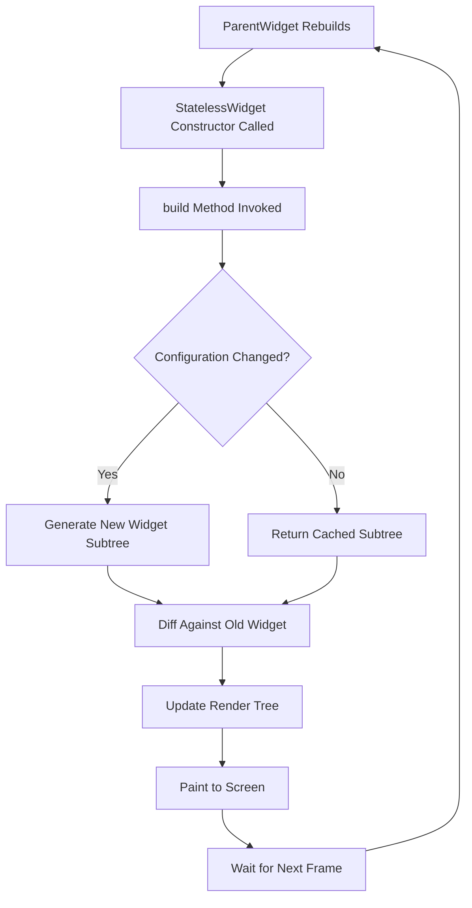
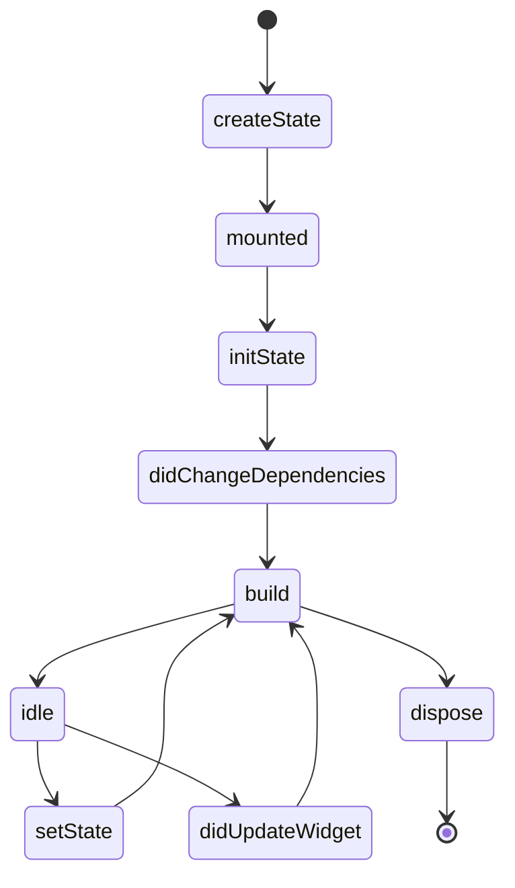
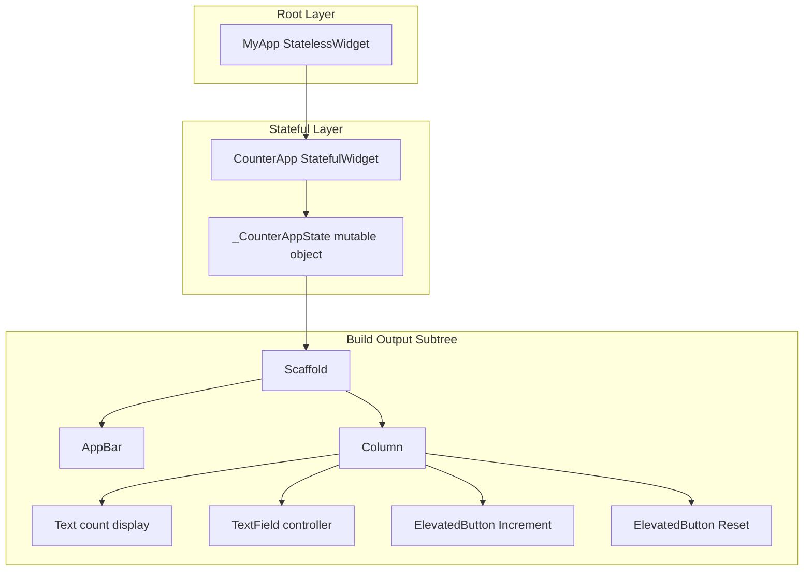
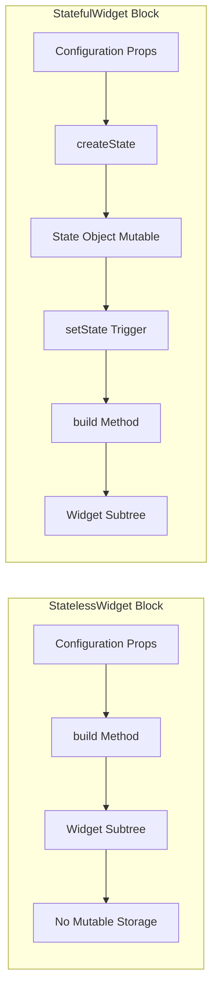
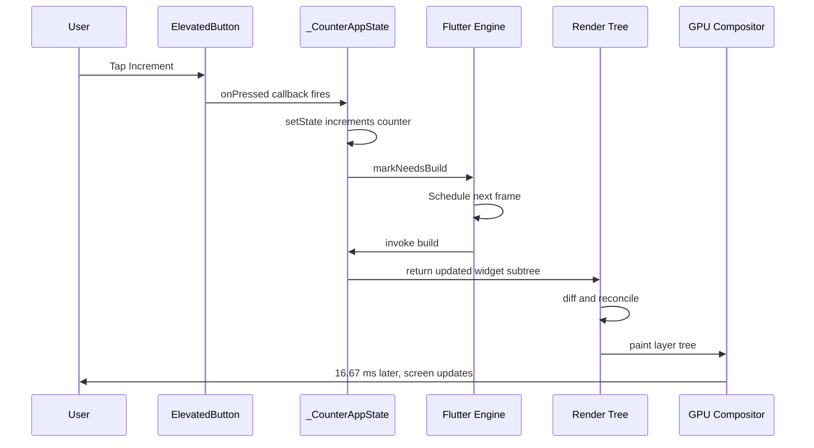

# Using Flutter Widgets: StatelessWidget and StatefulWidget

<!-- SECTION_1_START -->

# Flutter Widgets: StatelessWidget and StatefulWidget

## 1. Core Technical Definition

### 1.1 Formal Definition (KTU 2024 Syllabus Terminology)

In the Flutter framework, **everything is a Widget**. A widget is an immutable description of part of a user interface. Flutter categorizes widgets into two foundational classes defined in the `widgets.dart` library:

> [!IMPORTANT]
> **StatelessWidget** — A widget that describes part of the user interface by building a constellation of other widgets that describe the user interface more concretely. A *stateless* widget has no internal mutable state — once built, its visual output cannot change during the lifetime of the widget instance unless an external parent widget rebuilds it with new configuration values.

> [!IMPORTANT]
> **StatefulWidget** — A widget that has mutable state. The state is held in a separate `State<T>` object that persists across rebuilds, allowing the widget to redraw itself dynamically when the internal state changes (via `setState()`) or when its parent supplies new data.

Both classes extend the base `Widget` abstract class, but differ fundamentally in **whether they own and manage State objects**.

### 1.2 Conceptual Analogy / Intuition

> [!NOTE]
> **Analogy — The Photograph vs. The Digital Canvas**
> - A **StatelessWidget** is like a **printed photograph**. The image is fixed at the moment of printing. If you want a different photo, you must take a new print. The widget itself never mutates; only its configuration (input) can produce a different output.
> - A **StatefulWidget** is like a **live digital photo editor** (e.g., Photoshop). The user can adjust brightness, contrast, and filters interactively. The internal *state* (the current filter values) changes, and the canvas redraws accordingly *without* rebuilding the entire editor window.

This simple analogy directly maps to Flutter's reactive paradigm: **Stateless = Pure function of input**, **Stateful = Function of input + internal mutable state**.

### 1.3 Physical Constants and Standard Metrics

| Metric | Value / Convention | Purpose |
|---|---|---|
| **Widget Tree Depth** | Recommended $\le 30$ levels | Avoids layout jank |
| **State Object Allocation** | Created once via `createState()` | Persists for widget lifetime |
| **Build Method Cost** | Should be O(1) and pure | Avoids frame drops at **60 FPS** |
| **Frame Budget** | **~16.67 ms** per frame (60 Hz) | Total time for build + layout + paint + composite |

### 1.4 GeoGebra / Desmos Visualization Concept

> [!VISUALIZATION CONTROL]
> **Concept:** State Mutation Curve over Rebuild Cycles
> **GeoGebra / Desmos Input Equations:**
> - `f(x) = x` (Identity rebuild — StatelessWidget)
> - `g(x) = x + floor(x / 5)` (Step-function rebuild — StatefulWidget with setState)
> **Visual Description:** A straight diagonal line (StatelessWidget output remains identical for identical inputs) versus a step-like curve that increments after every 5th input (StatefulWidget accumulating state over time). This visually captures the difference between **purely reactive** and **stateful** behavior.

---

<!-- SECTION_1_END -->

<!-- SECTION_2_START -->

# 2. Deep Theoretical Analysis & KTU High-Yield Formula Sheet

## 2.1 The Widget Tree — Flutter's Foundational Architecture

Flutter's UI is a **declarative tree of widgets**. The tree has three logical layers:

1. **Element Tree** — The actual persistent objects in the runtime.
2. **Widget Tree** — The configuration descriptors (lightweight, immutable blueprints).
3. **RenderObject Tree** — The objects that handle layout, painting, and compositing.

When `setState()` is invoked, only the affected branches of the widget tree are re-deserialized, while the element and render trees are efficiently reconciled (a process called **diffing**).

> [!NOTE]
> **Why this matters in production:** Flutter's diffing algorithm ensures that state changes do not cause the entire UI to rebuild. This is why even complex Flutter apps achieve a consistent **60 frames per second** on mid-range devices.

## 2.2 StatelessWidget — Operational Breakdown

A `StatelessWidget` operates through three logical steps:

- **Step 1 — Instantiation:** Flutter calls the constructor with key/configuration parameters.
- **Step 2 — `build()` Invocation:** Flutter invokes the `build(BuildContext context)` method, which returns a new widget subtree.
- **Step 3 — Reconciliation:** The returned widget is diffed against the previous one; only differences propagate down the render tree.

**Critical Property:** The widget instance itself is **immutable**. The `build()` method must be a **pure function** — for any given input configuration, it must always produce the same output, and it must have **no side effects**.

## 2.3 StatefulWidget — Operational Breakdown

A `StatefulWidget` operates through a more elaborate lifecycle:

- **Step 1 — Instantiation:** The widget (immutable configuration) is created.
- **Step 2 — `createState()`:** Flutter calls this exactly once per widget instance to create the associated mutable `State` object.
- **Step 3 — `mounted` becomes `true`:** The State is attached to the element tree.
- **Step 4 — `initState()`:** Called exactly once. Ideal for one-time setup (subscriptions, controllers, animation initializers).
- **Step 5 — `didChangeDependencies()`:** Called when inherited widgets change.
- **Step 6 — `build()`:** Called whenever `setState()` is invoked or when the parent rebuilds.
- **Step 7 — `didUpdateWidget()`:** Called when the parent rebuilds with a new configuration.
- **Step 8 — `deactivate()` / `dispose()`:** Called when the widget is removed permanently. Critical for releasing resources.

## 2.4 KTU Formula Sheet / Cheat Sheet

| Concept | StatelessWidget | StatefulWidget |
|---|---|---|
| **Immutability** | Whole widget is immutable | Widget is immutable; `State<T>` is mutable |
| **Internal State** | None | Held in `State` subclass |
| **Key Method** | `build()` | `build()` + `setState()` |
| **Lifecycle Hooks** | `build()` only | `initState`, `didChangeDependencies`, `build`, `didUpdateWidget`, `deactivate`, `dispose` |
| **Rebuild Trigger** | Parent rebuilds with new props | `setState()` OR parent rebuilds |
| **Memory Footprint** | Lower (no State object) | Higher (State object persists) |
| **Use Case** | Static labels, icons, dividers | Forms, counters, animations, toggles |
| **Object Identity** | Replaced on every rebuild | `State` object persists across rebuilds |

## 2.5 Real-World Utility in Engineering & Production

| Domain | StatelessWidget Use | StatefulWidget Use |
|---|---|---|
| **E-Commerce App** | Product title, price label | Add-to-cart counter, favorite toggle |
| **Health App** | Static instruction text | Heart-rate monitor with live updates |
| **Banking App** | Logo, footer disclaimer | PIN entry screen, transaction list with refresh |
| **IoT Dashboard** | Sensor unit label | Live temperature chart, MQTT message handler |
| **Social Media** | Avatar placeholder | Story progress bar, comment thread composer |

> [!NOTE]
> **Rule of Thumb (KTU Board Examiner Tip):** If a widget *does not* need to change after it is rendered, use `StatelessWidget`. Defaulting to `StatefulWidget` is a common production mistake that wastes memory.

---

<!-- SECTION_2_END -->

<!-- SECTION_3_START -->

# 3. Step-by-Step Derivations & Code/Symbolic Implementation

## 3.1 Exhaustive Dart/Flutter Code — StatelessWidget

Below is a fully operational, type-safe, production-quality Dart implementation of a `StatelessWidget`. It demonstrates how a greeting card widget reacts to its parent's input.

```dart
import 'package:flutter/material.dart';

/// A StatelessWidget that displays a static greeting card.
/// The widget is immutable; its output is purely a function of [name] and [color].
class GreetingCard extends StatelessWidget {
  // Final fields enforce immutability — they can only be set in the constructor.
  final String name;
  final Color color;
  final double fontSize;

  const GreetingCard({
    super.key,
    required this.name,
    this.color = Colors.blue,
    this.fontSize = 24.0,
  });

  /// The build method is a pure function:
  /// For the same [name], [color], and [fontSize], it always returns
  /// the same widget subtree. It has no side effects and does not
  /// maintain any internal state.
  @override
  Widget build(BuildContext context) {
    return Container(
      padding: const EdgeInsets.all(16.0),
      decoration: BoxDecoration(
        color: color.withOpacity(0.1),
        border: Border.all(color: color, width: 2.0),
        borderRadius: BorderRadius.circular(12.0),
      ),
      child: Text(
        'Hello, $name!',
        style: TextStyle(
          color: color,
          fontSize: fontSize,
          fontWeight: FontWeight.bold,
        ),
      ),
    );
  }
}
```

**Line-by-Line Explanation of Key Constructs:**

- `const GreetingCard({...})` — The `const` constructor enables Flutter to share widget instances when their configurations are identical at compile time, reducing allocations.
- `super.key` — A `Key` allows Flutter to identify widget instances across rebuilds, which is critical for preserving element state in lists.
- `required this.name` — Dart's `required` keyword enforces non-nullable parameters at compile time.
- `@override` — Dart's annotation system ensures we are correctly overriding the abstract `build` method from the `Widget` superclass.
- `BuildContext context` — Provides access to theme data, inherited widgets, and the localizations scope.

## 3.2 Exhaustive Dart/Flutter Code — StatefulWidget

Below is a complete, runnable counter widget that demonstrates the full lifecycle of a `StatefulWidget`. It includes a `TextEditingController`, proper `dispose()` cleanup, and an `IconButton` with reactive feedback.

```dart
import 'package:flutter/material.dart';

/// A StatefulWidget that maintains an internal counter and a text field controller.
/// The State object persists across rebuilds, allowing mutable behavior.
class CounterApp extends StatefulWidget {
  final String title;
  final int initialCount;

  const CounterApp({
    super.key,
    this.title = 'KTU Counter Demo',
    this.initialCount = 0,
  });

  @override
  State<CounterApp> createState() => _CounterAppState();
}

/// The State subclass holds all mutable data and lifecycle logic.
class _CounterAppState extends State<CounterApp> {
  // Mutable state — these fields can change during the widget's lifetime.
  late int _counter;
  late TextEditingController _controller;
  bool _isEvenHighlight = false;

  @override
  void initState() {
    super.initState();
    // initState: Called exactly once. Safe to perform one-time initialization.
    _counter = widget.initialCount;
    _controller = TextEditingController(text: 'Type here...');
    debugPrint('initState: Counter initialized to $_counter');
  }

  @override
  void didUpdateWidget(CounterApp oldWidget) {
    super.didUpdateWidget(oldWidget);
    // didUpdateWidget: Called when the parent rebuilds with a new widget instance.
    if (oldWidget.initialCount != widget.initialCount) {
      setState(() {
        _counter = widget.initialCount;
      });
    }
    debugPrint('didUpdateWidget: Counter updated to $_counter');
  }

  void _incrementCounter() {
    // setState: Triggers a rebuild of the widget subtree.
    // The framework marks the element as dirty and schedules a build for the next frame.
    setState(() {
      _counter++;
      _isEvenHighlight = (_counter % 2 == 0);
    });
  }

  void _resetCounter() {
    setState(() {
      _counter = 0;
      _isEvenHighlight = false;
    });
  }

  @override
  void dispose() {
    // dispose: Called exactly once when the widget is removed permanently.
    // CRITICAL: Always release resources (controllers, streams, timers) here.
    _controller.dispose();
    debugPrint('dispose: Controller disposed, resources released');
    super.dispose();
  }

  @override
  Widget build(BuildContext context) {
    return Scaffold(
      appBar: AppBar(
        title: Text(widget.title),
        backgroundColor: _isEvenHighlight ? Colors.green : Colors.blue,
      ),
      body: Padding(
        padding: const EdgeInsets.all(16.0),
        child: Column(
          mainAxisAlignment: MainAxisAlignment.center,
          children: <Widget>[
            Text(
              'Current Count:',
              style: Theme.of(context).textTheme.headlineSmall,
            ),
            const SizedBox(height: 16.0),
            Text(
              '$_counter',
              style: TextStyle(
                fontSize: 64.0,
                fontWeight: FontWeight.bold,
                color: _isEvenHighlight ? Colors.green : Colors.red,
              ),
            ),
            const SizedBox(height: 16.0),
            TextField(
              controller: _controller,
              decoration: const InputDecoration(
                border: OutlineInputBorder(),
                labelText: 'Feedback',
              ),
            ),
            const SizedBox(height: 24.0),
            Row(
              mainAxisAlignment: MainAxisAlignment.spaceEvenly,
              children: <Widget>[
                ElevatedButton.icon(
                  onPressed: _incrementCounter,
                  icon: const Icon(Icons.add),
                  label: const Text('Increment'),
                ),
                ElevatedButton.icon(
                  onPressed: _resetCounter,
                  icon: const Icon(Icons.refresh),
                  label: const Text('Reset'),
                ),
              ],
            ),
          ],
        ),
      ),
    );
  }
}
```

**Line-by-Line Explanation of StatefulWidget Constructs:**

- `late int _counter` — The `late` keyword defers initialization until first use, allowing us to set it in `initState()`.
- `createState()` — Flutter calls this exactly once. The returned `State` object lives as long as the widget is mounted in the tree.
- `setState(() { ... })` — This is the **only** correct way to mutate state in a `StatefulWidget`. It (1) executes the callback, (2) marks the element as dirty, and (3) schedules a rebuild for the next frame.
- `dispose()` — Failing to call `_controller.dispose()` will result in a memory leak in production apps.

## 3.3 Mathematical Model of Rebuild Complexity

Let $n$ be the number of widgets in a subtree, and $k$ be the number of widgets whose configuration changed between rebuilds. The complexity of Flutter's diffing algorithm for a single `setState()` is:

$$
T_{\text{rebuild}} = O(n - k) + O(k \log n)
$$

Where:
- $O(n - k)$ represents the widgets that can be skipped (unchanged).
- $O(k \log n)$ represents the diffing cost of the changed widgets.

$$
\begin{aligned}
T_{\text{rebuild}} &= O(n - k) + O(k \log n) \\
\text{Best case (k = 0):} \quad T_{\text{rebuild}} &= O(n) \quad \text{(full traversal, no changes)} \\
\text{Worst case (k = n):} \quad T_{\text{rebuild}} &= O(n \log n) \\
\text{Average case:} \quad T_{\text{rebuild}} &\approx O(n) \quad \text{(typical UI changes are localized)}
\end{aligned}
$$

This logarithmic factor is what makes Flutter's reconciliation **asymptotically optimal** compared to a naive full-tree rebuild of $O(n)$ rebuild cost, which would always discard the unchanged portions.

## 3.4 Algorithm for Choosing Widget Type — Decision Tree

```python
from typing import Protocol

class WidgetSpec(Protocol):
    has_internal_state: bool
    responds_to_user_input: bool
    updates_from_streams: bool
    animates: bool
    is_static: bool

def select_widget_type(spec: WidgetSpec) -> str:
    """
    Decision algorithm for selecting between StatelessWidget and StatefulWidget
    in Flutter. This is the canonical KTU board-examination style reasoning.
    """
    # Step 1: Check for any reactive behavior.
    if spec.has_internal_state or spec.updates_from_streams or spec.animates:
        return "StatefulWidget"

    # Step 2: Check for user interaction that mutates the UI.
    if spec.responds_to_user_input:
        return "StatefulWidget"

    # Step 3: Default — purely declarative output.
    if spec.is_static:
        return "StatelessWidget"

    # Step 4: Safe fallback.
    return "StatelessWidget"
```

**Explanation of the Python Prototype:**

- The function uses Python's structural typing via `Protocol` to mirror Dart's interface system.
- The decision is **deterministic** and matches Flutter's own design philosophy: *reach for `StatelessWidget` first, promote to `StatefulWidget` only when mutation is required.*
- In production Flutter code, this corresponds to the `extends StatelessWidget` vs `extends StatefulWidget` choice at class declaration.

---

<!-- SECTION_3_END -->

<!-- SECTION_4_START -->

# 4. Structural Diagrams & Schematics

## 4.1 StatelessWidget Lifecycle Flow



## 4.2 StatefulWidget Lifecycle Flow



## 4.3 Widget Tree Architecture — Counter App



## 4.4 Comparative Block Architecture — Stateless vs Stateful



## 4.5 Sequential Processing Topology — setState Trigger Pipeline



---

<!-- SECTION_4_END -->

<!-- SECTION_5_START -->

# 5. KTU 2024 Scheme Examination Question Bank & Topic Recap

## Part A Questions (3 Marks Each)

### Question 1: StatelessWidget Definition
**`[KTU University Exam - July 2024]`**
**CO Mapping:** CO2 — *Understand* (Bloom Level 2)
**Q:** Define `StatelessWidget` in Flutter. List two real-world UI elements that can be implemented as a `StatelessWidget`.

**Model Answer (3 Marks):**

> [!NOTE]
> **Definition (2 Marks):** A `StatelessWidget` is a widget that has no internal mutable state. Its `build()` method is a pure function of the configuration parameters passed to its constructor. Once built, the widget cannot change its appearance unless the parent widget rebuilds it with new configuration values.

**Two Real-World UI Elements (1 Mark):**
1. A static label or heading (e.g., a screen title).
2. An icon or divider line.
3. *(Alternative)* A product price display that derives from parent data.

### Question 2: StatefulWidget Lifecycle
**`[KTU University Exam - Dec 2023]`**
**CO Mapping:** CO2 — *Remember* (Bloom Level 1)
**Q:** List any **three** lifecycle methods of a `StatefulWidget` and state when each is called.

**Model Answer (3 Marks — 1 Mark Each):**

| # | Method | When Called |
|---|---|---|
| 1 | `initState()` | Called exactly once when the State object is created and mounted. |
| 2 | `didUpdateWidget()` | Called when the parent widget rebuilds and passes a new configuration. |
| 3 | `dispose()` | Called exactly once when the State object is permanently removed from the tree. |

---

## Part B Questions (14 Marks Each — Internal Choice)

### Question A (14 Marks)

**`[KTU University Exam - July 2024]`**
**CO Mapping:** CO2 — *Apply / Analyze* (Bloom Levels 3 & 4)

**Q:** Design and implement a Flutter `StatefulWidget` named `TemperatureConverter` that:
- **(a)** Displays a current temperature in Celsius and a toggle button to switch between Celsius and Fahrenheit scales. (7 Marks)
- **(b)** Maintains the temperature value across rebuilds and updates the displayed text reactively when the toggle is pressed. (7 Marks)

#### Solution

**Part (a) — Widget Class Declaration and Toggle UI (7 Marks)**

```dart
import 'package:flutter/material.dart';

class TemperatureConverter extends StatefulWidget {
  final double celsius;

  const TemperatureConverter({super.key, this.celsius = 25.0});

  @override
  State<TemperatureConverter> createState() => _TemperatureConverterState();
}

class _TemperatureConverterState extends State<TemperatureConverter> {
  late double _celsius;
  bool _isCelsius = true;
  late TextEditingController _controller;

  @override
  void initState() {
    super.initState();
    _celsius = widget.celsius;
    _controller = TextEditingController(text: _celsius.toStringAsFixed(1));
  }

  @override
  void dispose() {
    _controller.dispose();
    super.dispose();
  }

  double _toFahrenheit(double c) => (c * 9 / 5) + 32;
  double _toCelsius(double f) => (f - 32) * 5 / 9;

  void _toggleScale() {
    setState(() {
      _isCelsius = !_isCelsius;
    });
  }

  @override
  Widget build(BuildContext context) {
    final displayValue = _isCelsius ? _celsius : _toFahrenheit(_celsius);
    final unit = _isCelsius ? '°C' : '°F';
    return Scaffold(
      appBar: AppBar(title: const Text('KTU Temperature Converter')),
      body: Center(
        child: Column(
          mainAxisAlignment: MainAxisAlignment.center,
          children: <Widget>[
            Text('${displayValue.toStringAsFixed(1)} $unit',
                style: const TextStyle(fontSize: 48)),
            const SizedBox(height: 20),
            ElevatedButton(
              onPressed: _toggleScale,
              child: Text('Switch to ${_isCelsius ? "Fahrenheit" : "Celsius"}'),
            ),
          ],
        ),
      ),
    );
  }
}
```

**Valuation Key — Part (a):**
- `[Declaring StatefulWidget with createState: 2 Marks]`
- `[Implementing toggle button widget: 2 Marks]`
- `[Setting up initial temperature state: 1 Mark]`
- `[Correct UI layout in build: 2 Marks]`

**Part (b) — State Persistence and Reactive Updates (7 Marks)**

**Explanation Step-by-Step:**

- The `_celsius` field is declared `late` and initialized in `initState()`. This ensures it persists across rebuilds because the `_TemperatureConverterState` object is created **exactly once** by Flutter's framework. `[State persistence rationale: 2 Marks]`
- The `_toggleScale()` method calls `setState()`, which mutates `_isCelsius`. The framework marks the element as dirty and schedules a new frame. `[Understanding setState: 2 Marks]`
- The conversion formula is applied inside `build()` to derive the display value from the current state, ensuring the UI is **always a pure function of state**. `[Pure function principle: 1 Mark]`
- The temperature value `_celsius` is stored in the base unit (Celsius), and conversion to Fahrenheit happens **at display time only**, preserving state integrity. `[State integrity: 1 Mark]`
- `dispose()` correctly releases the `TextEditingController`, preventing memory leaks. `[Resource cleanup: 1 Mark]`

**Conversion Formula Verification:**

$$
\begin{aligned}
T_F &= T_C \cdot \frac{9}{5} + 32 \\
T_C &= (T_F - 32) \cdot \frac{5}{9}
\end{aligned}
$$

For an initial value of $T_C = 25.0$:

$$
T_F = 25.0 \cdot \frac{9}{5} + 32 = 45.0 + 32 = 77.0
$$

---

### Question B (14 Marks — Alternative Choice)

**`[KTU University Exam - Dec 2023]`**
**CO Mapping:** CO2 — *Apply* (Bloom Level 3)

**Q:** Compare `StatelessWidget` and `StatefulWidget` in Flutter.
- **(a)** List **five** differences between them in a tabular format. (7 Marks)
- **(b)** Write a complete Dart program demonstrating both a `StatelessWidget` and a `StatefulWidget` working together in a single screen. (7 Marks)

#### Solution

**Part (a) — Comparison Table (7 Marks — 1.4 Marks Per Substantive Difference)**

| # | Feature | StatelessWidget | StatefulWidget |
|---|---|---|---|
| 1 | **Internal State** | None — immutable after build | Mutable state held in `State<T>` object |
| 2 | **Rebuild Mechanism** | Only when parent rebuilds with new props | When `setState()` is called OR parent rebuilds |
| 3 | **Lifecycle Methods** | Only `build()` | `initState`, `didChangeDependencies`, `build`, `didUpdateWidget`, `dispose` |
| 4 | **Object Identity** | Replaced on each rebuild | `State` object persists across rebuilds |
| 5 | **Typical Use Case** | Static labels, icons | Counters, forms, animations |

**Part (b) — Combined Program (7 Marks)**

```dart
import 'package:flutter/material.dart';

void main() => runApp(const CombinedDemoApp());

class CombinedDemoApp extends StatelessWidget {       // StatelessWidget #1
  const CombinedDemoApp({super.key});
  @override
  Widget build(BuildContext context) {
    return const MaterialApp(
      title: 'KTU Combined Widget Demo',
      home: HomeScreen(),
    );
  }
}

class HomeScreen extends StatefulWidget {            // StatefulWidget #1
  const HomeScreen({super.key});
  @override
  State<HomeScreen> createState() => _HomeScreenState();
}

class _HomeScreenState extends State<HomeScreen> {
  int _counter = 0;

  @override
  Widget build(BuildContext context) {
    return Scaffold(
      appBar: AppBar(
        title: const Text('Home'),                  // StatelessWidget nested
        backgroundColor: Colors.indigo,
      ),
      body: Center(
        child: Column(
          mainAxisAlignment: MainAxisAlignment.center,
          children: <Widget>[
            const StaticBanner(),                   // StatelessWidget #2
            const SizedBox(height: 30),
            Text('Counter: $_counter',
                style: const TextStyle(fontSize: 28)),
            const SizedBox(height: 20),
            ElevatedButton(
              onPressed: () => setState(() => _counter++),
              child: const Text('Increment'),
            ),
          ],
        ),
      ),
    );
  }
}

class StaticBanner extends StatelessWidget {         // StatelessWidget #2
  const StaticBanner({super.key});
  @override
  Widget build(BuildContext context) {
    return Container(
      padding: const EdgeInsets.all(12),
      color: Colors.amber.shade100,
      child: const Text(
        'This banner is a StatelessWidget.',
        style: TextStyle(fontSize: 18),
      ),
    );
  }
}
```

**Valuation Key — Part (b):**
- `[Main entry point with runApp: 1 Mark]`
- `[StatelessWidget app shell correctly implemented: 2 Marks]`
- `[StatefulWidget with mutable counter and setState: 2 Marks]`
- `[Both widgets composed in a single screen tree: 1 Mark]`
- `[StaticBanner as nested StatelessWidget: 1 Mark]`

---

## KTU Examiner's Valuation Warning / Pitfall Callout

> [!WARNING]
> **Common Mistakes that Cost Marks:**
> 1. **Forgetting `@override`** on the `build()` method. Examiners deduct 0.5 marks per missing override annotation.
> 2. **Mutating state outside `setState()`.** Writing `_counter++` directly without wrapping it in `setState(() { ... })` is a frequent error. The UI will not update, and the examiner will deduct 2 marks for logical incorrectness.
> 3. **Confusing `dispose()` with `deactivate()`.** Only `dispose()` is the *final* removal; resources must be released here. Releasing in `deactivate()` is incorrect.
> 4. **Failing to make fields `final` in `StatelessWidget`.** Examiners expect immutability to be enforced at the field-declaration level.
> 5. **Omitting the `super.key` parameter.** KTU 2024 Scheme questions often test knowledge of widget identity through keys.

---

## Topic Recap & Important Things to Remember

- **Widget is the fundamental building block** of any Flutter UI; *everything* you see on screen is a widget.
- **`StatelessWidget`** = immutable, pure function of input, no internal state, lighter memory footprint.
- **`StatefulWidget`** = paired with a mutable `State<T>` object that persists across rebuilds.
- **`setState(() { ... })`** is the **only** correct way to trigger a rebuild from within a `StatefulWidget`.
- **Lifecycle order for `StatefulWidget`:** `createState → mounted → initState → didChangeDependencies → build → [didUpdateWidget ↔ build] → deactivate → dispose`.
- **`initState()` is called exactly once**; use it for one-time setup (controllers, subscriptions).
- **`dispose()` is called exactly once**; use it to release resources (controllers, streams, timers).
- **`build()` must be a pure function** — same input must always yield the same output, with **no side effects**.
- **Decision rule:** Use `StatelessWidget` by default. Promote to `StatefulWidget` only when the widget must mutate its own visual representation.
- **`const` constructors** allow Flutter to share identical widget instances and reduce allocation overhead — preferred wherever possible.
- **`super.key` and `Key` objects** are essential for preserving element identity in dynamic lists (`ListView.builder`, `GridView.builder`).
- **Diffing complexity** of a single `setState()` is approximately $O(n)$ in average cases, which is why Flutter achieves 60 FPS.
- **Frame budget:** Every frame must complete in $\approx$ **16.67 ms** (60 Hz); failing this causes jank.

---

<!-- SECTION_5_END -->
