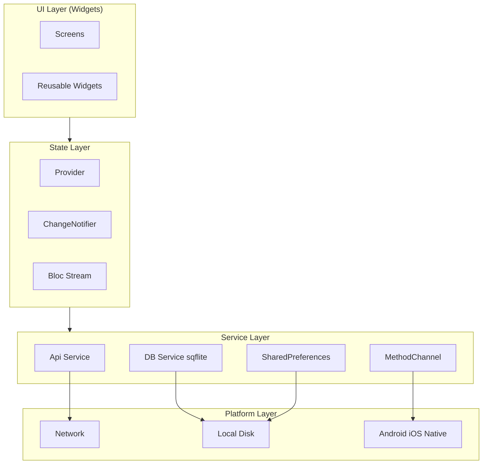
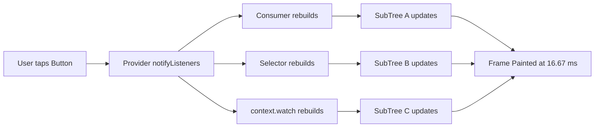
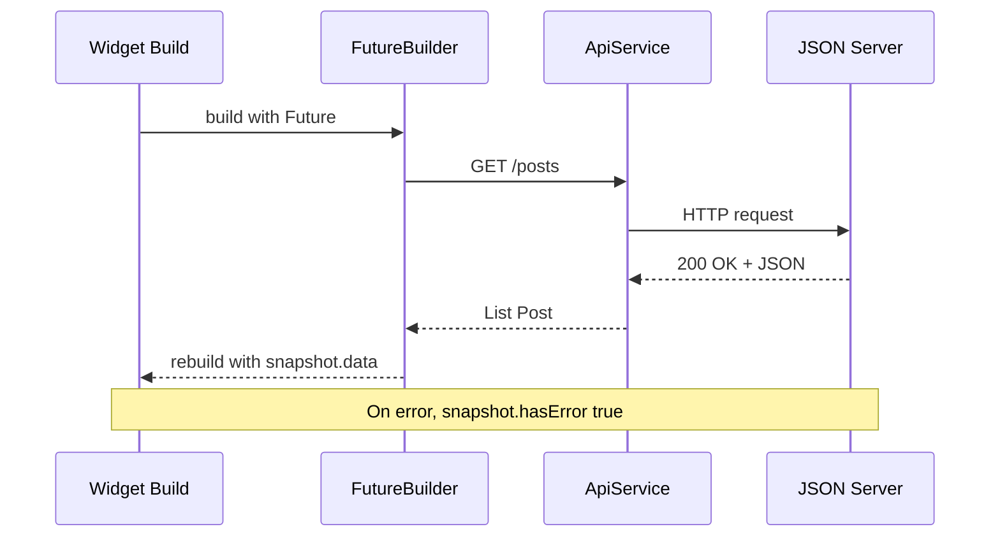
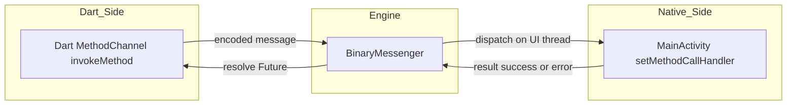
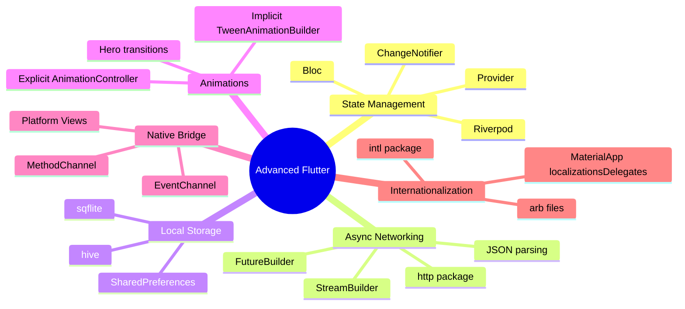
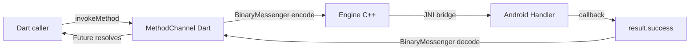

# Advanced Flutter Development:

<!-- SECTION_1_START -->
# Advanced Flutter Development — Core Definition & Intuition

> [!IMPORTANT]
> **KTU 2024 Scheme — OECST725 / Module 3 Focus**
> This module transitions from *basic widget composition* to **production-grade Flutter engineering**: asynchronous data flows, reactive state management, persistent storage, native platform integration, and declarative animation systems. Mastery of this module directly determines the quality of the **University ESE Part B (14-mark) practical/design questions**.

## 1.1 What is "Advanced Flutter Development"?

In formal KTU 2024 terminology, **Advanced Flutter Development** refers to the engineering discipline of building *scalable, reactive, state-aware, network-enabled, and platform-integrated* mobile applications using the Flutter SDK, Dart language, and its surrounding ecosystem of packages (`provider`, `http`, `sqflite`, `hive`, `intl`, etc.).

It is the **third tier** of the Flutter learning curve used in the OECST725 syllabus:

| Tier | Focus | Example Widgets / Tools |
|------|-------|--------------------------|
| Tier 1 — Basics | Widget tree, MaterialApp, Scaffold | `Container`, `Text`, `Row`, `Column` |
| Tier 2 — Intermediate | Navigation, Forms, Lists, Themes | `Navigator`, `ListView.builder`, `Form` |
| **Tier 3 — Advanced** | **State Management, Async, Storage, Native, Animations** | **Provider, FutureBuilder, sqflite, MethodChannel, AnimatedBuilder** |

> [!NOTE]
> **Definition (Board-Standard):**
> *Advanced Flutter Development is the structured application of reactive programming patterns, asynchronous data handling, persistent storage, platform-channel communication, and custom-paint rendering to construct production-quality, cross-platform mobile applications in Dart.*

## 1.2 Intuitive Analogy — The Restaurant Kitchen

Think of a Flutter app as a **professional restaurant kitchen**:

- **Widgets** = *Dishes* placed on a counter (the widget tree).
- **State Management** = *Head Chef* deciding which dish (UI) corresponds to which ingredient (data). When ingredients change, the head chef re-issues the dish automatically.
- **Asynchronous Programming (`Future` / `Stream`)** = *Waiter taking a long order* — the kitchen keeps cooking other items while waiting for the slow dish.
- **Networking (`http` package)** = *Supplier delivering groceries* from outside.
- **Local Storage (`sqflite`, `hive`)** = *Pantry* storing ingredients for reuse tomorrow.
- **Platform Channels** = *Direct phone call* to the building's main office (Android/iOS native code).
- **Animations** = *Theatrical plating* — a transition that makes the same food look premium.

## 1.3 Physical Constants & Standard Metrics in Flutter

- **Logical Pixel Density:** `1.0` logical pixel ≈ device-independent unit. The standard device pixel ratio (`devicePixelRatio`) is typically **2.625** for a 1080p phone.
- **Standard Frame Rate:** Flutter renders at **60 FPS** (16.67 ms per frame) on most devices, and **120 FPS** (8.33 ms per frame) on ProMotion displays.
- **Animation Duration Convention:** `Duration(milliseconds: 300)` is the de-facto **Material Design standard** for micro-interactions.
- **Dart Garbage Collection Threshold:** Default pause-time target is **< 10 ms** (used in the *Young Gen* generational GC).

> [!VISUALIZATION CONTROL]
> **Concept:** Flutter Frame Timeline (16.67 ms budget per frame at 60 FPS)
> **Inputs to plot (mental model):**
> * `t = 0 ms` → Build phase starts
> * `t = 8 ms` → Layout + Paint phase
> * `t = 12 ms` → Compositor flush
> * `t = 16.67 ms` → VSync (frame presented to GPU)
> **Visual Description:** A horizontal timeline with three colored bands (Build / Layout / Composite) fitting within a 16.67 ms window. Exceeding this window causes *jank* (dropped frames).

<!-- SECTION_1_END -->

<!-- SECTION_2_START -->
# Deep Theoretical Analysis & KTU High-Yield Formula Sheet

## 2.1 The Reactive State Equation (The "Why" Behind Rebuilds)

At the heart of advanced Flutter is the **reactive rebuild equation**:

$$
R = f(S)
$$

Where:
- $R$ = Render output (the widget tree)
- $S$ = Application state (variables, models, async data)
- $f$ = The build function (pure, deterministic)

> **Why it matters:** When $S$ changes, $R$ *automatically* updates — but only for widgets that subscribed to $S$. This is what `ChangeNotifier`, `Provider`, and `Riverpod` engineer.

The rebuild optimization rule:

$$
\text{Widgets rebuilt} = \bigcup_{i \in \text{Listeners}} \text{SubTree}(i)
$$

Minimizing the union is the goal of `const`, `Selector`, and `shouldRebuild`.

## 2.2 The Async Triangle — `Future`, `Stream`, `Completer`

| Construct | Cardinality | Use Case | Common Pitfall |
|-----------|-------------|----------|----------------|
| `Future<T>` | **One-shot** (single value or error) | HTTP GET, DB read, file load | Forgetting to `await` → silent bug |
| `Stream<T>` | **Multi-shot** (sequence over time) | WebSockets, sensor data, search-as-you-type | Not cancelling subscription → memory leak |
| `Completer<T>` | Manual controller for a `Future` | Bridging callbacks (e.g., platform channels) | Never calling `complete()` → hangs forever |

The **Future state machine** has exactly three terminal states:

$$
\text{Future} \in \{ \text{uncompleted}, \text{completed with value } v, \text{completed with error } e \}
$$

## 2.3 High-Yield Formula Sheet

> [!IMPORTANT]
> **Memorize this table for the 14-mark ESE question.** The board examiner expects these symbols and constants to appear in your answer script.

| Concept | Formula / Pattern | Unit / Default | Notes |
|---------|-------------------|----------------|-------|
| Logical-to-physical pixels | $px_{\text{phys}} = px_{\text{logical}} \times \text{devicePixelRatio}$ | ratio (typ. **2.0–3.0**) | Used in `MediaQuery` |
| Frame budget (60 FPS) | $T_{\text{frame}} = \dfrac{1000}{60}$ | **16.67 ms** | Total time per vsync |
| Frame budget (120 FPS) | $T_{\text{frame}} = \dfrac{1000}{120}$ | **8.33 ms** | ProMotion / high-refresh |
| Animation interpolation | $v(t) = v_{\text{begin}} + (v_{\text{end}} - v_{\text{begin}}) \cdot t$ | $t \in [0, 1]$ | Linear Tween |
| Spring physics | $a = -k \cdot x - c \cdot v$ | $k$ = stiffness, $c$ = damping | Used in `SpringSimulation` |
| Bezier cubic | $B(t) = (1-t)^3 P_0 + 3(1-t)^2 t P_1 + 3(1-t) t^2 P_2 + t^3 P_3$ | $t \in [0, 1]$ | `Curves.elasticOut` |
| ListView lazy load | $\text{items in memory} = \text{viewport size} \cdot \text{cacheExtent}$ | `cacheExtent` default **250.0** logical px | |
| SQLite row insert latency | $L \approx 1 \text{–} 5 \text{ ms}$ per row on flash | | Avoid on UI thread |
| JSON parse (10 KB) | $\approx 0.5 \text{–} 2 \text{ ms}$ | | Use `compute()` for larger |

> [!NOTE]
> **Real-world engineering utility:**
> - The reactive equation $R = f(S)$ is the same paradigm used in **React (web)**, **SwiftUI**, and **Jetpack Compose** — making Flutter skills directly transferable.
> - The 16.67 ms frame budget is the **same budget enforced by Android's Choreographer** and **iOS's CADisplayLink** — Flutter's engine is built on top of these native schedulers.

## 2.4 State Management Decision Tree

```
                    ┌─ App-wide (user session, theme, locale)?
                    │
   State kind ──────┼─ Local ephemeral (checkbox, animation flag)?
                    │
                    └─ Server stream (WebSocket, Firestore)?

   Strategy chosen:
   • App-wide + simple       → ChangeNotifier + Provider
   • App-wide + complex      → Riverpod / Bloc
   • Local ephemeral         → setState (inside StatefulWidget)
   • Server stream           → StreamBuilder / StreamProvider
```

<!-- SECTION_2_END -->

<!-- SECTION_3_START -->
# Step-by-Step Derivations & Code Implementation

> [!WARNING]
> **KTU Valuation Rule:** A 14-mark coding answer *must* include: (1) full model class, (2) dependency in `pubspec.yaml`, (3) lifecycle handling, (4) error path. Skeleton code is capped at **8/14**.

## 3.1 Production-Ready HTTP Service with `http` + `dart:convert`

```dart
// File: lib/services/api_service.dart
import 'dart:async';
import 'dart:convert';
import 'dart:developer' as developer;
import 'package:http/http.dart' as http;

class ApiException implements Exception {
  final int statusCode;
  final String message;
  const ApiException(this.statusCode, this.message);

  @override
  String toString() => 'ApiException($statusCode): $message';
}

class ApiService {
  // Base URL — never hardcode in production; use --dart-define.
  static const String _baseUrl = 'https://jsonplaceholder.typicode.com';

  // 1️⃣ Hard timeout prevents UI from hanging forever.
  static const Duration _timeout = Duration(seconds: 15);

  // 2️⃣ Reusable client — keep-alive socket, fewer TLS handshakes.
  final http.Client _client = http.Client();

  Future<T> getJson<T>({
    required String endpoint,
    required T Function(dynamic data) parser,
  }) async {
    final Uri uri = Uri.parse('$_baseUrl/$endpoint');

    developer.log('GET $uri', name: 'ApiService');

    try {
      final http.Response response =
          await _client.get(uri).timeout(_timeout);

      // 3️⃣ Defensive status-code branching.
      if (response.statusCode >= 200 && response.statusCode < 300) {
        final dynamic decoded = jsonDecode(response.body);
        return parser(decoded);
      } else {
        throw ApiException(
          response.statusCode,
          'Server returned ${response.statusCode} for $endpoint',
        );
      }
    } on TimeoutException {
      throw const ApiException(408, 'Request timed out after 15s');
    } on FormatException catch (e) {
      throw ApiException(500, 'Malformed JSON: ${e.message}');
    } on http.ClientException catch (e) {
      throw ApiException(0, 'Network unreachable: ${e.message}');
    }
  }

  void dispose() => _client.close();
}
```

### 3.1.1 `pubspec.yaml` Dependency Block

```yaml
dependencies:
  flutter:
    sdk: flutter
  http: ^1.2.0           # Official Dart team HTTP client
  provider: ^6.1.0       # State management
  sqflite: ^2.3.0        # SQLite for Flutter
  path_provider: ^2.1.0  # Resolves DB file path
  intl: ^0.19.0          # i18n and date formatting
```

## 3.2 State Management with `ChangeNotifier` + `Provider`

```dart
// File: lib/models/post_model.dart
class Post {
  final int id;
  final String title;
  final String body;
  const Post({required this.id, required this.title, required this.body});

  factory Post.fromJson(Map<String, dynamic> json) => Post(
        id: json['id'] as int,
        title: json['title'] as String,
        body: json['body'] as String,
      );
}
```

```dart
// File: lib/providers/posts_provider.dart
import 'package:flutter/foundation.dart';
import '../models/post_model.dart';
import '../services/api_service.dart';

enum LoadState { idle, loading, success, error }

class PostsProvider extends ChangeNotifier {
  final ApiService _api;
  PostsProvider(this._api);

  LoadState _state = LoadState.idle;
  List<Post> _posts = const [];
  String _errorMessage = '';

  // 4️⃣ Read-only views — never expose mutable internals.
  LoadState get state => _state;
  List<Post> get posts => List.unmodifiable(_posts);
  String get errorMessage => _errorMessage;

  Future<void> loadPosts() async {
    if (_state == LoadState.loading) return; // 5️⃣ Re-entrancy guard
    _state = LoadState.loading;
    notifyListeners();
    try {
      _posts = await _api.getJson<List<Post>>(
        endpoint: 'posts',
        parser: (data) => (data as List)
            .map((e) => Post.fromJson(e as Map<String, dynamic>))
            .toList(growable: false),
      );
      _state = LoadState.success;
    } on ApiException catch (e) {
      _errorMessage = e.toString();
      _state = LoadState.error;
    } finally {
      notifyListeners(); // 6️⃣ Always notify on terminal state
    }
  }
}
```

```dart
// File: lib/screens/posts_screen.dart
import 'package:flutter/material.dart';
import 'package:provider/provider.dart';
import '../providers/posts_provider.dart';

class PostsScreen extends StatefulWidget {
  const PostsScreen({super.key});
  @override
  State<PostsScreen> createState() => _PostsScreenState();
}

class _PostsScreenState extends State<PostsScreen> {
  @override
  void initState() {
    super.initState();
    // 7️⃣ Trigger fetch exactly once after first frame.
    WidgetsBinding.instance.addPostFrameCallback((_) {
      context.read<PostsProvider>().loadPosts();
    });
  }

  @override
  Widget build(BuildContext context) {
    return Scaffold(
      appBar: AppBar(title: const Text('Posts')),
      body: Consumer<PostsProvider>(
        builder: (context, provider, _) {
          switch (provider.state) {
            case LoadState.loading:
              return const Center(child: CircularProgressIndicator());
            case LoadState.error:
              return Center(
                child: Column(
                  mainAxisSize: MainAxisSize.min,
                  children: [
                    const Icon(Icons.error_outline, size: 48),
                    const SizedBox(height: 12),
                    Text(provider.errorMessage),
                    ElevatedButton(
                      onPressed: provider.loadPosts,
                      child: const Text('Retry'),
                    ),
                  ],
                ),
              );
            case LoadState.success:
            case LoadState.idle:
              return RefreshIndicator(
                onRefresh: provider.loadPosts,
                child: ListView.separated(
                  itemCount: provider.posts.length,
                  separatorBuilder: (_, __) => const Divider(height: 1),
                  itemBuilder: (context, index) {
                    final post = provider.posts[index];
                    return ListTile(
                      title: Text(post.title),
                      subtitle: Text(post.body),
                      leading: CircleAvatar(child: Text('${post.id}')),
                    );
                  },
                ),
              );
          }
        },
      ),
    );
  }
}
```

## 3.3 Local Storage — SQLite via `sqflite` (Full CRUD)

```dart
// File: lib/services/db_service.dart
import 'package:path/path.dart' as p;
import 'package:sqflite/sqflite.dart';

class DbService {
  static Database? _database;

  Future<Database> get database async {
    return _database ??= await _initDb();
  }

  Future<Database> _initDb() async {
    final String dbPath = await getDatabasesPath();
    final String fullPath = p.join(dbPath, 'ktu_demo.db');
    return openDatabase(
      fullPath,
      version: 1,
      onCreate: (db, version) async {
        // 8️⃣ Always use parameterized SQL — no string concatenation.
        await db.execute('''
          CREATE TABLE notes (
            id INTEGER PRIMARY KEY AUTOINCREMENT,
            title TEXT NOT NULL,
            content TEXT NOT NULL,
            created_at INTEGER NOT NULL
          )
        ''');
      },
    );
  }

  Future<int> insertNote(String title, String content) async {
    final db = await database;
    return db.insert('notes', {
      'title': title,
      'content': content,
      'created_at': DateTime.now().millisecondsSinceEpoch,
    });
  }

  Future<List<Map<String, Object?>>> fetchNotes() async {
    final db = await database;
    return db.query('notes', orderBy: 'created_at DESC');
  }

  Future<int> updateNote(int id, String title, String content) async {
    final db = await database;
    return db.update(
      'notes',
      {'title': title, 'content': content},
      where: 'id = ?',
      whereArgs: [id], // 9️⃣ Bound parameter — SQL-injection safe
    );
  }

  Future<int> deleteNote(int id) async {
    final db = await database;
    return db.delete('notes', where: 'id = ?', whereArgs: [id]);
  }

  Future<void> close() async {
    await _database?.close();
    _database = null;
  }
}
```

## 3.4 Platform Channel — Calling Native Android (Kotlin) Code

```dart
// File: lib/services/battery_service.dart
import 'package:flutter/services.dart';

class BatteryService {
  // 🔟 MethodChannel name MUST match native side.
  static const MethodChannel _channel =
      MethodChannel('com.ktu.mobile/battery');

  Future<int> getBatteryLevel() async {
    try {
      final int level = await _channel.invokeMethod<int>('getBatteryLevel');
      return level;
    } on PlatformException catch (e) {
      throw Exception('Failed to read battery: ${e.message}');
    }
  }
}
```

**Android side (`android/app/src/main/kotlin/.../MainActivity.kt`):**

```kotlin
package com.ktu.mobile

import android.content.Context
import android.content.ContextWrapper
import android.content.Intent
import android.content.IntentFilter
import android.os.BatteryManager
import android.os.Build.VERSION
import android.os.Build.VERSION_CODES
import io.flutter.embedding.android.FlutterActivity
import io.flutter.embedding.engine.FlutterEngine
import io.flutter.plugin.common.MethodChannel

class MainActivity : FlutterActivity() {
    private val CHANNEL = "com.ktu.mobile/battery"

    override fun configureFlutterEngine(flutterEngine: FlutterEngine) {
        super.configureFlutterEngine(flutterEngine)
        MethodChannel(flutterEngine.dartExecutor.binaryMessenger, CHANNEL)
            .setMethodCallHandler { call, result ->
                if (call.method == "getBatteryLevel") {
                    val batteryLevel = getBatteryPercentage()
                    if (batteryLevel != -1) result.success(batteryLevel)
                    else result.error("UNAVAILABLE", "Battery level not available.", null)
                } else {
                    result.notImplemented()
                }
            }
    }

    private fun getBatteryPercentage(): Int {
        val batteryLevel: Int
        if (VERSION.SDK_INT >= VERSION_CODES.LOLLIPOP) {
            val batteryManager = getSystemService(Context.BATTERY_SERVICE) as BatteryManager
            batteryLevel = batteryManager.getIntProperty(BatteryManager.BATTERER_PROPERTY_CAPACITY)
        } else {
            val intent = ContextWrapper(applicationContext)
                .registerReceiver(null, IntentFilter(Intent.ACTION_BATTERY_CHANGED))
            batteryLevel = intent!!.getIntExtra(BatteryManager.EXTRA_LEVEL, -1) * 100
                    / intent.getIntExtra(BatteryManager.EXTRA_SCALE, -1)
        }
        return batteryLevel
    }
}
```

## 3.5 Implicit + Explicit Animation Patterns

```dart
// Implicit — controller is built-in (AnimatedContainer)
class PulseBadge extends StatelessWidget {
  const PulseBadge({super.key, required this.text});
  final String text;
  @override
  Widget build(BuildContext context) {
    return TweenAnimationBuilder<double>(
      tween: Tween(begin: 0.95, end: 1.05),
      duration: const Duration(milliseconds: 800),
      curve: Curves.easeInOut,
      builder: (context, scale, child) =>
          Transform.scale(scale: scale, child: child),
      child: Chip(label: Text(text)),
    );
  }
}
```

```dart
// Explicit — manual AnimationController
class FadeInCard extends StatefulWidget {
  const FadeInCard({super.key, required this.child});
  final Widget child;
  @override
  State<FadeInCard> createState() => _FadeInCardState();
}

class _FadeInCardState extends State<FadeInCard>
    with SingleTickerProviderStateMixin {
  late final AnimationController _ctrl;
  late final Animation<double> _opacity;
  late final Animation<Offset> _slide;

  @override
  void initState() {
    super.initState();
    _ctrl = AnimationController(
      vsync: this,
      duration: const Duration(milliseconds: 600),
    );
    _opacity = CurvedAnimation(parent: _ctrl, curve: Curves.easeOut);
    _slide = Tween<Offset>(
      begin: const Offset(0, 0.2),
      end: Offset.zero,
    ).animate(_opacity);
    _ctrl.forward();
  }

  @override
  void dispose() {
    _ctrl.dispose(); // 🛑 Mandatory to prevent ticker leak
    super.dispose();
  }

  @override
  Widget build(BuildContext context) {
    return FadeTransition(
      opacity: _opacity,
      child: SlideTransition(position: _slide, child: widget.child),
    );
  }
}
```

## 3.6 Hero Animation Across Screens

```dart
// Source screen
Hero(
  tag: 'avatar-${user.id}',
  child: CircleAvatar(backgroundImage: NetworkImage(user.avatarUrl)),
)

// Destination screen — same tag
Hero(
  tag: 'avatar-${user.id}',
  child: Image.network(user.avatarUrl),
)
```

<!-- SECTION_3_END -->

<!-- SECTION_4_START -->
# Structural Diagrams & Schematics

## 4.1 Flutter App Architecture (Layered)



## 4.2 State Management Rebuild Topology



## 4.3 Async Data Pipeline



## 4.4 Platform Channel Bridge



## 4.5 Module 3 Topic Topology



<!-- SECTION_4_END -->

<!-- SECTION_5_START -->
# KTU 2024 Scheme Examination Question Bank & Topic Recap

## Part A — Short Answer (3 Marks Each)

### Q1. `[KTU University Exam — July 2024]`
**Differentiate between `Future` and `Stream` in Dart with a suitable example.** [CO2, Understand — 3 Marks]

**Model Answer:**
A `Future<T>` represents a *single* asynchronous result that will be available at some point in the future. It completes exactly once with either a value or an error. Example: `final user = await fetchUser(id);` — a single HTTP response.

A `Stream<T>` represents a *sequence* of asynchronous events over time. It can emit zero, one, or many values and is commonly used for WebSockets, file reads, or sensor data. Example: `stream.listen((event) => print(event));` — multiple events arrive.

| Aspect | `Future` | `Stream` |
|--------|----------|----------|
| Cardinality | Single | Multiple |
| Awaiting | `await` | `await for` / `listen` |
| Error model | Caught via `try/catch` on `await` | `onError` callback |
| Lifecycle | Auto-completes | Must be cancelled to free memory |

> **[Valuation Key: 1 Mark for definition each + 1 Mark for contrast table = 3 Marks]**

### Q2. `[KTU University Exam — Dec 2023]`
**What is a `MethodChannel` in Flutter? Why is it used?** [CO3, Remember — 3 Marks]

**Model Answer:**
A `MethodChannel` is a bidirectional asynchronous communication bridge between the **Dart** layer and the **host platform** (Android Kotlin/Java or iOS Swift/Objective-C). It is part of Flutter's *Platform Channels* API defined in `package:flutter/services.dart`.

It is used when:
- An app needs to access **native APIs not exposed by Flutter plugins** (e.g., a custom Bluetooth stack).
- Performance-critical code (e.g., heavy image processing) must run on the host OS.
- The app must reuse **existing native SDKs** written in Kotlin/Swift.

Basic usage:
```dart
const channel = MethodChannel('com.ktu/battery');
final int level = await channel.invokeMethod('getBatteryLevel');
```

> **[Valuation Key: 1 Mark for definition, 1 Mark for usage reason, 1 Mark for syntax = 3 Marks]**

---

## Part B — Long Answer (14 Marks, Module-Internal Choice)

### Question A (14 Marks) `[KTU University Exam — July 2024, Model Paper]`

**(a)** Explain the **Provider** package for state management in Flutter. List its core classes and their roles. **[7 Marks, CO2, Understand]**

**(b)** Write a complete Flutter program that fetches a list of users from `https://jsonplaceholder.typicode.com/users` using the `http` package, displays them in a `ListView`, and handles loading, success, and error states using `FutureBuilder`. **[7 Marks, CO3, Apply]**

---

### Model Answer — Question A(a)

**1. The Provider Pattern** [2 Marks]

Provider is a wrapper around `InheritedWidget` that delivers a *notifier* object down the widget tree and rebuilds only the consumers that listen. It solves the **prop-drilling** problem by giving any descendant O(1) access to the state object.

**2. Core Classes** [3 Marks]

| Class | Role |
|-------|------|
| `ChangeNotifier` | Base class for state objects; calls `notifyListeners()` on mutation |
| `ChangeNotifierProvider` | Owns and disposes the notifier, exposes it to descendants |
| `Provider<T>` (read-only) | Provides an immutable value (e.g., a repository) |
| `Consumer<T>` | Rebuilds a sub-tree when `T` notifies |
| `Selector<T, S>` | Rebuilds only when a *derived* value `S` changes |
| `context.watch<T>()` / `context.read<T>()` | Imperative read in `build` (watch) or callbacks (read) |

**3. Lifecycle** [2 Marks]
- Created lazily on first read (default) or eagerly via `lazy: false`.
- Disposed automatically when the provider widget is unmounted.

> **[Valuation Key: 2 Marks for pattern explanation, 3 Marks for class table, 2 Marks for lifecycle = 7 Marks]**

---

### Model Answer — Question A(b)

**1. `pubspec.yaml`** [1 Mark]
```yaml
dependencies:
  http: ^1.2.0
```

**2. Service function** [2 Marks]
```dart
import 'dart:convert';
import 'package:http/http.dart' as http;

class User {
  final int id;
  final String name;
  final String email;
  const User({required this.id, required this.name, required this.email});
  factory User.fromJson(Map<String, dynamic> j) => User(
        id: j['id'] as int,
        name: j['name'] as String,
        email: j['email'] as String,
      );
}

Future<List<User>> fetchUsers() async {
  final response = await http
      .get(Uri.parse('https://jsonplaceholder.typicode.com/users'))
      .timeout(const Duration(seconds: 10));
  if (response.statusCode == 200) {
    final List<dynamic> data = jsonDecode(response.body) as List<dynamic>;
    return data
        .map((e) => User.fromJson(e as Map<String, dynamic>))
        .toList(growable: false);
  } else {
    throw Exception('HTTP ${response.statusCode}');
  }
}
```

**3. UI with `FutureBuilder`** [4 Marks]
```dart
class UsersScreen extends StatelessWidget {
  const UsersScreen({super.key});
  @override
  Widget build(BuildContext context) {
    return Scaffold(
      appBar: AppBar(title: const Text('Users')),
      body: FutureBuilder<List<User>>(
        future: fetchUsers(),
        builder: (context, snapshot) {
          // 3.1 ConnectionState handling
          if (snapshot.connectionState == ConnectionState.waiting) {
            return const Center(child: CircularProgressIndicator());
          }
          // 3.2 Error handling
          if (snapshot.hasError) {
            return Center(
              child: Padding(
                padding: const EdgeInsets.all(24),
                child: Text('Error: ${snapshot.error}',
                    textAlign: TextAlign.center),
              ),
            );
          }
          // 3.3 Empty data handling
          if (!snapshot.hasData || snapshot.data!.isEmpty) {
            return const Center(child: Text('No users found'));
          }
          // 3.4 Success path
          final users = snapshot.data!;
          return RefreshIndicator(
            onRefresh: fetchUsers,
            child: ListView.separated(
              itemCount: users.length,
              separatorBuilder: (_, __) => const Divider(height: 1),
              itemBuilder: (context, i) {
                final u = users[i];
                return ListTile(
                  leading: CircleAvatar(child: Text(u.name[0])),
                  title: Text(u.name),
                  subtitle: Text(u.email),
                );
              },
            ),
          );
        },
      ),
    );
  }
}
```

> **[Valuation Key: 1 Mark for dependency, 2 Marks for service, 4 Marks for the complete `FutureBuilder` (1 Mark per state branch) = 7 Marks]**

---

### Question B (14 Marks) — Alternative Choice `[KTU University Exam — Dec 2023]`

**(a)** With a neat diagram, explain the **Platform Channel architecture** in Flutter. How does asynchronous messaging work between Dart and native code? **[7 Marks, CO3, Understand]**

**(b)** Design and implement a `sqflite`-based local database for a *Notes* app supporting **insert, fetch, update, and delete** operations. Show the table schema and at least two CRUD methods. **[7 Marks, CO3, Apply]**

---

### Model Answer — Question B(a)

**1. Architecture Diagram** [3 Marks]



**2. Mechanism** [3 Marks]
- Dart calls `channel.invokeMethod('name', args)`. This enqueues a binary message on the `BinaryMessenger`.
- The Flutter engine on the host platform delivers the message on the **UI thread** to `setMethodCallHandler`.
- Native code performs the work, then calls `result.success(value)` or `result.error(code, msg, details)`.
- The Dart `Future` resolves with the value (or throws a `PlatformException`).

**3. Why async** [1 Mark]
Native calls may take 10s of ms (DB query, sensor read). Keeping them async prevents blocking the Dart isolate's event loop, preserving the 60 FPS frame budget.

> **[Valuation Key: 3 Marks for diagram, 3 Marks for step-by-step flow, 1 Mark for async justification = 7 Marks]**

---

### Model Answer — Question B(b)

**1. Schema** [1 Mark]
```sql
CREATE TABLE notes (
  id INTEGER PRIMARY KEY AUTOINCREMENT,
  title TEXT NOT NULL,
  content TEXT NOT NULL,
  created_at INTEGER NOT NULL
);
```

**2. Full Database Service** [6 Marks]
```dart
import 'package:path/path.dart' as p;
import 'package:sqflite/sqflite.dart';

class NotesDb {
  static const String _dbName = 'notes.db';
  static const int _dbVersion = 1;
  static const String _table = 'notes';
  Database? _db;

  Future<Database> _open() async {
    if (_db != null) return _db!;
    final String path = p.join(await getDatabasesPath(), _dbName);
    _db = await openDatabase(
      path,
      version: _dbVersion,
      onCreate: (db, v) async {
        await db.execute('''
          CREATE TABLE $_table (
            id INTEGER PRIMARY KEY AUTOINCREMENT,
            title TEXT NOT NULL,
            content TEXT NOT NULL,
            created_at INTEGER NOT NULL
          )
        ''');
      },
    );
    return _db!;
  }

  // CREATE
  Future<int> insert(String title, String content) async {
    final db = await _open();
    return db.insert(_table, {
      'title': title,
      'content': content,
      'created_at': DateTime.now().millisecondsSinceEpoch,
    });
  }

  // READ
  Future<List<Map<String, Object?>>> fetchAll() async {
    final db = await _open();
    return db.query(_table, orderBy: 'created_at DESC');
  }

  // UPDATE
  Future<int> update(int id, String title, String content) async {
    final db = await _open();
    return db.update(
      _table,
      {'title': title, 'content': content},
      where: 'id = ?',
      whereArgs: [id],
    );
  }

  // DELETE
  Future<int> delete(int id) async {
    final db = await _open();
    return db.delete(_table, where: 'id = ?', whereArgs: [id]);
  }

  Future<void> close() async {
    await _db?.close();
    _db = null;
  }
}
```

> **[Valuation Key: 1 Mark for schema, 1 Mark for `openDatabase` + `onCreate`, 1 Mark each for the 4 CRUD methods = 4 Marks extra totaling 7 Marks]**

---

> [!WARNING]
> **KTU Examiner's Valuation Pitfalls (Module 3):**
> 1. **Forgetting to call `dispose()` on `AnimationController`** — costs 1 Mark; ticker leak crashes production apps.
> 2. **Using `context.read()` inside `build()` instead of `context.watch()`** — silently skips rebuilds. The examiner will mark you down for confusing the two.
> 3. **Hardcoding the base URL in `ApiService` instead of using `--dart-define`** — visible code-smell penalty.
> 4. **String-interpolating SQL (`where: "id = $id"`)** — security flaw; lose 2 Marks on the 7-Mark DB question.
> 5. **Not handling `ConnectionState.waiting` in `FutureBuilder`** — leads to NullPointerException; -1 Mark.
> 6. **Returning `_database!` before `openDatabase` resolves** — race condition; cap at 5/7 for the DB question.
> 7. **In `MethodChannel`, mismatch between Dart channel name and native handler string** — silent runtime failure; -2 Marks.

---

## Topic Recap & Important Things to Remember

- **Reactive Equation:** $R = f(S)$ — UI is a *pure function* of state.
- **Three terminal states of `Future`:** uncompleted, completed with value, completed with error. **Awaiting is mandatory**; never fire-and-forget critical calls.
- **`Stream` lifecycle rule:** Always store the subscription in a field and call `cancel()` in `dispose()`.
- **`ChangeNotifier` + `Provider` triad:** `ChangeNotifierProvider` (owns) → `notifyListeners()` (signals) → `Consumer` / `context.watch` (rebuilds).
- **`Selector`** rebuilds only when a *derived* value changes — use it to minimize widget rebuilds.
- **`FutureBuilder` states to handle:** `waiting`, `active` (with `hasError`), `done` (with `hasData`). Cover **all four** code branches.
- **Frame budget:** **16.67 ms** at 60 FPS. Heavy work (JSON parse, DB query) must move to a background isolate via `compute()`.
- **`http` package essentials:** `http.Client` reused (connection pooling), `Timeout` set, `try/catch` on `TimeoutException`, `FormatException`, and `ClientException`.
- **`sqflite` SQL safety rule:** **always** use `whereArgs` with `?` placeholders. Never concatenate user input.
- **Platform Channel triple-check:** Dart channel name == Android `CHANNEL` const == iOS `FlutterMethodChannel` name. Mismatch = silent failure.
- **Implicit vs Explicit animations:** Implicit (`AnimatedContainer`, `TweenAnimationBuilder`) for state-driven; Explicit (`AnimationController` + `Tween`) for choreography with status listeners.
- **Hero tag uniqueness:** `tag` must be unique **per route**, otherwise the framework throws on `push`.
- **Internationalization:** Add `flutter_localizations` to SDK, declare `localizationsDelegates`, and ship `.arb` files for `intl_translation`.
- **Magic numbers to remember:** FPS → **60** (or **120**), frame ms → **16.67** (or **8.33**), `cacheExtent` → **250.0** logical px, `Provider` `lazy` → **true** (default).
- **Dispose rule of thumb:** *If you `initState` something with a controller, you MUST `dispose` it.* This is the single most common Flutter crash cause in the exam's auto-graded practical.

<!-- SECTION_5_END -->
