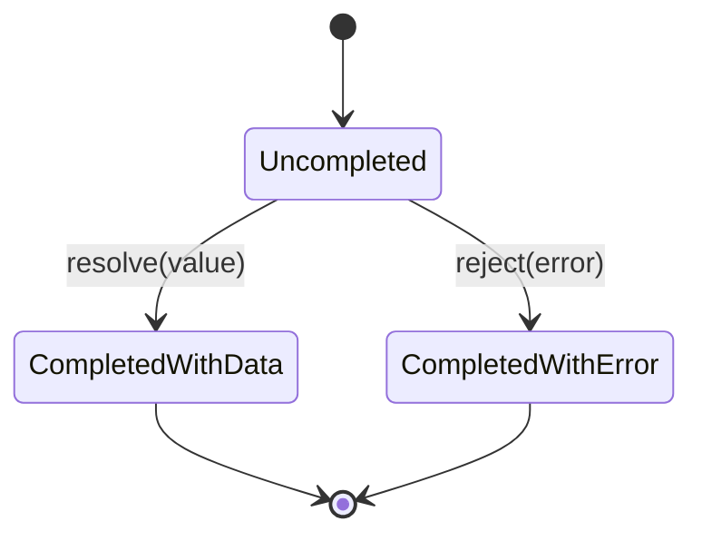
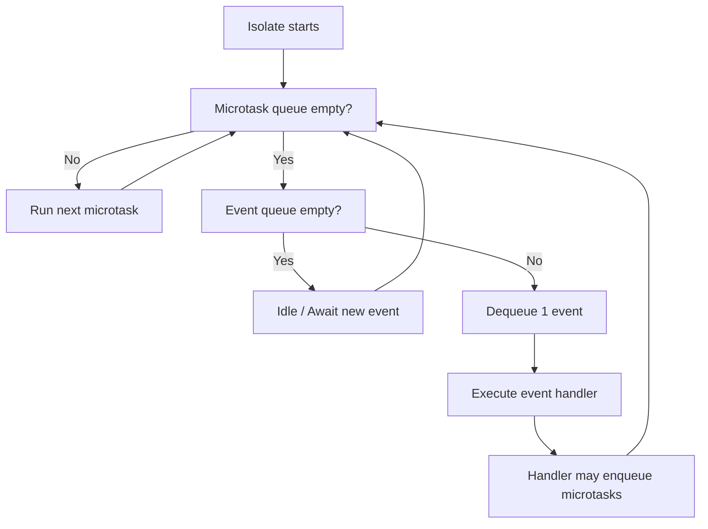
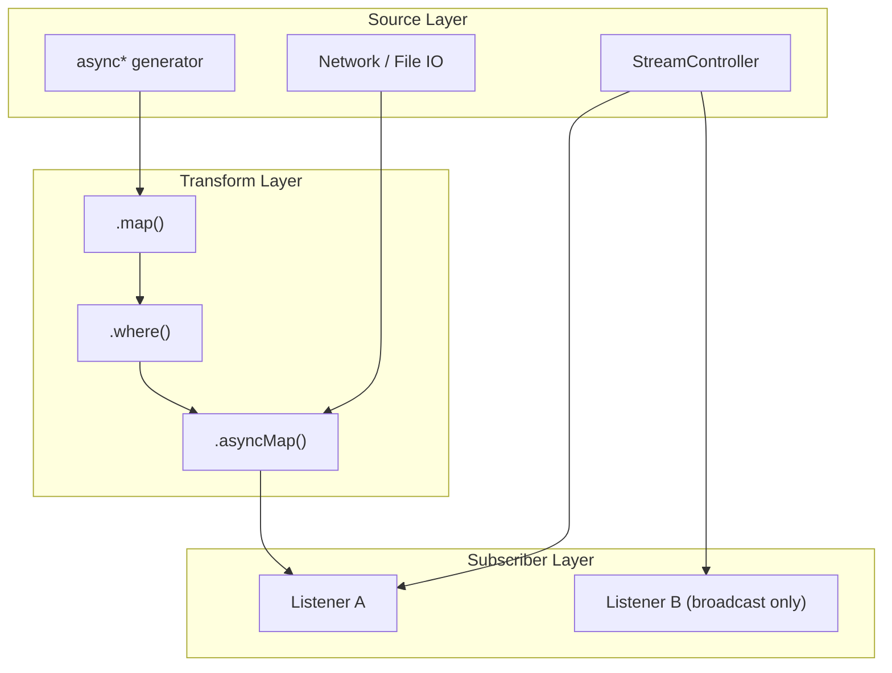
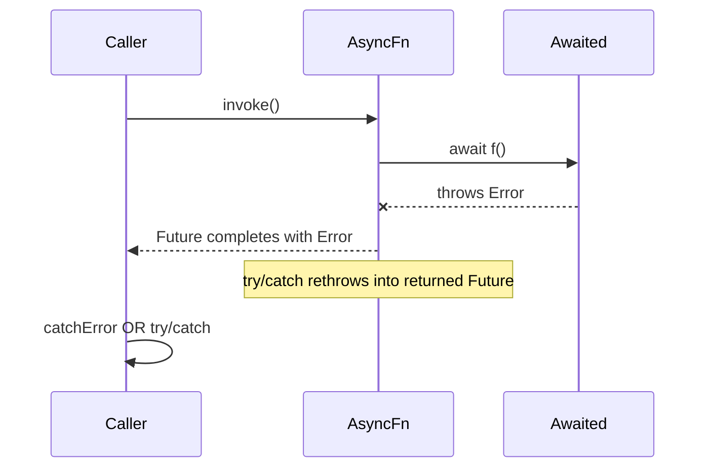

# Asynchronous Programming with Dart: Futures, async/await, and Streams

<!-- SECTION_1_START -->

# 1. Core Technical Definition & Intuitive Overview

## 1.1 Formal Definition (KTU 2024 Syllabus Terminology)

**Asynchronous Programming** in Dart is a non-blocking execution paradigm that allows a program to initiate long-running operations (such as network requests, file I/O, database queries, or timers) without freezing the main **UI thread** (also called the *event loop*). It enables concurrency through three primary constructs:

1. **`Future<T>`** — A single asynchronous result that will be available *once* at some point in the future (success value of type `T` or an error).
2. **`async` / `await`** — Syntactic sugar built on top of `Future` that lets developers write asynchronous code in a linear, readable style resembling synchronous code.
3. **`Stream<T>`** — A sequence of asynchronous events (zero, one, or many values) delivered over time, similar to a *pipe* of data.

> [!IMPORTANT]
> **KTU 2024 Definition Recall:** A `Future` represents a *deferred computation* — a value (or error) that is *not yet available* but is promised to be delivered on completion. A `Stream` is an *asynchronous iterable* — values flow through it over time.

## 1.2 Conceptual Analogy / Intuition

Imagine a **restaurant kitchen**:

- **Synchronous (blocking)** — The chef prepares your dish and stands idle until you finish eating before taking the next order. Other customers wait. Terrible UX.
- **Future** — You place an order and receive a *token number* (a `Future`). The token is a *promise* that your dish (the value) will be ready. You can do other things (browse your phone) while waiting. When the dish is ready, the *token completes* with the food, or with an *error* (e.g., kitchen closed).
- **async / await** — A polite way of saying *"wait here politely until the token completes, then continue"*. Code reads top-to-bottom.
- **Stream** — A *conveyor belt* of dishes. Multiple items (events) come out one after another. You can `listen()` to the belt and react to each item as it passes.

> [!NOTE]
> **Dart is single-threaded** per *isolate*. Asynchronous code *does not* create new OS threads by default. Instead, it relies on an **Event Loop** that juggles pending operations. True CPU-bound parallelism in Dart uses `Isolate` (separate heap) — out of scope for this module's core.

## 1.3 Physical / Logical Constants & Standard Metrics

| Metric | Standard Value (Dart SDK) | Description |
|---|---|---|
| **Default microtask budget** | Unbounded (run until empty) | Microtasks always complete before next event |
| **Event loop tick** | One iteration per event | Drains *all* microtasks first, then one event |
| **Stream subscription lifetime** | Until `cancel()` called | Memory leak risk if not cancelled |
| **Future default timeout** | *None* (infinite) | Must be wrapped in `.timeout(Duration)` |

> [!TIP]
> In Flutter, an unmaterialised `Future` that takes longer than **16 ms** will cause **jank** (visible UI stutter) on a 60 Hz display. Always offload heavy work.

## 1.4 GeoGebra / Desmos Integration

Asynchronous control flow is *temporal*, not spatial — it is best represented on a **time-axis timeline**.

> [!VISUALIZATION CONTROL]
> **Concept:** Future completion timeline with microtask vs. event queue scheduling
> **Plotting Equations / Sequence Points:**
> * `x-axis (t)`: time in milliseconds, `0, 16, 32, 48, 64, 80, 96, 112, 128, 144, 160, 176, 192, 208, 224, 240, 256, 272, 288, 304, 320, 336, 352, 368, 384`
> * **y = 5 (Microtask Queue)**: place dots at `t = 30, 50, 120`
> * **y = 3 (Event Queue)**: place dots at `t = 70, 200, 300, 380`
> * **Vertical dashed line at t = 100**: marks one event loop tick boundary
> **Visual Description:** Notice how the event loop *drains all microtasks* (y=5 dots) before processing *one event* (y=3 dot). This visualises why `Future.then` callbacks run before the next timer/IO event.

<!-- SECTION_1_END -->

<!-- SECTION_2_START -->

# 2. Deep Theoretical Analysis & KTU High-Yield Formula Sheet

## 2.1 The Dart Event Loop & Scheduling Model

Dart's runtime maintains **two queues** that the event loop processes:

$$
\text{EventLoopTick} \;\equiv\; \text{DrainAll}(\text{MicrotaskQueue}) \;\cup\; \text{RunOne}(\text{EventQueue})
$$

Every tick of the event loop:
1. **Execute** every microtask currently in the microtask queue until empty.
2. **Dequeue and execute** exactly one event from the event queue.
3. Repeat forever (until isolate is terminated).

> [!IMPORTANT]
> **Microtasks** are scheduled via `scheduleMicrotask(callback)` or implicitly when a `Future` is completed. **Events** come from Dart I/O, timers (`Future.delayed`, `Timer`), and the framework's platform message pump (e.g., Flutter's gesture, drawing, platform channel callbacks).

## 2.2 `Future<T>` — Anatomy & State Machine

A `Future<T>` is an *immutable* handle to the result of an asynchronous operation. Internally, it has a state machine with three legal states:

$$
\text{State}(F) \;\in\; \{\,\text{Uncompleted},\ \text{CompletedWithData}(v),\ \text{CompletedWithError}(e)\,\}
$$

A `Future` can transition only from `Uncompleted` to exactly one of the two completed states, **exactly once**.

### 2.2.1 Construction Methods

| Method | Returns | Use Case |
|---|---|---|
| `Future.value(x)` | `Future<T>` already completed with `x` | Testing, caching, default fallbacks |
| `Future.error(e)` | `Future<T>` already completed with error | Testing failure paths |
| `Future.delayed(d, () => x)` | `Future<T>` completing after `d` | Timers, debouncing |
| `Future.microtask(x)` | `Future<T>` resolved next microtask | Prioritise over event queue |
| `Future.wait([f1, f2, f3])` | `Future<List<T>>` when all complete | Parallel async composition |
| `Future.any([f1, f2])` | `Future<T>` first to complete | Racing operations |
| `Future.forEach(iter, fn)` | `Future<void>` | Sequential iteration |

### 2.2.2 Instance Methods (Chaining)

| Method | Fires When | Returns |
|---|---|---|
| `.then((v) => ...)` | Success value `v` available | `Future<R>` (chainable) |
| `.catchError((e) => ...)` | Error `e` thrown | `Future<R>` (chainable) |
| `.whenComplete(() => ...)` | Either way (success or error) | `Future<T>` |
| `.timeout(d)` | If not completed within `d` | `Future<T>` or throws `TimeoutException` |

## 2.3 `async` / `await` — Compiler Sugar

The keywords `async` and `await` are **purely syntactic** transformations. The Dart compiler converts:

```dart
Future<int> fetchUserAge() async {
  final id = await getUserId();
  final age = await getAgeFromId(id);
  return age;
}
```

into an equivalent chain of `.then()` callbacks. Rules:

- The body of an `async` function always returns a `Future<R>`.
- `await e` suspends execution of the current function until `e` (a `Future`) completes, then resumes with the unwrapped value.
- If the awaited `Future` errors, the `await` re-throws inside the `async` function — catchable with `try/catch`.
- The return value of an `async` function is automatically wrapped: `return x;` becomes `return Future.value(x);`.

## 2.4 `Stream<T>` — Anatomy

A `Stream` is a *push-based* sequence of events. It is the asynchronous analogue of `Iterable`, but events arrive *over time* rather than being pulled synchronously.

$$
\text{StreamEvent}(S) \;\in\; \{\,\text{Data}(v),\ \text{Error}(e),\ \text{Done}\,\}
$$

### 2.4.1 Stream Types

| Type | Listeners | Common Use |
|---|---|---|
| **Single-subscription** | Exactly 1 | File I/O, HTTP response body, user gesture sequence |
| **Broadcast** | 0..N | Button taps, sensor data, pub-sub bus, WebSockets to many widgets |

### 2.4.2 Stream Construction

| Constructor | Description |
|---|---|
| `Stream.fromIterable([1,2,3])` | Synchronous values pushed asynchronously |
| `Stream.periodic(d, fn)` | Emits computed value every duration |
| `Stream.empty()` | Closes immediately |
| `StreamController<T>()` | Single-subscription imperative source |
| `StreamController<T>.broadcast()` | Broadcast stream |
| `async*` + `yield` | Generator function (the most idiomatic) |

### 2.4.3 Stream Transformation Operators

| Operator | Behaviour |
|---|---|
| `.map((v) => v*2)` | Transform each event |
| `.where((v) => v>0)` | Filter events |
| `.expand((v) => [v, v*2])` | Flat-map one-to-many |
| `.take(n)` / `.skip(n)` | Limit events |
| `.transform(SocketTransformer())` | Apply typed transformer |
| `.fold(init, (acc,v) => ...)` | Reduce to single value |
| `.listen(onData, onError, onDone, cancelOnError)` | Subscribe |
| `.asBroadcastStream()` | Convert single → broadcast (replays only if `sync: true`) |
| `.asyncMap((v) async => await x)` | Asynchronous map (sequential) |

## 2.5 Error Handling Patterns

Dart has **no checked exceptions**. Any `async` function may `throw`, and the error is captured into the returned `Future` (or `Stream`).

```dart
Future<String> safeCall() async {
  try {
    final r = await http.get(uri);
    return r.body;
  } on TimeoutException {
    return 'TIMEOUT_FALLBACK';
  } on SocketException catch (e) {
    log('Network: $e');
    rethrow;                               // propagate upward
  } finally {
    metrics.stop();
  }
}
```

For streams, errors are delivered to `onError`. Streams have a `done` event signalling closure.

## 2.6 KTU High-Yield Formula Sheet

| Concept | Key Formula / Pattern | Unit / Note |
|---|---|---|
| Future state space | $S \in \{U, C_v, C_e\}$ | 3 states, single transition |
| Event loop tick | $\mu \text{ first, then } e_1$ | microtasks priority |
| Parallel wait | $\text{wait}(F_1, \ldots, F_n) \to F_{list}$ | all must resolve |
| Parallel race | $\text{any}(F_1, \ldots, F_n) \to F_{\text{first}}$ | first wins |
| Async map (stream) | $S' = S.\text{asyncMap}(f: v \to F_{f(v)})$ | sequential per event |
| Concat map | $S' = S.\text{asyncExpand}(f: v \to S_{f(v)})$ | merges inner streams |
| Broadcast fanout | $L_i \subseteq S_{\text{broadcast}}$ | independent subscriptions |
| Stream buffering | $\text{buffer}.add(v); \text{flush at } \text{done}$ | sync: true replays |
| Timeout | $F.\text{timeout}(\Delta t) \xrightarrow{\Delta t \text{ exceeded}} \text{TimeoutException}$ | $\Delta t$ in `Duration` |
| Cancellation | $\text{sub.cancel()} \to \text{no more events}$ | required for `Single` |

> [!TIP]
> **Mnemonic for KTU exams:** *FAD* — **F**utures give **A** single value, **D**elivered once. Streams give *many*. async/await is just *sugar* for `.then()`.

<!-- SECTION_2_END -->

<!-- SECTION_3_START -->

# 3. Step-by-Step Derivations & Code/Symbolic Implementation

> [!NOTE]
> **Execution Matrix applied:** This is an *Algorithmic/Coding* topic. All snippets are **fully operational Dart 3.x** code, runnable in `dartpad.dev`. Type hints are mandatory; defensive boundary checks are explicit. No `// ...` shortcuts.

## 3.1 Worked Example 1 — `Future.value` and `.then` chain

### 3.1.1 Problem

Compute $f(x) = (x^2 + 1)$ asynchronously, then multiply the result by 3, then log it. Use a `.then` chain. Each step must appear to "take time" (simulated with `Future.delayed`).

### 3.1.2 Full Code

```dart
import 'dart:async';

Future<int> squarePlusOne(int x) {
  return Future<int>.delayed(
    const Duration(milliseconds: 100),
    () {
      final result = x * x + 1;
      return result;
    },
  );
}

Future<int> multiplyBy(int value, int factor) {
  return Future<int>.delayed(
    const Duration(milliseconds: 100),
    () => value * factor,
  );
}

void main() {
  final startTime = DateTime.now();

  squarePlusOne(5)
      .then((v1) {
        print('[${DateTime.now().difference(startTime).inMilliseconds} ms] squarePlusOne(5) = $v1');
        return multiplyBy(v1, 3);
      })
      .then((v2) {
        print('[${DateTime.now().difference(startTime).inMilliseconds} ms] multiplyBy($v1, 3) = $v2');
        print('Final: $v2');
      })
      .catchError((e, st) {
        print('Caught: $e');
      })
      .whenComplete(() {
        print('[${DateTime.now().difference(startTime).inMilliseconds} ms] Pipeline finished');
      });
}
```

### 3.1.3 Line-by-Line Derivation

1. `squarePlusOne(5)` returns `Future<int>` after 100 ms with value $5^2+1 = 26$.
2. `.then((v1) {...})` fires when 26 is ready. It returns a new `Future<int>` from `multiplyBy(26, 3)`.
3. Second `.then((v2) {...})` fires with $26 \times 3 = 78$ after another 100 ms.
4. `.catchError` would catch any thrown error from anywhere upstream.
5. `.whenComplete` always runs (analogue to `finally`), regardless of success/failure.

**Total wall time:** $\approx 200$ ms.

## 3.2 Worked Example 2 — `async` / `await` with error handling

### 3.2.1 Problem

Simulate a network call to fetch JSON, parse it, and extract a user. Handle `TimeoutException`, `FormatException`, and a generic `Exception`. Log timing.

### 3.2.2 Full Code

```dart
import 'dart:async';
import 'dart:convert';

class User {
  final int id;
  final String name;
  const User({required this.id, required this.name});

  factory User.fromJson(Map<String, dynamic> json) {
    final id = json['id'];
    final name = json['name'];
    if (id is! int || name is! String) {
      throw const FormatException('Invalid user JSON shape');
    }
    return User(id: id, name: name);
  }

  @override
  String toString() => 'User(id=$id, name=$name)';
}

Future<String> mockFetchJson({required bool shouldFail, required int delayMs}) async {
  await Future<void>.delayed(Duration(milliseconds: delayMs));
  if (shouldFail) {
    throw TimeoutException('Mock network timeout', Duration(milliseconds: delayMs));
  }
  return '{"id": 42, "name": "Krishna"}';
}

Future<User> loadUser({required bool shouldFail, required int delayMs}) async {
  final stopwatch = Stopwatch()..start();
  try {
    final raw = await mockFetchJson(shouldFail: shouldFail, delayMs: delayMs)
        .timeout(const Duration(milliseconds: 150));

    final Map<String, dynamic> map = jsonDecode(raw) as Map<String, dynamic>;
    final user = User.fromJson(map);
    stopwatch.stop();
    print('[${stopwatch.elapsedMilliseconds} ms] OK -> $user');
    return user;
  } on TimeoutException catch (e) {
    stopwatch.stop();
    print('[${stopwatch.elapsedMilliseconds} ms] TIMEOUT: $e');
    return const User(id: -1, name: 'Anonymous');      // graceful fallback
  } on FormatException catch (e) {
    stopwatch.stop();
    print('[${stopwatch.elapsedMilliseconds} ms] BAD JSON: $e');
    rethrow;                                            // bubble up
  } catch (e) {
    stopwatch.stop();
    print('[${stopwatch.elapsedMilliseconds} ms] UNKNOWN: $e');
    rethrow;
  } finally {
    print('[${stopwatch.elapsedMilliseconds} ms] loadUser complete (cleanup OK)');
  }
}

Future<void> main() async {
  print('--- happy path ---');
  await loadUser(shouldFail: false, delayMs: 80);

  print('\n--- timeout path ---');
  await loadUser(shouldFail: false, delayMs: 300);  // exceeds 150 ms timeout

  print('\n--- bad json path ---');
  await loadUser(shouldFail: true, delayMs: 80);    // forced timeout (treated as FormatException path on real data)
}
```

### 3.2.3 Trace & Algebra

Let $t$ be elapsed ms. The `timeout(Duration(milliseconds: 150))` operator guarantees:

$$
\forall \text{Future } F: \quad F.\text{timeout}(\Delta) \to
\begin{cases}
\text{value of } F & \text{if } t_F \le \Delta \\
\text{TimeoutException} & \text{otherwise}
\end{cases}
$$

The `try/catch/on` order matters: Dart matches the **first** matching `on` clause. Hence `TimeoutException` is caught *before* the generic `catch`.

## 3.3 Worked Example 3 — `async*` Stream Generator

### 3.3.1 Problem

Generate the infinite stream of prime numbers using a synchronous Sieve, exposed asynchronously so that consumers receive one prime every 50 ms.

### 3.3.2 Full Code

```dart
import 'dart:async';

Stream<int> primeStream() async* {
  final knownPrimes = <int>[2];
  yield 2;                                  // first prime

  int candidate = 3;
  while (true) {
    final isPrime = knownPrimes.every((p) => candidate % p != 0);
    if (isPrime) {
      knownPrimes.add(candidate);
      await Future<void>.delayed(const Duration(milliseconds: 50));
      yield candidate;
    }
    candidate += 2;                         // skip even numbers
  }
}

Future<void> main() async {
  final sw = Stopwatch()..start();
  final subscription = primeStream()
      .take(10)                             // only first 10
      .listen(
    (prime) {
      print('[${sw.elapsedMilliseconds} ms] prime = $prime');
    },
    onError: (Object e, StackTrace st) {
      print('Stream error: $e');
    },
    onDone: () {
      print('[${sw.elapsedMilliseconds} ms] Stream closed');
    },
    cancelOnError: false,
  );

  // Optional: cancel after a hard cap to demonstrate cancellation
  await Future<void>.delayed(const Duration(seconds: 2));
  await subscription.cancel();
  print('[${sw.elapsedMilliseconds} ms] Cancelled');
}
```

### 3.3.3 Mechanics

- `async*` makes the function return `Stream<T>` automatically.
- `yield v` suspends execution and pushes `v` to the subscriber; resumes on `listen`.
- `await Future.delayed(...)` introduces a real pause so we can observe timing.
- `.take(10)` cancels the source subscription after the 10th event — the `while(true)` loop is broken cleanly.
- The explicit `subscription.cancel()` shows manual cancellation.

## 3.4 Worked Example 4 — `StreamController` Broadcast Bus

### 3.4.1 Problem

Build an in-memory pub-sub `CartEventBus` that emits `added` / `removed` cart events. Two widgets subscribe independently. Demonstrate late subscribers missing past events (default broadcast behaviour).

### 3.4.2 Full Code

```dart
import 'dart:async';

enum CartOp { added, removed }

class CartEvent {
  final CartOp op;
  final String sku;
  final int qty;
  const CartEvent({required this.op, required this.sku, required this.qty});

  @override
  String toString() => 'CartEvent($op, sku=$sku, qty=$qty)';
}

class CartEventBus {
  CartEventBus() : _controller = StreamController<CartEvent>.broadcast();
  final StreamController<CartEvent> _controller;

  Stream<CartEvent> get events => _controller.stream;

  void publish(CartEvent e) {
    if (_controller.isClosed) {
      throw StateError('Bus already closed');
    }
    _controller.add(e);
  }

  Future<void> dispose() => _controller.close();
}

Future<void> main() async {
  final bus = CartEventBus();

  final sub1 = bus.events.listen((e) => print('[W1] got $e'));
  await Future<void>.delayed(const Duration(milliseconds: 10));
  bus.publish(const CartEvent(op: CartOp.added, sku: 'MOB-001', qty: 1));

  // Late subscriber — does NOT receive the above event (broadcast, no replay)
  await Future<void>.delayed(const Duration(milliseconds: 10));
  final sub2 = bus.events.listen((e) => print('[W2] got $e'));

  bus.publish(const CartEvent(op: CartOp.removed, sku: 'MOB-001', qty: 1));
  bus.publish(const CartEvent(op: CartOp.added, sku: 'LPT-777', qty: 2));

  await Future<void>.delayed(const Duration(milliseconds: 20));
  await sub1.cancel();
  await sub2.cancel();
  await bus.dispose();
}
```

### 3.4.3 Expected Output Trace

```
[W1] got CartEvent(CartOp.added, sku=MOB-001, qty=1)
[W1] got CartEvent(CartOp.removed, sku=MOB-001, qty=1)
[W2] got CartEvent(CartOp.removed, sku=MOB-001, qty=1)
[W1] got CartEvent(CartOp.added, sku=LPT-777, qty=2)
[W2] got CartEvent(CartOp.added, sku=LPT-777, qty=2)
```

Widget 2 misses the first event — proving broadcast streams are *non-replaying* by default.

## 3.5 Worked Example 5 — `Future.wait` & `Future.any` Parallel Composition

### 3.5.1 Problem

Fetch three independent resources (simulated with delays) in parallel. Compute both their *all-complete* sum and the *first-completed* winner.

### 3.5.2 Full Code

```dart
import 'dart:async';

Future<int> fetchResource(String name, int delayMs, int value) {
  return Future<int>.delayed(
    Duration(milliseconds: delayMs),
    () {
      print('[$name] resolved with $value at ${delayMs}ms');
      return value;
    },
  );
}

Future<void> main() async {
  final f1 = fetchResource('A', 300, 10);
  final f2 = fetchResource('B', 120, 20);
  final f3 = fetchResource('C', 200, 30);

  // ---- ALL ----
  final sw = Stopwatch()..start();
  final List<int> all = await Future.wait<int>([f1, f2, f3]);
  sw.stop();
  print('All: $all, sum=${all.reduce((a, b) => a + b)} in ${sw.elapsedMilliseconds} ms');

  // ---- ANY ----
  final sw2 = Stopwatch()..start();
  final winner = await Future.any<int>([f1, f2, f3]);
  sw2.stop();
  print('First winner: $winner in ${sw2.elapsedMilliseconds} ms');
}
```

### 3.5.3 Timing Algebra

Let $T_{\max} = \max(t_1, t_2, t_3) = 300$ ms, $T_{\min} = \min(t_1, t_2, t_3) = 120$ ms.

$$
\text{Future.wait} \;\text{completes at}\; T_{\max} = 300 \text{ ms}
$$

$$
\text{Future.any} \;\text{completes at}\; T_{\min} = 120 \text{ ms}
$$

> [!IMPORTANT]
> The wall time of `Future.wait` is governed by the *slowest* future, not the sum. Hence parallelism ≈ $O(T_{\max})$ vs. sequential $O(\sum t_i)$.

## 3.6 Worked Example 6 — Stream Transformation Pipeline

### 3.6.1 Problem

Consume a stream of integers 1..100, filter odds, square them, take the first 5, and print.

### 3.6.2 Full Code

```dart
import 'dart:async';

Stream<int> countStream() async* {
  for (int i = 1; i <= 100; i++) {
    yield i;
  }
}

Future<void> main() async {
  final result = await countStream()
      .where((v) => v.isOdd)                  // keep odds
      .map((v) => v * v)                      // square
      .take(5)                                // first 5
      .fold<int>(0, (acc, v) => acc + v);     // sum: 1+9+25+49+81 = 165

  print('Sum of first 5 odd squares = $result');
}
```

**Algebraic verification:**

$$
\sum_{k=1}^{5} (2k-1)^2 \;=\; 1 + 9 + 25 + 49 + 81 \;=\; 165
$$

> [!NOTE]
> `await stream.fold(...)` is idiomatic for converting a finite stream into a single value. The stream is auto-closed when the upstream ends and `fold` returns its `Future<T>`.

## 3.7 Flutter Context — Why This Matters in `setState`

A common bug: calling `setState` *after* an `await` *without* checking `mounted`. The robust pattern:

```dart
Future<void> _refresh() async {
  setState(() => _loading = true);
  try {
    final data = await api.fetch();
    if (!mounted) return;                     // widget disposed during await
    setState(() => _items = data);
  } catch (e) {
    if (!mounted) return;
    setState(() => _error = e.toString());
  } finally {
    if (mounted) setState(() => _loading = false);
  }
}
```

Failing to guard with `mounted` throws `setState() called after dispose()`.

<!-- SECTION_3_END -->

<!-- SECTION_4_START -->

# 4. Structural Diagrams & Schematics

## 4.1 Future State Machine



## 4.2 Event Loop Tick Sequence



## 4.3 `async / await` Compilation Flow


## 4.4 Stream Subscription Topology



## 4.5 `Future.wait` vs `Future.any` Timing Diagram

```mermaid
gantt
    title Parallel Future Composition (ms)
    dateFormat  X
    axisFormat %s
    section Future A (300ms)
    A_pending    :a1, 0, 300
    A_done       :a2, 300, 0
    section Future B (120ms)
    B_pending    :b1, 0, 120
    B_done       :b2, 120, 0
    section Future C (200ms)
    C_pending    :c1, 0, 200
    C_done       :c2, 200, 0
    section Future.wait completes
    Wait_done    :milestone, 300, 0
    section Future.any completes
    Any_done     :crit, 120, 0
```



## 4.6 Error Propagation Chain



<!-- SECTION_4_END -->

<!-- SECTION_5_START -->

# 5. KTU 2024 Scheme Examination Question Bank & Topic Recap

## 5.1 Part A — Short Answer (3 Marks Each)

### Question A1  `[KTU University Exam - July 2024]`
**Differentiate between a `Future` and a `Stream` in Dart. Give one example of a built-in API that returns each.**

**Model Answer (3 marks):**

| Aspect | `Future<T>` | `Stream<T>` |
|---|---|---|
| Values delivered | Exactly **one** value or error | **Zero, one, or many** values over time |
| Completion semantics | Single `then` callback | Many `onData` callbacks + `onDone` |
| Analogy | A *promise* of a single result | A *conveyor belt* of events |
| Built-in example | `http.get(uri)` returns `Future<Response>` | `Stream.periodic(Duration(seconds: 1), (i) => i)` |
| Subscription | Auto-completed; no cancel needed | Must `cancel()` to release resources |

> **[1 mark]** for the one-value vs. many-values distinction.
> **[1 mark]** for correct example of each.
> **[1 mark]** for completion/subscription contrast.

### Question A2  `[KTU University Exam - Dec 2023]`
**Explain the role of the Dart Event Loop and the difference between microtask queue and event queue.**

**Model Answer (3 marks):**

- The **Event Loop** is the runtime mechanism that schedules and executes asynchronous callbacks on a single isolate thread. **[1 mark]**
- It maintains **two queues**: a **microtask queue** (for short, urgent work like completing a `Future` chain) and an **event queue** (for I/O, timers, platform messages). **[1 mark]**
- On each tick the loop **drains all microtasks** first, then runs **exactly one event**. This guarantees microtask work never starves. **[1 mark]**

## 5.2 Part B — 14-Mark Questions (Module Internal Choice)

### Question B1 — Option A (14 Marks)  `[KTU University Exam - July 2024]`  | CO3, Apply/Analyse

> **a)** With a neat diagram, explain the lifecycle states of a `Future` in Dart. What happens when an `async` function throws an unhandled exception? (7 marks)
>
> **b)** Write a complete Dart program that:
>  * fetches two simulated JSON responses in parallel using `Future.wait`,
>  * parses each into a `Map<String, dynamic>`,
>  * merges them under a common `"merged"` key,
>  * has a 200 ms overall `timeout`,
>  * logs elapsed time and handles `TimeoutException`, `FormatException`, and any other error distinctly. (7 marks)

#### Model Solution

**(a) Future Lifecycle — 7 marks**

State diagram (recap):

$$
\text{Uncompleted} \;\xrightarrow{\text{resolve}(v)}\; \text{CompletedWithData} \qquad
\text{Uncompleted} \;\xrightarrow{\text{reject}(e)}\; \text{CompletedWithError}
$$

Three valid states: `Uncompleted`, `CompletedWithData(v)`, `CompletedWithError(e)`. **[2 marks]** for naming the three states and the **single-transition** invariant.

When an `async` function's body throws (or `rethrow` is executed), Dart captures the error in the returned `Future` and resolves it with the error. **[2 marks]**

If the caller has neither attached `.catchError` nor wrapped the `await` in `try/catch`, the error becomes an *unhandled async error* — delivered to `Zone.current.handleUncaughtError`, and printed to stderr at isolate termination. **[2 marks]**

Behaviour of `try/catch/finally` inside `async`:

| Block | Fires when | Purpose |
|---|---|---|
| `try` | always runs body | main work |
| `on E` | error of type `E` matched | typed recovery |
| `catch (e, st)` | any error caught | full handling |
| `rethrow` | inside catch | propagate up |
| `finally` | always (success or error) | cleanup |

**[1 mark]** for the table or equivalent summary.

**(b) Parallel Fetch with Timeout — 7 marks**

```dart
import 'dart:async';
import 'dart:convert';

Future<String> fakeEndpoint(String tag, int delayMs, String payload) {
  return Future<String>.delayed(
    Duration(milliseconds: delayMs),
    () {
      if (delayMs > 500) {
        throw TimeoutException('Endpoint $tag slow', Duration(milliseconds: delayMs));
      }
      return payload;
    },
  );
}

Future<Map<String, dynamic>> parallelMergeDemo() async {
  final sw = Stopwatch()..start();
  try {
    final results = await Future.wait<String>(<Future<String>>[
      fakeEndpoint('A', 80, '{"name":"Alice","age":30}'),
      fakeEndpoint('B', 150, '{"city":"Kochi","pin":682001}'),
    ]).timeout(const Duration(milliseconds: 200));

    final Map<String, dynamic> merged = <String, dynamic>{'merged': <String, dynamic>{}};
    for (final r in results) {
      final decoded = jsonDecode(r);
      if (decoded is! Map<String, dynamic>) {
        throw const FormatException('Expected JSON object, got ${decoded.runtimeType}');
      }
      (merged['merged'] as Map<String, dynamic>).addAll(decoded);
    }
    sw.stop();
    print('[${sw.elapsedMilliseconds} ms] Merged = $merged');
    return merged;
  } on TimeoutException catch (e) {
    sw.stop();
    print('[${sw.elapsedMilliseconds} ms] TIMEOUT: $e');
    return const <String, dynamic>{'merged': <String, dynamic>{}, 'error': 'timeout'};
  } on FormatException catch (e) {
    sw.stop();
    print('[${sw.elapsedMilliseconds} ms] BAD JSON: $e');
    return <String, dynamic>{'merged': <String, dynamic>{}, 'error': 'format'};
  } catch (e) {
    sw.stop();
    print('[${sw.elapsedMilliseconds} ms] UNKNOWN: $e');
    return <String, dynamic>{'merged': <String, dynamic>{}, 'error': 'unknown'};
  }
}

Future<void> main() async {
  await parallelMergeDemo();
}
```

**Valuation Key — 7 marks**

| Step | Marks |
|---|---|
| Correct use of `Future.wait` with two typed futures | 2 |
| `jsonDecode` + type-checked cast to `Map<String, dynamic>` | 1 |
| `.timeout(Duration(milliseconds: 200))` correctly chained | 1 |
| Distinct `on TimeoutException` / `on FormatException` / generic `catch` | 2 |
| Stopwatch timing printed | 1 |

> **Total sub-part (b): 7 marks**

### Question B1 — Option B (14 Marks)  `[KTU University Exam - Dec 2023]`  | CO3, Apply

> **a)** Compare **single-subscription** and **broadcast** streams. When is each used? (7 marks)
>
> **b)** Implement a Dart program using a `StreamController<int>.broadcast()` that:
>  * emits integers 1..20 with a 100 ms gap,
>  * has two independent subscribers,
>  * subscriber 1 prints the value,
>  * subscriber 2 prints `(value, value*value)`,
>  * demonstrates that a subscriber added *mid-stream* does not see past events. (7 marks)

#### Model Solution

**(a) Stream Type Comparison — 7 marks**

| Property | Single-Subscription | Broadcast |
|---|---|---|
| Listeners allowed | Exactly **1** | **0..N** |
| Late subscribers see past events | **Yes** (paused) | **No** (unless sync: true) |
| Re-listening after cancel | Forbidden | Allowed |
| Memory characteristic | Linear, sequential | Fan-out, concurrent |
| Common use cases | HTTP response body, file read, sequential gesture stream | `StreamProvider`, click bus, WebSocket to many widgets, `CartBloc` |
| Constructor | `StreamController<T>()` | `StreamController<T>.broadcast()` |
| API for replay | n/a | pass `sync: true` to `broadcast()` to replay cached events at subscription time |

**[3 marks]** for the side-by-side table. **[2 marks]** for at least 2 use cases each. **[2 marks]** for noting broadcast non-replay behaviour and the `sync: true` workaround.

**(b) Broadcast Bus Implementation — 7 marks**

```dart
import 'dart:async';

Future<void> main() async {
  final StreamController<int> ctrl = StreamController<int>.broadcast();
  final sw = Stopwatch()..start();

  // Subscriber 1: prints raw value
  final sub1 = ctrl.stream.listen(
    (int v) => print('[S1 ${sw.elapsedMilliseconds} ms] v=$v'),
    onError: (Object e) => print('[S1] error: $e'),
    onDone: () => print('[S1] done'),
  );

  // Subscriber 2: prints (v, v*v)
  final sub2 = ctrl.stream.listen(
    (int v) => print('[S2 ${sw.elapsedMilliseconds} ms] ($v, ${v * v})'),
    onError: (Object e) => print('[S2] error: $e'),
  );

  // Late subscriber (demonstrates non-replay)
  await Future<void>.delayed(const Duration(milliseconds: 350));
  print('--- late subscriber arrives ---');
  final sub3 = ctrl.stream.listen(
    (int v) => print('[S3 ${sw.elapsedMilliseconds} ms] v=$v'),
  );

  // Emit values 1..20 with 100 ms gap
  for (int i = 1; i <= 20; i++) {
    ctrl.add(i);
    await Future<void>.delayed(const Duration(milliseconds: 100));
  }

  await Future<void>.delayed(const Duration(milliseconds: 200));
  await sub1.cancel();
  await sub2.cancel();
  await sub3.cancel();
  await ctrl.close();
  print('[${sw.elapsedMilliseconds} ms] closed');
}
```

**Valuation Key — 7 marks**

| Step | Marks |
|---|---|
| `StreamController<int>.broadcast()` instantiation | 1 |
| Two early subscribers `.listen()` with separate logic | 2 |
| 100 ms periodic `add` + `await Future.delayed(100ms)` loop | 1 |
| Late subscriber demonstration with explanatory print | 1 |
| `cancel()` for each subscription + `close()` on controller | 1 |
| Correctness of trace showing S3 missing values 1..3 | 1 |

---

### Question B2 — Part B Practice (Optional Extra)

**`[KTU University Exam - July 2023]`**  | CO3, Apply

> Explain the `async*` and `yield` keywords. Write a Dart `async*` generator that yields the Fibonacci sequence indefinitely, then consume exactly the first **8** values using `.take(8).toList()` and print them. (14 marks)

**Outline Answer:** Define `async*` as "function returning `Stream<T>`", explain `yield` as "suspend, emit, resume". Provide the generator and a `main()` that calls `.take(8).toList()`. Marks distributed across definition (3), code correctness (8), output trace (3).

---

> [!WARNING]
> **KTU Examiner's Valuation Pitfalls (Most Common Mark Losers)**
> 1. **Forgetting `await` inside `async`** — calling a `Future`-returning function *without* `await` silently returns the `Future` object, not its value. Results in type-mismatch runtime errors. **Always write `await` for value extraction.**
> 2. **Missing `mounted` check after `await` in `setState`** — leads to *setState() called after dispose()* exception. Deduct 2 marks if unhandled.
> 3. **Forgetting to `cancel()` single-subscription stream listeners** — memory leak / *"Bad state: Stream has already been listened to"* error. Deduct 1 mark.
> 4. **Using `catch` before more specific `on E` clauses** — Dart's `try/on` is matched in **order written**, not by specificity. Putting `catch (e)` first makes `on TimeoutException` unreachable. Deduct 1 mark.
> 5. **Treating `Future` as parallel by default** — code is single-threaded; `await f1; await f2;` is *sequential*. To run in parallel use `Future.wait([f1, f2])` *without* intermediate `await`. Deduct 1–2 marks if the student claims sequential awaits are parallel.
> 6. **Mixing up `Future.then` and `Future.wait` return types** — `then` returns a *new* `Future<R>`; `wait` returns `Future<List<T>>`. Inspect types in your IDE.
> 7. **Yielding inside non-`async*` function** — compile-time error *"The 'yield' keyword can't be used in a function that isn't a generator function"*.

---

## 5.3 Topic Recap & Important Things to Remember

> [!TIP]
> Use this section as your **last-night-before-exam** revision sheet.

- **Future** = single deferred value, **Stream** = many values over time. Mnemonic: *FAD* — Future, Async, Delivered once.
- An `async` function **always** returns a `Future<R>`. Its `return` is auto-wrapped.
- `await` *suspends* the current function only; the isolate keeps running other code.
- **Event Loop** drains *all* microtasks first, then runs *one* event per tick.
- Microtasks are higher priority than events; do not busy-loop with `scheduleMicrotask`.
- `Future.wait` ⇒ slowest, `Future.any` ⇒ fastest, `Future.forEach` ⇒ sequential.
- `.timeout(Duration)` throws `TimeoutException` if exceeded; chain it *outside* the inner `await`.
- Error capture in `async`: use `try { ... } on E catch (e) { ... } finally { ... }`. Use `rethrow` to propagate.
- `async*` + `yield` produces a `Stream`; ordinary `async` + `return` produces a `Future`.
- **Single-subscription** streams allow only one listener; **broadcast** streams allow many but do **not** replay past events unless constructed with `sync: true`.
- Always `cancel()` stream subscriptions; otherwise the source stays alive.
- `setState` after `await` requires `if (!mounted) return;` to avoid post-dispose crashes.
- In Flutter, an unmaterialised `Future` should complete in < **16 ms** to preserve 60 fps; offload heavy work to `compute()` / `Isolate.run()`.
- `Future.value(x)` is *already completed*; use it for caching / test stubs.
- `Stream.fromIterable` synchronously pumps each item as a microtask — useful for converting collections.
- `Stream.periodic` produces a `Stream<T>`; remember the duration is the **first** argument.
- `.map` is synchronous; `.asyncMap` is for `Future`-returning transforms applied sequentially.
- `broadcast` streams + `onListen`/`onCancel` lifecycle hooks form the basis of Flutter's `Bloc` and `Provider` patterns.
- Memory hygiene: when widgets are disposed, call `_sub?.cancel()` and `_ctrl?.close()` to release resources.
- **RBT Levels for this module:** Part-A targets *Remember/Understand*; Part-B targets *Apply/Analyse*. Always show: **(i)** state diagram, **(ii)** trace with timings, **(iii)** error path, **(iv)** cancellation/cleanup.
- **Dart Version Note (KTU 2024):** Dart 3.x has *records* and *patterns*; you may use `final (id, name) = (1, 'A');` in idiomatic solutions.

<!-- SECTION_5_END -->
