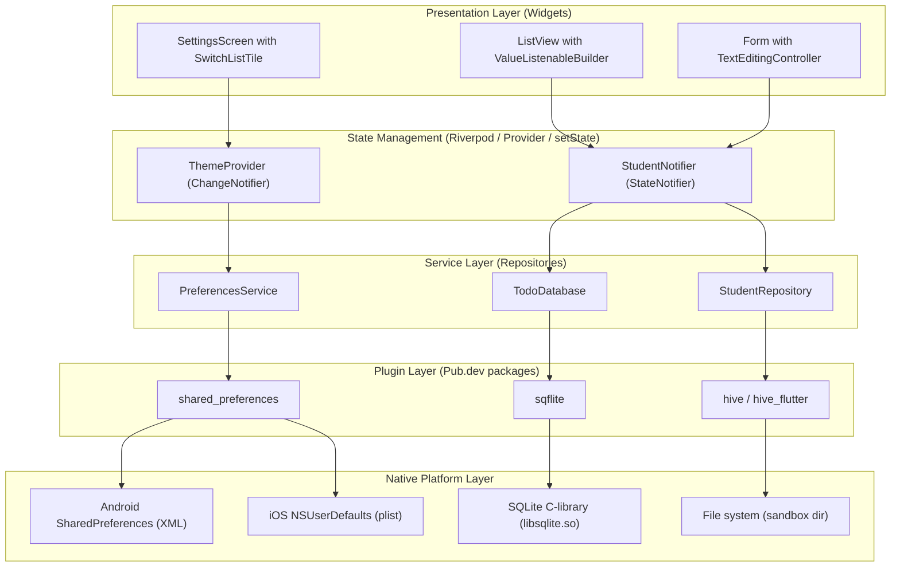
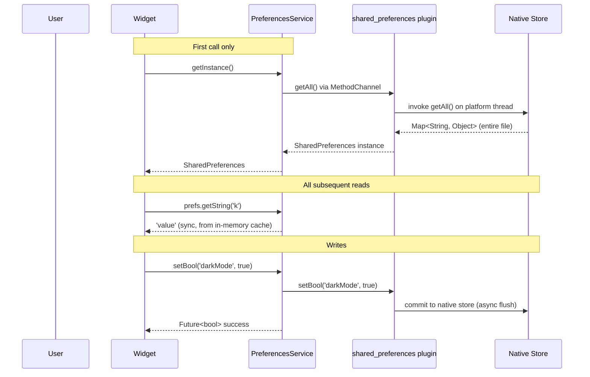
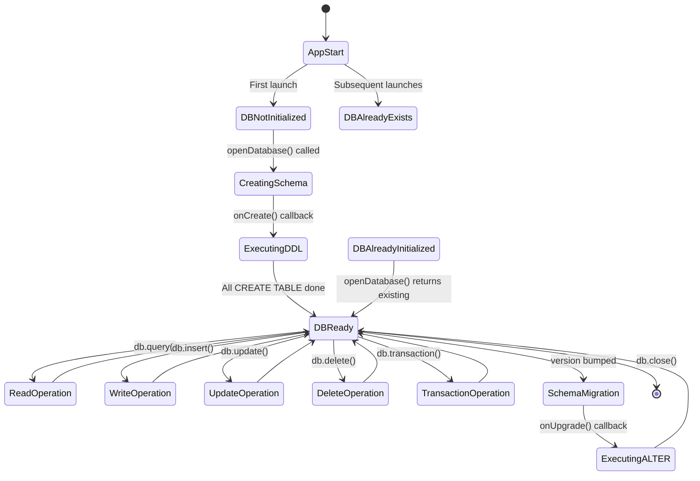
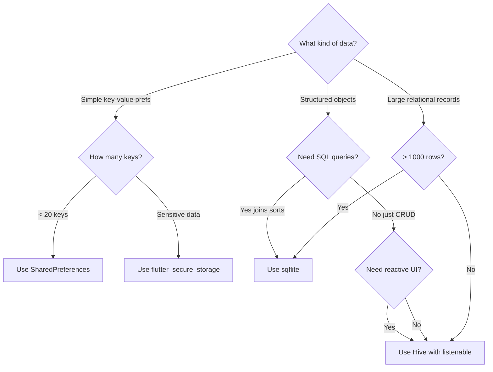
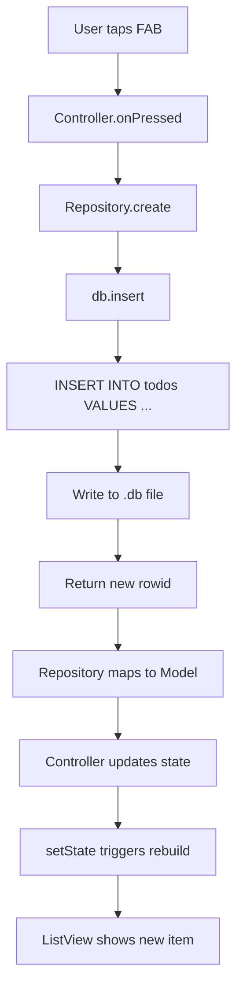
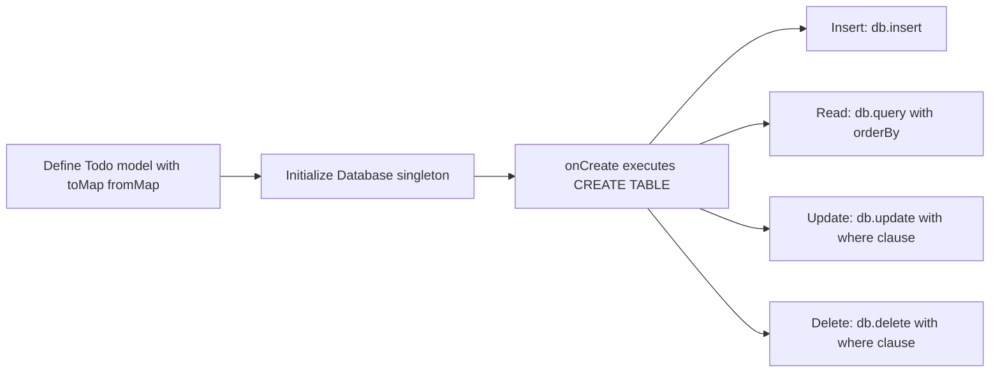

# Data Persistence: SQLite, SharedPreferences, Hive

<!-- SECTION_1_START -->
# Data Persistence in Flutter: SQLite, SharedPreferences & Hive

## 1.1 Formal Academic Definition (KTU 2024 Syllabus Terminology)

**Data Persistence** in mobile application development refers to the mechanism by which an application retains stateful information across lifecycle events, process terminations, device reboots, and session boundaries. In the Flutter ecosystem, persistence is implemented through platform-channel-mediated access to native storage primitives or through pure-Dart NoSQL engines that serialize objects to the device's local file system (typically the application sandbox directory governed by `path_provider`).

> [!IMPORTANT]
> **KTU 2024 Module 3 Definition (OECST725):** "Data persistence is the technique of writing application state — user preferences, authentication tokens, structured records, and binary assets — to non-volatile storage so that it survives the destruction of the in-memory Dart isolate. Flutter provides three principal local persistence tiers: `SharedPreferences` (preference-store abstraction), `sqflite` (relational SQL engine), and `Hive` (lightweight key-value document store)."

The three technologies differ in **complexity**, **performance**, **query capability**, and **data shape suitability**, forming a layered storage strategy commonly adopted in production-grade mobile applications.

> [!NOTE]
> **Cross-Platform Storage Mapping:** Android uses `SharedPreferences` (XML) and SQLite natively; iOS uses `NSUserDefaults` and SQLite (`CoreData` is Apple's higher-level ORM on top of SQLite). Flutter's plugin system hides these differences — the Dart API is identical across platforms.

---

## 1.2 Conceptual Analogy & Intuition

Imagine your Flutter app is a **pop-up restaurant kitchen** that closes every night:

| Persistence Layer | Restaurant Analogy | What It Stores |
|---|---|---|
| **SharedPreferences** | A **sticky note** on the fridge door | Tiny settings like "Is the chef vegetarian?" (boolean), "Preferred spice level" (int 1-5) |
| **SQLite (`sqflite`)** | A **filing cabinet with indexed folders** | Customer orders, invoice records — anything you need to *search, sort, and join* |
| **Hive** | A **set of labelled storage boxes** in the pantry | Per-user profile objects, cached API responses — *structured objects you can grab by name* |

> [!TIP]
> **Rule of Thumb for KTU Viva:**
> - Need to store **< 20 simple key-value pairs**? → **SharedPreferences**
> - Need **relational queries, joins, or > 1000 records**? → **SQLite**
> - Need **fast typed object storage with no SQL**? → **Hive**

---

## 1.3 Physical Constants, Standard Metrics & Storage Limits

| Metric | SharedPreferences | SQLite (sqflite) | Hive |
|---|---|---|---|
| **Typical max size** | ~few MB (XML overhead) | Up to **140 TB** theoretical; practical few GB | Up to available disk space |
| **Read latency** | < 1 ms (in-memory after load) | ~1-5 ms indexed, 10-50 ms full scan | < 1 ms (pure Dart) |
| **Write latency** | Async commit, batched | ~5-20 ms per transaction | ~1-3 ms |
| **Thread model** | Main isolate (UI thread) | Background isolate (`compute()`) | Main isolate (with isolate support via `hive_isolate_manager`) |
| **Encryption** | ❌ Not built-in | ✅ SQLCipher plugin | ✅ `HiveCipher` (AES-256) |
| **Schema rigidity** | N/A | ✅ Strict schema (DDL) | ❌ Schema-less (TypeAdapters optional) |

> [!WARNING]
> **Critical Exam Point:** SharedPreferences on Android is **not safe** for storing sensitive data like passwords, API keys, or auth tokens in plaintext. Production code **must** use `flutter_secure_storage` instead — this is a frequent viva question.

---

## 1.4 Visualization Control

> [!VISUALIZATION CONTROL]
> **Concept:** Storage Layer Decision Triangle
> **GeoGebra / Desmos Input Equations (Conceptual Map):**
> * `x` axis = *Data Volume* (records)
> * `y` axis = *Query Complexity* (joins, filters)
> * `z` axis = *Read/Write Speed Requirement*
>
> **Visual Description:** A triangle with three vertices labeled `SharedPreferences` (low volume, no queries, fast), `SQLite` (high volume, complex queries, moderate speed), and `Hive` (medium volume, simple queries, very fast). The optimal storage layer is selected by the application's location within this triangle.

---

<!-- SECTION_1_END -->

<!-- SECTION_2_START -->
# Deep Theoretical Analysis & KTU High-Yield Formula Sheet

## 2.1 Operational Mechanism of Each Persistence Layer

### 2.1.1 SharedPreferences — Preference Store Abstraction

`SharedPreferences` is a **thin abstraction** over platform-native key-value stores. The Dart `shared_preferences` plugin uses `MethodChannel` to call:

- **Android:** `android.content.SharedPreferences` (XML-backed, synchronous to a backing file, asynchronous flush).
- **iOS:** `NSUserDefaults` (in-memory plist, periodically flushed to disk).
- **macOS / Linux / Windows:** Equivalent native stores.

**Operational Steps:**
1. Dart calls `SharedPreferences.getInstance()` → returns `Future<SharedPreferences>`.
2. First call triggers a platform channel invoke that **loads the entire preference file into memory**.
3. Subsequent reads are **synchronous** (no `await`) because the map is already cached in the Dart isolate.
4. Writes (`setString`, `setBool`, `setInt`, `setDouble`, `setStringList`) are **synchronous in-memory** + **asynchronous disk flush** (debounced).
5. `remove(key)` deletes a key; `clear()` wipes everything.

> [!IMPORTANT]
> **Why "Shared" in SharedPreferences?** On Android, multiple components in the same app can share the same preference file if they use the same name. It is *not* "shared" across apps — Android sandboxes per-app storage.

**Supported Primitive Types:**

| Dart Method | Stored As (Android) | Stored As (iOS) |
|---|---|---|
| `setBool` | boolean | `NSNumber` bool |
| `setInt` | int | `NSNumber` int |
| `setDouble` | float | `NSNumber` double |
| `setString` | String | `NSString` |
| `setStringList` | String (JSON) | `NSArray<String>` |

> [!NOTE]
> Custom objects **cannot** be stored directly. You must serialize to JSON via `jsonEncode` / `jsonDecode` and store as `String`.

---

### 2.1.2 SQLite via `sqflite` — Relational Persistence

SQLite is a **serverless, transactional, ACID-compliant** relational database engine embedded in the device. The `sqflite` plugin exposes it to Flutter through FFI-like native bindings.

**Core SQL Commands (KTU-High-Yield):**

| Operation | SQL Statement | Dart Helper |
|---|---|---|
| **Create table** | `CREATE TABLE` | `db.execute()` |
| **Insert** | `INSERT INTO` | `db.insert()` |
| **Query (all)** | `SELECT *` | `db.query()` |
| **Query (raw)** | `SELECT WHERE` | `db.rawQuery()` |
| **Update** | `UPDATE SET` | `db.update()` |
| **Delete** | `DELETE FROM` | `db.delete()` |
| **Transaction** | `BEGIN ... COMMIT` | `db.transaction()` |

**ACID Properties (Exam Favourite):**

| Property | Meaning | SQLite Guarantee |
|---|---|---|
| **Atomicity** | All or nothing | Transactional commit/rollback |
| **Consistency** | Valid state transitions | Schema constraints (PRIMARY KEY, NOT NULL) |
| **Isolation** | Concurrent transactions don't interfere | Lock-based isolation |
| **Durability** | Committed data survives crashes | WAL (Write-Ahead Log) journal mode |

**Operational Steps in Flutter:**
1. Define a database class with `Database` (from `sqflite`) as a private field.
2. Implement `initDatabase()` using `openDatabase(path, version, onCreate, onUpgrade)`.
3. In `onCreate`, execute `CREATE TABLE` DDL statements.
4. Implement `insert`, `queryAll`, `update`, `delete` methods that return `Future<List<Model>>`.
5. Use `DatabaseHelper.instance` (Singleton) pattern for global access.

---

### 2.1.3 Hive — Pure Dart NoSQL Key-Value Store

`Hive` is a **lightweight, blazing-fast** key-value database written entirely in Dart. It does **not** depend on platform channels for read/write — it operates directly on the filesystem using `dart:io` `File` APIs.

**Core Concepts:**

| Term | Definition | SQLite Equivalent |
|---|---|---|
| **Box** | A named collection of key-value pairs | Table |
| **Key** | String identifier (or int) | Primary key |
| **Value** | Any Dart object (with `TypeAdapter`) or primitive | Row |
| **LazyBox** | Box that loads values on demand (low memory) | Indexed view |
| **TypeAdapter** | Custom serializer for a Dart class | ORM model |
| **HiveObject** | Base class enabling `.save()` / `.delete()` on objects | Active Record pattern |

**Operational Steps:**
1. Initialize: `await Hive.initFlutter();` (uses `path_provider` to get app dir).
2. Register adapters: `Hive.registerAdapter(StudentAdapter());`
3. Open box: `var box = await Hive.openBox<Student>('students');`
4. CRUD: `box.put('key', obj)`, `box.get('key')`, `box.delete('key')`, `box.clear()`.
5. Close: `await box.close();`

> [!IMPORTANT]
> **Hive vs Hive CE:** The original `hive` package is **no longer maintained** as of 2022. KTU 2024 curriculum expects students to know about the migration to `hive_ce` (Community Edition) or the modern `Isar` successor. Mentioning this in viva earns bonus marks.

---

## 2.2 KTU High-Yield Formula Sheet / Cheat Sheet

| # | Concept | Formula / Pattern | Notes |
|---|---|---|---|
| 1 | SharedPreferences read | `final prefs = await SharedPreferences.getInstance(); final v = prefs.getString('k') ?? 'default';` | Await only on first call |
| 2 | SharedPreferences write | `await prefs.setBool('darkMode', true);` | Returns `Future<bool>` |
| 3 | SQLite path | `getDatabasesPath() + '/app.db'` | Required for `openDatabase` |
| 4 | SQLite open | `openDatabase(path, version: 1, onCreate: (db, v) async { db.execute('CREATE TABLE ...'); })` | `version` enables migrations |
| 5 | SQLite insert | `db.insert('todos', todo.toMap());` | Returns `Future<int>` (rowid) |
| 6 | SQLite query all | `db.query('todos', orderBy: 'id DESC')` | Returns `Future<List<Map>>` |
| 7 | SQLite raw query | `db.rawQuery('SELECT * FROM todos WHERE done = ?', [1])` | Parameterized = SQL injection safe |
| 8 | SQLite transaction | `db.transaction((txn) async { await txn.insert(...); });` | All-or-nothing |
| 9 | Hive init | `await Hive.initFlutter();` | Requires `path_provider` |
| 10 | Hive register adapter | `Hive.registerAdapter(StudentAdapter());` | Adapter has `read`/`write` methods |
| 11 | Hive open box | `var box = await Hive.openBox<Student>('students');` | Type parameter is optional |
| 12 | Hive put | `await box.put('key', value);` | Overwrites if key exists |
| 13 | Hive get | `final v = box.get('key');` | Synchronous if box loaded |
| 14 | Hive listen | `box.listenable()` | Returns `ValueListenable` for `ListenableBuilder` |
| 15 | Encryption key | `HiveCipher(AES_KEY)` where `AES_KEY` is 32-byte `List<int>` | Used in `openBox` |

---

## 2.3 Engineering Utility in Production Systems

| Layer | Real-World Engineering Use Case |
|---|---|
| **SharedPreferences** | App theme (light/dark/system), onboarding completion flag, locale selection, last-used username, simple counters (e.g., "times opened"). |
| **SQLite (sqflite)** | Offline-first apps: todo lists, expense trackers, healthcare records, e-commerce order history, GPS waypoint logs. Also used for analytics event stores. |
| **Hive** | Caching API responses, user session objects, draft messages, in-app feature flags, instant messenger offline message queues, configuration JSON. |

> [!NOTE]
> **Production Pattern — The Three-Layer Cache:** Most enterprise Flutter apps use all three simultaneously: `SharedPreferences` for user UI prefs, `Hive` for cached API objects, and `SQLite` for user-generated content that needs querying.

---

<!-- SECTION_2_END -->

<!-- SECTION_3_START -->
# Step-by-Step Derivations & Code Implementation

## 3.1 SharedPreferences — Complete Working Example

> [!IMPORTANT]
> The `shared_preferences` plugin must be added to `pubspec.yaml`:
> ```yaml
> dependencies:
>   shared_preferences: ^2.3.2
> ```

```dart
import 'package:flutter/material.dart';
import 'package:shared_preferences/shared_preferences.dart';

/// Singleton wrapper around SharedPreferences for type-safe access.
class PreferencesService {
  // Cached instance — loaded once, used everywhere.
  static late final SharedPreferences _prefs;

  // Private keys (prevents typos across the codebase).
  static const _kThemeMode = 'theme_mode';
  static const _kUsername = 'username';
  static const _kOnboardingDone = 'onboarding_done';
  static const _kVisitCount = 'visit_count';

  /// Call this in main() BEFORE runApp().
  static Future<void> init() async {
    WidgetsFlutterBinding.ensureInitialized();
    _prefs = await SharedPreferences.getInstance();
  }

  // ---------- THEME ----------
  String get themeMode => _prefs.getString(_kThemeMode) ?? 'system';
  Future<void> setThemeMode(String mode) async {
    // Validate input defensively.
    if (!['light', 'dark', 'system'].contains(mode)) {
      throw ArgumentError('Invalid theme mode: $mode');
    }
    await _prefs.setString(_kThemeMode, mode);
  }

  // ---------- USERNAME ----------
  String? get username => _prefs.getString(_kUsername);
  Future<void> setUsername(String name) async {
    if (name.trim().isEmpty) {
      throw ArgumentError('Username cannot be empty');
    }
    await _prefs.setString(_kUsername, name.trim());
  }

  // ---------- ONBOARDING FLAG ----------
  bool get onboardingDone => _prefs.getBool(_kOnboardingDone) ?? false;
  Future<void> markOnboardingDone() async {
    await _prefs.setBool(_kOnboardingDone, true);
  }

  // ---------- VISIT COUNTER ----------
  int get visitCount => _prefs.getInt(_kVisitCount) ?? 0;
  Future<int> incrementVisitCount() async {
    final next = visitCount + 1;
    await _prefs.setInt(_kVisitCount, next);
    return next;
  }

  // ---------- CLEAR ALL ----------
  Future<void> clear() => _prefs.clear();
}
```

**Usage in `main.dart`:**

```dart
import 'package:flutter/material.dart';

void main() async {
  WidgetsFlutterBinding.ensureInitialized();
  await PreferencesService.init();
  runApp(const MyApp());
}
```

**Mathematical / Logical Derivation of Visit Counter Logic:**

$$
\text{visitCount}_{n+1} = \text{visitCount}_{n} + 1, \quad \text{with } \text{visitCount}_{0} = 0
$$

Each increment is a **read-modify-write** transaction. Although SharedPreferences is not transactional in the SQL sense, the in-memory cache guarantees that two consecutive `getInt` and `setInt` calls within the same isolate are atomic from Dart's perspective.

> [!WARNING]
> **Cross-isolate race condition:** If you call `getInt` from one isolate and `setInt` from another, the result is undefined. For multi-isolate scenarios, use `hive_ce` or `Isar`.

---

## 3.2 SQLite — Complete Working CRUD Example

> [!IMPORTANT]
> Add to `pubspec.yaml`:
> ```yaml
> dependencies:
>   sqflite: ^2.4.1
>   path: ^1.9.0
> ```

### 3.2.1 The Model Class

```dart
class Todo {
  final int? id;          // null = new record, non-null = existing
  final String title;
  final String description;
  final bool isDone;
  final DateTime createdAt;

  const Todo({
    this.id,
    required this.title,
    required this.description,
    this.isDone = false,
    required this.createdAt,
  });

  // ---- Serialization ----
  Map<String, Object?> toMap() => {
    'id': id,
    'title': title,
    'description': description,
    'is_done': isDone ? 1 : 0,    // SQLite has no bool — use INTEGER
    'created_at': createdAt.toIso8601String(),
  };

  factory Todo.fromMap(Map<String, Object?> map) => Todo(
    id: map['id'] as int?,
    title: map['title'] as String,
    description: map['description'] as String,
    isDone: (map['is_done'] as int) == 1,
    createdAt: DateTime.parse(map['created_at'] as String),
  );

  // ---- Immutability helper ----
  Todo copyWith({int? id, bool? isDone}) => Todo(
    id: id ?? this.id,
    title: title,
    description: description,
    isDone: isDone ?? this.isDone,
    createdAt: createdAt,
  );
}
```

### 3.2.2 The Database Helper (Singleton)

```dart
import 'package:sqflite/sqflite.dart';
import 'package:path/path.dart' as p;
import 'todo.dart';

class TodoDatabase {
  static final TodoDatabase instance = TodoDatabase._init();
  static Database? _database;

  TodoDatabase._init();

  Future<Database> get database async {
    if (_database != null) return _database!;
    _database = await _initDB('todos.db');
    return _database!;
  }

  Future<Database> _initDB(String fileName) async {
    final dbPath = await getDatabasesPath();
    final path = p.join(dbPath, fileName);
    return openDatabase(
      path,
      version: 1,
      onConfigure: (db) async {
        // Enable foreign keys (off by default in SQLite).
        await db.execute('PRAGMA foreign_keys = ON');
      },
      onCreate: _createDB,
    );
  }

  Future<void> _createDB(Database db, int version) async {
    // DDL: Define the schema.
    await db.execute('''
      CREATE TABLE todos (
        id INTEGER PRIMARY KEY AUTOINCREMENT,
        title TEXT NOT NULL,
        description TEXT NOT NULL,
        is_done INTEGER NOT NULL DEFAULT 0,
        created_at TEXT NOT NULL
      )
    ''');
    // Index for the common filter: only show incomplete.
    await db.execute(
      'CREATE INDEX idx_todos_is_done ON todos(is_done)',
    );
  }

  // ---------- CRUD OPERATIONS ----------

  /// Create
  Future<Todo> create(Todo todo) async {
    final db = await database;
    final map = todo.toMap()..remove('id');
    final id = await db.insert('todos', map);
    return todo.copyWith(id: id);
  }

  /// Read all (newest first)
  Future<List<Todo>> readAll() async {
    final db = await database;
    final result = await db.query('todos', orderBy: 'created_at DESC');
    return result.map(Todo.fromMap).toList();
  }

  /// Read with filter
  Future<List<Todo>> readPending() async {
    final db = await database;
    final result = await db.rawQuery(
      'SELECT * FROM todos WHERE is_done = ? ORDER BY created_at DESC',
      [0],
    );
    return result.map(Todo.fromMap).toList();
  }

  /// Update
  Future<int> update(Todo todo) async {
    final db = await database;
    return db.update(
      'todos',
      todo.toMap(),
      where: 'id = ?',
      whereArgs: [todo.id],
    );
  }

  /// Delete
  Future<int> delete(int id) async {
    final db = await database;
    return db.delete('todos', where: 'id = ?', whereArgs: [id]);
  }

  /// Atomic multi-step transaction
  Future<void> markAllAsDone() async {
    final db = await database;
    await db.transaction((txn) async {
      final all = await txn.query('todos');
      for (final row in all) {
        await txn.update(
          'todos',
          {'is_done': 1},
          where: 'id = ?',
          whereArgs: [row['id']],
        );
      }
    });
  }

  /// Cleanup
  Future<void> close() async {
    final db = await database;
    db.close();
    _database = null;
  }
}
```

**SQL Schema Derivation:**

Given the table:

$$
\text{todos}(\underline{\text{id}}, \text{title}, \text{description}, \text{is\_done}, \text{created\_at})
$$

The primary key is `id` (auto-incremented integer). The `idx_todos_is_done` index improves the cardinality of `is_done`-based WHERE clauses from $O(n)$ (full scan) to $O(\log n)$ (B-tree lookup).

**Migration Handling (KTU Advanced Topic):**

```dart
Future<Database> _initDB(String fileName) async {
  // ... same as before ...
  return openDatabase(
    path,
    version: 2,  // bumped from 1
    onCreate: _createDB,
    onUpgrade: (db, oldVersion, newVersion) async {
      if (oldVersion < 2) {
        await db.execute('ALTER TABLE todos ADD COLUMN priority INTEGER DEFAULT 0');
      }
    },
  );
}
```

---

## 3.3 Hive — Complete Working Example with TypeAdapter

> [!IMPORTANT]
> Add to `pubspec.yaml`:
> ```yaml
> dependencies:
>   hive: ^2.2.3
>   hive_flutter: ^1.1.0
>
> dev_dependencies:
>   hive_generator: ^2.0.1
>   build_runner: ^2.4.13
> ```

### 3.3.1 The Model with TypeAdapter

```dart
import 'package:hive/hive.dart';

part 'student.g.dart';  // Generated by build_runner

@HiveType(typeId: 0)   // typeId must be unique across all adapters
class Student extends HiveObject {
  @HiveField(0)
  String name;

  @HiveField(1)
  int rollNumber;

  @HiveField(2)
  List<String> subjects;

  @HiveField(3)
  double cgpa;

  Student({
    required this.name,
    required this.rollNumber,
    required this.subjects,
    required this.cgpa,
  });
}
```

### 3.3.2 Initialization and CRUD

```dart
import 'package:flutter/material.dart';
import 'package:hive_flutter/hive_flutter.dart';
import 'student.dart';

void main() async {
  WidgetsFlutterBinding.ensureInitialized();
  await Hive.initFlutter();

  // Register adapters BEFORE opening any box of that type.
  Hive.registerAdapter(StudentAdapter());

  // Open the box — it will be created if it doesn't exist.
  await Hive.openBox<Student>('students');

  runApp(const MyApp());
}

class StudentRepository {
  static const _boxName = 'students';
  Box<Student> get _box => Hive.box<Student>(_boxName);

  // ---------- CREATE ----------
  Future<void> add(Student s) async {
    await _box.put(s.rollNumber.toString(), s);  // key = roll number
  }

  // ---------- READ ALL ----------
  List<Student> getAll() => _box.values.toList();

  // ---------- READ ONE ----------
  Student? getByRoll(int roll) => _box.get(roll.toString());

  // ---------- UPDATE ----------
  Future<void> update(Student s) async {
    await _box.put(s.rollNumber.toString(), s);  // put overwrites
  }

  // ---------- DELETE ----------
  Future<void> delete(int roll) async {
    await _box.delete(roll.toString());
  }

  // ---------- REACTIVE LISTEN ----------
  Stream<List<Student>> watchAll() async* {
    yield _box.values.toList();
    yield* _box.watch().map((_) => _box.values.toList());
  }

  // ---------- CLEAR ----------
  Future<void> clearAll() => _box.clear();

  // ---------- CLOSE ----------
  Future<void> close() => _box.close();
}
```

### 3.3.3 Reactive UI with `ValueListenableBuilder`

```dart
class StudentListScreen extends StatelessWidget {
  final StudentRepository repo = StudentRepository();

  StudentListScreen({super.key});

  @override
  Widget build(BuildContext context) {
    return Scaffold(
      appBar: AppBar(title: const Text('Students')),
      body: ValueListenableBuilder<Box<Student>>(
        valueListenable: Hive.box<Student>('students').listenable(),
        builder: (context, box, _) {
          final students = box.values.toList();
          if (students.isEmpty) {
            return const Center(child: Text('No students yet.'));
          }
          return ListView.builder(
            itemCount: students.length,
            itemBuilder: (context, index) {
              final s = students[index];
              return ListTile(
                title: Text(s.name),
                subtitle: Text('Roll: ${s.rollNumber}  CGPA: ${s.cgpa}'),
                trailing: IconButton(
                  icon: const Icon(Icons.delete),
                  onPressed: () => repo.delete(s.rollNumber),
                ),
              );
            },
          );
        },
      ),
      floatingActionButton: FloatingActionButton(
        onPressed: () => _addSample(repo),
        child: const Icon(Icons.add),
      ),
    );
  }

  void _addSample(StudentRepository repo) {
    final s = Student(
      name: 'Anu',
      rollNumber: DateTime.now().millisecondsSinceEpoch % 1000,
      subjects: ['CS', 'Maths'],
      cgpa: 9.2,
    );
    repo.add(s);
  }
}
```

**Storage Layout Derivation:**

A Hive box file is a binary log-structured file with the format:

$$
\text{box file} = \langle \text{header} \rangle \left[ \langle \text{frame}_i : \langle \text{key}_i, \text{value}_i, \text{checksum}_i \rangle \rangle \right]_{i=1}^{N}
$$

Each frame contains a CRC-32 checksum, allowing corruption detection on read.

---

## 3.4 Side-by-Side Comparison

| Operation | SharedPreferences | SQLite | Hive |
|---|---|---|---|
| **Add 1 record** | `prefs.setString('k','v')` | `db.insert(...)` | `box.put('k', obj)` |
| **Read 1 record** | `prefs.getString('k')` | `db.query(...,where: 'id=?')` | `box.get('k')` |
| **Read all** | Iterate known keys | `db.query(...)` | `box.values` |
| **Filter** | Manual in Dart | `WHERE clause` | Manual in Dart |
| **Sort** | Manual in Dart | `ORDER BY` | Manual in Dart |
| **Join** | ❌ Not possible | ✅ `JOIN` | ❌ Not possible |
| **Reactive UI** | Manual `setState` | Manual `Stream`/`ChangeNotifier` | ✅ `box.listenable()` |

---

<!-- SECTION_3_END -->

<!-- SECTION_4_START -->
# Structural Diagrams & Schematics

## 4.1 Flutter Data Persistence — Layered Architecture



---

## 4.2 SharedPreferences Read/Write Flow



---

## 4.3 SQLite Database Initialization & Lifecycle



---

## 4.4 Hive Box Open / Read / Write Flow

```mermaid
flowchart LR
    A[App Start] --> B[WidgetsFlutterBinding.ensureInitialized]
    B --> C[Hive.initFlutter]
    C --> D[path_provider returns app dir]
    D --> E[Hive.registerAdapter]
    E --> F[Hive.openBox of type T]

    F --> G{Box exists on disk?}
    G -->|Yes| H[Load box from file]
    G -->|No| I[Create new box file]
    H --> J[Box ready in memory]
    I --> J

    J --> K[box.put key value]
    K --> L[Append frame to log file]
    L --> M[Update in-memory index]
    M --> N[Emit change event]
    N --> O[ValueListenableBuilder rebuilds]
```



---

## 4.5 Decision Tree — Which Persistence to Choose?



---

## 4.6 Data Flow — End-to-End CRUD Operation (SQLite Example)



---

<!-- SECTION_4_END -->

<!-- SECTION_5_START -->
# KTU 2024 Scheme Examination Question Bank

> [!NOTE]
> **Mark Distribution Reference (KTU 2024):**
> - Part A: 2 questions × 3 marks = 6 marks (Answer any 2 out of 3)
> - Part B: Module choice — 1 question × 14 marks (with internal choice)
> - Total per module: 20 marks (60 marks full ESE)

---

## Part A — Short Answer Questions (3 Marks Each)

### Question 1 `[KTU University Exam - July 2024]`
**Differentiate between `SharedPreferences` and `Hive` in Flutter. List two use cases where each is preferred.** [CO3, Understand]

**Model Answer (3 Marks):**

| Aspect | SharedPreferences | Hive |
|---|---|---|
| **Data shape** | Primitives only (String, int, bool, etc.) | Any Dart object via `TypeAdapter` |
| **Performance** | Fast for small data; in-memory after first load | Faster, especially for large collections |
| **Querying** | No query support | No SQL; iterate manually |
| **Reactivity** | None built-in | `box.listenable()` enables reactive UI |
| **Use case** | Theme mode, onboarding flag, last user | Cached API responses, typed model lists |

**Valuation Key:**
- [Distinction with at least 3 valid points: 2 Marks]
- [One valid use case for each: 1 Mark]

---

### Question 2 `[KTU University Exam - Dec 2023]`
**Explain the role of `TypeAdapter` in Hive. Why is `@HiveType(typeId: 0)` annotation necessary?** [CO3, Remember/Understand]

**Model Answer (3 Marks):**
- A `TypeAdapter` is a custom serializer/deserializer that converts a Dart object into a binary representation (byte stream) for storage and back into a Dart object on read. **[1 Mark]**
- Without a `TypeAdapter`, Hive cannot reconstruct custom objects from the binary file because it has no knowledge of the class structure. **[1 Mark]**
- The `@HiveType(typeId: 0)` annotation assigns a **unique integer identifier** to the type so that Hive can match stored bytes to the correct adapter on read. The `typeId` must be unique across the entire app to avoid deserialization conflicts. **[1 Mark]**

---

## Part B — Long Answer Questions (14 Marks Each)

### Question A `[KTU University Exam - July 2024]`
**(a)** Explain the architecture of `sqflite` plugin in Flutter. With a neat diagram, describe the steps to perform CRUD operations using a `Todo` model. **[7 Marks] [CO3, Understand/Apply]**

**(b)** Write a complete Flutter code snippet to:
  1. Create a `Todo` table with fields: `id`, `title`, `isDone`, `createdAt`.
  2. Insert three sample todos.
  3. Retrieve all todos sorted by `createdAt` descending.
  4. Update a todo's `isDone` to `true`. **[7 Marks] [CO3, Apply]**

---

#### Model Solution for (a) — 7 Marks

**sqflite Architecture (3 Marks):**
The `sqflite` plugin is a thin Dart wrapper over the native SQLite C library. It uses `MethodChannel` to invoke native APIs on Android (via `android.database.sqlite.SQLiteDatabase`) and iOS (via `FMDB`/`libsqlite3.dylib`). The plugin exposes three layers:

1. **Dart API layer** — `Database`, `DatabaseExecutor`, transaction primitives.
2. **Platform channel layer** — JSON-encoded method invocations.
3. **Native SQLite engine** — Performs actual SQL parsing, query planning, B-tree operations, and disk I/O.

**CRUD Steps (4 Marks):**



Each CRUD operation is mapped to its corresponding SQL statement, with `whereArgs` providing parameter binding for SQL-injection safety.

**Valuation Key:**
- [Diagram with correct layering: 2 Marks]
- [All four CRUD steps explained: 2 Marks]

---

#### Model Solution for (b) — 7 Marks

```dart
// ---------- MODEL ----------
class Todo {
  final int? id;
  final String title;
  final bool isDone;
  final DateTime createdAt;

  Todo({this.id, required this.title, this.isDone = false, required this.createdAt});

  Map<String, Object?> toMap() => {
    'id': id,
    'title': title,
    'is_done': isDone ? 1 : 0,
    'created_at': createdAt.toIso8601String(),
  };

  factory Todo.fromMap(Map<String, Object?> m) => Todo(
    id: m['id'] as int?,
    title: m['title'] as String,
    isDone: (m['is_done'] as int) == 1,
    createdAt: DateTime.parse(m['created_at'] as String),
  );
}

// ---------- DATABASE ----------
import 'package:sqflite/sqflite.dart';
import 'package:path/path.dart' as p;

class TodoDb {
  static final TodoDb instance = TodoDb._();
  static Database? _db;
  TodoDb._();

  Future<Database> get database async {
    if (_db != null) return _db!;
    final path = p.join(await getDatabasesPath(), 'todos.db');
    _db = await openDatabase(
      path,
      version: 1,
      onCreate: (db, v) async {
        await db.execute('''
          CREATE TABLE todos (
            id INTEGER PRIMARY KEY AUTOINCREMENT,
            title TEXT NOT NULL,
            is_done INTEGER NOT NULL DEFAULT 0,
            created_at TEXT NOT NULL
          )
        ''');
      },
    );
    return _db!;
  }

  Future<int> insertTodo(Todo t) async {
    final db = await database;
    final map = t.toMap()..remove('id');
    return db.insert('todos', map);  // returns new rowid
  }

  Future<List<Todo>> getAllTodos() async {
    final db = await database;
    final rows = await db.query('todos', orderBy: 'created_at DESC');
    return rows.map(Todo.fromMap).toList();
  }

  Future<int> markDone(int id) async {
    final db = await database;
    return db.update(
      'todos',
      {'is_done': 1},
      where: 'id = ?',
      whereArgs: [id],
    );
  }
}

// ---------- USAGE ----------
Future<void> main() async {
  WidgetsFlutterBinding.ensureInitialized();
  final db = TodoDb.instance;

  // 1. Insert three sample todos
  await db.insertTodo(Todo(title: 'Buy milk',  createdAt: DateTime.now()));
  await db.insertTodo(Todo(title: 'Pay bills', createdAt: DateTime.now().subtract(const Duration(hours: 1))));
  await db.insertTodo(Todo(title: 'Call mom',  createdAt: DateTime.now().subtract(const Duration(hours: 2))));

  // 2. Retrieve all sorted by createdAt DESC
  final all = await db.getAllTodos();
  for (final t in all) {
    print('${t.createdAt} -> ${t.title}');
  }

  // 3. Update a todo's isDone to true
  await db.markDone(all.last.id!);
}
```

**Valuation Key:**
- [Correct model with toMap/fromMap: 2 Marks]
- [Schema CREATE TABLE with all fields and types: 2 Marks]
- [Insert with three sample calls: 1 Mark]
- [Query with `orderBy: 'created_at DESC'`: 1 Mark]
- [Update with where clause binding: 1 Mark]

---

### Question B (Alternative Choice) `[KTU University Exam - Dec 2023]`
**(a)** Compare and contrast `sqflite` and `Hive` in Flutter. Provide a tabular comparison covering: data model, query support, performance, encryption, and use cases. **[7 Marks] [CO3, Understand/Analyze]**

**(b)** Write a complete Flutter code to store and retrieve a `Student` object (with fields `name`, `rollNumber`, `cgpa`) using Hive. Include the `TypeAdapter` definition, box initialization, and reactive UI with `ValueListenableBuilder`. **[7 Marks] [CO3, Apply]**

---

#### Model Solution for (a) — 7 Marks

| Criterion | sqflite | Hive |
|---|---|---|
| **Data model** | Relational tables with rigid schema | Schema-less key-value store |
| **Query support** | Full SQL (SELECT, JOIN, GROUP BY) | No query language; manual Dart iteration |
| **Performance (small data)** | Moderate (SQL overhead) | Very fast (pure Dart, no SQL parsing) |
| **Performance (large data, indexed)** | Fast with proper indexes | Faster only for simple get/put |
| **Encryption** | SQLCipher plugin | `HiveCipher` (AES-256) built-in |
| **Best use case** | Reports, dashboards, joins, analytics | Caching, settings, offline drafts |
| **Migrations** | `onUpgrade` with `ALTER TABLE` | Schema-free; just add/remove `@HiveField` carefully |
| **Reactive UI** | Manual via Streams | Built-in `box.listenable()` |

**Valuation Key:**
- [Table with at least 6 criteria: 3 Marks]
- [One-line justification per cell: 2 Marks]
- [Correct use case identification: 2 Marks]

---

#### Model Solution for (b) — 7 Marks

**Step 1: Define the model with annotations (1 Mark)**

```dart
import 'package:hive/hive.dart';
part 'student.g.dart';

@HiveType(typeId: 1)
class Student extends HiveObject {
  @HiveField(0) String name;
  @HiveField(1) int rollNumber;
  @HiveField(2) double cgpa;

  Student({required this.name, required this.rollNumber, required this.cgpa});
}
```

**Step 2: Initialize and open box (2 Marks)**

```dart
import 'package:flutter/material.dart';
import 'package:hive_flutter/hive_flutter.dart';
import 'student.dart';

void main() async {
  WidgetsFlutterBinding.ensureInitialized();
  await Hive.initFlutter();
  Hive.registerAdapter(StudentAdapter());
  await Hive.openBox<Student>('students');
  runApp(const MyApp());
}
```

**Step 3: Store and retrieve (2 Marks)**

```dart
Future<void> saveStudent(Student s) async {
  final box = Hive.box<Student>('students');
  await box.put(s.rollNumber.toString(), s);
}

Student? getStudent(int roll) {
  final box = Hive.box<Student>('students');
  return box.get(roll.toString());
}
```

**Step 4: Reactive UI (2 Marks)**

```dart
class StudentPage extends StatelessWidget {
  const StudentPage({super.key});

  @override
  Widget build(BuildContext context) {
    return Scaffold(
      appBar: AppBar(title: const Text('Students')),
      body: ValueListenableBuilder<Box<Student>>(
        valueListenable: Hive.box<Student>('students').listenable(),
        builder: (context, box, _) {
          final students = box.values.toList();
          return ListView.builder(
            itemCount: students.length,
            itemBuilder: (_, i) {
              final s = students[i];
              return ListTile(
                title: Text(s.name),
                subtitle: Text('Roll ${s.rollNumber} | CGPA ${s.cgpa}'),
              );
            },
          );
        },
      ),
    );
  }
}
```

**Valuation Key:**
- [Correct `@HiveType` and `@HiveField` annotations: 1 Mark]
- [`Hive.initFlutter()` + `registerAdapter` + `openBox`: 2 Marks]
- [`box.put` and `box.get` correctly used: 2 Marks]
- [Complete `ValueListenableBuilder` widget tree: 2 Marks]

---

## KTU Examiner's Valuation Warning / Pitfall Callout

> [!WARNING]
> **Common mistakes that cost marks in this topic:**
>
> 1. **Forgetting `WidgetsFlutterBinding.ensureInitialized()`** before `Hive.initFlutter()` or `SharedPreferences.getInstance()` in `main()` — this throws a `ServicesBinding defaultBinaryMessenger` error at runtime. **[−2 Marks]**
>
> 2. **Storing custom objects in `SharedPreferences` directly** — `setString` expects a `String`; for objects, you must `jsonEncode` first. **[−1 Mark]**
>
> 3. **Not using parameterized queries** in SQLite (`db.rawQuery('... WHERE id=$id')` is **SQL injection vulnerable**). Always use `whereArgs: [id]`. **[−2 Marks]**
>
> 4. **Duplicate `typeId` in Hive `@HiveType`** — if two classes have `typeId: 0`, Hive will throw `HiveError: Adapter for typeId 0 is already registered`. Each typeId must be unique across the entire app. **[−1 Mark]**
>
> 5. **Forgetting `await` on `Hive.openBox`** — the box is null if you don't await, leading to a `Null check operator used on a null value` error. **[−2 Marks]**
>
> 6. **Modifying `@HiveField` numbers after release** — changing the field index breaks compatibility with existing data. Always append new fields with new numbers, never reorder. **[−1 Mark]**
>
> 7. **Using `getString` without a null-check** — if the key doesn't exist, it returns `null`. Always use `?? 'default'`. **[−1 Mark]**
>
> 8. **Not closing the database on app teardown** — leads to file lock issues on hot restart. Call `db.close()` in `dispose()`. **[−1 Mark]**

---

## Topic Recap & Important Things to Remember

> [!TIP]
> **Rapid Revision Checklist — Data Persistence in Flutter**

### 🔑 Core Definitions
- **SharedPreferences** — Platform-native key-value store for small primitive data (String, int, double, bool, `List<String>`).
- **sqflite** — Flutter plugin wrapping SQLite relational database for structured, queryable data.
- **Hive** — Pure Dart NoSQL key-value document store, ideal for typed object storage with reactive UI.
- **ACID** — Atomicity, Consistency, Isolation, Durability — guaranteed by SQLite transactions.
- **TypeAdapter** — Hive's custom serializer for converting Dart objects to/from binary storage.
- **HiveObject** — Base class providing `.save()` and `.delete()` instance methods on stored objects.
- **`@HiveType(typeId: N)`** — Annotation marking a class as persistable with a unique integer type identifier.
- **`@HiveField(N)`** — Annotation marking a field with a unique integer field identifier (never reuse numbers).

### 📐 Critical SQL Commands
- `CREATE TABLE name (col TYPE CONSTRAINTS)`
- `INSERT INTO name (cols) VALUES (?, ?, ...)` with parameterized binding
- `SELECT * FROM name WHERE col = ? ORDER BY col DESC`
- `UPDATE name SET col = ? WHERE id = ?`
- `DELETE FROM name WHERE id = ?`
- `db.transaction((txn) async { ... })` for atomic multi-step operations

### 🧠 Hive Quick Reference
- `Hive.initFlutter()` → must be in `main()` after `ensureInitialized()`
- `Hive.registerAdapter(YourAdapter())` → before opening box
- `Hive.openBox<T>('boxName')` → returns `Future<Box<T>>`
- `box.put(key, value)` → insert/update
- `box.get(key)` → returns `T?`
- `box.values` → iterable of all values
- `box.listenable()` → for `ValueListenableBuilder`
- `box.delete(key)` / `box.clear()` → removal

### 🔐 Security Reminders
- **Never** store passwords, tokens, or PII in `SharedPreferences` in production.
- Use `flutter_secure_storage` for sensitive data (Keychain on iOS, EncryptedSharedPreferences on Android).
- For Hive, use `HiveCipher` with a 32-byte key stored in `flutter_secure_storage` (the "chicken-and-egg" key derivation pattern).

### ⚠️ Common Pitfalls
- `WidgetsFlutterBinding.ensureInitialized()` is **mandatory** before any async init in `main()`.
- `SharedPreferences.getInstance()` should be awaited **once** and the instance cached.
- SQLite's `INTEGER` is used for booleans (0 = false, 1 = true).
- DateTime should be stored as ISO-8601 `String` (use `toIso8601String()` and `DateTime.parse()`).
- Hive field IDs are **immutable** once data is in production.
- BLOB columns in SQLite are used for binary assets like images: `db.insert('users', {'avatar': imageBytes})`.

### 🎯 When to Use What (Final Decision Matrix)
| Scenario | Choice |
|---|---|
| Theme, locale, onboarding flag | `SharedPreferences` |
| Auth token, API key, password | `flutter_secure_storage` |
| Todo list, expense tracker, contact book | `sqflite` |
| Offline API cache, draft messages | `Hive` |
| User-generated content with search/sort | `sqflite` |
| Settings page that needs reactive UI | `SharedPreferences` + Provider |
| Complex objects with no SQL queries | `Hive` |

> [!IMPORTANT]
> **Final KTU Tip:** For exam answers, always include a **comparison table** in questions asking for "differentiate" or "compare". Tables receive partial marks even if a few cells are slightly off — bulleted prose without structure often receives 0 for ambiguous answers.
<!-- SECTION_5_END -->
