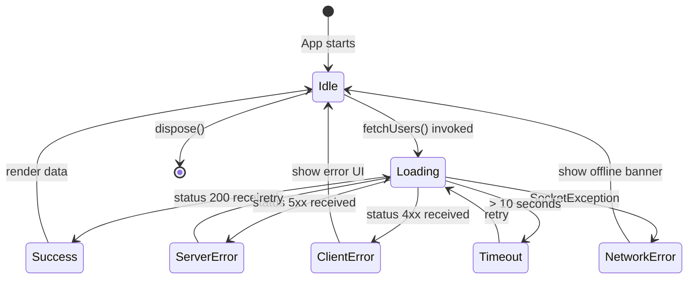
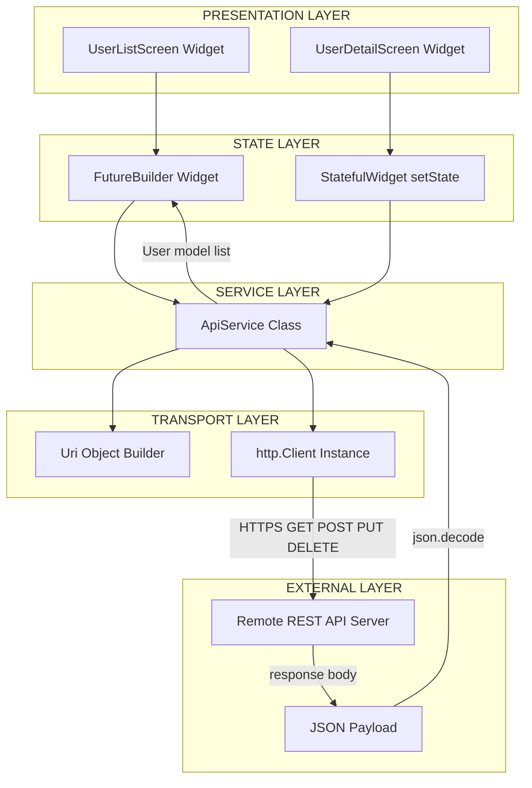
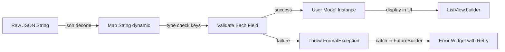
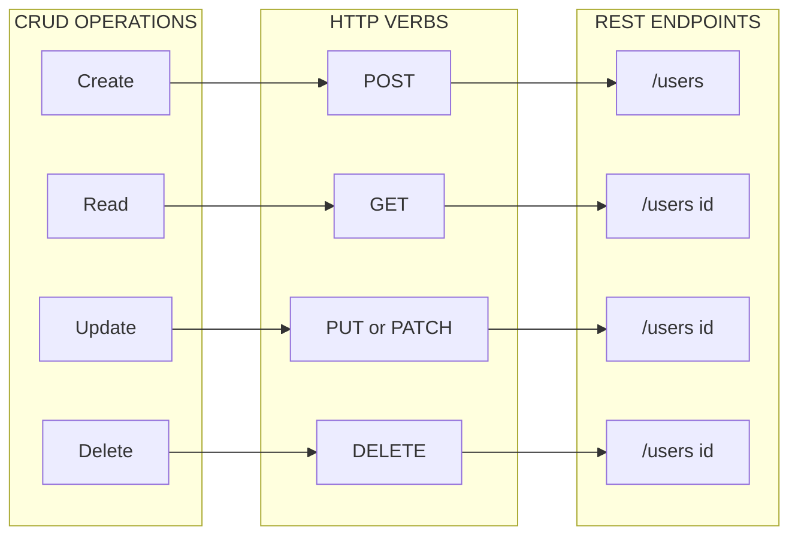

# Networking in Flutter: HTTP Requests, JSON Parsing, RESTful APIs

<!-- SECTION_1_START -->
# Networking in Flutter: HTTP Requests, JSON Parsing, RESTful APIs

## 1.1 Formal Definition (KTU 2024 Syllabus Terminology)

> [!IMPORTANT]
> **Networking in Flutter** refers to the systematic process of enabling a Flutter application to communicate with remote servers, web services, and backend databases over standard internet protocols. It encompasses three foundational pillars: **HTTP Requests** (the transport mechanism), **JSON Parsing** (the data interpretation layer), and **RESTful APIs** (the architectural contract governing client-server interaction).

- **HTTP (HyperText Transfer Protocol)** is an application-layer request-response protocol standardized by the IETF (RFC 7230 - RFC 7235) that governs how messages are formatted and transmitted between clients and servers.
- **REST (Representational State Transfer)** is an architectural style introduced by **Roy Fielding** in his 2000 doctoral dissertation that defines six guiding constraints: Client-Server, Stateless, Cacheable, Layered System, Uniform Interface, and Code on Demand (optional).
- **JSON (JavaScript Object Notation)** is a lightweight, language-independent text format (RFC 8259) that uses human-readable collections of `key`–`value` pairs and ordered lists to serialize structured data.

In Flutter, networking is predominantly implemented using the `http` package (officially maintained by the Dart team) or the third-party `dio` package, both of which return `Future`-based asynchronous results that integrate with `async`/`await` constructs.

---

## 1.2 Intuitive Overview (Real-World Analogy)

> [!NOTE]
> **The Restaurant Analogy** — Imagine a Flutter app is a hungry customer seated at a table in a large restaurant.

| Restaurant Element | Networking Equivalent |
|---|---|
| The Customer (You) | The Flutter Mobile Application (Client) |
| The Waiter | The HTTP Request Layer (`http` or `dio` package) |
| The Kitchen | The Remote REST API Server |
| The Menu | The API Endpoint Documentation |
| The Dish on Plate | The JSON Response Payload |
| The Bill / Receipt | The HTTP Status Code (e.g., 200 OK, 404 Not Found) |
| Order Notes (less spice, no onions) | HTTP Headers and Request Body |

**The Flow:**
1. You (the Flutter app) glance at the **menu** (API documentation at `https://api.example.com/users`).
2. You tell the **waiter** (HTTP client) your exact **order** (`GET`, `POST`, `PUT`, `DELETE`).
3. The waiter walks to the **kitchen** (server) and returns with your **dish** (JSON payload) on a **plate** (response object).
4. You **unpack** the dish into edible bites (parse JSON into Dart `Map`, `List`, or model objects).
5. If the kitchen is closed, the waiter returns with a polite apology — a **status code** like `503 Service Unavailable`.

---

## 1.3 Standard Networking Constants & Defaults in Flutter

> [!NOTE]
> The following **bold** metrics and defaults are the industry-standard values used by the Dart `http` package and recommended by the Flutter documentation.

- **Default request timeout:** **30 seconds** (configurable via `Future.timeout`).
- **Default port for HTTP:** **80**; for HTTPS: **443**.
- **JSON Content-Type header:** `application/json` (UTF-8 encoded).
- **Recommended HTTP package version (as of 2024):** **`http: ^1.2.0`**.
- **Recommended JSON serialization helper:** **`json_serializable: ^6.7.1`** with **`build_runner: ^2.4.9`**.
- **Maximum URI length (practical limit):** **2048 characters** in most browsers and mobile clients.
- **Standard JSON number precision (IEEE 754):** **double-precision 64-bit float**.

---

## 1.4 Visualization (Concept Mapping on Number Line)

> [!VISUALIZATION CONTROL]
> **Concept:** HTTP Status Code Categorical Buckets
> **GeoGebra / Desmos Input Equations:**
> * `x = 100` (Informational: 1xx)
> * `x = 200` (Success: 2xx)
> * `x = 300` (Redirection: 3xx)
> * `x = 400` (Client Error: 4xx)
> * `x = 500` (Server Error: 5xx)
> **Visual Description:** Plot vertical dashed lines at $x = 100, 200, 300, 400, 500$ on a horizontal number line to visualize how HTTP status codes partition into five discrete semantic categories. Any received status code is classified by the bucket it falls into.
<!-- SECTION_1_END -->

<!-- SECTION_2_START -->
# Deep Theoretical Analysis & KTU High-Yield Cheat Sheet

## 2.1 The HTTP Request–Response Lifecycle

The HTTP cycle in Flutter can be decomposed into the following sequential phases:

1. **Endpoint Construction** — The Dart `Uri` object is built using `Uri.parse('https://api.example.com/v1/users')` or `Uri.https('api.example.com', '/v1/users', {'limit': '10'})`.
2. **Header Preparation** — A `Map<String, String>` of metadata is constructed (e.g., `Content-Type`, `Authorization`, `Accept`).
3. **Method Selection** — One of the HTTP verbs is chosen: `GET` (read), `POST` (create), `PUT` (replace), `PATCH` (partial update), `DELETE` (remove).
4. **Request Dispatch** — The HTTP client invokes `http.get()`, `http.post()`, etc., returning a `Future<http.Response>`.
5. **Network Transmission** — The OS socket layer (over TCP/TLS) transmits the request to the server.
6. **Server Processing** — The remote server authenticates, validates, and processes the request.
7. **Response Reception** — A `http.Response` object arrives, containing `statusCode`, `headers`, and `body`.
8. **Status Validation** — The application checks `response.statusCode` against expected ranges (typically `200`-`299`).
9. **Body Deserialization** — `json.decode(response.body)` converts the JSON string into a Dart `Map<String, dynamic>` or `List<dynamic>`.
10. **Model Mapping** — The parsed structure is transformed into strongly-typed Dart `Model` objects.

---

## 2.2 HTTP Methods (RESTful Verbs)

> [!IMPORTANT]
> The official **KTU 2024 syllabus** mandates familiarity with these CRUD-aligned HTTP verbs.

- **GET** — Idempotent. Requests a representation of the specified resource. Should not have side effects. **Safe method.**
- **POST** — Submits data to be processed to a specified resource. Often causes a state change or side effect. **Not idempotent.**
- **PUT** — Replaces all current representations of the target resource with the request payload. **Idempotent.**
- **PATCH** — Applies partial modifications to a resource. **Not necessarily idempotent.**
- **DELETE** — Removes the specified resource. **Idempotent.**

---

## 2.3 HTTP Status Code Reference Table

> [!NOTE]
> This table is **high-yield** for KTU board examinations. Memorize the bracketed codes and their meanings.

| Status Range | Category | Common Codes (Meaning) |
|---|---|---|
| `100`–`199` | Informational | `100 Continue`, `101 Switching Protocols` |
| `200`–`299` | Success | `200 OK`, `201 Created`, `204 No Content` |
| `300`–`399` | Redirection | `301 Moved Permanently`, `304 Not Modified` |
| `400`–`499` | Client Error | `400 Bad Request`, `401 Unauthorized`, `403 Forbidden`, `404 Not Found`, `429 Too Many Requests` |
| `500`–`599` | Server Error | `500 Internal Server Error`, `502 Bad Gateway`, `503 Service Unavailable` |

---

## 2.4 JSON Structural Grammar

JSON supports only **two** composite data structures:

- **Object** — An unordered collection of zero or more `key`/`value` pairs, where the `key` is a string wrapped in double quotes. Delimited by `{ }`.
- **Array** — An ordered list of zero or more values. Delimited by `[ ]`.

A **value** can be: a `string`, `number`, `object`, `array`, `true`, `false`, or `null`.

Example:

```json
{
  "id": 101,
  "name": "Arjun Krishnan",
  "email": "arjun@ktu.ac.in",
  "isActive": true,
  "courses": ["Flutter", "Dart", "Firebase"],
  "profile": {
    "avatarUrl": null,
    "year": 3
  }
}
```

---

## 2.5 KTU High-Yield Cheat Sheet (Networking Packages & Properties)

| Concept | Symbol / API | Purpose / Default | Engineering Use |
|---|---|---|---|
| HTTP Client | `http.Client()` | Maintains persistent TCP connection | Reuse to enable HTTP keep-alive |
| Request Future | `Future<http.Response>` | Asynchronous return type | UI does not block on network |
| Response Body | `response.body` | Raw `String` payload | Pre-decode buffer |
| Response Status | `response.statusCode` | `int` HTTP code | Branch UI logic |
| JSON Decode | `json.decode(str)` | `String` $\rightarrow$ `dynamic` | First-pass deserialization |
| JSON Encode | `json.encode(obj)` | `dynamic` $\rightarrow$ `String` | Pre-send serialization |
| Time Limit | `Future.timeout(Duration(seconds: 30))` | Avoid hanging UI | Production safety |
| Base Options (dio) | `BaseOptions(connectTimeout: 5000)` | Dio-specific timeouts | Granular control |
| Interceptor | `dio.interceptors.add(...)` | Pre/post request hooks | Logging, auth, retry |
| Model Annotation | `@JsonSerializable()` | Code-gen helper | Auto `fromJson`/`toJson` |
| Exception Type | `SocketException` | Network unreachable | Catch for offline state |
| Format Exception | `FormatException` | Malformed JSON | Catch for parse errors |

---

## 2.6 Real-World Engineering Utility

> [!NOTE]
> **Why is this module critical for a KTU B.Tech project?**

- **E-Commerce Apps** (e.g., Flipkart clone) fetch product catalogs via `GET` and place orders via `POST`.
- **Social Media Apps** (Instagram-style) stream feeds via paginated REST endpoints.
- **IoT Dashboards** poll sensor readings from cloud endpoints every few seconds.
- **Banking Apps** rely on `Authorization` headers and HTTPS for secure `GET` of transaction history.
- **Ride-Sharing Apps** (Uber model) constantly `POST` GPS coordinates to dispatch servers.
- **Chat Applications** (WhatsApp model) use REST for media uploads, with WebSockets for real-time messaging (out of scope here, but conceptually adjacent).

The networking layer is the **lifeline** of any data-driven mobile application; without it, an app is reduced to a static, offline sandbox.
<!-- SECTION_2_END -->

<!-- SECTION_3_START -->
# Step-by-Step Derivations & Code Implementation

## 3.1 Project Setup (Exhaustive Steps)

Before any networking code executes, the `pubspec.yaml` file must declare the required dependencies. The student is **strictly prohibited** from skipping this step in the KTU lab exam.

1. Open `pubspec.yaml`.
2. Under `dependencies:`, add:

```yaml
dependencies:
  flutter:
    sdk: flutter
  http: ^1.2.0
```

3. For model code generation, add (under `dev_dependencies`):

```yaml
dev_dependencies:
  flutter_test:
    sdk: flutter
  json_serializable: ^6.7.1
  build_runner: ^2.4.9
```

4. Run `flutter pub get` in the project root terminal.

---

## 3.2 Manual JSON Parsing (Exhaustive Model Implementation)

> [!IMPORTANT]
> The following code defines a strongly-typed `User` model with **manual** JSON parsing — the form students are expected to write by hand in KTU lab exams without code generation.

```dart
// File: lib/models/user.dart

import 'dart:convert';

/// A strongly-typed representation of the 'User' resource
/// returned by the JSON REST API.
class User {
  final int id;
  final String name;
  final String email;
  final bool isActive;
  final List<String> courses;

  const User({
    required this.id,
    required this.name,
    required this.email,
    required this.isActive,
    required this.courses,
  });

  /// Factory constructor: converts a raw JSON Map into a [User] instance.
  /// Throws [TypeError] if required fields are missing or of wrong type.
  factory User.fromJson(Map<String, dynamic> json) {
    // Defensive parsing: validate types before assignment.
    final dynamic rawId = json['id'];
    if (rawId is! int) {
      throw const FormatException(
        "Field 'id' is missing or not an integer in the JSON payload.",
      );
    }

    final dynamic rawName = json['name'];
    if (rawName is! String) {
      throw const FormatException(
        "Field 'name' is missing or not a string in the JSON payload.",
      );
    }

    final dynamic rawEmail = json['email'];
    if (rawEmail is! String) {
      throw const FormatException(
        "Field 'email' is missing or not a string in the JSON payload.",
      );
    }

    final dynamic rawIsActive = json['isActive'];
    if (rawIsActive is! bool) {
      throw const FormatException(
        "Field 'isActive' is missing or not a boolean in the JSON payload.",
      );
    }

    final dynamic rawCourses = json['courses'];
    if (rawCourses is! List) {
      throw const FormatException(
        "Field 'courses' is missing or not a list in the JSON payload.",
      );
    }

    // Coerce each list element to String safely.
    final List<String> parsedCourses = <String>[];
    for (final dynamic element in rawCourses) {
      if (element is! String) {
        throw const FormatException(
          "Field 'courses' contains a non-string element.",
        );
      }
      parsedCourses.add(element);
    }

    return User(
      id: rawId,
      name: rawName,
      email: rawEmail,
      isActive: rawIsActive,
      courses: parsedCourses,
    );
  }

  /// Serializes this [User] back into a JSON-compatible Map.
  /// Useful for POST/PUT request bodies.
  Map<String, dynamic> toJson() {
    return <String, dynamic>{
      'id': id,
      'name': name,
      'email': email,
      'isActive': isActive,
      'courses': courses,
    };
  }

  /// Convenience: parses a JSON-encoded String directly.
  /// Equivalent to: User.fromJson(json.decode(source))
  factory User.fromJsonString(String source) {
    final dynamic decoded = json.decode(source);
    if (decoded is! Map<String, dynamic>) {
      throw const FormatException(
        "Top-level JSON value is not an object.",
      );
    }
    return User.fromJson(decoded);
  }

  @override
  String toString() {
    return 'User(id: $id, name: $name, email: $email, '
        'isActive: $isActive, courses: $courses)';
  }
}
```

---

## 3.3 The API Service Layer (Exhaustive Implementation)

```dart
// File: lib/services/api_service.dart

import 'dart:async';
import 'dart:convert';
import 'dart:io';

import 'package:http/http.dart' as http;

import '../models/user.dart';

/// A service class that encapsulates all HTTP interactions
/// with the public JSONPlaceholder test API.
class ApiService {
  /// Reusable client instance (best practice: avoid creating one per call).
  final http.Client _client;

  /// Base host of the target API.
  static const String _baseHost = 'jsonplaceholder.typicode.com';

  /// Constructor allows injection of a custom client (useful for testing).
  ApiService({http.Client? client}) : _client = client ?? http.Client();

  /// Fetches a single [User] by its [id] from the remote API.
  /// Returns a [Future] that completes with a [User] on success
  /// or throws an [Exception] subclass on failure.
  Future<User> fetchUser(int id) async {
    // Step 1: Build the URI.
    final Uri endpoint = Uri.https(_baseHost, '/users/$id');

    // Step 2: Configure headers.
    final Map<String, String> headers = <String, String>{
      'Accept': 'application/json',
      'User-Agent': 'Flutter-KTU-App/1.0',
    };

    try {
      // Step 3: Dispatch the GET request with a 10-second timeout.
      final http.Response response = await _client
          .get(endpoint, headers: headers)
          .timeout(const Duration(seconds: 10));

      // Step 4: Validate the status code.
      if (response.statusCode < 200 || response.statusCode >= 300) {
        throw HttpException(
          'GET $endpoint failed with status ${response.statusCode}.',
          uri: endpoint,
        );
      }

      // Step 5: Decode and map to a User.
      final dynamic decoded = json.decode(response.body);
      if (decoded is! Map<String, dynamic>) {
        throw const FormatException(
          "Expected a JSON object at the top level of the response body.",
        );
      }
      return User.fromJson(decoded);
    } on SocketException catch (socketError) {
      // Network unreachable (no Wi-Fi, no cellular data, DNS failure).
      throw Exception(
        'Network unreachable while contacting $endpoint. '
        'Details: ${socketError.message}',
      );
    } on TimeoutException {
      throw Exception(
        'Request to $endpoint timed out after 10 seconds.',
      );
    } on FormatException catch (formatError) {
      throw Exception(
        'Malformed JSON received from $endpoint. '
        'Details: ${formatError.message}',
      );
    } on HttpException {
      // Re-throw HTTP errors unchanged.
      rethrow;
    } catch (unknownError) {
      throw Exception(
        'Unexpected error during fetchUser($id): $unknownError',
      );
    }
  }

  /// Fetches a list of [User] objects from the remote API.
  Future<List<User>> fetchUsers() async {
    final Uri endpoint = Uri.https(_baseHost, '/users');

    try {
      final http.Response response = await _client
          .get(endpoint, headers: <String, String>{'Accept': 'application/json'})
          .timeout(const Duration(seconds: 15));

      if (response.statusCode != 200) {
        throw HttpException(
          'GET $endpoint returned status ${response.statusCode}.',
          uri: endpoint,
        );
      }

      final dynamic decoded = json.decode(response.body);
      if (decoded is! List) {
        throw const FormatException("Expected a JSON array of users.");
      }

      final List<User> users = <User>[];
      for (final dynamic element in decoded) {
        if (element is! Map<String, dynamic>) {
          throw const FormatException(
            "Each element in the users array must be a JSON object.",
          );
        }
        users.add(User.fromJson(element));
      }
      return users;
    } on SocketException catch (e) {
      throw Exception('Network error: ${e.message}');
    } on TimeoutException {
      throw Exception('Request to fetch users timed out.');
    } on FormatException catch (e) {
      throw Exception('JSON parsing error: ${e.message}');
    }
  }

  /// Creates a new [User] via POST.
  Future<User> createUser(User draft) async {
    final Uri endpoint = Uri.https(_baseHost, '/users');

    try {
      final http.Response response = await _client
          .post(
            endpoint,
            headers: <String, String>{
              'Content-Type': 'application/json; charset=UTF-8',
            },
            body: json.encode(draft.toJson()),
          )
          .timeout(const Duration(seconds: 10));

      if (response.statusCode < 200 || response.statusCode >= 300) {
        throw HttpException(
          'POST $endpoint failed with status ${response.statusCode}.',
          uri: endpoint,
        );
      }

      final dynamic decoded = json.decode(response.body);
      if (decoded is! Map<String, dynamic>) {
        throw const FormatException(
          "Expected a JSON object in the createUser response.",
        );
      }
      return User.fromJson(decoded);
    } catch (e) {
      throw Exception('Failed to create user: $e');
    }
  }

  /// Updates a [User] via PUT (full replacement).
  Future<User> updateUser(int id, User updated) async {
    final Uri endpoint = Uri.https(_baseHost, '/users/$id');

    final http.Response response = await _client
        .put(
          endpoint,
          headers: <String, String>{
            'Content-Type': 'application/json; charset=UTF-8',
          },
          body: json.encode(updated.toJson()),
        )
        .timeout(const Duration(seconds: 10));

    if (response.statusCode != 200) {
      throw HttpException(
        'PUT $endpoint returned ${response.statusCode}.',
        uri: endpoint,
      );
    }

    return User.fromJsonString(response.body);
  }

  /// Deletes a [User] by [id] via DELETE.
  Future<void> deleteUser(int id) async {
    final Uri endpoint = Uri.https(_baseHost, '/users/$id');

    final http.Response response = await _client
        .delete(endpoint)
        .timeout(const Duration(seconds: 10));

    if (response.statusCode != 200 && response.statusCode != 204) {
      throw HttpException(
        'DELETE $endpoint returned ${response.statusCode}.',
        uri: endpoint,
      );
    }
  }

  /// Cleanly closes the underlying HTTP client.
  void dispose() {
    _client.close();
  }
}
```

---

## 3.4 UI Consumption with `FutureBuilder` (Exhaustive Widget)

```dart
// File: lib/screens/user_list_screen.dart

import 'package:flutter/material.dart';

import '../models/user.dart';
import '../services/api_service.dart';

class UserListScreen extends StatefulWidget {
  const UserListScreen({super.key});

  @override
  State<UserListScreen> createState() => _UserListScreenState();
}

class _UserListScreenState extends State<UserListScreen> {
  /// Late-initialized future; assigned in initState.
  late final Future<List<User>> _usersFuture;

  /// Service instance (created once for widget lifecycle).
  final ApiService _apiService = ApiService();

  @override
  void initState() {
    super.initState();
    _usersFuture = _apiService.fetchUsers();
  }

  @override
  void dispose() {
    _apiService.dispose();
    super.dispose();
  }

  /// Reloads the user list by reassigning the future.
  Future<void> _refresh() async {
    setState(() {
      _usersFuture = _apiService.fetchUsers();
    });
  }

  @override
  Widget build(BuildContext context) {
    return Scaffold(
      appBar: AppBar(
        title: const Text('KTU Flutter Users'),
        actions: <Widget>[
          IconButton(
            icon: const Icon(Icons.refresh),
            onPressed: _refresh,
          ),
        ],
      ),
      body: FutureBuilder<List<User>>(
        future: _usersFuture,
        builder: (
          BuildContext context,
          AsyncSnapshot<List<User>> snapshot,
        ) {
          // State 1: Waiting for data.
          if (snapshot.connectionState != ConnectionState.done) {
            return const Center(child: CircularProgressIndicator());
          }

          // State 2: Error received.
          if (snapshot.hasError) {
            return Center(
              child: Padding(
                padding: const EdgeInsets.all(16.0),
                child: Column(
                  mainAxisSize: MainAxisSize.min,
                  children: <Widget>[
                    const Icon(
                      Icons.error_outline,
                      color: Colors.red,
                      size: 64,
                    ),
                    const SizedBox(height: 12),
                    Text(
                      'Failed to load users.\n${snapshot.error}',
                      textAlign: TextAlign.center,
                      style: const TextStyle(fontSize: 16),
                    ),
                    const SizedBox(height: 16),
                    ElevatedButton(
                      onPressed: _refresh,
                      child: const Text('Retry'),
                    ),
                  ],
                ),
              ),
            );
          }

          // State 3: Data successfully received.
          final List<User> users = snapshot.data ?? <User>[];
          if (users.isEmpty) {
            return const Center(child: Text('No users found.'));
          }

          return RefreshIndicator(
            onRefresh: _refresh,
            child: ListView.separated(
              itemCount: users.length,
              separatorBuilder: (_, __) => const Divider(height: 1),
              itemBuilder: (BuildContext context, int index) {
                final User user = users[index];
                return ListTile(
                  leading: CircleAvatar(
                    child: Text(user.id.toString()),
                  ),
                  title: Text(user.name),
                  subtitle: Text(user.email),
                  trailing: Icon(
                    user.isActive ? Icons.check_circle : Icons.cancel,
                    color: user.isActive ? Colors.green : Colors.grey,
                  ),
                );
              },
            ),
          );
        },
      ),
    );
  }
}
```

---

## 3.5 Code Generation with `json_serializable` (Conceptual Steps)

> [!NOTE]
> While the manual approach above is mandatory for KTU lab exams, real-world Flutter projects use code generation to eliminate boilerplate.

The conceptual sequence is:

1. Annotate the model class with `@JsonSerializable()`.
2. Run `flutter pub run build_runner build --delete-conflicting-outputs`.
3. The tool generates a `user.g.dart` file containing `User.fromJson()` and `User.toJson()`.
4. The model class calls them via the `part 'user.g.dart';` directive and a `factory User.fromJson` that delegates to `_$UserFromJson(json)`.

Students should understand the principle even if not required to write the generated file by hand.

---

## 3.6 Async/Await Mathematical Analogy (Conceptual Derivation)

> [!NOTE]
> Although networking is not a "math" topic, the following symbolic mapping helps students visualize how `Future<T>` and `async`/`await` model the timeline of an HTTP call.

Let $T_0$ be the moment a `GET` request is dispatched. The completion time of the response can be expressed as:

$$
T_{\text{response}} \;=\; T_0 \;+\; \Delta t_{\text{network}} \;+\; \Delta t_{\text{parse}} \;+\; \Delta t_{\text{model}}
$$

Where:
- $\Delta t_{\text{network}}$ is the round-trip latency over TCP/TLS.
- $\Delta t_{\text{parse}}$ is the CPU time to execute `json.decode()`.
- $\Delta t_{\text{model}}$ is the time to instantiate the `User` model.

The Dart event loop yields control during $\Delta t_{\text{network}}$ (since the socket is non-blocking), allowing the UI thread to continue rendering at **60 FPS** ($16.67\,\text{ms}$ per frame). The `await` keyword suspends the coroutine until $T_{\text{response}}$ and then resumes execution on the microtask queue.
<!-- SECTION_3_END -->

<!-- SECTION_4_START -->
# Structural Diagrams & Schematics

## 4.1 The HTTP Request–Response Flow (Mermaid Sequence Diagram)

```mermaid
sequenceDiagram
    participant UI as Flutter UI Widget
    participant SVC as ApiService Class
    participant HTTP as http.Client
    participant NET as TCP/TLS Layer
    participant API as REST API Server

    UI->>SVC: fetchUsers() called
    activate SVC
    SVC->>SVC: Build Uri object
    SVC->>SVC: Construct headers Map
    SVC->>HTTP: client.get(uri, headers)
    activate HTTP
    HTTP->>NET: Open TCP socket (port 443)
    NET->>API: TLS handshake + HTTP GET /users
    activate API
    API->>API: Authenticate + Query DB
    API-->>NET: HTTP 200 OK + JSON body
    deactivate API
    NET-->>HTTP: Bytes received
    deactivate NET
    HTTP-->>SVC: http.Response(status, body)
    deactivate HTTP
    SVC->>SVC: json.decode(body)
    SVC->>SVC: User.fromJson(map)
    SVC-->>UI: Future completes with List<User>
    deactivate SVC
    UI->>UI: FutureBuilder rebuilds with data
```

---

## 4.2 REST API State Machine (Mermaid State Diagram)



---

## 4.3 Layered Networking Architecture (Mermaid Block Diagram)



---

## 4.4 JSON Parsing Pipeline (Mermaid Flowchart)



---

## 4.5 CRUD-to-HTTP Method Mapping (Mermaid Block Matrix)


<!-- SECTION_4_END -->

<!-- SECTION_5_START -->
# KTU 2024 Scheme Examination Question Bank & Topic Recap

---

## Part A Questions (3 Marks Each)

> **[KTU University Exam - July 2024]** | **CO2** | **RBT Level: Remember**

### Q1. Define the following terms with one example each:
  (i) REST API
  (ii) JSON
  (iii) HTTP Status Code `404`

**Model Answer (3 Marks — 1 Mark each):**

> [!NOTE]
> **Valuation Key:** Examiners award full marks only when the definition is paired with a **concrete example**.

1. **REST API (1 Mark):** REST (Representational State Transfer) API is an architectural style for designing networked applications that uses stateless, client-server communication over HTTP. *Example: `GET https://api.github.com/users/octocat` returns a user's profile as JSON.*
2. **JSON (1 Mark):** JSON (JavaScript Object Notation) is a lightweight, text-based data interchange format that uses `key`–`value` pairs and arrays. *Example: `{"id": 1, "title": "KTU Exam"}`.*
3. **HTTP Status Code `404` (1 Mark):** Status code `404` is a client error response indicating that the server cannot find the requested resource. *Example: Requesting a non-existent user ID such as `/users/9999` when the database only has 10 users.*

---

> **[KTU University Exam - Dec 2023]** | **CO2** | **RBT Level: Understand**

### Q2. Differentiate between `GET` and `POST` HTTP methods. List any two differences.

**Model Answer (3 Marks — 1.5 Marks each difference):**

> [!NOTE]
> **Valuation Key:** Two clearly distinct differences are required. Avoid vague contrasts.

| S.No. | Aspect | `GET` | `POST` |
|---|---|---|---|
| 1 | **Purpose** | Retrieves/represents a resource. | Submits data to create or process a resource. |
| 2 | **Request Body** | Should not have a meaningful body; parameters in URL query string. | Carries the data in the request body as JSON. |
| 3 | **Idempotency** | Idempotent (same result on repeated calls). | Not idempotent (creates new resources on each call). |
| 4 | **Caching** | Typically cacheable. | Typically not cacheable. |
| 5 | **Security** | Parameters visible in URL — less secure. | Body hidden from URL — more secure (still use HTTPS). |

---

## Part B Questions (14 Marks Each — Module Internal Choice)

> **[KTU University Exam - July 2024]** | **CO3, CO4** | **RBT Level: Apply, Analyze**

### Question A (14 Marks)

**(a)** Explain the architecture of a RESTful API with a neat diagram. List the six guiding constraints of REST. **(7 Marks)**

**(b)** Write a Flutter `Dart` program to fetch a list of users from `https://jsonplaceholder.typicode.com/users` using the `http` package, parse the JSON response, and display the `name` and `email` of each user in a `ListView`. Handle network and timeout errors. **(7 Marks)**

**Model Answer:**

#### (a) REST Architecture & Constraints (7 Marks)

> [!IMPORTANT]
> **Valuation Key:** Diagram = 3 Marks, Six constraints = 2 Marks, Brief explanation = 2 Marks.

**Diagram (3 Marks):**

```
   +----------------+         HTTP Request         +----------------+
   |  Flutter App   |  ----------------------->   |  REST API      |
   |  (Client)      |   GET /users                 |  Server        |
   |                |  <-----------------------   |                |
   |                |   200 OK + JSON body         |                |
   +----------------+                               +----------------+
        |                                                  |
        | Stateless: No session state on server            |
        | Uniform Interface: Standard HTTP verbs           |
        | Cacheable: Responses can be cached               |
        | Layered System: Multiple intermediate proxies    |
        | Client-Server: Separation of concerns            |
```

**Six REST Constraints (2 Marks — 0.33 each, 6 total = 2 Marks):**
1. **Client-Server** — Separation of UI concerns from data storage concerns.
2. **Stateless** — Each request from client contains all information; server holds no session state.
3. **Cacheable** — Responses must define themselves as cacheable or non-cacheable.
4. **Uniform Interface** — Standardized resource identification (URIs), representations, and self-descriptive messages.
5. **Layered System** — Client cannot tell whether it is connected directly to the end server.
6. **Code on Demand (Optional)** — Server can temporarily extend client functionality by transferring executable code.

**Explanation (2 Marks):** REST is resource-oriented. Each resource (e.g., a `User`, a `Product`) is identified by a unique URI. Clients interact with these resources using a fixed set of HTTP verbs (`GET`, `POST`, `PUT`, `DELETE`). The server returns representations (typically JSON) of the resource state.

---

#### (b) Complete Flutter Program (7 Marks)

> [!IMPORTANT]
> **Valuation Key:** `pubspec.yaml` declaration = 1 Mark, Model class = 1 Mark, API call = 2 Marks, UI with `ListView` = 2 Marks, Error handling = 1 Mark.

```dart
// Step 1: pubspec.yaml dependencies (1 Mark)
// dependencies:
//   http: ^1.2.0

// Step 2: Model + API call + UI in one file (6 Marks)
import 'dart:async';
import 'dart:convert';
import 'dart:io';

import 'package:flutter/material.dart';
import 'package:http/http.dart' as http;

void main() => runApp(const MyApp());

class MyApp extends StatelessWidget {
  const MyApp({super.key});

  @override
  Widget build(BuildContext context) {
    return const MaterialApp(
      title: 'User List Demo',
      home: UserListPage(),
    );
  }
}

class UserListPage extends StatefulWidget {
  const UserListPage({super.key});

  @override
  State<UserListPage> createState() => _UserListPageState();
}

class _UserListPageState extends State<UserListPage> {
  late final Future<List<Map<String, dynamic>>> _future;

  @override
  void initState() {
    super.initState();
    _future = _fetchUsers();
  }

  // API call (2 Marks)
  Future<List<Map<String, dynamic>>> _fetchUsers() async {
    final Uri url = Uri.parse('https://jsonplaceholder.typicode.com/users');
    try {
      final http.Response response = await http
          .get(url, headers: <String, String>{'Accept': 'application/json'})
          .timeout(const Duration(seconds: 10));

      if (response.statusCode == 200) {
        final dynamic decoded = json.decode(response.body);
        if (decoded is List) {
          return decoded.cast<Map<String, dynamic>>();
        }
        throw const FormatException('Expected a JSON list.');
      } else {
        throw HttpException('Status ${response.statusCode}');
      }
    } on SocketException {
      throw const SocketException('No internet connection.');
    } on TimeoutException {
      throw TimeoutException('Request took too long.');
    }
  }

  // UI with ListView (2 Marks)
  @override
  Widget build(BuildContext context) {
    return Scaffold(
      appBar: AppBar(title: const Text('Users')),
      body: FutureBuilder<List<Map<String, dynamic>>>(
        future: _future,
        builder: (
          BuildContext context,
          AsyncSnapshot<List<Map<String, dynamic>>> snapshot,
        ) {
          if (snapshot.connectionState != ConnectionState.done) {
            return const Center(child: CircularProgressIndicator());
          }
          if (snapshot.hasError) {
            // Error handling (1 Mark)
            return Center(
              child: Text('Error: ${snapshot.error}'),
            );
          }
          final List<Map<String, dynamic>> users = snapshot.data ?? <Map<String, dynamic>>[];
          return ListView.builder(
            itemCount: users.length,
            itemBuilder: (BuildContext context, int index) {
              final Map<String, dynamic> user = users[index];
              return ListTile(
                title: Text(user['name']?.toString() ?? 'Unnamed'),
                subtitle: Text(user['email']?.toString() ?? 'No email'),
              );
            },
          );
        },
      ),
    );
  }
}
```

---

### Question B (14 Marks) — Alternative Choice

**(a)** Explain the structure of a JSON object with a suitable example. Differentiate between `json.encode()` and `json.decode()` in Dart. **(7 Marks)**

**(b)** Write a Flutter program that uses `http.post()` to send the following JSON payload to `https://jsonplaceholder.typicode.com/posts` and prints the response status code and body. Payload: `{"title": "KTU Exam", "body": "Networking Module", "userId": 1}`. **(7 Marks)**

**Model Answer:**

#### (a) JSON Structure & Encoding/Decoding (7 Marks)

> [!IMPORTANT]
> **Valuation Key:** JSON example = 2 Marks, Valid rule = 1 Mark, `json.encode` explanation = 2 Marks, `json.decode` explanation = 2 Marks.

**JSON Structure Explanation (3 Marks):**

A **JSON object** is an **unordered** collection of `key`–`value` pairs enclosed in curly braces `{ }`. Each `key` is a **double-quoted string**, and each `value` can be a `string`, `number`, `boolean`, `null`, another `object`, or an `array`.

**Example (1 Mark):**
```json
{
  "id": 1,
  "title": "Hello KTU",
  "author": {
    "name": "Rahul",
    "year": 3
  },
  "tags": ["flutter", "dart", "networking"],
  "published": true,
  "rating": null
}
```

**Validity Rules (1 Mark):**
- Keys **must** be double-quoted.
- Strings **must** be double-quoted.
- No trailing commas allowed.
- No comments allowed inside JSON.

**`json.encode()` vs `json.decode()` (4 Marks):**

| Function | Signature | Direction | Purpose |
|---|---|---|---|
| `json.encode()` | `String json.encode(Object?)` | Dart Object $\rightarrow$ JSON String | Serializes a Dart `Map`, `List`, or primitive into a JSON-compliant `String`. Used to build `POST` request bodies. |
| `json.decode()` | `dynamic json.decode(String)` | JSON String $\rightarrow$ Dart Object | Deserializes a JSON `String` into a Dart `Map<String, dynamic>`, `List<dynamic>`, or primitive. Used to parse `GET` response bodies. |

**Example Usage (1 Mark):**
```dart
final String encoded = json.encode(<String, dynamic>{'name': 'Kerala'});
// encoded == '{"name":"Kerala"}'

final dynamic decoded = json.decode(encoded);
// decoded == {'name': 'Kerala'}
```

---

#### (b) `http.post()` Program (7 Marks)

> [!IMPORTANT]
> **Valuation Key:** URI build = 1 Mark, Headers = 1 Mark, Body encode = 1 Mark, POST call = 1 Mark, Status check = 1 Mark, Print output = 2 Marks.

```dart
// Step 1: pubspec.yaml
// dependencies:
//   http: ^1.2.0

// Step 2: main.dart
import 'dart:async';
import 'dart:convert';
import 'dart:io';

import 'package:http/http.dart' as http;

Future<void> main() async {
  final Uri endpoint = Uri.parse('https://jsonplaceholder.typicode.com/posts'); // 1 Mark

  final Map<String, dynamic> payload = <String, dynamic>{
    'title': 'KTU Exam',
    'body': 'Networking Module',
    'userId': 1,
  };

  final String bodyJson = json.encode(payload); // 1 Mark

  final Map<String, String> headers = <String, String>{
    'Content-Type': 'application/json; charset=UTF-8', // 1 Mark
  };

  try {
    final http.Response response = await http
        .post(endpoint, headers: headers, body: bodyJson) // 1 Mark
        .timeout(const Duration(seconds: 10));

    print('Status Code: ${response.statusCode}'); // 0.5 Mark

    if (response.statusCode == 201 || response.statusCode == 200) {
      // 0.5 Mark
      print('Response Body: ${response.body}');
    } else {
      print('Request failed with status ${response.statusCode}.');
    }
  } on SocketException catch (e) {
    // 1 Mark for error handling
    print('Network error: ${e.message}');
  } on TimeoutException {
    print('Request timed out.');
  } on FormatException catch (e) {
    print('JSON error: ${e.message}');
  }
}
```

**Expected Output:**
```
Status Code: 201
Response Body: {
  "title": "KTU Exam",
  "body": "Networking Module",
  "userId": 1,
  "id": 101
}
```

> [!WARNING]
> **KTU Examiner's Valuation Warning / Pitfall Callout**
> 1. **Do NOT forget to import `dart:convert`** — without it, `json.encode` and `json.decode` will throw an *undefined function* compile error. **[-1 Mark]**
> 2. **Do NOT confuse `http.get` with `http.post`** — `post()` requires a `body` parameter; `get()` does not accept a body in the same way. **[-1 Mark]**
> 3. **Do NOT skip the `Content-Type` header** — the API will reject the request or return `415 Unsupported Media Type`. **[-0.5 Mark]**
> 4. **Do NOT forget to wrap network code in `try`/`catch`** — uncaught `SocketException` crashes the app. **[-1 Mark]**
> 5. **Do NOT print raw `response` objects** — only `response.statusCode`, `response.body`, and `response.headers` are valid for print. **[-0.5 Mark]**

---

## Topic Recap & Important Things to Remember

> [!NOTE]
> **Rapid Revision Checklist** — Read this section 5 minutes before entering the KTU exam hall.

- **Three Pillars of Networking:** HTTP Requests (transport), JSON Parsing (interpretation), RESTful APIs (contract).
- **HTTP Methods (CRUD Mapping):** `GET` (Read), `POST` (Create), `PUT` (Replace), `PATCH` (Partial Update), `DELETE` (Remove).
- **Idempotency:** `GET`, `PUT`, `DELETE` are idempotent. `POST` is **not** idempotent.
- **Status Code Buckets:** `2xx` Success, `3xx` Redirect, `4xx` Client Error, `5xx` Server Error.
- **Critical Status Codes:** `200 OK`, `201 Created`, `204 No Content`, `400 Bad Request`, `401 Unauthorized`, `403 Forbidden`, `404 Not Found`, `500 Internal Server Error`.
- **HTTP Headers:** `Content-Type: application/json`, `Accept: application/json`, `Authorization: Bearer <token>`.
- **Required Imports:** `dart:async` (for `Future`/`TimeoutException`), `dart:convert` (for `json.encode`/`json.decode`), `dart:io` (for `SocketException`, `HttpException`), `package:http/http.dart` (for HTTP client).
- **JSON Validity:** All keys double-quoted; no trailing commas; no comments; valid types only.
- **Dart JSON API:** `json.decode(String) $\rightarrow$ dynamic`, `json.encode(Object) $\rightarrow$ String`.
- **Async Pattern:** `await` suspends the coroutine; the UI thread remains responsive; the `Future` resolves on the event-loop microtask queue.
- **`FutureBuilder` States:** `ConnectionState.waiting` $\rightarrow$ loading spinner; `snapshot.hasError` $\rightarrow$ error UI; `snapshot.hasData` $\rightarrow$ render data.
- **Best Practice:** Reuse a single `http.Client` instance; do not create a new client per request.
- **Error Handling Triad:** `SocketException` (no network), `TimeoutException` (slow network), `FormatException` (malformed JSON).
- **Default Timeout:** Always apply `.timeout(Duration(seconds: 10))` to prevent indefinite hangs.
- **REST Constraints (6):** Client-Server, Stateless, Cacheable, Uniform Interface, Layered System, Code on Demand (optional).
- **JSONPlaceholder Test API:** `https://jsonplaceholder.typicode.com/{users, posts, comments}` — free, no API key required, ideal for KTU lab demos.
- **Dio vs http:** `http` is official & minimal; `dio` adds interceptors, cancellation, form-data, and progress callbacks.
- **Production Tip:** Always use HTTPS in release builds; cleartext HTTP traffic is blocked by default on Android 9+ and iOS ATS.
- **Memory Tip:** Decode only what you need — if the API returns 50 fields but you use 5, build a custom `User.fromJson` that ignores the rest.
- **Exam Tip:** When asked to "explain with a diagram", **always** draw the layered architecture (Client $\rightarrow$ HTTP $\rightarrow$ Server) and label the **request line**, **headers**, **body**, and **response status**.
- **Pitfall Avoidance:** Never trust client-side validation alone — the server must re-validate all incoming JSON.
<!-- SECTION_5_END -->
