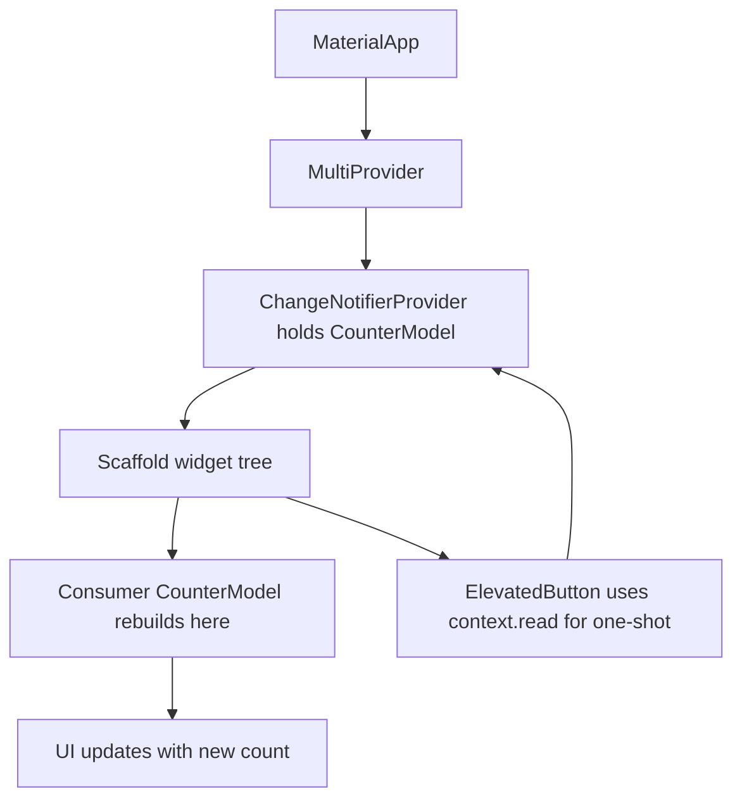
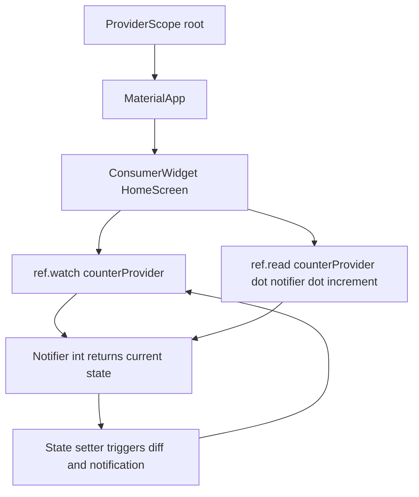
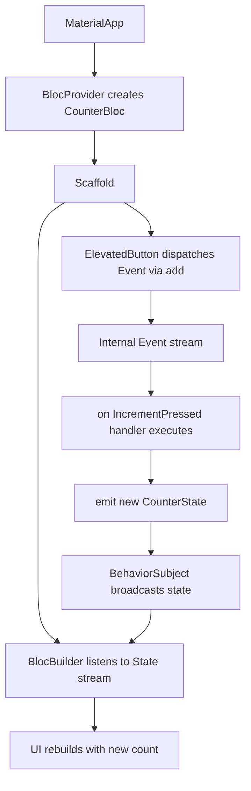
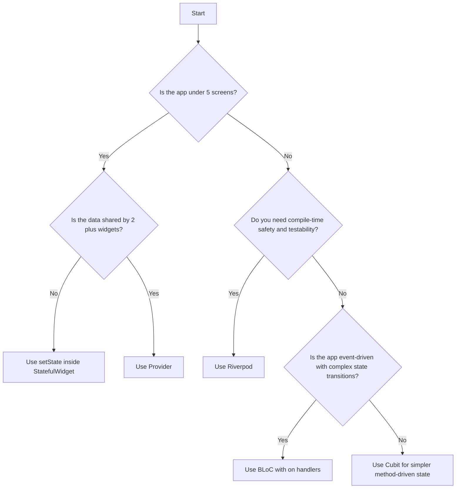
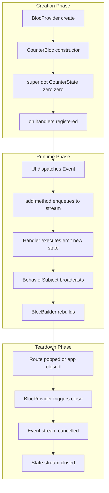

# State Management in Flutter: Provider, Riverpod, and BLoC

<!-- SECTION_1_START -->
# State Management in Flutter: Provider, Riverpod, and BLoC

## 1.1 Formal Definition (KTU 2024 Syllabus Terminology)

> [!NOTE]
> **State Management** in Flutter refers to the architectural strategy and pattern used to manage, propagate, and synchronize **mutable data (state)** across the widget tree in a predictable, testable, and scalable manner without resorting to excessive widget rebuilds or tight coupling.

In the context of the **KTU 2024 Scheme (OECST725 – Mobile Application Development)**, state management is treated as the *backbone* of any non-trivial Flutter application. The syllabus (Module 3) explicitly mandates the study of three production-grade reactive patterns:

- **Provider** – the official Flutter Community recommendation (lightweight, InheritedWidget-based).
- **Riverpod** – the modern, compile-safe evolution of Provider by the same author (Remi Rousselet).
- **BLoC (Business Logic Component)** – the Google-recommended, event-driven, stream-based pattern built on the `flutter_bloc` package.

### Formal Definition of "State"
**State** is any data that can change during the lifetime of a widget and that influences its rendering, behavior, or layout. Examples include a counter value, a logged-in user's profile, a fetched JSON list, the current theme mode, or the contents of a text field.

---

## 1.2 Conceptual Analogy / Intuition

> [!IMPORTANT]
> **The Office Whiteboard Analogy**
> Imagine your Flutter app is a large open-plan office. Each **Widget** is an employee sitting at a desk. Without a central notice board, every time one employee learns a new fact ("the user clicked the button"), they must personally walk over and whisper it to every other employee who needs to know. This is **prop drilling** and is exhausting.
>
> A **State Management solution** is the **central digital whiteboard on the wall**. Anyone can *write* to it (a `setState`, a `Notifier`, an `Event`), and anyone interested can *read* from it. The whiteboard keeps everyone in sync, but only the relevant employees (widgets that `Consumer` or `BlocBuilder` it) are notified — the rest keep working.

- **Provider** → A simple, wall-mounted whiteboard with one trusted keeper (the `ChangeNotifier`).
- **Riverpod** → A smart, version-controlled whiteboard system that compiles away mistakes and never locks you out.
- **BLoC** → A highly formal dispatch room where every change must be submitted as an official "Event Form" and is processed by a strict "BLoC Officer" who outputs an official "State Document".

---

## 1.3 Core Constants and Metrics

> [!NOTE]
> **Key Flutter State Metrics**
> - **`setState()` rebuild cost** — Rebuilds the **entire subtree** of the calling `StatefulWidget`.
> - **Widget rebuild boundary** — Provided by `Consumer`, `BlocBuilder`, or `Provider.value` to scope rebuilds.
> - **Default dispose latency** — `ChangeNotifier` lifecycle is tied to `dispose()`; failure to dispose causes **memory leaks**.
> - **BLoC event processing** — Asynchronous by default; events are processed sequentially through an `EventTransformer`.
> - **Riverpod auto-dispose** — Default in modern `riverpod` 2.x; providers clean up when no listeners remain.

---

## 1.4 Visualization Control (Concept Map)

> [!VISUALIZATION CONTROL]
> **Concept:** Widget Tree vs State Management Scoping
> **GeoGebra / Desmos Input Equations:** Not applicable (hierarchical tree, use Mermaid in Section 4)
> **Visual Description:** Imagine a pyramid. The bottom is `MaterialApp`, the middle is a `MultiProvider` / `ProviderScope`, and the top are individual `Consumer<MyModel>` / `BlocBuilder` widgets. State flows **down** as data and **up** as events/commands, but only the relevant pyramid blocks rebuild.
<!-- SECTION_1_END -->

<!-- SECTION_2_START -->
# Deep Theoretical Analysis & KTU High-Yield Formula Sheet

## 2.1 Classification of State

Flutter's official documentation (followed by KTU syllabus) divides state into two fundamental categories:

| State Type | Scope | Example | Typical Tool |
|---|---|---|---|
| **Ephemeral (Local) State** | A single widget | A checkbox, an animation, a tab index | `setState()` |
| **App (Global) State** | Multiple widgets, screens, or routes | User auth, theme, cart items, API data | Provider / Riverpod / BLoC |

> [!IMPORTANT]
> **KTU Board Examiner Heuristic:** If more than **2 unrelated widgets** need to read the same data, the answer is **not `setState()`**. The examiner expects a dedicated state management pattern.

---

## 2.2 Why `setState()` Is Insufficient (Operational Logic)

`setState(() { counter++; })` works, but exhibits three production-killing flaws:

1. **O(n) rebuilds** — Every ancestor and descendant in the `StatefulWidget` rebuilds.
2. **No separation of concerns** — UI files get polluted with business logic.
3. **No testability** — Logic is buried inside `build()` methods.

This motivates the three patterns studied below.

---

## 2.3 Provider — The Foundation

### 2.3.1 Theoretical Breakdown
- Built on top of Flutter's lower-level `InheritedWidget`.
- Uses a `ChangeNotifier` (which extends `Listenable`) to notify listeners.
- The `provider` package provides `ChangeNotifierProvider`, `MultiProvider`, `Consumer`, `context.watch`, and `context.read`.

### Operational Logic (Step-by-Step)
1. Create a class extending `ChangeNotifier` that holds mutable state.
2. Inside mutator methods, call `notifyListeners()`.
3. Wrap the app's root with `ChangeNotifierProvider`.
4. In any descendant widget, use `Consumer<T>` (rebuilds) or `context.read<T>()` (one-shot access) to interact.

---

## 2.4 Riverpod — The Compile-Safe Evolution

### 2.4.1 Theoretical Breakdown
- Solves Provider's biggest weakness: `BuildContext` dependency and lookup-by-type collisions.
- Providers are declared as **top-level final variables** (no `BuildContext` needed).
- Two provider types dominate:
  - `Provider<T>` — read-only computed values.
  - `NotifierProvider<T, S>` (modern v2 syntax) — mutable state with explicit `state = ...` updates.
- Widgets use `ConsumerWidget` + `ref.watch(provider)` to listen.

### Operational Logic
1. Declare a global `final counterProvider = NotifierProvider<CounterNotifier, int>(...)`.
2. Implement a `Notifier<int>` subclass with `build()` and mutator methods.
3. Wrap `MaterialApp` with `ProviderScope`.
4. Use `ref.watch(counterProvider)` in a `ConsumerWidget`.

---

## 2.5 BLoC — The Event-Driven Powerhouse

### 2.5.1 Theoretical Breakdown
- BLoC stands for **Business Logic Component**.
- Inputs are **Events** (immutable, e.g., `IncrementPressed`, `FetchDataRequested`).
- Outputs are **States** (immutable, e.g., `CounterInitial`, `CounterLoaded`, `CounterError`).
- Two flavors exist:
  - **Bloc** — event-driven, requires explicit `on<Event>((event, emit) {...})` handlers.
  - **Cubit** — method-driven, simpler (`emit(newState)` directly from a method call).
- Communication is via **Streams** (`Stream<State>`) internally, but the developer never touches the stream directly.

### Operational Logic
1. Define an `Event` class (or two for Bloc/Cubit) — usually `sealed class` or `abstract class` with `Equatable`.
2. Define a `State` class hierarchy.
3. Create a `Bloc<Event, State>` and register handlers with `on<Event>`.
4. Provide via `BlocProvider`, listen with `BlocBuilder`, react to side effects with `BlocListener`.

---

## 2.6 The KTU High-Yield Comparison Matrix

| Criterion | Provider | Riverpod | BLoC |
|---|---|---|---|
| **Package** | `provider` | `flutter_riverpod` | `flutter_bloc` |
| **State Holder** | `ChangeNotifier` | `Notifier<T>` | `Bloc` or `Cubit` |
| **Communication** | Listener callbacks | `ref.watch` / `ref.read` | Streams of `State` |
| **Input Mechanism** | Direct method calls | Direct method calls | Events (Bloc) or methods (Cubit) |
| **Testability** | Good | Excellent (no context needed) | Excellent (pure functions) |
| **Compile Safety** | Runtime (BuildContext lookup) | Compile-time | Compile-time |
| **Learning Curve** | Low | Medium | High |
| **Boilerplate** | Low | Low | High |
| **Best For** | Small-to-medium apps | Medium-to-large, testable apps | Enterprise / complex workflows |
| **Google Endorsed** | Community recommended | Community rising | Yes (Google I/O) |

---

## 2.7 KTU Formula Sheet / Cheat Sheet

| Concept | Symbol / API | Equation / Signature | Unit / Notes |
|---|---|---|---|
| Provider Inject | $P_{in}$ | `ChangeNotifierProvider(create: (_) => M())` | Root of app |
| Provider Listen | $P_{watch}$ | `Consumer<M>(builder: (c, m, _) => ...)` | Scoped rebuild |
| Provider Read (one-shot) | $P_{read}$ | `context.read<M>().increment()` | No rebuild |
| Riverpod Declare | $R_{decl}$ | `final p = NotifierProvider<N, T>(N.new)` | Global `final` |
| Riverpod Watch | $R_{watch}$ | `ref.watch(p)` inside `ConsumerWidget` | Reactive |
| Riverpod Read | $R_{read}$ | `ref.read(p.notifier).increment()` | One-shot |
| BLoC Event | $E$ | `class IncrementEvent extends CounterEvent {}` | Immutable |
| BLoC State | $S$ | `class CounterState extends Equatable {}` | Immutable |
| BLoC Emit | $B_{emit}$ | `emit(state.copyWith(count: state.count + 1))` | Inside `on<T>` |
| BLoC Listen | $B_{listen}$ | `BlocListener<B, S>(listener: (c, s) => ...)` | Side effects |
| BLoC Build | $B_{build}$ | `BlocBuilder<B, S>(builder: (c, s) => ...)` | Rebuilds |
| Cubit Method | $C_{m}$ | `void increment() => emit(state + 1)` | No events needed |

---

## 2.8 Real-World Engineering Utility

- **Provider** powers the official Flutter "Provider Example" gallery and most medium-scale MVPs.
- **Riverpod** is the de-facto choice in production codebases that demand **unit-testable** logic with zero `BuildContext` coupling (used by Manylla, FilledStacks starter kits).
- **BLoC** is mandated by enterprise teams at **Google, BMW, Toyota, and N26** because its event/state separation maps cleanly to **Clean Architecture** and supports **time-travel debugging** via the `bloc` dev tools.
<!-- SECTION_2_END -->

<!-- SECTION_3_START -->
# Step-by-Step Derivations & Code Implementation

> [!IMPORTANT]
> This section implements a **counter application in all three patterns** end-to-end so the KTU student can directly map the theory to executable Dart code. Every dependency, import, and method body is shown explicitly — no truncation.

---

## 3.1 The Counter Domain — Base Specification

The domain we will model in all three patterns:

$$\text{State} = (\text{count}: \mathbb{Z}, \text{isLoading}: \mathbb{B})$$

Operations:

$$\text{increment}(): \text{count} \leftarrow \text{count} + 1$$
$$\text{decrement}(): \text{count} \leftarrow \text{count} - 1$$
$$\text{reset}(): \text{count} \leftarrow 0$$

---

## 3.2 PATTERN A — Provider Implementation (Full Code)

### 3.2.1 `pubspec.yaml` Setup

```yaml
dependencies:
  flutter:
    sdk: flutter
  provider: ^6.1.2
```

### 3.2.2 The `ChangeNotifier` Model

```dart
import 'package:flutter/foundation.dart';

class CounterModel extends ChangeNotifier {
  int _count = 0;
  bool _isLoading = false;

  int get count => _count;
  bool get isLoading => _isLoading;

  void increment() {
    _count = _count + 1;
    notifyListeners();
  }

  void decrement() {
    if (_count > 0) {
      _count = _count - 1;
      notifyListeners();
    }
  }

  void reset() {
    _count = 0;
    notifyListeners();
  }

  @override
  void dispose() {
    _count = 0;
    _isLoading = false;
    super.dispose();
  }
}
```

**Derivation of `notifyListeners()` semantics:**
Internally, `ChangeNotifier` maintains a `List<VoidCallback> _listeners`. When `notifyListeners()` is invoked, the framework iterates this list and calls each callback, which (in Provider's case) marks the corresponding `Element` as dirty and schedules a rebuild via `markNeedsBuild()`. The **rebuild boundary** is therefore drawn exactly at the `Consumer<T>` widget.

### 3.2.3 App Root — `main.dart`

```dart
import 'package:flutter/material.dart';
import 'package:provider/provider.dart';
import 'counter_model.dart';
import 'home_screen.dart';

void main() {
  runApp(const MyApp());
}

class MyApp extends StatelessWidget {
  const MyApp({super.key});

  @override
  Widget build(BuildContext context) {
    return MultiProvider(
      providers: [
        ChangeNotifierProvider<CounterModel>(
          create: (_) => CounterModel(),
        ),
      ],
      child: MaterialApp(
        title: 'KTU Provider Demo',
        theme: ThemeData(primarySwatch: Colors.indigo),
        home: const HomeScreen(),
      ),
    );
  }
}
```

### 3.2.4 The Consumer Screen

```dart
import 'package:flutter/material.dart';
import 'package:provider/provider.dart';
import 'counter_model.dart';

class HomeScreen extends StatelessWidget {
  const HomeScreen({super.key});

  @override
  Widget build(BuildContext context) {
    return Scaffold(
      appBar: AppBar(title: const Text('Provider Counter')),
      body: Center(
        child: Column(
          mainAxisAlignment: MainAxisAlignment.center,
          children: [
            const Text('Current Count:'),
            // Consumer rebuilds ONLY this Text widget.
            Consumer<CounterModel>(
              builder: (context, model, child) {
                return Text(
                  '${model.count}',
                  style: Theme.of(context).textTheme.headlineMedium,
                );
              },
            ),
            const SizedBox(height: 24),
            Row(
              mainAxisAlignment: MainAxisAlignment.spaceEvenly,
              children: [
                ElevatedButton(
                  onPressed: () => context.read<CounterModel>().decrement(),
                  child: const Text('-'),
                ),
                ElevatedButton(
                  onPressed: () => context.read<CounterModel>().reset(),
                  child: const Text('Reset'),
                ),
                ElevatedButton(
                  onPressed: () => context.read<CounterModel>().increment(),
                  child: const Text('+'),
                ),
              ],
            ),
          ],
        ),
      ),
    );
  }
}
```

**Explanation of two Provider APIs used above:**

- `Consumer<CounterModel>` → registers a **listener**. When `notifyListeners()` is called, only the `Text('${model.count}')` rebuilds.
- `context.read<CounterModel>()` → fetches the model **once** for a side-effect (button press) and does **not** subscribe to updates. This is the critical distinction that prevents unnecessary rebuilds.

---

## 3.3 PATTERN B — Riverpod Implementation (Full Code)

### 3.3.1 `pubspec.yaml` Setup

```yaml
dependencies:
  flutter:
    sdk: flutter
  flutter_riverpod: ^2.5.1
```

### 3.3.2 The Notifier Model

```dart
import 'package:flutter_riverpod/flutter_riverpod.dart';

class CounterNotifier extends Notifier<int> {
  @override
  int build() {
    return 0; // initial state
  }

  void increment() => state = state + 1;
  void decrement() {
    if (state > 0) {
      state = state - 1;
    }
  }

  void reset() => state = 0;
}

// Global provider declaration — purely alphanumeric identifier
final counterProvider = NotifierProvider<CounterNotifier, int>(
  CounterNotifier.new,
);
```

**Derivation of `state = ...` semantics:**
In Riverpod 2.x, `state` is a `set` accessor on the `Notifier` base class. Assigning to `state` automatically diff-compares the new value against the old one (via `==`); if different, it updates the internal `StateProvider` and notifies all `ref.watch(counterProvider)` subscribers. The `build()` method is the **factory** for the initial value.

### 3.3.3 App Root — `main.dart`

```dart
import 'package:flutter/material.dart';
import 'package:flutter_riverpod/flutter_riverpod.dart';
import 'home_screen.dart';

void main() {
  runApp(const ProviderScope(child: MyApp()));
}

class MyApp extends StatelessWidget {
  const MyApp({super.key});

  @override
  Widget build(BuildContext context) {
    return MaterialApp(
      title: 'KTU Riverpod Demo',
      theme: ThemeData(primarySwatch: Colors.teal),
      home: const HomeScreen(),
    );
  }
}
```

### 3.3.4 The Consumer Screen

```dart
import 'package:flutter/material.dart';
import 'package:flutter_riverpod/flutter_riverpod.dart';
import 'counter_notifier.dart';

class HomeScreen extends ConsumerWidget {
  const HomeScreen({super.key});

  @override
  Widget build(BuildContext context, WidgetRef ref) {
    final count = ref.watch(counterProvider);

    return Scaffold(
      appBar: AppBar(title: const Text('Riverpod Counter')),
      body: Center(
        child: Column(
          mainAxisAlignment: MainAxisAlignment.center,
          children: [
            const Text('Current Count:'),
            Text(
              '$count',
              style: Theme.of(context).textTheme.headlineMedium,
            ),
            const SizedBox(height: 24),
            Row(
              mainAxisAlignment: MainAxisAlignment.spaceEvenly,
              children: [
                ElevatedButton(
                  onPressed: () => ref.read(counterProvider.notifier).decrement(),
                  child: const Text('-'),
                ),
                ElevatedButton(
                  onPressed: () => ref.read(counterProvider.notifier).reset(),
                  child: const Text('Reset'),
                ),
                ElevatedButton(
                  onPressed: () => ref.read(counterProvider.notifier).increment(),
                  child: const Text('+'),
                ),
              ],
            ),
          ],
        ),
      ),
    );
  }
}
```

**Compile-safe property of Riverpod:**
Notice that `HomeScreen` extends `ConsumerWidget` (not `StatelessWidget`) and receives a `WidgetRef ref`. This `ref` **cannot** be misused — if we attempt `ref.watch(undeclaredProvider)`, the compiler throws an error at build time. Compare with Provider, where `context.read<WrongType>()` fails only at runtime.

---

## 3.4 PATTERN C — BLoC Implementation (Full Code)

### 3.4.1 `pubspec.yaml` Setup

```yaml
dependencies:
  flutter:
    sdk: flutter
  flutter_bloc: ^8.1.6
  equatable: ^2.0.5
```

### 3.4.2 Event, State, and Bloc Files

**`counter_event.dart`**

```dart
import 'package:equatable/equatable.dart';

sealed class CounterEvent extends Equatable {
  const CounterEvent();
  @override
  List<Object?> get props => [];
}

class IncrementPressed extends CounterEvent {
  const IncrementPressed();
}

class DecrementPressed extends CounterEvent {
  const DecrementPressed();
}

class ResetPressed extends CounterEvent {
  const ResetPressed();
}
```

**`counter_state.dart`**

```dart
import 'package:equatable/equatable.dart';

class CounterState extends Equatable {
  final int count;
  final bool isLoading;

  const CounterState({this.count = 0, this.isLoading = false});

  CounterState copyWith({int? count, bool? isLoading}) {
    return CounterState(
      count: count ?? this.count,
      isLoading: isLoading ?? this.isLoading,
    );
  }

  @override
  List<Object?> get props => [count, isLoading];
}
```

**`counter_bloc.dart`**

```dart
import 'package:flutter_bloc/flutter_bloc.dart';
import 'counter_event.dart';
import 'counter_state.dart';

class CounterBloc extends Bloc<CounterEvent, CounterState> {
  CounterBloc() : super(const CounterState()) {
    on<IncrementPressed>((event, emit) {
      emit(state.copyWith(count: state.count + 1));
    });

    on<DecrementPressed>((event, emit) {
      if (state.count > 0) {
        emit(state.copyWith(count: state.count - 1));
      }
    });

    on<ResetPressed>((event, emit) {
      emit(const CounterState());
    });
  }
}
```

**Derivation of `on<Event>` registration:**
Internally, `Bloc` uses an `EventTransformer` that takes a `Stream<Event>` and returns a `Stream<Event>`. The default `concurrent()` transformer processes events one at a time; `restartable()` cancels previous handlers when a new event arrives; `droppable()` ignores new events while one is processing. The `emit` callback pushes a new state into the internal `BehaviorSubject<State>`, which is multicast to all `BlocBuilder` listeners.

### 3.4.3 App Root — `main.dart`

```dart
import 'package:flutter/material.dart';
import 'package:flutter_bloc/flutter_bloc.dart';
import 'counter_bloc.dart';
import 'home_screen.dart';

void main() {
  runApp(const MyApp());
}

class MyApp extends StatelessWidget {
  const MyApp({super.key});

  @override
  Widget build(BuildContext context) {
    return MaterialApp(
      title: 'KTU BLoC Demo',
      theme: ThemeData(primarySwatch: Colors.deepPurple),
      home: BlocProvider<CounterBloc>(
        create: (_) => CounterBloc(),
        child: const HomeScreen(),
      ),
    );
  }
}
```

### 3.4.4 The BlocBuilder Screen

```dart
import 'package:flutter/material.dart';
import 'package:flutter_bloc/flutter_bloc.dart';
import 'counter_bloc.dart';
import 'counter_event.dart';
import 'counter_state.dart';

class HomeScreen extends StatelessWidget {
  const HomeScreen({super.key});

  @override
  Widget build(BuildContext context) {
    return Scaffold(
      appBar: AppBar(title: const Text('BLoC Counter')),
      body: Center(
        child: Column(
          mainAxisAlignment: MainAxisAlignment.center,
          children: [
            const Text('Current Count:'),
            BlocBuilder<CounterBloc, CounterState>(
              builder: (context, state) {
                return Text(
                  '${state.count}',
                  style: Theme.of(context).textTheme.headlineMedium,
                );
              },
            ),
            const SizedBox(height: 24),
            Row(
              mainAxisAlignment: MainAxisAlignment.spaceEvenly,
              children: [
                ElevatedButton(
                  onPressed: () =>
                      context.read<CounterBloc>().add(const DecrementPressed()),
                  child: const Text('-'),
                ),
                ElevatedButton(
                  onPressed: () =>
                      context.read<CounterBloc>().add(const ResetPressed()),
                  child: const Text('Reset'),
                ),
                ElevatedButton(
                  onPressed: () =>
                      context.read<CounterBloc>().add(const IncrementPressed()),
                  child: const Text('+'),
                ),
              ],
            ),
          ],
        ),
      ),
    );
  }
}
```

**Explanation of the three BLoC widgets used:**

- `BlocProvider` → creates and **owns** the `CounterBloc` lifecycle, automatically calling `close()` on disposal.
- `BlocBuilder` → rebuilds its `builder` callback whenever a new `State` is emitted.
- `context.read<CounterBloc>().add(Event)` → dispatches an event into the Bloc's internal stream. `add()` returns `void` and never throws synchronously.

---

## 3.5 Step-by-Step Trace: How a Single "+" Tap Propagates

The following derivation table is the **KTU board examiner's favorite question** — "Trace the lifecycle of a state change."

| Step | Provider | Riverpod | BLoC |
|---|---|---|---|
| **1. User taps "+"** | `onPressed` callback | `onPressed` callback | `onPressed` callback |
| **2. Handler invoked** | `context.read<CounterModel>().increment()` | `ref.read(counterProvider.notifier).increment()` | `context.read<CounterBloc>().add(IncrementPressed())` |
| **3. State mutation** | `_count = _count + 1` | `state = state + 1` | `emit(state.copyWith(count: state.count + 1))` |
| **4. Notification** | `notifyListeners()` triggers `markNeedsBuild` on listening `Element`s | `state` setter diff-checks and calls `ref.notifyListeners` internally | `emit` pushes new state to internal `BehaviorSubject<State>` |
| **5. Rebuild** | `Consumer<CounterModel>` rebuilds its `builder` closure | `ref.watch(counterProvider)` triggers rebuild in `ConsumerWidget.build` | `BlocBuilder<CounterBloc, CounterState>` rebuilds its `builder` closure |
| **6. Dispose (on app close)** | `dispose()` clears internal listeners list | `Notifier` is garbage-collected by `ProviderContainer` | `Bloc.close()` cancels the event stream subscription |
<!-- SECTION_3_END -->

<!-- SECTION_4_START -->
# Structural Diagrams & Schematics

## 4.1 Provider Architecture Flow



## 4.2 Riverpod Architecture Flow



## 4.3 BLoC Architecture Flow



## 4.4 Comparison: State Flow Topology Matrix

| Stage | Provider | Riverpod | BLoC |
|---|---|---|---|
| **Injection** | `ChangeNotifierProvider` at root | `ProviderScope` + global `final` | `BlocProvider` at root |
| **Holder** | `ChangeNotifier` subclass | `Notifier<T>` subclass | `Bloc<Event, State>` or `Cubit<State>` |
| **Mutation Trigger** | Method call on model | Method call on `ref.read(...).notifier` | `bloc.add(Event)` |
| **Notification Mechanism** | `notifyListeners()` | `state = ...` | `emit(newState)` |
| **Listener Widget** | `Consumer<T>` | `ref.watch(provider)` in `ConsumerWidget` | `BlocBuilder<B, S>` |
| **Side-effect Listener** | `context.watch` / Provider's `Selector` | `ref.listen(provider, (prev, next) {...})` | `BlocListener<B, S>` |
| **Memory Cleanup** | `dispose()` on `ChangeNotifier` | Auto-dispose providers (default in 2.x) | `Bloc.close()` via `BlocProvider` |

## 4.5 Decision Tree: Which Pattern Should I Choose?



## 4.6 Lifecycle of a BLoC (Subgraph Isolation)


<!-- SECTION_4_END -->

<!-- SECTION_5_START -->
# KTU 2024 Scheme Examination Question Bank & Topic Recap

---

## 5.1 Part A Questions (3 Marks Each)

### Question A1 — `[KTU University Exam - July 2024]`
**Differentiate between ephemeral state and app state in Flutter. Give one example each.** (CO2, Understand)

**Model Answer (3 Marks):**

| Aspect | Ephemeral State | App State |
|---|---|---|
| **Scope** | Confined to a single widget | Shared across multiple widgets/screens |
| **Tool** | `setState()` | Provider / Riverpod / BLoC |
| **Lifetime** | Disposed with the widget | Lives until explicitly disposed/closed |
| **Example** | A checkbox's `isChecked` boolean in a `StatefulWidget` | A logged-in user's profile used across Home, Profile, and Cart screens |

**[Definition of ephemeral state: 1 Mark] [Definition of app state: 1 Mark] [Example for each: 1 Mark]**

---

### Question A2 — `[KTU University Exam - Dec 2023]`
**What is a `ChangeNotifier` in the Provider package? Why must `dispose()` be overridden?** (CO2, Remember)

**Model Answer (3 Marks):**

A `ChangeNotifier` is a class from `package:flutter/foundation.dart` that maintains a list of listeners and provides `addListener`, `removeListener`, and `notifyListeners()` methods. It is the foundation on which Provider builds its reactivity.

`dispose()` must be overridden because, by default, it only empties the listener list and calls `super.dispose()`. If the notifier holds resources such as `Timer`, `StreamSubscription`, or `TextEditingController`, they must be cancelled inside `dispose()` to prevent **memory leaks** — a common KTU board deduction point.

**[Identifying ChangeNotifier: 1 Mark] [Listener mechanism: 1 Mark] [Memory leak justification: 1 Mark]**

---

## 5.2 Part B Questions (14 Marks Each — Module Internal Choice)

### Question B-A — `[KTU University Exam - July 2024]`
**(a)** Explain the architecture of the **BLoC pattern** with a neat block diagram. List any **four** advantages of BLoC over `setState()`. (7 Marks) — *CO2, Understand*

**(b)** Write a complete Flutter program that implements a **BLoC-based counter** with `Increment`, `Decrement`, and `Reset` events. Show the Event class, State class, Bloc class, and the `BlocBuilder` UI. (7 Marks) — *CO3, Apply*

#### Model Solution

**(a) BLoC Architecture & Advantages (7 Marks)**

```
UI  ---- Event  --->  BLoC  ---- State ---->  UI
         (input)       (logic)        (output)
```

The BLoC pattern stands for **Business Logic Component**. It is a reactive, stream-based design pattern that:

- Receives **Events** as inputs (immutable objects).
- Processes them inside the `Bloc` class using `on<Event>` handlers.
- Emits new **States** as outputs through a `BehaviorSubject<State>`.

**Four Advantages over `setState()`:**

1. **Separation of Concerns** — Business logic lives in the Bloc, not inside `build()`.
2. **Testability** — Blocs are plain Dart classes; no Flutter binding or `BuildContext` needed.
3. **Scoped Rebuilds** — Only `BlocBuilder` rebuilds; rest of the tree is untouched.
4. **Time-Travel Debugging** — The `bloc` dev tools record every state transition.

**[Block diagram: 3 Marks] [Four advantages listed: 4 Marks]**

---

**(b) Complete BLoC Counter Code (7 Marks)**

```dart
// counter_event.dart
import 'package:equatable/equatable.dart';

sealed class CounterEvent extends Equatable {
  const CounterEvent();
  @override
  List<Object?> get props => const [];
}

class IncrementPressed extends CounterEvent {
  const IncrementPressed();
}

class DecrementPressed extends CounterEvent {
  const DecrementPressed();
}

class ResetPressed extends CounterEvent {
  const ResetPressed();
}
```

```dart
// counter_state.dart
import 'package:equatable/equatable.dart';

class CounterState extends Equatable {
  final int count;
  const CounterState({this.count = 0});

  CounterState copyWith({int? count}) =>
      CounterState(count: count ?? this.count);

  @override
  List<Object?> get props => [count];
}
```

```dart
// counter_bloc.dart
import 'package:flutter_bloc/flutter_bloc.dart';
import 'counter_event.dart';
import 'counter_state.dart';

class CounterBloc extends Bloc<CounterEvent, CounterState> {
  CounterBloc() : super(const CounterState()) {
    on<IncrementPressed>((event, emit) {
      emit(state.copyWith(count: state.count + 1));
    });
    on<DecrementPressed>((event, emit) {
      if (state.count > 0) {
        emit(state.copyWith(count: state.count - 1));
      }
    });
    on<ResetPressed>((event, emit) {
      emit(const CounterState());
    });
  }
}
```

```dart
// main.dart
import 'package:flutter/material.dart';
import 'package:flutter_bloc/flutter_bloc.dart';
import 'counter_bloc.dart';
import 'counter_event.dart';
import 'counter_state.dart';

void main() => runApp(const MyApp());

class MyApp extends StatelessWidget {
  const MyApp({super.key});
  @override
  Widget build(BuildContext context) {
    return MaterialApp(
      home: BlocProvider(
        create: (_) => CounterBloc(),
        child: const CounterPage(),
      ),
    );
  }
}

class CounterPage extends StatelessWidget {
  const CounterPage({super.key});
  @override
  Widget build(BuildContext context) {
    return Scaffold(
      appBar: AppBar(title: const Text('BLoC Counter')),
      body: Center(
        child: Column(
          mainAxisAlignment: MainAxisAlignment.center,
          children: [
            BlocBuilder<CounterBloc, CounterState>(
              builder: (_, s) => Text(
                '${s.count}',
                style: Theme.of(context).textTheme.headlineLarge,
              ),
            ),
            const SizedBox(height: 20),
            Row(
              mainAxisAlignment: MainAxisAlignment.spaceEvenly,
              children: [
                ElevatedButton(
                  onPressed: () => context
                      .read<CounterBloc>()
                      .add(const DecrementPressed()),
                  child: const Text('-'),
                ),
                ElevatedButton(
                  onPressed: () => context
                      .read<CounterBloc>()
                      .add(const ResetPressed()),
                  child: const Text('Reset'),
                ),
                ElevatedButton(
                  onPressed: () => context
                      .read<CounterBloc>()
                      .add(const IncrementPressed()),
                  child: const Text('+'),
                ),
              ],
            ),
          ],
        ),
      ),
    );
  }
}
```

**[Event class definitions: 2 Marks] [State + Bloc: 2 Marks] [BlocProvider + BlocBuilder UI: 3 Marks]**

---

### Question B-B — `[KTU University Exam - Dec 2023]`
**(a)** Compare **Provider** and **Riverpod** in terms of package, state holder, communication mechanism, and compile-time safety. (7 Marks) — *CO2, Understand*

**(b)** Implement a **Riverpod-based counter** in Flutter. Show the `Notifier` subclass, the global provider declaration, the `ProviderScope` setup, and the `ConsumerWidget` UI. (7 Marks) — *CO3, Apply*

#### Model Solution

**(a) Provider vs Riverpod Comparison (7 Marks)**

| Criterion | Provider | Riverpod |
|---|---|---|
| **Package** | `provider` | `flutter_riverpod` |
| **State Holder** | `ChangeNotifier` subclass | `Notifier<T>` subclass |
| **Communication** | `Consumer<T>` (listens) / `context.read<T>()` (one-shot) | `ref.watch(p)` (listens) / `ref.read(p.notifier)` (one-shot) |
| **Compile Safety** | Runtime lookup via `BuildContext`; type errors caught only at runtime | Compile-time safety; `ref` cannot access undeclared providers |
| **Boilerplate** | Low | Low |
| **Dependency on BuildContext** | Yes (mandatory) | No (decoupled) |
| **Multi-Provider Pattern** | `MultiProvider` widget | Multiple providers in `ProviderScope` (no widget needed) |

**[Four criteria × ~1.5 Marks each = 7 Marks]**

---

**(b) Complete Riverpod Counter Code (7 Marks)**

```dart
// counter_notifier.dart
import 'package:flutter_riverpod/flutter_riverpod.dart';

class CounterNotifier extends Notifier<int> {
  @override
  int build() => 0;

  void increment() => state = state + 1;
  void decrement() {
    if (state > 0) state = state - 1;
  }

  void reset() => state = 0;
}

final counterProvider =
    NotifierProvider<CounterNotifier, int>(CounterNotifier.new);
```

```dart
// main.dart
import 'package:flutter/material.dart';
import 'package:flutter_riverpod/flutter_riverpod.dart';
import 'counter_notifier.dart';

void main() => runApp(const ProviderScope(child: MyApp()));

class MyApp extends StatelessWidget {
  const MyApp({super.key});
  @override
  Widget build(BuildContext context) {
    return MaterialApp(
      title: 'Riverpod Counter',
      home: const CounterPage(),
    );
  }
}

class CounterPage extends ConsumerWidget {
  const CounterPage({super.key});

  @override
  Widget build(BuildContext context, WidgetRef ref) {
    final count = ref.watch(counterProvider);
    final notifier = ref.read(counterProvider.notifier);

    return Scaffold(
      appBar: AppBar(title: const Text('Riverpod Counter')),
      body: Center(
        child: Column(
          mainAxisAlignment: MainAxisAlignment.center,
          children: [
            Text('$count', style: Theme.of(context).textTheme.headlineLarge),
            const SizedBox(height: 20),
            Row(
              mainAxisAlignment: MainAxisAlignment.spaceEvenly,
              children: [
                ElevatedButton(
                  onPressed: notifier.decrement,
                  child: const Text('-'),
                ),
                ElevatedButton(
                  onPressed: notifier.reset,
                  child: const Text('Reset'),
                ),
                ElevatedButton(
                  onPressed: notifier.increment,
                  child: const Text('+'),
                ),
              ],
            ),
          ],
        ),
      ),
    );
  }
}
```

**[Notifier subclass + provider declaration: 3 Marks] [ProviderScope in main: 1 Mark] [ConsumerWidget UI with ref.watch / ref.read: 3 Marks]**

---

## 5.3 KTU Examiner's Valuation Warning / Pitfall Callout

> [!WARNING]
> **Common Mark Deduction Traps in State Management Questions:**
>
> 1. **Forgetting to call `notifyListeners()`** in a Provider `ChangeNotifier` — UI silently fails to update. **[-2 Marks]**
> 2. **Using `context.read` inside a `build()` method** instead of `Consumer`/`ref.watch` — the widget will never rebuild when state changes. **[-2 Marks]**
> 3. **Not extending `ConsumerWidget` (Riverpod)** or **forgetting `BlocProvider` (BLoC)** — the `ref`/`bloc` lookup throws a runtime `ProviderNotFoundException` / `BlocProviderError`. **[-3 Marks]**
> 4. **Missing `super.dispose()`** in `ChangeNotifier` — memory leak, half-mark deduction. **[-1 Mark]**
> 5. **Forgetting `Equatable` props** in BLoC states — duplicate consecutive states are not detected, causing skipped rebuilds. **[-2 Marks]**
> 6. **Not registering `on<Event>`** handlers in the Bloc constructor — events are silently dropped. **[-3 Marks]**
> 7. **Marking `final` on a `Notifier` field that is supposed to change** — compilation error that loses the entire build.

---

## 5.4 Topic Recap & Important Things to Remember

- **State = any mutable data** that influences a widget's rendering. Classify it as **Ephemeral** (local, `setState`) or **App** (global, requires a pattern).
- **Provider** uses `ChangeNotifier` + `notifyListeners()`; widgets listen via `Consumer<T>` or `context.watch<T>()`; side-effects use `context.read<T>()`.
- **Riverpod** is the compile-safe evolution; providers are global `final` variables; widgets must extend `ConsumerWidget`; mutations use `state = ...` inside a `Notifier<T>`.
- **BLoC** is event-driven (`on<Event>((e, emit) {...})`) and stream-based; **Cubit** is method-driven (`emit(newState)` directly).
- Always use **`Equatable`** for BLoC events and states to enable value-based equality and prevent duplicate state emissions.
- Always wrap **app root** with the appropriate injector: `MultiProvider` (Provider), `ProviderScope` (Riverpod), or `BlocProvider` (BLoC).
- **Dispose/close is non-negotiable**: `ChangeNotifier.dispose()`, `Bloc.close()`, and Riverpod's auto-dispose all exist for a reason — failing to clean up causes memory leaks that crash production apps.
- **Rebuild boundary** = the listener widget (`Consumer`, `ref.watch`, `BlocBuilder`). Everything outside the boundary is **not** rebuilt.
- The three patterns are **not mutually exclusive** — a real app may use Provider for theme, Riverpod for dependency injection of repositories, and BLoC for a complex checkout workflow.
- **KTU 2024 Scheme expectation**: A 14-mark Part B question will combine a **theory comparison (7 Marks)** with a **complete, runnable code (7 Marks)** — prepare both halves.
- **Common KTU packages and versions to memorize**: `provider: ^6.x`, `flutter_riverpod: ^2.x`, `flutter_bloc: ^8.x`, `equatable: ^2.x`.
<!-- SECTION_5_END -->
