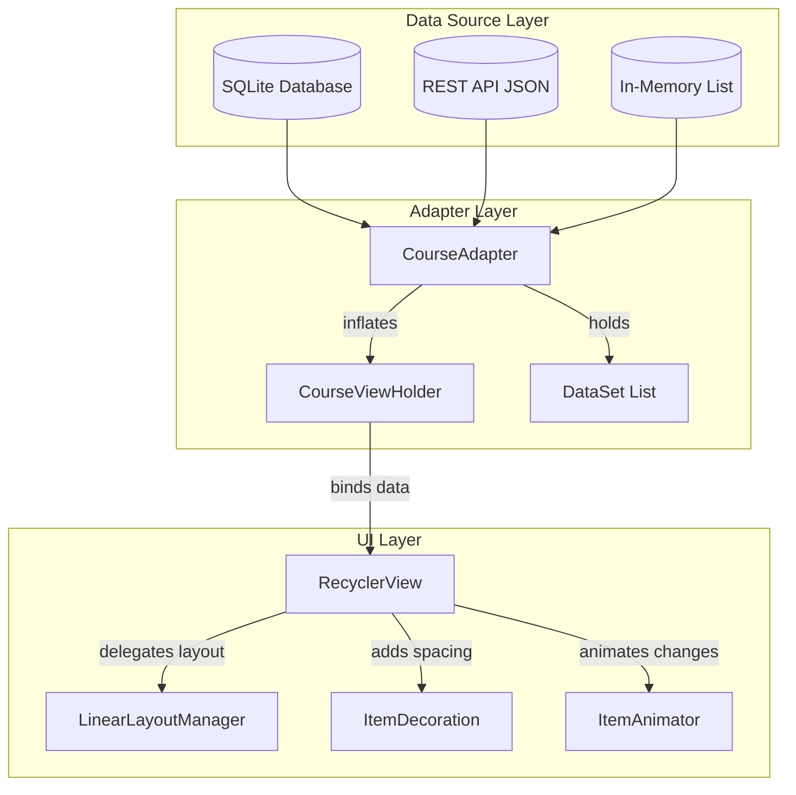
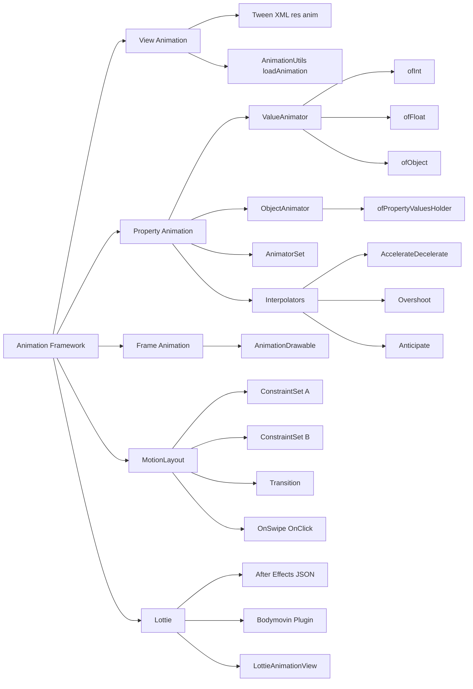
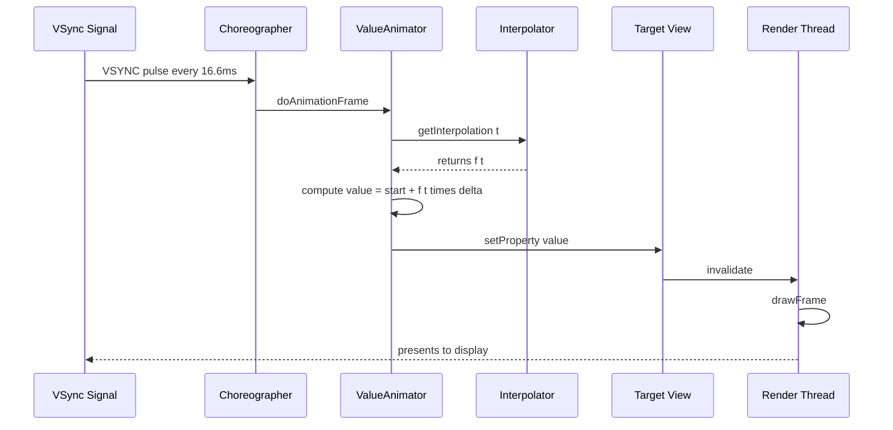
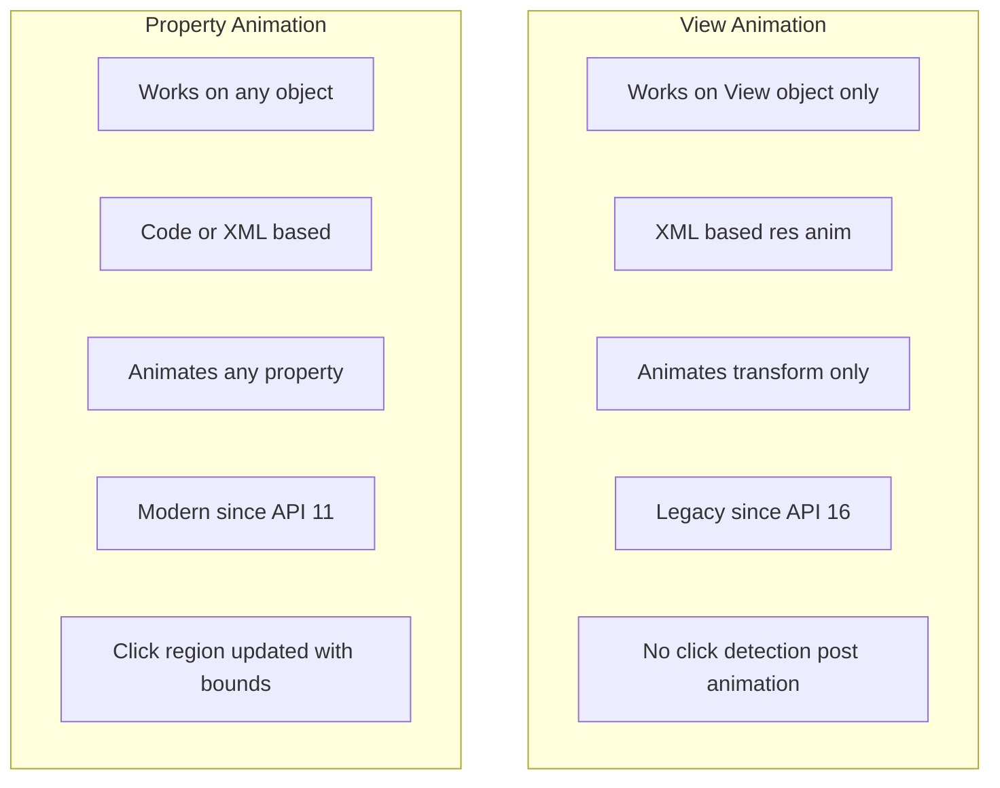
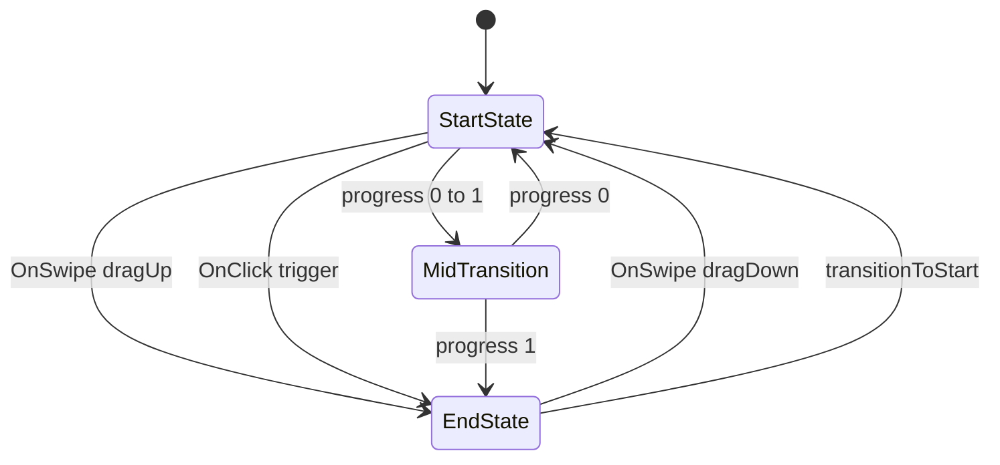
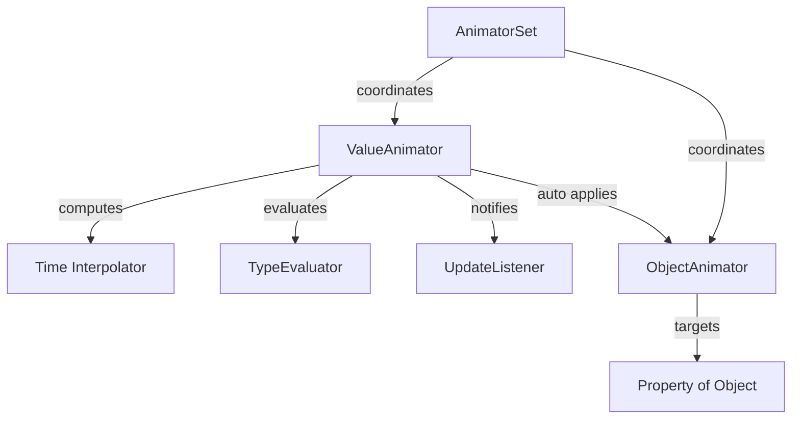
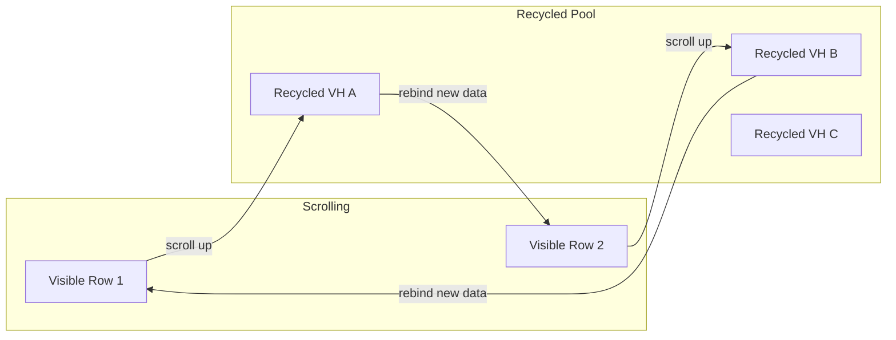

# Advanced UI Components and Animations

<!-- SECTION_1_START -->
# Advanced UI Components and Animations — KTU 2024 Premium Study Notes

## 1.1 Core Technical Definition

**Advanced UI Components** in Android refer to the sophisticated, reusable, and highly-customizable view-based widgets provided by the Android SDK and the AndroidX/Material Components libraries. They extend the capabilities of basic views like `TextView` and `Button` by supporting dynamic data binding, gesture-based interactions, complex layout behaviors, and adaptive Material Design specifications.

**Animations** in Android are programmatic or declarative visual transitions applied to UI elements over time. They manipulate properties such as position, scale, rotation, alpha, and color to deliver fluid, perceptually-meaningful user experiences that communicate hierarchy, feedback, and continuity between states.

> [!IMPORTANT]
> **KTU 2024 Syllabus Definition (Module 4):** *Advanced UI Components* covers **RecyclerView, CardView, ViewPager2, NavigationDrawer, BottomNavigationView, Fragments**, and related architectural patterns. *Animations* covers **Property Animations (`ObjectAnimator`, `ValueAnimator`), View Animations (`Tween`), Frame Animations, MotionLayout, Lottie, and transition frameworks**.

### 1.2 Conceptual Analogy / Intuition

Imagine you are arranging a **photo album**:
- A basic `ListView` is like a single-row strip of photos taped to a wall — wasteful, rigid, and slow when you have 1,000 photos.
- A **`RecyclerView`** is a **smart photo album** where the album "recycles" old photo frames as you scroll, attaching new photos to existing frames. This is the **ViewHolder pattern** — memory-efficient and lightning-fast.
- A **`ViewPager2`** is a **flipbook** — each page is a fragment, and you swipe horizontally to navigate between them.
- **Animations** are the **smooth page-turn sound and motion** of that flipbook — they give the illusion of continuity, depth, and physical reality. Without them, the UI feels like a static HTML page from 1998.

> [!NOTE]
> **Golden Rule of Modern Android UI:** Every interactive element must communicate state changes through **motion** (Material Motion Guidelines). Static UIs are deprecated in Material Design 3.

### 1.3 Standard Metrics & Constants

| Constant / Metric | Value | Purpose |
|---|---|---|
| **Standard animation duration** | **300 ms** | Material Design "Fast" transition |
| **Medium transition** | **400 ms** | Default enter/exit animations |
| **Slow transition** | **500–600 ms** | Complex layout changes (FAB → full screen) |
| **Touch ripple feedback** | **< 100 ms** | Perceived as instant |
| **Frame rate target** | **60 FPS (16.6 ms/frame)** | Smooth animation baseline |
| **Minimum perceptible motion** | **8 dp translation** | Below this, motion is invisible |

> [!VISUALIZATION CONTROL]
> **Concept:** Animation timing curve (Standard easing curve)
> **GeoGebra / Desmos Input Equations:**
> * `f_standard(t) = t^3` (cubic-bezier(0.4, 0.0, 0.2, 1) approximation for `t ∈ [0,1]`)
> * `f_decelerate(t) = 1 - (1-t)^3`
> * `f_accelerate(t) = t^3`
> **Visual Description:** Plot two curves on a unit square — X-axis is normalized time `t` (0→1), Y-axis is normalized progress (0→1). The Standard curve starts slow, accelerates, then decelerates (S-shape), representing the natural feel of real-world motion.

<!-- SECTION_1_END -->

<!-- SECTION_2_START -->
# 2. Deep Theoretical Analysis & KTU High-Yield Cheat Sheet

## 2.1 Taxonomy of Android UI Components

### 2.1.1 RecyclerView (High-Yield)
The `RecyclerView` widget is the **backbone of modern Android data lists**. It requires three core components:

1. **Adapter** — Bridges data list to view holders; implements `onCreateViewHolder()`, `onBindViewHolder()`, `getItemCount()`.
2. **ViewHolder** — Caches view references via `findViewById` (or View Binding) to prevent repeated lookups during scrolling.
3. **LayoutManager** — Positions items (Linear, Grid, StaggeredGrid).

> [!IMPORTANT]
> **Why RecyclerView over ListView?** ListView creates a new view for every row (memory-heavy). RecyclerView **reuses** the view holders of off-screen items, reducing GC pressure and improving scroll FPS.

### 2.1.2 ViewPager2
A swipe-based pager widget that hosts **Fragments** or `RecyclerView` items. Internally uses a `RecyclerView` itself, replacing the legacy `ViewPager`. Supports:
- **Vertical** and **horizontal** orientation
- **RTL (right-to-left)** layout
- **Off-screen page limit** configuration
- **PageTransformer** for custom page transition effects (cube, zoom, fade)

### 2.1.3 Navigation Components (Material 3)
- **BottomNavigationView** — Top-level destinations (3–5 items, never more).
- **NavigationDrawer** — Secondary destinations, accessed via hamburger icon.
- **NavigationRail** — Compact alternative for tablets/foldables.

### 2.1.4 CardView & MaterialCardView
A `FrameLayout` with rounded corners and elevation. `MaterialCardView` extends it with stroke, checked state, and dynamic Material 3 color roles.

## 2.2 Taxonomy of Android Animations

### 2.2.1 View Animations (Tween)
XML-based (`res/anim/`) animations that operate on the entire View as a single object. Properties: `alpha`, `scaleX/Y`, `translateX/Y`, `rotation`. Deprecated since API 16 for new code but still used in legacy projects.

### 2.2.2 Property Animations (High-Yield)
The **modern, recommended approach**. It animates *any* property of *any* object over time using `ValueAnimator` (computes values) and `ObjectAnimator` (extends `ValueAnimator` to auto-apply values to a target object).

### 2.2.3 Frame Animations
A sequence of `Drawable` resources shown in rapid succession (classic flipbook). Created via `AnimationDrawable` in XML (`<animation-list>`).

### 2.2.4 MotionLayout
A subclass of `ConstraintLayout` that allows you to animate between two `ConstraintSet` configurations using `Transition` objects. It is the **declarative, XML-driven** way to build complex coordinated animations (collapsing toolbars, hero transitions).

### 2.2.5 Lottie (After-Effects Vector Animations)
Renders JSON-based vector animations exported from Adobe After Effects via the Bodymovin plugin. **Resolution-independent**, tiny payload, and ideal for onboarding screens and micro-interactions.

## 2.3 KTU Formula Sheet / Cheat Sheet

| Concept | Formula / API Signature | Key Parameters | Unit / Notes |
|---|---|---|---|
| Property Animation Core | `ObjectAnimator.ofFloat(target, "translationX", 0f, 100f)` | `target`, `propertyName`, `vararg values` | Returns `ObjectAnimator` |
| ValueAnimator | `val a = ValueAnimator.ofInt(0, 100); a.setDuration(300)` | `start`, `end` (or vararg), `duration` | Triggers listener on each frame |
| Interpolator (Linear) | $f(t) = t$ | Constant velocity | Use for color loops, NOT for UI motion |
| Decelerate Interpolator | $f(t) = 1 - (1 - t)^{c}$ where $c \approx 3$ | Tamed cubic curve | Easing-out; objects settling |
| Accelerate Interpolator | $f(t) = t^c$ where $c \approx 3$ | Cubic acceleration | Easing-in; objects launching |
| Overshoot Interpolator | $f(t) = t \cdot \sin(c \cdot \pi \cdot t)$ | Tension factor (default $\approx 1.7$) | Bouncy effect at end |
| Spring Physics | $f(t) = 1 - e^{-c \cdot t} \cdot \cos(\omega \cdot t)$ | Damping ratio $\zeta$, stiffness | Modern Material motion |
| RecyclerView Span Count | $\text{span} = \lfloor W_{screen} / W_{item} \rfloor$ | Width-based auto-grid | Responsive layout |
| FPS Budget | $\text{FPS} = 1000 / \text{frameTime}_{ms}$ | Target $\geq 60$ FPS | $16.6$ ms/frame |
| Animation Chaining Delay | $t_{start, n+1} = t_{start, n} + \delta_{offset}$ | Offset delay | Use `startDelay` |
| Translation Distance | $d = v_{initial} \cdot t + \frac{1}{2} a t^2$ | Kinematic motion | For consistent UX across devices |

> [!NOTE]
> **Production Engineering Note:** In real Android apps, animations are governed by the `WindowAnimations` style and the `Choreographer` class. The Choreographer synchronizes frame callbacks to the display VSYNC signal, ensuring every animation step is rendered exactly once per refresh cycle. Dropped frames occur when the main thread blocks for > $16.6$ ms.

## 2.4 Real-World Engineering Utility

| Component / Animation | Used In Production For |
|---|---|
| `RecyclerView` | WhatsApp chats, Twitter feeds, Amazon product lists |
| `ViewPager2` | Instagram Stories, onboarding tutorials, image galleries |
| `ObjectAnimator` | FAB → BottomSheet expansion, button press feedback |
| `MotionLayout` | YouTube mini-player collapse/expand, Spotify album hero |
| Lottie | Airbnb illustrations, Telegram stickers, loading states |
| `BottomNavigationView` | Every Material 3 app: Gmail, Drive, Photos |

<!-- SECTION_2_END -->

<!-- SECTION_3_START -->
# 3. Step-by-Step Implementation (Kotlin / XML)

## 3.1 RecyclerView — Full Working Implementation

### 3.1.1 Gradle Dependency (build.gradle.kts Module-level)

```kotlin
dependencies {
    implementation("androidx.recyclerview:recyclerview:1.3.2")
    implementation("androidx.cardview:cardview:1.0.0")
    implementation("com.google.android.material:material:1.12.0")
}
```

### 3.1.2 Model Data Class

```kotlin
data class Course(
    val id: Int,
    val code: String,
    val title: String,
    val credits: Int
)
```

### 3.1.3 Row Layout (`res/layout/item_course.xml`)

```xml
<?xml version="1.0" encoding="utf-8"?>
<com.google.android.material.card.MaterialCardView
    xmlns:android="http://schemas.android.com/apk/res/android"
    xmlns:app="http://schemas.android.com/apk/res-auto"
    android:layout_width="match_parent"
    android:layout_height="wrap_content"
    android:layout_margin="8dp"
    app:cardCornerRadius="12dp"
    app:cardElevation="4dp">

    <LinearLayout
        android:layout_width="match_parent"
        android:layout_height="wrap_content"
        android:orientation="vertical"
        android:padding="16dp">

        <TextView
            android:id="@+id/tvCourseCode"
            android:layout_width="wrap_content"
            android:layout_height="wrap_content"
            android:textSize="14sp"
            android:textColor="#6200EE"
            android:textStyle="bold" />

        <TextView
            android:id="@+id/tvCourseTitle"
            android:layout_width="wrap_content"
            android:layout_height="wrap_content"
            android:textSize="18sp"
            android:textStyle="bold" />

        <TextView
            android:id="@+id/tvCredits"
            android:layout_width="wrap_content"
            android:layout_height="wrap_content"
            android:textSize="12sp" />
    </LinearLayout>
</com.google.android.material.card.MaterialCardView>
```

### 3.1.4 Adapter with ViewHolder Pattern

```kotlin
class CourseAdapter(
    private val courses: List<Course>,
    private val onClick: (Course) -> Unit
) : RecyclerView.Adapter<CourseAdapter.CourseViewHolder>() {

    // ViewHolder caches view references — called only when a new row enters screen
    override fun onCreateViewHolder(parent: ViewGroup, viewType: Int): CourseViewHolder {
        val view = LayoutInflater.from(parent.context)
            .inflate(R.layout.item_course, parent, false)
        return CourseViewHolder(view)
    }

    // Binds data to existing ViewHolder — called on every scroll tick
    override fun onBindViewHolder(holder: CourseViewHolder, position: Int) {
        val course = courses[position]
        holder.bind(course)
        holder.itemView.setOnClickListener { onClick(course) }
    }

    override fun getItemCount(): Int = courses.size

    class CourseViewHolder(itemView: View) : RecyclerView.ViewHolder(itemView) {
        private val tvCode: TextView = itemView.findViewById(R.id.tvCourseCode)
        private val tvTitle: TextView = itemView.findViewById(R.id.tvCourseTitle)
        private val tvCredits: TextView = itemView.findViewById(R.id.tvCredits)

        fun bind(course: Course) {
            tvCode.text = course.code
            tvTitle.text = course.title
            tvCredits.text = "Credits: ${course.credits}"
        }
    }
}
```

### 3.1.5 Activity Setup

```kotlin
class CoursesActivity : AppCompatActivity() {
    override fun onCreate(savedInstanceState: Bundle?) {
        super.onCreate(savedInstanceState)
        setContentView(R.layout.activity_courses)

        val recyclerView: RecyclerView = findViewById(R.id.rvCourses)
        recyclerView.layoutManager = LinearLayoutManager(this)
        recyclerView.setHasFixedSize(true) // Optimization: heights are uniform

        val data = listOf(
            Course(1, "OECST725", "Mobile Application Development", 4),
            Course(2, "CST301",  "Data Structures",                   4),
            Course(3, "CST305",  "Database Management Systems",       3)
        )

        recyclerView.adapter = CourseAdapter(data) { course ->
            Toast.makeText(this, "Clicked: ${course.code}", Toast.LENGTH_SHORT).show()
        }
    }
}
```

## 3.2 Property Animations — Exhaustive Step-by-Step

### 3.2.1 Fade-In Animation on Activity Entry

```kotlin
class MainActivity : AppCompatActivity() {
    override fun onCreate(savedInstanceState: Bundle?) {
        super.onCreate(savedInstanceState)
        setContentView(R.layout.activity_main)

        val titleText: TextView = findViewById(R.id.tvTitle)

        // Step 1: Create ObjectAnimator targeting the "alpha" property
        // Step 2: Range 0f (fully transparent) to 1f (fully opaque)
        // Step 3: Duration = 600ms (slow Material transition)
        // Step 4: Interpolator = AccelerateDecelerateInterpolator (S-curve)
        val fadeIn = ObjectAnimator.ofFloat(titleText, "alpha", 0f, 1f).apply {
            duration = 600
            interpolator = AccelerateDecelerateInterpolator()
        }

        // Step 5: Kick off the animation
        fadeIn.start()
    }
}
```

### 3.2.2 Coordinated Multi-Property Animation Set

```kotlin
fun animateCardEntrance(card: View) {
    // Step 1: Combined scale + fade effect
    val scaleX = ObjectAnimator.ofFloat(card, "scaleX", 0.8f, 1.0f)
    val scaleY = ObjectAnimator.ofFloat(card, "scaleY", 0.8f, 1.0f)
    val alpha  = ObjectAnimator.ofFloat(card, "alpha", 0.0f, 1.0f)
    val translationY = ObjectAnimator.ofFloat(card, "translationY", 100f, 0f)

    // Step 2: Bundle into AnimatorSet for synchronized playback
    AnimatorSet().apply {
        // Step 3: All four run together (parallel), 500ms total
        playTogether(scaleX, scaleY, alpha, translationY)
        duration = 500
        interpolator = OvershootInterpolator(1.5f) // Subtle bounce
        start()
    }
}
```

### 3.2.3 Animation Chaining (Sequential)

```kotlin
fun animateSequentially(views: List<View>) {
    val set = AnimatorSet()
    val animators = views.mapIndexed { index, view ->
        ObjectAnimator.ofFloat(view, "alpha", 0f, 1f).apply {
            duration = 300
            startDelay = (index * 100).toLong() // 100ms stagger per view
        }
    }
    set.playSequentially(animators)
    set.start()
}
```

## 3.3 ViewPager2 with TabLayout

```kotlin
class OnboardingActivity : AppCompatActivity() {
    override fun onCreate(savedInstanceState: Bundle?) {
        super.onCreate(savedInstanceState)
        setContentView(R.layout.activity_onboarding)

        val viewPager: ViewPager2 = findViewById(R.id.viewPager)
        val tabLayout: TabLayout = findViewById(R.id.tabLayout)

        // Step 1: Create adapter that hosts Fragment instances
        viewPager.adapter = object : FragmentStateAdapter(this) {
            override fun getItemCount(): Int = 3
            override fun createFragment(position: Int): Fragment = OnboardingFragment.newInstance(position)
        }

        // Step 2: Wire TabLayout indicator to ViewPager2
        TabLayoutMediator(tabLayout, viewPager) { tab, position ->
            tab.text = "Step ${position + 1}"
        }.attach()

        // Step 3: Optional — apply a page transformer for a depth effect
        viewPager.setPageTransformer { page, position ->
            page.alpha = 1f - Math.abs(position) * 0.3f
            page.scaleY = 1f - Math.abs(position) * 0.15f
        }
    }
}
```

## 3.4 MotionLayout (XML-Driven Coordinated Animation)

### 3.4.1 `res/xml/motion_scene.xml`

```xml
<?xml version="1.0" encoding="utf-8"?>
<MotionScene xmlns:android="http://schemas.android.com/apk/res/android"
    xmlns:motion="http://schemas.android.com/apk/res-auto">

    <Transition
        motion:constraintSetStart="@+id/start"
        motion:constraintSetEnd="@+id/end"
        motion:duration="500">
        <OnSwipe
            motion:touchAnchorId="@+id/ivHeader"
            motion:dragDirection="dragUp" />
    </Transition>

    <ConstraintSet android:id="@+id/start">
        <Constraint
            android:id="@+id/ivHeader"
            android:layout_width="match_parent"
            android:layout_height="200dp"
            motion:layout_constraintTop_toTopOf="parent" />
    </ConstraintSet>

    <ConstraintSet android:id="@+id/end">
        <Constraint
            android:id="@+id/ivHeader"
            android:layout_width="match_parent"
            android:layout_height="80dp"
            motion:layout_constraintTop_toTopOf="parent" />
    </ConstraintSet>
</MotionScene>
```

### 3.4.2 Layout XML Wiring

```xml
<androidx.constraintlayout.motion.widget.MotionLayout
    android:layout_width="match_parent"
    android:layout_height="match_parent"
    app:layoutDescription="@xml/motion_scene"
    app:showPaths="false">

    <ImageView
        android:id="@+id/ivHeader"
        android:layout_width="match_parent"
        android:layout_height="200dp"
        android:scaleType="centerCrop"
        android:src="@drawable/header_bg" />
</androidx.constraintlayout.motion.widget.MotionLayout>
```

<!-- SECTION_3_END -->

<!-- SECTION_4_START -->
# 4. Structural Diagrams & Schematics

## 4.1 RecyclerView Internal Architecture



## 4.2 Android Animation Framework Hierarchy



## 4.3 Animation Lifecycle Flow (Per Frame)



## 4.4 Modular Comparison: View vs Property Animations



## 4.5 MotionLayout State Machine



<!-- SECTION_4_END -->

<!-- SECTION_5_START -->
# 5. KTU 2024 Scheme Examination Question Bank

## PART A — Short Answer Questions (2 × 3 = 6 Marks)

### Question 1: [KTU University Exam — July 2024] | CO3 | Remember
**Differentiate between `ListView` and `RecyclerView`. Mention at least two advantages of `RecyclerView`.**

**Model Answer:**

| Feature | `ListView` | `RecyclerView` |
|---|---|---|
| ViewHolder pattern | Optional, not enforced | Mandatory, enforced by API |
| Memory usage | Higher (creates new view per row) | Lower (recycles view holders) |
| Layout managers | Vertical-only by default | Linear, Grid, StaggeredGrid |
| Item animations | No built-in support | Built-in `ItemAnimator` |
| Performance with large data | Poor (GC pressure) | Excellent (scrolling smoothness) |

**Advantages of RecyclerView:**
1. **ViewHolder pattern** — view references are cached, eliminating repeated `findViewById()` calls, reducing GC overhead.
2. **Pluggable `LayoutManager`** — supports horizontal, vertical, grid, and staggered grid layouts without subclassing.
3. **Built-in item animations** — add/remove/move animations are provided out-of-the-box via `DefaultItemAnimator`.
4. **Better scroll performance** — 60 FPS maintained even with thousands of items.

**[Award 1 Mark for each correct comparison, 1 Mark for valid advantage: Total 3 Marks]**

---

### Question 2: [KTU University Exam — Dec 2023] | CO3 | Understand
**Explain the role of an `Interpolator` in Android property animations. List any two built-in interpolators with their use case.**

**Model Answer:**

An `Interpolator` defines the **rate of change of an animation over time** — it maps the normalized time input $t \in [0, 1]$ to a normalized progress output $f(t) \in [0, 1]$ (or beyond for overshoot effects). It controls the **timing curve** of the animation while leaving the duration unchanged.

**Two Built-in Interpolators:**

1. **`AccelerateDecelerateInterpolator`** — Standard Material easing. Animation starts slow, speeds up in the middle, and slows down at the end. Used for general UI transitions (screen entry/exit, view reveal). Approximated as:

$$
f(t) = \cos\left(\frac{t + 1}{2} \cdot \pi\right) \cdot 0.5 + 0.5
$$

2. **`OvershootInterpolator(tension)`** — Animation goes beyond the final value and then settles back. Tension defaults to $\approx 1.7$. Used for playful UI elements like toggle switches, snackbar entrance, and pull-to-refresh. Mathematically:

$$
f(t) = t \cdot \sin\left(t \cdot \pi \cdot \text{tension}\right)
$$

**[Award 1 Mark for definition, 1 Mark each for two interpolators with correct use case: Total 3 Marks]**

---

## PART B — Long Answer Questions (Internal Choice)

### Question A (14 Marks) | CO3 | Apply

**(a)** With a neat diagram, explain the **architecture of the Android Property Animation system**. List the three core classes used in property animation and their roles. **[7 Marks]**

**(b)** Write a complete Kotlin program to animate a `Button` view such that it **simultaneously** fades in, scales up from $0.5\times$ to $1.0\times$, and translates from $200$ dp below its original position to its natural position. The total duration should be $600$ ms with an Overshoot interpolator of tension $2.0$. **[7 Marks]**

---

#### Model Solution for Part (a)

**Architecture Diagram:**



**Three Core Classes:**

1. **`ValueAnimator`** — The engine. Holds the start and end values, computes the animated fraction, and notifies listeners. Does NOT directly modify any object — it only generates values.
2. **`ObjectAnimator`** — A subclass of `ValueAnimator`. Targets a specific object and a specific property name. It uses reflection to set the value on the target automatically.
3. **`AnimatorSet`** — Coordinates multiple `Animator` instances to play **together** (`playTogether`), **sequentially** (`playSequentially`), or after specific delays (`play(a).after(b)`).

**Other supporting classes:** `Interpolator` (timing curve), `TypeEvaluator` (custom value type conversion), `Keyframe` (multi-step keyframed animation).

**`ValueAnimator` Working Mathematically:**

$$
\text{animatedValue} = \text{start} + \text{interpolator}(t) \cdot (\text{end} - \text{start})
$$

where $t = \frac{\text{currentTime} - \text{startTime}}{\text{totalDuration}}$.

**[Stating the three core classes: 3 Marks | Architecture diagram: 2 Marks | Explanation of roles: 2 Marks]**

---

#### Model Solution for Part (b)

**Kotlin Implementation:**

```kotlin
class AnimationDemoActivity : AppCompatActivity() {
    override fun onCreate(savedInstanceState: Bundle?) {
        super.onCreate(savedInstanceState)
        setContentView(R.layout.activity_animation_demo)

        val myButton: Button = findViewById(R.id.myButton)

        // Convert 200 dp to pixels for translationY
        val density = resources.displayMetrics.density
        val translationPx = 200 * density

        // Step 1: Define each individual ObjectAnimator
        val fadeIn = ObjectAnimator.ofFloat(myButton, "alpha", 0f, 1f)
        val scaleX = ObjectAnimator.ofFloat(myButton, "scaleX", 0.5f, 1.0f)
        val scaleY = ObjectAnimator.ofFloat(myButton, "scaleY", 0.5f, 1.0f)
        val slideUp = ObjectAnimator.ofFloat(
            myButton,
            "translationY",
            translationPx,
            0f
        )

        // Step 2: Combine all into a single AnimatorSet
        AnimatorSet().apply {
            playTogether(fadeIn, scaleX, scaleY, slideUp)
            duration = 600
            interpolator = OvershootInterpolator(2.0f)
            start()
        }
    }
}
```

**Explanation of Key Steps:**

- **`ObjectAnimator.ofFloat(view, property, start, end)`** — Creates an animator for a float property. Valid properties must have a public setter matching the property name (e.g., `setAlpha(float)` for `"alpha"`).
- **`playTogether(...)`** — Runs all four animations in parallel; they share the same 600 ms duration.
- **`OvershootInterpolator(2.0f)`** — Tension $2.0$ gives a strong bounce effect (exceeds final value by ~10% then settles).
- **dp to px conversion** — Required because `translationY` works in pixels, not dp. Formula used:

$$
\text{px} = \text{dp} \cdot \text{density}
$$

where `density` = $dpi / 160$.

**[Defining four ObjectAnimators: 3 Marks | AnimatorSet configuration with duration/interpolator: 2 Marks | dp→px conversion logic: 1 Mark | Code correctness: 1 Mark]**

---

### Question B (14 Marks — ALTERNATIVE) | CO3 | Apply

**(a)** Explain the **ViewHolder pattern** in `RecyclerView` with a suitable diagram. Why is it more memory-efficient than directly binding data in a `ListView`? **[7 Marks]**

**(b)** Design a `RecyclerView` adapter in Kotlin to display a list of `Student` objects (`name`, `rollNo`, `cgpa`). Each row should use a `MaterialCardView` and respond to a click event that displays a `Toast` with the student's name. Show the relevant XML row layout as well. **[7 Marks]**

---

#### Model Solution for Part (a)

**ViewHolder Pattern Diagram:**



**Why ViewHolder is More Memory-Efficient:**

In `ListView`, every time a row scrolls into view, the system:
1. Inflates the row XML (CPU heavy).
2. Calls `findViewById()` on every child view (CPU heavy, traverses the entire view tree).
3. Binds data.
4. When the row scrolls off-screen, **the entire view tree is discarded** — not cached.

In `RecyclerView` with ViewHolder pattern:
1. **Only the first time** a row type is needed, the XML is inflated and `findViewById()` is called once.
2. These view references are **stored in a ViewHolder object**.
3. When the row scrolls off-screen, the ViewHolder is **added to a Recycled View Pool**.
4. When a new row scrolls into view, the adapter **pops a ViewHolder from the pool** and only rebinds the data — no inflation, no `findViewById()`.

**Result:** With 1,000 students in a list, a `ListView` performs 1,000 inflations and 1,000 findViewById sweeps, while a `RecyclerView` inflates maybe **10** times and reuses the holders for the rest.

**[Diagram: 2 Marks | ViewHolder explanation: 3 Marks | Memory comparison justification: 2 Marks]**

---

#### Model Solution for Part (b)

**Data Class:**

```kotlin
data class Student(
    val rollNo: String,
    val name: String,
    val cgpa: Double
)
```

**Row Layout — `res/layout/item_student.xml`:**

```xml
<?xml version="1.0" encoding="utf-8"?>
<com.google.android.material.card.MaterialCardView
    xmlns:android="http://schemas.android.com/apk/res/android"
    xmlns:app="http://schemas.android.com/apk/res-auto"
    android:layout_width="match_parent"
    android:layout_height="wrap_content"
    android:layout_margin="8dp"
    app:cardCornerRadius="12dp"
    app:cardElevation="3dp">

    <LinearLayout
        android:layout_width="match_parent"
        android:layout_height="wrap_content"
        android:orientation="vertical"
        android:padding="16dp">

        <TextView
            android:id="@+id/tvName"
            android:layout_width="wrap_content"
            android:layout_height="wrap_content"
            android:textSize="18sp"
            android:textStyle="bold" />

        <TextView
            android:id="@+id/tvRollNo"
            android:layout_width="wrap_content"
            android:layout_height="wrap_content"
            android:textSize="14sp" />

        <TextView
            android:id="@+id/tvCgpa"
            android:layout_width="wrap_content"
            android:layout_height="wrap_content"
            android:textSize="14sp"
            android:textColor="#388E3C" />
    </LinearLayout>
</com.google.android.material.card.MaterialCardView>
```

**Kotlin Adapter:**

```kotlin
class StudentAdapter(
    private val students: List<Student>
) : RecyclerView.Adapter<StudentAdapter.StudentViewHolder>() {

    override fun onCreateViewHolder(parent: ViewGroup, viewType: Int): StudentViewHolder {
        val view = LayoutInflater.from(parent.context)
            .inflate(R.layout.item_student, parent, false)
        return StudentViewHolder(view)
    }

    override fun onBindViewHolder(holder: StudentViewHolder, position: Int) {
        val student = students[position]
        holder.bind(student)

        holder.itemView.setOnClickListener {
            Toast.makeText(
                holder.itemView.context,
                "Clicked: ${student.name}",
                Toast.LENGTH_SHORT
            ).show()
        }
    }

    override fun getItemCount(): Int = students.size

    class StudentViewHolder(itemView: View) : RecyclerView.ViewHolder(itemView) {
        private val tvName: TextView   = itemView.findViewById(R.id.tvName)
        private val tvRollNo: TextView = itemView.findViewById(R.id.tvRollNo)
        private val tvCgpa: TextView   = itemView.findViewById(R.id.tvCgpa)

        fun bind(student: Student) {
            tvName.text = student.name
            tvRollNo.text = "Roll No: ${student.rollNo}"
            tvCgpa.text = "CGPA: ${student.cgpa}"
        }
    }
}
```

**Activity Setup (Brief):**

```kotlin
val rvStudents: RecyclerView = findViewById(R.id.rvStudents)
rvStudents.layoutManager = LinearLayoutManager(this)
rvStudents.adapter = StudentAdapter(studentList)
```

**[Data class + XML layout: 3 Marks | Adapter with ViewHolder: 2 Marks | Click handling and Toast: 1 Mark | Correctness: 1 Mark]**

---

> [!WARNING]
> **KTU Examiner's Valuation Warning — Common Pitfalls:**
> 1. **Forgetting to call `start()` on the `ObjectAnimator` or `AnimatorSet`** — animation is created but never executes. Loses **1–2 Marks**.
> 2. **Writing `dp` directly inside `ObjectAnimator.ofFloat(view, "translationY", 200f, 0f)`** — the property is in **pixels, not dp**. Examiner expects you to convert using `density`. Loses **1 Mark**.
> 3. **Not using `findViewById` inside ViewHolder constructor** — defeating the entire purpose of the pattern. Examiner deducts **2 Marks** for the explanation part.
> 4. **Missing `import` statements** in code questions (e.g., `import android.animation.AnimatorSet`). Always include them at the top of the code block.
> 5. **Forgetting `setHasFixedSize(true)`** when row heights are uniform — minor deduction (½ Mark) but reflects production awareness.
> 6. **Confusing `playTogether` and `playSequentially`** — these are NOT interchangeable. Sequential plays one after the other; together plays all at the same time.

---

## Topic Recap & Important Things to Remember

- **RecyclerView** is the **mandatory** replacement for `ListView` in modern Android. It uses the **ViewHolder pattern** to recycle off-screen views, dramatically reducing memory allocation.
- The **three pillars of `RecyclerView`** are: **Adapter** (data binding), **ViewHolder** (view caching), and **LayoutManager** (positioning).
- **Property Animations** are the modern standard; **View Animations** are legacy. Always prefer `ObjectAnimator` / `ValueAnimator` for new code.
- **`ObjectAnimator`** auto-applies values to a property using reflection. **`ValueAnimator`** only computes values — you must attach a listener to apply them.
- **Interpolators** control the *timing curve* of an animation, not its duration. Common ones: `AccelerateDecelerateInterpolator` (standard), `OvershootInterpolator` (bounce), `AnticipateInterpolator` (reverse bounce).
- **`ViewPager2`** is built on top of `RecyclerView` internally and supports `FragmentStateAdapter` for swipeable pages.
- **`MotionLayout`** allows declarative coordinated animation between two `ConstraintSet` configurations in pure XML. Use it for collapsing headers and hero transitions.
- **Lottie** is a vector-based animation library that renders After Effects JSON exports — resolution-independent and lightweight.
- **Standard Material animation durations:** Fast $= 150$ ms, Medium $= 300$ ms, Slow $= 500$ ms. Default complex transitions use **$300$ ms**.
- **Animation must never block the main thread for > $16.6$ ms** — otherwise the device drops below 60 FPS and the user perceives jank (jittery motion).
- **`setHasFixedSize(true)`** is a RecyclerView optimization when the adapter size and item dimensions do not change — it skips extra layout passes.
- **Use `dp` for layout dimensions** but **pixels (px) for animation translations**. Conversion: $\text{px} = \text{dp} \times \text{density}$.
- **`BottomNavigationView`** should hold 3–5 destinations, no more. Use **NavigationDrawer** for 5+ secondary destinations.
- **Frame animations** (`AnimationDrawable`) consume significant memory for long sequences — prefer **Lottie** for complex looping animations.
- **KTU 2024 most-likely exam topics:** RecyclerView architecture (high frequency), ObjectAnimator code (almost every paper has one), Interpolators, ViewPager2 setup, MotionLayout configuration.
<!-- SECTION_5_END -->
