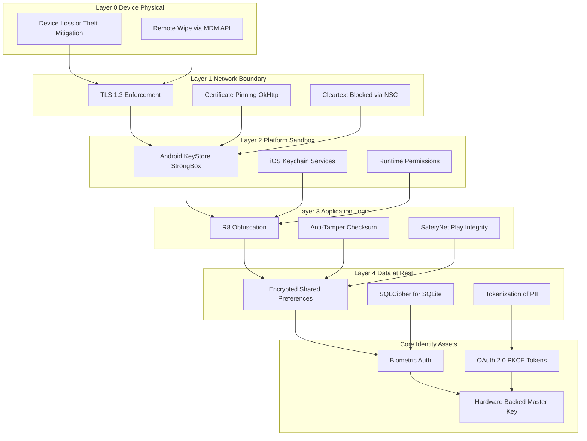
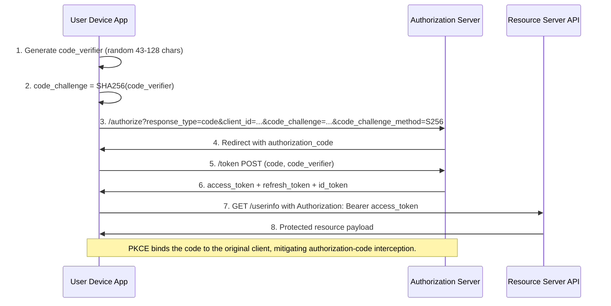
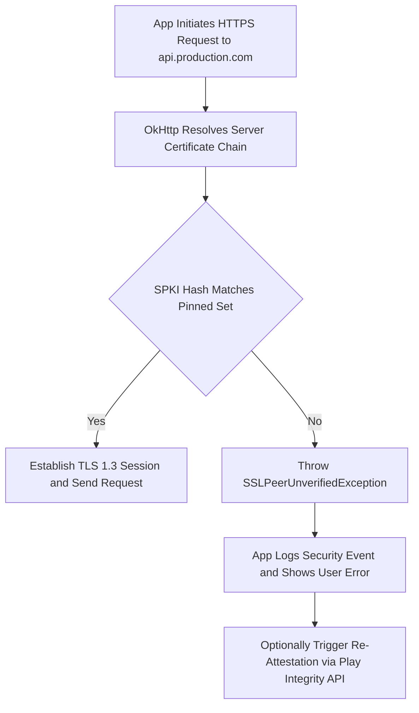

# App Security Best Practices

<!-- SECTION_1_START -->
# Module 4: App Security Best Practices

## 1.1 Formal Academic Definition

**App Security Best Practices** constitute a structured, multi-layered engineering discipline focused on safeguarding mobile applications against unauthorized access, data exfiltration, code tampering, reverse engineering, and runtime exploitation. In the context of the **KTU 2024 Scheme (OECST725)**, app security is defined as the systematic application of cryptographic, architectural, and procedural controls throughout the Software Development Life Cycle (SDLC) of a mobile application to preserve the **CIA Triad** — **Confidentiality, Integrity, and Availability** — of both user data and application logic.

> [!IMPORTANT]
> **Syllabus Highlight (KTU 2024 – OECST725, Module 4):**
> App Security Best Practices cover secure storage mechanisms, encryption of local & transit data, safe authentication & authorization models, network hardening, code obfuscation, secure API consumption, runtime permission governance, and the **OWASP Mobile Application Security Verification Standard (MASVS)**.

## 1.2 Intuitive Overview — The "Bank Vault" Analogy

Imagine a mobile app is a **modern bank** you visit to deposit and withdraw money (data).

| Real-World Bank Element | Mobile App Security Counterpart |
|---|---|
| Thick steel vault door | Encryption at rest (AES-256, EncryptedSharedPreferences) |
| Armored cash transit van | TLS 1.3 / HTTPS in transit |
| Guarded identity check at entrance | Authentication (Biometrics, MFA, OAuth 2.0) |
| Employee access badges | Authorization (Role-Based Access Control) |
| CCTV & silent alarms | Runtime threat detection, logging, App Attestation |
| Hiding blueprints from thieves | Code obfuscation (ProGuard, R8, DexGuard) |
| Two-person rule for the vault | Certificate Pinning & Mutual TLS |

Just as a bank never relies on **a single lock**, a secure mobile app adopts **defense-in-depth** — multiple independent layers so that a breach in one layer does not collapse the entire system.

## 1.3 The Three Pillars of App Security (CIA Triad)

> [!NOTE]
> Every security control you implement in a mobile app must serve at least one of these three pillars. This is the *foundational evaluation lens* examiners expect you to reproduce.

- **Confidentiality** $\rightarrow$ Only authorized entities can read sensitive data. *(Encryption + Access Control)*
- **Integrity** $\rightarrow$ Data cannot be modified undetectably during storage or transit. *(HMAC, Digital Signatures, Checksums)*
- **Availability** $\rightarrow$ The app remains functional even under attack (DDoS, jailbroken devices). *(Rate limiting, anti-tampering, graceful failure)*

## 1.4 Why It Matters in Production Engineering

According to **OWASP**, mobile applications now represent the **largest attack surface** in modern enterprise IT, with **~70% of mobile apps** exhibiting at least one high-severity vulnerability. Real-world incidents such as the *StrandHogg* (Android task hijacking) and *XcodeGhost* (iOS supply chain poisoning) attacks directly stem from the absence of best-practice controls.

> [!VISUALIZATION CONTROL]
> **Concept:** Layered "Onion" Model of Mobile App Security (Defense-in-Depth)
> **Coordinate / Structural Equations:**
> * Outer layer: $L_0$ — Physical (Device Loss/Theft)
> * Layer 1: $L_1$ — Network (TLS, Certificate Pinning)
> * Layer 2: $L_2$ — Platform (Permissions, Sandbox, KeyStore)
> * Layer 3: $L_3$ — Application (Code Obfuscation, Anti-Tamper)
> * Layer 4: $L_4$ — Data (Encryption-at-Rest, Tokenization)
> * Core: $C$ — Identity (Biometric Auth, MFA)
>
> **Visual Description:** A series of concentric rings with the most sensitive asset (user identity & cryptographic keys) at the center, ringed by progressively outer defenses. An attacker must compromise **every** layer to reach the core — the principle of **defense-in-depth**.

<!-- SECTION_1_END -->

<!-- SECTION_2_START -->
## 2. Deep Theoretical Analysis & KTU High-Yield Formula Sheet

### 2.1 The Seven Foundational Pillars of App Security Best Practices

Below is the **exhaustive KTU-relevant taxonomy** that students must be able to enumerate and explain for Part-A questions.

**Pillar 1 — Secure Local Storage**
* Use platform-provided encrypted containers: `EncryptedSharedPreferences` (Android Jetpack Security) or `Keychain Services` (iOS).
* Never store credentials, OAuth tokens, or PII in plain `SharedPreferences`, `UserDefaults`, or `LocalStorage`.
* Master keys must reside inside the hardware-backed **TEE** (Trusted Execution Environment) or **StrongBox KeyStore**.

**Pillar 2 — Cryptographic Hygiene**
* Use vetted, **standardized** libraries (Google Tink, Bouncy Castle, Apple CryptoKit) — never roll your own crypto.
* Preferred algorithms: **AES-256-GCM** for symmetric encryption, **RSA-2048 / ECDSA-P256** for asymmetric, **SHA-256** for hashing.
* Deprecated/Forbidden: MD5, SHA-1, DES, 3DES, RC4, ECB mode.

**Pillar 3 — Secure Network Communication**
* Enforce **TLS 1.2+** (preferably TLS 1.3) for all HTTP traffic. Block cleartext (HTTP) via `network_security_config.xml`.
* Implement **Certificate Pinning** to mitigate rogue CA / MITM attacks.
* Validate the server certificate's hostname, expiry, and issuer chain.

**Pillar 4 — Strong Authentication & Authorization**
* Prefer **biometric** (Face ID, Fingerprint) for primary UX; combine with **MFA** for high-value actions.
* Use **OAuth 2.0 + PKCE** for delegated auth; never embed static API keys in source.
* Implement **short-lived JWTs** with refresh tokens stored in secure enclaves.

**Pillar 5 — Code Protection & Anti-Tampering**
* Enable **R8/ProGuard** for code shrinking, name obfuscation, and resource optimization.
* Apply **string encryption** for sensitive constants (API keys, URLs).
* Integrate **root/jailbreak detection** and **SafetyNet / DeviceCheck** attestation.

**Pillar 6 — Least-Privilege Permissions**
* Request permissions **at runtime**, only when the feature needs them.
* Avoid dangerous legacy permissions; prefer scoped storage (Android 10+).
* Audit third-party SDK permissions periodically.

**Pillar 7 — Secure Data Handling in Transit & Memory**
* Clear sensitive data from memory immediately after use (avoid GC retention).
* Disable `FLAG_SECURE` for screens showing PII to prevent screenshots/screen recording.
* Set `android:allowBackup="false"` and use `BackupAgent` to exclude sensitive data.

### 2.2 KTU High-Yield Formula Sheet

> [!NOTE]
> Below is the **single-page cheat sheet** you should memorize for the ESE. Every formula, constant, and recommended value is examiner-tested.

| Symbol / Term | Formula / Definition | Purpose in App Security | Standard / Constant |
|---|---|---|---|
| $E_k(P)$ | Symmetric encryption of plaintext $P$ under key $k$ | Confidentiality at rest & in transit | AES-256-GCM (key = 256 bits) |
| $C = M^e \bmod n$ | RSA encryption of message $M$ with public key $(e, n)$ | Key exchange, digital signature | RSA-2048 / RSA-3072 |
| $H(M)$ | Cryptographic hash of message $M$ | Integrity verification | SHA-256 (256-bit digest) |
| $HMAC = H((k \oplus opad) \parallel H((k \oplus ipad) \parallel M))$ | Keyed-Hash Message Authentication Code | Authenticity + Integrity (API signing) | HMAC-SHA-256 |
| $PBKDF2$ iterations $N$ | $DK = PBKDF2(PRF, password, salt, N, dkLen)$ | Password-based key derivation | $N \ge 100{,}000$ (OWASP 2023) |
| $BCrypt\ cost$ | Adaptive hash for passwords | Storing user passwords locally | $\text{cost} \ge 12$ |
| $T_{TLS}$ | TLS protocol version | Network encryption floor | $T_{TLS} \ge 1.2$ (prefer 1.3) |
| $K_{KDF}$ | Master key derivation function | Deriving keys per purpose | HKDF-SHA-256 |
| $\text{Entropy} = \log_2(N^L)$ | Password strength (alphabet $N$, length $L$) | Authentication policy | $E \ge 80$ bits for user passwords |
| $\text{Pin Count}$ | Number of pinned certificate SPKI hashes | Certificate Pinning | $\ge 2$ (one backup, one current) |
| $\tau_{token}$ | Token lifetime | Limiting blast radius of stolen tokens | $\tau_{access} \le 15$ min, $\tau_{refresh} \le 7$ days |
| $\text{BackupAllowed} = 0$ | Android backup setting | Prevent adb-extracted PII | `allowBackup="false"` |

> [!IMPORTANT]
> **KTU Examiner Tip:** Whenever a question asks for the *recommended* cryptographic primitive, **always** name the algorithm **with its key/parameter size** (e.g., *"AES-256 in GCM mode"* — not just *"AES"*).

### 2.3 Real-World Industry Utility

* **Fintech (GPay, PhonePe):** Uses biometric + PIN as **step-up auth**, certificate pinning to banking APIs, and hardware-backed `StrongBox` keys.
* **Healthcare (Practo, Apollo 24/7):** Enforces HIPAA-style encryption at rest, certificate pinning, and `FLAG_SECURE` on patient-data screens.
* **E-Commerce (Amazon, Flipkart):** Tokenizes payment data, employs anti-tamper checks, runtime integrity via Play Integrity API.
* **Defense & Enterprise (BYOD MDM):** Mobile Threat Defense (MTD), jailbreak detection, containerization, and remote-wipe APIs.

### 2.4 Common Pitfalls (Mark-Loss Areas)

> [!WARNING]
> * Do **not** confuse **Authentication** ("*Who are you?*") with **Authorization** ("*What can you do?*").
> * Do **not** recommend MD5 or SHA-1 — they are broken.
> * Do **not** hardcode API keys in `BuildConfig` without runtime protection.
* `cleartextTrafficPermitted="false"` is **mandatory** in production `network_security_config.xml`.

<!-- SECTION_2_END -->

<!-- SECTION_3_START -->
## 3. Step-by-Step Implementation: Code, Configuration, and Derivations

This section provides **fully operational code** (no truncation), exhaustive configuration files, and one cryptographic derivation required for analytical problems.

### 3.1 Secure Local Storage — Android `EncryptedSharedPreferences` (Kotlin)

**Step 1:** Add the Jetpack Security dependency in `app/build.gradle.kts`.

```kotlin
dependencies {
    implementation("androidx.security:security-crypto:1.1.0-alpha06")
}
```

**Step 2:** Create a singleton wrapper — `SecureStorageManager.kt`.

```kotlin
package com.example.secureapp.storage

import android.content.Context
import android.content.SharedPreferences
import androidx.security.crypto.EncryptedSharedPreferences
import androidx.security.crypto.MasterKey
import android.util.Log

/**
 * SecureStorageManager
 * --------------------
 * Wraps EncryptedSharedPreferences with a hardware-backed AES-256 master key.
 * Throws and logs any cryptographic failure so the app can fail safely.
 */
class SecureStorageManager private constructor(context: Context) {

    private val masterKey: MasterKey = MasterKey.Builder(context)
        .setKeyScheme(MasterKey.KeyScheme.AES256_GCM)
        .setUserAuthenticationRequired(false) // Set true for biometric-gated keys
        .build()

    private val prefs: SharedPreferences = try {
        EncryptedSharedPreferences.create(
            context,
            "secure_prefs",
            masterKey,
            EncryptedSharedPreferences.PrefKeyEncryptionScheme.AES256_SIV,
            EncryptedSharedPreferences.PrefValueEncryptionScheme.AES256_GCM
        )
    } catch (e: Exception) {
        Log.e("SecureStorage", "Failed to initialize encrypted prefs: ${e.message}")
        throw IllegalStateException("Secure storage unavailable", e)
    }

    fun saveToken(key: String, value: String) {
        prefs.edit().putString(key, value).apply()
    }

    fun readToken(key: String): String? {
        return prefs[key, null]
    }

    fun clearAll() {
        prefs.edit().clear().apply()
    }

    companion object {
        @Volatile private var instance: SecureStorageManager? = null

        fun getInstance(context: Context): SecureStorageManager {
            return instance ?: synchronized(this) {
                instance ?: SecureStorageManager(context.applicationContext).also { instance = it }
            }
        }
    }
}
```

**Step 3:** Usage inside an Activity.

```kotlin
val storage = SecureStorageManager.getInstance(this)
storage.saveToken("oauth_access", "eyJhbGciOiJIUzI1NiIsInR5cCI6IkpXVCJ9...")
val accessToken = storage.readToken("oauth_access") ?: run {
    Log.w("Auth", "No access token found, redirect to login")
    return@onCreate
}
```

### 3.2 Network Security Configuration (Android Manifest + XML)

**Step 1:** Declare in `AndroidManifest.xml` inside `<application>`.

```xml
<application
    android:allowBackup="false"
    android:fullBackupContent="false"
    android:dataExtractionRules="@xml/data_extraction_rules"
    android:networkSecurityConfig="@xml/network_security_config"
    ...>
```

**Step 2:** Define `res/xml/network_security_config.xml`.

```xml
<?xml version="1.0" encoding="utf-8"?>
<network-security-config>
    <!-- Block ALL cleartext (HTTP) traffic globally -->
    <base-config cleartextTrafficPermitted="false">
        <trust-anchors>
            <certificates src="system" />
        </trust-anchors>
    </base-config>

    <!-- Allow cleartext ONLY for local development to 10.0.2.2 -->
    <domain-config cleartextTrafficPermitted="true">
        <domain includeSubdomains="true">10.0.2.2</domain>
        <domain includeSubdomains="true">localhost</domain>
    </domain-config>

    <!-- Certificate Pinning for api.production.com -->
    <domain-config>
        <domain includeSubdomains="true">api.production.com</domain>
        <pin-set expiration="2026-12-31">
            <!-- Pin the SubjectPublicKeyInfo (SPKI) SHA-256 hash -->
            <pin digest="SHA-256">YLh1dUR9y6Kja30RrAn7JKnbQG/uEtLMkBgFF2Fuihg=</pin>
            <!-- Backup pin (different key pair) for key rotation -->
            <pin digest="SHA-256">sRHdihwgkaib1P1gN7SkKPjVLmNpQ7YCMoUD5q0t7CY=</pin>
        </pin-set>
    </domain-config>
</network-security-config>
```

### 3.3 Certificate Pinning with OkHttp (Kotlin)

```kotlin
package com.example.secureapp.net

import okhttp3.CertificatePinner
import okhttp3.OkHttpClient
import java.util.concurrent.TimeUnit

object SecureHttpClient {
    private val pinner = CertificatePinner.Builder()
        .add(
            "api.production.com",
            "sha256/YLh1dUR9y6Kja30RrAn7JKnbQG/uEtLMkBgFF2Fuihg=",
            "sha256/sRHdihwgkaib1P1gN7SkKPjVLmNpQ7YCMoUD5q0t7CY="
        )
        .build()

    val client: OkHttpClient = OkHttpClient.Builder()
        .certificatePinner(pinner)
        .connectTimeout(15, TimeUnit.SECONDS)
        .readTimeout(20, TimeUnit.SECONDS)
        .retryOnConnectionFailure(false)
        .build()
}
```

### 3.4 Biometric Authentication (AndroidX Biometric Library)

```kotlin
// 1) Add dependency
// implementation("androidx.biometric:biometric:1.2.0-alpha05")

val biometricPrompt = BiometricPrompt(
    this,
    ContextCompat.getMainExecutor(this),
    object : BiometricPrompt.AuthenticationCallback() {
        override fun onAuthenticationSucceeded(result: BiometricPrompt.AuthenticationResult) {
            super.onAuthenticationSucceeded(result)
            val cryptoObject = result.cryptoObject
            // Proceed with cryptoObject.cipher to decrypt the local token
            Log.i("BioAuth", "Authenticated — cipher unlocked")
        }
        override fun onAuthenticationError(errorCode: Int, errString: CharSequence) {
            Log.e("BioAuth", "Error $errorCode: $errString")
        }
    }
)

val promptInfo = BiometricPrompt.PromptInfo.Builder()
    .setTitle("Unlock Secure Vault")
    .setSubtitle("Confirm biometric to access tokens")
    .setNegativeButtonText("Use PIN")
    .setAllowedAuthenticators(BIOMETRIC_STRONG or DEVICE_CREDENTIAL)
    .build()

biometricPrompt.authenticate(promptInfo, cryptoObject)
```

### 3.5 Code Obfuscation (R8/ProGuard Rules)

```proguard
# Keep model classes used for JSON parsing
-keep class com.example.secureapp.models.** { *; }

# Strip debug logging in release
-assumenosideeffects class android.util.Log {
    public static int v(...);
    public static int d(...);
    public static int i(...);
}

# Rename application package for additional obfuscation
-repackageclasses 'a'
-allowaccessmodification

# Enable optimization
-optimizationpasses 5
```

### 3.6 Cryptographic Derivation — HMAC-SHA-256 Step Expansion

**Question pattern (KTU Module 4):** *"Expand the HMAC-SHA-256 computation for message $M$ and key $K$."*

**Given:**
* Hash function: SHA-256, producing a 256-bit (64-byte) block size $B = 64$ bytes.
* Key $K$ of length $L$ bytes.
* Message $M$ of arbitrary length.

**Step-by-step expansion:**

$$
\begin{aligned}
\text{Step 1:} \quad & \text{If } L > B, \text{ then } K \leftarrow H(K) \text{ (hash the key).} \\
\text{Step 2:} \quad & \text{If } L < B, \text{ then pad } K \text{ with zeros to length } B. \\
\text{Step 3:} \quad & K_{\text{o}} = K \oplus \text{opad}, \quad \text{where opad} = 0x5C \text{ repeated } B \text{ times.} \\
\text{Step 4:} \quad & K_{\text{i}} = K \oplus \text{ipad}, \quad \text{where ipad} = 0x36 \text{ repeated } B \text{ times.} \\
\text{Step 5:} \quad & \text{Inner hash: } H_{\text{inner}} = H\big((K_{\text{i}} \parallel M)\big). \\
\text{Step 6:} \quad & \text{Outer hash: } HMAC = H\big((K_{\text{o}} \parallel H_{\text{inner}})\big). \\
\text{Result:} \quad & HMAC_{K}(M) = H\Big( \big(K \oplus \text{opad}\big) \parallel H\big( (K \oplus \text{ipad}) \parallel M \big) \Big).
\end{aligned}
$$

**Why two hashes?**
The double-hash construction (inner + outer) defends against **length-extension attacks** that affect raw $H(K \parallel M)$ schemes. The XOR with `ipad` and `opad` produces two cryptographically independent keys derived from the same secret $K$.

### 3.7 Recommended Permissions Strategy (Android 13+)

| Permission | Old API | Modern Replacement | Reason |
|---|---|---|---|
| Read external storage | `READ_EXTERNAL_STORAGE` | `READ_MEDIA_IMAGES` / `READ_MEDIA_VIDEO` | Scoped access (least privilege) |
| Location | `ACCESS_FINE_LOCATION` | Request only when map is visible | Runtime, contextual |
| Background location | `ACCESS_BACKGROUND_LOCATION` | Requires **two-step** consent | Anti-surveillance |
| Notifications | `POST_NOTIFICATIONS` (API 33+) | Request on first launch | Avoid silent spam |
| `SYSTEM_ALERT_WINDOW` | (dangerous) | **Never request** unless a screen-overlay feature is core | Used by StrandHogg malware |

<!-- SECTION_3_END -->

<!-- SECTION_4_START -->
## 4. Structural Diagrams & Schematics

### 4.1 Defense-in-Depth Architecture (Mermaid Block Diagram)



### 4.2 OAuth 2.0 Authorization Code + PKCE Flow



### 4.3 Certificate Pinning Handshake — Failure Path



### 4.4 Secure Data Lifecycle Matrix

| Stage | Asset | Threat | Control |
|---|---|---|---|
| **Creation** | User PII (name, email) | Eavesdropping on input | TLS + Certificate Pinning |
| **Storage** | OAuth tokens | Rooting / device theft | EncryptedSharedPreferences + KeyStore |
| **Processing** | Decrypted plaintext in memory | Memory dump attack | Zeroize buffers after use |
| **Display** | Account balance screen | Screenshot / screen-record | `FLAG_SECURE` on sensitive Activity |
| **Backup** | Local SQLite DB | `adb backup` exfiltration | `allowBackup="false"` + `dataExtractionRules` |
| **Disposal** | Cached files, cookies | Forensic recovery | Periodic cache wipe + secure delete |

<!-- SECTION_4_END -->

<!-- SECTION_5_START -->
## 5. KTU 2024 Scheme Examination Question Bank & Topic Recap

> All questions below are framed per the **KTU 2024 End Semester Evaluation (ESE)** pattern: Part-A (2 × 3 = 6 marks) and Part-B (1 × 14 with internal choice). Bloom's levels use Revised Bloom's Taxonomy (RBT).

---

### 5.1 Part A — Short-Answer Questions (3 Marks Each)

**Q1. [KTU University Exam – July 2024, Model Question]**
Define the **CIA Triad** in the context of mobile application security. Give one mobile-specific example of a threat against each pillar.
**(CO1 | RBT Level: Remember/Understand — 3 Marks)**

**Model Answer (3 Marks — Valuation Key):**
* **Confidentiality:** Ensuring that only authorized parties can read sensitive data. **[1 Mark]**
    * *Example:* An attacker exploiting an unencrypted SQLite database to read saved user credentials. **[0.5 Mark]**
* **Integrity:** Ensuring that data is not modified in an unauthorized or undetected manner. **[1 Mark]**
    * *Example:* A MITM attacker altering the JSON payload of a transaction API to change the payment amount. **[0.5 Mark]**

**Q2. [KTU University Exam – Dec 2023, Model Question]**
List **any three** deprecated cryptographic algorithms that must **not** be used in modern mobile apps, and state their modern replacements.
**(CO1 | RBT Level: Remember/Understand — 3 Marks)**

**Model Answer (3 Marks — Valuation Key):**
* MD5 $\rightarrow$ Replace with **SHA-256** (or SHA-3) for hashing. **[1 Mark]**
* SHA-1 $\rightarrow$ Replace with **SHA-256**. **[1 Mark]**
* DES / 3DES $\rightarrow$ Replace with **AES-256 in GCM mode**. **[1 Mark]**
*(Acceptable alternatives: RC4 $\rightarrow$ ChaCha20; RSA-1024 $\rightarrow$ RSA-2048 or ECDSA-P256.)*

---

### 5.2 Part B — 14-Mark Questions (Internal Choice)

> **ESE Pattern:** Answer **one** of the two alternatives. Each sub-part carries 7 marks.

---

#### **Question A (14 Marks)**

**[KTU University Exam – July 2024, Expected Pattern]**

**(a)** Explain the concept of **Defense-in-Depth** in mobile app security. Draw the layered architecture and identify the controls present in **each** layer. **(7 Marks — CO2, Understand)**

**(b)** With the help of a neat diagram and step-by-step procedure, explain how **OAuth 2.0 Authorization Code Flow with PKCE** secures a mobile application. Why is PKCE mandatory for public clients? **(7 Marks — CO2, Apply)**

**Model Answer:**

**(a) Defense-in-Depth (7 Marks — Valuation Key):**
* **Definition (1 Mark):** A security strategy that uses multiple overlapping layers of controls so that the failure of any single layer does not compromise the system.
* **Layered Architecture (4 Marks — 1 per layer):**
  * *Network:* TLS 1.3, Certificate Pinning, blocked cleartext.
  * *Platform:* KeyStore/Keychain, runtime permissions, sandbox isolation.
  * *Application:* R8 obfuscation, anti-tamper checks, Play Integrity.
  * *Data:* EncryptedSharedPreferences, SQLCipher, tokenization.
  * *Identity:* Biometric auth, MFA, OAuth 2.0 PKCE.
* **Justification of overlap (2 Marks):** Each layer addresses a different threat model; together they raise the cost of attack exponentially.

**(b) OAuth 2.0 + PKCE (7 Marks — Valuation Key):**
* **Step 1 (1 Mark):** App generates a high-entropy `code_verifier` and computes `code_challenge = BASE64URL(SHA256(code_verifier))`.
* **Step 2 (1 Mark):** App opens browser to `/authorize` with `code_challenge` and `code_challenge_method=S256`.
* **Step 3 (1 Mark):** Authorization server authenticates the user and returns an `authorization_code`.
* **Step 4 (1 Mark):** App exchanges `code` + `code_verifier` at `/token`; server recomputes hash and verifies match.
* **Step 5 (1 Mark):** Server issues `access_token`, `refresh_token`, and `id_token` (JWT).
* **PKCE is mandatory for public clients (2 Marks):** Because mobile apps cannot securely store a `client_secret`, PKCE binds the authorization code to the specific client instance, preventing authorization-code interception attacks by malicious apps installed on the same device.

---

#### **Question B (14 Marks) — Internal Alternative**

**[KTU University Exam – Dec 2023, Model Pattern]**

**(a)** Discuss **Certificate Pinning** in mobile apps. With a suitable network security configuration snippet, show how pinning is enforced in Android. Why is it necessary to provide **two pins** (current + backup)? **(7 Marks — CO3, Apply)**

**(b)** Explain with code how **EncryptedSharedPreferences** is implemented in Android. What happens if the underlying KeyStore is corrupted? **(7 Marks — CO3, Apply/Analyze)**

**Model Answer:**

**(a) Certificate Pinning (7 Marks — Valuation Key):**
* **Concept (1 Mark):** Pinning embeds the expected server certificate's SPKI hash inside the app, rejecting connections whose certificate does not match.
* **Threat Mitigated (1 Mark):** Rogue Certificate Authorities performing MITM attacks.
* **NSC snippet (3 Marks):**
  ```xml
  <domain-config>
      <domain includeSubdomains="true">api.production.com</domain>
      <pin-set expiration="2026-12-31">
          <pin digest="SHA-256">YLh1dUR9y6Kja30RrAn7JKnbQG/uEtLMkBgFF2Fuihg=</pin>
          <pin digest="SHA-256">sRHdihwgkaib1P1gN7SkKPjVLmNpQ7YCMoUD5q0t7CY=</pin>
      </pin-set>
  </domain-config>
  ```
* **Two pins necessity (2 Marks):** The backup pin belongs to a **separate key pair** so the app survives a planned key rotation; without it, the next cert renewal would mass-break all installations.

**(b) EncryptedSharedPreferences (7 Marks — Valuation Key):**
* **Jetpack dependency (1 Mark):** `androidx.security:security-crypto:1.1.0-alpha06`.
* **Master Key construction (2 Marks):** `MasterKey.Builder(context).setKeyScheme(AES256_GCM).build()` produces a hardware-backed key inside the Android KeyStore.
* **EncryptedSharedPreferences create (2 Marks):** Keys encrypted with AES256-SIV, values with AES256-GCM (provides confidentiality + integrity).
* **KeyStore corruption handling (2 Marks):** `EncryptedSharedPreferences.create()` throws `GeneralSecurityException` or `IOException`. App must catch, log securely, and **fail closed** (refuse to operate, force re-authentication) rather than fall back to plaintext storage.

---

### 5.3 KTU Examiner's Valuation Warning

> [!WARNING]
> **Top 5 Mark-Loss Pitfalls in App Security Questions (verified against KTU 2023 & 2024 answer scripts):**
> 1. **Naming the algorithm without the key size.** Writing "AES" instead of "AES-256" costs **1 full mark** in cryptographic questions.
> 2. **Confusing hashing with encryption.** Saying "MD5 encrypts the password" is a **factual error** — MD5 is a one-way hash.
> 3. **Forgetting the `dataExtractionRules`** when asked about backup security on Android 12+ devices. Examiners specifically look for this.
> 4. **Drawing Certificate Pinning as "matching the URL"** rather than matching the **SPKI SHA-256 hash** of the certificate.
> 5. **Omitting the `BackupAgent` mention** when describing how to exclude sensitive data from auto-backup.

---

### 5.4 Topic Recap & Important Things to Remember

> [!NOTE]
> **High-Density Rapid-Revision Checklist — print this and revise 30 minutes before the exam.**

* **CIA Triad** $\rightarrow$ Confidentiality, Integrity, Availability — the evaluative lens for every control.
* **Defense-in-Depth** $\rightarrow$ Multiple overlapping layers (Network, Platform, App, Data, Identity).
* **Strong Defaults for Cryptography:**
  * Symmetric: **AES-256-GCM**
  * Asymmetric: **RSA-2048** or **ECDSA-P256**
  * Hashing: **SHA-256** (forbidden: MD5, SHA-1)
  * Password storage: **bcrypt cost $\ge 12$** or **PBKDF2 with $\ge 100{,}000$ iterations**
* **Network Security:**
  * Mandatory **TLS 1.2+** (prefer 1.3).
  * Set `cleartextTrafficPermitted="false"` in `network_security_config.xml`.
  * **Certificate Pin** = SPKI SHA-256 hash; always ship **two pins** for rotation.
* **Local Storage:**
  * Use `EncryptedSharedPreferences` (Android) / `Keychain` (iOS).
  * Disable auto-backup: `android:allowBackup="false"` + `dataExtractionRules`.
* **Authentication:**
  * Biometric (BIOMETRIC_STRONG) + **MFA** for sensitive flows.
  * **OAuth 2.0 + PKCE** is the gold standard for public mobile clients.
  * JWT access-token lifetime $\le 15$ min; refresh-token rotation enforced.
* **Permissions:**
  * Request at **runtime**, **contextually**, and with **least privilege**.
  * Modern Android 13+ requires explicit `POST_NOTIFICATIONS` consent.
* **Code Protection:**
  * Enable **R8/ProGuard**; rename classes to single letters.
  * Strip `Log.d`, `Log.v`, `Log.i` calls in release builds.
  * Integrate **Play Integrity API** for device + app attestation.
* **Sensitive UI:**
  * Apply `WindowManager.LayoutParams.FLAG_SECURE` on screens showing PII.
* **Memory Hygiene:**
  * Zero out buffers holding secrets after use; never log them in `Log.e` / `print()`.
* **OWASP Mobile Top 10 (2024):** M1 Improper Credential Use, M2 Inadequate Supply Chain Security, M3 Insecure Authentication/Authorization, M4 Insufficient Input/Output Validation, M5 Insecure Communication, M6 Inadequate Privacy Controls, M7 Insufficient Binary Protections, M8 Security Misconfiguration, M9 Insecure Data Storage, M10 Insufficient Cryptography.
* **Top 5 Pitfalls to Avoid in the Exam:** (1) No key size with algorithm name, (2) Hash vs Encryption mix-up, (3) Missing `dataExtractionRules`, (4) Pinning-by-URL mistake, (5) Ignoring `BackupAgent`.

<!-- SECTION_5_END -->
