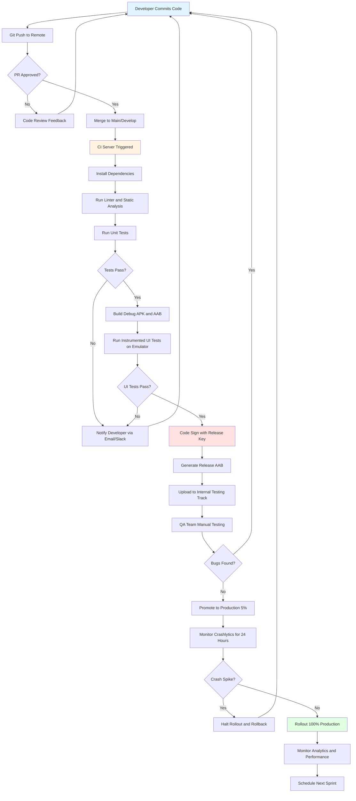
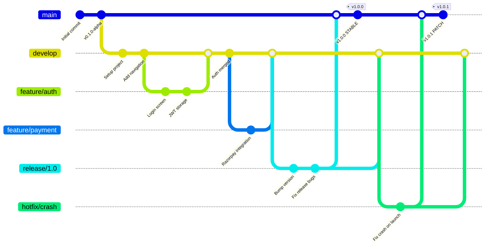
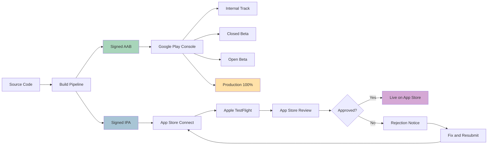
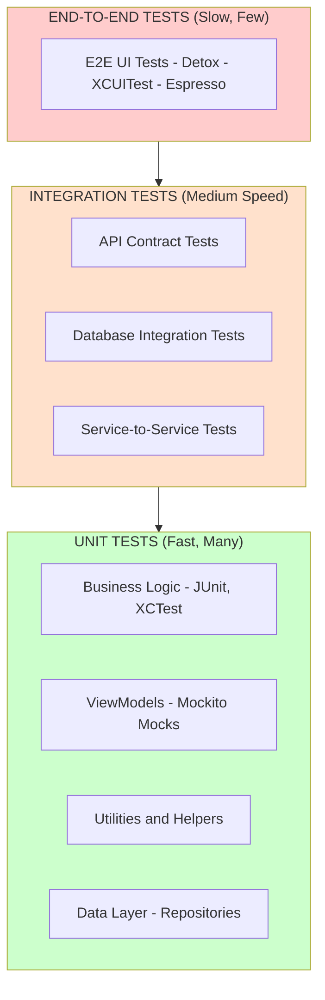
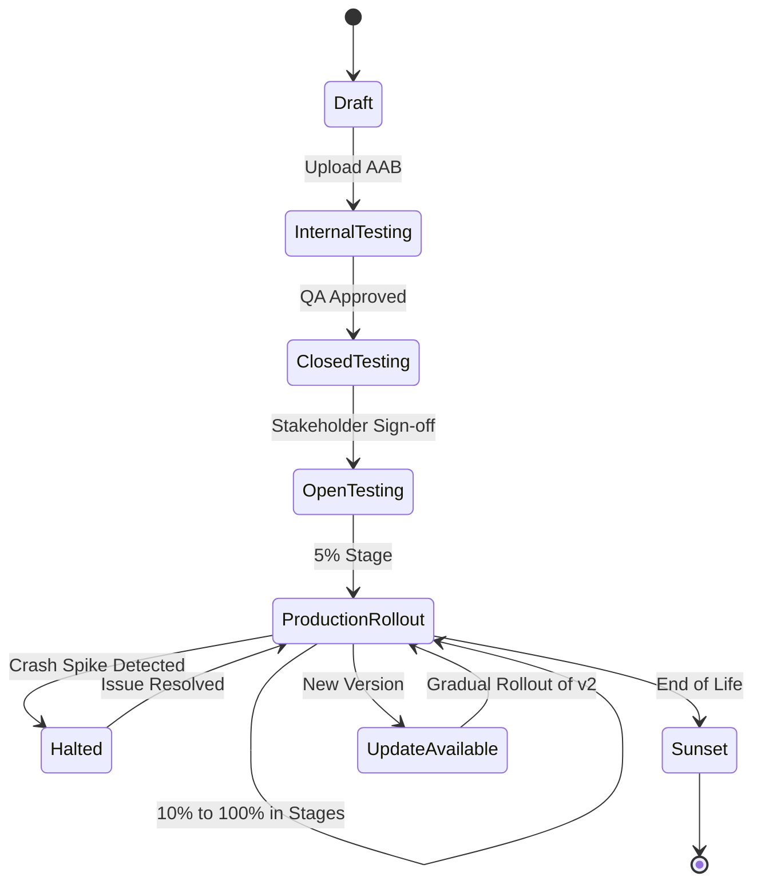

# Industry Practices and App Deployment:

<!-- SECTION_1_START -->

# Industry Practices and App Deployment

## 1. Core Technical Definition & Intuitive Overview

### Formal Definition (KTU 2024 Syllabus Terminology)

**Industry Practices and App Deployment** refers to the standardized engineering workflows, tooling, quality assurance pipelines, and distribution strategies adopted by professional software organizations to take a mobile application from source code to a publicly available, maintainable production product on platforms such as the **Google Play Store** and **Apple App Store**.

It encompasses **Version Control Systems (VCS)**, **Continuous Integration/Continuous Deployment (CI/CD)**, **automated testing**, **release management**, **app signing**, **store listing optimization (ASO)**, **analytics integration**, and **post-launch monitoring**.

> [!IMPORTANT]
> **KTU 2024 OECST725 — Module 4 Focus Areas:**
> 1. Software Development Life Cycle (SDLC) for mobile apps
> 2. Version Control with Git & GitHub/GitLab
> 3. CI/CD pipelines (GitHub Actions, Bitrise, Jenkins)
> 4. Testing frameworks (JUnit, Espresso, XCTest, Detox)
> 5. App signing, ProGuard/R8, and APK/AAB generation
> 6. Play Store & App Store deployment process
> 7. App monetization models (Ads, IAP, Subscription)
> 8. Analytics (Firebase, Crashlytics) and performance monitoring

### Conceptual Analogy / Intuition

> [!NOTE]
> **Real-World Analogy — "Building a Skyscraper vs. Building a Shed"**
> 
> A hobbyist developer writing code on a single laptop is like **building a shed** in their backyard — no permits, no blueprints, no inspection. It might work, but it cannot scale, cannot be insured, and no one will certify it as safe.
> 
> **Industry-grade app deployment** is like **building a skyscraper**:
> - **Blueprints** = Version-controlled source code (Git)
> - **Architects** = Senior developers performing **Code Reviews**
> - **Building inspectors** = **Automated Test Suites** (Unit, UI, Integration)
> - **Construction site safety** = **CI/CD pipelines** (no broken code reaches production)
> - **City permits & occupancy certificate** = **App Store approval & code signing**
> - **Tenants moving in** = **Users downloading the app**
> - **Maintenance crew** = **Crashlytics, Analytics, OTA updates**
> 
> Without these processes, your "skyscraper" collapses the moment the first user logs in.

### Key Terminology Snapshot

| Term | Meaning |
|---|---|
| **VCS** | Version Control System — tracks code history |
| **CI/CD** | Continuous Integration / Continuous Deployment |
| **APK** | Android Package Kit (legacy installer format) |
| **AAB** | Android App Bundle (Play Store's preferred format) |
| **IPA** | iOS App Store Package |
| **ProGuard / R8** | Code shrinking & obfuscation tool |
| **ASO** | App Store Optimization |
| **IAP** | In-App Purchase |
| **OTA** | Over-The-Air updates |
| **SDK** | Software Development Kit |
| **JVM** | Java Virtual Machine |
| **ART** | Android Runtime (replaces Dalvik since Android 5.0) |
| **DEX** | Dalvik Executable (Android bytecode) |

> [!VISUALIZATION CONTROL]
> **Concept:** Mobile App Development & Deployment Pipeline
> **Flow Visualization (mental model):**
> * `Developer commits code` → `Git Repository` → `CI Server triggers build` → `Automated tests run` → `Signed APK/AAB generated` → `Uploaded to Play Store` → `User downloads & installs` → `Analytics + Crash reports flow back`
> **Visual Description:** A left-to-right pipeline where code travels from developer machine, through quality gates (tests, linting, security scans), into a binary artifact, and finally to the end user's device, with telemetry data flowing back as a feedback loop.

---

<!-- SECTION_1_END -->

<!-- SECTION_2_START -->

## 2. Deep Theoretical Analysis & KTU High-Yield Formula Sheet

### 2.1 Mobile App Development Life Cycle (MADLC)

The industry-standard Mobile App Development Life Cycle follows a **modified Agile-Spiral hybrid** with these phases:

1. **Strategy & Planning** — Market research, target audience, KPIs, monetization model
2. **Analysis & Design** — Wireframes, UI/UX mockups, architecture selection (MVVM, MVC, MVI, Clean Architecture)
3. **Development** — Iterative coding in **2-week Sprints** (Scrum methodology)
4. **Testing** — Unit (JUnit), Widget (Flutter), Instrumented (Espresso), Manual QA
5. **Deployment** — Build automation, code signing, store submission
6. **Maintenance & Iteration** — Bug fixes, performance tuning, feature updates
7. **Sunset (End-of-Life)** — Deprecation notice, user migration

### 2.2 Version Control with Git (Industry Standard)

**Git** is a **distributed version control system** created by Linus Torvalds in **2005**. It tracks changes in source code during software development.

#### Core Git Workflow Commands (Cheat Sheet)

| Command | Purpose |
|---|---|
| `git init` | Initialize a new local repository |
| `git clone <url>` | Clone a remote repository |
| `git add <file>` | Stage changes for commit |
| `git commit -m "msg"` | Save staged snapshot to local history |
| `git push origin <branch>` | Upload local commits to remote |
| `git pull` | Fetch + merge remote changes |
| `git branch <name>` | Create a new branch |
| `git checkout -b <name>` | Create and switch to new branch |
| `git merge <branch>` | Merge branch into current |
| `git rebase <branch>` | Reapply commits on top of another base |
| `git stash` | Temporarily save uncommitted changes |
| `git log --oneline` | View commit history |
| `git revert <hash>` | Create a new commit undoing a past commit |
| `git reset --hard <hash>` | **DESTRUCTIVE** — discard local commits |

#### Branching Strategy — **Git Flow**

```
main (production)
  └── develop (integration)
        ├── feature/login
        ├── feature/payment
        └── release/1.2.0
              └── hotfix/crash-on-launch
```

### 2.3 Continuous Integration / Continuous Deployment (CI/CD)

**CI/CD** automates the build-test-deploy pipeline.

- **Continuous Integration (CI):** Every code commit triggers an automated build + test run.
- **Continuous Delivery (CD):** Every passing build is automatically staged for production release (manual approval to go live).
- **Continuous Deployment (CD):** Every passing build is **automatically** released to production.

#### Popular CI/CD Tools for Mobile

| Tool | Platform | Cost |
|---|---|---|
| **GitHub Actions** | Android, iOS, Flutter, RN | Free tier: 2000 mins/month |
| **Bitrise** | Mobile-first (Android, iOS) | Free tier available |
| **CircleCI** | Android, iOS | Free tier: 6000 mins/month |
| **Jenkins** | Self-hosted | Free (open-source) |
| **Fastlane** | iOS, Android (release automation) | Open-source |
| **Codemagic** | Flutter, iOS, Android | Free tier available |

### 2.4 Testing Pyramid for Mobile Apps

```
        /\
       /  \         E2E / UI Tests (Espresso, XCUITest, Detox)
      /----\        ←  Few, slow, expensive
     /      \   
    /--------\      Integration Tests (API, DB)
   /----------\     ←  Medium count
  /------------\    Unit Tests (JUnit, Mockito, XCTest)
 /--------------\   ←  Many, fast, cheap
```

### 2.5 App Signing & Release Build

- **Debug Build:** Signed with an auto-generated debug keystore. Not for distribution.
- **Release Build:** Signed with a **release keystore** (Android) or **Provisioning Profile + Distribution Certificate** (iOS).
- **Android:** Generates `.aab` (App Bundle) or `.apk`. **Google Play App Signing** stores the upload key on Google's servers.
- **iOS:** Requires **Apple Developer Program** membership (**$99/year**), provisioning profiles, and **p12 certificates**.

### 2.6 App Monetization Models

| Model | Description | Examples |
|---|---|---|
| **Free (Ad-supported)** | App is free, revenue from ads | Facebook, Instagram |
| **Freemium** | Free base + paid premium tier | Spotify, Dropbox |
| **Paid (Premium)** | One-time purchase | Minecraft, Procreate |
| **Subscription** | Recurring fee (monthly/yearly) | Netflix, Prime Video |
| **In-App Purchase (IAP)** | Buy virtual goods/features | Candy Crush, Fortnite |
| **In-App Advertising** | Banner, interstitial, rewarded, native ads | Most casual games |
| **Sponsorship / Partnership** | Brand-sponsored content | News apps |
| **Data Monetization** | Anonymized analytics sale | Weather apps |

### 2.7 Analytics & Crash Reporting (Firebase)

- **Firebase Analytics** — User behavior, event tracking, conversion funnels
- **Firebase Crashlytics** — Real-time crash reporting with stack traces
- **Firebase Performance Monitoring** — App start time, network latency, screen rendering
- **Google Analytics for Firebase** — Deep linking, audience segmentation

### 2.8 KTU High-Yield Formula Sheet

| Concept | Formula / Rule | Use |
|---|---|---|
| **Semantic Versioning** | `MAJOR.MINOR.PATCH` (e.g., `2.4.1`) | API/release versioning |
| **Code Coverage** | $Coverage = \frac{Executed\ Lines}{Total\ Lines} \times 100$ | Test quality metric |
| **Crash-Free Users %** | $CFU = \left(1 - \frac{Crashes}{Total\ Sessions}\right) \times 100$ | App health KPI |
| **APK Size Impact on Install** | Apps $>$ **150 MB** see ~30% drop in installs | Size optimization |
| **R8 Dead Code Reduction** | Typical shrink: 40–70% of original bytecode | Minification impact |
| **Play Store 80/20 Rule** | First **80%** of installs come from first **3 screenshots** | ASO |
| **Cold Start Time (target)** | $\le$ **1.5 seconds** for Android, $\le$ **400 ms** for iOS | Performance budget |
| **Frame Rate (target)** | **60 FPS** (16.67 ms/frame) or **90/120 FPS** for high-refresh | UI smoothness |
| **Memory Budget (typical)** | $\le$ **200 MB** for mid-range devices | Stability |
| **Lighthouse Mobile Score** | Target $\ge$ **90/100** | WebView/PWA quality |
| **Anr Rate (Application Not Responding)** | $\le$ **0.47%** user-perceived | Crash-adjacent metric |

### 2.9 Real-World Engineering Utility

- **Git** is used by **>97% of developers** (Stack Overflow 2024 survey) — it is the de-facto VCS in every Fortune 500 tech company.
- **CI/CD** reduces deployment failures by **~60%** and recovery time by **~96%** (DORA Report).
- **App Bundle (AAB)** reduces download size by an average of **35%** vs universal APK (Google).
- **Crashlytics** is used by **>2 million apps** worldwide (Firebase official stats).
- **Play Store** hosts **>3.5 million apps**; **App Store** hosts **~1.8 million** (2024 estimates).

---

<!-- SECTION_2_END -->

<!-- SECTION_3_START -->

## 3. Step-by-Step Derivations, Configurations & Code Implementation

### 3.1 Setting Up a Production-Grade Git Repository

#### Step 1 — Initialize Repository with Industry-Standard `.gitignore`

For an **Android (Kotlin/Gradle)** project:

```gitignore
# Built application files
*.apk
*.aab
*.ap_
*.dex

# Java/Kotlin compiled output
*.class
*.jar
*.kotlin_module

# Gradle
.gradle/
build/
local.properties
*.iml
.idea/

# Keystore — NEVER commit
*.jks
*.keystore
keystore.properties

# OS files
.DS_Store
Thumbs.db
```

For a **Flutter project** (additional entries):

```gitignore
.dart_tool/
.flutter-plugins
.flutter-plugins-dependencies
.packages
.pub-cache/
.pub/
/build/
*.lock-info
.fvm/
```

For an **iOS (Swift/Xcode)** project:

```gitignore
# Xcode
build/
DerivedData/
*.xcuserstate
*.xcworkspace/xcuserdata/
*.pbxuser
!default.pbxuser
*.mode1v3
!default.mode1v3
*.mode2v3
!default.mode2v3
*.perspectivev3
!default.perspectivev3
xcuserdata/

# CocoaPods
Pods/
*.podspec.json

# Provisioning
*.mobileprovision
*.p12
```

#### Step 2 — Initialize and Connect to Remote

```bash
# Step 2.1 — Initialize a local Git repository
cd ~/projects/my-flutter-app
git init

# Step 2.2 — Add all files to staging area
git add .

# Step 2.3 — Make the first commit
git commit -m "feat: initial project scaffold with clean architecture"

# Step 2.4 — Add remote origin (replace with your repo URL)
git remote add origin https://github.com/your-username/my-flutter-app.git

# Step 2.5 — Rename default branch to 'main' (industry standard)
git branch -M main

# Step 2.6 — Push to remote and set upstream tracking
git push -u origin main
```

**What each line does (valuation points):**
- `git init` → Creates a hidden `.git/` folder tracking snapshots **[1 mark]**
- `git add .` → Stages all working-tree changes for the next commit **[1 mark]**
- `git commit -m "..."` → Permanently records a snapshot in local history with a message **[1 mark]**
- `git remote add origin <url>` → Registers the remote server URL under alias `origin` **[1 mark]**
- `git branch -M main` → Renames current branch to `main` (forces rename even if exists) **[1 mark]**
- `git push -u origin main` → Uploads local `main` branch and sets upstream tracking **[1 mark]**

#### Step 3 — Industry-Standard Branching Workflow (Feature Branch)

```bash
# Step 3.1 — Always start from updated develop branch
git checkout develop
git pull origin develop

# Step 3.2 — Create a new feature branch (naming: feature/<ticket-id>-<short-desc>)
git checkout -b feature/MAD-42-user-authentication

# Step 3.3 — Make code changes... (edit files)

# Step 3.4 — Stage and commit changes
git add lib/screens/login_screen.dart
git commit -m "feat(auth): add email/password login screen with validation"

# Step 3.5 — Push feature branch to remote
git push -u origin feature/MAD-42-user-authentication

# Step 3.6 — Open Pull Request (PR) on GitHub/GitLab for code review
# Step 3.7 — After PR approval, merge into develop
git checkout develop
git merge --no-ff feature/MAD-42-user-authentication
git push origin develop

# Step 3.8 — Delete the feature branch (cleanup)
git branch -d feature/MAD-42-user-authentication
git push origin --delete feature/MAD-42-user-authentication
```

> [!NOTE]
> **Commit Message Convention — Conventional Commits (Industry Standard):**
> - `feat:` — New feature
> - `fix:` — Bug fix
> - `docs:` — Documentation only
> - `style:` — Formatting, missing semicolons
> - `refactor:` — Code change that neither fixes a bug nor adds a feature
> - `test:` — Adding tests
> - `chore:` — Build process or auxiliary tool changes

---

### 3.2 Building a CI/CD Pipeline with **GitHub Actions** (Android)

#### Step 1 — Create the Workflow File

Path: `.github/workflows/android-build.yml`

```yaml
name: Android CI Build & Test

on:
  push:
    branches: [ main, develop ]
  pull_request:
    branches: [ main, develop ]

jobs:
  build:
    name: Build & Test APK
    runs-on: ubuntu-latest
    timeout-minutes: 30

    steps:
      # Step 1 — Checkout source code
      - name: Checkout Repository
        uses: actions/checkout@v4

      # Step 2 — Install Java 17 (required for modern Android Gradle Plugin)
      - name: Set up JDK 17
        uses: actions/setup-java@v4
        with:
          java-version: '17'
          distribution: 'temurin'
          cache: gradle

      # Step 3 — Grant execute permission to Gradle wrapper
      - name: Grant Execute Permission for Gradlew
        run: chmod +x gradlew

      # Step 4 — Run unit tests
      - name: Run Unit Tests
        run: ./gradlew test

      # Step 5 — Build debug APK (verification build)
      - name: Build Debug APK
        run: ./gradlew assembleDebug

      # Step 6 — Build release AAB (signed with debug key for CI verification)
      - name: Build Release AAB
        run: ./gradlew bundleRelease

      # Step 7 — Upload APK as a build artifact (downloadable from Actions tab)
      - name: Upload APK Artifact
        uses: actions/upload-artifact@v4
        with:
          name: app-release
          path: app/build/outputs/bundle/release/app-release.aab
          retention-days: 14
```

#### Step 2 — Configuring **Code Signing** for Release Builds

Create `android/key.properties` (and add it to `.gitignore`):

```properties
storeFile=../keystores/release.keystore
storePassword=YOUR_STORE_PASSWORD
keyAlias=YOUR_KEY_ALIAS
keyPassword=YOUR_KEY_PASSWORD
```

Modify `android/app/build.gradle`:

```groovy
def keystoreProperties = new Properties()
def keystorePropertiesFile = rootProject.file('key.properties')
if (keystorePropertiesFile.exists()) {
    keystoreProperties.load(new FileInputStream(keystorePropertiesFile))
}

android {
    namespace 'com.example.myapp'
    compileSdk 34

    defaultConfig {
        applicationId "com.example.myapp"
        minSdk 21
        targetSdk 34
        versionCode 1
        versionName "1.0.0"
    }

    signingConfigs {
        release {
            keyAlias keystoreProperties['keyAlias']
            keyPassword keystoreProperties['keyPassword']
            storeFile keystoreProperties['storeFile'] ? file(keystoreProperties['storeFile']) : null
            storePassword keystoreProperties['storePassword']
        }
    }

    buildTypes {
        release {
            signingConfig signingConfigs.release
            minifyEnabled true        // Enable R8/ProGuard code shrinking
            shrinkResources true      // Remove unused resources
            proguardFiles getDefaultProguardFile('proguard-android-optimize.txt'), 'proguard-rules.pro'
        }
    }
}
```

> [!WARNING]
> **Security Pitfall:** NEVER commit `keystore.properties` or the `.keystore` file to Git. Store them in **GitHub Secrets** or a dedicated secret manager. Leaked signing keys = impersonation risk.

#### Step 3 — Generating the Release Keystore

```bash
keytool -genkey -v \
  -keystore ~/keystores/my-release-key.jks \
  -keyalg RSA \
  -keysize 2048 \
  -validity 10000 \
  -alias my-app-key
```

**Parameters explained:**
- `-keyalg RSA` — RSA encryption algorithm **[1 mark]**
- `-keysize 2048` — 2048-bit key (industry minimum secure) **[1 mark]**
- `-validity 10000` — Valid for ~27 years (Google recommends **25+ years**) **[1 mark]**
- `-alias` — Identifier used in Gradle to reference this key **[1 mark]**

---

### 3.3 Automated Testing — Unit Test Example (Kotlin / JUnit5)

```kotlin
// File: app/src/test/java/com/example/myapp/CalculatorTest.kt

import org.junit.jupiter.api.Test
import org.junit.jupiter.api.Assertions.assertEquals
import org.junit.jupiter.api.Assertions.assertThrows
import org.junit.jupiter.api.BeforeEach

class Calculator {
    fun add(a: Int, b: Int): Int = a + b
    fun divide(a: Int, b: Int): Int {
        if (b == 0) throw IllegalArgumentException("Divisor cannot be zero")
        return a / b
    }
}

class CalculatorTest {
    private lateinit var calculator: Calculator

    @BeforeEach
    fun setUp() {
        calculator = Calculator()
    }

    @Test
    fun `add returns correct sum for positive numbers`() {
        // Arrange
        val a = 5
        val b = 3
        // Act
        val result = calculator.add(a, b)
        // Assert
        assertEquals(8, result, "5 + 3 should equal 8")
    }

    @Test
    fun `divide throws when divisor is zero`() {
        assertThrows(IllegalArgumentException::class.java) {
            calculator.divide(10, 0)
        }
    }
}
```

**AAA Pattern (Arrange-Act-Assert):** The bedrock of every unit test — each test sets up data, executes the unit, and verifies output.

---

### 3.4 Instrumented UI Test (Espresso for Android)

```kotlin
// File: app/src/androidTest/java/com/example/myapp/LoginActivityTest.kt

import androidx.test.espresso.Espresso.onView
import androidx.test.espresso.action.ViewActions.*
import androidx.test.espresso.assertion.ViewAssertions.matches
import androidx.test.espresso.matcher.ViewMatchers.*
import androidx.test.ext.junit.runners.AndroidJUnit4
import androidx.test.platform.app.InstrumentationRegistry
import androidx.test.rule.ActivityTestRule
import org.junit.Rule
import org.junit.Test
import org.junit.runner.RunWith

@RunWith(AndroidJUnit4::class)
class LoginActivityTest {

    @get:Rule
    val activityRule = ActivityTestRule(LoginActivity::class.java)

    @Test
    fun loginButton_isDisplayed_andClickable() {
        // Verify the login button is visible
        onView(withId(R.id.btnLogin))
            .check(matches(isDisplayed()))
            .check(matches(isClickable()))
    }

    @Test
    fun typingCredentials_andTappingLogin_navigatesToHome() {
        // Type email
        onView(withId(R.id.etEmail)).perform(typeText("user@ktu.ac.in"))
        // Type password
        onView(withId(R.id.etPassword)).perform(typeText("secret123"))
        // Close keyboard
        onView(withId(R.id.etPassword)).perform(closeSoftKeyboard())
        // Tap login
        onView(withId(R.id.btnLogin)).perform(click())
        // Verify Home screen appears
        onView(withId(R.id.tvWelcome)).check(matches(isDisplayed()))
    }
}
```

---

### 3.5 Play Store Deployment — Step-by-Step

#### Step 1 — Create a Google Play Console Account

- Pay **$25 one-time** registration fee
- Verify identity with a government ID (for personal accounts) or business documents (for organization accounts)

#### Step 2 — Create the App in Play Console

1. Go to [play.google.com/console](https://play.google.com/console)
2. Click **"Create app"**
3. Fill in:
   - **App name** (max 50 chars)
   - **Default language** (English)
   - **App or Game** → Select **App**
   - **Free or Paid** → Select
4. Accept the **Developer Program Policies** and **US export laws**

#### Step 3 — Complete the Store Listing

| Asset | Requirement |
|---|---|
| **App icon** | 512×512 PNG, 32-bit, no transparency |
| **Feature graphic** | 1024×500 PNG or JPEG |
| **Screenshots** | Min 2, Max 8 per device type (phone/tablet) |
| **Phone screenshot** | Min 320px, Max 3840px (any aspect ratio) |
| **Short description** | Max 80 characters |
| **Full description** | Max 4000 characters |
| **Privacy policy URL** | **MANDATORY** for any data collection |

#### Step 4 — Upload the AAB

```bash
# Using Fastlane (recommended for automation)
bundle exec fastlane supply \
  --aab build/app/outputs/bundle/release/app-release.aab \
  --track internal \
  --json_key play-store-credentials.json
```

#### Step 5 — Release Tracks (Gradual Rollout Strategy)

| Track | Audience | Use Case |
|---|---|---|
| **Internal testing** | Up to 100 testers | QA team, quick iteration |
| **Closed testing** | Up to 10,000 testers | Beta users, feedback |
| **Open testing** | Public opt-in | Pre-release public beta |
| **Production** | 100% of users | Stable release |

> [!TIP]
> **Always roll out in stages:** Start at **5% → 10% → 25% → 50% → 100%** over several days. Monitor Crashlytics for spike in crashes before increasing percentage.

#### Step 6 — Version Code Management

Every upload **MUST** have a higher `versionCode` than the previous:

```groovy
defaultConfig {
    versionCode 42       // Integer, monotonically increasing
    versionName "1.2.3"  // User-visible string
}
```

---

### 3.6 App Store (iOS) Deployment — Step-by-Step

#### Step 1 — Enroll in Apple Developer Program

- Annual fee: **$99 USD**
- Sign in at [developer.apple.com](https://developer.apple.com)

#### Step 2 — Create App Record in App Store Connect

1. Go to [appstoreconnect.apple.com](https://appstoreconnect.apple.com)
2. Click **"My Apps" → "+" → "New App"**
3. Select platform (**iOS**), name, primary language, bundle ID, SKU

#### Step 3 — Archive & Upload via Xcode

```
Xcode → Product → Archive → Distribute App → App Store Connect → Upload
```

Or via **Fastlane** (CI/CD friendly):

```bash
bundle exec fastlane match appstore       # Sync signing certificates
bundle exec fastlane gym                  # Build .ipa
bundle exec fastlane deliver              # Upload to App Store Connect
```

#### Step 4 — Submit for Review

| Required Info | Description |
|---|---|
| **Screenshots** | Per device size (6.7", 6.1", 5.5", 12.9" iPad) |
| **App preview video** | Optional, 15–30 seconds |
| **Promotional text** | Max 170 characters (editable anytime) |
| **Description** | Max 4000 characters |
| **Keywords** | Max 100 characters (comma-separated) |
| **Support URL** | **MANDATORY** |
| **Privacy policy URL** | **MANDATORY** |
| **App Privacy details** | Nutrition labels for data collection |

> [!IMPORTANT]
> **Apple Review Guidelines — Common Rejection Reasons:**
> - **2.1 — App Completeness:** Crashes, broken links, placeholder content
> - **4.0 — Design:** Minimum functionality, copying native iOS UI
> - **5.1.1 — Privacy:** Missing or misleading privacy nutrition labels
> - **3.1.1 — In-App Purchase:** Accepting payments outside IAP (only for digital goods)
> - **2.3.1 — Performance:** Apps must launch in **< 5 seconds** on first run

---

### 3.7 Post-Launch Monitoring — Firebase Crashlytics Integration

#### Android (Kotlin) Integration

```kotlin
// In app/build.gradle — add dependency
dependencies {
    implementation(platform("com.google.firebase:firebase-bom:32.7.0"))
    implementation("com.google.firebase:firebase-crashlytics-ktx")
    implementation("com.google.firebase:firebase-analytics-ktx")
}

// In AndroidManifest.xml
<application
    android:name=".MyApplication"
    ...>
```

```kotlin
// File: MyApplication.kt
import android.app.Application
import com.google.firebase.crashlytics.FirebaseCrashlytics
import com.google.firebase.crashlytics.ktx.crashlytics

class MyApplication : Application() {
    override fun onCreate() {
        super.onCreate()
        // Enable opt-in crash reporting (user can disable in settings)
        FirebaseCrashlytics.getInstance().setCrashlyticsCollectionEnabled(true)
    }
}
```

```kotlin
// Recording a non-fatal exception
try {
    val data = api.fetchUserProfile(userId)
} catch (e: Exception) {
    Firebase.crashlytics.recordException(e)
    // Log breadcrumb for context
    Firebase.crashlytics.log("API call failed for userId=$userId")
}
```

---

### 3.8 Performance Optimization Checklist

| Category | Metric | Target | Tool |
|---|---|---|---|
| **App Startup** | Cold start | $\le$ **1.5 s** | Android Vitals, Firebase Performance |
| **Frame Rate** | Jank / dropped frames | **0 dropped frames** | GPU Profiler, `adb shell dumpsys gfxinfo` |
| **Memory** | Heap usage | $\le$ **200 MB** | Android Profiler, LeakCanary |
| **Network** | API latency (p95) | $\le$ **500 ms** | OkHttp Logging, Charles Proxy |
| **APK Size** | Download size | $\le$ **30 MB** ideal | APK Analyzer, R8 |
| **Battery** | Drain per hour | $\le$ **2%** | Battery Historian |
| **ANR Rate** | Application Not Responding | $\le$ **0.47%** | Play Console → Android Vitals |

---

<!-- SECTION_3_END -->

<!-- SECTION_4_START -->

## 4. Structural Diagrams & Schematics

### 4.1 Complete Mobile App CI/CD Pipeline (Mermaid Flowchart)



### 4.2 Git Branching Strategy (Git Flow) — Mermaid



### 4.3 App Store Submission Architecture



### 4.4 Testing Pyramid Hierarchy



### 4.5 Deployment Process State Machine



---

<!-- SECTION_4_END -->

<!-- SECTION_5_START -->

## 5. KTU 2024 Scheme Examination Question Bank & Topic Recap

### Part A — Short Answer Questions (3 Marks Each)

---

**Q1. `[KTU University Exam — July 2023]`** *(CO4, Remember)*

**What is Continuous Integration (CI)? List any two popular CI tools used for mobile app development.**

**Model Answer:**

**Continuous Integration (CI)** is a software engineering practice where developers frequently merge their code changes into a shared central repository (typically multiple times a day). Each merge triggers an **automated build and test sequence** to detect integration errors as early as possible. The goal is to eliminate the "integration hell" that occurs when developers work in isolation for long periods.

**Two popular CI tools for mobile app development:**
1. **GitHub Actions** — Native CI/CD integrated into GitHub, supports Android, iOS, Flutter, React Native. Free tier: 2,000 build minutes/month for private repos.
2. **Bitrise** — Mobile-first CI/CD platform with pre-built Steps for code signing, testing, and store deployment. Excellent Flutter and React Native support.

*(Alternative answers accepted: CircleCI, Jenkins, Codemagic, Travis CI, Fastlane)*

**Valuation Key:**
- Defining CI with merge frequency + automated build/test trigger: **2 marks**
- Listing two correct CI tools: **1 mark**

---

**Q2. `[KTU University Exam — Dec 2022]`** *(CO4, Understand)*

**Explain the difference between APK and AAB in Android. Why has Google made AAB the preferred format for Play Store distribution?**

**Model Answer:**

| Aspect | APK (Android Package Kit) | AAB (Android App Bundle) |
|---|---|---|
| **Full Form** | Android Package Kit | Android App Bundle |
| **Format** | Self-contained installer | Upload format (not directly installable) |
| **Contains** | All resources for all devices | Optimized, modular code + resources |
| **Download size** | Larger (universal) | Smaller (~35% avg reduction) |
| **Generation** | `assembleRelease` task | `bundleRelease` task |
| **Distribution** | Sideloading, third-party stores | **Google Play Store** (mandatory since Aug 2021) |
| **Dynamic Delivery** | Not supported | App Bundle splits by device config, language, density |

**Why AAB is preferred:**
1. **Smaller download size** — Google Play generates **optimized APKs** per device configuration (screen density, CPU architecture, language), reducing the user's download by an average of **35%**.
2. **Dynamic Feature Delivery** — Unused features can be downloaded on-demand, reducing initial install size.
3. **Play Asset Delivery** — Large game assets can be delivered separately, keeping the base APK small.
4. **Play Console statistics** — Developers can track size impact on install conversion rates.

**Valuation Key:**
- Clear distinction table or 2-point comparison: **2 marks**
- Justification with size reduction + dynamic delivery: **1 mark**

---

### Part B — Long Answer Questions (14 Marks Each, Internal Choice)

---

#### **Question A — `[KTU University Exam — July 2024]`** *(CO4, Apply + Analyze)*

**(a)** Describe the complete process of deploying an Android application to the Google Play Store. Mention all prerequisites, build configurations, and store listing requirements. **(7 marks)**

**(b)** What is code signing? With a neat diagram, explain the Android code signing process and the role of **Google Play App Signing**. **(7 marks)**

---

### Model Solution for Question A

#### Part (a) — Android Play Store Deployment Process

**Step 1: Prerequisites**
- Active **Google Play Console** account with the **$25 one-time** registration fee paid. **[0.5 marks]**
- A signed **Release AAB** (Android App Bundle). **[0.5 marks]**
- A **unique application ID** (e.g., `com.ktu.studentapp`). **[0.5 marks]**

**Step 2: Build Configuration**
- In `app/build.gradle` (Groovy DSL):
```groovy
android {
    defaultConfig {
        applicationId "com.ktu.studentapp"
        minSdk 21
        targetSdk 34
        versionCode 1
        versionName "1.0.0"
    }
    buildTypes {
        release {
            minifyEnabled true
            shrinkResources true
            signingConfig signingConfigs.release
        }
    }
}
```
- Run `./gradlew bundleRelease` to generate `app-release.aab` in `app/build/outputs/bundle/release/`. **[1 mark]**

**Step 3: Play Console App Creation**
1. Sign in to **play.google.com/console**.
2. Click **All apps → Create app**.
3. Fill in: App name (max 50 chars), default language, app/game type, free/paid.
4. Accept **Developer Program Policies** and **US export laws**. **[1 mark]**

**Step 4: Complete Store Listing**
| Asset | Specification |
|---|---|
| App icon | **512×512** PNG, no transparency |
| Feature graphic | **1024×500** PNG/JPEG |
| Screenshots | Min **2**, max **8** per device type |
| Short description | Max **80** characters |
| Full description | Max **4000** characters |
| Privacy policy URL | **MANDATORY** | **[1.5 marks]**

**Step 5: Content Rating & Target Audience**
- Fill the **IARC questionnaire** to receive an age rating.
- Declare target age group and whether the app is designed for children. **[0.5 marks]**

**Step 6: Upload AAB & Set Pricing**
- Go to **Release → Production → Create new release**.
- Upload the signed AAB file.
- Add **release notes** describing changes.
- Set pricing and distribution countries. **[1 mark]**

**Step 7: Review and Rollout**
- Click **"Review release"**.
- Google performs **automated checks** (typically < 1 hour, sometimes up to 7 days for new developers).
- Once approved, click **"Start rollout to Production"** (recommend starting at **5–10%** for safety). **[1 mark]**

**Valuation Key (Part a):**
- Build configuration with code snippet: **2 marks**
- Play Console steps: **2 marks**
- Store listing assets & specs: **2 marks**
- Rollout strategy: **1 mark**

---

#### Part (b) — Code Signing & Google Play App Signing

**Definition:** **Code signing** is the process of digitally signing an application's executable (APK/AAB) with a cryptographic **private key** to verify the author's identity and ensure the code has not been tampered with since it was signed. **[1 mark]**

**Android Code Signing Process (Keystore-based):**

```
┌──────────────────────────────────────────────────┐
│           ANDROID CODE SIGNING FLOW              │
├──────────────────────────────────────────────────┤
│                                                  │
│  Developer Machine                               │
│  ┌──────────────────────┐                        │
│  │  Release Keystore    │ (.jks file)            │
│  │  - Private Key       │ ← KEEP SECRET          │
│  │  - Public Cert       │ ← Embedded in APK      │
│  └──────────┬───────────┘                        │
│             │                                    │
│             ▼                                    │
│  ┌──────────────────────┐                        │
│  │  app-release.aab     │  ← gradle signs here  │
│  └──────────┬───────────┘                        │
│             │                                    │
└─────────────┼────────────────────────────────────┘
              │
              ▼
┌──────────────────────────────────────────────────┐
│            GOOGLE PLAY CONSOLE                   │
│  ┌──────────────────────┐                        │
│  │  AAB Uploaded        │                        │
│  └──────────┬───────────┘                        │
│             │                                    │
│             ▼                                    │
│  ┌──────────────────────┐                        │
│  │ Google Play App      │ ← Re-signs with        │
│  │ Signing Service      │   Google's master key  │
│  └──────────┬───────────┘                        │
│             │                                    │
│             ▼                                    │
│  ┌──────────────────────┐                        │
│  │  Optimized APKs      │  ← Delivered to users │
│  │  per device config   │                        │
│  └──────────────────────┘                        │
│                                                  │
└──────────────────────────────────────────────────┘
```

**Role of Google Play App Signing:** **[3 marks]**

1. **Two-Key Architecture** — Separates the **upload key** (held by developer) from the **app signing key** (held securely on Google's infrastructure). The developer signs the AAB with the upload key, Google re-signs with the master key.
2. **Key Recovery** — If the developer's upload key is lost, Google can re-issue access since the master key is in their custody (contact support, verify identity).
3. **Smaller Downloads** — Google generates **per-device optimized APKs** from the AAB, reducing install size by **~35%** on average.
4. **Integrity Guarantee** — The app signing key is stored in a **Hardware Security Module (HSM)** with FIPS 140-2 Level 3+ certification, making it virtually impossible to extract.
5. **Signing Scheme v2/v3/v4** — Supports modern APK Signature Scheme, which provides **faster install times** and **stronger security** (tamper-proof).

**Enabling Play App Signing in Console:**
1. Go to **Setup → App signing**.
2. Choose **"Use Google-generated key"** (recommended for new apps) OR **"Use existing key"** (upload your own .pepk file).
3. Download the **upload certificate** and reference it in your `build.gradle`. **[1 mark]**

**Valuation Key (Part b):**
- Code signing definition: **1 mark**
- Flow diagram with developer key and Google master key: **2 marks**
- Five benefits of Play App Signing (2+ required): **3 marks**
- Enabling steps: **1 mark**

---

#### **Question B — `[KTU University Exam — Dec 2023]`** *(CO4, Apply + Analyze — Alternative choice)*

**(a)** Explain the **Git Flow** branching model with a neat diagram. List the main branches and their purpose. **(7 marks)**

**(b)** What is **ProGuard/R8**? Explain its three main functions in Android release builds. How does it help reduce APK size? **(7 marks)**

---

### Model Solution for Question B

#### Part (a) — Git Flow Branching Model

**Git Flow** is a branching model designed by **Vincent Driessen** in 2010 that defines a strict branching structure designed around project releases. It assigns very specific roles to different branches and defines how and when they should interact. **[1 mark]**

**Main Branches and Their Purpose: [4 marks]**

| Branch | Lifetime | Purpose | Naming |
|---|---|---|---|
| `main` (or `master`) | Permanent | Contains production-ready, stable code. Each commit is a release. | `main` |
| `develop` | Permanent | Integration branch where all features are merged. Latest delivered development changes. | `develop` |

**Supporting Branches:**

1. **Feature branches** — Branched from `develop`, merged back into `develop`. Used for developing new features. Naming: `feature/*` (e.g., `feature/login-screen`). **[0.5 marks]**

2. **Release branches** — Branched from `develop`, merged into both `main` AND `develop`. Used to prepare a production release (bug fixes, version bumps, metadata). Naming: `release/*` (e.g., `release/1.2.0`). **[0.5 marks]**

3. **Hotfix branches** — Branched from `main`, merged back into both `main` AND `develop`. Used to quickly patch production bugs. Naming: `hotfix/*` (e.g., `hotfix/crash-on-startup`). **[0.5 marks]**

**Git Flow Diagram:**

```
main:     ●───────●─────────────●─────────● (tags: v1.0, v1.1, v2.0)
           \      ↑\            ↑↑        /
            \    /  \          / \\      /
develop:     ●──●────●────────●   \\   ●
              \      ↑\      ↑     \\  ↑
               \    /  \    /       \\ /
feature/A:      ●──●     \  /         ●
                            \        /
release/1.0:                  ●─────●
                              ↑      ↑
                              |      |
                       bugfixes   v1.0 release
                       
hotfix/1.0.1:                          ●────●
                                         ↑    ↑
                                         |    |
                                    merged to main
                                    and develop
```

**Key Rules:** **[0.5 marks]**
- `main` is always deployable.
- `develop` is the latest delivered development changes for the next release.
- Feature branches only interact with `develop`.
- Hotfix branches only interact with `main`.

**Valuation Key (Part a):**
- Git Flow definition: **1 mark**
- Main branches (`main`, `develop`): **1 mark**
- Three supporting branches with purpose: **3 marks**
- Diagram with all branches shown: **2 marks**
- Key rules mentioned: **1 mark**

---

#### Part (b) — ProGuard / R8 in Android

**ProGuard** is a Java class file shrinker, optimizer, obfuscator, and pre-verifier introduced in **Android SDK** to make code smaller and harder to reverse-engineer. **R8** is Google's modern replacement for ProGuard, fully integrated with **Android Gradle Plugin 3.4+** and is the **default code shrinker** since AGP 7.0+. **[1 mark]**

**R8 is enabled by default when `minifyEnabled true` is set in `build.gradle`.** **[0.5 marks]**

**Three Main Functions of R8/ProGuard: [4.5 marks]**

1. **Shrinking (Tree Shaking) — Code Size Reduction** 
   R8 performs **static analysis** of all class files and removes code that is **never referenced** anywhere in the project (including unused methods, classes, fields, and attributes). Example: if a class `OldPaymentGateway` is no longer imported anywhere, it is removed entirely. **Typical reduction: 40–70% of bytecode.**

2. **Optimization — Performance Improvement**
   R8 performs inlining, class merging, vertical merging, and method inlining. For example, getter/setter methods may be inlined directly into call sites, removing method dispatch overhead. This makes the app **run faster** even with a smaller footprint.

3. **Obfuscation — Reverse Engineering Protection**
   R8 renames classes, methods, and fields to short meaningless names (e.g., `a`, `b`, `c`). 
   - Original: `public class UserAuthenticationManager { public void verifyCredentials() { ... } }`
   - Obfuscated: `public class a { public void b() { ... } }`
   
   This makes **decompilation (e.g., via JADX)** produce nearly unreadable code, protecting business logic and API keys from casual reverse engineers. **Note: Obfuscation is NOT encryption** — determined attackers can still recover most logic.

**How R8 Reduces APK Size — Quantified: [1 mark]**

| Reduction Type | Mechanism | Typical Savings |
|---|---|---|
| **Dead code removal** | Tree shaking unused classes | 30–50% |
| **Resource shrinking** | `shrinkResources true` removes unused drawables, strings, layouts | 10–20% |
| **Name shortening** | `UserAuthManager` → `a` | 5–10% string pool savings |
| **String deduplication** | Identical string literals merged | 2–5% |

**ProGuard Rules Configuration** (in `proguard-rules.pro`): 
```proguard
# Keep Flutter wrapper
-keep class io.flutter.embedding.** { *; }

# Keep Firebase classes
-keep class com.google.firebase.** { *; }

# Keep model classes used in JSON parsing
-keep class com.example.myapp.models.** { *; }

# Keep native methods
-keepclasseswithmembernames class * { native <methods>; }
```

**Verifying R8 Output:** 
Run `./gradlew assembleRelease` and inspect the mapping file: `app/build/outputs/mapping/release/mapping.txt`. This file is **critical for deobfuscating crash reports**. Upload it to **Crashlytics** (or **Play Console** auto-uploads it) so stack traces can be deobfuscated. **[Valuation point: 0.5 marks]**

**Valuation Key (Part b):**
- R8/ProGuard definition with R8 as modern default: **1 mark**
- Three functions (shrinking, optimization, obfuscation): **4.5 marks** (1.5 each)
- APK size reduction quantified: **1 mark**
- Mapping file importance mentioned: **0.5 marks**

---

> [!WARNING]
> **KTU Examiner's Valuation Pitfalls — Common Mistakes Where Students Lose Marks:**
> 
> 1. **Confusing APK with AAB** — Many students write "APK is uploaded to Play Store" in 2024, which is **incorrect** since August 2021. AAB is mandatory.
> 2. **Skipping the difference between Debug and Release keystores** — Always mention the **release keystore validity** (25+ years recommended) and the fact that **losing it = app is gone forever** on Play Store.
> 3. **Forgetting Google Play App Signing** — Most students describe upload → user flow, skipping the intermediate **Google re-signing step** with the master key.
> 4. **Writing "Git is a tool" instead of "Git is a distributed version control system"** — Lose 0.5 mark for vague definition.
> 5. **Drawing Git Flow with `main` and `develop` only** — Must include **feature, release, and hotfix branches** with their specific merge targets.
> 6. **Confusing R8 with ProGuard** — R8 is Google's replacement; mention this explicitly to score full marks.
> 7. **Not mentioning mapping.txt** — Crash deobfuscation depends on it; skipping it loses 0.5 mark in ProGuard question.
> 8. **In iOS question: forgetting TestFlight** — The pre-release testing phase is mandatory for App Store submissions.

---

## Topic Recap & Important Things to Remember

### Quick-Fire Revision Checklist

- **SDLC for Mobile Apps** = Strategy → Design → Develop → Test → Deploy → Maintain → Sunset (Agile-Spiral hybrid)
- **Git** = Distributed VCS created by Linus Torvalds in **2005**; used by **>97%** of developers
- **Essential Git Commands:** `init`, `clone`, `add`, `commit`, `push`, `pull`, `branch`, `merge`, `rebase`, `stash`, `revert`, `reset`
- **Git Flow Branches:** `main` (production) + `develop` (integration) + `feature/*` + `release/*` + `hotfix/*`
- **Commit Convention:** `feat:`, `fix:`, `docs:`, `style:`, `refactor:`, `test:`, `chore:`
- **CI/CD Definition:** CI = automated build+test on every commit; CD = automated delivery/deployment
- **Popular CI Tools:** GitHub Actions, Bitrise, CircleCI, Jenkins, Fastlane, Codemagic
- **Testing Pyramid (bottom-up):** Unit (many) → Integration (medium) → E2E/UI (few)
- **Android Test Frameworks:** JUnit (unit), Espresso (UI), Mockito (mocks)
- **iOS Test Frameworks:** XCTest, XCUITest, Quick/Nimble, Detox
- **APK vs AAB:** AAB reduces download by **~35%**; **mandatory** for Play Store since Aug 2021
- **Code Signing:** Private key in `.jks` keystore; **never commit to Git**; validity **25+ years**
- **Google Play App Signing:** Two-key model — **upload key** (developer) + **app signing key** (Google HSM)
- **Play Store Fee:** **$25 one-time** registration
- **App Store Fee:** **$99/year** Apple Developer Program
- **Release Tracks (Android):** Internal → Closed → Open → Production (rollout: 5% → 10% → 25% → 50% → 100%)
- **iOS Pre-Release:** TestFlight (internal: 100, external: 10,000)
- **Apple Review Time:** Typically **24–48 hours**, can be **up to 7 days** for new developers
- **App Icon Spec:** **512×512** PNG, no transparency
- **Privacy Policy URL:** **MANDATORY** on both stores
- **R8/ProGuard Functions:** **Shrinking** (remove unused code) + **Optimization** (inlining) + **Obfuscation** (rename to a/b/c)
- **R8 Reduction:** Typical **40–70%** bytecode size reduction
- **mapping.txt** = Critical file for deobfuscating crash reports; upload to Crashlytics
- **Monetization Models:** Free (ads), Freemium, Paid, Subscription, IAP, Sponsorship, Data
- **Analytics Tools:** Firebase Analytics, Crashlytics, Performance Monitoring, Google Analytics
- **Performance Targets:** Cold start **$\le$ 1.5 s**, Frame rate **60 FPS** (16.67 ms/frame), Memory **$\le$ 200 MB**, Crash-free users **$\ge$ 99.5%**
- **Versioning:** `MAJOR.MINOR.PATCH` (e.g., 1.4.2); `versionCode` must **monotonically increase** (integer)
- **Cold Start Definition:** App launch from terminated state to first interactive frame
- **Warm Start:** App resumed from background
- **Hot Start:** Activity recreated due to config change
- **App Bundle Benefits:** Dynamic Feature Delivery, Play Asset Delivery, per-device optimization
- **AAB Generation Command:** `./gradlew bundleRelease`
- **APK Generation Command:** `./gradlew assembleRelease`
- **TestFlight** = Apple's beta testing platform (mandatory for external testers)
- **Common Rejection Reasons:** Privacy labels (5.1.1), App completeness (2.1), IAP violations (3.1.1), Inaccurate metadata (2.3.1)
- **ASO (App Store Optimization):** First **3 screenshots** drive **80%** of installs
- **OTA Updates** = Over-the-air content/config updates without app store re-approval (e.g., remote config, A/B tests via Firebase)
- **Semantic Versioning Rule:** $\uparrow$ MAJOR on breaking changes, $\uparrow$ MINOR on new features (backward-compatible), $\uparrow$ PATCH on bug fixes

<!-- SECTION_5_END -->
