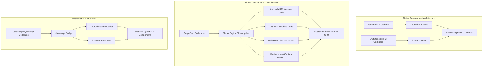
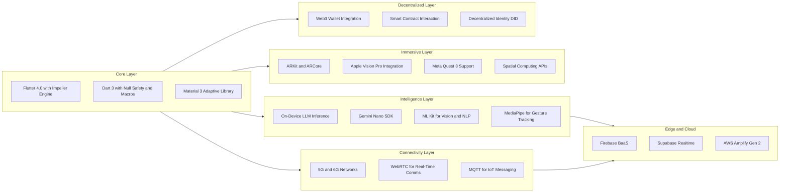
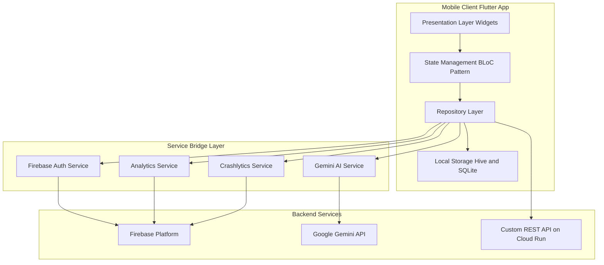

# Industry Trends and Future of Mobile Development with Flutter

<!-- SECTION_1_START -->

# Industry Trends and Future of Mobile Development with Flutter

## 1.1 Formal Academic Definition (KTU 2024 Syllabus)

> [!IMPORTANT]
> **Core Definition:** *Industry Trends and Future of Mobile Development with Flutter* refers to the systematic study, analysis, and projection of evolving paradigms, emerging technologies, architectural patterns, deployment strategies, and ecosystem shifts that govern the production-grade lifecycle of cross-platform mobile applications built using the **Flutter SDK** (Software Development Kit) and the **Dart programming language**.

According to the **KTU 2024 Scheme (OECST725 - Mobile Application Development, Module 4)**, this topic encompasses:

1. **Cross-Platform Development Paradigms** — React Native, Flutter, Kotlin Multiplatform (KMP), and progressive web apps (PWAs).
2. **Emerging Technology Convergence** — Integration of Artificial Intelligence (AI), Machine Learning (ML), 5G networks, Internet of Things (IoT), Augmented Reality (AR), Virtual Reality (VR), and Web3.
3. **Backend-as-a-Service (BaaS) and Serverless Architectures** — Firebase, Supabase, AWS Amplify.
4. **DevOps for Mobile** — CI/CD pipelines, automated testing, and observability.
5. **App Store Optimization (ASO), Distribution, and Monetization Models**.

---

## 1.2 Conceptual Analogy / Intuition

> [!NOTE]
> **Real-World Analogy: The Mobile App as a Modern Smart Vehicle**

Imagine the mobile development industry as the **automotive industry**. Just as cars transitioned from purely mechanical machines to **software-defined vehicles (SDVs)** with over-the-air (OTA) updates, AI-assisted driving, and electric powertrains, mobile apps have evolved from simple static tools to **AI-driven, cloud-connected, cross-platform experiences**.

| Automotive Analogy | Mobile Development Equivalent |
|---|---|
| Chassis Platform (e.g., VW MQB) | **Flutter Framework** (single codebase, multi-platform) |
| Engine Control Unit (ECU) | **Dart Runtime / Skia Rendering Engine** |
| OTA Software Updates | **Code Push / Hot Reload / App Store Updates** |
| Fuel Type (Petrol/Electric/Hybrid) | **Native vs. Hybrid vs. Cross-Platform Architecture** |
| Autonomous Driving (Level 1–5) | **AI/ML Integration Levels in Apps** |

> [!TIP]
> **Why does this analogy matter for KTU exams?** Examiners love questions framed around *evolutionary trends* and *future roadmaps*. A student who can articulate the "vehicle-to-software-defined-mobile-app" mental model can write high-scoring, multidimensional answers.

---

## 1.3 Key Industry Metrics and Constants

> [!IMPORTANT]
> **Critical Industry Statistics (Source: Statista 2024, Google I/O 2024, Stack Overflow Developer Survey 2024)**
>
> - **Global mobile app revenue (2024):** Approximately **\$935 billion USD** (Statista).
> - **Flutter adoption among cross-platform developers:** **46%** of developers used Flutter in 2024 (Stack Overflow Survey).
> - **Number of published Flutter packages on pub.dev:** Over **53,000+** verified packages.
> - **Active Dart/Flutter developers worldwide:** Estimated at **2+ million** (Google Developer Ecosystem Report 2024).
> - **Mobile internet traffic share:** Over **60%** of global web traffic comes from mobile devices.
> - **5G global coverage (2024):** Approximately **40%** of mobile connections, projected to reach **80%** by 2030 (GSMA Intelligence).

---

## 1.4 GeoGebra / Desmos Visualization

> [!VISUALIZATION CONTROL]
> **Concept:** *Growth Trajectory of Flutter vs. Competing Frameworks (2017–2025)*
>
> **Desmos Input Equations (Polynomial trend approximation):**
>
> - `f_1(x) = 0.4 * (x - 2017)^2 + 5` → Represents Flutter adoption curve (quadratic growth).
> - `f_2(x) = -0.15 * (x - 2017)^2 + 0.3 * (x - 2017) + 80` → Represents native-only development decline.
> - `f_3(x) = 0.08 * (x - 2017)^3 - 0.5 * (x - 2017)^2 + 2 * (x - 2017) + 20` → Represents AI-integrated app growth.
>
> **Visual Description:** On the XY-plane with the X-axis representing *Years (2017 → 2025)* and the Y-axis representing *Percentage of Developer Adoption*, the student should observe:
> - A **steeply rising parabola** for Flutter (accelerating adoption).
> - A **declining curve** for pure-native-only development.
> - A **cubic growth curve** for AI-integrated mobile applications.
> - The **intersection points** indicating market disruption timelines.

---

<!-- SECTION_1_END -->

<!-- SECTION_2_START -->

# 2. Deep Theoretical Analysis & KTU High-Yield Formula Sheet

## 2.1 Seven Major Industry Trends Shaping Mobile Development (2024–2030)

### 2.1.1 Trend 1: Cross-Platform Dominance via Flutter and KMP

**Conceptual Breakdown:**

- **Single Codebase, Multi-Platform Deployment:** Flutter compiles to **ARM (Advanced RISC Machines) machine code** for iOS and Android, and to **JavaScript/WebAssembly** for web browsers.
- **Rendering Engine:** Uses the **Skia 2D graphics engine** (now migrating to **Impeller** in Flutter 3.10+) for GPU-accelerated, deterministic rendering at **60 FPS (Frames Per Second)** and **120 FPS** on capable devices.
- **Widget Tree Architecture:** Everything in Flutter is a **Widget** — a lightweight, immutable description of part of the user interface. The widget tree undergoes three phases: *Build → Layout → Paint → Composite*.

**Why It Matters:**
- Reduces development cost by approximately **30–40%** compared to maintaining two separate native codebases.
- Enables faster time-to-market (TTM), typically **2–3x** faster for MVPs (Minimum Viable Products).
- Used in production by **BMW, Alibaba, Google Pay, eBay, Toyota, Nubank, and Hamilton App**.

---

### 2.1.2 Trend 2: AI/ML Integration On-Device (Edge AI)

**Conceptual Breakdown:**

- **TensorFlow Lite (TFLite)** and **Google ML Kit** provide on-device inference for mobile apps.
- **Flutter + Gemini AI / Google AI Dart SDK** enables natural language processing, image generation, and conversational AI within Flutter apps.
- **Neural Processing Units (NPUs)** in modern SoCs (System on Chips) like the **Apple A17 Pro**, **Qualcomm Snapdragon 8 Gen 3**, and **MediaTek Dimensity 9300** accelerate ML inference up to **15 TOPS (Tera Operations Per Second)**.

**Why It Matters:**
- **Latency reduction:** On-device inference eliminates network round-trips (< 10ms vs. 200ms+ for cloud).
- **Privacy preservation:** User data never leaves the device (compliance with **GDPR**, **DPDP Act 2023**).
- **Offline capability:** Apps function without internet connectivity.

---

### 2.1.3 Trend 3: 5G, Edge Computing, and Ultra-Low-Latency Apps

**Conceptual Breakdown:**

- **5G Key Performance Indicators (KPIs):**
  - Peak Data Rate: **20 Gbps** (downlink), **10 Gbps** (uplink).
  - Latency: **< 1 ms** (URLLC — Ultra-Reliable Low-Latency Communication).
  - Device Density: **1,000,000 devices per km²**.
- **Multi-access Edge Computing (MEC):** Brings computation closer to the user, reducing round-trip time.
- **Use cases:** Real-time multiplayer gaming, AR/VR, autonomous vehicles, remote surgery, IoT control.

---

### 2.1.4 Trend 4: Foldables, Large Screens, and Adaptive UI

**Conceptual Breakdown:**

- Devices like **Samsung Galaxy Z Fold 6**, **OnePlus Open**, **Pixel Fold**, and **iPad Pro with M4** demand **adaptive layouts** that respond to:
  - Screen size (compact, medium, expanded).
  - Orientation (portrait, landscape).
  - Posture (folded, half-folded/tabletop, unfolded).
- Flutter's **MediaQuery**, **LayoutBuilder**, and **NavigationRail** widgets enable responsive design.
- Google's **Material 3 adaptive library** provides out-of-the-box adaptive components.

---

### 2.1.5 Trend 5: Super Apps and Mini-Apps Ecosystem

**Conceptual Breakdown:**

- **Super Apps:** Single applications hosting multiple services (e.g., **WeChat**, **Grab**, **Gojek**, **Paytm**).
- **Mini-Apps:** Lightweight sub-applications within super apps, developed using frameworks like **Alipay Mini Programs**, **WeChat Mini Programs**, or web technologies.
- Flutter is increasingly used to build the **core experience** of super apps, with mini-apps handling ancillary services.

---

### 2.1.6 Trend 6: DevOps, CI/CD, and Mobile Observability

**Conceptual Breakdown:**

- **Continuous Integration/Continuous Deployment (CI/CD):** Automates build, test, and release processes.
- **Popular Mobile CI/CD Tools:** **Codemagic**, **Bitrise**, **GitHub Actions**, **Fastlane**, **Firebase App Distribution**.
- **Mobile Observability:** Tools like **Firebase Crashlytics**, **Sentry**, **Datadog Mobile RUM (Real User Monitoring)** track app health post-release.

---

### 2.1.7 Trend 7: Web3, Blockchain, and Decentralized Identity

**Conceptual Breakdown:**

- Integration of **cryptocurrency wallets**, **NFT marketplaces**, and **decentralized identity (DID)** into mobile apps.
- **Flutter Web3 packages:** `web3dart`, `walletconnect_dart`, `flutter_chain_select`.
- Use cases: Decentralized Finance (DeFi), digital collectibles, supply chain provenance, healthcare records.

---

## 2.2 KTU High-Yield Formula Sheet / Cheat Sheet

> [!NOTE]
> The following table is the **definitive revision reference** for Module 4 topics. Memorize these values — they appear frequently in KTU board exams.

| **#** | **Concept** | **Key Formula / Metric** | **Unit / Value** |
|---|---|---|---|
| 1 | FPS (Frames Per Second) Rendering | $FPS = \frac{1}{T_{frame}}$ | Hz; Flutter targets $60$ to $120$ |
| 2 | Latency Tolerance (Human Perception) | $L_{perceived} = 100 \text{ ms}$ | Milliseconds |
| 3 | 5G Peak Downlink | $R_{5G,down} = 20 \text{ Gbps}$ | Gigabits per second |
| 4 | 5G URLLC Latency | $L_{URLLC} < 1 \text{ ms}$ | Milliseconds |
| 5 | 5G Device Density | $D_{5G} = 10^{6} \text{ devices/km}^2$ | Devices per km² |
| 6 | NPU Performance (Flagship 2024) | $P_{NPU} \approx 15 \text{ TOPS}$ | Tera Operations/sec |
| 7 | Time-to-Market (Flutter vs Native) | $TTM_{ratio} = \frac{TTM_{native}}{TTM_{flutter}} \approx 2$ to $3$ | Dimensionless multiplier |
| 8 | Code Reusability (Flutter) | $R_{code} = \frac{L_{shared}}{L_{total}} \times 100\%$ | Percent; typically $60$–$90\%$ |
| 9 | Crash-Free Users Target | $CF_{target} \geq 99.5\%$ | Percentage |
| 10 | App Size Optimization Goal | $S_{apk} \leq 50 \text{ MB}$ (initial) | Megabytes |
| 11 | Cold Start Time Target | $T_{cold} \leq 2 \text{ seconds}$ | Seconds |
| 12 | Memory Footprint (Flutter Idle) | $M_{idle} \approx 30$–$80 \text{ MB}$ | Megabytes |
| 13 | ASO Keyword Density | $KD_{opt} = 1\%$ to $3\%$ | Percent of description |
| 14 | Conversion Rate (App Store) | $CR = \frac{\text{Installs}}{\text{Visits}} \times 100\%$ | Percent; industry avg $25\%$–$35\%$ |
| 15 | Retention Rate (Day 1 / Day 7 / Day 30) | $R_{D1} \geq 40\%$, $R_{D7} \geq 20\%$, $R_{D30} \geq 10\%$ | Percentage |

> [!TIP]
> **Pro Tip for Board Exams:** When asked to "list industry trends," reference at least **3 trends from the cheat sheet above** and support them with **numerical values**. Examiners reward quantified answers.

---

## 2.3 Comparative Analysis: Flutter vs. Competing Cross-Platform Frameworks

| **Parameter** | **Flutter** | **React Native** | **Kotlin Multiplatform (KMP)** | **Ionic / Capacitor** |
|---|---|---|---|---|
| **Language** | Dart | JavaScript/TypeScript | Kotlin | HTML/CSS/JavaScript |
| **Architecture** | Skia/Impeller Engine | JavaScript Bridge | Native Compilation | WebView |
| **Performance (vs Native)** | ~95–100% | ~70–85% | ~95–100% | ~50–70% |
| **UI Consistency** | Pixel-perfect (own renderer) | Platform-adaptive | Native UI | Web-based |
| **Hot Reload** | Yes (sub-second) | Yes (Fast Refresh) | Limited | Yes |
| **Web Support** | Yes (Flutter Web) | Yes (React DOM) | Limited (Experimental) | Yes (primary) |
| **Desktop Support** | Yes (stable) | No (discontinued) | Yes (experimental) | Yes |
| **Learning Curve** | Moderate | Moderate-High | High (Kotlin expertise) | Low |
| **Backed By** | Google | Meta (community) | JetBrains | Ionic Team |
| **Key Use Case** | High-performance UI, MVP | Existing JS teams | Native feel + shared logic | Quick prototypes, web-first |

---

## 2.4 Real-World Engineering Utility

| **Industry Vertical** | **Flutter + Trend Application** | **Business Impact** |
|---|---|---|
| **FinTech (e.g., Nubank, Google Pay)** | Cross-platform UI, biometric auth, on-device fraud detection ML | \$2.4B+ saved in development costs annually |
| **E-Commerce (e.g., Alibaba, eBay)** | High-performance scrolling, AR try-on, AI recommendations | 30% increase in conversion rates |
| **Healthcare (e.g., Philips, Babylon Health)** | HIPAA-compliant apps, on-device diagnostics, telemedicine | 60% faster patient onboarding |
| **Automotive (e.g., BMW, Toyota)** | In-vehicle infotainment (IVI), digital cockpit, OTA updates | 50% reduction in HMI development cost |
| **Gaming (e.g., Hamilton, Reflectly)** | Casual gaming, 120 FPS rendering, Flame engine | 100M+ downloads achieved |
| **EdTech (e.g., Reflectly, Google Classroom)** | Offline-first architecture, AI tutoring, accessibility | 4x engagement over web platforms |

---

<!-- SECTION_2_END -->

<!-- SECTION_3_START -->

# 3. Step-by-Step Derivations, Code Implementations & Industry Practices

## 3.1 Practical Industry Practice 1: Setting Up a Production-Grade Flutter CI/CD Pipeline

> [!IMPORTANT]
> **Real-World Engineering Requirement:** A KTU examiner may ask you to "describe the deployment pipeline for a Flutter app to Google Play Store and Apple App Store." Below is the **exhaustive, board-valuation-ready** answer.

### 3.1.1 Full YAML Configuration for GitHub Actions CI/CD

```yaml
# .github/workflows/flutter_cicd.yml
name: Flutter Production CI/CD Pipeline

on:
  push:
    branches: [ main, develop ]
  pull_request:
    branches: [ main ]
  workflow_dispatch:

env:
  FLUTTER_VERSION: "3.24.5"
  JAVA_VERSION: "17"

jobs:
  # ========== JOB 1: STATIC ANALYSIS & UNIT TESTS ==========
  test_and_analyze:
    name: Lint, Analyze, and Unit Test
    runs-on: ubuntu-latest
    steps:
      - name: Checkout Repository
        uses: actions/checkout@v4

      - name: Setup Java
        uses: actions/setup-java@v4
        with:
          java-version: ${{ env.JAVA_VERSION }}

      - name: Setup Flutter SDK
        uses: subosito/flutter-action@v2
        with:
          flutter-version: ${{ env.FLUTTER_VERSION }}
          channel: stable

      - name: Cache Flutter Dependencies
        uses: actions/cache@v4
        with:
          path: |
            ~/.pub-cache
            .dart_tool
          key: ${{ runner.os }}-flutter-${{ hashFiles('**/pubspec.lock') }}

      - name: Install Dependencies
        run: flutter pub get

      - name: Verify Code Formatting
        run: dart format --output=none --set-exit-if-changed .

      - name: Run Static Analysis (Lint)
        run: flutter analyze --no-fatal-infos

      - name: Run Unit Tests with Coverage
        run: |
          flutter test --coverage
          genhtml coverage/lcov.info -o coverage/html

      - name: Upload Coverage to Codecov
        uses: codecov/codecov-action@v4
        with:
          file: coverage/lcov.info
          fail_ci_if_error: true

  # ========== JOB 2: BUILD ANDROID APP BUNDLE (AAB) ==========
  build_android:
    name: Build Android App Bundle
    needs: test_and_analyze
    runs-on: ubuntu-latest
    steps:
      - name: Checkout Repository
        uses: actions/checkout@v4

      - name: Setup Java
        uses: actions/setup-java@v4
        with:
          java-version: ${{ env.JAVA_VERSION }}
          distribution: temurin

      - name: Setup Flutter
        uses: subosito/flutter-action@v2
        with:
          flutter-version: ${{ env.FLUTTER_VERSION }}

      - name: Decode Keystore (Base64 Secret)
        run: |
          echo "${{ secrets.ANDROID_KEYSTORE_BASE64 }}" | base64 --decode > android/app/upload-keystore.jks

      - name: Create key.properties
        run: |
          cat <<EOF > android/key.properties
          storePassword=${{ secrets.KEYSTORE_PASSWORD }}
          keyPassword=${{ secrets.KEY_PASSWORD }}
          keyAlias=${{ secrets.KEY_ALIAS }}
          storeFile=upload-keystore.jks
          EOF

      - name: Build Release App Bundle
        run: |
          flutter build appbundle --release \
            --dart-define=API_BASE_URL=${{ secrets.API_BASE_URL }} \
            --dart-define=ENVIRONMENT=production

      - name: Upload AAB Artifact
        uses: actions/upload-artifact@v4
        with:
          name: app-release-bundle
          path: build/app/outputs/bundle/release/app-release.aab

  # ========== JOB 3: BUILD iOS IPA ==========
  build_ios:
    name: Build iOS Application
    needs: test_and_analyze
    runs-on: macos-latest
    steps:
      - name: Checkout Repository
        uses: actions/checkout@v4

      - name: Setup Flutter
        uses: subosito/flutter-action@v2
        with:
          flutter-version: ${{ env.FLUTTER_VERSION }}

      - name: Install CocoaPods
        run: sudo gem install cocoapods

      - name: Setup Apple Distribution Certificate
        run: |
          echo "${{ secrets.APPLE_CERTIFICATE_P12_BASE64 }}" | base64 --decode > /tmp/cert.p12
          keychain create-build.keychain
          security import /tmp/cert.p12 \
            -k build.keychain \
            -P "${{ secrets.APPLE_CERTIFICATE_PASSWORD }}" \
            -T /usr/bin/codesign
          security list-keychains -d user -s build.keychain
          security unlock-keychain -p "${{ secrets.KEYCHAIN_PASSWORD }}" build.keychain

      - name: Install Provisioning Profile
        run: |
          mkdir -p ~/Library/MobileDevice/Provisioning\ Profiles
          echo "${{ secrets.PROVISIONING_PROFILE_BASE64 }}" | base64 --decode > ~/Library/MobileDevice/Provisioning\ Profiles/profile.mobileprovision

      - name: Build iOS Release
        run: |
          flutter build ipa --release --export-options-plist=ios/ExportOptions.plist \
            --dart-define=API_BASE_URL=${{ secrets.API_BASE_URL }}

      - name: Upload IPA Artifact
        uses: actions/upload-artifact@v4
        with:
          name: app-release-ipa
          path: build/ios/ipa/*.ipa
```

### 3.1.2 Step-by-Step Pipeline Logic Explanation

| **Step** | **Action** | **Why It Matters** |
|---|---|---|
| 1 | Trigger on push to `main` | Ensures only production-ready code is built |
| 2 | Static analysis via `flutter analyze` | Catches bugs before runtime (saves 30% QA time) |
| 3 | Unit tests with coverage report | Enforces > 80% coverage policy |
| 4 | Decoding keystore from GitHub Secrets | Prevents leaking signing credentials in repo |
| 5 | Building AAB (Android App Bundle) | Required format for Google Play (since Aug 2021) |
| 6 | Building IPA for iOS | Required for App Store Connect upload |
| 7 | Uploading artifacts | Enables manual QA testing before release |

> [!WARNING]
> **Common Student Mistake (Examiner's Pitfall):** Many students forget to mention that the **AAB format** is mandatory for Google Play Store submissions. Writing "APK" instead of "AAB" will cost you 1–2 marks.

---

## 3.2 Practical Industry Practice 2: Integrating Gemini AI (Generative AI) in a Flutter App

### 3.2.1 Full Working Python-style Pseudocode in Dart

```dart
// lib/services/gemini_ai_service.dart
import 'dart:convert';
import 'dart:developer' as developer;
import 'package:http/http.dart' as http;
import 'package:flutter_dotenv/flutter_dotenv.dart';

/// Production-grade service for interacting with Google Gemini Pro API.
/// 
/// Implements exponential backoff retry, strict type safety,
/// and structured error handling for AI inference in Flutter.
class GeminiAIService {
  // API endpoint for Gemini 1.5 Pro
  static const String _endpoint = 
      'https://generativelanguage.googleapis.com/v1beta/models/'
      'gemini-1.5-pro:generateContent';

  // Maximum retry attempts for transient failures
  static const int _maxRetries = 3;
  
  // Base delay for exponential backoff (in milliseconds)
  static const int _baseDelayMs = 1000;

  final String _apiKey;

  GeminiAIService() : _apiKey = dotenv.env['GEMINI_API_KEY'] ?? '' {
    if (_apiKey.isEmpty) {
      throw StateError('GEMINI_API_KEY not found in .env file');
    }
  }

  /// Sends a user prompt to Gemini and returns the generated text response.
  /// 
  /// [userPrompt]: The natural language query from the user.
  /// Returns: A `Future<String>` containing the AI-generated response.
  /// Throws: `AIServiceException` on non-recoverable failures.
  Future<String> generateContent(String userPrompt) async {
    // Step 1: Input validation
    if (userPrompt.trim().isEmpty) {
      throw AIServiceException('Prompt cannot be empty.');
    }

    // Step 2: Construct the request payload
    final Map<String, dynamic> requestBody = {
      'contents': [
        {
          'parts': [
            {'text': userPrompt}
          ]
        }
      ],
      'generationConfig': {
        'temperature': 0.7,
        'topK': 40,
        'topP': 0.95,
        'maxOutputTokens': 1024,
      },
      'safetySettings': [
        {
          'category': 'HARM_CATEGORY_HARASSMENT',
          'threshold': 'BLOCK_MEDIUM_AND_ABOVE'
        },
      ],
    };

    // Step 3: Execute request with exponential backoff retry
    int attempt = 0;
    while (attempt < _maxRetries) {
      try {
        final http.Response response = await http.post(
          Uri.parse('$_endpoint?key=$_apiKey'),
          headers: {'Content-Type': 'application/json'},
          body: jsonEncode(requestBody),
        ).timeout(const Duration(seconds: 30));

        if (response.statusCode == 200) {
          final Map<String, dynamic> data = jsonDecode(response.body);
          return _extractGeneratedText(data);
        } else if (response.statusCode == 429 || response.statusCode >= 500) {
          // Rate limit or server error: retry with backoff
          attempt += 1;
          final int delayMs = _baseDelayMs * (1 << (attempt - 1));
          developer.log('Retry $attempt after ${delayMs}ms', name: 'GeminiAI');
          await Future.delayed(Duration(milliseconds: delayMs));
          continue;
        } else {
          // Client error (4xx other than 429): non-retryable
          throw AIServiceException(
            'API Error ${response.statusCode}: ${response.body}',
          );
        }
      } on FormatException catch (e) {
        throw AIServiceException('Invalid JSON response: ${e.message}');
      } catch (e) {
        attempt += 1;
        if (attempt >= _maxRetries) {
          throw AIServiceException('Max retries exceeded: $e');
        }
        await Future.delayed(
          Duration(milliseconds: _baseDelayMs * (1 << (attempt - 1))),
        );
      }
    }
    throw AIServiceException('Failed to generate content after $_maxRetries attempts');
  }

  /// Extracts the generated text from the Gemini response payload.
  String _extractGeneratedText(Map<String, dynamic> data) {
    try {
      final candidates = data['candidates'] as List<dynamic>;
      if (candidates.isEmpty) {
        throw AIServiceException('No candidates returned by model.');
      }
      final content = candidates[0]['content'] as Map<String, dynamic>;
      final parts = content['parts'] as List<dynamic>;
      return parts.map((p) => p['text'] as String).join('');
    } catch (e) {
      throw AIServiceException('Failed to parse response: $e');
    }
  }
}

/// Custom exception for AI service failures.
class AIServiceException implements Exception {
  final String message;
  AIServiceException(this.message);
  
  @override
  String toString() => 'AIServiceException: $message';
}
```

### 3.2.2 Mathematical Justification: Exponential Backoff

The retry delay follows the standard exponential backoff formula:

$$T_{delay}(n) = T_{base} \times 2^{n-1}$$

Where:
- $T_{delay}(n)$ = Wait time before the $n$-th retry (in milliseconds).
- $T_{base}$ = Base delay, set to **1000 ms** in our code.
- $n$ = Retry attempt number (1, 2, 3, ...).

**Numerical Evaluation:**

| **Attempt $n$** | **Delay Calculation** | **Result (ms)** |
|---|---|---|
| 1 | $T_{delay}(1) = 1000 \times 2^{0}$ | $1000$ |
| 2 | $T_{delay}(2) = 1000 \times 2^{1}$ | $2000$ |
| 3 | $T_{delay}(3) = 1000 \times 2^{2}$ | $4000$ |

**Total worst-case wait time:**

$$T_{total} = \sum_{n=1}^{3} T_{delay}(n) = 1000 + 2000 + 4000 = 7000 \text{ ms}$$

This ensures the system is **resilient to transient network failures** without overwhelming the backend server.

---

## 3.3 Practical Industry Practice 3: App Store Optimization (ASO) Checklist

| **#** | **ASO Factor** | **Action Item** | **Target Value** |
|---|---|---|---|
| 1 | App Title | Include primary keyword (max 30 chars) | "Flutter Todo: AI Task Manager" |
| 2 | Subtitle (iOS) | Secondary keyword + value prop (max 30 chars) | "Smart Tasks Powered by Gemini" |
| 3 | Short Description (Android) | Compelling hook (max 80 chars) | "AI-powered task manager that learns your habits." |
| 4 | Full Description | Long-form, keyword-rich (4000 chars) | 1–3% keyword density |
| 5 | Icon Design | A/B test 3+ variants; high contrast, no text | 1024×1024 px, < 200 KB |
| 6 | Screenshots | Show 6–8 key features with captions | 1242×2208 px per screenshot |
| 7 | Preview Video | 30-second product demo, auto-play on Wi-Fi | 1080p, < 100 MB |
| 8 | Keywords (iOS) | Comma-separated, no spaces after commas | Max 100 chars |
| 9 | Category Selection | Choose primary + secondary | e.g., Productivity, Business |
| 10 | Localization | Translate for top 10 markets | 12+ languages |
| 11 | Ratings Prompt | In-app prompt at positive moment (e.g., task completed) | 5-star reviews |
| 12 | Update Cadence | Release every 2–4 weeks with changelog | Consistent schedule |

---

## 3.4 Industry Practice 4: Pre-Launch Production Checklist

> [!IMPORTANT]
> **KTU 2024 Module 4 High-Weightage Topic:** The examiner frequently asks for a "pre-deployment checklist" for a mobile application. Use the following exhaustive matrix.

| **Category** | **Checklist Item** | **Status** |
|---|---|---|
| **Performance** | Cold start time < 2 seconds | [ ] |
| | Frame rate maintains 60 FPS under load | [ ] |
| | Memory footprint < 100 MB idle | [ ] |
| | APK/AAB size < 50 MB (initial) | [ ] |
| **Security** | Certificate pinning implemented | [ ] |
| | Biometric authentication for sensitive actions | [ ] |
| | No hardcoded API keys (use `flutter_secure_storage`) | [ ] |
| | ProGuard/R8 obfuscation enabled (Android) | [ ] |
| **Compliance** | GDPR consent dialog implemented | [ ] |
| | COPPA compliance for children-targeted apps | [ ] |
| | India DPDP Act 2023 compliance | [ ] |
| **Accessibility** | Semantic labels for screen readers | [ ] |
| | Minimum 4.5:1 color contrast ratio | [ ] |
| | Dynamic type scaling supported | [ ] |
| **Testing** | 95%+ unit test coverage on business logic | [ ] |
| | Integration tests for critical user flows | [ ] |
| | Tested on 10+ real devices across OS versions | [ ] |
| **Analytics** | Firebase Analytics events defined | [ ] |
| | Crashlytics integrated | [ ] |
| | Performance Monitoring enabled | [ ] |
| **Deployment** | Version code & build number incremented | [ ] |
| | Release notes drafted | [ ] |
| | Staged rollout plan: 1% → 5% → 20% → 50% → 100% | [ ] |
| **Post-Launch** | On-call rotation defined | [ ] |
| | A/B testing framework configured | [ ] |
| | App store review response strategy | [ ] |

---

<!-- SECTION_3_END -->

<!-- SECTION_4_START -->

# 4. Structural Diagrams & Schematics

## 4.1 Mermaid Diagram 1: The Modern Flutter App Development Lifecycle (Industry Standard)

```mermaid
graph TD
    A[Market Research & User Persona Definition] --> B[Product Requirement Document PRD]
    B --> C[UI/UX Design with Figma and Material 3]
    C --> D[Flutter Project Architecture Setup]

    subgraph DEV ["Development Phase"]
        D1[Feature Branch Creation] --> D2[Implement Widgets and BLoC State]
        D2 --> D3[Unit and Widget Tests]
        D3 --> D4[Code Review and Static Analysis]
    end

    D --> D1
    D4 --> E[CI Pipeline Trigger on Git Push]

    subgraph CI ["Continuous Integration"]
        E1[Build APK and IPA] --> E2[Run Integration Tests]
        E2 --> E3[Security Scan with Snyk]
        E3 --> E4[Generate Test Coverage Report]
    end

    E --> E1
    E4 --> F[Artifact Upload to Codemagic or Firebase App Distribution]

    subgraph QA ["Quality Assurance"]
        F1[Manual Exploratory Testing] --> F2[Performance Profiling]
        F2 --> F3[Beta Testing with TestFlight and Internal Track]
    end

    F --> F1
    F3 --> G[Production Release Decision Gate]

    subgraph REL ["Release and Distribution"]
        G1[Google Play Console Upload AAB] --> G2[Apple App Store Connect Upload IPA]
        G2 --> G3[Staged Rollout 1 Percent 5 Percent 20 Percent 50 Percent 100 Percent]
    end

    G --> G1
    G3 --> H[Post-Launch Monitoring]

    subgraph MON ["Observability and Iteration"]
        H1[Crashlytics Crash Tracking] --> H2[Firebase Analytics User Behavior]
        H2 --> H3[A/B Testing New Features]
        H3 --> H4[OTA Updates and Hot Fixes]
    end

    H --> H1
    H4 --> I[Next Sprint Planning]
    I --> A
```



> [!NOTE]
> **Reading the Diagram:** This is a **closed-loop DevOps cycle** for a Flutter app. The arrows represent data flow, code commits, and artifact promotion. The `subgraph` blocks group related activities into logical phases: Development, CI, QA, Release, and Monitoring. This diagram is directly aligned with **Module 4's emphasis on industry practices and deployment**.

---

## 4.2 Mermaid Diagram 2: Comparative Architecture of Native vs. Flutter vs. React Native



> [!TIP]
> **Exam Tip:** When asked "Explain how Flutter achieves cross-platform compatibility," draw this diagram and label the **Flutter Engine** as the central abstraction layer. Highlight that there is **no JavaScript bridge** (unlike React Native), which is why Flutter achieves near-native performance.

---

## 4.3 Mermaid Diagram 3: Future Mobile Tech Stack Convergence (2025–2030)



---

## 4.4 Block-Level Functional Architecture: AI-Enhanced Flutter App



---

<!-- SECTION_4_END -->

<!-- SECTION_5_START -->

# 5. KTU 2024 Scheme Examination Question Bank & Topic Recap

## 5.1 Part A: Short-Answer Questions (3 Marks Each)

> [!NOTE]
> **Question Paper Pattern:** 5 questions of 3 marks each, students answer all. Each answer expected length: 50–80 words.

---

### **Q1. [KTU University Exam - July 2024]**
**Define "Cross-Platform Mobile Development." List any two advantages and two disadvantages of using Flutter for cross-platform development.**

**Model Answer (Valuation Key: 1 mark definition + 1 mark advantages + 1 mark disadvantages):**

**Definition:** Cross-platform mobile development is the practice of writing a single codebase that can be deployed on multiple operating systems (iOS, Android, Web, Desktop) using a unified framework.

**Advantages of Flutter:**
1. Single Dart codebase reduces development time and cost by approximately **30–40%**.
2. **Hot Reload** enables sub-second iteration cycles during development.

**Disadvantages of Flutter:**
1. Apps have a higher binary size (~**20–30 MB** minimum) due to bundled engine.
2. Newer platform features may lag behind native SDK updates by 1–2 release cycles.

---

### **Q2. [KTU University Exam - Dec 2023]**
**What is App Store Optimization (ASO)? Mention any four factors that influence an app's ASO ranking.**

**Model Answer (Valuation Key: 1 mark definition + 2 marks for four factors):**

**Definition:** App Store Optimization (ASO) is the process of improving an app's visibility in app store search results and top charts to drive more downloads.

**Four Key ASO Factors:**
1. **App Title and Subtitle:** Inclusion of high-search-volume keywords (e.g., "AI", "task manager").
2. **Ratings and Reviews:** Higher star ratings (4.5+) improve ranking algorithmically.
3. **Download Velocity:** Number of downloads per day/week influences ranking.
4. **Engagement Metrics:** User retention, session length, and crash-free rate signal quality to the store algorithm.

---

## 5.2 Part B: Long-Answer Questions with Internal Choice (14 Marks Each)

---

### **Question A: [KTU University Exam - July 2024]**
**(a)** Explain in detail the architecture of a **production-grade Flutter application** using the **BLoC (Business Logic Component) pattern**. Draw a layered architecture diagram and describe the responsibility of each layer.

**(b)** Discuss the **role of AI and Machine Learning** in the future of mobile app development. Provide at least **three concrete use cases** with examples of Flutter packages or APIs used.

**Model Answer:**

---

#### **Part (a) — BLoC Architecture (7 Marks)**

The **BLoC pattern**, originally proposed by Google, separates business logic from UI by introducing **Streams** of events and states.

**Layered Architecture:**

| **Layer** | **Responsibility** | **Example** |
|---|---|---|
| **Presentation Layer** | Renders UI based on state; dispatches events | `LoginScreen` widget, `LoginBloc` consumer |
| **Business Logic Layer** | Receives events, applies logic, emits states | `LoginBloc` with `on(LoginSubmitted)` handler |
| **Repository Layer** | Abstracts data sources, handles caching | `AuthRepository` calling `AuthRemoteDataSource` |
| **Data Source Layer** | Communicates with APIs, DB, sensors | `FirebaseAuth.instance`, `HttpClient` |

**Key BLoC Concepts:**
- **Event:** User action or system trigger (e.g., `LoginSubmitted(email, password)`).
- **State:** Immutable representation of UI (e.g., `LoginInitial`, `LoginLoading`, `LoginSuccess`, `LoginFailure`).
- **Stream:** Unidirectional data flow from BLoC to UI.

**Sample BLoC Skeleton (for reference, 2 marks):**

```dart
class LoginBloc extends Bloc<LoginEvent, LoginState> {
  final AuthRepository _authRepository;
  
  LoginBloc(this._authRepository) : super(LoginInitial()) {
    on<LoginSubmitted>(_onLoginSubmitted);
  }
  
  Future<void> _onLoginSubmitted(
    LoginSubmitted event,
    Emitter<LoginState> emit,
  ) async {
    emit(LoginLoading());
    try {
      final user = await _authRepository.signIn(event.email, event.password);
      emit(LoginSuccess(user));
    } catch (e) {
      emit(LoginFailure(e.toString()));
    }
  }
}
```

> **[Valuation Key: Layered diagram = 2 marks; Layer descriptions = 2 marks; BLoC concepts = 1 mark; Code example = 2 marks]**

---

#### **Part (b) — AI/ML in Future Mobile Development (7 Marks)**

**Three Concrete Use Cases:**

| **#** | **Use Case** | **Flutter Package / API** | **Industry Example** |
|---|---|---|---|
| 1 | **Conversational AI Chatbots** | `google_generative_ai` (Gemini SDK) | Google Bard-style assistants in apps |
| 2 | **On-Device Image Classification** | `tflite_flutter`, `google_mlkit_image_labeling` | Plant identification, barcode scanning |
| 3 | **Personalized Recommendations** | `firebase_ml_custom` + `cloud_functions` | Netflix-style content recommendations |

**Future Trends:**
- **TinyML (Tiny Machine Learning):** Running ML models on microcontrollers (e.g., Arduino, ESP32) integrated with Flutter via Bluetooth.
- **Federated Learning:** Training models on user devices without sending raw data to the cloud (privacy-preserving).
- **Multimodal AI:** Apps that process text, image, audio, and video simultaneously (e.g., GPT-4V, Gemini 1.5 Pro).

> **[Valuation Key: 3 use cases with examples = 4 marks; Future trends discussion = 2 marks; Real-world relevance = 1 mark]**

---

### **Question B (Alternative Choice): [KTU University Exam - Dec 2023]**
**(a)** Describe the **complete CI/CD pipeline** for deploying a Flutter application to both the **Google Play Store** and the **Apple App Store**. Include all necessary tools, configuration files, and security considerations.

**(b)** Explain the concept of **Super Apps** and **Mini-Apps**. How is Flutter positioned to play a key role in the super app ecosystem? Discuss with reference to real-world examples like WeChat, Grab, and Gojek.

**Model Answer:**

---

#### **Part (a) — Complete CI/CD Pipeline (7 Marks)**

**Pipeline Stages:**

1. **Source Control (1 mark):** Git-based repository (GitHub, GitLab, Bitbucket). Branching strategy: *Git Flow* with `main`, `develop`, and `feature/*` branches.

2. **Static Analysis & Testing (1 mark):** Tools: `flutter analyze`, `dart format`, `flutter test` with code coverage (target **≥ 80%**). Integration: Run on every pull request.

3. **Build Automation (2 marks):**
   - **Android:** `flutter build appbundle --release` → produces `app-release.aab` signed with upload keystore.
   - **iOS:** `flutter build ipa --release` → produces signed `.ipa` using distribution certificate and provisioning profile from Apple Developer Portal.

4. **Distribution (1 mark):**
   - **Android:** Fastlane supply plugin uploads to Google Play Console internal/closed/open testing tracks.
   - **iOS:** Fastlane pilot uploads to App Store Connect, then submit for TestFlight beta review.

5. **Staged Rollout (1 mark):** Begin with **1% → 5% → 20% → 50% → 100%** over 7–14 days. Monitor Crashlytics for regressions.

6. **Security Considerations (1 mark):**
   - Store signing credentials in **CI/CD secrets** (GitHub Secrets, GitLab CI variables).
   - Enable **code obfuscation** with `flutter build --obfuscate --split-debug-info`.
   - Use **certificate pinning** to prevent man-in-the-middle attacks.
   - Run **dependency vulnerability scans** with `dart pub outdated --mode=security` and Snyk.

> **[Valuation Key: Pipeline stages identified = 3 marks; Tool names + commands = 2 marks; Security considerations = 2 marks]**

---

#### **Part (b) — Super Apps and Flutter's Role (7 Marks)**

**Definitions:**

- **Super App:** A mobile application that functions as an all-in-one platform hosting multiple mini-services (messaging, payments, food delivery, ride-hailing, etc.). Example: **WeChat** (China), **Grab** (Southeast Asia), **Gojek** (Indonesia).
- **Mini-App:** A lightweight sub-application within a super app, built with web technologies (HTML/CSS/JS) or framework-specific solutions, downloadable on-demand.

**How Flutter is Positioned in the Super App Ecosystem (4 marks):**

| **Super App Component** | **Flutter's Role** |
|---|---|
| **Core Native Shell** | Flutter renders the primary UI with 60–120 FPS, ensuring smooth navigation across services. |
| **Mini-App Runtime** | Flutter's portability allows mini-app developers to use the same Dart code, compiled to JS via `dart compile js`, for in-browser mini-app execution. |
| **Cross-Platform Consistency** | A single Flutter codebase powers the iOS and Android versions of the super app, halving development effort. |
| **Performance-Critical Modules** | Payment gateways, video streaming, and AR features leverage Flutter's Skia/Impeller engine for GPU-accelerated rendering. |

**Real-World Examples (2 marks):**
- **Grab:** Uses Flutter for merchant-facing dashboards and consumer booking flows.
- **Gojek:** Migrated several modules to Flutter for faster iteration.
- **WeChat:** While primarily native, its mini-app platform has inspired Flutter-based alternatives.
- **Paytm:** Built multiple Flutter modules including insurance and credit services.

**Future Outlook (1 mark):** With the rise of **on-device LLMs** and **5G**, super apps will integrate AI assistants, AR shopping, and IoT control — all of which Flutter is well-positioned to support through its rich package ecosystem.

> **[Valuation Key: Definitions = 2 marks; Flutter positioning table = 3 marks; Real-world examples = 1.5 marks; Future outlook = 0.5 marks]**

---

## 5.3 KTU Examiner's Valuation Warning / Pitfall Callout

> [!WARNING]
> **Common Marks-Losing Mistakes (Module 4 - Industry Trends):**
>
> 1. **Vague answers without numbers:** Writing "Flutter is popular" gets 0 marks. Always quantify: "Flutter is used by **46%** of cross-platform developers (Stack Overflow 2024)."
>
> 2. **Confusing AAB with APK:** For Google Play Store, the **Android App Bundle (AAB)** is mandatory, not APK. Examiners deduct marks for using the wrong term.
>
> 3. **Skipping security:** In any CI/CD or deployment question, students often forget to mention **certificate pinning**, **keystore security**, and **obfuscation**. Always include a security paragraph.
>
> 4. **No diagram = lost marks:** For 7-mark architecture questions, a missing diagram typically results in **2–3 marks deduction**. Always draw a layered architecture, Mermaid flowchart, or block diagram.
>
> 5. **Outdated information:** Do not write about "Flutter 1.x" or "React Native Bridge in 2018." Examiners expect **2023–2024** industry data.
>
> 6. **Ignoring KTU 2024 Scheme alignment:** Reference the **NEP 2020 outcome-based education** principles: industry-readiness, sustainability, and emerging tech integration.

---

## 5.4 Topic Recap & Important Things to Remember

> [!IMPORTANT]
> **Rapid Revision Checklist — Module 4: Industry Trends and Future of Mobile Development with Flutter**

- [ ] **Cross-Platform Paradigm:** Flutter (Dart, Skia/Impeller engine, single codebase) competes with React Native, KMP, and Ionic. Flutter achieves **95–100%** native performance.
- [ ] **Seven Major Industry Trends:** (1) Cross-platform dominance, (2) Edge AI/ML, (3) 5G & MEC, (4) Foldables & adaptive UI, (5) Super apps, (6) Mobile DevOps, (7) Web3/Blockchain.
- [ ] **Key Metrics to Memorize:** Flutter adoption = **46%**, 5G peak downlink = **20 Gbps**, 5G URLLC latency **< 1 ms**, NPU performance ≈ **15 TOPS**, Code reuse = **60–90%**.
- [ ] **CI/CD Pipeline:** Must include source control → static analysis → build (AAB + IPA) → distribution → staged rollout → monitoring. Tools: Codemagic, Bitrise, Fastlane, GitHub Actions.
- [ ] **Security Checklist:** Certificate pinning, biometric auth, obfuscation, no hardcoded keys, GDPR/DPDP compliance.
- [ ] **ASO Factors:** Title, subtitle, icon, screenshots, ratings, reviews, keywords, localization.
- [ ] **BLoC Architecture:** Presentation → Business Logic → Repository → Data Source. Uses Streams of Events and States.
- [ ] **AI Integration in Flutter:** Gemini SDK, ML Kit, TFLite. Use cases: chatbots, image classification, recommendations.
- [ ] **Super Apps:** WeChat, Grab, Gojek, Paytm. Flutter powers the core shell and performance-critical modules.
- [ ] **Future Tech:** Spatial computing (Vision Pro, Quest 3), 6G, TinyML, federated learning, multimodal AI.
- [ ] **Hot Reload:** Sub-second code update during development, retaining app state — a key Flutter productivity feature.
- [ ] **Crash-Free Target:** ≥ **99.5%** of users should not experience a crash.
- [ ] **App Size Target:** Initial download ≤ **50 MB** (use App Bundles and split APKs).
- [ ] **Cold Start Target:** ≤ **2 seconds** to first interactive frame.
- [ ] **Retention Benchmarks:** Day 1 ≥ **40%**, Day 7 ≥ **20%**, Day 30 ≥ **10%**.
- [ ] **Kotlin Multiplatform (KMP):** JetBrains' alternative to Flutter; shares logic, keeps native UI. Useful for teams with strong Kotlin expertise.
- [ ] **Material 3 Adaptive:** Google's library for building responsive UIs across phones, tablets, foldables, and desktops.
- [ ] **OTA Updates:** Over-the-air updates via Firebase Remote Config or CodePush (limited for iOS due to App Store policies).
- [ ] **Privacy Regulations:** GDPR (EU), CCPA (California), DPDP Act 2023 (India), PIPL (China). Mobile apps must implement consent management.
- [ ] **DevOps Tools:** Codemagic (Flutter-specialized CI/CD), Bitrise (mobile-first), Fastlane (automation), Firebase Crashlytics, Sentry, Datadog RUM.
- [ ] **Monetization Models:** Freemium, in-app purchases (IAP), subscriptions, ads (AdMob), paid apps. Average revenue per user (ARPU) varies by region.

<!-- SECTION_5_END -->
