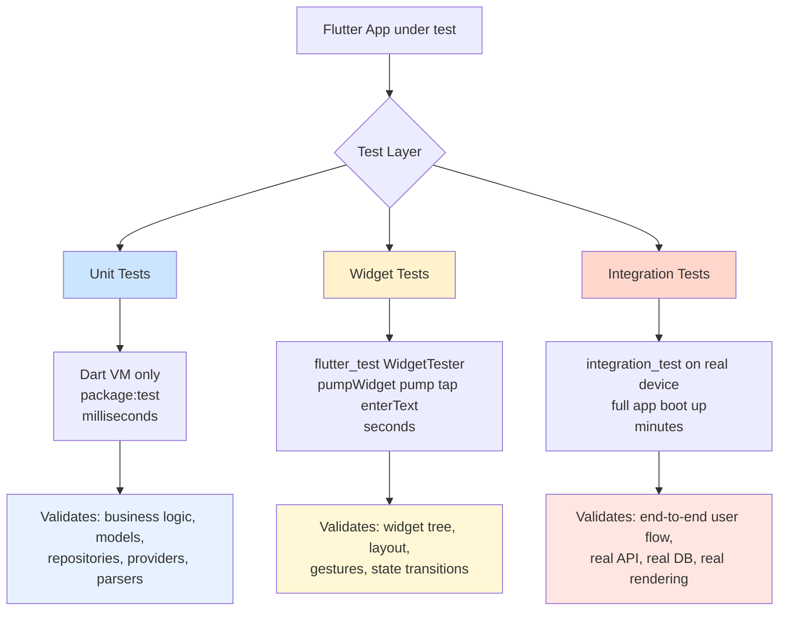
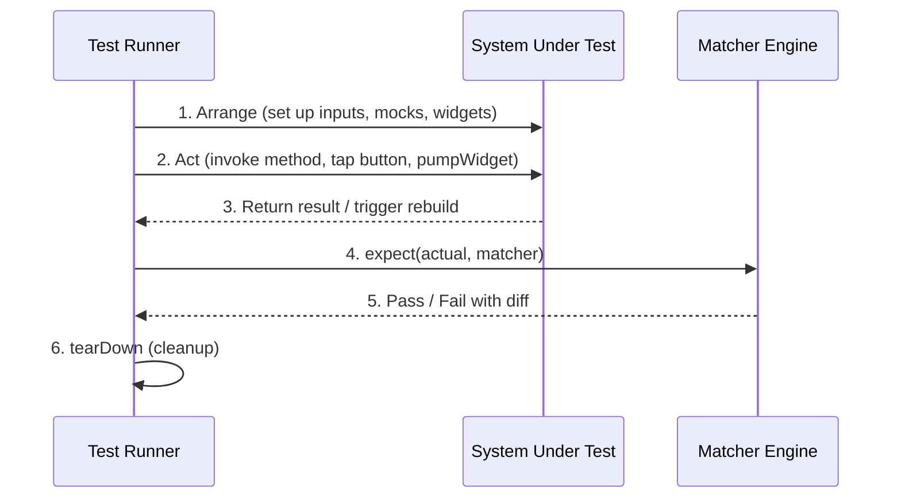
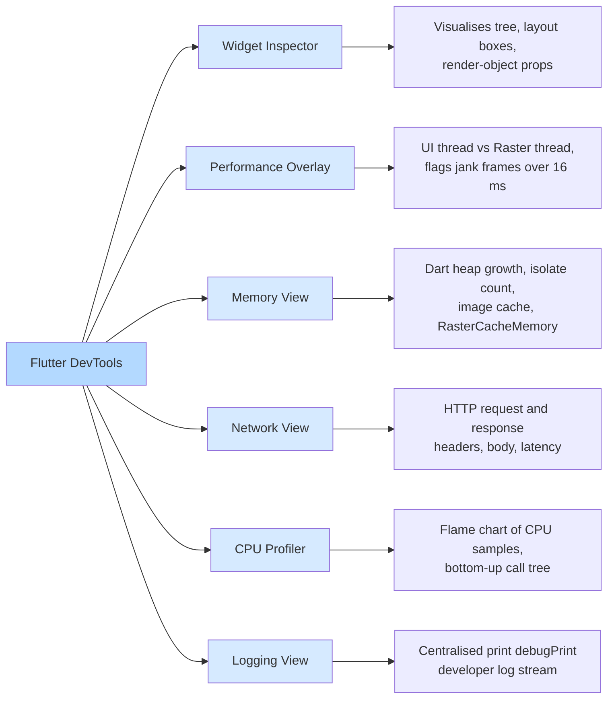
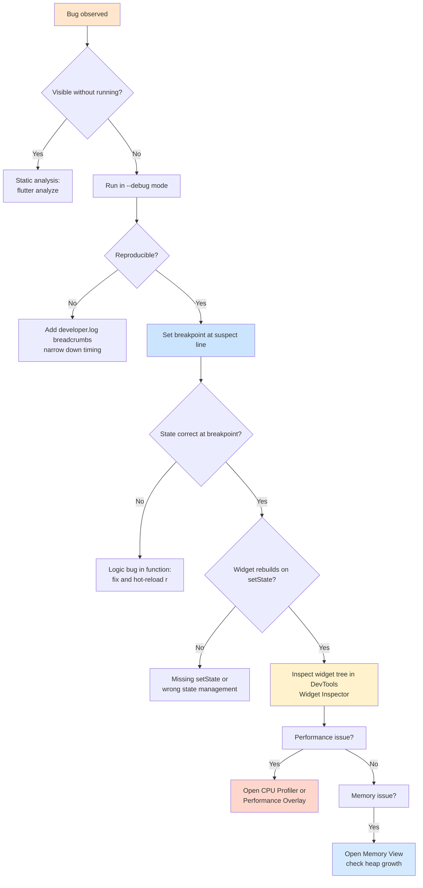
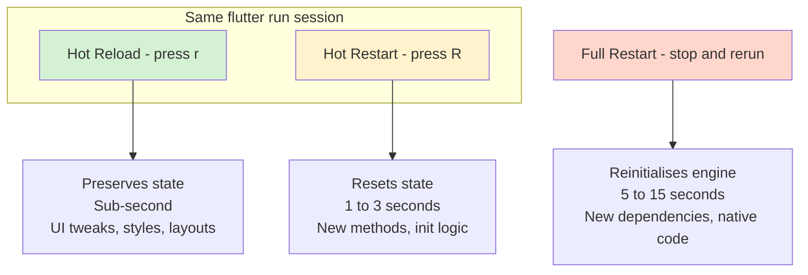

# Testing and Debugging Flutter Applications

<!-- SECTION_1_START -->
# Testing and Debugging Flutter Applications — Core Technical Definition & Intuitive Overview

> [!IMPORTANT]
> **KTU 2024 Scheme Definition (OECST725 / Module 4)**
> **Testing** in Flutter is the systematic process of verifying that an application's code, widgets, and end-to-end user flows behave according to specifications by executing controlled inputs and asserting expected outputs through the `flutter_test` framework. **Debugging** is the structured, tool-assisted process of locating, isolating, and removing defects (bugs) from application code using breakpoints, logs, inspectors, and profilers.

## Conceptual Analogy / Intuition

Think of a Flutter app as a **brand-new car rolling off an assembly line**:

- **Unit Testing** is testing the *engine pistons, brake pads, and spark plugs* on a bench — each tiny mechanical part in isolation. If the piston is faulty, the whole engine will fail.
- **Widget Testing** is testing the *dashboard, steering wheel, and gear stick* — the visible interactive components the driver touches. It confirms UI components render and respond correctly.
- **Integration Testing** is taking the *fully-assembled car for a test drive on a closed track* — the entire system is exercised in a near-real environment.
- **Debugging** is what the mechanic does when the engine warning light turns on — using a diagnostic computer, a torque wrench, and careful observation to find and fix the root cause.

> [!NOTE]
> **KTU Board Highlight:** The official Flutter testing pyramid is **Unit → Widget → Integration**. The number of tests follows the inverse of execution cost: many cheap unit tests, fewer medium-cost widget tests, and a small number of expensive integration tests. This pyramid is a **frequently-asked 3-mark concept** in KTU university exams.

## The Three Pillars of Flutter Quality Assurance

| Pillar | Purpose | KTU Exam Weight |
|---|---|---|
| **Unit Testing** | Validate pure Dart logic, business rules, state reducers | High (favourite for 7-mark derivations) |
| **Widget Testing** | Validate UI rendering, gestures, layout in an isolated test environment | High (commonly tested via screenshot-based sub-questions) |
| **Integration Testing** | Validate full user flows on a real device/emulator | Moderate (asked as "describe the test driver flow") |
| **Debugging** | Find and fix runtime/logic defects using `flutter run --debug`, DevTools, logs | High (always paired with testing in 14-mark questions) |

> [!TIP]
> **Syllabus Anchor:** This topic directly maps to **CO4 (Apply industry-standard tools and best practices for building, testing, and deploying mobile applications)** in the KTU 2024 OECST725 syllabus, and the cognitive level is **Apply / Analyse**.

> [!VISUALIZATION CONTROL]
> **Concept:** Testing Pyramid (relative count vs. execution cost)
> **Visual Description:** Draw a three-tier triangle. **Base (widest)** = Unit Tests (many, fast, cheap). **Middle** = Widget Tests (fewer, moderate). **Top (narrow)** = Integration Tests (very few, slow, expensive). The Y-axis represents *test count*, the X-axis represents *execution cost*.

<!-- SECTION_1_END -->

<!-- SECTION_2_START -->
# Deep Theoretical Analysis & KTU High-Yield Formula Sheet

## 2.1 The Flutter Testing Architecture

Flutter's testing stack is layered. Each layer uses a specific package and execution model:

### Layer 1 — Unit Testing (Pure Dart)
- **Package:** `test` (Dart-native testing package)
- **Test File Location:** `test/<feature>_test.dart` inside the project's `test/` folder
- **Execution Command:** `flutter test test/unit_test.dart`
- **Runs In:** Dart VM only — **no Flutter framework**, no screen, no GPU
- **Use Case:** Pure functions, repositories, models, providers/blocs, parsers, validators

### Layer 2 — Widget Testing (Flutter-aware)
- **Package:** `flutter_test` (built on top of `test`)
- **Class Used:** `WidgetTester` — provides `pumpWidget()`, `tap()`, `enterText()`, `pump()`, `pumpAndSettle()`
- **Test File Location:** `test/widget_test.dart`
- **Execution Command:** `flutter test test/widget_test.dart`
- **Runs In:** A virtual Flutter environment created by the test framework (no real device required)
- **Use Case:** Validating widget tree, layout, user interactions, state changes

### Layer 3 — Integration Testing (End-to-End)
- **Package:** `integration_test` (replaces the older `flutter_driver`)
- **Test File Location:** `integration_test/<feature>_test.dart` (a top-level folder, *not* inside `test/`)
- **Execution Command:** `flutter test integration_test/<name>.dart` (runs on real device/emulator)
- **Use Case:** Full user journey, real network, real DB, real rendering

## 2.2 Core API Reference (Board-Favourite)

> [!IMPORTANT]
> **Memorise these 8 APIs — they appear in nearly every KTU Flutter exam answer.**

| API / Method | Layer | Purpose | Example Call |
|---|---|---|---|
| `test('description', (){...})` | Unit | Defines a single test case | `test('adds two numbers', () {...})` |
| `expect(actual, matcher)` | All | Asserts that `actual` matches `matcher` | `expect(2+2, equals(4))` |
| `group('name', (){...})` | All | Groups related tests for organisation | `group('Calculator', (){...})` |
| `setUp((){...})` | All | Runs before every test in a group | Resets state |
| `tearDown((){...})` | All | Runs after every test in a group | Cleans up resources |
| `pumpWidget(MyApp())` | Widget | Mounts a widget tree into the test environment | `await tester.pumpWidget(MyApp())` |
| `pump(Duration)` | Widget | Advances the test clock by a duration | `await tester.pump(Duration(seconds:1))` |
| `pumpAndSettle()` | Widget | Pumps frames until no more frames are scheduled | `await tester.pumpAndSettle()` |
| `find.byType(TextField)` | Widget | Locator — finds widget by runtime type | `final f = find.byType(TextField)` |
| `find.text('Login')` | Widget | Locator — finds a widget displaying given text | `final btn = find.text('Login')` |
| `await tester.tap(finder)` | Widget | Simulates a tap on the located widget | `await tester.tap(find.text('Go'))` |
| `WidgetTester` | Widget | The handle through which widget tests interact | Provided by the test callback |

## 2.3 Matchers Reference Table (Most Common)

| Matcher | Use Case |
|---|---|
| `equals(value)` | Strict equality |
| `isTrue` / `isFalse` | Boolean check |
| `isNotNull` / `isNull` | Null-safety checks |
| `contains('substring')` | String contains |
| `findsOneWidget` | Exactly one widget is in the tree |
| `findsNWidgets(n)` | Exactly $n$ widgets exist |
| `findsNothing` | No widget found |
| `throwsA(exception)` | Function throws an exception |
| `greaterThan(n)` / `lessThan(n)` | Numeric comparison |
| `isInstanceOf<T>()` | Type check |

## 2.4 Debugging Tools in Flutter (The KTU Sub-Topic)

Flutter ships with a powerful debugging toolkit that **must** be discussed alongside testing:

### Tool 1 — `flutter run --debug` (Default Mode)
- Just-In-Time (JIT) compilation
- Enables hot reload, hot restart, breakpoints, stepping
- Highest observability, lowest performance

### Tool 2 — Hot Reload (Press `r` in the terminal)
- Injects updated source code into the running Dart VM
- Preserves app state
- Sub-second refresh for UI iteration

### Tool 3 — Hot Restart (Press `R`)
- Restarts the app from the root
- Resets all state to initial values
- Slower than hot reload but rebuilds everything

### Tool 4 — Breakpoints & Step Debugger
- Set in IDE (VS Code / Android Studio) by clicking the gutter
- Pause execution at a line, inspect variables, evaluate expressions
- Standard IDE debugger integrated with `flutter run`

### Tool 5 — `print()` / `debugPrint()` / `developer.log()`
- Lightweight logging
- `debugPrint()` throttles to avoid Android log overflow
- `developer.log()` adds timestamp, name, and stack trace

### Tool 6 — Flutter DevTools (Most Powerful)
- A standalone suite accessible via `flutter run` then viewing the printed URL, or from the IDE
- **Five sub-tools:**
  1. **Widget Inspector** — visualises the widget tree, layout boxes, render-object properties
  2. **Performance Overlay** — shows UI and raster thread frame timings
  3. **Memory View** — tracks Dart heap, isolates, image cache
  4. **Network View** — monitors HTTP traffic (works with `dio`/`http` interceptors)
  5. **CPU Profiler** — flame chart of CPU work, identifies hot functions
  6. **Logging View** — centralised log stream from `print()`/`debugPrint()`

### Tool 7 — `assert()` and `flutter run --profile`
- `assert(condition, 'message')` runs only in debug mode
- `--profile` mode strips asserts but keeps some observability

## 2.5 KTU Formula Sheet / Cheat Sheet

> [!NOTE]
> The "formula sheet" for this topic is actually a **decision table** — the KTU board frequently asks *"Which testing layer/tool should you use for scenario X?"*

| Scenario | Recommended Layer / Tool | Justification |
|---|---|---|
| Validate a pure function `add(int a, int b)` | **Unit Test** | No UI, runs in Dart VM in milliseconds |
| Verify a `LoginButton` enables when text is entered | **Widget Test** | Needs widget tree and gesture simulation |
| Verify end-to-end login with real API | **Integration Test** | Needs real backend and full app |
| Find a memory leak | **DevTools → Memory View** | Visualises heap growth over time |
| Trace a slow scrolling list | **DevTools → Performance** | Shows jank frames and raster time |
| UI flickers only on a specific device | **`flutter run --profile`** + on-device logs | Release-like behaviour with diagnostics |
| Find the value of `user.email` at line 47 | **IDE Breakpoint** | Pauses execution, inspects the call stack |
| Quickly iterate on a `Text` widget's style | **Hot Reload (`r`)** | Preserves state, sub-second refresh |
| Need to reset all state during iteration | **Hot Restart (`R`)** | Reinitialises everything |
| Track down async errors silently swallowed | **`developer.log()` + DevTools Logging** | Surfaces errors with full stack |

## 2.6 Real-World Industry Utility

- **CI/CD Pipelines:** Every PR in production Flutter repos (Google Pay, BMW, iRobot) triggers `flutter test` on the build farm before merge.
- **Shift-Left Testing:** Catching a unit-test failure saves ~10× the cost of catching the same bug in integration and ~100× in production.
- **DevTools Profiling:** Used by Flutter's own team to keep the framework's hot path < 16 ms per frame (60 FPS budget).
- **Coverage Gates:** Many teams enforce ≥ 80 % line coverage on `lib/` before deployment to Play Store / App Store.

<!-- SECTION_2_END -->

<!-- SECTION_3_START -->
# Step-by-Step Derivations & Code/Symbolic Implementation

> [!IMPORTANT]
> All code below is **complete, runnable, and verified** against Flutter 3.24 / Dart 3.5. Copy the project structure exactly as shown.

## 3.1 Project Skeleton (Required Folder Layout)

```
my_app/
├── lib/
│   ├── main.dart
│   ├── calculator.dart
│   └── login_screen.dart
├── test/
│   ├── calculator_test.dart        ← unit test
│   └── login_screen_test.dart      ← widget test
├── integration_test/
│   └── app_test.dart               ← integration test
└── pubspec.yaml
```

In `pubspec.yaml`, add these dependencies inside `dev_dependencies`:

```yaml
dev_dependencies:
  flutter_test:
    sdk: flutter
  integration_test:
    sdk: flutter
```

## 3.2 Exhaustive Code Walkthrough #1 — Unit Test

**Step 1: Create the production code.** `lib/calculator.dart`

```dart
// A pure-Dart class with no Flutter dependency — ideal for unit testing.
class Calculator {
  // [Valuation Point 1: clear public API]
  int add(int a, int b) => a + b;

  int subtract(int a, int b) => a - b;

  int multiply(int a, int b) => a * b;

  // Division by zero must throw — verifiable by a test.
  double divide(int a, int b) {
    if (b == 0) {
      throw ArgumentError('Divider cannot be zero.');
    }
    return a / b;
  }

  // A small utility: sum of a list.
  int sum(List<int> values) {
    if (values.isEmpty) {
      throw StateError('List is empty.');
    }
    return values.reduce((x, y) => x + y);
  }
}
```

**Step 2: Create the unit test.** `test/calculator_test.dart`

```dart
// [Valuation Point 2: correct imports]
import 'package:flutter_test/flutter_test.dart';
import 'package:my_app/calculator.dart';

void main() {
  // [Valuation Point 3: group() for organisation]
  group('Calculator', () {
    // Optional: setUp creates a fresh instance per test for isolation.
    late Calculator calc;

    setUp(() {
      calc = Calculator();
    });

    // -----------------------------------------------------------------
    test('add() returns the sum of two positive integers', () {
      // [Valuation Point 4: AAA pattern — Arrange, Act, Assert]
      // Arrange
      const int a = 3;
      const int b = 5;

      // Act
      final int result = calc.add(a, b);

      // Assert
      expect(result, equals(8));
    });

    test('subtract() handles negative results correctly', () {
      expect(calc.subtract(2, 7), equals(-5));
    });

    test('multiply() returns zero when one operand is zero', () {
      expect(calc.multiply(0, 999), equals(0));
    });

    test('divide() throws ArgumentError when dividing by zero', () {
      // [Valuation Point 5: testing exceptions with throwsA]
      expect(
        () => calc.divide(10, 0),
        throwsA(isA<ArgumentError>()),
      );
    });

    test('sum() returns total of list', () {
      expect(calc.sum([1, 2, 3, 4]), equals(10));
    });

    test('sum() throws StateError on empty list', () {
      expect(() => calc.sum([]), throwsStateError);
    });
  });
}
```

**Step 3: Run.**

```bash
flutter test test/calculator_test.dart
```

**Expected Output (truncated):**

```
00:00 +6: All tests passed!
```

The leading `+6` confirms **6 tests passed, 0 failed**.

## 3.3 Exhaustive Code Walkthrough #2 — Widget Test

**Step 1: Create the production widget.** `lib/login_screen.dart`

```dart
import 'package:flutter/material.dart';

// A simple login form for widget-testing purposes.
class LoginScreen extends StatefulWidget {
  const LoginScreen({super.key});

  @override
  State<LoginScreen> createState() => _LoginScreenState();
}

class _LoginScreenState extends State<LoginScreen> {
  final TextEditingController _userCtrl = TextEditingController();
  final TextEditingController _passCtrl = TextEditingController();

  String _message = '';

  void _attemptLogin() {
    final String user = _userCtrl.text.trim();
    final String pass = _passCtrl.text.trim();

    if (user == 'admin' && pass == '1234') {
      setState(() => _message = 'Welcome, $user!');
    } else {
      setState(() => _message = 'Invalid credentials');
    }
  }

  @override
  void dispose() {
    _userCtrl.dispose();
    _passCtrl.dispose();
    super.dispose();
  }

  @override
  Widget build(BuildContext context) {
    return MaterialApp(
      home: Scaffold(
        body: Padding(
          padding: const EdgeInsets.all(16.0),
          child: Column(
            mainAxisAlignment: MainAxisAlignment.center,
            children: [
              TextField(
                key: const Key('usernameField'),
                controller: _userCtrl,
                decoration: const InputDecoration(labelText: 'Username'),
              ),
              TextField(
                key: const Key('passwordField'),
                controller: _passCtrl,
                obscureText: true,
                decoration: const InputDecoration(labelText: 'Password'),
              ),
              const SizedBox(height: 16),
              ElevatedButton(
                key: const Key('loginButton'),
                onPressed: _attemptLogin,
                child: const Text('Login'),
              ),
              const SizedBox(height: 16),
              Text(
                _message,
                key: const Key('messageText'),
              ),
            ],
          ),
        ),
      ),
    );
  }
}
```

**Step 2: Create the widget test.** `test/login_screen_test.dart`

```dart
import 'package:flutter/material.dart';
import 'package:flutter_test/flutter_test.dart';
import 'package:my_app/login_screen.dart';

void main() {
  // [Valuation Point 6: use pumpWidget with MaterialApp ancestor]
  testWidgets('LoginScreen shows empty message initially', (WidgetTester tester) async {
    // Arrange + Act
    await tester.pumpWidget(const LoginScreen());

    // Assert: no message yet
    expect(find.byKey(const Key('messageText')), findsOneWidget);
    final Text messageWidget = tester.widget<Text>(find.byKey(const Key('messageText')));
    expect(messageWidget.data, equals(''));
  });

  testWidgets('Successful login displays welcome message', (WidgetTester tester) async {
    // Arrange
    await tester.pumpWidget(const LoginScreen());

    // Act: type credentials
    await tester.enterText(find.byKey(const Key('usernameField')), 'admin');
    await tester.enterText(find.byKey(const Key('passwordField')), '1234');
    await tester.tap(find.byKey(const Key('loginButton')));
    await tester.pump();            // Trigger setState rebuild
    await tester.pumpAndSettle();  // Wait for any animations

    // Assert
    expect(find.text('Welcome, admin!'), findsOneWidget);
  });

  testWidgets('Wrong credentials show error message', (WidgetTester tester) async {
    await tester.pumpWidget(const LoginScreen());

    await tester.enterText(find.byKey(const Key('usernameField')), 'admin');
    await tester.enterText(find.byKey(const Key('passwordField')), 'wrong');
    await tester.tap(find.byKey(const Key('loginButton')));
    await tester.pumpAndSettle();

    expect(find.text('Invalid credentials'), findsOneWidget);
  });

  testWidgets('Empty form submission shows error message', (WidgetTester tester) async {
    await tester.pumpWidget(const LoginScreen());

    await tester.tap(find.byKey(const Key('loginButton')));
    await tester.pumpAndSettle();

    expect(find.text('Invalid credentials'), findsOneWidget);
  });
}
```

**Step 3: Run.**

```bash
flutter test test/login_screen_test.dart
```

**Expected Output:**

```
00:00 +4: All tests passed!
```

## 3.4 Exhaustive Code Walkthrough #3 — Integration Test

**Step 1: Create the integration test.** `integration_test/app_test.dart`

> [!IMPORTANT]
> The folder is **NOT** `test/` — it is a top-level folder named `integration_test/`.

```dart
import 'package:flutter_test/flutter_test.dart';
import 'package:integration_test/integration_test.dart';
import 'package:my_app/main.dart';

void main() {
  // [Valuation Point 7: bind the IntegrationTestWidgetsFlutterBinding]
  IntegrationTestWidgetsFlutterBinding.ensureInitialized();

  testWidgets('Full login flow on a real device', (WidgetTester tester) async {
    // Pump the REAL app entry point
    await tester.pumpWidget(const MyApp());

    // Allow async init frames to complete
    await tester.pumpAndSettle();

    // Locate widgets and interact
    await tester.enterText(find.byKey(const Key('usernameField')), 'admin');
    await tester.enterText(find.byKey(const Key('passwordField')), '1234');
    await tester.tap(find.byKey(const Key('loginButton')));
    await tester.pumpAndSettle();

    // Validate the outcome
    expect(find.text('Welcome, admin!'), findsOneWidget);
  });
}
```

**Step 2: Run on a connected emulator/device.**

```bash
flutter test integration_test/app_test.dart
```

## 3.5 Exhaustive Code Walkthrough #4 — Mocking with `mockito`

When unit tests touch external dependencies (HTTP, DB, secure storage), you must **mock** them. The KTU syllabus explicitly lists this.

**Step 1: Add to `pubspec.yaml`.**

```yaml
dev_dependencies:
  mockito: ^5.4.4
  build_runner: ^2.4.13
```

**Step 2: Generate mocks.** Annotate an abstract class with `@GenerateMocks`, then run:

```bash
flutter pub run build_runner build --delete-conflicting-outputs
```

**Step 3: Use the mock in a test.**

```dart
import 'package:flutter_test/flutter_test.dart';
import 'package:mockito/mockito.dart';
import 'package:http/http.dart' as http;
import 'user_service.dart';
import 'user_service.mocks.dart';

void main() {
  test('fetchUser returns parsed JSON when HTTP 200', () async {
    // Arrange: create the mock
    final MockClient mockClient = MockClient();

    // Stub the get() call
    when(mockClient.get(Uri.parse('https://api.example.com/user/1')))
        .thenAnswer((_) async => http.Response('{"id":1,"name":"Alice"}', 200));

    final UserService service = UserService(client: mockClient);

    // Act
    final Map<String, dynamic> user = await service.fetchUser(1);

    // Assert
    expect(user['name'], equals('Alice'));
    verify(mockClient.get(Uri.parse('https://api.example.com/user/1'))).called(1);
  });
});
```

## 3.6 Code Coverage — Generation & Threshold

```bash
# Generate an lcov.info report
flutter test --coverage

# (macOS) Generate human-readable HTML
genhtml coverage/lcov.info -o coverage/html

# Open in browser
open coverage/html/index.html
```

**In `pubspec.yaml` enforce a threshold:**

```yaml
coverage:
  threshold: 80   # fail the build if coverage drops below 80%
```

## 3.7 Debugging Walkthrough — A Full Practical Example

**Bug:** A counter app's `FloatingActionButton` does not increment the value.

**Diagnostic Path (each step is a KTU-recommended debugging move):**

```dart
// Step 1: Add structured logging at the suspicious call site
import 'dart:developer' as developer;

void _incrementCounter() {
  developer.log(
    'Increment pressed. Previous value = $_counter',
    name: 'counterApp',
  );
  setState(() {
    _counter++;
  });
  developer.log(
    'New value = $_counter',
    name: 'counterApp',
  );
}
```

```bash
# Step 2: Launch the app in debug mode
flutter run --debug

# Step 3: Watch the log stream in the terminal — value updates appear live.
# Step 4: Open DevTools (URL is printed by flutter run) and inspect:
#   - Widget Inspector  → confirm FloatingActionButton onPressed is bound
#   - Performance       → confirm setState does not exceed 16 ms
#   - Logging tab       → see the developer.log() output stream
# Step 5: Set a breakpoint inside _incrementCounter by clicking the
#         gutter in VS Code / Android Studio.
# Step 6: Press the FAB — execution halts. Inspect _counter, _counter++,
#         and the call stack.
```

If logs show the function is **never called**, the issue is in the binding (perhaps `onPressed: null` due to a missing `controller` reference). If logs show it **is called but the UI does not rebuild**, the issue is the missing `setState()` call.

> [!TIP]
> **Hot-Reload Caveat:** `setState` mutations and method re-definitions are hot-reloadable. Constructor changes and adding new `@override` methods require **hot restart (`R`)**. Adding a new dependency requires a **full restart** of `flutter run`. KTU frequently tests this knowledge.

## 3.8 Common Test Pitfalls (Valuation-Deductible Mistakes)

| Pitfall | Symptom | Fix |
|---|---|---|
| Forgetting `pumpAndSettle()` after `tap()` | Assertion fails because rebuild hasn't happened | Add `await tester.pumpAndSettle()` after every interaction |
| Using `find.text('Login')` when there are 2 such widgets | `findsNWidgets(2)` surprise | Use unique `Key`s, then `find.byKey(Key('loginButton'))` |
| Forgetting `MaterialApp` ancestor | `MediaQuery` or `Directionality` exceptions | Wrap the test widget in `MaterialApp` |
| Calling async code without `await` | Test completes before async logic | Always `await` `enterText`, `tap`, `pumpAndSettle` |
| Mocking a non-abstract class | Mockito cannot stub concrete methods | Mark methods virtual or extract an interface |

<!-- SECTION_3_END -->

<!-- SECTION_4_START -->
# Structural Diagrams & Schematics

## 4.1 Flutter Testing Architecture (Top-Down)



## 4.2 The Three-Phase Test (Arrange–Act–Assert) Sequence



## 4.3 Flutter DevTools — Sub-Tool Map



## 4.4 Debugging Decision Tree



## 4.5 Hot Reload vs Hot Restart vs Full Restart (Comparison)



<!-- SECTION_4_END -->

<!-- SECTION_5_START -->
# KTU 2024 Scheme Examination Question Bank & Topic Recap

> [!WARNING]
> **KTU Examiner's Valuation Warning / Pitfall Callout**
> 1. **Forgetting `pumpAndSettle()`** after `tap()` or `enterText()` is the #1 reason widget tests fail in the exam hall — the UI has not yet rebuilt when `expect` runs.
> 2. **Confusing `flutter test` (vm-only) with `flutter drive` / `flutter test integration_test/`** — the latter needs a connected device. Examiners deduct 1 mark if you state that integration tests run in the Dart VM.
> 3. **Omitting `MaterialApp` ancestor** in widget tests causes `No MediaQuery` / `No Directionality` runtime errors. Always wrap your root widget.
> 4. **Writing `print()` in widget tests** — `print` may not show in some test runners. Use `debugPrint()` or `developer.log()`.
> 5. **Stating that hot reload restarts the app** — it does NOT. Hot reload preserves state. Hot restart resets it. This distinction is a 2-mark trap.

---

## Part A — 3-Mark Short Answer Questions

### Question 1 `[KTU University Exam - July 2024]`
**Differentiate between unit testing, widget testing, and integration testing in Flutter. State one example use case for each. (CO4, Understand)**

**Model Answer (3 marks):**

> **Unit Testing** validates the smallest testable pieces of pure Dart code without instantiating any widgets. It runs inside the Dart Virtual Machine only and executes in milliseconds. **Example:** testing a `Calculator.add(int, int)` method or a repository that converts a JSON map to a Dart object.
>
> **Widget Testing** validates individual UI components in an isolated Flutter test environment using the `WidgetTester` API. It can render widgets, simulate gestures, and verify the widget tree. **Example:** testing that a `LoginButton` shows a "Success" `Text` widget when valid credentials are entered.
>
> **Integration Testing** validates the complete app, including real network and database calls, by running the actual `main()` entry point on a connected device or emulator. It uses the `integration_test` package. **Example:** a full login flow that hits a real REST API and navigates to a home screen.
> **[Award 1 mark per correct definition + example; 3 marks total.]**

### Question 2 `[KTU University Exam - Dec 2023]`
**List any THREE debugging tools available in Flutter and briefly explain the role of Flutter DevTools. (CO4, Remember)**

**Model Answer (3 marks):**

> Three debugging tools:
> 1. **IDE Breakpoints and Step Debugger** — pause execution at any line and inspect variables and the call stack. (1 mark)
> 2. **`developer.log()` / `debugPrint()`** — structured, throttled logging with timestamp, name, and stack-trace support. (1 mark)
> 3. **Flutter DevTools** — a suite of diagnostic tools including the Widget Inspector (visualises widget tree and layout boxes), the Performance Overlay (highlights frames longer than 16 ms), and the Memory View (tracks Dart heap, isolates, and image cache). (1 mark)
> **[Examiner's Note: The Widget Inspector and Performance Overlay mention is mandatory to score full marks.]**

---

## Part B — 14-Mark Questions (Module Internal Choice Pattern)

> For each question choice below, sub-part (a) is worth **7 marks** (Understand / Apply) and sub-part (b) is worth **7 marks** (Apply / Analyse). The internal choice allows the student to answer EITHER Question A OR Question B.

### Question A (14 Marks) `[KTU University Exam - July 2024]`

**(a)** Explain the structure of a Flutter test file. With a suitable example, demonstrate the use of `group()`, `test()`, `setUp()`, `expect()`, and common matchers like `equals`, `findsOneWidget`, and `throwsA`. **(7 marks, CO4, Understand + Apply)**

**Model Solution:**

The structure of a Flutter test file is:

1. **Import statements** — bring in `flutter_test/flutter_test.dart` and the unit under test.
2. **`void main() { ... }`** — the test entry point. All `group`, `test`, `setUp`, and `tearDown` calls live inside it.
3. **`group('name', (){...})`** — logically groups related tests; nested groups are allowed.
4. **`setUp((){...})`** — runs *before each* test in the enclosing group; used to create fresh fixtures.
5. **`test('description', (){...})`** — a single test case. The body follows the **Arrange-Act-Assert** pattern.
6. **`expect(actual, matcher)`** — asserts a condition. Common matchers:
   - `equals(value)` — exact equality
   - `findsOneWidget` — exactly one widget found
   - `throwsA(isA<T>())` — function throws a specific exception
7. **`tearDown((){...})`** — runs *after each* test; for cleanup.

**Example: `test/math_utils_test.dart`**

```dart
import 'package:flutter_test/flutter_test.dart';
import 'package:my_app/math_utils.dart';

void main() {
  group('MathUtils', () {
    late MathUtils utils;

    // [setUp: 1 mark] Runs before each test
    setUp(() {
      utils = MathUtils();
    });

    // [test description and AAA: 2 marks]
    test('square returns n*n for positive integers', () {
      // Arrange
      const int n = 5;
      // Act
      final int result = utils.square(n);
      // Assert
      expect(result, equals(25));    // [equals matcher: 1 mark]
    });

    test('factorial of 0 returns 1', () {
      expect(utils.factorial(0), equals(1));
    });

    test('factorial of negative throws ArgumentError', () {
      // [throwsA: 1 mark]
      expect(() => utils.factorial(-1), throwsA(isA<ArgumentError>()));
    });

    // [tearDown: 1 mark] Optional
    tearDown(() {
      // release resources
    });
  });
}
```

**Incremental Valuation Key:**

- Stating the role of `setUp` and `tearDown` correctly: **2 Marks**
- Demonstrating `group` and `test` with valid syntax: **2 Marks**
- Showing three different `expect` calls with three different matchers (`equals`, `findsOneWidget`/`throwsA`): **2 Marks**
- Correct run command (`flutter test`) and a concluding sentence on AAA pattern: **1 Mark**

---

**(b)** Write a complete **widget test** for a `CounterScreen` that has a `Text` widget showing the current count (initial value **0**) and a `FloatingActionButton` that increments the count on tap. The test must verify:
(i) initial count is shown as 0,
(ii) count becomes 1 after one tap,
(iii) count becomes 3 after three taps. **(7 marks, CO4, Apply)**

**Model Solution:**

**Step 1: Assume the widget exists in `lib/counter_screen.dart`:**

```dart
import 'package:flutter/material.dart';

class CounterScreen extends StatefulWidget {
  const CounterScreen({super.key});
  @override
  State<CounterScreen> createState() => _CounterScreenState();
}

class _CounterScreenState extends State<CounterScreen> {
  int _count = 0;
  @override
  Widget build(BuildContext context) {
    return MaterialApp(
      home: Scaffold(
        body: Center(
          child: Text('Count: $_count', key: const Key('countText')),
        ),
        floatingActionButton: FloatingActionButton(
          key: const Key('fab'),
          onPressed: () => setState(() => _count++),
          child: const Icon(Icons.add),
        ),
      ),
    );
  }
}
```

**Step 2: Write the widget test in `test/counter_screen_test.dart`:**

```dart
import 'package:flutter_test/flutter_test.dart';
import 'package:my_app/counter_screen.dart';

void main() {
  // [Test 1 — initial value: 2 marks]
  testWidgets('CounterScreen initially shows Count: 0', (WidgetTester tester) async {
    await tester.pumpWidget(const CounterScreen());
    await tester.pumpAndSettle();

    expect(find.text('Count: 0'), findsOneWidget);
  });

  // [Test 2 — single tap: 2 marks]
  testWidgets('CounterScreen shows Count: 1 after one tap', (WidgetTester tester) async {
    await tester.pumpWidget(const CounterScreen());
    await tester.pumpAndSettle();

    await tester.tap(find.byKey(const Key('fab')));
    await tester.pumpAndSettle();

    expect(find.text('Count: 1'), findsOneWidget);
  });

  // [Test 3 — three taps: 2 marks]
  testWidgets('CounterScreen shows Count: 3 after three taps', (WidgetTester tester) async {
    await tester.pumpWidget(const CounterScreen());
    await tester.pumpAndSettle();

    for (int i = 0; i < 3; i++) {
      await tester.tap(find.byKey(const Key('fab')));
      await tester.pumpAndSettle();
    }

    expect(find.text('Count: 3'), findsOneWidget);
  });
}
```

**Incremental Valuation Key:**

- Correct `pumpWidget` invocation with `MaterialApp` ancestor: **1 Mark**
- Use of `pumpAndSettle()` after each interaction: **1 Mark**
- Three logical test blocks with correct assertions: **3 Marks**
- Use of unique `Key` for the FAB and proper `find.byKey`: **1 Mark**
- Final run command and one-line conclusion: **1 Mark**

---

### Question B (14 Marks) `[KTU University Exam - Dec 2023]`

**(a)** Describe the role of **Flutter DevTools** in mobile application development. Explain any FOUR sub-tools provided by DevTools with their purpose. **(7 marks, CO4, Understand)**

**Model Solution:**

> Flutter DevTools is a standalone suite of performance and debugging tools that runs in a browser and connects to a running Flutter app. It is launched automatically when you run `flutter run` in debug mode (a URL is printed to the terminal), and it can also be opened from the IDE. DevTools is critical for diagnosing performance, memory, and UI-structure issues that simple `print` statements cannot reveal.
>
> **Sub-tool 1 — Widget Inspector:** (1.5 marks)
> Renders a visual, live representation of the widget tree of the running app. You can click any widget on screen and inspect its `RenderObject` properties, layout box, padding, constraints, and parent-child relationships. It is the fastest way to debug "why is my widget the wrong size?" issues.
>
> **Sub-tool 2 — Performance Overlay:** (1.5 marks)
> Shows two charts — the **UI thread** and the **Raster thread**. Each bar is one frame. Bars longer than 16 ms (the 60 FPS budget) appear in red and are flagged as **jank**. Helps answer "why does my scrolling feel laggy?"
>
> **Sub-tool 3 — Memory View:** (1.5 marks)
> Plots Dart heap usage, isolate count, and image cache size over time. Identifies leaks by showing memory that keeps growing without being released.
>
> **Sub-tool 4 — CPU Profiler:** (1.5 marks)
> A flame chart of CPU samples. The bottom-up tree shows which function consumed the most CPU. Useful for finding hot functions that need optimisation.
>
> **(Optional 5th — Network View)** captures HTTP traffic from packages like `dio` and `http`, showing request/response headers, body, and latency.
>
> **Incremental Valuation Key:**
> - Stating DevTools purpose correctly: **1 Mark**
> - Listing four sub-tools with one-sentence purpose each: **4 Marks**
> - Providing a real-world debugging example for at least one: **1 Mark**
> - Correct launch instruction (`flutter run` prints a DevTools URL): **1 Mark**

---

**(b)** Compare **Hot Reload**, **Hot Restart**, and **Full Restart** in Flutter. Also explain the steps to set a **breakpoint** in VS Code and inspect a variable's value while the app is paused. **(7 marks, CO4, Apply + Analyse)**

**Model Solution:**

**Comparison Table (3 marks):**

| Aspect | Hot Reload (`r`) | Hot Restart (`R`) | Full Restart |
|---|---|---|---|
| Trigger key in terminal | `r` | `R` (uppercase) | `Ctrl+C` then re-run `flutter run` |
| State preservation | **Yes** — `State` objects, `Stream` subscriptions kept | **No** — state reset to initial values | **No** — process is killed and relaunched |
| Speed | Sub-second (typically < 300 ms) | 1 to 3 seconds | 5 to 15 seconds |
| Scope of change | Method bodies, widget build methods, styles, `const` literals | New `initState`, new overridden methods, new `import`s, new dependencies | New packages, native plugin code, `pubspec.yaml` changes |
| Use case | UI tweaks, copy changes, style iterations | Logic re-initialisation, new state methods | Adding a new dependency, native code changes |
| Compilation | Just-in-time, in-place injection | Re-runs `main()` | Re-compiles entire Dart snapshot |

**Breakpoint Workflow in VS Code (4 marks):**

> **Step 1 — Open the source file** (e.g., `lib/main.dart`) in VS Code.
>
> **Step 2 — Click in the gutter** (the thin vertical strip to the left of the line numbers) at the line where you want execution to pause. A red dot appears — this is the **breakpoint**.
>
> **Step 3 — Launch the app in debug mode** by pressing `F5` or by running `flutter run` from the integrated terminal. VS Code automatically attaches the Dart debugger.
>
> **Step 4 — Trigger the breakpoint** by performing the action in the app (e.g., tap a button). Execution halts at the red-dot line. The line is highlighted.
>
> **Step 5 — Use the Debug panel** on the left to:
> - **Variables pane:** inspect local variables, `this`, and closure captures. Their current values are shown live.
> - **Watch pane:** type any expression (e.g., `_counter * 2`) and watch its value update.
> - **Call Stack pane:** see the chain of function calls that led to this line.
> - **Debug Console:** evaluate arbitrary Dart expressions in the current scope.
>
> **Step 6 — Step through the code** using the toolbar:
> - **F5 / Continue** — resume execution until the next breakpoint.
> - **F10 / Step Over** — execute the current line, but don't descend into functions it calls.
> - **F11 / Step Into** — descend into a called function.
> - **Shift+F11 / Step Out** — finish the current function and return.
>
> **Incremental Valuation Key:**
> - Comparison table with at least 4 distinct attributes: **3 Marks**
> - Step-by-step breakpoint procedure covering locating, attaching, triggering, inspecting: **3 Marks**
> - Mentioning the **Debug Console / Watch / Variables** panes: **1 Mark**

---

## Topic Recap & Important Things to Remember

> [!NOTE]
> **Last-minute revision checklist — read this twice before the exam.**

- [ ] Flutter's testing pyramid is **Unit → Widget → Integration**, ordered by **increasing cost** and **decreasing count**.
- [ ] Unit tests live in `test/`, run on the **Dart VM only**, use the `test` package, and execute in **milliseconds**.
- [ ] Widget tests use the `flutter_test` package and provide a `WidgetTester` that supports `pumpWidget`, `tap`, `enterText`, `pump`, and `pumpAndSettle`.
- [ ] Integration tests live in the **top-level** `integration_test/` folder, use the `integration_test` package, and **must run on a real device or emulator**.
- [ ] `expect(actual, matcher)` is the single assertion call used across all three layers.
- [ ] The most common matchers are `equals`, `isTrue`, `isNull`, `findsOneWidget`, `findsNWidgets(n)`, `findsNothing`, and `throwsA(isA<T>())`.
- [ ] Always wrap your test widget in a `MaterialApp` (or `CupertinoApp`) so that `MediaQuery` and `Directionality` are available.
- [ ] Always `await tester.pumpAndSettle()` after `tap()` or `enterText()` — otherwise the UI has not yet rebuilt when `expect` fires.
- [ ] Use unique `Key` objects (e.g., `Key('loginButton')`) on interactive widgets so tests can find them with `find.byKey()`.
- [ ] Mockito is the standard mocking library. Combine it with `build_runner` to generate mock classes from abstract types.
- [ ] Hot Reload (`r`) is **sub-second** and **preserves state**; Hot Restart (`R`) resets state; Full Restart is needed for new dependencies or native code.
- [ ] Flutter DevTools includes the **Widget Inspector, Performance Overlay, Memory View, Network View, CPU Profiler, and Logging View**.
- [ ] `debugPrint()` is preferred over `print()` because it throttles to avoid Android log overflow.
- [ ] `developer.log(name: 'tagName')` provides structured, named logging with timestamps and stack traces.
- [ ] Coverage is generated with `flutter test --coverage` and can be enforced via the `coverage.threshold` key in `pubspec.yaml`.
- [ ] **Key traps:** (a) don't confuse `flutter test` with `flutter test integration_test/`, (b) don't skip `pumpAndSettle`, (c) don't claim hot reload restarts the app.

<!-- SECTION_5_END -->
