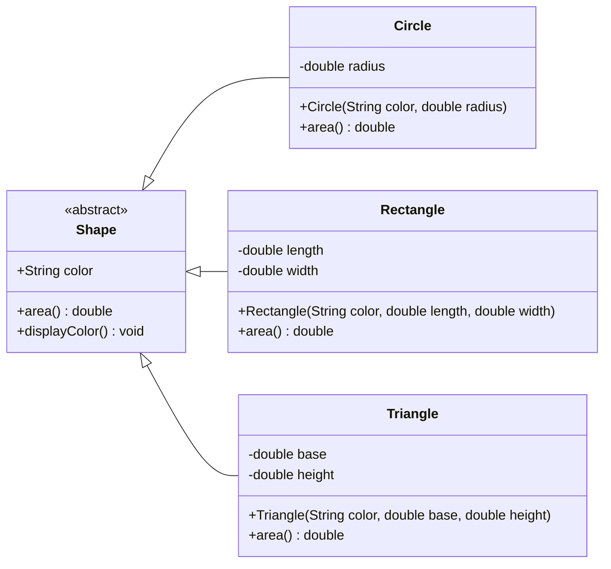
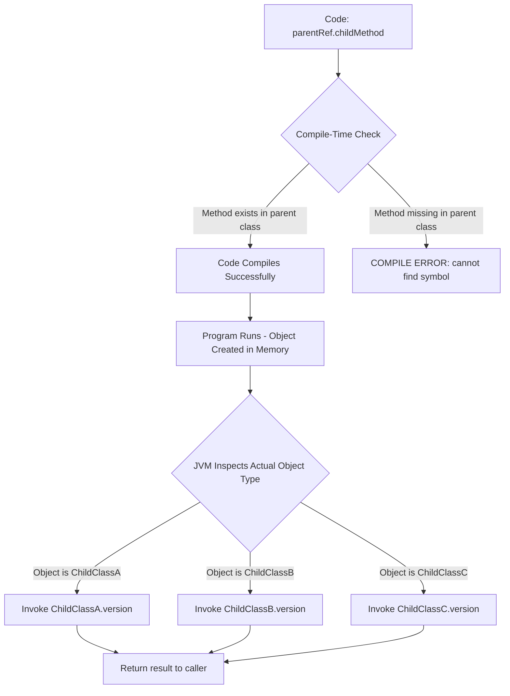
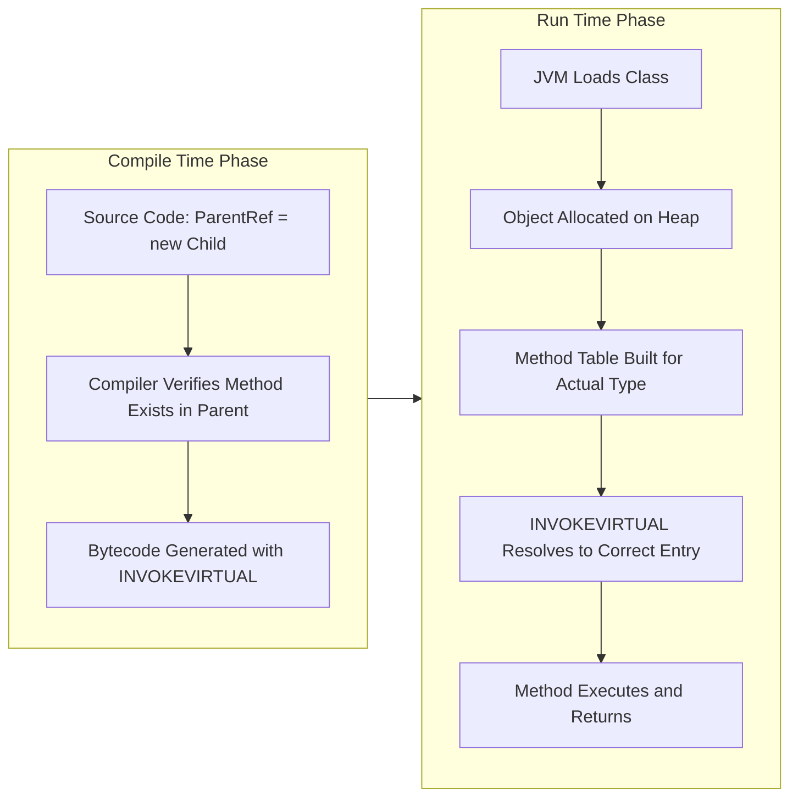

# Inheritance and Polymorphism

<!-- SECTION_1_START -->

# Object-Oriented Design Frameworks — Inheritance and Polymorphism

> [!IMPORTANT]
> **KTU 2024 Scheme | OECST72A | Module 1**
> This study unit covers two of the four foundational pillars of Object-Oriented Programming (OOP). Mastery of these concepts is mandatory for the End Semester Evaluation (ESE) and directly maps to **CO1: Apply object-oriented principles to model real-world systems**.

---

## 1.1 Inheritance — The "IS-A" Relationship

### Formal Definition
**Inheritance** is a compile-time, static OOP mechanism in which a new class (called the **subclass**, **derived class**, or **child class**) is created from an existing class (called the **superclass**, **base class**, or **parent class**), thereby acquiring — *reusing* — all non-private attributes and behaviors of the parent, while being free to add new members or *specialize* inherited ones.

In Java, inheritance is declared using the **`extends`** keyword:

$$\text{class ChildClass } \textbf{extends} \text{ ParentClass } \{ \ldots \}$$

### Conceptual Analogy — The Family Tree
Imagine a real-world **Vehicle** family:

| Generation | Member | Inherited Traits | New Traits |
|---|---|---|---|
| Grandparent | `Vehicle` | `startEngine()`, `stopEngine()` | — |
| Parent | `Car` | All of the above | `playMusic()`, `acOn()` |
| Child | `SportsCar` | All of the above | `turboMode()`, `launchControl()` |

A *SportsCar* **is-a** *Car*, which **is-a** *Vehicle*. Just as a child inherits the surname and certain genetic traits from the parent, a subclass inherits the public/protected interface and code from the superclass — without rewriting it. This is the essence of **code reusability** and establishes the **"IS-A"** relationship in OO design.

> [!NOTE]
> **Key Terminology for KTU Exams:**
> - **Generalization** — moving *up* the hierarchy (Child → Parent)
> - **Specialization** — moving *down* the hierarchy (Parent → Child)
> - **Code Reusability** — the primary engineering benefit
> - **Coupling** — subclass depends on the structure of its superclass

> [!VISUALIZATION CONTROL]
> **Concept:** Vertical Class Hierarchy (Multilevel Inheritance)
> **Mermaid Class Diagram Equations (conceptual):**
> * `Animal` (root) $\rightarrow$ `Mammal` (intermediate) $\rightarrow$ `Dog` (leaf)
> **Visual Description:** Picture a 3-tier pyramid. The top tier holds the most general abstraction; the bottom tier holds the most specific implementation. Arrows point from child *upward* to the parent — a direction that visually represents "extends."

---

## 1.2 Polymorphism — "Many Forms" of Behavior

### Formal Definition
**Polymorphism** (from Greek *polys* = many, *morphē* = form) is the ability of a single interface, method name, or operator to invoke **different implementations** depending on the *actual* runtime type of the object or the *signature* of the call. It allows a parent type reference to transparently dispatch to the correct child behavior.

### Conceptual Analogy — The Universal Remote Control
Consider a single **Remote Control** button labeled `power()`. When you point it at a **TV**, it switches channels. Point it at an **AC**, it adjusts temperature. Point it at a **Sound System**, it toggles volume. The button looks identical, the *command* is identical, but the **effect** differs based on the **target device**.

In OOP terms:
- The button = the **method call** (e.g., `device.power()`)
- The TV / AC / Sound System = **different object types**
- The behavior = the **overridden implementation**

> [!IMPORTANT]
> Polymorphism is the **only** OOP feature that enables *late binding* (runtime decision-making), which is the foundation of **extensible, plug-and-play software architectures** (e.g., JDBC drivers, plugin systems, strategy patterns).

---

<!-- SECTION_1_END -->

<!-- SECTION_2_START -->

# 2. Deep Theoretical Analysis & High-Yield Reference

## 2.1 The Five Canonical Types of Inheritance

| # | Type | Diagram Shape | Java Support? | Real-World Example |
|---|---|---|---|---|
| 1 | **Single** | Parent $\rightarrow$ Child | ✅ Yes (via `extends`) | `Vehicle` $\rightarrow$ `Car` |
| 2 | **Multilevel** | Grand $\rightarrow$ Parent $\rightarrow$ Child | ✅ Yes | `LivingBeing` $\rightarrow$ `Animal` $\rightarrow$ `Dog` |
| 3 | **Hierarchical** | One Parent $\rightarrow$ Many Children | ✅ Yes | `Shape` $\rightarrow$ {`Circle`, `Rectangle`, `Triangle`} |
| 4 | **Multiple** | Many Parents $\rightarrow$ One Child | ❌ **Not with classes** (✅ via `interfaces`) | A `SmartPhone` is both a `Phone` and a `Camera` |
| 5 | **Hybrid** | Combination of two or more types | ⚠️ Only via interfaces (because multiple inheritance with classes causes the **Diamond Problem**) | Mix of hierarchical + multiple |

> [!WARNING]
> **KTU Board Alert:** Java **disallows multiple inheritance with classes** to avoid the *Diamond Problem* (ambiguity when two parents define the same method). Multiple inheritance is *re-introduced* safely using **interfaces** (Java 8+ with `default` methods). Examiners frequently test this nuance.

### 2.1.1 The `super` Keyword — A Two-Way Bridge
The `super` reference inside a subclass serves **two critical purposes**:

1. **Calling the parent constructor:** `super(args)` *must* be the first statement in a subclass constructor (if used). If omitted, the compiler *implicitly* inserts `super()` (the no-arg parent constructor).
2. **Accessing hidden parent members:** `super.memberName` resolves naming conflicts when the subclass shadows a parent attribute or method.

### 2.1.2 Constructor Chaining — The Call Pyramid
When an object of a subclass is instantiated, the call propagates **upward** through the inheritance chain, then execution flows **downward** as each constructor completes.

---

## 2.2 Polymorphism — The Two Distinct Flavors

| Dimension | **Compile-Time Polymorphism** (Static / Early Binding) | **Runtime Polymorphism** (Dynamic / Late Binding) |
|---|---|---|
| **Mechanism** | **Method Overloading** | **Method Overriding** |
| **Decision Time** | At compilation (which signature matches?) | At execution (which object's method runs?) |
| **Binding Type** | Static binding | Dynamic binding |
| **Occurs In** | Same class (or via inheritance for static methods) | Across class hierarchy |
| **Rules** | Methods must differ in **parameter list** (number, type, or order). Return type alone is **not** sufficient. | Method signature must be **identical**; access modifier cannot be more restrictive; covariant return types allowed (Java 5+). |
| **KTU Example** | `add(int a, int b)` vs `add(double a, double b)` | `Animal.speak()` overridden by `Dog.speak()` |
| **Performance** | Slightly faster (no runtime lookup) | Slight overhead due to v-table / method-dispatch lookup |

> [!NOTE]
> **Operator Overloading** is another form of compile-time polymorphism, but **Java does NOT support user-defined operator overloading** (unlike C++). The `+` operator on Strings in Java is a *special case* provided by the language designers. KTU questions occasionally probe this distinction.

### 2.2.1 Dynamic Method Dispatch — The Engine of Runtime Polymorphism
At runtime, the **JVM** uses a hidden data structure (often called a *v-table* or *method table*) associated with each object to look up the **most-derived** implementation of an overridden method. This is what makes statements like the following execute correctly:

```java
Animal myPet = new Dog();   // Upcasting — implicit and safe
myPet.speak();              // JVM resolves to Dog.speak() at runtime
```

### 2.2.2 Upcasting vs. Downcasting
- **Upcasting** (Child $\rightarrow$ Parent reference): Always *implicit* and *safe*. Trims the visible interface.
- **Downcasting** (Parent $\rightarrow$ Child reference): Requires an *explicit* cast and a runtime `instanceof` check to avoid `ClassCastException`.

---

## 2.3 Engineering Utility & Production Use Cases

| Concept | Real-World Software Application |
|---|---|
| Inheritance | UI frameworks (e.g., `JFrame` extends `Frame` in Swing); Servlet API (`HttpServlet` extends `GenericServlet`) |
| Method Overriding | Template Method design pattern; framework hooks (`init()`, `service()` in servlets) |
| Runtime Polymorphism | Dependency Injection containers (Spring); JDBC driver loading; Logging frameworks (SLF4J) |
| Method Overloading | Constructor overloading for flexible object creation; `PrintStream.println(int)`, `println(String)`, etc. |

> [!IMPORTANT]
> **Famous Production Quote:** The **Strategy Pattern**, **Factory Pattern**, and **Template Method Pattern** — three of the most widely deployed Gang-of-Four design patterns — are all *built directly* on runtime polymorphism. This is why KTU places heavy weight on this topic.

---

## 2.4 High-Yield Quick Reference Table

| Term | One-Line Definition | Java Keyword / Operator |
|---|---|---|
| Inheritance | Acquiring properties from a parent class | `extends` |
| Polymorphism | One interface, many implementations | `@Override` annotation |
| Method Overloading | Same name, different parameters (compile-time) | — |
| Method Overriding | Same signature, different body (runtime) | `@Override` |
| `super` | Reference to immediate parent | `super.method()`, `super(args)` |
| `this` | Reference to current object | `this.member` |
| `final` | Prevents inheritance of class or overriding of method | `final class`, `final void method()` |
| `instanceof` | Runtime type-check operator | `obj instanceof ClassName` |
| Abstract Class | Cannot be instantiated; meant to be inherited | `abstract class` |
| Interface | 100% abstract contract (Java 7); can have `default`/`static` methods (Java 8+) | `interface`, `implements` |

---

<!-- SECTION_2_END -->

<!-- SECTION_3_START -->

# 3. Step-by-Step Derivations & Code Implementation

## 3.1 Inheritance — Complete Java Implementation with Constructor Chaining

The following program models a **Banking hierarchy** with a parent `Account` and two children `SavingsAccount` and `CurrentAccount`. It demonstrates single inheritance, method overriding, the `super` keyword, and constructor chaining.

```java
// File: AccountHierarchy.java

// ===== PARENT CLASS =====
class Account {
    // Protected members are accessible to direct subclasses (even across packages)
    protected String accountHolder;
    protected double balance;
    protected static int accountCounter = 1000;   // Shared across all Account objects
    protected final int accountNumber;            // Cannot be changed once assigned

    // Parameterized constructor of the parent
    public Account(String accountHolder, double openingBalance) {
        this.accountHolder = accountHolder;
        this.balance       = openingBalance;
        this.accountNumber = ++accountCounter;   // Pre-increment yields the new ID
        System.out.println("[Account] Constructor invoked for " + accountHolder);
    }

    // Concrete method that subclasses will override
    public void calculateInterest() {
        // Default implementation: no interest for a generic account
        System.out.println("Account #" + accountNumber + ": No interest applicable.");
    }

    public void displayDetails() {
        System.out.println("Holder: " + accountHolder +
                           " | Balance: " + balance +
                           " | Account #: " + accountNumber);
    }
}

// ===== CHILD CLASS 1 =====
class SavingsAccount extends Account {
    private static final double INTEREST_RATE = 0.04;   // 4% per annum

    public SavingsAccount(String accountHolder, double openingBalance) {
        // MUST be the first statement — invokes the parent constructor
        super(accountHolder, openingBalance);
        System.out.println("[SavingsAccount] Constructor invoked for " + accountHolder);
    }

    @Override   // Annotation — compiler-verified correctness
    public void calculateInterest() {
        double interest = balance * INTEREST_RATE;
        System.out.println("Savings Account #" + accountNumber +
                           " | Interest (4%): " + interest);
    }
}

// ===== CHILD CLASS 2 =====
class CurrentAccount extends Account {
    private static final double MINIMUM_BALANCE = 5000.0;

    public CurrentAccount(String accountHolder, double openingBalance) {
        super(accountHolder, openingBalance);
        System.out.println("[CurrentAccount] Constructor invoked for " + accountHolder);
    }

    @Override
    public void calculateInterest() {
        if (balance >= MINIMUM_BALANCE) {
            System.out.println("Current Account #" + accountNumber +
                               " | Maintains minimum balance. No interest, no penalty.");
        } else {
            double penalty = (MINIMUM_BALANCE - balance) * 0.05;
            System.out.println("Current Account #" + accountNumber +
                               " | Below minimum! Penalty: " + penalty);
        }
    }
}

// ===== DRIVER CLASS =====
public class AccountHierarchy {
    public static void main(String[] args) {
        // Step 1: Direct object creation
        SavingsAccount sa = new SavingsAccount("Anjali", 20000);
        CurrentAccount ca = new CurrentAccount("Rahul", 3000);

        // Step 2: Direct method calls (compile-time binding)
        sa.calculateInterest();
        ca.calculateInterest();

        // Step 3: RUNTIME POLYMORPHISM — the highlight
        // A parent reference can hold a child object (upcasting)
        Account polymorphicRef;

        polymorphicRef = sa;   // Upcast — implicit
        polymorphicRef.calculateInterest();   // JVM dispatches to SavingsAccount version

        polymorphicRef = ca;   // Upcast again
        polymorphicRef.calculateInterest();   // JVM dispatches to CurrentAccount version
    }
}
```

### Expected Output (Traced Line-by-Line)
```text
[Account] Constructor invoked for Anjali
[SavingsAccount] Constructor invoked for Anjali
[Account] Constructor invoked for Rahul
[CurrentAccount] Constructor invoked for Rahul
Savings Account #1001 | Interest (4%): 800.0
Current Account #1002 | Below minimum! Penalty: 100.0
Savings Account #1001 | Interest (4%): 800.0
Current Account #1002 | Below minimum! Penalty: 100.0
```

### Step-by-Step Derivation of Constructor Chaining
When `new SavingsAccount("Anjali", 20000)` executes:

1. The JVM allocates memory for the **entire object** (Account fields + SavingsAccount fields).
2. The `SavingsAccount` constructor is called.
3. The first statement `super(accountHolder, openingBalance)` invokes the `Account` constructor.
4. Inside `Account`, the fields `accountHolder`, `balance`, and `accountNumber` are initialized, and the message `[Account] Constructor invoked` prints.
5. Control returns to the `SavingsAccount` constructor body, which then prints its own message.
6. **Crucially**: the `SavingsAccount` portion of the object is initialized *after* the `Account` portion — this guarantees a child never uses uninitialized parent state.

> [!NOTE]
> **Numerical Trace for `calculateInterest()` in SavingsAccount:**
> $$\text{interest} = \text{balance} \times \text{INTEREST\_RATE} = 20000 \times 0.04 = 800.0$$
> The output `Interest (4%): 800.0` follows directly.

---

## 3.2 Polymorphism — Compile-Time (Overloading) Implementation

```java
// File: CalculatorOverload.java

class Calculator {

    // Overload 1: Two integers
    public int add(int a, int b) {
        System.out.println("[int version] called");
        return a + b;
    }

    // Overload 2: Two doubles — type differs
    public double add(double a, double b) {
        System.out.println("[double version] called");
        return a + b;
    }

    // Overload 3: Three integers — arity differs
    public int add(int a, int b, int c) {
        System.out.println("[3-arg version] called");
        return a + b + c;
    }

    // Overload 4: Different ORDER of parameters
    public String add(String label, int value) {
        return label + ": " + value;
    }
}

public class CalculatorOverload {
    public static void main(String[] args) {
        Calculator calc = new Calculator();

        // Compile-time resolution — the compiler picks the exact signature
        System.out.println("Result: " + calc.add(5, 10));             // → add(int, int)
        System.out.println("Result: " + calc.add(5.5, 10.3));         // → add(double, double)
        System.out.println("Result: " + calc.add(1, 2, 3));           // → add(int, int, int)
        System.out.println(calc.add("Total", 42));                    // → add(String, int)
    }
}
```

### Compilation & Dispatch Logic

| Call Expression | Compiler's Resolution Rule | Method Bound |
|---|---|---|
| `calc.add(5, 10)` | Both args are `int` literals | `add(int, int)` |
| `calc.add(5.5, 10.3)` | Both args are `double` literals | `add(double, double)` |
| `calc.add(1, 2, 3)` | Three args (arity 3) | `add(int, int, int)` |
| `calc.add("Total", 42)` | First arg is `String`, second is `int` | `add(String, int)` |

> [!IMPORTANT]
> **Promotions in Overloading:** The compiler follows a strict *widening primitive conversion* order: `byte $\rightarrow$ short $\rightarrow$ int $\rightarrow$ long $\rightarrow$ float $\rightarrow$ double`. If no exact match exists, the *smallest* applicable widening is chosen. If two methods are equally applicable (e.g., `add(int, long)` vs `add(long, int)` for a `(int, int)` call), the code **fails to compile** with an *ambiguous method* error.

---

## 3.3 Multilevel Inheritance with `super` — Full Trace

```java
// File: MultilevelVehicle.java

class Vehicle {
    int maxSpeed;

    Vehicle() {
        System.out.println("Vehicle default constructor");
    }

    Vehicle(int maxSpeed) {
        this.maxSpeed = maxSpeed;
        System.out.println("Vehicle parameterized constructor: maxSpeed = " + maxSpeed);
    }

    void displayType() {
        System.out.println("This is a Vehicle");
    }
}

class Car extends Vehicle {
    int numDoors;

    Car() {
        super();   // Explicitly calling the no-arg Vehicle constructor
        System.out.println("Car default constructor");
    }

    Car(int maxSpeed, int numDoors) {
        super(maxSpeed);            // Calling the parameterized Vehicle constructor
        this.numDoors = numDoors;
        System.out.println("Car parameterized constructor: numDoors = " + numDoors);
    }

    @Override
    void displayType() {
        super.displayType();         // Invoking the parent's implementation
        System.out.println("This is a Car with " + numDoors + " doors");
    }
}

class SportsCar extends Car {
    boolean hasTurbo;

    SportsCar(int maxSpeed, int numDoors, boolean hasTurbo) {
        super(maxSpeed, numDoors);   // Calls Car(int, int), which in turn calls Vehicle(int)
        this.hasTurbo = hasTurbo;
        System.out.println("SportsCar constructor: hasTurbo = " + hasTurbo);
    }

    @Override
    void displayType() {
        super.displayType();          // Chain: SportsCar → Car → Vehicle
        System.out.println("This is a SportsCar. Turbo = " + hasTurbo);
    }
}

public class MultilevelVehicle {
    public static void main(String[] args) {
        SportsCar myCar = new SportsCar(280, 2, true);
        System.out.println("---");
        myCar.displayType();
    }
}
```

### Full Execution Trace

| Step | Action | Output |
|---|---|---|
| 1 | `new SportsCar(280, 2, true)` begins | — |
| 2 | `SportsCar` constructor invokes `super(280, 2)` | — |
| 3 | `Car(int, int)` constructor invokes `super(280)` | — |
| 4 | `Vehicle(int)` constructor runs | `Vehicle parameterized constructor: maxSpeed = 280` |
| 5 | Control returns to `Car` constructor | `Car parameterized constructor: numDoors = 2` |
| 6 | Control returns to `SportsCar` constructor | `SportsCar constructor: hasTurbo = true` |
| 7 | `myCar.displayType()` — runtime polymorphism | (See below) |

### Output of `myCar.displayType()`
```text
This is a Vehicle
This is a Car with 2 doors
This is a SportsCar. Turbo = true
```

This trace demonstrates the **`super.method()` call chain** — a vital concept tested in 14-mark KTU questions.

---

<!-- SECTION_3_END -->

<!-- SECTION_4_START -->

# 4. Structural Diagrams & Schematics

## 4.1 Inheritance Hierarchy — Class Diagram

The following Mermaid class diagram depicts a hierarchical inheritance model commonly used in KTU examinations. A single parent class `Shape` is extended by three child classes, each providing a specialized implementation of the `area()` method.



> [!NOTE]
> **Reading the diagram:**
> - `<|--` denotes the *generalization* (inheritance) arrow pointing from child to parent.
> - `<<abstract>>` is a stereotype indicating the class cannot be instantiated directly.
> - `-` denotes `private` visibility; `+` denotes `public`.

---

## 4.2 Polymorphism — Dynamic Method Dispatch Flow

The following flow diagram illustrates the JVM's runtime decision-making process when a polymorphic method call is made via a parent-class reference.



---

## 4.3 Method Resolution Decision Matrix — Compile vs. Runtime

| Scenario | Phase of Resolution | Decision Authority | Example |
|---|---|---|---|
| Overloaded method call | **Compile Time** | Java Compiler (javac) | `add(5, 10)` $\rightarrow$ `add(int, int)` |
| Overridden method call via parent reference | **Runtime** | JVM (method table lookup) | `Animal a = new Dog(); a.speak();` |
| Static method call | **Compile Time** | Compiler (no polymorphism for static) | `Math.max(5, 10)` |
| `private` method call | **Compile Time** | Compiler (cannot be overridden) | Internal helper methods |
| `final` method call | **Compile Time** | Compiler (cannot be overridden) | Template hook sealing |
| Constructor call | **Compile + Runtime** | Compiler chooses chain; runtime executes it | `super(args)` invocation |

---

## 4.4 Lifecycle of a Polymorphic Object — Block Topology



---

<!-- SECTION_4_END -->

<!-- SECTION_5_START -->

# 5. KTU 2024 Scheme Examination Question Bank

## PART A — Short Answer Questions (3 Marks Each)

---

### Question 1
**Explain the concept of inheritance in object-oriented programming. List the different types of inheritance supported by Java with suitable examples.**

`[KTU University Exam — Dec 2023 | CO1 | Bloom Level: Remember/Understand]`

**Model Answer (3 Marks):**

**Definition (1 Mark):** Inheritance is an OOP mechanism that allows a new class (subclass) to acquire the attributes and methods of an existing class (superclass), promoting code reuse and establishing an *IS-A* relationship.

**Types supported in Java (2 Marks):**
1. **Single Inheritance** — One class extends another (e.g., `Car extends Vehicle`).
2. **Multilevel Inheritance** — A chain of inheritance (e.g., `A $\rightarrow$ B $\rightarrow$ C`).
3. **Hierarchical Inheritance** — One parent, multiple children (e.g., `Shape $\rightarrow$ Circle, Rectangle`).
4. **Multiple Inheritance** — *Not supported* with classes; achieved via interfaces.
5. **Hybrid Inheritance** — Combination, implemented using interfaces to avoid the *Diamond Problem*.

> [!WARNING]
> **Common Mistake:** Writing that Java "does not support multiple inheritance *at all*." This is incorrect — Java supports multiple inheritance through **interfaces**. Examiners deduct 1 mark for this imprecision.

---

### Question 2
**Differentiate between method overloading and method overriding. Give one example of each in Java.**

`[KTU University Exam — July 2024 | CO2 | Bloom Level: Understand]`

**Model Answer (3 Marks):**

| Feature | Method Overloading | Method Overriding |
|---|---|---|
| **When resolved** | Compile time | Runtime |
| **Signature** | Must differ in parameters | Must be identical |
| **Class scope** | Within a single class | Across superclass-subclass |
| **Return type** | Can differ | Same or covariant |
| **Access modifier** | No restriction | Cannot be more restrictive |
| **Polymorphism type** | Static (compile-time) | Dynamic (runtime) |
| **Example** | `add(int a, int b)` and `add(double a, double b)` in the same class | `speak()` in `Animal` overridden by `speak()` in `Dog` |

**[Example Marking: 1 Mark for example of each]**

---

## PART B — Long Answer Questions (14 Marks, with Internal Choice)

---

### Question 3 — Choice A
**(a)** Explain in detail the different types of inheritance with neat diagrams. Discuss why Java does not support multiple inheritance with classes and how it overcomes this limitation. **(7 Marks)**

`[KTU University Exam — Dec 2023 | CO1 | Bloom Level: Understand]`

**Model Answer (7 Marks):**

**1. Single Inheritance (1 Mark):**
A subclass inherits from one superclass.
```java
class Vehicle { }
class Car extends Vehicle { }
```
Diagram: `Vehicle $\rightarrow$ Car` (single arrow).

**2. Multilevel Inheritance (1 Mark):**
A chain of inheritance where a class acts as both child and parent.
```java
class A { }
class B extends A { }
class C extends B { }
```
Diagram: `A $\rightarrow$ B $\rightarrow$ C` (chain).

**3. Hierarchical Inheritance (1 Mark):**
One parent class, multiple child classes.
```java
class Shape { }
class Circle extends Shape { }
class Rectangle extends Shape { }
```
Diagram: `Shape` with two arrows to `Circle` and `Rectangle`.

**4. Multiple Inheritance (1 Mark):**
A class inheriting from more than one parent.
```java
// NOT allowed in Java with classes:
// class SmartPhone extends Phone, Camera { }  // Compile Error
```
Diagram: Two parent boxes $\rightarrow$ one child box.

**5. Hybrid Inheritance + The Diamond Problem (2 Marks):**
A combination of two or more types. If multiple inheritance were allowed with classes, the *Diamond Problem* would arise:
```
    [Phone]
     /     \
[TapDevice] [ScreenDevice]
     \     /
   [SmartPhone]
```
If both `Phone` and `Camera` define `connect()`, and `SmartPhone` inherits both, the compiler cannot decide which version to use.

**Java's Solution (1 Mark):**
Java uses **interfaces** to achieve multiple inheritance safely. Since Java 8, interfaces can have `default` methods, but the implementing class must *explicitly* override any conflicting method, resolving the ambiguity.

---

**(b)** Design a Java program to demonstrate **runtime polymorphism** using a payment system. Create a parent class `Payment` with a method `processPayment(double amount)`. Create three subclasses — `CreditCardPayment`, `UPIPayment`, and `CryptoPayment` — each overriding the method to display a different processing message and applying a unique transaction fee. Demonstrate dynamic method dispatch in the main class. **(7 Marks)**

`[KTU University Exam — July 2024 | CO2 | Bloom Level: Apply]`

**Model Solution (7 Marks):**

**[Class definitions and structure: 2 Marks]**
**[Proper overriding using @Override: 2 Marks]**
**[Main method demonstrating dynamic dispatch: 2 Marks]**
**[Output trace or explanation: 1 Mark]**

```java
class Payment {
    protected String transactionId;
    protected static int idCounter = 5000;

    public Payment() {
        this.transactionId = "TXN" + (++idCounter);
    }

    public void processPayment(double amount) {
        System.out.println("[" + transactionId + "] Generic payment processing for " + amount);
    }
}

class CreditCardPayment extends Payment {
    private static final double FEE_PERCENT = 0.02;   // 2% fee

    @Override
    public void processPayment(double amount) {
        double fee = amount * FEE_PERCENT;
        double total = amount + fee;
        System.out.println("[" + transactionId + "] Credit Card: Amount=" + amount +
                           " | Fee=" + fee + " | Total Charged=" + total);
    }
}

class UPIPayment extends Payment {
    private static final double FEE_PERCENT = 0.00;   // No fee for UPI

    @Override
    public void processPayment(double amount) {
        double fee = amount * FEE_PERCENT;
        System.out.println("[" + transactionId + "] UPI: Amount=" + amount +
                           " | Instant transfer | Fee=" + fee);
    }
}

class CryptoPayment extends Payment {
    private static final double FEE_PERCENT = 0.015;  // 1.5% network fee

    @Override
    public void processPayment(double amount) {
        double fee = amount * FEE_PERCENT;
        System.out.println("[" + transactionId + "] Crypto: Amount=" + amount +
                           " | Network Fee=" + fee + " | Wallet credited: " + (amount - fee));
    }
}

public class PaymentPolymorphism {
    public static void main(String[] args) {
        // Polymorphic array — parent reference, child objects
        Payment[] payments = new Payment[3];
        payments[0] = new CreditCardPayment();   // Upcasting — implicit
        payments[1] = new UPIPayment();
        payments[2] = new CryptoPayment();

        double[] amounts = {5000.0, 1200.0, 3000.0};

        // Dynamic Method Dispatch in action
        for (int i = 0; i < payments.length; i++) {
            payments[i].processPayment(amounts[i]);
        }
    }
}
```

**Expected Output:**
```text
[TXN5001] Credit Card: Amount=5000.0 | Fee=100.0 | Total Charged=5100.0
[TXN5002] UPI: Amount=1200.0 | Instant transfer | Fee=0.0
[TXN5003] Crypto: Amount=3000.0 | Network Fee=45.0 | Wallet credited: 2955.0
```

**Numerical Trace for Credit Card:**
$$\text{fee} = 5000 \times 0.02 = 100.0$$
$$\text{total} = 5000 + 100 = 5100.0$$

---

### Question 3 — Choice B (Alternative)
**(a)** What is method overloading? Explain with a suitable example. How is it different from method overriding? Discuss the rules the compiler follows when resolving overloaded methods (type promotion, autoboxing, varargs). **(7 Marks)**

`[KTU University Exam — July 2023 | CO1 | Bloom Level: Understand]`

**Model Answer (7 Marks):**

**Definition (1 Mark):** Method overloading is the process of defining multiple methods in the same class with the *same name* but *different parameter lists* (varying in number, type, or order of parameters). It is a form of **compile-time polymorphism**.

**Example (2 Marks):**
```java
class Display {
    public void show(int x)              { System.out.println("int: " + x); }
    public void show(double x)           { System.out.println("double: " + x); }
    public void show(String s, int n)    { System.out.println(s + " " + n); }
    public void show(int n, String s)    { System.out.println(n + " " + s); }
}
```

**Difference from Overriding (2 Marks):**

| Aspect | Overloading | Overriding |
|---|---|---|
| Class relationship | Same class | Superclass-subclass |
| Parameter list | Must differ | Must be identical |
| Binding | Static | Dynamic |
| Polymorphism | Compile-time | Runtime |

**Compiler Resolution Rules (2 Marks):**
1. **Exact match** wins (highest priority).
2. If no exact match, **widening primitive conversion** is applied: `byte $\rightarrow$ short $\rightarrow$ int $\rightarrow$ long $\rightarrow$ float $\rightarrow$ double`.
3. If still no match, **autoboxing** (`int` $\rightarrow$ `Integer`) and **varargs** (`int... x`) are considered.
4. If multiple methods are equally applicable, the code **fails to compile** with *ambiguous method call* error.

---

**(b)** Write a Java program that implements **multilevel inheritance** for a university system: `Person` $\rightarrow$ `Employee` $\rightarrow$ `Faculty`. Each class should have its own constructor (using `super`), an overridden `displayDetails()` method that chains calls via `super.displayDetails()`, and unique attributes. Demonstrate the constructor invocation order in the main class. **(7 Marks)**

`[KTU University Exam — Dec 2022 | CO2 | Bloom Level: Apply]`

**Model Solution (7 Marks):**

```java
class Person {
    protected String name;
    protected int age;

    public Person(String name, int age) {
        this.name = name;
        this.age  = age;
        System.out.println("[Person] Constructor called");
    }

    public void displayDetails() {
        System.out.println("Name: " + name + " | Age: " + age);
    }
}

class Employee extends Person {
    protected int employeeId;
    protected double salary;

    public Employee(String name, int age, int employeeId, double salary) {
        super(name, age);     // Pass name and age to Person
        this.employeeId = employeeId;
        this.salary     = salary;
        System.out.println("[Employee] Constructor called");
    }

    @Override
    public void displayDetails() {
        super.displayDetails();
        System.out.println("Employee ID: " + employeeId + " | Salary: " + salary);
    }
}

class Faculty extends Employee {
    private String department;
    private String designation;

    public Faculty(String name, int age, int employeeId, double salary,
                   String department, String designation) {
        super(name, age, employeeId, salary);
        this.department  = department;
        this.designation = designation;
        System.out.println("[Faculty] Constructor called");
    }

    @Override
    public void displayDetails() {
        super.displayDetails();
        System.out.println("Department: " + department + " | Designation: " + designation);
    }
}

public class UniversityDemo {
    public static void main(String[] args) {
        Faculty f = new Faculty("Dr. Meera", 45, 1024, 95000.0,
                                "Computer Science", "Professor");

        System.out.println("\n--- Faculty Details ---");
        f.displayDetails();
    }
}
```

**Expected Output:**
```text
[Person] Constructor called
[Employee] Constructor called
[Faculty] Constructor called

--- Faculty Details ---
Name: Dr. Meera | Age: 45
Employee ID: 1024 | Salary: 95000.0
Department: Computer Science | Designation: Professor
```

**Constructor Chain Order:** `Faculty` $\rightarrow$ `Employee` $\rightarrow$ `Person` (top-down execution, bottom-up invocation).

**[Mark distribution: 2 Marks for class hierarchy, 2 Marks for constructor chaining, 2 Marks for displayDetails chain, 1 Mark for output trace]**

---

## ⚠️ KTU Examiner's Valuation Warning / Common Pitfalls

> [!WARNING]
> **Top Reasons Students Lose Marks on This Topic:**
> 
> 1. **Forgetting `super()` as the first statement.** In Java, the call to a parent constructor (whether implicit or explicit) **must** be the *very first statement* in a subclass constructor. Writing any other statement before `super()` results in a compile error. **[Lose 2 Marks]**
> 
> 2. **Confusing overloading with overriding.** Overloading = *same class*, different parameters. Overriding = *parent-child*, same signature. Examiners test this distinction directly. **[Lose 1 Mark]**
> 
> 3. **Claiming Java supports multiple inheritance with classes.** It does NOT. Use **interfaces**. Be precise in language. **[Lose 1 Mark]**
> 
> 4. **Not using `@Override` annotation.** While not strictly required, examiners *expect* it in 14-mark answers as a sign of best practice. **[Lose 0.5 Mark]**
> 
> 5. **Forgetting to mention `protected` access in inheritance questions.** If the parent fields are `private`, the child CANNOT access them directly — they would need `public` getters. **[Lose 1 Mark]**
> 
> 6. **Static methods cannot be overridden.** If the question asks about overriding, do NOT use `static` methods. They are hidden, not overridden. **[Lose 1 Mark]**
> 
> 7. **Missing the Diamond Problem explanation** in multiple-inheritance questions. Always mention *why* Java restricts it and *how* interfaces solve it. **[Lose 1 Mark]**

---

## 📌 Topic Recap & Important Things to Remember

> [!IMPORTANT]
> **Rapid Revision Checklist — Inheritance & Polymorphism**

### Inheritance Essentials
- ✅ Inheritance is a **compile-time, static** mechanism enabling **code reuse** and the **"IS-A"** relationship.
- ✅ Java keyword: **`extends`** (single class) and **`implements`** (multiple interfaces).
- ✅ Five canonical types: **Single, Multilevel, Hierarchical, Multiple (via interfaces), Hybrid**.
- ✅ Java **does NOT support multiple inheritance with classes** to avoid the **Diamond Problem**.
- ✅ `super` has two uses: (1) call parent constructor (`super(args)`), (2) access hidden parent members (`super.member`).
- ✅ The compiler **implicitly inserts** `super()` (no-arg call) if no explicit `super` is written — but only if the parent has a no-arg constructor.
- ✅ **`final` class** cannot be inherited; **`final` method** cannot be overridden.
- ✅ **Private members are NOT inherited** in the accessible sense — child needs `protected` or `public` visibility to access parent state.
- ✅ **Constructors are NOT inherited** — but they are *chained* via `super()`.

### Polymorphism Essentials
- ✅ Polymorphism = *"many forms"* — one interface, multiple implementations.
- ✅ **Two flavors**: **Compile-time** (overloading) and **Runtime** (overriding).
- ✅ **Overloading rules:** differ in parameter list (number/type/order); return type alone is insufficient.
- ✅ **Overriding rules:** identical signature; covariant return types allowed; access cannot be more restrictive; cannot override `static`, `final`, or `private` methods.
- ✅ **Runtime polymorphism** is implemented by the JVM through **Dynamic Method Dispatch** (v-table lookup).
- ✅ **Upcasting** (Child $\rightarrow$ Parent) is implicit and safe; **Downcasting** (Parent $\rightarrow$ Child) requires explicit cast and `instanceof` check.
- ✅ **`@Override` annotation** — strongly recommended, compiler-verified, prevents signature typos.
- ✅ **Operator overloading is NOT supported in Java** (unlike C++); the `+` on `String` is a special case.

### Exam-Favorite Mnemonics
- 🧠 **"OverLOAD the truck"** — Overloading = same class (LOAD = in one class).
- 🧠 **"OverRIDE the road"** — Overriding = across classes (RIDE = parent-child journey).
- 🧠 **"super is up, this is here"** — `super` = parent, `this` = current object.

### Key Design Patterns Built on These Concepts
- 🎯 **Template Method** — relies on method overriding.
- 🎯 **Strategy Pattern** — relies on runtime polymorphism.
- 🎯 **Factory Pattern** — relies on polymorphic object creation.

---

<!-- SECTION_5_END -->
