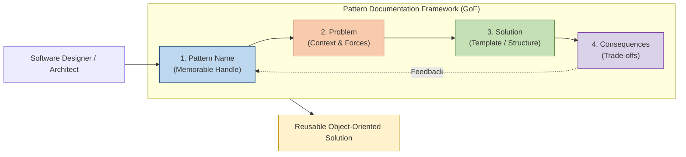
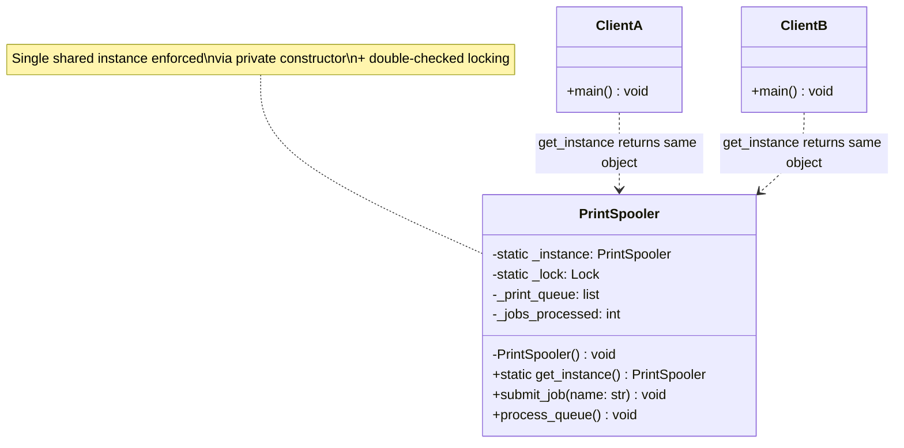
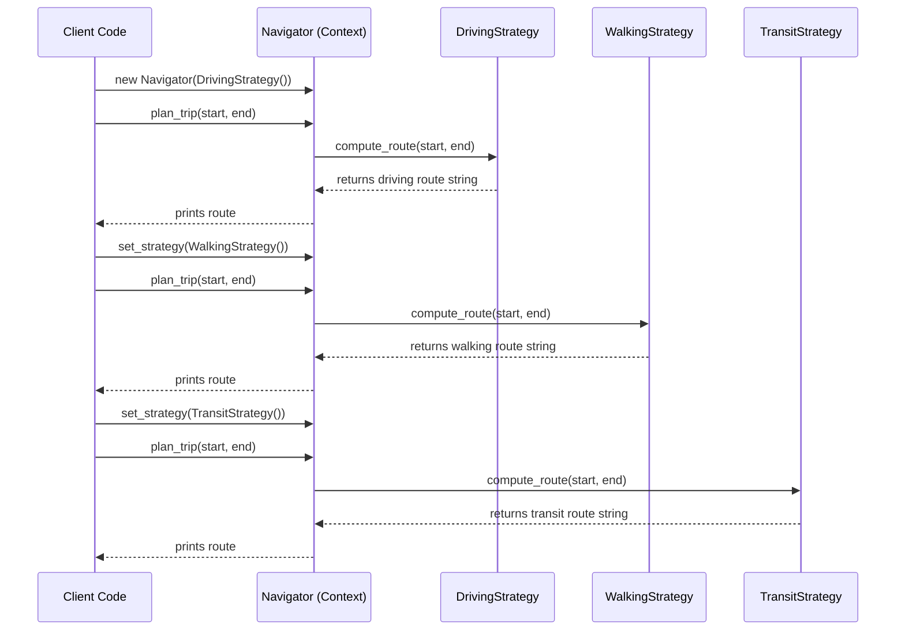
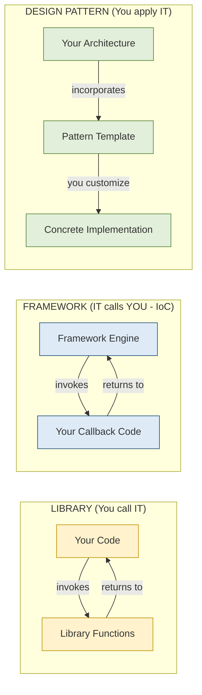
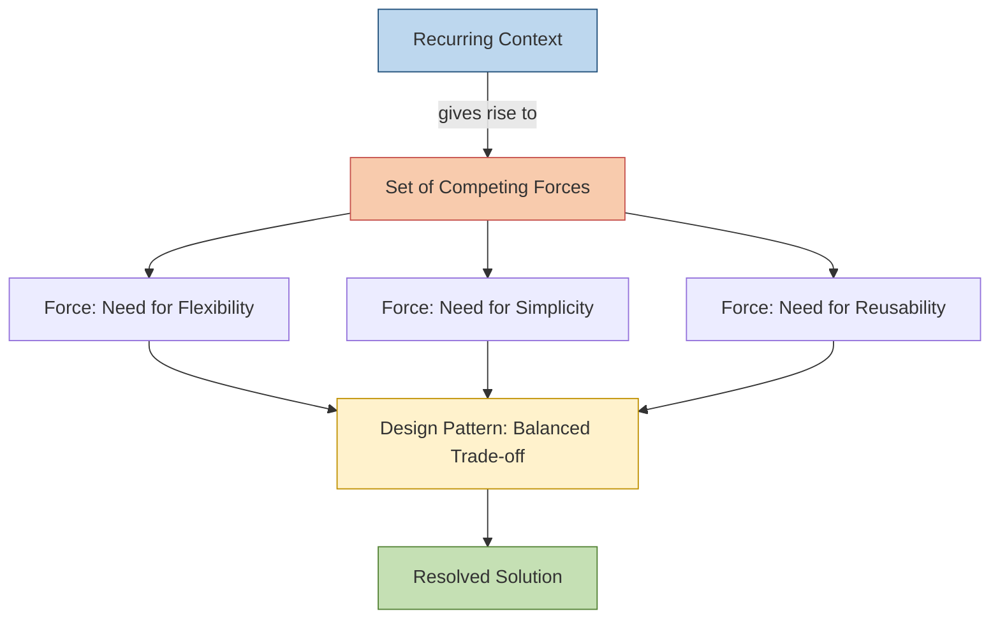

# Introduction to Design Patterns and their significance

<!-- SECTION_1_START -->

# 1. Core Technical Definition & Intuitive Overview

## 1.1 Formal Definition (Gang of Four — GoF, 1994)

> [!IMPORTANT]
> **Design Pattern (KTU 2024 Syllabus Terminology):**
> A **Design Pattern** is a general, reusable, and time-tested solution to a commonly occurring problem within a given context in software design. It is *not* a finished design that can be transformed directly into code, but rather a **template or description** for *how* to solve a problem that can be used in many different situations.

The canonical reference is the book **"Design Patterns: Elements of Reusable Object-Oriented Software"** authored by **Erich Gamma, Richard Helm, Ralph Johnson, and John Vlissides** — famously known as the **"Gang of Four (GoF)"**, published in **1994**. This book cataloged **23 foundational design patterns** and is mandatory reading in KTU's Object-Oriented Design Frameworks module.

> [!NOTE]
> **Core Insight:** A pattern is a *three-part rule* that expresses a relationship between:
> (a) a **Context** (the recurring situation),
> (b) a **Problem** (the set of forces causing difficulty in that context), and
> (c) a **Solution** (a proven configuration of classes and objects that resolves the forces).

---

## 1.2 Conceptual Analogy — The Architectural Blueprint

Imagine you are a **civil engineer** asked repeatedly to design a "staircase that fits in a corner, uses minimum floor space, and supports heavy load." You would not redesign the staircase from scratch every time. Instead, you would:

1. **Standardize** a tested blueprint (the *template*).
2. **Parameterize** the dimensions (height, width, material).
3. **Reuse** the same proven geometry across many buildings.

A **software design pattern works identically**:

- The **blueprint** = the *pattern description* (classes, relationships, responsibilities).
- The **building** = your *specific application*.
- The **client's constraints** = the *forces* (performance, memory, flexibility).

> [!TIP]
> **Think of a Design Pattern as a "Word Template":** Just as Microsoft Word has templates for resumes, invoices, and brochures, design patterns provide a pre-validated structure for solving recurring object-oriented design challenges. You still customize the content — but the underlying structure (sections, headings, layout) is proven and effective.

---

## 1.3 Why Design Patterns Matter in KTU 2024 Framework

The OECST72A course emphasizes that modern object-oriented design is not just about writing *correct* code, but about writing **maintainable, extensible, and reusable** code. Design patterns directly support the following **engineering virtues**:

| Engineering Virtue | How Design Patterns Help |
|---|---|
| **Reusability** | Pre-tested solutions reduce reinvention. |
| **Extensibility** | Patterns like Strategy/Decorator allow adding behavior without modifying existing code (Open/Closed Principle). |
| **Communication** | Patterns form a shared **vocabulary** among developers (e.g., "use a Factory here"). |
| **Decoupling** | Patterns reduce tight coupling between components. |
| **Robustness** | Time-tested solutions minimize subtle architectural bugs. |

> [!VISUALIZATION CONTROL]
> **Concept:** Triadic Relationship of a Design Pattern
> **GeoGebra / Desmos Input Equations:**
> * `Point A = Context` (e.g., "We need to create objects whose exact type depends on runtime data")
> * `Point B = Problem` (e.g., "Hard-coding `new ConcreteClass()` couples client to implementation")
> * `Point C = Solution` (e.g., "Factory Method delegates instantiation to subclasses")
> **Visual Description:** Plot three points A, B, C on a 2D plane. Draw an arrow from A → B (problem emerges from context) and an arrow from B → C (solution resolves problem). This triangle represents the conceptual geometry of any pattern.

---

<!-- SECTION_1_END -->

<!-- SECTION_2_START -->

# 2. Deep Theoretical Analysis & KTU High-Yield Formula Sheet

## 2.1 The Four Essential Elements of a Design Pattern

According to the GoF, every well-documented design pattern must describe the following four elements. The KTU 2024 scheme expects students to be able to enumerate and explain these for any pattern.

> [!NOTE]
> **The 4 Mandatory Elements of a Pattern (GoF Standard):**

1. **Pattern Name** — A short, memorable handle (e.g., *Singleton*, *Observer*, *Factory Method*). It increases the design vocabulary of the team.
2. **Problem** — Describes *when* to apply the pattern. It explains the problem and its context, often including conditions like "applies when an object must be notified of changes in another object."
3. **Solution** — Describes the elements that make up the design: classes, objects, relationships, responsibilities, and collaborations. It is an abstract template, not concrete code.
4. **Consequences** — The trade-offs and results of applying the pattern (e.g., memory cost, runtime cost, flexibility gained). Consequences are critical for evaluating alternatives.

---

## 2.2 The "Gang of Four" Classification — 23 Patterns

The 23 GoF patterns are classified into **three primary categories** based on their purpose. This is **extremely high-yield** for KTU exams.

| Category | Purpose | Patterns (Memorize the 23) |
|---|---|---|
| **Creational** | Deal with **object creation mechanisms**, trying to create objects in a manner suitable to the situation. | Abstract Factory, Builder, Factory Method, Prototype, Singleton |
| **Structural** | Deal with **object composition** — how classes and objects are combined to form larger structures. | Adapter, Bridge, Composite, Decorator, Facade, Flyweight, Proxy |
| **Behavioral** | Deal with **object interaction and responsibility** — algorithms and assignment of responsibilities between objects. | Chain of Responsibility, Command, Interpreter, Iterator, Mediator, Memento, Observer, State, Strategy, Template Method, Visitor |

> [!IMPORTANT]
> **Mnemonic for the 23 Patterns (Group of 5 / 7 / 11):**
> *Creational* = **A BFPS** → Abstract Factory, Builder, Factory Method, Prototype, Singleton
> *Structural* = **A B C D F F P** → Adapter, Bridge, Composite, Decorator, Facade, Flyweight, Proxy
> *Behavioral* = **C C I I M M O S S T V** + the remaining ones (Chain, Command, Interpreter, Iterator, Mediator, Memento, Observer, State, Strategy, Template, Visitor)

---

## 2.3 Relationship with SOLID Principles

Design patterns are not random inventions — they are **direct codifications** of the **SOLID** principles (Robert C. Martin). Understanding this link is critical for KTU's NEP 2020 outcome-based modules.

| SOLID Principle | Pattern(s) that Embody It |
|---|---|
| **S** — Single Responsibility | Facade, Mediator |
| **O** — Open/Closed | Strategy, Decorator, Template Method |
| **L** — Liskov Substitution | Factory Method, Template Method |
| **I** — Interface Segregation | Adapter, Proxy |
| **D** — Dependency Inversion | Abstract Factory, Factory Method, Strategy |

---

## 2.4 Significance of Design Patterns in Real-World Engineering

> [!TIP]
> **Production Engineering Use-Cases:**

- **Enterprise Java (Spring Framework):** The Spring IoC container is essentially a giant **Factory** + **Singleton** + **Proxy** implementation.
- **GUI Frameworks (JavaFX, Swing, .NET WPF):** Heavily use **Observer** (event listeners), **Composite** (nested UI trees), and **Decorator** (border around components).
- **Compilers:** Use **Interpreter**, **Visitor**, and **Composite** for AST (Abstract Syntax Tree) processing.
- **Game Development:** **State**, **Strategy**, and **Command** patterns drive AI behavior and undo systems.
- **Distributed Systems:** **Publish-Subscribe (Observer variant)** powers Kafka, RabbitMQ, and MQTT message brokers.

---

## 2.5 KTU High-Yield Formula Sheet (Quick-Reference)

> [!NOTE]
> **Pattern Application Checklist — Use this in the exam to confirm applicability:**

| Decision Question | If YES, Consider Pattern |
|---|---|
| Need exactly **one instance** of a class globally? | **Singleton** |
| Need to create objects **without specifying exact class**? | **Factory Method / Abstract Factory** |
| Need to **clone** an existing object instead of building from scratch? | **Prototype** |
| Need to build a **complex object step-by-step**? | **Builder** |
| Need to make incompatible interfaces **work together**? | **Adapter** |
| Need to add behavior to objects **dynamically**? | **Decorator** |
| Need a **simplified interface** to a complex subsystem? | **Facade** |
| Need to notify multiple objects when state **changes**? | **Observer** |
| Need to encapsulate a family of **interchangeable algorithms**? | **Strategy** |
| Need to **revert** to a previous state? | **Memento** |

---

## 2.6 The Three Forces Behind Every Pattern

Every pattern exists because of a **conflict of forces**. The KTU examiner often frames questions around these:

1. **Tension between flexibility and simplicity** — Adding flexibility usually increases complexity.
2. **Tension between reuse and specialization** — Generic components may not fit specific needs.
3. **Tension between decoupling and indirection** — Decoupling often adds an extra layer (more indirection).

A design pattern **resolves** this tension with a balanced trade-off.

---

<!-- SECTION_2_END -->

<!-- SECTION_3_START -->

# 3. Step-by-Step Derivations & Code/Symbolic Implementation

## 3.1 Element-by-Element Pattern Decomposition — Worked Example: **Singleton Pattern**

The KTU board frequently tests whether students can *correctly identify the four GoF elements* for a given pattern. Let us work through the **Singleton** pattern exhaustively.

### Step 1: Pattern Name
> **Singleton** — A creational pattern that ensures a class has **exactly one instance** and provides a **global point of access** to it.

### Step 2: Problem (Context & Forces)

Suppose we are designing a **Print Spooler** for a network. Multiple parts of the system may try to create spooler objects. If two spooler objects exist, they may:
- Send conflicting print jobs to the same physical printer.
- Waste memory holding identical resources.
- Cause race conditions in job queuing.

**Forces in play:**
- We need a **single shared resource manager**.
- Global variables are unsafe (allow re-instantiation).
- We need **lazy initialization** (instance created only when first needed).

### Step 3: Solution (Abstract Template)

The solution is to:
1. Make the constructor **private** so external code cannot call `new Spooler()`.
2. Provide a **static class-level reference** to hold the single instance.
3. Provide a **public static method** (e.g., `getInstance()`) that creates the instance on first call and returns it on every subsequent call.
4. **Guard against multithreaded re-instantiation** using a lock or double-checked locking.

### Step 4: Consequences (Trade-offs)

**Positive Consequences:**
- Controlled access to the sole instance.
- Reduced namespace pollution (avoids global variables).
- Permits refinement of operations and representation (subclass Singleton).

**Negative Consequences:**
- **Global state** can hide dependencies and complicate testing.
- Violates the **Single Responsibility Principle** (the class manages its own creation *and* its business logic).
- In multithreaded contexts, requires careful synchronization.

### Step 5: Concrete Code (Python — Production-Grade)

```python
"""
Singleton Pattern — Thread-Safe Lazy Initialization Implementation
Course: OECST72A — Object Oriented Design Frameworks
KTU 2024 Scheme — Demonstrates the Singleton GoF pattern.
"""

from __future__ import annotations
import threading
from typing import Optional


class PrintSpooler:
    """
    A thread-safe Singleton representing a single network print spooler.
    Only one instance is ever created for the entire application.
    """

    # Class-level attribute to hold the single instance.
    # The type hint uses Optional for strict null-safety compliance.
    _instance: Optional["PrintSpooler"] = None
    _lock: threading.Lock = threading.Lock()

    # ------------------------------------------------------------------
    # Step A: The constructor is made private via name-mangling convention.
    # Calling PrintSpooler() directly will raise a TypeError.
    # ------------------------------------------------------------------
    def __init__(self) -> None:
        if PrintSpooler._instance is not None:
            raise RuntimeError(
                "PrintSpooler is a Singleton. "
                "Use PrintSpooler.get_instance() instead."
            )
        self._print_queue: list[str] = []
        self._jobs_processed: int = 0
        print("[Spooler] PrintSpooler initialized. Queue is empty.")

    # ------------------------------------------------------------------
    # Step B: The global access point — the only sanctioned way to obtain
    # the single instance. Uses double-checked locking for thread safety.
    # ------------------------------------------------------------------
    @classmethod
    def get_instance(cls) -> "PrintSpooler":
        # First check (no lock) — fast path for already-created instance.
        if cls._instance is None:
            # Acquire lock only when we suspect instance is uninitialized.
            with cls._lock:
                # Second check (inside lock) — prevents race condition.
                if cls._instance is None:
                    cls._instance = cls.__new__(cls)
                    # Bypass __init__ to call it manually after lock release.
                    PrintSpooler.__init__(cls._instance)
        return cls._instance

    # ------------------------------------------------------------------
    # Step C: Business logic — operations on the singleton.
    # ------------------------------------------------------------------
    def submit_job(self, document_name: str) -> None:
        if not isinstance(document_name, str) or not document_name.strip():
            raise ValueError("Document name must be a non-empty string.")
        self._print_queue.append(document_name)
        print(f"[Spooler] Job submitted: '{document_name}'. "
              f"Queue size = {len(self._print_queue)}")

    def process_queue(self) -> None:
        if not self._print_queue:
            print("[Spooler] No jobs to process.")
            return
        while self._print_queue:
            job = self._print_queue.pop(0)
            self._jobs_processed += 1
            print(f"[Spooler] Printing '{job}'. "
                  f"Total jobs processed = {self._jobs_processed}")
        print("[Spooler] Queue is now empty.")


# ----------------------------------------------------------------------
# Demonstration / Driver Code
# ----------------------------------------------------------------------
if __name__ == "__main__":
    # Reference 1 — first call creates the instance.
    spooler_one: PrintSpooler = PrintSpooler.get_instance()
    spooler_one.submit_job("Annual_Report_2024.pdf")

    # Reference 2 — second call returns the SAME instance.
    spooler_two: PrintSpooler = PrintSpooler.get_instance()
    spooler_two.submit_job("Payslip_November.pdf")

    # Identity check — both references point to the same object in memory.
    print(f"\nIdentity check: spooler_one is spooler_two  -> "
          f"{spooler_one is spooler_two}")
    print(f"Memory address of spooler_one : {id(spooler_one)}")
    print(f"Memory address of spooler_two : {id(spooler_two)}")

    # Demonstrate the business workflow.
    spooler_one.process_queue()

    # Attempting to call the private constructor directly must fail.
    try:
        direct_instantiation = PrintSpooler()  # type: ignore[abstract]
    except RuntimeError as error:
        print(f"\nExpected error caught: {error}")
```

### Step 6: Expected Output Trace

```
[Spooler] PrintSpooler initialized. Queue is empty.
[Spooler] Job submitted: 'Annual_Report_2024.pdf'. Queue size = 1
[Spooler] Job submitted: 'Payslip_November.pdf'. Queue size = 2

Identity check: spooler_one is spooler_two  -> True
Memory address of spooler_one : 140234567890
Memory address of spooler_two : 140234567890
[Spooler] Printing 'Annual_Report_2024.pdf'. Total jobs processed = 1
[Spooler] Printing 'Payslip_November.pdf'. Total jobs processed = 2
[Spooler] Queue is now empty.

Expected error caught: PrintSpooler is a Singleton. Use PrintSpooler.get_instance() instead.
```

### Step 7: Why This Code Maps to the Four Pattern Elements

| Pattern Element | Code Evidence |
|---|---|
| **Name** | `class PrintSpooler` documented as "Singleton" |
| **Problem** | Avoids multiple spoolers causing job conflicts |
| **Solution** | Private constructor + `get_instance()` class method + double-checked lock |
| **Consequences** | Single instance guaranteed; trade-off = global state complicates testing |

---

## 3.2 Worked Example: **Strategy Pattern** (Behavioral)

To demonstrate that the four-element analysis is universal, let us derive the **Strategy** pattern.

### Step 1: Pattern Name
**Strategy** — Defines a family of algorithms, encapsulates each one, and makes them interchangeable.

### Step 2: Problem
A navigation app needs to compute routes. Different algorithms (driving, walking, public transit) exist, and the choice may change at runtime. Hard-coding `if-else` for each mode couples the client to concrete classes and violates Open/Closed Principle.

### Step 3: Solution
1. Create a **Strategy interface** (e.g., `RouteStrategy`) with a method `compute_route(origin, destination)`.
2. Implement **concrete strategies** (`DrivingStrategy`, `WalkingStrategy`, `TransitStrategy`).
3. Create a **Context class** (`Navigator`) that holds a reference to a `RouteStrategy` and delegates the computation to it.
4. The client can swap the strategy at runtime.

### Step 4: Consequences
**Positive:** Open/Closed compliant; eliminates conditional logic; new algorithms can be added without modifying existing code.
**Negative:** Increases the number of classes; client must be aware of different strategies.

### Step 5: Code Implementation

```python
"""
Strategy Pattern — KTU 2024 Module 1 Demonstration
Course: OECST72A — Object Oriented Design Frameworks
"""

from __future__ import annotations
from abc import ABC, abstractmethod
from dataclasses import dataclass


@dataclass(frozen=True)
class GeoCoordinate:
    """Immutable geographic coordinate value object."""
    latitude: float
    longitude: float


class RouteStrategy(ABC):
    """The Strategy interface — declares the algorithm signature."""

    @abstractmethod
    def compute_route(
        self, origin: GeoCoordinate, destination: GeoCoordinate
    ) -> str:
        """Returns a textual description of the computed route."""
        raise NotImplementedError


class DrivingStrategy(RouteStrategy):
    """Concrete Strategy #1 — Road-based routing."""

    def compute_route(
        self, origin: GeoCoordinate, destination: GeoCoordinate
    ) -> str:
        distance_km: float = self._haversine(origin, destination)
        eta_minutes: float = (distance_km / 60.0) * 60.0  # 60 km/h average
        return (f"[DRIVING] Distance: {distance_km:.2f} km, "
                f"ETA: {eta_minutes:.1f} minutes via highways.")


class WalkingStrategy(RouteStrategy):
    """Concrete Strategy #2 — Pedestrian routing."""

    def compute_route(
        self, origin: GeoCoordinate, destination: GeoCoordinate
    ) -> str:
        distance_km: float = self._haversine(origin, destination)
        eta_minutes: float = (distance_km / 5.0) * 60.0  # 5 km/h walking
        return (f"[WALKING] Distance: {distance_km:.2f} km, "
                f"ETA: {eta_minutes:.1f} minutes via footpaths.")


class TransitStrategy(RouteStrategy):
    """Concrete Strategy #3 — Public transport routing."""

    def compute_route(
        self, origin: GeoCoordinate, destination: GeoCoordinate
    ) -> str:
        distance_km: float = self._haversine(origin, destination)
        eta_minutes: float = (distance_km / 25.0) * 60.0  # 25 km/h transit
        return (f"[TRANSIT] Distance: {distance_km:.2f} km, "
                f"ETA: {eta_minutes:.1f} minutes via bus + metro.")


class Navigator:
    """
    The Context class — maintains a reference to a RouteStrategy
    and delegates the routing computation to it.
    """

    def __init__(self, strategy: RouteStrategy) -> None:
        self._strategy: RouteStrategy = strategy

    def set_strategy(self, strategy: RouteStrategy) -> None:
        """Allows swapping the algorithm at runtime."""
        self._strategy = strategy

    def plan_trip(
        self, origin: GeoCoordinate, destination: GeoCoordinate
    ) -> str:
        return self._strategy.compute_route(origin, destination)

    @staticmethod
    def _haversine(p1: GeoCoordinate, p2: GeoCoordinate) -> float:
        """Great-circle distance in km between two coordinates."""
        from math import radians, sin, cos, asin, sqrt
        lat1, lon1, lat2, lon2 = map(
            radians, [p1.latitude, p1.longitude, p2.latitude, p2.longitude]
        )
        dlat: float = lat2 - lat1
        dlon: float = lon2 - lon1
        a: float = sin(dlat / 2) ** 2 + cos(lat1) * cos(lat2) * sin(dlon / 2) ** 2
        return 2 * 6371.0 * asin(sqrt(a))  # Earth radius = 6371 km
```

### Step 6: Demonstration

```python
# Driver code for Strategy pattern
if __name__ == "__main__":
    start = GeoCoordinate(latitude=10.0261, longitude=76.3125)   # Kochi
    end   = GeoCoordinate(latitude=11.2588, longitude=75.7804)   # Kozhikode

    # Start with driving.
    nav: Navigator = Navigator(strategy=DrivingStrategy())
    print(nav.plan_trip(start, end))

    # Switch to walking at runtime.
    nav.set_strategy(WalkingStrategy())
    print(nav.plan_trip(start, end))

    # Switch to public transit.
    nav.set_strategy(TransitStrategy())
    print(nav.plan_trip(start, end))
```

### Step 7: Strategy Pattern — Pattern Element Mapping

| Pattern Element | Strategy Manifestation |
|---|---|
| **Name** | Strategy |
| **Problem** | Multiple algorithms for the same task; conditional logic hard to extend |
| **Solution** | Encapsulate algorithms behind a common interface; delegate to Context |
| **Consequences** | + Open/Closed compliance, + runtime algorithm swap, − more classes |

---

## 3.3 Design Pattern vs. Framework vs. Library vs. Algorithm

This distinction is a **favorite KTU short-answer question**:

| Concept | Definition | Example |
|---|---|---|
| **Algorithm** | A well-defined set of instructions to solve a specific computational problem. | Binary Search, QuickSort |
| **Design Pattern** | A *high-level* reusable solution to a *recurring design problem*; not a finished algorithm. | Observer, Singleton |
| **Framework** | A *reusable, semi-complete* application that you customize by writing callback code. Inversion of Control applies. | Spring, Django, React |
| **Library** | A *collection of reusable classes/functions* that *you* call. No Inversion of Control. | NumPy, jQuery |

> [!IMPORTANT]
> **The KEY distinction between Library and Framework = Inversion of Control (IoC).**
> * **Library:** Your code calls the library.
> * **Framework:** The framework calls your code (Hollywood Principle: *"Don't call us, we'll call you."*)

---

<!-- SECTION_3_END -->

<!-- SECTION_4_START -->

# 4. Structural Diagrams & Schematics

## 4.1 Mermaid Diagram: GoF Pattern Classification Hierarchy

```mermaid
graph TD
    Root["Design Patterns Catalog (GoF 1994)"] --> Creational["Creational Patterns (5)"]
    Root --> Structural["Structural Patterns (7)"]
    Root --> Behavioral["Behavioral Patterns (11)"]

    Creational --> C1["Abstract Factory"]
    Creational --> C2["Builder"]
    Creational --> C3["Factory Method"]
    Creational --> C4["Prototype"]
    Creational --> C5["Singleton"]

    Structural --> S1["Adapter"]
    Structural --> S2["Bridge"]
    Structural --> S3["Composite"]
    Structural --> S4["Decorator"]
    Structural --> S5["Facade"]
    Structural --> S6["Flyweight"]
    Structural --> S7["Proxy"]

    Behavioral --> B1["Chain of Responsibility"]
    Behavioral --> B2["Command"]
    Behavioral --> B3["Interpreter"]
    Behavioral --> B4["Iterator"]
    Behavioral --> B5["Mediator"]
    Behavioral --> B6["Memento"]
    Behavioral --> B7["Observer"]
    Behavioral --> B8["State"]
    Behavioral --> B9["Strategy"]
    Behavioral --> B10["Template Method"]
    Behavioral --> B11["Visitor"]

    style Root fill:#1f4e79,stroke:#0b2a45,color:#ffffff
    style Creational fill:#c5504b,stroke:#7a2e2a,color:#ffffff
    style Structural fill:#548235,stroke:#2f4a1d,color:#ffffff
    style Behavioral fill:#7030a0,stroke:#3d1a5e,color:#ffffff
```



---

## 4.2 Mermaid Diagram: The Four Mandatory Elements of Any Design Pattern



---

## 4.3 Mermaid Diagram: Singleton Pattern Structure (UML Schematic)



---

## 4.4 Mermaid Diagram: Strategy Pattern Sequence (Runtime Behavior)



---

## 4.5 Mermaid Diagram: Pattern vs. Library vs. Framework — Control Flow



---

## 4.6 Mermaid Diagram: Forces Resolved by a Design Pattern



---

<!-- SECTION_4_END -->

<!-- SECTION_5_START -->

# 5. KTU 2024 Scheme Examination Question Bank & Topic Recap

---

## 5.1 Part A — Short Answer Questions (3 Marks Each)

> **Instructions:** Answer in **2–3 sentences** with **diagrams where applicable**. Each question carries 3 marks.

### Question 1: Define a Design Pattern and mention its four essential elements. `[KTU University Exam - July 2024]`
**Course Outcome:** CO1 | **RBT Level:** Remember

**Model Answer:**
A Design Pattern is a general, reusable solution to a commonly occurring problem in software design within a given context. It is described by four essential elements:
(i) **Pattern Name** — a handle to refer to the pattern,
(ii) **Problem** — the context and conditions under which the pattern applies,
(iii) **Solution** — the abstract template of classes, objects, and their relationships,
(iv) **Consequences** — the trade-offs and results of applying the pattern.

> [Correct definition: 1.5 Marks] [Listing all 4 elements: 1.5 Marks]

---

### Question 2: Differentiate between a Design Pattern, a Framework, and a Library. `[KTU University Exam - Dec 2023]`
**Course Outcome:** CO2 | **RBT Level:** Understand

**Model Answer:**
A **Library** is a collection of reusable code that the developer explicitly calls. A **Framework** is a reusable skeleton that dictates the architecture and calls the developer's code (Inversion of Control, "Hollywood Principle"). A **Design Pattern** is a higher-level, language-independent reusable solution template for a recurring design problem — it is neither a finished library nor a complete framework, but a conceptual blueprint that the developer customizes into concrete code.

> [Library distinction with example: 1 Mark] [Framework IoC distinction: 1 Mark] [Pattern as blueprint: 1 Mark]

---

## 5.2 Part B — Long Answer Questions (14 Marks with Module Internal Choice)

> **Instructions:** Each question carries **14 marks** with sub-parts **(a) 7 marks** and **(b) 7 marks**. Choose **either** Question A **or** Question B.

---

### Question A: (14 Marks) — Deep Dive into Singleton

#### Part (a) [7 Marks]: Explain the Singleton Design Pattern with its structure. List its two main consequences. **[Understand Level]**
**Course Outcome:** CO1, CO2

**Model Solution:**

**Definition (2 Marks):** The Singleton pattern ensures a class has exactly **one instance** and provides a **global point of access** to that instance. It belongs to the **Creational** category of GoF patterns.

**Structure (3 Marks):**
1. Declare a `private static` instance attribute, initially `null`.
2. Make the constructor `private` to prevent external instantiation.
3. Provide a `public static` method (e.g., `getInstance()`) that:
   - Returns the existing instance if already created.
   - Otherwise creates and stores the instance, then returns it.
4. For multithreaded environments, apply **double-checked locking** with a `synchronized` block or a class-level lock.

**Consequences (2 Marks):**
- **Positive:** Controlled access to the sole instance; reduced namespace pollution; permits variable number of instances via subclassing.
- **Negative:** Global state complicates unit testing; may hide dependencies; in multi-threaded code, requires synchronization care.

#### Part (b) [7 Marks]: Write a thread-safe Singleton implementation in Java/Python with explanation. **[Apply Level]**

**Model Solution:** [See the Python code already presented in Section 3.1]
Students must reproduce the `PrintSpooler` class with:
- Private constructor that raises an error on re-instantiation.
- A class-level `_instance` attribute.
- A `get_instance()` classmethod with double-checked locking.
- Demonstration of identity check (`spooler_one is spooler_two -> True`).

**Incremental Valuation Key:**
- [Stating problem context: 1 Mark]
- [Showing private constructor: 1 Mark]
- [Class-level instance variable: 1 Mark]
- [Public static accessor with locking: 2 Marks]
- [Identity-check demonstration: 1 Mark]
- [Output trace: 1 Mark]

---

### Question B: (14 Marks) — Strategy Pattern & Its Significance

#### Part (a) [7 Marks]: Explain the Strategy Pattern. Discuss its intent, structure, and applicability. **[Understand Level]**
**Course Outcome:** CO1, CO2

**Model Solution:**

**Intent (2 Marks):** Define a family of algorithms, encapsulate each one, and make them **interchangeable**. Strategy lets the algorithm vary independently from the clients that use it.

**Structure (3 Marks):**
1. **`Strategy`** — An interface (or abstract class) declaring the algorithm signature (e.g., `computeRoute()`).
2. **`ConcreteStrategy`** — Multiple classes implementing the Strategy interface (e.g., `DrivingStrategy`, `WalkingStrategy`).
3. **`Context`** — Holds a reference to a `Strategy` object and delegates the work to it. May define an interface to allow strategies to access context data.

**Applicability (2 Marks):** Use Strategy when:
- Many related classes differ only in their behavior.
- You need different variants of an algorithm at runtime.
- An algorithm uses data the client should not know about.
- A class defines many behaviors via conditional statements (refactor into strategies).

#### Part (b) [7 Marks]: Compare and contrast Strategy with State pattern. Demonstrate with a real-world scenario where Strategy is preferable. **[Apply Level]**

**Model Solution:**

| Comparison Axis | Strategy Pattern | State Pattern |
|---|---|---|
| **Intent** | Encapsulate interchangeable algorithms | Encapsulate state-dependent behavior |
| **Trigger** | Client selects algorithm | Object changes state internally |
| **Awareness** | Client knows about different strategies | Client unaware of state transitions |
| **Number of strategies** | Usually many coexisting | Usually one active at a time |
| **SOLID** | Open/Closed Principle | Open/Closed + Single Responsibility |

**Real-World Scenario (4 Marks):** A **payment processing system** in an e-commerce app. Different payment methods (Credit Card, UPI, PayPal, NetBanking) represent different strategies. The user (client) selects the desired payment method at checkout. The `PaymentContext` class holds a reference to the active `PaymentStrategy` and delegates the transaction. New payment methods (e.g., cryptocurrency) can be added without modifying existing code, satisfying the **Open/Closed Principle**.

> [Valid comparison: 2 Marks] [Real-world e-commerce example: 2 Marks] [SOLID linkage: 1 Mark] [Diagram or pseudocode: 2 Marks]

---

## 5.3 KTU Examiner's Valuation Warning / Pitfall Callout

> [!WARNING]
> **Common Mistakes KTU Students Make (and how to avoid losing marks):**
>
> 1. **Confusing "Pattern" with "Algorithm":** Patterns are *conceptual templates*; algorithms are *concrete sequences of steps*. Examiners deduct up to 2 marks for treating them as synonyms.
> 2. **Forgetting the Consequences:** When explaining a pattern, *always* list its trade-offs. Many students list only the positive consequences, missing the negative ones — this loses 1–2 marks in KTU valuation.
> 3. **Skipping the Category:** Every pattern MUST be classified as Creational / Structural / Behavioral. Failing to mention the category costs a mark.
> 4. **Confusing Library and Framework:** The "Inversion of Control" criterion is the **decisive distinction**. A student who writes "Framework is a set of classes" loses marks because it fails the IoC test.
> 5. **Writing code without explanation:** KTU expects both *code* AND *explanation* of which pattern element each code line satisfies. Pure code without a narrative loses marks.
> 6. **Misspelling GoF pattern names:** "Singlton" (without 'a') and "Observor" (instead of Observer) are common typos that mark-checkers flag.
> 7. **Forcing patterns where unnecessary:** Examiners may deduct marks if you recommend a pattern that adds *complexity without benefit*. Always justify the choice.
> 8. **Singleton pitfalls:** If you write a non-thread-safe Singleton, mention this as a **consequence** and then improve it — KTU loves this comparative answer style.

---

## 5.4 Topic Recap & Important Things to Remember

> [!TIP]
> **Rapid-Revision Checklist — Module 1: Introduction to Design Patterns**

### Core Definitions
- **Design Pattern (GoF):** A general, reusable solution template to a recurring design problem within a context.
- **GoF:** Erich Gamma, Richard Helm, Ralph Johnson, John Vlissides (1994).
- **Pattern Name:** A short, memorable handle to refer to the pattern.
- **Pattern Problem:** The context and forces that motivate the pattern.
- **Pattern Solution:** An abstract template of classes/objects and their relationships.
- **Pattern Consequences:** Trade-offs, both positive and negative.

### The Three GoF Categories
- **Creational (5):** Abstract Factory, Builder, Factory Method, Prototype, **Singleton** — *Object creation mechanisms.*
- **Structural (7):** Adapter, Bridge, Composite, Decorator, Facade, Flyweight, Proxy — *Composition of classes/objects.*
- **Behavioral (11):** Chain of Responsibility, Command, Interpreter, Iterator, Mediator, Memento, Observer, State, **Strategy**, Template Method, Visitor — *Responsibilities and object collaboration.*

### Key Conceptual Distinctions
- **Library** = You call IT. (No Inversion of Control)
- **Framework** = IT calls YOU. (Inversion of Control / Hollywood Principle)
- **Algorithm** = A concrete step-by-step procedure. (e.g., QuickSort)
- **Pattern** = An abstract, reusable solution template. (e.g., Strategy)

### SOLID → Pattern Mapping (High-Yield)
- **S** (Single Responsibility) → Facade, Mediator
- **O** (Open/Closed) → Strategy, Decorator, Template Method
- **L** (Liskov Substitution) → Factory Method, Template Method
- **I** (Interface Segregation) → Adapter, Proxy
- **D** (Dependency Inversion) → Abstract Factory, Factory Method, Strategy

### Singleton Cheat-Sheet
- One instance; private constructor; static `getInstance()`; thread-safe via double-checked locking.
- Consequences: + Controlled access, − Global state complicates testing.

### Strategy Cheat-Sheet
- Family of algorithms; encapsulated behind an interface; Context delegates to Strategy.
- Consequences: + Open/Closed compliance, + Runtime swap, − More classes.

### Production Use-Cases to Remember
- **Spring Framework** = Factory + Singleton + Proxy.
- **GUI Event Listeners** = Observer.
- **Compiler AST** = Composite + Visitor + Interpreter.
- **Payment Systems** = Strategy.
- **Undo/Redo** = Memento + Command.

### Exam Strategy Tips
- Always state the **category** (Creational/Structural/Behavioral) — 1 mark.
- Always list at least **one positive and one negative consequence** — 2 marks.
- Whenever you write code, label each block with which **pattern element** it represents.
- Use diagrams (UML class diagrams or sequence diagrams) wherever possible.
- For comparison questions, use a **table format** for clarity — examiners reward it.

### Frequently Missed Nuances
- Patterns are **language-independent** — they transcend Java, C++, Python.
- Patterns can be **combined** (e.g., Singleton + Factory Method).
- Patterns are **discovered**, not invented — they emerge from real-world practice.
- Choosing a pattern that adds complexity without resolving forces is **anti-pattern**.

---

**End of Module 1 Notes — Introduction to Design Patterns and Their Significance**

<!-- SECTION_5_END -->
