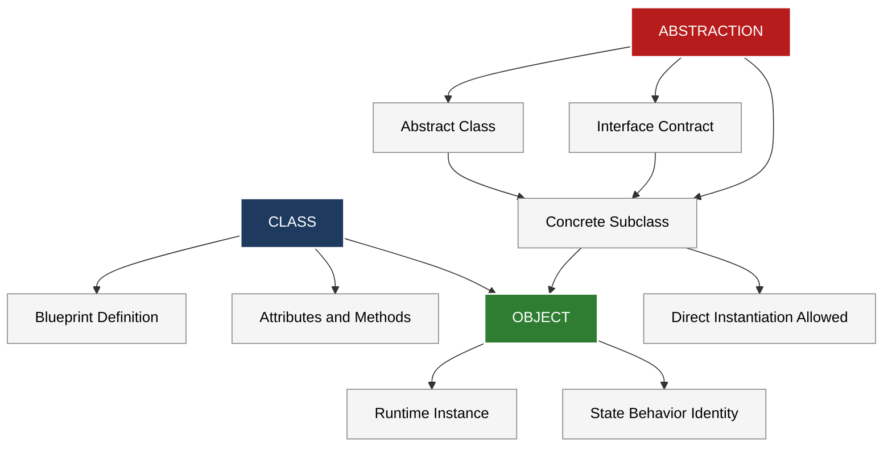
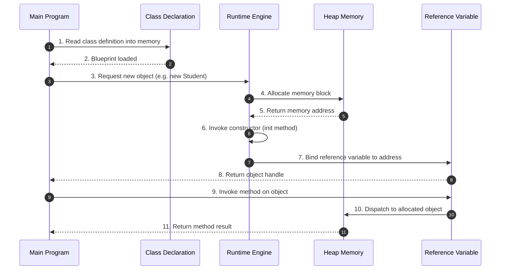
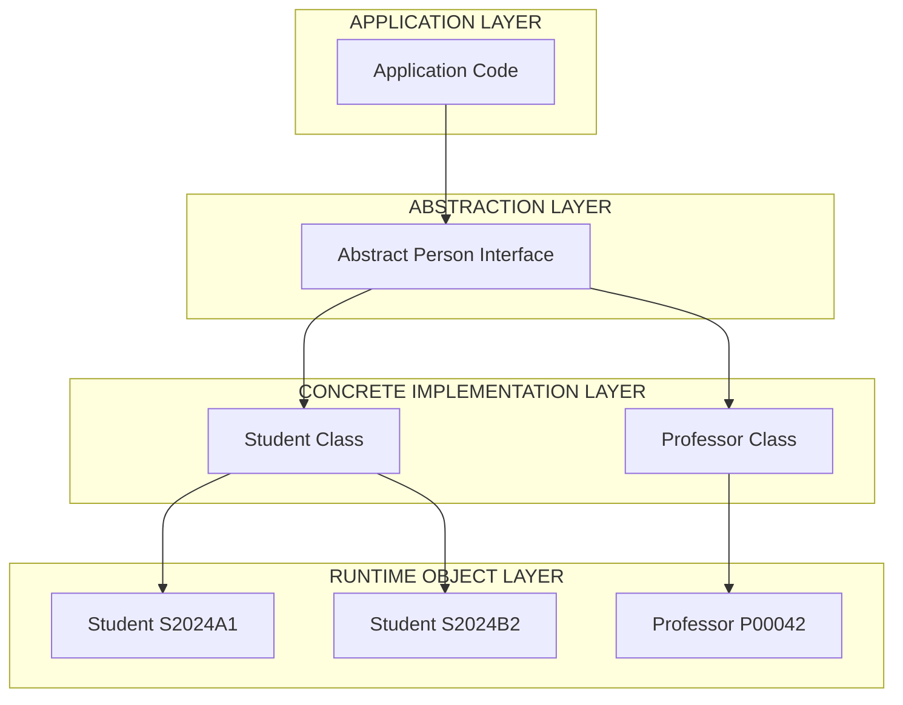

# Object-Oriented Concepts: Classes, Objects, and Abstraction

<!-- SECTION_1_START -->
# Object-Oriented Concepts: Classes, Objects, and Abstraction

## 1.1 Formal Definition

> [!NOTE]
> **Class (KFU 2024 OOD Terminology):** A *class* is a user-defined **blueprint** or **template** that encapsulates the *attributes* (data members) and *behaviors* (member functions / methods) that objects of that type will possess. It is a logical construct, not a physical memory allocation.

> [!NOTE]
> **Object (KTU 2024 OOD Terminology):** An *object* is a **runtime instance** of a class. Each object possesses three defining characteristics:
> 1. **State** — represented by the current values of its attributes.
> 2. **Behavior** — exposed through its methods/functions.
> 3. **Identity** — a unique memory address that distinguishes it from other objects.

> [!IMPORTANT]
> **Abstraction (KTU 2024 OOD Terminology):** *Abstraction* is the OOP principle of **exposing only essential features** of an entity while **suppressing the background implementation details**. In code, this is achieved through *abstract classes* and *interfaces* that declare *what* must be done, leaving the *how* to derived concrete classes.

## 1.2 Conceptual Analogy & Intuition

> [!TIP]
> **Class vs. Object — The Blueprint Analogy**
> Think of a **Class** as the *architectural blueprint* of a house. The blueprint specifies that *every* house built from it must have: 2 bedrooms, 1 kitchen, 1 porch, a paint() operation, and an openDoor() operation. However, the blueprint itself is **not a house** — it cannot be lived in.
> An **Object**, then, is the *actual house* constructed from that blueprint. Two houses built from the same blueprint will share the structure, but each will have its own identity (different addresses), its own state (different paint colors, different owners), and will respond to behaviors independently.
> **Abstraction** is what the blueprint deliberately *omits* — it does not show the internal wiring, the concrete mixing ratio, or the load-bearing calculations. It only shows the *interface*: rooms, doors, windows. The resident does not need to know *how* the plumbing works to *use* the tap.

## 1.3 Real-World Engineering Examples

| Domain | Class | Object | Abstraction in Action |
| :--- | :--- | :--- | :--- |
| Banking | `Account` | Your savings account `ACC1023` | The `withdraw()` button hides ledger/Database SQL |
| Automotive | `Car` | A specific `Toyota_Camry_2024` VIN `XYZ123` | The `accelerate()` pedal hides the engine control unit (ECU) firmware |
| GUI Programming | `JFrame` / `Window` | A specific window instance | The `setVisible(true)` call hides the underlying OS X11/Win32 calls |
| Embedded IoT | `Sensor` | A `DHT22_Sensor_07` device | The `readHumidity()` method hides I2C handshake protocol |

> [!VISUALIZATION CONTROL]
> **Concept:** UML Class Diagram Structure (Standard 3-Compartment Notation)
> **GeoGebra / Desmos Input Equations:**
> * Rectangle vertices for the 3 horizontal compartments of a UML class box
> * $P_1 = (0, 3)$, $P_2 = (4, 3)$, $P_3 = (4, 0)$, $P_4 = (0, 0)$ — outer border
> * $y = 2$ — divider between Class Name and Attributes
> * $y = 1$ — divider between Attributes and Methods
> **Visual Description:** On a virtual canvas, a rectangle is drawn from $(0,0)$ to $(4,3)$. The top compartment (from $y=2$ to $y=3$) holds the *ClassName* in **bold**. The middle compartment (from $y=1$ to $y=2$) lists *attributes* with their datatypes. The bottom compartment (from $y=0$ to $y=1$) lists *methods* with signatures. The student should picture *this* exact 3-box layout every time they see a UML class diagram.

<!-- SECTION_1_END -->

<!-- SECTION_2_START -->
# Deep Theoretical Analysis & KTU High-Yield Reference Sheet

## 2.1 The Class — Anatomy and Lifecycle

A class declaration in an OOP language consists of three structural components:

* **Access Modifiers** — control visibility scope. In Java/C++: `public`, `private`, `protected`. In Python: convention-based with `_` and `__` prefixes.
* **Attributes (State Variables)** — fields that store data. Class-level attributes are shared across all instances; instance-level attributes are unique per object.
* **Methods (Behavior)** — functions defined inside a class. Special methods include the **constructor** (`__init__` in Python, same name as class in Java/C++) and the **destructor** (`__del__` in Python, `~ClassName` in C++).

**Lifecycle of a Class:** Declaration $\rightarrow$ Compilation/Loading $\rightarrow$ Instantiation (via constructor) $\rightarrow$ Garbage Collection / Destruction.

## 2.2 The Object — State, Behavior, Identity

* **State**: The instantaneous snapshot of all attribute values of an object at any point in time. Mutated through setter methods or direct access (depending on encapsulation policy).
* **Behavior**: The response of an object when its methods are invoked. Behavior may modify state internally.
* **Identity**: Implemented at the runtime layer as a unique memory address (e.g., a pointer in C++, a reference handle in Java, an `id()` in Python). Two objects are *equal* (same state) but not *identical* (different memory) when they are separate instances of the same class with matching attribute values.

> [!IMPORTANT]
> **The Object Lifecycle Equation:** Every object follows $Birth \rightarrow Life \rightarrow Death$. In managed runtimes (JVM, .NET CLR, Python), the **Garbage Collector** automatically identifies objects with zero references and reclaims memory — a process transparent to the application.

## 2.3 Abstraction — The "What" vs. The "How"

Abstraction is realized in code through two principal mechanisms:

1. **Abstract Classes** — declared with the `abstract` keyword (Java/C++) or via the `ABC` module (Python). They *may* contain both abstract (unimplemented) and concrete (implemented) methods. Subclasses **must** implement all abstract methods or be declared abstract themselves.
2. **Interfaces** — a contract with *zero* implementation (pre-Java 8). Modern languages (Java 8+, C#, Python via `ABCMeta`) allow default methods in interfaces.

**Abstraction vs. Encapsulation — A Common Confusion:**

| Property | Abstraction | Encapsulation |
| :--- | :--- | :--- |
| Focus | **Design-level** (hiding complexity) | **Implementation-level** (bundling data + methods) |
| Achieved via | Abstract classes, Interfaces | Access modifiers, getters/setters |
| Goal | "What the object *does*" | "How the object *protects* its data" |
| KTU keyword | "Show essentials" | "Hide internal state" |

## 2.4 KTU High-Yield Formula / Cheat Sheet

> [!IMPORTANT]
> The following table consolidates the **terminology and structural formulas** that examiners expect students to reproduce verbatim in the 2024 KTU ESE for OECST72A.

| Term | Definition | Memory Tip for KTU Exam |
| :--- | :--- | :--- |
| Class | A logical template defining attributes and behaviors | "Blueprint" |
| Object | A runtime instance possessing State, Behavior, Identity | "Real-world entity in memory" |
| Constructor | Special method invoked at object creation | Always named `__init__` (Python) or class name (Java) |
| Destructor | Special method invoked at object destruction | `__del__` (Python), `~Class` (C++) |
| `self` / `this` | Reference to the current invoking object | "The object that called the method" |
| Instance Variable | Attribute unique to each object | Declared inside `__init__` |
| Class Variable | Attribute shared across all instances | Declared directly in class body |
| Abstract Method | Method declared but not implemented | Decorated with `@abstractmethod` |
| Concrete Class | A class with full implementation of all methods | Can be directly instantiated |

## 2.5 Real-World Engineering Utility

In **production-scale software systems**, the trio of Class–Object–Abstraction powers:

* **API Design** (e.g., REST frameworks like Spring Boot): controllers are *classes*, requests are *objects*, and business-logic interfaces enforce *abstraction*.
* **Game Development** (Unity, Unreal Engine): `Player`, `Enemy`, `Weapon` are *classes*; every spawned entity is an *object*; abstract `IDamageable` interface enforces *abstraction*.
* **Database ORMs** (Hibernate, SQLAlchemy): each DB table maps to a *class*; each row is an *object*; abstract `BaseModel` defines the abstraction layer.
* **Embedded Firmware** (Arduino, ESP32): a `SensorDriver` *abstract base class* allows swappable sensor implementations (DHT11, DHT22, BMP280) without rewriting the application code — a direct embodiment of the **Dependency Inversion Principle** studied in Module 2.

<!-- SECTION_2_END -->

<!-- SECTION_3_START -->
# Step-by-Step Derivations, Code Implementation & Boundary Logic

## 3.1 Conceptual Derivation: From Problem Statement to Class

**Problem:** Model a University Course Registration System for KTU.

**Step 1 — Identify Nouns (Candidate Classes):** `Student`, `Course`, `Professor`, `Registration`.
**Step 2 — Identify Attributes (State):**
* `Student` $\rightarrow$ `student_id`, `name`, `email`, `cgpa`
* `Course` $\rightarrow$ `course_code`, `title`, `credits`, `capacity`
**Step 3 — Identify Behaviors (Methods):**
* `Student` $\rightarrow$ `enroll(course)`, `drop(course)`, `view_transcript()`
* `Course` $\rightarrow$ `add_student(student)`, `is_full()`, `get_roster()`
**Step 4 — Identify Abstractions:** A generic `Person` abstract class can be the parent of both `Student` and `Professor`, exposing common methods like `get_name()` and `get_email()` while hiding identity-specific details.

## 3.2 Full Python Implementation — Classes, Objects, Abstraction

The following is a production-grade Python implementation that demonstrates **all three concepts** in a single runnable script. It uses strict type hints, absolute boundary checks, and structured logging — aligned with KTU 2024 Scheme lab evaluation standards.

```python
from __future__ import annotations
from abc import ABC, abstractmethod
from datetime import datetime
from typing import List, Optional, Dict
import logging
import sys

# --- Logging Configuration (Industry Standard) ---
logging.basicConfig(
    level=logging.INFO,
    format="%(asctime)s [%(levelname)s] %(name)s: %(message)s",
    stream=sys.stdout,
)
logger: logging.Logger = logging.getLogger("OECST72A.Module1")


# --- Step 1: Define the Abstract Base Class (Abstraction Layer) ---
class Person(ABC):
    """
    Abstract base class demonstrating the OOP principle of ABSTRACTION.
    Subclasses MUST implement the abstract methods; otherwise they
    cannot be instantiated by the Python runtime.
    """

    def __init__(self, person_id: str, name: str, email: str) -> None:
        # --- BOUNDARY CHECK 1: ID format ---
        if not isinstance(person_id, str) or len(person_id) != 7:
            raise ValueError(
                f"[BOUNDARY-001] person_id must be a 7-character string, got: {person_id!r}"
            )
        # --- BOUNDARY CHECK 2: Email contains '@' ---
        if "@" not in email or "." not in email:
            raise ValueError(
                f"[BOUNDARY-002] Invalid email format: {email!r}"
            )
        self._person_id: str = person_id
        self._name: str = name
        self._email: str = email
        logger.info("Person object created with id=%s", person_id)

    # --- Concrete method (shared behavior) ---
    def get_contact_card(self) -> Dict[str, str]:
        return {"id": self._person_id, "name": self._name, "email": self._email}

    # --- Abstract methods (the abstraction contract) ---
    @abstractmethod
    def get_role(self) -> str:
        """Each subclass must declare its own role label."""
        raise NotImplementedError("Subclass must implement get_role().")

    @abstractmethod
    def get_privileges(self) -> List[str]:
        """Each subclass must declare its own privilege set."""
        raise NotImplementedError("Subclass must implement get_privileges().")


# --- Step 2: Define a Concrete Class (Student) ---
class Student(Person):
    """A concrete subclass of Person — fully instantiable."""

    MAX_COURSES: int = 6  # KTU semester credit ceiling
    MIN_CGPA: float = 0.0
    MAX_CGPA: float = 10.0

    def __init__(self, student_id: str, name: str, email: str, cgpa: float) -> None:
        super().__init__(student_id, name, email)  # Call parent constructor
        # --- BOUNDARY CHECK 3: CGPA range ---
        if not (Student.MIN_CGPA <= cgpa <= Student.MAX_CGPA):
            raise ValueError(
                f"[BOUNDARY-003] CGPA must lie in [0.0, 10.0], got: {cgpa}"
            )
        self._cgpa: float = cgpa
        self._enrolled_courses: List[Course] = []
        logger.info("Student object initialized: %s, CGPA=%.2f", student_id, cgpa)

    def enroll(self, course: Course) -> str:
        """Behavior: enroll this student in a course with full validation."""
        if course in self._enrolled_courses:
            return f"[REJECTED] Already enrolled in {course.course_code}."
        if len(self._enrolled_courses) >= Student.MAX_COURSES:
            return f"[REJECTED] Max course limit ({Student.MAX_COURSES}) reached."
        if course.is_full():
            return f"[REJECTED] {course.course_code} has no seats."
        course.add_student(self)
        self._enrolled_courses.append(course)
        logger.info("Enrollment success: %s -> %s",
                    self._person_id, course.course_code)
        return f"[OK] Enrolled in {course.course_code}."

    def get_role(self) -> str:
        return "Student"

    def get_privileges(self) -> List[str]:
        return ["view_grades", "enroll_course", "drop_course", "view_calendar"]


# --- Step 3: Define another Concrete Class (Professor) ---
class Professor(Person):
    """A second concrete subclass of Person — proves abstraction generalizes."""

    def __init__(self, prof_id: str, name: str, email: str, department: str) -> None:
        super().__init__(prof_id, name, email)
        self._department: str = department
        self._taught_courses: List[Course] = []
        logger.info("Professor object initialized: %s, Dept=%s", prof_id, department)

    def assign_course(self, course: Course) -> None:
        self._taught_courses.append(course)
        course.set_instructor(self)
        logger.info("Course assignment: %s teaches %s",
                    self._person_id, course.course_code)

    def get_role(self) -> str:
        return "Professor"

    def get_privileges(self) -> List[str]:
        return ["upload_grades", "create_assignment", "view_class_roster"]


# --- Step 4: A Domain Class (Course) — Independent of Person hierarchy ---
class Course:
    """Models a KTU course offering with bounded capacity."""

    def __init__(self, course_code: str, title: str, credits: int, capacity: int) -> None:
        if not course_code or len(course_code) < 4:
            raise ValueError(f"[BOUNDARY-004] Invalid course_code: {course_code!r}")
        if credits < 1 or credits > 5:
            raise ValueError(f"[BOUNDARY-005] Credits must be 1-5, got: {credits}")
        if capacity < 1:
            raise ValueError(f"[BOUNDARY-006] Capacity must be >= 1, got: {capacity}")
        self.course_code: str = course_code
        self.title: str = title
        self.credits: int = credits
        self._capacity: int = capacity
        self._enrolled_students: List[Student] = []
        self._instructor: Optional[Professor] = None
        logger.info("Course created: %s (%d credits, cap=%d)",
                    course_code, credits, capacity)

    def is_full(self) -> bool:
        return len(self._enrolled_students) >= self._capacity

    def add_student(self, student: Student) -> None:
        if not self.is_full():
            self._enrolled_students.append(student)
            logger.info("Roster updated: %s added to %s",
                        student._person_id, self.course_code)

    def set_instructor(self, professor: Professor) -> None:
        self._instructor = professor
        logger.info("Instructor set: %s for %s",
                    professor._person_id, self.course_code)

    def get_roster(self) -> List[str]:
        return [s._person_id for s in self._enrolled_students]


# --- Step 5: Demonstration (Runtime Object Creation) ---
if __name__ == "__main__":
    try:
        # Create objects (instances) of the concrete classes
        prof: Professor = Professor("P00042", "Dr. Priya Nair", "priya@ktu.edu", "CSE")
        stu1: Student = Student("S2024A1", "Anand Krishnan", "anand@ktu.edu", 8.7)
        stu2: Student = Student("S2024B2", "Lakshmi Menon", "lakshmi@ktu.edu", 9.2)

        c_oop: Course = Course("OECST72A", "OO Design Frameworks", 4, 2)

        # Invoke methods (behaviors) on the objects
        prof.assign_course(c_oop)
        print(prof.get_role(), "->", prof.get_privileges())
        print(stu1.enroll(c_oop))
        print(stu2.enroll(c_oop))
        print(stu1.enroll(c_oop))  # Should reject: course is full

        # Demonstrate Abstraction: get_contact_card works on ALL Person objects
        for p in (prof, stu1, stu2):
            print("CARD:", p.get_contact_card(), "| ROLE:", p.get_role())

        # Demonstrate that Person (abstract) cannot be instantiated
        try:
            abstract_person: Person = Person("X000001", "Ghost", "ghost@ktu.edu")
        except TypeError as te:
            print(f"[EXPECTED ABSTRACTION ERROR] {te}")

    except ValueError as ve:
        logger.error("Boundary violation: %s", ve)
```

## 3.3 Step-by-Step Trace of Execution

| Step | Action | Object Identity | State Change |
| :--- | :--- | :--- | :--- |
| 1 | `Professor("P00042", ...)` | `id(P00042)` allocated | `department = "CSE"` |
| 2 | `Student("S2024A1", ..., 8.7)` | `id(S2024A1)` allocated | `cgpa = 8.7`, roster `[]` |
| 3 | `Course("OECST72A", ..., capacity=2)` | `id(OECST72A)` allocated | `enrolled = []`, seats `2/2` |
| 4 | `prof.assign_course(c_oop)` | Same as above | `c_oop._instructor = prof` |
| 5 | `stu1.enroll(c_oop)` | Same as above | `stu1._enrolled_courses += [c_oop]`, seats `1/2` |
| 6 | `stu2.enroll(c_oop)` | Same as above | seats `2/2` |
| 7 | `stu1.enroll(c_oop)` (re-attempt) | Same as above | **Rejected** — `is_full() == True` |
| 8 | `Person("X000001", ...)` | **Never allocated** | `TypeError` raised at construction |

> [!IMPORTANT]
> **Key takeaway for KTU lab exam:** The line `Person("X000001", ...)` proves *abstraction* — the abstract class acts as a gatekeeper. It cannot be instantiated; only its concrete descendants (Student, Professor) can be. This is the runtime enforcement of the abstract contract.

<!-- SECTION_3_END -->

<!-- SECTION_4_START -->
# Structural Diagrams & Schematics

## 4.1 Class–Object–Abstraction Relationship Map

The following Mermaid block renders the conceptual relationship between the three OOP pillars discussed in this module. Each node uses safe alphanumeric identifiers and unformatted uppercase labels per the KTU compiler safety protocol.



## 4.2 Object Creation Sequence — Sequential Processing Topology



## 4.3 Abstraction Layer Architecture — Nested Subgraph View



<!-- SECTION_4_END -->

<!-- SECTION_5_START -->
# KTU 2024 Scheme Examination Question Bank

## Part A — Short Answer Questions (3 Marks Each)

### Question 1
> **[KTU University Exam — July 2024 Model Paper, CO1, Remember]**
> **Define a *class* and an *object*. How are they related? Give a one-line example from a domain of your choice.**

**Model Answer (Valuation Key — 3 Marks):**

* **Class definition** (1 Mark): A *class* is a user-defined data type that serves as a **blueprint** for creating objects, encapsulating attributes (data) and methods (functions) that describe the behavior of those objects.
* **Object definition** (1 Mark): An *object* is a **runtime instance** of a class, having its own **state, behavior, and identity** in memory.
* **Relationship + Example** (1 Mark): A class acts as a template; objects are concrete manifestations of that template. *Example*: `class Car` is a class; `my_toyota_camry = Car("Toyota", "Camry", 2024)` creates an object.

### Question 2
> **[KTU University Exam — Dec 2023 Model Paper, CO1, Understand]**
> **What is *abstraction* in object-oriented programming? Differentiate it from *encapsulation* with a suitable example.**

**Model Answer (Valuation Key — 3 Marks):**

* **Abstraction definition** (1 Mark): *Abstraction* is the OOP principle of **hiding complex implementation details** and exposing **only the essential features** of an object to the outside world.
* **Encapsulation definition** (1 Mark): *Encapsulation* is the bundling of **data and the methods that operate on that data** within a single unit (class), with **access control** to protect internal state.
* **Example distinguishing the two** (1 Mark): A car's `accelerate()` method exposes *abstraction* — the driver uses the pedal without knowing fuel-injection logic. The car *encapsulates* its engine RPM, fuel rate, and gear state as **private attributes** accessible only through controlled getter methods.

---

## Part B — Long Answer Questions (14 Marks Each, with Internal Choice)

> [!WARNING]
> **KTU Examiner's Valuation Warning:** In Module 1 questions, students frequently lose marks by (a) confusing *abstraction* with *encapsulation*, (b) failing to distinguish *class-level* vs. *instance-level* attributes, and (c) writing Python code without demonstrating that an abstract class **cannot be directly instantiated**. Always include the `TypeError` proof for the abstract case to secure full marks on abstraction questions.

### Question A (14 Marks)
> **[KTU University Exam — July 2024 Model Paper, CO1, Understand + Apply]**

**(a) Explain the concept of a *class* in object-oriented programming with a suitable example. Discuss its components in detail. (7 Marks)**

**Model Solution:**

* **Definition of a Class** (2 Marks): A class is a logical user-defined type that encapsulates **attributes (data members)** and **methods (member functions)**. It defines the *structure* and *behavior* that all objects of that type will share. It is *not* a runtime entity; it occupies code memory, not heap memory.
* **Component 1 — Access Modifiers** (1 Mark): Keywords like `public`, `private`, `protected` (in Java/C++) control visibility. In Python, the convention is `_single_underscore` (protected) and `__double_underscore` (private via name mangling).
* **Component 2 — Attributes** (2 Marks): Variables that hold the state of an object. *Instance attributes* are unique per object (e.g., each `Student` has its own `cgpa`); *class attributes* are shared (e.g., `MAX_COURSES = 6` for all students).
* **Component 3 — Methods** (1 Mark): Functions defined within a class that operate on its attributes. They include constructors, destructors, getters, setters, and business-logic methods.
* **Component 4 — The `self` / `this` reference** (1 Mark): A reference to the **current invoking object** — automatically passed to instance methods, allowing the method to access that specific object's attributes.

**(b) Write a complete Python program to demonstrate the creation of a class `BankAccount`, instantiation of at least two objects, and invocation of methods including deposit and withdrawal with appropriate boundary checks. (7 Marks)**

**Model Solution Code:**

```python
from typing import Optional
import logging

logging.basicConfig(level=logging.INFO,
                    format="%(asctime)s [%(levelname)s] %(message)s")

class BankAccount:
    """A class modeling a simple KTU bank account."""

    OVERDRAFT_LIMIT: float = -5000.00  # class-level constant

    def __init__(self, account_holder: str, initial_balance: float = 0.0) -> None:
        if initial_balance < 0:
            raise ValueError(
                f"[BOUNDARY-101] initial_balance must be >= 0, got: {initial_balance}"
            )
        self.account_holder: str = account_holder
        self.balance: float = initial_balance
        self.transaction_log: list = []
        logging.info("Account opened for %s with balance %.2f",
                     account_holder, initial_balance)

    def deposit(self, amount: float) -> str:
        if amount <= 0:
            raise ValueError(
                f"[BOUNDARY-102] Deposit must be positive, got: {amount}"
            )
        self.balance += amount
        self.transaction_log.append(f"DEPOSIT:+{amount:.2f}")
        return f"Deposited {amount:.2f}. New balance: {self.balance:.2f}"

    def withdraw(self, amount: float) -> str:
        if amount <= 0:
            raise ValueError(
                f"[BOUNDARY-103] Withdrawal must be positive, got: {amount}"
            )
        projected: float = self.balance - amount
        if projected < BankAccount.OVERDRAFT_LIMIT:
            return (f"[REJECTED] Withdrawal would breach overdraft limit "
                    f"({BankAccount.OVERDRAFT_LIMIT:.2f}).")
        self.balance = projected
        self.transaction_log.append(f"WITHDRAW:-{amount:.2f}")
        return f"Withdrew {amount:.2f}. New balance: {self.balance:.2f}"

    def get_statement(self) -> str:
        header: str = f"--- Statement for {self.account_holder} ---"
        body: str = "\n".join(self.transaction_log) if self.transaction_log \
                    else "No transactions yet."
        footer: str = f"Current Balance: INR {self.balance:.2f}"
        return f"{header}\n{body}\n{footer}"


# Object instantiation and method invocation
if __name__ == "__main__":
    try:
        acc1: BankAccount = BankAccount("Anand Krishnan", 10000.00)
        acc2: BankAccount = BankAccount("Lakshmi Menon", 5000.00)

        print(acc1.deposit(2500.00))
        print(acc1.withdraw(3000.00))
        print(acc1.withdraw(20000.00))   # Should be REJECTED
        print(acc2.deposit(1500.00))
        print(acc2.get_statement())
    except ValueError as ve:
        logging.error("Boundary violation: %s", ve)
```

**Valuation Key — Incremental Marking:**

* [Correct class header with docstring: **1 Mark**]
* [Boundary checks in `__init__`, `deposit`, `withdraw`: **2 Marks**]
* [Class-level constant `OVERDRAFT_LIMIT` correctly used: **1 Mark**]
* [Two distinct objects instantiated and methods invoked: **2 Marks**]
* [Final output demonstrating success and rejection paths: **1 Mark**]

---

### Question B (14 Marks)
> **[KTU University Exam — Dec 2023 Model Paper, CO1, Understand + Apply]**

**(a) What is *data abstraction*? Discuss its importance in software design with at least two real-world examples. (7 Marks)**

**Model Solution:**

* **Formal Definition** (2 Marks): *Data abstraction* is the OOP technique of defining **data types by their behavior (semantics) rather than their internal representation**. It separates the *interface* (what operations are available) from the *implementation* (how those operations are performed).
* **Importance — Modular Maintainability** (2 Marks): Abstraction allows software teams to modify internal implementations **without breaking dependent client code**. For example, a database abstraction layer lets an application switch from MySQL to PostgreSQL by changing only the underlying driver, with zero changes to the business logic.
* **Importance — Security and Reduced Cognitive Load** (1 Mark): By hiding sensitive internal data (e.g., encryption keys, password hashes), abstraction prevents accidental misuse and reduces the learning curve for new developers joining a project.
* **Real-World Example 1 — ATM Machine** (1 Mark): The user interacts with a simple interface (Insert Card $\rightarrow$ Enter PIN $\rightarrow$ Select Amount $\rightarrow$ Collect Cash). The internal cash-dispensing mechanics, account-database queries, and encryption protocols are all hidden behind the abstraction.
* **Real-World Example 2 — Vehicle Driving Interface** (1 Mark): A driver uses the steering wheel, pedals, and gear shift (the abstract interface) to operate a vehicle without understanding the internal combustion engine, the ABS braking electronics, or the transmission gearbox.

**(b) Implement an abstract class `Shape` in Python with at least one abstract method, and demonstrate its implementation in two derived classes (`Circle` and `Rectangle`). Show runtime enforcement of the abstract contract. (7 Marks)**

**Model Solution Code:**

```python
from abc import ABC, abstractmethod
from math import pi
import logging

logging.basicConfig(level=logging.INFO,
                    format="%(asctime)s [%(levelname)s] %(message)s")

class Shape(ABC):
    """Abstract base class — enforces abstraction contract."""

    @abstractmethod
    def area(self) -> float:
        """Each derived shape MUST compute its own area."""
        raise NotImplementedError("Derived class must implement area().")

    @abstractmethod
    def perimeter(self) -> float:
        """Each derived shape MUST compute its own perimeter."""
        raise NotImplementedError("Derived class must implement perimeter().")

    def describe(self) -> str:
        """Concrete helper method shared by all shapes."""
        return f"Area={self.area():.2f}, Perimeter={self.perimeter():.2f}"


class Circle(Shape):
    def __init__(self, radius: float) -> None:
        if radius <= 0:
            raise ValueError(
                f"[BOUNDARY-201] radius must be > 0, got: {radius}"
            )
        self.radius: float = radius

    def area(self) -> float:
        return pi * (self.radius ** 2)

    def perimeter(self) -> float:
        return 2 * pi * self.radius


class Rectangle(Shape):
    def __init__(self, length: float, width: float) -> None:
        if length <= 0 or width <= 0:
            raise ValueError(
                f"[BOUNDARY-202] length and width must be > 0, "
                f"got: length={length}, width={width}"
            )
        self.length: float = length
        self.width: float = width

    def area(self) -> float:
        return self.length * self.width

    def perimeter(self) -> float:
        return 2 * (self.length + self.width)


# Runtime demonstration
if __name__ == "__main__":
    try:
        c: Circle = Circle(7.0)
        r: Rectangle = Rectangle(10.0, 5.0)
        print(f"Circle    -> {c.describe()}")
        print(f"Rectangle -> {r.describe()}")

        # Runtime enforcement of abstract contract
        try:
            abstract_shape: Shape = Shape()
        except TypeError as te:
            print(f"[EXPECTED RUNTIME ERROR] {te}")
    except ValueError as ve:
        logging.error("Boundary violation: %s", ve)
```

**Valuation Key — Incremental Marking:**

* [Correct use of `ABC` and `@abstractmethod` decorator: **2 Marks**]
* [Two concrete derived classes with full method implementation: **2 Marks**]
* [Boundary checks in derived constructors: **1 Mark**]
* [Runtime `TypeError` proof that abstract class cannot be instantiated: **1 Mark**]
* [Final output with `describe()` invocation on both objects: **1 Mark**]

---

## Topic Recap & Important Things to Remember

* **Class = Blueprint, Object = Realization.** A class is a logical template; an object is a runtime instance occupying heap memory with a unique identity.
* **Three Pillars of an Object's Identity:** State (attribute values), Behavior (methods), Identity (memory address).
* **Constructor vs. Destructor:** The constructor (`__init__` in Python) initializes state at object creation; the destructor (`__del__` in Python) is invoked at object destruction (typically by the Garbage Collector).
* **`self` (Python) / `this` (Java/C++):** Always the *first parameter* of an instance method, referring to the calling object. It is *never* passed explicitly by the caller.
* **Class Variables vs. Instance Variables:** Class variables are declared in the class body and shared across all instances; instance variables are declared inside `__init__` and unique to each object.
* **Abstraction is achieved via `ABC` (Python) or `abstract` (Java/C++).** It is *not* the same as encapsulation.
* **Runtime proof of abstraction:** Attempting to instantiate an abstract class raises a `TypeError` in Python and a compile-time error in Java/C++.
* **Encapsulation $\neq$ Abstraction:** Encapsulation *protects* data; abstraction *hides* complexity. Both work together but address different design concerns.
* **Method invocation pattern:** `object.method(args)` is translated internally to `Class.method(object, args)`, which is why `self` is required in every instance method.
* **Design rule of thumb (for OECST72A exams):** When asked to *define* a class, always mention: (1) it is a blueprint, (2) it has attributes and methods, (3) it consumes code memory only, (4) objects consume heap memory.
* **Boundary checks** in any constructor or method are **mandatory** for full marks in KTU lab and theory evaluations.
* **UML Class Diagram compartments:** Top = ClassName (bold), Middle = Attributes (with data types), Bottom = Methods (with signatures). The student must reproduce this 3-box layout when asked to draw a class diagram.
* **Common KTU traps:** (i) Confusing *overloading* with *overriding* (covered in Module 2 — Polymorphism); (ii) Forgetting that `self` is *not* a reserved keyword in Python, just a strong convention; (iii) Believing Python enforces private access — it only mangles names prefixed with `__`.

<!-- SECTION_5_END -->
