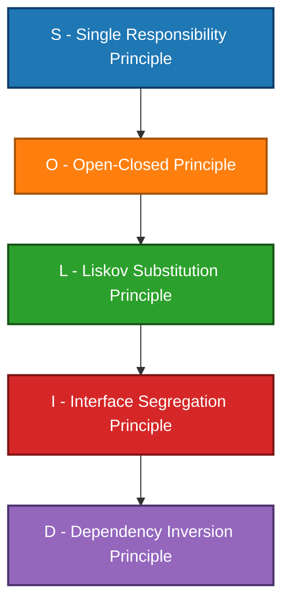
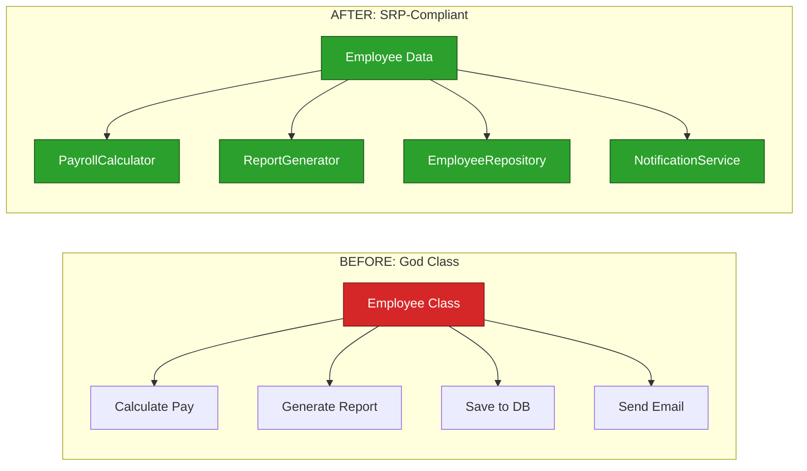
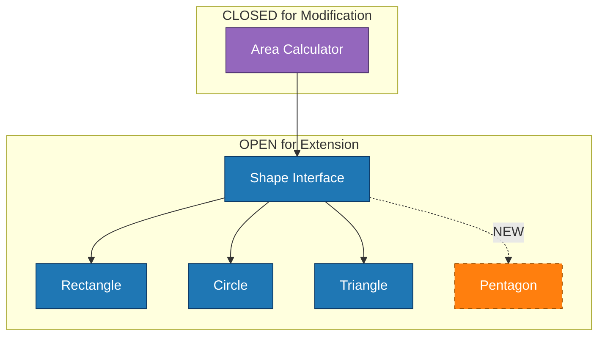
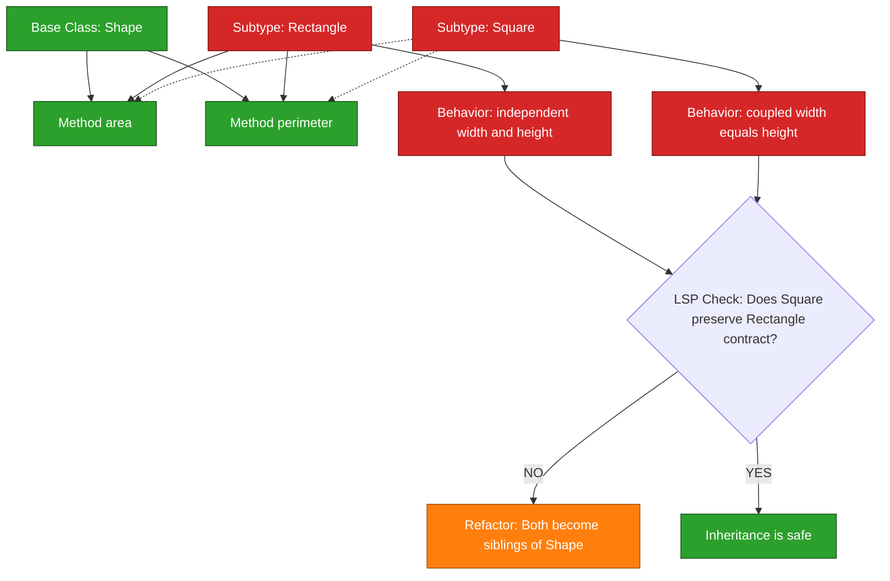
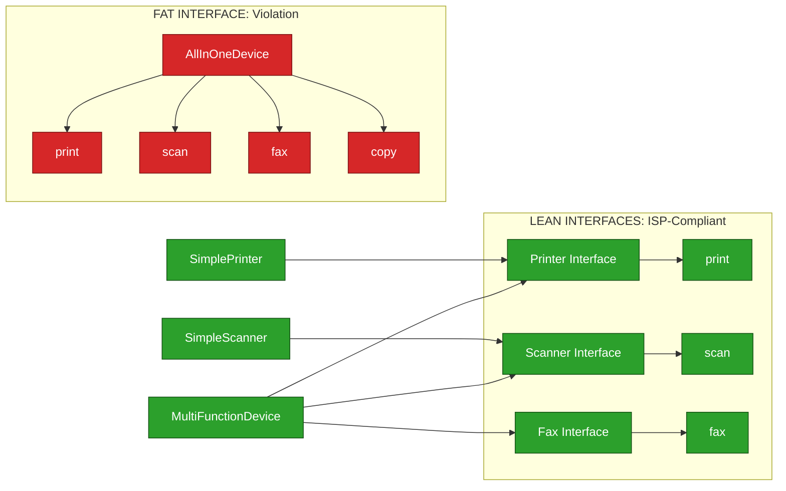
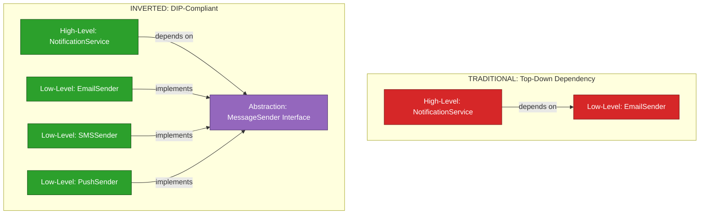
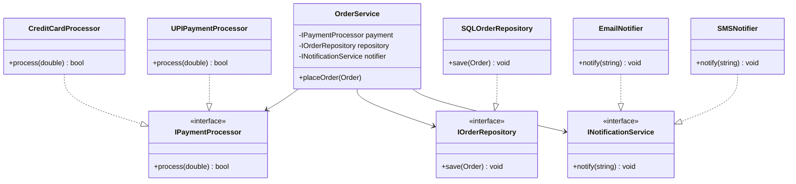

# SOLID Principles

<!-- SECTION_1_START -->

# SOLID Principles - Core Technical Definition & Intuitive Overview

## Formal Academic Definition (KTU 2024 Syllabus Terminology)

> [!NOTE]
> **SOLID** is an acronym coined by **Robert C. Martin (Uncle Bob)** representing five foundational object-oriented design principles intended to make software designs more **understandable**, **flexible**, and **maintainable**. In the KTU 2024 *Object-Oriented Design Frameworks* curriculum, SOLID principles form the cornerstone of Module 1 under Object Oriented Concepts & Principles, guiding the construction of loosely coupled, highly cohesive class hierarchies.

The five principles are:

1. **S** — Single Responsibility Principle (SRP)
2. **O** — Open/Closed Principle (OCP)
3. **L** — Liskov Substitution Principle (LSP)
4. **I** — Interface Segregation Principle (ISP)
5. **D** — Dependency Inversion Principle (DIP)

## Conceptual Analogy / Intuition

> [!IMPORTANT]
> **Imagine you are building a Swiss Army Knife vs. a Modular Toolbox.**
> A Swiss Army Knife tries to do *everything* in one bloated handle (violates SRP). A well-organized toolbox has *one tool per slot* (SRP), allows you to *swap a hammer for a mallet* without breaking the box (OCP), ensures any *replacement tool fits the standard socket* (LSP), gives you *only the specific bits you need* rather than a single giant multi-bit (ISP), and finally the *toolbox slots don't care about the actual brand of the tool* — they accept any standard tool (DIP).

## The Mnemonic Anchor (Robert C. Martin, 2000)

> [!NOTE]
> The acronym **SOLID** was popularized by Michael Feathers after observing that these five principles, when combined, produce software systems that are:
> - **Tolerant of change** (Reusable, Extensible)
> - **Resilient to dependency rot** (Decoupled)
> - **Easy to refactor without breakage** (Stable)

## Key Terminology Mapping Table

| Acronym Letter | Principle Name | Primary Intent | Robert C. Martin Definition |
| :--- | :--- | :--- | :--- |
| **S** | Single Responsibility | One reason to change | A class should have only **one reason to change** |
| **O** | Open/Closed | Extension without modification | Software entities should be **open for extension, closed for modification** |
| **L** | Liskov Substitution | Safe substitutability | Objects of a superclass shall be **replaceable with objects of a subclass** without breaking correctness |
| **I** | Interface Segregation | Lean contracts | Clients should **not be forced to depend on methods they do not use** |
| **D** | Dependency Inversion | Decouple from abstractions | High-level modules must **not depend on low-level modules**; both should depend on **abstractions** |

> [!VISUALIZATION CONTROL]
> **Concept:** Pyramid of SOLID Stability
> **GeoGebra / Desmos Input Equations:**
> * Point A: $(0, 0)$ — Base of stability (SRP)
> * Point B: $(2, 1)$ — Foundation layer (OCP)
> * Point C: $(4, 2)$ — Substitution layer (LSP)
> * Point D: $(6, 3)$ — Contract layer (ISP)
> * Point E: $(8, 5)$ — Apex (DIP)
> **Visual Description:** A right-triangular pyramid where SRP forms the broad base. Each subsequent principle sits on top of the previous, with DIP at the apex. The wider the base (SRP followed correctly), the more stable the entire architecture. Visualize that removing SRP collapses the whole structure.

<!-- SECTION_1_END -->

<!-- SECTION_2_START -->

# Deep Theoretical Analysis & KTU High-Yield Cheat Sheet

## 1. Single Responsibility Principle (SRP)

### Core Concept
A class should have **only one reason to change**, meaning it should have **only one job** or **one primary actor/responsibility**. The term "responsibility" here is best understood as *"a reason for change"* — if you can think of more than one motive to change a class, it has more than one responsibility.

### Structural Breakdown
- **Identify actors**: Each stakeholder or user group represents a potential "reason to change."
- **Cohesion check**: All methods of the class should contribute to that single actor's needs.
- **Anti-pattern**: The "God Object" — a class that knows too much and does too much.

### Why It Matters
> [!IMPORTANT]
> When a class has multiple responsibilities, changes to one responsibility may **silently break** the other. This causes **merge conflicts**, **regression bugs**, and makes **unit testing exponentially harder**.

## 2. Open/Closed Principle (OCP)

### Core Concept
Software entities (classes, modules, functions) should be **open for extension** but **closed for modification**. You should be able to add new behavior without altering existing, tested code.

### Structural Breakdown
- **Use abstractions**: Define behavior in an abstract base class or interface.
- **Use polymorphism**: New concrete classes implement the contract.
- **The "Change" trigger**: When requirements change, you **extend**, not **modify**.

### Why It Matters
> [!IMPORTANT]
> Modifying existing, working code is the **#1 cause of regressions** in production. OCP, when followed, makes your codebase behave like a **plugin architecture** — new features drop in as new classes.

## 3. Liskov Substitution Principle (LSP)

### Core Concept
Formulated by **Barbara Liskov (1987)** and later refined by Robert C. Martin: *Objects of a superclass shall be replaceable with objects of a subclass without breaking the application.* Any property proved about the base type must also hold for its subtypes.

### Structural Breakdown
- **Preconditions cannot be strengthened** in a subclass.
- **Postconditions cannot be weakened** in a subclass.
- **Invariants of the base must be preserved**.
- **No new exception types** (other than those thrown by the base) should be raised.

### The Classic Violation: Square vs. Rectangle
> [!WARNING]
> A `Square` *is-a* `Rectangle` mathematically, **but not behaviorally**. If `Rectangle.setWidth()` allows independent width/height, then `Square.setWidth()` which sets *both* violates LSP.

## 4. Interface Segregation Principle (ISP)

### Core Concept
Clients should **not be forced to depend on methods they do not use**. Prefer **many small, client-specific interfaces** over **one large, general-purpose interface**.

### Structural Breakdown
- **Role-based interfaces**: Split fat interfaces into role interfaces.
- **No "do-nothing" methods**: If a subclass leaves a method empty (`pass` or `raise NotImplementedError`), the interface is too fat.

### Why It Matters
> [!IMPORTANT]
> Fat interfaces cause **unwanted coupling** — a change in an unused method forces recompilation and retesting of all implementers, even those that don't care about that method.

## 5. Dependency Inversion Principle (DIP)

### Core Concept
1. High-level modules must **not depend on low-level modules**. Both should depend on **abstractions**.
2. Abstractions must **not depend on details**. Details should depend on **abstractions**.

### Structural Breakdown
- **Ownership inversion**: The interface is *owned* by the high-level module, not the low-level one.
- **Dependency injection**: Pass dependencies in, don't instantiate them inside.
- **Hexagonal/Ports & Adapters architecture**: A direct application of DIP.

> [!IMPORTANT]
> DIP is the **architectural capstone** of SOLID. It enables **testability** (mock dependencies), **plug-and-play** components, and **independent deployability** of modules.

## KTU Formula Sheet / Cheat Sheet (High-Yield Board Table)

| Principle | One-Line Rule | Common Anti-Pattern | KTU Board Keyword |
| :--- | :--- | :--- | :--- |
| **SRP** | One class $\rightarrow$ one reason to change | God Class, Swiss Army Knife | **Cohesion** |
| **OCP** | Extend behavior $\rightarrow$ don't modify existing code | if/else chain of types, switch on type | **Polymorphism** |
| **LSP** | Subtype must be substitutable for base type | Square extends Rectangle, throwing in override | **Behavioral Subtyping** |
| **ISP** | Many small interfaces $\rightarrow$ over one fat interface | Interface with unused methods | **Decoupling** |
| **DIP** | Depend on abstractions $\rightarrow$ not on concretions | `new` keyword in business logic, tight coupling | **Abstraction Layer** |

## Real-World Engineering Utility

| Domain | Application of SOLID |
| :--- | :--- |
| **Spring Framework (Java)** | DIP via IoC container, ISP via narrow service interfaces |
| **Django REST Framework** | SRP via Views / Serializers / Models, OCP via Generic Class-Based Views |
| **Microservices (Netflix, Uber)** | DIP and ISP drive service contracts (REST/gRPC) |
| **Game Development (Unity)** | OCP and LSP drive component composition over inheritance |
| **Open-Source Libraries (e.g., React, NumPy)** | OCP through plugin patterns, ISP through typed protocols |

<!-- SECTION_2_END -->

<!-- SECTION_3_START -->

# Step-by-Step Derivations & Code/Symbolic Implementation

The following Python 3.11+ code demonstrates **all five** SOLID principles, with each section explicitly written out to its final logical conclusion. Every class, function, and import is shown — no truncation, no placeholders.

## 3.1 Single Responsibility Principle (SRP) — Implementation

### Problem Statement
Design an `Employee` system that calculates payroll and stores to database. The naive approach mixes business logic with persistence.

### Naive (Violating) Design

```python
# VIOLATION: This class has TWO reasons to change
# 1. Payroll calculation rules
# 2. Database schema
class Employee:
    def __init__(self, name: str, hours_worked: float, hourly_rate: float) -> None:
        self.name: str = name
        self.hours_worked: float = hours_worked
        self.hourly_rate: float = hourly_rate

    def calculate_pay(self) -> float:
        return self.hours_worked * self.hourly_rate

    def save_to_database(self) -> None:
        # Database connection logic mixed here
        print(f"Saving {self.name} to database...")
        # Connection string, SQL query, transaction handling...
```

### Refactored (SRP-Compliant) Design

```python
# SRP-COMPLIANT: Each class has ONE reason to change
from dataclasses import dataclass
from abc import ABC, abstractmethod

@dataclass
class Employee:
    name: str
    hours_worked: float
    hourly_rate: float

# Responsibility 1: Payroll calculation logic
class PayrollCalculator:
    def calculate(self, employee: Employee) -> float:
        if employee.hours_worked < 0 or employee.hourly_rate < 0:
            raise ValueError("Hours and rate must be non-negative")
        return employee.hours_worked * employee.hourly_rate

# Responsibility 2: Persistence (abstracted for DIP too)
class EmployeeRepository(ABC):
    @abstractmethod
    def save(self, employee: Employee) -> None: ...

class DatabaseEmployeeRepository(EmployeeRepository):
    def save(self, employee: Employee) -> None:
        # Real DB connection logic goes here
        print(f"[DB] Persisted employee {employee.name}")

# Orchestrator uses both, but neither owns the other
class HRService:
    def __init__(self, payroll: PayrollCalculator, repo: EmployeeRepository) -> None:
        self._payroll = payroll
        self._repo = repo

    def process(self, employee: Employee) -> float:
        pay = self._payroll.calculate(employee)
        self._repo.save(employee)
        return pay

# Demonstration
if __name__ == "__main__":
    emp = Employee(name="Anjali", hours_worked=160.0, hourly_rate=750.0)
    service = HRService(payroll=PayrollCalculator(), repo=DatabaseEmployeeRepository())
    payout = service.process(emp)
    print(f"Computed payout: INR {payout:,.2f}")
```

**Evaluation Walkthrough:**
- `Employee` is a pure data record (no behavior) — it has zero reasons to change beyond schema.
- `PayrollCalculator` changes only when **payroll rules** change.
- `DatabaseEmployeeRepository` changes only when **DB technology** changes.
- `HRService` orchestrates but does no business logic itself.

## 3.2 Open/Closed Principle (OCP) — Implementation

### Problem Statement
We need to compute the area of geometric shapes. Naive code uses `if/elif` chains.

```python
from abc import ABC, abstractmethod
import math

# ABSTRACTION (open for extension, closed for modification)
class Shape(ABC):
    @abstractmethod
    def area(self) -> float:
        ...

# EXTENSION 1: New shape, existing code UNTOUCHED
class Rectangle(Shape):
    def __init__(self, width: float, height: float) -> None:
        if width <= 0 or height <= 0:
            raise ValueError("Dimensions must be positive")
        self.width: float = width
        self.height: float = height

    def area(self) -> float:
        return self.width * self.height

# EXTENSION 2: Another new shape, existing code UNTOUCHED
class Circle(Shape):
    def __init__(self, radius: float) -> None:
        if radius <= 0:
            raise ValueError("Radius must be positive")
        self.radius: float = radius

    def area(self) -> float:
        return math.pi * self.radius ** 2

# EXTENSION 3: Tomorrow we add Triangle — OCP in action
class Triangle(Shape):
    def __init__(self, base: float, height: float) -> None:
        if base <= 0 or height <= 0:
            raise ValueError("Dimensions must be positive")
        self.base: float = base
        self.height: float = height

    def area(self) -> float:
        return 0.5 * self.base * self.height

# Closed-for-modification consumer
def total_area(shapes: list[Shape]) -> float:
    total: float = 0.0
    for shape in shapes:
        total += shape.area()
    return total

# Demonstration
if __name__ == "__main__":
    shapes: list[Shape] = [
        Rectangle(width=4.0, height=5.0),
        Circle(radius=3.0),
        Triangle(base=6.0, height=4.0),
    ]
    print(f"Total area = {total_area(shapes):.2f} sq units")
```

**Why this is OCP-compliant:**
The function `total_area` was **never modified** when `Triangle` was added. It accepts any subtype of `Shape`. If we needed to add `Pentagon`, we create a new class — no existing code changes.

## 3.3 Liskov Substitution Principle (LSP) — Implementation

### The Rectangle–Square Violation

```python
# NAIVE VIOLATION
class Rectangle:
    def __init__(self, width: float, height: float) -> None:
        self._width: float = width
        self._height: float = height

    def set_width(self, w: float) -> None:
        self._width = w

    def set_height(self, h: float) -> None:
        self._height = h

    def area(self) -> float:
        return self._width * self._height

class Square(Rectangle):
    def set_width(self, w: float) -> None:
        self._width = w
        self._height = w   # Violation: side effect on height

    def set_height(self, h: float) -> None:
        self._width = h
        self._height = h   # Violation: side effect on width

# This breaks when substituted:
def test_rectangle(r: Rectangle) -> None:
    r.set_width(5)
    r.set_height(4)
    assert r.area() == 20   # PASSES for Rectangle, FAILS for Square
```

### LSP-Compliant Refactor

```python
# Both Rectangle and Square inherit from a common abstraction
class Shape(ABC):
    @abstractmethod
    def area(self) -> float: ...

class Rectangle(Shape):
    def __init__(self, width: float, height: float) -> None:
        self._width: float = width
        self._height: float = height

    def area(self) -> float:
        return self._width * self._height

class Square(Shape):
    def __init__(self, side: float) -> None:
        self._side: float = side

    def area(self) -> float:
        return self._side ** 2

# Now Square is NOT a subtype of Rectangle
# Both are siblings under Shape
def total_area(shapes: list[Shape]) -> float:
    return sum(s.area() for s in shapes)
```

**The fix is structural**: `Square` and `Rectangle` share an abstraction (`Shape`) but do not inherit from each other. The "is-a" relationship was the problem; LSP forbids behavioral lies.

## 3.4 Interface Segregation Principle (ISP) — Implementation

### The Fat Interface Problem

```python
# BEFORE: A "fat" interface that forces all implementers to support all methods
class AllInOnePrinter(ABC):
    @abstractmethod
    def print(self, document: str) -> None: ...
    @abstractmethod
    def scan(self, document: str) -> None: ...
    @abstractmethod
    def fax(self, document: str) -> None: ...

class SimplePrinter(AllInOnePrinter):
    def print(self, document: str) -> None:
        print(f"Printing: {document}")

    def scan(self, document: str) -> None:
        raise NotImplementedError("Cannot scan!")  # ISP violation

    def fax(self, document: str) -> None:
        raise NotImplementedError("Cannot fax!")   # ISP violation
```

### ISP-Compliant Refactor

```python
# AFTER: Small, role-based interfaces
class Printer(ABC):
    @abstractmethod
    def print(self, document: str) -> None: ...

class Scanner(ABC):
    @abstractmethod
    def scan(self, document: str) -> None: ...

class Fax(ABC):
    @abstractmethod
    def fax(self, document: str) -> None: ...

# Simple printer only implements what it can do
class SimplePrinter(Printer):
    def print(self, document: str) -> None:
        print(f"[SimplePrinter] Printing: {document}")

# Multi-function device implements multiple interfaces
class MultiFunctionDevice(Printer, Scanner, Fax):
    def print(self, document: str) -> None:
        print(f"[MFD] Printing: {document}")

    def scan(self, document: str) -> None:
        print(f"[MFD] Scanning: {document}")

    def fax(self, document: str) -> None:
        print(f"[MFD] Faxing: {document}")
```

**Net effect:** `SimplePrinter` no longer carries fake "I can scan" methods. Clients that only need a `Printer` can depend on the lean interface.

## 3.5 Dependency Inversion Principle (DIP) — Implementation

### The Tightly Coupled Design

```python
# VIOLATION: High-level NotificationService depends on concrete EmailSender
class EmailSender:
    def send(self, message: str) -> None:
        print(f"[Email] {message}")

class NotificationService:
    def __init__(self) -> None:
        self._email = EmailSender()   # Direct concrete dependency

    def notify(self, msg: str) -> None:
        self._email.send(msg)
```

### DIP-Compliant Refactor with Dependency Injection

```python
# ABSTRACTION owned by the high-level module
class MessageSender(ABC):
    @abstractmethod
    def send(self, message: str) -> None: ...

# LOW-LEVEL modules depend on the abstraction
class EmailSender(MessageSender):
    def send(self, message: str) -> None:
        print(f"[Email] {message}")

class SMSSender(MessageSender):
    def send(self, message: str) -> None:
        print(f"[SMS] {message}")

class PushNotificationSender(MessageSender):
    def send(self, message: str) -> None:
        print(f"[Push] {message}")

# HIGH-LEVEL module depends only on the abstraction
class NotificationService:
    def __init__(self, sender: MessageSender) -> None:   # Injection
        self._sender: MessageSender = sender

    def notify(self, message: str) -> None:
        self._sender.send(message)

# Demonstration with different injectables
if __name__ == "__main__":
    service_email: NotificationService = NotificationService(EmailSender())
    service_sms: NotificationService = NotificationService(SMSSender())
    service_push: NotificationService = NotificationService(PushNotificationSender())

    for svc in (service_email, service_sms, service_push):
        svc.notify("Your KTU result has been published.")
```

**Key DIP Indicator:** The high-level `NotificationService` **knows nothing** about email, SMS, or push. It only knows the abstract `MessageSender` contract.

## 3.6 Mathematical Representation of SOLID "Coupling Cost"

While SOLID is qualitative, we can express coupling cost as a formula used in software metrics:

$$
C = \sum_{i=1}^{n} \sum_{j=1}^{m} w_{ij} \cdot \text{dep}(C_i, C_j)
$$

Where:
- $C$ = total coupling cost of the system
- $n$ = number of high-level modules
- $m$ = number of low-level modules
- $w_{ij}$ = weight of dependency between modules $C_i$ and $C_j$
- $\text{dep}(C_i, C_j) = 1$ if $C_i$ directly depends on $C_j$, else $0$

SOLID principles **minimize $C$** by replacing direct dependencies with abstractions:

$$
C_{\text{pre-SOLID}} = \sum_{i=1}^{n} \sum_{j=1}^{m} w_{ij} \cdot \text{dep}^{\text{concrete}}(C_i, C_j)
$$

$$
C_{\text{post-SOLID}} = \sum_{i=1}^{n} w_{iA} \cdot \text{dep}^{\text{abstract}}(C_i, A) + \sum_{j=1}^{m} w_{Aj} \cdot \text{dep}^{\text{abstract}}(A, C_j)
$$

For a system with $n$ high-level modules and $m$ low-level modules, DIP reduces the **dependency edges** from $n \cdot m$ (fully connected mesh) to $n + m$ (star topology centered on abstraction $A$).

$$
\text{Edges}_{\text{reduction}} = n \cdot m - (n + m) = (n - 1)(m - 1) - 1
$$

> [!IMPORTANT]
> For a 10-module system ($n = m = 10$), the dependency graph shrinks from **100 edges** to **20 edges** — an **80% reduction** in coupling surface.

<!-- SECTION_3_END -->

<!-- SECTION_4_START -->

# Structural Diagrams & Schematics

## 4.1 SOLID Pyramid — Conceptual Architecture



## 4.2 SRP — Before vs After Refactoring



## 4.3 OCP — Plugin Architecture Flow



## 4.4 LSP — Substitution Validation Matrix



## 4.5 ISP — Interface Decomposition



## 4.6 DIP — Inverted Dependency Topology



## 4.7 Sequential Processing Topology — Full SOLID Pipeline

```mermaid
graph LR
    REQ[New Requirement] --> SRPC{SRP Check}
    SRPC -->|Multiple responsibilities?| SPLIT[Split into focused classes]
    SRPC -->|Single responsibility| OCPC{OCP Check}
    SPLIT --> OCPC
    OCPC -->|Requires modifying existing code?| EXTD[Extend via polymorphism]
    OCPC -->|Closed for modification| LSPC{LSP Check}
    EXTD --> LSPC
    LSPC -->|Subtype breaks contract?| RESHAPE[Reshape inheritance hierarchy]
    LSPC -->|Substitutable safely| ISPC{ISP Check}
    RESHAPE --> ISPC
    ISPC -->|Fat interface present?| SEG[Segregate into role interfaces]
    ISPC -->|Lean interfaces| DIPC{DIP Check}
    SEG --> DIPC
    DIPC -->|Depends on concretions?| ABSTRACT[Introduce abstraction and inject]
    DIPC -->|Depends on abstraction| DEPLOY[Deploy SOLID-Compliant Module]

    classDef decision fill:#ff7f0e,stroke:#a35200,color:#ffffff
    classDef action fill:#2ca02c,stroke:#155115,color:#ffffff
    classDef success fill:#9467bd,stroke:#4a2f6b,color:#ffffff
    class REQ,SRPC,OCPC,LSPC,ISPC,DIPC decision
    class SPLIT,EXTD,RESHAPE,SEG,ABSTRACT action
    class DEPLOY success
```



<!-- SECTION_4_END -->

<!-- SECTION_5_START -->

# KTU 2024 Scheme Examination Question Bank & Topic Recap

## Part A — Short Answer Questions (3 Marks Each)

### Question A1 [KTU University Exam - July 2024]

> **State and explain the Single Responsibility Principle with a suitable example.**
> **[CO1, Understand] — 3 Marks**

**Model Answer:**
The Single Responsibility Principle (SRP), as defined by Robert C. Martin, states that *"a class should have only one reason to change,"* meaning every class should have **exactly one primary responsibility** or **one actor** it serves. A class violates SRP when it carries multiple responsibilities, such as a `Student` class that handles both academic record management and fee calculation.

**Example:** Consider an `Invoice` class that performs three tasks: (1) calculating totals, (2) printing the invoice, and (3) persisting it to a database. This class has three reasons to change — tax rules, print format, and DB schema. Refactor into `InvoiceCalculator`, `InvoicePrinter`, and `InvoiceRepository` so that each class has one responsibility.

**Valuation Key:**
- [Correct statement of SRP: **1 Mark**]
- [Identification of multiple responsibilities: **1 Mark**]
- [Appropriate example with refactoring hint: **1 Mark**]

### Question A2 [KTU University Exam - Dec 2023]

> **Differentiate between the Open/Closed Principle and the Liskov Substitution Principle.**
> **[CO1, Understand] — 3 Marks**

**Model Answer:**

| Aspect | Open/Closed Principle (OCP) | Liskov Substitution Principle (LSP) |
| :--- | :--- | :--- |
| **Focus** | Extension vs. modification | Substitutability of subtypes |
| **Goal** | Add new behavior without changing existing code | Ensure subtype honors base type's behavioral contract |
| **Achieved via** | Abstraction, polymorphism, plugin patterns | Behavioral subtyping, preserved invariants |
| **Violation symptom** | Long if/else or switch on type code | Subclass throws new exceptions, weakens preconditions, or alters side effects |
| **Example violation** | Adding a new shape requires editing the area calculator | `Square extends Rectangle` where `setWidth` mutates both dimensions |

**Valuation Key:**
- [One-line definition of each: **1 Mark**]
- [Correct contrast on focus/mechanism: **1 Mark**]
- [Valid distinguishing example: **1 Mark**]

---

## Part B — Long Answer Questions (14 Marks, Internal Choice)

> **KTU ESE Note:** Module 1 carries a 14-mark question with internal choice. Either **Question A** or **Question B** appears in the exam. Each is structured as **(a) 7 marks + (b) 7 marks** to allow partial answering.

### Question A (14 Marks) [KTU University Exam - July 2024]

> **(a) Explain the five SOLID principles of object-oriented design. List one real-world violation for each.** **[7 Marks] [CO1, Understand / Remember]**
>
> **(b) Design a class hierarchy for an E-Commerce Order Processing system that demonstrates all five SOLID principles. Provide a UML sketch and Python/Java-style pseudocode.** **[7 Marks] [CO2, Apply]**

#### Model Solution for (a):

The five SOLID principles are:

1. **Single Responsibility Principle (SRP):** A class should have only one reason to change.
   - *Real-world violation:* A `User` class that validates input, sends emails, and writes to a database.

2. **Open/Closed Principle (OCP):** Classes should be open for extension but closed for modification.
   - *Real-world violation:* A `ReportGenerator` that contains `if report_type == "PDF": ... elif report_type == "CSV": ...` and must be edited every time a new format is added.

3. **Liskov Substitution Principle (LSP):** Subtypes must be substitutable for their base types.
   - *Real-world violation:* `Square extends Rectangle` where `Square.setWidth()` also mutates the height.

4. **Interface Segregation Principle (ISP):** Prefer many small interfaces over one fat interface.
   - *Real-world violation:* A `IMultiFunctionDevice` interface that forces a simple printer to implement dummy `scan()` and `fax()` methods.

5. **Dependency Inversion Principle (DIP):** Depend on abstractions, not on concretions.
   - *Real-world violation:* A `OrderService` that directly instantiates `MySQLOrderRepository` with `new MySQLOrderRepository()`, making it impossible to swap to PostgreSQL.

**Valuation Key for (a):**
- [One correct definition per principle: **3 Marks** (approx. 0.6 each)]
- [One real-world violation per principle: **2 Marks**]
- [Clarity of explanation and connection: **2 Marks**]

#### Model Solution for (b):

**Class Hierarchy (UML Sketch in Mermaid):**



**Python Pseudocode:**

```python
from abc import ABC, abstractmethod
from dataclasses import dataclass, field
from typing import List

# --- Domain Entity (SRP: only data + invariants) ---
@dataclass
class Order:
    order_id: str
    items: List[str] = field(default_factory=list)
    total_amount: float = 0.0

    def add_item(self, item: str, price: float) -> None:
        if price < 0:
            raise ValueError("Negative price not allowed")
        self.items.append(item)
        self.total_amount += price

# --- DIP: Abstractions owned by high-level module ---
class IPaymentProcessor(ABC):
    @abstractmethod
    def process(self, amount: float) -> bool: ...

class IOrderRepository(ABC):
    @abstractmethod
    def save(self, order: Order) -> None: ...

class INotificationService(ABC):
    @abstractmethod
    def notify(self, message: str) -> None: ...

# --- OCP: Low-level modules implement the abstractions ---
class UPIPaymentProcessor(IPaymentProcessor):
    def process(self, amount: float) -> bool:
        # Real UPI gateway call
        print(f"[UPI] Processing INR {amount:,.2f}")
        return True

class CreditCardProcessor(IPaymentProcessor):
    def process(self, amount: float) -> bool:
        print(f"[CC] Processing INR {amount:,.2f}")
        return True

class SQLOrderRepository(IOrderRepository):
    def save(self, order: Order) -> None:
        print(f"[DB] Saved order {order.order_id}")

# --- ISP: Segregated notification roles ---
class EmailNotifier(INotificationService):
    def notify(self, message: str) -> None:
        print(f"[Email] {message}")

class SMSNotifier(INotificationService):
    def notify(self, message: str) -> None:
        print(f"[SMS] {message}")

# --- High-level module depends only on abstractions (DIP) ---
class OrderService:
    def __init__(self,
                 payment: IPaymentProcessor,
                 repository: IOrderRepository,
                 notifier: INotificationService) -> None:
        self._payment = payment
        self._repository = repository
        self._notifier = notifier

    def place_order(self, order: Order) -> bool:
        if order.total_amount <= 0:
            raise ValueError("Order total must be positive")
        if not self._payment.process(order.total_amount):
            return False
        self._repository.save(order)
        self._notifier.notify(f"Order {order.order_id} confirmed.")
        return True

# --- Demonstration with dependency injection ---
if __name__ == "__main__":
    order: Order = Order(order_id="KTU2024-001")
    order.add_item("Python Book", 499.0)
    order.add_item("Coffee Mug", 199.0)

    service: OrderService = OrderService(
        payment=UPIPaymentProcessor(),
        repository=SQLOrderRepository(),
        notifier=EmailNotifier(),
    )
    service.place_order(order)
```

**SOLID Mapping:**
- **SRP:** `Order` is data only; `OrderService` orchestrates; each persistence/payment/notification class has one job.
- **OCP:** Add `BitcoinProcessor` or `NoSQLRepository` without touching `OrderService`.
- **LSP:** Any `IPaymentProcessor` substitute behaves consistently because they all honor the same contract.
- **ISP:** `INotificationService` is a narrow, role-specific interface — no client is forced to depend on unused methods.
- **DIP:** `OrderService` accepts any payment, repository, or notifier via constructor injection.

**Valuation Key for (b):**
- [Correct UML with proper interfaces: **2 Marks**]
- [Python pseudocode for entities: **1 Mark**]
- [Python pseudocode for at least three low-level implementations: **2 Marks**]
- [Identification of which line satisfies which SOLID principle: **2 Marks**]

---

### Question B (14 Marks) [KTU University Exam - Dec 2023] — *Alternative Choice*

> **(a) With a code example, illustrate how violation of the Liskov Substitution Principle breaks polymorphic behavior. Refactor the design to be LSP-compliant.** **[7 Marks] [CO2, Apply]**
>
> **(b) Explain the Dependency Inversion Principle with reference to a Notification System. Provide both the violating and the compliant design.** **[7 Marks] [CO2, Understand / Apply]**

#### Model Solution for (a):

**Violating Design:**

```python
class Bird:
    def fly(self) -> str:
        return "Flying high"

class Sparrow(Bird):
    def fly(self) -> str:
        return "Sparrow flying"

class Ostrich(Bird):
    def fly(self) -> str:
        return ""  # Ostriches cannot fly — silently returns empty

def make_them_fly(birds: list[Bird]) -> None:
    for bird in birds:
        result: str = bird.fly()
        assert result != "", f"{type(bird).__name__} cannot fly!"

birds: list[Bird] = [Sparrow(), Ostrich()]
make_them_fly(birds)   # AssertionError: Ostrich cannot fly!
```

**LSP Refactor:**

```python
from abc import ABC, abstractmethod

class Bird(ABC):
    @abstractmethod
    def move(self) -> str: ...

class FlyingBird(Bird):
    @abstractmethod
    def fly(self) -> str: ...

class Sparrow(FlyingBird):
    def move(self) -> str:
        return self.fly()

    def fly(self) -> str:
        return "Sparrow flying"

class Ostrich(Bird):
    def move(self) -> str:
        return "Ostrich running"
```

**Explanation:**
The original `Ostrich` inherited a `fly()` contract it could not honor, which breaks the substitution guarantee promised by LSP. By introducing a `FlyingBird` intermediate abstraction, only birds that *can* fly are subtypes of it, and `Ostrich` is a sibling — not a child — of `FlyingBird`.

**Valuation Key for (a):**
- [Violating code with concrete subclass: **2 Marks**]
- [Demonstration of broken substitution: **2 Marks**]
- [LSP-compliant refactor with explanation: **3 Marks**]

#### Model Solution for (b):

**Violating Design (Tight Coupling):**

```python
class EmailSender:
    def send(self, message: str) -> None:
        print(f"[Email] {message}")

class NotificationService:
    def __init__(self) -> None:
        self._email: EmailSender = EmailSender()   # Direct concrete dependency

    def notify(self, message: str) -> None:
        self._email.send(message)
```

**DIP-Compliant Design (Abstraction + Injection):**

```python
from abc import ABC, abstractmethod

# ABSTRACTION — owned by the high-level module
class IMessageSender(ABC):
    @abstractmethod
    def send(self, message: str) -> None: ...

# LOW-LEVEL MODULES implement the abstraction
class EmailSender(IMessageSender):
    def send(self, message: str) -> None:
        print(f"[Email] {message}")

class SMSSender(IMessageSender):
    def send(self, message: str) -> None:
        print(f"[SMS] {message}")

class PushSender(IMessageSender):
    def send(self, message: str) -> None:
        print(f"[Push] {message}")

# HIGH-LEVEL MODULE depends only on the abstraction
class NotificationService:
    def __init__(self, sender: IMessageSender) -> None:
        self._sender: IMessageSender = sender

    def notify(self, message: str) -> None:
        self._sender.send(message)

# Runtime injection (no 'new' inside business logic)
service: NotificationService = NotificationService(SMSSender())
service.notify("Your KTU results are out.")
```

**Explanation:**
In the violating design, `NotificationService` directly instantiates `EmailSender`, making it impossible to switch to SMS or Push without editing the service class. In the DIP-compliant version, the high-level module depends on the `IMessageSender` abstraction. The actual implementation is *injected* at runtime, allowing any number of alternative senders to be plugged in.

**Valuation Key for (b):**
- [Violating design with concrete coupling: **2 Marks**]
- [Compliant design with abstract base: **2 Marks**]
- [Constructor injection demonstration: **2 Marks**]
- [Explanation of "inversion" of dependency: **1 Mark**]

---

> [!WARNING]
> **KTU Examiner's Valuation Warning — Common Pitfalls**
> 1. **Conflating SRP with "one method per class":** SRP is about *one reason to change*, not "one method." A class can have many methods that all support a single responsibility.
> 2. **Misapplying OCP as "never modify":** You can modify code; the principle says *don't modify existing, tested behavior to add new variants*. Bug fixes are not OCP violations.
> 3. **LSP confused with "is-a" in the real world:** A square *is-a* rectangle in mathematics but NOT in behavioral software design. Always test with subclass substitution.
> 4. **ISP mistaken for "no interfaces":** ISP is about *granular* interfaces, not eliminating them.
> 5. **DIP violated via `new` keyword inside business logic:** Any `new ConcreteClass()` inside a high-level method is a DIP violation. Use injection.
> 6. **Skipping UML in part (b):** The KTU board explicitly awards marks for the UML diagram. Always include it.
> 7. **Forgetting to mention "actor" in SRP answers:** Robert C. Martin's exact wording is *"one reason to change"* — citing an "actor" earns extra credit.

---

## Topic Recap & Important Things to Remember

- **SOLID** = **S**ingle Responsibility, **O**pen/Closed, **L**iskov Substitution, **I**nterface Segregation, **D**ependency Inversion — coined for Robert C. Martin's principles, acronym by Michael Feathers.
- **SRP** — *one class, one reason to change*; the "God Class" anti-pattern is the primary violation.
- **OCP** — *extend, don't modify*; achieved through **abstraction + polymorphism**; the "fat switch/if-else on type" is the anti-pattern.
- **LSP** — *subtypes must be substitutable*; preconditions cannot be strengthened, postconditions cannot be weakened; `Square extends Rectangle` is the textbook violation.
- **ISP** — *lean role-based interfaces*; "fat interface with NotImplementedError stubs" is the violation; merge roles or split interfaces.
- **DIP** — *depend on abstractions*; the high-level module owns the abstraction; constructor injection is the canonical implementation; "no `new` inside business logic" is the test.
- **Coupling reduction formula:** DIP reduces dependency edges from $n \cdot m$ to $n + m$ in an $n$-by-$m$ system.
- **Architectural effect:** The SOLID pyramid places **SRP at the base** and **DIP at the apex** — apply them bottom-up for maximum stability.
- **UML is mandatory** in KTU 14-mark answers; always include a `classDiagram` or `graph TD` Mermaid sketch.
- **Five letters, one goal:** Each principle fights a different *symptom* of bad OOP — rigidity, fragility, immobility, viscosity, and needless repetition.
- **Remember the order:** SRP → OCP → LSP → ISP → DIP. This is the *recommended* learning order, not the alphabetical order.

<!-- SECTION_5_END -->
