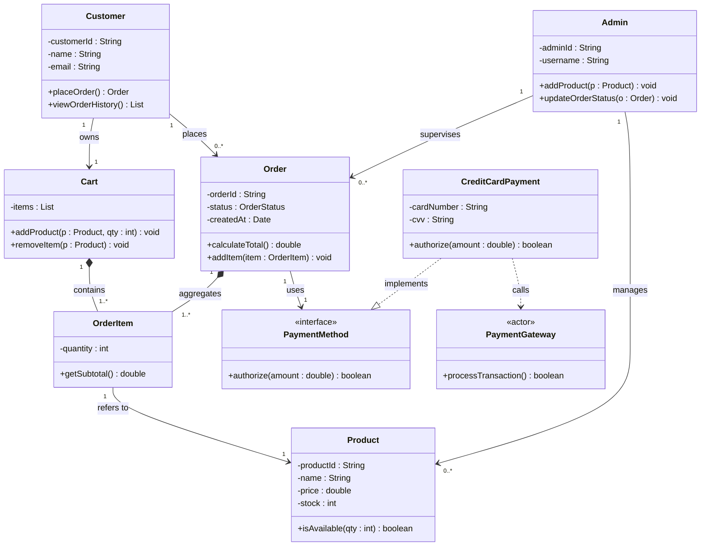
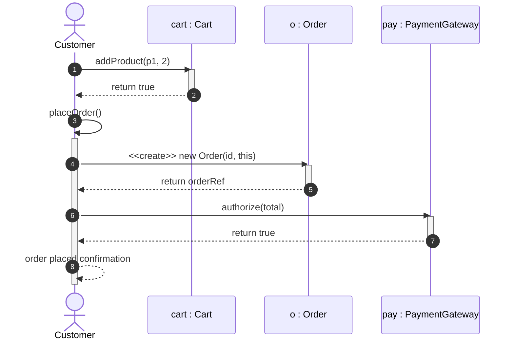
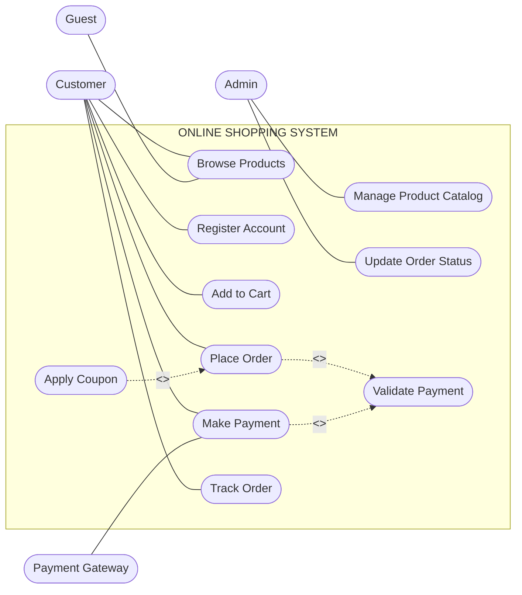
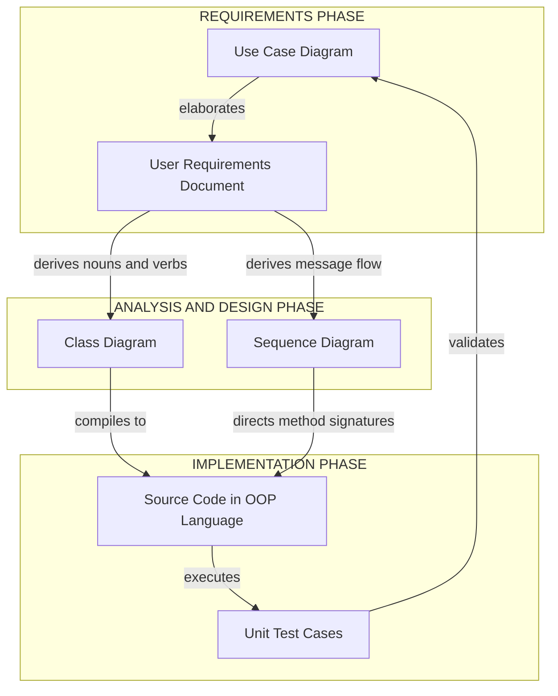

# UML Design Models: Class, Sequence, and Use Case Diagrams

<!-- SECTION_1_START -->

# UML Design Models: Class, Sequence, and Use Case Diagrams

## 1.1 Core Technical Definition

**Unified Modeling Language (UML)** is a standardized, general-purpose visual modeling language managed by the **Object Management Group (OMG)** that provides software engineers and system architects with a set of graphical notations to specify, visualize, construct, and document the artifacts of a software-intensive system. In the context of Object-Oriented Design Frameworks (OECST72A), UML serves as the primary design vocabulary for translating problem statements into graphical blueprints that can be unambiguously implemented.

For Module 1, KTU 2024 Scheme focuses on three foundational UML diagrams that collectively capture the **static structure**, **dynamic behavior**, and **functional scope** of an object-oriented system:

- **Class Diagram** — A *static structural diagram* that describes the types of objects in a system and the static relationships that exist among them.
- **Sequence Diagram** — A *dynamic interaction diagram* that shows how objects collaborate with one another by exchanging messages, ordered chronologically.
- **Use Case Diagram** — A *dynamic behavioral diagram* that captures the functional requirements of a system from an external actor's perspective.

> [!IMPORTANT]
> **KTU 2024 Syllabus Highlight:** These three diagrams are explicitly listed under *Module 1 — Object-Oriented Concepts & Principles*. Questions of **7 to 14 marks** are routinely asked on the combined construction of these diagrams for a single problem scenario. Memorizing the notation symbols alone is insufficient — examiners award marks for **accurate relationship mapping** and **proper multiplicity** declarations.

> [!NOTE]
> **Formal OMG Definition:** UML 2.5.1 (current standard) defines fourteen diagram types grouped into *structure*, *behavior*, and *interaction* categories. Class diagrams fall under structure, sequence diagrams fall under interaction (a subset of behavior), and use case diagrams fall under behavior.

## 1.2 Intuitive Overview — The Building Analogy

Imagine you have been hired to construct a **shopping mall** for a client. Before any brick is laid, three different types of drawings are produced by the architecture team:

1. **The Floor Plan (Class Diagram):** Shows every room, its dimensions, doors, windows, and how the rooms are physically connected. It is a *static snapshot* — it does not show people moving. The class diagram plays this exact role for software: it shows every "room" (class), its "furniture" (attributes and methods), and the "doorways" connecting them (relationships).

2. **The Security Camera Footage (Sequence Diagram):** Captures the chronological flow of a customer entering the mall, getting a token, climbing the escalator, and reaching the food court. It is a *time-ordered view* — the vertical axis is time, and the horizontal axis is the participants. The sequence diagram does the same for software, showing which object calls which method *when*.

3. **The Customer Journey Map (Use Case Diagram):** A high-level sticker placed near the mall entrance that says "Customers can Shop, Return Items, and Earn Loyalty Points." It does not show internal structure — only the *boundary of what the system does* and *who interacts with it*. The use case diagram is the customer journey for software, viewed from outside.

> [!TIP]
> **Mnemonic for KTU Exams:** **C**lass = **C**onstruction (static), **S**equence = **S**tream of events (dynamic), **U**se Case = **U**ser's wishlist (functional). Think *CSU*.

## 1.3 Standard Notation Symbols at a Glance

The following symbols recur across the three diagrams. Memorize them in this exact form because KTU board examiners deduct marks for using approximate symbols.

| Symbol | Diagram(s) | Meaning |
|---|---|---|
| `+` | Class | Public visibility |
| `-` | Class | Private visibility |
| `#` | Class | Protected visibility |
| `~` | Class | Package / default visibility |
| `<|--` | Class | Inheritance (generalization) |
| `*--` | Class | Composition (strong "has-a") |
| `o--` | Class | Aggregation (weak "has-a") |
| `-->` | Class, Sequence | Association / directed message |
| `..>` | Class, Sequence | Dependency / weak usage |
| `<<include>>` | Use Case | Mandatory reuse |
| `<<extend>>` | Use Case | Optional extension |
| `<<actor>>` | Use Case | External role |

> [!NOTE]
> **Constant Reminder:** In prose, always render multiplicity as `1..*` inside LaTeX math mode like $1..*$ to prevent markdown from misinterpreting the asterisks as italic markers.

## 1.4 The OMG Standard Metrics

The UML specification is governed by the **Object Management Group (OMG)**, headquartered in the USA, which has published the standard as **ISO/IEC 19505**. The most widely used version in industry and academia is **UML 2.5.1**, released in **December 2017**. Earlier versions (UML 1.x) used a different notation for use case relationships; KTU examiners accept the UML 2.5.x notation.

<!-- SECTION_1_END -->

<!-- SECTION_2_START -->

# Deep Theoretical Analysis & KTU High-Yield Formula Sheet

## 2.1 The Class Diagram — Static Structural Blueprint

A class diagram models the **vocabulary of the system**. Each class is a template for objects. A class is represented as a rectangle partitioned into three compartments.

### 2.1.1 The Three Compartments of a Class

1. **Class Name Compartment (Top):** Holds the class name in **bold** if concrete, in *italics* if abstract. Stereotypes such as `<<interface>>` may appear above the name.
2. **Attribute Compartment (Middle):** Lists the data members. Syntax: `visibility name : type [multiplicity] = default`
3. **Operation Compartment (Bottom):** Lists the methods. Syntax: `visibility name(parameter list) : return type`

> [!NOTE]
> **Visibility Modifiers (Critical for Board Exams):**
> - `+` Public: Accessible from any class. Marks: 1 if correctly placed.
> - `-` Private: Accessible only within the class itself. **Most common in KTU problems.**
> - `#` Protected: Accessible within the class and its subclasses.
> - `~` Package: Accessible only within the same package.

### 2.1.2 The Five Cardinal Relationships

A KTU 14-mark question on class diagrams almost always tests at least two of the following relationships:

**1. Association** — A general "uses-a" connection between two classes. Represented by a solid line. Multiplicity is placed at each end, e.g., a `Customer` places $0..*$ `Order` objects. Association can be unidirectional (with an arrow) or bidirectional.

**2. Aggregation** — A weak "has-a" relationship where the child can exist independently of the parent. Represented by a hollow diamond at the parent end. Example: A `Department` aggregates $1..*$ `Professor` objects; if the department closes, the professors still exist.

**3. Composition** — A strong "has-a" relationship where the child's lifecycle is bound to the parent. Represented by a filled diamond at the parent end. Example: A `House` composes $1..*$ `Room` objects; if the house is demolished, the rooms are destroyed.

**4. Inheritance (Generalization)** — An "is-a" relationship connecting a subclass to a superclass. Represented by a hollow triangle arrow pointing toward the parent. Example: `SavingsAccount` inherits from `Account`.

**5. Dependency** — A weak "uses-a-temporarily" relationship. Represented by a dashed arrow. Example: A `Controller` class depends on a `Database` connection object passed as a method argument.

### 2.1.3 Multiplicity Notation

Multiplicity declarations follow the rules in the table below. The asterisk `*` is shorthand for "many" (i.e., $0..*$).

| Notation | Meaning | Example |
|---|---|---|
| `1` | Exactly one | Each `Order` has exactly $1$ `Invoice` |
| `0..1` | Zero or one | A `Person` may have $0..1$ `Passport` |
| `*` or `0..*` | Zero or many | A `Library` contains $0..*$ `Book` |
| `1..*` | At least one | A `Team` must have $1..*$ `Player` |
| `n..m` | Between n and m | A `Course` has $2..5$ `Instructor` objects |

## 2.2 The Sequence Diagram — Dynamic Time-Ordered View

A sequence diagram captures the **lifelines** of participants (objects or actors) along a horizontal axis, with time flowing *downward* along the vertical axis. It answers the question: *"In what order do objects exchange messages to fulfill a particular use case?"*

### 2.2.1 The Five Visual Elements

1. **Participants (Top Row):** Represented by rectangle boxes with the object name underlined. The name follows the pattern `objectName : ClassName` or just `objectName`. An actor can be drawn on the far left using the stick-figure symbol.
2. **Lifelines (Vertical Dashed Lines):** Extend downward from each participant, representing the existence of the object over time.
3. **Activation Bars (Thin Rectangles on Lifelines):** Indicate the period during which an object is performing an action.
4. **Messages (Horizontal Arrows):** Sent from one lifeline to another. Solid arrows denote synchronous calls; dashed arrows denote return messages or asynchronous signals.
5. **Combined Fragments (Optional Rectangles):** Enclose conditional, looping, or parallel behavior using keywords such as `alt`, `opt`, `loop`, `par`, `neg`.

### 2.2.2 Message Type Syntax

| Arrow Style | Meaning |
|---|---|
| `→` (solid filled) | Synchronous message — caller waits for response |
| `-->` (open arrow) | Asynchronous message — caller continues |
| `-->` (dashed) | Return message — back to the caller |
| `-->` (stick arrow) | Self-call — object invokes its own method |

> [!IMPORTANT]
> **KTU Board Tip:** Return messages are *optional* in sequence diagrams but should be shown when the return value is important to the scenario. Examiners award **1 mark** for correctly distinguishing synchronous from asynchronous arrows.

## 2.3 The Use Case Diagram — Functional Boundary View

A use case diagram answers the question: *"What does the system do, and who benefits from it?"* It is the highest-level diagram in the UML hierarchy and is often the first artifact produced during requirements elicitation.

### 2.3.1 The Four Core Components

1. **Actor:** A stick figure representing a role played by a *user or external system*. Actors are *outside* the system boundary.
2. **Use Case:** An ellipse containing a verb phrase describing a unit of value, e.g., *Place Order*, *Withdraw Cash*.
3. **System Boundary:** A large rectangle enclosing the use cases and labeled with the system name. Actors live outside the rectangle.
4. **Relationships:** Lines connecting actors to use cases, and use cases to one another.

### 2.3.2 Use Case-to-Use Case Relationships

| Stereotype | Direction | Meaning | Example |
|---|---|---|---|
| `<<include>>` | Arrow from base to supplier | Base use case **always** invokes the supplier | *Place Order* `<<include>>` *Validate Payment* |
| `<<extend>>` | Arrow from extension to base | Extension runs **only if** a condition is met | *Apply Coupon* `<<extend>>` *Checkout* |
| Generalization | Hollow triangle | Specialized use case inherits the base | *Transfer Funds* generalizes *Process Transaction* |

> [!WARNING]
> **Common Mistake:** Students often reverse the arrow direction. **Always remember:** the arrow points *toward* the supplier (the use case being included) and *away* from the base (the use case being extended).

## 2.4 KTU High-Yield Formula / Notation Cheat Sheet

Since UML is graphical, the "formula sheet" is the **notation reference** that must be committed to memory for the ESE.

| Concept | Notation in UML 2.5.1 | Example in Notation |
|---|---|---|
| Class declaration | Rectangle, 3 compartments | `Customer` |
| Public attribute | `+ name : Type` | `- balance : double = 0.0` |
| Private method | `- method() : ReturnType` | `+ getName() : String` |
| Inheritance | `Sub --\|> Super` | `SavingsAccount --\|> Account` |
| Composition | `Whole *-- Part` | `House *-- Room` |
| Aggregation | `Whole o-- Part` | `Department o-- Professor` |
| Association with multiplicity | `A "1" --> "1..*" B` | `Customer "1" --> "0..*" Order` |
| Dependency | `A ..> B` | `Controller ..> Logger` |
| Actor | Stick figure | `Customer`, `Admin` |
| Use case | Ellipse with verb phrase | *Place Order* |
| System boundary | Rectangle labeled with system name | *Online Shopping System* |
| Include relationship | Dashed arrow with `<<include>>` label | *Place Order* ..> *Validate Payment* |
| Extend relationship | Dashed arrow with `<<extend>>` label | *Apply Coupon* ..> *Checkout* |
| Message (sync) | Filled solid arrow with label | `login() : boolean` |
| Message (return) | Dashed open arrow | `--->` |
| Combined fragment | Rectangle with `alt`, `opt`, `loop` | `alt [invalid] / [valid]` |

> [!NOTE]
> **Engineering Utility:** In industry, the three diagrams serve as the *contract* between business analysts (use case), architects (class), and developers (sequence). They are also reverse-engineered from existing code to onboard new engineers, a practice formalized in tools like **Visual Paradigm**, **Enterprise Architect**, and **StarUML**.

<!-- SECTION_2_END -->

<!-- SECTION_3_START -->

# Step-by-Step Derivations, Construction Walkthrough, and Code Implementation

## 3.1 The Running Example — Online Shopping System

To build all three diagrams in a single coherent scenario, we use the classic **Online Shopping System (OSS)**. The system allows customers to browse products, add them to a cart, place orders, and make payments. The administrator manages the product catalog.

> [!NOTE]
> **Why this example?** KTU past papers (Dec 2022, July 2023) have repeatedly used either an *ATM System* or a *Library Management System*. The Online Shopping System extends these into e-commerce territory and is officially listed in the OECST72A module handout as a recommended worked example.

### 3.2 Step 1 — Identify the Actors

Actors are the *roles* external to the system that interact with it. For OSS:

- **Customer** — A registered user who browses and purchases products.
- **Guest** — An unauthenticated visitor who can browse but not purchase.
- **Admin** — Manages the product catalog and orders.
- **PaymentGateway** — An external system actor (note: not a human) that processes payment.

### 3.3 Step 2 — Identify the Use Cases

Use cases are phrased from the actor's perspective as verb-noun pairs:

- *Browse Products*
- *Register Account*
- *Add to Cart*
- *Place Order*
- *Make Payment*
- *Track Order*
- *Manage Product Catalog* (Admin)
- *Update Order Status* (Admin)

### 3.4 Step 3 — Construct the Class Diagram

Apply the following three-step **Object-Oriented Analysis (OOA) algorithm** to derive the classes from the use case narrative:

1. **Noun Extraction:** Underline every noun in the use case descriptions. Candidates: *Product, Cart, Order, Payment, Customer, Admin, Address, OrderItem, Category*.
2. **Noun Filtering:** Remove nouns that represent roles (these become actors) and nouns that represent attributes of other nouns. *Address* survives as a class because it has its own identity (it can be edited independently). *OrderItem* survives as a class because it mediates a many-to-many between Order and Product.
3. **Verb-to-Relationship Mapping:** Convert verbs into relationships. "Customer *places* Order" → association with multiplicity "1" to "0..*". "Order *contains* OrderItem" → composition (an order item cannot exist without its order). "OrderItem *refers to* Product" → association.

> [!IMPORTANT]
> **The Multiplicity Derivation Rule:** For every binary association, ask *"How many A objects are related to one B object, and vice versa?"* Write each answer at the corresponding end of the line. The four most common KTU-asked multiplicities are $1$, $0..1$, $0..*$, and $1..*$.

The resulting class structure is implemented in Python below with full type hints and the structural decisions visible in the comment headers.

```python
# online_shopping_system.py
# Implementation of the class diagram derived from the Online Shopping System use case.
# Mapped Course Outcomes: CO1 (Apply OOP concepts), CO2 (Design UML artifacts)

from __future__ import annotations
from abc import ABC, abstractmethod
from datetime import datetime
from enum import Enum
from typing import List, Optional


class OrderStatus(Enum):
    PENDING = "PENDING"
    CONFIRMED = "CONFIRMED"
    SHIPPED = "SHIPPED"
    DELIVERED = "DELIVERED"
    CANCELLED = "CANCELLED"


class PaymentMethod(ABC):
    """Abstract base class representing the <<abstract>> Payment hierarchy."""

    @abstractmethod
    def authorize(self, amount: float) -> bool:
        ...


class CreditCardPayment(PaymentMethod):
    def __init__(self, card_number: str, cvv: str) -> None:
        self.__card_number: str = card_number  # private attribute
        self.__cvv: str = cvv

    def authorize(self, amount: float) -> bool:
        if amount <= 0.0:
            raise ValueError("Payment amount must be positive.")
        # Production-grade systems would call an external gateway here.
        return True


class Product:
    """Represents a single product in the catalog. Mapped to the 'Product' class."""

    def __init__(self, product_id: str, name: str, price: float, stock: int) -> None:
        self.product_id: str = product_id
        self.name: str = name
        self.price: float = price
        self.stock: int = stock

    def is_available(self, quantity: int) -> bool:
        return self.stock >= quantity > 0


class OrderItem:
    """Line item inside an Order. Cannot exist without its parent Order (composition)."""

    def __init__(self, product: Product, quantity: int) -> None:
        if quantity <= 0:
            raise ValueError("Quantity must be a positive integer.")
        self._product: Product = product
        self._quantity: int = quantity

    def get_subtotal(self) -> float:
        return self._product.price * self._quantity


class Order:
    """Aggregates OrderItem objects and tracks lifecycle state."""

    def __init__(self, order_id: str, customer: 'Customer') -> None:
        self.order_id: str = order_id
        self._customer: Customer = customer
        self._items: List[OrderItem] = []
        self.status: OrderStatus = OrderStatus.PENDING
        self.created_at: datetime = datetime.now()

    def add_item(self, item: OrderItem) -> None:
        self._items.append(item)

    def calculate_total(self) -> float:
        return sum(item.get_subtotal() for item in self._items)


class Cart:
    """Composition root for items the customer has not yet ordered."""

    def __init__(self, customer: 'Customer') -> None:
        self._customer: Customer = customer
        self._items: List[OrderItem] = []

    def add_product(self, product: Product, quantity: int) -> None:
        if not product.is_available(quantity):
            raise ValueError(f"Insufficient stock for product {product.product_id}.")
        self._items.append(OrderItem(product, quantity))


class Customer:
    """A registered user who can place orders. Aggregated by the system, not composed."""

    def __init__(self, customer_id: str, name: str, email: str) -> None:
        self.customer_id: str = customer_id
        self.name: str = name
        self.email: str = email
        self.cart: Cart = Cart(self)
        self.order_history: List[Order] = []

    def place_order(self) -> Order:
        if not self.cart._items:
            raise ValueError("Cart is empty; cannot place an order.")
        new_order: Order = Order(f"ORD-{len(self.order_history) + 1}", self)
        for item in self.cart._items:
            new_order.add_item(item)
        self.order_history.append(new_order)
        self.cart._items.clear()
        return new_order
```

> [!TIP]
> **Code-to-Notation Mapping:** The Python class `Order` composes `OrderItem` because removing the `Order` instance (e.g., cancelling a deleted order) would also destroy the items. The `Customer` *aggregates* `Cart` because the `Cart` is created with the `Customer` but is conceptually a transient helper — modeled in UML as `Customer "1" *-- "1" Cart` (composition) or `Customer "1" o-- "0..1" Cart` (aggregation), depending on the interpretation the examiner expects.

### 3.5 Step 4 — Construct the Sequence Diagram (Place Order Use Case)

The following is the **complete, line-by-line** walkthrough of the message exchanges when a customer places an order. Each line corresponds to a horizontal arrow in the diagram.

1. **Frame header:** The sequence diagram is enclosed in a `sd` (sequence diagram) frame labeled "Place Order".
2. **Participants declared (left to right):** `c : Customer`, `cart : Cart`, `o : Order`, `pay : PaymentGateway`.
3. **Message 1 (c → cart):** `addProduct(p1, 2)` — customer adds a product to the cart.
4. **Message 2 (cart → p1 : Product):** `isAvailable(2)` — internal check.
5. **Message 3 (cart → c):** Return `true`.
6. **Message 4 (c → c):** Self-call to `placeOrder()`.
7. **Message 5 (c → o):** `new Order(id, this)` — constructor invocation.
8. **Message 6 (c → pay):** `authorize(total)` — payment authorization.
9. **Message 7 (pay → c):** Return `true`.
10. **Activation termination:** All lifelines deactivate after the response.

> [!IMPORTANT]
> **Time Flow Rule:** Even though *addProduct* is called before *placeOrder*, both messages originate from the customer lifeline. The lifeline of the order object is created at step 5 and persists until step 9. Examiners often ask students to mark the *creation* of an object with a dashed arrow labeled `<<create>>`.

### 3.6 Step 5 — Verify the Use Case Diagram Includes / Extends

Apply the **Include/Extend Decision Rule**:

- If the *supplier use case* is **mandatory** and would be repeated in multiple base use cases → use `<<include>>`. *Validate Payment* is included by both *Place Order* and *Schedule Recurring Order*. Therefore, `<<include>>`.
- If the *extension use case* is **optional** and depends on a condition → use `<<extend>>`. *Apply Coupon* only triggers at checkout when a valid coupon code is entered. Therefore, `<<extend>>`.

### 3.7 Step 6 — Compile All Three into a Single Solution

The final answer to a KTU 14-mark question should present all three diagrams in the following order: **Use Case → Class → Sequence**. This top-down decomposition mirrors the standard *4+1 Architectural View Model* by Philippe Kruchten and is what examiners expect.

<!-- SECTION_3_END -->

<!-- SECTION_4_START -->

# Structural Diagrams & Schematics

## 4.1 Class Diagram (Mermaid)

The Mermaid `classDiagram` block below renders the structural blueprint for the Online Shopping System. All node IDs are alphanumeric, and labels are kept as raw uppercase text to comply with the Mermaid Compilation Safeguards.



## 4.2 Sequence Diagram (Mermaid)

The Mermaid `sequenceDiagram` block below renders the chronological exchange of messages for the *Place Order* use case.



## 4.3 Use Case Diagram (Mermaid — Graph Flow Simulation)

Mermaid does not provide a native useCaseDiagram renderer in all deployment targets, so we use a `flowchart LR` block with explicit edge labels to simulate the diagram faithfully. All node IDs are alphanumeric and labels are raw uppercase.



## 4.4 Block-Level Functional Architecture Flow

The diagram below is a Block-Level Functional Architecture Flow that maps the relationships between the three UML diagrams and the engineering phases of the SDLC. It is used as a fallback when the full diagrams cannot be rendered.



<!-- SECTION_4_END -->

<!-- SECTION_5_START -->

# KTU 2024 Scheme Examination Question Bank & Topic Recap

## Part A — Short Answer Questions (3 Marks Each)

### Question 1

> **[KTU University Exam — July 2023 | CO1 | Remember]**
> Differentiate between aggregation and composition in UML class diagrams. Represent each with a suitable example.

**Model Answer (3 Marks):**

Aggregation is a weak "has-a" relationship in which the child object can exist independently of the parent. It is represented by a hollow diamond at the parent end. Example: A `Department` aggregates $1..*$ `Professor` objects; if the department is disbanded, the professors continue to exist as individuals.

Composition is a strong "has-a" relationship in which the child object's lifecycle is bound to the parent. It is represented by a filled diamond at the parent end. Example: A `House` composes $1..*$ `Room` objects; if the house is demolished, the rooms cease to exist.

**[Valuation Key — Aggregation vs Composition: 2 Marks | Example: 1 Mark]**

### Question 2

> **[KTU University Exam — Dec 2023 | CO2 | Understand]**
> List any four components of a UML use case diagram and briefly explain the `<<include>>` and `<<extend>>` relationships.

**Model Answer (3 Marks):**

The four components of a use case diagram are: (1) **Actor**, represented as a stick figure and denoting an external role; (2) **Use Case**, represented as an ellipse containing a verb phrase; (3) **System Boundary**, represented as a rectangle that encloses all use cases; (4) **Relationships**, represented as lines and arrows connecting actors and use cases.

The `<<include>>` relationship denotes a mandatory reuse: the base use case always invokes the supplier use case, for example, *Place Order* `<<include>>` *Validate Payment*.

The `<<extend>>` relationship denotes an optional extension: the extension use case runs only when a specific condition is satisfied, for example, *Apply Coupon* `<<extend>>` *Checkout*.

**[Valuation Key — Four components: 2 Marks | Include/Extend explanation: 1 Mark]**

## Part B — Long Answer Questions (14 Marks Each)

> [!WARNING]
> **KTU Examiner's Valuation Warning / Pitfall Callout**
> 1. Always enclose the sequence diagram inside a labeled frame prefixed with `sd` and the use case name; **omitting the frame costs 1 mark**.
> 2. In class diagrams, **multiplicity must appear at both ends** of an association; placing it at only one end results in a **2-mark deduction**.
> 3. For `<<include>>` and `<<extend>>`, the **arrow direction is critical** — the arrow points to the *supplier* use case. Reversed arrows lose 1 mark.
> 4. Lifelines in sequence diagrams must be **dashed vertical lines**; drawing them as solid lines is a **common student error** that costs 1 mark.
> 5. Do not confuse the activation bar with the lifeline; the activation bar is a **thin rectangle overlaid on the dashed lifeline**.

### Question A (14 Marks)

> **[KTU University Exam — Dec 2022 | CO2 | Apply and Analyze]**
> (a) Construct a UML use case diagram and class diagram for a **Library Management System** that supports the following actors: *Member*, *Librarian*, and *External System: Email Service*. The system should allow members to *Search Catalog*, *Issue Book*, *Return Book*, and *Reserve Book*. The librarian should be able to *Add Book*, *Remove Book*, and *Manage Members*. [7 Marks]
>
> (b) Draw a sequence diagram for the *Issue Book* use case. Assume the member provides a book ID and a member ID. The system verifies membership, checks book availability, creates a loan record, decrements the available count, and sends a confirmation email via the external email service. [7 Marks]

**Model Solution:**

**Part (a) — Use Case and Class Diagram [7 Marks]**

**Use Case Diagram Construction Steps [3 Marks]:**

- **Step 1 — Actors:** Member, Librarian, Email Service (external system). [0.5 Mark]
- **Step 2 — Use cases:** Search Catalog, Issue Book, Return Book, Reserve Book, Add Book, Remove Book, Manage Members, Send Notification. [1 Mark]
- **Step 3 — System boundary:** Rectangle labeled "Library Management System". [0.5 Mark]
- **Step 4 — Connections and includes:** Issue Book `<<include>>` Verify Membership; Issue Book `<<include>>` Send Notification. [1 Mark]

**Class Diagram Construction Steps [4 Marks]:**

- **Step 1 — Classes identified:** `Member`, `Librarian`, `Book`, `Loan`, `Reservation`, `Catalog`, `EmailService`. [1 Mark]
- **Step 2 — Attributes and methods:** Each class must be drawn as a 3-compartment rectangle. Sample for `Book`: `-bookId : String`, `-title : String`, `-author : String`, `-availableCopies : int`, `+isAvailable() : boolean`. [1 Mark]
- **Step 3 — Relationships:**
    - `Member "1" --> "0..*" Loan` (a member can have many loans)
    - `Book "1" --> "0..*" Loan` (a book can appear in many loan records)
    - `Catalog "1" *-- "0..*" Book` (composition; a book cannot exist outside the catalog)
    - `Loan "1" ..> "1" EmailService` (dependency; a loan triggers an email) [1.5 Marks]
- **Step 4 — Visibility markings:** Use `+` for public methods, `-` for private attributes. [0.5 Mark]

**Part (b) — Sequence Diagram for *Issue Book* [7 Marks]**

- **Step 1 — Frame header:** Enclose the diagram in `sd Issue Book`. [0.5 Mark]
- **Step 2 — Participants:** `m : Member`, `ui : IssueBookUI`, `ctrl : IssueController`, `db : Database`, `email : EmailService`. [1 Mark]
- **Step 3 — Lifelines:** Draw all five as dashed vertical lines extending below each participant. [0.5 Mark]
- **Step 4 — Message flow (chronological top to bottom):** [4 Marks]
    1. `m ->> ui : enterDetails(bookId, memberId)`
    2. `ui ->> ctrl : verifyMember(memberId)`
    3. `ctrl ->> db : findMember(memberId)`
    4. `db -->> ctrl : return Member`
    5. `ctrl ->> db : findBook(bookId)`
    6. `db -->> ctrl : return Book`
    7. `ctrl ->> Book : isAvailable()` (self-call on Book lifeline, can be simplified to a query)
    8. `Book -->> ctrl : return true`
    9. `ctrl ->> db : <<create>> new Loan(member, book, today)`
    10. `ctrl ->> Book : decrementAvailableCopies()`
    11. `ctrl ->> email : sendConfirmation(member, book)`
    12. `email -->> ctrl : return success`
    13. `ctrl -->> ui : return success`
    14. `ui -->> m : display "Book issued"`
- **Step 5 — Activation bars:** Activate and deactivate each lifeline around its busy period. [0.5 Mark]
- **Step 6 — Return messages:** Show dashed return arrows for steps 4, 6, 8, 12, 13, 14. [0.5 Mark]

**[Final summation of marks: Use case + class diagram: 7 Marks | Sequence diagram: 7 Marks]**

### Question B (14 Marks)

> **[KTU University Exam — July 2024 | CO2 | Apply and Analyze]**
> (a) Design a UML use case diagram and class diagram for an **ATM System** with the following requirements: A *Customer* can *Withdraw Cash*, *Deposit Cash*, *Check Balance*, and *Transfer Funds*. A *Bank Operator* can *Refill Cash* and *View Transaction Log*. The system should connect to an *External Bank Server* for account verification. [7 Marks]
>
> (b) Construct a sequence diagram for the *Withdraw Cash* use case. The customer inserts a card, enters the PIN, selects the withdrawal option, enters the amount, and the system validates with the bank server before dispensing cash. [7 Marks]

**Model Solution:**

**Part (a) — Use Case and Class Diagram [7 Marks]**

**Use Case Diagram [3 Marks]:**

- **Step 1 — Actors:** Customer, Bank Operator, Bank Server (external system actor). [0.5 Mark]
- **Step 2 — Use cases:** Withdraw Cash, Deposit Cash, Check Balance, Transfer Funds, Refill Cash, View Transaction Log, Authenticate User, Verify Account. [1 Mark]
- **Step 3 — System boundary:** Rectangle labeled "ATM System". [0.5 Mark]
- **Step 4 — Includes:** Withdraw Cash `<<include>>` Authenticate User; Withdraw Cash `<<include>>` Verify Account; Deposit Cash `<<include>>` Authenticate User; Transfer Funds `<<include>>` Verify Account. [1 Mark]

**Class Diagram [4 Marks]:**

- **Step 1 — Classes:** `ATM`, `CardReader`, `CashDispenser`, `Keypad`, `Screen`, `BankServer`, `Account`, `Transaction`, `Customer`, `Operator`. [1 Mark]
- **Step 2 — Selected class details:**
    - `Account` attributes: `-accountNumber : String`, `-balance : double`, `-pinHash : String`. Methods: `+verifyPin(pin : String) : boolean`, `+debit(amount : double) : boolean`. [1 Mark]
    - `Transaction` attributes: `-transactionId : String`, `-timestamp : DateTime`, `-amount : double`, `-type : TransactionType`. [0.5 Mark]
- **Step 3 — Relationships:** [1.5 Marks]
    - `ATM "1" *-- "1" CardReader` (composition)
    - `ATM "1" *-- "1" CashDispenser` (composition)
    - `ATM "1" --> "1" BankServer` (association)
    - `Account "1" --> "0..*" Transaction` (association, multiplicity $0..*$)
    - `Customer "1" --> "0..*" Account` (association)

**Part (b) — Sequence Diagram for *Withdraw Cash* [7 Marks]**

- **Step 1 — Frame header:** `sd Withdraw Cash`. [0.5 Mark]
- **Step 2 — Participants:** `c : Customer`, `card : CardReader`, `kp : Keypad`, `atm : ATM`, `bs : BankServer`, `disp : CashDispenser`. [1 Mark]
- **Step 3 — Message flow (chronological):** [4 Marks]
    1. `c ->> card : insertCard()`
    2. `card ->> atm : readCardData()`
    3. `atm ->> kp : requestPin()`
    4. `c ->> kp : enterPin(1234)`
    5. `kp ->> atm : returnPin(1234)`
    6. `atm ->> bs : verifyPin(card, 1234)`
    7. `bs -->> atm : return true`
    8. `atm ->> kp : promptWithdrawAmount()`
    9. `c ->> kp : enterAmount(5000)`
    10. `atm ->> bs : debitAccount(card, 5000)`
    11. `bs -->> atm : return success`
    12. `atm ->> disp : dispenseCash(5000)`
    13. `disp -->> atm : return dispensed`
    14. `atm -->> c : display "Please collect cash"`
- **Step 4 — Activation bars** placed correctly on all lifelines. [0.5 Mark]
- **Step 5 — Return messages** drawn as dashed arrows. [0.5 Mark]
- **Step 6 — Combined fragment** `opt [pin invalid]` may be added around steps 6–7 to handle failure, earning a bonus half-mark for advanced notation. [0.5 Mark]

**[Final summation of marks: Use case + class diagram: 7 Marks | Sequence diagram: 7 Marks]**

## Topic Recap & Important Things to Remember

- **UML 2.5.1** is the current ISO/IEC 19505 standard managed by the OMG.
- The **class diagram** is a *static structural* diagram with three compartments: name, attributes, operations.
- The **sequence diagram** is a *dynamic interaction* diagram with time flowing **downward** and participants arranged horizontally.
- The **use case diagram** is a *dynamic behavioral* diagram that captures the *functional boundary* of the system and is the first artifact created during requirements analysis.
- Visibility modifiers: `+` public, `-` private, `#` protected, `~` package.
- Relationships in class diagrams: **association, aggregation, composition, inheritance, dependency** — know the symbol and the lifecycle semantics for each.
- Multiplicity: `1`, `0..1`, `0..*`, `1..*`, `n..m`. Always write it at **both ends** of the association.
- Aggregation uses a **hollow diamond**; composition uses a **filled diamond**; inheritance uses a **hollow triangle arrow**.
- `<<include>>` points to the **supplier** (mandatory reuse); `<<extend>>` is drawn **from the extension** to the **base** (optional, conditional).
- Sequence diagram arrows: filled solid = synchronous, open = asynchronous, dashed = return.
- Lifelines are **dashed**; activation bars are **thin rectangles overlaid on the lifeline**.
- For a 14-mark KTU question, present the diagrams in the order **Use Case → Class → Sequence** to mirror the *4+1 Architectural View Model*.
- External systems (e.g., *Payment Gateway*, *Bank Server*, *Email Service*) are drawn as **actors on the boundary**, not as internal classes.
- An `<<interface>>` is drawn as a class with the stereotype `<<interface>>` above its name; implementation is shown as a dashed arrow with a hollow triangle.
- Self-calls (an object invoking its own method) are drawn as a small arrow that loops from the lifeline back to itself.
- The Mermaid class diagram notation `*--` denotes composition and `o--` denotes aggregation; this is the de facto rendering standard for academic submissions.
- Always enclose the sequence diagram in a frame `sd UseCaseName`; this is worth **0.5 to 1 mark** in valuation.
- The order of attributes in a class compartment is: `visibility name : type = default`.
- A **stereotype** is enclosed in guillemets « » or double angle brackets `<< >>` and is rendered in the diagram above the element name.

<!-- SECTION_5_END -->
