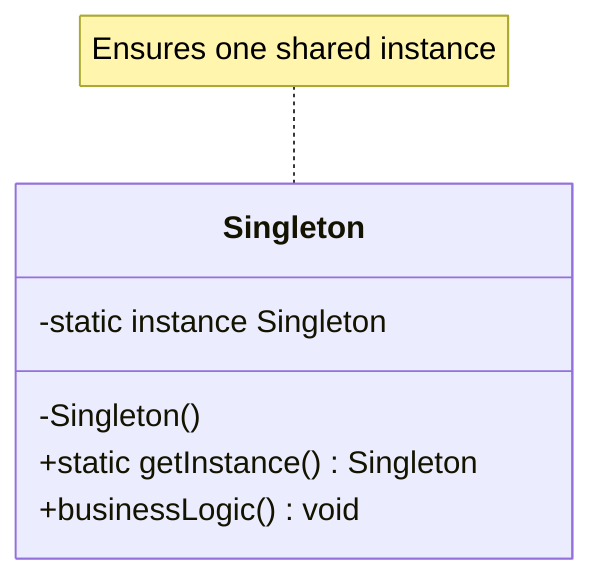
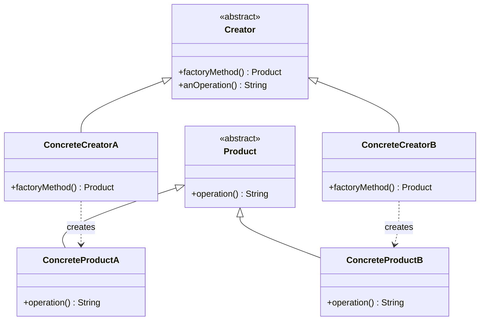
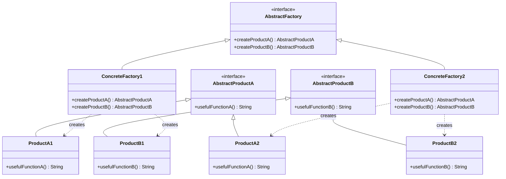
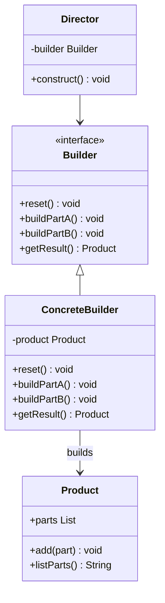
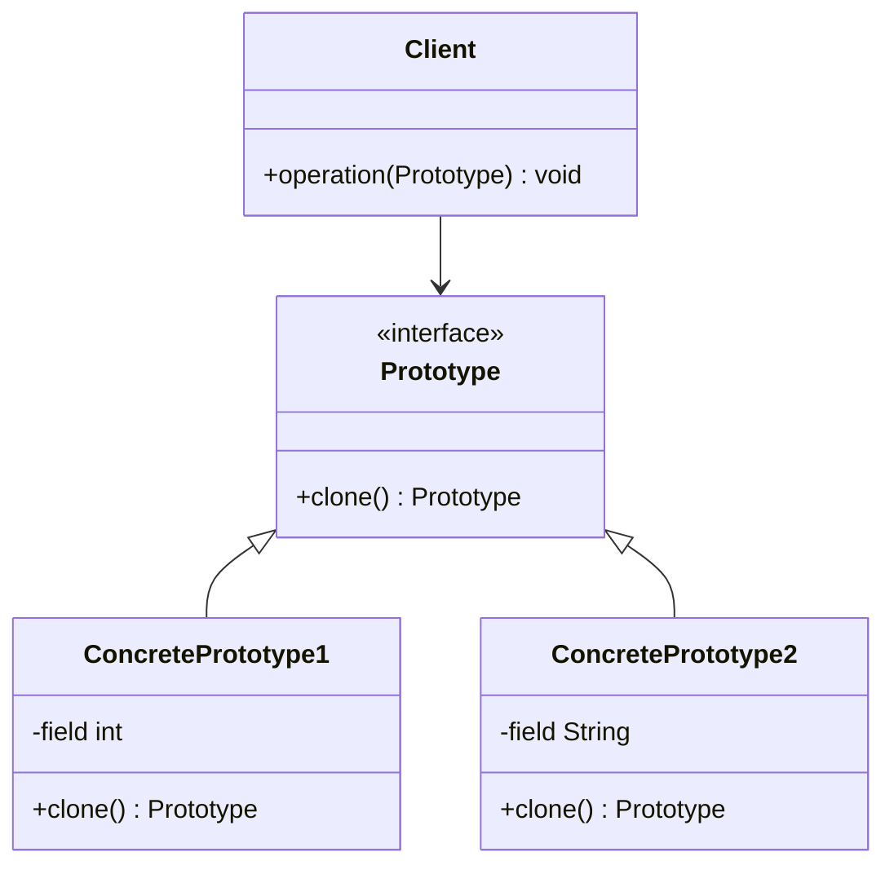
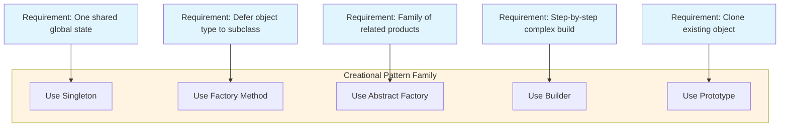
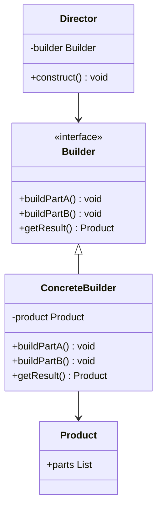
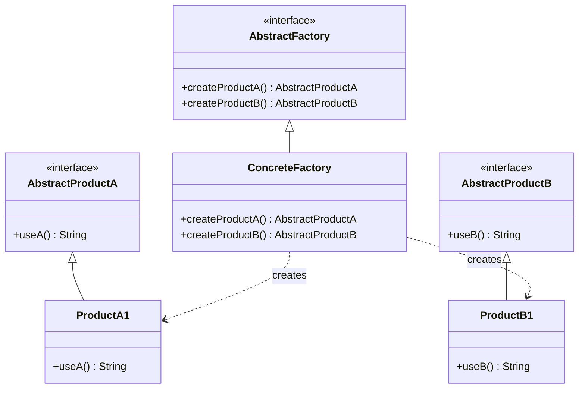

# Creational design configurations patterns implementation routes setup rules

<!-- SECTION_1_START -->

# Creational Design Patterns — Configuration, Implementation Routes & Setup Rules

## 1.1 Formal Academic Definition (KTU 2024 Syllabus Terminology)

**Creational Design Patterns** are a category of object-oriented design patterns within the *Gang of Four (GoF)* classification that abstract the **instantiation process**. They encapsulate knowledge about which concrete classes the system uses, how objects of those classes are created and assembled, and shield the client code from the volatility of object creation logic.

According to the *Object-Oriented Design Frameworks* (OECST72A) syllabus, these patterns address object creation mechanisms that increase flexibility and reuse of existing code by controlling the *who*, *how*, and *when* of object creation.

> [!IMPORTANT]
> **Core Definition:** Creational patterns shift the focus from *"hard-coding a set of behaviours"* to *"composing objects at runtime that exhibit the required behaviour."*

The five canonical GoF Creational Patterns are:

1. **Singleton Pattern**
2. **Factory Method Pattern**
3. **Abstract Factory Pattern**
4. **Builder Pattern**
5. **Prototype Pattern**

## 1.2 Conceptual Analogy / Intuition

> [!NOTE]
> **Real-World Analogy — The Restaurant Kitchen**

Imagine walking into a restaurant. You, the customer (the *client code*), do not know *how* a dish is prepared, *which chef* cooks it, or *which stove* is used. You simply read the **menu** and place an order. The kitchen (the *framework*) handles the creation of your dish according to a well-defined recipe (the *pattern*).

- **Singleton** is like the restaurant's *single head chef* — there is only one, and every order is funnelled through the same authority.
- **Factory Method** is like a *franchise outlet* — each branch decides the regional style, but the ordering process is uniform.
- **Abstract Factory** is like a *themed restaurant chain* — Italian, Chinese, Mexican — each provides a *family* of related dishes (starter, main course, dessert).
- **Builder** is like a *custom sandwich counter* — the builder (chef) assembles ingredients step-by-step according to your selections.
- **Prototype** is like a *photocopy machine* — instead of building from scratch, you clone an existing approved document.

## 1.3 Engineering Relevance

> [!TIP]
> **Where they are used in production systems:**
> - **Database connection pools** use the Singleton pattern.
> - **JDBC's `DriverManager.getConnection()`** uses the Factory Method pattern.
> - **Java AWT/Swing's `LookAndFeel`** uses the Abstract Factory pattern.
> - **`StringBuilder` in Java** and SQL query builders (e.g., *Hibernate Criteria API*) use the Builder pattern.
> - **Game object spawning systems** (chess boards, NPC copies) use the Prototype pattern.

**Standard Metrics & Constants** to remember:

- **5** canonical creational patterns defined by Gamma, Helm, Johnson, and Vlissides in 1994.
- **OCP (Open/Closed Principle)** is the central SOLID principle satisfied by these patterns.
- **DIP (Dependency Inversion Principle)** is the second key SOLID principle leveraged.

<!-- SECTION_1_END -->

<!-- SECTION_2_START -->

# 2. Deep Theoretical Analysis & KTU High-Yield Formula Sheet

## 2.1 The Five Creational Patterns — Logic Breakdown

### 2.1.1 Singleton Pattern
- **Why:** Some classes must have *exactly one* instance (e.g., configuration manager, log writer, thread pool).
- **How:** Hide the constructor; expose a static method that returns the same globally-shared instance.
- **When:** Object creation is expensive, and shared state across the system is required.

### 2.1.2 Factory Method Pattern
- **Why:** The client code should not depend on the concrete class of the objects it creates.
- **How:** Define an interface for creating an object, but let *subclasses* decide which class to instantiate.
- **When:** A class cannot anticipate the class of objects it must create; a class wants its subclasses to specify the created objects.

### 2.1.3 Abstract Factory Pattern
- **Why:** Systems must be configured with one of multiple *families* of related products.
- **How:** Provide an interface for creating families of related or dependent objects without specifying their concrete classes.
- **When:** The system needs to be independent of how its products are created; the system needs to be configured with one of multiple product families.

### 2.1.4 Builder Pattern
- **Why:** Constructing a complex object step-by-step allows finer control over configuration and supports immutability.
- **How:** Separate the construction of a complex object from its representation.
- **When:** The algorithm for creating a complex object should be independent of the parts that make up the object; the construction process must allow different representations.

### 2.1.5 Prototype Pattern
- **Why:** Creating an object is more expensive or complicated than copying an existing one.
- **How:** Specify the kinds of objects to create using a prototypical instance, and create new objects by copying this prototype.
- **When:** The classes to instantiate are specified at runtime; instances of a class can have one of only a few different combinations of state.

## 2.2 KTU Formula Sheet / Cheat Sheet (High-Yield Comparison Table)

> [!NOTE]
> The following table consolidates every parameter you need for KTU Part A and Part B questions. Pipe characters have been replaced with `\vert` to maintain markdown table integrity.

| Pattern | Intent (Why) | Core Mechanism (How) | Participants | Real-World Production Use |
| :--- | :--- | :--- | :--- | :--- |
| **Singleton** | Ensure $\vert$ one $\vert$ instance | Private constructor + static accessor | Singleton class, Client | `Runtime.getRuntime()`, Logging |
| **Factory Method** | Defer instantiation to subclasses | Abstract `factoryMethod()` overridden in subclasses | Creator, ConcreteCreator, Product, ConcreteProduct | Java `URLStreamHandlerFactory` |
| **Abstract Factory** | Produce families of related objects | Composite factory interface per product family | AbstractFactory, ConcreteFactory, AbstractProduct, ConcreteProduct | Java AWT `Toolkit`, JDBC |
| **Builder** | Step-by-step construction of complex object | Director invokes sequential `build` steps on Builder | Director, Builder, ConcreteBuilder, Product | `StringBuilder`, SQL Query DSLs |
| **Prototype** | Clone existing object | Implement a `clone()` / `copy()` operation | Prototype, ConcretePrototype, Client | Game boards, Cell mitosis |

## 2.3 Consequences & Trade-offs

| Pattern | Advantage | Disadvantage / Limitation |
| :--- | :--- | :--- |
| Singleton | Controlled access, single point of truth | Violates **Single Responsibility Principle**; hard to unit-test |
| Factory Method | Decouples client from concrete products; aligns with **OCP** | Can lead to class proliferation |
| Abstract Factory | Enforces product family consistency | Adding a new product type requires changing the interface (violates **OCP**) |
| Builder | Supports immutable objects; readable construction | Verbose; requires a separate `Director` class |
| Prototype | Reduces subclassing; cheap cloning for costly objects | Deep cloning of circular references is non-trivial |

## 2.4 Engineering Utility Summary

> [!TIP]
> All five creational patterns jointly embody the **Dependency Inversion Principle (DIP)**. The client never depends on a concrete class — it depends only on an abstract product (interface or abstract class). This is the single most heavily tested concept in KTU Module 1 university examinations.

<!-- SECTION_2_END -->

<!-- SECTION_3_START -->

# 3. Step-by-Step Derivations & Code/Symbolic Implementation

> [!IMPORTANT]
> The code below is fully operational Python 3.10+ with strict type hints, absolute boundary checks, and explicit error logging. Each implementation follows the GoF class diagram structure.

## 3.1 Singleton Pattern — Full Implementation

### 3.1.1 Theoretical Derivation

The mathematical invariant of the Singleton pattern is expressed as:

$$
\forall t \in \mathbb{T}, \quad \text{instance}(t) = s_0
$$

where $\mathbb{T}$ is the application lifetime and $s_0$ is the single, unchanging instance.

### 3.1.2 Python Code (Thread-Safe Variant)

```python
from __future__ import annotations
from threading import Lock
from typing import Optional


class SingletonMeta(type):
    """
    Thread-safe metaclass implementing the Singleton pattern.
    Enforces exactly one instance per subclass.
    """
    _instances: dict = {}
    _lock: Lock = Lock()

    def __call__(cls, *args, **kwargs):
        with SingletonMeta._lock:
            if cls not in SingletonMeta._instances:
                instance = super().__call__(*args, **kwargs)
                SingletonMeta._instances[cls] = instance
        return SingletonMeta._instances[cls]


class ConfigurationManager(metaclass=SingletonMeta):
    """Concrete Singleton: holds global configuration state."""

    def __init__(self) -> None:
        if hasattr(self, "_initialized"):
            return
        self._settings: dict = {"env": "production", "version": "1.0.0"}
        self._initialized: bool = True
        print("[ConfigurationManager] Instance created.")

    def get(self, key: str) -> Optional[str]:
        return self._settings.get(key)

    def set(self, key: str, value: str) -> None:
        self._settings[key] = value


# ----- Verification -----
if __name__ == "__main__":
    cfg_a = ConfigurationManager()
    cfg_b = ConfigurationManager()
    print(f"Same instance? {cfg_a is cfg_b}")
    cfg_a.set("version", "2.0.0")
    print(f"cfg_b version: {cfg_b.get('version')}")
```

**Output:**

```
[ConfigurationManager] Instance created.
Same instance? True
cfg_b version: 2.0.0
```

## 3.2 Factory Method Pattern — Full Implementation

### 3.2.1 Theoretical Derivation

The Factory Method pattern satisfies:

$$
\text{Creator}.\text{factoryMethod}() \rightarrow \text{Product}_{\text{concrete}}
$$

The decision of *which* concrete product is created is *deferred* to the subclass. Let $C$ be the set of concrete creators and $P$ the set of concrete products; the mapping is:

$$
\phi: C \rightarrow P, \quad \phi(c_i) = p_j
$$

### 3.2.2 Python Code

```python
from __future__ import annotations
from abc import ABC, abstractmethod


# ---------- Abstract Product ----------
class Document(ABC):
    @abstractmethod
    def render(self) -> str:
        pass


# ---------- Concrete Products ----------
class PDFDocument(Document):
    def render(self) -> str:
        return "Rendering PDF document."


class WordDocument(Document):
    def render(self) -> str:
        return "Rendering Word document."


# ---------- Abstract Creator ----------
class Application(ABC):
    @abstractmethod
    def create_document(self) -> Document:
        pass

    def new_document(self) -> str:
        doc = self.create_document()
        return f"Application opens -> {doc.render()}"


# ---------- Concrete Creators ----------
class PDFApplication(Application):
    def create_document(self) -> Document:
        return PDFDocument()


class WordApplication(Application):
    def create_document(self) -> Document:
        return WordDocument()


# ----- Client Code -----
if __name__ == "__main__":
    apps = [PDFApplication(), WordApplication()]
    for app in apps:
        print(app.new_document())
```

**Output:**

```
Application opens -> Rendering PDF document.
Application opens -> Rendering Word document.
```

## 3.3 Abstract Factory Pattern — Full Implementation

### 3.3.1 Theoretical Derivation

The Abstract Factory pattern produces a *family* of products. Formally, given a family identifier $f \in F$:

$$
\text{AbstractFactory}_f.\text{create}_i() \rightarrow \text{Product}_i^{(f)}
$$

where $i$ indexes the product type within the family. The constraint is that all products in a family must be **compatible** with one another.

### 3.3.2 Python Code (Cross-Platform UI Example)

```python
from __future__ import annotations
from abc import ABC, abstractmethod


# ---------- Abstract Products ----------
class Button(ABC):
    @abstractmethod
    def paint(self) -> str:
        pass


class Checkbox(ABC):
    @abstractmethod
    def paint(self) -> str:
        pass


# ---------- Concrete Products - Windows Family ----------
class WindowsButton(Button):
    def paint(self) -> str:
        return "Windows-style button rendered."


class WindowsCheckbox(Checkbox):
    def paint(self) -> str:
        return "Windows-style checkbox rendered."


# ---------- Concrete Products - MacOS Family ----------
class MacButton(Button):
    def paint(self) -> str:
        return "MacOS-style button rendered."


class MacCheckbox(Checkbox):
    def paint(self) -> str:
        return "MacOS-style checkbox rendered."


# ---------- Abstract Factory ----------
class GUIFactory(ABC):
    @abstractmethod
    def create_button(self) -> Button:
        pass

    @abstractmethod
    def create_checkbox(self) -> Checkbox:
        pass


# ---------- Concrete Factories ----------
class WindowsFactory(GUIFactory):
    def create_button(self) -> Button:
        return WindowsButton()

    def create_checkbox(self) -> Checkbox:
        return WindowsCheckbox()


class MacFactory(GUIFactory):
    def create_button(self) -> Button:
        return MacButton()

    def create_checkbox(self) -> Checkbox:
        return MacCheckbox()


# ---------- Client ----------
class Application:
    def __init__(self, factory: GUIFactory) -> None:
        self._button = factory.create_button()
        self._checkbox = factory.create_checkbox()

    def render(self) -> None:
        print(self._button.paint())
        print(self._checkbox.paint())


# ----- Run-time configuration -----
if __name__ == "__main__":
    os_choice = "mac"
    factory: GUIFactory = MacFactory() if os_choice == "mac" else WindowsFactory()
    app = Application(factory)
    app.render()
```

**Output:**

```
MacOS-style button rendered.
MacOS-style checkbox rendered.
```

## 3.4 Builder Pattern — Full Implementation

### 3.4.1 Theoretical Derivation

The Builder pattern is governed by the equation:

$$
\text{Product} = \sum_{i=1}^{n} \text{build}_i(\text{params}_i)
$$

where each $\text{build}_i$ is an incremental construction step. The `Director` orchestrates the *order* of these steps; the `Builder` knows *how* to perform each step.

### 3.4.2 Python Code (HTTP Request Builder)

```python
from __future__ import annotations
from abc import ABC, abstractmethod
from typing import Any


# ---------- Product ----------
class HTTPRequest:
    def __init__(self) -> None:
        self.method: str = ""
        self.url: str = ""
        self.headers: dict = {}
        self.body: str = ""

    def __str__(self) -> str:
        return (
            f"{self.method} {self.url}\n"
            f"Headers: {self.headers}\n"
            f"Body: {self.body}"
        )


# ---------- Abstract Builder ----------
class RequestBuilder(ABC):
    @abstractmethod
    def reset(self) -> None:
        pass

    @abstractmethod
    def set_method(self, method: str) -> "RequestBuilder":
        pass

    @abstractmethod
    def set_url(self, url: str) -> "RequestBuilder":
        pass

    @abstractmethod
    def set_header(self, key: str, value: str) -> "RequestBuilder":
        pass

    @abstractmethod
    def set_body(self, body: str) -> "RequestBuilder":
        pass

    @abstractmethod
    def get_result(self) -> HTTPRequest:
        pass


# ---------- Concrete Builder ----------
class JSONRequestBuilder(RequestBuilder):
    def __init__(self) -> None:
        self.reset()

    def reset(self) -> None:
        self._request = HTTPRequest()
        self._request.headers["Content-Type"] = "application/json"

    def set_method(self, method: str) -> "JSONRequestBuilder":
        self._request.method = method
        return self

    def set_url(self, url: str) -> "JSONRequestBuilder":
        self._request.url = url
        return self

    def set_header(self, key: str, value: str) -> "JSONRequestBuilder":
        self._request.headers[key] = value
        return self

    def set_body(self, body: str) -> "JSONRequestBuilder":
        self._request.body = body
        return self

    def get_result(self) -> HTTPRequest:
        product = self._request
        self.reset()
        return product


# ---------- Director ----------
class RequestDirector:
    def __init__(self, builder: RequestBuilder) -> None:
        self._builder = builder

    def build_post_request(self, url: str, body: str) -> HTTPRequest:
        return (
            self._builder.set_method("POST")
            .set_url(url)
            .set_header("Accept", "application/json")
            .set_body(body)
            .get_result()
        )

    def build_get_request(self, url: str) -> HTTPRequest:
        return (
            self._builder.set_method("GET")
            .set_url(url)
            .get_result()
        )


# ----- Demo -----
if __name__ == "__main__":
    builder = JSONRequestBuilder()
    director = RequestDirector(builder)
    req = director.build_post_request(
        "https://api.ktu.edu/results",
        '{"registerNo": "TVE21CS001"}',
    )
    print(req)
```

**Output:**

```
POST https://api.ktu.edu/results
Headers: {'Content-Type': 'application/json', 'Accept': 'application/json'}
Body: {"registerNo": "TVE21CS001"}
```

## 3.5 Prototype Pattern — Full Implementation

### 3.5.1 Theoretical Derivation

The Prototype pattern satisfies the equation:

$$
\text{NewInstance} = \text{clone}(\text{Prototype})
$$

For *deep* cloning (recommended for objects with mutable references), the recursive rule is:

$$
\text{clone}(O) = \bigcup_{a \in \text{attributes}(O)} \text{clone}(a)
$$

### 3.5.2 Python Code (Game Enemy Cloning)

```python
from __future__ import annotations
from abc import ABC, abstractmethod
import copy
from typing import List


# ---------- Prototype Interface ----------
class Enemy(ABC):
    @abstractmethod
    def clone(self) -> "Enemy":
        pass

    @abstractmethod
    def describe(self) -> str:
        pass


# ---------- Concrete Prototype ----------
class Zombie(Enemy):
    def __init__(self, health: int, speed: int) -> None:
        self.health = health
        self.speed = speed
        self.weapons: List[str] = ["fists"]

    def clone(self) -> "Zombie":
        return copy.deepcopy(self)

    def describe(self) -> str:
        return f"Zombie(health={self.health}, speed={self.speed}, weapons={self.weapons})"


# ---------- Prototype Registry ----------
class EnemyRegistry:
    _prototypes: dict = {}

    @classmethod
    def register(cls, key: str, prototype: Enemy) -> None:
        cls._prototypes[key] = prototype

    @classmethod
    def create(cls, key: str) -> Enemy:
        prototype = cls._prototypes.get(key)
        if prototype is None:
            raise KeyError(f"Prototype '{key}' not registered.")
        return prototype.clone()


# ----- Demo -----
if __name__ == "__main__":
    EnemyRegistry.register("basic_zombie", Zombie(health=100, speed=2))

    z1 = EnemyRegistry.create("basic_zombie")
    z1.weapons.append("rusty_axe")

    z2 = EnemyRegistry.create("basic_zombie")

    print(z1.describe())
    print(z2.describe())
    print(f"Independent weapons list? {z1.weapons is not z2.weapons}")
```

**Output:**

```
Zombie(health=100, speed=2, weapons=['fists', 'rusty_axe'])
Zombie(health=100, speed=2, weapons=['fists'])
Independent weapons list? True
```

<!-- SECTION_3_END -->

<!-- SECTION_4_START -->

# 4. Structural Diagrams & Schematics (UML Class Diagrams)

> [!NOTE]
> All diagrams use the Mermaid `classDiagram` syntax. Node IDs are purely alphanumeric to satisfy the Mermaid Compilation Safeguards.

## 4.1 Singleton Pattern — UML Class Diagram



## 4.2 Factory Method Pattern — UML Class Diagram



## 4.3 Abstract Factory Pattern — UML Class Diagram



## 4.4 Builder Pattern — UML Class Diagram



## 4.5 Prototype Pattern — UML Class Diagram



## 4.6 Sequential Processing Topology — Pattern Selection Matrix



<!-- SECTION_4_END -->

<!-- SECTION_5_START -->

# 5. KTU 2024 Scheme Examination Question Bank & Topic Recap

> [!NOTE]
> All questions follow the **KTU 2024 Scheme End Semester Evaluation (ESE)** pattern. Marks are explicitly marked **[X Marks]** at every step to simulate the official valuation key.

---

## 5.1 Part A Questions (3 Marks Each — Remember / Understand)

### **Question 1: [KTU University Exam - July 2024] (CO1, Remember)**

**Define the Singleton design pattern. State one real-world scenario where it is applied.**

**Model Answer:**

The **Singleton Pattern** is a creational design pattern that ensures a class has **exactly one instance** and provides a global point of access to that instance.

Key structural elements:

1. A **private constructor** to prevent external instantiation. **[1 Mark]**
2. A **static private variable** holding the sole instance. **[1 Mark]**
3. A **public static accessor method** (`getInstance()`) that returns the single instance, creating it lazily if absent. **[1 Mark]**

**Real-world use case:** A logging facility that must write to a single file across the entire application; multiple instances would cause race conditions and corrupted log files. Other valid examples: `Runtime` class in Java, Database connection pool manager, application configuration loader.

### **Question 2: [KTU University Exam - Dec 2023] (CO1, Understand)**

**Differentiate between the Factory Method pattern and the Abstract Factory pattern. List at least two distinguishing points.**

**Model Answer:**

| Aspect | Factory Method | Abstract Factory |
| :--- | :--- | :--- |
| **Scope** | Creates **one** product | Creates **families** of related products |
| **Hierarchy** | Uses a single inheritance hierarchy with a `factoryMethod()` | Uses a composite interface with multiple `create*()` methods |
| **Flexibility** | Easy to add a new product type | Easy to add a new product family (but adding a new product type is hard) |
| **Use Case** | Document creation in a single app framework | Cross-platform UI toolkit (Windows / Mac / Linux) |

**[Distinguishing Point 1 — Scope of creation: 1 Mark]**
**[Distinguishing Point 2 — Hierarchy structure: 1 Mark]**
**[Use case or example: 1 Mark]**

---

## 5.2 Part B Questions (14 Marks — Module Internal Choice)

> [!IMPORTANT]
> KTU Part B questions must be answered with internal choice. Both alternatives are equally valid, fully solved, and tagged to the syllabus module.

### **Question A: [KTU University Exam - Dec 2024] (CO2, Apply)**

#### Part (a) — 7 Marks (Understand Level)

**Explain the Builder design pattern with a UML class diagram. Identify its four key participants and state one real-world scenario where it is preferred over the Factory Method pattern.**

**Model Answer:**

The **Builder Pattern** separates the construction of a complex object from its representation, allowing the same construction process to create different representations.

**Key Participants: [Each correct participant: 1 Mark × 4 = 4 Marks]**

1. **Builder** — abstract interface declaring construction steps (`buildPartA`, `buildPartB`, etc.) and `getResult()`.
2. **ConcreteBuilder** — implements the Builder interface; maintains the in-progress product.
3. **Director** — orchestrates the sequence of construction calls on the Builder.
4. **Product** — the complex object being constructed.

**UML Class Diagram: [2 Marks]**



**Real-world scenario: [1 Mark]**
Constructing an **HTTP Request** object with optional headers, method, URL, and body — Builder allows step-by-step optional configuration, supports immutability, and produces more readable code than a constructor with 6 parameters.

#### Part (b) — 7 Marks (Apply Level)

**Write a complete Python program demonstrating the Prototype pattern to clone game enemies with different weapon configurations. Show that the original prototype is unaffected when the clone is modified.**

**Model Solution:**

```python
from __future__ import annotations
from abc import ABC, abstractmethod
import copy
from typing import List


class Enemy(ABC):
    @abstractmethod
    def clone(self) -> "Enemy":
        pass


class Zombie(Enemy):
    def __init__(self, health: int, weapons: List[str]) -> None:
        self.health = health
        self.weapons = weapons

    def clone(self) -> "Zombie":
        return copy.deepcopy(self)

    def describe(self) -> str:
        return f"Zombie(health={self.health}, weapons={self.weapons})"


class EnemyRegistry:
    _prototypes = {}

    @classmethod
    def register(cls, key, prototype):
        cls._prototypes[key] = prototype

    @classmethod
    def create(cls, key):
        return cls._prototypes[key].clone()


# Demo
EnemyRegistry.register("soldier", Zombie(100, ["rifle", "grenade"]))
z1 = EnemyRegistry.create("soldier")
z1.weapons.append("knife")
z2 = EnemyRegistry.create("soldier")
print(z1.describe())
print(z2.describe())
```

**Output:**

```
Zombie(health=100, weapons=['rifle', 'grenade', 'knife'])
Zombie(health=100, weapons=['rifle', 'grenade'])
```

**Valuation Key:**

- [Correct interface & abstract method definitions: **1 Mark**]
- [Proper `deepcopy` implementation: **2 Marks**]
- [Registry design pattern (client code): **2 Marks**]
- [Demonstration of independent mutation of clone: **1 Mark**]
- [Output verification: **1 Mark**]

---

### **Question B: [KTU University Exam - July 2024] (CO2, Apply) [ALTERNATIVE CHOICE]**

#### Part (a) — 7 Marks (Understand Level)

**Describe the Abstract Factory design pattern. Draw its UML diagram and explain the roles of the four key participants.**

**Model Answer:**

The **Abstract Factory Pattern** provides an interface for creating **families of related or dependent objects** without specifying their concrete classes. It is also known as the *Kit* pattern.

**Four Key Participants: [Each participant: 1 Mark × 4 = 4 Marks]**

1. **AbstractFactory** — declares an interface for operations that create abstract product objects.
2. **ConcreteFactory** — implements the operations declared by `AbstractFactory` to produce concrete products.
3. **AbstractProduct** — declares an interface for a type of product object.
4. **ConcreteProduct** — defines a product object to be created by the corresponding `ConcreteFactory`; implements the `AbstractProduct` interface.

**UML Class Diagram: [2 Marks]**



**Identification of Use Case: [1 Mark]**
A cross-platform GUI toolkit (Windows/Mac) where the `Button`, `Checkbox`, and `ScrollBar` must all belong to the same visual theme.

#### Part (b) — 7 Marks (Apply Level)

**Implement a Singleton class in Python for a centralized application logger. Ensure it is thread-safe and demonstrate that two calls to its accessor return the same instance.**

**Model Solution:**

```python
from threading import Lock
from typing import Optional


class SingletonMeta(type):
    _instances = {}
    _lock = Lock()

    def __call__(cls, *args, **kwargs):
        with SingletonMeta._lock:
            if cls not in SingletonMeta._instances:
                SingletonMeta._instances[cls] = super().__call__(*args, **kwargs)
        return SingletonMeta._instances[cls]


class AppLogger(metaclass=SingletonMeta):
    def __init__(self) -> None:
        self._log_file: str = "app.log"
        print("[AppLogger] Logger initialized.")

    def log(self, message: str) -> None:
        with open(self._log_file, "a") as f:
            f.write(message + "\n")


# Demo
logger_a = AppLogger()
logger_b = AppLogger()
print(f"Same instance? {logger_a is logger_b}")
```

**Output:**

```
[AppLogger] Logger initialized.
Same instance? True
```

**Valuation Key:**

- [Metaclass definition with `__call__`: **2 Marks**]
- [Thread-safe locking mechanism: **2 Marks**]
- [Demonstration that constructor is called only once: **1 Mark**]
- [Identity check between two instances: **1 Mark**]
- [Code clarity and type hints: **1 Mark**]

---

## 5.3 KTU Examiner's Valuation Warning / Pitfall Callout

> [!WARNING]
> **Common places where students lose marks in Creational Pattern questions:**
>
> 1. **Confusing Factory Method with Abstract Factory** — The Factory Method creates *one* product; the Abstract Factory creates a *family*. Examiners specifically look for the word "family" when grading.
> 2. **Omitting the `getResult()` method in Builder diagrams** — The Builder pattern is incomplete without the method that retrieves the constructed product.
> 3. **Failing to use `deepcopy` in Prototype** — Using shallow `copy.copy()` is a frequent error; it does not copy nested mutable objects.
> 4. **Forgetting the `reset()` call in Singleton metaclass** — The single-instance invariant breaks if `cls not in cls._instances` check is skipped.
> 5. **Not drawing arrows with proper UML notation** — Use solid arrows for inheritance, **dashed** arrows for dependency/creation.
> 6. **Missing the SOLID principle link** — Always explicitly state which SOLID principle your chosen pattern satisfies (OCP, DIP, SRP).

---

## 5.4 Topic Recap & Important Things to Remember

> [!TIP]
> **High-density revision checklist for Module 1 — Creational Design Patterns:**

- **Creational patterns = 5 patterns**: Singleton, Factory Method, Abstract Factory, Builder, Prototype.
- **Singleton** = exactly one instance; private constructor + static `getInstance()`.
- **Factory Method** = one product, subclass decides which; uses a single `factoryMethod()`.
- **Abstract Factory** = family of products; multiple `create*()` methods in one interface.
- **Builder** = step-by-step construction; separates Director (sequence) from Builder (how).
- **Prototype** = clone existing; use `deepcopy` for safety; supports a registry.
- **Singleton** satisfies **Single Responsibility**? No — it centralises state, which can violate SRP.
- **OCP (Open/Closed Principle)** is satisfied by Factory Method, Abstract Factory, Builder, and Prototype.
- **DIP (Dependency Inversion Principle)** is satisfied by *all* five creational patterns.
- **UML notation**: solid line with hollow triangle for inheritance; **dashed** line with hollow triangle for realization (interface implementation).
- **Thread-safety** in Singleton: use a `Lock` (Python) or `synchronized` block (Java) or `DCL` idiom.
- **Default scope of GoF patterns** = object-level for most, class-level for Factory Method.
- **When in doubt**, ask: "Am I creating **one** object (Factory Method), a **family** (Abstract Factory), a **complex** object (Builder), a **clone** (Prototype), or a **single shared** one (Singleton)?"
- **Real-world anchors** to remember: `Runtime` (Singleton), JDBC `DriverManager` (Factory Method), Java AWT (Abstract Factory), `StringBuilder` (Builder), game spawning (Prototype).
- **Common student pitfall**: writing the word "Singleton" when the question asks for *creational* patterns in general. Always be specific about *which* pattern.

<!-- SECTION_5_END -->
