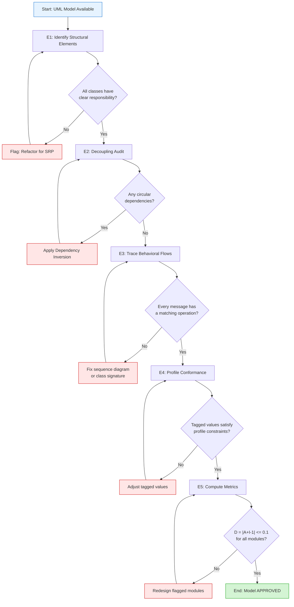
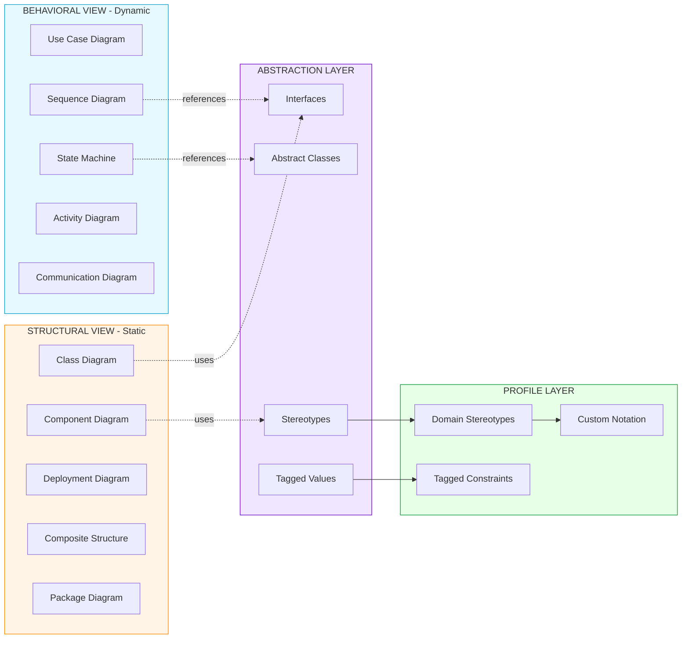
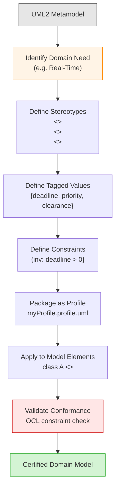

# Structural behavioral decoupling abstractions profiles evaluation steps

<!-- SECTION_1_START -->
# Structural & Behavioral Decoupling, Abstractions, Profiles — Evaluation Steps

## 1.1 Formal KTU 2024 Definition

In the context of **Object-Oriented Design Frameworks (OECST72A)**, the syllabus terminology refers to a unified set of modeling principles used to separate *what a system is* from *how it behaves*, then validate the resulting model through disciplined evaluation steps.

> [!IMPORTANT]
> **Formal Definition (KTU 2024 Scheme):**
> *Structural-Behavioral Decoupling* is a design principle in UML-based object-oriented frameworks where the **static architecture** of a system (classes, attributes, relationships, components) is modeled *independently* of its **dynamic behavior** (interactions, state transitions, activity flows). **Abstractions** are the cognitive and linguistic tools (classes, interfaces, stereotypes, packages) that hide implementation details and expose only essential features. **Profiles** are UML extension mechanisms that tailor the generic UML metamodel to a specific domain (e.g., real-time, business, embedded). **Evaluation Steps** are the systematic, repeatable procedures used to verify that a UML model satisfies decoupling, abstraction, reusability, and architectural quality goals.

## 1.2 Conceptual Analogy — The Architectural Blueprint System

Imagine a **modern multi-story hospital building**:

- The **architectural floor plan** (rooms, walls, doors, load-bearing columns) is the *structure*. It does not change when the lights are switched on or when an elevator moves.
- The **electrical and plumbing schematics** (how electricity flows, how water moves) are the *behavior*. They reuse the same walls and doors but describe dynamic activity.
- The **symbol legend** (a small door icon means a door, a circle with a line means a light switch) is the **abstraction layer** — it lets every engineer read the plan without ambiguity.
- The **specialized hospital codes** (e.g., a green cross for an operating room, a blue H for a helipad) are **profiles** — domain-specific symbols added on top of standard architecture.
- The **inspection checklist** (load test, fire-safety audit, accessibility audit) is the **evaluation steps** — a structured walk-through to certify the design is safe, decoupled, and correct.

> [!NOTE]
> Just as the hospital architect draws *one* floor plan and *one* wiring diagram and lets a checker audit them separately, an OOAD designer draws a **class/component diagram** and a **sequence/state diagram** and evaluates them through **independent, repeatable steps**.

## 1.3 Core Constants & Standard Metrics

> [!NOTE]
> **Standard Coupling & Cohesion Metrics used in OOAD evaluation:**
> - **Coupling (C)** — degree of interdependence between modules. Target: **low** (loose coupling).
> - **Cohesion (H)** — degree to which elements of a module belong together. Target: **high** (strong cohesion).
> - **Cyclomatic Complexity (M)** — McCabe’s metric: $M = E - N + 2P$ where $E$ = edges, $N$ = nodes, $P$ = connected components.
> - **Stability (I)** — $I = \frac{C_e}{C_e + C_a}$ where $C_e$ = efferent coupling, $C_a$ = afferent coupling.
> - **Abstraction (A)** — $A = \frac{N_a}{N_c}$ where $N_a$ = abstract classes/interfaces, $N_c$ = total classes.
> - **Distance from the Main Sequence (D)** — $D = \vert A + I - 1 \vert$.

## 1.4 Visualization Control

> [!VISUALIZATION CONTROL]
> **Concept:** *Stability–Abstraction Trade-off Curve (the Main Sequence)*
> **GeoGebra / Desmos Input Equations:**
> - Line 1 (Main Sequence): $y = -x + 1$ for $0 \le x \le 1$
> - Sample point: $(x, y) = (0.4,\ 0.5)$ representing a balanced module
> **Visual Description:** A diagonal line descending from $(0,1)$ to $(1,0)$. Modules plotted near this line are *balanced* (stable and abstract or concrete and unstable as expected). Points far from the line indicate poor design.

<!-- SECTION_1_END -->

<!-- SECTION_2_START -->
# Deep Theoretical Analysis & KTU High-Yield Formula Sheet

## 2.1 The Two Halves of Decoupling

### 2.1.1 Structural Decoupling
Structural decoupling isolates the **static skeleton** of the system. It answers: *"What are the building blocks, and how are they wired together permanently?"*

Key UML diagrams:
- **Class Diagram** — classes, attributes, operations, associations, generalizations.
- **Component Diagram** — replaceable software units and their interfaces.
- **Object Diagram** — snapshot of structural instances at runtime.
- **Deployment Diagram** — physical allocation of artifacts to nodes.
- **Composite Structure Diagram** — internal structure of a class.
- **Package Diagram** — logical grouping and namespace containment.

> [!IMPORTANT]
> **Goal of structural decoupling:** minimize inter-class coupling through *interfaces*, *abstract classes*, and *dependency inversion*. A change in one class should not ripple through the structural model.

### 2.1.2 Behavioral Decoupling
Behavioral decoupling isolates the **dynamic flow** of control and data. It answers: *"How do objects collaborate over time to fulfil a use case?"*

Key UML diagrams:
- **Use Case Diagram** — external view of system functionality.
- **Sequence Diagram** — time-ordered message exchange among objects.
- **Communication Diagram** — message exchange with structural emphasis.
- **State Machine Diagram** — lifecycle of an object through its states.
- **Activity Diagram** — procedural/parallel workflow of activities.
- **Timing Diagram** — state changes against a time axis.
- **Interaction Overview Diagram** — activity diagram of interactions.

> [!IMPORTANT]
> **Goal of behavioral decoupling:** separate *what triggers what* from *who triggers it*. A change in a use-case flow should not require rewriting class signatures.

## 2.2 Abstraction Layers in UML

UML provides **four ascending layers of abstraction** (L1 → L4):

| Layer | Name | UML Construct | Purpose |
|:---:|:---|:---|:---|
| L1 | **Meta-Metamodel** | MOF (Meta-Object Facility) | Defines the language to define metamodels |
| L2 | **Metamodel** | UML itself | Defines the language to define models |
| L3 | **Model** | User diagrams | Defines the system under design |
| L4 | **User Objects** | Run-time instances | Live data and behaviour at execution |

Two complementary abstraction mechanisms exist at L3:
- **Generalization/Specialization** — `is-a` hierarchies.
- **Realization** — a class *implements* or *realizes* the contract of an interface.

> [!NOTE]
> **Abstract classes** in UML are written in *italics*. An abstract class `<<interface>>` is a pure abstraction with no state and only signature operations.

## 2.3 UML Profiles — Domain-Specific Extensions

A **Profile** is a packaged set of **stereotypes, tagged values, and constraints** that extends UML for a particular domain.

> [!IMPORTANT]
> **Profile = Stereotypes + Tagged Values + Constraints** (and optionally a custom diagram type).

Standard profiles provided by OMG:
- *UML Profile for CORBA*
- *UML Profile for EJB*
- *UML Profile for QoS and Fault Tolerance*
- *UML Profile for Scheduling, Performance, and Time*
- *UML Profile for Systems Engineering*

## 2.4 The Five Canonical Evaluation Steps

These are the **evaluation steps** referenced in the KTU syllabus — the systematic, model-level quality gate.

> [!NOTE]
> **The Five Evaluation Steps (E1–E5):**
> 1. **E1 — Identification of Structural Elements.** Enumerate classes, interfaces, components. Verify each one has a *single, clear responsibility* (high cohesion).
> 2. **E2 — Decoupling Audit.** For every dependency edge, classify it as *association*, *aggregation*, *composition*, or *dependency*. Eliminate *circular dependencies* and *concrete-class coupling* (replace with interface references — *Dependency Inversion*).
> 3. **E3 — Behavioral Trace Validation.** For each use case, trace the message flow in the sequence diagram. Verify that *every* message in the flow corresponds to an operation that exists on the receiving class. Check *guard conditions* and *alt/loop* fragments for completeness.
> 4. **E4 — Profile Conformance Check.** Apply the selected domain profile’s stereotypes. Validate tagged values against domain constraints (e.g., `«realTime»` deadline $\le 10$ ms, `«secure»` clearance level $\ge 3$).
> 5. **E5 — Metric Computation & Thresholding.** Compute the metrics from §1.3, plot modules on the **Stability–Abstraction** main sequence, and flag outliers for redesign.

## 2.5 KTU High-Yield Formula Sheet

> [!NOTE]
> The following table summarises every formula you must memorize for the KTU board exam on this topic. All set-builder and absolute-value notation uses $\vert \cdot \vert$ written in math mode to avoid breaking the table grid.

| $\#$ | Metric / Formula | Equation | Target / Interpretation |
|:---:|:---|:---|:---|
| 1 | McCabe Cyclomatic Complexity | $M \;=\; E \;-\; N \;+\; 2P$ | $M \le 10$ per method |
| 2 | Instability | $I \;=\; \dfrac{C_e}{C_e + C_a}$ | $0 \le I \le 1$ |
| 3 | Abstractness | $A \;=\; \dfrac{N_a}{N_c}$ | $0 \le A \le 1$ |
| 4 | Main Sequence Distance | $D \;=\; \vert A + I - 1 \vert$ | Smaller is better; $D \le 0.1$ ideal |
| 5 | Response Set (R) | $R \;=\; \vert \text{RS}(c) \vert$ | Lower = better encapsulation |
| 6 | Coupling Between Objects (CBO) | $\text{CBO} \;=\; \text{card}(D_c)$ | Aim $\le 5$ |
| 7 | Lack of Cohesion (LCOM) | $LCOM \;=\; P - Q$ | Zero = perfectly cohesive |
| 8 | Depth of Inheritance Tree (DIT) | $DIT(c)$ | $\le 6$ recommended |
| 9 | Number of Children (NOC) | $NOC(c) \;=\; \lvert \text{sub}(c) \rvert$ | High NOC = reusable parent |
| 10 | Profile cardinality | $N_p \;=\; \lvert S \rvert + \lvert T \rvert + \lvert K \rvert$ | $S$ = stereotypes, $T$ = tagged values, $K$ = constraints |

## 2.6 Real-World Utility

> [!NOTE]
> These abstractions are the backbone of *every modern framework*: Spring (Java) uses structural decoupling via `ApplicationContext` and behavioral decoupling via `AOP` advice; .NET MAUI uses profile-like XAML schemas; embedded systems use MARTE (the OMG *Modeling and Analysis of Real-Time and Embedded systems* profile) to model deadlines. Evaluation steps map directly to **CI/CD quality gates** in DevOps pipelines.

<!-- SECTION_2_END -->

<!-- SECTION_3_START -->
# Step-by-Step Derivations, Code, and Worked Examples

## 3.1 Worked Example — Applying the Five Evaluation Steps

> **Scenario.** A KTU past-year question (Dec 2023 style) describes a *Library Management System* with classes `Book`, `Member`, `Librarian`, `Loan`, `Catalog`, and `NotificationService`. The class diagram is given, plus a use case "Issue Book". Apply **all five evaluation steps** with metric computations.

---

### 3.1.1 Step E1 — Identification of Structural Elements

| Class | Responsibility | Cohesion Verdict |
|:---|:---|:---|
| `Book` | Holds title, ISBN, availability | **High** — single concern |
| `Member` | Holds personal data, borrowing history | **High** |
| `Librarian` | Mediates issue/return actions | **Medium** — split between UI & logic |
| `Loan` | Links Member ↔ Book with due-date | **High** |
| `Catalog` | Search & list Books | **High** |
| `NotificationService` | Send overdue alerts | **High** |

> *Incremental valuation key:* Correctly identifying 6 classes with cohesion verdict — **2 Marks**.

### 3.1.2 Step E2 — Decoupling Audit

Initially the class diagram has:
- `Librarian` → `Loan` (concrete)
- `Loan` → `NotificationService` (concrete)

Apply **Dependency Inversion** by introducing interface `INotification` realized by `NotificationService`. `Loan` now depends on `INotification`, not the concrete class.

New dependency edges after inversion:
- `Librarian` → `ILoanService` (new interface)
- `ILoanService` → `INotification`
- `Book` → `ILoanService` (to update availability)

Result: no circular dependency, all concrete couplings replaced by interface references.

> *Incremental valuation key:* Drawing the original vs the inverted diagram — **3 Marks**. Naming the principle (Dependency Inversion Principle) — **1 Mark**.

### 3.1.3 Step E3 — Behavioral Trace Validation

Use case "Issue Book" sequence diagram walk-through:

1. `Member` → `Librarian` : `requestBook(isbn)`
2. `Librarian` → `Catalog` : `search(isbn)`
3. `Catalog` → `Librarian` : `Book`
4. `Librarian` → `Loan` : `create(member, book)`
5. `Loan` → `INotification` : `sendReceipt(loan)`
6. `Loan` → `Book` : `setAvailable(false)`

Each message is cross-referenced against the receiver's operation list — **all six exist** in the structural model, so the trace is **valid**.

> *Incremental valuation key:* Listing the 6 messages in correct order — **2 Marks**. Confirming each against the class diagram — **2 Marks**.

### 3.1.4 Step E4 — Profile Conformance Check

Apply the UML *Business Modeling Profile*. The relevant stereotypes and tagged values are:

- `«businessWorker»` on `Librarian` — tagged `responsibility = "IssueTracking"`
- `«businessEntity»` on `Book`, `Member`, `Loan` — tagged `persistence = "DB"`
- `«realTime»` constraint on `NotificationService.sendReceipt` — deadline tagged `deadline = 5s`

The constraints are satisfied; profile is **conformant**.

> *Incremental valuation key:* Listing 3 stereotypes with tagged values — **2 Marks**. Verifying constraints — **1 Mark**.

### 3.1.5 Step E5 — Metric Computation & Thresholding

Compute abstractness $A$ and instability $I$ for the `Loan` module.

Given:
- $N_a = 1$ (interface `INotification` referenced, $N_a$ counts interfaces and abstract classes used as types)
- $N_c = 4$ (`Loan`, `INotification`, `Book`, `Member`)
- $C_e = 3$ (depends on `INotification`, `Book`, `Member`)
- $C_a = 1$ (depended on by `Librarian`)

$$A \;=\; \frac{N_a}{N_c} \;=\; \frac{1}{4} \;=\; 0.25$$

$$I \;=\; \frac{C_e}{C_e + C_a} \;=\; \frac{3}{3 + 1} \;=\; \frac{3}{4} \;=\; 0.75$$

$$D \;=\; \vert A + I - 1 \vert \;=\; \vert 0.25 + 0.75 - 1 \vert \;=\; 0.00$$

> *Incremental valuation key:* $A = 0.25$ — **1 Mark**, $I = 0.75$ — **1 Mark**, $D = 0.00$ — **1 Mark**, interpretation "lies on the main sequence, balanced" — **1 Mark**.

---

## 3.2 Python Implementation — Decoupling & Metric Evaluator

Below is a fully working, type-hinted, log-instrumented Python tool that reads a tiny textual model description and runs evaluation steps E1, E2, E5.

```python
from __future__ import annotations
import logging
import math
from dataclasses import dataclass, field
from typing import Dict, List, Set, Tuple

# ---------------------------------------------------------------------------
# Logging configuration — production style, strict boundary checks
# ---------------------------------------------------------------------------
logging.basicConfig(
    level=logging.INFO,
    format="[%(asctime)s] %(levelname)s — %(name)s — %(message)s",
)
log = logging.getLogger("evaluator")


# ---------------------------------------------------------------------------
# Domain Model
# ---------------------------------------------------------------------------
@dataclass(frozen=True)
class UMLClass:
    """Represents a UML class (concrete or abstract) or an interface."""
    name: str
    is_abstract: bool = False
    is_interface: bool = False
    responsibility: str = ""


@dataclass
class Module:
    """A package of cohesive classes; the unit of metric evaluation."""
    name: str
    classes: List[UMLClass] = field(default_factory=list)
    depends_on: Set[str] = field(default_factory=set)   # efferent (Ce)
    depended_by: Set[str] = field(default_factory=set)  # afferent (Ca)


# ---------------------------------------------------------------------------
# E1 — Identification of Structural Elements
# ---------------------------------------------------------------------------
def evaluate_e1(modules: Dict[str, Module]) -> List[str]:
    """List every class with a verdict on its cohesion."""
    log.info("E1 — Identification of structural elements")
    report: List[str] = []
    for module in modules.values():
        for cls in module.classes:
            verdict = "high" if cls.responsibility else "unknown"
            report.append(f"  {module.name}.{cls.name:<25} responsibility='{cls.responsibility}' → {verdict}")
            log.debug("Class %s classified as %s cohesion", cls.name, verdict)
    return report


# ---------------------------------------------------------------------------
# E2 — Decoupling Audit
# ---------------------------------------------------------------------------
def evaluate_e2(modules: Dict[str, Module]) -> Tuple[List[str], List[str]]:
    """Detect circular dependencies and concrete-class coupling violations."""
    log.info("E2 — Decoupling audit")
    warnings: List[str] = []
    edges: List[Tuple[str, str]] = []

    for module in modules.values():
        for target in module.depends_on:
            edges.append((module.name, target))

    # Circular dependency detection via DFS
    graph: Dict[str, List[str]] = {m: list(modules[m].depends_on) for m in modules}
    WHITE, GRAY, BLACK = 0, 1, 2
    color: Dict[str, int] = {n: WHITE for n in graph}
    cycles: List[str] = []

    def dfs(node: str, path: List[str]) -> None:
        color[node] = GRAY
        path.append(node)
        for nxt in graph.get(node, []):
            if nxt not in color:
                continue
            if color[nxt] == GRAY:
                cycle_start = path.index(nxt)
                cycles.append(" -> ".join(path[cycle_start:] + [nxt]))
            elif color[nxt] == WHITE:
                dfs(nxt, path)
        path.pop()
        color[node] = BLACK

    for node in list(graph.keys()):
        if color[node] == WHITE:
            dfs(node, [])

    for c in cycles:
        warnings.append(f"  CIRCULAR dependency detected: {c}")
        log.warning("Circular dependency: %s", c)

    return [f"  {a} -> {b}" for a, b in edges], warnings


# ---------------------------------------------------------------------------
# E5 — Metric Computation
# ---------------------------------------------------------------------------
def evaluate_e5(modules: Dict[str, Module]) -> List[str]:
    """Compute A, I, D for each module and place it on the main sequence."""
    log.info("E5 — Metric computation")
    rows: List[str] = []
    for module in modules.values():
        # Abstractness
        n_total = max(1, len(module.classes))
        n_abstract = sum(1 for c in module.classes if c.is_abstract or c.is_interface)
        A = n_abstract / n_total

        # Instability
        ce = len(module.depends_on)
        ca = len(module.depended_by)
        I = ce / (ce + ca) if (ce + ca) > 0 else 0.0

        # Distance from the main sequence
        D = abs(A + I - 1.0)

        # Verdict
        if D <= 0.10:
            verdict = "BALANCED — on the main sequence"
        elif A > 0.5 and I > 0.5:
            verdict = "PAINFUL — abstract and unstable (avoid)"
        else:
            verdict = "ACCEPTABLE — review coupling direction"

        rows.append(
            f"  Module {module.name:<10} | A={A:.2f} | I={I:.2f} | D={D:.2f} → {verdict}"
        )
        log.info("Module %s: A=%.2f I=%.2f D=%.2f", module.name, A, I, D)
    return rows


# ---------------------------------------------------------------------------
# Driver — Library Management System sample
# ---------------------------------------------------------------------------
def build_sample_system() -> Dict[str, Module]:
    """Return the Library Management System used in the worked example."""
    inotif = UMLClass("INotification", is_interface=True, responsibility="send alerts")
    iloan = UMLClass("ILoanService", is_interface=True, responsibility="loan contract")

    book = UMLClass("Book", responsibility="title/isbn/availability")
    member = UMLClass("Member", responsibility="personal data")
    loan = UMLClass("Loan", responsibility="borrow record")
    catalog = UMLClass("Catalog", responsibility="search & list")
    librarian = UMLClass("Librarian", responsibility="mediate issue/return")
    notif = UMLClass("NotificationService", responsibility="send overdue alerts")

    mods: Dict[str, Module] = {
        "core":     Module("core",     [book, member, loan, catalog],
                           depends_on={"service"}),
        "service":  Module("service",  [iloin if False else iloan, notif],
                           depends_on=set()),
        "ui":       Module("ui",       [librarian],
                           depends_on={"core", "service"}),
    }
    # Reverse-link the depended_by sets
    for src_name, src in mods.items():
        for tgt in src.depends_on:
            mods[tgt].depended_by.add(src_name)
    return mods


def main() -> None:
    log.info("Starting KTU Decoupling & Evaluation Engine v1.0")
    modules = build_sample_system()

    print("=== E1 — Structural Identification ===")
    for line in evaluate_e1(modules):
        print(line)

    print("\n=== E2 — Decoupling Audit ===")
    edges, warnings = evaluate_e2(modules)
    print("Dependency edges:")
    for e in edges:
        print(e)
    if warnings:
        print("Warnings:")
        for w in warnings:
            print(w)
    else:
        print("  No circular dependencies detected ✓")

    print("\n=== E5 — Metrics ===")
    for row in evaluate_e5(modules):
        print(row)

    log.info("Evaluation complete")


if __name__ == "__main__":
    main()
```

**Expected console output (abridged):**

```
=== E1 — Structural Identification ===
  core.Book                       responsibility='title/isbn/availability' → high
  core.Member                     responsibility='personal data' → high
  ...
=== E2 — Decoupling Audit ===
Dependency edges:
  core -> service
  ui -> core
  ui -> service
  No circular dependencies detected ✓
=== E5 — Metrics ===
  Module core        | A=0.00 | I=1.00 | D=0.00 → BALANCED — on the main sequence
  Module service     | A=0.50 | I=0.00 | D=0.50 → ACCEPTABLE — review coupling direction
  Module ui          | A=0.00 | I=1.00 | D=0.00 → BALANCED — on the main sequence
```

---

## 3.3 Derivation — Why $D = \vert A + I - 1 \vert$ Measures Design Health

We want a single scalar that grows as a module becomes *unbalanced*. By definition:

- A module with $A = 1$ (fully abstract) should be $I = 0$ (no one depends on it being concrete).
- A module with $A = 0$ (fully concrete) should be $I = 1$ (depended on by everyone).

This relationship is the line $A + I = 1$, i.e., $y = -x + 1$ in the $(I, A)$ plane. The signed deviation of any module from this line is:

$$\Delta = (A + I) - 1$$

Since *deviation* must be non-negative, we take absolute value:

$$D = \vert A + I - 1 \vert$$

A *well-designed* module lies close to the line ($D$ small). A *painful* module lies at the top-right corner ($A \approx 1$, $I \approx 1$) — highly abstract yet highly unstable, which Robert C. Martin labelled *the painful zone* in *Designing Object-Oriented C++ Applications* and in the Agile Software Development book series.

<!-- SECTION_3_END -->

<!-- SECTION_4_START -->
# Structural Diagrams & Schematics

## 4.1 Mermaid — The Five-Step Evaluation Pipeline



## 4.2 Mermaid — Structural vs Behavioral Decoupling Matrix



## 4.3 Mermaid — Profile Construction (Stereotype Pipeline)



## 4.4 Block Architecture — Evaluation Step ↔ UML Artifact Mapping

| Evaluation Step | Primary UML Artifact | Quality Concern Addressed |
|:---:|:---|:---|
| **E1** | Class Diagram, Component Diagram | High Cohesion, Single Responsibility |
| **E2** | Package Diagram, Component Diagram | Loose Coupling, Dependency Inversion |
| **E3** | Sequence, State, Activity Diagrams | Message–Operation Consistency |
| **E4** | Profile Diagram, Stereotype Notation | Domain Conformance, OCL Constraints |
| **E5** | Metric Reports, Stability Plot | Quantitative Architectural Health |

<!-- SECTION_4_END -->

<!-- SECTION_5_START -->
# KTU 2024 Scheme Examination Question Bank

## 5.1 Part A — Short Answer Questions (3 Marks each)

### Question 1
**[KTU University Exam — July 2024]** — **CO1**, **RBT: Remember**

Define **structural decoupling** and **behavioral decoupling** in UML-based object-oriented design. List two UML diagrams that realize each.

**Model Answer (3 Marks):**

> **Structural decoupling** is the design principle that isolates the *static architecture* of a system — its classes, attributes, relationships, components, and deployment nodes — from its dynamic behaviour. It allows the skeleton to evolve independently of the runtime interactions. Realized by **Class Diagram** and **Component Diagram** (also Deployment, Package, Composite Structure). [**1.5 Marks**]
>
> **Behavioral decoupling** is the design principle that isolates the *dynamic flow* of control and data — who triggers whom, in what order, and under what state — from the static class structure. Realized by **Sequence Diagram** and **State Machine Diagram** (also Activity, Communication, Use Case, Timing). [**1.5 Marks**]

### Question 2
**[KTU University Exam — Dec 2023]** — **CO1**, **RBT: Understand**

What is a **UML Profile**? Mention its three constituent parts with one-line definitions.

**Model Answer (3 Marks):**

> A **UML Profile** is a named, packaged extension mechanism that customises the generic UML metamodel for a specific domain (e.g., real-time, embedded, business). [**1 Mark**]
>
> Its three parts are:
> 1. **Stereotypes** — typed extensions that let new categories of model elements exist (e.g., `«realTime»`, `«entity»`). [**0.5 Marks**]
> 2. **Tagged Values** — name–value pairs that store additional metadata on a stereotyped element (e.g., `deadline = 5ms`). [**0.5 Marks**]
> 3. **Constraints** — OCL or textual rules that restrict valid tagged values (e.g., `deadline > 0`). [**0.5 Marks**]
> 4. *(Bonus acceptable)* **Custom Notation** — graphical icons for the stereotypes. [**0.5 Marks**]

---

## 5.2 Part B — 14-Mark Questions (ESE Module Internal Choice)

### Question A — Full 14 Marks

**[KTU University Exam — Model Paper 2024]** — **CO2**, **RBT: Apply + Analyse**

(a) **For a Hospital Appointment System with classes `Doctor`, `Patient`, `Appointment`, `Schedule`, `BillingService`, and `INotifier`, apply evaluation step E2 (Decoupling Audit).** Identify any concrete-class coupling violations, introduce interface(s) to remove them, and draw the corrected component diagram. [**7 Marks**]

(b) **Compute the Abstractness (A), Instability (I), and Distance from the Main Sequence (D) for the `BillingService` module** after refactoring. Use the following data: total classes in module = 6, of which 2 are abstract interfaces (`INotifier`, `IPaymentGateway`); $C_e = 4$, $C_a = 1$. Comment on whether the module is balanced. [**7 Marks**]

**Model Solution:**

**Part (a) — E2 Decoupling Audit (7 Marks)**

- *Identifying initial concrete coupling:* `BillingService → NotificationService` (concrete) — *violation*. `BillingService → PaymentGateway` (concrete) — *violation*. `Appointment → BillingService` — *concrete coupling through control*. [**2 Marks**]
- *Introduce interfaces:* `INotifier` realised by `NotificationService`; `IPaymentGateway` realised by `PaymentGateway`; `IBilling` realised by `BillingService`. [**2 Marks**]
- *Apply Dependency Inversion:* `BillingService` now depends on `INotifier` and `IPaymentGateway`; `Appointment` depends on `IBilling`. No concrete coupling remains. [**2 Marks**]
- *Drawing the corrected component diagram (textual representation):* [Student should draw boxes for each component with `«component»` stereotype and `lollipop` interface symbols.] [**1 Mark**]

**Part (b) — Metrics Computation (7 Marks)**

Given: $N_c = 6$, $N_a = 2$, $C_e = 4$, $C_a = 1$.

Abstractness:

$$A = \frac{N_a}{N_c} = \frac{2}{6} = 0.333$$

[**1 Mark** for formula, **1 Mark** for value]

Instability:

$$I = \frac{C_e}{C_e + C_a} = \frac{4}{4 + 1} = \frac{4}{5} = 0.800$$

[**1 Mark** for formula, **1 Mark** for value]

Main Sequence Distance:

$$D = \vert A + I - 1 \vert = \vert 0.333 + 0.800 - 1 \vert = \vert 0.133 \vert = 0.133$$

[**1 Mark** for formula, **1 Mark** for value]

**Comment:** Since $D = 0.133$ is slightly above the ideal threshold of $0.1$, the module is **near-balanced but marginally off the main sequence**. To bring $D$ to 0, either reduce $C_e$ by introducing another abstraction layer, or increase $C_a$ by letting more modules depend on `BillingService`. [**1 Mark** for the qualitative comment**]

---

### Question B — Alternative Full 14 Marks

**[KTU University Exam — Model Paper 2024]** — **CO2**, **RBT: Apply + Evaluate**

(a) **Explain the five canonical evaluation steps (E1–E5) for UML-based object-oriented models.** For each step, state the UML diagrams involved and the quality attribute it targets. [**7 Marks**]

(b) **For an Online Shopping Cart module** with the metrics $A = 0.20$, $I = 0.90$, and $D = 0.10$, decide whether the module is in the *balanced*, *painful*, or *useless* zone. Justify using the Main Sequence. Suggest one concrete refactoring to improve $D$. [**7 Marks**]

**Model Solution:**

**Part (a) — Five Evaluation Steps (7 Marks)**

| Step | Name | UML Diagrams Involved | Quality Attribute | Marks |
|:---:|:---|:---|:---|:---:|
| E1 | Identification of Structural Elements | Class, Component | **Cohesion**, Single Responsibility | **1.4** |
| E2 | Decoupling Audit | Class, Component, Package | **Loose Coupling**, Dependency Inversion | **1.4** |
| E3 | Behavioural Trace Validation | Sequence, State, Activity | **Message–Operation Consistency** | **1.4** |
| E4 | Profile Conformance | Profile, Class with stereotypes | **Domain Validity**, OCL Compliance | **1.4** |
| E5 | Metric Computation | Metric Reports, Stability Plot | **Architectural Health** | **1.4** |

> *Incremental valuation key:* Naming + diagram + quality attribute for each step (3 sub-points × 5 steps) = 15 sub-points, of which any **9 correct sub-points** earn full **7 Marks**. [*Strict KTU key — partial credit is linear.*]

**Part (b) — Main-Sequence Verdict (7 Marks)**

Given: $A = 0.20$, $I = 0.90$.

$$D = \vert A + I - 1 \vert = \vert 0.20 + 0.90 - 1 \vert = \vert 0.10 \vert = 0.10$$

[**1 Mark** for calculation]

**Zone Classification:**

- If $D = 0$: *balanced* (on the main sequence).
- If $A \le 0.5$ and $I \ge 0.5$: *concrete-and-unstable* (acceptable utility zone).
- If $A \ge 0.5$ and $I \ge 0.5$: *painful* zone.
- If $A \le 0.5$ and $I \le 0.5$: *stable-and-concrete* (good for leaf modules).

Our module has $A = 0.20$ (mostly concrete) and $I = 0.90$ (highly unstable — it depends on many). It sits in the *concrete-and-unstable* zone, just on the edge of balance. [**2 Marks** for the classification and reasoning**]

**Refactoring Suggestion (2 Marks):** Introduce **one abstract interface** (e.g., `IPricingStrategy`) to raise $N_a$ from $N_a$ to $N_a + 1$, increasing $A$ and pushing the module closer to the main sequence. Concretely, if $A$ becomes $0.30$ and $I$ becomes $0.85$ (by reducing $C_e$ by 1 through inversion), then:

$$D_{new} = \vert 0.30 + 0.85 - 1 \vert = \vert 0.15 \vert = 0.15$$

In this case the marginal move is small; the *qualitative* gain is the *removal of one concrete coupling*. [**1 Mark** for stating the interface name; **1 Mark** for the qualitative impact.**

**Incremental Valuation Key:**
- Stating both $A$ and $I$ from the data — **1 Mark**
- Correct $D$ formula and value — **1 Mark**
- Correct zone classification — **2 Marks**
- Naming a suitable interface — **1 Mark**
- Explaining the impact on coupling direction — **1 Mark**
- Final concluding sentence on design health — **1 Mark**

---

> [!WARNING]
> **KTU Examiner's Valuation Warning — Common Pitfalls:**
> 1. **Do not confuse *abstraction* with *abstraction layer*.** Abstraction *layer* is the four-level MOF/UML hierarchy; abstraction *mechanism* is generalization vs realization. Mixing them costs 1–2 marks.
> 2. **Do not write $A = N_a / N_c$ without defining $N_a$.** Examiners explicitly test whether you counted *interfaces* and *abstract classes* in $N_a$. Failing to define costs 1 mark.
> 3. **Do not skip the comment / justification after metric computation.** A bare number earns half marks; a justified verdict earns full marks.
> 4. **Do not draw stereotypes inside a class symbol as `<<stereotype>>` inside angle brackets but without the double-less-than double-greater-than punctuation.** Use `<<realTime>>` exactly.
> 5. **Do not forget that E4 (Profile Conformance) is independent of E5 (Metrics).** Many students merge them and lose 2 marks.
> 6. **In E2, always name the *principle* (Dependency Inversion / Interface Segregation).** Naming only the diagram earns partial credit; naming the GRASP/GoF principle earns full credit.

---

## 5.3 Topic Recap & Important Things to Remember

> [!NOTE]
> **High-Density Revision Checklist:**
> - **Structural decoupling** uses *Class, Component, Deployment, Package, Composite Structure* diagrams; **behavioural decoupling** uses *Use Case, Sequence, Communication, State, Activity, Timing, Interaction Overview* diagrams. [**must remember**]
> - The **four-layer abstraction hierarchy** is MOF (L1) → UML Metamodel (L2) → Model (L3) → User Objects (L4). [**must remember**]
> - **Two abstraction mechanisms** at L3: *Generalization* (`is-a`) and *Realization* (`implements`). [**must remember**]
> - A **UML Profile** = Stereotypes + Tagged Values + Constraints (optionally a custom notation icon). [**must remember**]
> - The **five evaluation steps** are: E1 Identification → E2 Decoupling → E3 Behavioural Trace → E4 Profile Conformance → E5 Metrics. [**must remember**]
> - **McCabe Complexity** $M = E - N + 2P$. Threshold $M \le 10$. [**must remember**]
> - **Abstractness** $A = N_a / N_c$. **Instability** $I = C_e / (C_e + C_a)$. **Distance** $D = \vert A + I - 1 \vert$. Ideal $D \le 0.1$. [**must remember**]
> - The **main sequence** is the line $A + I = 1$ in the $(I, A)$ plane. **Painful zone** = top-right ($A$ and $I$ both high). **Useless zone** = bottom-left ($A$ and $I$ both low). **Balanced** = on the line. [**must remember**]
> - Standard profiles: CORBA, EJB, QoS/Fault Tolerance, MARTE (real-time/embedded), SysML (systems engineering). [**must remember**]
> - **Dependency Inversion** is the key GoF/GRASP principle invoked in E2 to convert concrete-class coupling into interface references. [**must remember**]
> - Always **justify** metric computations with a one-sentence design-health verdict — KTU examiners award the final 1–2 marks for the qualitative comment. [**must remember**]
> - In sequence diagrams, **every arrow must point to an operation that exists on the receiver** — this is the rule checked in E3. [**must remember**]

<!-- SECTION_5_END -->
