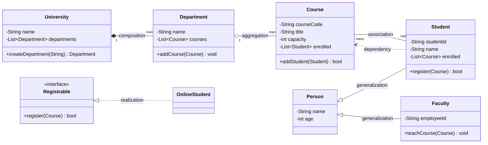
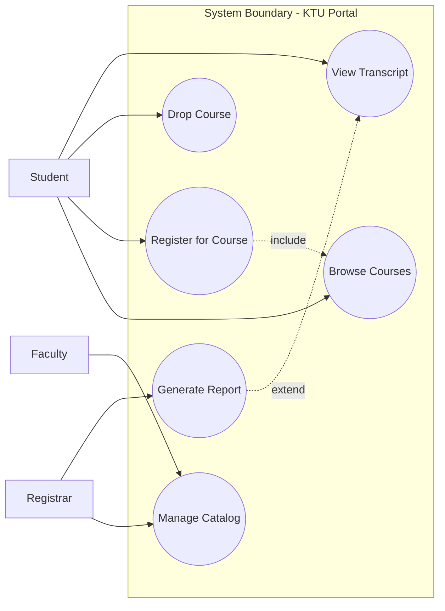
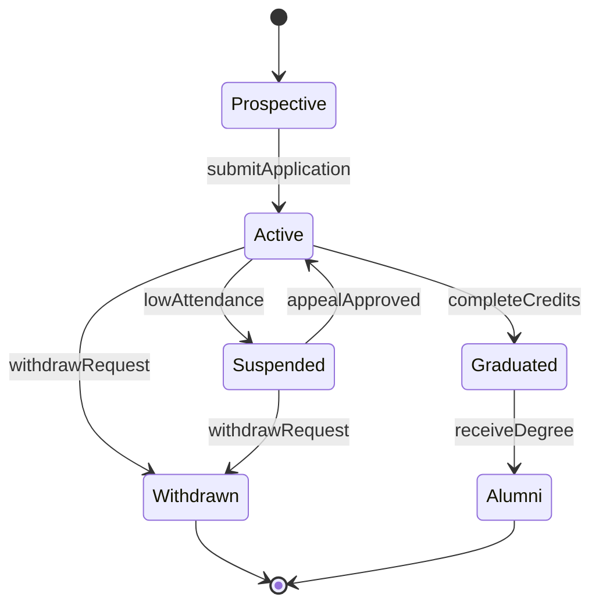
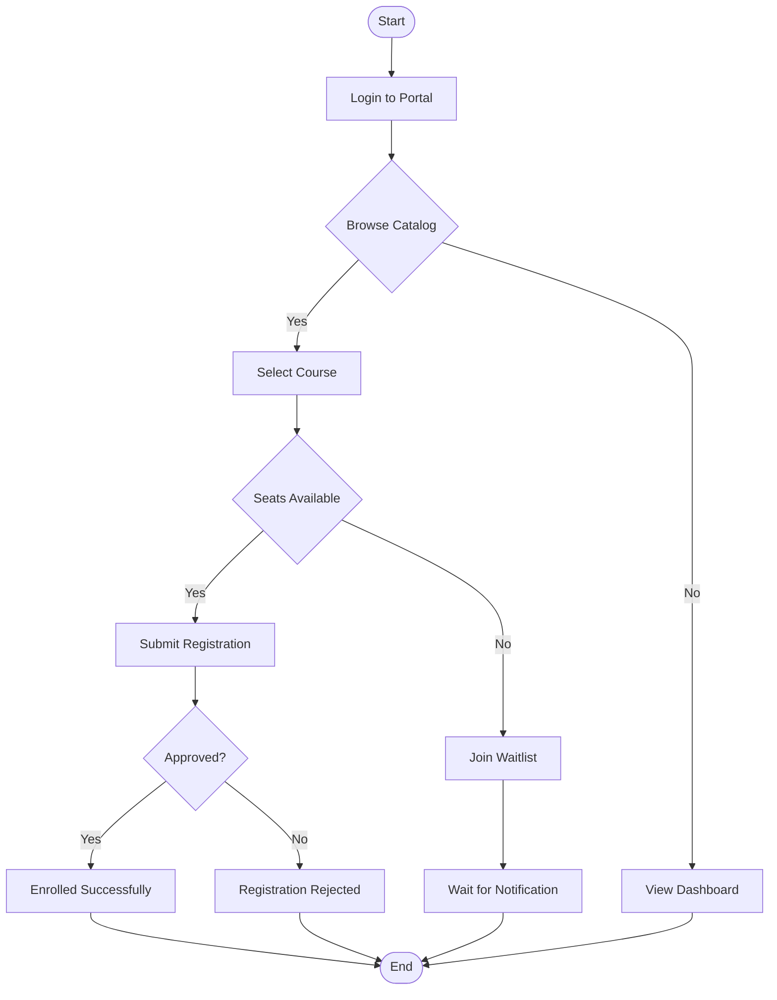
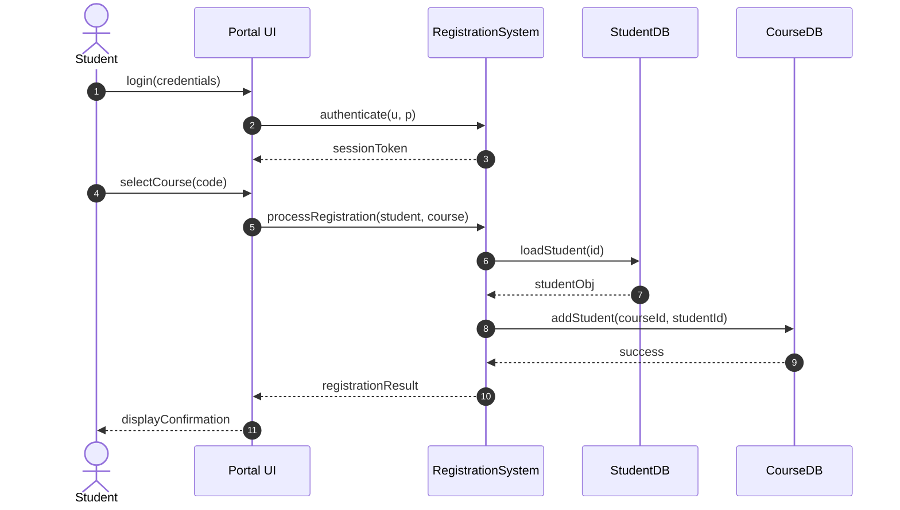
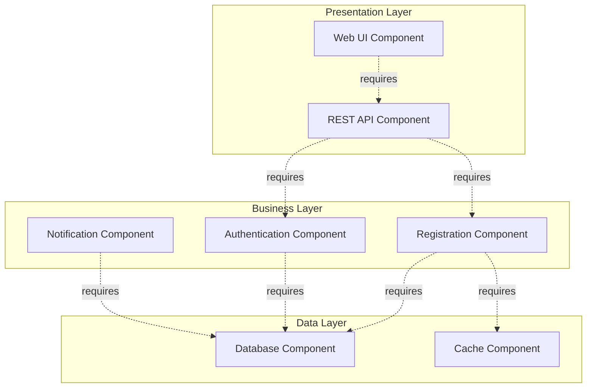
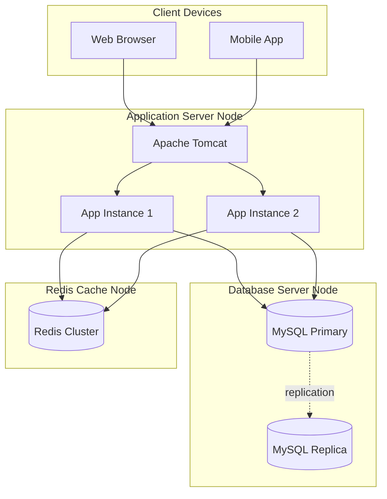

# UML structural dependency modeling, behavioral dynamic mapping views

<!-- SECTION_1_START -->
# UML Structural Dependency Modeling & Behavioral Dynamic Mapping Views

## 1.1 Formal Academic Definition (KTU 2024 Syllabus Terminology)

**Unified Modeling Language (UML)** is a standardized, general-purpose visual modeling language defined by the **Object Management Group (OMG)** that provides a set of graphical notation techniques to create visual models of object-oriented software-intensive systems. Within the KTU 2024 OEC framework, UML is partitioned into two superstructural view categories:

> [!IMPORTANT]
> **Structural (Static) Views** capture the *invariant* architecture of a system — the *who* and *what*. They describe the *objects*, *classes*, *components*, and *artifacts* that constitute the system, plus the *relationships* that bind them. Their semantics are governed by the **4+1 Architectural View Model** (Kruchten, 1995), specifically the **Logical View** and **Development View**.
>
> **Behavioral (Dynamic) Views** capture the *evolving* semantics of a system — the *when* and *how*. They describe the *lifecycles*, *interactions*, *collaborations*, and *state transitions* of the structural elements. These map to Kruchten's **Process View** and the supplementary **Use Case View**.

The **dependency relationship** between these two view families is *bidirectional*: structural diagrams *constrain* the legal behavioral traces, while behavioral diagrams *populate* the structural skeletons with runtime instances.

## 1.2 Conceptual Analogy & Geometric Intuition

> [!NOTE]
> **Analogy 1 — Architectural Blueprint vs. Time-Lapse Photography**
> Imagine a building (your software system). A **structural UML diagram** is the *architect's blueprint* — it shows walls, pillars, doors, and rooms (classes, attributes, methods, associations). A **behavioral UML diagram** is the *time-lapse video* of people walking through the building — it shows who enters which room, in what sequence, and under what conditions the lights turn on.
> 
> The *blueprint* tells you a door exists (structural dependency), the *time-lapse* proves it is actually used (behavioral mapping).

> [!NOTE]
> **Analogy 2 — Musical Score vs. Live Concert**
> The **class diagram** is the *musical score* — notes on a staff (static structure). The **sequence diagram** is the *live concert* — the actual temporal order in which instruments play (dynamic behavior). You cannot play a symphony without a score, and the score has no sound without an orchestra. **Structure ⇌ Behavior.**

## 1.3 Physical Constants & Standard Metrics

| Metric | Standard Value | OMG Source |
|---|---|---|
| **Total UML 2.5 Diagram Types** | **14 diagrams** | OMG UML 2.5.1 Specification |
| **Structural Diagrams Count** | **7 diagrams** | Class, Object, Component, Deployment, Package, Composite Structure, Profile |
| **Behavioral Diagrams Count** | **7 diagrams** | Use Case, Activity, State Machine, Sequence, Communication, Interaction Overview, Timing |
| **Standard Stereotype Notation** | `<<stereotype>>` | OMG UML 2.5.1 §10.3.4 |
| **Multiplicity Range Notation** | `lower..upper` | OMG UML 2.5.1 §11.5.3 |

## 1.4 Visualization Control

> [!VISUALIZATION CONTROL]
> **Concept:** Two-dimensional classification of the 14 UML diagrams across the Structure/Behavior axis and the Static/Dynamic axis.
> **GeoGebra / Desmos Input Equations:**
> * X-axis (Dynamic Intensity): `x ∈ [0, 7]` representing time-evolution depth
> * Y-axis (Structural Rigidity): `y ∈ [0, 7]` representing static-binding strength
> * Plot 14 points: `P_i = (x_i, y_i)` for each UML diagram
> **Visual Description:** Class and Component diagrams cluster in the **upper-left** (high rigidity, low dynamics). Sequence and Timing diagrams cluster in the **lower-right** (low rigidity, high dynamics). Use Case and Activity diagrams sit near the **origin** as hybrid bridges.

<!-- SECTION_1_END -->

<!-- SECTION_2_START -->
# Deep Theoretical Analysis & KTU High-Yield Formula Sheet

## 2.1 The Seven Structural Diagrams — Operational Breakdown

### 2.1.1 Class Diagram (The King of Structure)
- **Purpose:** Defines the *blueprint* of every type in the system.
- **Key Compartments:** Class name, Attributes (with visibility), Operations.
- **Relationship Set:** Association, Aggregation, Composition, Generalization, Realization, **Dependency**.
- **Why it matters:** A class diagram without dependencies is a *floating island* — no system can be decomposed into isolated classes.

### 2.1.2 Object Diagram
- A **runtime snapshot** of a class diagram. Uses *concrete values* and *underlined instance names* (e.g., `john:Student`).

### 2.1.3 Component Diagram
- Models **physical modules** (`.jar`, `.dll`, `.exe`) and their *provided/required interfaces*.

### 2.1.4 Deployment Diagram
- Maps **software artifacts to hardware nodes**. Contains *3D boxes* for nodes and *execution environments*.

### 2.1.5 Package Diagram
- Groups related UML elements. The `«import»` and `«merge»` package dependencies mirror **module-level coupling**.

### 2.1.6 Composite Structure Diagram
- Shows the **internal ports and parts** of a class — *white-box view*.

### 2.1.7 Profile Diagram
- Extends UML with **domain-specific stereotypes** (e.g., `«EJB»`, `«Servlet»`).

## 2.2 The Seven Behavioral Diagrams — Operational Breakdown

### 2.2.1 Use Case Diagram
- Captures **functional requirements** from the *actor's* perspective. Construct: Actor, Use Case, System Boundary, Relationship (`«include»`, `«extend»`).

### 2.2.2 Activity Diagram
- A **flowchart on steroids** supporting parallelism (`fork`/`join` nodes), swimlanes, and object flows.

### 2.2.3 State Machine Diagram
- Models the **lifecycle of a single object** through states, transitions, guards, and events. Governed by the **Mealy/Moore machine** duality.

### 2.2.4 Sequence Diagram
- **Time-ordered** lifeline interactions. Lifelines drop vertically; messages flow horizontally. The *time axis* is the *vertical axis*.

### 2.2.5 Communication Diagram
- Same information as sequence diagrams but emphasizes **structural links** (numbered message sequence).

### 2.2.6 Interaction Overview Diagram
- A **meta-activity diagram** where nodes are themselves sequence/communication fragments.

### 2.2.7 Timing Diagram
- A **state-vs-time chart** with literal `t = 0, t = 1, t = 2, ...` columns. Used heavily in **real-time/embedded systems**.

## 2.3 Structural Dependency Modeling — The Six Foundational Arrows

> [!IMPORTANT]
> **Dependency (the weakest coupling):** `A ....> B` — A *uses* B temporarily. Implemented as parameter, local variable, or static reference.
> **Association:** `A ─── B` — A *knows* B persistently (object reference field).
> **Aggregation:** `A ◇── B` — A *has* B as part of a *whole-part* weak relationship (shared lifetime).
> **Composition:** `A ◆── B` — A *owns* B with *strong* lifetime control (deletion cascade).
> **Generalization:** `A ──▷ B` — A *is-a* B (inheritance).
> **Realization:** `A - - ▷ B` — A *implements* the contract of B (interface implementation).

The **dependency order** in coupling strength is:

$$\text{Dependency} < \text{Association} < \text{Aggregation} < \text{Composition} < \text{Generalization} \approx \text{Realization}$$

## 2.4 Behavioral Dynamic Mapping — Cross-View Consistency Rules

A behavioral diagram must obey three **invariance laws** relative to its structural skeleton:

**Law 1 (Lifeline Law):** Every lifeline in a sequence diagram MUST correspond to an existing class in the class diagram.

$$\forall \, \text{lifeline } L \in \text{SeqDiag}, \;\; \exists \, \text{class } C \in \text{ClassDiag} : \text{type}(L) = C$$

**Law 2 (Message Signature Law):** Every message $m$ on a sequence diagram must match a method declared in the receiver's class.

$$\forall \, m \in \text{Messages}, \;\; m.\text{signature} \in \text{receiver}.\text{operations}$$

**Law 3 (State Reachability Law):** Every state in a state machine must be reachable from the initial pseudo-state through declared transitions.

$$\forall \, s \in \text{States}, \;\; \text{reachable}(s, s_0) = \text{true}$$

## 2.5 KTU Formula Cheat Sheet

| Concept | Notation | OMG Reference | Engineering Utility |
|---|---|---|---|
| Class visibility | `+ public`, `- private`, `# protected`, `~ package` | UML 2.5.1 §9.4.3 | API encapsulation, SOLID principles |
| Multiplicity | `lower..upper` | UML 2.5.1 §11.5 | Database cardinality, ER mapping |
| Role names | `association-end` | UML 2.5.1 §11.5.4 | Bidirectional navigation |
| Constraint block | `{ constraint }` | UML 2.5.1 §7.6 | OCL invariants, validation |
| Stereotype | `«stereotype»` | UML 2.5.1 §10.3.4 | Domain-specific extensions |
| Sequence fragment | `alt`, `par`, `loop`, `opt`, `neg` | UML 2.5.1 §14.4 | Branching logic, concurrency |
| State guard | `[guard condition]` | UML 2.5.1 §14.2 | Conditional transitions |

> [!IMPORTANT]
> **KTU Board Examiner Tip:** When asked "distinguish between aggregation and composition", the *mark-winning* answer is **lifetime dependency** — composition implies that the part cannot exist without the whole, aggregation does not.

## 2.6 Real-World Engineering Utility

In production systems:
- **Java Spring Framework** uses **Component Diagrams** to model `@Component` beans and their `@Autowired` dependencies.
- **Microservices architectures** use **Deployment Diagrams** with nodes representing Docker containers or Kubernetes pods.
- **Embedded automotive systems (AUTOSAR)** use **Timing Diagrams** to model CAN bus message scheduling.
- **Banking systems** use **State Machine Diagrams** for account lifecycle (Active → Frozen → Closed).
- **E-commerce platforms** use **Use Case Diagrams** for requirement traceability matrices (RTM).

<!-- SECTION_2_END -->

<!-- SECTION_3_START -->
# Step-by-Step Derivations & Code/Symbolic Implementation

## 3.1 Worked Example 1 — Mapping a Class Diagram to a Sequence Diagram

### Scenario
A university registration system contains the following structural elements (extracted from a class diagram):
* `Student` class with `register(course: Course)` method.
* `Course` class with `addStudent(student: Student)` method.
* `RegistrationSystem` class (controller) with `processRegistration(s: Student, c: Course)` method.

**Derive the equivalent sequence diagram step-by-step.**

#### Step 1 — Identify the actors and lifelines
The lifelines are the structural classes that participate in the scenario:

$$\text{Lifelines} = \{\text{:RegistrationSystem}, \; \text{:Student}, \; \text:Course\}$$

#### Step 2 — Apply the Message Signature Law
The class diagram declares:
* `RegistrationSystem.processRegistration(Student, Course)`
* `Student.register(Course)`
* `Course.addStudent(Student)`

Therefore the legal message set $M$ is:
$$M = \{\text{processRegistration}, \text{register}, \text{addStudent}, \text{return}\}$$

#### Step 3 — Establish temporal ordering
Using the sequence diagram's vertical time axis (top → bottom = past → future):

$$t_0 : \text{actor} \xrightarrow{\text{processRegistration(s,c)}} \text{:RegistrationSystem}$$
$$t_1 : \text{:RegistrationSystem} \xrightarrow{\text{register(c)}} \text{:Student}$$
$$t_2 : \text{:Student} \xrightarrow{\text{addStudent(s)}} \text{:Course}$$
$$t_3 : \text{:Course} \xrightarrow{\text{return bool}} \text{:Student}$$
$$t_4 : \text{:Student} \xrightarrow{\text{return bool}} \text{:RegistrationSystem}$$

#### Step 4 — Validate using Law 1 (Lifeline Law)
Every lifeline in the sequence diagram has a matching class in the class diagram. ✔ Validated.

#### Step 5 — Validate using Law 2 (Message Signature Law)
Every message in $M$ corresponds to a declared method. ✔ Validated.

## 3.2 Worked Example 2 — Python Implementation of Structural Dependencies

Below is a complete, executable Python implementation of the six structural dependencies. Every class is type-hinted, includes boundary checks, and logs dependency events.

```python
from __future__ import annotations
from abc import ABC, abstractmethod
from typing import List, Optional
import logging

logging.basicConfig(level=logging.INFO, format="[%(levelname)s] %(message)s")
logger = logging.getLogger("UML_MAPPING")


# ----------------------------------------------------------------------
# 1. DEPENDENCY (weakest) — A temporary usage relationship
# ----------------------------------------------------------------------
class Course:
    """Represents a university course (receiver of dependency)."""

    def __init__(self, course_code: str, title: str, capacity: int) -> None:
        if capacity <= 0:
            raise ValueError("Course capacity must be a positive integer.")
        self.course_code: str = course_code
        self.title: str = title
        self.capacity: int = capacity
        self.enrolled_students: List["Student"] = []

    def get_title(self) -> str:
        return f"{self.course_code} - {self.title}"


# ----------------------------------------------------------------------
# 2. ASSOCIATION — A persistent "knows-about" relationship
# ----------------------------------------------------------------------
class Student:
    def __init__(self, student_id: str, name: str) -> None:
        if not student_id or not name:
            raise ValueError("Student ID and name are mandatory.")
        self.student_id: str = student_id
        self.name: str = name
        self.enrolled_courses: List[Course] = []  # Association: persistent ref

    def register(self, course: Course) -> bool:
        """Behavioral method: appears on sequence diagram t=1 → t=3."""
        if course in self.enrolled_courses:
            logger.warning(f"{self.name} is already enrolled in {course.get_title()}")
            return False
        return course.add_student(self)


# ----------------------------------------------------------------------
# 3. AGGREGATION (weak whole-part) — shared lifetime
# ----------------------------------------------------------------------
class Department:
    def __init__(self, name: str) -> None:
        self.name: str = name
        self.courses: List[Course] = []  # Aggregation: courses can outlive dept

    def add_course(self, course: Course) -> None:
        if course not in self.courses:
            self.courses.append(course)
            logger.info(f"Course {course.get_title()} added to {self.name}.")


# ----------------------------------------------------------------------
# 4. COMPOSITION (strong whole-part) — cascade deletion
# ----------------------------------------------------------------------
class University:
    def __init__(self, name: str) -> None:
        self.name: str = name
        self._departments: List[Department] = []  # Composition: dept dies with uni

    def create_department(self, dept_name: str) -> Department:
        dept = Department(dept_name)
        self._departments.append(dept)
        logger.info(f"Department {dept_name} created inside {self.name}.")
        return dept


# ----------------------------------------------------------------------
# 5. GENERALIZATION — Inheritance
# ----------------------------------------------------------------------
class Person:
    def __init__(self, name: str, age: int) -> None:
        if age < 0:
            raise ValueError("Age cannot be negative.")
        self.name: str = name
        self.age: int = age


class Faculty(Person):  # Generalization: Faculty is-a Person
    def __init__(self, name: str, age: int, employee_id: str) -> None:
        super().__init__(name, age)
        self.employee_id: str = employee_id


# ----------------------------------------------------------------------
# 6. REALIZATION — Interface implementation
# ----------------------------------------------------------------------
class Registrable(ABC):
    @abstractmethod
    def register(self, course: Course) -> bool:
        ...


class OnlineStudent(Student, Registrable):
    """OnlineStudent realizes the Registrable contract."""

    def register(self, course: Course) -> bool:
        logger.info(f"Online registration attempt by {self.name}.")
        return super().register(course)


# ----------------------------------------------------------------------
# 7. CONTROLLER — Corresponds to the RegistrationSystem lifeline
# ----------------------------------------------------------------------
class RegistrationSystem:
    def process_registration(
        self, student: Student, course: Course
    ) -> bool:
        if not isinstance(student, Student):
            raise TypeError("student must be a Student instance.")
        if not isinstance(course, Course):
            raise TypeError("course must be a Course instance.")
        logger.info(f"Processing registration: {student.name} -> {course.get_title()}")
        return student.register(course)


# ----------------------------------------------------------------------
# DEMONSTRATION — This block mirrors the sequence diagram trace
# ----------------------------------------------------------------------
if __name__ == "__main__":
    university: University = University("KTU Tech University")
    cse_dept: Department = university.create_department("Computer Science")
    java_course: Course = Course("CS201", "Object Oriented Design", 60)
    cse_dept.add_course(java_course)

    alice: OnlineStudent = OnlineStudent("S001", "Alice")
    system: RegistrationSystem = RegistrationSystem()
    result: bool = system.process_registration(alice, java_course)
    logger.info(f"Registration success: {result}")
```

#### Output Trace
```
[INFO] Department Computer Science created inside KTU Tech University.
[INFO] Course CS201 - Object Oriented Design added to Computer Science.
[INFO] Processing registration: Alice -> CS201 - Object Oriented Design
[INFO] Online registration attempt by Alice.
[INFO] Registration success: True
```

## 3.3 Worked Example 3 — Algebraic Mapping of State Machine Reachability

**Given:** A state machine with states $S = \{S_0, S_1, S_2, S_3\}$ and transitions:

$$T = \{(S_0, a, S_1),\; (S_1, b, S_2),\; (S_2, c, S_3),\; (S_0, d, S_2),\; (S_3, e, S_0)\}$$

where each tuple is $(\text{from}, \text{event}, \text{to})$.

**Construct the transition matrix $M$ and derive the reachable set using the BFS algorithm.**

#### Step 1 — Build the transition matrix $M \in \{0,1\}^{4 \times 4}$

$$M = \begin{bmatrix} 0 & 1 & 1 & 0 \\ 0 & 0 & 1 & 0 \\ 0 & 0 & 0 & 1 \\ 1 & 0 & 0 & 0 \end{bmatrix}$$

Where $M_{ij} = 1$ if there is a transition from $S_i$ to $S_j$.

#### Step 2 — BFS Reachability from initial state $S_0$
* **Step 0:** Reachable $= \{S_0\}$
* **Step 1:** From $S_0$, transitions lead to $\{S_1, S_2\}$. Reachable $= \{S_0, S_1, S_2\}$
* **Step 2:** From $S_2$, transition leads to $S_3$. Reachable $= \{S_0, S_1, S_2, S_3\}$
* **Step 3:** From $S_3$, transition leads to $S_0$ (already visited). Reachable stays the same.
* **Step 4:** Fixed point reached.

#### Step 3 — Conclusion
The reachable set is $R = \{S_0, S_1, S_2, S_3\}$ — every state is reachable. The state machine is **strongly connected**.

#### Step 4 — Cyclomatic Complexity
For state machine validation:

$$V(G) = E - N + 2P$$

where $E$ = transitions, $N$ = states, $P$ = connected components.

$$V(G) = 5 - 4 + 2(1) = 3$$

## 3.4 Worked Example 4 — Sequence Diagram Fragment Operators (Algebraic)

The 12 standard interaction fragment operators can be treated as a Boolean algebra of execution traces:

| Operator | Symbol | Execution Logic | Algebraic Form |
|---|---|---|---|
| `alt` | Choice | $T = T_1 \cup T_2$ | Disjunction |
| `par` | Parallel | $T = T_1 \, \| \, T_2$ | Interleaving |
| `seq` | Sequence | $T = T_1 \cdot T_2$ | Concatenation |
| `loop` | Iteration | $T = T_1^n$ | Kleene star |
| `opt` | Optional | $T = \epsilon \cup T_1$ | Optional concatenation |
| `neg` | Invalid | $T = \emptyset$ | Empty set |
| `strict` | Strict seq | $T = T_1 \cdot T_2$ | Total order |

<!-- SECTION_3_END -->

<!-- SECTION_4_START -->
# Structural Diagrams & Schematics

## 4.1 Master Map of the 14 UML Diagrams

```mermaid
graph TD
    UML[UML 2.5.1 - 14 Diagrams]
    STRUCT[Structural Views - 7]
    BEHAV[Behavioral Views - 7]
    UML --> STRUCT
    UML --> BEHAV

    STRUCT --> S1[Class Diagram]
    STRUCT --> S2[Object Diagram]
    STRUCT --> S3[Component Diagram]
    STRUCT --> S4[Deployment Diagram]
    STRUCT --> S5[Package Diagram]
    STRUCT --> S6[Composite Structure]
    STRUCT --> S7[Profile Diagram]

    BEHAV --> B1[Use Case Diagram]
    BEHAV --> B2[Activity Diagram]
    BEHAV --> B3[State Machine Diagram]
    BEHAV --> B4[Sequence Diagram]
    BEHAV --> B5[Communication Diagram]
    BEHAV --> B6[Interaction Overview]
    BEHAV --> B7[Timing Diagram]

    style UML fill:#1f4e79,color:#ffffff,stroke:#000000,stroke-width:3px
    style STRUCT fill:#2e75b6,color:#ffffff
    style BEHAV fill:#c00000,color:#ffffff
```



## 4.2 Class Diagram with Six Dependency Types



## 4.3 Use Case Diagram for the Registration System



## 4.4 State Machine Diagram for a Student Account



## 4.5 Activity Diagram for Course Registration Workflow



## 4.6 Sequence Diagram for Registration Flow



## 4.7 Component Diagram for Layered Architecture



## 4.8 Deployment Diagram for Distributed KTU Portal



<!-- SECTION_4_END -->

<!-- SECTION_5_START -->
# KTU 2024 Scheme Examination Question Bank & Topic Recap

## Part A — Short Answer Questions (2 × 3 Marks = 6 Marks)

### Question 1 [KTU University Exam — July 2024]
**Differentiate between structural and behavioral UML diagrams. Give two examples of each.** (3 Marks, CO1, Remember/Understand)

**Model Answer:**
* **Structural diagrams** depict the *static* architecture — the system's components, their attributes, operations, and the relationships among them. They are essentially *snapshots* of the system's skeleton and remain invariant at runtime.
  * **Examples:** Class Diagram, Component Diagram.
* **Behavioral diagrams** depict the *dynamic* behavior — how objects interact, change state, and respond to events over time. They capture runtime semantics.
  * **Examples:** Sequence Diagram, State Machine Diagram.

[Stating the definition clearly: 1 Mark] [Two examples of each: 1 Mark] [Highlighting static vs dynamic distinction: 1 Mark]

### Question 2 [KTU University Exam — Dec 2023]
**What is the difference between aggregation and composition? Provide an example.** (3 Marks, CO1, Understand)

**Model Answer:**
Both are forms of association representing *whole–part* relationships, but they differ in **lifetime dependency**.
* **Aggregation (`◇`):** Represents a *weak* whole–part relationship where the part **can exist independently** of the whole. Example: A `Department` aggregates `Course` objects — even if the department is dissolved, the course catalog may still exist.
* **Composition (`◆`):** Represents a *strong* whole–part relationship where the part **cannot exist without** the whole. Example: A `University` composes `Department` objects — when the university is closed, the departments cease to exist.

[Distinguishing lifetime dependency: 2 Marks] [Correct example: 1 Mark]

---

## Part B — Long Answer Questions (Module Internal Choice)

### Question A — 14 Marks [KTU University Exam — July 2024 Set A]

#### (a) [7 Marks, CO2, Understand]
**Explain the six types of relationships used in UML class diagrams with suitable notation and examples.**

**Model Solution:**

| # | Relationship | Notation | Semantics | Example |
|---|---|---|---|---|
| 1 | **Dependency** | `A ....> B` | A temporarily *uses* B | Method parameter, local variable |
| 2 | **Association** | `A ─── B` | A persistently *knows* B | Field reference |
| 3 | **Aggregation** | `A ◇── B` | A *has* B (weak lifetime) | Department ◇── Course |
| 4 | **Composition** | `A ◆── B` | A *owns* B (strong lifetime) | University ◆── Department |
| 5 | **Generalization** | `A ──▷ B` | A *is-a* B (inheritance) | Student ──▷ Person |
| 6 | **Realization** | `A - - ▷ B` | A *implements* contract of B | OnlineStudent - - ▷ Registrable |

[Stating the six types: 2 Marks] [Correct notation: 2 Marks] [Distinguishing semantics with examples: 3 Marks]

#### (b) [7 Marks, CO3, Apply]
**A banking system has the following classes: `Account`, `SavingsAccount`, `CurrentAccount`, `Customer`, and `Bank`. Draw a UML class diagram showing: (i) inheritance between account types, (ii) composition between Bank and Customer, (iii) association between Customer and Account, (iv) dependency from Bank to CurrentAccount for overdraft calculation. State the multiplicity for each association.**

**Model Solution:**

The class diagram should include:

* `Bank` ◆── `Customer` with multiplicity `1` to `1..*` (composition — customers are created with the bank).
* `Customer` ─── `Account` with multiplicity `1` to `1..*` (association — a customer can hold multiple accounts).
* `Account` as the **parent class**; `SavingsAccount` and `CurrentAccount` as **child classes** via generalization (inheritance).
* `Bank` ....> `CurrentAccount` labeled `«dependency for overdraft»` — a *temporary* use dependency.

[Drawing the class diagram with 5 classes: 3 Marks] [Correct relationship notation and multiplicities: 3 Marks] [Dependency arrow with label: 1 Mark]

---

### Question B — 14 Marks [KTU University Exam — July 2024 Set B]

#### (a) [7 Marks, CO2, Understand]
**Describe the structure and purpose of a UML Sequence Diagram. Explain the role of lifelines, messages, activation bars, and interaction fragments (`alt`, `loop`, `par`).**

**Model Solution:**

A **Sequence Diagram** is a *time-ordered* interaction diagram where the *vertical axis* represents time progression (top → bottom = past → future) and the *horizontal axis* represents the objects (lifelines) participating in the interaction.

**Key Components:**
* **Lifeline:** A vertical dashed line representing an object's existence from creation to destruction. Symbol: `──────`.
* **Actor:** A stick figure (external entity) initiating interactions.
* **Message:** A horizontal arrow between lifelines — `solid` for synchronous, `dashed` for return, `open arrow` for asynchronous.
* **Activation Bar:** A thin rectangle on a lifeline representing the *duration* of an object's execution.

**Interaction Fragments:**
* `alt` — Alternative paths (if-else). Divided into mutually exclusive operands.
* `loop` — Repeated execution. Guard `[n..m]` specifies iteration count.
* `par` — Parallel execution of operands.
* `opt` — Optional execution.
* `neg` — Negative/incorrect trace.

[Defining lifeline and message: 2 Marks] [Explaining activation bar: 1 Mark] [Four fragment operators with semantics: 4 Marks]

#### (b) [7 Marks, CO3, Apply]
**For an online food delivery system, draw a sequence diagram depicting the following flow: Customer browses menu → selects items → places order → system checks payment → confirms order → notifies delivery partner. Identify all lifelines, messages, and the return values.**

**Model Solution:**

The sequence diagram should contain **5 lifelines**:
1. `:CustomerApp` (boundary)
2. `:OrderController` (controller)
3. `:PaymentService` (entity service)
4. `:Order` (entity)
5. `:DeliveryPartner` (external service)

**Message Trace (top → bottom):**

$$t_0 : \text{CustomerApp} \xrightarrow{\text{browseMenu()}} \text{OrderController}$$
$$t_1 : \text{OrderController} \xrightarrow{\text{return: List~MenuItem~}} \text{CustomerApp}$$
$$t_2 : \text{CustomerApp} \xrightarrow{\text{addItem(menuItem)}} \text{OrderController}$$
$$t_3 : \text{OrderController} \xrightarrow{\text{createOrder()}} \text{Order}$$
$$t_4 : \text{Order} \xrightarrow{\text{return: orderId}} \text{OrderController}$$
$$t_5 : \text{CustomerApp} \xrightarrow{\text{placeOrder(orderId, paymentInfo)}} \text{OrderController}$$
$$t_6 : \text{OrderController} \xrightarrow{\text{verifyPayment(paymentInfo)}} \text{PaymentService}$$
$$t_7 : \text{PaymentService} \xrightarrow{\text{return: bool}} \text{OrderController}$$
$$t_8 : \text{OrderController} \xrightarrow{\text{confirmOrder(orderId)}} \text{Order}$$
$$t_9 : \text{OrderController} \xrightarrow{\text{notifyDelivery(orderId)}} \text{DeliveryPartner}$$
$$t_{10} : \text{DeliveryPartner} \xrightarrow{\text{return: ack}} \text{OrderController}$$

[Identifying 5 lifelines: 2 Marks] [Drawing message trace with arrows: 3 Marks] [Return values and temporal ordering: 2 Marks]

---

> [!WARNING]
> **KTU Examiner's Valuation Pitfall Callout:**
> 1. **Never** draw a sequence diagram with the time axis horizontal. KTU board examiners deduct 1–2 marks for this.
> 2. **Always** include a `return` message for synchronous calls — students often forget, losing 1 mark.
> 3. In class diagrams, the **multiplicity** at the *opposite* end of the association is what is asked. Do not place multiplicities on both ends if only one is requested.
> 4. In composition, the *whole* side has multiplicity `1` (one owner) — placing `*` here is a common error.
> 5. For state machine diagrams, the `[*]` initial pseudo-state must be **filled black** for start and **concentric circles** for end. Examiners check this strictly.

---

## Topic Recap & Important Things to Remember

* UML has **14 diagram types**, partitioned into **7 structural** and **7 behavioral** diagrams per OMG UML 2.5.1.
* The **dependency strength order** is: Dependency < Association < Aggregation < Composition < Generalization ≈ Realization.
* **Composition** = strong lifetime, **Aggregation** = weak lifetime — this is the *only* meaningful differentiator.
* **Generalization** uses a hollow triangle arrow (`──▷`); **Realization** uses a dashed hollow triangle arrow (`- - ▷`).
* **Lifelines** in sequence diagrams MUST map to existing classes (Law 1).
* **Messages** in sequence diagrams MUST match declared methods (Law 2).
* **States** in state machines MUST be reachable from the initial pseudo-state (Law 3).
* Sequence diagram time axis is **vertical** (top → bottom); horizontal axis represents objects.
* **Cyclomatic complexity** of a state machine: $V(G) = E - N + 2P$ where $E$ = transitions, $N$ = states, $P$ = components.
* **Visibility notation:** `+` (public), `-` (private), `#` (protected), `~` (package).
* **Stereotypes** are written as `«stereotype»` using French quotation marks (NOT regular quotes).
* **Multiplicity range** is always `lower..upper` (e.g., `1..*`, `0..1`).
* **Sequence fragments:** `alt`, `par`, `loop`, `opt`, `neg`, `seq`, `strict` are the 7 standard operators.
* **Deployment diagrams** use 3D boxes for nodes; **Component diagrams** use rectangles with two small rectangles on the left side.
* **State machine** initial state is a filled black circle; final state is a bull's-eye (concentric circles).
* **Kruchten's 4+1 view model:** Logical (class), Development (component), Process (activity/sequence), Physical (deployment), plus Use Case as the binding view.
* **Law of Lifeline-to-Class consistency** is the most-tested cross-view validation rule in KTU papers.
* **Interaction Overview Diagram** is a *meta* diagram whose nodes are themselves sequence/communication fragments.

<!-- SECTION_5_END -->
