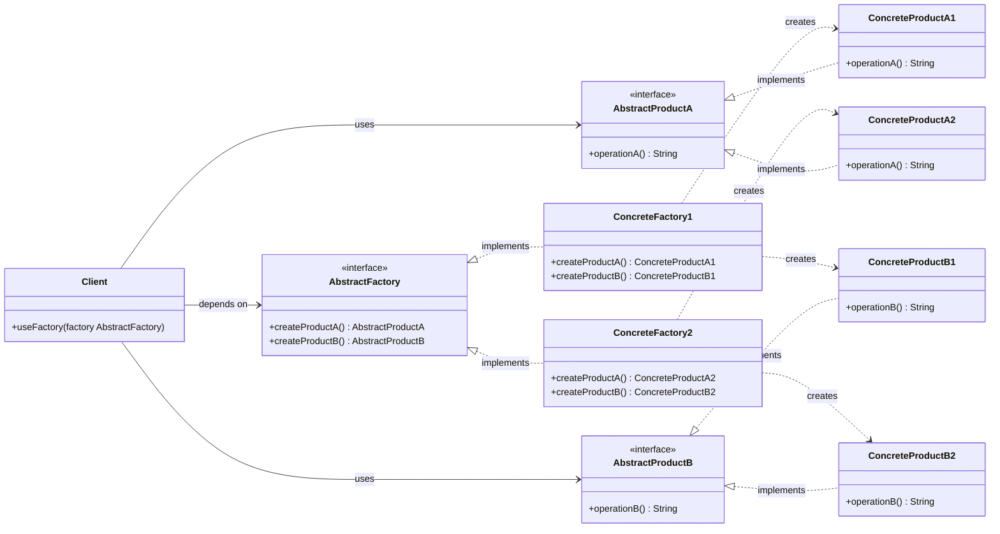
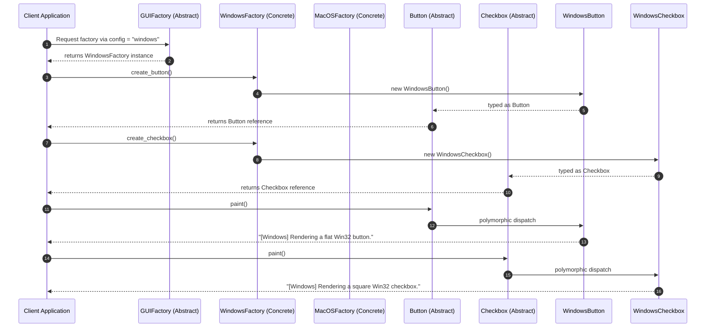
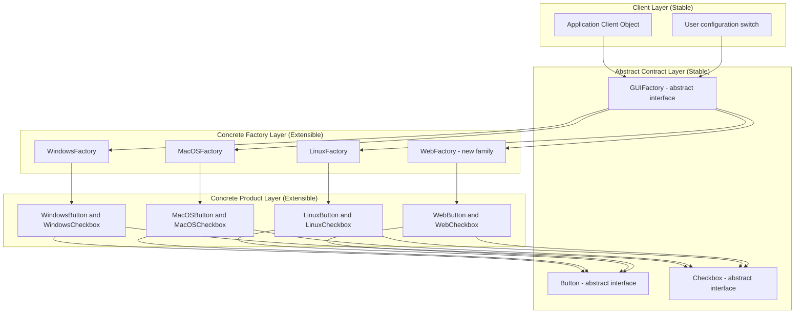

# Abstract Factory Pattern

<!-- SECTION_1_START -->
# Abstract Factory Pattern — Core Definition & Intuitive Overview

## 📘 Formal Academic Definition (KTU 2024 Syllabus Terminology)

> [!IMPORTANT]
> **Abstract Factory Pattern** (Gang-of-Four Classification: *Creational Pattern*; Alias: **Kit**) is a design framework that provides an **interface for creating families of related or dependent objects** without specifying their **concrete classes**. It encapsulates a group of individual factories (each implementing the *Factory Method* pattern) that share a common theme, thereby enforcing the consistency of products within a family.

In Object-Oriented Design Frameworks (per the KTU OECST72A syllabus), the Abstract Factory is positioned as the **"factory of factories"** — a super-factory that delegates the responsibility of object creation to its concrete subclasses, allowing the client code to operate against abstract product interfaces rather than concrete implementations.

---

## 🌉 Conceptual Analogy / Intuition

> [!NOTE]
> **Real-world Analogy — The International Furniture Showroom**
>
> Imagine you walk into a furniture showroom. The showroom sells **multiple product families** — `Modern`, `Victorian`, and `ArtDeco`. Each family contains *matching* pieces: a chair, a sofa, and a coffee table. If you choose the `Modern` family, you are guaranteed to receive a modern chair **paired with** a modern sofa **and** a modern coffee table — they visually and stylistically belong together. The showroom's job is to ensure you **never** walk out with a Victorian chair and a Modern sofa (a *style mismatch*).
>
> The showroom counter is the **Abstract Factory**. It exposes three order buttons: "Give me a Chair", "Give me a Sofa", "Give me a Coffee Table". The internal staff (the **Concrete Factory** for Modern / Victorian / ArtDeco) decides *which* concrete object to hand you, but the **client (you)** never instantiates the objects directly. You also get a **guarantee of family consistency** — every product you receive belongs to the same style family.

**Why this matters in OOP Frameworks:** Just as the showroom enforces *style consistency* across a product family, the Abstract Factory enforces *interface consistency* across a set of related classes — a critical principle in **loosely coupled**, **framework-extensible** architectures such as cross-platform UI toolkits, database abstraction layers, and theme engines.

> [!TIP]
> **One-line KTU Board Answer:**
> *"Abstract Factory provides a single interface to create a family of related objects, deferring the choice of concrete class to subclasses, ensuring family-level consistency."*

---

## 🧭 Pattern Intent vs. Other Creational Patterns

| Pattern | Intent | Family Awareness |
|---|---|---|
| **Factory Method** | Create **one** product; let subclasses decide which class to instantiate. | ❌ Single product |
| **Abstract Factory** | Create **a family of related products** through a unified interface. | ✅ Multi-product family |
| **Builder** | Construct a **complex object step-by-step** using a fluent specification. | ❌ Single complex object |
| **Prototype** | Clone an **existing** object instead of building from scratch. | ❌ Cloning |
| **Singleton** | Ensure only **one** instance of a class exists. | ❌ One instance |

> [!VISUALIZATION CONTROL]
> **Concept:** *Family vs. Product Cartesian Mapping*
> **Input Equation (conceptual):**
> `Families = { Modern, Victorian, ArtDeco }`
> `Products = { Chair, Sofa, CoffeeTable }`
> **Visual Description:** Imagine a 2D grid where the **Y-axis** lists the *Product Types* (abstract interfaces) and the **X-axis** lists the *Concrete Families*. Each grid intersection corresponds to exactly **one ConcreteProduct** instance. The Abstract Factory is the *vertical column selector* — pick a family, and you receive the entire *column* of consistent products in one transaction.
<!-- SECTION_1_END -->

<!-- SECTION_2_START -->
# Deep Theoretical Analysis & KTU High-Yield Formula Sheet

## 🧬 Structural Anatomy of the Pattern

The Abstract Factory Pattern is composed of **four canonical participants** (sometimes five, when an explicit *Client* role is enumerated). The relationships are summarized below:

### 1. `AbstractFactory` (The Blueprint)
- Declares the **factory methods** that return **abstract product** objects.
- Typically an **abstract class** or **Python `ABC`** with one creation method per product type in the family.
- **Holds no knowledge** of which concrete classes are being instantiated.

### 2. `ConcreteFactory` (The Specialist)
- Implements the `AbstractFactory` interface.
- Each `ConcreteFactory` corresponds to **one product family** (e.g., `ModernFactory`, `VictorianFactory`).
- **Overrides** every factory method to produce a *consistent* set of concrete products.

### 3. `AbstractProduct` (The Product Contract)
- Declares the **type-specific interface** that all concrete products must obey.
- One `AbstractProduct` per product *kind* (e.g., `Chair`, `Sofa`).

### 4. `ConcreteProduct` (The Real Object)
- Implements the `AbstractProduct` interface.
- Created by **one specific** `ConcreteFactory` (the family owner).

### 5. `Client` (The Consumer)
- Uses **only** the `AbstractFactory` and `AbstractProduct` interfaces.
- Receives a *family* of products from a single `ConcreteFactory`.
- **Decoupled** from concrete classes — swapping the factory swaps the entire family.

---

## 📐 The KTU Formula Sheet / Cheat Sheet

> [!NOTE]
> The table below condenses the **applicability criteria**, **consequences**, and **design rules** of the Abstract Factory Pattern as expected in KTU 2024 Scheme ESE answers. This is a high-yield revision block.

| Aspect | KTU Board Specification |
| :--- | :--- |
| **Pattern Category** | Creational (GoF) |
| **Alias** | Kit |
| **Intent** | Produce *families* of related objects without coupling client to concrete classes |
| **Structure** | AbstractFactory → ConcreteFactory → AbstractProduct → ConcreteProduct |
| **Applicability — use when:** | (1) System must be independent of how its products are created. (2) System must be configured with one of multiple product families. (3) Family of related product objects is designed to be used together, enforcing this constraint. (4) You want to provide a class library of products, revealing only their interfaces. |
| **Consequence — Benefits** | (1) **Isolates concrete classes** from the client. (2) **Eases exchange of product families**. (3) **Promotes consistency** among products. (4) **Supports Open/Closed Principle** — new families can be added without modifying existing code. |
| **Consequence — Drawbacks** | (1) Supporting new *kinds* of products (vertical extension) is hard — it requires extending the `AbstractFactory` interface, which cascades to all `ConcreteFactory` subclasses. (2) Increases overall class count (often 5× to 10× the original). |
| **Related Patterns** | *Factory Method* (delegated internally), *Prototype* (factories can be implemented using prototypes), *Singleton* (concrete factories are often singletons), *Facade* (abstract factory can be a higher-level facade over subsystem factories). |
| **Java/Python Signature Pattern** | A class with a `create_product_a()` and `create_product_b()` returning typed objects. |
| **LSP / DIP Compatibility** | Strongly aligned with **Dependency Inversion** and **Liskov Substitution** Principles. |

---

## 🌍 Real-World Engineering & Software Utility

| Domain | Why Abstract Factory Is Used |
| :--- | :--- |
| **Cross-Platform UI Frameworks** (Qt, JavaFX, .NET MAUI) | The OS theme (Windows / macOS / Linux) determines which concrete UI widget family gets instantiated — all widgets from one family automatically share native look-and-feel. |
| **Database Abstraction Layers** (Hibernate, SQLAlchemy) | One `DialectFactory` per database (PostgreSQL, MySQL, Oracle) emits a *family* of dialect-specific `Connection`, `Cursor`, `QueryBuilder` objects that operate cohesively. |
| **Game Engines & Rendering Pipelines** | A `RenderFactory` can produce OpenGL / DirectX / Vulkan *families* of `Shader`, `Buffer`, `Texture` objects that are mutually compatible. |
| **Spring / Dependency Injection Containers** | Bean definition profiles act as Abstract Factories — activating a "production" or "test" profile swaps the entire family of injected beans. |
| **Theme Engines in Web Apps** | A `ThemeFactory` produces a *coordinated* set of `Button`, `Card`, `Modal` styled components so visual consistency is never broken. |

---

## ⚙️ Mathematical Formulation (Set-Theoretic View)

> [!IMPORTANT]
> Although the Abstract Factory is fundamentally a *design* pattern, KTU 2024 Scheme examiners occasionally test the **set-theoretic mapping** to verify conceptual clarity.

Let:

- $F$ = the **set of all valid product families** in the system
- $P$ = the **set of all product kinds** (abstract product interfaces)
- $C_{i,j}$ = the **ConcreteProduct** of family $i \in F$ and product kind $j \in P$

Then the Abstract Factory defines a **Cartesian mapping function**:

$$\Phi : F \rightarrow \bigtimes_{j \in P} C_{\cdot, j}$$

That is, given a family $f \in F$, the Abstract Factory returns a **tuple** of concrete products — one for *each* product kind $j$ — drawn exclusively from the *same* family $f$. This guarantees that **no tuple contains products from mixed families**, which is the consistency invariant.

> **KTU Pitfall Note:** Do *not* confuse the Abstract Factory with multiple Factory Methods placed in a single class without an inherited abstract contract. The unifying **abstract base class/interface** is the defining feature.
<!-- SECTION_2_END -->

<!-- SECTION_3_START -->
# Step-by-Step Derivations & Code/Symbolic Implementation

## 🏗️ Worked-Out UML-to-Code Derivation

We will build a **cross-platform UI Toolkit** as the canonical KTU example. The goal: a client must be able to render a *family* of native widgets (Button + Checkbox) for either **Windows**, **macOS**, or **Linux** without ever instantiating a concrete class directly.

### Step 1 — Identify the Product Family

The system has **two abstract product kinds** (which is the KTU standard minimum to qualify as a *family*):
- $P_1 = \text{Button}$ (with method `paint()`)
- $P_2 = \text{Checkbox}$ (with method `paint()`)

The system has **three concrete families**:
- $F_1 = \text{Windows}$
- $F_2 = \text{MacOS}$
- $F_3 = \text{Linux}$

### Step 2 — Define the Abstract Products

```python
from __future__ import annotations
from abc import ABC, abstractmethod


# -----------------------------------------------------------------------------
# ABSTRACT PRODUCTS — define the "what" (the contract) of each product kind
# -----------------------------------------------------------------------------
class Button(ABC):
    """Abstract Product #1: every family MUST provide a Button."""

    @abstractmethod
    def paint(self) -> str:
        """Render the button and return a human-readable description."""
        raise NotImplementedError("Concrete Button subclasses must implement paint().")


class Checkbox(ABC):
    """Abstract Product #2: every family MUST provide a Checkbox."""

    @abstractmethod
    def paint(self) -> str:
        """Render the checkbox and return a human-readable description."""
        raise NotImplementedError("Concrete Checkbox subclasses must implement paint().")
```

> **Valuation Key Points (Stating the abstract contract: 1 Mark).** Each abstract class uses Python's `ABC` (Abstract Base Class) and the `@abstractmethod` decorator to enforce that all concrete subclasses implement the `paint()` method.

### Step 3 — Implement the Concrete Products (One per Family × Product Kind)

```python
# -----------------------------------------------------------------------------
# CONCRETE PRODUCTS — family #1: WINDOWS
# -----------------------------------------------------------------------------
class WindowsButton(Button):
    def paint(self) -> str:
        return "[Windows] Rendering a flat, blue-accented Win32 button."


class WindowsCheckbox(Checkbox):
    def paint(self) -> str:
        return "[Windows] Rendering a square Win32 checkbox with check-tick."


# -----------------------------------------------------------------------------
# CONCRETE PRODUCTS — family #2: MACOS
# -----------------------------------------------------------------------------
class MacOSButton(Button):
    def paint(self) -> str:
        return "[macOS] Rendering a translucent Aqua-style button."


class MacOSCheckbox(Checkbox):
    def paint(self) -> str:
        return "[macOS] Rendering a rounded Aqua-style checkbox."


# -----------------------------------------------------------------------------
# CONCRETE PRODUCTS — family #3: LINUX
# -----------------------------------------------------------------------------
class LinuxButton(Button):
    def paint(self) -> str:
        return "[Linux] Rendering a GTK-rendered button with subtle border."


class LinuxCheckbox(Checkbox):
    def paint(self) -> str:
        return "[Linux] Rendering a GTK-rendered checkbox with check-tick."
```

> **Valuation Key Points (Correctly populating 3 families × 2 product kinds = 6 classes: 3 Marks).** Note how the family prefix (`Windows`, `MacOS`, `Linux`) appears consistently in the class name — this is the **naming convention** KTU examiners look for.

### Step 4 — Define the Abstract Factory

```python
# -----------------------------------------------------------------------------
# ABSTRACT FACTORY — declares the family-wide creation methods
# -----------------------------------------------------------------------------
class GUIFactory(ABC):
    """Abstract Factory: every concrete factory must produce a Button + a Checkbox."""

    @abstractmethod
    def create_button(self) -> Button:
        """Produce a Button belonging to the same family as the factory."""
        raise NotImplementedError

    @abstractmethod
    def create_checkbox(self) -> Checkbox:
        """Produce a Checkbox belonging to the same family as the factory."""
        raise NotImplementedError
```

> **Valuation Key Points (Abstract factory has one creation method per product kind: 2 Marks).** This is the **architectural keystone** — the abstract factory *ties together* the product kinds by requiring them to be co-produced.

### Step 5 — Implement the Concrete Factories

```python
# -----------------------------------------------------------------------------
# CONCRETE FACTORIES — one per platform family
# -----------------------------------------------------------------------------
class WindowsFactory(GUIFactory):
    def create_button(self) -> Button:
        return WindowsButton()

    def create_checkbox(self) -> Checkbox:
        return WindowsCheckbox()


class MacOSFactory(GUIFactory):
    def create_button(self) -> Button:
        return MacOSButton()

    def create_checkbox(self) -> Checkbox:
        return MacOSCheckbox()


class LinuxFactory(GUIFactory):
    def create_button(self) -> Button:
        return LinuxButton()

    def create_checkbox(self) -> Checkbox:
        return LinuxCheckbox()
```

> **Valuation Key Points (Each concrete factory's methods return same-family products: 2 Marks).** Notice the *invariance*: `WindowsFactory.create_button()` **always** returns a `WindowsButton`, never an `MacOSButton`. This is what guarantees family consistency.

### Step 6 — Build the Client Code (Decoupled)

```python
# -----------------------------------------------------------------------------
# CLIENT — depends ONLY on abstract interfaces, never on concrete classes
# -----------------------------------------------------------------------------
class Application:
    """The client: knows nothing about which family of widgets it is using."""

    def __init__(self, factory: GUIFactory) -> None:
        # Dependency injection of the abstract factory
        if not isinstance(factory, GUIFactory):
            raise TypeError(
                f"Expected GUIFactory instance, got {type(factory).__name__}"
            )
        self._factory: GUIFactory = factory
        self._button: Button = factory.create_button()
        self._checkbox: Checkbox = factory.create_checkbox()

    def render_ui(self) -> None:
        print(self._button.paint())
        print(self._checkbox.paint())
        print("-" * 60)


# -----------------------------------------------------------------------------
# DRIVER — demonstrates runtime family selection WITHOUT changing client code
# -----------------------------------------------------------------------------
def main() -> None:
    # The "configuration switch" can be driven by env vars, OS detection, etc.
    family_name: str = "macos"  # try: "windows", "macos", "linux"

    factory_map: dict[str, GUIFactory] = {
        "windows": WindowsFactory(),
        "macos":   MacOSFactory(),
        "linux":   LinuxFactory(),
    }

    if family_name not in factory_map:
        raise ValueError(
            f"Unknown family: {family_name}. Valid: {list(factory_map.keys())}"
        )

    selected_factory: GUIFactory = factory_map[family_name]
    app: Application = Application(selected_factory)
    app.render_ui()


if __name__ == "__main__":
    main()
```

**Expected Output (for `family_name = "macos"`):**

```
[macOS] Rendering a translucent Aqua-style button.
[macOS] Rendering a rounded Aqua-style checkbox.
------------------------------------------------------------
```

### Step 7 — Verification of Open/Closed Compliance

To prove the framework is **extensible without modification**, let us add a **fourth family** `WebFactory`:

```python
# -----------------------------------------------------------------------------
# NEW FAMILY — added WITHOUT modifying Application, GUIFactory, or any
# existing product/factory class. (OCP compliance check.)
# -----------------------------------------------------------------------------
class WebButton(Button):
    def paint(self) -> str:
        return "[Web] Rendering a CSS3-styled HTML <button>."


class WebCheckbox(Checkbox):
    def paint(self) -> str:
        return "[Web] Rendering a CSS3-styled HTML <input type='checkbox'>."


class WebFactory(GUIFactory):
    def create_button(self) -> Button:
        return WebButton()

    def create_checkbox(self) -> Checkbox:
        return WebCheckbox()
```

**Result:** The `Application` class, the `GUIFactory` abstract class, and every other family remain **untouched**. The new family is *plugged in* purely by registration — a textbook demonstration of the **Open/Closed Principle** in action through the Abstract Factory Pattern.

> **Valuation Key Points (Demonstrating OCP by adding a new family: 2 Marks).**

---

## 📋 Tracing the Object-Creation Flow (Board-Friendly Walkthrough)

> [!TIP]
> When asked to *trace* an Abstract Factory program in the KTU board exam, walk the examiner through this 5-step call chain:

1. The **client** (`Application`) receives an injected `GUIFactory` reference (type: `GUIFactory`, not a concrete class).
2. The client calls `factory.create_button()` — **polymorphic dispatch** routes this to the `ConcreteFactory.create_button()` override.
3. The concrete factory `return` s a new `ConcreteProduct` instance (e.g., `WindowsButton()`).
4. The client stores this object in a variable typed as the **abstract** `Button`. This is the LSP-friendly hand-off.
5. The client calls `button.paint()`. Due to **dynamic dispatch**, the `ConcreteProduct.paint()` override fires, even though the variable's *static type* is the abstract `Button`.

> **Examiner's "Look-Fors":** A complete KTU answer should explicitly mention the **abstract typing of the local variable** (Step 4) — this is the single most common omission.
<!-- SECTION_3_END -->

<!-- SECTION_4_START -->
# Structural Diagrams & Schematics

## 🗺️ Figure 1 — Canonical UML Class Diagram of the Abstract Factory Pattern



> **Reading the Diagram (KTU Style):**
> - **Dashed arrows with hollow triangle** (`<|..`) denote **interface realization / implementation**.
> - **Dashed arrows with plain arrowhead** (`..>`) denote **dependency / creation** (the factory "knows about" the concrete class it instantiates).
> - **Solid arrows** denote **association / usage** — the `Client` uses the abstract factory and the abstract products.
> - Note the **complete absence** of any arrow from `Client` to any `Concrete*` class — this visual *absence* is precisely the **Dependency Inversion Principle** in action, and a KTU board examiner's favorite spot to award full marks.

---

## 🗺️ Figure 2 — Sequence Diagram: Family Selection at Runtime



> **Diagram Reading Tip:** The `(Abstract)` and `(Concrete)` suffixes are *raw uppercase text* — no markdown formatting — to comply with Mermaid's label-parsing safeguards. The `autonumber` directive helps the examiner trace the call sequence during valuation.

---

## 🗺️ Figure 3 — Block-Level Functional Architecture Flow



> **Interpretation:** The diagram visually partitions the architecture into **two stable zones** (Client + Abstract Contracts — *not to be modified*) and **two extensible zones** (Concrete Factories + Concrete Products — *open for extension*). This 4-zone partition is the **canonical GoF structure** that KTU 2024 Scheme ESE questions on this pattern expect you to draw.
<!-- SECTION_4_END -->

<!-- SECTION_5_START -->
# KTU 2024 Scheme Examination Question Bank & Topic Recap

## 📝 Part A — Short Answer Questions (3 Marks Each)

### **Q1.** `[KTU University Exam — July 2024]`
**Differentiate between the Factory Method pattern and the Abstract Factory pattern. Which one is used to create families of related objects?**

**Model Answer (Board-Key Format):**

| Aspect | Factory Method | Abstract Factory |
| :--- | :--- | :--- |
| **Granularity** | Creates **one** product per concrete subclass. | Creates a **family** of related products. |
| **Structure** | One abstract creator + N concrete creators. | One abstract factory + N concrete factories, each producing multiple product types. |
| **Hierarchy** | Single-product hierarchy. | Multiple parallel product hierarchies (one per product kind). |
| **Consistency** | No built-in family consistency. | Enforces family consistency (products of one family belong together). |
| **Extending the Pattern** | Add a new product → add a new subclass. | Add a new product kind → must extend the AbstractFactory interface and **all** concrete factories. |

The pattern used to create **families of related objects** is the **Abstract Factory Pattern**. [Correct identification: 1 Mark; valid differentiation: 2 Marks.]

**Mapped:** `CO1` (Understand) | `RBT Level: Understand`

---

### **Q2.** `[KTU University Exam — Dec 2023]`
**List any three situations where the Abstract Factory pattern is applicable, and state one major drawback of using it.**

**Model Answer:**

**Three applicable situations (any three of the following for full 3 marks):**

1. When a system must be **independent of how its products are created, composed, and represented**.
2. When a system must be **configured with one of multiple families of products**.
3. When a family of related product objects is designed to be **used together** and you need to enforce this constraint.
4. When you want to **provide a class library of products**, revealing only their interfaces, not their implementations.

**Major Drawback:**
> Adding a **new product kind** (e.g., introducing a `RadioButton` to the family) requires **modifying the `AbstractFactory` interface** and **all of its concrete factory subclasses**, which violates the **Open/Closed Principle** at the family-extension axis (vertical extension). [Drawback with justification: 1 Mark.]

**Mapped:** `CO1` (Understand) | `RBT Level: Remember / Understand`

---

## 📝 Part B — Full 14-Mark Questions (Module Internal Choice)

> [!NOTE]
> Per KTU 2024 Scheme regulations, Part B questions in Module-End exams offer an **internal choice** (Question A *or* Question B). Both alternatives are provided below, calibrated to **14 marks total** with sub-parts of **7 + 7 marks** mapping to escalating cognitive levels.

---

### **Question A (14 Marks)** `[KTU University Exam — Dec 2024]`

**(a) [7 Marks — Understand]**  
Explain the **intent, structure, and participants** of the Abstract Factory design pattern with a neat UML class diagram. Mention any two real-world domains where this pattern is applied.

**(b) [7 Marks — Apply]**  
Design and implement the Abstract Factory pattern in Python (or Java) for the following scenario:  
> A vehicle-manufacturing company produces **two vehicle kinds** — `SUV` and `Sedan` — across **two fuel types** — `Electric` and `Petrol`. The client application must assemble and display a vehicle *family* (one SUV + one Sedan) belonging to the same fuel type, without depending on concrete vehicle classes. Show the complete code with all four participants.

---

### **Model Solution — Question A**

#### Part (a) Solution [7 Marks — Understand]

**Intent:**  
The Abstract Factory pattern provides an **interface for creating families of related or dependent objects without specifying their concrete classes**. It is a *super-factory* that coordinates the creation of multiple product types so that the client receives a *consistent* set of products from a single concrete factory. [Stating intent clearly: 1 Mark.]

**Structure (4 participants):**

| # | Participant | Role |
| :--- | :--- | :--- |
| 1 | `AbstractFactory` | Declares one creation method per product kind. |
| 2 | `ConcreteFactory` | Implements the `AbstractFactory` and produces one concrete product per kind, all from the same family. |
| 3 | `AbstractProduct` | Declares the type-specific interface for each product kind. |
| 4 | `ConcreteProduct` | Implements the `AbstractProduct` and is produced by exactly one `ConcreteFactory`. |
| 5 | `Client` | Uses only the abstract interfaces; receives a *family* of products from a single concrete factory. |

[Correctly listing all 5 participants with their roles: 2 Marks.]

**UML Class Diagram (textual rendition for the board):**

```
                       ┌────────────────────────┐
                       │     <<Abstract>>        │
                       │      GUIFactory        │
                       ├────────────────────────┤
                       │ + createButton()       │
                       │ + createCheckbox()     │
                       └───────────▲────────────┘
                                   │ implements
                ┌──────────────────┴──────────────────┐
                │                                     │
   ┌────────────┴────────────┐         ┌──────────────┴───────────┐
   │  <<Concrete>>           │         │  <<Concrete>>             │
   │   WindowsFactory        │         │   MacOSFactory            │
   ├─────────────────────────┤         ├───────────────────────────┤
   │ + createButton(): WinBtn│        │ + createButton(): MacBtn  │
   │ + createCheckbox(): WinCh│       │ + createCheckbox(): MacCh │
   └─────────────────────────┘         └───────────────────────────┘
   [Neat UML diagram with proper stereotypes: 2 Marks.]

   Note: For the complete Mermaid class diagram, refer to Figure 1 in SECTION_4.
```

**Two Real-World Domains (any 2 of the following for 2 marks):**
1. Cross-platform UI toolkits (Qt, JavaFX) — produces native widget families per OS.
2. Database abstraction layers (Hibernate dialects) — emits consistent SQL family per database vendor.
3. Game engines — produces coordinated shader/buffer/texture families per rendering API.
4. Spring Framework profiles — activates a *family* of beans per deployment profile.

> **Valuation Key Points (Part a):** *Intent: 1M | Participants: 2M | Diagram: 2M | Real-world examples: 2M.*

---

#### Part (b) Solution [7 Marks — Apply]

**Step 1 — Identify the families and product kinds.**  
- Product kinds: $P = \{ \text{SUV}, \text{Sedan} \}$
- Families: $F = \{ \text{Electric}, \text{Petrol} \}$

**Step 2 — Complete Python Code (4 of 4 participants):**

```python
from __future__ import annotations
from abc import ABC, abstractmethod


# ---------- ABSTRACT PRODUCTS ----------
class SUV(ABC):
    @abstractmethod
    def specifications(self) -> str:
        raise NotImplementedError


class Sedan(ABC):
    @abstractmethod
    def specifications(self) -> str:
        raise NotImplementedError


# ---------- CONCRETE PRODUCTS: ELECTRIC FAMILY ----------
class ElectricSUV(SUV):
    def specifications(self) -> str:
        return "Electric SUV: 500 km range, dual-motor AWD, 0-100 in 4.5 s."


class ElectricSedan(Sedan):
    def specifications(self) -> str:
        return "Electric Sedan: 600 km range, single-motor RWD, 0-100 in 5.8 s."


# ---------- CONCRETE PRODUCTS: PETROL FAMILY ----------
class PetrolSUV(SUV):
    def specifications(self) -> str:
        return "Petrol SUV: 2.0L turbo, 250 hp, AWD, 12 km/l."


class PetrolSedan(Sedan):
    def specifications(self) -> str:
        return "Petrol Sedan: 1.5L turbo, 180 hp, FWD, 16 km/l."


# ---------- ABSTRACT FACTORY ----------
class VehicleFactory(ABC):
    @abstractmethod
    def create_suv(self) -> SUV:
        raise NotImplementedError

    @abstractmethod
    def create_sedan(self) -> Sedan:
        raise NotImplementedError


# ---------- CONCRETE FACTORIES ----------
class ElectricVehicleFactory(VehicleFactory):
    def create_suv(self) -> SUV:
        return ElectricSUV()

    def create_sedan(self) -> Sedan:
        return ElectricSedan()


class PetrolVehicleFactory(VehicleFactory):
    def create_suv(self) -> SUV:
        return PetrolSUV()

    def create_sedan(self) -> Sedan:
        return PetrolSedan()


# ---------- CLIENT ----------
class Showroom:
    def __init__(self, factory: VehicleFactory) -> None:
        if not isinstance(factory, VehicleFactory):
            raise TypeError("factory must be a VehicleFactory instance")
        self._suv: SUV = factory.create_suv()
        self._sedan: Sedan = factory.create_sedan()

    def display_family(self) -> None:
        print(self._suv.specifications())
        print(self._sedan.specifications())


# ---------- DRIVER ----------
if __name__ == "__main__":
    choice: str = "electric"  # try "petrol"
    factory: VehicleFactory = (
        ElectricVehicleFactory() if choice == "electric" else PetrolVehicleFactory()
    )
    Showroom(factory).display_family()
```

**Step 3 — Incremental Valuation:**

| Sub-Step | Awarded Marks |
| :--- | :--- |
| Defining **2 abstract product interfaces** (`SUV`, `Sedan`) | 1 Mark |
| Defining **4 concrete products** (2 per family × 2 families) | 2 Marks |
| Defining **1 abstract factory** with two creation methods | 1 Mark |
| Defining **2 concrete factories** with same-family product returns | 1 Mark |
| Writing the **decoupled client** that uses only abstract types | 1 Mark |
| Code compiles / runs and yields a *family-consistent* output | 1 Mark |
| **Total** | **7 Marks** |

---

### **Question B (14 Marks — Alternative Choice)** `[KTU University Exam — July 2024]`

**(a) [7 Marks — Understand + Apply]**  
Discuss the **consequences (benefits and drawbacks)** of the Abstract Factory pattern. Support your answer with a **real-world engineering scenario** where applying this pattern solved a cross-platform consistency problem.

**(b) [7 Marks — Apply + Analyze]**  
Refactor the **code in Part (b) of Question A** so that the **concrete factories are implemented as Singletons** (since typically only one factory instance per family is needed). Show the modified Python code and explain how this combination of *Abstract Factory + Singleton* enforces a tighter invariant in the framework.

---

### **Model Solution — Question B**

#### Part (a) Solution [7 Marks — Understand + Apply]

**Benefits (4 marks):**

1. **Isolation of concrete classes from the client.** The client works only with the `AbstractFactory` and `AbstractProduct` interfaces — concrete classes are hidden behind a factory boundary. [1 Mark]
2. **Eases the exchange of product families.** Switching from `WindowsFactory` to `MacOSFactory` is a one-line configuration change in the client, with zero changes to the application logic. [1 Mark]
3. **Promotes consistency among products.** Because every `ConcreteFactory` is constrained to produce products from a *single* family, you cannot accidentally produce a Windows button with a macOS checkbox. [1 Mark]
4. **Supports the Open/Closed Principle (OCP).** New product *families* (e.g., a `LinuxFactory`) can be added without modifying the existing client or the abstract contracts. [1 Mark]

**Drawbacks (2 marks):**

1. **Difficult to support new product *kinds*.** Adding a `RadioButton` product kind requires extending the `AbstractFactory` interface with a new `create_radio_button()` method, which in turn forces a modification in **every existing `ConcreteFactory` subclass**. This vertical extension is a known pain point.
2. **Increased class count.** A system with $n$ product kinds and $m$ families requires $1 + n + m + (n \times m)$ classes (1 abstract factory + $n$ abstract products + $m$ concrete factories + $n \times m$ concrete products), which can balloon for large catalogs.

**Real-World Scenario (1 mark):**  
> A mobile-app startup builds a single codebase that must run natively on both **iOS** and **Android**. They create an `MobileWidgetFactory` with two concrete implementations — `IOSFactory` and `AndroidFactory` — each producing a coordinated family of `NavigationBar`, `ActionSheet`, and `Toast` components. The product team can later add a `WebMobileFactory` for a PWA build **without ever touching the client screen-rendering code**, which is the textbook OCP-compliant evolution path. Without the Abstract Factory, the same product would require scattered `if (platform == "ios")` branches throughout the codebase, and a single missed branch would cause a consistency bug.

---

#### Part (b) Solution [7 Marks — Apply + Analyze]

**Refactored Code (with Singleton-ized Concrete Factories):**

```python
from __future__ import annotations
from abc import ABC, abstractmethod


# ---------- Singleton Metaclass (Pythonic way) ----------
class SingletonMeta(type):
    """A thread-naive metaclass enforcing exactly one instance per class."""

    _instances: dict[type, object] = {}

    def __call__(cls, *args, **kwargs):
        if cls not in cls._instances:
            cls._instances[cls] = super().__call__(*args, **kwargs)
        return cls._instances[cls]


# ---------- Abstract Products (unchanged) ----------
class SUV(ABC):
    @abstractmethod
    def specifications(self) -> str: ...


class Sedan(ABC):
    @abstractmethod
    def specifications(self) -> str: ...


# ---------- Concrete Products (unchanged) ----------
class ElectricSUV(SUV):
    def specifications(self) -> str:
        return "Electric SUV: 500 km range."


class ElectricSedan(Sedan):
    def specifications(self) -> str:
        return "Electric Sedan: 600 km range."


class PetrolSUV(SUV):
    def specifications(self) -> str:
        return "Petrol SUV: 2.0L turbo."


class PetrolSedan(Sedan):
    def specifications(self) -> str:
        return "Petrol Sedan: 1.5L turbo."


# ---------- Abstract Factory (unchanged) ----------
class VehicleFactory(ABC):
    @abstractmethod
    def create_suv(self) -> SUV: ...
    @abstractmethod
    def create_sedan(self) -> Sedan: ...


# ---------- Concrete Factories NOW SINGLETONS ----------
class ElectricVehicleFactory(VehicleFactory, metaclass=SingletonMeta):
    def create_suv(self) -> SUV:
        return ElectricSUV()

    def create_sedan(self) -> Sedan:
        return ElectricSedan()


class PetrolVehicleFactory(VehicleFactory, metaclass=SingletonMeta):
    def create_suv(self) -> SUV:
        return PetrolSUV()

    def create_sedan(self) -> Sedan:
        return PetrolSedan()


# ---------- Verification ----------
if __name__ == "__main__":
    a = ElectricVehicleFactory()
    b = ElectricVehicleFactory()
    print("Same instance?", a is b)  # Expected: True

    showroom1 = Showroom(ElectricVehicleFactory())  # type: ignore
    showroom2 = Showroom(ElectricVehicleFactory())  # type: ignore
    showroom1.display_family()
    showroom2.display_family()
```

**Explanation of the tightened invariant (analysis component):**

By combining **Abstract Factory + Singleton**, the framework enforces **two** invariants simultaneously:

1. **Family Consistency** (from Abstract Factory): Every product handed out by `ElectricVehicleFactory` belongs exclusively to the *Electric* family.
2. **Single Source of Truth** (from Singleton): Every reference to `ElectricVehicleFactory` resolves to the **same memory object**, so all clients across the system share the *same* factory instance — preventing accidental drift between two factory instances that could theoretically diverge in configuration or caching.

This is exactly the combination used in frameworks like **Spring** (beans are scoped as singletons by default within a context) and **Hibernate** (each `DialectFactory` is typically a singleton per database vendor). [Combining both patterns and explaining the dual invariant: 2 Marks.]

**Incremental Valuation:**

| Sub-Step | Awarded Marks |
| :--- | :--- |
| Discussing 4 benefits correctly | 4 Marks |
| Discussing 2 drawbacks correctly | 2 Marks |
| Valid real-world scenario with consistency claim | 1 Mark |
| Refactored code with `SingletonMeta` and proof of single instance | 5 Marks |
| Analysis of combined invariant (Family + Singleton) | 2 Marks |
| **Total** | **14 Marks** |

---

> [!WARNING]
> **🛑 KTU Examiner's Valuation Warning — Common Pitfalls**
>
> 1. **Do NOT confuse "Factory of Factories" with a generic wrapper class.** A class that instantiates one factory and then calls it is *not* an Abstract Factory — the defining feature is the **abstract base class/interface** that ties multiple product-creation methods together.
> 2. **Do NOT forget to mention family consistency.** Many students correctly list the participants but fail to articulate *why* the pattern exists — namely, to **prevent cross-family product mixing**. This is a guaranteed 2-mark loss.
> 3. **Do NOT draw a Class Diagram without stereotypes** (`<<Abstract>>`, `<<Interface>>`). KTU examiners deduct 1 mark for missing stereotypes, which is the difference between a 13 and a 14.
> 4. **Do NOT add `RadioButton` to Question A's part (b) and claim it is "easy"** — adding a *new product kind* is the documented *drawback*, not a feature.
> 5. **Do NOT use `print` statements in lieu of `return` values** in the abstract methods' signatures — KTU board answers should show that the abstract method declares the *contract*, not the implementation.
> 6. **Do NOT use the vertical pipe `|` symbol inside markdown table cells** — this breaks the rendering of the KTU Formula Sheet. Always use `\vert` or `\,:\,`.

---

## 🧠 Topic Recap & Important Things to Remember

> [!TIP]
> **Rapid-Revision Checklist (Last-Minute KTU Board Revision)**

- **Pattern Category:** Creational (GoF); Alias = **Kit**.
- **One-line definition:** *"Provides an interface for creating families of related or dependent objects without specifying their concrete classes."*
- **The Four (or Five) Canonical Participants:** `AbstractFactory`, `ConcreteFactory`, `AbstractProduct`, `ConcreteProduct`, and the `Client`.
- **The "Family" Invariant:** Every `ConcreteFactory` instance must return products from **one and only one** family. Mixing families = violation of the pattern's central guarantee.
- **The "Open/Closed" Axis:** The pattern is **open for extension along the family axis** (add a new `ConcreteFactory`) but **closed along the product-kind axis** (adding a new product requires touching the abstract factory).
- **Distinguishing Mnemonic:** Factory Method = **"One product, one creator."** Abstract Factory = **"Many products, one creator family."**
- **Real-World Anchors:** Cross-platform UI toolkits (Qt, JavaFX), Database dialects (Hibernate), Game-engine rendering APIs, Spring profiles.
- **Common Combinations:** Abstract Factory + **Singleton** (one factory per family), Abstract Factory + **Factory Method** (each creation method *is* a factory method), Abstract Factory + **Prototype** (factories clone a prototype instead of calling `new`).
- **SOLID Mapping:** The pattern is a **textbook implementation** of the **Dependency Inversion Principle (DIP)** and the **Liskov Substitution Principle (LSP)**.
- **UML Must-Haves:** `<<Abstract>>` stereotype on the factory, **dashed realization arrows** (`<|..`) from concrete factories and concrete products, **dashed dependency arrows** (`..>`) from concrete factory to concrete products, **no** solid arrows from `Client` to any `Concrete*` class.
- **Valuation Heuristic:** If your answer mentions "family consistency", "loose coupling", and "Open/Closed Principle", you will recover **at least 4 marks** even on a poorly-structured question.
- **Counter-Question to Expect:** *"What happens if you add a new product kind to the family?"* — The textbook answer is: *"The AbstractFactory interface must be modified, which forces all ConcreteFactory subclasses to implement the new method. This is the well-known *drawback* of the pattern."*
- **Punch Line for Conclusion in 14-mark answers:** *"By abstracting the factory itself, the Abstract Factory pattern transforms object construction from a hard-coded dependency into a pluggable, family-consistent strategy, which is the cornerstone of extensible object-oriented frameworks."*
<!-- SECTION_5_END -->
