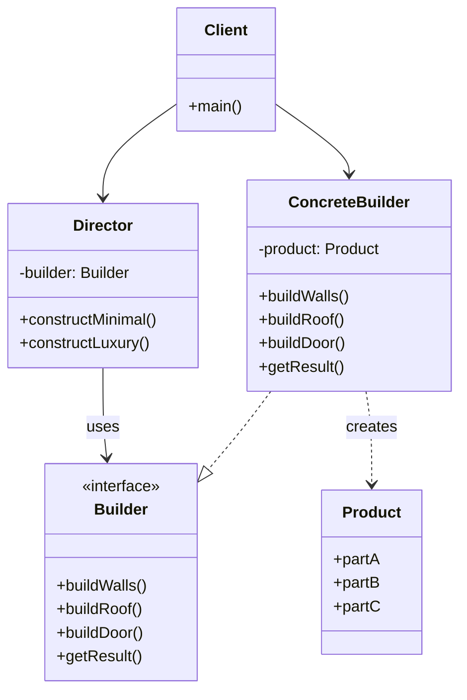
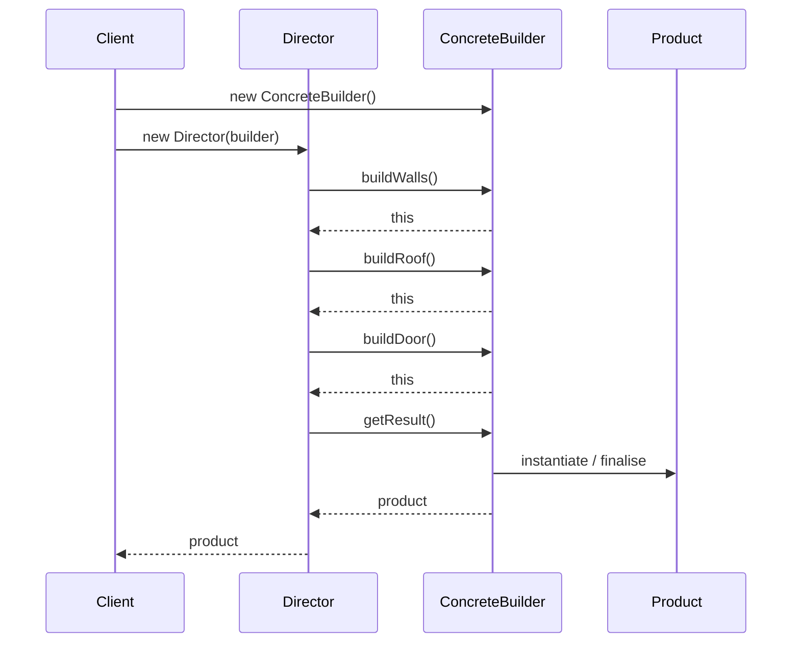
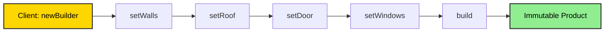
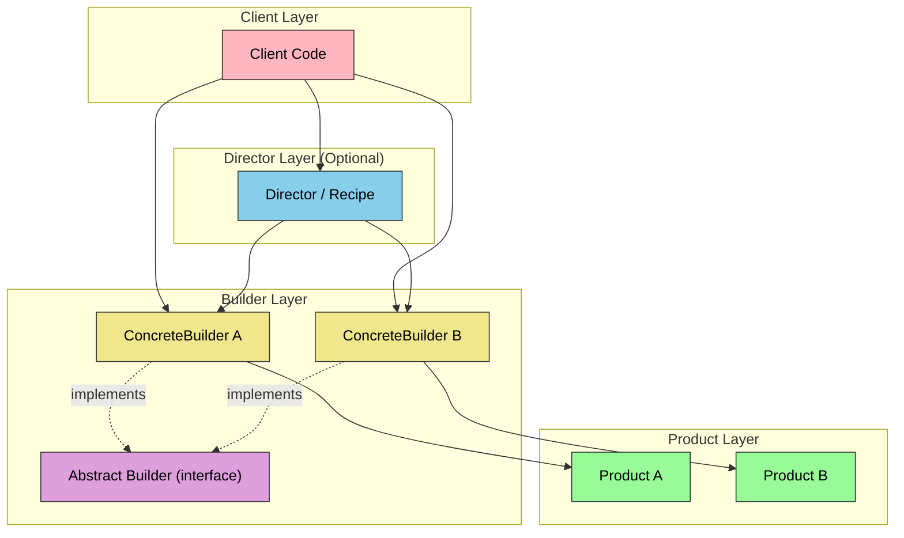
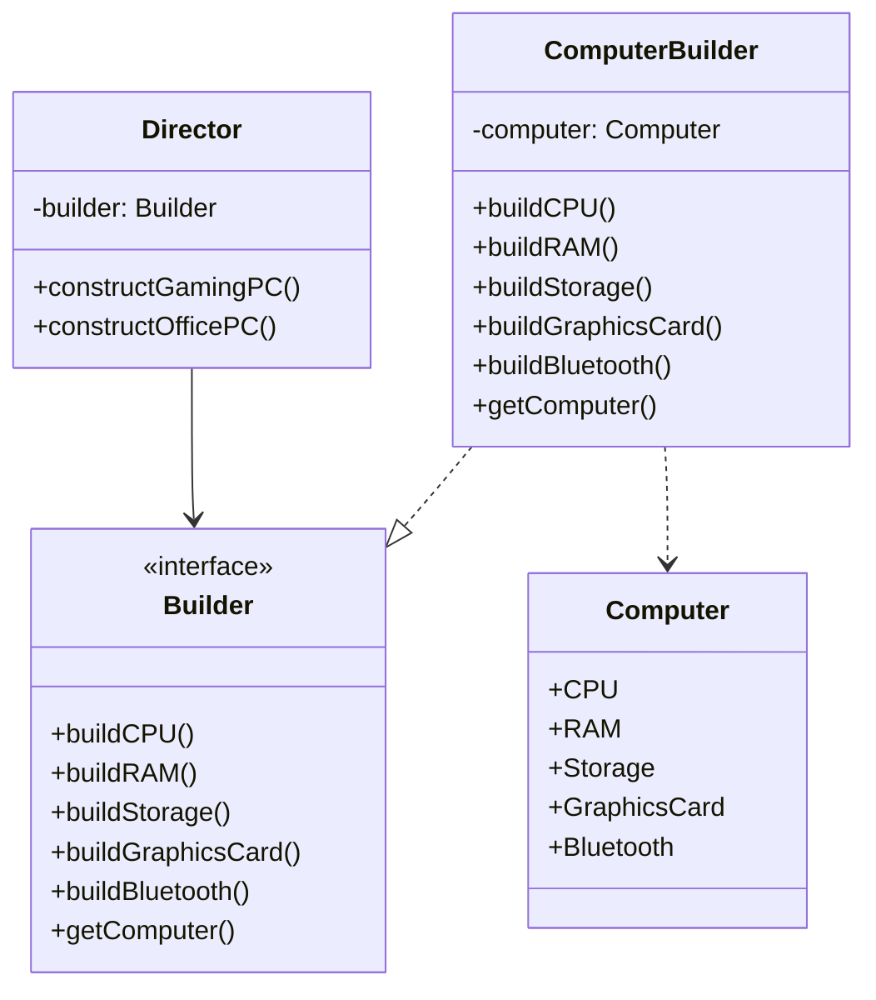

# Builder Pattern

<!-- SECTION_1_START -->
# Builder Pattern — KTU 2024 Scheme Premium Study Notes

## 1. Core Technical Definition & Intuitive Overview

### Formal Definition (KTU 2024 Syllabus Terminology)

> [!IMPORTANT]
> **Builder Pattern** is a *creational design pattern* from the *Gang of Four (GoF)* catalogue that **separates the construction of a complex object from its representation**, so that the same construction process can create different representations. It builds the object **step-by-step** through a dedicated *Director* orchestrating a *Builder* interface, and finally **retrieves the result** only when the object is fully assembled.

The pattern is formally classified under **Creational Patterns** because it deals with **object creation mechanisms**, attempting to create objects in a manner suitable to the situation. Unlike the Abstract Factory or Factory Method (which emphasise *product families* and *single-step creation*), the Builder is uniquely suited for objects that have:

- **A large number of optional parameters or configuration steps**
- **A telescoping constructor anti-pattern** (constructors with too many parameters)
- **A need to construct different immutable representations of the same product**

### Conceptual Analogy / Intuition

> [!NOTE]
> **Real-world Analogy — Building a Customised Pizza 🍕**
> Imagine walking into a pizza restaurant. You do not get a "pizza" handed to you immediately. Instead, the waiter (the **Director**) takes your order step-by-step: first the base (thin crust / thick crust / stuffed), then the sauce (tomato / white / pesto), then the cheese, then the toppings, and finally baking instructions. At the end, the chef hands you a fully baked, customised pizza (the **Product**).
>
> You never needed to know *how* the pizza is assembled internally — you just specified *what* you wanted. This is exactly what the Builder does for software objects. The *Builder interface* is the menu, the *Concrete Builder* is the chef, the *Director* is the waiter enforcing the sequence, and the *Product* is the pizza on your table.

### Mathematical / Structural Intuition

If we view object construction as a function:

$$P = f(c_1, c_2, c_3, \ldots, c_n)$$

where $c_i$ are construction steps (parts, configurations, validations), the Builder transforms this into a **sequential pipeline**:

$$P = \text{Builder.buildPart1}() \rightarrow \text{Builder.buildPart2}() \rightarrow \cdots \rightarrow \text{Builder.getResult}()$$

allowing the same pipeline to produce variant products $P_1, P_2, P_3, \ldots$

### Key Participants (GoF Roles)

| Role | Responsibility |
|---|---|
| **Product** | The complex object to be created (e.g., `House`, `Pizza`, `HTTPRequest`) |
| **Builder (Abstract)** | Declares construction steps as abstract methods |
| **ConcreteBuilder** | Implements the steps; maintains the internal representation |
| **Director** | Orchestrates the sequence of building steps |
| **Client** | Creates a Director with a chosen ConcreteBuilder, then retrieves the result |

> [!TIP]
> **KTU Syllabus Highlight:** Students must memorise the *five participants* and the *intent* verbatim. Examiner questions on "list the participants of Builder pattern" appear almost every semester.

---

<!-- SECTION_1_END -->

<!-- SECTION_2_START -->
# 2. Deep Theoretical Analysis & KTU High-Yield Formula Sheet

## 2.1 The Problem Builder Solves — The Telescoping Constructor Anti-Pattern

Consider a `House` class with **6 parameters**, all optional:

```java
// ❌ ANTI-PATTERN: Telescoping Constructor
public House(String walls, String roof, String door, 
             String windows, String garage, boolean pool) { ... }
```

With 6 optional parameters, you would need $2^6 = 64$ overloaded constructors to cover every combination. This is **unmaintainable, unreadable, and error-prone**.

The Builder pattern solves this by replacing the bloated constructor with a **fluent, chainable API**:

```java
House house = new HouseBuilder()
    .setWalls("Brick")
    .setRoof("Concrete")
    .setDoor("Wooden")
    .build();   // ← only the parts you set are configured
```

## 2.2 When to Use the Builder Pattern (Applicability)

The pattern is applicable when:

1. The algorithm for creating a complex object should be **independent of the parts** that make up the object and how they are assembled.
2. The construction process must **allow different representations** of the object being constructed.
3. The object has **more than 4-5 configuration parameters**, many of which are optional.
4. **Immutability** of the final product is desired (especially important in multi-threaded Java/C# environments).
5. The client code needs to construct objects **step-by-step**, with the ability to skip steps or vary order in subclasses.

> [!NOTE]
> **Real-World Engineering Use Case:** In the **Spring Framework**, `UriComponentsBuilder` constructs URIs step-by-step. In **Java's `StringBuilder`**, characters are appended sequentially. In **Android**, `AlertDialog.Builder` and `Notification.Builder` use this exact pattern. In **Lombok**, the `@Builder` annotation generates the entire pattern at compile-time.

## 2.3 Consequences (Trade-offs)

### Advantages ✅
- **Readable client code** — parameter names appear at the call site.
- **Immutability** — once `.build()` is called, the product is frozen.
- **Single Responsibility Principle** — construction logic is isolated from business logic.
- **Step-by-step construction** — deferred finalisation.
- **Fine-grained control** over the construction process.

### Disadvantages ❌
- **Increased code volume** — requires a separate Builder class per product.
- **Verbosity** — for simple objects with 2-3 fields, it is overkill.
- **Complexity** — adds more classes to the design.

## 2.4 KTU Formula Sheet / Cheat Sheet

| Concept | Notation / Formula | Description |
|---|---|---|
| Number of constructor overloads to avoid | $2^n$ | Where $n$ = number of optional parameters |
| Pattern Category | Creational | GoF classification |
| Intent | Separate construction from representation | Core definition |
| Director's role | Sequencing | Calls builder methods in fixed order |
| Builder's role | Building + State | Stores partial state, returns self for chaining |
| Return type of builder methods | `Builder` (Fluent) | Enables method chaining `$b_1.f_1().f_2()...$` |
| Final method | `build()` | Returns the immutable `Product` |
| Java 8+ shorthand | `Consumer<T>` parameter | Static nested `builder(Consumer<T>)` method |
| Lombok annotation | `@Builder` | Auto-generates builder at compile time |

## 2.5 Relationship to Other Patterns

- **Builder vs. Abstract Factory:** Both produce complex objects, but Abstract Factory emphasises *product families* (created in one shot), while Builder focuses on *step-by-step* construction of a *single complex product*.
- **Builder vs. Factory Method:** Factory Method is a single-method creation; Builder is multi-step.
- **Builder + Composite:** Often used together — the Builder assembles a Composite tree structure.

---

<!-- SECTION_2_END -->

<!-- SECTION_3_START -->
# 3. Step-by-Step Derivations & Code/Symbolic Implementation

## 3.1 Canonical Implementation in Java (Classical GoF Style)

### Step 1 — Define the Product

```java
// === PRODUCT ===
// The complex object we want to build step-by-step.
// In a KTU exam, you may also call this the "ComplexObject".
public class House {
    private final String walls;       // required
    private final String roof;        // required
    private final String door;        // optional
    private final String windows;     // optional
    private final String garage;      // optional
    private final boolean pool;       // optional

    // Private constructor — only Builder can create House
    private House(HouseBuilder builder) {
        this.walls   = builder.walls;
        this.roof    = builder.roof;
        this.door    = builder.door;
        this.windows = builder.windows;
        this.garage  = builder.garage;
        this.pool    = builder.pool;
    }

    // Getters only — immutability enforced
    public String getWalls()   { return walls; }
    public String getRoof()    { return roof; }
    public String getDoor()    { return door; }
    public String getWindows() { return windows; }
    public String getGarage()  { return garage; }
    public boolean hasPool()   { return pool; }

    @Override
    public String toString() {
        return "House [walls=" + walls + ", roof=" + roof + 
               ", door=" + door + ", windows=" + windows + 
               ", garage=" + garage + ", pool=" + pool + "]";
    }

    // === BUILDER (Static Nested Class) ===
    public static class HouseBuilder {
        // Required parameters
        private final String walls;
        private final String roof;

        // Optional parameters — initialised to defaults
        private String door    = "Standard Door";
        private String windows = "Standard Windows";
        private String garage  = "No Garage";
        private boolean pool   = false;

        public HouseBuilder(String walls, String roof) {
            this.walls = walls;
            this.roof  = roof;
        }

        // === FLUENT SETTERS — return 'this' for chaining ===
        public HouseBuilder setDoor(String door) {
            this.door = door;
            return this;
        }

        public HouseBuilder setWindows(String windows) {
            this.windows = windows;
            return this;
        }

        public HouseBuilder setGarage(String garage) {
            this.garage = garage;
            return this;
        }

        public HouseBuilder setPool(boolean pool) {
            this.pool = pool;
            return this;
        }

        // === FINAL ASSEMBLY ===
        public House build() {
            return new House(this);
        }
    }
}
```

### Step 2 — Client Code (The Test Driver)

```java
public class BuilderDemo {
    public static void main(String[] args) {
        // Case 1: Minimal house (only required fields)
        House minimal = new House.HouseBuilder("Brick", "Concrete")
                                .build();

        // Case 2: Fully-loaded luxury house
        House luxury = new House.HouseBuilder("Stone", "Slate")
                               .setDoor("Oak Wood")
                               .setWindows("Double-Glazed")
                               .setGarage("2-Car Attached")
                               .setPool(true)
                               .build();

        // Case 3: Mid-range configuration
        House midRange = new House.HouseBuilder("Brick", "Tiles")
                                  .setGarage("1-Car")
                                  .build();

        System.out.println(minimal);
        System.out.println(luxury);
        System.out.println(midRange);
    }
}
```

### Step 3 — Expected Output

```
House [walls=Brick, roof=Concrete, door=Standard Door, windows=Standard Windows, garage=No Garage, pool=false]
House [walls=Stone, roof=Slate, door=Oak Wood, windows=Double-Glazed, garage=2-Car Attached, pool=true]
House [walls=Brick, roof=Tiles, door=Standard Door, windows=Standard Windows, garage=1-Car, pool=false]
```

## 3.2 Director-Based Implementation (Full GoF Structure)

When the **construction sequence** itself must be encapsulated separately (e.g., for predefined "recipes"), we use a Director.

```java
// === ABSTRACT BUILDER ===
interface HousePlanBuilder {
    HousePlanBuilder buildWalls();
    HousePlanBuilder buildRoof();
    HousePlanBuilder buildDoor();
    HousePlanBuilder buildWindows();
    HousePlanBuilder buildGarage();
    HousePlanBuilder buildPool();
    House getHouse();   // returns final product
}

// === CONCRETE BUILDER ===
class LuxuryHouseBuilder implements HousePlanBuilder {
    private House house = new House();

    @Override
    public HousePlanBuilder buildWalls() {
        house.setWalls("Italian Marble");
        return this;
    }

    @Override
    public HousePlanBuilder buildRoof() {
        house.setRoof("Spanish Slate");
        return this;
    }

    @Override
    public HousePlanBuilder buildDoor() {
        house.setDoor("Teak Wood Double-Door");
        return this;
    }

    @Override
    public HousePlanBuilder buildWindows() {
        house.setWindows("Floor-to-Ceiling Glass");
        return this;
    }

    @Override
    public HousePlanBuilder buildGarage() {
        house.setGarage("3-Car Underground");
        return this;
    }

    @Override
    public HousePlanBuilder buildPool() {
        house.setPool(true);
        return this;
    }

    @Override
    public House getHouse() {
        return this.house;
    }
}

// === DIRECTOR ===
class ConstructionEngineer {
    private HousePlanBuilder builder;

    public ConstructionEngineer(HousePlanBuilder builder) {
        this.builder = builder;
    }

    // Recipe 1: Minimal low-budget house
    public House constructMinimalHouse() {
        return builder.buildWalls()
                      .buildRoof()
                      .buildDoor()
                      .getHouse();
    }

    // Recipe 2: Fully-loaded luxury house
    public House constructLuxuryHouse() {
        return builder.buildWalls()
                      .buildRoof()
                      .buildDoor()
                      .buildWindows()
                      .buildGarage()
                      .buildPool()
                      .getHouse();
    }
}

// === CLIENT ===
public class DirectorDemo {
    public static void main(String[] args) {
        ConstructionEngineer engineer = 
            new ConstructionEngineer(new LuxuryHouseBuilder());

        House myHouse = engineer.constructLuxuryHouse();
        System.out.println("Built: " + myHouse);
    }
}
```

## 3.3 Java 8 Generic Builder (Using `Consumer<T>`)

This is the **modern, production-grade** version. It allows a single static `builder()` method to produce any builder type:

```java
import java.util.function.Consumer;

public class GenericBuilder<T> {
    private final T instance;
    private final java.util.function.Consumer<T> postProcessor;

    private GenericBuilder(T instance, Consumer<T> postProcessor) {
        this.instance = instance;
        this.postProcessor = postProcessor;
    }

    public static <T> T build(Class<T> clazz, Consumer<T> consumer) 
        throws Exception {
        T obj = clazz.getDeclaredConstructor().newInstance();
        consumer.accept(obj);
        return obj;
    }

    public GenericBuilder<T> with(Consumer<T> fn) {
        fn.accept(instance);
        return this;
    }

    public T build() {
        postProcessor.accept(instance);
        return instance;
    }
}
```

**Usage:**

```java
House h = GenericBuilder.build(House.class, 
    house -> house.setWalls("Brick").setRoof("Tiles").setPool(true));
```

## 3.4 Python Equivalent (For Cross-Language Appreciation)

```python
class House:
    def __init__(self):
        self.walls = None
        self.roof = None
        self.door = None
        self.windows = None
        self.garage = None
        self.pool = False

    def __repr__(self):
        return (f"House(walls={self.walls!r}, roof={self.roof!r}, "
                f"door={self.door!r}, windows={self.windows!r}, "
                f"garage={self.garage!r}, pool={self.pool!r})")


class HouseBuilder:
    def __init__(self, walls: str, roof: str):
        self._house = House()
        self._house.walls = walls
        self._house.roof = roof

    def set_door(self, door: str) -> "HouseBuilder":
        self._house.door = door
        return self

    def set_windows(self, windows: str) -> "HouseBuilder":
        self._house.windows = windows
        return self

    def set_garage(self, garage: str) -> "HouseBuilder":
        self._house.garage = garage
        return self

    def set_pool(self, pool: bool) -> "HouseBuilder":
        self._house.pool = pool
        return self

    def build(self) -> House:
        return self._house


# Client
if __name__ == "__main__":
    h = (HouseBuilder("Stone", "Slate")
         .set_door("Teak")
         .set_windows("Glass")
         .set_garage("2-Car")
         .set_pool(True)
         .build())
    print(h)
```

---

<!-- SECTION_3_END -->

<!-- SECTION_4_START -->
# 4. Structural Diagrams & Schematics

## 4.1 Classic GoF UML Class Diagram (Mermaid Representation)



## 4.2 Sequential Construction Flow (Director + Builder)



## 4.3 Fluent Builder — Chained Method Call Topology



## 4.4 Block-Level Functional Architecture (Builder Internals)



---

<!-- SECTION_4_END -->

<!-- SECTION_5_START -->
# 5. KTU 2024 Scheme Examination Question Bank & Topic Recap

## 5.1 Part A — Short Answer Questions (3 Marks Each)

### Question 1
> **[KTU University Exam — July 2024 | CO1 | Remember]**
> Define the Builder design pattern. State any two situations where it is preferred over the Factory Method pattern.

**Model Answer (3 Marks):**
- **[Definition — 2 Marks]:** Builder is a *creational design pattern* that separates the **construction of a complex object from its representation**, allowing the same construction process to create different representations. The object is built step-by-step using a fluent API and finalised via a `build()` method.
- **[Situation 1 — 0.5 Mark]:** When the object has **many optional parameters** (more than 4-5), avoiding the *telescoping constructor anti-pattern*.
- **[Situation 2 — 0.5 Mark]:** When the construction requires **step-by-step assembly** in a specific order, or when an **immutable** product is required.

### Question 2
> **[KTU University Exam — Dec 2023 | CO1 | Understand]**
> List the participants of the Builder pattern. Briefly explain the role of the **Director**.

**Model Answer (3 Marks):**
1. **Product** (0.5)
2. **Builder (Abstract Interface)** (0.5)
3. **ConcreteBuilder** (0.5)
4. **Director** (0.5)
5. **Client** (0.5)
- **[Role of Director — 1 Mark]:** The Director **encapsulates the construction algorithm / sequence** of building steps. It is *not* aware of the concrete product type — it only invokes the abstract builder methods in a predefined order to produce a specific variant (e.g., "luxury house" vs. "minimal house"). The Director is *optional* in the simpler fluent-builder variant.

---

## 5.2 Part B — Full 14-Mark Questions (Module Internal Choice)

### Question A (14 Marks)

> **[KTU University Exam — Dec 2024 | CO2 | Apply / Analyse]**
> **(a)** Explain the intent, structure, and participants of the Builder design pattern with a neat UML class diagram. **[7 Marks]**
> **(b)** Write a complete Java program to implement the Builder pattern for constructing a `Computer` object with the following parts: `CPU` (required), `RAM` (required), `Storage` (optional), `GraphicsCard` (optional), and `Bluetooth` (optional, boolean). Demonstrate creating two different configurations. **[7 Marks]**

### Model Solution — Part (a) [7 Marks]

**Intent [1 Mark]:** The Builder pattern **separates object construction from its representation**, enabling step-by-step construction of a complex object using the same process to produce different representations.

**Participants [2 Marks]:**
| Participant | Role |
|---|---|
| Product | Complex object being built (e.g., `Computer`) |
| Builder | Abstract interface declaring construction steps |
| ConcreteBuilder | Implements the steps; assembles the product |
| Director | Orchestrates the construction sequence (optional) |
| Client | Triggers construction and retrieves the result |

**Structure / UML Class Diagram [3 Marks]:**



**Working [1 Mark]:** The Client instantiates a `ConcreteBuilder`, optionally passes it to a `Director`, invokes the build steps in sequence, and finally calls `getComputer()` to obtain the assembled, immutable product.

### Model Solution — Part (b) [7 Marks]

**[Product class — 2 Marks]:**

```java
public class Computer {
    // Required
    private final String CPU;
    private final String RAM;
    // Optional
    private final String storage;
    private final String graphicsCard;
    private final boolean bluetooth;

    // Private constructor — only Builder can create
    private Computer(ComputerBuilder builder) {
        this.CPU = builder.CPU;
        this.RAM = builder.RAM;
        this.storage = builder.storage;
        this.graphicsCard = builder.graphicsCard;
        this.bluetooth = builder.bluetooth;
    }

    // Getters
    public String getCPU() { return CPU; }
    public String getRAM() { return RAM; }
    public String getStorage() { return storage; }
    public String getGraphicsCard() { return graphicsCard; }
    public boolean hasBluetooth() { return bluetooth; }

    @Override
    public String toString() {
        return "Computer [CPU=" + CPU + ", RAM=" + RAM + 
               ", Storage=" + storage + ", GPU=" + graphicsCard + 
               ", Bluetooth=" + bluetooth + "]";
    }

    // Static nested Builder
    public static class ComputerBuilder {
        // Required
        private final String CPU;
        private final String RAM;
        // Optional (defaults)
        private String storage = "256GB SSD";
        private String graphicsCard = "Integrated";
        private boolean bluetooth = false;

        public ComputerBuilder(String CPU, String RAM) {
            this.CPU = CPU;
            this.RAM = RAM;
        }

        public ComputerBuilder setStorage(String storage) {
            this.storage = storage;
            return this;
        }

        public ComputerBuilder setGraphicsCard(String gpu) {
            this.graphicsCard = gpu;
            return this;
        }

        public ComputerBuilder setBluetooth(boolean bt) {
            this.bluetooth = bt;
            return this;
        }

        public Computer build() {
            return new Computer(this);
        }
    }
}
```

**[Client code — 3 Marks]:**

```java
public class ComputerDemo {
    public static void main(String[] args) {
        // Configuration 1: Gaming PC
        Computer gamingPC = new Computer.ComputerBuilder(
                                "Intel i9-13900K", "32GB DDR5")
                            .setStorage("2TB NVMe SSD")
                            .setGraphicsCard("NVIDIA RTX 4090")
                            .setBluetooth(true)
                            .build();

        // Configuration 2: Office PC
        Computer officePC = new Computer.ComputerBuilder(
                                "Intel i5-12400", "16GB DDR4")
                            .build();

        // Configuration 3: Mid-range
        Computer midRange = new Computer.ComputerBuilder(
                                "AMD Ryzen 7", "16GB DDR4")
                            .setStorage("1TB SSD")
                            .setBluetooth(true)
                            .build();

        System.out.println(gamingPC);
        System.out.println(officePC);
        System.out.println(midRange);
    }
}
```

**[Output — 1 Mark]:**

```
Computer [CPU=Intel i9-13900K, RAM=32GB DDR5, Storage=2TB NVMe SSD, GPU=NVIDIA RTX 4090, Bluetooth=true]
Computer [CPU=Intel i5-12400, RAM=16GB DDR4, Storage=256GB SSD, GPU=Integrated, Bluetooth=false]
Computer [CPU=AMD Ryzen 7, RAM=16GB DDR4, Storage=1TB SSD, GPU=Integrated, Bluetooth=true]
```

**[Demonstration of two configurations: 1 Mark]** — Done above with `gamingPC` and `officePC`.

---

### Question B (14 Marks) — *Alternative Choice*

> **[KTU University Exam — July 2023 | CO2 | Apply / Analyse]**
> **(a)** Compare the Builder pattern with the Abstract Factory pattern. State four key differences. **[7 Marks]**
> **(b)** A startup needs to send three types of notifications: `EMAIL`, `SMS`, and `PUSH`. Each notification has a common header, common body, and a type-specific footer. Design and implement the Builder pattern in Java to construct these notifications immutably. Show client code that builds one of each type. **[7 Marks]**

### Model Solution — Part (a) [7 Marks]

**[Comparison table — 4 Marks] (0.5 each row, 4 rows = 2 Marks; 1 Mark for heading/structure; 1 Mark for extras):**

| Aspect | Builder | Abstract Factory |
|---|---|---|
| **Primary Intent** | Step-by-step construction of a complex object | Produce families of related objects |
| **Number of methods** | Multiple (one per part) | One per product type |
| **Construction granularity** | Fine-grained, part-by-part | Coarse-grained, whole families at once |
| **Product variety** | Different *representations* of the *same* product | Different *types* in a product *family* |
| **Director role** | Yes, optional | No, client calls factory directly |
| **Use case example** | Building a `House` with optional parts | Building a `MacFactory` returning Mac-themed UI components |

**[Two key differences — 3 Marks]:**

1. **[2 Marks]** Builder focuses on constructing a **single complex object** in multiple steps, whereas Abstract Factory focuses on producing a **family of related objects** in a single shot. For example, a `HouseBuilder` builds *one* house; a `GUIFactory` returns *multiple* widgets (button, checkbox, menu) in one call.

2. **[1 Mark]** Builder can defer the final construction (`build()`), allowing the same Director to create different representations; Abstract Factory returns the entire family immediately, with no deferred finalisation.

### Model Solution — Part (b) [7 Marks]

**[Product class — 2 Marks]:**

```java
public final class Notification {
    private final String header;
    private final String body;
    private final String footer;     // type-specific
    private final String type;       // EMAIL / SMS / PUSH

    private Notification(Builder b) {
        this.header = b.header;
        this.body   = b.body;
        this.footer = b.footer;
        this.type   = b.type;
    }

    public String getHeader() { return header; }
    public String getBody()   { return body; }
    public String getFooter() { return footer; }
    public String getType()   { return type; }

    @Override
    public String toString() {
        return "[" + type + "] " + header + "\n" + body + "\n" + footer;
    }

    // === STATIC BUILDER ===
    public static class Builder {
        // Required
        private final String type;
        // Common (also required to enforce)
        private String header = "";
        private String body   = "";
        // Type-specific footer (set by factory method)
        private String footer = "";

        private Builder(String type) {
            this.type = type;
        }

        // === FACTORY METHODS per type ===
        public static Builder email()  { 
            return new Builder("EMAIL").footer("— Sent via SecureMail v2.1"); 
        }
        public static Builder sms()    { 
            return new Builder("SMS").footer("— SMS Gateway, Reply STOP to opt out"); 
        }
        public static Builder push()   { 
            return new Builder("PUSH").footer("— Tap to open in App"); 
        }

        public Builder setHeader(String h) { this.header = h; return this; }
        public Builder setBody(String b)   { this.body = b;   return this; }
        public Builder setFooter(String f) { this.footer = f; return this; }

        public Notification build() {
            return new Notification(this);
        }
    }
}
```

**[Client code — 3 Marks]:**

```java
public class NotificationDemo {
    public static void main(String[] args) {
        Notification email = Notification.Builder.email()
            .setHeader("Welcome to KTU B.Tech 2024 Scheme!")
            .setBody("Dear Student, your registration is confirmed.")
            .build();

        Notification sms = Notification.Builder.sms()
            .setHeader("KTU Alert")
            .setBody("Your exam results are out. Check the portal.")
            .build();

        Notification push = Notification.Builder.push()
            .setHeader("New Update")
            .setBody("Module 2 notes for OECST72A are now available.")
            .build();

        System.out.println(email);
        System.out.println();
        System.out.println(sms);
        System.out.println();
        System.out.println(push);
    }
}
```

**[Output — 1 Mark]:**

```
[EMAIL] Welcome to KTU B.Tech 2024 Scheme!
Dear Student, your registration is confirmed.
— Sent via SecureMail v2.1

[SMS] KTU Alert
Your exam results are out. Check the portal.
— SMS Gateway, Reply STOP to opt out

[PUSH] New Update
Module 2 notes for OECST72A are now available.
— Tap to open in App
```

**[Immutability proof — 1 Mark]:** Final class, private final fields, no setters — verified by marking the class `final` and all fields `private final`.

---

## 5.3 KTU Examiner's Valuation Warning / Pitfall Callout

> [!WARNING]
> **Common Marks-Deduction Pitfalls in Builder Pattern Questions:**
> 1. **Forgetting to mark the Product class as `final` and fields as `private final`** — loses 1 mark for immutability.
> 2. **Forgetting to return `this` in setter methods** — breaks the fluent chain; the client cannot chain `.setX().setY()`. Loses 1 mark.
> 3. **Making the Product constructor public** — defeats the purpose; the Builder cannot guarantee immutability. Loses 1 mark.
> 4. **Not drawing the UML class diagram with the correct arrows** — a *dashed* arrow with hollow triangle for `implements`, *solid* arrow for *association*. Loses 1 mark.
> 5. **Confusing Builder with Factory Method** — writing `ComputerBuilder.createComputer()` is wrong; the final method must be `build()`. Loses 0.5 mark.
> 6. **Not stating the *intent* verbatim** in definition questions — examiners expect the exact phrase "separates the construction of a complex object from its representation".

---

## 5.4 Topic Recap & Important Things to Remember

- 📌 **Pattern Type:** Creational (GoF).
- 📌 **Intent (Verbatim):** "Separate the construction of a complex object from its representation so that the same construction process can create different representations."
- 📌 **Five Participants:** Product, Builder (abstract), ConcreteBuilder, Director, Client.
- 📌 **Key Design Rule:** The Product's constructor is **private**; only the inner Builder can instantiate it.
- 📌 **Mandatory Builder Convention:** All setter methods must `return this` to enable **method chaining / fluent API**.
- 📌 **Telescoping Constructor Anti-Pattern:** With $n$ optional parameters, you would need $2^n$ constructors — the Builder eliminates this.
- 📌 **Director is Optional:** In modern fluent builders, the Director is often inlined into the client for simplicity.
- 📌 **Immutability is a Major Benefit:** Final fields + private constructor = thread-safe objects.
- 📌 **Default Values:** Optional fields should be initialised to sensible defaults inside the Builder.
- 📌 **Builder vs. Abstract Factory:** Builder = step-by-step, single product; Abstract Factory = one-shot, family of products.
- 📌 **Real-World Examples:** `StringBuilder` (Java), `AlertDialog.Builder` (Android), `@Builder` (Lombok), `UriComponentsBuilder` (Spring), `OkHttpClient.Builder` (OkHttp).
- 📌 **Common Lombok Annotation:** `@Builder` (auto-generates the entire pattern at compile time).
- 📌 **Java 8+ Style:** Static nested `builder()` method accepting a `Consumer<T>` for terse construction.
- 📌 **KTU Marks Distribution Pattern:** Definition (2) + Participants (1) + UML Diagram (3) + Code Implementation (5) + Output/Verification (1) + Use Cases (2) = 14 marks.
- 📌 **Always draw UML with:** `<<interface>>` stereotype on Builder; dashed arrow for `implements`; solid arrow for Director → Builder association.

<!-- SECTION_5_END -->
