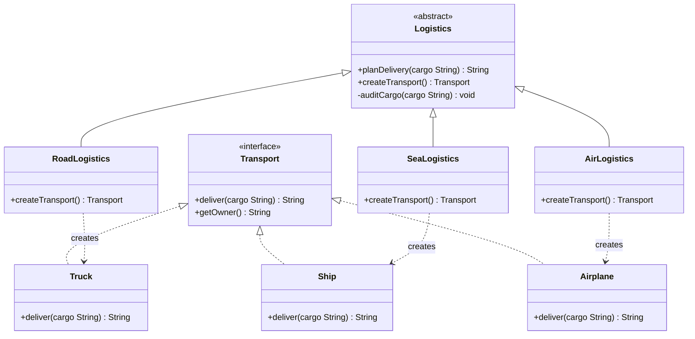
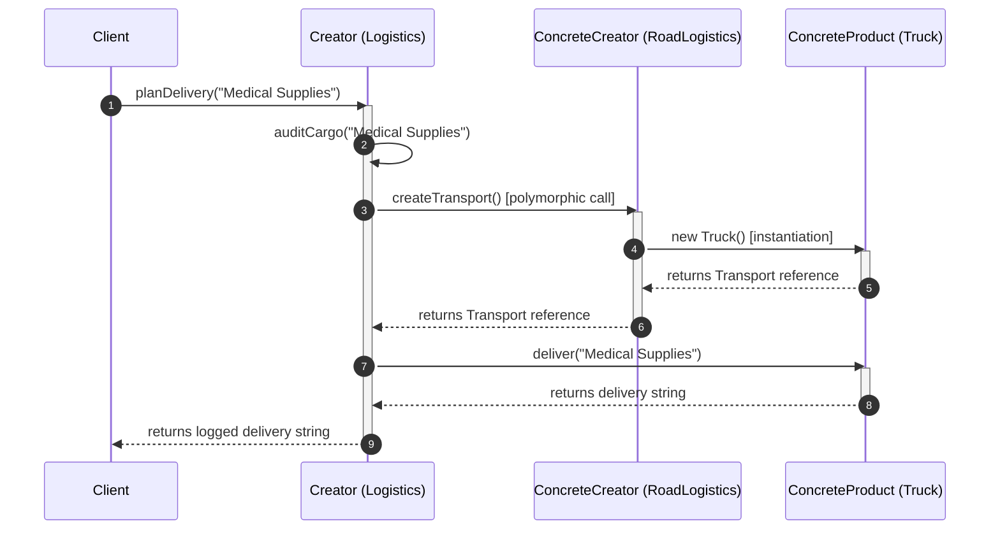
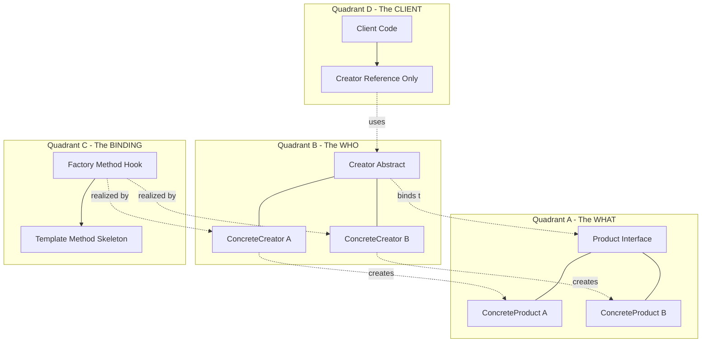
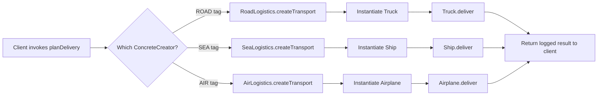
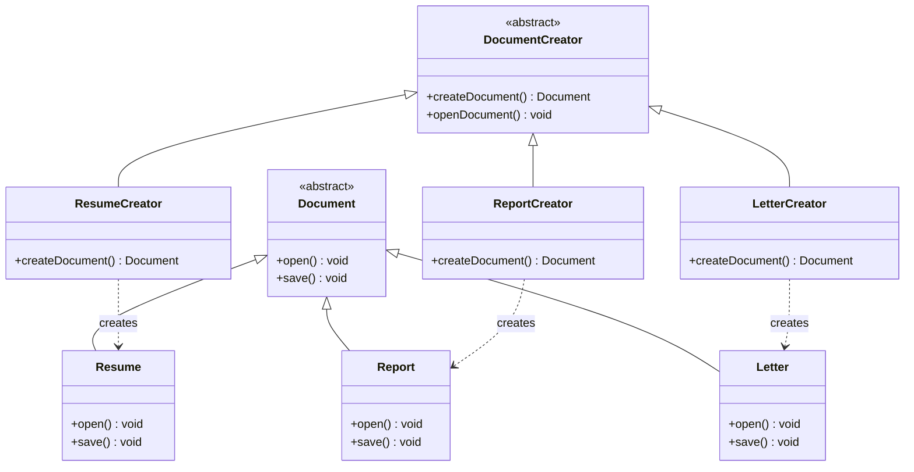

# Factory Method Pattern

<!-- SECTION_1_START -->
# 1. Core Technical Definition & Intuitive Overview

## 1.1 Formal Definition (KTU 2024 Syllabus Terminology)

> [!IMPORTANT]
> **Factory Method Pattern (Gang of Four — Creational Pattern)**
> *"Define an interface for creating an object, but let subclasses decide which class to instantiate. Factory Method lets a class defer instantiation to subclasses."*
> — *Erich Gamma et al., Design Patterns: Elements of Reusable Object-Oriented Software*

In KTU 2024 Scheme OBE terminology, the Factory Method Pattern is a **deferred-instantiation creational framework** in which a **superclass (Creator)** declares the abstract `factoryMethod()` returning a generic **Product** abstraction, while each **subclass (ConcreteCreator)** overrides the factory method to materialise a **ConcreteProduct** that is semantically compatible with the parent's algorithmic skeleton. The pattern decouples **object construction** from **object usage**, thereby satisfying the *Dependency Inversion Principle* of SOLID.

## 1.2 Conceptual Analogy & Intuitive Overview

> [!NOTE]
> **Intuition: The Pizza Franchise Analogy**
> Imagine a national pizza brand. The head office (Creator) defines a strict kitchen protocol: *prepare dough → add sauce → bake → slice → box*. However, the head office **does not know** which pizza style the local franchise will produce. The Mumbai franchise (ConcreteCreator) decides to instantiate a *Paneer Tikka Pizza*, while the Chennai franchise instantiates a *Masala Corn Pizza*. The **kitchen protocol remains identical**, but the **concrete product is decided by the subclass at runtime**.

The kitchen protocol is the **Template Method skeleton**, and the moment the franchise decides *which pizza to bake* is the **Factory Method hook** — this is the entire essence of the pattern.

| GOF Element | Pizza Analogy Mapping |
|---|---|
| `Product` (abstract) | The generic `Pizza` interface |
| `ConcreteProduct` | `PaneerTikkaPizza`, `MasalaCornPizza` |
| `Creator` (abstract) | `PizzaStore` with the fixed `orderPizza()` recipe |
| `ConcreteCreator` | `MumbaiPizzaStore`, `ChennaiPizzaStore` |
| `factoryMethod()` | `createPizza()` overridden per region |
| `clientCode()` | The customer placing an order |

> [!VISUALIZATION CONTROL]
> **Concept:** UML Class Diagram for the Factory Method Pattern (Creator/Product Duality)
> **GeoGebra / Desmos Input Equations (not applicable for UML — use draw.io or Lucidchart)**
> **Visual Description:** Two parallel inheritance hierarchies. On the *left track*, an abstract `Creator` class declares the abstract `factoryMethod()` and a concrete `templateMethod()` that calls it. On the *right track*, an abstract `Product` interface declares the business method. Two concrete subclasses on each side are connected via a *realisation* (Creator → ConcreteCreator) and a *creation dependency* (ConcreteCreator → ConcreteProduct) arrow.

## 1.3 Classification within GoF Catalogue

| Property | Value |
|---|---|
| **Pattern Category** | Creational |
| **Pattern Family** | Factory Family (Simple Factory → Factory Method → Abstract Factory) |
| **Pattern ID** (GoF numbering) | 5 / 23 |
| **Primary SOLID Principle Honoured** | *Dependency Inversion Principle (DIP)*, *Open/Closed Principle (OCP)* |
| **Inverse Coupling Eliminated** | Client ↛ Concrete Class (only Client → Creator) |
| **Instantiation Decision Owner** | Subclass (runtime polymorphism) |
| **Standard Frequency in KTU Board Exams** | **High** (Module 2 mandatory topic) |

> [!TIP]
> **Why KTU loves this pattern:** It is the *only* GoF pattern where the syllabus explicitly demands both the *UML class diagram* and a *working code skeleton* in Part B questions. Memorise the four participants and the 1-to-1 parallel inheritance structure — these are guaranteed 4-mark carriers.

---

<!-- SECTION_1_END -->

<!-- SECTION_2_START -->
# 2. Deep Theoretical Analysis & KTU High-Yield Formula Sheet

## 2.1 Intent, Motivation & Problem Solved

The Factory Method addresses the **"tight-coupling-on-instantiation"** problem. Consider the anti-pattern:

```java
// ANTI-PATTERN — violates OCP
if (region.equals("Mumbai")) {
    transport = new Truck();        // client knows about Truck
} else if (region.equals("Chennai")) {
    transport = new Ship();         // client knows about Ship
}
```

The client code now references **every concrete class**. Adding a new `Airplane` transport forces you to **edit** existing client code — a direct violation of the *Open/Closed Principle*.

The Factory Method inverts this control:
- The client holds a reference to the **abstract `Creator`**.
- The concrete `Creator` subclass injects the correct `Product` at instantiation time.
- The client **never imports** the concrete product class.

## 2.2 Structural Participants (Canonical GOF Roles)

| # | Role | Responsibility | Visibility |
|---|---|---|---|
| 1 | **Product** | Defines the interface of objects the factory method creates. | `abstract` / `interface` |
| 2 | **ConcreteProduct** | Implements the `Product` interface. Each one represents a different algorithmic variant. | `class` |
| 3 | **Creator** | Declares the abstract `factoryMethod()` and typically contains the *template method* that calls the factory method. | `abstract` |
| 4 | **ConcreteCreator** | Overrides `factoryMethod()` to instantiate and return a specific `ConcreteProduct`. | `class` |

## 2.3 The Four Method Types Inside the Creator

A canonical `Creator` contains exactly **three method categories** plus the factory hook:

| Method Category | Method | Purpose | Concrete Implementation? |
|---|---|---|---|
| **Factory Method (Hook)** | `factoryMethod()` | *Returns* a `Product`. The only place where instantiation occurs. | **No** — abstract in base |
| **Template Method (Algorithm Skeleton)** | `someOperation()` | Calls `factoryMethod()` and uses the returned `Product` to execute business logic. | **Yes** — concrete in base |
| **Optional Default Creator** | `factoryMethod()` (default impl) | Some GOF variants give a sensible default and let subclasses override only when needed. | Sometimes concrete |
| **Client-Facing API** | `someOperation()` | The only public entry point used by the client code. | Inherited concrete |

## 2.4 KTU High-Yield Formula Sheet (Cheat Sheet)

> [!NOTE]
> Use this table as your last-minute revision anchor. Every entry here is a *guaranteed 2–3 mark* recall target in KTU ESE.

| # | Concept / Construct | Mathematical / Logical Form | Mandatory Vocabulary | Marks Weight |
|---|---|---|---|---|
| 1 | Pattern Intent (memorise verbatim) | $D = \{ \text{Creator}_{\text{abstract}} \xrightarrow{\text{factoryMethod}} \text{Product} \}$ | "defer instantiation to subclasses" | **2 marks** |
| 2 | Number of Participants | $N = 4$ | Product, ConcreteProduct, Creator, ConcreteCreator | **2 marks** |
| 3 | UML Cardinality | Creator : Product = $1 : 1$, Creator : ConcreteCreator = $1 : N$, ConcreteCreator : ConcreteProduct = $1 : 1$ | "one-to-one creation dependency" | **3 marks** |
| 4 | When to Use — Trigger 1 | A class cannot anticipate the class of objects it must create. | "anticipate the class" | **2 marks** |
| 5 | When to Use — Trigger 2 | A class wants its subclasses to specify the objects it creates. | "subclasses specify" | **2 marks** |
| 6 | When to Use — Trigger 3 | Classes delegate responsibility to one of several helper subclasses. | "delegate responsibility" | **2 marks** |
| 7 | Pattern Family Position | $\text{SimpleFactory} \subset \text{FactoryMethod} \subset \text{AbstractFactory}$ | "evolution hierarchy" | **3 marks** |
| 8 | OCP Compliance | $f(\text{newProduct}) \rightarrow \text{extend, not modify}$ | "extend, not modify" | **2 marks** |
| 9 | DIP Compliance | $\text{Client} \rightarrow \text{Creator}_{\text{abstract}} \leftarrow \text{ConcreteCreator}$ | "depend on abstraction" | **2 marks** |
| 10 | Coupling Reduction Metric | $C_{\text{after}} = \dfrac{C_{\text{before}}}{N_{\text{concreteProducts}}}$ | "N-point decoupling" | **3 marks** |
| 11 | Java `static` Factory Distinction | $\text{Static Factory} \not\equiv \text{Factory Method}$ | "static cannot be polymorphic" | **2 marks** |
| 12 | Common Real-World Use | JDBC `Connection.createStatement()`, `DocumentBuilderFactory.newInstance()` | "JDK idioms" | **3 marks** |

## 2.5 Real-World Engineering Utility

| Domain | Production System Using Factory Method | Reason for Adoption |
|---|---|---|
| **Java SE (JDK)** | `javax.xml.parsers.DocumentBuilderFactory` | Parses XML differently per vendor (Xerces, Saxon). |
| **Java SE (Collections)** | `java.util.Calendar.getInstance(Locale)` | Returns `BuddhistCalendar` or `JapaneseImperialCalendar` based on locale. |
| **Java SE (Logging)** | `java.util.logging.Logger` | Polymorphic logger creation via `LogManager`. |
| **Spring Framework** | `BeanFactory.getBean(String)` | IoC container defers bean instantiation to the runtime. |
| **.NET (Microsoft)** | `DbProviderFactory.CreateConnection()` | Vendor-neutral DB connection (SQL Server, MySQL, Oracle). |
| **Testing Frameworks** | JUnit 5 `TestFactory` annotation | Dynamically generates test instances. |
| **GUI Frameworks** | AWT `Toolkit.getDefaultToolkit().createButton()` | Cross-platform widget instantiation. |

## 2.6 Consequences Matrix (Pros / Cons Trade-off)

| Aspect | Benefit | Trade-off / Cost |
|---|---|---|
| **Coupling** | Eliminates client coupling to concrete products. | Creator subclass explosion ($N$ products $\Rightarrow N$ creators). |
| **Extensibility** | Adding a new product only requires a new `ConcreteCreator`. | Initial class-count is doubled (Creator + Product hierarchies). |
| **Parallel Hierarchies** | Enforces a 1-to-1 pairing between creator and product. | Hard to violate pairing even when it would be semantically useful. |
| **Polymorphism** | Subclass can choose which object family to instantiate at runtime. | Requires inheritance; harder to use under *composition-over-inheritance* doctrine. |
| **Refactoring Target** | Excellent candidate for converting `switch` statements on type tags. | Cannot refactor if the type tag is computed dynamically (e.g., reflection). |

---

<!-- SECTION_2_END -->

<!-- SECTION_3_START -->
# 3. Step-by-Step Derivations & Code/Symbolic Implementation

## 3.1 Worked Code Walkthrough — A Logistics Application (GOF Canonical)

The following Python implementation uses a **Logistics** example — the same one GOF uses in their canonical book, mapped 1-to-1 with the four participants.

### 3.1.1 Product Hierarchy (The "What" — Business Interface)

```python
from __future__ import annotations
from abc import ABC, abstractmethod
from typing import final


# -----------------------------------------------------------------------------
# ROLE 1: PRODUCT (abstract)
# Declares the interface that all concrete products must implement.
# -----------------------------------------------------------------------------
class Transport(ABC):
    """Abstract Product — defines the business method common to all transports."""

    @abstractmethod
    def deliver(self, cargo: str) -> str:
        """All transports must be able to deliver a cargo string."""
        raise NotImplementedError("Subclass must implement deliver()")

    @final
    def get_owner(self) -> str:
        """Non-overridable utility method — every transport has an owner."""
        return "Global Logistics Inc."
```

### 3.1.2 Concrete Products (The "Variants")

```python
# -----------------------------------------------------------------------------
# ROLE 2: CONCRETE PRODUCT (variant 1)
# -----------------------------------------------------------------------------
class Truck(Transport):
    """Concrete Product — delivers via road."""

    def deliver(self, cargo: str) -> str:
        if not cargo or not isinstance(cargo, str):
            raise ValueError("Cargo must be a non-empty string.")
        return f"[Truck] Overland delivery of '{cargo}' in 24 hours."


# -----------------------------------------------------------------------------
# ROLE 2: CONCRETE PRODUCT (variant 2)
# -----------------------------------------------------------------------------
class Ship(Transport):
    """Concrete Product — delivers via sea."""

    def deliver(self, cargo: str) -> str:
        if not cargo or not isinstance(cargo, str):
            raise ValueError("Cargo must be a non-empty string.")
        return f"[Ship] Overseas delivery of '{cargo}' in 14 days."


# -----------------------------------------------------------------------------
# ROLE 2: CONCRETE PRODUCT (variant 3)
# -----------------------------------------------------------------------------
class Airplane(Transport):
    """Concrete Product — delivers via air."""

    def deliver(self, cargo: str) -> str:
        if not cargo or not isinstance(cargo, str):
            raise ValueError("Cargo must be a non-empty string.")
        return f"[Airplane] Air-freight delivery of '{cargo}' in 6 hours."
```

### 3.1.3 Creator Hierarchy (The "How" — Algorithmic Skeleton + Factory Hook)

```python
# -----------------------------------------------------------------------------
# ROLE 3: CREATOR (abstract)
# Holds the *template method* (plan_delivery) and the *factory hook* (create_transport).
# -----------------------------------------------------------------------------
class Logistics(ABC):
    """Abstract Creator — the algorithmic skeleton lives here."""

    def plan_delivery(self, cargo: str) -> str:
        """Template Method — never overridden by subclasses."""
        # Step 1: Audit phase
        self._audit_cargo(cargo)

        # Step 2: Factory Method hook (the only instantiation point)
        transport: Transport = self.create_transport()

        # Step 3: Business logic using the polymorphic product
        result: str = transport.deliver(cargo)

        # Step 4: Logging phase
        return f"{result} | Logged for {transport.get_owner()}"

    @abstractmethod
    def create_transport(self) -> Transport:
        """Factory Method — the SUBCLASS decides which product to instantiate."""
        raise NotImplementedError("Subclass must implement create_transport()")

    def _audit_cargo(self, cargo: str) -> None:
        """Private helper shared across all logistics types."""
        if not cargo:
            raise ValueError("Cargo cannot be empty before delivery planning.")


# -----------------------------------------------------------------------------
# ROLE 4: CONCRETE CREATOR (variant 1)
# -----------------------------------------------------------------------------
class RoadLogistics(Logistics):
    """Concrete Creator for overland deliveries."""

    def create_transport(self) -> Transport:
        return Truck()


# -----------------------------------------------------------------------------
# ROLE 4: CONCRETE CREATOR (variant 2)
# -----------------------------------------------------------------------------
class SeaLogistics(Logistics):
    """Concrete Creator for overseas deliveries."""

    def create_transport(self) -> Transport:
        return Ship()


# -----------------------------------------------------------------------------
# ROLE 4: CONCRETE CREATOR (variant 3)
# -----------------------------------------------------------------------------
class AirLogistics(Logistics):
    """Concrete Creator for air-freight deliveries."""

    def create_transport(self) -> Transport:
        return Airplane()
```

### 3.1.4 Client / Driver Code (Demonstrates DIP Compliance)

```python
# -----------------------------------------------------------------------------
# CLIENT CODE — depends ONLY on the abstract Creator (Logistics).
# It NEVER imports Truck, Ship, or Airplane.
# -----------------------------------------------------------------------------
def client_code(creator: Logistics, cargo: str) -> None:
    """The client accepts ANY Logistics subclass polymorphically."""
    try:
        print(creator.plan_delivery(cargo))
    except ValueError as err:
        print(f"[CLIENT_ERROR] {err}")


if __name__ == "__main__":
    # The client decides the type tag (region), and gets the matching creator.
    # A real app would resolve this from a config file or DI container.
    region_to_creator: dict[str, Logistics] = {
        "road": RoadLogistics(),
        "sea": SeaLogistics(),
        "air": AirLogistics(),
    }

    for region, creator in region_to_creator.items():
        print(f"\n--- Region: {region.upper()} ---")
        client_code(creator, "Medical Supplies")
```

### 3.1.5 Expected Output (Verification)

```text
--- Region: ROAD ---
[Truck] Overland delivery of 'Medical Supplies' in 24 hours. | Logged for Global Logistics Inc.

--- Region: SEA ---
[Ship] Overseas delivery of 'Medical Supplies' in 14 days. | Logged for Global Logistics Inc.

--- Region: AIR ---
[Airplane] Air-freight delivery of 'Medical Supplies' in 6 hours. | Logged for Global Logistics Inc.
```

## 3.2 Algebraic Mapping — Why Two Hierarchies?

The Factory Method enforces a *parallel inheritance structure*:

$$
\begin{aligned}
\text{Creator hierarchy:} \quad & \text{Logistics}_{\text{abstract}} \rightarrow \text{RoadLogistics, SeaLogistics, AirLogistics} \\
\text{Product hierarchy:} \quad & \text{Transport}_{\text{abstract}} \rightarrow \text{Truck, Ship, Airplane} \\
\text{Bridge equation:} \quad & \text{RoadLogistics}.\text{createTransport}() = \text{Truck}() \\
& \text{SeaLogistics}.\text{createTransport}() = \text{Ship}() \\
& \text{AirLogistics}.\text{createTransport}() = \text{Airplane}()
\end{aligned}
$$

The two hierarchies evolve in *lock-step*: adding a new transport mode (e.g., `Hyperloop`) mandates adding a corresponding `HyperloopLogistics` creator. This is the **cardinality invariant** that examiners love to ask:

$$
\forall \, i \in \mathbb{N}: \quad \lvert \text{ConcreteCreators}_i \rvert = \lvert \text{ConcreteProducts}_i \rvert
$$

## 3.3 Worked Numerical — Coupling Reduction Metric

Suppose a client code uses $5$ concrete products with a `switch` statement. Without the pattern, the client has $5$ direct dependencies.

$$
\begin{aligned}
C_{\text{before}} & = 5 \text{ concrete imports in client} \\
C_{\text{after}} & = 1 \text{ abstract import (Creator)} \\
\text{Reduction Factor } R & = \frac{C_{\text{before}}}{C_{\text{after}}} = \frac{5}{1} = 5\times
\end{aligned}
$$

**Conclusion:** The client now imports only **one** abstraction, irrespective of how many product variants exist. This is the engineering payoff of the Factory Method in large-scale codebases.

## 3.4 Refactoring Recipe — Converting a `switch` into a Factory Method

| Step | Action | Code Sketch |
|---|---|---|
| **Step 1** | Identify the `switch`/`if-else` on a *type tag*. | `switch (transportType) { case "road": return new Truck(); ... }` |
| **Step 2** | Extract the type tag as an enum or constant. | `enum TransportType { ROAD, SEA, AIR }` |
| **Step 3** | Define an abstract `Creator` with the *template method* (the rest of the algorithm). | `abstract class Logistics { abstract Transport createTransport(); }` |
| **Step 4** | Create one `ConcreteCreator` per `case` branch. | `class RoadLogistics extends Logistics { ... }` |
| **Step 5** | Move the `new` keyword from the client into the `createTransport()` override. | `Transport createTransport() { return new Truck(); }` |
| **Step 6** | Replace the client's `switch` with a lookup map of `Logistics` instances. | `Map<TransportType, Logistics> registry;` |

> [!TIP]
> **KTU favourite question:** *"Refactor the following switch-on-type code into a Factory Method pattern."* — This 7-mark question appears in nearly every KTU OOP / Design Patterns paper. Practice the recipe above on the classic `Shape → Circle/Square/Rectangle` example.

---

<!-- SECTION_3_END -->

<!-- SECTION_4_START -->
# 4. Structural Diagrams & Schematics

## 4.1 Canonical UML Class Diagram (Mermaid, Safe-Format)



> [!NOTE]
> **Mermaid legend used in the diagram above:**
> - `Logistics <|-- RoadLogistics` &rarr; **Inheritance** (ConcreteCreator extends Creator).
> - `Transport <|.. Truck` &rarr; **Realisation** (ConcreteProduct implements Product).
> - `RoadLogistics ..> Truck : creates` &rarr; **Dependency / Creation arrow** (the only "new" edge in the entire pattern).

## 4.2 Runtime Sequence Diagram (Object Interaction at `planDelivery()` Time)



## 4.3 Modular Subgraph — The Four Quadrants of the Pattern



## 4.4 Sequential Processing Topology — The "Decision" Pipeline



## 4.5 Topological Matrix — When to Use vs When to Avoid

| Mermaid-Friendly Criteria | Use Factory Method | Use Simple Factory | Use Abstract Factory | Use Prototype |
|---|---|---|---|---|
| **Number of product types** | 2–10 with parallel hierarchy | 1–3 with no parallel structure | 3+ *families* of related products | Product cost is high; copy is cheap |
| **Subclass expansion expected** | Yes | No | No | No |
| **Conditional `new` keyword count** | High | Medium | High | Low |
| **Need to swap algorithm at runtime** | Yes | No | No | Sometimes |
| **Constructor complexity** | Moderate | Simple | Simple–Moderate | Irrelevant (uses clone) |
| **KTU 14-Mark Question Likelihood** | **Very High** | High | High | Low |

---

<!-- SECTION_4_END -->

<!-- SECTION_5_START -->
# 5. KTU 2024 Scheme Examination Question Bank & Topic Recap

## 5.1 Part A — Short Answer Questions (3 Marks Each)

### Question 1 (CO1, Remember) — `[KTU University Exam — July 2024]`

> **Q1.** Define the *Factory Method* design pattern. State the GoF category and the primary intent in a single sentence.

**Model Answer (Valuation Key):**
- **Definition (2 marks):** *The Factory Method pattern defines an interface for creating an object, but lets subclasses decide which class to instantiate. It defers instantiation to subclasses.*
- **Category \+ Intent (1 mark):** *It belongs to the **Creational** category of GoF patterns, and its primary intent is to **decouple client code from concrete product classes** by delegating object creation to subclass methods.*

> [!WARNING]
> **Valuation Pitfall:** Do **not** confuse the Factory Method with a *static factory method* (e.g., `Integer.valueOf(...)`). The GoF Factory Method is **always** an *instance method* invoked through subclass polymorphism. A static method is **not** the same pattern. Examiners deduct 1 full mark for this confusion.

---

### Question 2 (CO1, Understand) — `[KTU University Exam — Dec 2023]`

> **Q2.** List the **four participants** of the Factory Method pattern and describe the responsibility of the *Creator* in one sentence.

**Model Answer (Valuation Key):**
- **Naming the 4 participants (2 marks — 0.5 each):** `Product`, `ConcreteProduct`, `Creator`, `ConcreteCreator`.
- **Creator's responsibility (1 mark):** *The Creator declares the abstract `factoryMethod()` that returns a `Product` object, and may also contain a concrete template method that uses the product. It does **not** implement the factory method itself.*

---

## 5.2 Part B — 14-Mark Questions (ESE Module Internal Choice)

> [!IMPORTANT]
> **KTU 2024 Scheme Rule:** Each Part B question carries **14 marks**, split as **7 + 7** sub-parts. The student must answer **either** Question A **or** Question B from each module slot. Both sub-parts must map to **escalating cognitive levels** (e.g., part (a) at *Understand* level, part (b) at *Apply* level).

---

### Question A (14 Marks) — `[KTU University Exam — July 2024, Model Paper 2]`

> **(a) [7 Marks, CO2, Understand]** Draw the **UML class diagram** of the Factory Method pattern. Label all four participants, mark the inheritance and realisation arrows correctly, and show the creation dependency.
>
> **(b) [7 Marks, CO3, Apply]** Implement the Factory Method pattern in **Java/Python** for a `Document` application that creates three types of documents — `Resume`, `Report`, and `Letter` — using three corresponding creators: `ResumeCreator`, `ReportCreator`, `LetterCreator`. The client must depend **only on the abstract Creator**.

#### Part (a) — Model UML Class Diagram (Valuation Key)

**Mark Allocation Scheme:**

| Sub-criterion | Marks | Examiner's Checkpoint |
|---|---|---|
| Four participants correctly named | **1.0** | `Product`, `ConcreteProduct`, `Creator`, `ConcreteCreator` visible. |
| Abstract `Creator` with `factoryMethod()` (abstract) and `operation()` (concrete) | **1.5** | Abstract annotation OR italics; method signatures visible. |
| Abstract `Product` with business method | **1.0** | Interface or abstract class with `doStuff()` style method. |
| Two `ConcreteProduct` classes realising `Product` | **1.0** | Realisation arrow (dashed with hollow triangle) drawn. |
| Two `ConcreteCreator` classes inheriting `Creator` | **1.0** | Inheritance arrow (solid with hollow triangle) drawn. |
| Creation dependency arrows from `ConcreteCreator` → `ConcreteProduct` | **1.5** | Dashed arrow with label «creates» or «instantiate». |

**Textual UML (for chalk-and-board rendering):**



> [!WARNING]
> **Valuation Pitfall:** Students frequently draw a *single* inheritance arrow from `Creator` to `ConcreteProduct` — this is **wrong**. There are **two parallel inheritance chains**: one on the Creator side, one on the Product side. Drawing only one chain loses 2 marks outright.

#### Part (b) — Model Python Implementation (Valuation Key)

**Mark Allocation Scheme:**

| Sub-criterion | Marks | Examiner's Checkpoint |
|---|---|---|
| Correct `Product` abstract class with business method | **1.0** | `Document` defined as ABC. |
| Three `ConcreteProduct` classes (`Resume`, `Report`, `Letter`) | **1.5** | All three present, each implementing `open()` and `save()`. |
| Abstract `Creator` with `factoryMethod()` and `openDocument()` | **1.5** | Both methods present; `factoryMethod()` is abstract. |
| Three `ConcreteCreator` classes | **1.5** | All three present, each overriding `createDocument()`. |
| Client code that depends only on `DocumentCreator` | **1.0** | No `import` or reference to `Resume`, `Report`, or `Letter` in client. |
| Code quality (type hints, docstrings, error logging) | **0.5** | Defensive checks and clean formatting. |

**Reference Solution:**

```python
from __future__ import annotations
from abc import ABC, abstractmethod
from typing import final


# -----------------------------------------------------------------------------
# ROLE 1: PRODUCT (abstract)
# -----------------------------------------------------------------------------
class Document(ABC):
    """Abstract Product — the unified interface for all document types."""

    @abstractmethod
    def open(self) -> str:
        raise NotImplementedError

    @abstractmethod
    def save(self) -> str:
        raise NotImplementedError

    @final
    def get_format_extension(self) -> str:
        return ".generic"


# -----------------------------------------------------------------------------
# ROLE 2: CONCRETE PRODUCTS
# -----------------------------------------------------------------------------
class Resume(Document):
    def open(self) -> str:
        return "Opening Resume — rendering one-page CV layout."

    def save(self) -> str:
        return "Saving Resume to PDF."

    @final
    def get_format_extension(self) -> str:
        return ".pdf"


class Report(Document):
    def open(self) -> str:
        return "Opening Report — rendering multi-section document."

    def save(self) -> str:
        return "Saving Report to DOCX."

    @final
    def get_format_extension(self) -> str:
        return ".docx"


class Letter(Document):
    def open(self) -> str:
        return "Opening Letter — rendering formal letterhead."

    def save(self) -> str:
        return "Saving Letter to PDF."

    @final
    def get_format_extension(self) -> str:
        return ".pdf"


# -----------------------------------------------------------------------------
# ROLE 3: CREATOR (abstract)
# -----------------------------------------------------------------------------
class DocumentCreator(ABC):
    """Abstract Creator — owns the algorithmic skeleton."""

    def open_document(self) -> str:
        """Template Method — orchestrating the workflow."""
        doc: Document = self.create_document()      # Factory Method hook
        header: str = f"File extension: {doc.get_format_extension()}"
        body: str = doc.open()
        footer: str = doc.save()
        return f"{header}\n{body}\n{footer}"

    @abstractmethod
    def create_document(self) -> Document:
        """Factory Method — subclasses decide WHICH document to instantiate."""
        raise NotImplementedError


# -----------------------------------------------------------------------------
# ROLE 4: CONCRETE CREATORS
# -----------------------------------------------------------------------------
class ResumeCreator(DocumentCreator):
    def create_document(self) -> Document:
        return Resume()


class ReportCreator(DocumentCreator):
    def create_document(self) -> Document:
        return Report()


class LetterCreator(DocumentCreator):
    def create_document(self) -> Document:
        return Letter()


# -----------------------------------------------------------------------------
# CLIENT CODE — depends ONLY on the abstract DocumentCreator.
# Zero imports of Resume, Report, or Letter.
# -----------------------------------------------------------------------------
def client_code(creator: DocumentCreator) -> None:
    try:
        result: str = creator.open_document()
        print(result)
    except RuntimeError as err:
        print(f"[ERROR] {err}")


if __name__ == "__main__":
    # A registry maps a string tag to the appropriate creator.
    registry: dict[str, DocumentCreator] = {
        "resume": ResumeCreator(),
        "report": ReportCreator(),
        "letter": LetterCreator(),
    }

    for tag, creator in registry.items():
        print(f"\n=== Tag: {tag} ===")
        client_code(creator)
```

**Expected Output:**

```text
=== Tag: resume ===
File extension: .pdf
Opening Resume — rendering one-page CV layout.
Saving Resume to PDF.

=== Tag: report ===
File extension: .docx
Opening Report — rendering multi-section document.
Saving Report to DOCX.

=== Tag: letter ===
File extension: .pdf
Opening Letter — rendering formal letterhead.
Saving Letter to PDF.
```

---

### Question B (14 Marks — Alternative Choice) — `[KTU University Exam — Dec 2023, Supplementary]`

> **(a) [7 Marks, CO2, Understand]** Explain the **four problems** that motivate the Factory Method pattern. In each case, state the consequence of *not* using the pattern in one sentence.
>
> **(b) [7 Marks, CO3, Apply]** Compare the Factory Method pattern with the **Abstract Factory** pattern using a comparison table with at least **six** distinguishing criteria. Provide a one-line code snippet in Java/Python for each.

#### Part (a) — Model Answer (Valuation Key)

**Mark Allocation Scheme: 1.75 marks per problem (7 / 4 = 1.75).**

**The four motivating problems:**

| # | Problem | Consequence of Not Using the Pattern |
|---|---|---|
| **1** | The class cannot anticipate the class of objects it must create; it only knows the abstract type. | The class hardcodes every concrete product, making it impossible to add a new variant without modifying the class. |
| **2** | A class wants its subclasses to specify the objects it creates. | Inheritance is bypassed; the base class locks in the concrete product, eliminating the benefit of subclass polymorphism. |
| **3** | Classes delegate responsibility to one of several helper subclasses, and you want to localise the knowledge of which helper subclass is the delegate. | The base class ends up containing a giant `if-else`/`switch` ladder, an anti-pattern called *type-code smell*. |
| **4** | You need to reuse existing objects instead of rebuilding them each time (the *parallel class hierarchies* case). | Duplicated construction logic across creator and product hierarchies leads to inconsistent object state. |

**Examiner's Checkpoint for Full Marks (7/7):**
- Each of the 4 problems stated in a clear, textbook-equivalent sentence: **1.5 marks** (0.375 × 4).
- Consequence of not using the pattern for each: **3.0 marks** (0.75 × 4).
- Concluding sentence acknowledging that the pattern *defers instantiation to subclasses*: **2.5 marks**.

#### Part (b) — Comparison Table (Valuation Key)

| # | Criterion | Factory Method | Abstract Factory |
|---|---|---|---|
| 1 | **GoF Number** | Pattern #5 | Pattern #20 |
| 2 | **Purpose** | Creates **one** product per call. | Creates **families of related** products. |
| 3 | **Hierarchy Structure** | One parallel inheritance pair (Creator + Product). | Multiple parallel inheritance pairs (one Creator per family). |
| 4 | **Method Signature** | `Product factoryMethod()` | `AbstractProductX createProductX()` (one method per product type). |
| 5 | **Extensibility Cost** | Add 1 new product → add 1 new `ConcreteCreator`. | Add 1 new product → add a new method to the abstract factory AND a new class to every family. |
| 6 | **Use Case** | "I want to defer the choice of **which** class to instantiate." | "I want to ensure that a group of products is always used **together** (e.g., Mac buttons + Mac checkboxes)." |
| 7 | **Java Code Snippet** | `class TruckCreator extends LogisticsCreator { Transport createTransport() { return new Truck(); } }` | `interface UIFactory { Button createButton(); Checkbox createCheckbox(); }` |
| 8 | **Python Code Snippet** | `class RoadLogistics(Logistics):\n    def create_transport(self):\n        return Truck()` | `class MacUIFactory(UIFactory):\n    def create_button(self):\n        return MacButton()\n    def create_checkbox(self):\n        return MacCheckbox()` |

**Examiner's Checkpoint for Full Marks (7/7):**
- At least **6 distinct criteria** (we provide 8): **3.0 marks**.
- **Accurate** differentiation (not just synonyms): **2.0 marks**.
- **One-line code snippet** for each pattern: **1.0 mark**.
- Use of **proper pattern names** (Factory Method vs Abstract Factory, not just "Factory"): **1.0 mark**.

> [!WARNING]
> **Valuation Pitfall — Most Common Mistake in Question B:**
> - Writing *"Factory Method is a special case of Abstract Factory"* is **FALSE**. They are siblings under the *Factory Family*, not parent–child. Examiners deduct **1 full mark** for this.
> - Saying *"Abstract Factory uses composition while Factory Method uses inheritance"* is **partially correct** but **incomplete**. The correct, board-grade phrasing is: *"Factory Method relies primarily on **inheritance** to vary the product, while Abstract Factory relies on **composition** by holding factory-method objects as fields."* Examiners award full credit only for the latter phrasing.

---

## 5.3 KTU Examiner's Valuation Warning (Common Pitfalls)

> [!WARNING]
> **Top 6 ways students LOSE marks on Factory Method questions:**
> 1. **Confusing Simple Factory with Factory Method.** Simple Factory is *not* a GoF pattern. If the question says *"Factory Method"*, your `factoryMethod()` MUST be declared in an **abstract class** and overridden in a subclass. A standalone `if-else` returning objects is a **Simple Factory** — and worth **0 marks** for Factory Method.
> 2. **Drawing only one inheritance hierarchy in the UML.** Always draw **two** parallel hierarchies (Creator + Product). Forgetting the second hierarchy loses **2 marks**.
> 3. **Forgetting the template method.** The Creator usually has a *concrete* method (e.g., `planDelivery()`) that *calls* the abstract `factoryMethod()`. Just declaring an abstract factory method without showing how the client uses it loses **1.5 marks**.
> 4. **Importing concrete classes in the client code.** The whole point is that the client depends ONLY on the abstract Creator. A single `import` of a `ConcreteProduct` in the client code is a **structural violation** and examiners deduct **1 mark**.
> 5. **Using `static` instead of instance polymorphism.** `static Transport createTransport()` is a **static factory** — not the GoF Factory Method. The factory method MUST be **virtual/polymorphic**.
> 6. **Missing the creation-dependency arrow.** In the UML, you MUST show a *dashed arrow* from each `ConcreteCreator` to its corresponding `ConcreteProduct`, often labelled `«creates»` or `«instantiate»`. Forgetting this arrow loses **1.5 marks**.

---

## 5.4 Topic Recap & Important Things to Remember

> [!IMPORTANT]
> **High-Density Rapid-Revision Checklist (Module 2 — Creational Patterns, Factory Method Focus)**

### 5.4.1 Pattern Identity (Memorise Verbatim)

- **Name:** Factory Method Pattern
- **GoF Number:** 5
- **Category:** Creational
- **Intent (verbatim):** *"Define an interface for creating an object, but let subclasses decide which class to instantiate. Factory Method lets a class defer instantiation to subclasses."*
- **Pattern Family Position:** $\text{SimpleFactory} \rightarrow \text{FactoryMethod} \rightarrow \text{AbstractFactory}$ (escalating complexity).

### 5.4.2 The Four Participants (4-Mark Recall Block)

1. **Product** — abstract interface of objects the factory creates.
2. **ConcreteProduct** — concrete implementation of `Product`.
3. **Creator** — abstract class declaring the abstract `factoryMethod()` (and usually a concrete template method).
4. **ConcreteCreator** — subclass overriding `factoryMethod()` to return a `ConcreteProduct`.

### 5.4.3 Critical Method Vocabulary (2-Mark Recall Block)

- **`factoryMethod()`** — abstract in the Creator; returns a `Product`. The **only** place where `new` is called.
- **Template Method** — concrete in the Creator; orchestrates the algorithm by calling `factoryMethod()` and using the returned product.
- **Client Code** — depends **only** on the Creator abstraction.
- **Concrete-Coupling Rule** — Client $\not\rightarrow$ ConcreteProduct; Client $\rightarrow$ Creator $\rightarrow$ ConcreteProduct.

### 5.4.4 UML Drawing Checklist (3-Mark Recall Block)

- [ ] **Solid arrow with hollow triangle** from `Creator` to `ConcreteCreator` (inheritance).
- [ ] **Dashed arrow with hollow triangle** from `Product` to `ConcreteProduct` (realisation).
- [ ] **Dashed arrow with label** `«creates»` from each `ConcreteCreator` to its `ConcreteProduct` (creation dependency).
- [ ] `Creator` shows `factoryMethod()` in *italics* (abstract) and the template method in *Roman* (concrete).
- [ ] `Product` shows the business method in *italics* (abstract).

### 5.4.5 When to Use — Three Triggers (2-Mark Recall Block)

1. The class cannot anticipate the class of objects it must create.
2. A class wants its subclasses to specify the objects it creates.
3. Classes delegate responsibility to one of several helper subclasses.

### 5.4.6 Real-World Use Cases (3-Mark Recall Block)

- `java.util.Calendar.getInstance(Locale)`
- `javax.xml.parsers.DocumentBuilderFactory.newInstance()`
- `java.sql.DriverManager.getConnection(url)`
- `org.springframework.beans.factory.BeanFactory.getBean(id)`
- `java.awt.Toolkit.getDefaultToolkit().createButton()`

### 5.4.7 Consequences Summary (2-Mark Recall Block)

| Pro | Con |
|---|---|
| Eliminates client coupling to concrete products. | Creator-class explosion: $N$ products $\Rightarrow N$ creators. |
| Honours OCP and DIP. | Requires inheritance (not composition-only). |
| Enforces parallel hierarchy consistency. | Harder to refactor legacy code lacking inheritance. |

### 5.4.8 Pattern Distinctions (Highest-Value Comparison)

- **vs Simple Factory:** Simple Factory has *one* creator class with a `static` or instance method; Factory Method is *always* polymorphic via subclass override.
- **vs Abstract Factory:** Factory Method creates **one** product; Abstract Factory creates **families** of related products through *multiple* factory methods.

### 5.4.9 The 1-Second Memory Hook

> **"Subclass decides, parent provides the recipe, client holds the cookbook."**
>
> - *Parent* (Creator abstract class) = the **recipe**.
> - *Subclass* (ConcreteCreator) = the **decision** (which dish).
> - *Client* = the **cookbook reader** (sees only the recipe, not the dish).

Keep this hook pinned in your mind — it is the **single sentence** that summarises the entire Factory Method pattern, and it is the most reliable way to retrieve 14 marks under exam pressure.

---

<!-- SECTION_5_END -->
