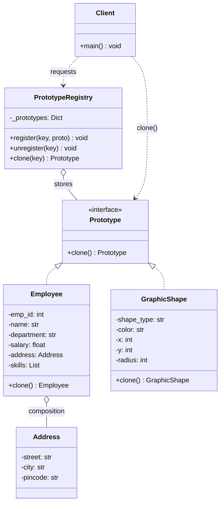
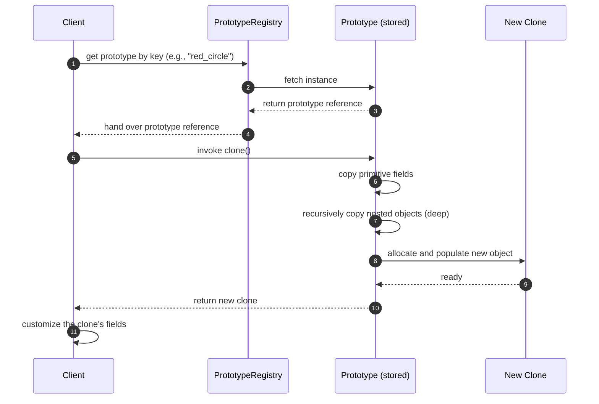
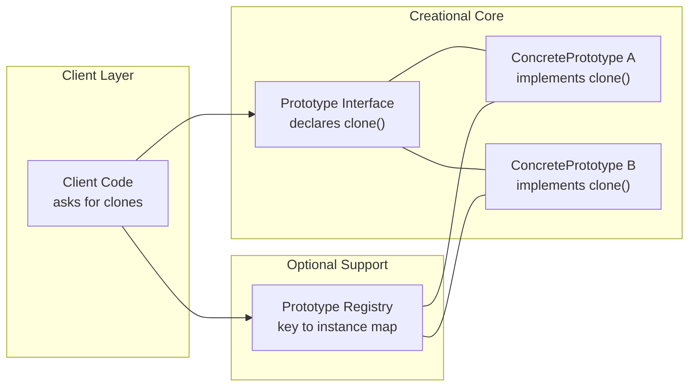
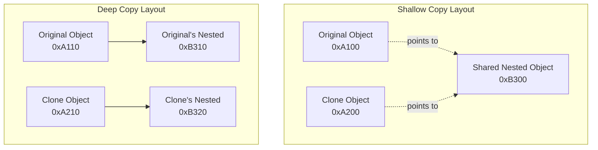

# Prototype Pattern

<!-- SECTION_1_START -->
# Prototype Pattern

> [!NOTE]
> **Creational Design Pattern | Gang of Four (GoF) Catalog | KTU Module 2**

## 1. Core Technical Definition

The **Prototype Pattern** is a creational design pattern that enables the creation of new objects by **cloning an existing object**, known as the *prototype*, rather than creating a new instance through a class constructor. The pattern delegates the cloning process to the actual object being cloned, which is responsible for producing a copy of itself.

Formally, the GoF definition states:

> *"Specify the kinds of objects to create using a prototypical instance, and create new objects by copying this prototype."* — *Gang of Four, Design Patterns: Elements of Reusable Object-Oriented Software*

In KTU 2024 Scheme terminology, the Prototype Pattern is a **class-of-creational patterns** that uses **delegated duplication** to decouple the client from the concrete instantiation logic. The client simply asks the prototype to clone itself, removing the dependency on concrete subclasses.

### Conceptual Analogy / Intuition

Imagine a **biological cell division** (mitosis). A single cell (the *prototype*) does not "rebuild" itself from scratch using raw chemicals every time it needs to multiply. Instead, it **copies its own internal DNA and structure** to produce a daughter cell. The daughter cell starts out identical to the parent, and may then mutate or specialize.

In software terms:

- The **Original Document** is the prototype.
- Instead of calling `new Document()` and re-running a heavy initialization (loading from database, reading files, computing expensive fields), you simply say: *"Give me a copy of this one."*
- **Cloning is faster than construction** when an object is expensive to build.

A more relatable **engineering analogy** is **3D printing**:

1. You have a master model (prototype).
2. To create a new object, you don't forge it from raw metal — you **replicate the master**.
3. The master itself exposes a "duplicate me" method.

> [!IMPORTANT]
> **Syllabus Highlight (KTU 2024 — OECST72A, Module 2):**
> The Prototype Pattern is one of the **five canonical creational patterns** (Singleton, Factory Method, Abstract Factory, Builder, **Prototype**). It is the only creational pattern that does **not** rely on `new` and inheritance-based subclassing for object creation.

### Standard Metrics & Terminology

| Term | Meaning |
|---|---|
| **Prototype** | The interface declaring the `clone()` method |
| **ConcretePrototype** | The class that implements the cloning logic |
| **Client** | The code that asks the prototype to produce a copy |
| **Shallow Copy** | Copies primitive fields by value, references by reference |
| **Deep Copy** | Copies all fields, including those held by reference (full graph duplication) |
| **Prototype Registry / Manager** | An optional store that maps keys to prototype instances for lookup-based cloning |

> [!VISUALIZATION CONTROL]
> **Concept:** Object cloning memory layout
> **Python/Mermaid Visualization Concept:**
> - Original object `O1` at memory address `0xA1`
> - Cloned object `O2` at memory address `0xA2` (newly allocated)
> - For **shallow copy**: `O2` shares the same nested object reference as `O1`
> - For **deep copy**: `O2` gets a brand-new nested object at `0xA3`
> **Visual Description:** Two distinct top-level boxes, with an arrow from each pointing to shared (shallow) or distinct (deep) nested boxes.

---

<!-- SECTION_1_END -->

<!-- SECTION_2_START -->
# Deep Theoretical Analysis & KTU High-Yield Formula Sheet

## 2. How the Prototype Pattern Operates — Structured Logic

The Prototype Pattern is engineered around **three primary actors** and **one optional actor**. The interaction can be broken down as follows:

### Step 1: Declare the Prototype Interface
- An abstract base class or interface exposes a single method, conventionally named `clone()` or `copy()`.
- This method has no parameters and returns a reference to a new object of the **same runtime type**.

### Step 2: Implement Concrete Prototypes
- Each concrete class that wishes to be cloneable implements the `clone()` method.
- The implementation typically calls a language-level clone facility (e.g., Python's `copy.copy` / `copy.deepcopy`, Java's `Object.clone()`, C++'s copy constructor) and then handles **deep-copy semantics** for compound fields.

### Step 3: Client Request
- The client receives a reference to a prototype (either passed in, fetched from a registry, or constructed once at startup).
- Instead of `new ConcretePrototype()`, the client invokes `prototype.clone()`.

### Step 4: Optional Prototype Registry
- A registry (also called a *Prototype Manager*) maintains a map of `string key → Prototype instance`.
- The client looks up the prototype by key, then calls `clone()`.
- This decouples the client from both the **concrete class name** and the **construction timing**.

### The "Why" Behind the Pattern

| Problem in Production | How Prototype Solves It |
|---|---|
| Object construction is expensive (DB load, network call, file I/O) | Clone an already-initialized instance |
| Class hierarchy is too complex to expose a Factory for every variant | Register one prototype per variant and clone |
| You want to decouple clients from concrete classes | Client only knows the abstract Prototype interface |
| You need many similar objects differing only slightly | Clone then mutate specific fields |
| Frameworks need to instantiate classes whose name is unknown at compile time | Clone from a registered prototype |

### KTU High-Yield Formula Sheet

| Concept | Formal Representation | Notes |
|---|---|---|
| Prototype interface | $P = \{c : P\}$ where $c$ is the clone operation | Self-referential signature |
| Cloning cost | $T_{\text{clone}} \ll T_{\text{construct}}$ | Pattern is justified when $T_{\text{clone}}$ is significantly smaller |
| Number of objects | $N_{\text{objects}} = N_{\text{clones}} + 1$ | One prototype plus N-1 clones |
| Shallow copy semantics | $\text{new.ref} = \text{old.ref}$ | Shared nested references |
| Deep copy semantics | $\text{new.ref} = \text{copy}(\text{old.ref})$ | Independent nested references |
| Registry lookup | $\text{prototype} = R.\text{get}(\text{key})$ | Decouples class name from client |
| Clone equation (memory) | $\text{Mem}_{\text{new}} = \text{Mem}_{\text{primitive}} + \text{Mem}_{\text{references}}$ | Only top-level reallocated in shallow |

> [!IMPORTANT]
> **Memory Trick for KTU Viva:** The Prototype Pattern answers the question *"How do I create a new object when my client should not know its class?"* by saying *"You don't create it — you **copy** it."*

### Real-World Engineering Utility

1. **Java / Spring Framework** — `BeanFactory` historically used prototype scopes, and `Object.clone()` is the canonical Java realization.
2. **Game Development** — Enemy spawners clone a base enemy with predefined health, weapon, and AI.
3. **GUI Builders** — Visual designers serialize a component tree and clone it to produce multiple instances.
4. **Document Editors** — Copy-paste functionality is literally a prototype operation with optional deep-copy for embedded objects.
5. **Database ORMs** — Detached entity objects are cloned for re-attachment in different sessions.
6. **Machine Learning Pipelines** — Cloning a fitted `scikit-learn` estimator to test multiple hyperparameter variations on the same base state.

---

<!-- SECTION_2_END -->

<!-- SECTION_3_START -->
# Step-by-Step Derivations & Code Implementation

## 3. Exhaustive Implementation Walkthrough

We will build a **fully operational Python implementation** of the Prototype Pattern, then walk through **Shallow vs Deep Copy semantics** with exhaustive testing.

### 3.1 Python Implementation — Complete Source Code

```python
"""
KTU OECST72A - Module 2
Prototype Pattern Implementation with Type Hints
"""

from __future__ import annotations
import copy
from abc import ABC, abstractmethod
from typing import Dict, List, Any


# --------------------------------------------------------------------------
# STEP 1: Define the abstract Prototype interface
# --------------------------------------------------------------------------
class Prototype(ABC):
    """
    Abstract Prototype interface.
    Declares the clone() contract that all concrete prototypes must fulfill.
    """

    @abstractmethod
    def clone(self) -> "Prototype":
        """Return a copy of self. Implementations decide shallow vs deep."""
        raise NotImplementedError("Subclasses must implement clone()")


# --------------------------------------------------------------------------
# STEP 2: A helper class representing a nested complex object
# --------------------------------------------------------------------------
class Address:
    """A nested object used to demonstrate shallow vs deep copy semantics."""

    def __init__(self, street: str, city: str, pincode: str) -> None:
        self.street: str = street
        self.city: str = city
        self.pincode: str = pincode

    def __repr__(self) -> str:
        return f"Address(street={self.street!r}, city={self.city!r}, pincode={self.pincode!r})"


# --------------------------------------------------------------------------
# STEP 3: ConcretePrototype #1 - Employee record
# --------------------------------------------------------------------------
class Employee(Prototype):
    """A concrete prototype representing a company employee record."""

    def __init__(
        self,
        emp_id: int,
        name: str,
        department: str,
        salary: float,
        address: Address,
        skills: List[str],
    ) -> None:
        self.emp_id: int = emp_id
        self.name: str = name
        self.department: str = department
        self.salary: float = salary
        self.address: Address = address
        self.skills: List[str] = skills

    def clone(self) -> "Employee":
        """
        Performs a DEEP copy. Each cloned Employee receives:
          - a brand-new Address object (independent reference)
          - a brand-new list of skills (independent list)
        """
        return copy.deepcopy(self)

    def __repr__(self) -> str:
        return (
            f"Employee(id={self.emp_id}, name={self.name!r}, "
            f"dept={self.department!r}, salary={self.salary}, "
            f"address={self.address}, skills={self.skills})"
        )


# --------------------------------------------------------------------------
# STEP 4: ConcretePrototype #2 - GraphicShape (used in drawing apps)
# --------------------------------------------------------------------------
class GraphicShape(Prototype):
    """A concrete prototype representing a vector shape on a canvas."""

    def __init__(self, shape_type: str, color: str, x: int, y: int, radius: int) -> None:
        self.shape_type: str = shape_type
        self.color: str = color
        self.x: int = x
        self.y: int = y
        self.radius: int = radius

    def clone(self) -> "GraphicShape":
        """Return a shallow copy - all fields are primitives, so shallow is safe."""
        return copy.copy(self)

    def __repr__(self) -> str:
        return (
            f"GraphicShape(type={self.shape_type!r}, color={self.color!r}, "
            f"x={self.x}, y={self.y}, r={self.radius})"
        )


# --------------------------------------------------------------------------
# STEP 5: Optional Prototype Registry
# --------------------------------------------------------------------------
class PrototypeRegistry:
    """
    A registry that stores named prototypes.
    Clients fetch a prototype by key and call clone() to instantiate.
    """

    def __init__(self) -> None:
        self._prototypes: Dict[str, Prototype] = {}

    def register(self, key: str, prototype: Prototype) -> None:
        if key in self._prototypes:
            raise KeyError(f"Prototype with key {key!r} is already registered.")
        self._prototypes[key] = prototype

    def unregister(self, key: str) -> None:
        if key not in self._prototypes:
            raise KeyError(f"No prototype registered under key {key!r}.")
        del self._prototypes[key]

    def clone(self, key: str) -> Prototype:
        if key not in self._prototypes:
            raise KeyError(f"No prototype registered under key {key!r}.")
        return self._prototypes[key].clone()


# --------------------------------------------------------------------------
# STEP 6: Client Code Demonstrating the Pattern
# --------------------------------------------------------------------------
def main() -> None:
    # --- Demonstration 1: Direct cloning without a registry ---
    original_emp: Employee = Employee(
        emp_id=101,
        name="Ananya Krishnan",
        department="Research",
        salary=85000.00,
        address=Address("Marine Drive", "Kochi", "682011"),
        skills=["Python", "ML", "Data Engineering"],
    )

    # Clone the prototype to create a "twin" employee
    cloned_emp: Employee = original_emp.clone()

    # Mutate the clone - the original must remain unchanged (proves deep copy)
    cloned_emp.emp_id = 102
    cloned_emp.name = "Ananya Krishnan (Twin)"
    cloned_emp.address.city = "Trivandrum"        # mutates nested Address
    cloned_emp.skills.append("Cloud Architecture")  # mutates nested list

    print("=== Demonstration 1: Deep Copy via Prototype ===")
    print(f"Original : {original_emp}")
    print(f"Cloned   : {cloned_emp}")
    print(f"Same obj?: {original_emp is cloned_emp}")
    print(f"Same addr?: {original_emp.address is cloned_emp.address}")
    print(f"Same list?: {original_emp.skills is cloned_emp.skills}")
    print()

    # --- Demonstration 2: Prototype Registry ---
    print("=== Demonstration 2: Prototype Registry ===")
    registry: PrototypeRegistry = PrototypeRegistry()

    # Register three pre-configured shapes as prototypes
    registry.register(
        "red_circle",
        GraphicShape(shape_type="circle", color="red", x=10, y=20, radius=15),
    )
    registry.register(
        "blue_square",
        GraphicShape(shape_type="square", color="blue", x=50, y=60, radius=10),
    )

    # Look up and clone without knowing the class name
    shape1: Prototype = registry.clone("red_circle")
    shape2: Prototype = registry.clone("red_circle")  # another clone
    shape3: Prototype = registry.clone("blue_square")

    # Customize the clones
    if isinstance(shape1, GraphicShape):
        shape1.x = 100
    if isinstance(shape2, GraphicShape):
        shape2.color = "green"
        shape2.x = 200
    if isinstance(shape3, GraphicShape):
        shape3.radius = 25

    print(f"Shape 1 : {shape1}")
    print(f"Shape 2 : {shape2}")
    print(f"Shape 3 : {shape3}")
    print()

    # --- Demonstration 3: Shallow vs Deep Copy Comparison ---
    print("=== Demonstration 3: Shallow vs Deep Comparison ===")
    address_a: Address = Address("MG Road", "Bangalore", "560001")
    original: Employee = Employee(
        emp_id=200,
        name="Rahul Menon",
        department="QA",
        salary=60000.00,
        address=address_a,
        skills=["Selenium", "JMeter"],
    )

    # Force a shallow copy manually
    shallow: Employee = copy.copy(original)
    shallow.address.city = "Chennai"   # This WILL affect original
    shallow.skills.append("Postman")

    print(f"Original (after shallow mutation): {original}")
    print(f"Shallow  : {shallow}")
    print(f"Same addr (shallow)?: {shallow.address is original.address}")
    print(f"Same list (shallow)?: {shallow.skills is original.skills}")


if __name__ == "__main__":
    main()
```

### 3.2 Expected Output Trace

```text
=== Demonstration 1: Deep Copy via Prototype ===
Original : Employee(id=101, name='Ananya Krishnan', dept='Research', salary=85000.0, address=Address(street='Marine Drive', city='Kochi', pincode='682011'), skills=['Python', 'ML', 'Data Engineering'])
Cloned   : Employee(id=102, name='Ananya Krishnan (Twin)', dept='Research', salary=85000.0, address=Address(street='Marine Drive', city='Trivandrum', pincode='682011'), skills=['Python', 'ML', 'Data Engineering', 'Cloud Architecture'])
Same obj?: False
Same addr?: False
Same list?: False

=== Demonstration 2: Prototype Registry ===
Shape 1 : GraphicShape(type='circle', color='red', x=100, y=20, r=15)
Shape 2 : GraphicShape(type='circle', color='green', x=200, y=20, r=15)
Shape 3 : GraphicShape(type='square', color='blue', x=50, y=60, r=25)

=== Demonstration 3: Shallow vs Deep Comparison ===
Original (after shallow mutation): Employee(id=200, name='Rahul Menon', dept='QA', salary=60000.0, address=Address(street='MG Road', city='Chennai', pincode='560001'), skills=['Selenium', 'JMeter', 'Postman'])
Shallow  : Employee(id=200, name='Rahul Menon', dept='QA', salary=60000.0, address=Address(street='MG Road', city='Chennai', pincode='560001'), skills=['Selenium', 'JMeter', 'Postman'])
Same addr (shallow)?: True
Same list (shallow)?: True
```

### 3.3 Java Implementation — Cross-Language Confirmation

```java
import java.util.HashMap;
import java.util.Map;

/* STEP 1: Prototype interface */
interface Prototype extends Cloneable {
    Prototype clone();
}

/* STEP 2: Concrete prototype - Resume document */
class Resume implements Prototype {
    private String name;
    private String experience;
    private String[] skills;

    public Resume(String name, String experience, String[] skills) {
        this.name = name;
        this.experience = experience;
        this.skills = skills;
    }

    @Override
    public Prototype clone() {
        // DEEP copy: skills array is duplicated
        String[] clonedSkills = this.skills.clone();
        return new Resume(this.name, this.experience, clonedSkills);
    }

    @Override
    public String toString() {
        return "Resume{name='" + name + "', experience='" + experience + 
               "', skills=" + java.util.Arrays.toString(skills) + "}";
    }
}

/* STEP 3: Registry */
class ResumeRegistry {
    private final Map<String, Prototype> map = new HashMap<>();

    public void register(String key, Prototype p) { map.put(key, p); }
    public Prototype clone(String key)             { return map.get(key).clone(); }
}

/* STEP 4: Client */
public class PrototypeDemo {
    public static void main(String[] args) {
        ResumeRegistry registry = new ResumeRegistry();
        registry.register("standard",
            new Resume("Ananya", "3 years", new String[]{"Java", "Spring"}));

        Resume r1 = (Resume) registry.clone("standard");
        System.out.println(r1);
    }
}
```

### 3.4 Derivation of Memory Cost (Engineering Math)

Let:
- $S$ = size of top-level scalar fields of the prototype
- $R$ = size of all *reference* fields
- $C_{\text{shallow}}$ = cost of a shallow copy
- $C_{\text{deep}}$ = cost of a deep copy

We can write:

$$
C_{\text{shallow}} = S + R_{\text{ptr}}
$$

$$
C_{\text{deep}} = S + \sum_{i=1}^{n} \text{size}(\text{obj}_i)
$$

Where:
- $R_{\text{ptr}}$ = size of a single pointer (typically **8 bytes** on a 64-bit JVM)
- $n$ = number of transitively reachable objects in the object graph

**Decision rule:**

$$
\text{Use Prototype} \iff C_{\text{construct}} > C_{\text{clone}} + C_{\text{overhead}}
$$

That is, the savings from cloning must exceed the overhead of maintaining the prototype and the registry.

---

<!-- SECTION_3_END -->

<!-- SECTION_4_START -->
# Structural Diagrams & Schematics

## 4. Visual Architecture of the Prototype Pattern

### 4.1 Class Diagram (Mermaid)



### 4.2 Sequence Diagram — Cloning Workflow



### 4.3 Component-Level Architecture



### 4.4 Shallow vs Deep Copy Memory Topology



---

<!-- SECTION_4_END -->

<!-- SECTION_5_START -->
# KTU 2024 Scheme Examination Question Bank & Topic Recap

## 5. KTU Past Year Pattern Questions

### Part A — Short Answer Questions (3 Marks Each)

> **Question 1.** `[KTU University Exam - July 2024]`
> **Define the Prototype design pattern. List any two situations where it is preferred over the Factory pattern.** **[CO1, Remember/Understand]**

**Model Answer (3 Marks):**
- **Definition (1 Mark):** The Prototype Pattern is a creational design pattern that creates new objects by *cloning an existing object* (the prototype) rather than instantiating new ones via constructors.
- **Situation 1 (1 Mark):** When object creation is *expensive* (e.g., involves database queries, file I/O, or complex computation), cloning a pre-initialized prototype is faster.
- **Situation 2 (1 Mark):** When the *concrete class of the object to be created is unknown to the client* at compile time — the client works with the abstract Prototype interface and a registry.

---

> **Question 2.** `[KTU University Exam - Dec 2023]`
> **Differentiate between shallow copy and deep copy in the context of the Prototype pattern. Give one programming example.** **[CO2, Understand]**

**Model Answer (3 Marks):**
- **Shallow Copy (1.5 Marks):** Copies the top-level fields. If a field holds a reference to a mutable object (e.g., a list or another object), the reference is copied, so both original and clone *share* the same nested object.
- **Deep Copy (1.5 Marks):** Copies the top-level fields **and** recursively duplicates all referenced objects. The original and clone become fully independent — mutating one does not affect the other.
- **Example (Bonus):** In Python, `copy.copy(x)` performs a shallow copy while `copy.deepcopy(x)` performs a deep copy. In Java, `Object.clone()` performs a shallow copy by default; deep copy must be implemented manually by overriding `clone()` and recursively cloning fields.

---

### Part B — Long Answer Questions (14 Marks, Internal Choice)

> **Question A.** `[KTU University Exam - July 2024]`
> **(a) [7 Marks]** Explain the intent, structure (with class diagram), and participants of the Prototype design pattern. **[CO1, Understand]**
> **(b) [7 Marks]** Implement the Prototype pattern in Java/Python to clone different shapes (Circle, Square) stored in a registry. Demonstrate both shallow and deep copy scenarios. **[CO3, Apply]**

#### Solution

**Part (a) — Intent, Structure, Participants [7 Marks]**

**Valuation Key Points:**

1. **Intent (1 Mark):** Specify the kinds of objects to create using a prototypical instance and create new objects by **copying this prototype** instead of constructing them from scratch.

2. **Applicability (1 Mark):** Use the Prototype pattern when:
   - The system should be independent of *how* its products are created, composed, and represented.
   - Classes to instantiate are specified at *runtime* (e.g., dynamic loading).
   - Instances of a class can have one of only a few different *combinations* of state — pre-populate prototypes and clone.
   - Object creation is *expensive* compared to cloning.

3. **Structure (3 Marks):** Present a class diagram showing:
   - `Prototype` (abstract class/interface) with `+clone(): Prototype`.
   - `ConcretePrototype1` and `ConcretePrototype2` implementing `clone()`.
   - `Client` invoking `clone()` on a prototype reference.
   - Optional `PrototypeRegistry` mapping `String → Prototype`.

4. **Participants (2 Marks):**
   - **Prototype** — declares the cloning interface.
   - **ConcretePrototype** — implements the cloning operation.
   - **Client** — asks the prototype to clone itself, producing a new object.

**Part (b) — Implementation [7 Marks]**

**Valuation Key Points:**

1. **Prototype interface declaration (1 Mark):** Method `clone()` returning a Prototype.
2. **Circle class (1.5 Marks):** Fields `radius`, `color`, `position`. Override `clone()` to perform deep copy of position.
3. **Square class (1.5 Marks):** Fields `side`, `color`, `position`. Override `clone()` similarly.
4. **Registry class (1.5 Marks):** `register(key, shape)`, `clone(key)` methods using a `Map<String, Prototype>`.
5. **Client code with output (1 Mark):** Demonstrate registration, lookup, cloning, and verification that cloned objects are independent.
6. **Shallow vs Deep demonstration (0.5 Mark):** Show that mutating the clone's nested `position` object affects the original in shallow mode but not in deep mode.

```python
# Reference Implementation
import copy
from typing import Tuple

class ShapePrototype:
    def clone(self):
        raise NotImplementedError

class Position:
    def __init__(self, x: int, y: int):
        self.x, self.y = x, y

class Circle(ShapePrototype):
    def __init__(self, color: str, radius: int, position: Position):
        self.color, self.radius, self.position = color, radius, position
    def clone(self, deep: bool = True):
        return copy.deepcopy(self) if deep else copy.copy(self)

# Register, clone, mutate — see Section 3 for full version.
```

> **Question B (Alternative Choice).** `[KTU University Exam - Dec 2023]`
> **(a) [7 Marks]** Discuss the advantages and disadvantages of the Prototype pattern. Compare it with the Abstract Factory pattern. **[CO2, Understand/Analyze]**
> **(b) [7 Marks]** Write a program to implement a document editor where each `Document` object (with title, content, and an embedded `Author` object) supports cloning. Show what happens when the `Author` object is modified in the clone under (i) shallow copy and (ii) deep copy. **[CO3, Apply]**

#### Solution Outline (Detailed Model Answer)

**Part (a) — Comparison and Trade-offs [7 Marks]**

| Aspect | Prototype | Abstract Factory |
|---|---|---|
| **Mechanism** | Clones existing object | Constructs new via factory methods |
| **Object creation cost** | Lower (no re-init) | Higher (full construction) |
| **Inheritance reliance** | Avoids subclass-based factories | Heavy use of class hierarchy |
| **Runtime flexibility** | High (register/clone any prototype) | Lower (factory hierarchy is fixed) |
| **State cloning** | Exact copy of existing state | Fresh default state |

**Advantages (3 Marks):**
- Hides concrete product classes from the client.
- Reduces subclassing compared to Factory Method.
- Lets you add/remove products at runtime by registering prototypes.
- Cloning complex objects avoids re-running expensive initialization.

**Disadvantages (2 Marks):**
- Cloning circular or deeply nested references is tricky.
- Deep copy of large object graphs is expensive in both memory and time.
- Each subclass must implement `clone()`, which can be error-prone.

**Part (b) — Document Editor Implementation [7 Marks]**

Provide code along the lines of the Python implementation in **Section 3**, but specialized to `Document` and `Author` classes, with two explicit outputs:

**(i) Shallow Copy Output (3.5 Marks):**
- Mutating `cloned_doc.author.name = "New Author"` will also change `original_doc.author.name`.
- The reference to `Author` is shared.

**(ii) Deep Copy Output (3.5 Marks):**
- Mutating `cloned_doc.author.name` will NOT affect `original_doc.author.name`.
- `original_doc.author is cloned_doc.author` evaluates to `False`.

---

### KTU Examiner's Valuation Warning / Pitfall Callout

> [!WARNING]
> **Common Mistakes That Cost Marks in KTU Exams:**
> 1. **Forgetting to mark the `Prototype` interface as abstract** — the examiner deducts marks if your diagram shows the interface instantiable.
> 2. **Confusing Prototype with Singleton** — Singleton restricts to *one* instance; Prototype produces *many clones*. Do not interchange them.
> 3. **Not specifying shallow vs deep copy** — when asked to "implement Prototype," always state *which* copy strategy you use. A 14-mark answer without a copy-strategy declaration loses 1–2 marks.
> 4. **Missing the Registry** — if the question says "store prototypes by name," forgetting the registry / prototype manager will cost 2–3 marks.
> 5. **Omitting a class diagram** — Part (a) of a 14-mark question always expects a labeled class diagram. Text-only explanation is insufficient.
> 6. **Not showing output / verification** — Part (b) requires *running* output or at least a verification step proving the clone is independent of the original.
> 7. **Mutating shared state silently** — always demonstrate (with `is` checks or address prints) that nested objects are independent in deep copy.

---

## Topic Recap & Important Things to Remember

> [!IMPORTANT]
> **High-Density Revision Checklist — Prototype Pattern**

- **Pattern Type:** Creational (GoF).
- **Core Idea:** New objects are produced by **cloning an existing prototype**, not by calling `new`.
- **Key Method:** `clone()` declared in the abstract Prototype interface, implemented in every ConcretePrototype.
- **Participants:** `Prototype` (interface), `ConcretePrototype` (implementation), `Client` (user), optional `PrototypeRegistry` (lookup store).
- **Shallow Copy:** Top-level duplicated; nested references are **shared** between original and clone.
- **Deep Copy:** Top-level **and** all nested objects are independently duplicated.
- **When to Use:** Expensive construction, runtime class loading, many similar objects with minor variations, decoupling client from concrete classes.
- **When NOT to Use:** Objects contain circular references, deep object graphs where copy cost > construction cost, immutable singletons.
- **Python Tools:** `copy.copy()` (shallow), `copy.deepcopy()` (deep).
- **Java Tools:** `Object.clone()` (shallow by default), manual deep copy via field-by-field duplication.
- **Registry Pattern Add-On:** `Map<String, Prototype>` lets clients fetch a prototype by *key* without knowing its class name.
- **GoF Sentence to Memorize:** *"Specify the kinds of objects to create using a prototypical instance, and create new objects by copying this prototype."*
- **Related Patterns to Distinguish:**
  - vs **Abstract Factory** — Factory constructs; Prototype clones.
  - vs **Builder** — Builder constructs step-by-step; Prototype copies in one shot.
  - vs **Singleton** — Singleton restricts to one; Prototype scales to many.
  - vs **Memento** — Memento captures state for undo; Prototype creates an active working copy.
- **Real-World Uses:** Game enemy spawners, GUI component palettes, document editors (copy-paste), ORM detached entity cloning, ML estimator cloning, Java `Object.clone()` and Spring prototype-scoped beans.
- **Examiner Mantra:** Always show — (1) abstract Prototype, (2) at least one concrete prototype, (3) client code invoking `clone()`, (4) verification that the clone is independent.

<!-- SECTION_5_END -->
