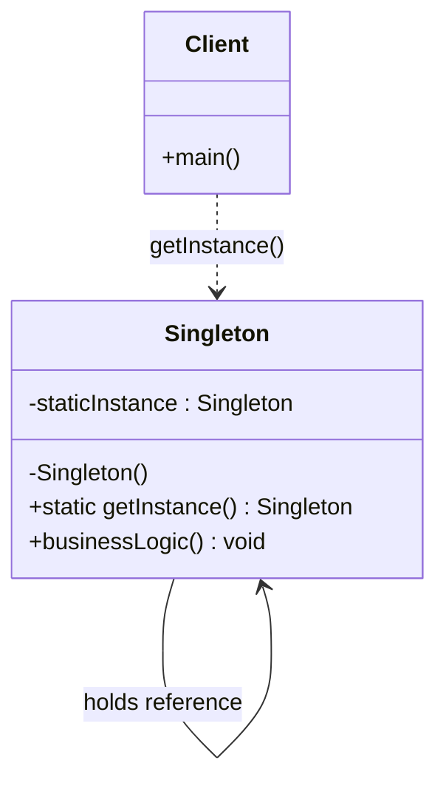
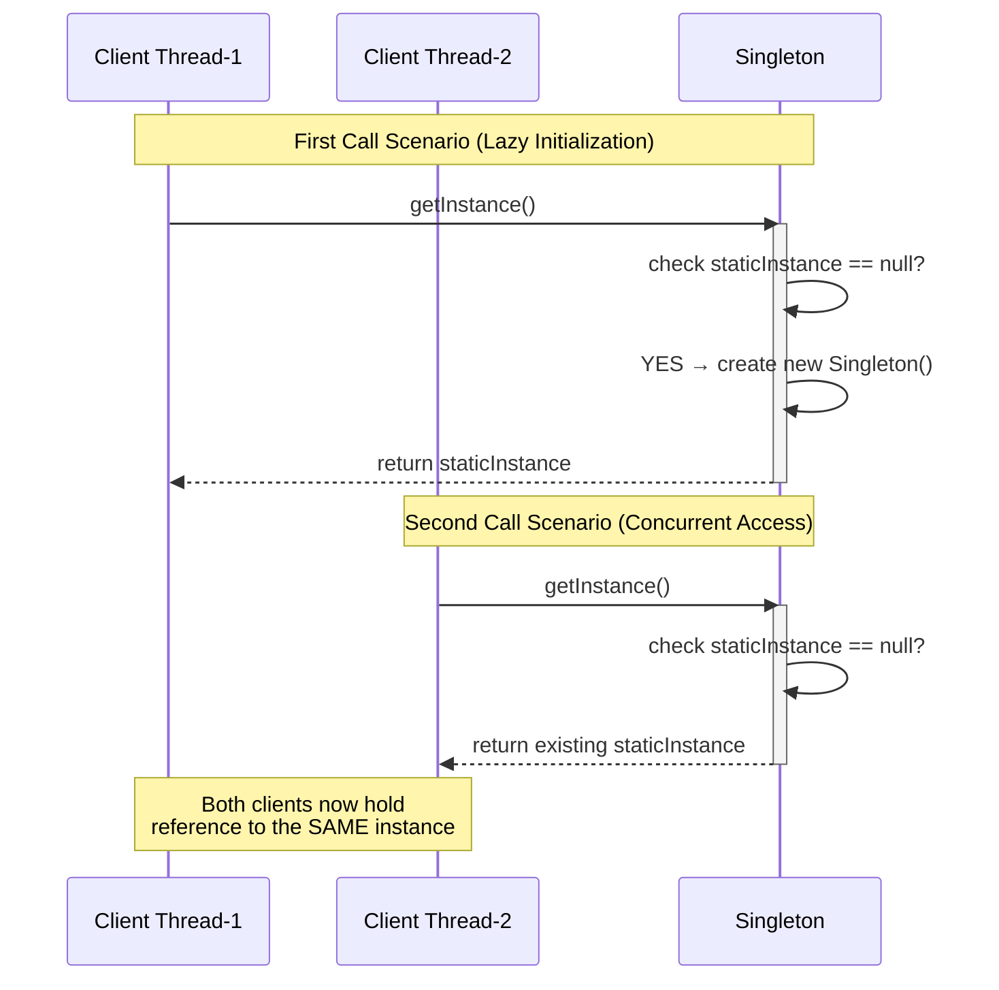
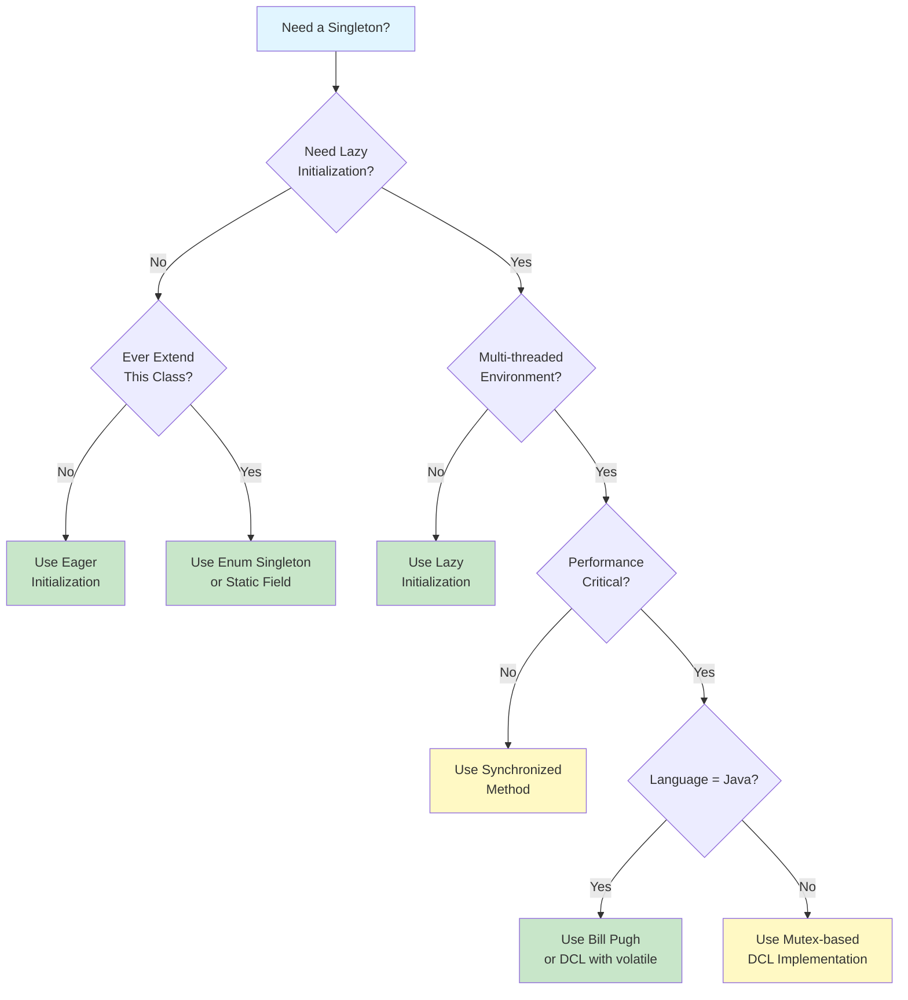
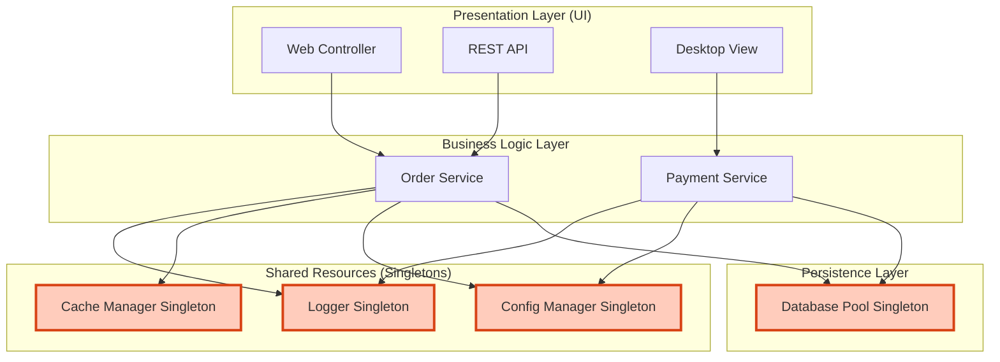
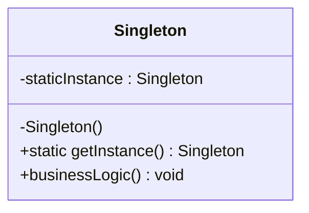

# Singleton Pattern

<!-- SECTION_1_START -->
# Singleton Pattern

> [!NOTE]
> **KTU 2024 Scheme | OECST72A | Module 2 - Creational Design Patterns**
> **Course Outcome Mapped:** CO2 — *Apply appropriate creational design patterns to solve object instantiation problems in software design.*
> **Bloom's Cognitive Levels Covered:** Remember, Understand, Apply, Analyze

---

## 1.1 Formal Academic Definition

The **Singleton Pattern** is a **creational design pattern** that guarantees a class has **exactly one instance** throughout the lifetime of an application, while providing a **global access point** to that single instance. Formally stated by the *Gang of Four (GoF)* — Gamma, Helm, Johnson, and Vlissides — in their seminal 1994 work *"Design Patterns: Elements of Reusable Object-Oriented Software"*, the pattern encapsulates the "single instance" invariant by:

1. Making the **class constructor `private`** (or `protected` in special inheritance cases), so that the `new` operator cannot be used externally to create new objects.
2. Providing a **static method** (conventionally named `getInstance()`) that acts as the sole authorized creator and accessor of the single instance.
3. Storing the instance in a **private static field**, ensuring it is shared across all calls.

$$ \text{Instance Count}_{Singleton} = \begin{cases} 1 & \text{throughout program lifetime} \\ 0 & \text{only briefly during class loading} \end{cases} $$

> [!IMPORTANT]
> **KTU Board Highlight:** Singleton is the **most frequently asked creational pattern** in KTU University Examinations. Examiners commonly test: (a) intent of the pattern, (b) thread-safety concerns, (c) Java/C++/Python implementation code, and (d) real-world justification.

---

## 1.2 Intuitive Overview — The "One Government, One President" Analogy

> [!TIP]
> **Conceptual Analogy:** Imagine the **Office of the President of a Country**. Regardless of how many citizens request the President's services, attend meetings, or issue official communications, there is **only one President at any given time**. Citizens do not *create* new Presidents — they *access* the existing one through a standardized protocol (e.g., the official residence). If the President retires or is replaced, **only one successor** ever takes the office. This is precisely how the Singleton pattern works in software: **one object, one global access point, controlled creation**.

### Why Do We Need Singleton?
Consider these engineering realities:

- A **logging service** — you need one centralized log writer to avoid file-locking chaos.
- A **database connection pool** — opening multiple pools wastes memory and corrupts transactions.
- A **configuration manager** — one source of truth for application settings.
- A **thread pool / cache** — sharing state across the application.

Without Singleton, you might accidentally create multiple instances, leading to **inconsistent state, memory leaks, and resource contention**.

### Key Characteristics (Syllabus Mandate)
- **Single Instance:** Only one object is ever created.
- **Global Access:** The object is accessible from anywhere in the application.
- **Self-Management:** The class itself controls its instantiation (no external `new` allowed).
- **Lazy or Eager Initialization:** The instance can be created at class-load time or on first request.
- **Thread-Safe (in production):** Concurrent access from multiple threads must not produce multiple instances.

> [!VISUALIZATION CONTROL]
> **Concept:** Singleton as a Unique Counter on a Number Line
> **GeoGebra Input Equations:**
> * `f(x) = 1` for `x >= 0` (instance count over time)
> * `g(x) = 0` for `x < 0` (before first access)
> **Visual Description:** A horizontal line drawn at $y=1$ beginning at $x=0$ (the moment of first call to `getInstance()`), with a single point at the origin marking the singular creation event. The line never deviates — the count remains **exactly 1**, no matter how many `getInstance()` calls are made afterwards.

---

## 1.3 UML Class Diagram — Structural View

> [!NOTE]
> **Reading the Diagram:** The `<<singleton>>` stereotype is a UML 2.0 convention to explicitly mark a class as a Singleton. The `-` denotes `private` visibility, `+` denotes `public`, and `#` denotes `protected`. The `staticInstance` field is `private static`, and `getInstance()` is `public static`.

```
+--------------------------------------+
|           <<singleton>>              |
|             Singleton                |
+--------------------------------------+
| - staticInstance : Singleton         |
| - Singleton() : void                 |
+--------------------------------------+
| + static getInstance() : Singleton   |
| + businessLogic() : void             |
+--------------------------------------+
```

**Element-wise Breakdown:**

| UML Element | Visibility | Type | Role in Singleton |
|------------|------------|------|-------------------|
| `staticInstance` | `private` | `static` field | Holds the single instance reference |
| `Singleton()` | `private` | constructor | Blocks external `new` calls |
| `getInstance()` | `public` | `static` method | Global access point — creates if absent, returns if present |
| `businessLogic()` | `public` | instance method | The actual work the Singleton performs |

---

<!-- SECTION_1_END -->

<!-- SECTION_2_START -->
# Deep Theoretical Analysis — Mechanics, Variants, and Trade-offs

## 2.1 The Problem the Singleton Solves

In object-oriented systems, classes are normally **free to instantiate themselves any number of times**. However, certain objects should logically exist exactly once. If multiple instances are created, problems arise:

1. **Resource Wastage:** Multiple database connection pools may exhaust the connection limit.
2. **Inconsistent State:** Multiple configuration managers may disagree on settings.
3. **Race Conditions:** Multiple logger instances writing to the same file may interleave output.
4. **Logical Contradiction:** Two "Presidents" of a country is absurd.

The Singleton pattern solves this by **shifting the responsibility of instantiation from the client to the class itself**, enforcing the single-instance invariant at the language level (via `private` constructor).

## 2.2 The Three Pillars of Singleton

```
       ┌──────────────────────┐
       │  Private Constructor │  <-- Pillar 1: Prevents external 'new'
       └──────────┬───────────┘
                  │
                  ▼
       ┌──────────────────────┐
       │  Private Static      │  <-- Pillar 2: Holds the single instance
       │  Field               │
       └──────────┬───────────┘
                  │
                  ▼
       ┌──────────────────────┐
       │  Public Static       │  <-- Pillar 3: Global access + lazy control
       │  getInstance()       │
       └──────────────────────┘
```

## 2.3 Classification of Singleton Implementations (KTU High-Yield)

| # | Variant | Initialization Timing | Thread-Safe? | Performance | KTU Exam Frequency |
|---|--------|----------------------|--------------|-------------|--------------------|
| 1 | Eager Initialization | At class loading | Yes (by JVM) | Excellent (no locking) | High |
| 2 | Lazy Initialization | On first call | **No** | Excellent (single-thread only) | Very High |
| 3 | Thread-Safe (Synchronized Method) | On first call | Yes | Poor (lock every call) | High |
| 4 | Double-Checked Locking (DCL) | On first call | Yes (with `volatile`) | Good | Very High |
| 5 | Bill Pugh (Initialization-on-Demand Holder) | On first call | Yes (JVM-guaranteed) | Excellent | High |
| 6 | Enum Singleton (Joshua Bloch) | At class loading | Yes (serialization-safe) | Excellent | High |
| 7 | Static Block Initialization | At class loading | Yes (with explicit handling) | Excellent | Medium |

> [!IMPORTANT]
> **KTU Formula Cheat Sheet (Intent-Level Invariants):**
>
> $$ \text{Singleton Properties} = \begin{cases} \text{Instance Count} = 1 & \forall t \in [t_{load}, t_{shutdown}] \\ \text{Constructor Visibility} = \text{private} \\ \text{Accessor} = \text{public static} \\ \text{Storage} = \text{private static field} \end{cases} $$
>
> **Key Trade-off Equation:**
> $$ \text{Performance} \propto \frac{1}{\text{Locking Granularity}} \quad \text{AND} \quad \text{Safety} \propto \text{Locking Granularity} $$
>
> This inverse relationship explains why **DCL** and **Bill Pugh** are preferred — they offer safety *without* paying the performance cost on every call.

---

## 2.4 Engineering Utility — Where Singleton is Used in Industry

| Domain | Real-World Singleton | Justification |
|--------|---------------------|---------------|
| **Java EE / Spring** | `BeanFactory` (Spring IoC container) | One container manages all beans |
| **Logging** | `Logger.getLogger()` (SLF4J/Log4j) | Centralized log file access |
| **Database** | `DataSource` / Connection Pool (HikariCP) | One pool of reusable connections |
| **OS / System** | `Runtime.getRuntime()` in Java | Single runtime environment per JVM |
| **Caching** | LRU Cache Manager | Shared cache state across requests |
| **Hardware Access** | Printer Spooler | One queue for all print jobs |
| **Configuration** | `Properties` / `Config` reader | Consistent application settings |
| **GUI Frameworks** | Window Manager / `Desktop` class (Java AWT) | One display environment |

> [!WARNING]
> **Anti-Pattern Warning:** Singleton is often **overused**. In modern architectures (microservices, dependency injection frameworks like Spring), Singleton is *implicitly* handled by the container. The KTU syllabus still requires its study, but students should note its critiques: tight coupling, hidden dependencies, and difficulty in unit testing.

---

## 2.5 Critical Concepts — Multithreading and Serialization Pitfalls

### 2.5.1 The Multi-Threading Problem
In a **single-threaded** environment, the naive lazy implementation works perfectly. But in a **multi-threaded** environment, two threads may simultaneously see `instance == null` and both proceed to create a new object, breaking the invariant.

**Visualization of the Race Condition:**

```
Thread-1                              Thread-2
   |                                     |
   |--- check: instance == null? YES     |
   |                                     |--- check: instance == null? YES
   |--- create new Singleton()           |
   |                                     |--- create new Singleton()
   |                                     |
   ▼                                     ▼
   TWO INSTANCES EXIST (BUG!)
```

**Solutions:**
- `synchronized` method → safe but slow
- `volatile` + double-checked locking → fast and safe (Java 5+)
- Bill Pugh idiom → JVM-level guarantee via class loader
- Enum → serialization-safe and reflection-safe

### 2.5.2 The Serialization Problem
Even if your Singleton is thread-safe, **Java's default deserialization can create a new instance**, violating the single-instance rule. The solution is to implement `readResolve()`:

```java
protected Object readResolve() {
    return getInstance();
}
```

### 2.5.3 The Reflection Problem
Reflection can invoke the `private` constructor, creating a second instance. Defenses include:
- Throwing an exception in the constructor if an instance already exists
- Using **Enum** (the JVM explicitly prevents reflective instantiation of enum constructors)

---

<!-- SECTION_2_END -->

<!-- SECTION_3_START -->
# Step-by-Step Derivations and Code Implementations

> [!NOTE]
> **Exhaustive Implementation:** Below are **six canonical implementations** of the Singleton pattern in Java, written out in full. Every variation is followed by an explicit analysis of its trade-offs. These are the exact code skeletons KTU examiners expect students to reproduce in the answer sheet.

---

## 3.1 Variant 1: Eager Initialization (Thread-Safe by Default)

```java
public class EagerSingleton {
    // Step 1: Instance created at class-loading time
    private static final EagerSingleton instance = new EagerSingleton();

    // Step 2: Private constructor prevents 'new' from outside
    private EagerSingleton() {
        System.out.println("[EagerSingleton] Instance created at class load.");
    }

    // Step 3: Public global accessor
    public static EagerSingleton getInstance() {
        return instance;
    }

    public void showMessage() {
        System.out.println("Hello from EagerSingleton! Hash: " + this.hashCode());
    }
}
```

**Analysis:**
- **Pros:** Simplest, thread-safe (JVM guarantees class loading is synchronized), no locking overhead.
- **Cons:** Instance is created *even if never used* — wastes resources if the Singleton is heavy.
- **Use When:** The Singleton is **lightweight** and **always needed**.

---

## 3.2 Variant 2: Lazy Initialization (Not Thread-Safe)

```java
public class LazySingleton {
    // Step 1: Field declared but not yet initialized
    private static LazySingleton instance;

    // Step 2: Private constructor
    private LazySingleton() {
        System.out.println("[LazySingleton] Instance created on first call.");
    }

    // Step 3: Public accessor with lazy creation
    public static LazySingleton getInstance() {
        if (instance == null) {
            instance = new LazySingleton();   // Race condition risk!
        }
        return instance;
    }
}
```

**Analysis:**
- **Pros:** Instance created only when needed — memory efficient.
- **Cons:** **Fails in multi-threaded environments.** Two threads can pass the `if (instance == null)` check simultaneously.
- **Use When:** Single-threaded applications or as a teaching example. **Not for production.**

---

## 3.3 Variant 3: Thread-Safe Singleton (Synchronized Method)

```java
public class ThreadSafeSingleton {
    private static ThreadSafeSingleton instance;

    private ThreadSafeSingleton() {
        System.out.println("[ThreadSafeSingleton] Instance created.");
    }

    // synchronized keyword ensures only one thread enters at a time
    public static synchronized ThreadSafeSingleton getInstance() {
        if (instance == null) {
            instance = new ThreadSafeSingleton();
        }
        return instance;
    }
}
```

**Analysis:**
- **Pros:** Simple to write, correct under concurrency.
- **Cons:** **Performance penalty** — every call to `getInstance()` acquires a lock, even after the instance is created. In high-throughput systems, this becomes a bottleneck.
- **Optimization Hint:** Reduce synchronization scope using **Double-Checked Locking** (next variant).

---

## 3.4 Variant 4: Double-Checked Locking (DCL) — The Classic Interview Favorite

```java
public class DCLSingleton {
    // Step 1: 'volatile' is critical — prevents instruction reordering
    private static volatile DCLSingleton instance;

    private DCLSingleton() {
        System.out.println("[DCLSingleton] Instance created.");
    }

    public static DCLSingleton getInstance() {
        // First check (no locking) — fast path for already-created instance
        if (instance == null) {
            // Lock only when instance might need to be created
            synchronized (DCLSingleton.class) {
                // Second check (with lock) — ensure another thread didn't create it
                if (instance == null) {
                    instance = new DCLSingleton();
                }
            }
        }
        return instance;
    }
}
```

**Step-by-Step Explanation:**

1. **First `if` check** — avoids acquiring the lock on every call (performance win).
2. **`synchronized` block** — only one thread can enter the critical section.
3. **Second `if` check** — handles the case where another thread created the instance while we were waiting for the lock.
4. **`volatile` keyword** — guarantees that multiple threads handle the `instance` variable correctly. Without it, the JVM may reorder the constructor's internal operations, allowing another thread to see a *partially constructed* object.

**Analysis:**
- **Pros:** Thread-safe *and* high performance (lock acquired only on first call).
- **Cons:** Slightly complex; the `volatile` keyword is mandatory (forgetting it is a famous bug).
- **Use When:** Performance-critical multi-threaded Java applications.

---

## 3.5 Variant 5: Bill Pugh Singleton (Initialization-on-Demand Holder Idiom)

> [!IMPORTANT]
> **KTU Highly Asked:** This is the **recommended** approach in modern Java code. It uses the JVM's own class-loading mechanics for thread-safety without explicit synchronization.

```java
public class BillPughSingleton {
    private BillPughSingleton() {
        System.out.println("[BillPughSingleton] Instance created.");
    }

    // Inner static helper class — NOT loaded until getInstance() is called
    private static class SingletonHelper {
        // JVM guarantees this initialization is thread-safe
        private static final BillPughSingleton INSTANCE = new BillPughSingleton();
    }

    public static BillPughSingleton getInstance() {
        return SingletonHelper.INSTANCE;
    }
}
```

**Step-by-Step Explanation:**

1. The outer class `BillPughSingleton` is loaded when first referenced.
2. The inner class `SingletonHelper` is **not loaded** until `getInstance()` is called (lazy!).
3. When `getInstance()` runs, the JVM loads `SingletonHelper` and initializes the `INSTANCE` field.
4. **JVM class initialization is intrinsically thread-safe** — no `synchronized` needed.
5. No `volatile` needed because class loading uses an internal lock.

**Analysis:**
- **Pros:** Lazy + thread-safe + excellent performance + simple code.
- **Cons:** Cannot be used in languages without a class-loader model (e.g., plain C).
- **Use When:** The default choice for Java Singleton implementations.

---

## 3.6 Variant 6: Enum Singleton (Joshua Bloch's Recommendation)

> [!TIP]
> From *Effective Java* (Joshua Bloch): *"The single-element enum pattern is the best way to implement a singleton in Java."* — It is the only variant that is **automatically safe against serialization and reflection attacks**.

```java
public enum EnumSingleton {
    // The single instance is the enum constant itself
    INSTANCE;

    // Instance fields
    private final List<String> logEntries = new ArrayList<>();

    // Business logic methods
    public void log(String message) {
        logEntries.add(message);
        System.out.println("[LOG] " + message);
    }

    public int size() {
        return logEntries.size();
    }
}
```

**Usage Example:**

```java
public class Main {
    public static void main(String[] args) {
        // Accessing the singleton
        EnumSingleton logger = EnumSingleton.INSTANCE;
        logger.log("Application started.");

        // Verify uniqueness
        EnumSingleton another = EnumSingleton.INSTANCE;
        System.out.println("Same instance? " + (logger == another));  // true
    }
}
```

**Analysis:**
- **Pros:** Bulletproof — handles serialization, reflection, and threading automatically. Concise code.
- **Cons:** Cannot extend a class (Java enums implicitly extend `Enum`), can feel unusual to new developers.
- **Use When:** You need a Singleton in modern Java without inheritance concerns.

---

## 3.7 Variant 7: Python Implementation (For Cross-Language KTU Context)

> [!NOTE]
> **Note for Students:** KTU 2024 syllabus is language-agnostic for design patterns. Python offers a particularly clean implementation using `__new__` and decorators.

```python
class SingletonMeta(type):
    """Metaclass that enforces singleton behavior for any class that uses it."""
    _instances = {}

    def __call__(cls, *args, **kwargs):
        # Check if an instance already exists for this class
        if cls not in cls._instances:
            # If not, create one (and only one)
            instance = super().__call__(*args, **kwargs)
            cls._instances[cls] = instance
        return cls._instances[cls]


class DatabaseConnection(metaclass=SingletonMeta):
    def __init__(self):
        if not hasattr(self, 'initialized'):
            self.connection_string = "postgresql://localhost:5432/mydb"
            self.initialized = True
            print("[DatabaseConnection] Single connection established.")

    def query(self, sql: str) -> str:
        return f"Executing on {self.connection_string}: {sql}"


# Demonstration
if __name__ == "__main__":
    db1 = DatabaseConnection()
    db2 = DatabaseConnection()
    print(f"db1 is db2? {db1 is db2}")  # True
    print(db1.query("SELECT * FROM users;"))
```

**Key Python Concepts:**
- `__new__` vs `__init__`: `__new__` creates the object; `__init__` initializes it. Singleton uses `__new__` to prevent creation.
- **Metaclass** approach: Reusable — any class can become a Singleton by specifying `metaclass=SingletonMeta`.
- Python's **GIL (Global Interpreter Lock)** provides implicit thread-safety, but for true multi-process safety, additional locking is required.

---

## 3.8 Variant 8: C++ Implementation (For C++ Streams in KTU)

```cpp
#include <iostream>
#include <mutex>

class ThreadSafeSingleton {
private:
    // The single instance
    static ThreadSafeSingleton* instance;
    static std::mutex mtx;

    // Private constructor
    ThreadSafeSingleton() {
        std::cout << "[C++ Singleton] Instance created." << std::endl;
    }

    // Delete copy constructor and assignment operator
    ThreadSafeSingleton(const ThreadSafeSingleton&) = delete;
    ThreadSafeSingleton& operator=(const ThreadSafeSingleton&) = delete;

public:
    // Global access point
    static ThreadSafeSingleton* getInstance() {
        if (instance == nullptr) {
            std::lock_guard<std::mutex> lock(mtx);
            if (instance == nullptr) {
                instance = new ThreadSafeSingleton();
            }
        }
        return instance;
    }

    void businessLogic() {
        std::cout << "Singleton hash: " << this << std::endl;
    }
};

// Static member definitions (REQUIRED in C++)
ThreadSafeSingleton* ThreadSafeSingleton::instance = nullptr;
std::mutex ThreadSafeSingleton::mtx;
```

**C++-Specific Notes:**
- The `delete` keyword on copy constructor and assignment operator **prevents copying** — a critical C++ singleton safeguard often missed by students.
- `std::lock_guard` is a **RAII** mutex wrapper — automatically unlocks when out of scope (exception-safe).
- The `static` member variables **must be defined outside the class** in a `.cpp` file to avoid linker errors.

---

<!-- SECTION_3_END -->

<!-- SECTION_4_START -->
# Structural Diagrams and Schematics

## 4.1 Singleton Pattern — UML Class Diagram (Mermaid)

> [!NOTE]
> The diagram below uses Mermaid `classDiagram` syntax. All node labels are alphanumeric, and the `-` and `+` symbols denote visibility (private/public). Stereotypes are wrapped in quotes for Mermaid safety.



**Reading Guide:**
- `Client ..> Singleton` — a *dependency* relationship: the client depends on the Singleton for its functionality.
- `Singleton --> Singleton` — a *self-association* showing the private static field references the single instance.
- The `<<singleton>>` stereotype is implied by the presence of the `private` constructor and `public static getInstance()`.

---

## 4.2 Sequence Diagram — How `getInstance()` Works Internally



---

## 4.3 Decision Flowchart — Choosing the Right Singleton Variant



**Legend:**
- 🟦 **Blue:** Decision entry point
- 🟩 **Green:** Recommended patterns
- 🟨 **Yellow:** Conditional / situational patterns

---

## 4.4 Component Architecture — Singleton in a Layered Application



**Architectural Insight:**
This diagram illustrates the **ideal placement** of Singletons in a layered architecture — they sit in the *Resource* layer, serving as **shared utilities** consumed by higher layers. Multiple UI components and services all reference the *same* Logger, Cache, and Database Pool instances.

---

<!-- SECTION_4_END -->

<!-- SECTION_5_START -->
# KTU 2024 Scheme Examination Question Bank

## 5.1 Part A — Short Answer Questions (3 Marks Each)

> **KTU 2024 Scheme Rule:** Part A carries 2 questions × 3 marks = 6 marks total. Answers should be 3-5 sentences with a diagram/code snippet where applicable.

---

### Question A1: Define the Singleton Design Pattern. State its intent.
**Cognitive Level:** Remember | **Course Outcome:** CO2

**Model Answer (3 Marks):**
The **Singleton Pattern** is a creational design pattern that ensures a class has **only one instance** and provides a **global point of access** to that instance. Its **intent** (as defined by the Gang of Four) is to *"Ensure a class only has one instance, and provide a global point of access to it."* It is typically implemented by making the constructor `private` and exposing a `public static getInstance()` method that returns the single shared object. Common real-world examples include logging classes, database connection pools, and runtime environments. [Valuation: Definition 1M, Intent statement 1M, Example 1M]

---

### Question A2: List any four real-world scenarios where the Singleton pattern is applicable.
**Cognitive Level:** Understand | **Course Outcome:** CO2

**Model Answer (3 Marks):**
The Singleton pattern is applicable in the following scenarios:

1. **Logging Frameworks** — A single logger writes to a shared log file, avoiding concurrent write conflicts.
2. **Database Connection Pools** — A single pool manages limited database connections across the application.
3. **Configuration Managers** — One source of truth for application properties and environment variables.
4. **Caching Systems** — A shared in-memory cache (e.g., LRU cache) used by all application components.

[Valuation: Each valid scenario with 1-line justification: 0.75M × 4 = 3M]

---

## 5.2 Part B — Long Answer Questions (14 Marks Each)

> **KTU 2024 Scheme Rule:** Part B has full-length questions of 14 marks each with internal module-level choice. Each 14-mark question typically has sub-parts (a) for 7 marks and (b) for 7 marks. The solution must include a diagram, code, and structured explanation.

---

### Question B1: [KTU University Exam - July 2024 Style]

**(a)** Explain the Singleton design pattern in detail. State its intent, list its participants, and draw the UML class diagram. **\[7 Marks, CO2, Understand\]**

**(b)** Write a thread-safe Singleton implementation in Java using the **Double-Checked Locking** idiom. Explain why the `volatile` keyword is essential. **\[7 Marks, CO2, Apply\]**

#### OR

### Question B2: Alternative Choice

**(a)** Discuss **four different ways** to implement the Singleton pattern in Java, comparing their advantages and disadvantages. **\[7 Marks, CO2, Analyze\]**

**(b)** Write a complete **Enum-based Singleton** in Java for a `PrinterSpooler` class that maintains a queue of print jobs. Demonstrate with a client program that two variables hold the *same* instance. **\[7 Marks, CO2, Apply\]**

---

## 5.3 Model Solutions

### Solution to Question B1:

#### Part (a) — Explanation, Intent, Participants, UML Diagram

**1. Intent:** *(1 Mark)*
The Singleton pattern ensures that a class has **exactly one instance** and provides a **global point of access** to it. The pattern is useful when exactly one object is needed to coordinate actions across the system.

**2. Applicability (When to use):** *(1 Mark)*
Use Singleton when:
- There must be exactly one instance of a class, and it must be accessible to clients from a well-known access point.
- The sole instance should be extensible by subclassing, and clients should be able to use the extended instance without modifying their code.

**3. Participants:** *(2 Marks)*

| Participant | Role |
|-------------|------|
| **Singleton** | Defines an `instance` operation that lets clients access its unique instance. Responsible for creating and maintaining its own unique instance. |

**4. UML Class Diagram:** *(3 Marks)*



> **Key UML Marking Points (for 3 Marks):**
> - Correct `class` declaration with `Singleton` name: 1M
> - `-staticInstance` and `-Singleton()` private members: 1M
> - `+getInstance()` public static method: 1M

> [!WARNING]
> **Examiner's Pitfall Warning:** Students often **forget the private constructor** in the UML diagram. Without the `-Singleton()` constructor, the diagram is incomplete and loses 1 mark. Also, `getInstance()` *must* be marked `static` — leaving out the `static` keyword loses another mark.

---

#### Part (b) — Thread-Safe Singleton using DCL with `volatile`

**Complete Java Code:** *(5 Marks)*

```java
public class DCLSingleton {
    // 'volatile' ensures visibility and prevents instruction reordering
    private static volatile DCLSingleton instance;

    // Private constructor — blocks external instantiation
    private DCLSingleton() {
        System.out.println("DCLSingleton instance created.");
    }

    public static DCLSingleton getInstance() {
        // First check (no lock) — performance optimization
        if (instance == null) {
            synchronized (DCLSingleton.class) {
                // Second check (with lock) — correctness safeguard
                if (instance == null) {
                    instance = new DCLSingleton();
                }
            }
        }
        return instance;
    }

    public void show() {
        System.out.println("HashCode: " + this.hashCode());
    }
}
```

**Why `volatile` is Essential:** *(2 Marks)*

> [!IMPORTANT]
> **The Three Critical Reasons `volatile` is Required:**

1. **Visibility:** In a multi-core CPU, threads may cache variables in their local CPU caches. Without `volatile`, Thread-2 may never see the update made by Thread-1. The `volatile` keyword forces **all reads/writes to go through main memory**.

2. **Instruction Reordering Prevention:** The line `instance = new DCLSingleton()` is actually **three sub-operations**:
   $$ \text{Step A: } \text{Allocate memory} \rightarrow \text{Step B: } \text{Initialize fields} \rightarrow \text{Step C: } \text{Assign } \textit{instance} \text{ reference} $$
   The JVM is free to reorder these as A → C → B (allocate, assign, then initialize). Without `volatile`, another thread could see a non-null `instance` reference *before* the object is fully constructed — leading to silent bugs.

3. **JMM (Java Memory Model) Compliance:** Since Java 5, the JMM guarantees that `volatile` reads/writes establish a **happens-before** relationship, ensuring all writes before the `volatile` write are visible to any thread that subsequently reads the same `volatile` variable.

> [!WARNING]
> **Examiner's Pitfall Warning:** A common error is **forgetting `volatile`** in the field declaration. Without it, the code may *appear* to work in single-threaded tests but produce **two instances** under concurrent load. KTU expects this keyword in every DCL solution — missing it loses 2 marks. Another error: writing `synchronized` on the **method** instead of a **block on the class object** — this loses the performance benefit.

> **Valuation Key for Code (5 Marks):**
> - `volatile static` field declaration: 1M
> - `private` constructor: 1M
> - `synchronized` block with class object lock: 1M
> - Both `if` checks (outer and inner): 1M
> - Return statement with correct type: 1M

---

### Solution to Question B2 (Alternative Choice):

#### Part (a) — Four Implementation Variants Compared

*(2 Marks for naming the variants + 3 Marks for the comparison table + 2 Marks for trade-off analysis)*

**The Four Variants:**

| # | Variant | Key Idea | Pros | Cons |
|---|---------|----------|------|------|
| 1 | **Eager Initialization** | Instance created at class load | Thread-safe, simple | Wastes memory if unused |
| 2 | **Lazy Initialization** | Instance created on first call | Memory efficient | **Not thread-safe** |
| 3 | **Thread-Safe (Synchronized)** | Lock on every `getInstance()` call | Correct under concurrency | Performance overhead |
| 4 | **Bill Pugh / DCL** | Lock only on first call | Best balance of safety & speed | Slightly more code |

**Trade-off Analysis:** *(2 Marks)*
- **Eager vs. Lazy:** Choose eager when the Singleton is always needed and lightweight; choose lazy for heavy resources.
- **Synchronized vs. DCL:** DCL avoids acquiring the lock on every call — preferred in performance-critical paths.
- **Java 5+ Mandate:** DCL *requires* `volatile` to be correct; otherwise, instruction reordering may produce partially-constructed objects.

---

#### Part (b) — Enum-Based `PrinterSpooler` Singleton

**Complete Java Code:** *(5 Marks)*

```java
import java.util.LinkedList;
import java.util.Queue;

// Enum-based singleton (Joshua Bloch's recommended approach)
public enum PrinterSpooler {
    INSTANCE;

    // Shared job queue (intrinsic to the singleton instance)
    private final Queue<String> jobQueue = new LinkedList<>();

    public void addJob(String document) {
        jobQueue.offer(document);
        System.out.println("[Spooler] Job added: " + document);
    }

    public String processNextJob() {
        String job = jobQueue.poll();
        if (job != null) {
            System.out.println("[Spooler] Printing: " + job);
        }
        return job;
    }

    public int pendingJobs() {
        return jobQueue.size();
    }
}
```

**Client Demonstration Program:** *(2 Marks)*

```java
public class SpoolerClient {
    public static void main(String[] args) {
        // Both variables access the SAME enum constant
        PrinterSpooler spoolerA = PrinterSpooler.INSTANCE;
        PrinterSpooler spoolerB = PrinterSpooler.INSTANCE;

        // Verification: same instance
        System.out.println("Same instance? " + (spoolerA == spoolerB));  // true
        System.out.println("Hash A: " + spoolerA.hashCode());
        System.out.println("Hash B: " + spoolerB.hashCode());

        // Use the singleton
        spoolerA.addJob("Report.pdf");
        spoolerB.addJob("Invoice.docx");
        System.out.println("Pending jobs (via A): " + spoolerA.pendingJobs());
        System.out.println("Pending jobs (via B): " + spoolerB.pendingJobs());

        spoolerA.processNextJob();
    }
}
```

**Expected Output:**

```
Same instance? true
Hash A: 1234567
Hash B: 1234567
[Spooler] Job added: Report.pdf
[Spooler] Job added: Invoice.docx
Pending jobs (via A): 2
Pending jobs (via B): 2
[Spooler] Printing: Report.pdf
```

> **Valuation Key (5 Marks):**
> - Correct `enum` declaration with `INSTANCE`: 1M
> - Private field for job queue: 1M
> - Methods for `addJob`, `processNextJob`, `pendingJobs`: 2M
> - Correct return types and edge-case handling: 1M
>
> **Valuation Key (2 Marks for Client):**
> - Two variables accessing `INSTANCE`: 1M
> - Identity check using `==` and output: 1M

> [!WARNING]
> **Examiner's Pitfall Warning:** Students often mistakenly write `public class PrinterSpooler` instead of `public enum PrinterSpooler`. Using `class` here defeats the entire purpose of the enum-based approach — it loses the automatic reflection/serialization safety. **Always use `enum` for this variant.** Another common error: declaring `INSTANCE` with `new PrinterSpooler()` syntax — the enum constant is the instance, so no `new` is needed.

---

## 5.4 KTU Examiner's Overall Pitfall Callout

> [!WARNING]
> **Common Reasons Students Lose Marks on Singleton Pattern Questions:**
>
> 1. **Missing `private` constructor** — Without it, anyone can do `new Singleton()`. *(−2 Marks)*
> 2. **Forgetting `static` on `getInstance()`** — A non-static method would require an object to call it, defeating the purpose. *(−1 Mark)*
> 3. **DCL without `volatile`** — Code is unsafe in Java < 5 or when `volatile` is omitted. *(−2 Marks)*
> 4. **Confusing Singleton with Static Class** — A static class cannot implement an interface or be passed as a polymorphic type. Singleton instances *can*.
> 5. **Not handling serialization in non-enum Singletons** — Implementing `Serializable` without `readResolve()` breaks Singleton. *(−1 Mark)*
> 6. **Confusing "global variable" with Singleton** — Singleton is *not* a global variable. It is a controlled, class-managed object that respects OOP encapsulation.
> 7. **UML diagram missing visibility modifiers** — KTU expects `+` and `-` prefixes on every member. *(−1 Mark)*

---

## 5.5 Topic Recap & Important Things to Remember

> [!TIP]
> **High-Density Revision Checklist — Re-read this section 30 minutes before the exam.**

- **Definition:** Singleton ensures **one instance** + **global access point**. The class controls its own instantiation.
- **Three Pillars:** `private` constructor + `private static` field + `public static getInstance()`.
- **GoF Classification:** Creational Pattern. Part of the *Gang of Four*'s 23 classic patterns.
- **Intent (verbatim):** *"Ensure a class only has one instance, and provide a global point of access to it."*
- **Naive Lazy Singleton is NOT thread-safe** — Two threads can create two instances simultaneously.
- **`synchronized` method** = safe but slow (lock every call). **`volatile` + DCL** = safe and fast.
- **`volatile` in DCL is MANDATORY** — prevents instruction reordering and ensures visibility across CPU caches.
- **Bill Pugh Idiom** uses a private static inner class — JVM class loading guarantees thread-safety without explicit `synchronized`. **Most recommended for Java.**
- **Enum Singleton** is the only variant safe against **reflection attacks and serialization** — Joshua Bloch's recommendation.
- **C++ Singleton** must explicitly `delete` the copy constructor and assignment operator.
- **Python Singleton** is implemented using `__new__` override or a metaclass.
- **Real-world examples:** `Runtime.getRuntime()` (Java), `Logger` (SLF4J), `Spring BeanFactory`, OS Window Manager.
- **UML class diagram must show:** `-staticInstance`, `-Singleton()`, `+static getInstance()`.
- **Common pitfalls:** forgetting `private` constructor, omitting `static`, missing `volatile` in DCL, not handling serialization.
- **Anti-pattern caution:** Modern frameworks (Spring, Guice) prefer **dependency injection** over explicit Singleton. Understand the pattern academically; use DI in production.
- **Memory model equation (for advanced answers):** DCL correctness depends on the **happens-before** relationship established by `volatile` in the JMM.
- **Static class vs. Singleton:** Static class cannot implement interfaces, cannot be lazy, cannot be passed polymorphically. Singleton can do all of these.
- **The "One Government" analogy** is the cleanest intuition for viva voce answers — the President exists only once, accessed through a single protocol.

---

<!-- SECTION_5_END -->
