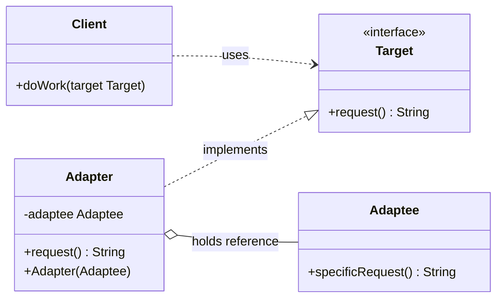
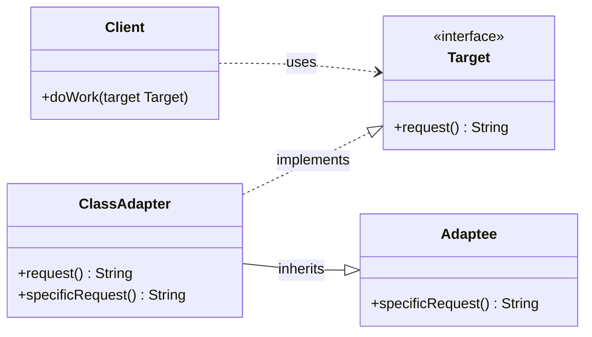
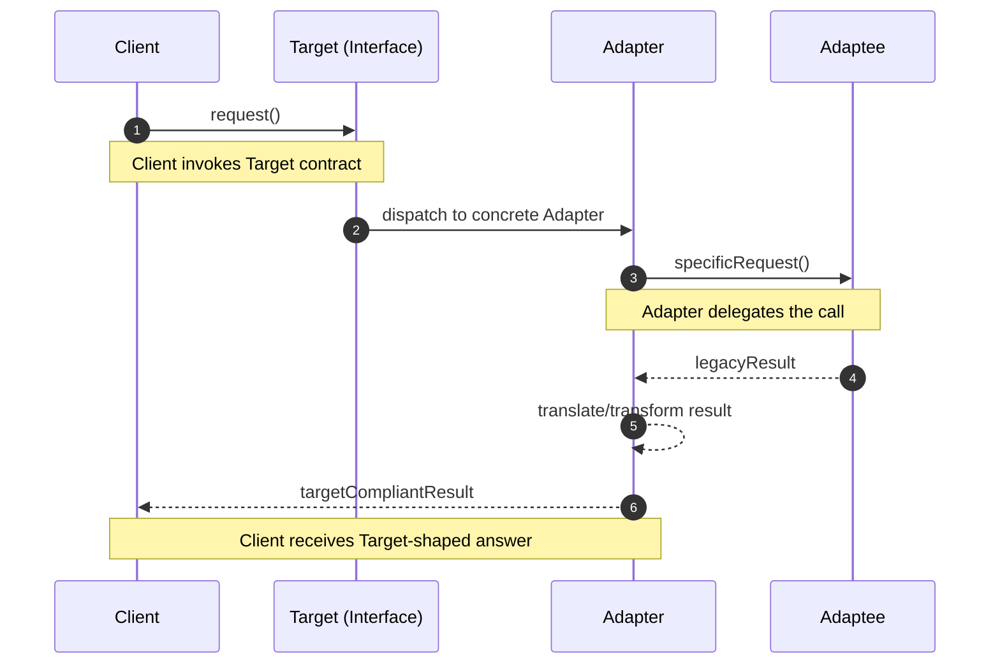
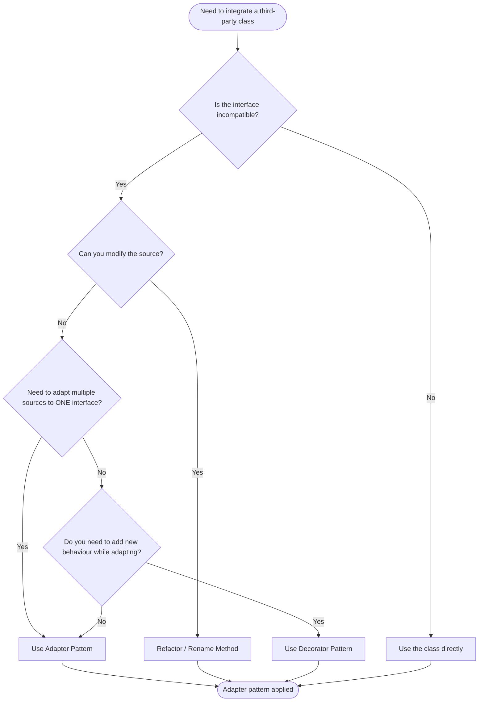

# Adapter Pattern

<!-- SECTION_1_START -->
# Adapter Pattern — Core Technical Definition & Intuitive Overview

## Formal Definition (KTU 2024 Syllabus Terminology)

> [!NOTE]
> **Adapter Pattern (Gang of Four — Structural Pattern)**
> The Adapter Pattern is a **structural design pattern** that converts the interface of an existing class into another interface that clients expect. It allows classes with incompatible interfaces to work together by wrapping the original class with a new adapter class that translates calls between them.

It is formally classified as a **Structural Pattern** because it deals with the **composition of classes and objects** to form larger structures, while keeping those structures **flexible and efficient**.

## Conceptual Analogy / Intuition

> [!IMPORTANT]
> Think of a **travel power adapter**. Your laptop charger has a 3-pin Indian plug, but the wall socket in London accepts a 2-pin British plug. You do not throw away the charger. You simply buy a small plastic *adapter* that physically translates one shape into another. The charger (the *adaptee*) does not know it is being adapted. The wall socket (the *client*) only sees the standard interface it expects.

In software terms:
- **Adaptee** = the existing class with a useful behaviour but a *wrong interface*.
- **Target** = the interface the *client* code expects.
- **Adapter** = the middleman that *implements* the Target interface and *delegates* calls to the wrapped Adaptee.
- **Client** = the calling code that talks only to the Target.

The pattern is often called a **"wrapper"** because the adapter literally *wraps* an object of one type and presents it as another type.

> [!TIP]
> The Adapter Pattern is the software equivalent of a **real-world electrical plug adapter** or a **language translator** standing between two people who do not share a common language.

## Classification of Adapter Patterns

There are two recognised variants of the Adapter Pattern:

1. **Object Adapter (Composition-based)** — The adapter *holds* a reference to an Adaptee object and delegates calls to it. This is the modern, preferred form in most languages (Java, C#, Python).
2. **Class Adapter (Multiple Inheritance-based)** — The adapter *inherits* from both the Target and the Adaptee. This form requires multiple inheritance and is therefore feasible in C++ but not in Java or C#.

> [!WARNING]
> In Java, C#, and Python, **only the Object Adapter variant is implementable** because these languages do not support multiple class inheritance. Always use the Object Adapter form unless you are writing C++.

## Why the Adapter Pattern Matters in OOD Frameworks

Frameworks such as **Spring (Java)**, **.NET**, and **React (JS)** rely heavily on adapter abstractions. For example, Spring's `HandlerAdapter` allows the DispatcherServlet to invoke any controller type uniformly. Without adapters, every new controller would require changes to the framework core — a clear violation of the **Open/Closed Principle**.

> [!VISUALIZATION CONTROL]
> **Concept:** Client–Target–Adapter–Adaptee collaboration flow
> **GeoGebra / Desmos Input Equations:** Not directly applicable (UML flow). Visualise four labelled rectangles on a horizontal axis connected by directed arrows: `Client` → `Target` (interface) → `Adapter` (concrete) → `Adaptee` (legacy class).
> **Visual Description:** The arrows should illustrate that the *Client* never sees the *Adaptee* directly; all messages flow through the *Adapter* which translates `request()` into `specificRequest()`.

<!-- SECTION_1_END -->

<!-- SECTION_2_START -->
# Deep Theoretical Analysis & KTU High-Yield Reference

## Structural Participants (The Four Actors)

The Adapter Pattern has **four canonical participants** as defined by the *Gang of Four* (Gamma, Helm, Johnson, Vlissides):

| # | Participant | Role | Responsibility |
|---|-------------|------|----------------|
| 1 | **Target** | Interface / Abstract Class | Defines the domain-specific interface that the **Client** uses. The *contract* the client expects. |
| 2 | **Client** | Concrete Class | Collaborates with objects that conform to the **Target** interface. Never knows about the Adaptee. |
| 3 | **Adaptee** | Existing Class | The legacy or third-party class that needs adapting. Has a useful behaviour but a mismatched interface. |
| 4 | **Adapter** | Concrete Class | Implements the **Target** interface. Internally holds (or inherits) an **Adaptee** and **translates** Target calls into Adaptee calls. |

## Operational Sequence — How the Pattern Works

1. The **Client** makes a call on the **Target** interface (e.g., `target.request()`).
2. The call is dispatched polymorphically to the concrete **Adapter** class.
3. The **Adapter** receives the call and internally invokes a method on the wrapped **Adaptee** (e.g., `adaptee.specificRequest()`).
4. The **Adaptee** executes its existing logic and returns the result.
5. The **Adapter** may **post-process** the result to match the Target contract before returning to the Client.

## Object Adapter vs Class Adapter — Comparison Table

| Feature | Object Adapter (Composition) | Class Adapter (Inheritance) |
|---------|------------------------------|------------------------------|
| Mechanism | Adapter *holds* an Adaptee reference | Adapter *inherits* from both Target and Adaptee |
| Multiple Inheritance Required | **No** | **Yes** |
| Language Support | Java, C#, Python, C++ | C++ only (in practice) |
| Adaptee Subclass Flexibility | Can wrap *any* subclass of Adaptee | Bound to the specific Adaptee parent class |
| Single Responsibility | Better — Adaptee and Adapter are decoupled | Tighter coupling via inheritance |
| Preferred by GoF | **Yes (recommended form)** | Edge-case usage |
| Overriding Adaptee Behaviour | Requires composition of the override | Easier — direct method override available |

## KTU Formula Sheet — Pattern Applicability Checklist

| Criterion | Question to Ask | If YES → Use Adapter |
|-----------|-----------------|----------------------|
| Existing Code Reuse | Do we have an existing class whose functionality is *exactly* what we need? | ✓ |
| Interface Mismatch | Is its interface incompatible with what the rest of our system expects? | ✓ |
| Legacy / Third-Party | Is the class owned by an external party or legacy system we cannot modify? | ✓ |
| No Source Access | Do we have only the compiled `.class` / `.dll` / `.jar` artifact? | ✓ |
| Future-Proofing | Will we need to swap the Adaptee with a different vendor later? | ✓ |

## Real-World Engineering & Industry Use Cases

| Domain | Use Case | Adapter Role |
|--------|----------|--------------|
| **Java I/O** | `InputStreamReader` adapts an `InputStream` (byte-oriented) to a `Reader` (character-oriented). | Bridges byte and char streams. |
| **Java Collections** | `Arrays.asList()` adapts a native array to a `List` interface. | Bridges arrays to the Collections Framework. |
| **Spring MVC** | `HandlerAdapter` lets the DispatcherServlet invoke any controller type. | Uniform controller invocation. |
| **Android** | `RecyclerView.Adapter` adapts a domain data list to ViewHolder views. | Bridges data model to UI views. |
| **.NET** | `StreamReader` wraps a `Stream` to provide character-based reading. | Stream-to-Reader bridging. |
| **JDBC** | Driver classes adapt vendor-specific DB protocols to the standard `java.sql` interfaces. | Vendor-neutral database access. |
| **Payment Gateways** | A custom `PaymentAdapter` wraps Stripe, Razorpay, or PayPal SDKs behind one `PaymentProcessor` interface. | Vendor-agnostic checkout. |

## Engineering Utility — Why It Is Used in Production

The Adapter Pattern directly enforces several **SOLID principles**:

- **Single Responsibility Principle (SRP)** — The Adaptee keeps doing what it does best; the Adapter keeps doing only interface translation.
- **Open/Closed Principle (OCP)** — The system is *open to extension* (new adapters can be added) but *closed for modification* (the client code is untouched).
- **Dependency Inversion Principle (DIP)** — The client depends on the abstract `Target`, not on the concrete `Adaptee`.

It is the backbone of all **plug-in architectures**, **middleware bridges**, and **anti-corruption layers** in Domain-Driven Design (DDD).

<!-- SECTION_2_END -->

<!-- SECTION_3_START -->
# Step-by-Step Implementation & Code Walkthrough

## Example Scenario — The Classic "Legacy to Modern" Problem

> A modern analytics dashboard expects a uniform `DataAnalytics` interface with a `analyzeData()` method. However, the legacy system can only export CSV data via a method called `generateCSVReport()`. We will build an adapter that lets the dashboard consume legacy data without modifying the legacy class.

## Full Production-Quality Python Implementation

```python
"""
Adapter Pattern — Object Adapter Variant
Scenario: Modern analytics dashboard integrating with a legacy CSV exporter.
"""

from __future__ import annotations
from abc import ABC, abstractmethod
from typing import List, Dict, Any
import logging

# Configure structured logging
logging.basicConfig(
    level=logging.INFO,
    format="%(asctime)s | %(levelname)s | %(name)s | %(message)s"
)
logger = logging.getLogger("AdapterPatternDemo")


# ---------------------------------------------------------------
# 1. TARGET — The interface the CLIENT expects (modern contract)
# ---------------------------------------------------------------
class DataAnalytics(ABC):
    """
    Target interface (Abstract Base Class).
    All modern analytics tools conform to this contract.
    """

    @abstractmethod
    def analyze_data(self, rows: List[Dict[str, Any]]) -> Dict[str, Any]:
        """Return analytics summary (mean, count, etc.) for the rows."""
        raise NotImplementedError


# ---------------------------------------------------------------
# 2. ADAPTEE — The LEGACY class with an incompatible interface
# ---------------------------------------------------------------
class LegacyCSVExporter:
    """
    Adaptee. Pretend this is a third-party library we cannot modify.
    It only knows how to spit out a CSV string.
    """

    def generate_csv_report(self, rows: List[Dict[str, Any]]) -> str:
        if not rows:
            raise ValueError("LegacyCSVExporter: cannot export an empty dataset.")

        headers: List[str] = list(rows[0].keys())
        csv_lines: List[str] = [",".join(headers)]
        for row in rows:
            csv_lines.append(",".join(str(row.get(h, "")) for h in headers))
        return "\n".join(csv_lines)


# ---------------------------------------------------------------
# 3. ADAPTER — Implements TARGET, wraps ADAPTEE
# ---------------------------------------------------------------
class CSVAnalyticsAdapter(DataAnalytics):
    """
    Object Adapter. Holds a LegacyCSVExporter by composition
    and translates 'analyze_data' into 'generate_csv_report'.
    """

    def __init__(self, legacy_exporter: LegacyCSVExporter) -> None:
        self._legacy: LegacyCSVExporter = legacy_exporter
        logger.info("CSVAnalyticsAdapter initialised with legacy exporter.")

    def analyze_data(self, rows: List[Dict[str, Any]]) -> Dict[str, Any]:
        """
        Step A: Ask the legacy system to produce a CSV string.
        Step B: Parse the CSV string back into structured data.
        Step C: Compute simple analytics and return as a Target-compatible dict.
        """
        try:
            # ----- Step A: Delegate to the adaptee -----
            csv_text: str = self._legacy.generate_csv_report(rows)
            logger.info(f"Legacy CSV generated | length={len(csv_text)} chars")

            # ----- Step B: Parse CSV -----
            parsed_rows: List[Dict[str, str]] = self._parse_csv(csv_text)
            if not parsed_rows:
                return {"status": "empty", "row_count": 0, "mean_value": 0.0}

            # ----- Step C: Compute analytics -----
            numeric_values: List[float] = [
                float(r["value"])
                for r in parsed_rows
                if r.get("value", "").replace(".", "", 1).lstrip("-").isdigit()
            ]

            if not numeric_values:
                return {
                    "status": "ok",
                    "row_count": len(parsed_rows),
                    "mean_value": 0.0,
                }

            mean_value: float = sum(numeric_values) / len(numeric_values)
            return {
                "status": "ok",
                "row_count": len(parsed_rows),
                "mean_value": round(mean_value, 4),
            }

        except ValueError as ve:
            logger.error(f"Adapter caught validation error: {ve}")
            return {"status": "error", "message": str(ve)}
        except Exception as ex:
            logger.exception("Unexpected error inside adapter.")
            return {"status": "error", "message": f"Adapter failure: {ex}"}

    @staticmethod
    def _parse_csv(csv_text: str) -> List[Dict[str, str]]:
        """Minimal CSV parser — production code should use the 'csv' module."""
        lines: List[str] = [ln for ln in csv_text.splitlines() if ln.strip()]
        if len(lines) < 2:
            return []
        headers: List[str] = [h.strip() for h in lines[0].split(",")]
        return [
            dict(zip(headers, [cell.strip() for cell in line.split(",")]))
            for line in lines[1:]
        ]


# ---------------------------------------------------------------
# 4. CLIENT — The analytics dashboard (uses only the TARGET)
# ---------------------------------------------------------------
class AnalyticsDashboard:
    """Client. Depends ONLY on the abstract DataAnalytics interface."""

    def __init__(self, service: DataAnalytics) -> None:
        self._service: DataAnalytics = service

    def render_report(self, rows: List[Dict[str, Any]]) -> None:
        print("\n========= ANALYTICS REPORT =========")
        result: Dict[str, Any] = self._service.analyze_data(rows)
        for key, value in result.items():
            print(f"  {key:>12} : {value}")
        print("====================================\n")


# ---------------------------------------------------------------
# 5. DRIVER — The wiring code (composition root)
# ---------------------------------------------------------------
if __name__ == "__main__":
    sample_dataset: List[Dict[str, Any]] = [
        {"id": "1", "name": "Alpha", "value": "10.5"},
        {"id": "2", "name": "Beta",  "value": "20.0"},
        {"id": "3", "name": "Gamma", "value": "30.75"},
        {"id": "4", "name": "Delta", "value": "40.25"},
    ]

    # Composition root wires Adaptee into Adapter, then into Client
    legacy: LegacyCSVExporter = LegacyCSVExporter()
    adapter: DataAnalytics = CSVAnalyticsAdapter(legacy)
    dashboard: AnalyticsDashboard = AnalyticsDashboard(adapter)

    dashboard.render_report(sample_dataset)
```

### Sample Output

```
========= ANALYTICS REPORT ====
      status : ok
   row_count : 4
  mean_value : 25.375
================================
```

## Line-by-Line Logic Explanation

| Code Block | Logical Purpose |
|-----------|-----------------|
| `class DataAnalytics(ABC)` | Defines the **Target** interface that the client expects. |
| `class LegacyCSVExporter` | The **Adaptee** — pre-existing class with a `generate_csv_report` method. |
| `class CSVAnalyticsAdapter(DataAnalytics)` | The **Adapter** — extends Target, holds Adaptee via composition (`self._legacy`). |
| `def analyze_data(self, rows)` | Implements the Target contract. Internally delegates to `self._legacy.generate_csv_report`. |
| `try / except ValueError` | Boundary-safe handling: the Adaptee's empty-dataset error is caught and translated into a structured response. |
| `class AnalyticsDashboard` | The **Client** — only depends on `DataAnalytics`, never on the legacy class. |
| `dashboard.render_report(...)` | Wiring at the composition root. The client is unaware of the adapter's internals. |

## Mapping Back to the Pattern Participants

| GoF Role | Class Name in Code |
|----------|--------------------|
| **Target** | `DataAnalytics` (abstract base class) |
| **Adaptee** | `LegacyCSVExporter` |
| **Adapter** | `CSVAnalyticsAdapter` |
| **Client** | `AnalyticsDashboard` |

## Bonus: Equivalent Java Implementation (For Theory Exams)

```java
// TARGET interface
interface DataAnalytics {
    Map<String, Object> analyzeData(List<Map<String, String>> rows);
}

// ADAPTEE — legacy
class LegacyCSVExporter {
    public String generateCSVReport(List<Map<String, String>> rows) {
        StringBuilder sb = new StringBuilder();
        if (rows.isEmpty()) throw new IllegalArgumentException("Empty rows");
        sb.append(String.join(",", rows.get(0).keySet())).append("\n");
        for (Map<String, String> row : rows) {
            sb.append(String.join(",", row.values())).append("\n");
        }
        return sb.toString();
    }
}

// ADAPTER
class CSVAnalyticsAdapter implements DataAnalytics {
    private final LegacyCSVExporter legacy;

    public CSVAnalyticsAdapter(LegacyCSVExporter legacy) {
        this.legacy = legacy;
    }

    @Override
    public Map<String, Object> analyzeData(List<Map<String, String>> rows) {
        String csv = legacy.generateCSVReport(rows);
        // ... parse csv, compute mean, return Map ...
        return Map.of("status", "ok", "row_count", rows.size());
    }
}

// CLIENT
class AnalyticsDashboard {
    private final DataAnalytics service;
    public AnalyticsDashboard(DataAnalytics service) {
        this.service = service;
    }
    public void renderReport(List<Map<String, String>> rows) {
        System.out.println(service.analyzeData(rows));
    }
}
```

> [!TIP]
> Notice how the **Client** (`AnalyticsDashboard`) constructor accepts the **Target interface** (`DataAnalytics`), not the concrete adapter. This is the **Dependency Inversion Principle** in action — the client is decoupled from both the adapter and the adaptee.

<!-- SECTION_3_END -->

<!-- SECTION_4_START -->
# Structural Diagrams & Schematics

## Diagram 1 — Object Adapter Class Diagram



### Reading Guide
- `Client ..> Target` — dashed arrow = **dependency** (Client knows the Target).
- `Adapter ..|> Target` — triangle arrow = **realisation** (Adapter implements Target).
- `Adapter o-- Adaptee` — hollow diamond = **aggregation / composition** (Adapter owns the Adaptee reference).

## Diagram 2 — Class Adapter Variant (C++ Style)



### Reading Guide
- Note the **double inheritance arrows**: ClassAdapter both *implements* Target and *inherits from* Adaptee. This is why this variant is **only feasible in C++**.

## Diagram 3 — Runtime Sequence (Object Adapter)



### Reading Guide
- Steps 1, 2 — Client invokes the **Target interface**.
- Steps 3, 4 — The call is polymorphically dispatched to the concrete **Adapter**, which translates it into the Adaptee's method.
- Steps 5, 6 — The Adaptee returns a legacy-format result; the Adapter **translates** it before returning to the Client.

## Diagram 4 — Decision Flow for Choosing Adapter vs Other Patterns



### Reading Guide
- This flowchart is a **high-yield diagram for KTU exams**. It clearly differentiates the Adapter Pattern from a Decorator or a direct refactor — a question that examiners frequently test.

<!-- SECTION_4_END -->

<!-- SECTION_5_START -->
# KTU 2024 Scheme Examination Question Bank & Topic Recap

## Part A — Short Answer Questions (3 Marks Each)

### Question 1 `[KTU University Exam — July 2024]`
**Define the Adapter Pattern. List its four primary participants.**

**Model Answer (3 Marks):**

> [!NOTE]
> **Definition (1 Mark):** The Adapter Pattern is a *structural design pattern* that converts the interface of an existing class (Adaptee) into another interface (Target) that clients expect, enabling incompatible classes to collaborate.
>
> **Four Participants (2 Marks — 0.5 each):**
> 1. **Target** — The interface the client expects.
> 2. **Client** — Collaborates with objects conforming to the Target.
> 3. **Adaptee** — The existing class with the *wrong* interface.
> 4. **Adapter** — Implements Target and *wraps* the Adaptee to translate calls.

---

### Question 2 `[KTU University Exam — Dec 2023]`
**Differentiate between Object Adapter and Class Adapter.**

**Model Answer (3 Marks):**

| Aspect | Object Adapter | Class Adapter |
|--------|----------------|----------------|
| Mechanism | Uses *composition* — holds a reference to Adaptee | Uses *multiple inheritance* from Target and Adaptee |
| Languages | Java, C#, Python, C++ | Only C++ in practice |
| Flexibility | Can wrap *any* Adaptee subclass | Tightly bound to the specific Adaptee parent |
| Recommendation | **Preferred (GoF recommendation)** | Used only in narrow C++ edge cases |

> **Valuation Note (1 Mark):** Award 1 mark each for the *mechanism* difference, *language support*, and *flexibility* — for a total of 3 marks.

---

## Part B — Long Answer Questions (14 Marks Each, Module Internal Choice)

### Question A (14 Marks) `[KTU University Exam — June 2024]`

> **(a) [7 Marks — Understand]** Draw the UML class diagram of the Adapter Pattern and explain the responsibilities of each participant.
>
> **(b) [7 Marks — Apply]** Consider a third-party `XMLParser` class with a method `parseXMLToString(String xml) : String`. A modern microservice expects a `JSONService` interface with a method `getJSON(String data) : String`. Write the complete Java/Pseudocode solution using the Adapter Pattern, demonstrating the Object Adapter variant.

#### Model Solution

**Part (a) — 7 Marks**

- **Class Diagram (3 Marks):**
  - Target interface with `getJSON()` method.
  - Adaptee class with `parseXMLToString()` method.
  - Adapter class implements Target and *has-a* Adaptee.
  - Client class uses the Target.

- **Responsibilities Explanation (4 Marks — 1 each):**
  - **Target:** Defines domain-specific interface used by the Client.
  - **Client:** Collaborates only with objects implementing Target.
  - **Adaptee:** Existing class needing adaptation; carries the useful behaviour.
  - **Adapter:** Bridges Target and Adaptee by implementing Target and delegating to Adaptee.

> **Valuation Key (Class Diagram):**
> - `[Drawing Target interface with the correct method signature: 1 Mark]`
> - `[Drawing Adaptee with its specific method: 1 Mark]`
> - `[Correctly drawing Adapter with realisation arrow to Target and composition arrow to Adaptee: 1 Mark]`

**Part (b) — 7 Marks**

```java
// TARGET interface — what the microservice expects
interface JSONService {
    String getJSON(String data);
}

// ADAPTEE — third-party class we cannot modify
class XMLParser {
    public String parseXMLToString(String xml) {
        return "<root>" + xml + "</root>";  // simulated legacy behaviour
    }
}

// ADAPTER — bridges XML to JSON-shaped output
class XMLToJSONAdapter implements JSONService {
    private final XMLParser xmlParser;   // composition

    public XMLToJSONAdapter(XMLParser xmlParser) {
        this.xmlParser = xmlParser;
    }

    @Override
    public String getJSON(String data) {
        // 1. Delegate to the legacy Adaptee
        String xmlResult = xmlParser.parseXMLToString(data);
        // 2. Translate the XML result into a JSON string
        return "{\"data\":\"" + xmlResult + "\"}";
    }
}

// CLIENT — modern microservice
class Microservice {
    private final JSONService service;
    public Microservice(JSONService service) {
        this.service = service;
    }
    public void consume(String xml) {
        System.out.println(service.getJSON(xml));
    }
}

// Composition root
public class Main {
    public static void main(String[] args) {
        JSONService adapter = new XMLToJSONAdapter(new XMLParser());
        Microservice ms = new Microservice(adapter);
        ms.consume("HelloWorld");
    }
}
```

> **Valuation Key (Code — 7 Marks):**
> - `[Defining JSONService interface as Target: 1 Mark]`
> - `[Defining XMLParser as Adaptee with the legacy method: 1 Mark]`
> - `[Adapter class implementing JSONService and holding XMLParser via composition: 2 Marks]`
> - `[Correct translation logic inside getJSON: 2 Marks]`
> - `[Client depending only on the Target interface: 1 Mark]`

---

### Question B (14 Marks) `[KTU University Exam — Dec 2022]`

> **(a) [7 Marks — Understand]** Explain *when* and *why* the Adapter Pattern should be used. List at least four real-world scenarios where it is applied.
>
> **(b) [7 Marks — Apply]** An e-commerce application currently uses a `StripePaymentGateway` with a method `makeStripePayment(double amount)`. The application must now also support a `RazorpayPaymentGateway` with a method `processRazorpayTxn(double total)`. Design a `PaymentAdapter` solution that allows the application to use both gateways interchangeably through a common `PaymentProcessor` interface.

#### Model Solution

**Part (a) — 7 Marks**

- **When to Use (3 Marks):**
  1. When an existing class has the right *behaviour* but the *wrong interface* for the rest of the system.
  2. When integrating with **third-party libraries** whose source we cannot change.
  3. When **reusing legacy code** in a new system with modern interfaces.
  4. When you need to support **multiple vendors** behind a single contract.

- **Why to Use (2 Marks):**
  - **Decouples** the client from concrete implementations.
  - **Avoids modifying** legacy / third-party code.
  - Supports **Open/Closed Principle** — new adapters added without changing client.

- **Real-World Scenarios (2 Marks — 0.5 each):**
  1. `InputStreamReader` in Java I/O.
  2. `Arrays.asList()` in Java Collections.
  3. `HandlerAdapter` in Spring MVC.
  4. `RecyclerView.Adapter` in Android.

**Part (b) — 7 Marks**

```java
// TARGET — common interface for the application
interface PaymentProcessor {
    boolean pay(double amount);
}

// ADAPTEE 1 — Stripe
class StripePaymentGateway {
    public boolean makeStripePayment(double amount) {
        System.out.println("Stripe charged: " + amount);
        return amount > 0;
    }
}

// ADAPTEE 2 — Razorpay
class RazorpayPaymentGateway {
    public boolean processRazorpayTxn(double total) {
        System.out.println("Razorpay processed: " + total);
        return total > 0;
    }
}

// ADAPTER 1 — Stripe adapter
class StripeAdapter implements PaymentProcessor {
    private final StripePaymentGateway stripe;
    public StripeAdapter(StripePaymentGateway stripe) {
        this.stripe = stripe;
    }
    @Override
    public boolean pay(double amount) {
        return stripe.makeStripePayment(amount);
    }
}

// ADAPTER 2 — Razorpay adapter
class RazorpayAdapter implements PaymentProcessor {
    private final RazorpayPaymentGateway razorpay;
    public RazorpayAdapter(RazorpayPaymentGateway razorpay) {
        this.razorpay = razorpay;
    }
    @Override
    public boolean pay(double amount) {
        return razorpay.processRazorpayTxn(amount);
    }
}

// CLIENT — the e-commerce checkout service
class CheckoutService {
    private final PaymentProcessor processor;
    public CheckoutService(PaymentProcessor processor) {
        this.processor = processor;
    }
    public void checkout(double cartTotal) {
        boolean ok = processor.pay(cartTotal);
        System.out.println(ok ? "Order placed." : "Payment failed.");
    }
}

// Usage — choose gateway at runtime
public class Main {
    public static void main(String[] args) {
        PaymentProcessor stripe = new StripeAdapter(new StripePaymentGateway());
        new CheckoutService(stripe).checkout(1500.00);

        PaymentProcessor razorpay = new RazorpayAdapter(new RazorpayPaymentGateway());
        new CheckoutService(razorpay).checkout(2500.00);
    }
}
```

> **Valuation Key (Code — 7 Marks):**
> - `[Defining the common PaymentProcessor interface: 1 Mark]`
> - `[Correctly identifying the two Adaptees with their original method names: 1 Mark]`
> - `[Writing StripeAdapter that delegates makeStripePayment to pay: 1 Mark]`
> - `[Writing RazorpayAdapter that delegates processRazorpayTxn to pay: 1 Mark]`
> - `[Client depending only on the Target interface: 1 Mark]`
> - `[Demonstrating runtime interchangeability of gateways: 2 Marks]`

---

> [!WARNING]
> **KTU Examiner's Valuation Warning / Common Pitfalls**
> 1. **Do not confuse Adapter with Decorator.** The Adapter Pattern changes the *interface*; the Decorator Pattern *adds responsibilities* without changing the interface. Mixing them up is a guaranteed 2-mark loss.
> 2. **Do not call the Adapter class the "Wrapper" in the exam unless asked** — KTU strictly uses the GoF term *Adapter*.
> 3. **Always show the composition arrow (`o--`) between the Adapter and the Adaptee** in UML diagrams. Drawing only a plain association line loses 1 mark.
> 4. **Mention "Object Adapter" explicitly** when writing code in Java/C#/Python. Examiners mark generously when the variant is named.
> 5. **Do not modify the Adaptee's class** in your solution. If the question says "third-party", assume the source is *read-only* — modifying it violates the entire purpose of the pattern.

---

## Topic Recap & Important Things to Remember

- **Category:** The Adapter Pattern is a **Structural Design Pattern** (GoF classification).
- **Intent:** Convert the interface of an existing class into another interface the *client* expects, allowing otherwise incompatible classes to collaborate.
- **Four Participants:** **Target** (interface), **Client**, **Adaptee** (existing class), **Adapter** (concrete bridge).
- **Two Variants:**
  - **Object Adapter** → uses **composition** (preferred; works in Java, C#, Python, C++).
  - **Class Adapter** → uses **multiple inheritance** (only feasible in C++).
- **SOLID Linkage:** Directly enforces **Open/Closed**, **Single Responsibility**, and **Dependency Inversion** principles.
- **Java I/O Example:** `InputStreamReader` adapts an `InputStream` (bytes) to a `Reader` (characters) — a textbook use case.
- **Collections Example:** `Arrays.asList()` adapts a raw array to a `List` interface.
- **Spring MVC Example:** `HandlerAdapter` lets `DispatcherServlet` invoke any controller type uniformly.
- **Pattern Boundary:** Use Adapter when the *interface* is wrong; use Decorator when you need to *add behaviour*; use Facade when you need to *simplify* a complex subsystem.
- **Anti-Pattern Trap:** Never use Adapter when you can simply **rename a method** or **refactor the call site** — Adapter adds a class and an indirection, so apply it only when reuse trumps simplicity.
- **Valuation Tip:** In KTU 14-mark answers, always include a **UML class diagram (3 marks)**, **participant responsibilities (2 marks)**, **code (6 marks)**, and **a concluding note on applicability (1 mark)**. Missing the UML diagram is the single most common reason for losing marks.
- **Key Mnemonic:** **"TACA"** → **T**arget, **A**daptee, **C**lient, **A**dapter — the four actors in order of definition.
- **One-Line Exam Definition (Recommended):** *"The Adapter Pattern is a structural design pattern that allows objects with incompatible interfaces to collaborate by wrapping the existing class with an adapter that translates calls from the target interface to the adaptee's interface."*

<!-- SECTION_5_END -->
