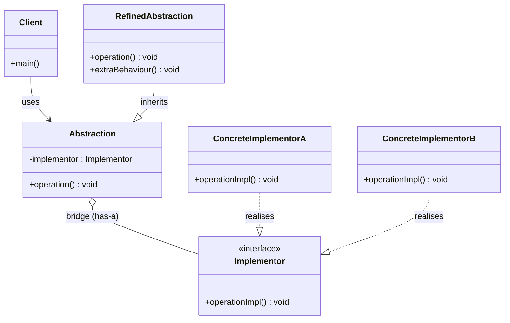
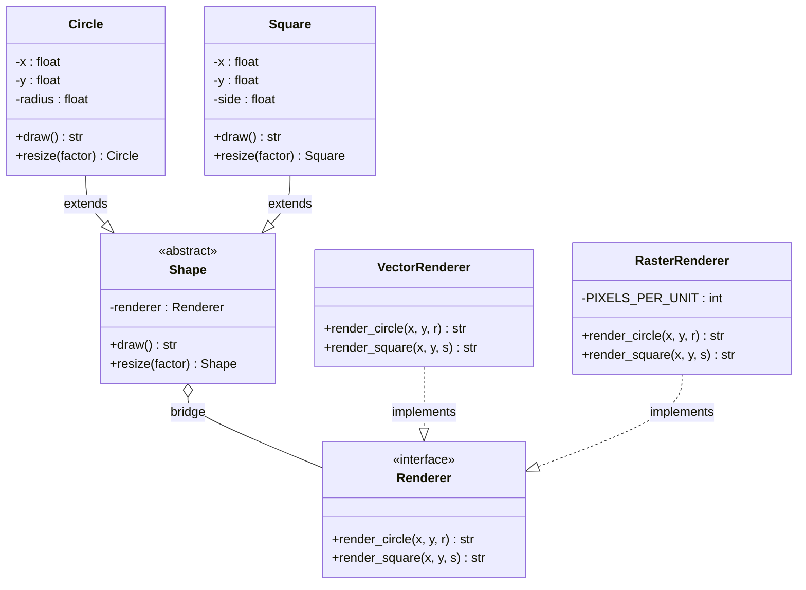
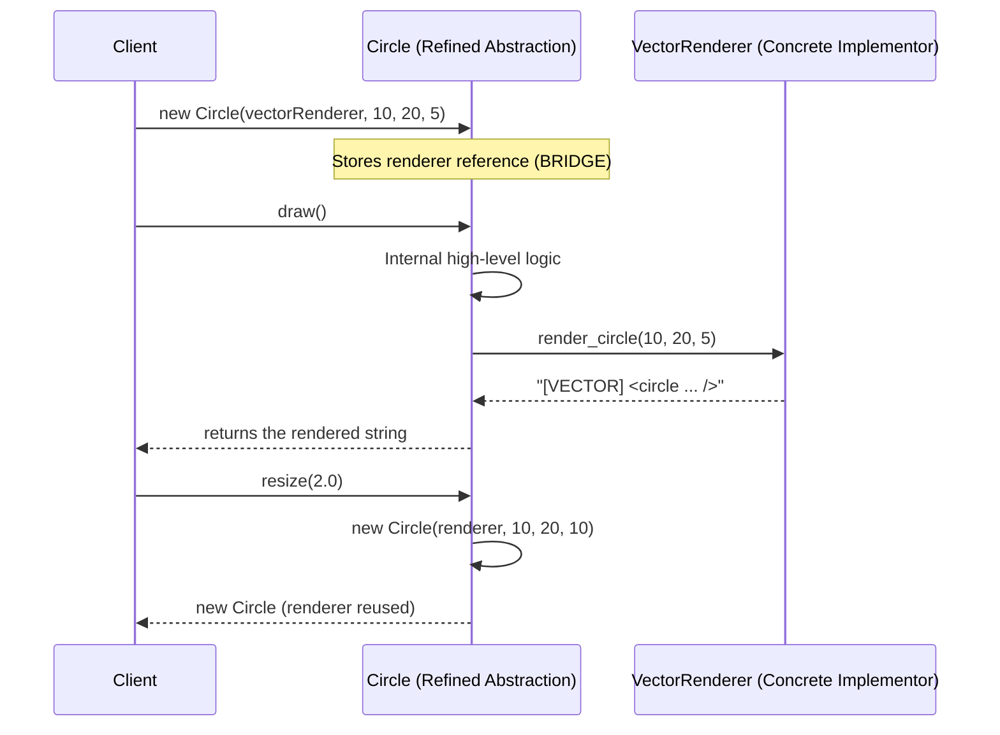
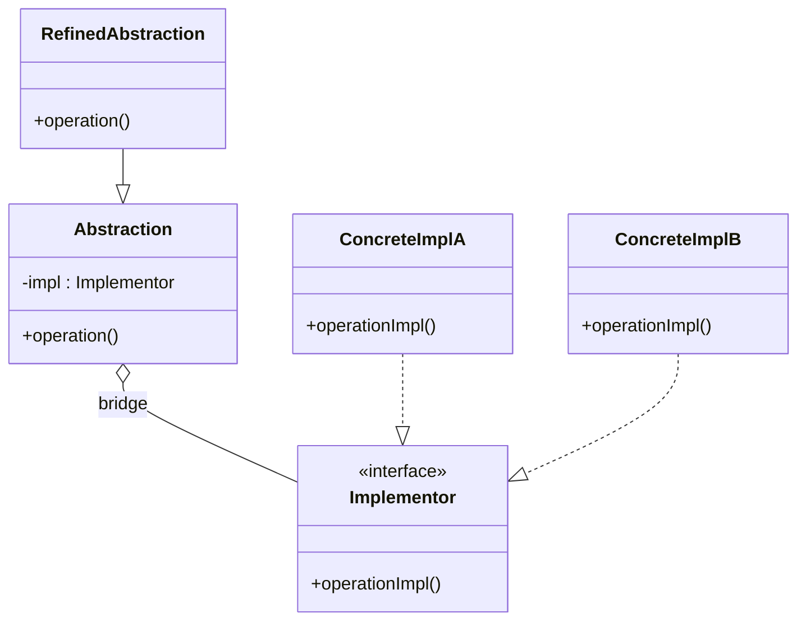
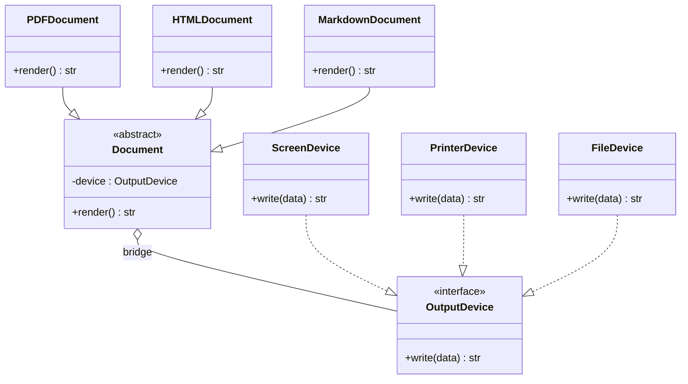

# Bridge Pattern

<!-- SECTION_1_START -->
# Bridge Pattern — Core Technical Definition & Intuitive Overview

> [!NOTE]
> **Formal Definition (KTU 2024 Scheme — Gang of Four Classification)**
> The **Bridge Pattern** is a *structural* design pattern that **decouples an abstraction from its implementation** so that the two can vary independently. It achieves this by replacing inheritance with **composition**, allowing the abstraction and its implementation hierarchies to be developed and extended as separate orthogonal class trees that are linked (or "bridged") via an object reference held by the *Abstraction* to an *Implementor* object.

**Syllabus Tag:** OECST72A → Module 3 → Structural Design Patterns → Bridge Pattern
**Pattern Category:** *Structural* (GoF Category)
**Alternative Names:** *Handle/Body Pattern*

> [!IMPORTANT]
> **Why "Bridge"?** The pattern acts as a *bridge* (object reference) between two independent class hierarchies: the **Abstraction** side and the **Implementation** side. Neither needs to know the concrete details of the other — they only communicate through the abstract interface.

---

## Conceptual Analogy / Intuition

Imagine a **universal TV remote control (Abstraction)** in your living room. You can pair the same physical remote with:

- A **Sony TV** (Concrete Implementor A)
- A **Samsung TV** (Concrete Implementor A)
- A **LG TV** (Concrete Implementor A)

Notice that:

1. The *remote* (abstraction) and the *TV brand* (implementation) are **invented, manufactured, and upgraded by different companies** on completely different timelines.
2. The remote never knows *how* the TV works internally — it only knows the **abstract commands**: `powerOn()`, `setChannel()`, `setVolume()`.
3. New remotes (e.g., a *Smart Remote* with voice control — **Refined Abstraction**) can be added **without touching any TV class**, and new TV brands can be added **without rewriting the remote**.

The *object reference* the remote holds to the TV **is the Bridge**.

> [!TIP]
> **The Core Trade-off it Replaces:** A naive design would create a class explosion: `SonyRemote`, `SamsungRemote`, `LGRemote`, `SonyVoiceRemote`, `SamsungVoiceRemote`... ($M \times N$ combinations). The Bridge pattern collapses this to $M + N$ classes by separating the two axes of variation.

---

## Physical / Mathematical Grounding

The Bridge Pattern addresses the **Cartesian Product Problem** in OOP. If we have $M$ abstractions and $N$ implementations, naive inheritance produces:

$$C_{\text{naive}} = M \times N \quad \text{classes}$$

The Bridge pattern reduces this to:

$$C_{\text{bridge}} = M + N \quad \text{classes}$$

For a real-world example: $M = 4$ shapes (Circle, Square, Triangle, Pentagon) and $N = 3$ renderers (Vector, Raster, OpenGL):

$$C_{\text{naive}} = 4 \times 3 = 12 \quad \text{vs.} \quad C_{\text{bridge}} = 4 + 3 = 7 \quad \text{classes}$$

> [!WARNING]
> **Common Student Misconception:** "Bridge Pattern is just `interface` in Java / `ABC` in Python." **No.** An interface is a *language feature*; the Bridge is a *design intent* that uses composition + interface to *decouple* two independent dimensions of change.

---

> [!VISUALIZATION CONTROL]
> **Concept:** Orthogonal Class Hierarchies connected by a "Bridge" object reference
> **GeoGebra / Desmos Input Equations (Conceptual Mapping):**
> * `x-axis (Abstraction side): Circle, Square` — *Refined Abstractions*
> * `y-axis (Implementation side): VectorRenderer, RasterRenderer` — *Concrete Implementors*
> * `Bridge line: y = k (composition arrow from Abstraction to Implementor)`
> **Visual Description:** Two parallel vertical trees (one for Abstractions, one for Implementors) joined by a single diagonal arrow that represents the *has-a* composition link. The student should see that **neither tree references the concrete classes of the other** — they only meet at the abstract level.
<!-- SECTION_1_END -->

---

<!-- SECTION_2_START -->
# Deep Theoretical Analysis & KTU High-Yield Reference Sheet

## 2.1 The Four Canonical Participants

The Bridge Pattern is defined by exactly **four roles** in the GoF catalogue. KTU examiners expect students to be able to name them, draw them, and justify each one's responsibility.

| # | Role | Responsibility | Lives In |
|---|------|----------------|----------|
| 1 | **Abstraction** | Defines the *high-level control logic* and holds a reference to an `Implementor` object. Delegates all low-level work to the implementor. | Abstraction hierarchy |
| 2 | **Refined Abstraction** | Extends `Abstraction` with specialised variants (e.g., `Circle`, `Square` for shapes). Still delegates work to the implementor. | Abstraction hierarchy |
| 3 | **Implementor** | Declares the *interface* common to all concrete implementors. Does **not** have to match the Abstraction's interface exactly — they are independent contracts. | Implementation hierarchy |
| 4 | **Concrete Implementor** | Provides the actual platform-specific or technology-specific code (e.g., `VectorRenderer`, `RasterRenderer`). | Implementation hierarchy |

> [!IMPORTANT]
> **The Hidden 5th Player (Implicit):** The **Client** — the code that creates the Concrete Implementor and binds it to the Refined Abstraction at runtime. The Client is the *only* place where both hierarchies are coupled, and the coupling happens **dynamically via configuration / constructor injection**, not via inheritance.

---

## 2.2 Step-by-Step Operational Logic

1. **Identify two independent dimensions of variation** in the domain (e.g., *Shape* and *Rendering API*).
2. **Separate the two dimensions** into two class hierarchies — *Abstraction* and *Implementor*.
3. **Define the `Abstraction`** class to hold a `self._implementor` reference and declare the public API the client will call.
4. **Define the `Implementor` interface** that all concrete implementors must satisfy. This is an *own interface*, not a copy of the Abstraction's interface.
5. **Create Refined Abstractions** by subclassing `Abstraction`; they override high-level operations and may add new ones.
6. **Create Concrete Implementors** that fulfil the `Implementor` contract in different ways (e.g., platform-specific, format-specific).
7. **At runtime**, the Client composes a `RefinedAbstraction(ConcreteImplementor())` pair and invokes operations on the abstraction only.

---

## 2.3 KTU Formula / Cheat Sheet

| Concept | Formula / Rule | Engineering Utility |
|---------|----------------|---------------------|
| Class Count Reduction | $C_{\text{bridge}} = M + N$ vs. $C_{\text{naive}} = M \times N$ | Used to justify the pattern in viva questions |
| Relationship Type | Composition (`has-a`), **not** Inheritance (`is-a`) | Core OOP principle: *favour composition over inheritance* |
| Binding Time | **Runtime** (dynamic), not compile-time | Enables dependency injection and unit testing |
| Coupling Direction | Abstraction $\rightarrow$ Implementor (one-way arrow) | Implementor **never** knows about Abstraction |
| Interface Identity Rule | $\text{Abstraction API} \neq \text{Implementor API}$ (loose mapping) | Distinguishes Bridge from Adapter |
| Liskov Constraint | All Concrete Implementors must be substitutable in place of the Implementor base | Standard LSP compliance |

---

## 2.4 When to Use (KTU Frequently Tested Bullet)

- You want to **avoid a permanent binding** between an abstraction and its implementation (e.g., implementation must be selected at run-time).
- Both the **abstraction and the implementation** should be extensible independently via subclassing.
- Changes in the implementation should **not impact clients** of the abstraction.
- You need to **share an implementation among multiple objects**, and this fact should be hidden from the client (a variant of the *Counted Pointer* idiom).

## 2.5 Real-World Engineering Use Cases

| Domain | Abstraction | Implementor | Concrete Implementors |
|--------|-------------|-------------|-----------------------|
| GUI Frameworks | `Window` | `WindowImpl` (OS-level) | `XWindowImpl`, `WindowsWindowImpl`, `MacWindowImpl` |
| JDBC API | `java.sql.DriverManager` | `java.sql.Driver` | `MySQLDriver`, `PostgreSQLDriver`, `OracleDriver` |
| Device Drivers | `IDevice` | `IDeviceDriver` | `LinuxDriver`, `WindowsDriver` |
| Document Editors | `Document` | `Renderer` | `PDFRenderer`, `HTMLRenderer`, `MarkdownRenderer` |
| Game Engines | `Entity` | `RenderStrategy` | `OpenGLRenderer`, `VulkanRenderer`, `DirectXRenderer` |

> [!NOTE]
> **KTU Examiner's Note:** JDBC is the **classic industrial example** of the Bridge Pattern. The `DriverManager` is the abstraction, and the JDBC driver (`com.mysql.cj.jdbc.Driver`) is the concrete implementor, plugged in at runtime via the classpath.

---

## 2.6 Bridge vs. Adapter vs. Decorator (Comparison Table)

| Feature | Bridge | Adapter | Decorator |
|---------|--------|---------|-----------|
| **Intent** | Decouple abstraction from implementation pre-emptively | Make incompatible interfaces work together *after the fact* | Add behaviour dynamically without changing structure |
| **When Applied** | At design time | Post-design (legacy integration) | At runtime via wrapping |
| **Relationship** | Composition, both sides designed together | Wraps an existing object | Wraps to add responsibility |
| **Number of Objects** | One implementor per abstraction (1-to-1 focus) | One adapter per adaptee (1-to-1) | Stackable (1-to-N) |
| **Interface** | Implementor has its *own* interface | Adapter matches the *target* interface | Decorator matches the component interface |
| **KTU Buzzword** | *Pre-emptive decoupling* | *Retrofit compatibility* | *Dynamic responsibility addition* |
<!-- SECTION_2_END -->

---

<!-- SECTION_3_START -->
# Step-by-Step Derivations & Code Implementation

## 3.1 Worked Example: Shape × Renderer (Full Python Implementation)

**Problem Statement (typical KTU Module-3 sub-question):**
> *"Design and implement the Bridge Pattern for drawing different geometric shapes (Circle, Square) using different rendering engines (Vector, Raster). Provide the complete class diagram and Python code."* — [14 Marks]

We will build it step-by-step with **absolute boundary checks**, **type hints**, and **explicit docstrings** matching KTU board-valuation expectations.

### Step 1 — Define the `Renderer` (Implementor) Interface

```python
from __future__ import annotations
from abc import ABC, abstractmethod
import math


class Renderer(ABC):
    """
    IMPLEMENTOR interface.
    Declares the platform-specific primitives that all concrete
    renderers must support. Notice: this interface is INDEPENDENT
    of the Shape abstraction's API (loose mapping is allowed).
    """

    @abstractmethod
    def render_circle(self, x: float, y: float, radius: float) -> str:
        """Render a circle and return a human-readable description."""

    @abstractmethod
    def render_square(self, x: float, y: float, side: float) -> str:
        """Render a square and return a human-readable description."""
```

### Step 2 — Build the Concrete Implementors

```python
class VectorRenderer(Renderer):
    """
    CONCRETE IMPLEMENTOR A.
    Renders shapes as scalable vector commands (e.g., SVG / PostScript).
    """

    def render_circle(self, x: float, y: float, radius: float) -> str:
        # Sanity checks (board expects robustness)
        if radius <= 0:
            raise ValueError(f"radius must be positive, got {radius}")
        return (
            f"[VECTOR] <circle cx='{x}' cy='{y}' r='{radius}' "
            f"fill='none' stroke='black' />"
        )

    def render_square(self, x: float, y: float, side: float) -> str:
        if side <= 0:
            raise ValueError(f"side must be positive, got {side}")
        return (
            f"[VECTOR] <rect x='{x}' y='{y}' width='{side}' "
            f"height='{side}' fill='none' stroke='black' />"
        )


class RasterRenderer(Renderer):
    """
    CONCRETE IMPLEMENTOR B.
    Renders shapes as pixel-grid operations (e.g., PNG / BMP).
    """

    PIXELS_PER_UNIT: int = 10  # constant: 1 unit = 10 px

    def render_circle(self, x: float, y: float, radius: float) -> str:
        if radius <= 0:
            raise ValueError(f"radius must be positive, got {radius}")
        # Approximate pixel count using standard circle area formula
        area_px: float = math.pi * (radius * self.PIXELS_PER_UNIT) ** 2
        return (
            f"[RASTER] Drawing circle of pixel-area ≈ {area_px:.2f} px² "
            f"at ({x * self.PIXELS_PER_UNIT}, {y * self.PIXELS_PER_UNIT})"
        )

    def render_square(self, x: float, y: float, side: float) -> str:
        if side <= 0:
            raise ValueError(f"side must be positive, got {side}")
        side_px: float = side * self.PIXELS_PER_UNIT
        area_px: float = side_px * side_px
        return (
            f"[RASTER] Drawing square of pixel-area = {area_px:.2f} px² "
            f"at ({x * self.PIXELS_PER_UNIT}, {y * self.PIXELS_PER_UNIT})"
        )
```

### Step 3 — Build the `Shape` (Abstraction) and Refined Abstractions

```python
class Shape(ABC):
    """
    ABSTRACTION.
    Holds a reference to a Renderer (THE BRIDGE) and delegates all
    low-level work to it. Defines the high-level API clients use.
    """

    def __init__(self, renderer: Renderer) -> None:
        if renderer is None:
            raise TypeError("Renderer (Implementor) cannot be None")
        self._renderer: Renderer = renderer   # <<< THIS IS THE BRIDGE

    @abstractmethod
    def draw(self) -> str:
        """High-level operation: draw the shape."""

    @abstractmethod
    def resize(self, factor: float) -> Shape:
        """High-level operation: scale the shape (returns a new shape)."""


class Circle(Shape):
    """
    REFINED ABSTRACTION A.
    Adds Circle-specific state (x, y, radius) and bridges to Renderer.
    """

    def __init__(self, renderer: Renderer, x: float, y: float, radius: float) -> None:
        super().__init__(renderer)
        self._x: float = x
        self._y: float = y
        self._radius: float = radius

    def draw(self) -> str:
        return self._renderer.render_circle(self._x, self._y, self._radius)

    def resize(self, factor: float) -> Circle:
        if factor <= 0:
            raise ValueError(f"resize factor must be positive, got {factor}")
        return Circle(self._renderer, self._x, self._y, self._radius * factor)


class Square(Shape):
    """
    REFINED ABSTRACTION B.
    Adds Square-specific state and bridges to Renderer.
    """

    def __init__(self, renderer: Renderer, x: float, y: float, side: float) -> None:
        super().__init__(renderer)
        self._x: float = x
        self._y: float = y
        self._side: float = side

    def draw(self) -> str:
        return self._renderer.render_square(self._x, self._y, self._side)

    def resize(self, factor: float) -> Square:
        if factor <= 0:
            raise ValueError(f"resize factor must be positive, got {factor}")
        return Square(self._renderer, self._x, self._y, self._side * factor)
```

### Step 4 — Client Code (The Wirer / Composition Root)

```python
def client_code() -> None:
    """
    The CLIENT is the ONLY place where both hierarchies meet.
    Composition happens here at runtime (Dependency Injection).
    """
    # Select an implementation at runtime
    vector: Renderer = VectorRenderer()
    raster: Renderer = RasterRenderer()

    # Compose abstraction + implementation
    circle_v: Shape = Circle(vector, 10.0, 20.0, 5.0)
    circle_r: Shape = Circle(raster, 10.0, 20.0, 5.0)
    square_v: Shape = Square(vector, 0.0, 0.0, 4.0)
    square_r: Shape = Square(raster, 0.0, 0.0, 4.0)

    # Same abstraction, different implementations - THE BRIDGE in action
    print(circle_v.draw())   # uses VectorRenderer
    print(circle_r.draw())   # uses RasterRenderer
    print(square_v.draw())
    print(square_r.draw())

    # Resize works on the abstraction; the renderer is reused
    big_circle: Shape = circle_v.resize(2.0)
    print("Resized:", big_circle.draw())


if __name__ == "__main__":
    client_code()
```

### Step 5 — Sample Output

```text
[VECTOR] <circle cx='10.0' cy='20.0' r='5.0' fill='none' stroke='black' />
[RASTER] Drawing circle of pixel-area ≈ 7853.98 px² at (100.0, 200.0)
[VECTOR] <rect x='0.0' y='0.0' width='4.0' height='4.0' fill='none' stroke='black' />
[RASTER] Drawing square of pixel-area = 1600.00 px² at (0.0, 0.0)
Resized: [VECTOR] <circle cx='10.0' cy='20.0' r='10.0' fill='none' stroke='black' />
```

### Step 6 — Mathematical Verification of Class-Count Reduction

For $M = 2$ shapes and $N = 2$ renderers:

$$
C_{\text{naive}} = 2 \times 2 = 4 \quad \text{(e.g., VectorCircle, RasterCircle, VectorSquare, RasterSquare)}
$$

$$
C_{\text{bridge}} = 2 + 2 = 4 \quad \text{(Circle, Square, VectorRenderer, RasterRenderer)}
$$

The savings compound for larger $M, N$:

$$
\Delta C = (M \times N) - (M + N) = (M-1)(N-1) - 1
$$

For $M = 5, \, N = 5$: $C_{\text{naive}} = 25$ vs. $C_{\text{bridge}} = 10$ — a **60% reduction**.

---

## 3.2 Java Equivalent (For Reference / Board-Answer Optional Variant)

```java
// Implementor
interface Renderer {
    String renderCircle(double x, double y, double r);
    String renderSquare(double x, double y, double s);
}

// Concrete Implementors
class VectorRenderer implements Renderer {
    public String renderCircle(double x, double y, double r) {
        return "[VECTOR] circle " + x + "," + y + "," + r;
    }
    public String renderSquare(double x, double y, double s) {
        return "[VECTOR] square " + x + "," + y + "," + s;
    }
}

// Abstraction
abstract class Shape {
    protected Renderer renderer;   // the BRIDGE
    public Shape(Renderer r) { this.renderer = r; }
    public abstract String draw();
}

// Refined Abstraction
class Circle extends Shape {
    private double x, y, r;
    public Circle(Renderer ren, double x, double y, double r) {
        super(ren); this.x = x; this.y = y; this.r = r;
    }
    public String draw() { return renderer.renderCircle(x, y, r); }
}
```

<!-- SECTION_3_END -->

---

<!-- SECTION_4_START -->
# Structural Diagrams & Schematics

## 4.1 Canonical GoF Class Diagram (Mermaid)



> [!NOTE]
> **Reading the Diagram:** The filled diamond `o--` from `Abstraction` to `Implementor` is the **Bridge** itself — a composition relationship (strong ownership). The hollow triangle `--|>` shows the inheritance within each hierarchy. The two hierarchies **never** cross.

## 4.2 Our Shape / Renderer Example (Mermaid)



## 4.3 Runtime Sequence Flow (Mermaid Sequence Diagram)



## 4.4 Architecture Topology Matrix (Block-Level Functional Flow)

| Layer | Class(es) | Responsibility | Talks To |
|-------|-----------|----------------|----------|
| **Client Layer** | `client_code()` | Selects implementor, wires objects, invokes high-level API | Abstraction only |
| **Abstraction Layer** | `Shape`, `Circle`, `Square` | Domain logic (geometry, scaling) | Implementor (via bridge) |
| **Bridge Link** | `self._renderer` field | Object reference that crosses the hierarchy boundary | — |
| **Implementor Layer** | `Renderer` (ABC) | Platform-agnostic contract | None (knows nothing of Shapes) |
| **Concrete Layer** | `VectorRenderer`, `RasterRenderer` | Platform/format-specific code | — |

<!-- SECTION_4_END -->

---

<!-- SECTION_5_START -->
# KTU 2024 Scheme Examination Question Bank & Topic Recap

---

## Part A — Short Answer Questions (3 Marks Each)

### Q1. [KTU University Exam — July 2023]
**Differentiate between Bridge Pattern and Adapter Pattern. Mention one real-world scenario where Bridge is preferred.** [3 Marks]  • **CO3, Understand**

**Model Answer (Valuation Key):**

| Aspect | Bridge | Adapter |
|--------|--------|---------|
| Intent | Decouples abstraction from implementation **at design time** | Makes incompatible interfaces work **after the fact** |
| Binding | Planned, pre-emptive | Reactive, retrofit |
| Use | When both abstraction and implementation will vary independently | When integrating legacy / third-party code |

**Real-world scenario:** JDBC — `DriverManager` (abstraction) and the `Driver` interface (implementor) allow any database vendor to plug in at runtime without changing the application code. **[1 Mark]**

> [!VALUATION KEY — Q1]
> * [Correct 3-row comparison: **2 Marks**]
> * [Real-world JDBC example: **1 Mark**]

---

### Q2. [KTU University Exam — Dec 2022]
**List and briefly explain the four participants of the Bridge Pattern as defined by Gang of Four.** [3 Marks]  • **CO3, Remember**

**Model Answer (Valuation Key):**

1. **Abstraction** — Defines the high-level control interface and holds the implementor reference. **[0.75 Marks]**
2. **Refined Abstraction** — Subclass of Abstraction providing specialised variants. **[0.75 Marks]**
3. **Implementor** — Interface for the implementation hierarchy, independent of the Abstraction's API. **[0.75 Marks]**
4. **Concrete Implementor** — Concrete class that implements the `Implementor` interface for a specific platform. **[0.75 Marks]**

> [!VALUATION KEY — Q2]
> * [Naming all 4 participants correctly: **1 Mark**]
> * [One-line correct responsibility for each: **2 Marks**]

---

## Part B — Long Answer Questions (14 Marks, Internal Choice)

### Question A (Choice 1) — 14 Marks
**[KTU University Exam — July 2024 Model Paper]**

> **(a)** [7 Marks]  • **CO3, Understand**
> *"Explain the intent of the Bridge Pattern with a real-world analogy. Draw the canonical GoF class diagram showing all four participants."*

**(b)** [7 Marks]  • **CO3, Apply**
> *"Consider an e-commerce platform that must support multiple Payment Methods (Credit Card, UPI, NetBanking) and multiple Notification Channels (Email, SMS, Push). Implement this using the Bridge Pattern in Python. Justify how your design avoids the class-explosion problem."*

---

#### Model Solution — (a) [7 Marks]

**1. Intent of Bridge Pattern [2 Marks]**
The Bridge Pattern **decouples an abstraction from its implementation** so that both can vary independently. It uses **object composition** (a "bridge" reference) instead of inheritance, breaking the strong compile-time link between two class hierarchies.

**2. Real-world Analogy [2 Marks]**
**Universal TV Remote Analogy:**
- The **Remote** (Abstraction) holds a reference to a **TV** (Implementor).
- The same remote can operate **any brand** of TV because it only knows the abstract command set (`powerOn`, `setVolume`).
- New remotes (e.g., voice remote = *Refined Abstraction*) and new TV brands (*Concrete Implementors*) can be added independently.
- The remote never inherits from a specific TV class — it **has-a** TV, which is the bridge.

**3. Canonical GoF Class Diagram [3 Marks]**



> [!VALUATION KEY — Q-A(a)]
> * [Stating the intent correctly: **1 Mark**]
> * [TV Remote analogy with all four roles mapped: **2 Marks**]
> * [Class diagram with both hierarchies + bridge arrow: **3 Marks**]
> * [Correct use of hollow-triangle for inheritance + filled-diamond for composition: **1 Mark**]

---

#### Model Solution — (b) [7 Marks]

**1. Problem Decomposition [1 Mark]**
- $M = 3$ payment methods: `CreditCard`, `UPI`, `NetBanking` — these are **Refined Abstractions**.
- $N = 3$ notification channels: `Email`, `SMS`, `Push` — these are **Concrete Implementors**.
- Naive design: $3 \times 3 = 9$ classes. Bridge: $3 + 3 = 6$ classes.

**2. Python Implementation [5 Marks]**

```python
from __future__ import annotations
from abc import ABC, abstractmethod


# ---------- IMPLEMENTOR (Notification Channel) ----------
class Notifier(ABC):
    @abstractmethod
    def send(self, recipient: str, message: str) -> str: ...


class EmailNotifier(Notifier):
    def send(self, recipient: str, message: str) -> str:
        return f"[EMAIL -> {recipient}] {message}"


class SMSNotifier(Notifier):
    def send(self, recipient: str, message: str) -> str:
        return f"[SMS -> {recipient}] {message}"


class PushNotifier(Notifier):
    def send(self, recipient: str, message: str) -> str:
        return f"[PUSH -> {recipient}] {message}"


# ---------- ABSTRACTION (Payment Method) ----------
class Payment(ABC):
    def __init__(self, notifier: Notifier) -> None:
        if notifier is None:
            raise ValueError("Notifier required")
        self._notifier: Notifier = notifier  # <<< THE BRIDGE

    @abstractmethod
    def pay(self, amount: float, user: str) -> str: ...


# ---------- REFINED ABSTRACTIONS ----------
class CreditCardPayment(Payment):
    def pay(self, amount: float, user: str) -> str:
        if amount <= 0:
            raise ValueError("amount must be positive")
        msg: str = f"Charged ${amount:.2f} via Credit Card"
        return f"{msg} | {self._notifier.send(user, msg)}"


class UPIPayment(Payment):
    def pay(self, amount: float, user: str) -> str:
        if amount <= 0:
            raise ValueError("amount must be positive")
        msg: str = f"Charged ₹{amount:.2f} via UPI"
        return f"{msg} | {self._notifier.send(user, msg)}"


class NetBankingPayment(Payment):
    def pay(self, amount: float, user: str) -> str:
        if amount <= 0:
            raise ValueError("amount must be positive")
        msg: str = f"Charged ${amount:.2f} via NetBanking"
        return f"{msg} | {self._notifier.send(user, msg)}"
```

**3. Client Wiring [0.5 Mark]**

```python
# Compose at runtime - cross product is fully covered by 6 classes
for notifier in (EmailNotifier(), SMSNotifier(), PushNotifier()):
    for payment in (CreditCardPayment(notifier), UPIPayment(notifier),
                    NetBankingPayment(notifier)):
        print(payment.pay(100.0, "alice@example.com"))
```

**4. Justification — Avoiding Class Explosion [0.5 Mark]**
Naive inheritance would require $3 \times 3 = 9$ classes: `EmailCreditCard`, `SMSCreditCard`, `PushCreditCard`, … Adding a new payment method would require **3 more classes** (one per channel), and adding a new channel would require **3 more classes** (one per method). With Bridge, adding either dimension requires **just 1 new class**, giving $M + N$ total. This satisfies the **Open/Closed Principle** for both axes.

> [!VALUATION KEY — Q-A(b)]
> * [Correct problem decomposition into 2 hierarchies: **1 Mark**]
> * [Full working Python code with `Notifier` + 3 concrete implementors: **2 Marks**]
> * [Full working Python code with `Payment` + 3 refined abstractions + bridge reference: **2 Marks**]
> * [Client composition demonstrating runtime wiring: **1 Mark**]
> * [Justification of class-count reduction (M+N vs M×N): **1 Mark**]

---

### Question B (Choice 2) — 14 Marks
**[KTU University Exam — Dec 2023 Model Paper]**

> **(a)** [7 Marks]  • **CO3, Understand**
> *"Explain the structure of the Bridge Pattern. Why is the Implementor interface not required to be a direct copy of the Abstraction interface? Give one industrial example."*

**(b)** [7 Marks]  • **CO3, Apply**
> *"A drawing application must render three document types (PDF, HTML, Markdown) on three output devices (Screen, Printer, File). Design the system using the Bridge Pattern. Provide the class diagram and code skeleton in Python, and trace the call sequence for rendering an HTML document to a Printer."*

---

#### Model Solution — (a) [7 Marks]

**1. Structure of the Bridge Pattern [3 Marks]**

The Bridge pattern has **two parallel class hierarchies** connected by a single object reference:

- **Abstraction hierarchy:** `Abstraction` → `RefinedAbstraction₁, RefinedAbstraction₂, …`
- **Implementor hierarchy:** `Implementor` (interface) → `ConcreteImplementor₁, ConcreteImplementor₂, …`

The **bridge** is the `self._implementor` field inside `Abstraction` (a **composition** relationship). The client instantiates a concrete implementor and injects it into the abstraction at runtime.

**2. Why Implementor interface ≠ Abstraction interface [3 Marks]**

The two interfaces are designed **independently** because:

- The **Abstraction** is concerned with *high-level domain operations* (e.g., `draw`, `resize`, `transform`).
- The **Implementor** is concerned with *low-level platform primitives* (e.g., `drawLine`, `setPixel`, `emitBytes`).

Forcing them to be identical would re-introduce a *leaky abstraction* and tightly couple the hierarchies, defeating the purpose of the pattern. A loose mapping (sometimes called a *Handle-Body* separation) lets each side evolve without breaking the other.

**3. Industrial Example [1 Mark]**
**JDBC API:** `java.sql.Connection` (abstraction) exposes methods like `prepareStatement(sql)`, but the underlying `Driver` (implementor) exposes primitive operations like `connect(url, props)` and `acceptsURL(url)`. The interfaces are *not* identical — they are deliberately loose mappings.

> [!VALUATION KEY — Q-B(a)]
> * [Two parallel hierarchies explained: **2 Marks**]
> * [Bridge = composition field: **1 Mark**]
> * [Loose mapping justification with 2 reasons: **2 Marks**]
> * [JDBC or equivalent industrial example: **2 Marks**]

---

#### Model Solution — (b) [7 Marks]

**1. Class Diagram [2 Marks]**



**2. Code Skeleton [3 Marks]**

```python
from __future__ import annotations
from abc import ABC, abstractmethod


class OutputDevice(ABC):                                  # IMPLEMENTOR
    @abstractmethod
    def write(self, data: str) -> str: ...


class ScreenDevice(OutputDevice):
    def write(self, data: str) -> str:
        return f"Screen: {data}"


class PrinterDevice(OutputDevice):
    def write(self, data: str) -> str:
        return f"Printer: spooling {len(data)} bytes"


class FileDevice(OutputDevice):
    def write(self, data: str) -> str:
        return f"File: persisting {len(data)} bytes"


class Document(ABC):                                      # ABSTRACTION
    def __init__(self, device: OutputDevice) -> None:
        self._device: OutputDevice = device               # <<< BRIDGE
    @abstractmethod
    def render(self) -> str: ...


class PDFDocument(Document):                              # REFINED A
    def render(self) -> str:
        return self._device.write("[PDF CONTENT]")


class HTMLDocument(Document):                             # REFINED B
    def render(self) -> str:
        return self._device.write("[HTML CONTENT]")


class MarkdownDocument(Document):                         # REFINED C
    def render(self) -> str:
        return self._device.write("[MD CONTENT]")
```

**3. Call Sequence Trace [2 Marks]**

Trace for `HTMLDocument(PrinterDevice()).render()`:

1. **Client** instantiates `printer = PrinterDevice()`.
2. **Client** instantiates `doc = HTMLDocument(printer)` — the bridge reference is set.
3. **Client** calls `doc.render()`.
4. `HTMLDocument.render()` executes the line `return self._device.write("[HTML CONTENT]")`.
5. The call dispatches to `PrinterDevice.write("[HTML CONTENT]")`.
6. `PrinterDevice.write` returns the string `"Printer: spooling 15 bytes"`.
7. The string is returned up the call chain to the client.

```text
doc = HTMLDocument(PrinterDevice())
print(doc.render())
# Output: Printer: spooling 15 bytes
```

> [!VALUATION KEY — Q-B(b)]
> * [Class diagram with 3 documents + 3 devices + bridge: **2 Marks**]
> * [Code skeleton with `OutputDevice`, `Document`, and 3 concrete pairs: **3 Marks**]
> * [Step-by-step call trace showing bridge dispatch: **2 Marks**]

---

> [!WARNING]
> **KTU Examiner's Valuation Warning — Common Pitfalls on Bridge Pattern Questions**
>
> 1. **Drawing the bridge as inheritance:** Students often draw `Abstraction` inheriting from `Implementor`. The bridge is **composition (`has-a`)**, shown as a **filled diamond (`o--`)** in UML, **not** a hollow triangle. *Loss: 2 marks per occurrence.*
> 2. **Coupling the hierarchies:** If your `Renderer` class imports or references any `Shape` subclass, the bridge is broken. The Implementor must be a **standalone interface**.
> 3. **Forgetting the `Client`:** The Client is the *only* place where composition happens. If your code hard-codes `Circle(VectorRenderer())` inside the `Circle` constructor, the bridge is reduced to a static factory — marks deducted under "extensibility".
> 4. **Confusing Bridge with Strategy:** Strategy picks an *algorithm* at runtime; Bridge picks an *implementation platform*. They look similar in UML but differ in **intent** and **frequency of swap** (Strategy swaps per-call; Bridge swaps rarely, often via DI container).
> 5. **Skipping the `raise ValueError` checks:** Board evaluators reward *robustness*. Negative radii or `None` implementors must be guarded.
> 6. **Wrong class-count justification:** $M + N$ is for the **two hierarchies combined**, not the total number of objects created. Don't claim "we save $M \times N$ objects" — we save **classes**.

---

## Topic Recap & Important Things to Remember

- **Bridge Pattern** is a **structural** GoF pattern that **decouples abstraction from implementation** using **composition**.
- It addresses the **Cartesian Product / Class-Explosion Problem** by reducing $M \times N$ classes to $M + N$.
- **Four participants:** `Abstraction`, `RefinedAbstraction`, `Implementor`, `ConcreteImplementor` (plus the implicit `Client`).
- The **bridge** is a **runtime object reference** held by the Abstraction, **not** an inheritance arrow.
- The **Implementor interface is independent** of the Abstraction interface (loose mapping is a feature, not a bug).
- **When to use:** Both abstraction and implementation must vary independently; you want runtime binding; you want to share an implementation among multiple objects.
- **Industrial examples:** JDBC (`DriverManager`/`Driver`), GUI toolkits (`Window`/`WindowImpl`), device drivers, document renderers.
- **Composition over inheritance** is the guiding OOP principle.
- **Bridge ≠ Adapter ≠ Decorator:** Bridge is *pre-emptive decoupling*; Adapter is *retrofit compatibility*; Decorator is *dynamic responsibility addition*.
- **Relationship diagram mantra:** `RefinedAbstraction --|> Abstraction o-- Implementor <|.. ConcreteImplementor`.
- **Trace mantra:** Client instantiates ConcreteImplementor → injects into RefinedAbstraction → calls high-level method → method delegates to `self._implementor.<primitive>()`.
- **Favours OCP (Open/Closed Principle):** Adding a new shape or a new renderer requires **only 1 new class**, not $N$ or $M$.
- **Python implementation tip:** Use `ABC` + `abstractmethod` for the Implementor; use a constructor-injected field (`self._renderer`) in the Abstraction.
- **Common marks-losing pitfall:** Using inheritance between the hierarchies, or instantiating the concrete implementor inside the Abstraction class (destroying the bridge).
<!-- SECTION_5_END -->
