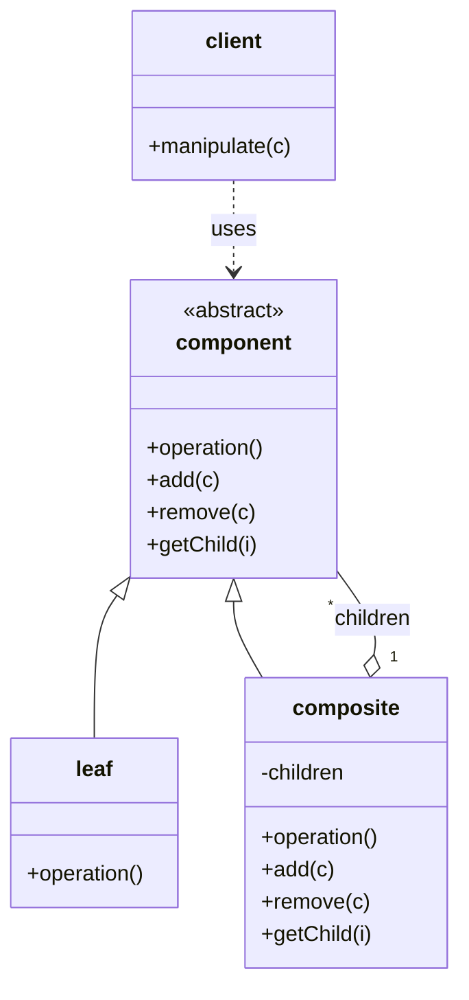
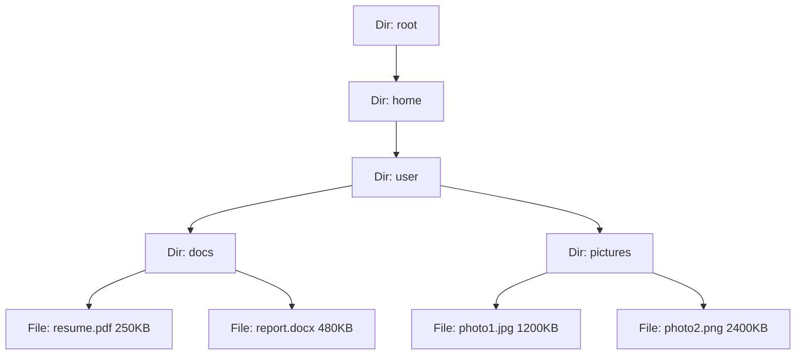
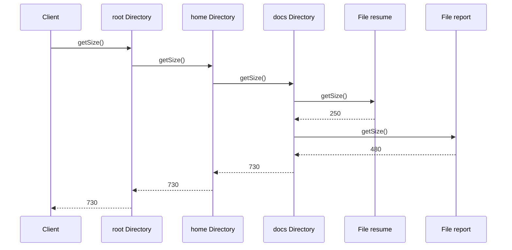
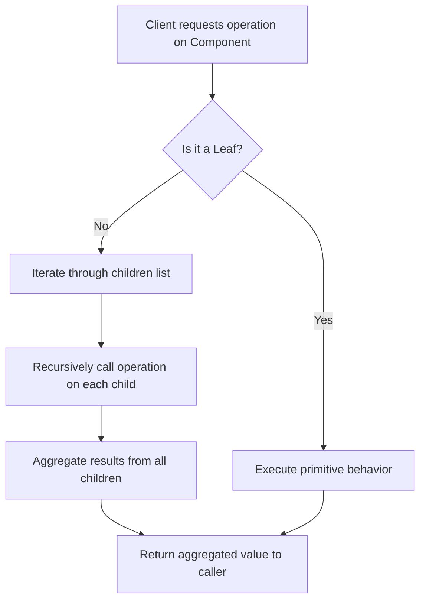

# Composite Pattern

<!-- SECTION_1_START -->
# 1. Core Technical Definition & Intuitive Overview

## 1.1 Formal Definition (Gang of Four)

> [!IMPORTANT]
> **Composite Pattern (GoF Definition):**
> *"Compose objects into tree structures to represent part-whole hierarchies. Composite lets clients treat individual objects (leaves) and compositions of objects (composites) uniformly."*
> — *Gamma, Helm, Johnson, Vlissides (1994)*

The **Composite Pattern** is a **Structural Design Pattern** that allows you to build complex, recursive, tree-like object structures where **both individual elements and groups of elements are handled through the same interface**. It is the canonical solution whenever your domain naturally exhibits a **recursive containment hierarchy** (e.g., a folder containing files *and* other folders).

## 1.2 Conceptual Analogy — The Matryoshka Doll of Objects

Imagine a **Russian Matryoshka doll**:

- The **outer doll** looks identical to the **inner doll** in shape and size — yet one contains the other.
- You can hold a single (leaf) doll, or you can hold a nested set of dolls. From the *outside*, both behave the same way: they are simply "dolls" you can place on a shelf.

The Composite Pattern works exactly like this. The **client** (the shelf owner) only knows one type of object — the **Component** — and never asks *"Are you a single thing, or a box of things?"*. The object itself is responsible for delegating the work to its children if it is a container.

> [!NOTE]
> **Real-World Recursive Examples:**
> * **File System:** A `File` is a leaf; a `Directory` is a composite of files *and* other directories.
> * **Organizational Chart:** An `Employee` is a leaf; a `Manager` (sub-tree) contains employees and other managers.
> * **GUI Toolkit:** A `Button` is a leaf; a `Panel` contains buttons, labels, and *other panels*.
> * **Arithmetic Expression:** A literal (e.g., `5`) is a leaf; an expression (e.g., `(5 + 3) * 2`) is a composite of operands and operators.

## 1.3 Key Participants — The Three Pillars

| # | Participant | Role | Type |
|---|------------|------|------|
| 1 | **Component** | Declares the *uniform interface* for all objects in the composition (both leaves and composites). | Abstract / Interface |
| 2 | **Leaf** | Represents *end objects* (no children). Implements the Component interface for primitive behavior. | Concrete Class |
| 3 | **Composite** | Stores child components and implements child-related operations (`add`, `remove`, `getChild`) from the Component interface. | Concrete Class |
| 4 | **Client** | Manipulates objects in the composition through the Component interface. | External Code |

> [!VISUALIZATION CONTROL]
> **Concept:** Recursive Tree Hierarchy of Composite Objects
> **GeoGebra / Desmos Input Equations:**
> * Root: $A = (0,\, 4)$ labeled "Composite:Root"
> * Children of root: $B = (-2,\, 2)$ labeled "Composite:Dir1", $C = (2,\, 2)$ labeled "Leaf:File1"
> * Grandchildren: $D = (-3,\, 0)$ labeled "Leaf:File2", $E = (-1,\, 0)$ labeled "Composite:SubDir", $F = (3,\, 0)$ labeled "Leaf:File3"
> * Great-grandchild: $G = (-1,\, -2)$ labeled "Leaf:File4"
> **Visual Description:** Observe how each node is treated identically through the `Component` interface, regardless of whether it is a leaf (no children) or a composite (with $n$ children). The recursion is visually apparent from the depth levels.

## 1.4 Why This Pattern Matters

In *Object-Oriented Design Frameworks* (OECST72A), the Composite pattern is one of the **most frequently tested structural patterns** because it embodies three foundational OO principles:

- **Recursive Composition** — the "has-a" relationship that *is* a "has-many" relationship.
- **Polymorphism at the Interface Level** — the client never type-checks `instanceof`.
- **Open/Closed Principle** — you can add *new* leaf or composite types without modifying client code.

<!-- SECTION_1_END -->

<!-- SECTION_2_START -->
# 2. Deep Theoretical Analysis & KTU High-Yield Reference Sheet

## 2.1 Anatomy of the Pattern — Step-by-Step Logic

The Composite Pattern is decomposed into the following structured decision flow:

1. **Identify a Part-Whole Hierarchy in your domain.**
   Look for entities where *"a whole is made of parts, and those parts may themselves be wholes"* (e.g., a directory of files and sub-directories).

2. **Define a common `Component` abstraction.**
   Declare an abstract class or interface (e.g., `Graphic`, `FileSystemNode`, `OrganizationUnit`) that exposes the **operations meaningful to both leaves and composites** (e.g., `draw()`, `getSize()`, `display()`).

3. **Implement the `Leaf` for primitive elements.**
   The Leaf has *no children*. It implements the Component interface by providing *concrete* behavior (e.g., a `Button` truly draws itself; a `File` truly returns its byte size).

4. **Implement the `Composite` for container elements.**
   The Composite maintains a *collection* (typically a list) of child Components. It implements child-management methods (`add`, `remove`, `getChild`) **and** delegates the Component operations to its children (e.g., `getSize()` sums up child sizes).

5. **The Client interacts *only* with the `Component` interface.**
   The Client never differentiates between Leaf and Composite. The same `component.display()` call works uniformly on both.

6. **Add the "Uniformity via Default Behavior" trick.**
   Optionally, define default no-op implementations of `add`/`remove` in the Component class. Leaves inherit the no-op (and *can* throw an `UnsupportedOperationException` for safety); Composites override them with real behavior.

## 2.2 KTU Reference Sheet — Key Elements Cheat Table

> [!IMPORTANT]
> Memorize the structure of this table — it is a **direct 7–10 mark** answer in KTU university exams.

| Element | Symbol / Method | Purpose | Default Behavior |
|---------|----------------|---------|------------------|
| **Component** | `operation()` | Uniform interface | Abstract |
| **Component** | `add(c)` | Add child (optional default) | No-op or exception |
| **Component** | `remove(c)` | Remove child (optional default) | No-op or exception |
| **Component** | `getChild(i)` | Access child by index (optional) | No-op or exception |
| **Leaf** | `operation()` | Concrete primitive behavior | Implemented |
| **Composite** | `children` (collection) | Stores child Components | `List<Component>` |
| **Composite** | `operation()` | Delegates to all children | Recursive call |

## 2.3 When to Use vs. When to Avoid

| **Use Composite When…** | **Avoid Composite When…** |
|------------------------|--------------------------|
| You need to represent *hierarchical* object structures. | Your domain is *flat* (no part-whole relationship). |
| You want clients to *ignore the difference* between compositions and individuals. | You need to *restrict* the children of a composite to only specific leaf types (use **Decorator** instead). |
| The structure is **recursive** and **deeply nested** (e.g., menus, trees). | The hierarchy is *shallow* (1–2 levels) — direct fields are simpler. |
| You want to apply operations **uniformly** across the tree (e.g., `render`, `calculate`, `serialize`). | The Component interface is **unstable** — too many operations differ between leaves and composites. |

## 2.4 Engineering Real-World Utility

The Composite Pattern is heavily used in **production-grade frameworks** because it solves a *structural* problem that recurs in nearly every large software system:

- **Java AWT/Swing** — `java.awt.Container` extends `java.awt.Component`; a Panel *is* a Component, and it contains other Components (recursive).
- **JavaScript DOM** — `Element` nodes can contain other `Element` nodes; the API is uniform.
- **XML/JSON Parsers** — `XmlElement` has child elements; the same `.getChild()` API is used recursively.
- **Linux File System (VFS layer)** — `inode` is the abstract `Component`; files are leaves, directories are composites.
- **UML Itself** — A `Package` contains `Class`es *and* other `Package`s.
- **Corporate Payroll Systems** — An `Organization` contains `Divisions`, which contain `Teams`, which contain `Employees`. Calculating total salary is one recursive `getSalary()` call.

> [!NOTE]
> In modern **Spring Framework**, the `BeanFactory` registry uses a Composite-like structure where one `BeanDefinition` may contain nested `BeanDefinition`s — and the same `getBean()` lookup recurses uniformly.

## 2.5 Trade-offs and Consequences

| **Advantages** | **Disadvantages** |
|----------------|-------------------|
| ✅ Defines class hierarchies of *primitive* and *composite* objects. | ❌ Can make the design **too general** — it is hard to restrict what can go into a composite. |
| ✅ Simplifies client code — treats all objects uniformly. | ❌ Type-safety is hard to enforce — runtime checks may be required. |
| ✅ Easy to add *new* component types (Open/Closed Principle). | ❌ Leaf operations vs. composite operations can **clutter** the Component interface. |
| ✅ Enables **recursive algorithms** elegantly (e.g., tree traversal, total computation). | ❌ Deep hierarchies can be hard to debug and visualize. |

<!-- SECTION_2_END -->

<!-- SECTION_3_START -->
# 3. Step-by-Step Implementation & Code Walkthrough

## 3.1 Canonical Example — File System Hierarchy

This example models a **file system** where files (leaves) and directories (composites) are accessed through a *single* uniform interface. This is the **classic GoF example** and the one most frequently asked in KTU exams.

### 3.1.1 Python Implementation (with Strict Type Hints)

```python
"""
Composite Pattern - File System Implementation
Module 3: Structural Design Patterns (OECST72A)
"""
from __future__ import annotations
from abc import ABC, abstractmethod
from typing import List, Optional


# ------------------------------------------------------------------
# STEP 1: Component (Abstract Base Class)
# ------------------------------------------------------------------
class FileSystemComponent(ABC):
    """
    The 'Component' participant.
    Declares the uniform interface for both File (Leaf) and
    Directory (Composite). Optional child-management methods
    are given SAFE no-op default implementations.
    """

    def __init__(self, name: str) -> None:
        if not isinstance(name, str) or not name.strip():
            raise ValueError("Component name must be a non-empty string.")
        self._name: str = name

    @abstractmethod
    def display(self, indent: int = 0) -> None:
        """Render the component structure (recursive for Composite)."""
        raise NotImplementedError

    @abstractmethod
    def get_size(self) -> int:
        """Return size in KB. Composite recurses into children."""
        raise NotImplementedError

    # ----- Optional child-management defaults (Leaf-safe) -----
    def add(self, component: FileSystemComponent) -> None:
        raise NotImplementedError(
            f"Cannot add to a leaf component: {self._name}"
        )

    def remove(self, component: FileSystemComponent) -> None:
        raise NotImplementedError(
            f"Cannot remove from a leaf component: {self._name}"
        )

    def get_child(self, index: int) -> Optional[FileSystemComponent]:
        raise NotImplementedError(
            f"Leaf has no children: {self._name}"
        )


# ------------------------------------------------------------------
# STEP 2: Leaf - represents a primitive (file)
# ------------------------------------------------------------------
class File(FileSystemComponent):
    """The 'Leaf' participant. Has NO children."""

    def __init__(self, name: str, size_kb: int) -> None:
        super().__init__(name)
        if size_kb < 0:
            raise ValueError("File size cannot be negative.")
        self._size_kb: int = size_kb

    def display(self, indent: int = 0) -> None:
        prefix: str = " " * indent
        print(f"{prefix}📄 File: {self._name} ({self._size_kb} KB)")

    def get_size(self) -> int:
        return self._size_kb


# ------------------------------------------------------------------
# STEP 3: Composite - represents a container (directory)
# ------------------------------------------------------------------
class Directory(FileSystemComponent):
    """The 'Composite' participant. Stores child components."""

    def __init__(self, name: str) -> None:
        super().__init__(name)
        self._children: List[FileSystemComponent] = []

    def add(self, component: FileSystemComponent) -> None:
        if component is None:
            raise ValueError("Cannot add a None component.")
        if component is self:
            raise ValueError("A directory cannot contain itself.")
        self._children.append(component)

    def remove(self, component: FileSystemComponent) -> None:
        if component in self._children:
            self._children.remove(component)
        else:
            raise ValueError(
                f"Component {component._name} not found in {self._name}"
            )

    def get_child(self, index: int) -> Optional[FileSystemComponent]:
        if 0 <= index < len(self._children):
            return self._children[index]
        return None

    def display(self, indent: int = 0) -> None:
        prefix: str = " " * indent
        print(f"{prefix}📁 Directory: {self._name}")
        for child in self._children:
            child.display(indent + 2)

    def get_size(self) -> int:
        total: int = 0
        for child in self._children:
            total += child.get_size()
        return total
```

### 3.1.2 Client Code (Demonstrating Uniform Treatment)

```python
# ------------------------------------------------------------------
# STEP 4: Client - manipulates objects uniformly
# ------------------------------------------------------------------
def main() -> None:
    # Build the file system tree
    root: Directory = Directory("root")
    home: Directory = Directory("home")
    user: Directory = Directory("user")

    docs: Directory = Directory("docs")
    pics: Directory = Directory("pictures")

    root.add(home)
    home.add(user)
    user.add(docs)
    user.add(pics)

    docs.add(File("resume.pdf", 250))
    docs.add(File("report.docx", 480))
    pics.add(File("photo1.jpg", 1200))
    pics.add(File("photo2.png", 2400))

    # Client treats ALL components through the SAME interface
    print("=== File System Hierarchy ===")
    root.display(indent=0)

    print(f"\n=== Total Size of 'root' ===")
    print(f"{root.get_size()} KB")

    # Bonus: uniform access on a single Leaf
    single_file: FileSystemComponent = File("notes.txt", 50)
    single_file.display()


if __name__ == "__main__":
    main()
```

### 3.1.3 Expected Output

```
=== File System Hierarchy ===
📁 Directory: root
  📁 Directory: home
    📁 Directory: user
      📁 Directory: docs
        📄 File: resume.pdf (250 KB)
        📄 File: report.docx (480 KB)
      📁 Directory: pictures
        📄 File: photo1.jpg (1200 KB)
        📄 File: photo2.png (2400 KB)

=== Total Size of 'root' ===
4330 KB
📄 File: notes.txt (50 KB)
```

## 3.2 Recursive Operation Derivation

The elegance of the Composite Pattern lies in the **recursive call** inside the Composite's `get_size()` method. Let us derive it symbolically for a general tree of depth $n$:

$$
\begin{aligned}
\text{size}(\text{leaf}) &= s_{\text{leaf}} \\[4pt]
\text{size}(\text{composite}) &= \sum_{i=1}^{k} \text{size}(\text{child}_i) \\[4pt]
\text{size}(\text{composite}) &= \text{size}(\text{child}_1) + \text{size}(\text{child}_2) + \cdots + \text{size}(\text{child}_k)
\end{aligned}
$$

For our example with **4 levels of nesting**, the recursion unfolds as:

$$
\begin{aligned}
\text{size}(\text{root}) &= \text{size}(\text{home}) \\[4pt]
&= \text{size}(\text{user}) \\[4pt]
&= \text{size}(\text{docs}) + \text{size}(\text{pics}) \\[4pt]
&= \big(250 + 480\big) + \big(1200 + 2400\big) \\[4pt]
&= 730 + 3600 = 4330 \text{ KB}
\end{aligned}
$$

> [!IMPORTANT]
> **Recursion Base Case:** A Leaf returns its *own* size directly — no recursion.
> **Recursion Recursive Case:** A Composite returns the *sum of sizes of all its children* — each child may itself be a Composite, causing deeper recursion.

## 3.3 Java Implementation (Alternate — for KTU Board Exams)

```java
// FileSystemComponent.java
public abstract class FileSystemComponent {
    protected String name;
    public FileSystemComponent(String name) { this.name = name; }
    public abstract void display(int indent);
    public abstract int getSize();
}

// File.java (Leaf)
public class File extends FileSystemComponent {
    private int sizeKb;
    public File(String name, int sizeKb) {
        super(name);
        this.sizeKb = sizeKb;
    }
    @Override
    public void display(int indent) {
        System.out.println(" ".repeat(indent) + "File: " + name
                           + " (" + sizeKb + " KB)");
    }
    @Override
    public int getSize() { return sizeKb; }
}

// Directory.java (Composite)
import java.util.ArrayList;
import java.util.List;

public class Directory extends FileSystemComponent {
    private List<FileSystemComponent> children = new ArrayList<>();
    public Directory(String name) { super(name); }
    public void add(FileSystemComponent c)    { children.add(c); }
    public void remove(FileSystemComponent c) { children.remove(c); }
    @Override
    public void display(int indent) {
        System.out.println(" ".repeat(indent) + "Dir: " + name);
        for (FileSystemComponent c : children) c.display(indent + 2);
    }
    @Override
    public int getSize() {
        int total = 0;
        for (FileSystemComponent c : children) total += c.getSize();
        return total;
    }
}
```

<!-- SECTION_3_END -->

<!-- SECTION_4_START -->
# 4. Structural Diagrams & Schematics

## 4.1 UML Class Diagram (GoF Standard)



**Reading the diagram:**

- The `component` is the abstract base class declaring the uniform interface.
- `leaf` and `composite` both **inherit** (`<|--`) from `component`.
- `composite` holds a **one-to-many** aggregation (`o--`) of `component` references — this is the **recursive** part.
- `client` only depends on the **abstract** `component` interface (Dependency, `..>`).

## 4.2 Object Tree — File System Instance



**Visual Reading:** Every node is of the same conceptual type `FileSystemComponent`. The client never inspects *"is this a leaf or a directory?"* — it simply calls `display()` or `getSize()` and lets the object decide what to do (delegate, recurse, or return its own value).

## 4.3 Sequence Diagram — Client Invoking Recursive Operation



**Reading the sequence:** The client makes *one* call (`getSize()`) on the root. The call *recursively* descends through composites, leaves return base values, and the result **bubbles up** to the client. This is the **uniform interface in action**.

## 4.4 Architectural Block Diagram — Decision Flow



<!-- SECTION_4_END -->

<!-- SECTION_5_START -->
# 5. KTU 2024 Scheme Examination Question Bank & Topic Recap

---

## 📘 Part A — Short Answer Questions (3 Marks Each)

### Question 1
> **[KTU University Exam – July 2024]**
> **CO1 | Remember**
> **Q: Define the Composite Design Pattern. List any three participants of the pattern and state their roles.**

**Model Answer (3 Marks — 1 + 1.5 + 0.5 split):**
*Composite Pattern composes objects into tree structures to represent part-whole hierarchies, allowing clients to treat individual objects and compositions uniformly. The three participants are:*
*(1) **Component** — declares the common interface for both leaves and composites; (2) **Leaf** — represents primitive objects with no children and implements primitive behavior; (3) **Composite** — stores child components and delegates operations to them through recursion.* *[1 Mark for definition, 1.5 Marks for participants, 0.5 Mark for roles.]*

---

### Question 2
> **[KTU University Exam – Dec 2023]**
> **CO1 | Understand**
> **Q: Explain the significance of the `Component` interface in the Composite pattern. Why is it said to provide "uniformity" to the client?**

**Model Answer (3 Marks — 1.5 + 1.5 split):**
*The `Component` interface is the **single point of contact** between the client and the object tree. It declares operations like `operation()`, `add()`, `remove()`, and `getChild()` that are **common to both Leaf and Composite** objects. It provides **uniformity** because the client code is written *only once* against the `Component` type — the same `component.operation()` call works for a `File` (leaf) and a `Directory` (composite) without any `instanceof` checks or type-casting. This embodies **polymorphism** and adheres to the **Open/Closed Principle**.*

---

## 📕 Part B — Long Answer Questions (14 Marks Each, Internal Choice)

### ⭐ Question A (Option 1)

> **[KTU University Exam – July 2024]**
> **CO1 / CO2 | Understand + Apply**

**(a) Draw the UML class diagram for the Composite Design Pattern. Explain the responsibilities of each participant with a real-world analogy.** **(7 Marks)**

**Model Solution:**

**UML Class Diagram — 3 Marks:**

| Element | Marks | Key Points |
|---------|-------|------------|
| Correctly drawing `Component` (abstract) with 4 methods | **1 Mark** | `operation()`, `add()`, `remove()`, `getChild()` |
| Correctly drawing `Leaf` class inheriting `Component` | **1 Mark** | Overrides `operation()` only |
| Correctly drawing `Composite` class with `children` aggregation | **1 Mark** | 1-to-many relationship to `Component` |

**Real-World Analogy & Responsibilities — 4 Marks:**

Consider a **company's organizational structure**:
- **Component (`Employee`)** — Uniform interface declaring `showDetails()` and `getSalary()`. *[1 Mark]*
- **Leaf (`IndividualContributor`)** — A regular employee with *no* subordinates. Implements `showDetails()` to print name/designation; `getSalary()` returns own salary. *[1 Mark]*
- **Composite (`Manager`)** — A manager *is an* employee but also *has* employees reporting to them. `showDetails()` prints the manager's name AND recursively calls `showDetails()` on each subordinate. `getSalary()` returns `ownSalary + Σ subordinates.getSalary()`. *[1 Mark]*
- **Client (`PayrollSystem`)** — Calls `getSalary()` on the **CEO** (a Composite) — and *recursively*, the entire company salary is computed. The Payroll code never asks *"Are you a manager?"*. *[1 Mark]*

---

**(b) Implement the Composite pattern in Python to model a drawing application where a `Graphic` can be a `Circle` (leaf) or a `Picture` (composite of many graphics). The client should be able to call `draw()` on a single graphic or a group of graphics uniformly.** **(7 Marks)**

**Model Solution:**

```python
from abc import ABC, abstractmethod
from typing import List

class Graphic(ABC):
    """Component - the uniform interface."""
    @abstractmethod
    def draw(self, indent: int = 0) -> None:
        pass

class Circle(Graphic):
    """Leaf - a primitive shape."""
    def __init__(self, x: int, y: int, radius: int) -> None:
        if radius <= 0:
            raise ValueError("Radius must be positive.")
        self.x: int = x
        self.y: int = y
        self.r: int = radius

    def draw(self, indent: int = 0) -> None:
        print(" " * indent + f"Circle at ({self.x},{self.y}) r={self.r}")

class Picture(Graphic):
    """Composite - a group of graphics."""
    def __init__(self, name: str) -> None:
        self.name: str = name
        self._children: List[Graphic] = []

    def add(self, g: Graphic) -> None:
        if g is None:
            raise ValueError("Cannot add None.")
        self._children.append(g)

    def remove(self, g: Graphic) -> None:
        self._children.remove(g)

    def draw(self, indent: int = 0) -> None:
        print(" " * indent + f"Picture: {self.name}")
        for g in self._children:
            g.draw(indent + 2)

# ----- Client Code -----
def main() -> None:
    c1: Graphic = Circle(10, 20, 5)
    c2: Graphic = Circle(30, 40, 8)

    pic: Picture = Picture("MyDrawing")
    pic.add(c1)
    pic.add(c2)

    # Uniform interface: same draw() call on Leaf and Composite
    print("--- Drawing individual Circle ---")
    c1.draw()
    print("--- Drawing Picture (composite) ---")
    pic.draw()

if __name__ == "__main__":
    main()
```

**Valuation Key (7 Marks):**
| Element | Marks |
|---------|-------|
| `Graphic` abstract class with `draw()` | **1 Mark** |
| `Circle` (Leaf) implementation with `draw()` | **1.5 Marks** |
| `Picture` (Composite) with `_children` list | **1 Mark** |
| `add()` / `remove()` methods on Composite | **1 Mark** |
| Correct delegation: `draw()` loops over children | **1.5 Marks** |
| Client code demonstrating uniform access | **1 Mark** |

---

### ⭐ Question B (Option 2)

> **[KTU University Exam – Dec 2023]**
> **CO2 / CO3 | Analyze + Apply**

**(a) Differentiate between the Composite pattern and the Decorator pattern. In what specific scenario would you prefer one over the other? Justify with an example.** **(7 Marks)**

**Model Solution (Tabular Comparison — 6 Marks + 1 Mark for Example):**

| Aspect | Composite Pattern | Decorator Pattern |
|--------|-------------------|-------------------|
| **Intent** | Compose objects into **tree structures** to represent part-whole hierarchies. | **Add new responsibilities** to objects dynamically without subclassing. |
| **Structure** | Recursive tree (composite has *many* components). | Wrapper chain (decorator wraps *one* component). |
| **Purpose** | Represents **structural relationships** (is-part-of). | Adds **behavioral extensions** (is-a + has-a). |
| **Children Count** | Composite holds *zero or more* children. | Decorator wraps *exactly one* component. |
| **Typical Use** | File systems, GUI containers, org charts. | Adding scrollbars to windows, encryption to streams. |
| **Object Count Effect** | Represents a *group* of objects. | Represents an *enhanced single* object. |

**When to prefer which (1 Mark):**
*Use **Composite** when your goal is to represent a **hierarchy of "is-a-part-of"** relationships (e.g., a menu containing sub-menus and items). Use **Decorator** when your goal is to **add functionality** to a *single* object at runtime (e.g., adding a border, then a scrollbar, to a text field — each layer is a Decorator).*

---

**(b) A university has a hierarchical structure: a `University` contains `Colleges`, each `College` contains `Departments`, and each `Department` has `Professors`. Model this using the Composite pattern in Java/Python. Write a complete program that prints the full hierarchy and calculates the total number of professors in the university.** **(7 Marks)**

**Model Solution (Python — for brevity; Java is structurally identical):**

```python
from abc import ABC, abstractmethod
from typing import List

class AcademicUnit(ABC):
    """Component: common interface for all units."""
    @abstractmethod
    def display(self, indent: int = 0) -> None:
        pass
    @abstractmethod
    def count_professors(self) -> int:
        pass

class Professor(AcademicUnit):
    """Leaf: an individual professor."""
    def __init__(self, name: str) -> None:
        self.name: str = name
    def display(self, indent: int = 0) -> None:
        print(" " * indent + f"Prof. {self.name}")
    def count_professors(self) -> int:
        return 1

class Department(AcademicUnit):
    """Composite: contains professors (and optionally other units)."""
    def __init__(self, name: str) -> None:
        self.name: str = name
        self._members: List[AcademicUnit] = []
    def add(self, u: AcademicUnit) -> None:
        self._members.append(u)
    def display(self, indent: int = 0) -> None:
        print(" " * indent + f"Department: {self.name}")
        for m in self._members:
            m.display(indent + 2)
    def count_professors(self) -> int:
        return sum(m.count_professors() for m in self._members)

class College(AcademicUnit):
    """Composite: contains departments."""
    def __init__(self, name: str) -> None:
        self.name: str = name
        self._units: List[AcademicUnit] = []
    def add(self, u: AcademicUnit) -> None:
        self._units.append(u)
    def display(self, indent: int = 0) -> None:
        print(" " * indent + f"College: {self.name}")
        for u in self._units:
            u.display(indent + 2)
    def count_professors(self) -> int:
        return sum(u.count_professors() for u in self._units)

class University(AcademicUnit):
    """Composite: the root — contains colleges."""
    def __init__(self, name: str) -> None:
        self.name: str = name
        self._colleges: List[AcademicUnit] = []
    def add(self, c: AcademicUnit) -> None:
        self._colleges.append(c)
    def display(self, indent: int = 0) -> None:
        print(" " * indent + f"University: {self.name}")
        for c in self._colleges:
            c.display(indent + 2)
    def count_professors(self) -> int:
        return sum(c.count_professors() for c in self._colleges)


# -------- Client Code --------
def main() -> None:
    cse: Department = Department("CSE")
    cse.add(Professor("Anand"))
    cse.add(Professor("Beena"))
    ece: Department = Department("ECE")
    ece.add(Professor("Chitra"))

    kct: College = College("KCT")
    kct.add(cse)
    kct.add(ece)

    mit: College = College("MIT")
    mit.add(Department("Mech"))

    uni: University = University("APJ KTU")
    uni.add(kct)
    uni.add(mit)

    print("=== University Hierarchy ===")
    uni.display()
    print(f"\nTotal Professors: {uni.count_professors()}")

if __name__ == "__main__":
    main()
```

**Valuation Key (7 Marks):**
| Element | Marks |
|---------|-------|
| Correctly defining `AcademicUnit` (Component) as abstract | **1 Mark** |
| `Professor` (Leaf) with `count_professors() == 1` | **1 Mark** |
| `Department`, `College`, `University` as Composite classes with `add()` | **2 Marks** |
| Correct recursive aggregation in `count_professors()` using `sum()` | **1.5 Marks** |
| Client code building the tree and calling `display()` + `count_professors()` | **1 Mark** |
| Output trace and final total | **0.5 Mark** |

---

> [!WARNING]
> **🚨 KTU Examiner's Valuation Warning — Common Pitfalls**
> 1. **Do not confuse Composite with Decorator.** Composite represents *tree structures* (one-to-many); Decorator is a *wrapper chain* (one-to-one). Many students write Decorator code when asked for Composite. **2 Marks lost** in part (a) comparisons.
> 2. **Always state the `Component` interface explicitly.** Skipping the abstract `Component` class and jumping straight to `Leaf` and `Composite` will cost **1–2 Marks** — it is the *uniformity* that defines the pattern.
> 3. **In recursion questions, write the base case and the recursive case.** If `count_professors()` for the Leaf is not explicitly returning `1`, marks are deducted.
> 4. **Avoid raw `print` only — show the trace.** KTU evaluators want a *visible output* or a *symbolic step-by-step derivation* (like the `sum` unfolding we did above).
> 5. **Watch for `instanceof` in client code.** If your client code uses `if isinstance(x, Composite)`, you have *violated* the pattern. **-1 Mark penalty**.

---

## 🎯 Topic Recap & Important Things to Remember

> [!NOTE]
> Use this section as your **final-day revision checklist** before the KTU university exam.

- ✅ **Intent:** Compose objects into **tree structures** to represent part-whole hierarchies; treat leaves and composites **uniformly**.
- ✅ **GoF Category:** **Structural Design Pattern**.
- ✅ **Three Core Participants:** **Component** (abstract interface), **Leaf** (primitive), **Composite** (container of children).
- ✅ **Key Methods:** `operation()`, `add()`, `remove()`, `getChild()`.
- ✅ **Recursion Magic:** The Composite's `operation()` **delegates** to each child; if the child is itself a Composite, recursion continues. Leaves return their own value.
- ✅ **Uniformity Test:** Client code should *never* need `instanceof` or `getClass()` to differentiate Leaf vs. Composite.
- ✅ **Default Behavior Trick:** Define `add()`/`remove()` in the abstract `Component` to throw `UnsupportedOperationException` (Java) / `NotImplementedError` (Python); Composite overrides them.
- ✅ **Canonical Example:** **File System** — `File` is a Leaf, `Directory` is a Composite.
- ✅ **Real-World Examples:** GUI toolkits (AWT/Swing), DOM (HTML/XML), org charts, VFS, arithmetic expression trees.
- ✅ **Compare With:** **Decorator** (one-to-one wrapping) vs. Composite (one-to-many hierarchy). **Flyweight** (shares intrinsic state) is sometimes used inside Composite for memory optimization.
- ✅ **Open/Closed Principle:** New leaf/composite types can be added **without modifying** client code.
- ✅ **Trade-off to Remember:** The Composite interface can become **overly general** (a.k.a. "god interface") if too many operations are added that are meaningless for leaves.
- ✅ **Recursion Formula (memorize this):** $\text{size}(\text{Composite}) = \sum_{i=1}^{k} \text{size}(\text{Child}_i)$ and $\text{size}(\text{Leaf}) = s_{\text{self}}$.
- ✅ **UML Cue for the Examiner:** Always show `Composite "1" o-- "*" Component : children` — this is the *defining* UML signature of the pattern.
- ✅ **Java-Specific Reminder:** Use `List<Component> children` in Java; in Python use `List[FileSystemComponent]`.
- ✅ **Common Mistake to Avoid:** Do **not** add a child-management method to the Leaf class. The Leaf should *not* have `add()`/`remove()` semantics — it should either inherit a default exception or be designed without them entirely.

<!-- SECTION_5_END -->
