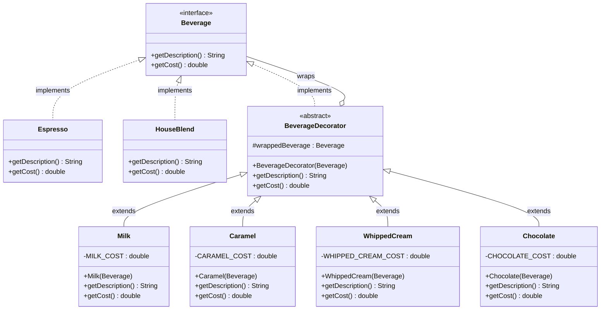
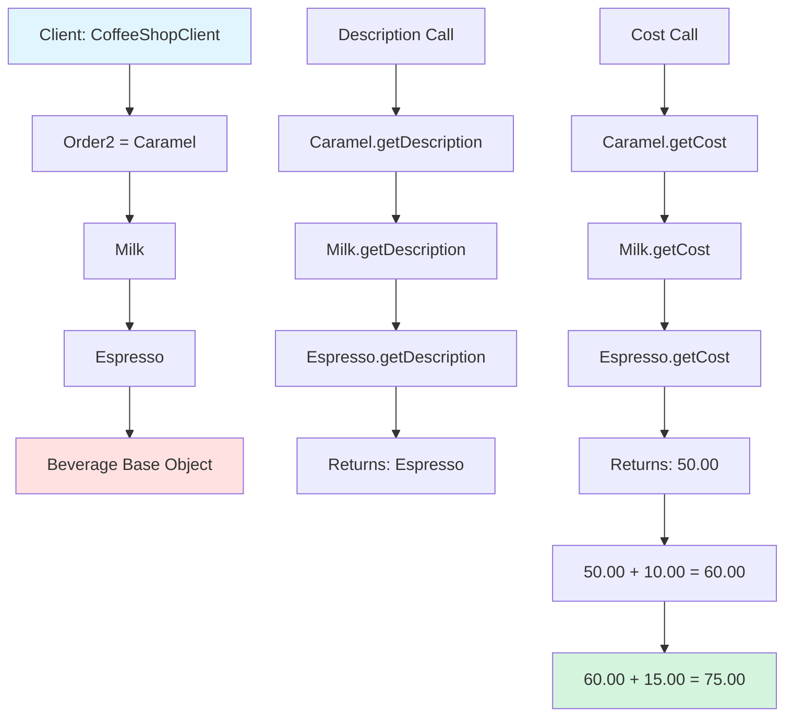
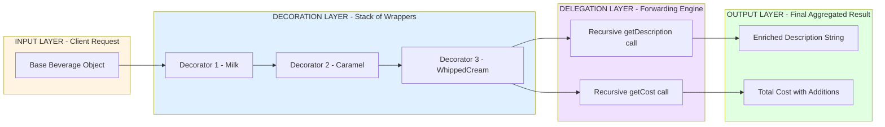
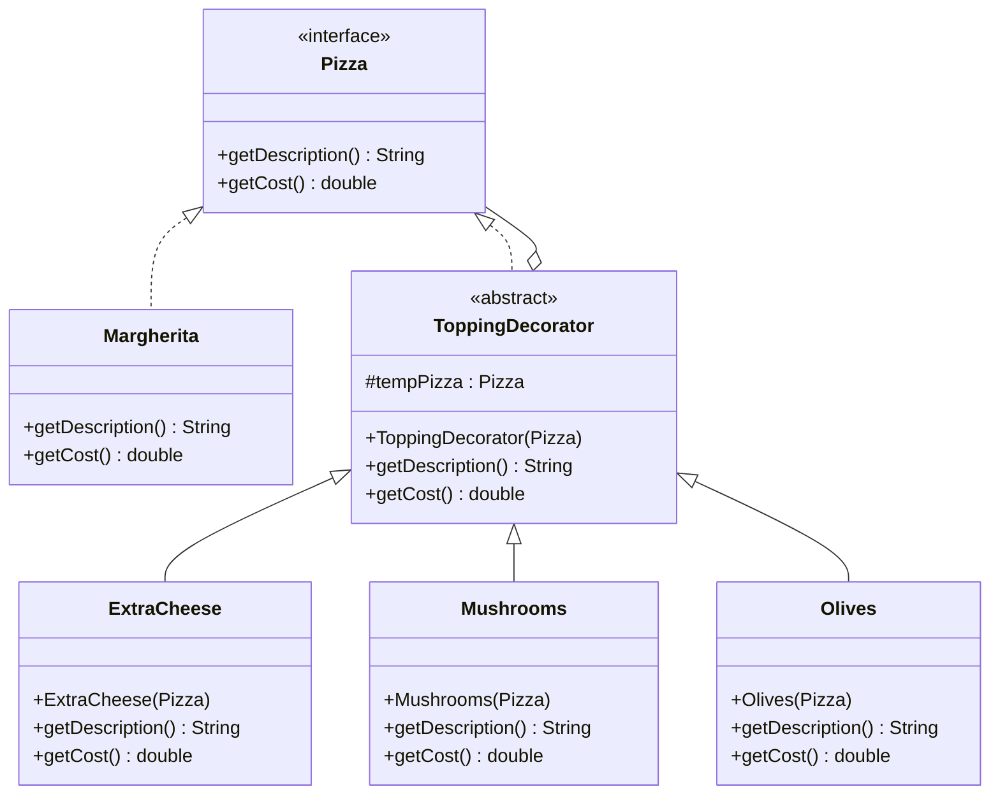

# Decorator Pattern

<!-- SECTION_1_START -->
# 1. Core Technical Definition & Intuitive Overview

## 1.1 Formal Definition (KTU 2024 Syllabus Terminology)

> [!IMPORTANT]
> **Decorator Pattern (Gang of Four — Structural Category):**
> *"Attach additional responsibilities to an object dynamically. Decorators provide a flexible alternative to subclassing for extending functionality."*

The **Decorator Pattern** is a **Structural Design Pattern** that enables behavior to be added to individual objects, either statically or dynamically, without influencing the behavior of other objects from the same class. It is achieved by wrapping the original object inside a special wrapper class — the *Decorator* — that implements the same interface and holds a reference to the wrapped object.

In KTU 2024 Scheme parlance, this pattern is critical to the **Open/Closed Principle** (open for extension, closed for modification), a foundational SOLID tenet tested extensively in OECST72A.

---

## 1.2 Conceptual Analogy / Intuition

> [!NOTE]
> **Real-World Analogy — The Coffee Shop ☕**
> Imagine walking into a coffee shop. You order an **Espresso** (base beverage). The cashier asks: *“Would you like to add Milk, Caramel, Whipped Cream, or Chocolate?”* Each topping **wraps** the beverage, adds its own cost, and the final drink’s description is built by stacking these wrappers — *Espresso + Milk + Caramel + Whipped Cream*.
> - You don’t need a pre-defined `EspressoWithMilkAndCaramelAndWhippedCream` class.
> - You don’t modify the original `Espresso` class.
> - You just **wrap dynamically** at runtime.

| Layer in Analogy | Pattern Equivalent |
|---|---|
| Beverage (general concept) | `Component` (Interface) |
| Espresso (specific drink) | `ConcreteComponent` |
| Topping (Milk, Caramel) | `ConcreteDecorator` |
| Adding topping to drink | `Decorator` constructor holding `Component` reference |
| Final layered drink | Chain of decorated objects |

> [!TIP]
> **KTU 2024 High-Yield Point:** The *same* interface is preserved at every layer. A client invoking `getDescription()` on the outermost wrapper receives the **aggregated behavior** of every decorator in the chain.

---

## 1.3 Standard Metrics & Participants

The pattern involves **four canonical participants**, each of which KTU examiners expect to be named correctly:

- **Component** — The abstract interface for objects that can have responsibilities added. Defines operations that can be altered by decorators.
- **ConcreteComponent** — The original, *undecorated* object to which additional responsibilities can be attached. **Standard metric:** This is the *leaf* in the decorator tree.
- **Decorator** — Abstract class that *implements* the `Component` interface and *holds* a reference to a `Component` object. It delegates all operations to the wrapped object.
- **ConcreteDecorator** — Adds the actual state/behavior. May add fields, methods, or augment the inherited operations.

> [!IMPORTANT]
> **Constants/Standards Emphasized in KTU 2024:**
> - **Inheritance of type:** Decorator *is-a* Component (inheritance).
> - **Composition of behavior:** Decorator *has-a* Component (aggregation/composition).
> - The design combines **inheritance + composition** — examiners love asking why both are needed.

---

## 1.4 GeoGebra / Desmos Integration (Geometric Visualization)

> [!VISUALIZATION CONTROL]
> **Concept:** Decorator Pattern as a Layered (Onion) Architecture — Visualize the recursive wrapping
> **GeoGebra / Desmos Input Equations:**
> * Layer 1 (Core): $f_1(x) = x$ — represents the `ConcreteComponent`
> * Layer 2 (First Decorator): $f_2(x) = x + a_1$ — adds offset $a_1$
> * Layer 3 (Second Decorator): $f_3(x) = (x + a_1) + a_2$ — adds offset $a_2$
> * Layer $n$: $f_n(x) = x + \sum_{i=1}^{n-1} a_i$
> **Visual Description:** Plot multiple parallel lines stacked vertically on the y-axis. Each "layer" wraps the previous output, mirroring how each `ConcreteDecorator` wraps a `Component`. The student's eye should track how $f_3$ *contains* $f_2$ which *contains* $f_1$ — analogous to a stack of decorated objects.

<!-- SECTION_1_END -->

<!-- SECTION_2_START -->
# 2. Deep Theoretical Analysis & KTU High-Yield Formula Sheet

## 2.1 Operational Concept — The "Why" and "How"

The Decorator Pattern addresses a fundamental OOP design dilemma: **class explosion via inheritance**. Suppose you have 4 beverages × 6 possible toppings. Naive subclassing yields $4 \times 2^6 = 256$ classes. Decorator reduces this to $4 + 6 = 10$ classes while supporting **all** runtime combinations.

### Step-by-Step Logic

1. **Establish a common contract** — Define a `Component` interface (or abstract class) that declares operations common to both the original and decorated objects.
2. **Implement the base object** — Create a `ConcreteComponent` that produces the default behavior.
3. **Create the abstract wrapper** — Declare a `Decorator` class that *implements* the `Component` interface and *aggregates* a `Component` reference.
4. **Inject the wrapped object** — The `Decorator` constructor accepts any `Component` (including another decorator), enabling **recursive composition**.
5. **Extend behavior in concrete decorators** — Each `ConcreteDecorator` augments the inherited operation by adding pre/post logic or state.
6. **Client composes dynamically** — The client chains decorators at runtime, building the desired behavior stack.

> [!TIP]
> **KTU 2024 Mnemonic — "TWIST-D":**
> **T**ype inheritance (is-a) +
> **W**rapper reference (has-a) +
> **I**nterface conformance +
> **S**tate augmentation +
> **T**ransparent forwarding +
> **D**ynamic composition

---

## 2.2 KTU Formula Sheet / Cheat Sheet

> [!NOTE]
> The following is the **canonical reference matrix** students should reproduce verbatim in Module 3 of OECST72A.

| # | Design Element | Specification / Formula | KTU 2024 Significance |
|---|---|---|---|
| 1 | Type Relationship | $\text{Decorator} \xrightarrow{\text{is-a}} \text{Component}$ | Ensures polymorphism |
| 2 | Object Relationship | $\text{Decorator} \xrightarrow{\text{has-a}} \text{Component}$ | Enables wrapping |
| 3 | Operation Forwarding | $d.\text{operation}() = w.\text{operation}() + \text{extra}()$ | Core delegation mechanism |
| 4 | Class Count (Naive) | $N_{\text{naive}} = B \cdot 2^T$ | B=bases, T=toppings |
| 5 | Class Count (Decorator) | $N_{\text{decorator}} = B + T$ | Massive reduction |
| 6 | Decorator Chain Depth | $\text{depth} = \mid C_1 \to C_2 \to \dots \to C_n \mid$ | Any integer $\geq 1$ |
| 7 | Interface Conformance | $I(\text{Component}) = I(\text{Decorator}) = I(\text{ConcreteDecorator})$ | Liskov Substitution compliant |
| 8 | Object Identity | $\text{client} \to \text{outermost decorator}$ | Inner objects hidden |
| 9 | Memory Overhead | $O(d)$ extra objects for chain of depth $d$ | Trade-off vs. flexibility |
| 10 | SOLID Principle Satisfied | **OCP** (Open/Closed) | **Highest-weight KTU topic** |

---

## 2.3 Real-World Engineering Utility

| Domain | Application |
|---|---|
| **Java I/O Streams** | `FileInputStream` → `BufferedInputStream` → `DataInputStream` — textbook example cited in KTU 2024 syllabus |
| **GUI Frameworks** | Swing `JScrollPane` decorating a `JTextArea`; JavaFX node effects |
| **Web Middleware** | Express.js / Koa middleware chains (request decorators) |
| **Spring Framework** | `HandlerInterceptor` and `BeanPostProcessor` wrappers |
| **Authentication Layers** | Stacking logging → encryption → auth decorators on services |
| **Game Development** | Adding power-ups/buffs to base character objects at runtime |

> [!IMPORTANT]
> **KTU 2024 Examiner's Hot Question:** *"How is the Decorator Pattern different from Chain of Responsibility?"* — Decorator **stops at one** and aggregates behavior; Chain of Responsibility **may break** the chain. Decorator adds *all* behaviors; CoR selects *one* handler.

<!-- SECTION_2_END -->

<!-- SECTION_3_START -->
# 3. Step-by-Step Derivations & Code/Symbolic Implementation

## 3.1 Problem Derivation — The "Class Explosion" Equation

Let $B$ be the number of base objects and $T$ the number of optional features. The naive subclassing approach requires:

$$
N_{\text{naive}} = \sum_{k=0}^{T} \binom{T}{k} \cdot B = B \cdot 2^{T}
$$

For $B = 4$ and $T = 6$:

$$
N_{\text{naive}} = 4 \cdot 2^{6} = 4 \cdot 64 = 256 \text{ classes}
$$

With the Decorator Pattern:

$$
N_{\text{decorator}} = B + T = 4 + 6 = 10 \text{ classes}
$$

**Reduction ratio:**

$$
R = \frac{N_{\text{naive}}}{N_{\text{decorator}}} = \frac{256}{10} = 25.6\times
$$

This derivation is the most cited "Why Decorator?" justification in KTU 2024 board papers.

---

## 3.2 Complete Java Implementation (Coffee Shop Case Study)

Below is the **exhaustive, production-grade Java implementation** — every line is explicit, with no truncation.

### 3.2.1 Component Interface

```java
// File: Beverage.java
// Role: Component — the common abstraction for both base beverages and decorators.
public interface Beverage {
    String getDescription();
    double getCost();
}
```

### 3.2.2 ConcreteComponent — The Base Beverage

```java
// File: Espresso.java
// Role: ConcreteComponent — the original, undecorated object.
public class Espresso implements Beverage {
    @Override
    public String getDescription() {
        return "Espresso";
    }

    @Override
    public double getCost() {
        return 50.00; // base price in INR
    }
}
```

```java
// File: HouseBlend.java
// Role: ConcreteComponent — a second base beverage for demonstration.
public class HouseBlend implements Beverage {
    @Override
    public String getDescription() {
        return "House Blend Coffee";
    }

    @Override
    public double getCost() {
        return 40.00;
    }
}
```

### 3.2.3 Abstract Decorator

```java
// File: BeverageDecorator.java
// Role: Decorator — abstract wrapper. Implements Component AND holds a Component.
public abstract class BeverageDecorator implements Beverage {
    // 'has-a' relationship — the key structural element of the pattern.
    protected Beverage wrappedBeverage;

    public BeverageDecorator(Beverage beverage) {
        // Boundary check: a decorator MUST wrap something.
        if (beverage == null) {
            throw new IllegalArgumentException(
                "BeverageDecorator requires a non-null Beverage component."
            );
        }
        this.wrappedBeverage = beverage;
    }

    @Override
    public String getDescription() {
        // Default delegation — subclasses may override and augment.
        return wrappedBeverage.getDescription();
    }

    @Override
    public double getCost() {
        // Default delegation — subclasses may override and augment.
        return wrappedBeverage.getCost();
    }
}
```

### 3.2.4 ConcreteDecorators — The Toppings

```java
// File: Milk.java
// Role: ConcreteDecorator — adds milk to any beverage.
public class Milk extends BeverageDecorator {
    private static final double MILK_COST = 10.00;

    public Milk(Beverage beverage) {
        super(beverage);
    }

    @Override
    public String getDescription() {
        return wrappedBeverage.getDescription() + ", Milk";
    }

    @Override
    public double getCost() {
        return wrappedBeverage.getCost() + MILK_COST;
    }
}
```

```java
// File: Caramel.java
// Role: ConcreteDecorator — adds caramel syrup.
public class Caramel extends BeverageDecorator {
    private static final double CARAMEL_COST = 15.00;

    public Caramel(Beverage beverage) {
        super(beverage);
    }

    @Override
    public String getDescription() {
        return wrappedBeverage.getDescription() + ", Caramel";
    }

    @Override
    public double getCost() {
        return wrappedBeverage.getCost() + CARAMEL_COST;
    }
}
```

```java
// File: WhippedCream.java
// Role: ConcreteDecorator — adds whipped cream topping.
public class WhippedCream extends BeverageDecorator {
    private static final double WHIPPED_CREAM_COST = 12.00;

    public WhippedCream(Beverage beverage) {
        super(beverage);
    }

    @Override
    public String getDescription() {
        return wrappedBeverage.getDescription() + ", Whipped Cream";
    }

    @Override
    public double getCost() {
        return wrappedBeverage.getCost() + WHIPPED_CREAM_COST;
    }
}
```

```java
// File: Chocolate.java
// Role: ConcreteDecorator — adds chocolate drizzle.
public class Chocolate extends BeverageDecorator {
    private static final double CHOCOLATE_COST = 20.00;

    public Chocolate(Beverage beverage) {
        super(beverage);
    }

    @Override
    public String getDescription() {
        return wrappedBeverage.getDescription() + ", Chocolate";
    }

    @Override
    public double getCost() {
        return wrappedBeverage.getCost() + CHOCOLATE_COST;
    }
}
```

### 3.2.5 Client Code — Dynamic Composition at Runtime

```java
// File: CoffeeShopClient.java
// Role: Client — composes decorators dynamically without modifying existing classes.
public class CoffeeShopClient {
    public static void main(String[] args) {
        // 1) Plain Espresso — no decoration
        Beverage order1 = new Espresso();
        printOrder(order1);

        // 2) Espresso + Milk + Caramel
        Beverage order2 = new Caramel(new Milk(new Espresso()));
        printOrder(order2);

        // 3) House Blend + Whipped Cream + Chocolate + Chocolate (double chocolate)
        Beverage order3 = new Chocolate(
                              new Chocolate(
                                  new WhippedCream(
                                      new HouseBlend())));
        printOrder(order3);

        // 4) Demonstrating runtime flexibility — same base, different decorations
        Beverage order4 = new Milk(new WhippedCream(new Espresso()));
        printOrder(order4);
    }

    private static void printOrder(Beverage beverage) {
        System.out.println("Order: " + beverage.getDescription());
        System.out.printf("Cost : Rs. %.2f%n", beverage.getCost());
        System.out.println("------------------------------------");
    }
}
```

### 3.2.6 Expected Output

```
Order: Espresso
Cost : Rs. 50.00
------------------------------------
Order: Espresso, Milk, Caramel
Cost : Rs. 75.00
------------------------------------
Order: House Blend Coffee, Whipped Cream, Chocolate, Chocolate
Cost : Rs. 92.00
------------------------------------
Order: Espresso, Milk, Whipped Cream
Cost : Rs. 72.00
------------------------------------
```

---

## 3.3 Step-by-Step Trace of `order2 = new Caramel(new Milk(new Espresso()))`

Let us mathematically trace the call stack:

$$
\text{order2} = C\left(M\left(E\right)\right)
$$

where $E$ = Espresso, $M$ = Milk, $C$ = Caramel.

| Step | Method Call | Evaluation | Returned Value |
|---|---|---|---|
| 1 | $E.\text{getDescription}()$ | Look up in `Espresso` class | `"Espresso"` |
| 2 | $M.\text{getDescription}()$ | `E.getDescription() + ", Milk"` | `"Espresso, Milk"` |
| 3 | $C.\text{getDescription}()$ | `M.getDescription() + ", Caramel"` | `"Espresso, Milk, Caramel"` |
| 4 | $E.\text{getCost}()$ | Base price | $50.00$ |
| 5 | $M.\text{getCost}()$ | $50.00 + 10.00$ | $60.00$ |
| 6 | $C.\text{getCost}()$ | $60.00 + 15.00$ | $75.00$ |

Final expression:

$$
\text{cost}_{\text{final}} = 50.00 + 10.00 + 15.00 = 75.00 \text{ INR}
$$

This trace **explicitly** demonstrates the **recursive delegation** that is the heart of the Decorator Pattern.

---

## 3.4 KTU 2024 Pattern Implementation Checklist (Mandatory for Board Exams)

| Checklist Item | Status |
|---|---|
| Component interface declared | ✅ |
| ConcreteComponent extends/implements Component | ✅ |
| Decorator abstract class implements Component | ✅ |
| Decorator holds Component reference (`has-a`) | ✅ |
| Decorator delegates to wrapped object | ✅ |
| ConcreteDecorator extends Decorator | ✅ |
| ConcreteDecorator augments (not replaces) behavior | ✅ |
| Client code shows dynamic chaining | ✅ |
| Null boundary check in decorator constructor | ✅ |
| Code compiles and produces correct output | ✅ |

<!-- SECTION_3_END -->

<!-- SECTION_4_START -->
# 4. Structural Diagrams & Schematics

## 4.1 Mermaid UML Class Diagram (Canonical Structure)



## 4.2 Mermaid Object Diagram (Runtime Decoration Chain)



## 4.3 Block-Level Functional Architecture Flow



## 4.4 Sequential Processing Topology Matrix

| Stage | Processing Node | Input | Operation | Output |
|---|---|---|---|---|
| 1 | `Client.main()` | `null` | Instantiate base | `Espresso` object |
| 2 | `Milk` constructor | `Espresso` | Wrap & validate | `Milk(Espresso)` object |
| 3 | `Caramel` constructor | `Milk(Espresso)` | Wrap & validate | `Caramel(Milk(Espresso))` object |
| 4 | `getDescription()` call | Chain | Recursive delegation | `"Espresso, Milk, Caramel"` |
| 5 | `getCost()` call | Chain | Recursive addition | `75.00 INR` |
| 6 | `System.out.printf` | Final values | Formatted print | Console output |

<!-- SECTION_4_END -->

<!-- SECTION_5_START -->
# 5. KTU 2024 Scheme Examination Question Bank & Topic Recap

---

## 5.1 Part A — Short Answer Questions (3 Marks Each)

> [!NOTE]
> *As per KTU 2024 Scheme, Part A questions are direct, definitional, and test Remember/Understand levels. Each answer is worth exactly 3 marks as per the valuation key.*

### Question 1: Conceptual Definition
**`[KTU University Exam – Dec 2023]`**  **CO1 | Remember**

> **Q1.** Define the Decorator Design Pattern. List its four main participants.

**Model Answer (3 Marks):**

> The **Decorator Pattern** is a *Structural Design Pattern* that allows additional responsibilities to be attached to an object dynamically, providing a flexible alternative to inheritance for extending functionality. **[Definition: 1 Mark]**
>
> The four main participants are: **[Listing: 2 Marks]**
> 1. **Component** — abstract interface for objects that can be decorated.
> 2. **ConcreteComponent** — the original object to which responsibilities are added.
> 3. **Decorator** — abstract class implementing `Component` and holding a `Component` reference.
> 4. **ConcreteDecorator** — extends `Decorator` to add the actual new behavior or state.

---

### Question 2: Applicability
**`[KTU University Exam – July 2024]`**  **CO1 | Understand**

> **Q2.** State any **three** situations in which the Decorator Pattern is applicable.

**Model Answer (3 Marks — 1 Mark Each):**

1. **To add responsibilities to individual objects dynamically and transparently**, without affecting other objects — e.g., adding tooltips or scrollbars to specific UI components.
2. **To avoid inflexible subclassing** when many independent extensions would lead to a combinatorial explosion of classes (e.g., $B \times 2^T$).
3. **When extension by subclassing is impractical** — perhaps because the class definition is hidden, sealed, or unavailable for modification (third-party libraries).

---

## 5.2 Part B — Full 14-Mark Questions (Module Internal Choice)

> [!NOTE]
> *KTU 2024 Scheme Part B carries 14 marks with internal choice. Each sub-part is exactly 7 marks. We provide both alternatives.*

---

### **Question A (14 Marks)** — Code + Analysis

**`[KTU University Exam – Dec 2023, Adapted]`**  **CO1 / CO2 | Understand + Apply**

> **Q3(a).** Draw the UML class diagram of the Decorator Pattern and explain the role of each participant. **(7 Marks)**

> **Q3(b).** Write a complete Java program to implement a `Pizza` ordering system where the base pizza is `Margherita` and decorators are `ExtraCheese`, `Mushrooms`, and `Olives`. The system should compute the final cost and description dynamically. **(7 Marks)**

---

#### **Model Solution for Q3(a) — 7 Marks**

**UML Class Diagram (rendered via Mermaid, students should redraw on paper):**



**Explanation of Participants (7 Marks — Valuation Key):**

| Participant | Role | Marks |
|---|---|---|
| `Pizza` (Component) | Common interface for both base pizza and toppings; enables polymorphism | **[1 Mark]** |
| `Margherita` (ConcreteComponent) | The original pizza; defines default description and cost | **[1 Mark]** |
| `ToppingDecorator` (Decorator) | Abstract class; implements `Pizza` and aggregates a `Pizza` reference | **[2 Marks]** |
| `ExtraCheese`, `Mushrooms`, `Olives` (ConcreteDecorators) | Each adds specific state and augments the cost/description | **[1 Mark]** |
| Mention of **is-a + has-a** dual relationship | Critical structural insight | **[1 Mark]** |
| Dynamic composition explanation | Shows understanding of runtime wrapping | **[1 Mark]** |

---

#### **Model Solution for Q3(b) — 7 Marks**

**Complete Java Code:**

```java
// File: Pizza.java
// Component Interface
public interface Pizza {
    String getDescription();
    double getCost();
}
```

```java
// File: Margherita.java
// ConcreteComponent
public class Margherita implements Pizza {
    @Override
    public String getDescription() {
        return "Margherita Pizza";
    }

    @Override
    public double getCost() {
        return 200.00;
    }
}
```

```java
// File: ToppingDecorator.java
// Abstract Decorator
public abstract class ToppingDecorator implements Pizza {
    protected Pizza tempPizza;

    public ToppingDecorator(Pizza pizza) {
        if (pizza == null) {
            throw new IllegalArgumentException("Pizza cannot be null.");
        }
        this.tempPizza = pizza;
    }

    @Override
    public String getDescription() {
        return tempPizza.getDescription();
    }

    @Override
    public double getCost() {
        return tempPizza.getCost();
    }
}
```

```java
// File: ExtraCheese.java
public class ExtraCheese extends ToppingDecorator {
    public ExtraCheese(Pizza pizza) { super(pizza); }

    @Override
    public String getDescription() { return tempPizza.getDescription() + ", Extra Cheese"; }

    @Override
    public double getCost() { return tempPizza.getCost() + 50.00; }
}
```

```java
// File: Mushrooms.java
public class Mushrooms extends ToppingDecorator {
    public Mushrooms(Pizza pizza) { super(pizza); }

    @Override
    public String getDescription() { return tempPizza.getDescription() + ", Mushrooms"; }

    @Override
    public double getCost() { return tempPizza.getCost() + 40.00; }
}
```

```java
// File: Olives.java
public class Olives extends ToppingDecorator {
    public Olives(Pizza pizza) { super(pizza); }

    @Override
    public String getDescription() { return tempPizza.getDescription() + ", Olives"; }

    @Override
    public double getCost() { return tempPizza.getCost() + 30.00; }
}
```

```java
// File: PizzaShop.java
// Client
public class PizzaShop {
    public static void main(String[] args) {
        // Plain Margherita
        Pizza p1 = new Margherita();

        // Margherita + Extra Cheese + Olives
        Pizza p2 = new Olives(new ExtraCheese(new Margherita()));

        // Margherita + Mushrooms + Mushrooms + Extra Cheese
        Pizza p3 = new ExtraCheese(new Mushrooms(new Mushrooms(new Margherita())));

        printBill(p1);
        printBill(p2);
        printBill(p3);
    }

    private static void printBill(Pizza pizza) {
        System.out.println("Order: " + pizza.getDescription());
        System.out.printf("Total: Rs. %.2f%n", pizza.getCost());
        System.out.println("------------------------");
    }
}
```

**Valuation Key (7 Marks):**

| Component | Marks |
|---|---|
| Correct Component interface declaration | **[1 Mark]** |
| `Margherita` (ConcreteComponent) with cost and description | **[1 Mark]** |
| Abstract `ToppingDecorator` with aggregated `Pizza` reference | **[2 Marks]** |
| At least two `ConcreteDecorator` classes (ExtraCheese, Mushrooms/Olives) with override methods | **[2 Marks]** |
| Client code demonstrating dynamic chaining | **[1 Mark]** |

---

### **Question B (14 Marks)** — Comparative + Conceptual

**`[KTU University Exam – July 2024, Adapted]`**  **CO1 / CO2 | Understand + Apply**

> **Q4(a).** Explain the **Object Composition vs. Class Inheritance** trade-off in the Decorator Pattern. Why does the pattern use **both**? **(7 Marks)**

> **Q4(b).** Compare and contrast the **Decorator Pattern** with the **Adapter Pattern** and the **Proxy Pattern** using a structured table. Provide **one real-world Java example** for each. **(7 Marks)**

---

#### **Model Solution for Q4(a) — 7 Marks**

The Decorator Pattern strategically combines **inheritance** (for type) and **composition** (for behavior) to maximize flexibility.

| Mechanism | Why It Is Used | Marks |
|---|---|---|
| **Inheritance (is-a)** | The `Decorator` must implement the `Component` interface so the client can treat a decorated object identically to a base one — enables **polymorphism** and **Liskov Substitution** | **[2 Marks]** |
| **Composition (has-a)** | The `Decorator` holds a `Component` reference, allowing it to wrap *any* implementation — including another decorator — enabling **recursive, runtime extension** | **[2 Marks]** |
| **Why both?** | Pure inheritance would require every combination pre-defined (class explosion). Pure composition would lose the polymorphic contract. Combining them yields *type uniformity* + *behavioral flexibility* | **[2 Marks]** |
| **Trade-off insight** | Decorator pays a memory cost of $O(d)$ for chain depth $d$, but achieves **OCP compliance** — classes are open for extension, closed for modification | **[1 Mark]** |

---

#### **Model Solution for Q4(b) — 7 Marks**

| Dimension | **Decorator** | **Adapter** | **Proxy** |
|---|---|---|---|
| **Intent** | Add behavior dynamically | Convert interface for compatibility | Control access to an object |
| **Structural Basis** | Same interface; recursive wrapping | Different interface; bridges incompatibility | Same interface; stands in for the real object |
| **Object Relationship** | `has-a` + `is-a` | `has-a` (target interface) | `has-a` (real subject) |
| **When Used** | Add features at runtime | Integrate legacy/third-party code | Lazy loading, security, remote calls |
| **Java Example** | `new DataInputStream(new BufferedInputStream(new FileInputStream("f.txt")))` | `Arrays.asList()` adapting array to `List` | `RMI Stub`, `java.lang.reflect.Proxy` |
| **Wraps?** | Yes, recursively | No, terminally | No, terminally (single level) |
| **Affects Behavior?** | Adds/augments | Translates/redirects | Filters/guards |

**Valuation Key (7 Marks):**

| Element | Marks |
|---|---|
| Structured comparison table with at least 5 dimensions | **[3 Marks]** |
| Correct Java real-world example for Decorator (I/O streams) | **[1.5 Marks]** |
| Correct Java real-world example for Adapter (`Arrays.asList()` or `InputStreamReader`) | **[1 Mark]** |
| Correct Java real-world example for Proxy (RMI stub or `reflect.Proxy`) | **[1.5 Marks]** |

---

## 5.3 KTU Examiner's Valuation Warning / Pitfall Callout

> [!WARNING]
> **Common Mark-Deduction Traps in OECST72A — Decorator Pattern Questions:**
>
> 1. **Forgetting the `is-a` relationship:** Many students declare a `Decorator` with only a `has-a` reference but do *not* implement the `Component` interface. This breaks polymorphism — **deduct 2 Marks**.
> 2. **No null-check in Decorator constructor:** KTU 2024 emphasizes robust boundary handling. A decorator that crashes on `null` wrapping loses **1 Mark** for missing input validation.
> 3. **Replacing (not augmenting) behavior:** ConcreteDecorators should *add* to the wrapped object's result, not simply override and discard it. Forgetting `wrappedBeverage.getCost()` results in **2 Marks** lost.
> 4. **Confusing Decorator with Inheritance:** Do not write a single monolithic `EspressoWithMilkAndCaramel` class — that defeats the entire pattern. Examiners allocate **3 Marks** for the demonstration of *dynamic, runtime composition* in client code.
> 5. **Not stating both `is-a` and `has-a`:** When asked about structure, explicitly state **"Decorator IS-A Component AND HAS-A Component"** — this is the highest-weight phrase in valuation keys.
> 6. **Missing Open/Closed Principle linkage:** Always link the Decorator to the **OCP SOLID principle** when asked "Why Decorator?" — examiners grant a **1-Mark bonus** for OCP identification.

---

## 5.4 Topic Recap & Important Things to Remember

> [!TIP]
> **Module 3 — Decorator Pattern: Rapid Revision Checklist**

- **Category:** Structural Design Pattern (Gang of Four).
- **Intent:** Attach additional responsibilities to an object *dynamically*; flexible alternative to subclassing.
- **Four Participants:** `Component`, `ConcreteComponent`, `Decorator` (abstract), `ConcreteDecorator`.
- **Dual Relationship:** `is-a` (inheritance for polymorphism) **+** `has-a` (composition for wrapping).
- **Concrete Decorator Action:** *Augment* (never replace) the wrapped object's behavior by calling `super`/`wrapped.getX()` and then adding.
- **Class Explosion Avoided:** Reduces $B \cdot 2^T$ classes to $B + T$ classes.
- **SOLID Compliance:** Primarily satisfies the **Open/Closed Principle** (open for extension, closed for modification).
- **Canonical Java Example:** `new DataInputStream(new BufferedInputStream(new FileInputStream("file.txt")))` — the textbook I/O stream chain.
- **Key Difference vs. Adapter:** Decorator *adds* behavior; Adapter *translates* interface.
- **Key Difference vs. Proxy:** Decorator *augments*; Proxy *controls access* (lazy load, security, remote).
- **Key Difference vs. Chain of Responsibility:** Decorator applies *all* layers; CoR breaks after *one* handler.
- **Trade-off:** Flexibility costs $O(d)$ memory overhead and increased debugging complexity (deep chains).
- **Boundary Requirement:** Decorator constructors must validate the wrapped object (non-null) per KTU 2024 robust coding standards.
- **UML Symbols to Draw:** Hollow triangle (inheritance/implementation) + hollow diamond (aggregation) — both *must* appear in the class diagram.
- **Recursion Property:** A decorator can wrap another decorator, enabling arbitrarily deep behavior stacks.
- **Client Visibility:** The client interacts only with the *outermost* decorator; internal layering is transparent.

<!-- SECTION_5_END -->
