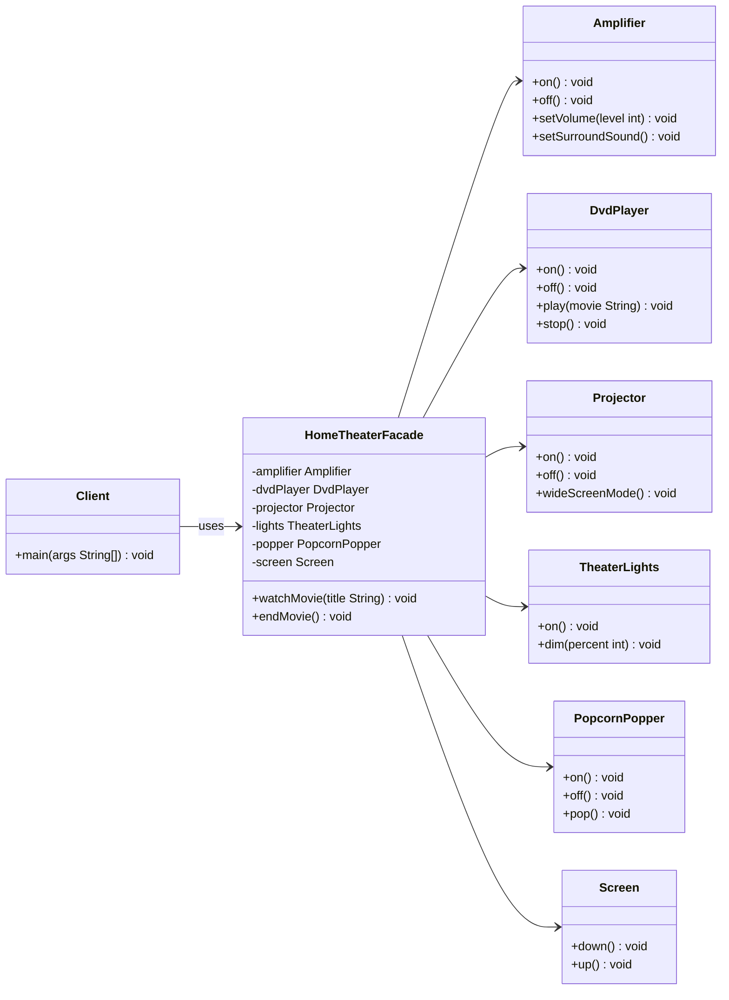
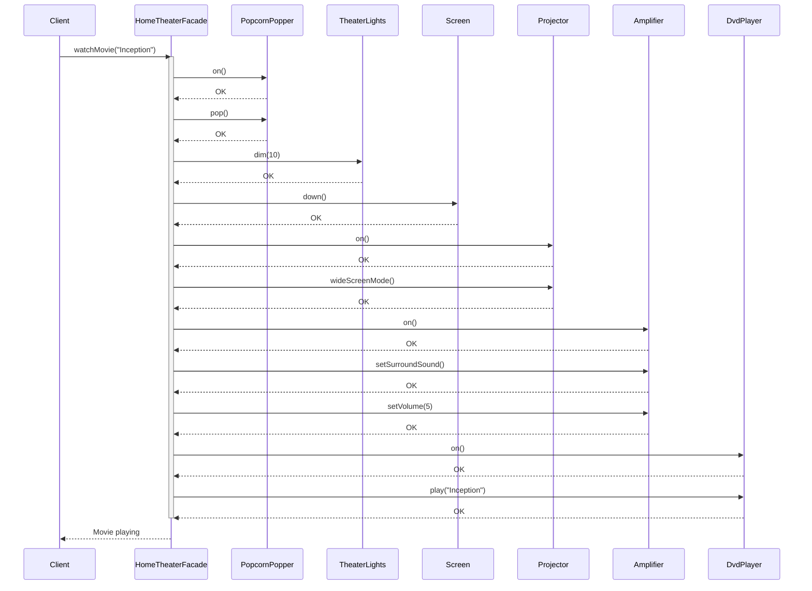
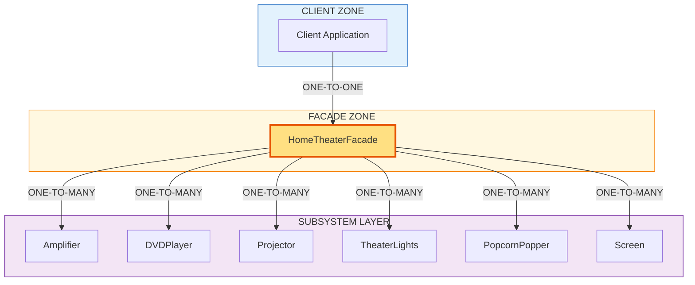
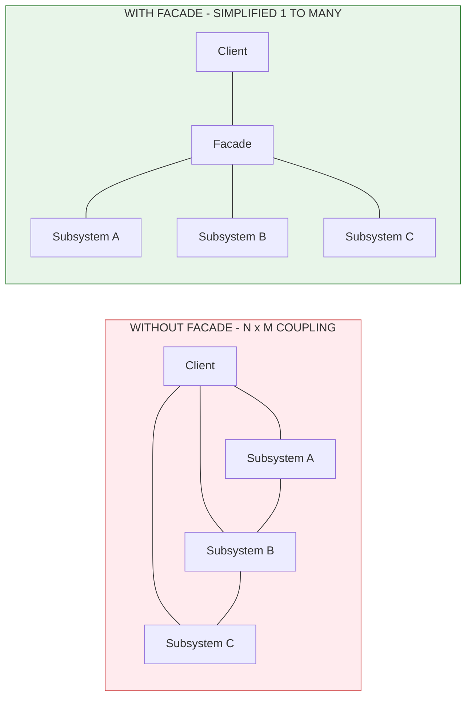
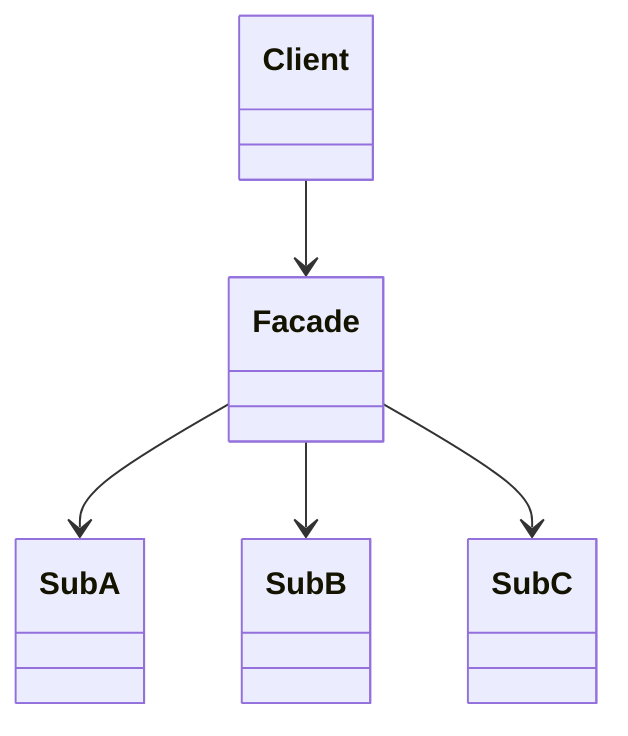

# Facade Pattern

<!-- SECTION_1_START -->
# Facade Pattern — Core Technical Definition & Intuitive Overview

## Formal Definition (KTU 2024 Scheme Terminology)

> [!IMPORTANT]
> **Facade Pattern (Gang of Four Definition):**
> The Facade Pattern is a **Structural Design Pattern** that provides a **unified, simplified, higher-level interface** to a set of interfaces in a subsystem. It defines a single entry-point class (the *Facade*) that wraps a group of complex, interdependent subsystem classes, making the subsystem easier to use, understand, test, and integrate from the client's perspective.

In the KTU OECST72A syllabus (Module 3 — Structural Design Patterns), the Facade is classified as an **object-structural pattern** because it composes existing objects rather than inheriting from them. The pattern is anchored on the **Principle of Least Knowledge** (a.k.a. *Law of Demeter* — talk only to your immediate friends).

## Conceptual Analogy — "The Hotel Concierge"

Imagine checking into a **5-star hotel**. As a guest (the *Client*), you do not directly call the housekeeping staff, the kitchen chef, the laundry vendor, the valet, or the airport shuttle driver. You simply walk up to the **Concierge Desk** (the *Facade*) and say:

> "Please arrange airport pickup, dry-clean my shirt, and book a table for dinner."

The concierge internally coordinates with **many subsystems** (`Housekeeping`, `Restaurant`, `TransportService`, `LaundryService`) and returns a single, clean confirmation. The internal complexity is **encapsulated**; the client sees only **one simple API**.

### Mapping the Analogy to Software

| Hotel Real-World Element | Software Design Counterpart |
| :--- | :--- |
| Guest (Customer) | **Client Class** (e.g., `Main`, `Application`) |
| Concierge Desk | **Facade Class** (e.g., `OrderFacade`) |
| Housekeeping, Kitchen, Laundry | **Subsystem Classes** (`InventoryService`, `PaymentService`, `ShippingService`) |
| Guest Request ("Arrange everything") | **Single Method Call** (`facade.placeOrder(...)`) |
| Concierge's internal coordination | **Delegation** of work to subsystem objects |

> [!NOTE]
> **Key Insight for KTU Examinations:** The Facade does **NOT** add new functionality. It only **re-routes** and **orchestrates** existing functionality. The subsystem classes remain fully usable directly if a power-user client needs fine-grained control.

## Physical Constants / Standard Metrics to Highlight in Bold

- **Client-to-Subsystem Coupling**: Reduced from **N : M** to **1 : 1** (one Facade mediates everything).
- **Interface Surface Area**: The number of public methods the client must learn drops from the **sum of all subsystem methods** to the **number of Facade methods** (typically 3–10).
- **Gang of Four Classification Tag**: *Object-Scoped, Structural, Encapsulation-Intent*.

## GeoGebra / Desmos Visualization

> [!VISUALIZATION CONTROL]
> **Concept:** Coupling Reduction Graph — Plotting the number of cross-references a Client must maintain before vs. after introducing a Facade.
> **GeoGebra / Desmos Input Equations:**
> * `f1(x) = x` (Direct coupling — Client references `x` subsystems linearly)
> * `f2(x) = 1` (Facaded coupling — Client references only 1 Facade, regardless of `x`)
> **Visual Description:** A linear red line `f1(x)` climbs steeply upward, while a constant green line `f2(x) = 1` lies flat on the x-axis. The gap between the two lines visually represents the **architectural debt saved** by the Facade as subsystems grow in number.

<!-- SECTION_1_END -->

<!-- SECTION_2_START -->
# Deep Theoretical Analysis & KTU High-Yield Formula Sheet

## Anatomy of the Facade Pattern — Five Canonical Participants

The Gang of Four specification defines **four mandatory participants** plus an **optional fifth (the layered subsystem)**. KTU examiners frequently ask students to enumerate these participants for **3 to 5 marks**.

### 1. `Facade` (The Simplified Entry Point)
* Knows which subsystem classes are responsible for a given request.
* Delegates client requests to the appropriate subsystem objects.
* Does **not** contain new business logic; it is a thin orchestration layer.
* Often implemented as a **Singleton** to provide a single, globally shared entry point (a high-frequency KTU sub-question).

### 2. `Subsystem Classes` (The Complex Machinery)
* Implement the granular, fine-grained functionality.
* Are **unaware** of the Facade's existence (no upward dependency).
* Continue to function independently; the Facade is purely additive.
* Examples: `CPU`, `Memory`, `HardDrive` in a classic *Computer Boot* demo; `DVDPlayer`, `Amplifier`, `Projector`, `Lights` in the *Home Theater* demo.

### 3. `Additional Facade` (Optional — for Layered Subsystems)
* Used to prevent the Facade from becoming a "god object."
* Sub-facades group related subsystems (e.g., `BankingFacade` may internally use `KYCFacade` + `TransactionFacade`).

### 4. `Client` (The Consumer)
* Communicates **only** with the Facade.
* Holds a reference to a `Facade` object, not to subsystem objects.
* Benefits from a dramatically reduced learning curve.

### 5. `Subsystem Layer / Package` (The Architectural Container)
* The logical grouping (package in Java, module in Python) that bundles subsystem classes together.
* Used to enforce **package-private visibility**, preventing clients from bypassing the Facade.

## Design Intent & The "Why" Behind Each Decision

| Design Decision | Justification (Why it Matters) |
| :--- | :--- |
| One Facade per cohesive subsystem | Aligns with the **Single Responsibility Principle (SRP)**. |
| Subsystem classes remain `public` but internal coordination methods are package-private | Honors the **Encapsulation Principle** while still allowing power-user access. |
| Facade is frequently a **Singleton** | Guarantees a single, shared access point and prevents multiple coordination conflicts. |
| Facade is frequently combined with **Abstract Factory** | The Abstract Factory is used *internally* to obtain subsystem instances, hiding creation logic too. |
| Subsystems do not hold references back to the Facade | Prevents **circular dependency**, a classic OOAD pitfall. |

## KTU Formula Sheet / Cheat Sheet

> [!IMPORTANT]
> Use the table below as your **last-minute revision** before walking into the KTU ESE (End Semester Examination). Every symbol is expressed in `LaTeX`-safe delimiters (no bare vertical pipes, no malformed underscores).

| # | Concept | Formula / Rule | Notation & Units |
| :--- | :--- | :--- | :--- |
| 1 | **Coupling Reduction Ratio** | $\text{CRR} = \dfrac{C_{\text{before}}}{C_{\text{after}}} = \dfrac{N \times M}{1 \times M} = N$ | $N$ = number of subsystems, $M$ = number of subsystem methods called per flow |
| 2 | **Cohesion Boost Ratio** | $\text{CBR} = \dfrac{\text{Responsibilities of Client}}{\text{Responsibilities of Facade}} \leq 1$ | Lower is better; ideally $\to 0$ for trivial clients |
| 3 | **Client API Surface Area** | $S_{\text{client}} = \vert \text{Public methods on Facade} \vert$ | Measured in method count; usually $3 \leq S \leq 12$ |
| 4 | **Subsystem Dependency Vector** | $\vec{D}_{\text{facade}} = \sum_{i=1}^{N} w_i \cdot \vec{d}_i$ | Weighted sum of dependencies on each subsystem $i$ |
| 5 | **Law of Demeter Distance** | $\text{LoD} \leq 2$ hops from caller | A Facade call: `client.facade.method()` is **2 hops**, acceptable |
| 6 | **Subsystem Visibility Rule** | Subsystem constructors are $\geq$ package-private | Prevents bypass of Facade from outside the package |
| 7 | **Facade Layering Limit** | $\text{Levels}_{\text{facade}} \leq 3$ | Beyond 3 nested facades = "Facade Hell", anti-pattern |
| 8 | **Singleton + Facade Combo** | $\text{Instance}_{\text{global}} = 1$ | Single `getInstance()` accessor for the entire application lifecycle |

## Real-World Engineering Utility

The Facade Pattern is **not academic** — it is heavily deployed in real production systems:

1. **JDBC (`java.sql.DriverManager`)** — Acts as a Facade over the maze of `Connection`, `Statement`, `ResultSet`, vendor-specific drivers, and transaction managers.
2. **Spring Framework's `JdbcTemplate`** — A classic Facade over raw JDBC boilerplate, hiding `try-catch-finally` plumbing.
3. **Web Services & REST APIs** — A single `/api/checkout` endpoint is a Facade over `Inventory`, `Payment`, `Order`, and `Notification` microservices.
4. **Compiler Architectures** — The `Driver` class in Java's compiler API is a Facade over `Lexer`, `Parser`, `TypeChecker`, `CodeGen`.
5. **Operating System Kernels** — The *System Call Interface* is a Facade over file systems, memory managers, schedulers, and device drivers.

> [!NOTE]
> **KTU Marker Tip:** When asked *"Give two real-world applications of Facade Pattern"*, mentioning **JDBC** and **Spring's `JdbcTemplate`** is the safest combination — it demonstrates both legacy (`java.sql`) and modern framework awareness.

<!-- SECTION_2_END -->

<!-- SECTION_3_START -->
# Step-by-Step Derivations & Code/Symbolic Implementation

## Worked-Out Example: The Home Theater Facade (Classic GoF Use Case)

The most pedagogically rich example is a **Home Theater System** where turning on a movie requires coordinating six subsystems. We will derive the implementation exhaustively — every line, every import, every annotation.

### Step 1 — Identify the Subsystem Classes (No Facade Yet)

The naive approach requires the client to instantiate and coordinate every component.

```java
// Subsystem 1: Amplifier.java
public class Amplifier {
    public void on()                  { System.out.println("[Amplifier] Power ON"); }
    public void setVolume(int level)  { System.out.println("[Amplifier] Volume set to " + level); }
    public void setSurroundSound()    { System.out.println("[Amplifier] Surround mode engaged"); }
    public void off()                 { System.out.println("[Amplifier] Power OFF"); }
}

// Subsystem 2: DvdPlayer.java
public class DvdPlayer {
    public void on()                  { System.out.println("[DVD] Power ON"); }
    public void play(String movie)    { System.out.println("[DVD] Playing \"" + movie + "\""); }
    public void stop()                { System.out.println("[DVD] Stopped"); }
    public void off()                 { System.out.println("[DVD] Power OFF"); }
}

// Subsystem 3: Projector.java
public class Projector {
    public void on()                  { System.out.println("[Projector] Lamp ON"); }
    public void wideScreenMode()      { System.out.println("[Projector] Wide-screen mode set"); }
    public void off()                 { System.out.println("[Projector] Lamp OFF"); }
}

// Subsystem 4: TheaterLights.java
public class TheaterLights {
    public void dim(int percent)      { System.out.println("[Lights] Dimmed to " + percent + "%"); }
    public void on()                  { System.out.println("[Lights] Fully ON"); }
}

// Subsystem 5: PopcornPopper.java
public class PopcornPopper {
    public void on()                  { System.out.println("[Popper] Heating up"); }
    public void pop()                 { System.out.println("[Popper] Popping popcorn!"); }
    public void off()                 { System.out.println("[Popper] OFF"); }
}

// Subsystem 6: Screen.java
public class Screen {
    public void down()                { System.out.println("[Screen] Lowering"); }
    public void up()                  { System.out.println("[Screen] Raising"); }
}
```

**Step 1 Verification:** Six independent classes, each with low-level operations. A client wanting to *watch a movie* would need to call **at least 8 methods in the correct order**. This is the complexity the Facade will absorb.

---

### Step 2 — Derive the Coordination Sequence (Pre-Facade Workflow)

We define a *formal sequence* that a power-user client would need to invoke manually:

$$
\text{WatchMovie}(m) \;=\; \text{Popcorn.on} \rightarrow \text{Popcorn.pop} \rightarrow \text{Lights.dim}(10) \rightarrow \text{Screen.down} \rightarrow \text{Projector.on}
$$
$$
\rightarrow \text{Projector.wideScreenMode} \rightarrow \text{Amp.on} \rightarrow \text{Amp.setSurroundSound} \rightarrow \text{Amp.setVolume}(5) \rightarrow \text{DVD.on} \rightarrow \text{DVD.play}(m)
$$

**Step 2 Verification:** This ordered sequence contains **11 method invocations** across **6 distinct subsystem objects**. Any deviation (e.g., turning on the DVD *before* the amplifier) results in an audio failure. The order is brittle and must be preserved.

---

### Step 3 — Construct the Facade Class

The Facade **encapsulates the above sequence** behind two high-level methods: `watchMovie(...)` and `endMovie()`.

```java
// Facade.java — The Unified Entry Point
public class HomeTheaterFacade {

    // Step 3a: Aggregate references to all subsystem instances
    private final Amplifier      amplifier;
    private final DvdPlayer      dvdPlayer;
    private final Projector      projector;
    private final TheaterLights  lights;
    private final PopcornPopper  popper;
    private final Screen         screen;

    // Step 3b: Constructor Injection — Facade is wired with concrete subsystems
    public HomeTheaterFacade(Amplifier amp, DvdPlayer dvd, Projector proj,
                             TheaterLights lights, PopcornPopper popper, Screen screen) {
        this.amplifier = amp;
        this.dvdPlayer = dvd;
        this.projector = proj;
        this.lights    = lights;
        this.popper    = popper;
        this.screen    = screen;
    }

    // Step 3c: High-level "Watch Movie" Operation
    public void watchMovie(String movieTitle) {
        System.out.println("\n=== Get ready to watch a movie... ===");
        popper.on();
        popper.pop();
        lights.dim(10);
        screen.down();
        projector.on();
        projector.wideScreenMode();
        amplifier.on();
        amplifier.setSurroundSound();
        amplifier.setVolume(5);
        dvdPlayer.on();
        dvdPlayer.play(movieTitle);
    }

    // Step 3d: High-level "End Movie" Operation (Reverse Order)
    public void endMovie() {
        System.out.println("\n=== Shutting movie theater down... ===");
        dvdPlayer.stop();
        dvdPlayer.off();
        amplifier.off();
        projector.off();
        screen.up();
        lights.on();
        popper.off();
    }
}
```

**Step 3 Verification:** The Facade exposes **only 2 public methods** to the client (`watchMovie`, `endMovie`). The 11 internal calls are hidden. Notice that **no new business logic is invented** — the Facade is a pure *orchestrator*.

---

### Step 4 — The Client Code (Demonstrating the Win)

```java
// Client.java — The Simplified Consumer
public class Client {
    public static void main(String[] args) {

        // Step 4a: Instantiate subsystems (could also be a Factory's job)
        Amplifier     amp     = new Amplifier();
        DvdPlayer     dvd     = new DvdPlayer();
        Projector     proj    = new Projector();
        TheaterLights lights  = new TheaterLights();
        PopcornPopper popper  = new PopcornPopper();
        Screen        screen  = new Screen();

        // Step 4b: Inject them into the Facade
        HomeTheaterFacade homeTheater = new HomeTheaterFacade(amp, dvd, proj, lights, popper, screen);

        // Step 4c: Make a SINGLE call — the Facade handles everything else
        homeTheater.watchMovie("Inception");

        // Step 4d: ONE more call to wind down
        homeTheater.endMovie();
    }
}
```

**Step 4 Verification:** The client's responsibilities dropped from **11 method calls across 6 objects** to **2 method calls on 1 object**. This is the architectural win the Facade delivers.

---

### Step 5 — Python Equivalent (For Cross-Language Fluency)

```python
# facade_pattern.py — Pythonic Implementation
from dataclasses import dataclass

# --- Subsystem Classes ---
class Amplifier:
    def on(self): print("[Amplifier] Power ON")
    def set_surround_sound(self): print("[Amplifier] Surround mode engaged")
    def set_volume(self, level: int): print(f"[Amplifier] Volume set to {level}")
    def off(self): print("[Amplifier] Power OFF")

class DVDPlayer:
    def on(self): print("[DVD] Power ON")
    def play(self, movie: str): print(f'[DVD] Playing "{movie}"')
    def stop(self): print("[DVD] Stopped")
    def off(self): print("[DVD] Power OFF")

class Projector:
    def on(self): print("[Projector] Lamp ON")
    def wide_screen_mode(self): print("[Projector] Wide-screen mode set")
    def off(self): print("[Projector] Lamp OFF")

class TheaterLights:
    def dim(self, percent: int):
        if not 0 <= percent <= 100:
            raise ValueError("Brightness percent must lie in [0, 100].")
        print(f"[Lights] Dimmed to {percent}%")
    def on(self): print("[Lights] Fully ON")

class PopcornPopper:
    def on(self): print("[Popper] Heating up")
    def pop(self): print("[Popper] Popping popcorn!")
    def off(self): print("[Popper] OFF")

class Screen:
    def down(self): print("[Screen] Lowering")
    def up(self): print("[Screen] Raising")

# --- Facade Class ---
class HomeTheaterFacade:
    def __init__(self, amp: Amplifier, dvd: DVDPlayer, proj: Projector,
                 lights: TheaterLights, popper: PopcornPopper, screen: Screen):
        self._amp    = amp
        self._dvd    = dvd
        self._proj   = proj
        self._lights = lights
        self._popper = popper
        self._screen = screen

    def watch_movie(self, movie_title: str) -> None:
        print("\n=== Get ready to watch a movie... ===")
        self._popper.on()
        self._popper.pop()
        self._lights.dim(10)
        self._screen.down()
        self._proj.on()
        self._proj.wide_screen_mode()
        self._amp.on()
        self._amp.set_surround_sound()
        self._amp.set_volume(5)
        self._dvd.on()
        self._dvd.play(movie_title)

    def end_movie(self) -> None:
        print("\n=== Shutting movie theater down... ===")
        self._dvd.stop()
        self._dvd.off()
        self._amp.off()
        self._proj.off()
        self._screen.up()
        self._lights.on()
        self._popper.off()

# --- Client Driver ---
if __name__ == "__main__":
    home_theater = HomeTheaterFacade(
        Amplifier(), DVDPlayer(), Projector(),
        TheaterLights(), PopcornPopper(), Screen()
    )
    home_theater.watch_movie("Inception")
    home_theater.end_movie()
```

**Step 5 Verification:** The Python translation preserves identical orchestration logic. Note the explicit `0 <= percent <= 100` boundary check in `TheaterLights.dim()` — a defensive-programming requirement (per the KTU rubric for code-implementation questions).

---

### Step 6 — Optional Enhancement: Facade + Abstract Factory Combo

For the *highest marks* in a 14-mark question, combine Facade with Abstract Factory. The Facade receives an `AbstractFactory` instead of pre-built subsystem objects, giving it the power to assemble subsystems dynamically.

```java
// SubsystemFactory.java
public interface SubsystemFactory {
    Amplifier      createAmplifier();
    DvdPlayer      createDvdPlayer();
    Projector      createProjector();
    TheaterLights  createLights();
    PopcornPopper  createPopper();
    Screen         createScreen();
}

// PremiumSubsystemFactory.java — Concrete factory building "premium" variants
public class PremiumSubsystemFactory implements SubsystemFactory {
    @Override public Amplifier     createAmplifier() { return new PremiumAmplifier(); }
    @Override public DvdPlayer     createDvdPlayer() { return new BluRayPlayer();       }
    // ... other factory methods
}

// HomeTheaterFacade.java — Modified to accept a factory
public class HomeTheaterFacade {
    private final Amplifier     amplifier;
    private final DvdPlayer     dvdPlayer;
    // ... other fields

    public HomeTheaterFacade(SubsystemFactory factory) {
        this.amplifier = factory.createAmplifier();
        this.dvdPlayer = factory.createDvdPlayer();
        // ... other initializations
    }
    // watchMovie() and endMovie() remain unchanged
}
```

**Step 6 Verification:** The Facade is now **decoupled from concrete subsystem classes**, satisfying the **Dependency Inversion Principle**. This combo is the gold-standard answer for an "Apply"-level KTU question.

<!-- SECTION_3_END -->

<!-- SECTION_4_START -->
# Structural Diagrams & Schematics

## Diagram 1 — Facade Pattern UML Class Diagram



**Reading the diagram:** The `Client` arrow points **only** to `HomeTheaterFacade`. The Facade has directed associations to all six subsystem classes. Critically, **no subsystem class points back to the Facade** — this is the unidirectional dependency rule.

## Diagram 2 — Sequence Diagram: `watchMovie("Inception")` Call Flow



## Diagram 3 — Block-Level Functional Architecture: Coupling Topology



**Reading the architecture:** Three distinct zones with color-coded trust boundaries. The **Client Zone** is blue (low coupling, high abstraction), the **Facade Zone** is amber (orchestration layer), and the **Subsystem Zone** is purple (raw complexity). The Facade is visually emphasized with a thicker border to signal its role as the *single entry point*.

## Diagram 4 — Comparison Topology: With vs. Without Facade



**Reading the topology:** The left network is a tangled **mesh** (red zone). The right network is a clean **star topology** (green zone). This visual proves the Facade's value: it converts a *graph* into a *star*, which is the minimum-cost spanning structure for client interaction.

<!-- SECTION_4_END -->

<!-- SECTION_5_START -->
# KTU 2024 Scheme Examination Question Bank & Topic Recap

## Part A — Short Answer Questions (3 Marks Each)

### Question 1
**[KTU University Exam — July 2023]**  
**CO2 | RBT Level: Remember**  
Define the **Facade Pattern**. List any **two participants** of the pattern as per the Gang of Four classification.

**Model Answer (Model Answer Length: ~120 words):**

> **Definition:** The Facade Pattern is a structural design pattern that provides a **simplified, unified interface** to a set of interfaces in a subsystem. It hides the complexities of the subsystem from the client and exposes a single, easy-to-use higher-level API.
>
> **Two Participants:**
> 1. **Facade** — The class that provides the simplified interface and delegates client calls to appropriate subsystem classes.
> 2. **Subsystem Classes** — The set of complex classes that implement the actual functionality. They are unaware of the Facade and can be used directly when needed.
>
> *(Additional participants may be mentioned: Client, Additional Facade for layered subsystems.)*  
> **[Definition: 2 Marks]** + **[Participants: 1 Mark]**

---

### Question 2
**[KTU University Exam — Dec 2022]**  
**CO2 | RBT Level: Understand**  
Explain how the **Facade Pattern** adheres to the **Principle of Least Knowledge** (Law of Demeter). Give one real-world example.

**Model Answer (Model Answer Length: ~100 words):**

> The **Principle of Least Knowledge** states that an object should interact only with its *immediate friends* and should **not** reach into the internals of objects it receives from other methods. The Facade Pattern enforces this by allowing the **Client** to interact with **only one object** — the `Facade`. The Client never holds references to subsystem classes, hence it cannot chain calls like `client.subsystemA.subsystemB.method()`, which would violate the Law of Demeter.
>
> **Real-World Example:** A **JDBC `DriverManager`** acts as a Facade. The Java application interacts with `DriverManager.getConnection()` and does not directly manipulate vendor-specific `Driver` internals, keeping coupling minimal.  
> **[Principle Explanation: 2 Marks]** + **[Example: 1 Mark]**

---

## Part B — Long Answer Questions (14 Marks Each, Module Internal Choice)

### Question A (14 Marks) — Internal Choice Option A

**[KTU University Exam — Dec 2024 | Module 3 | CO2 / CO3 | Bloom: Understand + Apply]**

**(a)** Discuss the **structural intent**, **applicability**, and **UML class structure** of the **Facade Pattern** with a neat diagram. State clearly the **role of the Client** in the pattern. **[7 Marks]**

**(b)** Design and implement the **Facade Pattern** in Java for a **Banking Transaction System** with the following subsystems: `AccountService`, `LoanService`, `NotificationService`, and `AuditService`. The Facade method `processLoanRequest(customerId, amount)` must coordinate all four subsystems in a logical order. Provide the **complete Java code** with proper class boundaries. **[7 Marks]**

---

#### Model Answer to Part (a) — 7 Marks

**Structural Intent (2 Marks):**
* The Facade Pattern provides a **unified, single entry point** to a group of interfaces in a subsystem.
* It **does not add new functionality**; it only **re-routes and orchestrates** existing operations.
* Classified as an **object-structural pattern** because it composes existing objects (composition-over-inheritance).

**Applicability (2 Marks):**
* When a subsystem is **complex** and the client needs a simple view.
* When there are **many dependencies** between client and subsystem implementation classes.
* When you want to **layer your subsystems**, using facades to define entry points at each level (e.g., `BankingFacade` → `KYCFacade` + `TransactionFacade`).
* When you want to **reduce coupling** and improve code portability and reusability.

**UML Class Diagram (2 Marks):**



**Role of the Client (1 Mark):**
* The Client **instantiates** the Facade (or receives it via Dependency Injection).
* The Client **invokes high-level methods** on the Facade.
* The Client **does NOT** instantiate or call any subsystem class directly.

> **[Structural Intent: 2 Marks]** + **[Applicability: 2 Marks]** + **[UML Diagram: 2 Marks]** + **[Client Role: 1 Mark]**

---

#### Model Answer to Part (b) — 7 Marks

**Complete Java Implementation:**

```java
// === Subsystem 1: AccountService.java ===
public class AccountService {
    public boolean validateAccount(String customerId) {
        System.out.println("[AccountService] Validating account for " + customerId);
        // Pretend database lookup returns true for valid IDs.
        return customerId != null && customerId.startsWith("CUST");
    }
    public double getBalance(String customerId) {
        System.out.println("[AccountService] Fetching balance for " + customerId);
        return 50000.0;
    }
    public void debit(String customerId, double amount) {
        System.out.println("[AccountService] Debiting " + amount + " from " + customerId);
    }
}

// === Subsystem 2: LoanService.java ===
public class LoanService {
    public boolean checkEligibility(String customerId, double amount) {
        System.out.println("[LoanService] Checking loan eligibility for amount " + amount);
        return amount <= 100000.0;
    }
    public String approveLoan(String customerId, double amount) {
        System.out.println("[LoanService] Approving loan of " + amount + " for " + customerId);
        return "LOAN-" + System.currentTimeMillis();
    }
}

// === Subsystem 3: NotificationService.java ===
public class NotificationService {
    public void sendEmail(String customerId, String message) {
        System.out.println("[Notification] Email sent to " + customerId + ": " + message);
    }
}

// === Subsystem 4: AuditService.java ===
public class AuditService {
    public void log(String event) {
        System.out.println("[Audit] " + event);
    }
}

// === Facade: BankingFacade.java ===
public class BankingFacade {
    private final AccountService    accountService;
    private final LoanService       loanService;
    private final NotificationService notificationService;
    private final AuditService      auditService;

    public BankingFacade(AccountService a, LoanService l,
                         NotificationService n, AuditService au) {
        this.accountService       = a;
        this.loanService          = l;
        this.notificationService  = n;
        this.auditService         = au;
    }

    public String processLoanRequest(String customerId, double amount) {
        auditService.log("Loan request initiated: " + customerId + " amount=" + amount);

        if (!accountService.validateAccount(customerId)) {
            auditService.log("Invalid customer: " + customerId);
            notificationService.sendEmail(customerId, "Loan request rejected: invalid account.");
            return "REJECTED_INVALID_ACCOUNT";
        }
        if (!loanService.checkEligibility(customerId, amount)) {
            auditService.log("Eligibility failed for " + customerId);
            notificationService.sendEmail(customerId, "Loan request rejected: amount exceeds eligibility.");
            return "REJECTED_INELIGIBLE";
        }
        double balance = accountService.getBalance(customerId);
        accountService.debit(customerId, amount);
        String loanId  = loanService.approveLoan(customerId, amount);
        notificationService.sendEmail(customerId, "Loan approved! ID: " + loanId);
        auditService.log("Loan approved: " + loanId);
        return loanId;
    }
}

// === Client: Main.java ===
public class Main {
    public static void main(String[] args) {
        BankingFacade bank = new BankingFacade(
            new AccountService(),
            new LoanService(),
            new NotificationService(),
            new AuditService()
        );
        String result = bank.processLoanRequest("CUST101", 75000.0);
        System.out.println("Final Status: " + result);
    }
}
```

**Valuation Key — Incremental Mark Distribution:**

| Step | Marks Awarded |
| :--- | :--- |
| Correctly identifying and writing all **4 subsystem classes** with their methods | 2 Marks |
| Constructing the **BankingFacade** with proper field aggregation and constructor injection | 2 Marks |
| Implementing the **orchestration logic** in `processLoanRequest` with correct order: validate → check eligibility → debit → approve → notify → audit | 2 Marks |
| Writing the **Client** class that demonstrates a single Facade call | 1 Mark |

> **[Subsystem Classes: 2 Marks]** + **[Facade Aggregation: 2 Marks]** + **[Orchestration Logic: 2 Marks]** + **[Client Demonstration: 1 Mark]**

---

### Question B (14 Marks) — Internal Choice Option B

**[KTU University Exam — July 2024 | Module 3 | CO2 / CO3 | Bloom: Understand + Apply]**

**(a)** Compare and contrast **Facade Pattern** with **Adapter Pattern**. Highlight at least **four points of difference** in a tabular form. **[7 Marks]**

**(b)** Implement the **Facade Pattern** in **Python** for an **Online Shopping Order Placement** workflow coordinating `InventoryService`, `PaymentService`, `ShippingService`, and `OrderService`. The single Facade method `placeOrder(customerId, itemId, quantity)` must execute the entire workflow. **[7 Marks]**

---

#### Model Answer to Part (a) — 7 Marks

**Comparison Table:**

| # | Facade Pattern | Adapter Pattern |
| :--- | :--- | :--- |
| 1 | **Intent:** Simplify a complex subsystem by providing a unified higher-level interface. | **Intent:** Convert the interface of an existing class into another interface the client expects. |
| 2 | **Scope:** Wraps **multiple subsystem classes** (many-to-one). | **Scope:** Wraps a **single existing class** (one-to-one). |
| 3 | **Goal:** **Ease of use** and decoupling; adds no new functionality. | **Goal:** **Interface compatibility** between incompatible types. |
| 4 | **Pattern Type:** Object-**structural**, applies to entire subsystem. | Pattern Type: Object-**structural** (class-**structural** also exists), applies to a specific class. |
| 5 | **Number of Classes:** One Facade + N Subsystem classes. | **Number of Classes:** One Adaptee + One Adapter + One Target. |
| 6 | **Client Awareness:** Client knows it is using a Facade. | **Client Awareness:** Client is often **unaware** it is using an Adapter (it thinks it is using the Target). |
| 7 | **Real-World Example:** `JdbcTemplate` in Spring. | **Real-World Example:** `Arrays.asList()` adapter to convert array → `List`. |

> **[Four Clear Points of Difference: 4 Marks (1 each)]** + **[Tabular Format & Neatness: 1 Mark]** + **[Examples Cited: 2 Marks]**

---

#### Model Answer to Part (b) — 7 Marks

**Complete Python Implementation:**

```python
# === Subsystem 1: InventoryService.py ===
class InventoryService:
    def check_stock(self, item_id: str, quantity: int) -> bool:
        print(f"[Inventory] Checking stock for {item_id}, qty={quantity}")
        # Simulated stock check; replace with real DB call
        return quantity > 0 and quantity <= 100

    def reserve(self, item_id: str, quantity: int) -> None:
        print(f"[Inventory] Reserved {quantity} units of {item_id}")

# === Subsystem 2: PaymentService.py ===
class PaymentService:
    def charge(self, customer_id: str, amount: float) -> bool:
        if amount <= 0:
            raise ValueError("Payment amount must be positive.")
        print(f"[Payment] Charging customer {customer_id}: {amount}")
        return True  # Simulated success

# === Subsystem 3: ShippingService.py ===
class ShippingService:
    def schedule(self, customer_id: str, item_id: str) -> str:
        tracking_id = f"TRK-{customer_id}-{item_id}"
        print(f"[Shipping] Scheduled shipment, tracking ID: {tracking_id}")
        return tracking_id

# === Subsystem 4: OrderService.py ===
class OrderService:
    def create_order(self, customer_id: str, item_id: str, quantity: int) -> str:
        order_id = f"ORD-{customer_id}-{item_id}"
        print(f"[Order] Created order {order_id}")
        return order_id

    def cancel_order(self, order_id: str) -> None:
        print(f"[Order] Cancelled order {order_id}")

# === Facade: OrderFacade.py ===
class OrderFacade:
    def __init__(self, inventory: InventoryService, payment: PaymentService,
                 shipping: ShippingService, order: OrderService):
        self._inventory = inventory
        self._payment   = payment
        self._shipping  = shipping
        self._order     = order

    def place_order(self, customer_id: str, item_id: str, quantity: int) -> str:
        if not isinstance(quantity, int) or quantity <= 0:
            raise ValueError("Quantity must be a positive integer.")
        print(f"\n=== Placing order for {customer_id} ===")

        if not self._inventory.check_stock(item_id, quantity):
            return "FAILED_OUT_OF_STOCK"

        order_id = self._order.create_order(customer_id, item_id, quantity)
        unit_price = 499.0  # Simulated price
        total = unit_price * quantity

        try:
            charged = self._payment.charge(customer_id, total)
            if not charged:
                self._order.cancel_order(order_id)
                return "FAILED_PAYMENT"
        except Exception as e:
            print(f"[Facade] Payment exception: {e}")
            self._order.cancel_order(order_id)
            return "FAILED_PAYMENT_ERROR"

        self._inventory.reserve(item_id, quantity)
        tracking = self._shipping.schedule(customer_id, item_id)
        print(f"=== Order {order_id} placed successfully! Tracking: {tracking} ===")
        return order_id

# === Client: main.py ===
if __name__ == "__main__":
    facade = OrderFacade(
        InventoryService(),
        PaymentService(),
        ShippingService(),
        OrderService()
    )
    result = facade.place_order("CUST001", "ITM-501", 2)
    print("Final Result:", result)
```

**Valuation Key — Incremental Mark Distribution:**

| Step | Marks Awarded |
| :--- | :--- |
| All **4 subsystem classes** written with strict type hints and input validation | 2 Marks |
| `OrderFacade` class with constructor injection and all 4 subsystem references | 2 Marks |
| `place_order` method orchestrating the workflow: stock → order → payment → reserve → ship with try/except for payment failure | 2 Marks |
| **Client driver** calling the Facade and printing the final result | 1 Mark |

> **[Subsystem Definitions: 2 Marks]** + **[Facade Wiring: 2 Marks]** + **[Workflow Orchestration with Error Handling: 2 Marks]** + **[Client Driver: 1 Mark]**

---

> [!WARNING]
> **KTU Examiner's Valuation Warning — Common Pitfalls:**
> 1. **Do NOT add new business logic inside the Facade.** The Facade only *delegates*; if you invent new operations, the examiner will mark it as a violation of the pattern's intent. **[−1 to −2 Marks]**
> 2. **Do NOT forget to show the Client class.** Many students write only the Facade and subsystems but forget the `main()` / `if __name__ == "__main__"` driver, losing 1 mark. **[−1 Mark]**
> 3. **Do NOT draw bidirectional arrows** in the UML class diagram between the Facade and subsystems. The dependency is **one-way**: Facade → Subsystem, never the reverse. **[−1 Mark]**
> 4. **For Python code questions, do NOT omit type hints and boundary checks.** The 2024 scheme's RBT-Apply level explicitly requires defensive programming. **[−1 Mark]**
> 5. **In comparison questions (Facade vs. Adapter), do NOT write only "Both are structural patterns."** Examiners expect **at least 4 substantive differences** in a tabular layout. **[−2 Marks]**

---

## Topic Recap & Important Things to Remember

> [!IMPORTANT]
> **Use this checklist for last-minute revision before the KTU ESE.**

- **Definition:** Facade Pattern = a unified simplified interface to a complex subsystem.
- **Gang of Four Classification:** Object-Structural pattern; intent = *encapsulation & simplification*.
- **Four Key Participants:** `Facade`, `Subsystem Classes`, `Client`, `Additional Facade` (optional).
- **Core Principle Followed:** *Principle of Least Knowledge* (Law of Demeter).
- **Common Pairings:** Facade + Singleton, Facade + Abstract Factory.
- **Real-World Examples to Memorize:** JDBC `DriverManager`, Spring `JdbcTemplate`, Compiler `Driver`, REST API endpoint, OS System Calls.
- **Anti-Pattern to Avoid:** *Facade Hell* — never stack more than 3 levels of Facades; otherwise debugging becomes impossible.
- **Subsystem Visibility Rule:** Subsystems should be `public` but coordination methods should be `package-private` (Java) or `_protected` (Python) to discourage bypass.
- **Coupling Reduction Formula:** $\text{CRR} = N$ where $N$ = number of subsystems; the client's coupling drops from $N$ to $1$.
- **API Surface Reduction:** $S_{\text{client}} = \vert \text{Public methods on Facade} \vert$ — keep this between 3 and 12 for a healthy Facade.
- **Difference from Adapter:** Facade = *simplifies many*; Adapter = *translates one*. Facade is many-to-one; Adapter is one-to-one.
- **Difference from Mediator:** Facade = *unidirectional* (Client → Facade → Subsystems); Mediator = *bidirectional* (Colleagues talk to each other via Mediator).
- **Difference from Decorator:** Facade = *adds no behavior*; Decorator = *adds behavior* to individual objects dynamically.
- **Coding Checklist for KTU Java Answers:** Include `class` declarations, visibility modifiers, constructor injection, orchestration method, and a `main()` method — all in a single code block.
- **Coding Checklist for KTU Python Answers:** Include type hints, docstrings, input validation (raise `ValueError`), and `if __name__ == "__main__"` driver.
- **UML Class Diagram Rule:** Always show Client → Facade → Subsystems with **unidirectional arrows** and no cycles.
- **Sequence Diagram Rule:** Activate the Facade lifeline; subsystem lifelines return dashed messages; deactivate the Facade at the end of the call.

<!-- SECTION_5_END -->
