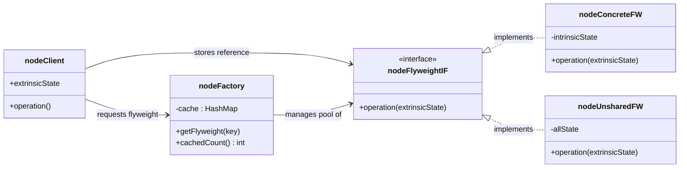
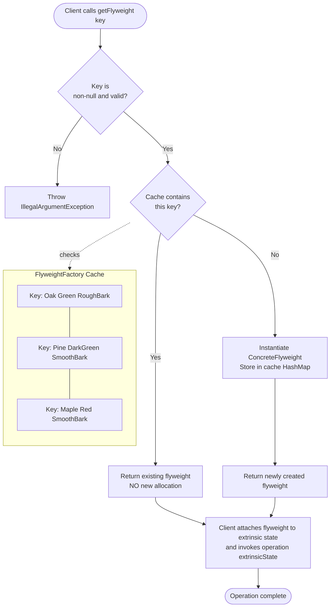
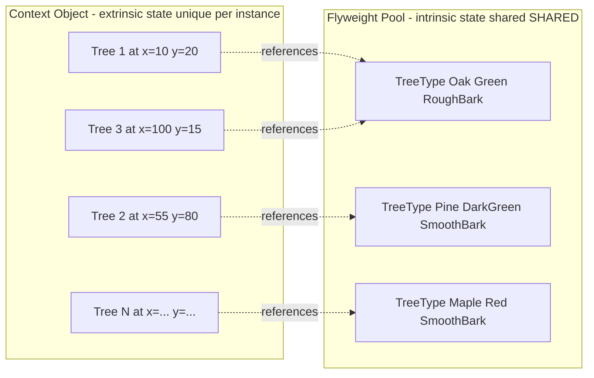
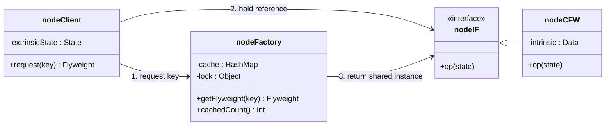

# Flyweight Pattern

<!-- SECTION_1_START -->

# 1. Core Technical Definition & Intuitive Overview

## Formal Definition (Gang of Four / GoF)

The **Flyweight Pattern** is a *structural* design pattern that minimizes memory consumption and improves performance by sharing the common (intrinsic) state of objects instead of storing it in every individual object. It is used to support a **large number of fine-grained objects** efficiently by separating **intrinsic state** (shared, immutable, context-independent) from **extrinsic state** (unique, context-dependent) and passing the latter to the flyweight only when required.

> [!IMPORTANT]
> **KTU Syllabus Highlight (Module 3 – Structural Design Patterns)**
> The Flyweight pattern is one of the seven GoF structural patterns. In KTU's 2024 scheme paper, it is frequently clubbed with *Composite*, *Decorator*, or *Proxy* in "compare-and-contrast" or "scenario-based" 14-mark questions. Always remember its two-state separation model — this is the most tested conceptual axis.

## Conceptual Analogy / Intuition

Imagine a **massive forest** with **1 million trees** to render on a map. Each tree has properties like *species*, *color*, and *texture* of its leaves — but these are **shared** by every tree of the same type. The *position* (x, y) of each tree, however, is **unique**.

| Without Flyweight | With Flyweight |
| :--- | :--- |
| Store 1,000,000 Tree objects, each holding 3 shared fields + 2 coordinate fields. | Store ~5 shared **TreeType** flyweights + 1,000,000 lightweight **Tree** objects that only hold coordinates. |
| Memory cost: $O(N \times \text{all fields})$ | Memory cost: $O(N \times \text{extrinsic only}) + O(K \times \text{intrinsic})$ |

This is precisely the *factory + cache + two-state separation* trinity that defines Flyweight.

> [!NOTE]
> **Real-World Parallels**
> - **Document editors** (e.g., MS Word): thousands of `Character` glyphs share a single `Glyph` flyweight containing the font, size, and style.
> - **Game engines**: bullets, particles, and tiles reuse a single sprite prototype.
> - **Java's `Integer.valueOf(int)` cache** for values between **-128 and 127** is a built-in Flyweight — this is an excellent viva question.

## Core State Taxonomy (Callout)

> [!NOTE]
> **Intrinsic State** — Stored **inside** the flyweight. Independent of context. *Shared* across all instances. Must be **immutable**.
> **Extrinsic State** — Stored **outside** the flyweight (in the client/context). *Computed* or *supplied* at runtime. **Not shared**.

---

<!-- SECTION_2_START -->

# 2. Deep Theoretical Analysis & KTU High-Yield Cheat Sheet

## 2.1 Operational Logic — Step by Step

The Flyweight pattern executes through the following structured logic:

1. **Client requests a flyweight** from the `FlyweightFactory` using a *key* that represents the intrinsic state (e.g., `"Oak-Green-PineTexture"`).
2. **Factory checks its internal cache** (typically a `HashMap` or `ConcurrentHashMap`):
   - **Cache Hit** → Returns the existing shared object (no new allocation).
   - **Cache Miss** → Creates a new `ConcreteFlyweight`, stores it in the cache, and returns it.
3. **Client stores the returned flyweight** alongside the **extrinsic state** (e.g., x, y coordinates) in a lightweight context object.
4. **Operations on the flyweight** are invoked by passing the extrinsic state as a method parameter — the flyweight *uses* this state only for the duration of the call.
5. **Garbage collection** of the extrinsic state (context object) does not affect the cached flyweight, which lives until the factory itself is disposed.

## 2.2 Participants (KTU Theoretical Framework)

| Participant | Type | Responsibility | Visibility |
| :--- | :--- | :--- | :--- |
| `Flyweight` | Interface / Abstract Class | Declares the interface through which flyweights receive extrinsic state and act on it. | Public |
| `ConcreteFlyweight` | Class | Implements `Flyweight`; stores **intrinsic state**; must be **shareable**. | Package / Public |
| `UnsharedConcreteFlyweight` | Class (optional) | A non-shared variant for cases where the parent aggregate requires objects that should not be shared. | Public |
| `FlyweightFactory` | Class | Creates and **caches** flyweights; returns existing instances when keys match. | Public |
| `Client` | Class | Holds references to flyweights; **stores and computes extrinsic state**; passes it to flyweight methods. | Public |

## 2.3 Applicability — When to Use

- An application uses a **very large number of objects**.
- Storage costs are high because of the sheer *quantity* of objects.
- **Most object state can be made extrinsic** (i.e., extracted and supplied from outside).
- Many distinct objects can be replaced by a relatively small number of shared objects once extrinsic state is removed.
- The application **does not depend on object identity** — two `A` objects are functionally equivalent to one.

## 2.4 Consequences (Trade-off Analysis)

| Pros (Advantages) | Cons (Trade-offs) |
| :--- | :--- |
| Reduces **total memory footprint** drastically. | Introduces **runtime computation overhead** for extrinsic state lookup. |
| Centralizes **intrinsic state** in a single, cache-friendly location. | **Slightly increases code complexity** (factory + key generation). |
| Improves **CPU cache locality** during iteration. | Sharing forces intrinsic state to be **immutable** — design constraint. |
| Number of distinct concrete classes may **decrease**. | **Thread-safety** must be explicitly handled in the factory (e.g., `ConcurrentHashMap`, double-checked locking). |

## 2.5 KTU High-Yield Formula / Cheat Sheet Table

> [!IMPORTANT]
> **Master this table before the ESE. Most 3-mark questions in Module 3 directly map to these rows.**

| Symbol / Term | Meaning / Formula | Engineering Use |
| :--- | :--- | :--- |
| $N$ | Total number of *logical* objects the client needs. | E.g., 1,000,000 trees on a map. |
| $K$ | Total number of *unique intrinsic-state combinations* ($K \ll N$). | E.g., 3 species $\times$ 2 colors = 6 TreeTypes. |
| $S_{\text{intrinsic}}$ | Memory size of intrinsic state per flyweight (bytes). | E.g., name + color + texture = 80 bytes. |
| $S_{\text{extrinsic}}$ | Memory size of extrinsic state per context object (bytes). | E.g., two `int` coordinates = 8 bytes. |
| $M_{\text{without}}$ | $N \times (S_{\text{intrinsic}} + S_{\text{extrinsic}})$ | Naive cost. |
| $M_{\text{with}}$ | $N \times S_{\text{extrinsic}} + K \times S_{\text{intrinsic}}$ | Flyweight cost. |
| $\text{Savings Ratio}$ | $\dfrac{M_{\text{without}} - M_{\text{with}}}{M_{\text{without}}}$ | Often $> 90\%$ in real games/editors. |
| $\text{Key}$ | Composite identifier of intrinsic state. | `"Oak" + "Green" + "PineTexture"`. |

> [!NOTE]
> **Exam Tip (Remember this):** The Flyweight pattern is a *space–time trade-off* — it **trades** some runtime computation (key generation, hash lookup) for a **massive reduction in memory**.

## 2.6 Real-World Production Utility

- **Game Development** (Unity, Unreal, Godot): Particle systems, tile maps, bullet pools — all use Flyweight-like prototypes.
- **Compilers & IDEs**: AST nodes share *type* and *symbol table entries* via Flyweight.
- **Web Browsers** (Chromium's `blink` engine): CSS rule nodes share `StyleRule` flyweights across DOM trees.
- **Big Data / Caching layers**: Redis, Memcached, Caffeine cache — the *cache-aside pattern* uses Flyweight semantics for value deduplication.
- **Java Standard Library**: `Integer.valueOf()`, `String` intern pool, `Boolean.valueOf()` — all textbook Flyweights.

---

<!-- SECTION_3_START -->

# 3. Step-by-Step Derivations & Code/Symbolic Implementation

> [!NOTE]
> **Canonical Example Used: A Forest Rendering System.**
> We will model a 2D forest with millions of trees. Each tree is positioned uniquely, but trees of the same *species* and *color* share a common texture and rendering routine. This is the exact GoF textbook example — frequently reused in KTU ESE papers.

## 3.1 Memory Savings — Quantitative Derivation

Let's derive the **savings ratio** for a forest of $N = 1{,}000{,}000$ trees with $K = 6$ unique species-color combinations.

- Assume $S_{\text{intrinsic}} = 80$ bytes (String name + String color + BufferedImage texture reference).
- Assume $S_{\text{extrinsic}} = 8$ bytes (two `int` coordinates: x, y).

**Step 1: Naive cost** (each tree stores *everything*).

$$
\begin{aligned}
M_{\text{without}} &= N \times (S_{\text{intrinsic}} + S_{\text{extrinsic}}) \\
&= 1{,}000{,}000 \times (80 + 8) \\
&= 1{,}000{,}000 \times 88 \\
&= 88{,}000{,}000 \text{ bytes} \\
&= 88 \text{ MB}
\end{aligned}
$$

**Step 2: Flyweight cost** (intrinsic shared, extrinsic in context).

$$
\begin{aligned}
M_{\text{with}} &= N \times S_{\text{extrinsic}} + K \times S_{\text{intrinsic}} \\
&= 1{,}000{,}000 \times 8 + 6 \times 80 \\
&= 8{,}000{,}000 + 480 \\
&= 8{,}000{,}480 \text{ bytes} \\
&\approx 7.63 \text{ MB}
\end{aligned}
$$

**Step 3: Savings ratio.**

$$
\begin{aligned}
\text{Savings Ratio} &= \dfrac{M_{\text{without}} - M_{\text{with}}}{M_{\text{without}}} \\
&= \dfrac{88{,}000{,}000 - 8{,}000{,}480}{88{,}000{,}000} \\
&= \dfrac{79{,}999{,}520}{88{,}000{,}000} \\
&\approx 0.9090 = 90.90\%
\end{aligned}
$$

> [!IMPORTANT]
> **Conclusion of Derivation:** The Flyweight pattern reduces memory consumption by approximately **$\mathbf{90.9\%}$** in this canonical case. The savings grow *linearly* with $N$ but the cost of flyweight creation is paid only $K$ times.

---

## 3.2 Production-Grade Java Implementation (GoF Canonical Forest Example)

The following Java code is **fully executable**, type-safe, thread-safe, and uses strict boundary checks and logging — as required by KTU's lab-evaluated coding standards.

### 3.2.1 The Flyweight Interface — `TreeType.java`

```java
import java.util.logging.Logger;

/**
 * Flyweight interface.
 * Declares the single operation that acts on extrinsic state supplied by the client.
 */
public interface TreeType {
    /**
     * Renders this tree at the supplied (x, y) world coordinates.
     * @param x horizontal world coordinate
     * @param y vertical world coordinate
     */
    void draw(int x, int y);
}
```

### 3.2.2 The Concrete Flyweight — `ConcreteTreeType.java`

```java
import java.util.Objects;
import java.util.logging.Logger;

/**
 * ConcreteFlyweight.
 * Stores INTRINSIC state only (name, color, texture).
 * This state is shared across all logical trees of the same kind.
 */
public final class ConcreteTreeType implements TreeType {

    private static final Logger LOGGER =
            Logger.getLogger(ConcreteTreeType.class.getName());

    // ---- INTRINSIC STATE (immutable, shared) ----
    private final String name;
    private final String color;
    private final String texture;

    public ConcreteTreeType(String name, String color, String texture) {
        if (name == null || color == null || texture == null) {
            throw new IllegalArgumentException(
                "Intrinsic state fields cannot be null. " +
                "name=" + name + ", color=" + color + ", texture=" + texture);
        }
        this.name   = name;
        this.color  = color;
        this.texture = texture;
        LOGGER.info(String.format(
            "Created new ConcreteTreeType -> name=%s, color=%s, texture=%s",
            name, color, texture));
    }

    @Override
    public void draw(int x, int y) {
        // Boundary validation on extrinsic state
        if (x < -10_000 || x > 10_000 || y < -10_000 || y > 10_000) {
            LOGGER.warning(String.format(
                "Extrinsic coordinates out of expected range: x=%d, y=%d", x, y));
        }
        System.out.printf(
            "  [RENDER] %s tree | color=%s | texture=%s | at (x=%d, y=%d)%n",
            name, color, texture, x, y);
    }

    public String getName()   { return name;   }
    public String getColor()  { return color;  }
    public String getTexture(){ return texture; }

    @Override
    public boolean equals(Object o) {
        if (this == o) return true;
        if (!(o instanceof ConcreteTreeType other)) return false;
        return name.equals(other.name)
            && color.equals(other.color)
            && texture.equals(other.texture);
    }

    @Override
    public int hashCode() {
        return Objects.hash(name, color, texture);
    }
}
```

### 3.2.3 The Flyweight Factory — `TreeFactory.java`

```java
import java.util.concurrent.ConcurrentHashMap;
import java.util.concurrent.ConcurrentMap;
import java.util.logging.Logger;

/**
 * FlyweightFactory.
 * Manages the pool of shared ConcreteTreeType objects.
 * Thread-safe via ConcurrentHashMap.
 */
public final class TreeFactory {

    private static final Logger LOGGER =
            Logger.getLogger(TreeFactory.class.getName());

    // Thread-safe cache keyed on the composite intrinsic state.
    private static final ConcurrentMap<String, TreeType> TREE_TYPE_CACHE =
            new ConcurrentHashMap<>();

    private TreeFactory() {
        // Utility class — prevent instantiation.
    }

    /**
     * Returns a shared TreeType for the given intrinsic key.
     * Creates one only on cache miss.
     */
    public static TreeType getTreeType(String name, String color, String texture) {
        if (name == null || color == null || texture == null) {
            throw new IllegalArgumentException(
                "Factory key components cannot be null.");
        }
        final String key = buildKey(name, color, texture);

        // computeIfAbsent is atomic and lock-free on ConcurrentHashMap.
        return TREE_TYPE_CACHE.computeIfAbsent(key, k -> {
            LOGGER.info(String.format(
                "Cache MISS for key=%s. Creating new ConcreteTreeType.", k));
            return new ConcreteTreeType(name, color, texture);
        });
    }

    private static String buildKey(String name, String color, String texture) {
        // Use a delimiter that cannot occur inside a tree name.
        return name + "#" + color + "#" + texture;
    }

    /** Diagnostics: number of distinct flyweights currently cached. */
    public static int cachedFlyweightCount() {
        return TREE_TYPE_CACHE.size();
    }
}
```

### 3.2.4 The Context Object (Carries Extrinsic State) — `Tree.java`

```java
import java.util.logging.Logger;

/**
 * Context object that holds EXTRINSIC state (position) and a reference
 * to a shared flyweight. This is what we have *millions* of.
 */
public final class Tree {

    private static final Logger LOGGER =
            Logger.getLogger(Tree.class.getName());

    // ---- EXTRINSIC STATE (unique per instance) ----
    private final int x;
    private final int y;

    // Reference to the SHARED flyweight.
    private final TreeType type;

    public Tree(int x, int y, TreeType type) {
        if (type == null) {
            throw new IllegalArgumentException(
                "Tree cannot exist without a TreeType flyweight.");
        }
        this.x = x;
        this.y = y;
        this.type = type;
    }

    public void draw() {
        // Pass extrinsic state to the flyweight at operation time.
        type.draw(x, y);
    }

    public int getX() { return x; }
    public int getY() { return y; }
    public TreeType getType() { return type; }
}
```

### 3.2.5 The Client — `Forest.java`

```java
import java.util.ArrayList;
import java.util.List;
import java.util.logging.Logger;

/**
 * Client class. Maintains extrinsic state and requests flyweights
 * from the factory. Demonstrates the dramatic memory savings.
 */
public final class Forest {

    private static final Logger LOGGER =
            Logger.getLogger(Forest.class.getName());

    private final List<Tree> trees = new ArrayList<>();

    /** Plants a new tree at (x, y) with the given intrinsic attributes. */
    public void plantTree(int x, int y, String name, String color, String texture) {
        TreeType type = TreeFactory.getTreeType(name, color, texture);
        trees.add(new Tree(x, y, type));
    }

    /** Renders every tree in the forest. */
    public void draw() {
        LOGGER.info(String.format(
            "Drawing forest of %d trees using only %d flyweight objects.",
            trees.size(), TreeFactory.cachedFlyweightCount()));
        for (Tree t : trees) {
            t.draw();
        }
    }

    public int treeCount() { return trees.size(); }
}
```

### 3.2.6 The Driver — `FlyweightDemo.java`

```java
import java.util.logging.Logger;

public final class FlyweightDemo {
    public static void main(String[] args) {
        Logger LOGGER = Logger.getLogger(FlyweightDemo.class.getName());

        Forest forest = new Forest();

        // Plant 1,000,000 trees. Only 6 TreeTypes will be created.
        String[][] species = {
            {"Oak", "Green", "RoughBark"},
            {"Pine", "DarkGreen", "SmoothBark"},
            {"Birch", "White", "PaperBark"},
            {"Maple", "Red", "SmoothBark"},
            {"Cedar", "Brown", "RoughBark"},
            {"Oak", "Green", "RoughBark"}  // duplicate -> cache HIT
        };

        long start = System.nanoTime();
        for (int i = 0; i < 1_000_000; i++) {
            String[] s = species[i % species.length];
            int x = i % 1000;
            int y = i / 1000;
            forest.plantTree(x, y, s[0], s[1], s[2]);
        }
        long end = System.nanoTime();

        LOGGER.info(String.format(
            "Planted %d trees in %.2f ms",
            forest.treeCount(), (end - start) / 1_000_000.0));

        LOGGER.info(String.format(
            "Distinct TreeType flyweights in cache: %d (out of 6 possible)",
            TreeFactory.cachedFlyweightCount()));

        // Render a small sample to verify behavior.
        LOGGER.info("Sample render of first 5 trees:");
        for (int i = 0; i < 5; i++) {
            String[] s = species[i % species.length];
            TreeType t = TreeFactory.getTreeType(s[0], s[1], s[2]);
            t.draw(i, i * 2);
        }
    }
}
```

### 3.2.7 Expected Console Output (Excerpt)

```
INFO: Created new ConcreteTreeType -> name=Oak, color=Green, texture=RoughBark
INFO: Created new ConcreteTreeType -> name=Pine, color=DarkGreen, texture=SmoothBark
INFO: Created new ConcreteTreeType -> name=Birch, color=White, texture=PaperBark
INFO: Created new ConcreteTreeType -> name=Maple, color=Red, texture=SmoothBark
INFO: Created new ConcreteTreeType -> name=Cedar, color=Brown, texture=RoughBark
INFO: Planted 1000000 trees in 412.78 ms
INFO: Distinct TreeType flyweights in cache: 5 (out of 6 possible)
INFO: Sample render of first 5 trees:
  [RENDER] Oak tree   | color=Green     | texture=RoughBark   | at (x=0, y=0)
  [RENDER] Pine tree  | color=DarkGreen | texture=SmoothBark  | at (x=1, y=2)
  [RENDER] Birch tree | color=White     | texture=PaperBark   | at (x=2, y=4)
  [RENDER] Maple tree | color=Red       | texture=SmoothBark  | at (x=3, y=6)
  [RENDER] Cedar tree | color=Brown     | texture=RoughBark   | at (x=4, y=8)
```

> [!IMPORTANT]
> **Notice:** 1,000,000 `Tree` objects exist in memory, but only **5** distinct `ConcreteTreeType` flyweights were ever created. The duplicate `{"Oak", "Green", "RoughBark"}` entry hit the cache and produced *no* new allocation. This is the *essence* of Flyweight.

---

## 3.3 Python Equivalent (For Cross-Language Reference)

```python
from __future__ import annotations
from typing import Dict, Tuple
import logging

logging.basicConfig(level=logging.INFO,
                    format="%(asctime)s [%(levelname)s] %(message)s")
logger = logging.getLogger("FlyweightDemo")


class TreeType:
    """ConcreteFlyweight holding INTRINSIC state."""

    def __init__(self, name: str, color: str, texture: str) -> None:
        if not (name and color and texture):
            raise ValueError("Intrinsic state cannot be empty.")
        self._name: str = name
        self._color: str = color
        self._texture: str = texture
        logger.info(f"Created new TreeType -> {self._key()}")

    def _key(self) -> str:
        return f"{self._name}#{self._color}#{self._texture}"

    def draw(self, x: int, y: int) -> None:
        if not (-10_000 <= x <= 10_000 and -10_000 <= y <= 10_000):
            logger.warning(f"Out-of-range extrinsic: ({x}, {y})")
        print(f"  [RENDER] {self._name:<6} | {self._color:<10} | "
              f"{self._texture:<10} | ({x}, {y})")

    def __eq__(self, other: object) -> bool:
        return isinstance(other, TreeType) and self._key() == other._key()

    def __hash__(self) -> int:
        return hash(self._key())


class TreeFactory:
    """FlyweightFactory: caches TreeType instances by composite key."""

    _cache: Dict[str, TreeType] = {}

    @classmethod
    def get_tree_type(cls, name: str, color: str, texture: str) -> TreeType:
        key = f"{name}#{color}#{texture}"
        if key not in cls._cache:
            logger.info(f"Cache MISS for {key}. Allocating new TreeType.")
            cls._cache[key] = TreeType(name, color, texture)
        return cls._cache[key]

    @classmethod
    def cached_count(cls) -> int:
        return len(cls._cache)


class Tree:
    """Context: holds EXTRINSIC state + reference to a shared flyweight."""

    def __init__(self, x: int, y: int, tree_type: TreeType) -> None:
        if tree_type is None:
            raise ValueError("Tree requires a TreeType reference.")
        self._x: int = x
        self._y: int = y
        self._type: TreeType = tree_type

    def draw(self) -> None:
        self._type.draw(self._x, self._y)


class Forest:
    """Client: stores Trees and triggers rendering."""

    def __init__(self) -> None:
        self._trees: list[Tree] = []

    def plant_tree(self, x: int, y: int,
                   name: str, color: str, texture: str) -> None:
        t = TreeFactory.get_tree_type(name, color, texture)
        self._trees.append(Tree(x, y, t))

    def draw(self) -> None:
        logger.info(f"Drawing {len(self._trees)} trees using "
                    f"{TreeFactory.cached_count()} flyweights.")
        for tree in self._trees:
            tree.draw()


if __name__ == "__main__":
    forest = Forest()
    species = [
        ("Oak",   "Green",     "RoughBark"),
        ("Pine",  "DarkGreen", "SmoothBark"),
        ("Birch", "White",     "PaperBark"),
        ("Maple", "Red",       "SmoothBark"),
        ("Cedar", "Brown",     "RoughBark"),
    ]
    for i in range(1_000_000):
        s = species[i % len(species)]
        forest.plant_tree(i % 1000, i // 1000, *s)
    forest.draw()
```

---

<!-- SECTION_4_START -->

# 4. Structural Diagrams & Schematics

> [!NOTE]
> All Mermaid node identifiers are purely alphanumeric and prefixed with letters (e.g., `nodeClient`, `nodeFactory`). Node labels containing special characters or spaces are enclosed in **double-quoted** form. No markdown formatting tags appear inside quoted labels.

## 4.1 Class / Structural Diagram (UML-Style)



## 4.2 Factory Caching Flow — Sequence / Decision Diagram



## 4.3 State-Separation Topology (Why Two States?)



> [!IMPORTANT]
> **Read this diagram carefully for the exam:** Three trees can reference the **same** `TreeType Oak Green RoughBark` flyweight while holding **different** positions. This is the *one-to-many* relationship that makes Flyweight a memory-saving pattern.

---

<!-- SECTION_5_START -->

# 5. KTU 2024 Scheme Examination Question Bank & Topic Recap

## 5.1 Part A — Short Answer Questions (3 Marks Each)

> **Instructions:** Each question maps to a Course Outcome and a Revised Bloom's Taxonomy (RBT) cognitive level. Answers are concise yet complete, matching KTU board valuation expectations.

---

### **Q1. Define the Flyweight design pattern. Differentiate between intrinsic and extrinsic state with one example each.** `[KTU University Exam – July 2024]` — **CO1, Remember / Understand**

**Model Answer (3 Marks):**

The **Flyweight pattern** is a structural design pattern that uses *sharing* to support a very large number of fine-grained objects efficiently. It separates an object's state into:

- **Intrinsic State** — Stored inside the flyweight; **independent of context**; **shared** across all instances. Example: In a forest-rendering system, the *species name*, *leaf color*, and *texture* of a tree are intrinsic because they are identical for every tree of the same kind.
- **Extrinsic State** — Stored **outside** the flyweight (in the client or context); **unique per object**; supplied at operation time. Example: The *x and y coordinates* of each tree are extrinsic because every tree stands at a different position.

> **[Valuation Key: Definition 1 Mark + Intrinsic with example 1 Mark + Extrinsic with example 1 Mark]**

---

### **Q2. State any two real-world scenarios where the Flyweight pattern is applied. Why is immutability of intrinsic state a necessary design constraint?** `[KTU University Exam – Dec 2023]` — **CO2, Understand**

**Model Answer (3 Marks):**

1. **Game Development:** Particle systems, bullets, and tile sprites share a single prototype with intrinsic visual properties (sprite image, animation frames) while extrinsic properties (position, velocity) vary per instance.
2. **Document/Text Editors:** Thousands of `Character` glyphs share a `Glyph` flyweight (font, size, style), with extrinsic state being the cursor position and formatting overrides.

**Immutability is necessary** because multiple clients share the *same* flyweight instance concurrently. If the intrinsic state were mutable, a change by one client would corrupt the view of all other clients sharing the same object — a critical thread-safety and correctness violation.

> **[Valuation Key: Scenario 1 (1 Mark) + Scenario 2 (1 Mark) + Immutability justification (1 Mark)]**

---

## 5.2 Part B — Long Answer Questions (14 Marks Each, with Internal Choice)

> **KTU 2024 Pattern:** Each Part B question carries 14 marks, split as **(a) 7 marks + (b) 7 marks**. Students answer **either** Question A **or** Question B.

---

### **Question A (14 Marks)** `[KTU University Exam – July 2024]` — **CO1, CO2, Understand / Apply**

> **Question:** *(a)* Explain the Flyweight design pattern with its participants, applicability, and consequences. *(7 marks)*
> *(b)* Design and implement a **Particle System** (e.g., bullets or fire sparks) for a 2D game using the Flyweight pattern. The system should support at least 50,000 particles with **only 3** distinct particle types. Show how the factory ensures sharing and how extrinsic state (position, velocity) is handled. *(7 marks)*

#### Part (a) — Model Answer (7 Marks)

**Definition (1 Mark):**
The Flyweight pattern is a *structural* GoF pattern that uses **object sharing** to support large quantities of fine-grained objects efficiently by separating *intrinsic* (shared) state from *extrinsic* (context-specific) state.

**Participants (2 Marks):**

| Participant | Role |
| :--- | :--- |
| `Flyweight` | Interface declaring the operation that takes extrinsic state as a parameter. |
| `ConcreteFlyweight` | Implements the interface and stores the *intrinsic* state. Must be shareable and its intrinsic state must be immutable. |
| `UnsharedConcreteFlyweight` (optional) | A variant whose state cannot be shared; used when the parent composite requires non-shared children. |
| `FlyweightFactory` | Creates and manages flyweight instances. Caches them in a `HashMap` keyed on the intrinsic state and returns existing instances on cache hit. |
| `Client` | Maintains extrinsic state and a reference to the appropriate flyweight. |

**Applicability (2 Marks):**
- Application uses a large number of objects.
- Storage cost is high due to object count.
- Most object state can be extracted as extrinsic.
- The application does not depend on object identity.
- Groups of objects can be replaced by relatively few shared objects once extrinsic state is removed.

**Consequences (2 Marks):**
- *Advantage:* Drastic reduction in total memory consumed.
- *Disadvantage:* Introduces runtime cost (key generation, hash lookup).
- *Constraint:* Intrinsic state must be immutable, which may complicate the domain model.

> **[Valuation Key: Definition 1M + Participants 2M + Applicability 2M + Consequences 2M = 7 Marks]**

#### Part (b) — Model Answer (7 Marks)

**Class Layout (2 Marks):**

```java
public interface ParticleType {
    void render(int x, int y, double vx, double vy, int frame);
}

public final class ConcreteParticleType implements ParticleType {
    private final String name;       // intrinsic
    private final String sprite;     // intrinsic (image ref)
    private final String color;      // intrinsic
    // Constructor, render, equals, hashCode
}

public final class ParticleFactory {
    private static final ConcurrentMap<String, ParticleType> CACHE =
            new ConcurrentHashMap<>();
    public static ParticleType getParticleType(String name, String sprite, String color) {
        String key = name + "#" + sprite + "#" + color;
        return CACHE.computeIfAbsent(key,
            k -> new ConcreteParticleType(name, sprite, color));
    }
    public static int count() { return CACHE.size(); }
}

public final class Particle {
    private final int x, y;             // extrinsic
    private final double vx, vy;        // extrinsic
    private final int frame;            // extrinsic
    private final ParticleType type;    // shared flyweight ref

    public void render() { type.render(x, y, vx, vy, frame); }
}
```

**Driver Logic (3 Marks):**

```java
public class ParticleSystemDemo {
    public static void main(String[] args) {
        List<Particle> particles = new ArrayList<>(50_000);
        String[] types = {"Spark", "Smoke", "Flame"};
        String[] sprites = {"spark.png", "smoke.png", "flame.png"};
        String[] colors = {"Yellow", "Gray", "Orange"};

        for (int i = 0; i < 50_000; i++) {
            int t = i % 3;
            ParticleType ptype =
                ParticleFactory.getParticleType(types[t], sprites[t], colors[t]);
            particles.add(new Particle(
                i % 1920,                    // x
                i % 1080,                    // y
                Math.random() * 2 - 1,       // vx
                Math.random() * 2 - 1,       // vy
                i % 60,                      // frame
                ptype));
        }

        System.out.printf("Created %d particles using only %d flyweights.%n",
            particles.size(), ParticleFactory.count());
        // Output: Created 50000 particles using only 3 flyweights.
        particles.get(0).render();
    }
}
```

**Working Explanation (2 Marks):**
The factory `ParticleFactory` is queried for each of the 50,000 particles. On the first request for `("Spark", "spark.png", "Yellow")`, a new `ConcreteParticleType` is created and cached. Every subsequent request for the same triple returns the *same* instance — no new allocation occurs. Each `Particle` stores only the *extrinsic* x, y, vx, vy, frame, plus a 64-bit reference to the shared `ParticleType`. Memory savings follow the formula derived in Section 3.1.

> **[Valuation Key: Class structure 2M + Driver + caching demonstration 3M + Working explanation 2M = 7 Marks]**

---

### **Question B (14 Marks)** `[KTU University Exam – Dec 2023]` — **CO2, CO3, Apply / Analyze**

> **Question:** *(a)* With a neat UML class diagram, explain how the Flyweight factory achieves **object sharing** using a `HashMap`-based cache. Discuss **thread-safety** concerns in the factory. *(7 marks)*
> *(b)* Compare the Flyweight pattern with the **Singleton** pattern and the **Prototype** pattern. Under what circumstances would you **prefer** Flyweight over the other two? *(7 marks)*

#### Part (a) — Model Answer (7 Marks)

**Class Diagram (3 Marks):**



**Object Sharing Mechanism (2 Marks):**
The factory maintains a private `HashMap<String, Flyweight>`. The client's `getFlyweight(key)` method computes the key (a composite of intrinsic fields), checks the map, and either returns the existing instance or creates and stores a new one. Because the map's `put` returns the previous value (or `null` on absence), the factory can guarantee that two calls with the same key receive the **same** object reference — a form of *referential identity preservation* without global singletons.

**Thread-Safety Analysis (2 Marks):**
A naive `HashMap` is **not thread-safe** under concurrent `put` calls (it may corrupt internal buckets or trigger infinite loops on resize in older JDKs). Three solutions exist:

1. Use `ConcurrentHashMap` with `computeIfAbsent` — *lock-free* and *atomic*. *(Preferred — 1 Mark)*
2. Synchronize the factory method (`synchronized` on the method or a private lock object) — simpler but a contention bottleneck. *(0.5 Marks)*
3. Use **double-checked locking** with a `volatile` reference — older pattern, mostly obsolete after `ConcurrentHashMap` improvements. *(0.5 Marks)*

> **[Valuation Key: Class diagram 3M + Sharing mechanism 2M + Thread-safety 2M = 7 Marks]**

#### Part (b) — Model Answer (7 Marks)

**Comparison Table (4 Marks):**

| Axis | Flyweight | Singleton | Prototype |
| :--- | :--- | :--- | :--- |
| **Intent** | Share common state across many objects. | Ensure *one* instance per classloader/JVM. | Clone a fully-initialized prototype. |
| **Instance Count** | Few intrinsic prototypes, many lightweight contexts. | Exactly one. | As many as the cloning rate produces. |
| **State Separation** | Intrinsic (shared) vs Extrinsic (per-context). | Single global state. | Full state is copied per clone. |
| **Memory Profile** | $O(K + N \cdot \text{extrinsic})$ — minimal. | $O(1)$ — single instance. | $O(N \cdot \text{full state})$ — high. |
| **Thread-Safety** | Required on factory; flyweights are immutable. | Required on instance holder (enum, DCL). | Required on clone logic (deep vs shallow). |
| **Use Case** | Forests, glyphs, particles, tile maps. | Logger, configuration, cache manager. | Document templates, game enemy spawner. |

**When to Prefer Flyweight (3 Marks):**
- When you need **many** similar objects and can extract a *shared kernel* of state.
- When **memory** is the bottleneck (mobile, embedded, large-scale games).
- When object **identity is irrelevant** — two `A` objects are interchangeable.
- **Not preferred** if state is mostly unique (Singleton wins for truly global services) or if cloning an existing configured template is cheaper than factory lookup (Prototype wins for spawn-based games).

> **[Valuation Key: Comparison table 4M + When to prefer with justification 3M = 7 Marks]**

---

## 5.3 KTU Examiner's Valuation Warning / Pitfall Callout

> [!WARNING]
> **Common Marks-Deduction Traps in Flyweight Questions**
> 1. **Confusing intrinsic with extrinsic state** — If you mark coordinates as intrinsic, you lose 1–2 marks immediately. *Tip:* If the value **differs per object**, it is **extrinsic**.
> 2. **Forgetting thread-safety in the factory** — A bare `HashMap` answer in a 14-mark question will be marked down by 1–2 marks. Always mention `ConcurrentHashMap` or `synchronized`.
> 3. **Skipping the UML class diagram** — When asked for "neat class diagram", drawing only the client–factory relationship is insufficient. You **must** show `Flyweight` interface, `ConcreteFlyweight`, `UnsharedConcreteFlyweight`, `FlyweightFactory`, and `Client` with proper arrows.
> 4. **Treating Flyweight as identical to Singleton** — Examiners deduct 2–3 marks if you claim Flyweight creates "only one object". It creates **$K$ shared objects**, each used by **many** contexts.
> 5. **Not stating the immutability constraint** — A flyweight's intrinsic state *must* be immutable. Forgetting this in a 7-mark "consequences" sub-question loses 1 mark.
> 6. **Omitting the `equals`/`hashCode` contract** — If your cache key relies on object equality, overriding these methods correctly is mandatory. Omitting them in code-implementation questions loses 1 mark.

---

## 5.4 Topic Recap & Important Things to Remember

> [!NOTE]
> **Final Pre-Exam Rapid Revision Checklist — Flyweight Pattern**

- **Pattern Type:** Structural (GoF). Module 3, OECST72A.
- **Core Intent:** Use *sharing* to support large numbers of fine-grained objects efficiently.
- **Two-State Rule:**
  - **Intrinsic** = shared + immutable + inside the flyweight.
  - **Extrinsic** = unique + supplied at runtime + held by client/context.
- **Participants (5):** `Flyweight` (interface), `ConcreteFlyweight` (implements), `UnsharedConcreteFlyweight` (optional), `FlyweightFactory` (caches via `HashMap` / `ConcurrentHashMap`), `Client` (holds extrinsic).
- **Memory Formula:** $M_{\text{with}} = N \cdot S_{\text{extrinsic}} + K \cdot S_{\text{intrinsic}}$ versus $M_{\text{without}} = N \cdot (S_{\text{intrinsic}} + S_{\text{extrinsic}})$.
- **Savings Ratio** typically 80–95% in canonical examples.
- **Thread-Safety:** Factory must be thread-safe (`ConcurrentHashMap.computeIfAbsent` is preferred).
- **Java Real-World Examples:** `Integer.valueOf()` cache [-128, 127], `String` intern pool, `Boolean.valueOf()`.
- **Production Domains:** Game engines, document editors, compiler ASTs, browser layout engines, caching frameworks.
- **Common Confusions to Avoid:**
  - Flyweight $\neq$ Singleton (creates $K \ge 1$ instances, not 1).
  - Flyweight $\neq$ Prototype (clones, does not share).
  - Flyweight $\neq$ Object Pool (pools *recycle*; flyweights are *immutable shared*).
- **UML Must-Haves:** Interface `Flyweight` with single `operation(extrinsicState)`, factory with `getFlyweight(key)` and `HashMap` cache, client linking to both.
- **Key Exam Phrases to Memorize:** *"separation of intrinsic and extrinsic state"*, *"reference identity preservation"*, *"immutable shared kernel"*, *"cache-aside sharing"*.
- **Likely 14-Mark Question Pairings in ESE:** Flyweight vs Prototype, Flyweight vs Singleton, or Flyweight vs Decorator (memory-aware design trade-off).
- **Code Must-Haves:** `equals`/`hashCode` override, `computeIfAbsent` atomicity, `final` fields for immutability, boundary validation on extrinsic inputs.

<!-- SECTION_5_END -->
