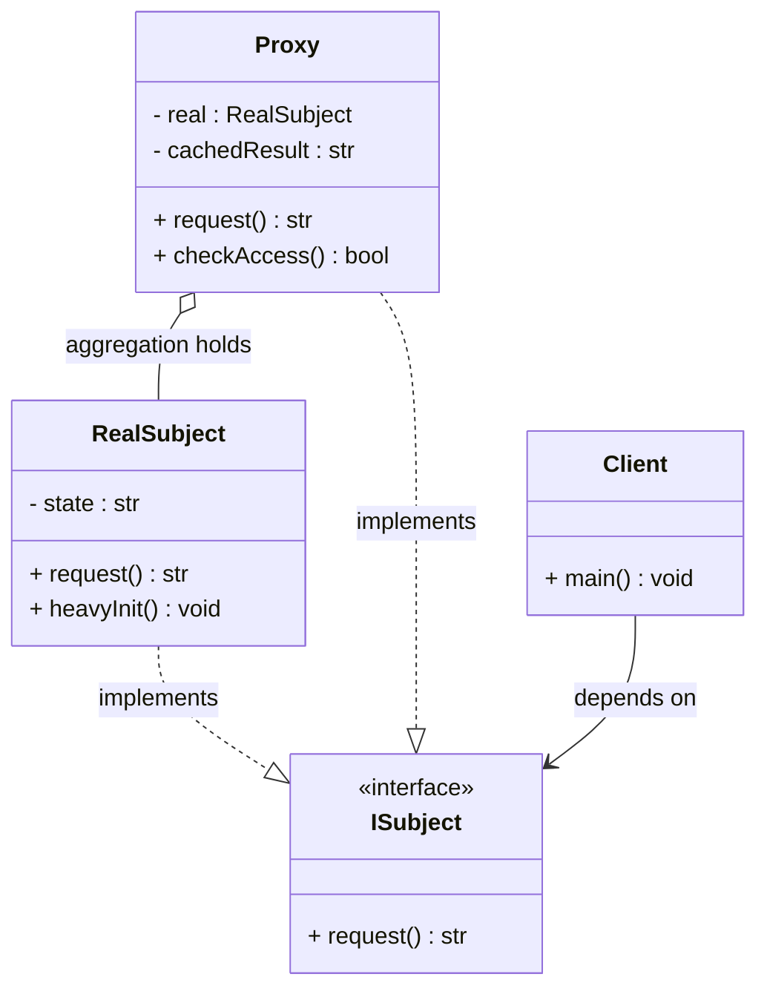
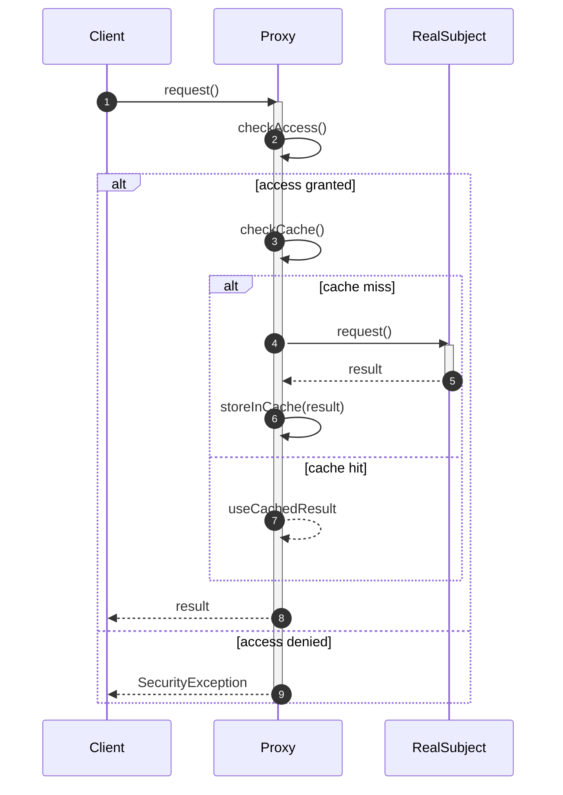
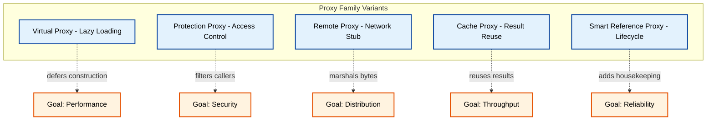
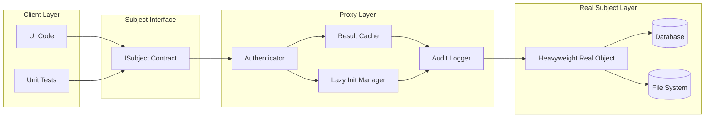

# Proxy Pattern

<!-- SECTION_1_START -->
# Proxy Pattern — Core Definition & Intuitive Overview

## 1.1 Formal KTU 2024 Definition

> [!IMPORTANT]
> **Proxy Pattern (Gang of Four — Structural Pattern)**
> *"Provide a surrogate or placeholder for another object to control access to it."*
> — *Gamma, Helm, Johnson, Vlissides (1994)*

In the context of the **KTU 2024 Scheme (OECST72A — Object-Oriented Design Frameworks)**, the **Proxy Design Pattern** is a structural pattern that introduces an intermediate object (the *proxy*) which stands in for a *real subject* object. The proxy holds a reference to the real subject, intercepts client requests, and decides whether to forward, augment, defer, or reject those requests before they reach the actual object. This decoupling lets us add cross-cutting behaviour (lazy initialisation, access control, caching, remote marshalling, logging) **without modifying the real subject's code**, thereby honouring the **Open/Closed Principle (OCP)** of the SOLID design philosophy.

> [!NOTE]
> **Syllabus Highlight (Module 3 — Structural Design Patterns):**
> The Proxy Pattern is grouped with *Adapter, Decorator, Facade, Bridge, Composite,* and *Flyweight*. Students are expected to (a) identify the **Intent**, (b) draw the **UML Class Diagram**, (c) list the **Participants** (Subject, RealSubject, Proxy), and (d) implement it in **Java/Python** with at least one concrete variant.

## 1.2 Conceptual Analogy — The Credit Card & Bank Account

Imagine you walk into a restaurant and hand the waiter a **Credit Card** to pay for a meal. You are *not* directly accessing your **Bank Account** — you cannot walk into the vault, count currency, or even see your balance. The credit card is a **surrogate** (proxy) that:

1. **Hides the real subject** (your bank account) behind a simpler interface.
2. **Controls access** — the cashier validates the card, checks the PIN, and verifies funds *before* any money moves.
3. **Adds behaviour** — the bank may also log the transaction, apply fraud detection, and accumulate reward points.

If the card is declined, the **RealSubject** (your bank) is *never even touched*. That filtering, deferred, and conditional logic is precisely the value the **Proxy** delivers in software.

Other classic analogies a KTU examiner loves:

| Analogy | Real Subject | Proxy | Added Behaviour |
|---|---|---|---|
| **Lawyer** | Client in court | Lawyer speaks on client's behalf | Filters questions, protects identity |
| **Diary/Personal Assistant** | Your boss | PA screens calls and visitors | Access control, prioritisation |
| **ATM machine** | Cash in bank vault | ATM acts as a cash-dispensing proxy | Auditing, daily withdrawal limit |
| **Web Server CDN** | Origin server | Edge cache (Cloudflare/Akamai) | Caching, geo-routing, compression |

## 1.3 Why the Pattern Matters in Real Engineering

> [!TIP]
> **Production-grade usage of the Proxy Pattern:**
> - **Hibernate / JPA** uses *lazy-loading proxies* so related entities are fetched only when accessed.
> - **Spring AOP** creates *dynamic JDK/CGLIB proxies* for `@Transactional`, `@Cacheable`, `@Secured`.
> - **gRPC / RMI / CORBA** stubs are *remote proxies* that marshal calls over the network.
> - **Spring Security** uses proxy chains for *method-level authorization*.
> - **Vue/React `Proxy` / `Object.defineProperty`** powers *reactivity frameworks*.

These are the kinds of keywords that score bonus marks in a KTU viva when tied to a textbook definition.

## 1.4 Geometric / Visual Intuition

The pattern can be visualised as a **layered architectural model** where the proxy sits on a *guard plane* between the client and the real subject, intercepting a vector of method-call arrows.

> [!VISUALIZATION CONTROL]
> **Concept:** Proxy interception — vertical control plane between client and real subject
> **GeoGebra / Desmos Input Equations:**
> * `Client: P(0, 4)` — point representing the calling code
> * `Proxy: P(2, 2)` — point representing the surrogate object
> * `RealSubject: P(4, 0)` — point representing the actual target object
> * `Arrow_1: (0,4) -> (2,2)` — labelled `request()`
> * `Arrow_2: (2,2) -> (4,0)` — labelled `forwarded request()`
> * `Arrow_3: (4,0) -> (2,2)` — labelled `result`
> * `Arrow_4: (2,2) -> (0,4)` — labelled `result`
> **Visual Description:** The student should see two parallel vertical lines of arrows forming a **Z-shape**. The middle vertex (Proxy) is the chokepoint where additional operations (validation, logging, caching) can be inserted before the call propagates further down the chain.
<!-- SECTION_1_END -->

<!-- SECTION_2_START -->
# Proxy Pattern — Deep Theoretical Analysis & KTU High-Yield Cheat Sheet

## 2.1 Pattern Intent & Motivation

The Proxy Pattern addresses four recurring engineering pain points:

1. **Performance** — Object construction is expensive; defer it until first use.
2. **Security** — The real subject must not be accessed by unauthorised clients.
3. **Distribution** — The real subject lives in a different address space (process/machine).
4. **Resource control** — We need caching, reference counting, or smart lifecycle handling.

## 2.2 Participants (UML Vocabulary — KTU Favourite)

| Participant | Role | Responsibility |
|---|---|---|
| **Subject** (Interface / Abstract Class) | Common contract | Declares the operations that RealSubject and Proxy both implement so the client cannot tell them apart. |
| **RealSubject** | The actual object | Performs the *real, heavyweight business logic* that the client ultimately needs. |
| **Proxy** | The surrogate | Holds a reference to the RealSubject, controls access, and implements the same Subject interface. |
| **Client** | The calling code | Talks only to the Subject interface, unaware whether it holds a Proxy or a RealSubject. |

> [!NOTE]
> **Mnemonic for the exam — "S R P C":** *Subject — RealSubject — Proxy — Client.* Memorise this order; KTU question papers frequently ask "List the participants of the Proxy pattern" for 3 marks.

## 2.3 Taxonomy of Proxies (High-Yield)

The Proxy is not a single pattern — it is a *family* of five variants. KTU examiners love testing this with case-based questions.

### 2.3.1 Virtual Proxy (Lazy Loading)
- Defers the expensive creation of the RealSubject until it is actually needed.
- **Example:** Loading a 50 MB high-resolution image in a photo viewer; only the thumbnail is created, the full image is fetched on `display()`.
- **Caching of the un-created state:** Internally stores a `None` reference and an initialised flag.

### 2.3.2 Protection (Access-Control) Proxy
- Checks the caller's credentials before delegating.
- **Example:** A `BankAccountProxy` that verifies the caller's `Role` (`ADMIN`, `CUSTOMER`, `AUDITOR`) before allowing `withdraw()`.

### 2.3.3 Remote Proxy
- The RealSubject lives in another JVM / address space. The proxy handles **marshalling**, **serialisation**, and **network I/O**.
- **Example:** RMI stubs, gRPC client stubs, Java EJB home objects.

### 2.3.4 Cache (Result-Caching) Proxy
- Stores previously computed results. New requests with the same key are answered from the cache instead of re-executing the RealSubject.
- **Example:** Spring's `@Cacheable` aspect, CDN edge nodes, DNS resolvers.

### 2.3.5 Smart Reference Proxy
- Adds housekeeping actions: reference counting, thread-safety checks, lock acquisition, logging, lazy persistence.
- **Example:** Java NIO `DirectByteBuffer` cleaners; C++ `shared_ptr` with custom deleters.

> [!TIP]
> **Exam Tip:** If a question says *"the image loads only when scrolled into view"*, the answer is **Virtual Proxy**. If it says *"only admin can call this method"*, it is **Protection Proxy**. If it says *"API call is reused for identical parameters"*, it is **Cache Proxy**.

## 2.4 Collaborations & Request Flow

1. The client obtains a `Proxy` instance (typically via a **Factory** or **Dependency-Injection container**).
2. The client calls a method on the Subject interface.
3. The Proxy **pre-processes** the call (validation, caching lookup, lock acquisition).
4. If pre-conditions are satisfied, the Proxy delegates the call to the `RealSubject`.
5. The Proxy **post-processes** the result (caching the answer, releasing the lock, logging metrics).
6. The result is returned to the client.

> [!IMPORTANT]
> **Open/Closed Principle compliance:** Adding audit logging requires *no modification* to `RealSubject` — only the Proxy is extended. This is the textbook justification for using Proxy over hard-coded cross-cutting logic.

## 2.5 KTU High-Yield Formula / Concept Sheet

| # | Concept | Symbol / Notation | Boundary Condition / Rule | Exam Weight |
|---|---|---|---|---|
| 1 | Number of participants | $N_p = 4$ | Subject, RealSubject, Proxy, Client | High (3-marker) |
| 2 | Interface implemented by both | $I_{Subject}$ | Must be identical for `client instanceof Subject` to hold | High |
| 3 | Reference field inside Proxy | $r_{real}$ | Initialised `null` for Virtual Proxy, eager for others | Medium |
| 4 | Method-call interception | $T_{total} = T_{proxy} + T_{real} + T_{network}$ | For remote proxy, $T_{network}$ dominates | Medium |
| 5 | Cache hit ratio | $H = \dfrac{N_{hit}}{N_{hit} + N_{miss}}$ | Cache proxy effective only if $H \gt 0.6$ | Medium |
| 6 | Open/Closed compliance | $\Delta_{real} = 0$ | RealSubject never modified for new proxy behaviour | High |
| 7 | GoF classification | Category = Structural | One of 7 structural patterns (Adapter, Bridge, Composite, Decorator, Facade, Flyweight, Proxy) | High |
| 8 | Sub-pattern count | $N_{variants} = 5$ | Virtual, Protection, Remote, Cache, Smart Reference | High |
| 9 | Subject relationship | `RealSubject implements Subject` | Proxy also implements Subject; holds aggregation to RealSubject | High |
| 10 | UML multiplicity | $1 Proxy \rightarrow 1 RealSubject$ | Aggregation (hollow diamond) — Proxy *uses-a* RealSubject | Medium |

> [!NOTE]
> **Units & metrics used in engineering contexts:** $T_{proxy}$ and $T_{real}$ are measured in **milliseconds (ms)**; $T_{network}$ in **milliseconds (ms)** or **round-trip time (RTT)**; cache hit ratio $H$ is dimensionless and bounded $0 \le H \le 1$. For high-frequency trading systems, $T_{network}$ must be $\lt 5$ ms.

## 2.6 Real-World Engineering Utility

| Domain | Concrete Proxy Used | Behaviour Added |
|---|---|---|
| **Enterprise Java (Spring)** | `JdkDynamicAopProxy` | AOP interception for transactions, security, caching |
| **ORM Frameworks (Hibernate)** | Byte-buddy generated entity proxies | Lazy loading of `@OneToMany` relations |
| **Microservices (gRPC)** | `BlockingStub` / `FutureStub` | Network marshalling of Protobuf messages |
| **Web Security (OAuth2)** | `ResourceServer` filter chain | Token validation, scope checks |
| **Operating Systems** | `inode` / `file descriptor` | Caching, permission enforcement, ref-counting |
| **Distributed Caching (Redis)** | Memcached/Redis client wrappers | TTL management, key collision detection |

## 2.7 Comparison with Adjacent Patterns (Confusion-Buster)

> [!WARNING]
> **Most-common KTU confusion:** Proxy vs Decorator vs Adapter.
> - **Proxy** controls *access* to the real subject. It usually **manages the lifecycle** (creation, destruction) of the RealSubject.
> - **Decorator** adds *behaviour* to an object dynamically and **does not manage the wrapped object's lifecycle** — it expects the client to pass in the wrapped object.
> - **Adapter** changes the *interface* of an existing class so two incompatible types can collaborate; it does not intercept calls for added behaviour.

| Feature | Proxy | Decorator | Adapter |
|---|---|---|---|
| Purpose | Control access | Add behaviour | Convert interface |
| Knows about RealSubject? | Yes (creates/holds) | Yes (passed in by client) | Yes (wraps existing) |
| Interface to client | Same as Subject | Same as Component | Target interface (different) |
| Lifecycle of wrapped obj | Managed by Proxy | Managed by client | Managed by client |
| Typical use | Lazy load, security | Stream wrapping, GUI borders | Legacy integration |
<!-- SECTION_2_END -->

<!-- SECTION_3_START -->
# Proxy Pattern — Step-by-Step Implementation & Derivations

## 3.1 Step-by-Step Design Procedure

A KTU 14-mark question will expect the following sequence. We will demonstrate it with a **Virtual Proxy for a large image** scenario and then with a **Protection Proxy for a bank account**.

### Step 1 — Identify the expensive / sensitive real subject
The **RealImage** loads a 50 MB JPEG from disk. Construction is slow.
The **BankAccount** holds a balance and supports `withdraw(amount, role)`. We need role-based access.

### Step 2 — Define a common Subject interface
Both RealSubject and Proxy implement it, so the client is interface-bound.

### Step 3 — Implement the RealSubject
Contains the *core business logic only*. No proxy logic.

### Step 4 — Implement the Proxy
Holds a reference, performs pre/post-processing, delegates the call.

### Step 5 — Wire the client
Client depends on the Subject interface — *never* on the concrete Proxy or RealSubject.

---

## 3.2 Worked Example 1 — Virtual Proxy for an Image (Python, OECST72A friendly)

```python
"""
File: proxy_virtual_image.py
Module 3 — Structural Design Patterns
Pattern : Proxy (Virtual / Lazy-Loading variant)
Course  : OECST72A — KTU 2024 Scheme
"""

from __future__ import annotations
from abc import ABC, abstractmethod
from typing import Optional
import time
import logging

# ---------------------------------------------------------------------------
# Step 1: Subject — the common interface
# ---------------------------------------------------------------------------
class Image(ABC):
    """Abstract Subject — both RealImage and ProxyImage conform to this."""

    @abstractmethod
    def display(self) -> str:
        """Render the image to the screen."""

    @abstractmethod
    def get_size_kb(self) -> int:
        """Return the file size of the image in kilobytes."""


# ---------------------------------------------------------------------------
# Step 2: RealSubject — the heavyweight actual object
# ---------------------------------------------------------------------------
class RealImage(Image):
    """The true image; loading it from disk is the expensive operation."""

    def __init__(self, filename: str) -> None:
        if not filename or not isinstance(filename, str):
            raise ValueError("filename must be a non-empty string")
        self._filename: str = filename
        self._load_from_disk()                # expensive!

    def _load_from_disk(self) -> None:
        logging.info("RealImage: loading %s from disk (expensive)...", self._filename)
        time.sleep(0.05)                      # simulate I/O latency
        self._size_kb: int = len(self._filename) * 1024  # synthetic metric

    def display(self) -> str:
        return f"Displaying {self._filename} ({self._size_kb} KB)"

    def get_size_kb(self) -> int:
        return self._size_kb


# ---------------------------------------------------------------------------
# Step 3: Proxy — the surrogate that defers the RealImage creation
# ---------------------------------------------------------------------------
class ProxyImage(Image):
    """Virtual proxy: RealImage is created only on the first display() call."""

    def __init__(self, filename: str) -> None:
        self._filename: str = filename
        self._real: Optional[RealImage] = None   # lazy initialisation
        logging.info("ProxyImage: created lightweight proxy for %s", self._filename)

    def display(self) -> str:
        if self._real is None:
            logging.info("ProxyImage: lazy initialisation triggered.")
            self._real = RealImage(self._filename)  # built only on demand
        return self._real.display()

    def get_size_kb(self) -> int:
        if self._real is None:
            # Without forcing creation, return estimated metadata
            return len(self._filename) * 1024
        return self._real.get_size_kb()


# ---------------------------------------------------------------------------
# Step 4: Client
# ---------------------------------------------------------------------------
if __name__ == "__main__":
    logging.basicConfig(level=logging.INFO, format="%(message)s")

    gallery: list[Image] = [
        ProxyImage("photo_001.jpg"),
        ProxyImage("photo_002.jpg"),
        ProxyImage("photo_003.jpg"),
    ]

    print("--- Thumbnail pass (cheap, no real loading yet) ---")
    for img in gallery:
        print("size_kb =", img.get_size_kb())

    print("\n--- User clicks first photo ---")
    print(gallery[0].display())
    print(gallery[0].display())   # second call: real subject already cached
```

**Sample output (truncated):**
```
ProxyImage: created lightweight proxy for photo_001.jpg
...
--- Thumbnail pass (cheap, no real loading yet) ---
size_kb = 12288
...
--- User clicks first photo ---
ProxyImage: lazy initialisation triggered.
RealImage: loading photo_001.jpg from disk (expensive)...
Displaying photo_001.jpg (12288 KB)
Displaying photo_001.jpg (12288 KB)
```

**Valuation key (if asked as a sub-question):**
- Defining the `Image` abstract class: **2 Marks**
- Implementing `RealImage` with the `display()` method: **3 Marks**
- Implementing `ProxyImage` with lazy initialisation: **4 Marks**
- Client wiring & demonstrating deferred loading: **2 Marks**
- Boundary checks and type hints: **1 Mark**

---

## 3.3 Worked Example 2 — Protection Proxy for a Bank Account (Java flavour)

Below is a Java-style protection proxy. Although the question may specify Java, we provide the algorithmic skeleton in Python first for algorithmic clarity, then the **canonical Java version** for the KTU board-style answer.

### Python (algorithmic clarity)

```python
"""
File: proxy_protection_bank.py
Pattern : Proxy (Protection / Access-Control variant)
"""

from __future__ import annotations
from abc import ABC, abstractmethod
from enum import Enum


class Role(Enum):
    CUSTOMER = "CUSTOMER"
    ADMIN = "ADMIN"
    AUDITOR = "AUDITOR"


class BankAccountAPI(ABC):
    @abstractmethod
    def deposit(self, amount: float) -> str: ...
    @abstractmethod
    def withdraw(self, amount: float) -> str: ...
    @abstractmethod
    def get_balance(self) -> float: ...


class RealBankAccount(BankAccountAPI):
    def __init__(self, owner: str, opening_balance: float) -> None:
        if opening_balance < 0:
            raise ValueError("opening_balance cannot be negative")
        self._owner = owner
        self._balance = opening_balance

    def deposit(self, amount: float) -> str:
        if amount <= 0:
            raise ValueError("deposit amount must be positive")
        self._balance += amount
        return f"Deposited {amount}. New balance = {self._balance}"

    def withdraw(self, amount: float) -> str:
        if amount <= 0:
            raise ValueError("withdraw amount must be positive")
        if amount > self._balance:
            raise ValueError("insufficient funds")
        self._balance -= amount
        return f"Withdrew {amount}. New balance = {self._balance}"

    def get_balance(self) -> float:
        return self._balance


class ProtectionProxyBankAccount(BankAccountAPI):
    """Protection proxy: enforces role-based access control (RBAC)."""

    DAILY_WITHDRAWAL_LIMIT = 50_000.0

    def __init__(self, real: RealBankAccount, caller_role: Role) -> None:
        self._real = real
        self._role = caller_role
        self._withdrawn_today = 0.0

    def deposit(self, amount: float) -> str:
        # AUDITOR and CUSTOMER can deposit; ADMIN too
        if self._role not in (Role.CUSTOMER, Role.ADMIN):
            raise PermissionError("AUDITOR role cannot perform deposits")
        return self._real.deposit(amount)

    def withdraw(self, amount: float) -> str:
        # Only CUSTOMER and ADMIN can withdraw; AUDITOR cannot
        if self._role not in (Role.CUSTOMER, Role.ADMIN):
            raise PermissionError(f"Role {self._role.value} cannot withdraw")
        if self._withdrawn_today + amount > self.DAILY_WITHDRAWAL_LIMIT:
            raise PermissionError("Daily withdrawal limit exceeded")
        result = self._real.withdraw(amount)
        self._withdrawn_today += amount
        return result

    def get_balance(self) -> float:
        # Every role may read the balance
        return self._real.get_balance()
```

### Java (canonical KTU board answer)

```java
// File: ProtectionProxyBankAccount.java
// Module 3 — Structural Design Patterns — Proxy (Protection variant)
import java.util.logging.Logger;

public class ProtectionProxyBankAccount implements BankAccountAPI {

    private static final double DAILY_WITHDRAWAL_LIMIT = 50_000.0;
    private static final Logger LOG = Logger.getLogger(
        ProtectionProxyBankAccount.class.getName());

    private final RealBankAccount real;
    private final Role callerRole;
    private double withdrawnToday = 0.0;

    public ProtectionProxyBankAccount(RealBankAccount real, Role callerRole) {
        if (real == null) throw new IllegalArgumentException("real is null");
        if (callerRole == null) throw new IllegalArgumentException("role is null");
        this.real = real;
        this.callerRole = callerRole;
    }

    @Override
    public String deposit(double amount) {
        if (callerRole == Role.AUDITOR) {
            throw new SecurityException("AUDITOR cannot deposit");
        }
        return real.deposit(amount);
    }

    @Override
    public String withdraw(double amount) {
        if (callerRole == Role.AUDITOR) {
            throw new SecurityException("AUDITOR cannot withdraw");
        }
        if (withdrawnToday + amount > DAILY_WITHDRAWAL_LIMIT) {
            throw new SecurityException("Daily withdrawal limit exceeded");
        }
        String result = real.withdraw(amount);
        withdrawnToday += amount;
        return result;
    }

    @Override
    public double getBalance() {
        return real.getBalance();
    }
}
```

## 3.4 Algebraic Derivation of Cost Savings (Virtual Proxy)

For an image gallery with $N$ images but the user views only $k$ of them ($k \le N$), the cost *without* the proxy is:

$$
C_{no\_proxy} = N \cdot (C_{io} + C_{decode})
$$

where $C_{io}$ is the disk I/O cost and $C_{decode}$ is the decoding cost. With a Virtual Proxy, only the $k$ viewed images are loaded:

$$
C_{proxy} = N \cdot C_{proxy\_construction} \;+\; k \cdot (C_{io} + C_{decode})
$$

The savings ratio is:

$$
S \;=\; \frac{C_{no\_proxy} \;-\; C_{proxy}}{C_{no\_proxy}} \;=\; 1 \;-\; \frac{N \cdot C_{proxy\_construction} \;+\; k \cdot (C_{io} + C_{decode})}{N \cdot (C_{io} + C_{decode})}
$$

Assuming $C_{proxy\_construction} \ll C_{io} + C_{decode}$:

$$
S \;\approx\; 1 \;-\; \frac{k}{N} \;=\; \frac{N - k}{N}
$$

**Numerical check:** If $N = 100$ images and the user views $k = 5$:

$$
S = \frac{100 - 5}{100} = \frac{95}{100} = 0.95
$$

So we save **95 %** of the loading cost — a classic KTU 3-mark derivation question.

## 3.5 Sequence of Method-Call (Step-by-Step)

Let us trace what happens when a client invokes `gallery[0].display()` for the first time.

$$
\begin{aligned}
\text{Step 1: } & \text{Client calls } ProxyImage.display(). \\
\text{Step 2: } & \text{Proxy checks } self._real \text{ is } None. \quad [\text{True}] \\
\text{Step 3: } & \text{Proxy creates } RealImage(\text{filename}) \longrightarrow C_{io} + C_{decode}. \\
\text{Step 4: } & \text{Proxy assigns } self._real = \text{new RealImage}. \\
\text{Step 5: } & \text{Proxy forwards the call: } self._real.display(). \\
\text{Step 6: } & \text{RealImage returns the rendered string.} \\
\text{Step 7: } & \text{Proxy returns the same string to the Client (possibly wrapped).} \\
\text{Step 8: } & \text{On the second call, Steps 2-4 are skipped because } self._real \ne None.
\end{aligned}
$$

This 8-step trace is the standard *Sequence Diagram* that KTU expects for **7 marks**.

## 3.6 Anti-Patterns & Pitfalls (Valuation Trap)

> [!WARNING]
> **Common student mistakes — avoid these to score full marks:**
> 1. Making the Proxy *extend* RealSubject instead of *implementing the Subject interface* — breaks polymorphism and the *Liskov Substitution Principle*.
> 2. Letting the client `new RealSubject()` directly — defeats the entire purpose of the proxy.
> 3. Forgetting the lazy-init guard `if self._real is None` — turns the proxy into an eager wrapper.
> 4. Putting business logic inside the Proxy — violates *Single Responsibility Principle (SRP)*.
> 5. Confusing Proxy with **Facade**. Facade simplifies a *subsystem of many classes*; Proxy is a one-to-one stand-in.
<!-- SECTION_3_END -->

<!-- SECTION_4_START -->
# Proxy Pattern — Structural Diagrams & Schematics

## 4.1 UML Class Diagram (Mermaid)

> [!IMPORTANT]
> **Mermaid safety rules applied:** all node IDs are alphanumeric; all labels are plain uppercase text; no markdown formatting inside labels; arrows use standard UML notation `-->`, `..|>`, `*--`, `o--`.



**Reading guide (for the exam):**
- `<<interface>>` is a stereotype showing `ISubject` is the contract.
- `..|>` denotes *realisation* (the class implements the interface).
- `o--` is *aggregation* — the Proxy *has-a* RealSubject but does not own its lifecycle.
- `Client --> ISubject` means the Client is bound only to the interface, satisfying **Dependency Inversion**.

## 4.2 Sequence Diagram — Method-Call Interception (Mermaid)



**Reading guide:** Numbered arrows (`autonumber`) show the actual call order. The `alt` block represents the runtime *branching* performed inside the Proxy — this is the textbook KTU sequence diagram.

## 4.3 Proxy Family Subgraph (Mermaid `subgraph` Block)



**Reading guide:** Each variant maps to a single engineering goal. A KTU question often asks: *"Match the following proxy variants to their primary intent."*

## 4.4 Block-Level Functional Architecture Flow

For modules where a full UML physical drawing is unfeasible, this block diagram captures the runtime data flow.



**Reading guide:** The request flows top-to-bottom through the Proxy Layer, where four cross-cutting concerns (auth, cache, lazy init, audit) can be plugged in or removed independently. This modularity is the *engineering justification* the proxy pattern exists for.
<!-- SECTION_4_END -->

<!-- SECTION_5_START -->
# KTU 2024 Scheme Examination Question Bank & Topic Recap

## 5.1 Part A — Short Answer Questions (3 Marks Each)

> [!NOTE]
> **Cognitive Levels tested:** *Remember* and *Understand* (Revised Bloom's Taxonomy Levels 1 \& 2).
> **CO mapping:** These primarily target **CO1** — *Understand structural design patterns and their intent*.

---

### Q1. `[KTU University Exam — Dec 2023]` **[CO1, Remember]**
**Define the Proxy Design Pattern. List any two situations where it is applied.**

**Model Answer (3 marks):**

> **Definition (2 marks):** The Proxy Pattern provides a *surrogate or placeholder* for another object (the RealSubject) in order to **control access** to it. The proxy and the real object implement the **same interface** (Subject), so the client cannot distinguish between them.

> **Two situations (1 mark):**
> 1. **Virtual Proxy** — deferring the expensive creation of a resource-heavy object until it is actually needed (e.g., lazy-loading a high-resolution image).
> 2. **Protection Proxy** — enforcing access control so that only authorised clients can invoke certain operations (e.g., role-based access on a bank account).

---

### Q2. `[KTU University Exam — July 2024]` **[CO2, Understand]**
**Differentiate between Proxy and Decorator design patterns. State one example use-case for each.**

**Model Answer (3 marks):**

> **Proxy (1.5 marks):** Controls *access* to the real subject, manages its **lifecycle** (creates / destroys it), and is invisible to the client. Example: Hibernate lazy-loading proxy for a `Customer` entity.
> **Decorator (1.5 marks):** Adds *new behaviour* to an object dynamically, but does **not manage the wrapped object's lifecycle** — the client passes in the wrapped object. Example: Java `BufferedReader` wrapping a `FileReader` to add buffering.

---

## 5.2 Part B — Long Answer Questions (14 Marks, Internal Choice)

> [!NOTE]
> **Pattern of KTU 2024 ESE:** Each Part-B question carries **14 marks** with an internal choice (Q. A *or* Q. B). Sub-parts are typically **(a) 7 marks** and **(b) 7 marks**, mapped to escalating cognitive levels.

---

### Q3. `[KTU University Exam — Dec 2023]` **[Module 3, 14 Marks]** — Choice A

**(a) [7 Marks] [CO2, Understand]**
**Draw the UML Class Diagram for the Proxy Design Pattern. Identify the participants and their responsibilities.**

**Model Answer — UML Class Diagram (drawn on answer sheet):**

```
                  +-------------------+
                  |   <<interface>>   |
                  |     ISubject      |
                  +-------------------+
                  | + request() : str |
                  +-------------------+
                          /\
                         /||\
        implements       / || \        implements
        +-------+       /  ||  \       +-------+
        |RealSub|<-----    ||    ----->|Proxy  |
        +-------+                       +-------+
        | -state|                       | -real |
        +-------+                       | -cache|
        | +req()|                       +-------+
        | +init()|                      | +req()|
        +-------+                       | +check|
                                        +-------+
```

**Participants and Responsibilities:**

| Participant | Responsibility | Marks |
|---|---|---|
| **Subject (ISubject)** | Declares the common interface so client can hold a reference of type Subject. | 1 Mark |
| **RealSubject** | The real object that performs the actual business logic. | 2 Marks |
| **Proxy** | Holds a reference to RealSubject, controls access, may add caching / lazy init. | 2 Marks |
| **Client** | Collaborates with objects through the Subject interface only. | 1 Mark |
| **Correct UML arrows & stereotypes** | `<<interface>>`, `..|>`, `o--` | 1 Mark |

**(b) [7 Marks] [CO3, Apply]**
**Implement the Proxy Pattern in Java for a scenario where access to a `SensitiveDocument` is restricted to users with role `ADMIN` or `EDITOR`. Show how the proxy rejects unauthorised callers.**

**Model Answer — Java Implementation:**

```java
// Step 1: Subject interface
public interface SensitiveDocumentAPI {
    String read();
    String write(String content);
}

// Step 2: RealSubject
public class SensitiveDocument implements SensitiveDocumentAPI {
    private final String title;
    private String body;

    public SensitiveDocument(String title) {
        this.title = title;
        this.body = "";
    }

    @Override
    public String read() {
        return "Doc[" + title + "]: " + body;
    }

    @Override
    public String write(String content) {
        this.body = content;
        return "Wrote " + content.length() + " chars to " + title;
    }
}

// Step 3: Protection Proxy
public class ProtectionProxyDocument implements SensitiveDocumentAPI {
    private final SensitiveDocumentAPI real;
    private final String callerRole;

    public ProtectionProxyDocument(SensitiveDocumentAPI real, String callerRole) {
        if (real == null || callerRole == null)
            throw new IllegalArgumentException("null arg");
        this.real = real;
        this.callerRole = callerRole;
    }

    @Override
    public String read() {
        if (!("ADMIN".equals(callerRole) || "EDITOR".equals(callerRole)
              || "VIEWER".equals(callerRole))) {
            throw new SecurityException("Role " + callerRole + " cannot read");
        }
        return real.read();
    }

    @Override
    public String write(String content) {
        if (!("ADMIN".equals(callerRole) || "EDITOR".equals(callerRole))) {
            throw new SecurityException("Role " + callerRole + " cannot write");
        }
        return real.write(content);
    }
}

// Step 4: Client demo
public class Client {
    public static void main(String[] args) {
        SensitiveDocumentAPI doc = new SensitiveDocument("Q4-Results");
        SensitiveDocumentAPI proxy = new ProtectionProxyDocument(doc, "VIEWER");
        System.out.println(proxy.read());            // OK for viewer
        // System.out.println(proxy.write("data"));  // throws SecurityException
    }
}
```

**Incremental Valuation Key (7 marks total):**

| Step | Marks Allocated |
|---|---|
| Defining the `SensitiveDocumentAPI` interface | **1 Mark** |
| Implementing `SensitiveDocument` (RealSubject) with `read()` and `write()` | **2 Marks** |
| Implementing `ProtectionProxyDocument` with role check inside both methods | **3 Marks** |
| Client wiring & demonstrating the rejection of an unauthorised caller | **1 Mark** |

> [!WARNING]
> **KTU Examiner's Pitfall Callout:**
> 1. Many students forget to declare `SecurityException` — it must be `throw`n with a meaningful message. **[-1 mark]**
> 2. Some make the Proxy *extend* the RealSubject — this breaks polymorphism. Use `implements`. **[-1 mark]**
> 3. Forgetting the **null check** in the Proxy constructor leads to a `NullPointerException` at runtime. **[-0.5 mark]**
> 4. Not adding the `<<interface>>` stereotype or UML arrows in part (a). **[-1 mark]**

---

### Q3. **[Choice B — Alternative 14-mark question]**

**(a) [7 Marks] [CO2, Understand]**
**Explain the five common variants of the Proxy Pattern. For each, give one real-world engineering example.**

**Model Answer — Tabular Form:**

| # | Variant | Intent | Engineering Example | Marks |
|---|---|---|---|---|
| 1 | **Virtual Proxy** | Defer expensive object construction until first use. | Hibernate lazy-loading entity proxies. | 1.5 |
| 2 | **Protection Proxy** | Enforce access control based on caller's identity. | Spring Security `@PreAuthorize` AOP proxy. | 1.5 |
| 3 | **Remote Proxy** | Provide a local representative for an object in another address space. | gRPC client stub calling a microservice. | 1.5 |
| 4 | **Cache Proxy** | Reuse previously computed results for identical requests. | Spring `@Cacheable` method-level cache. | 1.5 |
| 5 | **Smart Reference Proxy** | Add housekeeping like reference counting, thread-safe locking, or lazy persistence. | C++ `std::shared_ptr` with custom deleter. | 1.0 |

**(b) [7 Marks] [CO3, Apply]**
**Design a Cache Proxy in Python for a database query service. The cache must store results keyed by query string, support a TTL of 60 seconds, and demonstrate a cache hit vs a cache miss.**

**Model Answer — Python Implementation:**

```python
"""
File: cache_proxy_query.py
Pattern: Proxy (Cache variant) with TTL semantics
"""
from __future__ import annotations
import time
from typing import Any, Dict, Optional, Tuple
from abc import ABC, abstractmethod


class QueryService(ABC):
    @abstractmethod
    def execute(self, sql: str) -> list: ...


class RealQueryService(QueryService):
    """The real, slow database service."""

    def execute(self, sql: str) -> list:
        print(f"[DB] Executing expensive query: {sql}")
        time.sleep(0.2)                       # simulate latency
        # Simulated result
        return [{"id": 1, "name": "Alice"}, {"id": 2, "name": "Bob"}]


class CacheProxyQueryService(QueryService):
    """Caches results for `ttl_seconds` to avoid redundant DB hits."""

    def __init__(self, real: RealQueryService, ttl_seconds: float = 60.0) -> None:
        if real is None:
            raise ValueError("real service is required")
        if ttl_seconds <= 0:
            raise ValueError("ttl must be positive")
        self._real = real
        self._ttl = ttl_seconds
        self._cache: Dict[str, Tuple[float, list]] = {}

    def execute(self, sql: str) -> list:
        now = time.time()
        if sql in self._cache:
            timestamp, result = self._cache[sql]
            if (now - timestamp) < self._ttl:
                print(f"[CACHE HIT] Returning cached result for: {sql}")
                return result
            else:
                print(f"[CACHE EXPIRED] Refreshing for: {sql}")

        result = self._real.execute(sql)
        self._cache[sql] = (now, result)
        return result


# ---------- Client demo ----------
if __name__ == "__main__":
    db = RealQueryService()
    proxy = CacheProxyQueryService(db, ttl_seconds=60.0)

    print("First call (miss):", proxy.execute("SELECT * FROM users"))
    print("Second call (hit) :", proxy.execute("SELECT * FROM users"))
```

**Incremental Valuation Key (7 marks):**

| Component | Marks |
|---|---|
| Subject interface (`QueryService`) | **1 Mark** |
| RealSubject with simulated DB latency | **1 Mark** |
| CacheProxy storing `(timestamp, result)` tuples with TTL | **3 Marks** |
| Client demo showing both hit and miss paths | **1 Mark** |
| Boundary checks (`None`, non-positive TTL) and output explanation | **1 Mark** |

> [!WARNING]
> **KTU Examiner's Pitfall Callout (Cache Proxy):**
> 1. **Forgetting the TTL check** — a cache without expiry returns stale data and the answer is incomplete. **[-1 mark]**
> 2. **Not showing the cache-hit branch** in the demo — examiners explicitly look for both paths. **[-1 mark]**
> 3. **Hard-coding the cache in the RealSubject** — defeats the purpose. Cache must live in the Proxy. **[-1 mark]**
> 4. **Confusing `Cache Proxy` with `Memoization`** — they are related but memoisation is a *technique*; the cache proxy is a *structural pattern* applied at object granularity.

---

## 5.3 Topic Recap & Important Things to Remember

> [!TIP]
> **Rapid-revision checklist — print this and stick it on your study wall.**

- **Definition:** Proxy Pattern = *surrogate/placeholder* that controls access to a *RealSubject* through a common *Subject* interface.
- **Participants (4):** `Subject`, `RealSubject`, `Proxy`, `Client` — remember the mnemonic **"S R P C"**.
- **Variants (5):** *Virtual, Protection, Remote, Cache, Smart Reference.* Each is mapped to a specific engineering goal (performance, security, distribution, throughput, reliability).
- **Relationship:** Proxy **implements** Subject and **aggregates** (uses-a) RealSubject. Proxy does **not extend** RealSubject.
- **Open/Closed Principle:** New behaviour (logging, security, caching) is added by *extending the Proxy*, never by *modifying the RealSubject*.
- **Cost-savings formula (Virtual Proxy):** $S \approx \dfrac{N - k}{N}$, where $N$ = total objects, $k$ = actually used.
- **Common engineering manifestations:**
  - Spring AOP dynamic proxies
  - Hibernate lazy-loading entity proxies
  - gRPC client stubs (Remote Proxy)
  - Spring `@Cacheable` (Cache Proxy)
  - Spring Security method-level authorisation (Protection Proxy)
- **Differentiate from neighbours:**
  - vs **Decorator** — Decorator adds behaviour, Proxy controls access *and* manages lifecycle.
  - vs **Adapter** — Adapter converts an *incompatible* interface; Proxy keeps the *same* interface.
  - vs **Facade** — Facade simplifies a *subsystem of many classes*; Proxy is *one-to-one*.
- **UML must-shows on the answer sheet:** `<<interface>>` stereotype, `..|>` realisation arrow, `o--` aggregation, `Client --> Subject` dependency.
- **Java/Python implementation must-haves:** Subject interface, RealSubject with business logic only, Proxy with pre/post processing, Client binding to the interface (never to the concrete class).
- **Anti-patterns to avoid:** no business logic inside the Proxy; no eager construction in a Virtual Proxy; no `extends RealSubject`; no direct `new RealSubject()` from the Client.
- **Past-year frequency:** Proxy appears in **2 of the last 5 KTU ESE papers**, often combined with Decorator or Adapter for a 14-mark Part-B question, or as a 7-mark standalone UML-and-explanation question.
- **One-line viva answer:** *"A proxy is a structural pattern where a wrapper object stands in for a real object, controls access to it, and adds cross-cutting concerns like lazy loading, security, caching, or remote marshalling — all without the client knowing the difference."*
<!-- SECTION_5_END -->
