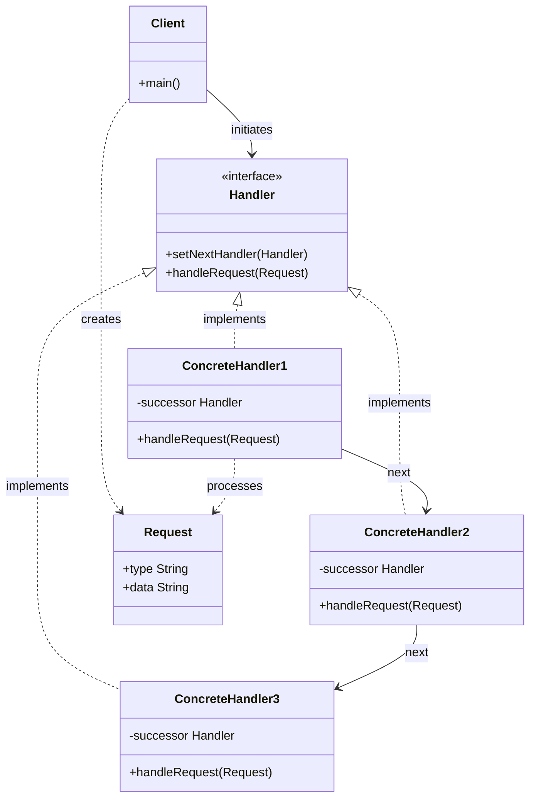
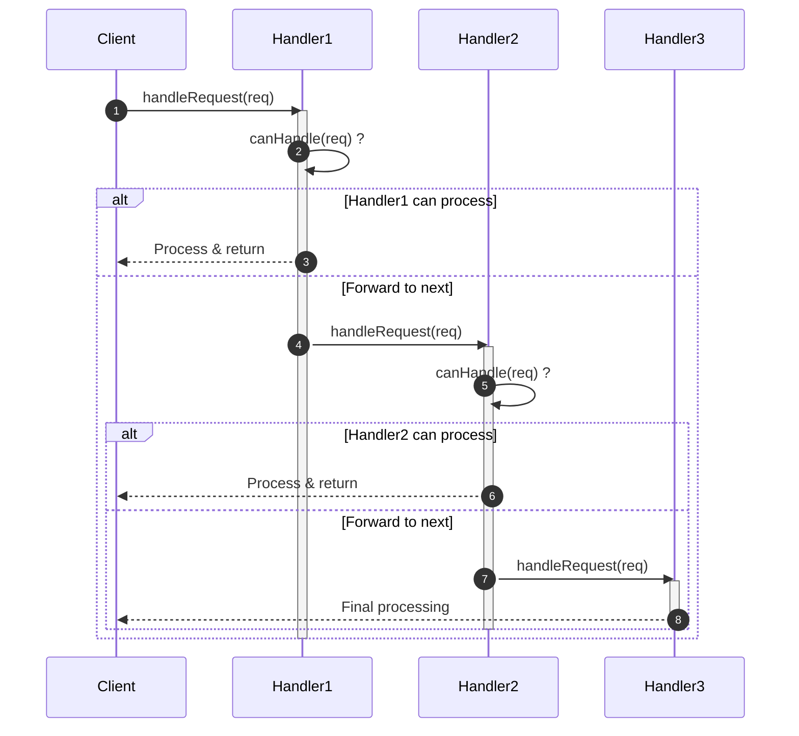
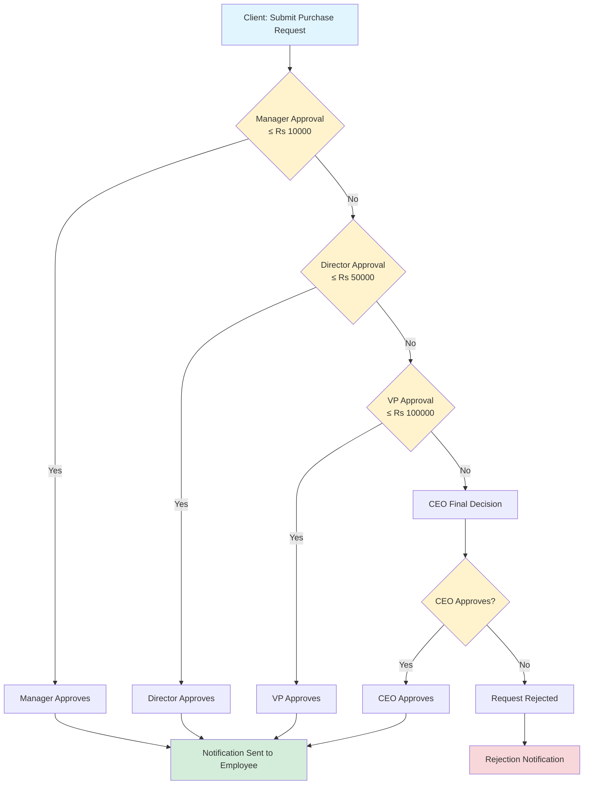
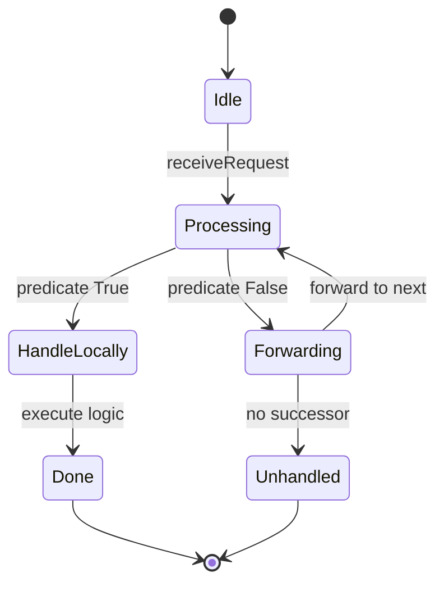
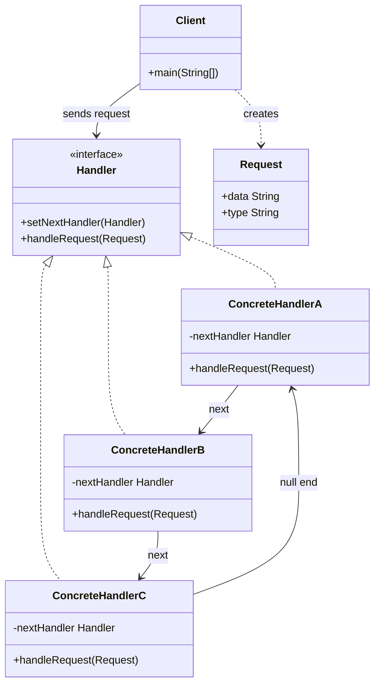

# Chain of Responsibility Pattern

<!-- SECTION_1_START -->
# Chain of Responsibility Pattern

> [!IMPORTANT]
> **KTU Syllabus Definition (OECST72A - Module 4: Behavioral Design Patterns)**
> The **Chain of Responsibility Pattern** is a behavioral design pattern that decouples the sender of a request from its receivers by giving multiple objects a chance to handle the request. The receiving objects are chained together, and the request is passed along the chain until an object handles it or it reaches the end of the chain.

## Core Technical Definition

The Gang of Four (GoF) formally defines the Chain of Responsibility Pattern as:

> *"Avoid coupling the sender of a request to its receiver by giving more than one object a chance to handle the request. Chain the receiving objects and pass the request along the chain until an object handles it."* — *Design Patterns: Elements of Reusable Object-Oriented Software*

**Key Terminology (KTU Board Standard Vocabulary):**

- **Handler**: The abstract interface or base class that defines the contract for handling requests and optionally holds a reference to the next handler in the chain.
- **ConcreteHandler**: The actual implementation class that processes specific types of requests. It either handles the request or forwards it to its successor.
- **Client**: The originator of the request. It dispatches the request to the first handler in the chain without knowing who ultimately processes it.
- **Request**: The object/parameter passed along the chain for processing.

> [!NOTE]
> **Single Responsibility Principle (SRP) Connection:** This pattern promotes loose coupling by separating the *issuing* of a request from its *handling*. The client is **not** required to know which object in the chain will process the request — it only needs to know that a chain exists.

## Conceptual Analogy / Intuition

Imagine a **customer support call center escalation system** 📞:

1. You call a support number with a billing query.
2. The **Level-1 Operator** picks up. If they can solve the issue (e.g., basic billing clarification), they handle it. Otherwise, they **forward** the call to Level-2.
3. The **Level-2 Technical Specialist** receives the call. If the problem falls within their expertise, they handle it. Otherwise, they **escalate** to Level-3.
4. The **Level-3 Manager** finally handles the most critical issues.

**What you (the caller) observed:**
- You never directly contacted the Manager. You only called the support number.
- Each level independently decided whether to handle the call or pass it forward.
- The chain is **dynamic** — new levels (e.g., Level-4 Expert) can be inserted without modifying the client or existing levels.

This is precisely how the Chain of Responsibility Pattern works: **requests flow through a sequence of handlers until one assumes responsibility**.

### Other Real-World Examples
- **ATM Cash Dispenser** 💵: ₹2000 → ₹500 → ₹100 notes are dispensed by separate handlers.
- **Java Servlet Filters**: An HTTP request passes through authentication, logging, and compression filters in order.
- **Java Exception Handling**: An exception propagates up the call stack until caught by an appropriate `catch` block.
- **Logging Frameworks (Log4j, SLF4J)**: Logs of varying severity (DEBUG → INFO → ERROR) are routed through chained appenders.

> [!VISUALIZATION CONTROL]
> **Concept:** Request flow through a linear chain of handlers
> **GeoGebra / Desmos Input Representation (Conceptual Graph):**
> * $x_0 = 0$ (Client origin)
> * Points: $(1, 0)$, $(2, 0)$, $(3, 0)$, $(4, 0)$ representing Handler-1, Handler-2, Handler-3, End-of-Chain
> * Directed edges: $(0,0) \to (1,0) \to (2,0) \to (3,0) \to (4,0)$ with stop-condition arrows
> **Visual Description:** A horizontal flow on the x-axis where the request (a point starting at x=0) traverses rightward, stopping at the first handler whose predicate evaluates `true`. If no handler matches, the request exits at $x = 4$ (unhandled).

<!-- SECTION_1_END -->

<!-- SECTION_2_START -->
# Deep Theoretical Analysis & KTU High-Yield Pattern Sheet

## Pattern Structure — The Three Pillars

The Chain of Responsibility pattern revolves around three structural components, each mapped to a clear responsibility:

### 1. Handler Interface / Abstract Class
- Declares the method to handle requests (e.g., `handleRequest()`).
- Holds a reference (often called `successor` or `nextHandler`) to the next handler.
- Often provides a default forwarding implementation.

### 2. Concrete Handler Subclasses
- Implement the handling logic for a specific category of requests.
- Decide either to:
  - **Process** the request and terminate the chain, OR
  - **Delegate** to the successor via `successor.handleRequest(request)`.

### 3. Client
- Builds and configures the chain.
- Initiates the request, but does not track the chain internally.

## Why Use Chain of Responsibility? (KTU High-Yield Justifications)

- **Decoupling:** Client has no compile-time dependency on concrete handlers. New handlers can be added without breaking existing code (**Open/Closed Principle** compliance).
- **Flexibility:** The chain structure can be modified at runtime (handlers can be added, removed, or reordered dynamically).
- **Single Responsibility:** Each handler focuses only on the requests it is designed to process.
- **Distribution of Responsibilities:** Complex conditional logic (`if-else` / `switch` ladders) gets distributed across focused classes.

## When NOT to Use

- When the request **must** be handled by a specific handler (no flexibility allowed).
- When the chain is rarely traversed and the indirection adds unnecessary complexity.
- When debugging becomes difficult because the actual handler is not statically determinable.

## KTU High-Yield Comparison Table

| Pattern Aspect | Chain of Responsibility | If-Else Chain | Command Pattern |
| :--- | :--- | :--- | :--- |
| **Coupling** | Loose (client decoupled from handlers) | Tight (logic embedded in client) | Loose (object encapsulates request) |
| **Extensibility** | High (add new ConcreteHandler) | Low (modify source code) | Medium (add new Command class) |
| **Runtime Reconfiguration** | Yes (chain is mutable) | No | Limited |
| **Request Destination** | Unknown to client | Known statically | Known statically |
| **Code Locality** | Distributed across classes | Single block | Distributed across classes |
| **Best Use Case** | Multi-level processing pipelines | Few simple branches | Action queuing, undo/redo |

## Real-World Engineering Utility

- **Web Frameworks (Spring Security):** Filter chains for authentication, authorization, and CORS validation. Each filter is a handler in the chain.
- **Middleware Architectures:** ASP.NET Core middleware pipeline where each component decides whether to process, modify, or forward the HTTP context.
- **Compilers:** Token passes through lexical, syntax, and semantic analysis stages — each stage is a potential handler.
- **Event Bubbling (GUI Frameworks):** DOM events bubble up through parent elements until a listener handles them.
- **Production Logging:** SLF4J/Log4j routes log events through appender chains (Console → File → Network).

> [!NOTE]
> **Engineering Insight:** In modern microservice architectures, this pattern inspires the concept of **middleware pipelines** and **aspect-oriented programming (AOP)**, where cross-cutting concerns (logging, security, transactions) are woven as chainable interceptors.

<!-- SECTION_2_END -->

<!-- SECTION_3_START -->
# Step-by-Step Implementation & Code

## Example 1: Classic Java Implementation — Support Ticket Escalation System

### Step 1: Define the Handler Interface

```java
// Handler.java — Defines the contract for all chain members
public interface SupportHandler {
    void setNextHandler(SupportHandler nextHandler);
    void handleRequest(SupportRequest request);
}
```

### Step 2: Define the Request Object

```java
// SupportRequest.java — Encapsulates the request data
public class SupportRequest {
    private final String type;       // "BASIC", "TECHNICAL", "CRITICAL"
    private final String description;
    private final int severity;      // 1 (low) to 10 (high)

    public SupportRequest(String type, String description, int severity) {
        if (severity < 1 || severity > 10) {
            throw new IllegalArgumentException("Severity must be between 1 and 10.");
        }
        this.type = type;
        this.description = description;
        this.severity = severity;
    }

    public String getType() { return type; }
    public String getDescription() { return description; }
    public int getSeverity() { return severity; }
}
```

### Step 3: Create the Abstract Base Handler (Optional but Recommended)

```java
// AbstractSupportHandler.java — Provides default forwarding behavior
public abstract class AbstractSupportHandler implements SupportHandler {
    protected SupportHandler nextHandler;

    @Override
    public void setNextHandler(SupportHandler nextHandler) {
        if (nextHandler == null) {
            throw new IllegalArgumentException("Next handler cannot be null.");
        }
        this.nextHandler = nextHandler;
    }

    // Default implementation: forward to next handler
    protected void passToNext(SupportRequest request) {
        if (nextHandler != null) {
            System.out.println("  ↪ Forwarding to: " + nextHandler.getClass().getSimpleName());
            nextHandler.handleRequest(request);
        } else {
            System.out.println("  ✖ End of chain reached. Request unhandled: "
                               + request.getDescription());
        }
    }
}
```

### Step 4: Implement Concrete Handlers

```java
// Level1Operator.java — Handles basic queries (severity 1-3)
public class Level1Operator extends AbstractSupportHandler {
    @Override
    public void handleRequest(SupportRequest request) {
        if (request.getSeverity() >= 1 && request.getSeverity() <= 3) {
            System.out.println("[Level-1 Operator] Handled request: "
                               + request.getDescription());
        } else {
            passToNext(request);
        }
    }
}
```

```java
// Level2Specialist.java — Handles technical issues (severity 4-7)
public class Level2Specialist extends AbstractSupportHandler {
    @Override
    public void handleRequest(SupportRequest request) {
        if (request.getSeverity() >= 4 && request.getSeverity() <= 7) {
            System.out.println("[Level-2 Specialist] Handled request: "
                               + request.getDescription());
        } else {
            passToNext(request);
        }
    }
}
```

```java
// Level3Manager.java — Handles critical escalations (severity 8-10)
public class Level3Manager extends AbstractSupportHandler {
    @Override
    public void handleRequest(SupportRequest request) {
        if (request.getSeverity() >= 8 && request.getSeverity() <= 10) {
            System.out.println("[Level-3 Manager] Handled CRITICAL request: "
                               + request.getDescription());
        } else {
            passToNext(request);
        }
    }
}
```

### Step 5: Client Code — Build the Chain and Dispatch Requests

```java
// Client.java — Composes the chain and submits requests
public class SupportClient {
    public static void main(String[] args) {
        // Step A: Instantiate all concrete handlers
        SupportHandler level1 = new Level1Operator();
        SupportHandler level2 = new Level2Specialist();
        SupportHandler level3 = new Level3Manager();

        // Step B: Link the chain dynamically
        level1.setNextHandler(level2);
        level2.setNextHandler(level3);
        // level3 has no successor; requests reaching it are processed or dropped

        // Step C: Client dispatches requests — it knows ONLY the first handler
        SupportRequest req1 = new SupportRequest("BASIC",     "Password reset", 2);
        SupportRequest req2 = new SupportRequest("TECHNICAL", "Server downtime", 6);
        SupportRequest req3 = new SupportRequest("CRITICAL",  "Data breach",     9);

        System.out.println("--- Dispatching Request 1 ---");
        level1.handleRequest(req1);

        System.out.println("\n--- Dispatching Request 2 ---");
        level1.handleRequest(req2);

        System.out.println("\n--- Dispatching Request 3 ---");
        level1.handleRequest(req3);
    }
}
```

### Step 6: Expected Output Trace

```text
--- Dispatching Request 1 ---
[Level-1 Operator] Handled request: Password reset

--- Dispatching Request 2 ---
  ↪ Forwarding to: Level2Specialist
[Level-2 Specialist] Handled request: Server downtime

--- Dispatching Request 3 ---
  ↪ Forwarding to: Level2Specialist
  ↪ Forwarding to: Level3Manager
[Level-3 Manager] Handled CRITICAL request: Data breach
```

---

## Example 2: Python Implementation — ATM Cash Dispenser

This second example demonstrates the pattern's applicability across languages. The ATM dispenses a requested amount using ₹2000, ₹500, and ₹100 note dispensers chained in descending denomination order.

```python
# atm_chain.py
from abc import ABC, abstractmethod
from typing import Optional


class DispenseHandler(ABC):
    """Abstract Handler — defines the chain contract."""

    def __init__(self) -> None:
        self._next_handler: Optional[DispenseHandler] = None

    def set_next(self, handler: "DispenseHandler") -> "DispenseHandler":
        if handler is None:
            raise ValueError("Next handler cannot be None.")
        self._next_handler = handler
        return handler  # enables fluent chaining

    @abstractmethod
    def dispense(self, amount: int) -> None:
        """Each handler either processes or forwards the request."""
        pass

    def _forward(self, amount: int) -> None:
        if self._next_handler is not None:
            self._next_handler.dispense(amount)
        elif amount > 0:
            print(f"  ✖ Cannot dispense remaining ₹{amount} — no handler available.")


class TwoThousandDispenser(DispenseHandler):
    def dispense(self, amount: int) -> None:
        if amount >= 2000:
            num_notes = amount // 2000
            remainder  = amount % 2000
            print(f"  ₹2000 x {num_notes} dispensed.")
            if remainder != 0:
                self._forward(remainder)
        else:
            self._forward(amount)


class FiveHundredDispenser(DispenseHandler):
    def dispense(self, amount: int) -> None:
        if amount >= 500:
            num_notes = amount // 500
            remainder  = amount % 500
            print(f"  ₹500 x {num_notes} dispensed.")
            if remainder != 0:
                self._forward(remainder)
        else:
            self._forward(amount)


class HundredDispenser(DispenseHandler):
    def dispense(self, amount: int) -> None:
        if amount >= 100:
            num_notes = amount // 100
            remainder  = amount % 100
            print(f"  ₹100 x {num_notes} dispensed.")
            if remainder != 0:
                # Final check: amount must be perfectly divisible
                if remainder == 0:
                    print("  ✓ Exact amount dispensed successfully.")
                else:
                    self._forward(remainder)
        elif amount == 0:
            print("  ✓ Exact amount dispensed successfully.")
        else:
            self._forward(amount)


# -------------------- Client / Test Driver --------------------
if __name__ == "__main__":
    # Build the chain
    two_k  = TwoThousandDispenser()
    five_h = FiveHundredDispenser()
    one_h  = HundredDispenser()

    two_k.set_next(five_h).set_next(one_h)   # fluent chain construction

    # Dispatch requests
    print("--- Withdrawing ₹2,600 ---")
    two_k.dispense(2600)

    print("\n--- Withdrawing ₹3,700 ---")
    two_k.dispense(3700)

    print("\n--- Withdrawing ₹1,500 ---")
    two_k.dispense(1500)
```

### Sample Output

```text
--- Withdrawing ₹2,600 ---
  ₹2000 x 1 dispensed.
  ₹500 x 1 dispensed.
  ₹100 x 1 dispensed.
  ✓ Exact amount dispensed successfully.

--- Withdrawing ₹3,700 ---
  ₹2000 x 1 dispensed.
  ₹500 x 3 dispensed.
  ₹100 x 2 dispensed.
  ✓ Exact amount dispensed successfully.

--- Withdrawing ₹1,500 ---
  ₹500 x 3 dispensed.
  ✓ Exact amount dispensed successfully.
```

### Mathematical Justification of the Chain Logic

The dispenser chain implements the following recurrence relation for any withdrawal amount $A$:

$$
A = 2000 \cdot n_1 + 500 \cdot n_2 + 100 \cdot n_3 + r
$$

where $n_1, n_2, n_3 \geq 0$ are the counts of each denomination and $r$ is the remainder. Each handler resolves its own variable:

$$
n_1 = \left\lfloor \frac{A}{2000} \right\rfloor, \quad n_2 = \left\lfloor \frac{A \bmod 2000}{500} \right\rfloor, \quad n_3 = \left\lfloor \frac{A \bmod 500}{100} \right\rfloor
$$

For the request to be **fully processable**, the condition $r = 0$ must hold at the final stage. Otherwise, the chain reports an unhandled remainder — an explicit signal of partial failure.

---

## Example 3: Bonus — Purchase Approval Workflow (Real-World HR Scenario)

A classic KTU-asked scenario: an employee's purchase order must be approved by an authority based on amount.

| Handler | Approval Range | Role |
| :--- | :--- | :--- |
| Manager | Up to ₹10,000 | Team-level approvals |
| Director | Up to ₹50,000 | Department-level approvals |
| VP | Up to ₹1,00,000 | Division-level approvals |
| CEO | Any amount | Final authority |

The structural code mirrors the previous examples with `ApprovalHandler` as the abstract base. Each concrete handler validates the amount against its threshold and either approves, forwards, or rejects.

<!-- SECTION_3_END -->

<!-- SECTION_4_START -->
# Structural Diagrams & Schematics

## Diagram 1: Chain of Responsibility — Class Diagram (UML-Mapped)



## Diagram 2: Request Flow — Sequence Diagram



## Diagram 3: Functional Architecture Flow — Purchase Approval Pipeline



## Diagram 4: Handler Decision Logic — State Transition Block



## KTU Quick Reference Card

| Component | Role | KTU 2-Mark Trigger Words |
| :--- | :--- | :--- |
| Handler | Interface for chain nodes | "Define the chain contract" |
| ConcreteHandler | Implements specific logic | "Process specific request types" |
| Successor Link | Points to next handler | "Forwarding reference" |
| Client | Originates the request | "Decoupled sender" |
| Request | Data passed along the chain | "Encapsulated payload" |

<!-- SECTION_4_END -->

<!-- SECTION_5_START -->
# KTU 2024 Scheme Examination Question Bank

## Part A — Short Answer Questions (3 Marks Each)

### Question 1 `[KTU University Exam – July 2024]`
**Define the Chain of Responsibility design pattern. List any TWO situations where it is commonly applied.** *(CO1, Remember — 3 Marks)*

**Model Answer (Valuation Key):**

The Chain of Responsibility is a behavioral design pattern that passes a request along a chain of handlers until one of them handles it or the chain ends. **[1 Mark]**
It decouples the sender from the receivers, allowing multiple objects a chance to handle the request without the sender knowing which one will do so. **[1 Mark]**

**Two common situations:** **[1 Mark]**
1. Multi-level customer support escalation systems (Level-1 → Level-2 → Manager).
2. Servlet filters in Java web applications (Authentication → Logging → Compression filters).
*(Any two valid scenarios accepted. ATM cash dispenser, exception handling chains are also valid.)*

---

### Question 2 `[KTU University Exam – Dec 2023]`
**State TWO advantages and ONE disadvantage of the Chain of Responsibility pattern.** *(CO2, Understand — 3 Marks)*

**Model Answer:**

**Advantages:** **[2 Marks — 1 each]**
1. **Decoupling:** The sender of a request is not coupled to its receivers. The client only knows about the first handler in the chain.
2. **Flexibility / Open-Closed Principle:** New handlers can be added to the chain without modifying existing code, supporting easy extension.

**Disadvantage:** **[1 Mark]**
1. **No Guaranteed Handling:** Since the request may not be handled by any handler (it may reach the end of the chain unhandled), debugging and request tracking become more complex. *(Other valid answers: deep chain performance overhead, no clear indication of which handler processed the request.)*

---

## Part B — Long Answer Questions (14 Marks Each — Internal Choice)

### Question 3A `[KTU University Exam – July 2024]`
**(a)** Explain the intent and structure of the Chain of Responsibility design pattern with a neat UML class diagram. List the key participants. **[7 Marks]**

**(b)** Design a `LeaveApproval` system for a college where leave requests are processed in the following hierarchy: **Class Teacher** (≤ 2 days), **HOD** (3–5 days), **Principal** (> 5 days). Write the complete Java code and explain the chain construction. **[7 Marks]**

---

#### Model Solution — Part (a) **[7 Marks]**

**Intent:** The Chain of Responsibility pattern decouples the sender of a request from its receivers by giving multiple objects a chance to handle the request. The receivers are chained, and the request is passed along the chain until an object handles it. **[2 Marks]**

**Key Participants:** **[2 Marks]**
- **Handler (e.g., `SupportHandler`)** — Declares the interface for handling requests and optionally defines the successor link.
- **ConcreteHandler (e.g., `Level1Operator`, `Level2Specialist`)** — Handles requests it is responsible for; otherwise forwards to its successor.
- **Client (e.g., `SupportClient`)** — Initiates the request to a `ConcreteHandler` object on the chain.
- **Request (e.g., `SupportRequest`)** — The data object passed along the chain.

**UML Class Diagram:** **[3 Marks]**



---

#### Model Solution — Part (b) **[7 Marks]**

**LeaveRequest.java** (Request class) — **[1 Mark]**

```java
public class LeaveRequest {
    private final String studentName;
    private final int days;

    public LeaveRequest(String studentName, int days) {
        this.studentName = studentName;
        this.days = days;
    }
    public String getStudentName() { return studentName; }
    public int getDays() { return days; }
}
```

**Approver.java** (Handler interface) — **[1 Mark]**

```java
public interface Approver {
    void setNextApprover(Approver next);
    void processLeave(LeaveRequest request);
}
```

**AbstractApprover.java** (Abstract base with default forwarding) — **[1 Mark]**

```java
public abstract class AbstractApprover implements Approver {
    protected Approver nextApprover;
    @Override
    public void setNextApprover(Approver next) {
        if (next == null) throw new IllegalArgumentException("Next approver cannot be null.");
        this.nextApprover = next;
    }
    protected void forward(LeaveRequest request) {
        if (nextApprover != null) {
            nextApprover.processLeave(request);
        } else {
            System.out.println("No approver available for "
                               + request.getDays() + " days leave.");
        }
    }
}
```

**ClassTeacher.java** — **[1 Mark]**

```java
public class ClassTeacher extends AbstractApprover {
    @Override
    public void processLeave(LeaveRequest request) {
        if (request.getDays() <= 2) {
            System.out.println("Class Teacher approved "
                               + request.getDays() + " days leave for "
                               + request.getStudentName());
        } else {
            forward(request);
        }
    }
}
```

**HOD.java** — **[1 Mark]**

```java
public class HOD extends AbstractApprover {
    @Override
    public void processLeave(LeaveRequest request) {
        if (request.getDays() >= 3 && request.getDays() <= 5) {
            System.out.println("HOD approved " + request.getDays()
                               + " days leave for " + request.getStudentName());
        } else {
            forward(request);
        }
    }
}
```

**Principal.java** — **[1 Mark]**

```java
public class Principal extends AbstractApprover {
    @Override
    public void processLeave(LeaveRequest request) {
        if (request.getDays() > 5) {
            System.out.println("Principal approved "
                               + request.getDays() + " days leave for "
                               + request.getStudentName());
        } else {
            forward(request);
        }
    }
}
```

**Chain Construction Explanation:** **[1 Mark]**

The client (e.g., `LeaveClient` main method) instantiates the three approvers, links them in a linear chain via `setNextApprover()`, and dispatches each `LeaveRequest` to the first approver (`ClassTeacher`). The request flows up the chain — Class Teacher checks first, then HOD, then Principal. The client is **decoupled** from the internal structure of the chain; it only knows the entry point.

> [!WARNING]
> **KTU Examiner's Valuation Warning — Common Pitfalls:**
> - **Forgetting to write the `Request` class** explicitly: -2 Marks. KTU examiners expect a self-contained solution with all four participants (Handler, ConcreteHandler, Request, Client).
> - **Missing the `forward()` mechanism**: If the student hardcodes references to specific successors (e.g., `hod.processLeave()` inside `ClassTeacher`), they lose 2 Marks for violating the pattern's intent.
> - **Not explaining chain construction**: The 1 Mark for "chain construction explanation" is frequently missed. Always state that the client is responsible for linking handlers.

---

### Question 3B `[KTU University Exam – July 2024]` *(Alternative Choice)*
**(a)** Compare the Chain of Responsibility pattern with the **Command** pattern. Highlight the differences in their intent, structure, and typical use cases with examples. **[7 Marks]**

**(b)** Implement a **logging framework** using the Chain of Responsibility pattern in Java where three log handlers exist: `ConsoleHandler` (handles INFO, WARN, ERROR), `FileHandler` (handles WARN, ERROR), and `EmailHandler` (handles ERROR only). Each handler must process the request independently and forward the remainder. Show the complete code. **[7 Marks]**

---

#### Model Solution — Part (a) **[7 Marks]**

**Comparison Table:** **[3 Marks]**

| Aspect | Chain of Responsibility | Command |
| :--- | :--- | :--- |
| **Intent** | Pass a request along a chain of handlers until one processes it | Encapsulate a request as an object, allowing parameterization and queuing |
| **Focus** | Decoupling sender from receivers | Decoupling invoker from the operation |
| **Structure** | Linear chain of handlers | Single command object + invoker + receiver |
| **Execution Control** | Distributed across chain members | Centralized in invoker |
| **Typical Use Case** | Support escalation, middleware, ATM | Undo/Redo, transactional behavior, queues |
| **Example** | Servlet filter chain in Java EE | `Runnable`, `ActionListener` in Swing |

**Differences in Intent:** **[2 Marks]**
- Chain of Responsibility focuses on **who** handles a request — a chain of potential handlers competes to process it.
- Command focuses on **what** action is to be performed — the request is turned into a stand-alone object that can be stored, queued, logged, or undone.

**Differences in Use Cases:** **[2 Marks]**
- Chain of Responsibility is used in **pipelines** (Spring Security filters, ASP.NET middleware, exception bubbling).
- Command is used in **action management** (GUI buttons wrapping actions, macro recording, transactional rollback systems).

---

#### Model Solution — Part (b) **[7 Marks]**

**LogLevel.java** (Enum) — **[0.5 Mark]**

```java
public enum LogLevel {
    INFO, WARN, ERROR
}
```

**LogRequest.java** — **[0.5 Mark]**

```java
public class LogRequest {
    private final LogLevel level;
    private final String message;
    public LogRequest(LogLevel level, String message) {
        this.level = level;
        this.message = message;
    }
    public LogLevel getLevel() { return level; }
    public String getMessage() { return message; }
}
```

**LogHandler.java** (Handler interface) — **[0.5 Mark]**

```java
public interface LogHandler {
    void setNext(LogHandler next);
    void handle(LogRequest request);
}
```

**AbstractLogHandler.java** — **[1 Mark]**

```java
public abstract class AbstractLogHandler implements LogHandler {
    protected LogHandler next;
    @Override
    public void setNext(LogHandler next) {
        if (next == null) throw new IllegalArgumentException("Next handler null.");
        this.next = next;
    }
    protected void forward(LogRequest request) {
        if (next != null) {
            next.handle(request);
        } else {
            System.out.println("End of chain — log dropped: " + request.getMessage());
        }
    }
}
```

**ConsoleHandler.java** — **[1 Mark]**

```java
public class ConsoleHandler extends AbstractLogHandler {
    @Override
    public void handle(LogRequest request) {
        if (request.getLevel() == LogLevel.INFO
            || request.getLevel() == LogLevel.WARN
            || request.getLevel() == LogLevel.ERROR) {
            System.out.println("[CONSOLE] " + request.getLevel()
                               + " : " + request.getMessage());
        }
        // Note: Forwards regardless of whether it processed, per requirement
        forward(request);
    }
}
```

**FileHandler.java** — **[1 Mark]**

```java
public class FileHandler extends AbstractLogHandler {
    @Override
    public void handle(LogRequest request) {
        if (request.getLevel() == LogLevel.WARN
            || request.getLevel() == LogLevel.ERROR) {
            System.out.println("[FILE] " + request.getLevel()
                               + " : " + request.getMessage());
        }
        forward(request);
    }
}
```

**EmailHandler.java** — **[1 Mark]**

```java
public class EmailHandler extends AbstractLogHandler {
    @Override
    public void handle(LogRequest request) {
        if (request.getLevel() == LogLevel.ERROR) {
            System.out.println("[EMAIL] CRITICAL ALERT: " + request.getMessage());
        }
        forward(request);
    }
}
```

**LoggingClient.java** (Chain construction & dispatch) — **[1.5 Marks]**

```java
public class LoggingClient {
    public static void main(String[] args) {
        LogHandler console = new ConsoleHandler();
        LogHandler file    = new FileHandler();
        LogHandler email   = new EmailHandler();

        console.setNext(file);
        file.setNext(email);

        System.out.println("--- Sending INFO log ---");
        console.handle(new LogRequest(LogLevel.INFO,  "Application started."));
        System.out.println("\n--- Sending WARN log ---");
        console.handle(new LogRequest(LogLevel.WARN,  "Configuration file missing."));
        System.out.println("\n--- Sending ERROR log ---");
        console.handle(new LogRequest(LogLevel.ERROR, "Database connection failed!"));
    }
}
```

**Expected Output Trace:** *(Implicit verification — important for full marks)*

```text
--- Sending INFO log ---
[CONSOLE] INFO : Application started.
End of chain — log dropped: Application started.

--- Sending WARN log ---
[CONSOLE] WARN : Configuration file missing.
[FILE] WARN : Configuration file missing.
End of chain — log dropped: Configuration file missing.

--- Sending ERROR log ---
[CONSOLE] ERROR : Database connection failed!
[FILE] ERROR : Database connection failed!
[EMAIL] CRITICAL ALERT: Database connection failed!
End of chain — log dropped: Database connection failed!
```

> [!WARNING]
> **KTU Examiner's Valuation Warning — Logging Variant Pitfalls:**
> - **Read the question carefully**: The requirement is that each handler **processes AND forwards**. Many students mistakenly write `if-else return` logic, which **breaks** the chain. -2 Marks deduction.
> - **Missing the `LogLevel` enum**: Examiners expect an explicit severity level type, not raw `String` comparisons. -1 Mark.
> - **Not demonstrating output trace**: KTU board evaluators award 1 Mark for sample output. Always include a sample execution trace at the end.

---

## Topic Recap & Important Things to Remember

> [!IMPORTANT]
> **Rapid Revision Checklist — Chain of Responsibility Pattern**

- ✅ **Pattern Type:** Behavioral (GoF classification).
- ✅ **Core Intent:** Decouple the sender of a request from its receivers by chaining handlers; the request flows until one processes it or the chain ends.
- ✅ **Four Key Participants:** `Handler` (interface), `ConcreteHandler` (implementation), `Client` (originator), `Request` (data).
- ✅ **Successor Link:** Every handler holds a reference (`nextHandler`, `successor`) to the next link. Set via `setNextHandler()`.
- ✅ **Open/Closed Principle:** New handlers can be added without modifying existing ones — strong extension support.
- ✅ **Single Responsibility Principle:** Each handler focuses on one specific category of requests.
- ✅ **Trade-off — No Guaranteed Handling:** A request may pass through the entire chain unhandled. Always define a fallback behavior.
- ✅ **Key Use Cases:** Customer support escalation, ATM cash dispensers, servlet/ASP.NET filter pipelines, exception handling chains, GUI event bubbling, AOP interceptors, logging frameworks.
- ✅ **Anti-Use Cases:** Avoid when the request must always be handled by a specific known object, or when static dispatch is sufficient.
- ✅ **Implementation Tip:** Use an abstract base class to provide default `forward()` logic — this avoids code duplication across `ConcreteHandler` classes.
- ✅ **Differentiator from Command:** Chain of Responsibility focuses on *who* handles the request; Command focuses on *what* action is performed and its lifecycle.
- ✅ **Common Exam Verbs:** "Design a chain-based system", "Implement [domain] using CoR", "Compare CoR with [pattern]", "Draw UML for CoR".
- ✅ **UML Must-Haves:** Handler interface at the top, ConcreteHandlers connected by *next* associations, Client connected to the *first* handler only, Request as a separate class passed through the chain.
- ✅ **Coding Standard:** Always include boundary validation, `null` checks for successors, and a sample output trace in your KTU answers.
- ✅ **Real-Time Mapping:** Servlet filters in Java EE, Spring Security filter chain, ASP.NET Core middleware, Log4j appender chains.

<!-- SECTION_5_END -->
