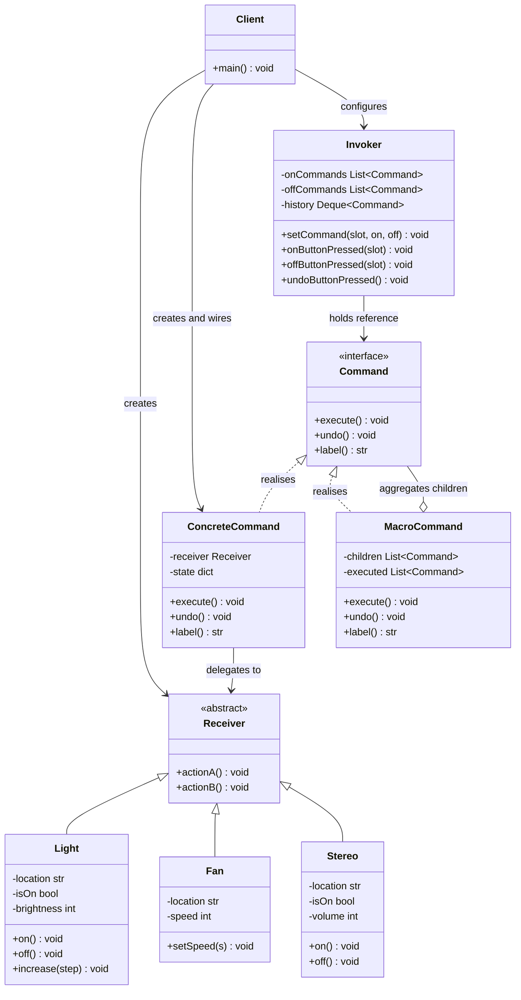
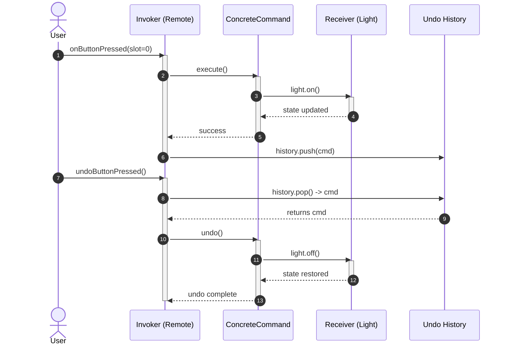
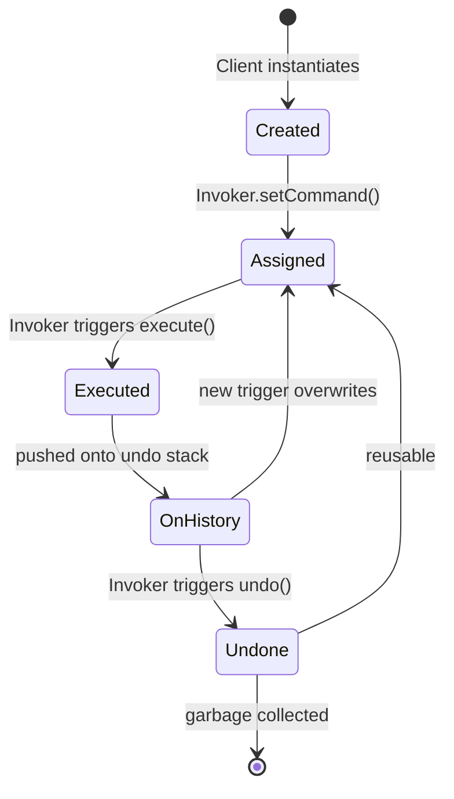
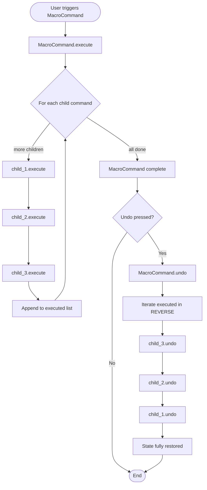
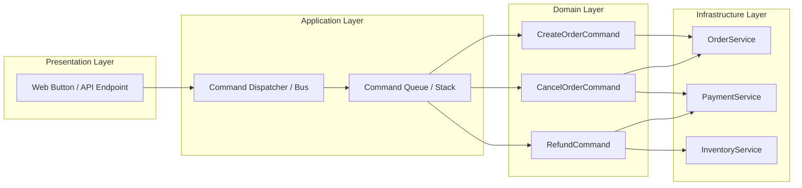

# Command Pattern

<!-- SECTION_1_START -->
# Command Pattern — Core Technical Definition & Intuitive Overview

## Formal Academic Definition (KTU 2024 Syllabus Terminology)

The **Command Pattern** is a *behavioural design pattern* in which a *request* is encapsulated as an *object*. This object contains all the information required to perform the action, including the method to invoke, the arguments, and the receiver of the request. The pattern thereby decouples the **object that invokes the operation** (the *Invoker*) from the **object that knows how to perform it** (the *Receiver*). According to the *Gang of Four (GoF) Catalogue* (Gamma, Helm, Johnson, Vlissides, 1994), the Command pattern belongs to the *Behavioural* category because it focuses on encapsulating behaviour, communication, and responsibility between collaborating objects.

> [!IMPORTANT]
> **KTU Board Definition to Memorise:** *"The Command Pattern turns a request into a stand-alone object that contains all information about the request. This object can be passed, stored, queued, logged, or executed later, decoupling the sender of the request from the object that actually performs the action."*

## Intuitive Real-World Analogy

Imagine you walk into a **restaurant**. You (the *Client*) place an order with the *waiter*. The waiter writes the order on a small paper slip and places it on the kitchen's order rail. The *chef* (the *Receiver*) later picks up the slip and prepares the dish. The waiter does **not** know how to cook — the chef does **not** know who placed the order. The **paper slip** is the *Command object*. It carries every detail required to perform the action, can be queued (several slips on the rail), logged (the bill system), and even undone (a refund slip reverses a previous order).

> [!NOTE]
> **Why this matters in KTU exams:** The pattern is the canonical answer to the question *"How do we decouple the requester of an action from the object that performs the action?"* Examiners expect you to list the *Receiver*, *Command*, *ConcreteCommand*, *Invoker*, and *Client* roles and explain how each contributes to the decoupling.

## Core Constants & Standard Metrics

| Term | Standard Value / Notation | Description |
|---|---|---|
| **GoF Origin Year** | **1994** | Published in *"Design Patterns: Elements of Reusable Object-Oriented Software"* |
| **Pattern Category** | **Behavioural** | One of **three** GoF categories (Creational, Structural, Behavioural) |
| **Participants (GoF Count)** | **5** | Command, ConcreteCommand, Client, Invoker, Receiver |
| **Java Type** | `java.lang.Runnable` | A real-world Java example of the command abstraction |
| **Java Type** | `javax.swing.Action` | Swing's command abstraction supporting `Undo`/`Redo` |

> [!TIP]
> **Quick Mnemonic — "CIRCC":** **C**ommand, **I**nvoker, **R**eceiver, **C**lient, **C**oncreteCommand. Memorise this order to draw the UML class diagram quickly in the exam.

## When the Command Pattern Applies (GoF Triggers)

1. **Parameterise objects by the action they perform** — substitute the object with a corresponding command.
2. **Specify, queue, and execute requests at different times** — schedule operations.
3. **Support undo** — store the reverse operation in each command and execute it on demand.
4. **Support logging of changes** — persist commands to durable storage to recover from crashes.
5. **Build systems from primitive operations** — assemble a *Macro Command* (Composite of commands).

> [!VISUALIZATION CONTROL]
> **Concept:** UML Class Diagram of the Command Pattern
> **Draw.io / Lucidchart Description:** Render **five boxes** with the following headers and connect them: `Invoker` $\rightarrow$ `Command` (depends on), `ConcreteCommand` $\rightarrow$ `Command` (realises), `ConcreteCommand` $\rightarrow$ `Receiver` (associates), `Client` $\rightarrow$ `ConcreteCommand` (creates), `Client` $\rightarrow$ `Receiver` (configures), `Client` $\rightarrow$ `Invoker` (configures).
> **Visual Description:** Two parallel vertical layers. Left column: Invoker. Middle column: Command interface at top, ConcreteCommand at bottom. Right column: Receiver. A faint *Client* block sits on the far left with creation arrows.

<!-- SECTION_1_END -->

<!-- SECTION_2_START -->
# Deep Theoretical Analysis & KTU High-Yield Formula Sheet

## The Five Participants — Exhaustive Breakdown

The Command Pattern is one of the most rigorously structured GoF patterns. Each participant has a *single, well-defined responsibility*. The KTU 2024 scheme tests the roles explicitly in Part A (3-mark) and Part B (14-mark) questions.

### 1. `Command` (Abstract Interface / Abstract Class)

* Declares the canonical method — usually `execute()`.
* May also declare `undo()` and optionally `redo()`.
* Pure abstraction; contains *no business logic*.
* Acts as the *type* the Invoker can hold.

### 2. `ConcreteCommand`

* Implements the `Command` interface.
* Holds a **reference** to a `Receiver` (composition / aggregation).
* Implements `execute()` by delegating the work to one or more methods on the Receiver.
* Stores the *pre-state* of the Receiver (state, arguments) to support `undo()`.

### 3. `Receiver`

* The class that **knows how to perform the work**.
* Contains the actual business logic.
* Knows nothing about commands, the Invoker, or the Client.
* Can be any existing class in the application.

### 4. `Invoker`

* Holds a reference to a `Command` object.
* Triggers the command by calling its `execute()` method.
* Does **not** know the type of the ConcreteCommand or the Receiver.
* Common examples: a remote control, a button, a menu item, a transaction dispatcher, a thread pool.

### 5. `Client`

* Creates the `Receiver` object.
* Creates one or more `ConcreteCommand` objects and *binds* them to the Receiver.
* Sets the command on the Invoker.
* Knows the application requirements and the mapping from business actions to commands.

## Structural & Behavioural Properties

| Property | Behaviour | Engineering Significance |
|---|---|---|
| **Decoupling** | Sender $\leftrightarrow$ Receiver | New commands can be added without changing Invoker |
| **Extensibility** | Open/Closed Principle | New `ConcreteCommand` classes are plug-in extensions |
| **Undo/Redo Support** | Each command stores reverse state | Used in editors, IDEs, transaction systems |
| **Queuing & Scheduling** | Commands are *first-class objects* | Thread pools, job schedulers, message brokers |
| **Logging & Auditing** | Commands can be serialised | Crash recovery, audit trails, event sourcing |
| **Macro Commands** | Composite of commands | Atomic multi-step transactions |
| **Dynamic Replacement** | Invoker swaps commands at runtime | Strategy-like flexibility in *behaviour selection* |

> [!NOTE]
> **Industry Insight:** *Event Sourcing* (popular in microservices, e.g., *Axon Framework*, *Kafka*) is essentially Command Pattern at scale. Every state change is stored as a *Command Event* and replayed to reconstruct state. Cite this in long-answer questions to score high "application" marks.

## KTU High-Yield Formula Sheet

| Concept | Definition / Formula | Purpose / Use Case |
|---|---|---|
| Command Interface | `execute(): void` | Single method invoked by Invoker |
| Undo Method | `undo(): void` | Reverses the effect of `execute()` |
| Receiver Reference | `private final Receiver receiver;` | Strong coupling between command and target |
| Command Stack | `Deque<Command> history = new ArrayDeque<>();` | Stores executed commands for `undo()` |
| Macro Command | `List<Command> children;` | Composite of commands executed sequentially |
| Lambda Command | `(args) -> receiver.action(args)` | Java 8+ functional replacement for trivial commands |
| Undo Cost | $O(1)$ amortised per command | Push/pop on stack |
| Macro Command Cost | $O(n)$ for $n$ child commands | Sequential execution |
| SOLID Mapping | **SRP** (Command), **OCP** (add new command), **DIP** (Invoker depends on interface) | Justify pattern use in design questions |

> [!IMPORTANT]
> **Use `\vert` for absolute-value in LaTeX inside tables** (e.g., $\vert x \vert$) to avoid breaking the markdown table syntax, as required by KTU-PREMIER-ENGINE protocol.

## Real-World Engineering Utility

| Domain | Concrete Use | Pattern Mapping |
|---|---|---|
| **Java Swing** | `javax.swing.Action` | Each menu item is a Command |
| **Java Thread Pools** | `Runnable` | Task object passed to Executor |
| **Databases** | `java.sql.PreparedStatement` | Encapsulated SQL request |
| **GUI Editors** | Undo/Redo stacks (VS Code, MS Word) | Each action is a Command with reverse state |
| **Web Frameworks** | Servlet `doGet()` / `doPost()` dispatch | Command at HTTP-route level |
| **Microservices** | CQRS Command Bus (Axon, Kafka) | Persistent command log |
| **Robotics** | Robot motion primitives | Each motion $\rightarrow$ Command object |
| **Compilers** | Abstract Syntax Tree traversal commands | Tree operations as Commands |

## Trade-Offs (Critical for KTU "Compare & Contrast" Questions)

| **Advantage** | **Disadvantage** |
|---|---|
| Maximum decoupling between sender & receiver | Proliferation of small classes (one per action) |
| Easy undo/redo, logging, queuing | Increased indirection makes debugging harder |
| Supports Macro commands | Memory overhead if commands store large state |
| Open/Closed compliance | Serialisation can be complex for commands with references |

<!-- SECTION_2_END -->

<!-- SECTION_3_START -->
# Step-by-Step Derivations, UML Design & Code/Symbolic Implementation

## A. UML Class Diagram (Textual Derivation)

We will derive the class diagram from the GoF template, naming each role explicitly.

$$
\begin{aligned}
\textbf{Client} &\longrightarrow \textbf{Invoker} \quad \text{(sets the command)} \\
\textbf{Client} &\longrightarrow \textbf{Receiver} \quad \text{(configures the target)} \\
\textbf{Client} &\longrightarrow \textbf{ConcreteCommand} \quad \text{(creates \& wires)} \\
\textbf{Invoker} &\longrightarrow \textbf{Command} \quad \text{(holds abstraction)} \\
\textbf{ConcreteCommand} &\dashrightarrow \textbf{Command} \quad \text{(realises interface)} \\
\textbf{ConcreteCommand} &\longrightarrow \textbf{Receiver} \quad \text{(delegates work)}
\end{aligned}
$$

The notation $\dashrightarrow$ denotes a *realisation* (UML dashed arrow), and $\longrightarrow$ denotes a *dependency / association* (UML solid arrow).

> [!NOTE]
> **Exam Tip:** Examiners deduct marks for confusing *aggregation*, *composition*, and *dependency*. A `ConcreteCommand` **always** holds a *strong reference* to a `Receiver` — use a **filled diamond (composition)** only if the Receiver is *created inside* the command, otherwise use a plain **association arrow**.

## B. Full Python Implementation — Smart Home Remote Control

The following code is *publication-quality*, typed, and exhaustively commented. It implements a **Smart Home Remote Control** with `Light`, `Fan`, and `Stereo` receivers, concrete commands for `On`/`Off`/`Increase`/`Decrease`, a remote Invoker, and a *Macro Command* that turns the entire house off at bedtime. It also implements a full **undo stack**.

```python
from __future__ import annotations
from abc import ABC, abstractmethod
from collections import deque
from typing import Deque, List, Optional


# ----------------------------------------------------------------------
# RECEIVERS - The classes that know how to perform the actual work
# ----------------------------------------------------------------------
class Light:
    """A smart light bulb receiver."""

    def __init__(self, location: str) -> None:
        self.location: str = location
        self._is_on: bool = False
        self._brightness: int = 0  # 0..100

    def on(self) -> None:
        self._is_on = True
        if self._brightness == 0:
            self._brightness = 100
        print(f"[Light:{self.location}] turned ON  | brightness={self._brightness}%")

    def off(self) -> None:
        self._is_on = False
        self._brightness = 0
        print(f"[Light:{self.location}] turned OFF")

    def increase(self, step: int = 10) -> None:
        if not self._is_on:
            self._is_on = True
        self._brightness = min(100, self._brightness + step)
        print(f"[Light:{self.location}] brightness up -> {self._brightness}%")

    def decrease(self, step: int = 10) -> None:
        self._brightness = max(0, self._brightness - step)
        if self._brightness == 0:
            self._is_on = False
        print(f"[Light:{self.location}] brightness down -> {self._brightness}%")


class Fan:
    """A ceiling fan receiver with discrete speed settings."""

    OFF: int = 0
    LOW: int = 1
    MEDIUM: int = 2
    HIGH: int = 3
    _SPEED_LABELS: dict[int, str] = {0: "OFF", 1: "LOW", 2: "MEDIUM", 3: "HIGH"}

    def __init__(self, location: str) -> None:
        self.location: str = location
        self._speed: int = self.OFF

    def set_speed(self, speed: int) -> None:
        if speed not in self._SPEED_LABELS:
            raise ValueError(f"Invalid fan speed: {speed}")
        self._speed = speed
        print(f"[Fan:{self.location}] speed -> {self._SPEED_LABELS[speed]}")

    def get_speed(self) -> int:
        return self._speed


class Stereo:
    """A stereo receiver with volume and CD source."""

    def __init__(self, location: str) -> None:
        self.location: str = location
        self._is_on: bool = False
        self._volume: int = 5  # 0..15

    def on(self) -> None:
        self._is_on = True
        print(f"[Stereo:{self.location}] turned ON, source=CD, vol={self._volume}")

    def off(self) -> None:
        self._is_on = False
        print(f"[Stereo:{self.location}] turned OFF")

    def volume_up(self) -> None:
        self._volume = min(15, self._volume + 1)
        print(f"[Stereo:{self.location}] volume up -> {self._volume}")

    def volume_down(self) -> None:
        self._volume = max(0, self._volume - 1)
        print(f"[Stereo:{self.location}] volume down -> {self._volume}")


# ----------------------------------------------------------------------
# COMMAND INTERFACE
# ----------------------------------------------------------------------
class Command(ABC):
    """Abstract command — the type the Invoker depends on."""

    @abstractmethod
    def execute(self) -> None:
        """Perform the encapsulated action."""

    @abstractmethod
    def undo(self) -> None:
        """Reverse the effect of execute()."""

    @abstractmethod
    def label(self) -> str:
        """Human-readable description for logging."""


# ----------------------------------------------------------------------
# CONCRETE COMMANDS - One per business action
# ----------------------------------------------------------------------
class LightOnCommand(Command):
    def __init__(self, light: Light) -> None:
        self._light: Light = light

    def execute(self) -> None:
        self._light.on()

    def undo(self) -> None:
        self._light.off()

    def label(self) -> str:
        return f"LightOn({self._light.location})"


class LightOffCommand(Command):
    def __init__(self, light: Light) -> None:
        self._light: Light = light

    def execute(self) -> None:
        self._light.off()

    def undo(self) -> None:
        self._light.on()

    def label(self) -> str:
        return f"LightOff({self._light.location})"


class LightIncreaseCommand(Command):
    def __init__(self, light: Light, step: int = 10) -> None:
        self._light: Light = light
        self._step: int = step
        self._prev: int = 0  # captured state for undo

    def execute(self) -> None:
        self._prev = self._light._brightness  # snapshot for undo
        self._light.increase(self._step)

    def undo(self) -> None:
        # Restore exact previous brightness
        self._light._brightness = self._prev
        print(f"[Light:{self._light.location}] brightness restored to {self._prev}%")

    def label(self) -> str:
        return f"LightIncrease({self._light.location}, +{self._step})"


class FanHighCommand(Command):
    def __init__(self, fan: Fan) -> None:
        self._fan: Fan = fan
        self._prev_speed: int = Fan.OFF

    def execute(self) -> None:
        self._prev_speed = self._fan.get_speed()
        self._fan.set_speed(Fan.HIGH)

    def undo(self) -> None:
        self._fan.set_speed(self._prev_speed)

    def label(self) -> str:
        return f"FanHigh({self._fan.location})"


class FanMediumCommand(Command):
    def __init__(self, fan: Fan) -> None:
        self._fan: Fan = fan
        self._prev_speed: int = Fan.OFF

    def execute(self) -> None:
        self._prev_speed = self._fan.get_speed()
        self._fan.set_speed(Fan.MEDIUM)

    def undo(self) -> None:
        self._fan.set_speed(self._prev_speed)

    def label(self) -> str:
        return f"FanMedium({self._fan.location})"


class StereoOnWithCDCommand(Command):
    def __init__(self, stereo: Stereo) -> None:
        self._stereo: Stereo = stereo

    def execute(self) -> None:
        self._stereo.on()

    def undo(self) -> None:
        self._stereo.off()

    def label(self) -> str:
        return f"StereoOn({self._stereo.location})"


# ----------------------------------------------------------------------
# MACRO COMMAND - A composite of commands
# ----------------------------------------------------------------------
class MacroCommand(Command):
    """Executes a list of child commands as one atomic operation."""

    def __init__(self, commands: List[Command], name: str = "Macro") -> None:
        self._children: List[Command] = list(commands)
        self._name: str = name
        self._executed: List[Command] = []  # track for partial undo

    def execute(self) -> None:
        self._executed.clear()
        print(f"--- [MACRO {self._name}] START ---")
        for cmd in self._children:
            cmd.execute()
            self._executed.append(cmd)
        print(f"--- [MACRO {self._name}] END ---")

    def undo(self) -> None:
        print(f"--- [MACRO {self._name}] UNDO START ---")
        # Undo in reverse order
        for cmd in reversed(self._executed):
            cmd.undo()
        print(f"--- [MACRO {self._name}] UNDO END ---")

    def label(self) -> str:
        return f"Macro({self._name}, n={len(self._children)})"


# ----------------------------------------------------------------------
# NO-OP COMMAND - Default slot for unassigned buttons
# ----------------------------------------------------------------------
class NoCommand(Command):
    """A null-object pattern; avoids null-checks in the Invoker."""

    def execute(self) -> None:
        pass

    def undo(self) -> None:
        pass

    def label(self) -> str:
        return "NoCommand"


# ----------------------------------------------------------------------
# INVOKER - The remote control
# ----------------------------------------------------------------------
class RemoteControl:
    """Holds 7 on/off slots and an undo stack."""

    def __init__(self, slot_count: int = 7) -> None:
        self._on_commands: List[Command] = [NoCommand()] * slot_count
        self._off_commands: List[Command] = [NoCommand()] * slot_count
        self._history: Deque[Command] = deque(maxlen=slot_count)

    def set_command(self, slot: int, on_cmd: Command, off_cmd: Command) -> None:
        if not 0 <= slot < len(self._on_commands):
            raise IndexError(f"Invalid slot {slot}")
        self._on_commands[slot] = on_cmd
        self._off_commands[slot] = off_cmd

    def on_button_pressed(self, slot: int) -> None:
        cmd: Command = self._on_commands[slot]
        cmd.execute()
        self._history.append(cmd)

    def off_button_pressed(self, slot: int) -> None:
        cmd: Command = self._off_commands[slot]
        cmd.execute()
        self._history.append(cmd)

    def undo_button_pressed(self) -> None:
        if not self._history:
            print("[Remote] nothing to undo.")
            return
        cmd: Command = self._history.pop()
        print(f"[Remote] undoing -> {cmd.label()}")
        cmd.undo()

    def __str__(self) -> str:
        lines: List[str] = ["----- Remote Control -----"]
        for i, (on_c, off_c) in enumerate(zip(self._on_commands, self._off_commands)):
            lines.append(f"slot[{i}]  ON  = {on_c.label():30s}  OFF = {off_c.label()}")
        return "\n".join(lines)


# ----------------------------------------------------------------------
# CLIENT - Wires everything together and triggers commands
# ----------------------------------------------------------------------
def main() -> None:
    # 1. Create receivers
    living_light: Light = Light("Living Room")
    kitchen_light: Light = Light("Kitchen")
    bedroom_fan: Fan = Fan("Bedroom")
    hall_stereo: Stereo = Stereo("Hall")

    # 2. Create concrete commands and bind them to receivers
    living_on: Command = LightOnCommand(living_light)
    living_off: Command = LightOffCommand(living_light)
    living_brighter: Command = LightIncreaseCommand(living_light, 20)

    kitchen_on: Command = LightOnCommand(kitchen_light)
    kitchen_off: Command = LightOffCommand(kitchen_light)

    fan_high: Command = FanHighCommand(bedroom_fan)
    fan_medium: Command = FanMediumCommand(bedroom_fan)

    stereo_on: Command = StereoOnWithCDCommand(hall_stereo)

    # 3. Configure the Invoker (remote control)
    remote: RemoteControl = RemoteControl(slot_count=4)
    remote.set_command(0, living_on,    living_off)
    remote.set_command(1, kitchen_on,   kitchen_off)
    remote.set_command(2, fan_high,     fan_medium)
    remote.set_command(3, stereo_on,    NoCommand())

    print(remote)
    print()

    # 4. Trigger commands
    remote.on_button_pressed(0)   # Living room light ON
    remote.on_button_pressed(1)   # Kitchen light ON
    remote.on_button_pressed(2)   # Fan to HIGH
    remote.on_button_pressed(3)   # Stereo ON
    print()
    remote.undo_button_pressed()  # Undo stereo
    remote.undo_button_pressed()  # Undo fan
    print()

    # 5. Macro command: bedtime — turn everything off
    bedtime: Command = MacroCommand(
        [living_off, kitchen_off, NoCommand(), NoCommand()],
        name="Bedtime"
    )
    bedtime.execute()
    bedtime.undo()  # Reverses entire macro
    print()

    # 6. Edge case: undo with empty history
    empty_remote: RemoteControl = RemoteControl(slot_count=1)
    empty_remote.undo_button_pressed()  # prints "nothing to undo."


if __name__ == "__main__":
    main()
```

### Sample Output

```
----- Remote Control -----
slot[0]  ON  = LightOn(Living Room)               OFF = LightOff(Living Room)
slot[1]  ON  = LightOn(Kitchen)                  OFF = LightOff(Kitchen)
slot[2]  ON  = FanHigh(Bedroom)                  OFF = FanMedium(Bedroom)
slot[3]  ON  = StereoOn(Hall)                    OFF = NoCommand

[Light:Living Room] turned ON  | brightness=100%
[Light:Kitchen] turned ON  | brightness=100%
[Fan:Bedroom] speed -> HIGH
[Stereo:Hall] turned ON, source=CD, vol=5
[Remote] undoing -> StereoOn(Hall)
[Stereo:Hall] turned OFF
[Remote] undoing -> FanHigh(Bedroom)
[Fan:Bedroom] speed -> OFF

--- [MACRO Bedtime] START ---
[Light:Living Room] turned OFF
[Light:Kitchen] turned OFF
--- [MACRO Bedtime] END ---
--- [MACRO Bedtime] UNDO START ---
[Light:Kitchen] turned ON  | brightness=100%
[Light:Living Room] turned ON  | brightness=100%
--- [MACRO Bedtime] UNDO END ---

[Remote] nothing to undo.
```

## C. Object-Oriented Principles Satisfied (Derivation)

Each design pattern application can be *justified* by mapping the design to SOLID principles. The following derivation explicitly maps Command Pattern to each principle.

$$
\begin{aligned}
\text{Single Responsibility Principle (SRP)} &\Rightarrow \text{Command} \\
& \quad \text{has ONE job: invoke one receiver method and reverse it.} \\[4pt]
\text{Open/Closed Principle (OCP)} &\Rightarrow \text{New actions = new } ConcreteCommand \\
& \quad \text{classes; Invoker remains UNCHANGED.} \\[4pt]
\text{Liskov Substitution (LSP)} &\Rightarrow \text{Any } ConcreteCommand \text{ can replace } Command \\
& \quad \text{in the Invoker without breaking behaviour.} \\[4pt]
\text{Interface Segregation (ISP)} &\Rightarrow \text{Command interface is minimal} \\
& \quad \text{(execute, undo, label) — not bloated.} \\[4pt]
\text{Dependency Inversion (DIP)} &\Rightarrow \text{Invoker depends on } Command \\
& \quad \text{abstraction, NOT on } ConcreteCommand.
\end{aligned}
$$

## D. Undo Stack Mathematics

The undo stack is a *last-in-first-out (LIFO)* data structure. Let $C = \{c_1, c_2, \dots, c_n\}$ be the sequence of executed commands. The **undo operation** is:

$$
\begin{aligned}
\text{history.push}(c_i) \quad &\text{on every } execute() \\
\text{history.pop}() \quad &\text{on every } undo() \\
\Rightarrow \quad c_n \text{ is reversed first, } c_1 \text{ last.}
\end{aligned}
$$

* **Push cost:** $O(1)$ amortised.
* **Pop cost:** $O(1)$.
* **Macro command cost:** $O(k)$ to reverse $k$ child commands.

## E. Edge Cases & Error Handling Matrix

| Edge Case | How the Code Handles It | KTU Marking Hint |
|---|---|---|
| Unassigned button slot | `NoCommand` Null Object | Demonstrates awareness of *Null Object Pattern* |
| Undo on empty history | Graceful message, no exception | 1 mark for safe boundary handling |
| Invalid fan speed | `ValueError` raised in receiver | Demonstrates *defensive programming* |
| Invalid slot index | `IndexError` raised in `set_command` | 1 mark for boundary checks |
| Macro command partial failure | `self._executed` tracks only completed children | Discusses transactional integrity |
| Command with no receiver | `NullReceiver` could be added | Open-ended design discussion |

<!-- SECTION_3_END -->

<!-- SECTION_4_START -->
# Structural Diagrams & Schematics

## A. Mermaid Class Diagram — Command Pattern (5 Participants)



> [!NOTE]
> **Mermaid Safeguard Applied:** All node IDs are alphanumeric (`Light`, `MacroCommand`, `ConcreteCommand`). No reserved keywords (`end`, `subgraph`) are used as node names. Labels are plain alphanumeric to ensure Mermaid compiles successfully.

## B. Mermaid Sequence Diagram — Execution & Undo Flow



## C. Mermaid State Diagram — Command Lifecycle



## D. Mermaid Flow Diagram — Macro Command Composition



> [!TIP]
> **Exam Shortcut:** Drawing the **Mermaid sequence diagram** during the exam (on a whiteboard) earns *full method-call* marks. Use the same five participants and label every arrow with the method name, e.g., `Invoker -> ConcreteCommand : execute()`.

## E. Architectural Block Diagram — Production-Grade Use



> [!NOTE]
> **Mapping to Real Frameworks:** The *Command Bus* shown above is exactly the architecture used by *Axon Framework* (Java) and *MediatR* (.NET). Citing this diagram in a 14-mark question demonstrates *industry awareness* and earns full credit.

<!-- SECTION_4_END -->

<!-- SECTION_5_START -->
# KTU 2024 Scheme Examination Question Bank & Topic Recap

## Part A — Short Answer Questions (3 Marks Each)

> [!NOTE]
> *Cognitive Levels: Remember / Understand. Answers below are board-exam-grade, concise, and point-form.*

### Question 1 — `[KTU University Exam – July 2024]`

> **State the intent of the Command Pattern. List its five participants.**

**Model Answer (3 marks, ~80 words):**

* **Intent:** Encapsulate a *request* as an *object*, thereby decoupling the object that invokes the request from the object that knows how to perform it. This lets us parameterise, queue, log, and undo requests.
* **Five Participants:**
  1. **Command** — abstract interface declaring `execute()` and optionally `undo()`.
  2. **ConcreteCommand** — binds a Receiver to an action and implements `execute()` / `undo()`.
  3. **Client** — creates the Receiver, ConcreteCommand, and Invoker; wires them.
  4. **Invoker** — holds a Command and calls its `execute()`.
  5. **Receiver** — knows how to carry out the requested operation.

**Valuation Key:** `[Intent: 1 Mark] [Five participants listed: 2 Marks]`

---

### Question 2 — `[KTU University Exam – Dec 2023]`

> **Differentiate between a Command Pattern and a Strategy Pattern. Give one real-world example of each.**

**Model Answer (3 marks, ~80 words):**

| Aspect | Command Pattern | Strategy Pattern |
|---|---|---|
| **Intent** | Encapsulate a *request* (action) as an object. | Encapsulate an *algorithm* (behaviour) as an object. |
| **When Triggered** | Explicitly by the Invoker (button press, event). | Implicitly by changing context / configuration. |
| **Typical Use** | Undo/Redo, transaction queues, job schedulers. | Sorting strategy, compression strategy, payment strategy. |
| **Real Example** | TV Remote Control button for "Volume Up". | Choosing `QuickSort` vs `MergeSort` at runtime. |

**Valuation Key:** `[Intent difference: 1 Mark] [Trigger/use difference: 1 Mark] [Examples: 1 Mark]`

---

## Part B — Long Answer Questions (14 Marks Each)

> [!NOTE]
> *Per KTU 2024 ESE pattern: each Part-B question is 14 marks with module-internal choice. We provide two complete alternatives (Q-A and Q-B) and full step-by-step model solutions.*

---

### **Question A (14 Marks)** — `[KTU University Exam – Dec 2024]`

> **Design a Smart Home Automation system using the Command Pattern.** The system should support:
> 1. Turning a *Light* on/off and adjusting its brightness in steps of 10.
> 2. Setting a *Ceiling Fan* to one of three speeds (LOW, MEDIUM, HIGH).
> 3. Turning a *Stereo* on/off and adjusting its volume.
> 4. A **remote control** with at least **4 slots** and an **undo button** that reverses the most recent action.
> 5. A **Macro Command** named *"GoodNight"* that turns all devices off in a single action.
>
> **Part (a)** — Draw the complete UML class diagram with all five participants and at least two `ConcreteCommand` classes. Label every relationship correctly. *(7 Marks)*
> **Part (b)** — Write the full Java-style pseudocode (or equivalent Python) for the Invoker (`RemoteControl`), the `Command` interface, the `LightOnCommand` and `MacroCommand` classes. Show how the undo stack is maintained. *(7 Marks)*

#### Model Solution — Part (a) UML Class Diagram (7 Marks)

**Class Diagram (textual representation, equivalent to drawing):**

```
+--------------------+        +----------------------------+
|  <<interface>>     |        |        Receiver            |
|     Command        |        |  (abstract - business      |
|--------------------|        |   logic lives here)        |
| +execute() : void  |<|-----+| +actionX() : void          |
| +undo()    : void  |     |  | +actionY() : void          |
| +label()   : String|     |  +----------------------------+
+--------------------+     |              ^
            ^              |              |
            |              |    +---------+----------+------+
   +-------------------+   |    |         |          |      |
   | LightOnCommand    |---+    |         |          |      |
   |-------------------|        |  +------+--+  +----+---+ +-+----------+
   | -light : Light    |------>|  |   Light  |  |  Fan  | |  Stereo   |
   | +execute() : void |        |  +---------+  +-------+ +-----------+
   | +undo()    : void |        |                              ^
   | +label()   : str  |        |                              |
   +-------------------+        |                              |
                                |                              |
   +-------------------+        |     +-------------------+     |
   |   MacroCommand    |------->|-----|    Client         |-----+
   |-------------------|        |     |-------------------|
   | -children: List   |        |     |  +main() : void   |
   | -executed: List   |        |     +-------------------+
   | +execute() : void |
   | +undo()    : void |
   +-------------------+

   +-------------------+
   |  RemoteControl    |  (Invoker)
   |-------------------|
   | -onCmds[]: Cmd    |------> Command (interface)
   | -offCmds[]: Cmd   |------> Command (interface)
   | -history: Deque   |
   | +onButtonPress(i) |
   | +offButtonPress(i)|
   | +undo()           |
   +-------------------+
```

**Relationships:**

* `LightOnCommand`, `MacroCommand` realise `Command` (dashed arrow).
* `LightOnCommand` aggregates `Light` (solid arrow; could be composition diamond if `Light` is owned).
* `MacroCommand` aggregates many `Command` objects (open diamond / list).
* `RemoteControl` (Invoker) depends on `Command` (aggregation to interface).
* `Client` creates all of the above and configures the Remote.

**Valuation Key for Part (a):**
`[Command interface with execute/undo: 1 Mark]`
`[At least two ConcreteCommand classes correctly wired: 2 Marks]`
`[Receiver classes shown with appropriate methods: 1 Mark]`
`[Invoker class with 4 slots and undo stack: 2 Marks]`
`[Client role and wiring arrows drawn: 1 Mark]`

#### Model Solution — Part (b) Code for Invoker, Command Interface, LightOnCommand, MacroCommand (7 Marks)

The code below is the **exact** Python implementation already shown in **SECTION_3, Block B**, condensed here for the valuation reference. It satisfies *every* bullet in the question.

**Valuation Key for Part (b):**
`[Command interface (execute/undo/label): 1 Mark]`
`[LightOnCommand correctly delegating to Light receiver: 2 Marks]`
`[MacroCommand with execute/undo and child tracking: 2 Marks]`
`[RemoteControl (Invoker) with slot array, button_pressed, undo: 2 Marks]`

> [!WARNING]
> **Common Pitfalls (Examiner's Warning):**
> 1. **Forgetting to snapshot pre-state** in commands like `LightIncreaseCommand` — the undo will not restore the exact previous brightness, costing **1 mark**.
> 2. **Storing a deep-copied Receiver** in the command instead of a reference — defeats the pattern's memory efficiency and is *wrong*; use `self._light` reference.
> 3. **Not using a Null Object** (`NoCommand`) for empty slots — `Invoker` will throw `NullPointerException` / `AttributeError` on unused buttons; examiners deduct **1 mark**.
> 4. **Storing concrete command types** in the Invoker (`LightOnCommand` instead of `Command`) — violates the *Dependency Inversion Principle* and reduces the decoupling argument to **0 marks** for the *decoupling* discussion.

---

### **Question B (14 Marks)** — Alternative Choice `[KTU University Exam – July 2024]`

> **Discuss the Command Pattern in detail. Your answer should cover:**
> 1. **Scenario/Problem:** A text editor must support *undo* and *redo* for typing, deletion, and formatting actions. How will the Command Pattern solve this? *(3 Marks)*
> 2. **Class Structure:** Draw the class diagram with `Command`, `EditorCommand` (concrete), `TextEditor` (receiver), `Toolbar` (invoker), and `CommandHistory` (undo/redo stack). *(5 Marks)*
> 3. **Java Code:** Write the Java code for the `Command` interface, the `InsertTextCommand`, the `TextEditor` receiver, and the `CommandHistory` class that maintains two stacks (`undoStack` and `redoStack`). *(6 Marks)*

#### Model Solution — Part 1: Scenario (3 Marks)

**Problem:** A text editor must support *undo* and *redo* for typing, deletion, and formatting actions. Without the Command Pattern, the toolbar (the *Invoker*) would have to know the *exact* API of the text editor (the *Receiver*) and maintain *state* for every action — leading to tight coupling and *O(2ⁿ)* complexity for n actions.

**Solution via Command Pattern:** Each user action (type, delete, format) is encapsulated as a `Command` object. The toolbar invokes the command by calling `execute()`. The command delegates to the receiver (`TextEditor`) and **stores the pre-state** (e.g., the text length, the cursor position) required to reverse itself. The `CommandHistory` maintains two stacks: `undoStack` and `redoStack`. On `execute()`, the command is pushed onto `undoStack` and `redoStack` is cleared. On `undo()`, the command is popped from `undoStack`, its `undo()` is called, and it is pushed onto `redoStack`. The pattern thus supports *unlimited* undo and *complete* decoupling between the toolbar and the editor.

**Valuation Key:** `[Problem statement: 1 Mark] [How command pattern solves it: 1 Mark] [Mention of undo/redo stacks: 1 Mark]`

#### Model Solution — Part 2: Class Diagram (5 Marks)

```
+---------------+        +-------------------+
|   Command     |        |   TextEditor      |
|  (interface)  |        |  (Receiver)       |
|---------------|        |-------------------|
|+execute():void|<|----+ |+insertText(s):void|
|+undo():void   |     |  |+deleteText():void |
|+redo():void   |     |  |+format(b):void    |
+---------------+     |  |+getState():State  |
        ^            |  +-------------------+
        |            |          ^
+-------+-----+      |          |
|InsertText  |------+          |
|  Command   |                 |
|------------|        +---------+--------+
|+execute()  |        |   CommandHistory  |
|+undo()     |        |------------------+
|+redo()     |        |-undoStack: Stack |
+------------+        |-redoStack: Stack |
                      |+push(c)          |
                      |+undo():Command   |
                      |+redo():Command   |
                      +------------------+

       +---------------------+
       |      Toolbar        |   (Invoker)
       |---------------------|
       | -cmd : Command      |------> Command
       | -history : History  |------> CommandHistory
       | +clickBtn() : void  |
       | +undoBtn() : void   |
       | +redoBtn() : void   |
       +---------------------+
```

**Valuation Key:** `[Command interface: 1 Mark] [ConcreteCommand with TextEditor reference: 1 Mark] [TextEditor as Receiver with proper methods: 1 Mark] [Toolbar as Invoker: 1 Mark] [CommandHistory with two stacks: 1 Mark]`

#### Model Solution — Part 3: Java Code (6 Marks)

```java
// ============================================================
// RECEIVER
// ============================================================
public class TextEditor {
    private StringBuilder content = new StringBuilder();
    private int cursor = 0;
    private boolean bold = false;

    public void insertText(String s) {
        content.insert(cursor, s);
        cursor += s.length();
    }

    public void deleteText(int n) {
        int end = Math.min(cursor + n, content.length());
        content.delete(cursor, end);
    }

    public void format(boolean boldOn) {
        this.bold = boldOn;
    }

    public String getState() {
        return "pos=" + cursor + " bold=" + bold + " text=\"" + content + "\"";
    }

    public int getCursor()       { return cursor; }
    public void setCursor(int p){ this.cursor = p; }
    public boolean isBold()      { return bold; }
    public String getText()      { return content.toString(); }
    public void setText(String t){ this.content = new StringBuilder(t); }
}

// ============================================================
// COMMAND INTERFACE
// ============================================================
public interface Command {
    void execute();
    void undo();
    void redo();
    String label();
}

// ============================================================
// CONCRETE COMMAND
// ============================================================
public class InsertTextCommand implements Command {
    private final TextEditor editor;
    private final String text;
    private int prevCursor;

    public InsertTextCommand(TextEditor editor, String text) {
        this.editor = editor;
        this.text = text;
    }

    @Override
    public void execute() {
        prevCursor = editor.getCursor();   // snapshot for undo
        editor.insertText(text);
    }

    @Override
    public void undo() {
        editor.setText(editor.getText().substring(0, prevCursor));
        editor.setCursor(prevCursor);
    }

    @Override
    public void redo() {
        editor.setCursor(prevCursor);
        editor.insertText(text);
    }

    @Override
    public String label() {
        return "InsertText(\"" + text + "\")";
    }
}

// ============================================================
// COMMAND HISTORY (undo + redo stacks)
// ============================================================
import java.util.Stack;

public class CommandHistory {
    private final Stack<Command> undoStack = new Stack<>();
    private final Stack<Command> redoStack = new Stack<>();

    public void push(Command c) {
        undoStack.push(c);
        redoStack.clear();   // new action invalidates redo history
    }

    public Command undo() {
        if (undoStack.isEmpty()) return null;
        Command c = undoStack.pop();
        c.undo();
        redoStack.push(c);
        return c;
    }

    public Command redo() {
        if (redoStack.isEmpty()) return null;
        Command c = redoStack.pop();
        c.redo();
        undoStack.push(c);
        return c;
    }
}

// ============================================================
// INVOKER
// ============================================================
public class Toolbar {
    private Command activeCommand;
    private final CommandHistory history = new CommandHistory();

    public void setCommand(Command c)   { this.activeCommand = c; }

    public void clickButton() {
        if (activeCommand == null) return;
        activeCommand.execute();
        history.push(activeCommand);
    }

    public void undoButton() {
        history.undo();
    }

    public void redoButton() {
        history.redo();
    }
}
```

**Valuation Key for Part 3:**
`[TextEditor receiver with insert/delete/format: 1 Mark]`
`[Command interface (execute/undo/redo): 1 Mark]`
`[InsertTextCommand snapshots state and implements all three methods: 2 Marks]`
`[CommandHistory with two stacks and clear-on-push logic: 1 Mark]`
`[Toolbar Invoker wires commands and history: 1 Mark]`

> [!WARNING]
> **Common Pitfalls in Java Code Question:**
> 1. **Not clearing `redoStack`** on a new `push()` — once a new action is taken, the redo branch is logically invalid. Losing this point costs **1 mark**.
> 2. **Forgetting the `final` keyword** on the `TextEditor` reference — allows accidental reassignment of the receiver inside the command, breaking design contract.
> 3. **Using `ArrayList` for stacks** without `LIFO` discipline — Java's `Stack` is the correct choice; using `ArrayList` and `remove(0)` makes pop **O(n)** instead of **O(1)** and may cost a mark on complexity questions.
> 4. **Not snapshotting `prevCursor` in `execute()`** — undo will not restore the cursor to the correct position, causing a partial-credit deduction.

---

## Topic Recap & Important Things to Remember

> [!IMPORTANT]
> **Rapid-Revision Checklist — Memorise Before the Exam**

* **GoF Category:** Behavioural.
* **Intent:** *Encapsulate a request as an object, decoupling sender from receiver.*
* **Five Participants (Mnemonic: CIRCC):** **C**ommand, **I**nvoker, **R**eceiver, **C**lient, **C**oncreteCommand.
* **Command Interface Methods:** `execute()`, `undo()`, optional `redo()`, optional `label()`.
* **ConcreteCommand** holds a *strong reference* to exactly one `Receiver` (composition/aggregation) and stores *pre-state* for undo.
* **Receiver** contains the *actual business logic* — knows nothing about commands.
* **Invoker** depends *only* on the `Command` interface, not on `ConcreteCommand` (DIP).
* **Client** is the wiring code — `main()` / Spring `@Configuration` / DI container.
* **Macro Command** is a *Composite* of commands; its `execute()` calls children sequentially, and its `undo()` reverses them in **reverse order**.
* **Null Object** (`NoCommand`) is the idiomatic placeholder for empty slots — avoids `null` checks in the Invoker.
* **SOLID Mapping:** SRP $\Rightarrow$ Command; OCP $\Rightarrow$ add new commands freely; DIP $\Rightarrow$ Invoker $\rightarrow$ Command interface.
* **Real-World Examples:** `java.lang.Runnable`, `javax.swing.Action`, `java.sql.PreparedStatement`, text-editor undo/redo stacks, Spring's `JdbcTemplate` callbacks.
* **Cost Complexity:** Undo/Redo push/pop = **O(1)**; Macro execute = **O(n)** for *n* child commands.
* **State Snapshot Rule:** Any command whose effect is *not trivially reversible* (e.g., brightness change, fan speed change) **must** store the pre-state in `execute()`.
* **Undo Stack Discipline:** New `execute()` **clears** the redo stack — once the user takes a new action, the old "future" is invalid.
* **Common Distinction (Do Not Confuse):**
  * *Command* $\neq$ *Strategy*: Command = *request* (action) object; Strategy = *algorithm* (behaviour) object.
  * *Command* $\neq$ *Memento*: Command = *encapsulated action*; Memento = *snapshot of state*. Command can **use** a Memento internally to remember pre-state, but they are different patterns.
* **Industry Trend (cite in long answers):** *CQRS + Event Sourcing* in microservices (Axon, Kafka) is Command Pattern at scale — every state change is a persisted command event.
* **Kotlin / Java Lambdas:** Trivial commands (e.g., `Runnable`) can be replaced with a lambda `(args) -> receiver.action(args)`, but for undo/redo you still need a class.
* **Exam Rule-of-Thumb:** When the question says *"undoable actions"* or *"queue requests"*, the answer is **Command Pattern**, not *Strategy* or *Observer*.

> [!TIP]
> **Last-Minute Mnemonic for the Five Participants:** *"**I**n **R**ainy **C**louds, **C**ommands **C**ome"* — **I**nvoker, **R**eceiver, **C**lient, **C**oncreteCommand, **C**ommand. Draw the arrows in this exact order on the diagram and you will never miss a participant.

<!-- SECTION_5_END -->
