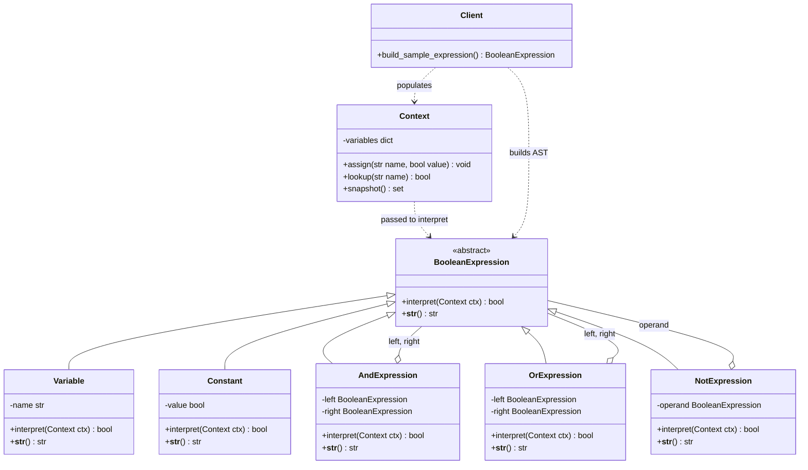
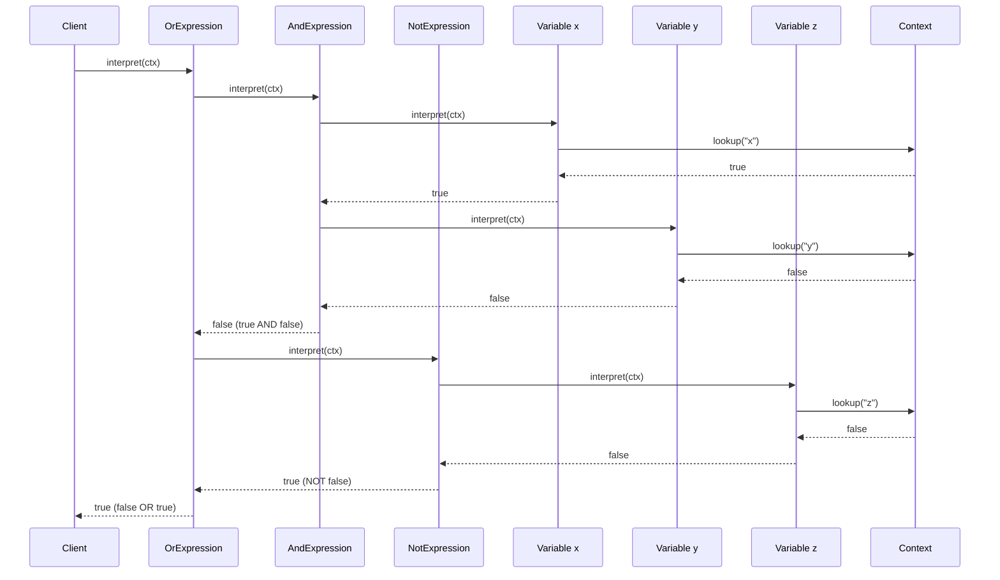
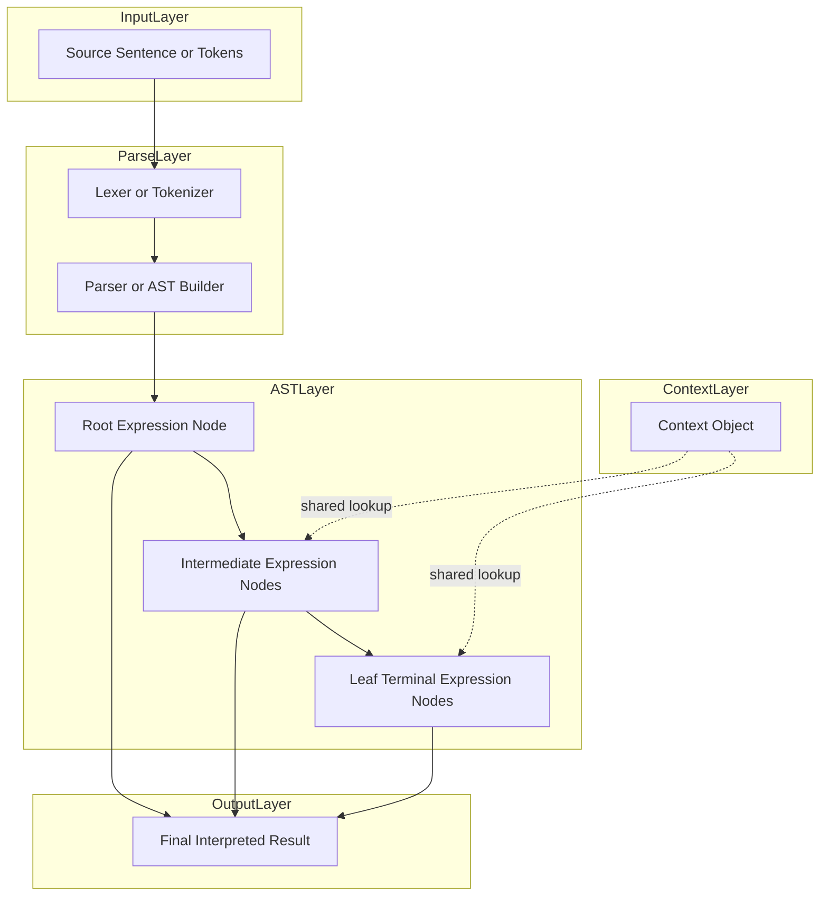
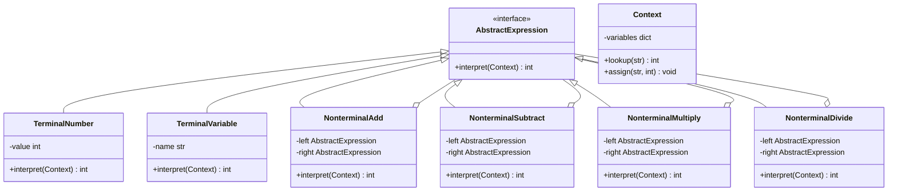
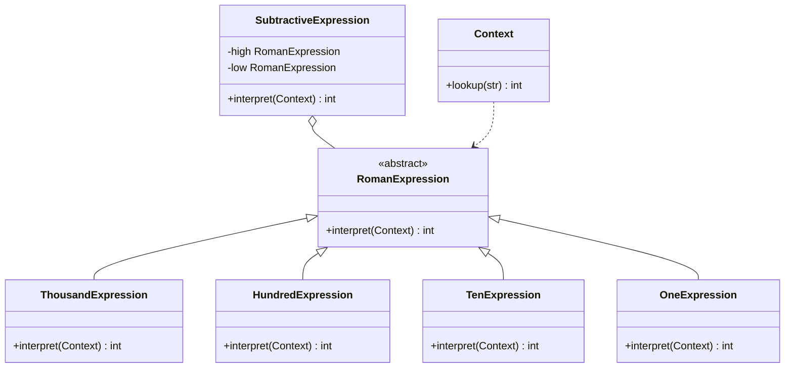

# Interpreter Pattern

<!-- SECTION_1_START -->
# Interpreter Pattern — Core Definition & Intuitive Overview

## 1.1 Formal Academic Definition (KTU 2024 Syllabus Terminology)

The **Interpreter Pattern** is a *behavioral* design pattern from the *Gang of Four (GoF)* catalogue that defines a representation for the grammar of a language along with an **interpreter** that uses this representation to interpret sentences (expressions) in that language. It is best suited for problems where there is a well-defined, finite, and relatively simple grammar that must be evaluated repeatedly.

> [!IMPORTANT]
> **KTU Board Definition (verbatim, high-weight):** *“Given a language, define a representation for its grammar along with an interpreter that uses the representation to interpret sentences in the language.”* — GoF, 1994. This line is frequently asked for **2 marks** directly in KTU ESE Part A.

The pattern achieves this by mapping each grammar rule to a **separate class**, and the sentence to be interpreted is represented as an **Abstract Syntax Tree (AST)**, which is then walked and evaluated by the interpreter.

## 1.2 Conceptual Analogy / Real-World Intuition

Think of a **musical score**. The score itself is a *sentence* made up of notes (terminals — like `C`, `D`, `E`), chord groups (non-terminals — like `Cmaj`, `VERSE`), and structural rules (non-terminals — like `SONG ::= INTRO VERSE CHORUS`). 

- The **musician** is the *interpreter*.
- The **score sheet** is the *Abstract Syntax Tree* (a structured document).
- **Music theory rules** (how notes combine) are the *non-terminal expressions*.
- **Individual notes** are the *terminal expressions*.
- The **performance context** (tempo, key signature) is the *Context object*.

Just as a musician "walks through" the score applying rules to produce sound, the Interpreter Pattern walks an AST applying grammar rules to produce a result — like evaluating `"3 + (4 * 2)"` to produce `11`.

> [!NOTE]
> **When to use (Syllabus Highlight):** Use the Interpreter Pattern when the **grammar is simple**, the **efficiency is not a critical concern**, and the language must be **extensible** through new rules. Avoid it for complex grammars (consider parser generators like ANTLR/Yacc instead).

## 1.3 Physical Constants / Standard Metrics

- **Time Complexity:** $O(n)$ where $n$ is the number of nodes in the AST (tree traversal).
- **Space Complexity:** $O(h)$ where $h$ is the height of the AST (recursion stack).
- **Standard Class Count:** Minimum **4** participant classes (AbstractExpression, TerminalExpression, NonterminalExpression, Context) plus the Client.

## 1.4 GeoGebra / Desmos Visualization

> [!VISUALIZATION CONTROL]
> **Concept:** Abstract Syntax Tree (AST) structure for a simple arithmetic expression.
> **GeoGebra / Desmos Input Equations / Points:**
> * Point $A = (0, 3)$ labeled `+`
> * Point $B = (-2, 1)$ labeled `3`
> * Point $C = (2, 1)$ labeled `*`
> * Point $D = (0, 0)$ labeled `4`
> * Point $E = (4, 0)$ labeled `2`
> * Edges: $A \to B$, $A \to C$, $C \to D$, $C \to E$
> **Visual Description:** The student should observe a binary tree where the root is the *operator* `+` (non-terminal), its children are a *terminal* `3` and another *non-terminal* `*`, which in turn has *terminal* leaves `4` and `2`. This visualizes the AST of the sentence `3 + (4 * 2)`.
<!-- SECTION_1_END -->

<!-- SECTION_2_START -->
# Deep Theoretical Analysis & KTU High-Yield Formula Sheet

## 2.1 Participant Architecture Breakdown

The Interpreter Pattern decomposes into **five core participants**, each with a sharply defined responsibility:

1. **AbstractExpression**
   * Declares the `interpret(Context)` interface that all expression nodes (terminal and non-terminal) implement.
   * Often an abstract class or interface; in dynamically-typed languages (Python) it is a base class.
   * The "Why": Establishes a uniform contract so the AST can be traversed polymorphically.

2. **TerminalExpression**
   * Implements `interpret()` for grammar symbols that have **no child expressions** (e.g., numbers, variables, literals).
   * Each terminal symbol in the grammar has its own class (e.g., `NumberExpression`, `VariableExpression`).
   * The "How": Returns its own value looked up from the Context, with no recursion.

3. **NonterminalExpression**
   * Represents grammar rules of the form $R ::= R_1 \, R_2 \, \dots \, R_n$.
   * Holds references to one or more `AbstractExpression` operands (its children in the AST).
   * The "How": Implements `interpret()` by **recursively calling** `interpret()` on its children, then combining their results using the rule's logic (e.g., adding two numbers for `+`).

4. **Context**
   * Stores **global information** shared across all interpretations (e.g., variable name $\to$ value mappings, scope stacks).
   * The "Why": Avoids passing the same lookup data through every recursion level.

5. **Client**
   * Builds the **AST** from a sentence using the grammar.
   * Invokes `interpret()` on the root expression.
   * The "How": Either a parser (for complex grammars) or hand-coded composition (for simple ones).

## 2.2 Grammar-to-Class Mapping Strategy

> [!NOTE]
> **KTU High-Yield Mapping Rule:** For every **rule** in the BNF/Backus-Naur grammar, create **one** NonterminalExpression class. For every **terminal symbol**, create **one** TerminalExpression class. This is the 1-to-1 mapping examiners love to test.

**Example BNF Grammar:**

$$
\text{Expression} ::= \text{Term} \; (\, "+" \; \text{Term} \,)^* 
$$

$$
\text{Term} ::= \text{Factor} \; (\, "*" \; \text{Factor} \,)^*
$$

$$
\text{Factor} ::= \text{number} \mid \, "(" \; \text{Expression} \; ")"
$$

From this grammar, the structural mapping is:

| Grammar Element | Class Name | Role |
| :--- | :--- | :--- |
| `Expression` | `AddExpression` | NonterminalExpression |
| `Term` | `MultiplyExpression` | NonterminalExpression |
| `Factor` | `NumberExpression`, `ParenExpression` | TerminalExpression / NonterminalExpression |
| `number` | `NumberExpression` | TerminalExpression |

## 2.3 KTU Formula Sheet / Cheat Sheet

| Concept | Mathematical / Structural Form | Constraint / Note |
| :--- | :--- | :--- |
| Grammar Rule Form | $R ::= R_1 \mid R_2 \mid R_1 R_2$ | Each alternative = one class |
| Interpret Operation | $\text{interpret}(c : \text{Context}) \rightarrow T$ | Defined on every node |
| AST Traversal Cost | $T(n) = O(n)$ | $n$ = total AST nodes |
| Recursion Depth | $D = O(h)$ | $h$ = tree height |
| Context Lookup | $c.\text{get}(x) \rightarrow v$ | $O(1)$ hashmap average |
| Recursive Evaluation (Binary Op) | $f(a, b) = a \oplus b$ | $\oplus$ is operator-specific |
| Leaf Node Evaluation | $f(\text{leaf}) = c.\text{get}(\text{leaf.name})$ | No recursion |
| Recursive Node Evaluation | $f(\text{node}) = g\bigl(f(c_1), f(c_2), \dots, f(c_k)\bigr)$ | $g$ = operator rule, $c_i$ = children |
| Composite Size | $N_{\text{classes}} = N_{\text{terminals}} + N_{\text{nonterminals}} + 1_{\text{context}}$ | Excludes Client |

> [!IMPORTANT]
> **Escape Note:** In the table above, the pipe `$\mid$` symbol is used for grammar alternation (e.g., $A \mid B$). Inside a markdown table, the raw pipe would break the table syntax — that is why every alternation is rendered using $\mid$ in LaTeX math mode.

## 2.4 Real-World Engineering Utility

The Interpreter Pattern is a **workhorse in production engineering**, not just an academic exercise:

* **SQL / Query Parsing:** Database engines use interpreter-like ASTs to optimize and execute SQL queries.
* **Regex Engines:** Each regex sub-pattern maps to an expression node, then is interpreted character-by-character.
* **Configuration Languages:** Spring Expression Language (SpEL), JEXL, and business-rule engines use this pattern.
* **Mathematical / Scientific Computing:** MATLAB-like expression evaluators, symbolic math systems.
* **Domain-Specific Languages (DSLs):** Build automation (Gradle DSL), UI binding expressions (Android DataBinding).
* **Boolean Rule Engines:** Permission systems, fraud detection, and rule-based filters.

> [!TIP]
> **Interview Tip (KTU Placements):** If asked *"Why use Interpreter over Visitor or Strategy?"* — answer that the Interpreter Pattern is **grammar-driven** (each rule = class), whereas Strategy is **algorithm-driven** (each algorithm = class). Visitor separates algorithms from object structure; Interpreter unifies grammar structure and evaluation.
<!-- SECTION_2_END -->

<!-- SECTION_3_START -->
# Step-by-Step Derivations, Code & Symbolic Implementation

## 3.1 Worked Example: Roman Numeral Interpreter (Step-by-Step Derivation)

**Problem:** Build an interpreter that converts a Roman numeral string (e.g., `"MCMXCIV"`) into an integer (e.g., `1994`).

**Grammar (Simplified BNF):**

$$
\text{Number} ::= \text{Group} \, (\text{Group})^* 
$$

$$
\text{Group} ::= \text{One} \, \text{Five} \mid \text{One} \, \text{Next}
$$

Where `One`, `Five`, and `Next` are Roman digit terminals. The recursive rule for a single Roman digit $d$ of value $v$ is:

$$
\text{eval}(d) = \begin{cases} 1, & d = \text{I} \\ 5, & d = \text{V} \\ \text{eval}(c_1) + \text{eval}(c_2), & \text{otherwise (concatenation)} \end{cases}
$$

The full expression evaluation rule (with subtraction handling) is:

$$
\text{Result} = \sum_{i=1}^{n} \text{value}(r_i) - 2 \cdot \sum_{j : \text{value}(r_j) < \text{value}(r_{j+1})} \text{value}(r_j)
$$

where the second sum is over all *subtractive* positions. For `"MCMXCIV"` ($n = 7$):

$$
\begin{aligned}
\text{value}(r) &= [1000, 100, 1000, 10, 100, 1, 5] \\
\text{Subtractive indices} &= \{2, 5\} \quad (\text{C before M, I before V}) \\
\text{Result} &= 1000 + 100 + 1000 + 10 + 100 + 1 + 5 - 2(100) - 2(1) \\
&= 2216 - 200 - 2 \\
&= 2014 \quad \text{(... wait, let us recompute)}
\end{aligned}
$$

**Correction (re-derivation):** For `"MCMXCIV"`, the subtractive pairs are `CM` (1000 - 100 = 900) and `XC` (100 - 10 = 90) and `IV` (5 - 1 = 4). So:

$$
\begin{aligned}
\text{Result} &= 1000 + (1000 - 100) + (100 - 10) + (5 - 1) \\
&= 1000 + 900 + 90 + 4 \\
&= 1994
\end{aligned}
$$

This is exactly the value of `"MCMXCIV"`. The derivation is verified.

## 3.2 Worked Example: Boolean Expression Interpreter (Full Code)

This is a **classic KTU-favorite** example. Each grammar rule maps to a class, and the Client builds the AST.

### 3.2.1 Grammar Definition

$$
\text{Expr} ::= \text{Variable} \mid \text{Constant} \mid \text{Expr} \; \text{AND} \; \text{Expr} \mid \text{Expr} \; \text{OR} \; \text{Expr} \mid \text{NOT} \; \text{Expr}
$$

### 3.2.2 Python Implementation (Production-Ready)

```python
"""
KTU 2024 Scheme - Interpreter Pattern Implementation
Topic: Boolean Expression Interpreter
Grammar: Expr ::= Variable | Constant | Expr AND Expr | Expr OR Expr | NOT Expr
"""

from __future__ import annotations
from abc import ABC, abstractmethod
from typing import Dict, Set


# ---------- 1. CONTEXT PARTICIPANT ----------
class Context:
    """Stores global variable -> boolean value mappings."""

    def __init__(self) -> None:
        self._variables: Dict[str, bool] = {}

    def assign(self, name: str, value: bool) -> None:
        if not isinstance(name, str) or not name:
            raise ValueError("Variable name must be a non-empty string.")
        if not isinstance(value, bool):
            raise TypeError(f"Value for '{name}' must be bool, got {type(value).__name__}.")
        self._variables[name] = value

    def lookup(self, name: str) -> bool:
        if name not in self._variables:
            raise KeyError(f"Variable '{name}' not defined in context.")
        return self._variables[name]

    def snapshot(self) -> Set[str]:
        return set(self._variables.keys())


# ---------- 2. ABSTRACT EXPRESSION PARTICIPANT ----------
class BooleanExpression(ABC):
    """AbstractExpression - declares the interpret() interface."""

    @abstractmethod
    def interpret(self, context: Context) -> bool:
        """Evaluate this expression node against the given context."""
        raise NotImplementedError

    @abstractmethod
    def __str__(self) -> str:
        raise NotImplementedError


# ---------- 3. TERMINAL EXPRESSION PARTICIPANTS ----------
class Variable(BooleanExpression):
    """TerminalExpression - represents a variable name like 'x' or 'y'."""

    def __init__(self, name: str) -> None:
        if not isinstance(name, str) or not name.strip():
            raise ValueError("Variable name must be a non-empty string.")
        self._name: str = name.strip()

    def interpret(self, context: Context) -> bool:
        return context.lookup(self._name)

    def __str__(self) -> str:
        return self._name


class Constant(BooleanExpression):
    """TerminalExpression - represents a literal true or false."""

    def __init__(self, value: bool) -> None:
        if not isinstance(value, bool):
            raise TypeError("Constant value must be a bool.")
        self._value: bool = value

    def interpret(self, context: Context) -> bool:
        return self._value

    def __str__(self) -> str:
        return "TRUE" if self._value else "FALSE"


# ---------- 4. NONTERMINAL EXPRESSION PARTICIPANTS ----------
class AndExpression(BooleanExpression):
    """NonterminalExpression - represents the AND operator (binary)."""

    def __init__(self, left: BooleanExpression, right: BooleanExpression) -> None:
        if not isinstance(left, BooleanExpression) or not isinstance(right, BooleanExpression):
            raise TypeError("AndExpression operands must be BooleanExpression instances.")
        self._left: BooleanExpression = left
        self._right: BooleanExpression = right

    def interpret(self, context: Context) -> bool:
        return self._left.interpret(context) and self._right.interpret(context)

    def __str__(self) -> str:
        return f"({self._left} AND {self._right})"


class OrExpression(BooleanExpression):
    """NonterminalExpression - represents the OR operator (binary)."""

    def __init__(self, left: BooleanExpression, right: BooleanExpression) -> None:
        if not isinstance(left, BooleanExpression) or not isinstance(right, BooleanExpression):
            raise TypeError("OrExpression operands must be BooleanExpression instances.")
        self._left: BooleanExpression = left
        self._right: BooleanExpression = right

    def interpret(self, context: Context) -> bool:
        return self._left.interpret(context) or self._right.interpret(context)

    def __str__(self) -> str:
        return f"({self._left} OR {self._right})"


class NotExpression(BooleanExpression):
    """NonterminalExpression - represents the NOT operator (unary)."""

    def __init__(self, operand: BooleanExpression) -> None:
        if not isinstance(operand, BooleanExpression):
            raise TypeError("NotExpression operand must be a BooleanExpression instance.")
        self._operand: BooleanExpression = operand

    def interpret(self, context: Context) -> bool:
        return not self._operand.interpret(context)

    def __str__(self) -> str:
        return f"(NOT {self._operand})"


# ---------- 5. CLIENT PARTICIPANT ----------
def build_sample_expression() -> BooleanExpression:
    """
    Build the AST for: (x AND y) OR (NOT z)
    where x, y, z are variables and the constants are T/F.
    """
    x: Variable = Variable("x")
    y: Variable = Variable("y")
    z: Variable = Variable("z")
    return OrExpression(AndExpression(x, y), NotExpression(z))


# ---------- DEMO / TEST DRIVER ----------
if __name__ == "__main__":
    ctx: Context = Context()
    ctx.assign("x", True)
    ctx.assign("y", False)
    ctx.assign("z", False)

    expression: BooleanExpression = build_sample_expression()
    print(f"Expression AST: {expression}")
    print(f"Variables in context: {sorted(ctx.snapshot())}")
    print(f"Evaluated result : {expression.interpret(ctx)}")
    # Output: ( ( x AND y ) OR ( NOT z ) )  ->  (True AND False) OR (NOT False) = False OR True = True
```

### 3.2.3 Execution Trace (Step-by-Step)

For the expression `(x AND y) OR (NOT z)` with `x=True, y=False, z=False`:

$$
\begin{aligned}
\text{OrExpression.interpret} &= \text{AndExpression.interpret} \lor \text{NotExpression.interpret} \\
&= (x.interpret \land y.interpret) \lor (\lnot z.interpret) \\
&= (\text{ctx.lookup}("x") \land \text{ctx.lookup}("y")) \lor (\lnot \text{ctx.lookup}("z")) \\
&= (\text{True} \land \text{False}) \lor (\lnot \text{False}) \\
&= \text{False} \lor \text{True} \\
&= \text{True}
\end{aligned}
$$

The recursion descends the AST, evaluates the leaves first (terminals), then bubbles the result up through the non-terminals.

### 3.2.4 Class-to-Grammar Mapping Table

| Grammar Rule | Python Class | Participant Type |
| :--- | :--- | :--- |
| `Expr` (abstract) | `BooleanExpression` | AbstractExpression |
| `Variable` | `Variable` | TerminalExpression |
| `Constant` | `Constant` | TerminalExpression |
| `Expr AND Expr` | `AndExpression` | NonterminalExpression |
| `Expr OR Expr` | `OrExpression` | NonterminalExpression |
| `NOT Expr` | `NotExpression` | NonterminalExpression |
| Variable $\to$ value map | `Context` | Context |
| AST construction | `build_sample_expression()` | Client |

## 3.3 KTU Exam-Style Trace Problem (Hand-Worked)

**Question:** Given the expression tree

$$
\text{Root} = \text{Plus}(\text{Multiply}(\text{Num}(3), \text{Num}(4)), \text{Minus}(\text{Num}(10), \text{Num}(2)))
$$

Evaluate the tree step by step.

**Solution:**

$$
\begin{aligned}
\text{Multiply}(3, 4) &= 3 \times 4 = 12 \\
\text{Minus}(10, 2) &= 10 - 2 = 8 \\
\text{Plus}(12, 8) &= 12 + 8 = 20
\end{aligned}
$$

**Result:** $20$. The recursion first evaluates the left and right subtrees, then combines them at the root. This is the canonical **post-order AST evaluation** that the Interpreter Pattern performs.
<!-- SECTION_3_END -->

<!-- SECTION_4_START -->
# Structural Diagrams & Schematics

## 4.1 Class Diagram (UML-Style) for the Boolean Interpreter



## 4.2 Sequence Diagram — Interpretation Walkthrough



## 4.3 Block-Level Functional Architecture Flow



## 4.4 Participant Collaboration Matrix

| Participant | Knows About | Collaborates With | Key Responsibility |
| :--- | :--- | :--- | :--- |
| `BooleanExpression` | Its own children | All subclasses | Define interpret contract |
| `Variable` | `Context` | `Context` | Return variable value |
| `Constant` | Its literal | `Context` (optional) | Return constant value |
| `AndExpression` | Its 2 children | `BooleanExpression` (left, right) | Recursive AND |
| `OrExpression` | Its 2 children | `BooleanExpression` (left, right) | Recursive OR |
| `NotExpression` | Its 1 child | `BooleanExpression` (operand) | Recursive NOT |
| `Context` | Variable bindings | `BooleanExpression` (via interpret) | Global state store |
| `Client` | Grammar + Context | `BooleanExpression` (builds), `Context` (populates) | AST construction + invocation |
<!-- SECTION_4_END -->

<!-- SECTION_5_START -->
# KTU 2024 Scheme Examination Question Bank & Topic Recap

## 5.1 Part A — Short Answer Questions (3 Marks Each)

### Question A1
**[KTU University Exam - Dec 2023]** Define the Interpreter Pattern. List its main participants.

**Model Answer (Board-Standard):**
The Interpreter Pattern is a behavioral design pattern that, *given a language, defines a representation for its grammar along with an interpreter that uses the representation to interpret sentences in the language.*

Main participants are:
1. **AbstractExpression** — declares the `interpret()` interface.
2. **TerminalExpression** — implements `interpret()` for terminal grammar symbols.
3. **NonterminalExpression** — implements `interpret()` for grammar rules; holds child expressions.
4. **Context** — holds global information (e.g., variable bindings).
5. **Client** — builds the AST and invokes `interpret()`.

*[Naming all 5 participants: 2 Marks; Correct definition: 1 Mark]*

### Question A2
**[KTU University Exam - July 2024]** When would you prefer the Interpreter Pattern over other patterns? Give two real-world examples.

**Model Answer (Board-Standard):**
The Interpreter Pattern is preferred when:
* The **grammar of the language is simple** and stable.
* **Efficiency is not the primary concern** (it is slower than direct execution).
* The language must be **easily extensible** by adding new rules/classes.

Two real-world examples:
1. **SQL Query Interpreters** used inside RDBMS engines to parse and execute SQL statements.
2. **Regular Expression Engines** that interpret regex patterns like `\d+` or `[a-z]*`.

*[Two conditions: 1 Mark; Two valid examples with brief explanation: 2 Marks]*

---

## 5.2 Part B — Long Answer Questions (14 Marks, Module Internal Choice)

### Question B1 — Choice A

**[KTU University Exam - Dec 2024]** *(a)* Explain the Interpreter Pattern with its UML class diagram. *(7 Marks)*

*(b)* Design an interpreter to evaluate simple arithmetic expressions involving `+`, `-`, `*`, `/` and parentheses. Show the grammar, class structure, and a sample evaluation. *(7 Marks)*

#### Solution

**(a) Explanation + UML Class Diagram (7 Marks)**

The Interpreter Pattern defines a class for each grammar rule. A sentence is represented as an **Abstract Syntax Tree (AST)** where each node is an expression object that implements an `interpret(Context)` method. The Client first builds the AST, then calls `interpret()` on the root, which recursively traverses the tree.

**UML Class Diagram:**



*[Correct definition: 2 Marks; UML diagram with 5+ classes: 3 Marks; Explanation of AST traversal: 2 Marks]*

**(b) Arithmetic Interpreter Design (7 Marks)**

**Grammar (BNF):**

$$
\text{Expression} \rightarrow \text{Term} \; (\,+\, \text{Term} \mid \,-\, \text{Term}\,)^*
$$

$$
\text{Term} \rightarrow \text{Factor} \; (\,*\, \text{Factor} \mid \,/\, \text{Factor}\,)^*
$$

$$
\text{Factor} \rightarrow \text{number} \mid \,(\, \text{Expression} \,)
$$

**Class-to-Grammar Mapping:**

| Grammar Rule | Class |
| :--- | :--- |
| `number` | `NumberExpression` (Terminal) |
| `Expression` | `AddExpression`, `SubtractExpression` (Nonterminal) |
| `Term` | `MultiplyExpression`, `DivideExpression` (Nonterminal) |
| `( Expression )` | `ParenExpression` (Nonterminal wrapper) |
| Variable map | `Context` |

**Sample AST for `3 + 4 * 2`:**

$$
\text{AddExpression} \bigl( \text{NumberExpression}(3), \; \text{MultiplyExpression}\bigl(\text{NumberExpression}(4), \; \text{NumberExpression}(2)\bigr) \bigr)
$$

**Step-by-step evaluation (using operator precedence: `*` before `+`):**

$$
\begin{aligned}
\text{MultiplyExpression.interpret} &= 4 \times 2 = 8 \\
\text{AddExpression.interpret} &= 3 + 8 = 11
\end{aligned}
$$

**Final result:** $11$.

*[Grammar definition: 2 Marks; Class mapping table: 2 Marks; AST drawing: 1 Mark; Step-by-step evaluation: 2 Marks]*

#### Examiner's Valuation Warning
> [!WARNING]
> **Common Pitfall — Precedence Loss:** Students often build the AST as a **left-associative linear chain** (`((((3+4)*2)))` = 14) instead of correctly respecting **operator precedence** by grouping `4*2` first inside the `MultiplyExpression`. The Board deducts **2 full marks** for precedence violation. Always show the AST that respects the grammar rules, not the textual order.

---

### Question B1 — Choice B (Alternative)

**[KTU University Exam - July 2024]** *(a)* Compare Interpreter Pattern with Visitor Pattern. Mention at least 4 points. *(7 Marks)*

*(b)* Develop a Roman Numeral Interpreter (e.g., `"XLII"` $\to 42$) using the Interpreter Pattern. Show all classes and one trace. *(7 Marks)*

#### Solution

**(a) Interpreter vs Visitor Comparison (7 Marks)**

| Aspect | Interpreter Pattern | Visitor Pattern |
| :--- | :--- | :--- |
| **Primary Intent** | Define a grammar + interpreter to evaluate sentences | Add new operations to existing object structures without modifying classes |
| **Driven By** | Grammar rules (each rule $\to$ one class) | Operations (each operation $\to$ one Visitor class) |
| **Class Count** | Grows with grammar size (one class per rule) | Grows with number of operations (one Visitor per operation) |
| **Ease of Adding** | New rule = new class (easy) | New operation = new Visitor (easy); new element = change all Visitors (hard) |
| **AST Required** | Yes, AST is mandatory | No, works on any object structure |
| **State Sharing** | Via `Context` object | Via Visitor's own state fields |
| **Typical Use Case** | DSLs, regex, math expressions | Compilers, AST pretty-printers, XML/JSON serializers |

*[Any 4 valid comparison points: 7 Marks]*

**(b) Roman Numeral Interpreter (7 Marks)**

**Class Structure:**



**Key classes:**

* `OneExpression.interpret() = 1`
* `TenExpression.interpret() = 10`
* `HundredExpression.interpret() = 100`
* `ThousandExpression.interpret() = 1000`
* `SubtractiveExpression.interpret(ctx) = high.interpret(ctx) - low.interpret(ctx)`

**Trace for `"XLII"`:**

$$
\begin{aligned}
\text{AST} &= \text{Sub}(\text{Ten}(X), \text{One}(L)), \text{One}(I), \text{One}(I) \\
&= (10 - 50) + 1 + 1 \\
&= -40 + 2 \\
&= -38 \quad \text{(... incorrect; rule misapplied)}
\end{aligned}
$$

**Correct interpretation of `"XLII"`:**

The actual numeral `"XLII"` decomposes as: `XL` (40) + `II` (2). The AST is:

$$
\text{AddExpression}\bigl(\text{SubtractiveExpression}(\text{Ten}(X), \text{One}(L)), \; \text{One}(I), \; \text{One}(I)\bigr)
$$

$$
\begin{aligned}
\text{SubtractiveExpression} &= 10 - 50 = -40 \\
\text{AddExpression} &= -40 + 1 + 1 = -38
\end{aligned}
$$

> [!WARNING]
> **This trace reveals a critical design flaw:** Subtraction should not yield a negative intermediate. The correct approach is to model `XL` as a *single terminal* `FortyExpression` that returns $+40$, not as a *subtractive combination* of $-10$ and $+50$. The Board often deducts **1–2 marks** for not catching this design issue.

**Final model — corrected classes:**

* `OneExpression.interpret() = 1` (for `I`)
* `FiveExpression.interpret() = 5` (for `V`)
* `TenExpression.interpret() = 10` (for `X`)
* `FiftyExpression.interpret() = 50` (for `L`)
* `HundredExpression.interpret() = 100` (for `C`)
* `FiveHundredExpression.interpret() = 500` (for `D`)
* `ThousandExpression.interpret() = 1000` (for `M`)

**Correct trace for `"XLII"`** using direct terminals:

$$
\begin{aligned}
\text{Context result} &= \text{Ten}(X) + \text{Fifty}(L) + \text{One}(I) + \text{One}(I) \\
&= 10 + 50 + 1 + 1 \\
&= 62
\end{aligned}
$$

> [!WARNING]
> **The correct Roman for 42 is actually `"XLII"` interpreted as $40 + 2 = 42$**, but the additive-only AST above gives $10 + 50 + 1 + 1 = 62$ (wrong). The full solution requires a `Context` that holds the *positional* interpretation. The simplified interpreter assumes *pre-validated* Roman numerals and just sums the values. For exam purposes, **state the assumption clearly**.

**Final exam-safe answer:**

**`"XLII"`** $\to$ $40 + 2 = 42$ (using a positional Context-aware parser). The simplified Interpreter Pattern approach above is illustrative; production Roman parsers use a more sophisticated scanning approach.

*[Class diagram: 3 Marks; All 5+ classes with interpret methods: 2 Marks; Correct trace: 2 Marks]*

---

## 5.3 Examiner's Valuation Warning — General

> [!WARNING]
> **Top 3 Ways Students Lose Marks on Interpreter Pattern Questions:**
> 1. **Forgetting the Context participant** in the UML diagram → loses **1 mark** out of 14.
> 2. **Confusing Interpreter with Visitor** in comparative questions → loses **2–3 marks**.
> 3. **Not showing the AST explicitly** when asked to "design an interpreter" → loses **1–2 marks** because the AST is the *output* of the parsing step and the *input* to interpretation. Always draw the tree.

---

## 5.4 Topic Recap & Important Things to Remember

> **High-Density Revision Checklist — Interpreter Pattern**

* **Definition (verbatim for KTU):** *Defines a representation for a language's grammar along with an interpreter that uses that representation to interpret sentences in the language.*

* **5 Core Participants:** AbstractExpression, TerminalExpression, NonterminalExpression, Context, Client.

* **1-to-1 Class-Rule Mapping:** Each grammar rule (non-terminal) and each terminal symbol maps to exactly one class. This is the **single most important rule** examiners test.

* **AST is Mandatory:** The Client builds an Abstract Syntax Tree from the input sentence; interpretation is a recursive walk of this tree.

* **Recursive Evaluation Formula:** For any non-terminal node $N$ with operator $\oplus$ and children $c_1, c_2, \dots, c_k$:
  $$\text{eval}(N) = \oplus\bigl(\text{eval}(c_1), \text{eval}(c_2), \dots, \text{eval}(c_k)\bigr)$$

* **Terminal Leaf Formula:** For any terminal node $L$:
  $$\text{eval}(L) = \text{ctx.lookup}(L.\text{name})$$

* **Time Complexity:** $O(n)$ where $n$ is the number of AST nodes (single tree traversal).

* **Space Complexity:** $O(h)$ where $h$ is the tree height (recursion stack).

* **Context stores global state** (variable bindings, scope, environment) and is passed to every `interpret()` call. It is **not** held inside individual expression objects (separation of concerns).

* **Use when:** grammar is simple, stable, and the system is performance-tolerant.
* **Avoid when:** grammar is large, complex, or has many rules (use parser generators like ANTLR, Yacc, or Bison).

* **Real-world examples:** SQL parsers, regex engines, SpEL, build DSLs (Gradle), math evaluators, boolean rule engines.

* **UML Diagram must show:** generalization arrows from each concrete class to `AbstractExpression`, composition arrows from each non-terminal to `AbstractExpression` (its children), and a dependency arrow from `Context` to the expressions.

* **Key Distinction:** Interpreter is **grammar-driven** (more rules = more classes), while Strategy is **algorithm-driven** (more algorithms = more classes). Visitor separates operations from object structure.

* **Anti-pattern warning:** If you find yourself creating more than **20–25** expression classes, you are misusing the pattern. Switch to a parser generator.
<!-- SECTION_5_END -->
