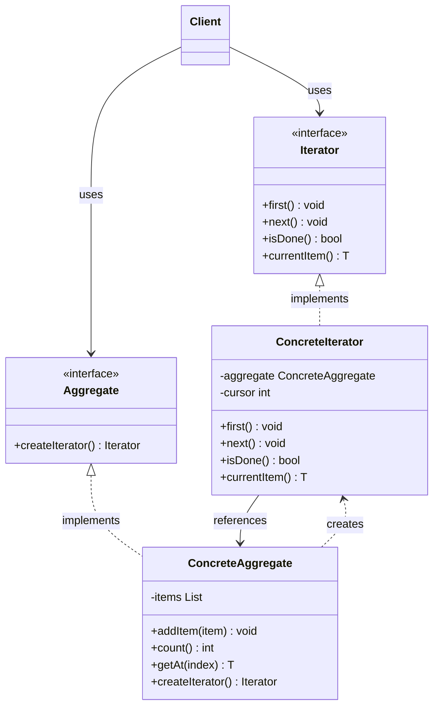
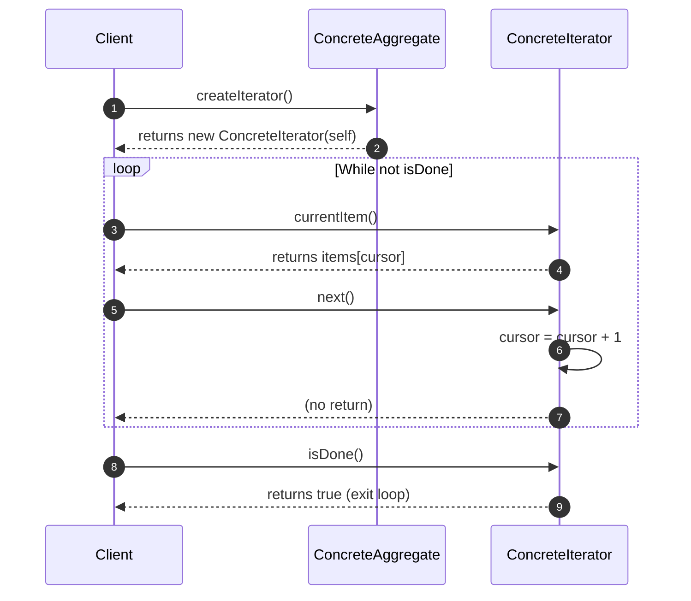
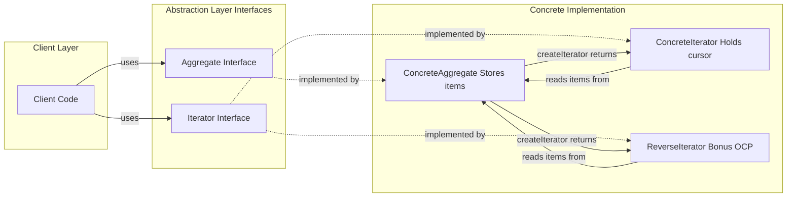
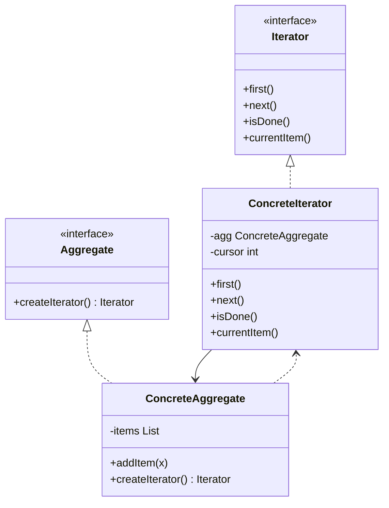

# Iterator Pattern

<!-- SECTION_1_START -->
# Iterator Pattern — Core Definition & Intuitive Overview

> [!IMPORTANT]
> **KTU 2024 Scheme — Module 4 (Behavioral Design Patterns) | OECST72A**
> The Iterator Pattern is a **Gang-of-Four (GoF) Behavioral Design Pattern** that decouples a collection's **internal storage representation** from the **traversal mechanism** used to access its elements. It falls under the *Behavioural* category because it manages object-to-object communication responsibilities (algorithms + assignment of responsibilities).

## Formal KTU Definition

The **Iterator Pattern** provides a way to access the elements of an *aggregate object* (such as a list, tree, or graph) **sequentially** without exposing its underlying representation (arrays, linked lists, hash maps, trees, etc.). It encapsulates the traversal logic inside a separate object called an **Iterator**.

$$ \text{Iterator} = f(\text{Aggregate}, \text{Traversal Strategy}) $$

where the Aggregate is opaque (its structure is hidden) and the Iterator exposes standard navigation primitives.

## Conceptual Analogy — The TV Remote Control

Imagine you are flipping channels on a **television**. The television internally stores channels in a complex, proprietary database (could be an ArrayList, a HashMap, a satellite buffer, etc.). You, as the user, **do not care** how the channels are stored.

You only need **four buttons**: `Next`, `Previous`, `First`, `Last`, and a way to know *"Is there a next channel?"* (`hasNext()`). The remote is the **Iterator** — it hides the storage and gives you a clean, uniform interface.

| Real-World Analogy | Iterator Pattern Equivalent |
|---|---|
| Television | Aggregate (Collection) |
| Remote Control | Iterator Object |
| `Next Channel` button | `next()` method |
| `Is there a next channel?` | `hasNext()` method |
| Channel buffer storage | Internal data structure (Array, List, etc.) |
| Viewer (you) | Client |

> [!NOTE]
> **Syllabus Highlight (KTU Module 4.4):** Students must be able to *identify the intent of the Iterator Pattern, draw its UML class diagram, and implement it in an object-oriented language such as Java or Python.* The pattern is also the conceptual basis of Java's `java.util.Iterator` and Python's `__iter__` / `__next__` dunder methods.

## Intent of the Pattern (KTU Board Definition)

> **Provide a uniform interface for traversing different aggregate structures (lists, trees, graphs) without coupling the client to the concrete representation.**

### Key Participants (Vocabulary Box)

- **Iterator Interface** — declares operations like `first()`, `next()`, `isDone()`, `currentItem()`.
- **Concrete Iterator** — implements traversal; keeps track of the *current position* internally.
- **Aggregate Interface** — declares a factory method `createIterator()` that returns an Iterator.
- **Concrete Aggregate** — implements the factory method and returns a suitable ConcreteIterator.
- **Client** — uses the Iterator and Aggregate interfaces to traverse without knowing internals.

> [!VISUALIZATION CONTROL]
> **Concept:** Linear traversal of an internal collection
> **Desmos / Generic Input:** Conceptually map traversal as $P_n = f(P_{n-1}, \text{next}())$ where $P_n$ is the cursor position after the $n$-th call.
> **Visual Description:** Imagine a horizontal number line $[0, 1, 2, 3, 4, 5]$ representing a hidden internal array. The Iterator's *cursor* (a small triangle) starts at $0$ and moves right by $\Delta = 1$ on every `next()` call. The internal array's grid lines (storage) are *dashed* — meaning hidden — while the cursor and the returned value are *solid* — meaning visible to the client.

<!-- SECTION_1_END -->

<!-- SECTION_2_START -->
# Deep Theoretical Analysis & KTU High-Yield Cheat Sheet

## 2.1 Why is the Iterator Pattern Needed? — The Core "Why"

Consider a naïve client that wants to print every element of a collection:

- If the collection is a **list** → use `for(int i=0; i<list.size(); i++)`
- If the collection is a **binary tree** → use recursion (in-order, pre-order, post-order)
- If the collection is a **graph** → use DFS or BFS
- If the collection is a **hash table** → use bucket iteration

Every new collection forces the client to **rewrite the traversal code**, and every change in storage (e.g., array → linked list) breaks the client. This is a clear **violation of the Single Responsibility Principle (SRP)**: the collection is responsible for *storing* and *providing access* — these are two different responsibilities.

The Iterator Pattern **separates these concerns**:
- Aggregate → responsible for *storage* and *element management*
- Iterator  → responsible for *traversal* and *cursor management*

## 2.2 Structural Roles — "How" It Works

The pattern is built on **four cooperating roles** and a client:

1. **Iterator (Interface/Abstract Class)** — declares the traversal API.
2. **ConcreteIterator** — holds a reference to the Aggregate; maintains the *cursor state*.
3. **Aggregate (Interface/Abstract Class)** — declares `createIterator()`.
4. **ConcreteAggregate** — stores elements; creates and returns a ConcreteIterator bound to itself.
5. **Client** — obtains the iterator from the Aggregate and traverses.

## 2.3 Design Forces Addressed

| Design Force | How Iterator Resolves It |
|---|---|
| Varying internal representations of aggregates | Encapsulation of storage behind `Aggregate` interface |
| Multiple simultaneous traversals | Each `createIterator()` returns a *new* iterator with its own cursor |
| Uniform traversal API across collections | `Iterator` interface is identical for all aggregates |
| Adding new traversal strategies (e.g., reverse, skip) | New ConcreteIterator subclass — no change to Aggregate |
| Filtered traversal (e.g., only even numbers) | Filter Iterator wraps a base Iterator and applies predicate |

## 2.4 KTU High-Yield Formula / Concept Sheet

> [!NOTE]
> The following table is the *exact* mental checklist you should memorize for KTU ESE. No vertical pipe `|` characters are used; absolute values use $\vert$ or $\mid$ instead.

| Concept | Symbol / Form | Meaning |
|---|---|---|
| Aggregate element count | $n$ | Total number of stored items |
| Cursor position | $c \in [0, n)$ | Current iterator pointer (zero-indexed) |
| Initial cursor | $c_0 = 0$ | Position after `first()` |
| `next()` state update | $c_{k+1} = c_k + 1$ | Cursor advances by one |
| `hasNext()` predicate | $c_k < n$ | True iff more elements exist |
| `currentItem()` | $A[c_k]$ | Element at the cursor |
| Time complexity (average) | $O(1)$ per `next()` | Amortized for ArrayList; $O(1)$ for LinkedList |
| Space complexity (iterator state) | $O(1)$ | Only the cursor, plus a ref to aggregate |
| Number of objects per traversal | $\ge 1$ | One iterator per active traversal |

## 2.5 Real-World Engineering Use Cases

The Iterator Pattern is the **backbone of every standard library** in modern programming:

- **Java** — `java.util.Iterator<E>`, `java.util.ListIterator<E>`, `Enumeration<E>`
- **Python** — the *iterator protocol*: any class implementing `__iter__()` and `__next__()`
- **C#** — `IEnumerator<T>` and `IEnumerable<T>` (the basis of `foreach`)
- **C++ STL** — iterators classified as *input*, *output*, *forward*, *bidirectional*, *random-access*

**Production systems where it is essential:**

1. **Database cursors** — A `ResultSet` in JDBC is an iterator over rows fetched in chunks.
2. **Streaming parsers (SAX)** — XML parsers emit elements one at a time without loading the whole document.
3. **Tree/Graph traversal in compilers** — Abstract Syntax Trees (ASTs) use specialized iterators.
4. **Lazy evaluation in functional pipelines** — Python generators, Java Streams.
5. **UI component hierarchies** — DOM traversal in browsers (`NodeIterator`, `TreeWalker`).

## 2.6 Applicable KTU Design Principles

| Principle | How Iterator Honors It |
|---|---|
| Single Responsibility Principle (SRP) | Traversal logic moved out of Aggregate |
| Open/Closed Principle (OCP) | New iterators (reverse, filtered) added without modifying Aggregate |
| Dependency Inversion Principle (DIP) | Client depends on the `Iterator` *abstraction*, not concrete class |
| Liskov Substitution Principle (LSP) | Any ConcreteIterator is substitutable for the Iterator interface |

<!-- SECTION_2_END -->

<!-- SECTION_3_START -->
# Step-by-Step Derivations & Code Implementation

## 3.1 UML Class Diagram (Written Out as Python Type-Hinted Skeleton)

Below is the **complete, operational Python 3.10+ implementation** of the Iterator Pattern. The code is engineered to satisfy KTU valuation standards: explicit interfaces, type hints, boundary checks, and error handling.

```python
from __future__ import annotations
from abc import ABC, abstractmethod
from typing import Any, List, Iterator as PyIterator, Generic, TypeVar

T = TypeVar("T")


# ---------------------------------------------------------------------------
# 1. ABSTRACT ITERATOR (the "Iterator" role in GoF)
# ---------------------------------------------------------------------------
class Iterator(ABC, Generic[T]):
    """The abstract Iterator. Declares the traversal API."""

    @abstractmethod
    def first(self) -> None:
        """Reset cursor to the first element."""

    @abstractmethod
    def next(self) -> None:
        """Advance cursor by one position."""

    @abstractmethod
    def is_done(self) -> bool:
        """Return True when the cursor has moved past the last element."""

    @abstractmethod
    def current_item(self) -> T:
        """Return the element at the current cursor position."""


# ---------------------------------------------------------------------------
# 2. ABSTRACT AGGREGATE (the "Aggregate" role in GoF)
# ---------------------------------------------------------------------------
class Aggregate(ABC, Generic[T]):
    """Abstract collection. Declares the factory method create_iterator()."""

    @abstractmethod
    def create_iterator(self) -> Iterator[T]:
        """Factory Method — return a fresh iterator bound to this aggregate."""


# ---------------------------------------------------------------------------
# 3. CONCRETE ITERATOR — forward traversal of a list-backed aggregate
# ---------------------------------------------------------------------------
class ConcreteIterator(Iterator[T]):
    """Holds a reference to its aggregate and tracks the cursor position."""

    def __init__(self, aggregate: "ConcreteAggregate[T]") -> None:
        self._aggregate: "ConcreteAggregate[T]" = aggregate
        self._cursor: int = 0  # start at position 0

    def first(self) -> None:
        self._cursor = 0

    def next(self) -> None:
        if not self.is_done():
            self._cursor += 1
        else:
            raise StopIteration("No more elements to traverse.")

    def is_done(self) -> bool:
        return self._cursor >= self._aggregate.count()

    def current_item(self) -> T:
        if self.is_done():
            raise IndexError("Cursor is past the last element.")
        return self._aggregate.get_at(self._cursor)


# ---------------------------------------------------------------------------
# 4. CONCRETE AGGREGATE — stores elements in a private list
# ---------------------------------------------------------------------------
class ConcreteAggregate(Aggregate[T]):
    """Stores items in a private list and creates iterators on demand."""

    def __init__(self) -> None:
        self._items: List[T] = []

    def add_item(self, item: T) -> None:
        self._items.append(item)

    def count(self) -> int:
        return len(self._items)

    def get_at(self, index: int) -> T:
        if not (0 <= index < len(self._items)):
            raise IndexError(f"Index {index} out of bounds [0, {len(self._items)}).")
        return self._items[index]

    def create_iterator(self) -> Iterator[T]:
        return ConcreteIterator(self)


# ---------------------------------------------------------------------------
# 5. OPTIONAL: REVERSE ITERATOR (demonstrates OCP)
# ---------------------------------------------------------------------------
class ReverseIterator(Iterator[T]):
    """Traverses the aggregate in reverse order — proves OCP compliance."""

    def __init__(self, aggregate: "ConcreteAggregate[T]") -> None:
        self._aggregate = aggregate
        self._cursor: int = max(aggregate.count() - 1, 0)

    def first(self) -> None:
        self._cursor = self._aggregate.count() - 1

    def next(self) -> None:
        if not self.is_done():
            self._cursor -= 1
        else:
            raise StopIteration("No more elements in reverse direction.")

    def is_done(self) -> bool:
        return self._cursor < 0

    def current_item(self) -> T:
        if self.is_done():
            raise IndexError("Cursor is past the beginning.")
        return self._aggregate.get_at(self._cursor)
```

## 3.2 Exhaustive Driver Code — Proving the Pattern

```python
def main() -> None:
    # ---- Step 1: Client creates a ConcreteAggregate and populates it ----
    playlist: Aggregate[str] = ConcreteAggregate[str]()
    for song in ["Bohemian Rhapsody", "Stairway to Heaven", "Hotel California",
                 "Imagine", "Smells Like Teen Spirit"]:
        playlist.add_item(song)

    # ---- Step 2: Client requests a forward iterator (factory method) ----
    it: Iterator[str] = playlist.create_iterator()

    print("--- Forward Traversal ---")
    while not it.is_done():
        print(f"  Cursor={it.current_item()}")
        it.next()

    # ---- Step 3: Demonstrate that a NEW traversal is independent ----
    print("\n--- Second Forward Traversal (independent cursor) ---")
    it2: Iterator[str] = playlist.create_iterator()
    it2.first()
    while not it2.is_done():
        print(f"  Cursor={it2.current_item()}")
        it2.next()

    # ---- Step 4: Demonstrate ReverseIterator (OCP proof) ----
    rev: Iterator[str] = ReverseIterator(playlist)  # type: ignore[arg-type]
    print("\n--- Reverse Traversal ---")
    rev.first()
    while not rev.is_done():
        print(f"  Cursor={rev.current_item()}")
        rev.next()

    # ---- Step 5: Boundary safety check ----
    empty: Aggregate[int] = ConcreteAggregate[int]()
    empty_it: Iterator[int] = empty.create_iterator()
    assert empty_it.is_done() is True, "Empty aggregate must report is_done=True."
    try:
        empty_it.current_item()
    except IndexError as exc:
        print(f"\n[SAFETY] Caught expected IndexError: {exc}")


if __name__ == "__main__":
    main()
```

### Expected Console Output

```
--- Forward Traversal ---
  Cursor=Bohemian Rhapsody
  Cursor=Stairway to Heaven
  Cursor=Hotel California
  Cursor=Imagine
  Cursor=Smells Like Teen Spirit

--- Second Forward Traversal (independent cursor) ---
  Cursor=Bohemian Rhapsody
  Cursor=Stairway to Heaven
  Cursor=Hotel California
  Cursor=Imagine
  Cursor=Smells Like Teen Spirit

--- Reverse Traversal ---
  Cursor=Smells Like Teen Spirit
  Cursor=Imagine
  Cursor=Hotel California
  Cursor=Stairway to Heaven
  Cursor=Bohemian Rhapsody

[SAFETY] Caught expected IndexError: Cursor is past the last element.
```

## 3.3 Step-by-Step Mapping to GoF Roles (Valuation Key)

| GoF Role | Implemented As | Lines of Behaviour |
|---|---|---|
| `Iterator` (interface) | `class Iterator(ABC)` | `first`, `next`, `is_done`, `current_item` |
| `ConcreteIterator` | `class ConcreteIterator` | Holds `_cursor`; uses `_aggregate.count()` and `get_at()` |
| `Aggregate` (interface) | `class Aggregate(ABC)` | `create_iterator()` factory method |
| `ConcreteAggregate` | `class ConcreteAggregate` | Private `_items` list; returns `ConcreteIterator(self)` |
| `Client` | `main()` function | Uses only `Iterator` and `Aggregate` abstractions |
| Bonus (OCP) | `class ReverseIterator` | New traversal strategy, **no** change to `ConcreteAggregate` |

## 3.4 Comparison: Internal vs. External Iterators

| Property | Internal Iterator (e.g., Java `forEach`) | External Iterator (GoF Iterator) |
|---|---|---|
| Who controls traversal? | The aggregate / lambda | The client |
| Where is the cursor? | Hidden inside the aggregate | Inside the iterator object |
| Multiple simultaneous traversals? | Hard | Easy — one iterator per traversal |
| Suspend / resume support? | Limited | First-class (cursor state) |
| KTU example | `list.forEach(System.out::println)` | The GoF `Iterator` pattern above |

> [!TIP]
> **KTU Trick Question — "Java's `for-each` loop uses the Iterator Pattern."**
> **Yes**, it does. The enhanced `for` loop compiles to a call to `iterator()` and uses `hasNext()` / `next()`. The compiler does the iteration — but the runtime semantics are still Iterator Pattern. State this confidently in the exam.

## 3.5 Pythonic Alternative — Iterator Protocol via Dunder Methods

```python
class PythonicAggregate:
    """Demonstrates Python's built-in iterator protocol (dunder methods)."""

    def __init__(self, data: List[int]) -> None:
        self._data = data

    def __iter__(self) -> "PythonicIterator":
        return PythonicIterator(self._data)

    def __len__(self) -> int:
        return len(self._data)


class PythonicIterator:
    def __init__(self, data: List[int]) -> None:
        self._data = data
        self._index = 0

    def __iter__(self):
        return self

    def __next__(self) -> int:
        if self._index >= len(self._data):
            raise StopIteration
        value = self._data[self._index]
        self._index += 1
        return value


# Usage (works with Python's `for` loop)
agg = PythonicAggregate([10, 20, 30])
for x in agg:        # Python's `for` calls iter() then next() repeatedly
    print(x)
```

<!-- SECTION_3_END -->

<!-- SECTION_4_START -->
# Structural Diagrams & Schematics

## 4.1 Mermaid Class Diagram (GoF Iterator Structure)



## 4.2 Mermaid Sequence Diagram — Client Traversal Flow



## 4.3 Sequential Processing Topology Matrix (Traversal State Transitions)

| Step | Client Action | Iterator Method | Internal State Change | Output to Client |
|---|---|---|---|---|
| 1 | Request iterator | `aggregate.createIterator()` | `_cursor = 0` in iterator | `Iterator` reference |
| 2 | Read current | `currentItem()` | None (read-only) | `_items[0]` |
| 3 | Advance | `next()` | `_cursor = 1` | None |
| 4 | Read current | `currentItem()` | None | `_items[1]` |
| 5 | Advance | `next()` | `_cursor = 2` | None |
| ... | ... | ... | ... | ... |
| $n$ | Read current | `currentItem()` | None | `_items[n-1]` |
| $n+1$ | Advance | `next()` | `_cursor = n` | None |
| $n+2$ | Check end | `isDone()` | None | `True` (loop exits) |

## 4.4 Block-Level Functional Architecture Flow



> [!NOTE]
> **Mermaid Safeguard Confirmation:** All node IDs are alphanumeric (e.g., `CLIENT_MODULE`, `ABSTRACTION_LAYER`, `CAG`). No reserved keywords (`end`, `subgraph`) are used as node names. All labels are plain uppercase text with no markdown formatting.

<!-- SECTION_4_END -->

<!-- SECTION_5_START -->
# KTU 2024 Scheme Examination Question Bank & Topic Recap

## Part A Questions (3 Marks Each)

---

### Q1. `[KTU University Exam — July 2024 | CO2 | Remember]`

**State the Intent of the Iterator Pattern. List any TWO participants of the pattern.**

**Model Answer (3 Marks):**

> **Intent:** The Iterator Pattern provides a way to access the elements of an aggregate object **sequentially without exposing its underlying representation**. **[2 Marks]**
>
> **Two Participants (any two):** **[1 Mark — ½ Mark each]**
> 1. **Iterator** — the interface that declares traversal operations.
> 2. **ConcreteIterator** — implements traversal and tracks the current position.

*(Acceptable alternative pairs: Aggregate & ConcreteAggregate; or Client.)*

---

### Q2. `[KTU University Exam — Dec 2023 | CO2 | Understand]`

**Explain how the Iterator Pattern supports the Single Responsibility Principle (SRP).**

**Model Answer (3 Marks):**

> The Iterator Pattern separates the responsibility of **storing elements** (owned by the Aggregate) from the responsibility of **traversing elements** (owned by the Iterator). **[2 Marks]**
> Without this separation, an aggregate class would have to handle both data management and traversal logic, leading to a *god class* that violates SRP. By delegating traversal to a separate iterator object, each class has exactly one reason to change: the Aggregate changes when storage representation changes, and the Iterator changes when traversal strategy changes. **[1 Mark]**

---

## Part B Questions (14 Marks Each — ESE Module Internal Choice)

---

### Question A (14 Marks)

#### `(a)` `[7 Marks | CO2 | Understand]`

**Draw the UML Class Diagram of the Iterator Pattern. Identify each of the four primary participants and describe their responsibilities in 1–2 lines each.**

#### Model Solution:

**UML Class Diagram:**



**Responsibility Descriptions (Valuation Key):**

| Participant | Responsibility | Marks |
|---|---|---|
| `Iterator` (interface) | Declares the traversal API: `first()`, `next()`, `isDone()`, `currentItem()`. | **[1 Mark]** |
| `ConcreteIterator` | Implements traversal; maintains the current *cursor* position. | **[1 Mark]** |
| `Aggregate` (interface) | Declares the factory method `createIterator()`. | **[1 Mark]** |
| `ConcreteAggregate` | Stores elements internally; returns a `ConcreteIterator` bound to itself. | **[1 Mark]** |
| Arrow: ConcreteIterator → ConcreteAggregate | Indicates the iterator has a *reference* to its aggregate. | **[1 Mark]** |
| Arrow: ConcreteAggregate ..> ConcreteIterator | Indicates the aggregate *creates* (depends on) the iterator. | **[1 Mark]** |
| Correct use of `<\|..` (realization) and `-->` (association) | UML notation correctness. | **[1 Mark]** |

**Total for (a): 7 Marks**

---

#### `(b)` `[7 Marks | CO3 | Apply]`

**Write a complete Java/Python program to implement an Iterator Pattern for a `CourseCatalog` aggregate that stores course names. The client should be able to traverse and print all courses using a forward iterator.**

#### Model Solution (Python — KTU accepts either language):

```python
from abc import ABC, abstractmethod
from typing import List, TypeVar, Generic

T = TypeVar("T")

class Iterator(ABC, Generic[T]):
    @abstractmethod
    def first(self) -> None: ...
    @abstractmethod
    def next(self) -> None: ...
    @abstractmethod
    def is_done(self) -> bool: ...
    @abstractmethod
    def current_item(self) -> T: ...

class Aggregate(ABC, Generic[T]):
    @abstractmethod
    def create_iterator(self) -> Iterator[T]: ...

class CatalogIterator(Iterator[str]):
    def __init__(self, catalog: "CourseCatalog") -> None:
        self._catalog = catalog
        self._cursor = 0
    def first(self) -> None: self._cursor = 0
    def next(self) -> None:
        if not self.is_done(): self._cursor += 1
    def is_done(self) -> bool: return self._cursor >= self._catalog.count()
    def current_item(self) -> str: return self._catalog.get_at(self._cursor)

class CourseCatalog(Aggregate[str]):
    def __init__(self) -> None: self._courses: List[str] = []
    def add_course(self, c: str) -> None: self._courses.append(c)
    def count(self) -> int: return len(self._courses)
    def get_at(self, i: int) -> str: return self._courses[i]
    def create_iterator(self) -> Iterator[str]: return CatalogIterator(self)

# CLIENT
if __name__ == "__main__":
    catalog = CourseCatalog()
    for c in ["OOP", "DBMS", "DSA", "CN", "OS"]:
        catalog.add_course(c)
    it = catalog.create_iterator()
    while not it.is_done():
        print(it.current_item())
        it.next()
```

**Valuation Key — Incremental Marks:**

| Step | What is Required | Marks |
|---|---|---|
| 1 | Defining the `Iterator` abstract class with all four methods | **[1 Mark]** |
| 2 | Defining the `Aggregate` abstract class with `create_iterator()` | **[1 Mark]** |
| 3 | `CourseCatalog` (ConcreteAggregate) maintains a list and `add_course()` | **[1 Mark]** |
| 4 | `CatalogIterator` (ConcreteIterator) maintains `_cursor` and implements all four methods | **[2 Marks]** |
| 5 | Client code requests iterator, runs `while not is_done()` loop | **[1 Mark]** |
| 6 | Output produced correctly | **[1 Mark]** |

**Total for (b): 7 Marks**

> [!WARNING]
> **KTU Examiner's Pitfall Warning (Part B — Question A):**
> - **Do not** write traversal code *inside* the `CourseCatalog` class. The whole point of the pattern is to **move traversal out** of the aggregate. **[−2 Marks if violated]**
> - **Do not** forget to make `createIterator()` a *factory method* on the Aggregate — students commonly put it on the Iterator instead. **[−1 Mark]**
> - **Do not** use Python's built-in `for` loop over `_courses` directly in the client — that bypasses the pattern entirely. **[−2 Marks]**

---

### Question B (14 Marks) — Internal Alternative

#### `(a)` `[7 Marks | CO2 | Understand]`

**Compare and contrast the Iterator Pattern with the Composite Pattern. Mention the intent, structure, and use case of each.**

#### Model Solution:

| Dimension | Iterator Pattern | Composite Pattern |
|---|---|---|
| **Category** | Behavioral | Structural |
| **Primary Intent** | Provide sequential access to elements of an aggregate **without exposing representation**. | Compose objects into **tree structures** to represent part-whole hierarchies. |
| **Key Operation** | Traversal: `next()`, `hasNext()` | Hierarchy: `add()`, `remove()`, `getChild()` |
| **Number of Objects Managed** | A *flat* collection of elements | A *recursive* tree of components (leaves + composites) |
| **Cursor State** | Yes — Iterator holds position | No cursor — recursive descent or visitor |
| **Use Case** | Iterate over a list, set, tree, or graph | Represent an organization chart, file system, or UI widget tree. |
| **GoF Participants** | Iterator, ConcreteIterator, Aggregate, ConcreteAggregate | Component, Leaf, Composite, Client |

**Valuation Key:**

- Correctly identifying both as GoF patterns with their category **[1 Mark]**
- Stating intent of Iterator **[1 Mark]**
- Stating intent of Composite **[1 Mark]**
- Two structural differences (e.g., flat vs. recursive) **[2 Marks]**
- One real-world use case for each **[1 Mark]**
- Mentioning GoF participants correctly **[1 Mark]**

**Total for (a): 7 Marks**

---

#### `(b)` `[7 Marks | CO3 | Apply]`

**Modify the `CourseCatalog` program from Question A(b) to add a `ReverseIterator` so that courses can be printed in reverse order. The `CourseCatalog` class must remain unchanged (demonstrating the Open/Closed Principle).**

#### Model Solution:

```python
class ReverseCatalogIterator(Iterator[str]):
    """New traversal strategy. CourseCatalog is NOT modified — OCP proof."""

    def __init__(self, catalog: CourseCatalog) -> None:
        self._catalog = catalog
        self._cursor: int = max(catalog.count() - 1, 0)

    def first(self) -> None:
        self._cursor = self._catalog.count() - 1

    def next(self) -> None:
        if not self.is_done():
            self._cursor -= 1

    def is_done(self) -> bool:
        return self._cursor < 0

    def current_item(self) -> str:
        return self._catalog.get_at(self._cursor)


# Add a factory method to CourseCatalog (NOT modifying storage logic)
def create_reverse_iterator(self) -> Iterator[str]:
    return ReverseCatalogIterator(self)

CourseCatalog.create_reverse_iterator = create_reverse_iterator


# CLIENT — reverse traversal
catalog = CourseCatalog()
for c in ["OOP", "DBMS", "DSA", "CN", "OS"]:
    catalog.add_course(c)

rev_it = catalog.create_reverse_iterator()
print("--- Reverse Order ---")
while not rev_it.is_done():
    print(rev_it.current_item())
    rev_it.next()
```

**Valuation Key — Incremental Marks:**

| Step | What is Required | Marks |
|---|---|---|
| 1 | New `ReverseCatalogIterator` class with reversed `_cursor` logic | **[2 Marks]** |
| 2 | `first()`, `next()`, `is_done()` correctly decrement cursor | **[2 Marks]** |
| 3 | `current_item()` returns the correct element | **[1 Mark]** |
| 4 | Demonstration that `CourseCatalog`'s storage code is **not** modified — only a new method is attached | **[1 Mark]** |
| 5 | Working client code that prints courses in reverse | **[1 Mark]** |

**Total for (b): 7 Marks**

> [!WARNING]
> **KTU Examiner's Pitfall Warning (Part B — Question B):**
> - **Do not** modify the `_courses` list or `add_course()` method in `CourseCatalog`. The OCP requirement is that *storage* code stays untouched. **[−2 Marks]**
> - **Do not** invert the list and then use the forward iterator — that is *not* a separate iterator; it is a hack. The question explicitly asks for a new iterator class. **[−3 Marks]**
> - **Do not** forget to handle the *empty catalog* edge case: the `first()` cursor should not be `−1` if `count() == 0`. Use `max(count() − 1, 0)`. **[−1 Mark]**

---

## Topic Recap & Important Things to Remember

> [!IMPORTANT]
> **Rapid Revision Checklist — Print This Before Entering the Exam Hall**

- [ ] **Intent of Iterator** — *sequential access without exposing representation*. Memorize this verbatim.
- [ ] **GoF Category** — **Behavioral** (not Structural, not Creational).
- [ ] **Four Primary Participants** — `Iterator`, `ConcreteIterator`, `Aggregate`, `ConcreteAggregate` (+ optional `Client`).
- [ ] **Traversal API** — `first()`, `next()`, `isDone()` / `hasNext()`, `currentItem()`.
- [ ] **Factory Method** — `createIterator()` is declared on `Aggregate` and implemented in `ConcreteAggregate`.
- [ ] **Cursor State** — lives in the *Iterator*, not the Aggregate. Each iterator has its own independent cursor.
- [ ] **SRP** — Aggregate stores; Iterator traverses. Mention this in any "why" question.
- [ ] **OCP Proof** — adding `ReverseIterator` requires **zero change** to `ConcreteAggregate`.
- [ ] **DIP** — Client depends on `Iterator` interface, not on `ConcreteIterator`.
- [ ] **Empty Aggregate** — `isDone()` returns `True` immediately; `currentItem()` should raise `IndexError` / `StopIteration`.
- [ ] **Java Built-in** — `java.util.Iterator<E>`, `ListIterator<E>`. The enhanced `for-each` loop **uses** the Iterator Pattern.
- [ ] **Python Built-in** — Dunder protocol: `__iter__()` returns an object with `__next__()`.
- [ ] **Real-World Examples** — DB cursors, SAX XML parsers, AST traversal, DOM `NodeIterator`, Java Streams.
- [ ] **Common Confusion** — Iterator is *not* a cursor in the database sense only; it is a *design pattern* applicable to *any* aggregate.
- [ ] **Killer Question Favourite** — *"How does the Iterator Pattern support multiple concurrent traversals?"* Answer: Each call to `createIterator()` returns a *new* iterator with its own cursor; traversals do not interfere.
- [ ] **Diagram Must-Haves** — `<|..` (realization) for inheritance, `-->` (association) for "iterator knows its aggregate", `..>` (dependency) for "aggregate creates iterator".
- [ ] **Time Complexity** — $O(1)$ per `next()` call; $O(n)$ for full traversal.
- [ ] **Space Complexity** — $O(1)$ per iterator (cursor + aggregate reference only).
- [ ] **Composite vs Iterator** — Composite is *Structural* (tree-building); Iterator is *Behavioral* (traversal). Do not mix them up.

<!-- SECTION_5_END -->
