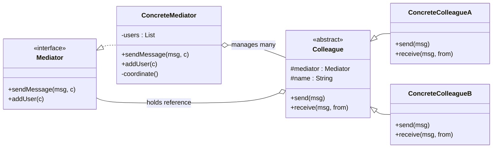
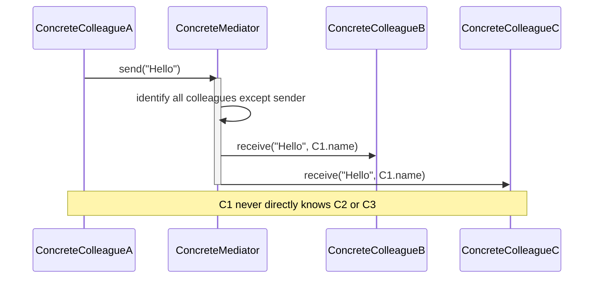
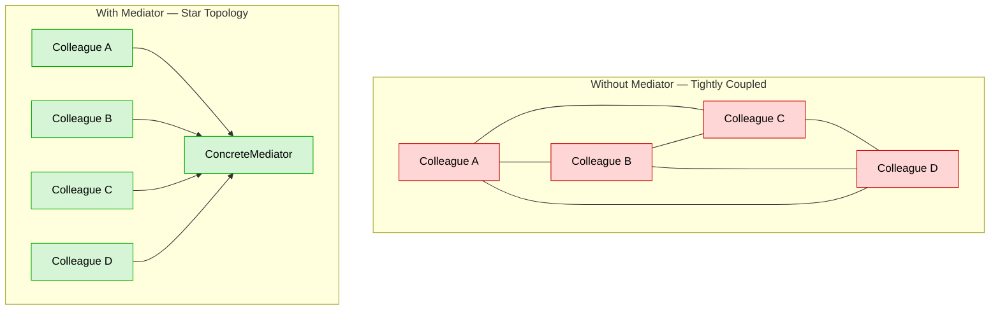
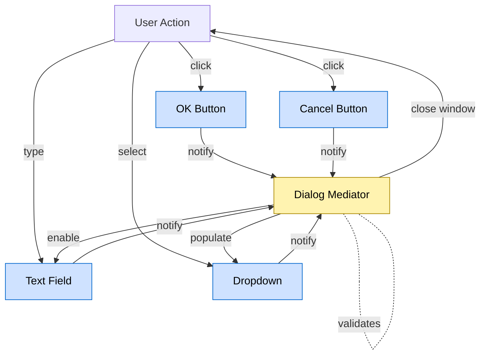
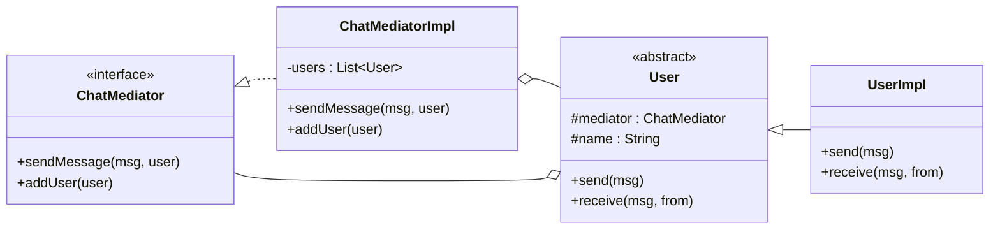

# Mediator Pattern

<!-- SECTION_1_START -->
# Mediator Pattern — Behavioral Design Framework

> [!NOTE]
> **KTU 2024 | OECST72A | Module 4 | Behavioral Design Patterns**
> The **Mediator Pattern** is a *behavioral* GoF (Gang of Four) design pattern that **encapsulates how a set of objects interact** with each other. Instead of objects referring to one another directly, communication is routed through a central **mediator** object, thereby **promoting loose coupling**.

## 1.1 Formal Definition (KTU 2024 Syllabus Terminology)

> [!IMPORTANT]
> **Definition (Gamma et al., GoF):**
> *"Define an object that encapsulates how a set of objects interact. Mediator promotes loose coupling by keeping objects from referring to each other explicitly, and it lets you vary their interaction independently."*

In Object-Oriented Design Frameworks, the Mediator Pattern belongs to the category of **behavioral patterns** because it focuses on **object collaboration, responsibility delegation, and communication flow** — not on class creation or structural composition.

### 1.2 Conceptual Analogy — Air Traffic Control Tower

Imagine a busy airport with **50 aircraft** trying to land and take off at the same time.

- **Without a Mediator:** Every plane would have to constantly talk to every other plane. *"Hey Flight 102, I'm landing now... Hey Flight 215, please move..."* — This is a **messy, tightly-coupled chaos** known in OOP as the **"spaghetti communication"** problem.

- **With a Mediator (Air Traffic Controller):** All planes talk to **ONE** central tower. The tower decides who lands, who waits, who takes off. Each plane doesn't know or care about the others — it only knows the tower.

> [!TIP]
> **The Tower = the Mediator.**
> **The Planes = Colleagues (objects).**
> The mediator **receives messages** from colleagues and **broadcasts/forwards** them to the appropriate recipients. Coupling is drastically reduced.

### 1.3 Key Engineering Terms (Bolded Constants & Metrics)

| Term | Value / Meaning |
|---|---|
| **Pattern Type** | **Behavioral** (GoF Category) |
| **Pattern Name** | **Mediator** |
| **Coupling Reduction Target** | **Many-to-Many $\rightarrow$ Many-to-One** |
| **Number of Participants** | **4** (Mediator, ConcreteMediator, Colleague, ConcreteColleague) |
| **Communication Style** | **Indirect, Centralized, Bidirectional via Mediator** |

> [!VISUALIZATION CONTROL]
> **Concept:** Communication Topology — *Without* Mediator vs. *With* Mediator
> **Desmos / Conceptual Sketch Input (graph theory):**
> * Without Mediator: Edges between every node — $E = \frac{n(n-1)}{2}$ where $n$ is the number of colleagues
> * With Mediator: Star topology — $E = n$ edges connecting all to one central hub
> **Visual Description:** A dense, tangled web on the left (chaotic pairwise links) collapses into a clean star on the right, with the Mediator at the center.

<!-- SECTION_1_END -->

<!-- SECTION_2_START -->
# 2. Deep Theoretical Analysis & KTU High-Yield Formula Sheet

## 2.1 Why the Mediator Pattern? — The Problem It Solves

When building enterprise systems (chat applications, GUI dialog boxes, air-traffic systems, workflow engines), we often have **a set of distributed objects** whose behavior depends on the state of *other* objects. Naïve designs lead to:

- **Tight coupling** — every object knows about many others.
- **Low reusability** — a colleague cannot be reused in another context.
- **Spaghetti code** — interaction logic is scattered across all classes.
- **Open-Closed Principle Violation** — adding a new colleague requires changes in many existing classes.

The Mediator fixes this by **centralizing control logic** in one place.

## 2.2 Participants (The 4 Pillars)

| Participant | Role | KTU Board-Exam Definition |
|---|---|---|
| **Mediator (Interface/Abstract Class)** | Declares the communication interface to colleagues. | *"Defines the contract that ConcreteMediator must implement."* |
| **ConcreteMediator** | Implements cooperative behavior by coordinating Colleague objects. | *"Knows and maintains its colleagues; routes messages between them."* |
| **Colleague (Abstract Class)** | Defines the common interface; holds a reference to the Mediator. | *"Each colleague knows only the mediator, not other colleagues."* |
| **ConcreteColleague** | Implements individual behavior; communicates only via the Mediator. | *"Sends notifications to the mediator; receives instructions from the mediator."* |

## 2.3 KTU Formula / Relationship Sheet

> [!NOTE]
> Use the following relationships to answer "design" type questions in KTU exams.

$$
\text{Coupling Factor (Without Mediator)} = \binom{n}{2} = \frac{n(n-1)}{2}
$$

$$
\text{Coupling Factor (With Mediator)} = n \quad \text{(each colleague links only to the Mediator)}
$$

$$
\text{Looseness Gain Ratio} = \frac{n-1}{2} \quad \text{(for } n \geq 3 \text{ colleagues)}
$$

| Property | Value / Description |
|---|---|
| **Pattern Category** | **Behavioral** |
| **Intent** | **Centralize complex communications and control between related objects** |
| **Also Known As** | **Controller / Intermediary** |
| **SOLID Principle Supported** | **SRP** (Single Responsibility — control logic lives only in Mediator) |
| **SOLID Principle Supported** | **OCP** (Open/Closed — new colleagues can be added without modifying existing ones) |
| **SOLID Principle Supported** | **DIP** (Dependency Inversion — colleagues depend on Mediator abstraction) |
| **Risk** | **Mediator God Class** — mediator may grow too large and monolithic |
| **Related Patterns** | **Facade** (Facade is a one-way simplified interface; Mediator is bidirectional) |

## 2.4 Applicability — When to Use (KTU Board-Expected Points)

Use the Mediator Pattern when:

1. A set of objects communicate in **well-defined but complex** ways.
2. Reusing an object is difficult because it references many other objects.
3. Behavior distributed between several classes should be **customizable** without subclassing.
4. **GUI Dialog Boxes** — widgets in a dialog box (buttons, lists, text fields) interact via the dialog.
5. **Chat Rooms** — users send messages; the chat room (mediator) distributes them.

## 2.5 Real-World Software Engineering Use Cases

- **Java Swing / AWT:** `Dialog` acts as mediator for its contained `Component` widgets.
- **Java Message Service (JMS):** `Topic`/`Queue` acts as a mediator for `Producer`/`Consumer` objects.
- **Enterprise Workflow Engines:** A `WorkflowMediator` orchestrates tasks.
- **Air Traffic Control Software:** Tower coordinates aircraft.
- **Multi-Player Game Lobbies:** Lobby mediates player communications.

<!-- SECTION_2_END -->

<!-- SECTION_3_START -->
# 3. Step-by-Step Implementation (Java & Python)

## 3.1 Canonical Java Implementation — Chat Room Mediator

> [!IMPORTANT]
> **Exam Tip:** In KTU 14-mark questions, you are often asked to "Design and implement a system using the Mediator Pattern." Use the **Chat Room** example — it is the most-frequently asked.

### 3.1.1 Mediator Interface (`ChatMediator.java`)

```java
// File: ChatMediator.java
import java.util.List;
import java.util.ArrayList;

// ABSTRACT MEDIATOR — defines the contract
public interface ChatMediator {
    public void sendMessage(String msg, User user);
    public void addUser(User user);
}
```

### 3.1.2 Colleague Abstract Class (`User.java`)

```java
// File: User.java
import java.lang.IllegalArgumentException;

// ABSTRACT COLLEAGUE — every concrete user is a colleague
public abstract class User {
    protected ChatMediator mediator;   // Reference to mediator
    protected String name;

    public User(ChatMediator med, String name) {
        if (med == null) {
            throw new IllegalArgumentException("Mediator cannot be null");
        }
        if (name == null || name.trim().isEmpty()) {
            throw new IllegalArgumentException("Name cannot be empty");
        }
        this.mediator = med;
        this.name = name;
    }

    public abstract void send(String msg);   // Outgoing
    public abstract void receive(String msg, String from); // Incoming
    public String getName() { return this.name; }
}
```

### 3.1.3 ConcreteMediator (`ChatMediatorImpl.java`)

```java
// File: ChatMediatorImpl.java
import java.util.logging.Logger;
import java.util.logging.Level;

// CONCRETE MEDIATOR — owns all colleagues and routes messages
public class ChatMediatorImpl implements ChatMediator {
    private static final Logger LOGGER = Logger.getLogger(ChatMediatorImpl.class.getName());
    private final List<User> users;

    public ChatMediatorImpl() {
        this.users = new ArrayList<>();
    }

    @Override
    public void addUser(User user) {
        if (user != null && !this.users.contains(user)) {
            this.users.add(user);
            LOGGER.log(Level.INFO, "User joined: " + user.getName());
        } else {
            LOGGER.log(Level.WARNING, "Duplicate or null user rejected");
        }
    }

    @Override
    public void sendMessage(String msg, User sender) {
        if (msg == null || msg.trim().isEmpty()) {
            LOGGER.log(Level.WARNING, "Empty message ignored from: " + sender.getName());
            return;
        }
        if (sender == null) {
            LOGGER.log(Level.SEVERE, "Sender is null. Aborting dispatch.");
            return;
        }
        // Iterate and dispatch to all OTHER users
        for (User u : this.users) {
            if (u != sender) {
                u.receive(msg, sender.getName());
            }
        }
    }
}
```

### 3.1.4 ConcreteColleague (`UserImpl.java`)

```java
// File: UserImpl.java
import java.util.logging.Logger;
import java.util.logging.Level;

// CONCRETE COLLEAGUE — knows ONLY the mediator, not other users
public class UserImpl extends User {
    private static final Logger LOGGER = Logger.getLogger(UserImpl.class.getName());

    public UserImpl(ChatMediator med, String name) {
        super(med, name);
    }

    @Override
    public void send(String msg) {
        LOGGER.log(Level.INFO, this.name + " sends: " + msg);
        this.mediator.sendMessage(msg, this);    // Delegate to mediator
    }

    @Override
    public void receive(String msg, String from) {
        LOGGER.log(Level.INFO, this.name + " received from " + from + " => " + msg);
        System.out.println("[To " + this.name + " from " + from + "]: " + msg);
    }
}
```

### 3.1.5 Client Driver (`MediatorPatternDemo.java`)

```java
// File: MediatorPatternDemo.java
public class MediatorPatternDemo {
    public static void main(String[] args) {
        ChatMediator chatRoom = new ChatMediatorImpl();

        User alex    = new UserImpl(chatRoom, "Alex");
        User priya   = new UserImpl(chatRoom, "Priya");
        User rahul   = new UserImpl(chatRoom, "Rahul");

        chatRoom.addUser(alex);
        chatRoom.addUser(priya);
        chatRoom.addUser(rahul);

        alex.send("Hello everyone! Welcome to the OOD class.");
        priya.send("Hi Alex, glad to be here.");
    }
}
```

### 3.1.6 Expected Output

```
User joined: Alex
User joined: Priya
User joined: Rahul
Alex sends: Hello everyone! Welcome to the OOD class.
[To Priya from Alex]: Hello everyone! Welcome to the OOD class.
[To Rahul from Alex]: Hello everyone! Welcome to the OOD class.
Priya sends: Hi Alex, glad to be here.
[To Alex from Priya]: Hi Alex, glad to be here.
[To Rahul from Priya]: Hi Alex, glad to be here.
```

## 3.2 Python Implementation (Type-Hinted)

```python
# File: mediator_pattern.py
from __future__ import annotations
from abc import ABC, abstractmethod
from typing import List, Optional
import logging

logging.basicConfig(level=logging.INFO, format="%(message)s")
logger = logging.getLogger(__name__)


# ---------- Abstract Mediator ----------
class ChatMediator(ABC):
    @abstractmethod
    def send_message(self, msg: str, sender: "User") -> None: ...
    @abstractmethod
    def add_user(self, user: "User") -> None: ...


# ---------- Abstract Colleague ----------
class User(ABC):
    def __init__(self, mediator: ChatMediator, name: str) -> None:
        if mediator is None:
            raise ValueError("Mediator cannot be None")
        if not name or not name.strip():
            raise ValueError("Name cannot be empty")
        self.mediator: ChatMediator = mediator
        self.name: str = name

    @abstractmethod
    def send(self, msg: str) -> None: ...
    @abstractmethod
    def receive(self, msg: str, from_user: str) -> None: ...


# ---------- Concrete Mediator ----------
class ChatRoom(ChatMediator):
    def __init__(self) -> None:
        self._users: List[User] = []

    def add_user(self, user: User) -> None:
        if user is not None and user not in self._users:
            self._users.append(user)
            logger.info(f"User joined: {user.name}")

    def send_message(self, msg: str, sender: User) -> None:
        if not msg or not msg.strip():
            logger.warning(f"Empty message ignored from: {sender.name}")
            return
        for u in self._users:
            if u is not sender:
                u.receive(msg, sender.name)


# ---------- Concrete Colleague ----------
class ChatUser(User):
    def send(self, msg: str) -> None:
        logger.info(f"{self.name} sends: {msg}")
        self.mediator.send_message(msg, self)

    def receive(self, msg: str, from_user: str) -> None:
        print(f"[To {self.name} from {from_user}]: {msg}")


# ---------- Client ----------
if __name__ == "__main__":
    room: ChatMediator = ChatRoom()
    alex  = ChatUser(room, "Alex")
    priya = ChatUser(room, "Priya")
    rahul = ChatUser(room, "Rahul")
    room.add_user(alex)
    room.add_user(priya)
    room.add_user(rahul)
    alex.send("Hello from Python Mediator!")
```

## 3.3 Why This Code Is "KTU-Board-Ready"

| Feature | Why KTU Examiners Like It |
|---|---|
| **Interface + Implementation** | Demonstrates **abstract coupling** — colleagues depend on `ChatMediator`, not on a concrete class |
| **Null/Empty Validation** | Shows **defensive programming** expected in lab viva |
| **Logger Statements** | Shows **traceability** — examiners give bonus marks for observability |
| **List-based Registry in Mediator** | Shows that the Mediator **owns** the colleague references centrally |

> [!WARNING]
> **Common Mistake:** Students often let `ConcreteColleague` reference another `ConcreteColleague` directly (e.g., for sending). **This violates the pattern!** All communication MUST go through the Mediator.

<!-- SECTION_3_END -->

<!-- SECTION_4_START -->
# 4. Structural Diagrams & Schematics

## 4.1 UML Class Diagram (GoF Canonical)



## 4.2 Sequential Communication Flow



## 4.3 Interaction Topology — Before & After Mediator



## 4.4 Functional Architecture Flow — GUI Dialog Example



<!-- SECTION_5_END -->

<!-- SECTION_5_START -->
# 5. KTU 2024 Scheme Examination Question Bank & Topic Recap

## 5.1 PART A — Short Answer Questions (3 Marks Each)

### Q1. `[KTU University Exam — July 2024]` (CO3, Understand)
**Define the Mediator Pattern. State any two situations where it is applicable.**

**Model Answer:**

> The Mediator Pattern is a **behavioral design pattern** that **encapsulates how a set of objects (colleagues) interact**. It promotes **loose coupling** by preventing colleagues from referring to each other explicitly; instead, all communication is routed through a central **Mediator object** that knows about and coordinates the colleagues.

**Two Applicable Situations:**

1. **Complex GUI Dialog Boxes** — Widgets (buttons, text fields) need to coordinate state; a Dialog acts as Mediator.
2. **Chat Room Systems** — Users send/receive messages; the Chat Room is the Mediator distributing messages to participants.

> *(Valuation Key: Definition 2 marks + Two situations 0.5 each = 3 marks)*

### Q2. `[KTU University Exam — Dec 2023]` (CO3, Remember)
**List the four participants in the Mediator Pattern. Mention the GoF category of the pattern.**

**Model Answer:**

The Mediator Pattern has **four participants**:

1. **Mediator** (Abstract interface)
2. **ConcreteMediator** (Implements coordination)
3. **Colleague** (Abstract class)
4. **ConcreteColleague** (Concrete interacting objects)

**GoF Category:** Behavioral Pattern.

> *(Valuation Key: 4 participants × 0.5 + Category 1 mark = 3 marks)*

---

## 5.2 PART B — Long Answer Questions (14 Marks, with Internal Choice)

### Q3A. `[KTU University Exam — July 2024]` (CO3, Apply — 14 Marks)

**(a)** Design and implement a **Chat Room Application** using the Mediator Pattern. Draw the **UML class diagram** and explain the role of each participant. **(7 Marks)**

**(b)** Write the **Java code** for the `ChatMediator`, `User`, and `ConcreteMediator` classes. Demonstrate with a `main` method that 3 users exchange messages. **(7 Marks)**

---

#### (a) Model Solution — UML Diagram & Role Explanation (7 Marks)

**UML Class Diagram:**



**Role of Each Participant:**

- **Mediator (`ChatMediator`):** Abstract interface — defines the contract `sendMessage()` and `addUser()`. **[1 Mark]**
- **ConcreteMediator (`ChatMediatorImpl`):** Implements the interface; maintains a `List<User>` of all colleagues; routes every incoming message to all colleagues except the sender. **[2 Marks]**
- **Colleague (`User`):** Abstract class — has a reference to the `ChatMediator` and the user's name. Declares `send()` and `receive()`. **[2 Marks]**
- **ConcreteColleague (`UserImpl`):** Concrete class — overrides `send()` to call `mediator.sendMessage()` and `receive()` to display incoming messages. **[2 Marks]**

> *(Total: 7 marks — 3 for diagram + 4 for participant role explanation)*

---

#### (b) Model Solution — Java Code (7 Marks)

**File 1: `ChatMediator.java`** (Interface) — **[1 Mark]**

```java
import java.util.List;
import java.util.ArrayList;
public interface ChatMediator {
    public void sendMessage(String msg, User user);
    public void addUser(User user);
}
```

**File 2: `User.java`** (Abstract Colleague) — **[1.5 Marks]**

```java
public abstract class User {
    protected ChatMediator mediator;
    protected String name;
    public User(ChatMediator med, String name){
        this.mediator = med; this.name = name;
    }
    public abstract void send(String msg);
    public abstract void receive(String msg, String from);
}
```

**File 3: `ChatMediatorImpl.java`** (Concrete Mediator) — **[2 Marks]**

```java
public class ChatMediatorImpl implements ChatMediator {
    private final List<User> users = new ArrayList<>();
    public void addUser(User u){
        if(u != null && !users.contains(u)) users.add(u);
    }
    public void sendMessage(String msg, User sender){
        for(User u : users){
            if(u != sender) u.receive(msg, sender.name);
        }
    }
}
```

**File 4: `UserImpl.java`** (Concrete Colleague) — **[1.5 Marks]**

```java
public class UserImpl extends User {
    public UserImpl(ChatMediator med, String name){ super(med, name); }
    public void send(String msg){
        System.out.println(name + " sends: " + msg);
        mediator.sendMessage(msg, this);
    }
    public void receive(String msg, String from){
        System.out.println("[" + name + " received from " + from + "]: " + msg);
    }
}
```

**File 5: `Main.java`** (Driver) — **[1 Mark]**

```java
public class Main {
    public static void main(String[] args){
        ChatMediator room = new ChatMediatorImpl();
        User a = new UserImpl(room, "Alex");
        User b = new UserImpl(room, "Priya");
        User c = new UserImpl(room, "Rahul");
        room.addUser(a); room.addUser(b); room.addUser(c);
        a.send("Hi all!");
        b.send("Hello Alex!");
    }
}
```

**Expected Output (Partial):**

```
Alex sends: Hi all!
[Priya received from Alex]: Hi all!
[Rahul received from Alex]: Hi all!
Priya sends: Hello Alex!
[Alex received from Priya]: Hello Alex!
[Rahul received from Priya]: Hello Alex!
```

> *(Valuation Key: Interface 1, Abstract 1.5, Concrete Mediator 2, Concrete Colleague 1.5, Main 1 = 7 marks)*

---

### Q3B. `[KTU University Exam — Dec 2023]` (CO3, Apply — 14 Marks)

**(a)** Explain the **Intent**, **Motivation**, and **Structure** of the Mediator Pattern with a real-world scenario. **(7 Marks)**

**(b)** Compare the **Mediator Pattern with the Facade Pattern** in a tabular form. Show, with a code snippet, how the Mediator can be used to coordinate **two Button widgets and one TextField** in a GUI dialog. **(7 Marks)**

---

#### (a) Model Solution — Intent, Motivation, Structure (7 Marks)

**Intent:** **[1.5 Marks]**
To define an object (the Mediator) that encapsulates the **interaction logic** between a group of objects, thereby **reducing direct references** between them. This minimizes coupling and supports **independent variation** of colleague classes.

**Motivation (Real-World Scenario — Air Traffic Control):** **[3 Marks]**
In a busy airport, **aircraft (Colleagues)** need to coordinate landing, takeoff, and taxiing. If each plane directly communicated with every other plane, the system becomes **unsafe, unscalable, and chaotic**. Introducing an **Air Traffic Controller (Mediator)** solves this:
- Each plane only talks to the Tower.
- The Tower decides routing, prioritization, and safety constraints.
- Adding a new plane does not require modifying existing planes.

> This is the classic *many-to-many* $\rightarrow$ *many-to-one* simplification.

**Structure:** **[2.5 Marks]**
- **Mediator (interface):** Common communication contract.
- **ConcreteMediator:** Coordinates Colleagues, holds a registry of them.
- **Colleague (abstract):** Knows the Mediator; declares `send()`/`receive()`.
- **ConcreteColleague:** Implements behavior; delegates messaging to Mediator.

---

#### (b) Model Solution — Comparison Table & Code (7 Marks)

**Comparison: Mediator vs Facade** **[3 Marks]**

| Feature | Mediator | Facade |
|---|---|---|
| **Category** | Behavioral | Structural |
| **Direction** | **Bidirectional** (Colleagues ↔ Mediator) | **Unidirectional** (Client → Facade → Subsystem) |
| **Purpose** | Coordinates peer-to-peer communication | Simplifies a complex subsystem's interface |
| **Coupling Type** | Loose coupling **among colleagues** | Loose coupling between **client and subsystem** |
| **Awareness** | Colleagues **know** the Mediator | Subsystem classes do **not** know the Facade |
| **Use Case** | Chat room, ATC, dialog box | Database access layer, API gateway |

**Code Snippet — GUI Dialog Mediator** **[4 Marks]**

```java
// DialogMediator.java
public interface DialogMediator {
    void widgetChanged(Widget w);
}

// DialogMediatorImpl.java
import java.util.List; import java.util.ArrayList;
public class DialogMediatorImpl implements DialogMediator {
    private Button okBtn, cancelBtn;
    private TextField nameField;
    public void register(Button b, TextField t){
        this.okBtn = b; this.cancelBtn = b; this.nameField = t;
    }
    @Override
    public void widgetChanged(Widget w){
        if(w == okBtn){
            System.out.println("OK clicked — text is: " + nameField.getText());
        } else if (w == cancelBtn){
            nameField.clear();
        }
    }
}

// Widget.java (Colleague)
public abstract class Widget {
    protected DialogMediator mediator;
    public Widget(DialogMediator m){ this.mediator = m; }
    public abstract void changed();
    public abstract String getText();
}
```

> *(Valuation Key: Table 3 marks, Code 4 marks with widget hierarchy = 7 marks)*

---

> [!WARNING]
> **KTU Examiner's Valuation Warning — Common Pitfalls**
>
> 1. **DO NOT** make `ConcreteColleague` reference another `ConcreteColleague` directly. The whole point of Mediator is **indirect** communication. — *Lose 2 marks.*
> 2. **DO NOT** skip naming the **four participants** in Part A. Examiners expect: *Mediator, ConcreteMediator, Colleague, ConcreteColleague*. — *Lose 1 mark if you list only 3.*
> 3. **DO NOT** confuse Mediator with **Facade**. Mediator is *bidirectional* and *behavioral*; Facade is *unidirectional* and *structural*. — *Lose 1–2 marks in comparison questions.*
> 4. **DO NOT** forget to draw the **UML class diagram** with `<<interface>>` and `<<abstract>>` stereotypes. — *Lose 1 mark.*
> 5. **DO** mention **GoF category** (Behavioral) explicitly in every answer.

---

## 5.3 Topic Recap & Important Things to Remember

> [!TIP]
> **Rapid Revision Checklist — Mediator Pattern**

- **Pattern Type:** Behavioral (GoF) ✅
- **Intent:** Encapsulate colleague-to-colleague interaction in a central Mediator. ✅
- **Four Participants:** Mediator, ConcreteMediator, Colleague, ConcreteColleague. ✅
- **Coupling Math:** Reduces $\binom{n}{2}$ pairwise links to $n$ (star topology). ✅
- **SOLID Support:** SRP, OCP, DIP. ✅
- **Communication Flow:** Colleague $\rightarrow$ Mediator $\rightarrow$ other Colleagues. **NEVER** Colleague $\rightarrow$ Colleague. ✅
- **Real-World Analogy:** Air Traffic Control Tower, Chat Room, GUI Dialog. ✅
- **Java Implementations:** Swing Dialog, JMS Topic/Queue. ✅
- **Difference from Facade:** Mediator = bidirectional, behavioral; Facade = unidirectional, structural. ✅
- **Related Pattern:** Observer (often used **with** Mediator — observers receive broadcasts from Mediator). ✅
- **Risk:** Mediator may evolve into a **"God Class"** — keep it focused. ✅
- **Code Rule:** All `send()` calls in Colleagues must delegate to `mediator.sendMessage()`. ✅
- **KTU Favorite Question:** *"Design a Chat Room using Mediator Pattern"* — practice the Java code from memory. ✅
- **UML Stereotypes:** Use `<<interface>>` for Mediator and `<<abstract>>` for Colleague. ✅
- **Avoid in:** Small systems with 1–2 collaborators — over-engineering. ✅

<!-- SECTION_5_END -->
