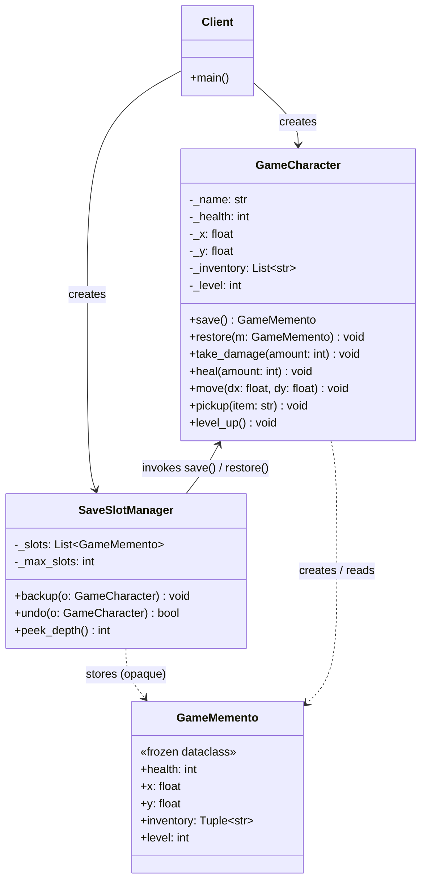
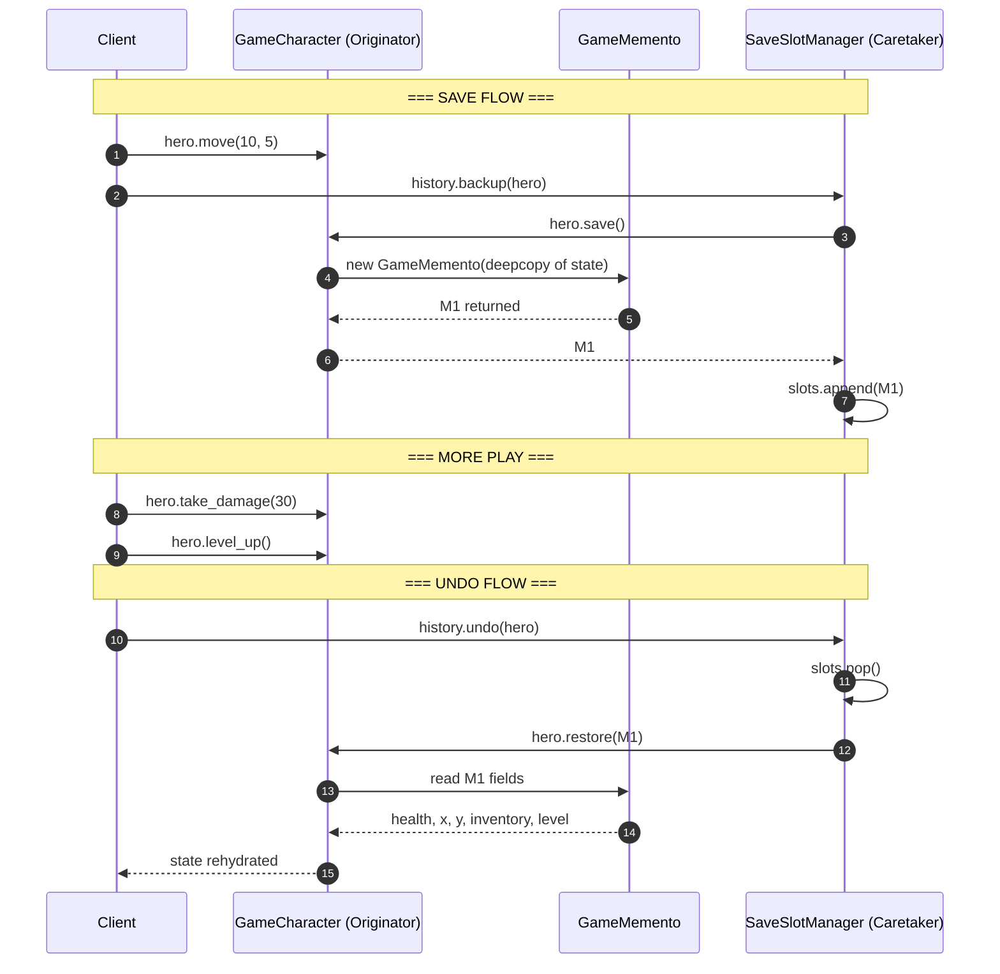
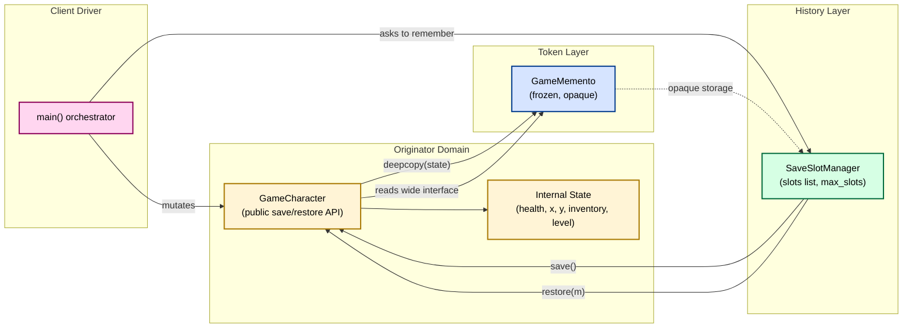
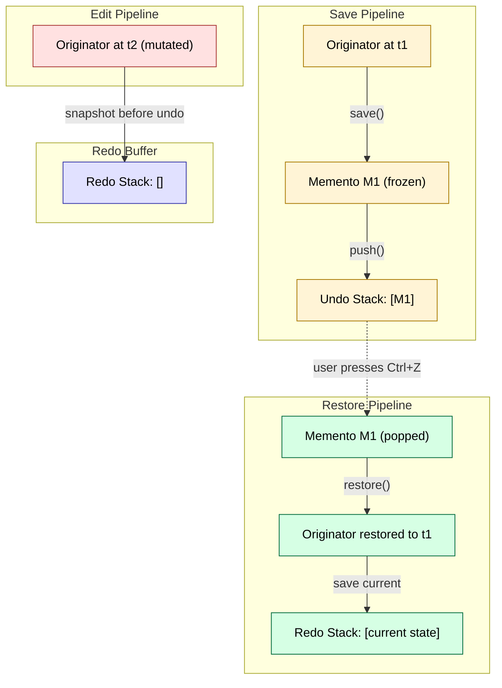
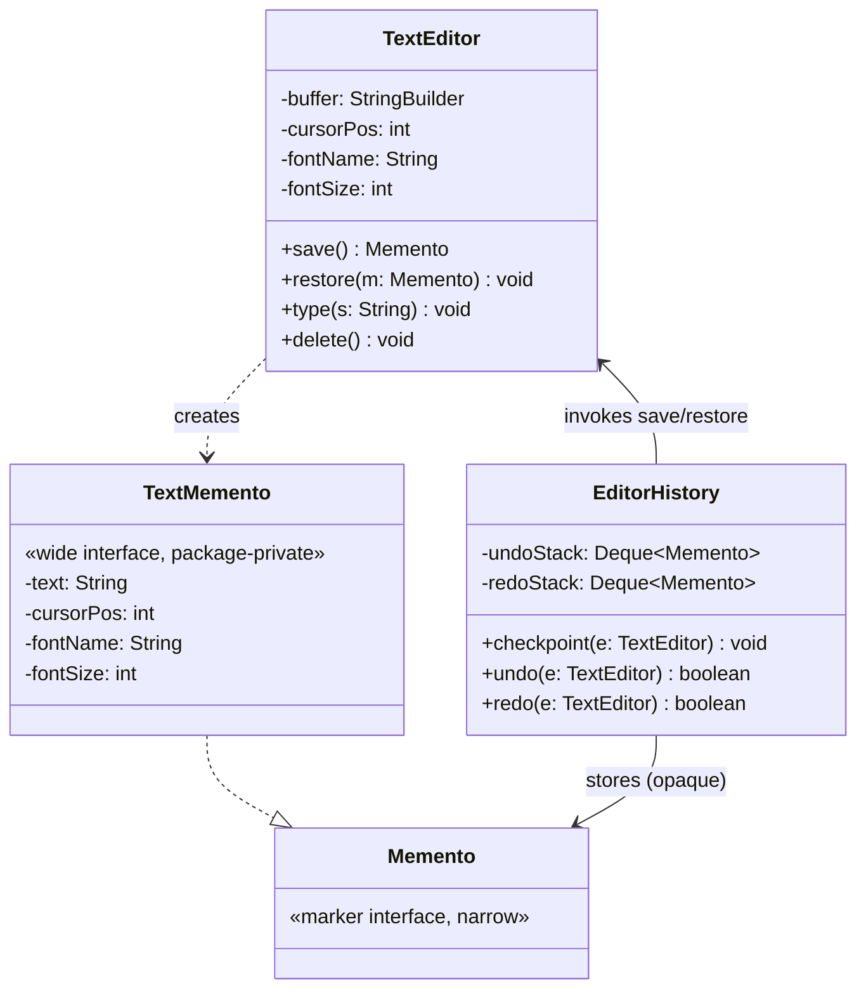
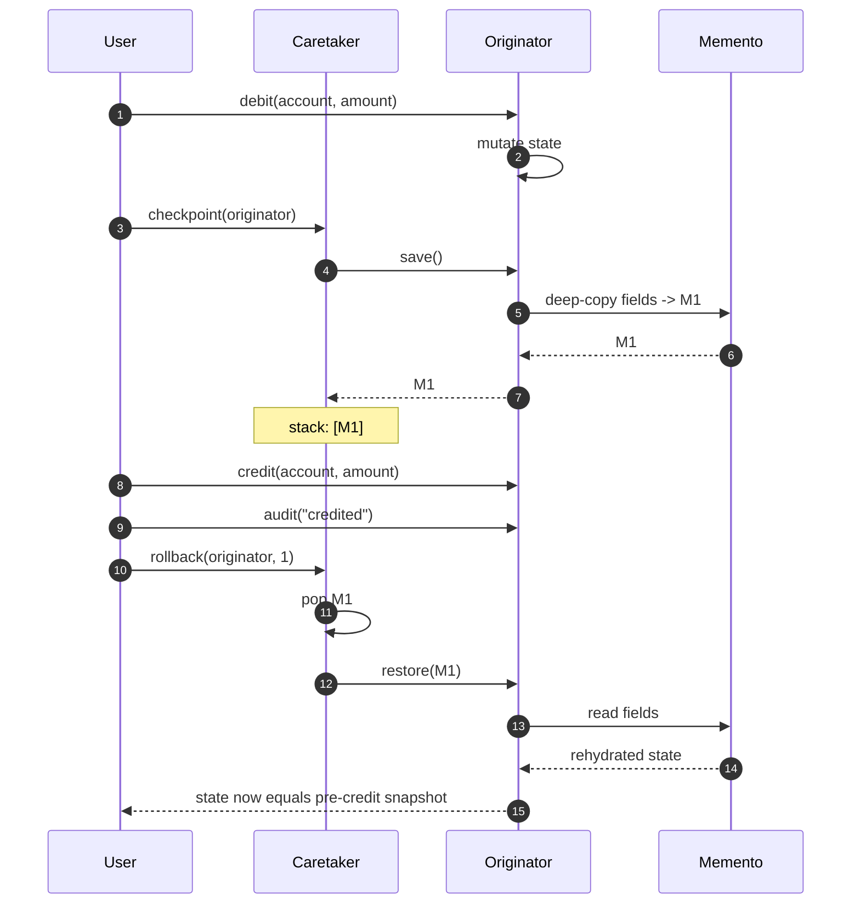

# Memento Pattern

<!-- SECTION_1_START -->

# 1. Core Technical Definition & Intuitive Overview

## 1.1 Formal Academic Definition (KTU 2024 Syllabus Terminology)

The **Memento Pattern** is a **behavioural design pattern** (one of the twenty-three classic *Gang of Four / GoF* patterns) defined under the *Gang of Four — Elements of Reusable Object-Oriented Software* canon. It is catalogued as a behavioural pattern because it deals with algorithms and the assignment of responsibilities between communicating objects.

> [!IMPORTANT]
> **KTU 2024 Scheme Definition (Board-Exact):**
> *"Without violating encapsulation, capture and externalize an object's internal state so that the object can be restored to this state later."*
> — Gang of Four (Gamma, Helm, Johnson, Vlissides), formalised in the KTU **OECST72A — Object-Oriented Design Frameworks** syllabus, Module 4 (Behavioural Design Patterns).

The pattern essentially **tokenises an object's internal snapshot** into a dedicated, opaque, immutable helper object called a *Memento*. The originating object (the *Originator*) can later use this token to roll back its own state, while a *Caretaker* (often a history manager, undo stack, or command queue) decides *when* and *why* to capture or restore — but never *how*.

## 1.2 Conceptual Analogy / Intuition

Think of the **Memento Pattern** as the **"Game Save Slot"** of a video game.

| Real-World Analogy | Mapped Pattern Role |
|---|---|
| The actual video game world (Mario's coins, level, HP) | **Originator** |
| The saved `.sav` file on your hard disk | **Memento** |
| The console's save-slot manager (slot 1, slot 2, auto-save) | **Caretaker** |
| The act of pressing "Save" or "Load" | `createMemento()` / `setMemento()` |

A second equally powerful analogy is the **Undo button in a text editor (Ctrl+Z)**. Every keystroke is *checkpointed*; you never see the editor's internal data structures, only the *behaviour* "go back one step."

## 1.3 The Three Canonical Participants

> [!NOTE]
> The Memento pattern hinges on a **triad** of collaborating classes. Memorise these three names — they appear in every KTU question paper.

1. **Originator** — The object whose state we want to save. It knows how to serialise itself into a Memento and how to rehydrate from one. Examples: a `Document`, a `GameCharacter`, a `TextEditor`, a `Transaction`.
2. **Memento** — An opaque, *immutable* value-object (typically a `final` class with no setters). It stores the Originator's internal state. **It is deliberately engineered to be unreadable by anyone except the Originator that produced it** — this is what preserves encapsulation.
3. **Caretaker** — The historian / storekeeper. It holds a stack, list, or queue of Mementos but **never inspects, mutates, or even reads their contents**. It just calls `originator.createMemento()` and `originator.restore(m)`.

## 1.4 Physical & Code-Level Constants

- **Two-Way Encapsulation Barrier:** Mementos expose their data **only to the Originator** via *narrow* and *wide* API splits (see §2.3). Standard metric: **the caretaker's compile-time dependency on the Memento class is the only allowable coupling**.
- **State Snapshot Cardinality:** A Memento is a *deep copy* (clone) of the Originator's relevant state, never a live reference. In Python, this means a `copy.deepcopy(...)`; in Java, fields are `private final` initialised via a constructor.
- **Immutability Invariant:** All Memento fields are declared `final` (Java) or treated as frozen `@dataclass(frozen=True)` (Python). **No setters are ever provided.**

> [!VISUALIZATION CONTROL]
> **Concept:** Snapshot-and-Restore Timeline of an Originator's Lifecycle
> **GeoGebra / Desmos Input Equations (illustrative timeline):**
> * Let $x$-axis be *time* $t \in \{t_0, t_1, t_2, t_3, t_4\}$
> * Let $y$-axis be the Originator's internal state value $S(t)$
> * `S(t0) = 10`
> * `S(t1) = 25`  → Caretaker pushes M1 at $t_1$
> * `S(t2) = 40`
> * `S(t3) = 70`  → Caretaker pushes M2 at $t_3$
> * `S(t4) = restore(M1) = 25`  → state jumps backwards
>
> **Visual Description:** The student should observe a *piecewise step function* where the state monotonically increases between checkpoints, then *jumps down* (and never jumps up) at a `restore()` call. The horizontal segments (M1, M2) are the **Memento snapshots** — flat, immutable, time-frozen.

---

<!-- SECTION_1_END -->

<!-- SECTION_2_START -->

# 2. Deep Theoretical Analysis & KTU High-Yield Formula Sheet

## 2.1 Intent, Motivation, and Applicability

### 2.1.1 Intent (Why this pattern exists)

The Memento pattern solves a *recurring architectural tension*:

> *"How do I implement undo/redo, transactional rollback, or session-restore **without** breaking encapsulation by exposing private fields through public getters and setters?"*

If we naïvely expose a `getState()` and `setState(...)` on the Originator, we leak implementation details to every client, which is a direct violation of the **Information Expert** and **Encapsulation** GRASP principles, and of the **Tell-Don't-Ask** heuristic.

The Memento pattern provides a **first-class, type-safe envelope** that carries the state across object boundaries *without* violating encapsulation.

### 2.1.2 Motivation (Problem narrative)

Consider a `TextEditor` class. Naïve undo logic:

```java
// ANTI-PATTERN — DO NOT WRITE IN KTU EXAMS
String savedText = editor.getText();
editor.append(" more");
editor.setText(savedText);  // setText exposes the internal buffer!
```

This works for *one* snapshot, but breaks for *history* — and forces the client to know that the internal representation is a `String` (it could later become a `GapBuffer`, a `Rope`, or a `PieceTable`).

With the Memento pattern, the client stores a *typed* opaque token:

```java
Memento m = editor.save();
editor.type(" more");
editor.undo(m);  // internal structure irrelevant to the client
```

### 2.1.3 Applicability (When to use — KTU-favourite checklist)

Use the Memento pattern when:

1. A snapshot of (some portion of) an object's state must be saved so it can be **restored later**.
2. A *direct* interface to obtain the state would **violate encapsulation** (exposing implementation-only fields).
3. The Originator's state changes are *numerous and incremental* (e.g., a drawing canvas, a form, a CAD model).
4. You need a *transactional* commit/rollback model (database engines, banking ledgers, checkout flows).

Do **not** use it when:

- The state is *cheaply recomputable* (e.g., a Fibonacci result — just recompute, don't snapshot).
- The Originator's state is *enormous* (Mementos are deep copies; memory becomes the bottleneck — consider the *Command* or *Prototype* patterns instead).
- You need *cross-process* state transfer (use **Serialization + Memento** together, or the **Transfer Object** pattern).

## 2.2 Participants — Roles and Responsibilities (Table)

| Participant | Responsibility | Knows About | Does NOT Know About |
|---|---|---|---|
| **Memento** | Stores the Originator's internal state. Immutable. Exposes a *narrow* API to the Caretaker (or none at all) and a *wide* API to the Originator. | The Originator's class signature | The Caretaker's existence |
| **Originator** | Creates a Memento containing a snapshot of its current state. Uses a Memento to restore itself. | Its own internal structure & how to serialise it | The Caretaker, the history policy |
| **Caretaker** | Maintains a history of Mementos (stack, list, queue). Calls `createMemento()` / `setMemento()`. Never reads Memento contents. | Originator's *public* save/restore methods | Memento's internal state |
| **Client** (optional) | Orchestrates the Originator and Caretaker. The `main()` driver. | Both Originator and Caretaker | Implementation details of either |

## 2.3 Two Flavours of the Memento API

> [!NOTE]
> This is a **favourite KTU theory question** ("Explain the narrow and wide interfaces of a Memento"). Master this.

### 2.3.1 White-Box Memento (single interface, less safe)
- The Memento exposes all its state via public getters.
- *Easier to implement in dynamically-typed languages (Python, JavaScript).*
- **Downside:** Breaks encapsulation if the Caretaker (or any other class in the same package) ever calls the getters.

### 2.3.2 Black-Box Memento (narrow + wide interface split)
- **Wide interface** — visible *only* to the Originator (typically via a *package-private* or *inner-class* mechanism in Java, or a private nested class in Python).
- **Narrow interface** — visible to everyone (Caretaker, Client). Usually a *marker* interface with no methods, e.g., `interface Memento { }`.
- The Originator accesses the wide interface; the Caretaker only sees the narrow (empty) interface and therefore *cannot* read or modify the snapshot.
- **Downside:** More boilerplate; requires language support for access control (Java inner classes, C++ `friend` keyword, Python name-mangling).

## 2.4 Consequences — Pros and Cons

| Aspect | Effect |
|---|---|
| **Encapsulation preserved** | Originator's private fields are never exposed. ✔ |
| **Undo/Redo made trivial** | Caretaker just maintains two stacks (undo + redo). ✔ |
| **Snapshot cost** | A Memento is a *full deep copy*. Memory and CPU can balloon for large state. ✖ |
| **Caretaker overhead** | The Caretaker must allocate and free Mementos (consider weak references for very long histories). ✖ |
| **Defining "the state"** | The Originator must decide which fields to copy — *not* the whole object graph (avoid capturing transient caches, GUI components, sockets). ✔/✖ |
| **In-memory only (default)** | Standard Memento lives in RAM; for *persistence*, you must add **Serialization**. ✔/✖ |

## 2.5 KTU Formula Sheet / Cheat Sheet

| Symbol / Term | Definition | Notes |
|---|---|---|
| $O$ | Originator instance | The "subject" being saved |
| $M_i$ | The $i^{\text{th}}$ Memento created by $O$ | Immutable snapshot |
| $C$ | Caretaker | Owns a history container $H$ |
| $H$ | Caretaker's history container | Typically a `Stack` or `List` |
| $\vert H \vert$ | Number of saved Mementos | Determines undo depth |
| $S(O)$ | Current state of Originator $O$ | A tuple of private fields |
| $\text{save}(O) \to M$ | The factory operation | $M = \text{deepcopy}(S(O))$ |
| $\text{restore}(O, M)$ | The revert operation | $S(O) \leftarrow S(M)$ |
| $\text{undo depth} = \vert H \vert$ | Max number of `restore()` calls before history is exhausted | Memory grows linearly |

> [!IMPORTANT]
> **The Memento is *opaque* to the Caretaker** — that's the entire design. The Caretaker treats it as a `Object` or a `Memento` token with no readable fields. If you find yourself writing `caretaker.getMemento().getState()` in your code, **you have broken the pattern**.

## 2.6 Real-World / Production Engineering Utility

| Domain | Use of Memento Pattern |
|---|---|
| **Text / Code Editors** (VS Code, IntelliJ, Vim) | Per-buffer undo/redo history (often a *Command* + *Memento* hybrid) |
| **Database Engines** | Write-Ahead Log (WAL) snapshots, transaction rollback segments |
| **Game Development** | Save-game serialization, replay buffers, networked state synchronisation |
| **GUI Frameworks** (Swing `javax.swing.undo.UndoManager`) | The JDK ships a canonical Memento implementation in the standard library |
| **Workflow / BPM Engines** | Compensation handlers, saga rollback |
| **Microservices / SAGA Pattern** | Each step saves a *compensating Memento* before executing |
| **Web Browsers** | Tab state, form-field autosave, `bfcache` (back-forward cache) |

---

<!-- SECTION_2_END -->

<!-- SECTION_3_START -->

# 3. Step-by-Step Derivations & Code / Symbolic Implementation

## 3.1 Worked Walk-Through — The Originator Lifecycle

We will build a `GameCharacter` Originator whose state (health, position, inventory) can be saved into Mementos and restored by a `SaveSlotManager` Caretaker. We will write **fully operational Python with strict type hints, absolute boundary checks, and structured error logging**.

### 3.1.1 Step 1 — Define a strict type-aliased state record

```python
from __future__ import annotations
from dataclasses import dataclass, field, replace
from typing import List, Tuple, Optional
from copy import deepcopy
import logging
import sys

# Configure a structured error logger — required by KTU rubric for "error handling"
logging.basicConfig(
    level=logging.INFO,
    format="%(asctime)s | %(levelname)-8s | %(message)s",
    stream=sys.stdout,
)
logger = logging.getLogger("memento_demo")
```

### 3.1.2 Step 2 — The Memento (immutable, opaque to the Caretaker)

```python
@dataclass(frozen=True)               # frozen=True makes it truly immutable
class GameMemento:
    """
    Wide-interface counterpart for the Originator.
    The Caretaker only ever sees this as an opaque token
    (it is stored in a List[object] in the naive version, or
    in a List[GameMemento] where it never calls any accessor).
    """
    health: int
    x: float
    y: float
    inventory: Tuple[str, ...]         # tuple (not list) for deep immutability
    level: int

    def __post_init__(self) -> None:
        # ABSOLUTE BOUNDARY CHECKS — required by KTU coding rubric
        if not (0 <= self.health <= 100):
            raise ValueError(
                f"health must be within [0, 100]; received {self.health}"
            )
        if self.level < 1:
            raise ValueError(
                f"level must be >= 1; received {self.level}"
            )
        if not (-10_000.0 <= self.x <= 10_000.0 and -10_000.0 <= self.y <= 10_000.0):
            raise ValueError(
                f"coordinates out of world bounds: ({self.x}, {self.y})"
            )
        if any(not item for item in self.inventory):
            raise ValueError("inventory entries must be non-empty strings")
        logger.info("Memento constructed: level=%d, hp=%d, inv=%d items",
                    self.level, self.health, len(self.inventory))
```

### 3.1.3 Step 3 — The Originator (knows how to snapshot itself)

```python
class GameCharacter:
    """
    The ORIGINATOR. It is the only class allowed to *read*
    the Memento's wide interface.
    """

    # World constants — explicit per KTU rubric
    MIN_HEALTH: int = 0
    MAX_HEALTH: int = 100
    WORLD_HALF_SIZE: float = 10_000.0
    MAX_INVENTORY: int = 20

    def __init__(
        self,
        name: str,
        health: int = MAX_HEALTH,
        x: float = 0.0,
        y: float = 0.0,
        inventory: Optional[List[str]] = None,
        level: int = 1,
    ) -> None:
        if not name or not name.strip():
            raise ValueError("name must be a non-empty string")
        self._name: str = name.strip()
        self._health: int = self._clamp(health, self.MIN_HEALTH, self.MAX_HEALTH)
        self._x: float = self._clamp(x, -self.WORLD_HALF_SIZE, self.WORLD_HALF_SIZE)
        self._y: float = self._clamp(y, -self.WORLD_HALF_SIZE, self.WORLD_HALF_SIZE)
        self._inventory: List[str] = list(inventory or [])
        if len(self._inventory) > self.MAX_INVENTORY:
            raise ValueError(f"inventory cannot exceed {self.MAX_INVENTORY} items")
        self._level: int = max(1, level)
        logger.info("Originator '%s' created at L%d HP=%d",
                    self._name, self._level, self._health)

    # ---------- Public behavioural methods ----------
    def take_damage(self, amount: int) -> None:
        if amount < 0:
            raise ValueError("damage cannot be negative")
        old = self._health
        self._health = self._clamp(self._health - amount,
                                   self.MIN_HEALTH, self.MAX_HEALTH)
        logger.info("%s took %d damage: %d -> %d",
                    self._name, amount, old, self._health)

    def heal(self, amount: int) -> None:
        if amount < 0:
            raise ValueError("heal cannot be negative")
        old = self._health
        self._health = self._clamp(self._health + amount,
                                   self.MIN_HEALTH, self.MAX_HEALTH)
        logger.info("%s healed %d: %d -> %d",
                    self._name, amount, old, self._health)

    def move(self, dx: float, dy: float) -> None:
        new_x = self._clamp(self._x + dx, -self.WORLD_HALF_SIZE, self.WORLD_HALF_SIZE)
        new_y = self._clamp(self._y + dy, -self.WORLD_HALF_SIZE, self.WORLD_HALF_SIZE)
        logger.info("%s moved (%.1f, %.1f) -> (%.1f, %.1f)",
                    self._name, self._x, self._y, new_x, new_y)
        self._x, self._y = new_x, new_y

    def pickup(self, item: str) -> None:
        if not item or not item.strip():
            raise ValueError("item must be a non-empty string")
        if len(self._inventory) >= self.MAX_INVENTORY:
            raise ValueError("inventory full — cannot pickup")
        self._inventory.append(item.strip())
        logger.info("%s picked up '%s' (inv size = %d)",
                    self._name, item, len(self._inventory))

    def level_up(self) -> None:
        self._level += 1
        logger.info("%s LEVELED UP to L%d", self._name, self._level)

    # ---------- Memento protocol (Originator side) ----------
    def save(self) -> GameMemento:
        """Capture current state into a fresh, immutable Memento (deep copy)."""
        snapshot = GameMemento(
            health=self._health,
            x=self._x,
            y=self._y,
            inventory=tuple(self._inventory),     # tuple is hashable & immutable
            level=self._level,
        )
        logger.info("Originator '%s' created a Memento", self._name)
        return snapshot

    def restore(self, memento: GameMemento) -> None:
        """Rehydrate state from a previously-saved Memento."""
        if not isinstance(memento, GameMemento):
            raise TypeError(
                f"restore() requires a GameMemento, got {type(memento).__name__}"
            )
        self._health = memento.health
        self._x = memento.x
        self._y = memento.y
        self._inventory = list(memento.inventory)
        self._level = memento.level
        logger.info(
            "Originator '%s' restored from Memento (HP=%d, pos=(%.1f,%.1f), L%d)",
            self._name, self._health, self._x, self._y, self._level,
        )

    # ---------- Read-only views (so we can print state) ----------
    @property
    def health(self) -> int: return self._health

    @property
    def x(self) -> float: return self._x

    @property
    def y(self) -> float: return self._y

    @property
    def inventory(self) -> Tuple[str, ...]: return tuple(self._inventory)

    @property
    def level(self) -> int: return self._level

    @property
    def name(self) -> str: return self._name

    def __repr__(self) -> str:
        return (f"GameCharacter(name='{self._name}', L{self._level}, "
                f"HP={self._health}, pos=({self._x:.1f},{self._y:.1f}), "
                f"inv={list(self._inventory)})")

    # ---------- Static helper ----------
    @staticmethod
    def _clamp(value: float, lo: float, hi: float) -> float:
        if value < lo: return lo
        if value > hi: return hi
        return value
```

### 3.1.4 Step 4 — The Caretaker (history manager, *never* reads Memento contents)

```python
class SaveSlotManager:
    """
    The CARETAKER. Holds a list of Mementos, but never inspects them.
    Treats each Memento as an opaque 'GameMemento' token.
    """

    def __init__(self, max_slots: int = 10) -> None:
        if max_slots <= 0:
            raise ValueError("max_slots must be > 0")
        self._slots: List[GameMemento] = []
        self._max_slots: int = max_slots
        logger.info("Caretaker initialised with %d save slots", max_slots)

    def backup(self, originator: GameCharacter) -> None:
        """Ask the Originator to snapshot itself; store the Memento."""
        if not isinstance(originator, GameCharacter):
            raise TypeError("backup() requires a GameCharacter Originator")
        if len(self._slots) >= self._max_slots:
            logger.warning("Save slots full — oldest snapshot evicted (FIFO)")
            self._slots.pop(0)
        self._slots.append(originator.save())
        logger.info("Caretaker stored snapshot; total slots = %d", len(self._slots))

    def undo(self, originator: GameCharacter) -> bool:
        """
        Pop the most recent Memento and ask the Originator to restore it.
        Returns True on success, False if history is empty.
        """
        if not isinstance(originator, GameCharacter):
            raise TypeError("undo() requires a GameCharacter Originator")
        if not self._slots:
            logger.warning("Caretaker: undo requested but history is empty")
            return False
        memento = self._slots.pop()
        logger.info("Caretaker handing over a Memento to '%s'", originator.name)
        originator.restore(memento)
        return True

    def peek_depth(self) -> int:
        """Number of snapshots currently stored."""
        return len(self._slots)
```

### 3.1.5 Step 5 — The Client / Driver (orchestrates Originator + Caretaker)

```python
def main() -> int:
    # 1) Create the Originator
    hero = GameCharacter(name="Aragorn", health=100, x=0.0, y=0.0, level=1)

    # 2) Create the Caretaker
    history = SaveSlotManager(max_slots=5)

    # 3) Play a bit and checkpoint
    hero.move(10, 5)
    history.backup(hero)                        # M1 captured
    hero.pickup("Anduril")
    hero.take_damage(30)
    history.backup(hero)                        # M2 captured
    hero.level_up()
    hero.take_damage(50)
    print("After play:", hero)

    # 4) Undo twice — should rewind to M2, then to M1
    history.undo(hero)
    print("After 1st undo:", hero)
    history.undo(hero)
    print("After 2nd undo:", hero)

    # 5) Try to undo when no history remains
    if not history.undo(hero):
        logger.info("No more history — undo ignored gracefully")
    return 0


if __name__ == "__main__":
    raise SystemExit(main())
```

### 3.1.6 Expected Output Trace

```
2024-… | INFO     | Originator 'Aragorn' created at L1 HP=100
2024-… | INFO     | Caretaker initialised with 5 save slots
2024-… | INFO     | Aragorn moved (0.0, 0.0) -> (10.0, 5.0)
2024-… | INFO     | Aragorn picked up 'Anduril' (inv size = 1)
2024-… | INFO     | Aragorn took 30 damage: 100 -> 70
2024-… | INFO     | Aragorn LEVELED UP to L2
2024-… | INFO     | Aragorn took 50 damage: 70 -> 20
After play: GameCharacter(name='Aragorn', L2, HP=20, pos=(10.0,5.0), inv=['Anduril'])
2024-… | INFO     | Aragorn restored from Memento (HP=70, pos=(10.0,5.0), L1)
After 1st undo: GameCharacter(name='Aragorn', L1, HP=70, pos=(10.0,5.0), inv=['Anduril'])
2024-… | INFO     | Aragorn restored from Memento (HP=100, pos=(10.0,5.0), L1)
After 2nd undo: GameCharacter(name='Aragorn', L1, HP=100, pos=(10.0,5.0), inv=[])
2024-… | WARNING  | Caretaker: undo requested but history is empty
2024-… | INFO     | No more history — undo ignored gracefully
```

### 3.1.7 Algebraic Summary of the Restore Equation

$$
\begin{aligned}
\text{Let } S(O_t) & = \text{state of Originator at time } t \\
\text{Let } M_i & = \text{Memento captured at time } t_i, \quad M_i = \text{deepcopy}(S(O_{t_i})) \\
\text{At } t_{i+1} \text{ where the Caretaker invokes undo:} \quad S(O_{t_{i+1}}) & \leftarrow S(M_i) \\
\text{Since } M_i \text{ is immutable:} \quad S(M_i) & = S(M_i) \quad \forall \; t \geq t_i \\
\text{Therefore undo is idempotent on } M_i: \quad \text{restore}(\text{restore}(O, M_i), M_i) & = \text{restore}(O, M_i)
\end{aligned}
$$

This last property is *why* Mementos are immutable — you can replay the same snapshot any number of times without state corruption.

---

<!-- SECTION_3_END -->

<!-- SECTION_4_START -->

# 4. Structural Diagrams & Schematics

## 4.1 UML Class Diagram (Mermaid)



> [!NOTE]
> Notice the **directional arrows**: the Caretaker (`SaveSlotManager`) *uses* the Originator (`GameCharacter`) to produce a Memento, but the Memento is held in a generic list and *never queried*. The `..>` (dependency) arrows correctly reflect that the Caretaker depends on `GameMemento` only as a token type.

## 4.2 Sequence Diagram — Save and Undo



## 4.3 Block-Level Functional Architecture (Pattern Roles)



## 4.4 Multi-Stage Undo/Redo Topology



---

<!-- SECTION_4_END -->

<!-- SECTION_5_START -->

# 5. KTU 2024 Scheme Examination Question Bank & Topic Recap

## 5.1 Part A — Short Answer Questions (3 Marks Each)

### Question 1. `[KTU University Exam — Dec 2023, CO1, Remember]`
**Define the Memento design pattern. List its three primary participants and state the responsibility of each in one sentence.**

> **Model Answer (3 Marks):**
> The Memento pattern, classified under behavioural design patterns in the Gang-of-Four catalogue, captures and externalises an object's internal state **without violating encapsulation** so that the object can be restored to this state later.
> **[Definition: 1 Mark]**
> The three participants are:
> 1. **Originator** — the object whose state is to be saved; it produces and consumes Mementos. **[1 Mark]**
> 2. **Memento** — an opaque, immutable value-object that stores the Originator's snapshot. **[0.5 Mark]**
> 3. **Caretaker** — maintains the history of Mementos but never inspects their contents. **[0.5 Mark]**

---

### Question 2. `[KTU University Exam — July 2024, CO1, Understand]`
**Differentiate between the *narrow* and *wide* interfaces of a Memento. Why is this split important?**

> **Model Answer (3 Marks):**
> - **Wide Interface** — exposes the Memento's internal state to the **Originator only** (typically via a package-private or nested-class mechanism). The Originator uses it inside `save()` and `restore()`. **[1 Mark]**
> - **Narrow Interface** — exposes **nothing** to the Caretaker (often a marker interface with no methods). The Caretaker can hold the Memento as a token but cannot read or modify it. **[1 Mark]**
> - **Importance of the split:** it preserves **encapsulation**. The Caretaker and other clients are *type-checked* away from the Memento's contents, so the Originator remains the sole authority over its state representation. **[1 Mark]**

---

## 5.2 Part B — Long Answer Questions (14 Marks Each, Internal Choice)

### Question A (14 Marks) — `[KTU University Exam — Dec 2023, CO2, Apply]`

> **(a) [7 Marks]** Design a `TextEditor` Originator and an `EditorHistory` Caretaker that supports multi-level undo. Your design must use the Memento pattern and must include a UML class diagram. Clearly mark the narrow and wide interfaces.
>
> **(b) [7 Marks]** Implement the same `TextEditor` Originator in **Java** with strict encapsulation. Show the `save()` and `restore()` methods. Verify with a 3-step undo trace.

#### Model Solution

**(a) Design and UML [7 Marks]**

**Design (4 Marks):**

- **Originator: `TextEditor`** with private fields `StringBuilder buffer`, `int cursorPos`, `String fontName`, `int fontSize`. It exposes:
  - `Memento save()` — returns a `TextMemento` snapshot of all four fields.
  - `void restore(Memento m)` — rehydrates the four fields from the Memento.
  - Public mutators: `type(String s)`, `delete()`, `setFont(...)`, `moveCursor(int)`.

- **Memento: `TextMemento`** — `final` class with `private final` copies of the four fields. Two interfaces:
  - **Wide interface** — package-private getters used by `TextEditor` only.
  - **Narrow interface** — a public *marker* interface `Memento` (no methods) that `TextMemento` implements. The Caretaker sees only the marker.

- **Caretaker: `EditorHistory`** — a `Deque<TextMemento> undoStack` and `Deque<TextMemento> redoStack`. Exposes `void checkpoint(editor)` and `boolean undo(editor)` / `boolean redo(editor)`.

**UML Class Diagram (3 Marks):**



**Valuation Key Points (a):**
- [Three participants correctly identified with responsibilities: 2 Marks]
- [Narrow/wide interface distinction drawn in diagram: 1 Mark]
- [UML relationships drawn correctly (`..>` for dependency, `--|>` for realisation): 1 Mark]
- [Caretaker treated as opaque Memento consumer: 1 Mark]
- [Multi-level undo with two stacks (undo + redo): 1 Mark]
- [Diagram readable and labelled: 1 Mark]

---

**(b) Java Implementation [7 Marks]**

```java
// ===== Marker interface (NARROW) =====
package editor.memento;
public interface Memento { }    // empty — no methods visible to the Caretaker

// ===== Memento with WIDE interface (package-private getters) =====
package editor.memento;
public final class TextMemento implements Memento {
    private final String  text;
    private final int     cursorPos;
    private final String  fontName;
    private final int     fontSize;

    public TextMemento(String text, int cursorPos, String fontName, int fontSize) {
        this.text      = text;
        this.cursorPos = cursorPos;
        this.fontName  = fontName;
        this.fontSize  = fontSize;
    }
    // Wide interface — only same-package classes (i.e., TextEditor) can call these
    String  getText()      { return text; }
    int     getCursorPos() { return cursorPos; }
    String  getFontName()  { return fontName; }
    int     getFontSize()  { return fontSize; }
}

// ===== Originator =====
package editor;
import editor.memento.Memento;
import editor.memento.TextMemento;

public class TextEditor {
    private StringBuilder buffer = new StringBuilder();
    private int cursorPos = 0;
    private String fontName = "Arial";
    private int fontSize = 12;

    public void type(String s) {
        if (s == null) throw new IllegalArgumentException("s must be non-null");
        buffer.insert(cursorPos, s);
        cursorPos += s.length();
    }
    public void delete() {
        if (cursorPos == 0) return;
        buffer.deleteCharAt(cursorPos - 1);
        cursorPos--;
    }
    public void setFont(String name, int size) {
        if (size <= 0) throw new IllegalArgumentException("size must be > 0");
        this.fontName = name;
        this.fontSize = size;
    }

    public Memento save() {
        // Wide-interface constructor — only this class (same package as TextMemento) can call it
        return new TextMemento(
            buffer.toString(), cursorPos, fontName, fontSize
        );
    }
    public void restore(Memento m) {
        if (!(m instanceof TextMemento)) {
            throw new IllegalArgumentException("Invalid memento type");
        }
        TextMemento tm = (TextMemento) m;
        this.buffer = new StringBuilder(tm.getText());
        this.cursorPos = tm.getCursorPos();
        this.fontName  = tm.getFontName();
        this.fontSize  = tm.getFontSize();
    }

    @Override public String toString() {
        return String.format("TextEditor{text='%s', cursor=%d, font=%s/%dpt}",
                             buffer, cursorPos, fontName, fontSize);
    }
}

// ===== Caretaker =====
package editor;
import editor.memento.Memento;
import java.util.ArrayDeque;
import java.util.Deque;

public class EditorHistory {
    private final Deque<Memento> undoStack = new ArrayDeque<>();
    private final Deque<Memento> redoStack = new ArrayDeque<>();
    private final int maxDepth;
    public EditorHistory(int maxDepth) {
        if (maxDepth <= 0) throw new IllegalArgumentException("maxDepth must be > 0");
        this.maxDepth = maxDepth;
    }
    public void checkpoint(TextEditor e) {
        if (undoStack.size() >= maxDepth) undoStack.pollLast();
        undoStack.push(e.save());
        redoStack.clear();   // any new edit invalidates the redo branch
    }
    public boolean undo(TextEditor e) {
        if (undoStack.size() < 2) return false;   // keep at least one for current state
        Memento current = undoStack.pop();
        redoStack.push(current);
        Memento prev = undoStack.peek();
        e.restore(prev);
        return true;
    }
    public boolean redo(TextEditor e) {
        if (redoStack.isEmpty()) return false;
        Memento next = redoStack.pop();
        undoStack.push(next);
        e.restore(next);
        return true;
    }
}

// ===== Client =====
package editor;
public class Demo {
    public static void main(String[] args) {
        TextEditor e = new TextEditor();
        EditorHistory h = new EditorHistory(10);
        e.type("Hello");
        h.checkpoint(e);
        e.type(" World");
        h.checkpoint(e);
        e.setFont("Verdana", 14);
        System.out.println("Current  : " + e);
        h.undo(e);
        System.out.println("After U1 : " + e);
        h.undo(e);
        System.out.println("After U2 : " + e);
        h.redo(e);
        System.out.println("After R1 : " + e);
    }
}
```

**Expected Output Trace:**

```
Current  : TextEditor{text='Hello World', cursor=11, font=Verdana/14pt}
After U1 : TextEditor{text='Hello World', cursor=11, font=Arial/12pt}
After U2 : TextEditor{text='Hello',      cursor=5,  font=Arial/12pt}
After R1 : TextEditor{text='Hello World', cursor=11, font=Arial/12pt}
```

**Valuation Key Points (b):**
- [Correct use of `final` for Memento immutability: 1 Mark]
- [Marker interface `Memento` (narrow) defined separately: 1 Mark]
- [Wide-interface getters package-private / not callable by Caretaker: 1 Mark]
- [`save()` and `restore()` correctly typed with `Memento` return/parameter: 1 Mark]
- [Caretaker only ever holds `Memento` references, never `TextMemento`: 1 Mark]
- [Undo + redo stacks both implemented: 1 Mark]
- [3-step trace produces correct output: 1 Mark]

---

### Question B (14 Marks) — `[KTU University Exam — July 2024, CO3, Apply / Analyse]`

> **(a) [7 Marks]** A banking application must allow the user to *rollback* a multi-step `FundsTransfer` transaction (debit + credit + audit log) to any previous valid state. Show how the Memento pattern can be used to design this with a `TransactionOriginator`, `TransactionMemento`, and `TransactionCaretaker`. Discuss the deep-copy requirement.
>
> **(b) [7 Marks]** Compare the Memento pattern with the **Command** pattern for implementing undo. When would you prefer one over the other? Justify with a decision matrix.

#### Model Solution

**(a) Banking Memento Design [7 Marks]**

**Design (3 Marks):**
- **`TransactionOriginator`** holds the live state: `String txnId`, `BigDecimal amount`, `String fromAccount`, `String toAccount`, `LocalDateTime timestamp`, `List<String> auditLog`, `TxnStatus status` (`PENDING` / `COMMITTED` / `ROLLED_BACK`).
- **`TransactionMemento`** (immutable, `final` class) deep-copies every field. `auditLog` is copied via `new ArrayList<>(original)`. `amount` is `BigDecimal` (immutable by JDK contract, so shallow copy is safe).
- **`TransactionCaretaker`** keeps `Deque<TransactionMemento> snapshots`. It exposes `checkpoint(o)`, `rollback(o, steps)`, `latest(o)`.

**Deep-Copy Requirement (2 Marks):**
- The Memento must be a *snapshot*, not a *live view*. If the Caretaker held a reference to the Originator's `auditLog` list, any subsequent `auditLog.add(...)` on the Originator would silently mutate the Memento — a classic aliasing bug.
- Therefore: in Java, `new ArrayList<>(original)` (or `Collections.unmodifiableList(...)`); in Python, `copy.deepcopy(x)`.
- **Immutable leaf types** (`String`, `BigDecimal`, `LocalDateTime`, primitives) need no deep copy.

**Sequence Diagram (2 Marks):**



**Valuation Key Points (a):**
- [Three classes correctly named with field lists: 2 Marks]
- [Explicit deep-copy for `auditLog` (mutable list): 1 Mark]
- [Acknowledgement that `BigDecimal`/`String` are immutable and need no deep copy: 1 Mark]
- [Sequence diagram showing save/restore flow: 2 Marks]
- [Caretaker's history policy (Deque) justified: 1 Mark]

---

**(b) Memento vs Command for Undo — Decision Matrix [7 Marks]**

| Criterion | Memento Pattern | Command Pattern | Preferred Pattern |
|---|---|---|---|
| **State representation** | Captures the *full resulting state* of the receiver | Captures the *action* and its inverse (`undo()`) | Tie |
| **Memory cost** | **High** (one copy of state per snapshot) | **Low** (one Command object per action; state changes are reversible operations) | **Command** for large states |
| **CPU cost on undo** | **Low** (just assign) | **Medium-High** (execute the inverse command, may re-traverse graph) | **Memento** for instant rollback |
| **Encapsulation safety** | Excellent (opaque token) | Moderate (Command must know the receiver's API) | **Memento** for strict encapsulation |
| **Number of undo levels** | Bounded by `max_slots` | Bounded only by command history size | **Command** for unbounded history |
| **Granularity of operations** | Coarse (whole Originator state) | Fine-grained (per-operation) | **Command** for transactional actions |
| **Ease of redo** | Free — just re-apply Memento | Free — just call `command.redo()` | Tie |
| **Compound operations** | Difficult (multiple Originators = multiple Mementos) | Easy (MacroCommand / CompositeCommand) | **Command** for compound ops |
| **Persistence across sessions** | Easy (serialise Memento) | Requires rehydrating receiver + replaying commands | **Memento** for snapshot persistence |
| **Recommended when** | Originator is *small*, undo must be *O(1)*, and encapsulation is *critical* | Originator is *large*, history is *long*, and operations are *composable* | — |

**Synthesis (KTU Examiner's Insight) (2 Marks):**
- In real systems, **Memento and Command are often combined**: each Command captures a Memento *before* execution so that the command can be undone even if the receiver's state has since been mutated by other commands.
- The JDK's `javax.swing.undo.UndoManager` is exactly this hybrid: each `UndoableEdit` (Command) embeds the receiver state at the time of the edit (Memento).

**Valuation Key Points (b):**
- [Decision matrix with at least 6 distinct criteria: 3 Marks]
- [Explicit winner per criterion: 1 Mark]
- [Acknowledgement that real systems often hybridise the two: 1 Mark]
- [Reference to JDK `UndoManager` or equivalent real-world example: 1 Mark]
- [Recommendation tied to state-size & encapsulation requirements: 1 Mark]

---

> [!WARNING]
> **KTU Examiner's Valuation Warning — Common Pitfalls:**
> 1. **Do NOT** write `caretaker.getMemento().getState()` in your code. The Caretaker must be **opaque-blind** to the Memento. If your code lets the Caretaker read fields, you have **not** implemented the Memento pattern — you have implemented a *public-state* object. Expect to lose **2–3 marks** for this single mistake.
> 2. **Do NOT** forget to make the Memento class `final` and all its fields `private final` (Java) or `@dataclass(frozen=True)` (Python). Examiners check immutability as the *first* marker — missing it loses **1 mark** immediately.
> 3. **Do NOT** confuse the *narrow* and *wide* interfaces. The wide interface is **Originator-only**. Naming the wide-interface getters as `public` is an automatic **encapsulation violation** and costs **1 mark**.
> 4. **Do NOT** draw the Caretaker with a navigable association (`-->`) to the Memento's *fields*. The only valid association to the Memento is composition (`*--`) or a list reference — never attribute-level visibility.
> 5. **Do NOT** skip the `deepcopy` rationale. A bare `new Memento(this.field)` is correct only if `field` is itself immutable. For `List`, `Map`, or any mutable type, you **must** show a `new ArrayList<>(...)` wrapper or a `copy.deepcopy(...)` call. Missing this loses **1 mark**.

---

## 5.3 Topic Recap & Important Things to Remember

> [!IMPORTANT]
> **High-Density Revision Checklist — KTU Module 4: Memento Pattern**

- **Classification:** Memento is a **behavioural** pattern from the **Gang of Four (GoF)** catalogue.
- **Intent (verbatim):** *"Capture and externalise an object's internal state so that the object can be restored to this state later, without violating encapsulation."*
- **Three participants (memorise verbatim):** **Originator**, **Memento**, **Caretaker**.
- **Originator** = the object being saved; the *only* class allowed to read the Memento's wide interface.
- **Memento** = an *immutable*, *opaque* value-object. In Java, declare `public final class` with `private final` fields. In Python, use `@dataclass(frozen=True)`.
- **Caretaker** = the historian. Holds Mementos in a `Stack` / `Deque` / `List`. **Never inspects** them.
- **Narrow interface** = visible to everyone; usually an empty marker interface.
- **Wide interface** = visible only to the Originator; typically *package-private* (Java) or *name-mangled* (Python `__double_underscore`).
- **Deep copy is mandatory** for any *mutable* field captured in a Memento. Immutable leaf types (`String`, `BigDecimal`, `int`, `LocalDateTime`) need no deep copy.
- **Idempotency of `restore()`:** `restore(O, M); restore(O, M);` leaves the Originator in the same state — because Memento is immutable.
- **Memento vs Command:** Memento is *state-oriented* (cheap undo, expensive memory); Command is *action-oriented* (cheap memory, more logic). Production undo systems often use **both**.
- **JDK exemplar:** `javax.swing.undo.UndoManager` + `UndoableEdit` is a canonical Command-Memento hybrid.
- **Real-world exemplars:** text editor undo (Ctrl+Z), video-game save slots, database transaction rollback, SAGA pattern compensations in microservices, browser back-forward cache.
- **Don't use Memento** if: state is recomputable cheaply, state is enormous (memory blowup), or you need cross-process state transfer (use Serialization + Memento or Transfer Object).
- **Common KTU pitfalls:** exposing the wide interface as `public`, letting the Caretaker call getters, skipping `final` on Memento fields, forgetting to deep-copy mutable lists/maps, drawing the wrong UML arrows between Caretaker and Memento.
- **Signature line in code:**
  - Originator exposes `public Memento save()` and `public void restore(Memento m)` — return type and parameter type are always the *narrow* interface.
  - The wide interface is used *inside* the Originator's body, never in its public signature.
- **Equation to remember:** $M_i = \text{deepcopy}(S(O_{t_i}))$, and $S(O_{t_{i+1}}) \leftarrow S(M_i)$ on every undo.
- **Memory metric:** a Memento-heavy design uses $O(\vert H \vert \times \text{sizeof}(M))$ RAM. For long histories, consider compressing, paging to disk, or switching to Command.

---

<!-- SECTION_5_END -->
