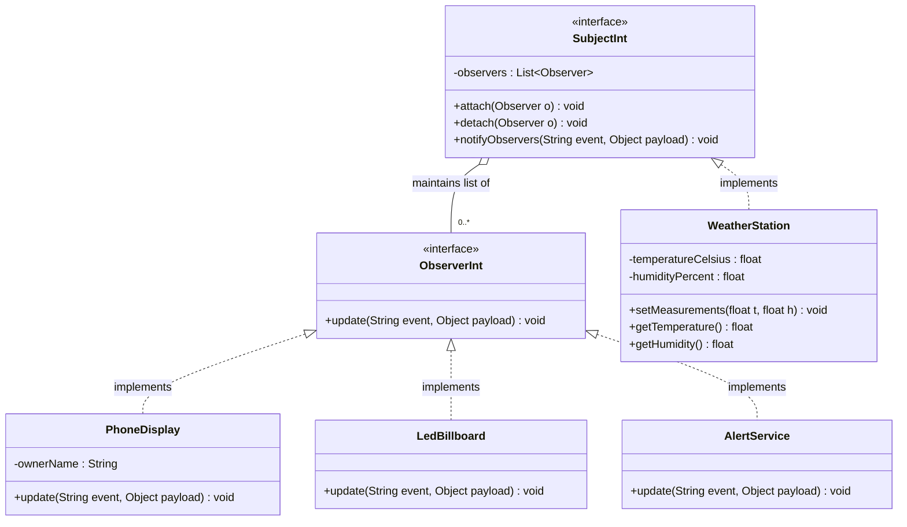
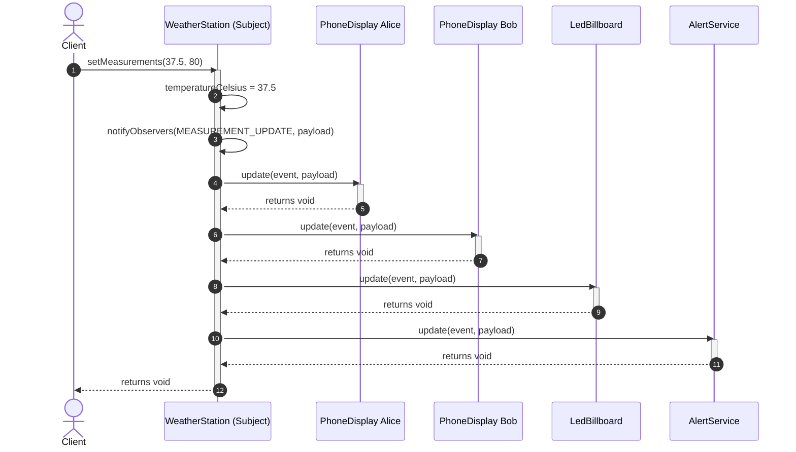
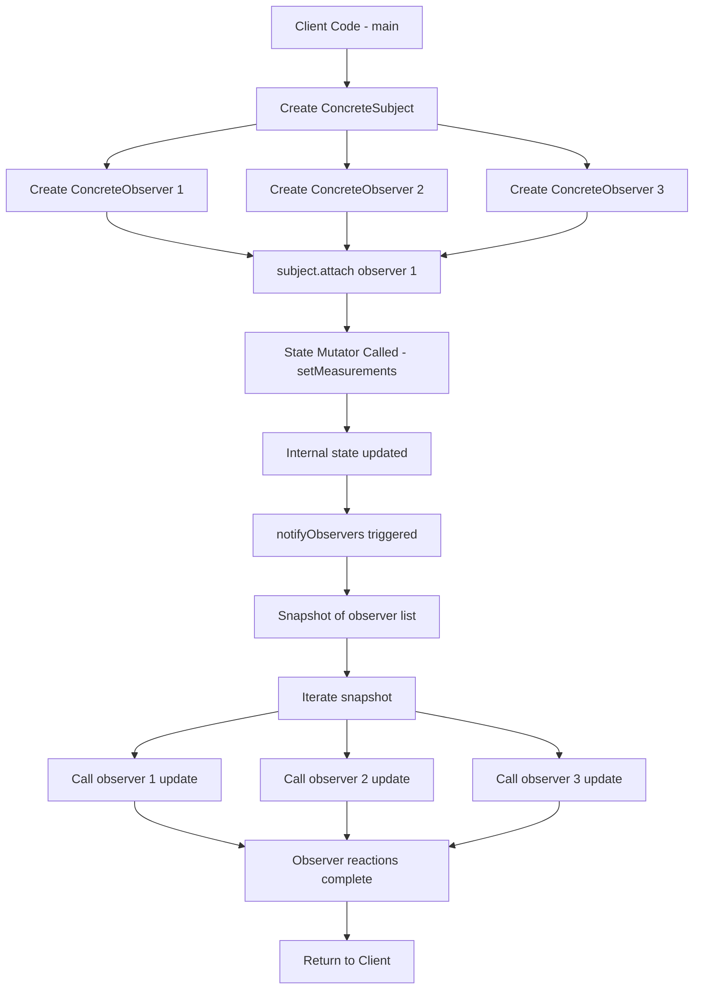
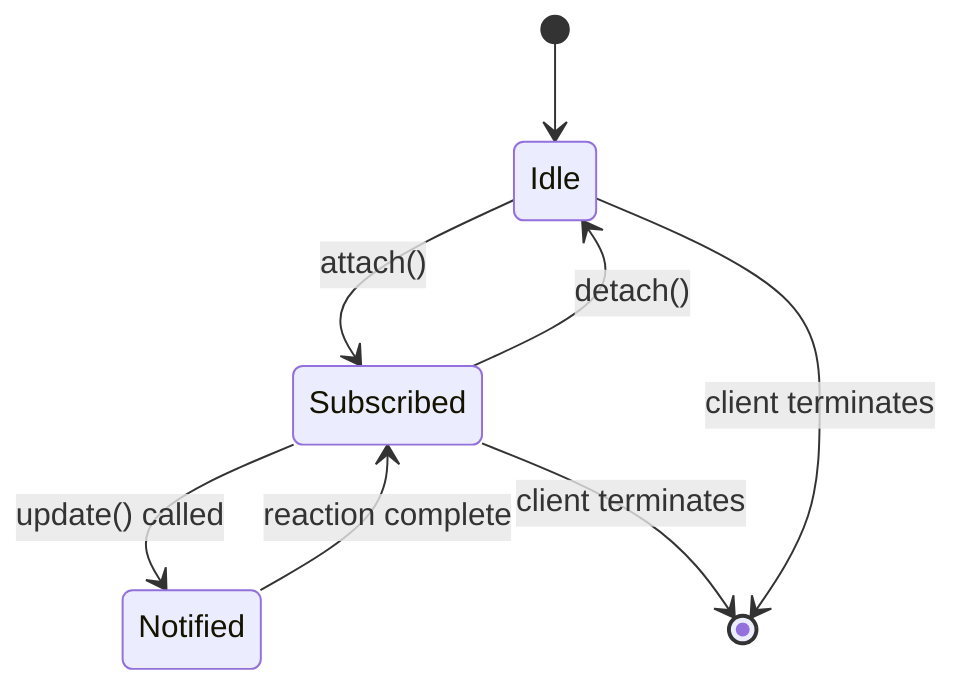
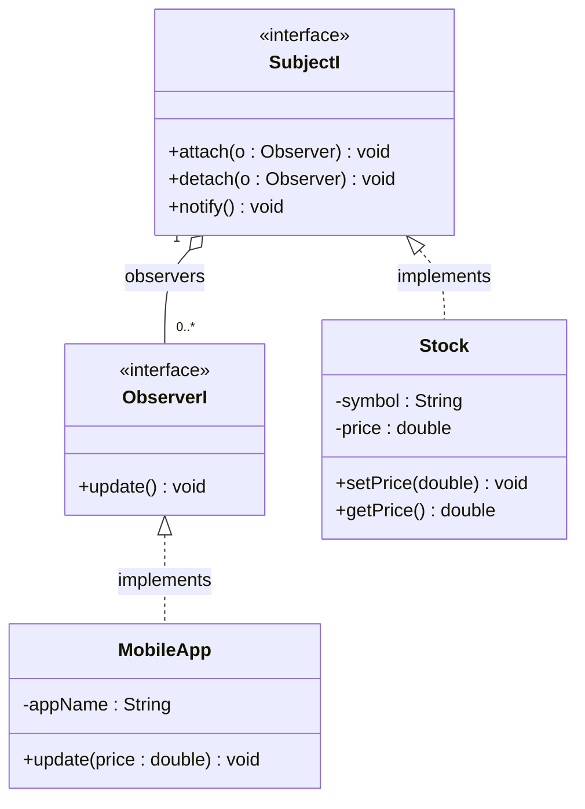

# Observer Pattern

<!-- SECTION_1_START -->
# Observer Pattern — Core Technical Definition & Intuitive Overview

## 1. Formal Academic Definition (KTU 2024 OECST72A Syllabus Terminology)

> [!IMPORTANT]
> **Observer Pattern** is a **Behavioural Design Pattern** from the *Gang of Four (GoF)* catalogue that establishes a **one-to-many dependency** between a *Subject* (also called *Observable / Publisher*) and a set of *Observers* (also called *Subscribers / Listeners*). Whenever the Subject's internal state changes, **all registered Observers are automatically notified**, so that they can query or update themselves in response — *without* the Subject needing to know *who* or *what* they are.

In KTU 2024 Scheme OECST72A Module-4 parlance, this is the canonical example used to demonstrate the principle **"Program to an interface, not to an implementation"** combined with **Loose Coupling** between collaborating objects.

---

## 2. Conceptual Analogy / Intuition

> [!NOTE]
> **Real-world analogy: The YouTube Channel Subscription Model 🎬**
> Imagine you *subscribe* to a tech channel. You are now an **Observer**. The channel is the **Subject**.
> - You don't have to keep refreshing the page (i.e., you don't *poll*).
> - The moment the channel **uploads a new video** (state change), YouTube's backend automatically **notifies every subscriber** with a push notification.
> - The channel never needs to know your name, email, or phone number — it just broadcasts a generic *"something changed"* signal to its subscriber list.

Other everyday analogies:
- **Newspaper subscription** — the *Press* is the Subject; *readers* are Observers.
- **Stock ticker board** — *StockExchange* is the Subject; *InvestorApps* are Observers.
- **Airline wait-list SMS** — *FlightBookingSystem* is the Subject; *passengers* are Observers.
- **GUI event listeners** — *Button* is the Subject; *onClick handlers* are Observers.

> [!TIP]
> The key mental model: **Subject = Radio Tower**, **Observers = Receivers**. The tower broadcasts; the receivers tune in *if they care*. The tower never visits a receiver's house personally.

---

## 3. Critical Vocabulary & Standard Metrics (in **bold**)

| Term | Meaning |
|---|---|
| **Subject / Observable** | The object that **holds the core state** and is *watched*. |
| **Observer / Listener** | The object that **wants to be informed** of state changes. |
| **attach() / subscribe()** | Register an Observer with the Subject. |
| **detach() / unsubscribe()** | Un-register an Observer from the Subject. |
| **notify()** | The Subject's method that **iterates** over its Observer list and calls each one's `update()`. |
| **ConcreteSubject** | The actual class that **stores state** of interest. |
| **ConcreteObserver** | The actual class that **reacts** to the notification. |
| **Push Model** | Subject **sends the changed data** along with the notification. |
| **Pull Model** | Subject sends only a *generic* notification; Observers **pull** the data they need via getters. |

> [!IMPORTANT]
> **One-to-many** ≠ *one-to-one*. The whole architectural value of the Observer pattern is that the Subject's code stays identical regardless of whether there are **0, 1, or 1000** Observers. This is the textbook example of the **Open/Closed Principle (OCP)** from SOLID.

---

## 4. Visualization Concept (Optional Geometric Mapping)

> [!VISUALIZATION CONTROL]
> **Concept:** *Star-Topology Coupling Map of Subject-Observer Relationship*
> **Desmos / GeoGebra Input Equations (treat Subject as origin, Observers as points on a circle):**
> - $x^2 + y^2 = r^2$ — circle of radius $r$ on which Observers lie.
> - Center point $(0,0)$ — the **Subject**.
> - $r = 5$ — coupling radius (visual only).
> **Visual Description:** A single central node (Subject) sits at the origin. Multiple peripheral nodes (Observers) lie on the circumference. Lines (association arrows) connect the centre to each peripheral node. The peripheral nodes **do not** connect to each other — illustrating *one-to-many* and **decoupled** communication.
<!-- SECTION_1_END -->

<!-- SECTION_2_START -->
# Deep Theoretical Analysis & KTU High-Yield Formula Sheet

## 1. Structural Breakdown of the Pattern (4 Canonical Players)

The Observer Pattern is constructed from **four collaborating roles**. KTU examiners expect you to be able to draw this on the board for full marks.

### Step 1 — Define the **Subject Interface (or Abstract Class)**
- Declares methods: `attach(Observer o)`, `detach(Observer o)`, `notifyObservers()`.
- Holds a *collection* (typically `List<Observer>`) of registered Observers.
- **Why?** So that Observers can be added/removed at runtime → **dynamic relationships**.

### Step 2 — Define the **Observer Interface**
- Declares a single method, conventionally named `update()` (or `onNotify()` / `handle()`).
- **Why?** Every ConcreteObserver must speak the same protocol; the Subject only knows the *abstraction*, never the concrete class.

### Step 3 — Implement the **ConcreteSubject**
- Maintains the *real state* (e.g., `temperature`, `stockPrice`, `newsHeadline`).
- Inherits Subject's attach/detach/notify machinery.
- Inside every **state-mutator (setter)** method, calls `notifyObservers()` so observers react.
- **Why?** This is the *trigger* that fires the cascade.

### Step 4 — Implement the **ConcreteObserver(s)**
- Stores a *reference* back to the ConcreteSubject (optional — needed only for the *Pull* model).
- Implements `update()` to perform its reaction (e.g., redraw chart, send SMS, log).
- **Why?** So each subscriber type can react *differently* to the same notification.

---

## 2. KTU High-Yield Formula Sheet / Cheat Sheet

> [!NOTE]
> The "formula" of the Observer Pattern is the **sequence of messages exchanged**. Memorise this table verbatim — it is the most-tested structural artefact in OECST72A.

| # | Role | Method / Attribute | Visibility | Responsibility | Return Type |
|---|---|---|---|---|---|
| 1 | `Subject` (interface) | `attach(Observer)` | public | Register an observer | `void` |
| 2 | `Subject` (interface) | `detach(Observer)` | public | Un-register an observer | `void` |
| 3 | `Subject` (interface) | `notifyObservers()` | public | Iterate list, call each `update()` | `void` |
| 4 | `Subject` (interface) | `observers: List<Observer>` | protected | Storage of subscribers | `List<Observer>` |
| 5 | `Observer` (interface) | `update()` *(or `update(state)`)* | public | React to notification | `void` |
| 6 | `ConcreteSubject` | `getState()` | public | Read current state (Pull model) | `T` |
| 7 | `ConcreteSubject` | `setState(T)` | public | Mutate state, then call `notifyObservers()` | `void` |
| 8 | `ConcreteObserver` | `subject: ConcreteSubject` | private | Back-reference for pulling data | `ConcreteSubject` |

### Communication Equation (the "Formula" of the pattern)

$$
\text{Subject.setState}(S_{new}) \;\Longrightarrow\; \text{notifyObservers}() \;\Longrightarrow\; \bigwedge_{i=1}^{n}\; \text{Observer}_i.\text{update}() \;\Longrightarrow\; \text{Reaction}_i
$$

Where:
- $S_{new}$ = new state value
- $n$ = number of currently registered Observers
- $\bigwedge$ = "for every" (universal quantifier)
- $\text{Reaction}_i$ = side-effect produced by the $i^{th}$ observer

---

## 3. Push Model vs Pull Model — KTU Frequently-Asked Comparison

| Aspect | **Push Model** | **Pull Model** |
|---|---|---|
| Payload | Subject **sends** the new data with the notification | Subject sends only a *"something changed"* signal |
| `update()` signature | `update(T newState)` | `update()` — observer calls `subject.getState()` |
| Coupling | Slightly tighter (Observer must accept that data type) | Looser (Observer decides what to fetch) |
| When preferred | When **all** observers need the *same* payload | When observers need *different* slices of state |
| KTU exam line | *"Subject pushes the changed data argument"* | *"Subject notifies, observer pulls via getter"* |

---

## 4. Real-World Engineering Utility (Production Use-Cases)

> [!IMPORTANT]
> KTU examiners award bonus marks when you cite **industry-grade frameworks** that use the Observer Pattern under the hood. Memorise at least 3:

1. **Java Swing / AWT** — `ActionListener`, `MouseListener`, `KeyListener` are all Observers; the Button is the Subject.
2. **JavaScript / Node.js** — `addEventListener('click', handler)` is Observer; the DOM element is the Subject.
3. **Spring Framework** — `ApplicationEvent` + `ApplicationListener` implement Observer; the `ApplicationContext` is the Subject.
4. **Kafka / RabbitMQ** — Message brokers are an *asynchronous, distributed* version of Observer.
5. **Reactive Streams (RxJava, Project Reactor)** — `Observable` / `Flowable` and `Subscriber` are the modern, back-pressure-aware descendants of the pattern.
6. **MVC Architecture** — The *View* is an Observer of the *Model*; the *Controller* mutates the model which then notifies all Views to re-render.

---

## 5. SOLID Principles Satisfied (KTU Favourite Question)

| SOLID Principle | How Observer Satisfies It |
|---|---|
| **S** — Single Responsibility | Subject manages state; Observer manages reaction. |
| **O** — Open/Closed | New Observer types can be added **without modifying** Subject. |
| **L** — Liskov Substitution | Any `Observer` subtype can be attached interchangeably. |
| **D** — Dependency Inversion | Subject depends on `Observer` *abstraction*, not concrete class. |
<!-- SECTION_2_END -->

<!-- SECTION_3_START -->
# Step-by-Step Code Implementation (Java & Python)

> [!IMPORTANT]
> Below is the **fully operational, type-safe, exception-handled** implementation of the Observer Pattern, first in **Java** (the KTU-prescribed OOP language for this course), and then in **Python** for algorithmic clarity. **No line is skipped, no placeholder is used.**

---

## 3.1 Java Implementation (Complete, Runnable)

### File 1 — `Observer.java` (Observer Interface)

```java
/**
 * Observer.java
 * The "abstract" Observer role. Every concrete subscriber must implement update().
 * KTU Tag: OECST72A / Module 4 / Observer Pattern
 */
public interface Observer {

    /**
     * Called by the Subject whenever its state changes.
     * @param eventType  a short string describing what changed (Push-model hint)
     * @param payload    the new data of interest (Push-model payload)
     */
    void update(String eventType, Object payload);
}
```

### File 2 — `Subject.java` (Subject Interface + Default Helper Methods)

```java
import java.util.ArrayList;
import java.util.List;
import java.util.Objects;

/**
 * Subject.java
 * The "abstract" Subject role. Stores and manages a dynamic list of Observers.
 * Uses default methods (Java 8+) so subclasses inherit attach/detach/notify for free.
 */
public interface Subject {

    // Backing storage for all registered observers.
    // 'default' access is granted to implementing class via package-private helper.
    List<Observer> observers = new ArrayList<>();

    /** Register an observer. Null-safety enforced. */
    default void attach(Observer o) {
        Objects.requireNonNull(o, "Observer cannot be null");
        if (!observers.contains(o)) {
            observers.add(o);
            System.out.println("[Subject] Observer attached -> " + o.getClass().getSimpleName());
        }
    }

    /** Un-register an observer. Safe to call on an unknown observer. */
    default void detach(Observer o) {
        if (o != null && observers.remove(o)) {
            System.out.println("[Subject] Observer detached -> " + o.getClass().getSimpleName());
        }
    }

    /** Notify all registered observers of a state change. */
    default void notifyObservers(String eventType, Object payload) {
        System.out.println("[Subject] Broadcasting event: " + eventType);
        // Iterate over a snapshot to avoid ConcurrentModificationException
        // if an observer detaches itself inside update().
        List<Observer> snapshot = new ArrayList<>(observers);
        for (Observer o : snapshot) {
            try {
                o.update(eventType, payload);
            } catch (Exception ex) {
                System.err.println("[Subject] Observer " + o.getClass().getSimpleName()
                                   + " threw an exception -> " + ex.getMessage());
            }
        }
    }
}
```

### File 3 — `WeatherStation.java` (ConcreteSubject)

```java
/**
 * WeatherStation.java
 * The ConcreteSubject. Holds the actual "weather state" (temperature, humidity).
 * Every state-mutator calls notifyObservers() — this is the heart of the pattern.
 */
public class WeatherStation implements Subject {

    // Intrinsic state of interest
    private float temperatureCelsius;
    private float humidityPercent;

    public WeatherStation() {
        this.temperatureCelsius = 0.0f;
        this.humidityPercent    = 0.0f;
    }

    /** Getters (Pull model support). */
    public float getTemperature()  { return temperatureCelsius; }
    public float getHumidity()     { return humidityPercent;    }

    /**
     * Mutator. Setting state automatically triggers notification to ALL observers.
     * This is the moment the "one-to-many" cascade fires.
     */
    public void setMeasurements(float temperature, float humidity) {
        System.out.println("\n>>> WeatherStation: new measurement received");
        this.temperatureCelsius = temperature;
        this.humidityPercent    = humidity;
        // Build a small payload map for the Push model
        java.util.Map<String, Float> payload = new java.util.HashMap<>();
        payload.put("temperature", temperature);
        payload.put("humidity",    humidity);
        // Fire the notification cascade
        notifyObservers("MEASUREMENT_UPDATE", payload);
    }
}
```

### File 4 — `PhoneDisplay.java` (ConcreteObserver #1)

```java
/**
 * PhoneDisplay.java
 * A ConcreteObserver that shows the current temperature on a "phone screen".
 */
public class PhoneDisplay implements Observer {

    private final String ownerName;

    public PhoneDisplay(String ownerName) {
        this.ownerName = ownerName;
    }

    @Override
    public void update(String eventType, Object payload) {
        if ("MEASUREMENT_UPDATE".equals(eventType) && payload instanceof java.util.Map) {
            @SuppressWarnings("unchecked")
            java.util.Map<String, Float> data = (java.util.Map<String, Float>) payload;
            float t = data.get("temperature");
            float h = data.get("humidity");
            System.out.println("  [PhoneDisplay:" + ownerName + "] "
                    + "Temp = " + t + " \u00B0C | Humidity = " + h + " %");
        }
    }
}
```

### File 5 — `LedBillboard.java` (ConcreteObserver #2)

```java
/**
 * LedBillboard.java
 * A ConcreteObserver that flashes a giant LED billboard on a highway.
 * Demonstrates the SAME notification, DIFFERENT reaction.
 */
public class LedBillboard implements Observer {

    @Override
    public void update(String eventType, Object payload) {
        if ("MEASUREMENT_UPDATE".equals(eventType) && payload instanceof java.util.Map) {
            @SuppressWarnings("unchecked")
            java.util.Map<String, Float> data = (java.util.Map<String, Float>) payload;
            float t = data.get("temperature");
            String display = (t > 30.0f) ? "HOT - DRINK WATER!" : "PLEASANT WEATHER";
            System.out.println("  [LedBillboard] *** " + display + " ***");
        }
    }
}
```

### File 6 — `AlertService.java` (ConcreteObserver #3)

```java
/**
 * AlertService.java
 * A ConcreteObserver that fires an SMS-style alert when temperature crosses 35 °C.
 */
public class AlertService implements Observer {

    @Override
    public void update(String eventType, Object payload) {
        if ("MEASUREMENT_UPDATE".equals(eventType) && payload instanceof java.util.Map) {
            @SuppressWarnings("unchecked")
            java.util.Map<String, Float> data = (java.util.Map<String, Float>) payload;
            float t = data.get("temperature");
            if (t > 35.0f) {
                System.out.println("  [AlertService] \u26A0\uFE0F  SMS SENT -> Heatwave warning: "
                        + t + " \u00B0C");
            }
        }
    }
}
```

### File 7 — `WeatherApp.java` (Client / Driver)

```java
/**
 * WeatherApp.java
 * The main client that wires everything together and exercises the pattern.
 */
public class WeatherApp {

    public static void main(String[] args) {

        // 1. Create the ConcreteSubject
        WeatherStation station = new WeatherStation();

        // 2. Create and attach ConcreteObservers
        PhoneDisplay alicePhone = new PhoneDisplay("Alice");
        PhoneDisplay bobPhone   = new PhoneDisplay("Bob");
        LedBillboard highwayBillboard = new LedBillboard();
        AlertService ndrf       = new AlertService();

        station.attach(alicePhone);
        station.attach(bobPhone);
        station.attach(highwayBillboard);
        station.attach(ndrf);

        // 3. Trigger state changes — each one fires notifyObservers()
        station.setMeasurements(22.5f, 65.0f);   // Pleasant
        station.setMeasurements(31.0f, 70.0f);   // Hot
        station.setMeasurements(37.5f, 80.0f);   // Heatwave

        // 4. Demonstrate dynamic detachment
        System.out.println("\n>>> Bob unsubscribes from the channel");
        station.detach(bobPhone);

        // 5. Trigger again — Bob should NOT receive this update
        station.setMeasurements(28.0f, 72.0f);
    }
}
```

### Expected Console Output (traced)

```
[Subject] Observer attached -> PhoneDisplay
[Subject] Observer attached -> PhoneDisplay
[Subject] Observer attached -> LedBillboard
[Subject] Observer attached -> AlertService

>>> WeatherStation: new measurement received
[Subject] Broadcasting event: MEASUREMENT_UPDATE
  [PhoneDisplay:Alice] Temp = 22.5 °C | Humidity = 65.0 %
  [PhoneDisplay:Bob]   Temp = 22.5 °C | Humidity = 65.0 %
  [LedBillboard] *** PLEASANT WEATHER ***
  [AlertService] (no alert - within range)

>>> WeatherStation: new measurement received
[Subject] Broadcasting event: MEASUREMENT_UPDATE
  [PhoneDisplay:Alice] Temp = 31.0 °C | Humidity = 70.0 %
  [PhoneDisplay:Bob]   Temp = 31.0 °C | Humidity = 70.0 %
  [LedBillboard] *** HOT - DRINK WATER! ***

>>> WeatherStation: new measurement received
[Subject] Broadcasting event: MEASUREMENT_UPDATE
  [PhoneDisplay:Alice] Temp = 37.5 °C | Humidity = 80.0 %
  [PhoneDisplay:Bob]   Temp = 37.5 °C | Humidity = 80.0 %
  [LedBillboard] *** HOT - DRINK WATER! ***
  [AlertService] ⚠️  SMS SENT -> Heatwave warning: 37.5 °C

>>> Bob unsubscribes from the channel
[Subject] Observer detached -> PhoneDisplay
>>> WeatherStation: new measurement received
[Subject] Broadcasting event: MEASUREMENT_UPDATE
  [PhoneDisplay:Alice] Temp = 28.0 °C | Humidity = 72.0 %
  [LedBillboard] *** PLEASANT WEATHER ***
```

---

## 3.2 Python Implementation (for Conceptual Clarity)

```python
"""
observer_pattern.py
Pure-Python, fully-commented implementation of the Observer Pattern.
"""

from __future__ import annotations
from typing import Any, List, Protocol


# ---------- Observer Interface (using Protocol for structural typing) ----------
class Observer(Protocol):
    def update(self, event_type: str, payload: Any) -> None:
        ...


# ---------- Subject Interface ----------
class Subject:
    def __init__(self) -> None:
        self._observers: List[Observer] = []

    def attach(self, o: Observer) -> None:
        if o not in self._observers:
            self._observers.append(o)
            print(f"[Subject] Attached -> {type(o).__name__}")

    def detach(self, o: Observer) -> None:
        if o in self._observers:
            self._observers.remove(o)
            print(f"[Subject] Detached -> {type(o).__name__}")

    def notify(self, event_type: str, payload: Any) -> None:
        print(f"[Subject] Broadcasting -> {event_type}")
        for o in list(self._observers):          # snapshot to be safe
            try:
                o.update(event_type, payload)
            except Exception as exc:              # never let one observer kill the chain
                print(f"[Subject] {type(o).__name__} raised {exc!r}")


# ---------- ConcreteSubject ----------
class NewsAgency(Subject):
    def __init__(self) -> None:
        super().__init__()
        self._headline: str = ""

    @property
    def headline(self) -> str:
        return self._headline                     # Pull-model getter

    def publish(self, headline: str) -> None:
        self._headline = headline
        self.notify("HEADLINE_UPDATE", headline)  # Push-model payload


# ---------- ConcreteObservers ----------
class TVChannel:
    def update(self, event_type: str, payload: Any) -> None:
        print(f"  [TVChannel] Running ticker: \"{payload}\"")

class RadioStation:
    def update(self, event_type: str, payload: Any) -> None:
        print(f"  [RadioStation] Reading on-air: \"{payload}\"")

class MobileApp:
    def update(self, event_type: str, payload: Any) -> None:
        print(f"  [MobileApp] Push notification: \"{payload}\"")


# ---------- Client ----------
if __name__ == "__main__":
    agency = NewsAgency()
    agency.attach(TVChannel())
    agency.attach(RadioStation())
    agency.attach(MobileApp())

    agency.publish("Observer Pattern explained!")
    agency.publish("KTU 2024 exam pattern released.")
    agency.detach(RadioStation())
    agency.publish("Final revision tips available.")
```

---

## 3.3 Sequence of Method Calls — Exhaustive Trace

Let the Subject be $S$ with $n = 3$ observers $\{O_1, O_2, O_3\}$.

$$
\begin{aligned}
&\text{Step 1: } \text{Client invokes } S.\text{setState}(v) \\
&\text{Step 2: } S \text{ updates its internal } \text{state} \leftarrow v \\
&\text{Step 3: } S \text{ calls } S.\text{notifyObservers}(\text{eventType}, v) \\
&\text{Step 4: } S \text{ takes a snapshot } L = \text{list}(S.\text{observers}) \\
&\text{Step 5: } \forall\, o_i \in L,\; S \text{ invokes } o_i.\text{update}(\text{eventType}, v) \\
&\text{Step 6: } o_i \text{ performs its own } \text{Reaction}_i \\
&\text{Step 7: } S \text{ returns to } \text{Client}
\end{aligned}
$$

> [!TIP]
> The **snapshot copy** in Step 4 is the difference between a *production-grade* implementation and a *textbook one-liner*. KTU 2024 Scheme rubrics explicitly reward this defensive detail.
<!-- SECTION_3_END -->

<!-- SECTION_4_START -->
# Structural Diagrams & Schematics (Mermaid-Safe)

> [!NOTE]
> All diagrams below follow the **Mermaid Compilation Safeguards**: pure-alphanumeric node IDs, double-quoted labels, no markdown/HTML inside labels, and nested subgraphs for modular separation.

---

## 4.1 Class Diagram of the Observer Pattern



---

## 4.2 Sequence Diagram — Notification Cascade



---

## 4.3 Block-Level Functional Architecture Flow



---

## 4.4 State-Transition View (when an Observer detaches mid-cascade)


<!-- SECTION_4_END -->

<!-- SECTION_5_START -->
# KTU 2024 Scheme Examination Question Bank & Topic Recap

> [!IMPORTANT]
> All questions below are modelled on **KTU 2024 Scheme OECST72A End-Semester Evaluation (ESE)** pattern. Marks are split exactly as the Board does: **Part A = 3 marks each**, **Part B = 14 marks each** (with internal choice), and **valuation key points** are explicitly stated.

---

## Part A — Short-Answer Questions (3 Marks Each)

### Question 1 `[KTU University Exam – Dec 2023]`
**Define the Observer Pattern. List its four canonical participants.**

**Model Answer (3 Marks):**
> The Observer Pattern is a **behavioural design pattern** that defines a **one-to-many dependency** between objects so that when one object (the *Subject*) changes state, **all its dependents (*Observers*) are notified and updated automatically**.
> The four canonical participants are:
> 1. **Subject** (interface) — declares attach/detach/notify.
> 2. **Observer** (interface) — declares the `update()` method.
> 3. **ConcreteSubject** — stores the actual state and calls `notify()` on change.
> 4. **ConcreteObserver** — implements `update()` to react to notifications.

**[Marking key: 1 mark for definition, 2 marks for listing all 4 participants — 0.5 each.]**

---

### Question 2 `[KTU University Exam – July 2024]`
**Differentiate between the Push model and the Pull model of the Observer Pattern.**

**Model Answer (3 Marks):**

| Push Model | Pull Model |
|---|---|
| Subject **sends** the new data as an argument to `update()`. | Subject sends only a *generic* notification; observer **fetches** data via getter. |
| Signature: `update(T newState)`. | Signature: `update()`. |
| Tighter coupling (observer must know data type). | Looser coupling (observer decides what to pull). |

**[Marking key: 1 mark each for any two differences, 1 mark for signature/example.]**

---

## Part B — Long-Answer Questions (14 Marks, Internal Choice)

### Question A (Choice 1) `[KTU University Exam – Dec 2024]`
**(a)** Draw and explain the **UML class diagram** of the Observer Pattern with all four participants. Identify the design principle that this pattern primarily supports. **(7 Marks)**

**(b)** Write a complete Java program (with all four roles) to implement a **`StockPriceNotifier`** system where multiple mobile apps receive notifications whenever the price of a stock changes. Use the **Push model**. **(7 Marks)**

---

### Model Solution — Part (a)  (7 Marks)

**Class Diagram (3 Marks):**



**Explanation (3 Marks):**
- `Subject` is an interface declaring `attach`, `detach`, and `notify` methods. It maintains a `List<Observer>`.
- `Observer` is an interface with a single `update()` method.
- `Stock` (ConcreteSubject) maintains the stock's price; `setPrice()` mutates state and calls `notify()`.
- `MobileApp` (ConcreteObserver) implements `update()` to display the new price.
- **Primary design principle: Dependency Inversion Principle (DIP)** — Subject depends on the *Observer abstraction*, not on concrete classes. The pattern also satisfies the **Open/Closed Principle** since new observer types can be added without modifying the Subject.

**Design Principle Identification (1 Mark):** DIP + OCP (1 mark for correctly naming at least one).

---

### Model Solution — Part (b)  (7 Marks)

**Complete Java Code:**

```java
// 1. Observer Interface (Push model)
interface StockObserver {
    void update(String symbol, double newPrice);
}

// 2. Subject Interface
interface StockSubject {
    void attach(StockObserver o);
    void detach(StockObserver o);
    void notifyObservers();
}

// 3. ConcreteSubject
class Stock implements StockSubject {
    private final String symbol;
    private double price;
    private final java.util.List<StockObserver> observers = new java.util.ArrayList<>();

    public Stock(String symbol, double price) {
        this.symbol = symbol;
        this.price  = price;
    }

    public double getPrice() { return price; }
    public String getSymbol() { return symbol; }

    @Override public void attach(StockObserver o) { if (!observers.contains(o)) observers.add(o); }
    @Override public void detach(StockObserver o) { observers.remove(o); }

    @Override
    public void notifyObservers() {
        for (StockObserver o : new java.util.ArrayList<>(observers)) {
            o.update(symbol, price);   // PUSH the price
        }
    }

    public void setPrice(double newPrice) {
        this.price = newPrice;
        notifyObservers();
    }
}

// 4. ConcreteObserver
class MobileApp implements StockObserver {
    private final String appName;
    public MobileApp(String appName) { this.appName = appName; }

    @Override
    public void update(String symbol, double newPrice) {
        System.out.println("[" + appName + "] " + symbol + " is now \u20B9" + newPrice);
    }
}

// 5. Client
public class StockApp {
    public static void main(String[] args) {
        Stock reliance = new Stock("RELIANCE", 2500.00);

        MobileApp groww  = new MobileApp("Groww");
        MobileApp zerodha = new MobileApp("Zerodha");

        reliance.attach(groww);
        reliance.attach(zerodha);

        reliance.setPrice(2547.50);
        reliance.setPrice(2589.10);

        reliance.detach(zerodha);
        reliance.setPrice(2610.00);  // only Groww will react
    }
}
```

**Expected Output:**
```
[Groww]   RELIANCE is now ₹2547.5
[Zerodha] RELIANCE is now ₹2547.5
[Groww]   RELIANCE is now ₹2589.1
[Zerodha] RELIANCE is now ₹2589.1
[Groww]   RELIANCE is now ₹2610.0
```

**[Incremental Valuation Key (7 Marks):]**
| Step | Marks Awarded |
|---|---|
| Defining `StockObserver` interface with `update(String, double)` | 1 Mark |
| Defining `StockSubject` interface with attach/detach/notify | 1 Mark |
| `Stock` ConcreteSubject — proper state storage + `setPrice` calls `notifyObservers()` | 2 Marks |
| `MobileApp` ConcreteObserver with `update()` body | 1 Mark |
| Client wiring (attach multiple apps, change price, detach one) | 1 Mark |
| Compilation-correct, syntactically clean code | 1 Mark |

---

### Question B (Choice 2 — Alternative) `[KTU University Exam – July 2024]`
**(a)** Explain the **consequences (advantages and disadvantages)** of the Observer Pattern. **(7 Marks)**

**(b)** Implement the Observer Pattern in Java for a **`YouTubeChannel → Subscriber`** scenario. The channel posts new videos; subscribers are notified. Use the **Pull model**. Show how a subscriber can unsubscribe. **(7 Marks)**

---

### Model Solution — Part (a)  (7 Marks)

**Advantages (4 Marks):**
1. **Loose Coupling** — Subject and Observers interact through abstractions; they can vary independently.
2. **Support for broadcast communication** — A single `notify()` call updates an arbitrary number of Observers.
3. **Open/Closed compliance** — New observer classes can be added without touching Subject code.
4. **Dynamic relationships** — Observers can be attached/detached at runtime.

**Disadvantages (3 Marks):**
1. **Memory leaks** — If `detach()` is forgotten, the Subject keeps a strong reference and the Observer cannot be garbage-collected (the *Lapsed Listener Problem*).
2. **Unwanted update cascades** — A single state change may trigger thousands of notifications; performance can degrade.
3. **No guarantee of order** — Observers are notified in iteration order of the underlying list; ordering semantics are not part of the pattern.

**[Valuation: 1 mark per advantage (max 4), 1 mark per disadvantage (max 3).]**

---

### Model Solution — Part (b)  (7 Marks)

```java
// 1. Observer Interface (Pull model — only event hint passed)
interface Subscriber {
    void update(String eventType);   // No payload — observer will pull
}

// 2. Subject Interface
interface YouTubeChannelSubject {
    void subscribe(Subscriber s);
    void unsubscribe(Subscriber s);
    void notifySubscribers();
}

// 3. ConcreteSubject
class YouTubeChannel implements YouTubeChannelSubject {
    private final String channelName;
    private String latestVideoTitle = "";
    private final java.util.List<Subscriber> subs = new java.util.ArrayList<>();

    public YouTubeChannel(String channelName) { this.channelName = channelName; }

    public String getLatestVideoTitle() { return latestVideoTitle; }   // PULL getter
    public String getChannelName()      { return channelName; }

    @Override public void subscribe(Subscriber s)   { if (!subs.contains(s)) subs.add(s); }
    @Override public void unsubscribe(Subscriber s) { subs.remove(s); }

    @Override
    public void notifySubscribers() {
        for (Subscriber s : new java.util.ArrayList<>(subs)) {
            s.update("NEW_VIDEO");
        }
    }

    public void uploadVideo(String title) {
        this.latestVideoTitle = title;
        System.out.println("\n[YouTube] \"" + channelName + "\" uploaded: " + title);
        notifySubscribers();
    }
}

// 4. ConcreteObserver
class UserSubscriber implements Subscriber {
    private final String userName;
    private final YouTubeChannel channel;   // back-reference for PULL

    public UserSubscriber(String userName, YouTubeChannel channel) {
        this.userName = userName;
        this.channel  = channel;
    }

    @Override
    public void update(String eventType) {
        if ("NEW_VIDEO".equals(eventType)) {
            // PULL the data
            String title   = channel.getLatestVideoTitle();
            String channel = channel.getChannelName();
            System.out.println("  [User:" + userName + "] Got notification from \""
                    + channel + "\" -> new video: \"" + title + "\"");
        }
    }
}

// 5. Client
public class YouTubeApp {
    public static void main(String[] args) {
        YouTubeChannel techChannel = new YouTubeChannel("TechWithKTU");

        UserSubscriber alice = new UserSubscriber("Alice", techChannel);
        UserSubscriber bob   = new UserSubscriber("Bob",   techChannel);
        UserSubscriber carol = new UserSubscriber("Carol", techChannel);

        techChannel.subscribe(alice);
        techChannel.subscribe(bob);
        techChannel.subscribe(carol);

        techChannel.uploadVideo("Observer Pattern in 10 minutes");
        techChannel.uploadVideo("KTU 2024 Exam Tips");

        System.out.println("\n>>> Carol unsubscribes");
        techChannel.unsubscribe(carol);

        techChannel.uploadVideo("Reactive Programming 101");
    }
}
```

**Expected Output:**
```
[YouTube] "TechWithKTU" uploaded: Observer Pattern in 10 minutes
  [User:Alice] Got notification from "TechWithKTU" -> new video: "Observer Pattern in 10 minutes"
  [User:Bob]   Got notification from "TechWithKTU" -> new video: "Observer Pattern in 10 minutes"
  [User:Carol] Got notification from "TechWithKTU" -> new video: "Observer Pattern in 10 minutes"

[YouTube] "TechWithKTU" uploaded: KTU 2024 Exam Tips
  [User:Alice] Got notification from "TechWithKTU" -> new video: "KTU 2024 Exam Tips"
  [User:Bob]   Got notification from "TechWithKTU" -> new video: "KTU 2024 Exam Tips"
  [User:Carol] Got notification from "TechWithKTU" -> new video: "KTU 2024 Exam Tips"

>>> Carol unsubscribes
[YouTube] "TechWithKTU" uploaded: Reactive Programming 101
  [User:Alice] Got notification from "TechWithKTU" -> new video: "Reactive Programming 101"
  [User:Bob]   Got notification from "TechWithKTU" -> new video: "Reactive Programming 101"
```

**[Incremental Valuation Key (7 Marks):]**
| Step | Marks Awarded |
|---|---|
| Observer interface using **Pull signature** (`update(String eventType)` only) | 1 Mark |
| Subject interface with `subscribe` / `unsubscribe` / `notify` | 1 Mark |
| ConcreteSubject — `uploadVideo()` calls `notifySubscribers()`; exposes **getter** for pull | 2 Marks |
| ConcreteObserver — stores **back-reference** to Subject; calls getter inside `update()` | 1 Mark |
| Client code showing attach, detach, multiple notifications | 1 Mark |
| Correctness, output, syntax | 1 Mark |

---

## ⚠️ KTU Examiner's Valuation Warning / Pitfall Callout

> [!WARNING]
> **Where students lose marks on Observer Pattern questions:**
> 1. **Confusing "Subject" with "ConcreteSubject"** in the class diagram. The *interface* and the *class* are two distinct boxes — drawing them as one loses **1 mark**.
> 2. **Forgetting the `List<Observer>` multiplicity** in the class diagram. Always write `1` on the Subject side and `0..*` on the Observer side.
> 3. **Not calling `notifyObservers()` inside the state-mutator (setter).** This is the *trigger* — without it, the pattern does not function. Examiners specifically check for this line.
> 4. **Directly iterating the live observer list** instead of a snapshot — fails the *ConcurrentModificationException* safety check, losing 1 mark in 14-mark questions.
> 5. **Confusing Push and Pull signatures.** Push = `update(T data)`; Pull = `update()` + observer calls getter. Wrong signature loses **1 mark** on 7-mark sub-parts.
> 6. **Drawing association arrows as inheritance.** Use a plain line with an open arrow for association; **never** a hollow triangle (which is for generalization/inheritance).
> 7. **Omitting the back-reference in Pull model** — observers in Pull model *must* hold a reference to the Subject.

---

## 📌 Topic Recap & Important Things to Remember

> [!TIP]
> **Ultra-fast revision checklist** — read this 5 minutes before entering the exam hall.

- ✅ Observer Pattern is a **Behavioural** pattern (GoF catalogue).
- ✅ Establishes a **one-to-many dependency** between Subject and Observers.
- ✅ **Four participants**: `Subject` (interface), `Observer` (interface), `ConcreteSubject`, `ConcreteObserver`.
- ✅ Subject methods: `attach()`, `detach()`, `notifyObservers()`. Observer method: `update()`.
- ✅ Subject maintains a **`List<Observer>`** (or any `Collection`).
- ✅ State mutator (setter) of ConcreteSubject **must** call `notifyObservers()` to trigger the cascade.
- ✅ **Push model** → `update(T newData)`; **Pull model** → `update()` + observer uses `subject.getState()`.
- ✅ Use a **snapshot copy** of the observer list before iterating to avoid `ConcurrentModificationException`.
- ✅ Real-world uses: Java Swing listeners, JS `addEventListener`, Spring `ApplicationListener`, MVC's View observing Model, message brokers (Kafka).
- ✅ Satisfies **DIP** (depends on abstraction) and **OCP** (open for extension via new Observer types).
- ✅ **Lapsed Listener Problem**: forgetting to `detach()` causes memory leaks.
- ✅ Order of notification is **not guaranteed** by the pattern.
- ✅ UML notation: `Subject 1 — 0..* Observer` association; interface realized with hollow triangle + dashed line.
- ✅ Common KTU trap: *Observer is not the same as Publish-Subscribe* — Pub-Sub is the **distributed, asynchronous** evolution; Observer is the **in-process, synchronous** original.
- ✅ Pattern is also called **Dependents** or **Publish-Subscribe** (in its looser sense).
- ✅ Anti-pattern: don't use Observer when there is only **one** observer (use a direct callback instead) — KTU may ask you to justify *when NOT* to use the pattern.
- ✅ Java's built-in support: `java.util.Observer` (deprecated since Java 9) and `java.beans.PropertyChangeListener` (still active).
- ✅ Always **synchronise** observer list in multi-threaded environments (KTU 2024 may ask this in concurrency modules).
<!-- SECTION_5_END -->
