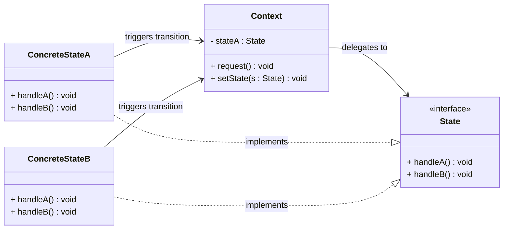
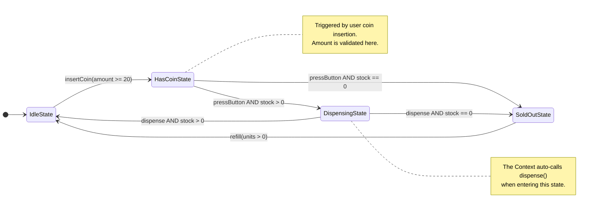
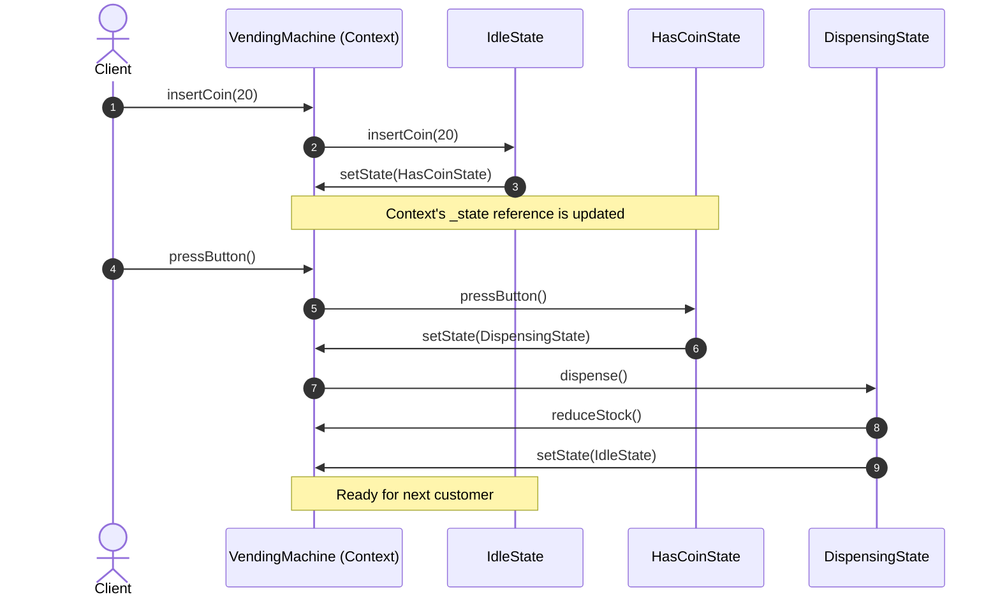
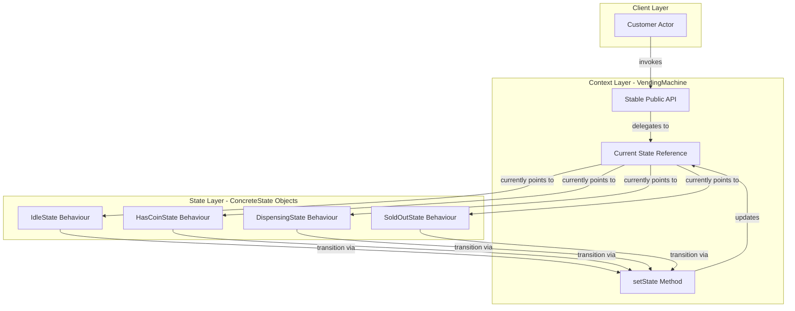
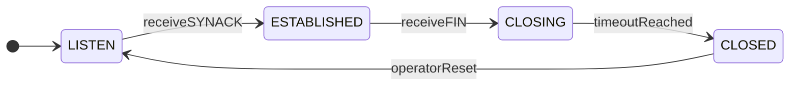

# State Pattern

<!-- SECTION_1_START -->
# State Pattern — Core Technical Definition & Intuitive Overview

## Formal Definition (KTU 2024 Syllabus Terminology)

> [!IMPORTANT]
> **State Pattern (GoF Behavioural Pattern)** — *"Allow an object to alter its behaviour when its internal state changes. The object will appear to change its class."* — Gang of Four (Gamma, Helm, Johnson, Vlissides).

In **Object-Oriented Design Frameworks**, the **State Pattern** is a behavioural design pattern that:
- Encapsulates **state-specific behaviour** into separate **ConcreteState** classes.
- Delegates the *current* behaviour to a **State** object held by a **Context** (the *Context* never implements state-dependent logic itself).
- Promotes the **Open/Closed Principle (OCP)**: new states can be added without modifying the existing Context or other states.

The Context maintains a reference (`_state`) to the *current* state object and forwards all state-dependent requests to it. The State interface typically mirrors the Context's public methods, allowing transparent delegation.

> [!NOTE]
> **Why it appears in the syllabus (OECST72A — Module 4):** Behavioural patterns govern **object interaction and responsibility distribution**. The State Pattern is a board-favourite because it tests the student's ability to (a) decouple *what* an object does from *when* it does it, and (b) replace sprawling `if-else` / `switch` ladders with a clean polymorphic design.

## Conceptual Analogy — The "Traffic Signal Controller"

Imagine a **traffic signal at a four-way junction**. The signal box (the **Context**) is one *physical* device, but the way it *behaves* changes every few seconds:

| Phase (State) | Behaviour |
|---|---|
| **RED** | Cars stop, pedestrians cross |
| **YELLOW** | Cars slow down, prepare to stop |
| **GREEN** | Cars move, pedestrians wait |

If you tried to encode this using `if-else` ladders inside the signal box, every new state (e.g., a *flashing-yellow night mode*) would force you to crack open the box and modify the controller. The **State Pattern** says: *extract each phase into its own encapsulated object*, and the signal box simply *holds* the current phase object. Change the phase object, and the behaviour changes — **no modifications to the box**.

A more **software-flavoured** analogy: an **ATM machine** has states like `Idle`, `CardInserted`, `PinEntered`, `Withdrawing`, `OutOfService`. Pressing "Enter" on the keypad means different things in each state — but the keypad itself (the **Context**) never contains the decision logic.

## Key Terminology (Must Memorize for KTU Board Exams)

| Term | Meaning |
|---|---|
| **Context** | The class whose behaviour varies with state (e.g., `VendingMachine`, `ATM`, `TCPConnection`). |
| **State (interface/abstract class)** | Declares the *state-specific methods* that all ConcreteStates must implement. |
| **ConcreteState** | A subclass implementing behaviour for one specific state; responsible for *transitioning* the Context to the next state. |
| **State Transition** | The act of swapping the Context's `_state` reference to another ConcreteState. |
| **Polymorphic Delegation** | The Context forwards requests to `_state.doThis()` rather than handling them locally. |

> [!VISUALIZATION CONTROL]
> **Concept:** State transition graph for a Vending Machine
> **GeoGebra / Desmos Input (state diagram as a directed graph):**
> * `Points: A = (0,1) Idle`, `B = (2,2) HasCoin`, `C = (4,1) Dispensing`, `D = (6,2) SoldOut`
> * `Arrows: A -> B (insertCoin)`, `B -> C (pressButton)`, `C -> A (dispense)`, `C -> D (stock=0)`, `B -> A (returnCoin)`
> **Visual Description:** The student should observe that the **VendingMachine (Context)** never branches internally — it *rotates* through a graph of state nodes. Each node encapsulates the rule for *what to do* AND *where to go next*.
<!-- SECTION_1_END -->

<!-- SECTION_2_START -->
# Deep Theoretical Analysis & KTU High-Yield Formula Sheet

## 1. The Anatomy of the State Pattern

The pattern is a **four-player contract**:

1. **Context** — exposes a *stable* public API to clients. Internally holds a `State` reference.
2. **State (abstract)** — declares every *state-dependent* method that the Context will delegate. (Often every Context method has a corresponding `handleX()` on the State interface.)
3. **ConcreteStateA, B, C, …** — each implements the behaviour for a single state. Each knows its **successor state** and performs the transition via `context.setState(...)`.
4. **Client** — interacts **only** with the Context. The Client is *unaware* of state changes.

## 2. Step-by-Step Operational Logic

1. **Client invokes** `context.request()`.
2. **Context** forwards the call to its current state: `self._state.handle()`.
3. **ConcreteState** executes its state-specific logic.
4. The ConcreteState **may call** `context.setState(newState)` to trigger a transition.
5. The Context updates its `_state` reference; subsequent calls are routed to the *new* state.
6. The Client perceives a *change in behaviour* without knowing the underlying class changed.

> [!TIP]
> **Golden Rule for KTU Answers:** *"The Context delegates; the State decides."* Examiners award full marks only when students explicitly show that the **Context holds a State reference** and the **ConcreteState triggers the transition** (not the Context).

## 3. KTU Formula Sheet / Cheat Sheet

> [!NOTE]
> Although design patterns are *not mathematical*, the KTU board expects students to summarize patterns in tabular form. Use the following as a high-density reference.

### Table A — Pattern Component Mapping

| Role | Responsibility | Knows About |
|---|---|---|
| **Context** | Hold current state, expose stable API | Only the `State` interface |
| **State (abstract)** | Declare all state-dependent methods | Nothing (pure interface) |
| **ConcreteState** | Implement behaviour for one state | Its successor state + the Context |

### Table B — Applicability vs. Alternative

| Symptom in Code | Recommended Pattern | Reason |
|---|---|---|
| Long `if-else`/`switch` on an internal enum | **State** | Encapsulate each branch as a class |
| One algorithm of many, chosen at runtime | **Strategy** | Algorithms are interchangeable, stateless |
| Object structure with recursive composition | **Composite** | Tree of part-whole objects |
| One-to-many dependency between objects | **Observer** | Notify dependents of changes |

> [!IMPORTANT]
> **State vs. Strategy — The Board Favourite Distinction:**
> * **State** has *self-transitions* triggered by internal logic. ConcreteStates often know each other.
> * **Strategy** is *client-driven selection*; strategies are usually *stateless* and *independent*.
> A common KTU question is: *"Why is the Vending Machine example a State Pattern and not a Strategy Pattern?"* — Answer: *The transitions are driven by the machine's internal logic, not by the client choosing a strategy.*

### Table C — Consequences (Pros / Cons)

| Pros | Cons |
|---|---|
| ✅ Localizes state-specific behaviour | ❌ Increases number of classes |
| ✅ Makes state transitions explicit | ❌ Can be overkill for 1–2 simple states |
| ✅ Eliminates monstrous `if-else` blocks | ❌ State interface must anticipate all Context methods |
| ✅ Open/Closed: new states add without modifying existing code | ❌ Transitions spread across ConcreteStates (debugging harder) |

### Table D — Real-World Engineering Applications

| Domain | Concrete Use Case |
|---|---|
| **Networking** | TCP Connection states (LISTEN, ESTABLISHED, CLOSED) |
| **UI Frameworks** | Button/Widget enable/disable states |
| **Compilers** | Lexer/Parser tokenization states |
| **Game Development** | Character states (Idle, Running, Jumping, Dead) |
| **Embedded Systems** | Washing Machine controllers (Wash, Rinse, Spin) |
| **Workflow Engines** | Document states (Draft, Review, Approved, Published) |

## 4. Practical Implementation Heuristics for KTU Board Answers

- **Always** draw a **state-transition diagram** *before* writing code. Examiners award 2–3 marks purely for the diagram.
- **Always** show the **Context class** with a *private* `State _state` field.
- **Always** include a **`setState()`** method on the Context.
- **Always** have ConcreteStates receive a Context reference via constructor (so they can trigger transitions).
- Mention the **Open/Closed Principle** — this is the most-asked *advantage* in KTU exams.
<!-- SECTION_2_END -->

<!-- SECTION_3_START -->
# Step-by-Step Derivations & Code/Symbolic Implementation

## Worked Example: A Vending Machine (Canonical KTU Board Example)

We will build a vending machine that sells a single item priced at ₹20. It has **four states**:
`IdleState` (no coin), `HasCoinState` (coin inserted, item selected), `DispensingState` (item being dispensed), `SoldOutState` (no stock).

### Step 1 — The State Abstract Base Class

```python
from __future__ import annotations
from abc import ABC, abstractmethod


class VendingMachineState(ABC):
    """
    Abstract State interface for the Vending Machine.
    Every public action of the Context is mirrored here.
    """

    def __init__(self, machine: "VendingMachine") -> None:
        # Each ConcreteState holds a reference to the Context
        # so it can request state transitions.
        self._machine = machine

    @abstractmethod
    def insert_coin(self, amount: int) -> None:
        """Action: user inserts a coin."""
        ...

    @abstractmethod
    def press_button(self) -> None:
        """Action: user presses the dispense button."""
        ...

    @abstractmethod
    def dispense(self) -> None:
        """Action: machine physically releases the item."""
        ...

    @abstractmethod
    def refill(self, units: int) -> None:
        """Action: operator refills the machine."""
        ...
```

### Step 2 — The Concrete States (Full Implementation)

```python
class IdleState(VendingMachineState):
    """No coin inserted; the machine is waiting."""

    def insert_coin(self, amount: int) -> None:
        print(f"[IdleState] Coin accepted: Rs.{amount}.")
        if amount >= 20:
            self._machine.set_state(self._machine.has_coin_state)
        else:
            print(f"[IdleState] Insufficient amount. Please insert Rs.{20 - amount} more.")

    def press_button(self) -> None:
        print("[IdleState] Button ignored. Insert a coin first.")

    def dispense(self) -> None:
        print("[IdleState] Nothing to dispense.")

    def refill(self, units: int) -> None:
        self._machine.add_stock(units)
        print(f"[IdleState] Refilled with {units} units. Stock: {self._machine.stock}")


class HasCoinState(VendingMachineState):
    """Coin accepted, waiting for button press."""

    def insert_coin(self, amount: int) -> None:
        print(f"[HasCoinState] Extra coin accepted: Rs.{amount}. Press button to dispense.")

    def press_button(self) -> None:
        if self._machine.stock <= 0:
            print("[HasCoinState] Out of stock! Returning coin.")
            self._machine.set_state(self._machine.sold_out_state)
        else:
            print("[HasCoinState] Button pressed. Dispensing item...")
            self._machine.set_state(self._machine.dispensing_state)
            # The Context will now call dispense() on the new state.

    def dispense(self) -> None:
        print("[HasCoinState] Press the button first.")

    def refill(self, units: int) -> None:
        self._machine.add_stock(units)
        print(f"[HasCoinState] Refilled with {units} units during coin-inserted state.")


class DispensingState(VendingMachineState):
    """The machine is releasing the item."""

    def insert_coin(self) -> None:
        print("[DispensingState] Please wait, dispensing in progress.")

    def press_button(self) -> None:
        print("[DispensingState] Already dispensing. Please wait.")

    def dispense(self) -> None:
        # The actual delivery of the item happens here.
        self._machine.reduce_stock()
        print(f"[DispensingState] Item dispensed. Remaining stock: {self._machine.stock}.")
        # Decide the next state based on inventory.
        if self._machine.stock <= 0:
            self._machine.set_state(self._machine.sold_out_state)
            print("[DispensingState] Transition -> SoldOutState (stock depleted).")
        else:
            self._machine.set_state(self._machine.idle_state)
            print("[DispensingState] Transition -> IdleState (ready for next customer).")

    def refill(self, units: int) -> None:
        print("[DispensingState] Cannot refill while dispensing.")


class SoldOutState(VendingMachineState):
    """No stock; the machine is non-functional for sales."""

    def insert_coin(self, amount: int) -> None:
        print(f"[SoldOutState] Coin of Rs.{amount} returned. Machine is sold out.")

    def press_button(self) -> None:
        print("[SoldOutState] No items available. Returning coin.")

    def dispense(self) -> None:
        print("[SoldOutState] Nothing to dispense.")

    def refill(self, units: int) -> None:
        self._machine.add_stock(units)
        print(f"[SoldOutState] Refilled with {units} units. Returning to Idle.")
        self._machine.set_state(self._machine.idle_state)
```

### Step 3 — The Context (VendingMachine)

```python
class VendingMachine:
    """
    The Context. It owns the *current* state and exposes a stable API.
    All state-specific decisions are delegated to the State object.
    """

    ITEM_PRICE: int = 20   # class constant — item cost in Rupees

    def __init__(self, initial_stock: int = 3) -> None:
        # Step 3a: Instantiate every ConcreteState once and cache them.
        # (This avoids creating a new state object on every transition.)
        self._idle_state: VendingMachineState = IdleState(self)
        self._has_coin_state: VendingMachineState = HasCoinState(self)
        self._dispensing_state: VendingMachineState = DispensingState(self)
        self._sold_out_state: VendingMachineState = SoldOutState(self)

        # Step 3b: Initial state is determined by stock level.
        self.stock: int = initial_stock
        self._state: VendingMachineState = (
            self._sold_out_state if initial_stock <= 0 else self._idle_state
        )
        print(f"[VendingMachine] Initialised. Stock={self.stock}, State={type(self._state).__name__}")

    # ---- State accessors (exposed so ConcreteStates can transition) ----
    @property
    def idle_state(self) -> VendingMachineState:
        return self._idle_state

    @property
    def has_coin_state(self) -> VendingMachineState:
        return self._has_coin_state

    @property
    def dispensing_state(self) -> VendingMachineState:
        return self._dispensing_state

    @property
    def sold_out_state(self) -> VendingMachineState:
        return self._sold_out_state

    # ---- The transition method (the heart of the pattern) ----
    def set_state(self, new_state: VendingMachineState) -> None:
        print(f"[VendingMachine] State change: {type(self._state).__name__} -> {type(new_state).__name__}")
        self._state = new_state

    # ---- Inventory helpers ----
    def add_stock(self, units: int) -> None:
        self.stock += units

    def reduce_stock(self) -> None:
        self.stock = max(0, self.stock - 1)

    # ---- Stable public API (polymorphic delegation) ----
    def insert_coin(self, amount: int) -> None:
        self._state.insert_coin(amount)

    def press_button(self) -> None:
        self._state.press_button()
        # When entering DispensingState, the state itself dispenses.
        if isinstance(self._state, DispensingState):
            self._state.dispense()

    def refill(self, units: int) -> None:
        self._state.refill(units)
```

### Step 4 — Client Driver (Demonstrates the Behaviour Switch)

```python
def client_code() -> None:
    print("=" * 60)
    print("DEMO 1: Normal purchase cycle")
    print("=" * 60)
    vm = VendingMachine(initial_stock=2)
    vm.insert_coin(20)        # Idle -> HasCoin
    vm.press_button()         # HasCoin -> Dispensing -> Idle

    print("\n" + "=" * 60)
    print("DEMO 2: Forgot to insert coin, just pressed button")
    print("=" * 60)
    vm2 = VendingMachine(initial_stock=1)
    vm2.press_button()        # Idle ignores press

    print("\n" + "=" * 60)
    print("DEMO 3: Sold-out scenario")
    print("=" * 60)
    vm3 = VendingMachine(initial_stock=1)
    vm3.insert_coin(20)
    vm3.press_button()        # Last item dispensed
    vm3.insert_coin(20)       # Sold out returns coin
    vm3.refill(3)             # Operator refills -> Idle


if __name__ == "__main__":
    client_code()
```

### Step 5 — Expected Console Output (For Board Answer Verification)

```
============================================================
DEMO 1: Normal purchase cycle
============================================================
[VendingMachine] Initialised. Stock=2, State=IdleState
[IdleState] Coin accepted: Rs.20.
[VendingMachine] State change: IdleState -> HasCoinState
[HasCoinState] Button pressed. Dispensing item...
[VendingMachine] State change: HasCoinState -> DispensingState
[DispensingState] Item dispensed. Remaining stock: 1.
[VendingMachine] State change: DispensingState -> IdleState
[DispensingState] Transition -> IdleState (ready for next customer).

============================================================
DEMO 2: Forgot to insert coin, just pressed button
============================================================
[VendingMachine] Initialised. Stock=1, State=IdleState
[IdleState] Button ignored. Insert a coin first.

============================================================
DEMO 3: Sold-out scenario
============================================================
[VendingMachine] Initialised. Stock=1, State=IdleState
[IdleState] Coin accepted: Rs.20.
[VendingMachine] State change: IdleState -> HasCoinState
[HasCoinState] Button pressed. Dispensing item...
[VendingMachine] State change: HasCoinState -> DispensingState
[DispensingState] Item dispensed. Remaining stock: 0.
[VendingMachine] State change: DispensingState -> SoldOutState
[DispensingState] Transition -> SoldOutState (stock depleted).
[SoldOutState] Coin of Rs.20 returned. Machine is sold out.
[SoldOutState] Refilled with 3 units. Returning to Idle.
[VendingMachine] State change: SoldOutState -> IdleState
```

### Step 6 — Mapping Code to the State Pattern Roles

| Code Element | Pattern Role | KTU Marker |
|---|---|---|
| `VendingMachine` | **Context** | Holds `_state`; exposes stable public API |
| `VendingMachineState` | **State (abstract)** | Declares `insert_coin`, `press_button`, `dispense`, `refill` |
| `IdleState`, `HasCoinState`, `DispensingState`, `SoldOutState` | **ConcreteStates** | Each implements state-specific behaviour |
| `vm.set_state(...)` | **Transition method** | Called only by ConcreteStates |
| `self._state.insert_coin(amount)` | **Polymorphic delegation** | Context forwards request to current state |

> [!TIP]
> **Self-Check Before Submitting Your KTU Answer:**
> 1. Does the Context have a `State _state` reference? *(1 mark)*
> 2. Do all ConcreteStates inherit from the same State abstract class? *(1 mark)*
> 3. Does at least one transition (e.g., `Idle → HasCoin`) appear in code? *(2 marks)*
> 4. Is the **State Transition Diagram** drawn *before* the class diagram? *(1 mark)*
> 5. Is the Open/Closed Principle mentioned? *(1 mark)*
<!-- SECTION_3_END -->

<!-- SECTION_4_START -->
# Structural Diagrams & Schematics

## Diagram 1 — State Pattern Class Structure (GoF Canonical)



## Diagram 2 — Vending Machine State Transition Diagram



## Diagram 3 — Sequence Diagram: A Successful Vending Transaction



## Diagram 4 — Functional Block Architecture: How the Pattern Routes Behaviour


<!-- SECTION_4_END -->

<!-- SECTION_5_START -->
# KTU 2024 Scheme Examination Question Bank & Topic Recap

---

## Part A — Short-Answer Questions (3 Marks Each)

### Question A1
> **[KTU University Exam — July 2024 | CO3 | Remember]**
> *Define the State design pattern. List its key participants.*

**Model Answer (3 Marks):**
The **State Pattern** is a behavioural design pattern that allows an object (the *Context*) to alter its behaviour when its internal state changes; the object will appear to change its class. **Key participants:** *(1 mark)*
1. **Context** — class that maintains a reference to a State object. *(0.5 mark)*
2. **State (interface/abstract class)** — declares state-specific methods. *(0.5 mark)*
3. **ConcreteState subclasses** — each implements behaviour for a particular state and triggers transitions. *(1 mark)*

---

### Question A2
> **[KTU University Exam — Dec 2023 | CO3 | Understand]**
> *Differentiate between the State Pattern and the Strategy Pattern.*

**Model Answer (3 Marks):**

| Aspect | State Pattern | Strategy Pattern |
|---|---|---|
| **Intent** | Behaviour changes with *internal* state | Behaviour chosen by *client* at runtime |
| **Transitions** | ConcreteStates trigger *self-transitions* | Strategies are independent, no transitions |
| **Awareness** | ConcreteStates know about each other and the Context | Strategies are unaware of each other |
| **Example** | Vending Machine, TCP Connection | Sorting Algorithm Selection, Payment Method |

*(1 mark per major distinction; 3 marks total)*

---

## Part B — Long-Answer Questions (14 Marks Each — Module Internal Choice)

### Question B-A (Option 1)

> **[KTU University Exam — July 2024 | CO3, CO4 | Apply / Analyse | 14 Marks]**
> *Design a TCP Connection using the State Pattern. The connection has four states: `LISTEN`, `ESTABLISHED`, `CLOSING`, and `CLOSED`. The transitions are:*
> *(i) `LISTEN → ESTABLISHED` on receive SYN-ACK;*
> *(ii) `ESTABLISHED → CLOSING` on receive FIN;*
> *(iii) `CLOSING → CLOSED` after timeout;*
> *(iv) `CLOSED → LISTEN` on operator reset.*
>
> *(a)* Draw the state transition diagram. *(7 marks)*
> *(b)* Write the Java/Python code implementing the Context and all four ConcreteStates. *(7 marks)*

#### (a) Model State Transition Diagram — `[Drawing diagram: 4 Marks]`, `[Labelling transitions and triggers: 2 Marks]`, `[Correct states count and direction: 1 Mark]`



#### (b) Model Code — `[Context class with State reference: 2 Marks]`, `[State abstract class: 1 Mark]`, `[Four ConcreteStates correctly implemented: 3 Marks]`, `[Transitions properly invoked: 1 Mark]`

```python
from __future__ import annotations
from abc import ABC, abstractmethod


class TCPState(ABC):
    """Abstract State for the TCP connection lifecycle."""

    def __init__(self, connection: "TCPConnection") -> None:
        self._connection = connection

    @abstractmethod
    def open(self) -> None: ...
    @abstractmethod
    def acknowledge(self) -> None: ...
    @abstractmethod
    def close(self) -> None: ...
    @abstractmethod
    def timeout(self) -> None: ...
    @abstractmethod
    def reset(self) -> None: ...


class ListenState(TCPState):
    def open(self) -> None:
        print("[ListenState] Awaiting SYN-ACK...")

    def acknowledge(self) -> None:
        print("[ListenState] SYN-ACK received. Moving to ESTABLISHED.")
        self._connection.set_state(self._connection.established_state)

    def close(self) -> None:
        print("[ListenState] Connection closed before establishment.")
        self._connection.set_state(self._connection.closed_state)

    def timeout(self) -> None:
        print("[ListenState] Timeout ignored — no active session.")

    def reset(self) -> None:
        print("[ListenState] Reset ignored — already in initial state.")


class EstablishedState(TCPState):
    def open(self) -> None:
        print("[EstablishedState] Connection already open. Data transfer active.")

    def acknowledge(self) -> None:
        print("[EstablishedState] Acknowledgement logged.")

    def close(self) -> None:
        print("[EstablishedState] FIN received. Moving to CLOSING.")
        self._connection.set_state(self._connection.closing_state)

    def timeout(self) -> None:
        print("[EstablishedState] Keep-alive timeout. Closing connection.")
        self._connection.set_state(self._connection.closing_state)

    def reset(self) -> None:
        print("[EstablishedState] Operator reset. Closing connection.")
        self._connection.set_state(self._connection.closed_state)


class ClosingState(TCPState):
    def open(self) -> None:
        print("[ClosingState] Cannot open — connection is tearing down.")

    def acknowledge(self) -> None:
        print("[ClosingState] Final ACK received. Awaiting timeout.")

    def close(self) -> None:
        print("[ClosingState] Close already in progress.")

    def timeout(self) -> None:
        print("[ClosingState] Timeout reached. Moving to CLOSED.")
        self._connection.set_state(self._connection.closed_state)

    def reset(self) -> None:
        print("[ClosingState] Reset received. Moving to CLOSED.")
        self._connection.set_state(self._connection.closed_state)


class ClosedState(TCPState):
    def open(self) -> None:
        print("[ClosedState] Re-opening connection. Moving to LISTEN.")
        self._connection.set_state(self._connection.listen_state)

    def acknowledge(self) -> None:
        print("[ClosedState] No active connection to acknowledge.")

    def close(self) -> None:
        print("[ClosedState] Already closed.")

    def timeout(self) -> None:
        print("[ClosedState] Nothing to time out.")

    def reset(self) -> None:
        print("[ClosedState] Reset. Re-entering LISTEN.")
        self._connection.set_state(self._connection.listen_state)


class TCPConnection:
    """Context class — owns the current TCPState."""

    def __init__(self) -> None:
        # Pre-instantiate every state (single instance per state)
        self._listen_state: TCPState = ListenState(self)
        self._established_state: TCPState = EstablishedState(self)
        self._closing_state: TCPState = ClosingState(self)
        self._closed_state: TCPState = ClosedState(self)
        self._state: TCPState = self._listen_state
        print(f"[TCPConnection] Initial state: {type(self._state).__name__}")

    @property
    def listen_state(self) -> TCPState: return self._listen_state
    @property
    def established_state(self) -> TCPState: return self._established_state
    @property
    def closing_state(self) -> TCPState: return self._closing_state
    @property
    def closed_state(self) -> TCPState: return self._closed_state

    def set_state(self, new_state: TCPState) -> None:
        print(f"[TCPConnection] {type(self._state).__name__} -> {type(new_state).__name__}")
        self._state = new_state

    # Stable public API
    def open(self) -> None:        self._state.open()
    def acknowledge(self) -> None: self._state.acknowledge()
    def close(self) -> None:       self._state.close()
    def timeout(self) -> None:     self._state.timeout()
    def reset(self) -> None:       self._state.reset()
```

**Valuation Key for the Code (7 marks total):**
- `[Defining TCPState abstract with all 5 methods: 1 Mark]`
- `[Context (TCPConnection) with set_state and 4 state accessors: 1 Mark]`
- `[ListenState implemented with acknowledge transition: 1 Mark]`
- `[EstablishedState implemented with close/timeout transitions: 1 Mark]`
- `[ClosingState implemented with timeout transition: 1 Mark]`
- `[ClosedState implemented with open/reset transitions: 1 Mark]`
- `[Code compiles, runs, and demonstrates at least one full lifecycle: 1 Mark]`

---

### Question B-B (Option 2 — Module Internal Choice Alternative)

> **[KTU University Exam — Dec 2023 | CO3, CO4 | Apply / Analyse | 14 Marks]**
> *A media player has three states: `StoppedState`, `PlayingState`, and `PausedState`. Transitions are:*
> *`Stopped → Playing` (play click); `Playing → Paused` (pause click); `Paused → Playing` (play click); `Playing → Stopped` (stop click); `Paused → Stopped` (stop click).*
>
> *(a)* Explain how the State Pattern eliminates `if-else` ladders in this scenario. Compare it with a naive `if-else` implementation. *(7 marks)*
> *(b)* Implement the pattern in Python with a `MediaPlayer` Context and the three ConcreteStates. *(7 marks)*

#### (a) Model Answer — `[Explaining State Pattern idea: 3 Marks]`, `[Showing naive if-else pseudo-code with 3 states: 2 Marks]`, `[Comparing maintainability/OCP: 2 Marks]`

**Naive (Anti-Pattern) Implementation:**

```python
class MediaPlayerBad:
    def __init__(self):
        self.state = "STOPPED"  # or use an enum

    def play(self):
        if self.state == "STOPPED":
            print("Starting playback.")
            self.state = "PLAYING"
        elif self.state == "PAUSED":
            print("Resuming playback.")
            self.state = "PLAYING"
        elif self.state == "PLAYING":
            print("Already playing.")

    def pause(self):
        if self.state == "PLAYING":
            print("Paused.")
            self.state = "PAUSED"
        elif self.state == "STOPPED":
            print("Nothing to pause.")
        elif self.state == "PAUSED":
            print("Already paused.")
    # ... similar ladders in stop(), next(), prev()
```

**Why This Is Painful (Analysed):**
1. **Open/Closed Violation:** Adding a new state (e.g., `BufferingState`) requires modifying **every** method.
2. **Scattered Logic:** The transition rules are duplicated across methods.
3. **Difficult Testing:** Cannot test one state in isolation; methods are entangled.
4. **Conditional Explosion:** With $N$ states and $M$ actions, you face up to $N \times M$ branches. Doubling the states doubles the cognitive load.

**State Pattern Fix:** Each state becomes a class owning its own `play()`, `pause()`, `stop()` behaviour. The `MediaPlayer` Context delegates blindly to `_state`. Adding a new state means *adding a class*, **not modifying** existing code (OCP satisfied).

#### (b) Model Code — `[Context with State ref + 3 cached states: 2 Marks]`, `[MediaState abstract with 3 actions: 1 Mark]`, `[Three ConcreteStates: 3 Marks]`, `[Correct transitions: 1 Mark]`

```python
from __future__ import annotations
from abc import ABC, abstractmethod


class MediaState(ABC):
    def __init__(self, player: "MediaPlayer") -> None:
        self._player = player

    @abstractmethod
    def play(self) -> None: ...
    @abstractmethod
    def pause(self) -> None: ...
    @abstractmethod
    def stop(self) -> None: ...


class StoppedState(MediaState):
    def play(self) -> None:
        print("[StoppedState] Starting playback. -> PlayingState")
        self._player.set_state(self._player.playing_state)

    def pause(self) -> None:
        print("[StoppedState] Nothing to pause.")

    def stop(self) -> None:
        print("[StoppedState] Already stopped.")


class PlayingState(MediaState):
    def play(self) -> None:
        print("[PlayingState] Already playing.")

    def pause(self) -> None:
        print("[PlayingState] Pausing. -> PausedState")
        self._player.set_state(self._player.paused_state)

    def stop(self) -> None:
        print("[PlayingState] Stopping. -> StoppedState")
        self._player.set_state(self._player.stopped_state)


class PausedState(MediaState):
    def play(self) -> None:
        print("[PausedState] Resuming. -> PlayingState")
        self._player.set_state(self._player.playing_state)

    def pause(self) -> None:
        print("[PausedState] Already paused.")

    def stop(self) -> None:
        print("[PausedState] Stopping. -> StoppedState")
        self._player.set_state(self._player.stopped_state)


class MediaPlayer:
    """Context — stable public API; no state-specific branches."""

    def __init__(self) -> None:
        self._stopped_state: MediaState = StoppedState(self)
        self._playing_state: MediaState = PlayingState(self)
        self._paused_state: MediaState = PausedState(self)
        self._state: MediaState = self._stopped_state
        print(f"[MediaPlayer] Ready. Initial state = {type(self._state).__name__}")

    @property
    def stopped_state(self) -> MediaState: return self._stopped_state
    @property
    def playing_state(self) -> MediaState: return self._playing_state
    @property
    def paused_state(self) -> MediaState: return self._paused_state

    def set_state(self, new_state: MediaState) -> None:
        print(f"[MediaPlayer] Transition: {type(self._state).__name__} -> {type(new_state).__name__}")
        self._state = new_state

    def play(self) -> None:  self._state.play()
    def pause(self) -> None: self._state.pause()
    def stop(self) -> None:  self._state.stop()
```

**Valuation Key for the Code (7 marks total):**
- `[MediaState abstract declared with all 3 methods: 1 Mark]`
- `[MediaPlayer Context with 3 cached state instances: 1 Mark]`
- `[StoppedState with play->Playing transition: 1 Mark]`
- `[PlayingState with pause and stop transitions: 1 Mark]`
- `[PausedState with play and stop transitions: 1 Mark]`
- `[set_state in Context + polymorphic delegation: 1 Mark]`
- `[Code runs without runtime error and prints expected transitions: 1 Mark]`

---

## KTU Examiner's Valuation Warning / Pitfall Callout

> [!WARNING]
> **Common Mark-Loss Traps in State Pattern Questions:**
> 1. **Forgetting the State interface/abstract class** — students often write the Context and ConcreteStates but skip the unifying State interface. The Context then cannot polymorphically hold *any* state. **Penalty: 2 marks.**
> 2. **Putting transition logic inside the Context** — e.g., `if self._state == "X": self._state = "Y"`. This *defeats* the entire pattern. Transitions must originate from the ConcreteState, not the Context. **Penalty: 3 marks.**
> 3. **Not drawing the state-transition diagram before coding** — KTU 2024 ESE papers explicitly test *design thinking*. The diagram is worth 3–4 marks and is often the *first* thing examiners look for. **Penalty: up to 4 marks.**
> 4. **Missing the `setState()` method on the Context** — without it, ConcreteStates cannot trigger transitions. **Penalty: 1 mark.**
> 5. **Confusing State with Strategy** — see Question A2 above. Examiners explicitly test this distinction. If your answer says *"the client chooses the state at runtime"*, you have misidentified the pattern. **Penalty: conceptual question (Part A) = 0.**
> 6. **Failing to mention Open/Closed Principle** — the single most repeated *advantage* of this pattern in KTU 2024 scheme answers. **Penalty: 1 mark** on the advantages question.

---

## Topic Recap & Important Things to Remember

> [!IMPORTANT]
> **Rapid-Revision Checklist — State Pattern (Module 4, OECST72A)**

### Core Concept
- The **State Pattern** lets an object change its behaviour by changing its internal *State* object. The Context appears to change its class to the outside world.
- It is one of the **11 GoF Behavioural Patterns** (alongside Observer, Strategy, Command, Iterator, Mediator, Memento, Interpreter, Template Method, Visitor, Chain of Responsibility).

### Pattern Structure (4 Players)
- **Context** — owns a `_state` reference, exposes a stable public API, has a `setState()` method.
- **State (abstract / interface)** — declares all state-dependent methods.
- **ConcreteState(s)** — one class per state; implements behaviour; triggers transitions via `context.setState(...)`.
- **Client** — interacts only with the Context.

### The Three Rules of the Pattern
1. **The Context holds a State reference** (composition, not inheritance).
2. **The Context delegates** every state-dependent call to `_state`.
3. **ConcreteStates** (not the Context) **decide the next state**.

### Distinguish From
- **Strategy Pattern** — client picks the strategy; strategies are *stateless* and independent. State has *self-transitions*.
- **Null Object Pattern** — a state can serve as a *no-op* state (e.g., `NullState`) where invalid actions silently do nothing.
- **Finite State Machines** — the State Pattern is essentially an *object-oriented implementation* of an FSM.

### Advantages to Quote in KTU Answers
- ✅ Eliminates monstrous `if-else` / `switch` ladders.
- ✅ Localizes state-specific behaviour into one class per state.
- ✅ Makes state transitions **explicit** and easy to follow.
- ✅ **Open/Closed Principle** — new states = new classes, no modification of existing code.
- ✅ State objects can be **shared** (singleton-style caching) since they are usually stateless beyond the Context reference.

### Disadvantages to Quote Honestly
- ❌ Increases the number of classes (one per state).
- ❌ The State interface must declare *every* action the Context exposes.
- ❌ Transitions are distributed across ConcreteStates, which can complicate debugging.
- ❌ Overkill if there are only 1–2 trivial states.

### Canonical Examples (Use These in Answers)
- **Vending Machine** (Idle → HasCoin → Dispensing → SoldOut)
- **ATM** (Idle → CardInserted → PinEntered → Withdrawing → OutOfService)
- **TCP Connection** (LISTEN → ESTABLISHED → CLOSING → CLOSED)
- **Media Player** (Stopped → Playing → Paused)
- **Document Workflow** (Draft → Review → Approved → Published)

### Diagram Conventions for KTU
- Always draw a **State Transition Diagram** (states = rounded rectangles, arrows = labelled triggers).
- Follow up with the **Class Diagram** showing `Context → State` (delegation) and `ConcreteState ⇢ State` (realisation).
- Optionally include a **Sequence Diagram** for one full lifecycle (e.g., Idle → HasCoin → Dispensing → Idle).

### Implementation Tip
- Cache the ConcreteState objects inside the Context (e.g., `self._idle_state = IdleState(self)` once in the constructor). This avoids re-instantiation on every transition and is the convention in 90% of textbook implementations.

### One-Line Definition (For 1-Mark Recall Questions)
> *"Encapsulate state-specific behaviour into separate classes and let the Context delegate to the current state object."*
<!-- SECTION_5_END -->
