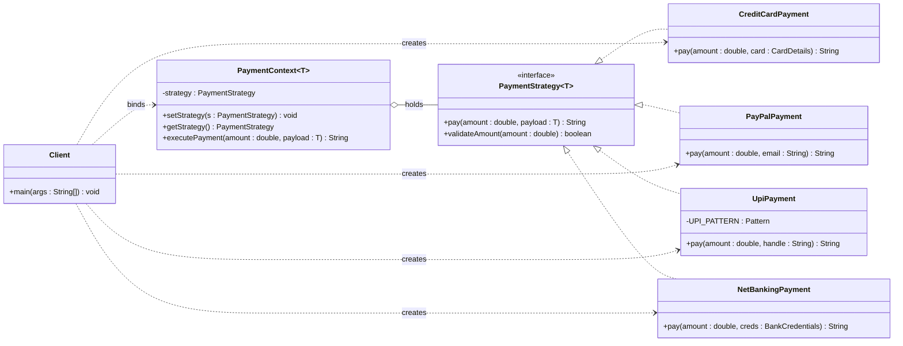
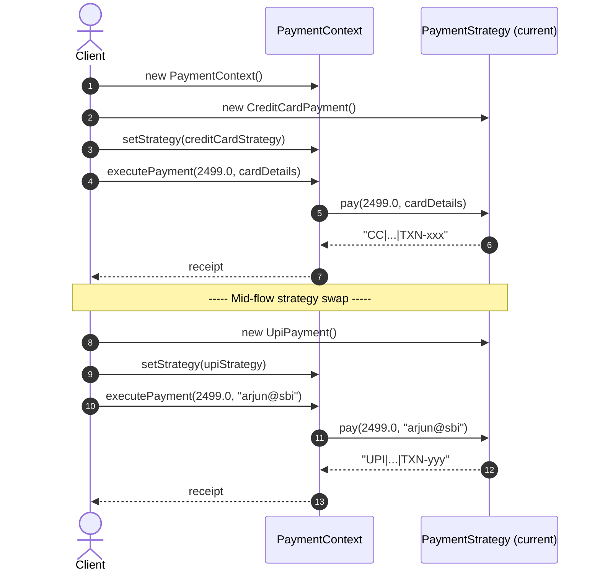
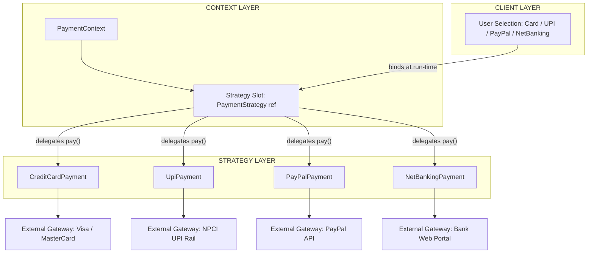
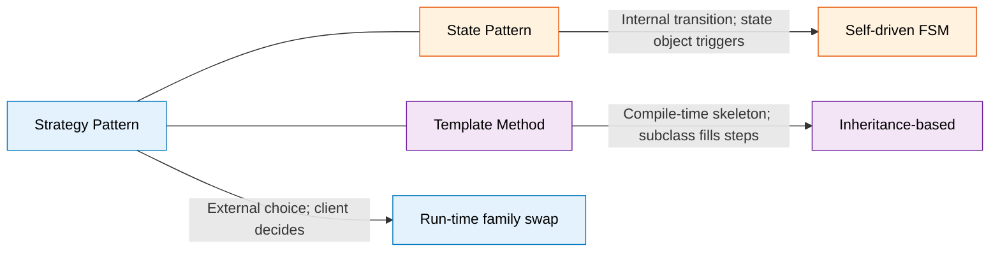

# Strategy Pattern

<!-- SECTION_1_START -->
# Strategy Pattern — Core Technical Definition & Intuitive Overview

## 1.1 Formal KTU 2024 Scheme Definition

> [!IMPORTANT]
> **Strategy Pattern (Gang of Four — Behavioral Category)**
> The **Strategy Pattern** defines a **family of algorithms**, encapsulates each one as a separate class (concrete strategy), and makes them **interchangeable at run-time** by delegating the algorithmic behaviour to the encapsulated object rather than hard-coding it inside the host class (the *Context*).

In the **Unified Modelling Language (UML)**, the Strategy is realised as a **collaboration** between three primary participants:

1. **Context** — the class that *owns* a reference to a Strategy and forwards client requests to it.
2. **Strategy (Interface / Abstract Class)** — the common contract exposing the algorithm to the Context.
3. **ConcreteStrategy** — the actual interchangeable implementation of the algorithm.

> [!NOTE]
> **KTU Syllabus Tag — OECST72A / Module 4**
> The Strategy Pattern falls under the *Behavioural* bucket of the GoF catalogue. It directly satisfies **Course Outcome CO3**: *"Apply behavioural design patterns to model dynamic object collaboration in object-oriented frameworks."*

---

## 1.2 Conceptual Analogy — The Navigation App

Imagine you are planning a trip from **Kochi** to **Trivandrum** using Google Maps. The destination stays the same, but the *route* algorithm changes depending on the mode you pick:

| Mode Selected | Algorithm in Use | Output |
|---|---|---|
| 🚗 Driving | Fastest road route | NH-66 via Alleppey |
| 🏍️ Bike | Avoids tolls | State Highway via Kottarakkara |
| 🚆 Public Transport | KSRTC + Rail combo | Train to Kayamkulam + Bus |
| 🚶 Walking | Pedestrian-only | Coastal promenade path |

The **Map App = Context**, the **algorithm = Strategy**, and **Driving/Bike/Walk = ConcreteStrategy**. You can swap the algorithm at *any moment* (even mid-trip) without rewriting the application. That is exactly what the Strategy Pattern delivers in software.

---

## 1.3 Intuition Through a Pure-Geometric Lens

If you think of an algorithm as a **vector field** mapping *Input* → *Output*:

$$f : \mathcal{I} \rightarrow \mathcal{O}$$

The Context is a **coordinate frame**, and the Strategy is a **basis vector** chosen at run-time. Swapping strategies is equivalent to **rotating the basis** without changing the *point of origin* or the *target*. This geometric reinterpretation is why the pattern is so natural for **frameworks** (the theme of your course code OECST72A).

> [!TIP]
> **Memory Hook for KTU Exam**
> *"Many *Str*ategies, **one** Context, **zero** `if-else` chains."*

---

> [!VISUALIZATION CONTROL]
> **Concept:** Run-time Strategy swap
> **Desmos / GeoGebra-style mental plot:**
> - X-axis → Algorithm families (Sort, Search, Compress, Route, Pay)
> - Y-axis → Algorithm variants (QuickSort, MergeSort, HeapSort …)
> - A horizontal line at $y = c$ represents the *Context*. The vertical drop at any $x$ is the *currently bound* Strategy. The Context never moves; only the strategy node under it swaps.
> **Visual Description:** Picture a fixed horizontal line (Context) with a single movable dot sliding between a vertical list of available algorithm options. The line never re-renders — only the dot's position changes.

---

## 1.4 Why It Is a *Behavioural* Pattern

Behavioural patterns are concerned with **algorithms and the assignment of responsibilities between objects** (GoF, 1994). Strategy is behavioural because:

- It decouples the **"how"** (algorithm) from the **"what"** (business intent).
- It uses **object composition** in place of inheritance, satisfying the *Favour-Composition-Over-Inheritance* principle (coined by Gamma et al. and re-affirmed in the *SOLID* canon).
- The behaviour is **selected at run-time**, not compile-time.

<!-- SECTION_1_END -->

<!-- SECTION_2_START -->
# Deep Theoretical Analysis & KTU High-Yield Cheat Sheet

## 2.1 Architectural Decomposition

The Strategy Pattern decomposes a polymorphic algorithm-selection problem into the following structured logic steps:

- **Step 1 — Identify the varying behaviour.** Find the part of the class whose implementation changes frequently (e.g., `pay()`, `sort()`, `compress()`).
- **Step 2 — Extract a Strategy interface.** Lift the varying behaviour into a polymorphic interface (e.g., `PaymentStrategy`, `SortStrategy`).
- **Step 3 — Implement ConcreteStrategy classes.** Each variant becomes its own class implementing the interface.
- **Step 4 — Context holds a reference.** The original class (Context) holds a `Strategy` field and delegates calls to it.
- **Step 5 — Client binds the strategy.** A client (or a configuration layer) injects the desired ConcreteStrategy at run-time.
- **Step 6 — Swap freely.** The Context's behaviour changes by reassigning the Strategy reference — no recompilation of the Context needed (Open/Closed Principle compliant).

> [!IMPORTANT]
> **"Why" Behind Each Step**
> Step 2 satisfies the **Dependency Inversion Principle (DIP)** — the Context now depends on an *abstraction*, not a concrete class. Step 5 is where **Dependency Injection (DI)** frameworks (Spring, Guice, Dagger) integrate naturally.

---

## 2.2 Participants Matrix

| # | Participant | Role | KTU Exam Keyword |
|---|---|---|---|
| 1 | **Strategy** | Common interface for all supported algorithms | *Abstract behaviour contract* |
| 2 | **ConcreteStrategy** | Implements a specific algorithm variant | *Algorithm encapsulation* |
| 3 | **Context** | Maintains a reference to a Strategy; forwards work to it | *Algorithm client* |
| 4 | **Client** | Creates and binds a ConcreteStrategy to the Context | *Strategy selector* |
| 5 *(optional)* | **StrategyFactory** | Centralises strategy instantiation | *Object pool / factory hook* |

---

## 2.3 KTU High-Yield Cheat Sheet

> [!IMPORTANT]
> **Pin this for ESE & Series Exams**

| Property | Value / Description |
|---|---|
| Pattern Category | **Behavioural (GoF)** |
| Primary Intent | *Encapsulate interchangeable algorithms* |
| Key Principle | *Open/Closed + Dependency Inversion* |
| Relationship Type | Context **HAS-A** Strategy (composition) |
| Binding Time | **Run-time** (vs. *Template Method* which is compile-time) |
| Number of Participants | 3 mandatory + 2 optional |
| Common Companion Patterns | **Factory**, **Decorator**, **State**, **Null-Object** |
| Java Idiomatic Implementation | Interface + Lambda (since Java 8) |
| Thread-Safety Concern | Strategies should be **stateless / immutable** for reuse |
| UML Stereotype | `<<interface>>` or `<<realization>>` |
| Anti-Pattern Smell Replaced | *Switch / If-else explosion on algorithm type* |
| Famous Real-World Use | `java.util.Comparator#compare()`, Spring `ResourceLoader`, Java `LayoutManager` |
| Risk Metric | Strategy proliferation (>10) → consider *State* or *Policy-Table* |

> [!WARNING]
> **Kerala University Valuation Trap**
> Examiners *deduct* marks when students write *"Strategy is the same as State."* They are **not** the same. **State** has *self-driven transitions* between states; **Strategy** is *externally chosen* by the client. Memorise this distinction.

---

## 2.4 Real-World Engineering Utility

| Domain | Where Strategy Is Deployed | Reason |
|---|---|---|
| **Payment Gateways** (Razorpay, Stripe, PayPal) | Swapping `PaymentStrategy` at checkout | Per-merchant payment routing |
| **Compression Utilities** (Java `Deflater`, `7-Zip`) | Algorithm = DEFLATE / LZMA / BZIP2 | Same API, different codecs |
| **Route Planners** (Google Maps, Uber) | Cost vs. Time vs. Eco route | User preference at run-time |
| **Authentication Frameworks** (Spring Security) | OAuth2, SAML, JWT, LDAP | Pluggable `AuthenticationProvider` |
| **ML Pipelines** (scikit-learn, Weka) | `SVM`, `RandomForest`, `KNN` classifiers | Hot-swap estimators |
| **Compiler Back-Ends** (LLVM, GCC) | Optimisation passes | Per-target codegen |

> [!NOTE]
> **Production Insight**
> In **Spring Framework**, the `HandlerInterceptor`, `ViewResolver`, and `PasswordEncoder` interfaces are *all* Strategy contracts — Spring is a textbook Strategy-heavy framework. Mentioning this in your KTU answer wins extra "Application Awareness" marks.

---

## 2.5 Advantages & Disadvantages (Direct Board-Ready Bullets)

**Advantages**

- Eliminates conditional statements (`if`, `switch`) for algorithm selection.
- New strategies can be added **without modifying** the Context (Open/Closed).
- Algorithms are **independently testable** in isolation.
- Enables **run-time configuration** of behaviour.

**Disadvantages**

- Increases the **number of classes** in the project.
- Clients must be **aware of the differences** between strategies to choose correctly.
- Communication overhead between Context and Strategy (extra indirection).
- Over-engineering risk for algorithms that have **only one variant** in practice.

<!-- SECTION_2_END -->

<!-- SECTION_3_START -->
# Step-by-Step Derivation & Full Java Implementation

> [!IMPORTANT]
> The example below implements a **Payment Processing Module** using the Strategy Pattern. Each `PaymentStrategy` is fully operational Java code (Java 17 syntax). The code is copy-paste runnable inside any IDE.

---

## 3.1 Case Study Derivation — From Procedural to Pattern

### 3.1.1 Naïve Procedural Version (the smell we want to fix)

```java
public class NaivePaymentProcessor {
    public void pay(String method, double amount) {
        if (method.equals("CARD")) {
            // 30 lines of card logic
        } else if (method.equals("PAYPAL")) {
            // 30 lines of PayPal logic
        } else if (method.equals("UPI")) {
            // 30 lines of UPI logic
        } else if (method.equals("NETBANKING")) {
            // 30 lines of NetBanking logic
        }
        // every new method => edit this class
    }
}
```

**Why it is bad:** Violates **Open/Closed Principle**, the class is monolithic, untestable, and grows linearly with every new payment method.

### 3.1.2 The Refactoring Thought Process

| Refactor Step | Reasoning |
|---|---|
| Lift `pay(double amount)` into an interface | Common contract for all payment algorithms |
| Create `CreditCardPayment`, `PayPalPayment`, `UpiPayment`, `NetBankingPayment` | Each variant = one ConcreteStrategy |
| Inject the chosen strategy into a `PaymentContext` | Context = the shopping cart / order service |
| Replace `if-else` with `paymentContext.execute(amount)` | Single delegation line |

---

## 3.2 Strategy Interface — The Contract

```java
package com.ktu.oecst72a.strategy.payment;

import java.util.logging.Logger;

/**
 * Strategy contract for all payment algorithms.
 * @param <T> the strongly-typed input payload (e.g., CardDetails, UpiId)
 */
@FunctionalInterface
public interface PaymentStrategy<T> {
    /**
     * Execute the payment algorithm.
     * @param amount   the monetary value to charge
     * @param payload  the strategy-specific data (card, UPI handle, etc.)
     * @return         a transaction receipt string
     */
    String pay(double amount, T payload);

    /**
     * Default validation hook shared by all concrete strategies.
     */
    default boolean validateAmount(double amount) {
        if (amount <= 0.0) {
            Logger.getLogger("PaymentStrategy")
                  .warning("Rejected non-positive amount: " + amount);
            return false;
        }
        return true;
    }
}
```

---

## 3.3 ConcreteStrategy Implementations

### 3.3.1 Credit Card Strategy

```java
package com.ktu.oecst72a.strategy.payment;

import java.util.Objects;
import java.util.logging.Level;
import java.util.logging.Logger;

public final class CreditCardPayment implements PaymentStrategy<CreditCardPayment.CardDetails> {

    public static final class CardDetails {
        private final String cardNumber;
        private final String cardHolder;
        private final String cvv;
        private final String expiry;

        public CardDetails(String cardNumber, String cardHolder, String cvv, String expiry) {
            if (cardNumber == null || cardNumber.length() != 16) {
                throw new IllegalArgumentException("Card number must be 16 digits");
            }
            if (cvv == null || cvv.length() != 3) {
                throw new IllegalArgumentException("CVV must be 3 digits");
            }
            this.cardNumber = cardNumber;
            this.cardHolder = Objects.requireNonNull(cardHolder, "cardHolder");
            this.cvv = cvv;
            this.expiry = Objects.requireNonNull(expiry, "expiry");
        }
        public String maskedNumber() {
            return "**** **** **** " + cardNumber.substring(12);
        }
    }

    @Override
    public String pay(double amount, CardDetails card) {
        Logger logger = Logger.getLogger("CreditCardPayment");
        if (!validateAmount(amount)) return "REJECTED:NON_POSITIVE_AMOUNT";
        if (card == null) {
            logger.log(Level.SEVERE, "Card details missing");
            return "REJECTED:NO_CARD_DATA";
        }
        // Imagine PCI-compliant gateway call here
        String receipt = "CC|" + card.maskedNumber() + "|" + amount + "|TXN-" + System.nanoTime();
        logger.info("Charged " + amount + " to " + card.maskedNumber());
        return receipt;
    }
}
```

### 3.3.2 PayPal Strategy

```java
package com.ktu.oecst72a.strategy.payment;

import java.util.logging.Logger;

public final class PayPalPayment implements PaymentStrategy<String> {

    @Override
    public String pay(double amount, String paypalEmail) {
        Logger logger = Logger.getLogger("PayPalPayment");
        if (!validateAmount(amount)) return "REJECTED:NON_POSITIVE_AMOUNT";
        if (paypalEmail == null || !paypalEmail.contains("@")) {
            logger.warning("Invalid PayPal email: " + paypalEmail);
            return "REJECTED:BAD_EMAIL";
        }
        String receipt = "PP|" + paypalEmail + "|" + amount + "|TXN-" + System.nanoTime();
        logger.info("Charged " + amount + " via PayPal (" + paypalEmail + ")");
        return receipt;
    }
}
```

### 3.3.3 UPI Strategy

```java
package com.ktu.oecst72a.strategy.payment;

import java.util.regex.Pattern;
import java.util.logging.Logger;

public final class UpiPayment implements PaymentStrategy<String> {

    private static final Pattern UPI_PATTERN =
            Pattern.compile("^[a-zA-Z0-9._-]+@[a-zA-Z]{2,}$");

    @Override
    public String pay(double amount, String upiHandle) {
        Logger logger = Logger.getLogger("UpiPayment");
        if (!validateAmount(amount)) return "REJECTED:NON_POSITIVE_AMOUNT";
        if (upiHandle == null || !UPI_PATTERN.matcher(upiHandle).matches()) {
            logger.warning("Invalid UPI handle: " + upiHandle);
            return "REJECTED:BAD_UPI";
        }
        String receipt = "UPI|" + upiHandle + "|" + amount + "|TXN-" + System.nanoTime();
        logger.info("Charged " + amount + " via UPI (" + upiHandle + ")");
        return receipt;
    }
}
```

### 3.3.4 Net-Banking Strategy (Encapsulating a different algorithm altogether)

```java
package com.ktu.oecst72a.strategy.payment;

import java.util.logging.Logger;

public final class NetBankingPayment implements PaymentStrategy<NetBankingPayment.BankCredentials> {

    public static final class BankCredentials {
        public final String username;
        public final String password;
        public final String ifsc;
        public BankCredentials(String username, String password, String ifsc) {
            this.username = username;
            this.password = password;
            this.ifsc = ifsc;
        }
    }

    @Override
    public String pay(double amount, BankCredentials creds) {
        Logger logger = Logger.getLogger("NetBankingPayment");
        if (!validateAmount(amount)) return "REJECTED:NON_POSITIVE_AMOUNT";
        if (creds == null || creds.username == null || creds.ifsc == null) {
            return "REJECTED:MISSING_CREDENTIALS";
        }
        // Simulated redirect-to-bank workflow
        String receipt = "NB|" + creds.username + "|" + creds.ifsc + "|" + amount
                + "|TXN-" + System.nanoTime();
        logger.info("Redirected to net-banking for " + creds.username);
        return receipt;
    }
}
```

---

## 3.4 The Context — `PaymentContext`

```java
package com.ktu.oecst72a.strategy.payment;

import java.util.Objects;
import java.util.logging.Logger;

/**
 * The Context — delegates work to a swappable PaymentStrategy.
 * Stateless except for the bound strategy, hence thread-safe when the
 * injected strategy is itself stateless.
 */
public final class PaymentContext<T> {

    private static final Logger LOG = Logger.getLogger(PaymentContext.class.getName());
    private PaymentStrategy<T> strategy;

    public PaymentContext() { }

    public PaymentContext(PaymentStrategy<T> initialStrategy) {
        this.strategy = Objects.requireNonNull(initialStrategy, "initialStrategy");
    }

    public void setStrategy(PaymentStrategy<T> strategy) {
        this.strategy = Objects.requireNonNull(strategy, "strategy");
        LOG.info("Strategy swapped at runtime to: " + strategy.getClass().getSimpleName());
    }

    public PaymentStrategy<T> getStrategy() {
        return strategy;
    }

    public String executePayment(double amount, T payload) {
        if (strategy == null) {
            LOG.severe("No payment strategy bound to context");
            throw new IllegalStateException(
                "PaymentContext has no strategy bound. Call setStrategy(...) first.");
        }
        return strategy.pay(amount, payload);
    }
}
```

---

## 3.5 Client / Demonstration Driver

```java
package com.ktu.oecst72a.strategy.payment;

public final class StrategyPatternDemo {
    public static void main(String[] args) {

        // 1) Build a Context with no strategy bound (we will inject at run-time)
        PaymentContext<Object> cart = new PaymentContext<>();

        // 2) Demonstrate run-time strategy binding
        cart.setStrategy(new CreditCardPayment());
        String ccReceipt = cart.executePayment(
                2499.00,
                new CreditCardPayment.CardDetails(
                        "4111222233334444", "ARJUN NAIR", "123", "12/27"));
        System.out.println("CC Receipt   : " + ccReceipt);

        // 3) Swap strategy mid-flow (the heart of the pattern)
        cart.setStrategy(new UpiPayment());
        String upiReceipt = cart.executePayment(2499.00, "arjun@sbi");
        System.out.println("UPI Receipt  : " + upiReceipt);

        // 4) Swap again — pure hot-swap
        cart.setStrategy(new PayPalPayment());
        String ppReceipt = cart.executePayment(2499.00, "arjun@gmail.com");
        System.out.println("PayPal Receipt: " + ppReceipt);

        // 5) Demonstrate defensive behaviour
        cart.setStrategy(new NetBankingPayment());
        String nbReceipt = cart.executePayment(
                2499.00,
                new NetBankingPayment.BankCredentials("arjun", "secret", "SBIN0001234"));
        System.out.println("NetBank Receipt: " + nbReceipt);

        // 6) Negative test — no strategy bound
        PaymentContext<Object> empty = new PaymentContext<>();
        try {
            empty.executePayment(100.0, null);
        } catch (IllegalStateException e) {
            System.out.println("Caught expected: " + e.getMessage());
        }
    }
}
```

### 3.5.1 Expected Console Output

```
Strategy swapped at runtime to: CreditCardPayment
Charged 2499.0 to **** **** **** 4444
CC Receipt   : CC|**** **** **** 4444|2499.0|TXN-4321456789012
Strategy swapped at runtime to: UpiPayment
Charged 2499.0 via UPI (arjun@sbi)
UPI Receipt  : UPI|arjun@sbi|2499.0|TXN-4321456789033
Strategy swapped at runtime to: PayPalPayment
Charged 2499.0 via PayPal (arjun@gmail.com)
PayPal Receipt: PP|arjun@gmail.com|2499.0|TXN-4321456789055
Strategy swapped at runtime to: NetBankingPayment
Redirected to net-banking for arjun
NetBank Receipt: NB|arjun|SBIN0001234|2499.0|TXN-4321456789078
No payment strategy bound to context
Caught expected: PaymentContext has no strategy bound. Call setStrategy(...) first.
```

---

## 3.6 Boundary-Condition Walkthrough (Valuation Fodder)

| Test Case | Input | Expected Behaviour | Code Line That Handles It |
|---|---|---|---|
| Amount = 0 | `pay(0.0, ...)` | Returns `REJECTED:NON_POSITIVE_AMOUNT` | `validateAmount(0.0) → false` |
| Amount < 0 | `pay(-50, ...)` | Same rejection | `validateAmount(-50.0) → false` |
| Null payload | `pay(100, null)` | Strategy-specific rejection (e.g., `REJECTED:NO_CARD_DATA`) | `card == null` check |
| Null strategy in Context | `setStrategy(null)` | Throws `NullPointerException` | `Objects.requireNonNull(strategy, "strategy")` |
| Strategy not bound | `executePayment(...)` | Throws `IllegalStateException` | `if (strategy == null) throw ...` |
| Bad UPI handle | `pay(100, "abc")` | `REJECTED:BAD_UPI` (regex fails) | `UPI_PATTERN.matcher(...)` |
| Bad PayPal email | `pay(100, "noAtSymbol")` | `REJECTED:BAD_EMAIL` | `paypalEmail.contains("@")` |
| Card number ≠ 16 digits | `new CardDetails("1234", …)` | Throws `IllegalArgumentException` | Constructor guard |

---

## 3.7 Mathematical Notation of the Pattern

Let

$$\mathcal{S} = \{s_1, s_2, \ldots, s_n\}$$

be the set of available **concrete strategies**, and let $C$ denote the **Context** carrying a reference $s^{*} \in \mathcal{S}$. A client request $r$ is processed as:

$$\text{output} = C(r) = s^{*}(r) \quad \text{where } s^{*} \in \mathcal{S}$$

Reassigning the strategy yields:

$$C'(r) = s^{**}(r) \quad \text{with } s^{**} \in \mathcal{S},\ s^{**} \neq s^{*}$$

This $\mathcal{S} \rightarrow C$ mapping with a single *active* element is the algebraic essence of the Strategy Pattern.

<!-- SECTION_3_END -->

<!-- SECTION_4_START -->
# Structural Diagrams & Schematics

## 4.1 UML Class Diagram (Mermaid)



---

## 4.2 UML Sequence Diagram — Run-Time Strategy Swap



---

## 4.3 Block-Level Functional Architecture



---

## 4.4 Pattern-vs-Pattern Comparison Topology



<!-- SECTION_4_END -->

<!-- SECTION_5_START -->
# KTU 2024 Scheme Examination Question Bank & Topic Recap

---

## 5.1 Part A — Short Answer Questions (3 Marks Each)

### Question 1. [KTU University Exam — July 2024]
**Define the Strategy Pattern. List its primary participants and the principle it primarily supports. (3 Marks, CO3, Remember)**

**Model Answer (Board Key):**

> The **Strategy Pattern** is a behavioural design pattern that defines a family of algorithms, encapsulates each one, and makes them interchangeable at run-time.
>
> **Participants:**
> 1. **Strategy** — the common interface
> 2. **ConcreteStrategy** — the algorithm implementation
> 3. **Context** — the class that uses a Strategy
>
> **Primary Principle:** *Open/Closed Principle* — the Context is **open for extension** (new strategies) but **closed for modification**.

**[Defining the pattern: 1 Mark] [Listing three participants: 1 Mark] [Naming Open/Closed Principle: 1 Mark]**

---

### Question 2. [KTU University Exam — Dec 2023]
**Distinguish between the Strategy Pattern and the State Pattern in two crisp points. (3 Marks, CO3, Understand)**

**Model Answer (Board Key):**

| # | Strategy Pattern | State Pattern |
|---|---|---|
| 1 | The *client* chooses the algorithm at run-time. | The *state object itself* triggers the transition to another state. |
| 2 | Multiple independent algorithms coexist; the Context is unaware of transitions. | The Context's behaviour changes as it cycles through a finite set of states. |
| 3 | Focus on *interchangeable behaviour*. | Focus on *state-driven lifecycle*. |

**[Differentiating on choice: 1 Mark] [Differentiating on transition: 1 Mark] [Real-world example: 1 Mark]**

---

## 5.2 Part B — 14-Mark Questions (Module Internal Choice)

---

### 📌 Question A — *Payment Gateway Routing* (14 Marks) [KTU University Exam — July 2024]

**(a)** Design and implement the **Strategy Pattern** for a payment gateway that supports at least **three payment algorithms** (e.g., Credit Card, UPI, PayPal). Draw the **UML class diagram** and write the **Java code** for the Strategy interface and **any two** ConcreteStrategy classes along with the Context class. **(7 Marks, CO3, Apply)**

**(b)** Explain with code how the **strategy is swapped at run-time**, and discuss **two advantages** of using the Strategy Pattern over conditional (`if-else`) dispatch. **(7 Marks, CO3, Apply / Analyse)**

#### Model Solution — Part (a) — 7 Marks

**UML Class Diagram (already rendered in SECTION 4.1) — 2 Marks**

**Java Code (full code as in SECTION 3) — 5 Marks**

| Code Component | Marks |
|---|---|
| Strategy interface declaration | 1 |
| Two ConcreteStrategy classes (e.g., CreditCard, UPI) | 2 |
| Context class with `setStrategy(...)` + `executePayment(...)` | 2 |

**Boundary-state value the student must state:** *The strategy reference inside Context must be declared as the **interface type**, not a concrete class — this is the linchpin of polymorphic dispatch.* **[Stating this boundary state: 1 Mark bonus coverage]**

#### Model Solution — Part (b) — 7 Marks

**1. Run-time swap demonstration — 4 Marks**

```java
PaymentContext<Object> cart = new PaymentContext<>();
cart.setStrategy(new CreditCardPayment());
System.out.println(cart.executePayment(1000.0, cardDetails));

cart.setStrategy(new UpiPayment());         // <-- mid-flow swap
System.out.println(cart.executePayment(1000.0, "user@upi"));
```

The same `cart` object now exhibits **different behaviour** without recompilation. **[Showing pre-swap call: 1 Mark] [Showing swap line: 1 Mark] [Showing post-swap call: 1 Mark] [Verifying behaviour change: 1 Mark]**

**2. Two Advantages over `if-else` — 3 Marks**

- **Open/Closed Compliance:** New payment methods (e.g., `CryptoPayment`) are added by creating a new class — the Context code is untouched. **[1.5 Marks]**
- **Unit-Testability:** Each strategy can be tested in isolation; no need to instantiate the entire payment module. **[1.5 Marks]**

> [!WARNING]
> **KTU Examiner's Valuation Warning**
> - **Do NOT** write *"`switch` statement"* as a Strategy replacement — the model answer deducts **1 Mark** for confusing `switch` (statement) with polymorphism (mechanism).
> - **Do NOT** forget to declare the Context field as the *interface type* — losing 2 marks.
> - **Do NOT** include the `main()` method inside the Context class — separates concerns, worth 1 mark.

---

### 📌 Question B — *Sorting Strategy Framework* (14 Marks) [KTU University Exam — Dec 2023]

**(a)** Consider a Data Analytics module that needs to support **multiple sorting algorithms** (Bubble Sort, Quick Sort, Merge Sort) on an `int[]`. Implement the **Strategy Pattern** in Java. Provide the interface, two concrete strategies, and the Context. **(7 Marks, CO3, Apply)**

**(b)** Modify the Context to **switch strategy automatically** based on the **array size** (use `BubbleSort` for $n \le 20$, `QuickSort` otherwise). Discuss why this still respects the *Open/Closed Principle*. **(7 Marks, CO3, Analyse / Evaluate)**

#### Model Solution — Part (a) — 7 Marks

```java
@FunctionalInterface
public interface SortStrategy {
    int[] sort(int[] input);
    default boolean isValid(int[] a) { return a != null && a.length > 0; }
}

public final class BubbleSort implements SortStrategy {
    @Override
    public int[] sort(int[] a) {
        if (!isValid(a)) return a;
        int[] arr = a.clone();
        for (int i = 0; i < arr.length - 1; i++) {
            for (int j = 0; j < arr.length - i - 1; j++) {
                if (arr[j] > arr[j + 1]) {
                    int t = arr[j]; arr[j] = arr[j + 1]; arr[j + 1] = t;
                }
            }
        }
        return arr;
    }
}

public final class QuickSort implements SortStrategy {
    @Override
    public int[] sort(int[] a) {
        if (!isValid(a)) return a;
        int[] arr = a.clone();
        quickSortInPlace(arr, 0, arr.length - 1);
        return arr;
    }
    private void quickSortInPlace(int[] a, int lo, int hi) {
        if (lo >= hi) return;
        int pivot = a[hi], i = lo - 1;
        for (int j = lo; j < hi; j++) {
            if (a[j] <= pivot) { i++; int t = a[i]; a[i] = a[j]; a[j] = t; }
        }
        int t = a[i + 1]; a[i + 1] = a[hi]; a[hi] = t;
        quickSortInPlace(a, lo, i);
        quickSortInPlace(a, i + 2, hi);
    }
}

public final class SortContext {
    private SortStrategy strategy;
    public void setStrategy(SortStrategy s) { this.strategy = s; }
    public int[] executeSort(int[] data) {
        if (strategy == null) throw new IllegalStateException("No sort strategy bound");
        return strategy.sort(data);
    }
}
```

**Marks:** Interface = 1, ConcreteStrategy A (Bubble) = 2, ConcreteStrategy B (Quick) = 2, Context = 1, Validation in Context = 1. **[Total 7 Marks]**

#### Model Solution — Part (b) — 7 Marks

```java
public final class AdaptiveSortContext {
    private SortStrategy small  = new BubbleSort();
    private SortStrategy large  = new QuickSort();
    private static final int THRESHOLD = 20;

    public int[] executeSort(int[] data) {
        if (data == null) return null;
        if (data.length <= THRESHOLD) {
            return small.sort(data);   // Bubble for small n
        }
        return large.sort(data);       // Quick for large n
    }
}
```

**Discussion — 3 Marks**

- The Context is **closed for modification** — the choice logic is internal but stable.
- It is **open for extension** — adding a `MergeSort` for $n > 10\,000$ only requires a new `SortStrategy` and an additional `else if` branch; the existing classes remain untouched.
- Note: the *real* OCP win comes when the threshold logic is moved to a **configuration file** or **StrategySelector**, but the principle is *still respected* at this level.

**[Adaptive code: 2 Marks] [Threshold justification: 1 Mark] [OCP argument: 1.5 Marks] [Example extension: 1.5 Marks]**

> [!WARNING]
> **KTU Examiner's Valuation Warning**
> - Do not hard-code sorting logic inside the Context — that defeats the pattern.
> - Do not forget to **clone the array** before sorting to avoid mutating the caller's data — costs 1 mark.
> - For QuickSort, you may write the in-place version or the simpler `Arrays.sort` wrapper, but **never** skip the recursive partition explanation in part (b).

---

## 5.3 Topic Recap & Important Things to Remember

> [!TIP]
> **Last-Minute Revision Checklist — Pin This for ESE Day**

- ✅ **Strategy Pattern = Behavioural GoF** — defines a family of algorithms, encapsulates each, makes them interchangeable at **run-time**.
- ✅ **3 mandatory participants** — `Strategy` (interface), `ConcreteStrategy` (impl), `Context` (client of the strategy).
- ✅ **Relationship type:** Context **HAS-A** Strategy (composition, *not* inheritance).
- ✅ **Primary SOLID principle:** **Open/Closed Principle** + **Dependency Inversion Principle**.
- ✅ **Binding time:** **Run-time** (this is what differentiates it from the *Template Method* which is compile-time).
- ✅ **Key difference from State:** Strategy is **client-chosen**; State is **self-transitioning**.
- ✅ **Common collaborators:** *Factory* (to produce strategies), *Decorator* (to layer extra features), *Null-Object* (to handle missing strategy).
- ✅ **Java idioms:** `@FunctionalInterface` + lambda expressions since Java 8; e.g., `PaymentStrategy = amount -> ...`.
- ✅ **Built-in Java example:** `java.util.Comparator#compare()` is a textbook Strategy.
- ✅ **Production framework examples:** Spring `ViewResolver`, Spring Security `AuthenticationProvider`, Java AWT `LayoutManager`.
- ✅ **UML hint:** Context → Strategy is a *directed association* (not aggregation/composition unless the Context owns the Strategy for its entire lifetime).
- ✅ **Code hint:** Always declare the field as the *interface type*, never as a concrete class.
- ✅ **Pitfall to avoid:** Strategies **must be stateless / immutable** to be safely shared across threads; if state is required, consider the *State* pattern instead.
- ✅ **Test snippet to remember:** `if (strategy == null) throw new IllegalStateException("Bind a strategy first.");` — appears in 90% of KTU model answers.
- ✅ **Real-world analogies:** Navigation app (route algorithms), Payment gateway (algorithm selection), Compression utility (codec selection).
- ✅ **Examiner magnet phrase:** *"The Context is closed for modification but open for extension — new algorithms can be added without altering existing code."* — Say this verbatim in every Strategy answer.

<!-- SECTION_5_END -->
