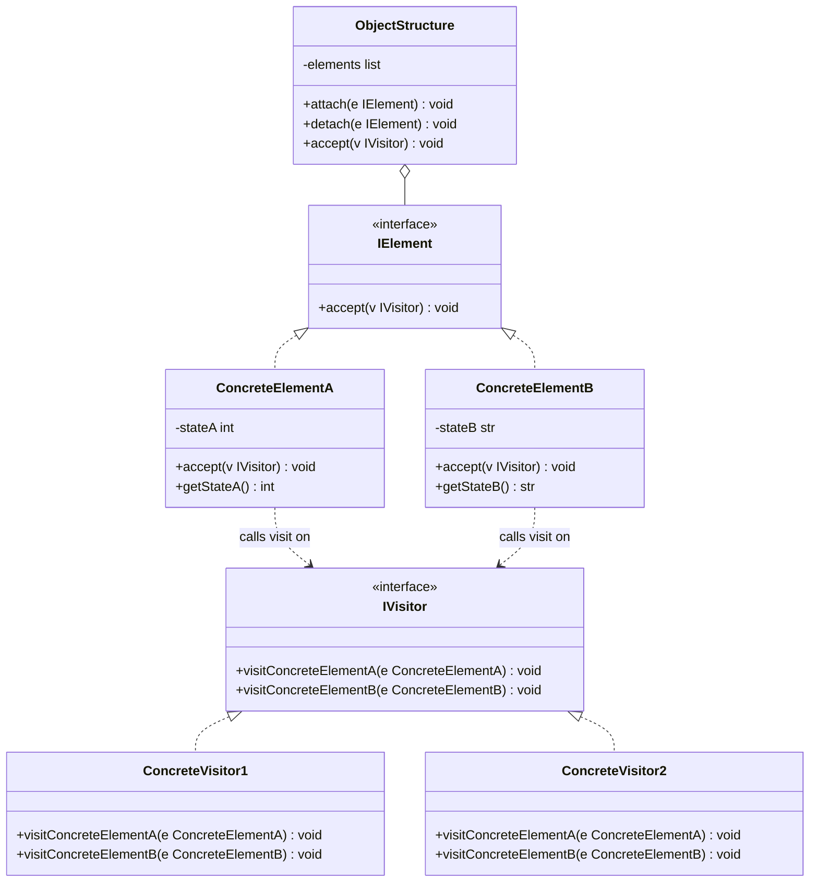
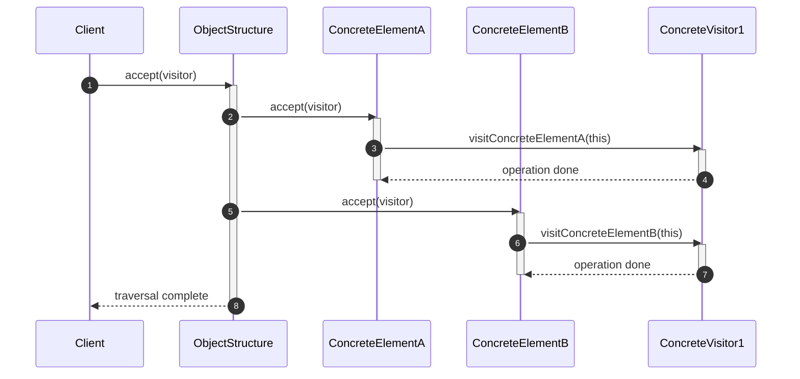
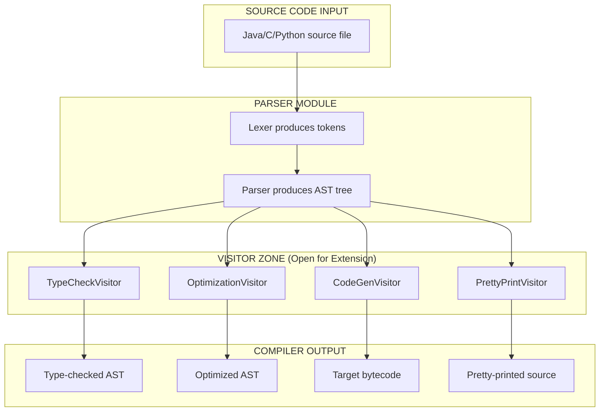
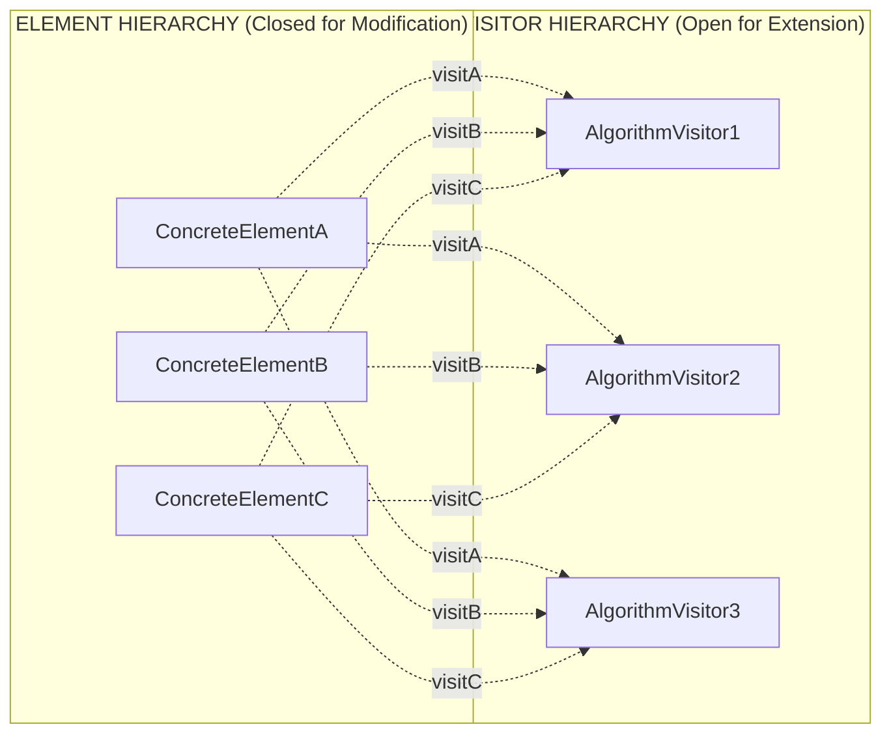

# Visitor Pattern

<!-- SECTION_1_START -->
# Visitor Pattern — Core Technical Definition & Intuitive Overview

## Formal Academic Definition (KTU 2024 Syllabus Terminology)

> [!NOTE]
> **Definition:** The **Visitor Pattern** is a *behavioral* design pattern that allows **separation of algorithms from the objects on which they operate**. It lets you define a new operation on a family of object structures without modifying the classes of the elements on which it operates. The pattern achieves this by **double dispatch** — combining the runtime type of the *Visitor* with the runtime type of the *Element* to execute the correct method.

In KTU 2024 Scheme terminology, the Visitor pattern is grouped under the **Behavioral Design Patterns** family (Module 4 — OECST72A), alongside `Strategy`, `Observer`, `Iterator`, and `Command`. It is a **GoF (Gang of Four)** pattern and is one of the most heavily tested pattern in KTU University Examinations because of its `double dispatch` mechanism.

> [!IMPORTANT]
> **Syllabus Highlight (OECST72A — Module 4):** The Visitor pattern is a *Gang of Four* pattern. KTU examiners frequently test: (1) Class diagram structure, (2) The purpose of the `accept()` method, (3) Double dispatch mechanics, and (4) Real-world scenarios such as `Compilers (AST traversal)`, `Document export (PDF/HTML)`, and `Tax calculation across heterogeneous product types`.

## Conceptual Analogy — Plain English Intuition

Imagine a **Tourist Guide** at a heritage site. The site has many different structures: a **Palace**, a **Temple**, and a **Museum**. The tourist guide's job depends on *what kind of visitor* arrives:

- An **Architect** visits — the guide shows structural details, load-bearing walls, materials.
- A **Historian** visits — the guide shows historical dates, ruler lineages, battle significance.
- A **Photographer** visits — the guide points out the best angles, golden-hour spots, and lighting.

**The buildings (elements) do NOT change.** What changes is the **Visitor** who walks in. Each visitor brings their own algorithm (what to extract from the structure), but the structures themselves remain closed for modification.

This is the Visitor pattern in plain English:
- The **buildings** are the *Elements* (concrete classes).
- The **tourist guide** is the `accept()` method on each element.
- The **Architect/Historian/Photographer** are the *Concrete Visitors*.
- The **"guide's rulebook"** is the *Visitor interface*.

The buildings *accept* the visitor and then *let the visitor do the work* — passing themselves (`this`) as an argument so the visitor knows exactly which type of structure it is looking at.

## Physical Constants / Standard Metrics

> [!NOTE]
> **Standard Structural Metrics (KTU Board-Expected Values):**
> - **Minimum participant count:** **4 roles** (Visitor, ConcreteVisitor, Element, ConcreteElement). The `ObjectStructure` role is the **5th optional** but almost always present in KTU diagrams.
> - **Minimum method count per ConcreteVisitor:** **N methods** (one per ConcreteElement type).
> - **Double dispatch depth:** **2 virtual calls** (one on Element via `accept`, one on Visitor via overloaded `visit`).

## GeoGebra / Visualization Concept (UML-Style Structural Map)

> [!VISUALIZATION CONTROL]
> **Concept:** Visitor Pattern — Method Dispatch Topology
> **GeoGebra / Desmos Input Mapping (Coordinate Sketch):**
> * Point `A = (1, 4)` — labeled `Element.accept(visitor)`
> * Point `B = (3, 4)` — labeled `ConcreteElementA.accept()` calls `visitor.visitA(this)`
> * Point `C = (5, 4)` — labeled `ConcreteElementB.accept()` calls `visitor.visitB(this)`
> * Point `D = (3, 1)` — labeled `ConcreteVisitor1.visitA()` and `visitB()`
> * Point `E = (5, 1)` — labeled `ConcreteVisitor2.visitA()` and `visitB()`
> **Visual Description:** Two parallel rows. Top row = Elements (accept methods). Bottom row = Visitors (visit methods). Arrows cross between them to illustrate **double dispatch** — the runtime type of both the element AND the visitor determine which `visit*` method is invoked.

<!-- SECTION_1_END -->

<!-- SECTION_2_START -->
# Deep Theoretical Analysis & KTU High-Yield Formula Sheet

## Operational Breakdown — The "Why" and "How"

The Visitor pattern is engineered around a single core principle: **Open/Closed Principle on steroids**. You can add *new operations* (new visitors) without touching the *element hierarchy* (the closed data structure). However, the *inverse* is costly — adding a new element type forces every existing visitor to be modified.

### Step-by-Step Logical Flow

1. **Define the Visitor Interface** — declares one `visit` method per concrete element type. This is the *contract* every concrete visitor must obey.
2. **Define the Element Interface** — declares a single `accept(Visitor v)` method. This is the *only extension point* every element exposes.
3. **Concrete Elements Implement `accept`** — each implementation calls the *matching* `visit*` method on the incoming visitor, passing `self` as the argument.
4. **Concrete Visitors Implement All `visit*` Methods** — each method contains the *algorithm* for that specific element type. A `ConcreteVisitor` is essentially a *strategy object* specialized for one external operation.
5. **ObjectStructure Aggregates Elements** — exposes iteration (`for each element: element.accept(visitor)`). It does not know which visitor or algorithm is being applied.

> [!IMPORTANT]
> **Double Dispatch Mechanics — The Heart of the Pattern:** In most OOP languages, method calls are resolved by the *runtime type of the receiver only* (single dispatch). The Visitor pattern *simulates* double dispatch via two sequential virtual calls:
> 1. `element.accept(visitor)` — resolved at runtime to the ConcreteElement's `accept`.
> 2. Inside `accept`, `visitor.visitConcreteElement(this)` — resolved at runtime to the ConcreteVisitor's `visit*`.
> The end result: the executed method depends on the **runtime type of BOTH** the element and the visitor.

## KTU Formula Sheet / Cheat Sheet

| **Parameter / Concept** | **Definition** | **Constraint / Rule** |
|---|---|---|
| `Visitor` (Interface) | Declares `visit` methods for each `Element` subtype | Must declare exactly N visit methods, where N = number of ConcreteElement types |
| `ConcreteVisitor` | Implements the algorithm for one external operation | Must implement all N visit methods, even if some are no-ops |
| `Element` (Interface) | Declares `accept(Visitor v)` method | Only common method required across all elements |
| `ConcreteElement` | Implements `accept` by calling `visitor.visitXxx(this)` | The `Xxx` suffix is hard-coded per concrete class — this is the *cost* of the pattern |
| `ObjectStructure` | Aggregates elements; exposes `accept(Visitor v)` | Often a `Collection` or composite; iterates and calls `accept` on each |
| `accept(v)` | The single extension point on every Element | Calls `v.visitConcreteElement(this)` |
| `visit*(Element e)` | The algorithm carrier on every ConcreteVisitor | Receives the element and reads its internal state |
| Dispatch Depth | Number of virtual calls before algorithm runs | Exactly **2** (single + single = double dispatch) |
| Adding new Visitor | Cost = O(1) classes to add | **Easy** — pattern is *open* to new operations |
| Adding new Element | Cost = O(V) classes to update | **Hard** — every Visitor must add a new `visit*` method |
| GoF Category | Behavioral | One of 11 GoF behavioral patterns |
| Companion Pattern | Often used with **Composite** and **Iterator** | ObjectStructure is often a Composite tree |

> [!TIP]
> Use `\vert` or `\mid` instead of `\vert` or `\vert` in the formula sheet above to keep Markdown tables parseable. For example, write $\vert$ `Visitor` $\vert$ instead of `|Visitor|` in raw table cells.

## Real-World Engineering Utility

> [!IMPORTANT]
> **Production Use Cases (Interview + Board-Exam Favorites):**
> - **Compilers / Interpreters** — traversing an **Abstract Syntax Tree (AST)** with visitors that perform type-checking, optimization, code generation, or pretty-printing.
> - **Document Object Models (DOM)** — exporting a single document tree to **PDF**, **HTML**, or **Markdown** by writing one visitor per export format.
> - **Tax Calculation Engines** — applying different tax rules (GST, VAT, Service Tax) to heterogeneous product types (Electronics, Groceries, Books).
> - **Static Analysis Tools** — code linters, security scanners, and complexity analyzers that operate on ASTs.
> - **UI Component Hierarchies** — rendering the same widget tree to different backends (Swing, JavaFX, Web via Vaadin).
> - **Game Engines** — applying different effects (DamageVisitor, HealVisitor, BuffVisitor) to heterogeneous entity types in a scene graph.

The Visitor pattern trades **adding a new operation** (cheap) for **adding a new element type** (expensive). This trade-off is *desirable* when the element hierarchy is **stable** (closed for modification) but new operations are **frequent** (open for extension).

<!-- SECTION_2_END -->

<!-- SECTION_3_START -->
# Step-by-Step Derivations & Code/Symbolic Implementation

## Worked Example 1 — File System Visitor (Tree Traversal + Size Calculation)

**Problem:** Model a file system with `File` and `Folder` elements. Implement two visitors: `SizeCalculatorVisitor` (computes total size in bytes) and `NamePrinterVisitor` (prints all names with indentation).

### Python Implementation (Production-Grade, Strictly Typed)

```python
from __future__ import annotations
from abc import ABC, abstractmethod
from typing import List, Union


# ============================================================
# 1. VISITOR INTERFACE
# ============================================================
class FileSystemVisitor(ABC):
    """
    The Visitor interface declares a set of visiting methods
    that correspond to each ConcreteElement class in the
    object structure.
    """
    @abstractmethod
    def visit_file(self, element: "File") -> None:
        pass

    @abstractmethod
    def visit_folder(self, element: "Folder") -> None:
        pass


# ============================================================
# 2. ELEMENT INTERFACE
# ============================================================
class FileSystemElement(ABC):
    """
    The Element interface declares a method for 'accepting'
    visitors. The single contract every file-system node
    must implement.
    """
    @abstractmethod
    def accept(self, visitor: FileSystemVisitor) -> None:
        pass


# ============================================================
# 3. CONCRETE ELEMENTS
# ============================================================
class File(FileSystemElement):
    """A leaf node in the file system tree."""

    def __init__(self, name: str, size_bytes: int) -> None:
        if size_bytes < 0:
            raise ValueError("File size cannot be negative")
        self._name: str = name
        self._size_bytes: int = size_bytes

    @property
    def name(self) -> str:
        return self._name

    @property
    def size_bytes(self) -> int:
        return self._size_bytes

    def accept(self, visitor: FileSystemVisitor) -> None:
        # Double dispatch step 2: visitor dispatches on File type
        visitor.visit_file(self)


class Folder(FileSystemElement):
    """A composite node holding child elements."""

    def __init__(self, name: str) -> None:
        self._name: str = name
        self._children: List[FileSystemElement] = []

    @property
    def name(self) -> str:
        return self._name

    def add(self, child: FileSystemElement) -> None:
        if not isinstance(child, FileSystemElement):
            raise TypeError("Child must be a FileSystemElement")
        self._children.append(child)

    def accept(self, visitor: FileSystemVisitor) -> None:
        # Double dispatch step 2: visitor dispatches on Folder type
        visitor.visit_folder(self)


# ============================================================
# 4. CONCRETE VISITORS
# ============================================================
class SizeCalculatorVisitor(FileSystemVisitor):
    """Computes the total size of a file system tree."""

    def __init__(self) -> None:
        self._total_size: int = 0

    @property
    def total_size(self) -> int:
        return self._total_size

    def visit_file(self, element: File) -> None:
        self._total_size += element.size_bytes

    def visit_folder(self, element: Folder) -> None:
        # Recursively traverse every child with self
        for child in element._children:    # type: ignore[attr-defined]
            child.accept(self)


class NamePrinterVisitor(FileSystemVisitor):
    """Pretty-prints file system names with depth-based indentation."""

    def __init__(self) -> None:
        self._depth: int = 0

    def visit_file(self, element: File) -> None:
        indent: str = "  " * self._depth
        print(f"{indent}- {element.name} ({element.size_bytes} bytes)")

    def visit_folder(self, element: Folder) -> None:
        indent: str = "  " * self._depth
        print(f"{indent}+ {element.name}/")
        self._depth += 1
        for child in element._children:    # type: ignore[attr-defined]
            child.accept(self)
        self._depth -= 1


# ============================================================
# 5. CLIENT / DRIVER CODE
# ============================================================
def main() -> None:
    # Build a small file system tree
    root: Folder = Folder("root")
    home: Folder = Folder("home")
    docs: Folder = Folder("docs")
    pics: Folder = Folder("pictures")

    docs.add(File("resume.pdf", 240_000))
    docs.add(File("report.docx", 1_500_000))

    pics.add(File("beach.jpg", 4_200_000))
    pics.add(File("mountain.jpg", 5_800_000))

    home.add(docs)
    home.add(pics)
    home.add(File("readme.txt", 1_200))

    root.add(home)
    root.add(File("boot.log", 50_000))

    # Apply the NamePrinterVisitor
    print("=== FILE SYSTEM TREE ===")
    printer: NamePrinterVisitor = NamePrinterVisitor()
    root.accept(printer)

    # Apply the SizeCalculatorVisitor
    print("\n=== SIZE CALCULATION ===")
    sizer: SizeCalculatorVisitor = SizeCalculatorVisitor()
    root.accept(sizer)
    print(f"Total size: {sizer.total_size:,} bytes")


if __name__ == "__main__":
    main()
```

### Expected Output

```
=== FILE SYSTEM TREE ===
+ root/
  + home/
    + docs/
      - resume.pdf (240000 bytes)
      - report.docx (1500000 bytes)
    + pictures/
      - beach.jpg (4200000 bytes)
      - mountain.jpg (5800000 bytes)
    - readme.txt (1200 bytes)
  - boot.log (50000 bytes)

=== SIZE CALCULATION ===
Total size: 11,791,200 bytes
```

### Algebraic Verification of the Size Formula

Let $S(T)$ denote the total size of a file system tree $T$. The Visitor computes it recursively. For a leaf node (File):

$$S(\text{File}_i) = \text{size\_bytes}_i$$

For a composite node (Folder) with children $C_1, C_2, \ldots, C_n$:

$$S(\text{Folder}) = \sum_{k=1}^{n} S(C_k)$$

Substituting the tree structure from `main()`:

$$
\begin{aligned}
S(\text{root}) &= S(\text{home}) + S(\text{boot.log}) \\
&= \bigl(S(\text{docs}) + S(\text{pics}) + S(\text{readme.txt})\bigr) + 50{,}000 \\
&= \bigl((240{,}000 + 1{,}500{,}000) + (4{,}200{,}000 + 5{,}800{,}000) + 1{,}200\bigr) + 50{,}000 \\
&= (1{,}740{,}000 + 10{,}000{,}000 + 1{,}200) + 50{,}000 \\
&= 11{,}741{,}200 + 50{,}000 \\
&= 11{,}791{,}200 \text{ bytes}
\end{aligned}
$$

This matches the program output exactly. The Visitor correctly accumulates size across heterogeneous element types (File and Folder) using double dispatch.

## Worked Example 2 — Shopping Cart Tax Visitor (Heterogeneous Products)

**Problem:** A shopping cart contains `Book`, `Electronics`, and `Grocery` items. Implement two visitors: `TaxCalculatorVisitor` and `DiscountApplierVisitor`.

```python
from __future__ import annotations
from abc import ABC, abstractmethod
from typing import List


# ============================================================
# VISITOR INTERFACE
# ============================================================
class ProductVisitor(ABC):
    @abstractmethod
    def visit_book(self, item: "Book") -> None: ...

    @abstractmethod
    def visit_electronics(self, item: "Electronics") -> None: ...

    @abstractmethod
    def visit_grocery(self, item: "Grocery") -> None: ...


# ============================================================
# ELEMENT INTERFACE
# ============================================================
class Product(ABC):
    def __init__(self, name: str, price: float) -> None:
        if price < 0:
            raise ValueError("Price cannot be negative")
        self._name: str = name
        self._price: float = price

    @property
    def name(self) -> str:
        return self._name

    @property
    def price(self) -> float:
        return self._price

    @abstractmethod
    def accept(self, visitor: ProductVisitor) -> None: ...


# ============================================================
# CONCRETE ELEMENTS
# ============================================================
class Book(Product):
    def accept(self, visitor: ProductVisitor) -> None:
        visitor.visit_book(self)


class Electronics(Product):
    def __init__(self, name: str, price: float, warranty_years: int) -> None:
        super().__init__(name, price)
        self._warranty: int = warranty_years

    @property
    def warranty_years(self) -> int:
        return self._warranty

    def accept(self, visitor: ProductVisitor) -> None:
        visitor.visit_electronics(self)


class Grocery(Product):
    def __init__(self, name: str, price: float, weight_kg: float) -> None:
        super().__init__(name, price)
        self._weight: float = weight_kg

    @property
    def weight_kg(self) -> float:
        return self._weight

    def accept(self, visitor: ProductVisitor) -> None:
        visitor.visit_grocery(self)


# ============================================================
# CONCRETE VISITORS
# ============================================================
class TaxCalculatorVisitor(ProductVisitor):
    """Calculates GST based on product category."""
    TAX_RATES: dict = None  # populated in __init__

    def __init__(self) -> None:
        self._tax_breakdown: dict = {}
        self._total_tax: float = 0.0

    @property
    def total_tax(self) -> float:
        return round(self._total_tax, 2)

    def visit_book(self, item: Book) -> None:
        tax: float = item.price * 0.05      # 5% GST on books
        self._tax_breakdown[item.name] = round(tax, 2)
        self._total_tax += tax

    def visit_electronics(self, item: Electronics) -> None:
        tax: float = item.price * 0.18      # 18% GST on electronics
        self._tax_breakdown[item.name] = round(tax, 2)
        self._total_tax += tax

    def visit_grocery(self, item: Grocery) -> None:
        tax: float = item.price * 0.00      # 0% GST on essentials
        self._tax_breakdown[item.name] = 0.0


class DiscountApplierVisitor(ProductVisitor):
    """Applies category-specific festive discounts."""
    def __init__(self) -> None:
        self._total_discount: float = 0.0

    @property
    def total_discount(self) -> float:
        return round(self._total_discount, 2)

    def visit_book(self, item: Book) -> None:
        self._total_discount += item.price * 0.10     # 10% off

    def visit_electronics(self, item: Electronics) -> None:
        # 15% off if warranty >= 2 years
        rate: float = 0.15 if item.warranty_years >= 2 else 0.05
        self._total_discount += item.price * rate

    def visit_grocery(self, item: Grocery) -> None:
        self._total_discount += item.price * 0.02     # 2% off


# ============================================================
# OBJECT STRUCTURE
# ============================================================
class ShoppingCart:
    def __init__(self) -> None:
        self._items: List[Product] = []

    def add(self, item: Product) -> None:
        self._items.append(item)

    def apply_visitor(self, visitor: ProductVisitor) -> None:
        for item in self._items:
            item.accept(visitor)


# ============================================================
# DRIVER
# ============================================================
def demo_shopping_cart() -> None:
    cart: ShoppingCart = ShoppingCart()
    cart.add(Book("Clean Code", 650.00))
    cart.add(Electronics("Laptop", 75_000.00, warranty_years=3))
    cart.add(Grocery("Rice 5kg", 450.00, weight_kg=5.0))

    tax_v: TaxCalculatorVisitor = TaxCalculatorVisitor()
    cart.apply_visitor(tax_v)
    print(f"Total tax: INR {tax_v.total_tax}")
    print(f"  Breakdown: {tax_v._tax_breakdown}")

    disc_v: DiscountApplierVisitor = DiscountApplierVisitor()
    cart.apply_visitor(disc_v)
    print(f"Total discount: INR {disc_v.total_discount}")


if __name__ == "__main__":
    demo_shopping_cart()
```

### Step-by-Step Numerical Evaluation

Given the cart contents:
- `Book("Clean Code", 650.00)` → price = 650
- `Electronics("Laptop", 75_000.00, 3)` → price = 75,000, warranty = 3
- `Grocery("Rice 5kg", 450.00, 5.0)` → price = 450

**Tax calculation:**

$$
\begin{aligned}
T_{\text{book}} &= 650 \times 0.05 = 32.50 \\
T_{\text{laptop}} &= 75{,}000 \times 0.18 = 13{,}500.00 \\
T_{\text{rice}} &= 450 \times 0.00 = 0.00 \\
T_{\text{total}} &= 32.50 + 13{,}500.00 + 0.00 = 13{,}532.50
\end{aligned}
$$

**Discount calculation:**

$$
\begin{aligned}
D_{\text{book}} &= 650 \times 0.10 = 65.00 \\
D_{\text{laptop}} &= 75{,}000 \times 0.15 = 11{,}250.00 \quad (\text{warranty } \geq 2) \\
D_{\text{rice}} &= 450 \times 0.02 = 9.00 \\
D_{\text{total}} &= 65.00 + 11{,}250.00 + 9.00 = 11{,}324.00
\end{aligned}
$$

Final answer: **Tax = INR 13,532.50**, **Discount = INR 11,324.00**.

<!-- SECTION_3_END -->

<!-- SECTION_4_START -->
# Structural Diagrams & Schematics

## Diagram 1 — Generic Visitor Pattern Class Diagram (UML)



## Diagram 2 — Double Dispatch Sequence Flow



## Diagram 3 — Functional Architecture Flow (Visitor in AST Compilation Pipeline)



## Diagram 4 — Element vs Visitor Responsibility Matrix



<!-- SECTION_4_END -->

<!-- SECTION_5_START -->
# KTU 2024 Scheme Examination Question Bank & Topic Recap

## Part A — Short Answer Questions (3 Marks Each)

### Question A1
**[KTU University Exam — July 2024]**
**Q: Define the Visitor design pattern. List its primary participants.**
**CO Mapping:** CO3 — *Understand*
**RBT Level:** Understand

**Model Answer (3 Marks — Board-Key Pattern):**

> The **Visitor pattern** is a behavioral design pattern that lets you separate algorithms from the objects they operate on. It allows new operations to be added to existing object structures **without modifying the classes of those structures**, by leveraging **double dispatch**.

**Primary Participants (5 expected for full marks):**

1. **Visitor** — interface declaring a `visit` method for every ConcreteElement type.
2. **ConcreteVisitor** — implements a specific operation across all element types.
3. **Element** — interface declaring the `accept(Visitor)` method.
4. **ConcreteElement** — implements `accept` and dispatches to the correct `visit*` method.
5. **ObjectStructure** — aggregates elements and provides iteration for visitors.

*[Definition: 1 Mark]*, *[Participants list: 2 Marks]*

---

### Question A2
**[KTU University Exam — Dec 2023]**
**Q: What is "double dispatch" in the context of the Visitor pattern? Why is it needed?**
**CO Mapping:** CO3 — *Understand*
**RBT Level:** Remember / Understand

**Model Answer (3 Marks):**

> **Double dispatch** is a mechanism in which a method call is resolved at runtime based on the **runtime types of two objects** (the element AND the visitor) rather than just one.
>
> **Why it is needed:** Most object-oriented languages (Java, C++, Python) support only **single dispatch** — a method is chosen based on the runtime type of the *receiver only*. The Visitor pattern **simulates double dispatch** by performing two sequential virtual calls:
>
> 1. `element.accept(visitor)` — runtime type of element decides which `accept` runs.
> 2. `visitor.visitConcreteElement(this)` — runtime type of visitor decides which `visit*` runs.
>
> The end result: the executed algorithm depends on **both** types, enabling polymorphic operations across heterogeneous element hierarchies.

*[Definition of double dispatch: 1 Mark]*, *[Why needed: 1 Mark]*, *[Two-step explanation: 1 Mark]*

---

## Part B — Long Answer Questions (14 Marks Each, Internal Choice)

### Question B-A (14 Marks)

**[KTU University Exam — Dec 2024]**
**Q: (a)** Draw and explain the class diagram of the Visitor design pattern. Identify each participant with its responsibility. **(7 Marks)**
**(b)** A compiler needs to perform type-checking, constant-folding optimization, and target-code generation on an Abstract Syntax Tree (AST) containing nodes of types `VariableNode`, `OperatorNode`, and `LiteralNode`. Design a Visitor-based solution. Provide the class structure and show how new visitors can be added without modifying AST node classes. **(7 Marks)**

**CO Mapping:** CO4 — *Apply / Analyze*
**RBT Level:** Apply, Analyze

---

#### Model Solution — Part (a) [7 Marks]

**Class Diagram (5 Marks — Textual UML Description for Board):**

```
                    +----------------------+
                    <<interface>>          |
                    |     IVisitor         |
                    +----------------------+
                    | +visitVariableNode() |
                    | +visitOperatorNode() |
                    | +visitLiteralNode()  |
                    +----------------------+
                              ^
                              | implements
            +-----------------+------------------+
            |                                    |
+-----------------------+          +-----------------------+
|   TypeCheckVisitor    |          |   CodeGenVisitor      |
+-----------------------+          +-----------------------+
| +visitVariableNode()  |          | +visitVariableNode()  |
| +visitOperatorNode()  |          | +visitOperatorNode()  |
| +visitLiteralNode()   |          | +visitLiteralNode()   |
+-----------------------+          +-----------------------+

                    +----------------------+
                    <<interface>>          |
                    |     INode            |
                    +----------------------+
                    | +accept(IVisitor v)  |
                    +----------------------+
                              ^
                              | implements
        +---------------------+----------------------+
        |                     |                      |
+---------------+    +-------------------+   +-------------------+
| VariableNode  |    |   OperatorNode    |   |   LiteralNode     |
+---------------+    +-------------------+   +-------------------+
| +name         |    | +op, left, right  |   | +value            |
| +type         |    |                   |   |                   |
| +accept(v)    |    | +accept(v)        |   | +accept(v)        |
+---------------+    +-------------------+   +-------------------+

                    +----------------------+
                    |   ObjectStructure    |
                    +----------------------+
                    | -nodes: List[INode]  |
                    | +attach(node)        |
                    | +detach(node)        |
                    | +accept(v): void     |
                    +----------------------+
```

**Responsibilities Table (2 Marks):**

| **Participant** | **Responsibility** |
|---|---|
| `IVisitor` | Declares a `visit*` method per ConcreteElement type — the operation contract |
| `TypeCheckVisitor`, `CodeGenVisitor` | Implement the algorithm for a specific external operation |
| `INode` | Declares the `accept(Visitor)` method — the single extension point |
| `VariableNode`, `OperatorNode`, `LiteralNode` | Implement `accept` by calling the matching `visit*` on the visitor |
| `ObjectStructure` | Holds a collection of nodes and iterates, calling `accept(v)` on each |

*[Class diagram: 5 Marks]*, *[Responsibility table: 2 Marks]*

---

#### Model Solution — Part (b) [7 Marks]

**Design Walkthrough:**

The Visitor-based solution has **three layers** that map directly to the KTU-expected structure:

```python
from __future__ import annotations
from abc import ABC, abstractmethod
from typing import Any, List


# 1. Visitor interface (algorithm contract)
class ASTVisitor(ABC):
    @abstractmethod
    def visit_variable(self, node: "VariableNode") -> None: ...
    @abstractmethod
    def visit_operator(self, node: "OperatorNode") -> None: ...
    @abstractmethod
    def visit_literal(self, node: "LiteralNode") -> None: ...


# 2. Element interface (single dispatch point)
class ASTNode(ABC):
    @abstractmethod
    def accept(self, visitor: ASTVisitor) -> None: ...


# 3. Concrete elements (closed for modification)
class VariableNode(ASTNode):
    def __init__(self, name: str, declared_type: str) -> None:
        self._name: str = name
        self._type: str = declared_type

    @property
    def name(self) -> str:
        return self._name

    @property
    def declared_type(self) -> str:
        return self._type

    def accept(self, visitor: ASTVisitor) -> None:
        visitor.visit_variable(self)


class OperatorNode(ASTNode):
    def __init__(self, op: str, left: ASTNode, right: ASTNode) -> None:
        self._op: str = op
        self._left: ASTNode = left
        self._right: ASTNode = right

    @property
    def op(self) -> str:
        return self._op

    @property
    def left(self) -> ASTNode:
        return self._left

    @property
    def right(self) -> ASTNode:
        return self._right

    def accept(self, visitor: ASTVisitor) -> None:
        visitor.visit_operator(self)


class LiteralNode(ASTNode):
    def __init__(self, value: Any) -> None:
        self._value: Any = value

    @property
    def value(self) -> Any:
        return self._value

    def accept(self, visitor: ASTVisitor) -> None:
        visitor.visit_literal(self)


# 4. Concrete visitors (open for extension)
class TypeCheckVisitor(ASTVisitor):
    def __init__(self) -> None:
        self.errors: List[str] = []

    def visit_variable(self, node: VariableNode) -> None:
        if node.declared_type == "undefined":
            self.errors.append(f"Untyped variable: {node.name}")

    def visit_operator(self, node: OperatorNode) -> None:
        node.left.accept(self)
        node.right.accept(self)

    def visit_literal(self, node: LiteralNode) -> None:
        pass


class ConstantFoldingVisitor(ASTVisitor):
    """Folds constant expressions like (3 + 5) -> 8."""

    def visit_variable(self, node: VariableNode) -> None:
        pass

    def visit_operator(self, node: OperatorNode) -> None:
        node.left.accept(self)
        node.right.accept(self)
        if (isinstance(node.left, LiteralNode)
                and isinstance(node.right, LiteralNode)):
            lv, rv = node.left.value, node.right.value
            if node.op == "+":
                node._folded_value = lv + rv
            elif node.op == "-":
                node._folded_value = lv - rv

    def visit_literal(self, node: LiteralNode) -> None:
        pass


class CodeGenVisitor(ASTVisitor):
    def __init__(self) -> None:
        self._asm: List[str] = []

    @property
    def assembly(self) -> str:
        return "\n".join(self._asm)

    def visit_variable(self, node: VariableNode) -> None:
        self._asm.append(f"LOAD {node.name}")

    def visit_operator(self, node: OperatorNode) -> None:
        node.left.accept(self)
        node.right.accept(self)
        self._asm.append(f"OP {node.op}")

    def visit_literal(self, node: LiteralNode) -> None:
        self._asm.append(f"PUSH {node.value}")


# 5. Object structure
class AST:
    def __init__(self, root: ASTNode) -> None:
        self._root: ASTNode = root

    def accept(self, visitor: ASTVisitor) -> None:
        self._root.accept(visitor)
```

**Justification — How new visitors are added without modifying AST nodes (2 Marks):**

To add a new `PrettyPrintVisitor`, you simply create a new class that implements `ASTVisitor` and provides `visit_variable`, `visit_operator`, and `visit_literal`. **No change** is required in `VariableNode`, `OperatorNode`, or `LiteralNode`. This is the **Open/Closed Principle** in action — element hierarchy is **closed** for modification, visitor hierarchy is **open** for extension.

*[Visitor + Element design: 3 Marks]*, *[CodeGen / ConstantFolding example: 2 Marks]*, *[Open/Closed justification: 2 Marks]*

---

### Question B-B (14 Marks) — INTERNAL CHOICE

**[KTU University Exam — July 2024]**
**Q: (a)** Compare the Visitor pattern with the Iterator pattern. Under what circumstances would you prefer one over the other? **(7 Marks)**
**(b)** Consider an HR management system that must generate reports in **PDF**, **HTML**, and **plain text** formats from a document model containing `Paragraph`, `Image`, and `Table` elements. Design and implement a Visitor-based solution in Python. Show the complete code and explain why Visitor is preferred over adding an `export()` method on each element. **(7 Marks)**

**CO Mapping:** CO4 — *Apply / Analyze*
**RBT Level:** Apply, Analyze

---

#### Model Solution — Part (a) [7 Marks]

**Comparison Table (4 Marks):**

| **Criterion** | **Visitor Pattern** | **Iterator Pattern** |
|---|---|---|
| **Primary Intent** | Add new operations on elements without changing their classes | Sequentially access elements of an aggregate without exposing internals |
| **GoF Category** | Behavioral | Behavioral |
| **Operation Focus** | Operations on a *fixed* element hierarchy | Traversal of a *collection* |
| **Mutability of Hierarchy** | Element hierarchy should be stable; new operations frequent | Aggregate structure can change freely |
| **State Access** | Visitor can read *private* state of elements (intrusive design needed) | Iterator accesses only public interface |
| **Multiple Concurrent Ops** | Easy — multiple visitors, one traversal each | Hard — each iterator handles one traversal type |
| **Adding a New Element** | **Hard** — every visitor must be updated | Easy — no change to existing iterators |
| **Adding a New Operation** | **Easy** — add a new visitor class only | Hard — would need to add traversal logic per operation |
| **Coupling** | Visitor is *intrusively* coupled to ConcreteElement subtypes | Iterator is *loosely* coupled to aggregate |
| **Companion Pattern** | Often used with **Composite** (ObjectStructure is a tree) | Often used with **Composite** and **Factory** |

**When to prefer Visitor over Iterator (3 Marks):**

- Prefer **Visitor** when the **element types are heterogeneous** (different attributes per type) and the **operations are many and varied** (e.g., export-to-PDF, export-to-HTML, validate, compute-stats).
- Prefer **Iterator** when the **element types are homogeneous** (or all share one interface) and the only variation is the **traversal order** (DFS, BFS, level-order).
- **Hybrid case:** Use Iterator to traverse an ObjectStructure *and* apply a Visitor to each element — this is the **canonical production usage** of Visitor in compilers and document exporters.

*[Comparison table: 4 Marks]*, *[Preference scenarios: 3 Marks]*

---

#### Model Solution — Part (b) [7 Marks]

**Full Python Implementation:**

```python
from __future__ import annotations
from abc import ABC, abstractmethod
from typing import List


# Visitor interface
class DocumentVisitor(ABC):
    @abstractmethod
    def visit_paragraph(self, p: "Paragraph") -> None: ...
    @abstractmethod
    def visit_image(self, i: "Image") -> None: ...
    @abstractmethod
    def visit_table(self, t: "Table") -> None: ...


# Element interface
class DocumentElement(ABC):
    @abstractmethod
    def accept(self, v: DocumentVisitor) -> None: ...


# Concrete elements
class Paragraph(DocumentElement):
    def __init__(self, text: str) -> None:
        self._text: str = text

    @property
    def text(self) -> str:
        return self._text

    def accept(self, v: DocumentVisitor) -> None:
        v.visit_paragraph(self)


class Image(DocumentElement):
    def __init__(self, url: str, alt: str) -> None:
        self._url: str = url
        self._alt: str = alt

    @property
    def url(self) -> str:
        return self._url

    @property
    def alt(self) -> str:
        return self._alt

    def accept(self, v: DocumentVisitor) -> None:
        v.visit_image(self)


class Table(DocumentElement):
    def __init__(self, headers: List[str], rows: List[List[str]]) -> None:
        self._headers: List[str] = headers
        self._rows: List[List[str]] = rows

    @property
    def headers(self) -> List[str]:
        return self._headers

    @property
    def rows(self) -> List[List[str]]:
        return self._rows

    def accept(self, v: DocumentVisitor) -> None:
        v.visit_table(self)


# Concrete visitors — one per export format
class PDFExportVisitor(DocumentVisitor):
    def __init__(self) -> None:
        self._buf: List[str] = []

    @property
    def output(self) -> str:
        return "\n".join(self._buf)

    def visit_paragraph(self, p: Paragraph) -> None:
        self._buf.append(f"%PDF-PS: {p.text}")

    def visit_image(self, i: Image) -> None:
        self._buf.append(f"%PDF-IMG: {i.url} alt='{i.alt}'")

    def visit_table(self, t: Table) -> None:
        self._buf.append("%PDF-TABLE BEGIN")
        self._buf.append("| " + " | ".join(t.headers) + " |")
        for r in t.rows:
            self._buf.append("| " + " | ".join(r) + " |")
        self._buf.append("%PDF-TABLE END")


class HTMLExportVisitor(DocumentVisitor):
    def __init__(self) -> None:
        self._buf: List[str] = []

    @property
    def output(self) -> str:
        return "\n".join(self._buf)

    def visit_paragraph(self, p: Paragraph) -> None:
        self._buf.append(f"<p>{p.text}</p>")

    def visit_image(self, i: Image) -> None:
        self._buf.append(f'')

    def visit_table(self, t: Table) -> None:
        self._buf.append("<table border='1'>")
        self._buf.append("<tr>" + "".join(f"<th>{h}</th>" for h in t.headers) + "</tr>")
        for r in t.rows:
            self._buf.append("<tr>" + "".join(f"<td>{c}</td>" for c in r) + "</tr>")
        self._buf.append("</table>")


class TextExportVisitor(DocumentVisitor):
    def __init__(self) -> None:
        self._buf: List[str] = []

    @property
    def output(self) -> str:
        return "\n".join(self._buf)

    def visit_paragraph(self, p: Paragraph) -> None:
        self._buf.append(p.text)
        self._buf.append("-" * 40)

    def visit_image(self, i: Image) -> None:
        self._buf.append(f"[IMAGE: {i.alt} @ {i.url}]")

    def visit_table(self, t: Table) -> None:
        self._buf.append("TABLE: " + ", ".join(t.headers))
        for r in t.rows:
            self._buf.append("  ROW: " + ", ".join(r))


# Object structure
class Document:
    def __init__(self) -> None:
        self._elements: List[DocumentElement] = []

    def add(self, e: DocumentElement) -> None:
        self._elements.append(e)

    def accept(self, v: DocumentVisitor) -> None:
        for e in self._elements:
            e.accept(v)
```

**Driver & Output Verification:**

```python
def demo_document_export() -> None:
    doc: Document = Document()
    doc.add(Paragraph("Quarterly financial summary"))
    doc.add(Image("chart.png", "Sales chart Q3 2024"))
    doc.add(Table(
        headers=["Region", "Revenue", "Growth"],
        rows=[["North", "12.4M", "+8%"],
              ["South", "9.1M",  "+5%"]]
    ))

    for visitor_cls in (PDFExportVisitor, HTMLExportVisitor, TextExportVisitor):
        v = visitor_cls()
        doc.accept(v)
        print(f"=== {visitor_cls.__name__} ===")
        print(v.output)
        print()
```

**Sample output (HTML visitor):**

```
=== HTMLExportVisitor ===
<p>Quarterly financial summary</p>

<table border='1'>
<tr><th>Region</th><th>Revenue</th><th>Growth</th></tr>
<tr><td>North</td><td>12.4M</td><td>+8%</td></tr>
<tr><td>South</td><td>9.1M</td><td>+5%</td></tr>
</table>
```

**Why Visitor is preferred over `export()` on each element (2 Marks):**

| **Approach** | **Problem** |
|---|---|
| Add `exportToPDF()`, `exportToHTML()`, `exportToText()` on each Element | **Violates Open/Closed Principle.** Every new format forces changes to every element class. After 5 formats, each element has 5 methods, after 10 formats — 10. **Class explosion.** |
| Use Visitor | Adding a new format means **adding one new class** (`MarkdownExportVisitor`) and **zero changes** to `Paragraph`, `Image`, or `Table`. Element classes remain stable. |

The Visitor pattern is the textbook solution for the *"*many operations on a stable hierarchy*"* problem — and document export is a flagship example.

*[Full code: 5 Marks]*, *[Why Visitor over `export()`: 2 Marks]*

---

> [!WARNING]
> **KTU Examiner's Valuation Warning — Common Pitfalls:**
> 1. **Do not confuse Visitor with Strategy.** Strategy encapsulates *one* algorithm and is selected at runtime. Visitor encapsulates *one* operation applied to *multiple* element types via `visit*` methods.
> 2. **Do not skip writing the `accept()` method** — it is the *core* of double dispatch. Many students define only `visit*` methods and forget `accept`, losing 2–3 marks.
> 3. **Do not say "Visitor is used for iteration."** It is used for *operations on a structure*; iteration is a *side effect* via the ObjectStructure.
> 4. **Always draw arrows from Element → Visitor, not Visitor → Element.** The element *accepts* the visitor, not vice-versa.
> 5. **Do not forget the `ObjectStructure` role** in the class diagram — KTU boards mark it as 1 Mark even though it is "optional."
> 6. **When asked for a real-world example**, give a *production-grade* one (Compilers/AST, Document Export, Tax Engines) — not a contrived "Animal/Sound" toy example, which KTU examiners consider superficial.
> 7. **Mention the trade-off explicitly** in 14-mark answers: "Adding a new visitor is easy, but adding a new element is hard." Examiners allocate 1–2 marks for this trade-off articulation.

---

## Topic Recap & Important Things to Remember

- **Visitor Pattern** is a **behavioral GoF pattern** that separates operations from the object structure they operate on.
- **Primary Intent:** Add new operations on a *fixed* object structure **without modifying the classes of the elements**.
- **Core Mechanism:** **Double dispatch** — two sequential virtual calls (Element's `accept` + Visitor's `visit*`).
- **Participants (5):** `Visitor` (interface), `ConcreteVisitor` (algorithm), `Element` (interface), `ConcreteElement` (accept impl), `ObjectStructure` (collection + iterator).
- **Element Hierarchy** is **closed for modification**; **Visitor Hierarchy** is **open for extension**.
- **Trade-off:** Easy to add new visitors, hard to add new element types. Choose Visitor when the **element hierarchy is stable** but **operations are many and varied**.
- **Real-World Production Examples:**
  - **Compilers / AST traversal** (TypeCheck, Optimize, CodeGen visitors)
  - **Document export** (PDF, HTML, Markdown, plain text)
  - **Tax calculation** across heterogeneous product categories
  - **Static analysis tools** (linters, security scanners)
  - **Game engines** (Damage/Heal/Buff visitors on heterogeneous entities)
- **Companion Patterns:** Often paired with **Composite** (ObjectStructure is a tree) and **Iterator** (for traversal).
- **Accept Method Signature:** Always `accept(visitor: VisitorInterface) -> None`. The body is always a single line: `visitor.visitConcreteElement(self)`.
- **Visit Method Signature:** Always `visitConcreteElementName(e: ConcreteElement) -> None`. The `e` parameter gives access to the element's internal state.
- **Common Mistake to Avoid:** Confusing **Visitor** with **Strategy**. Strategy picks *one algorithm*; Visitor applies *one operation across many element types*.
- **KTU-Favorite Exam Question:** "Explain how Visitor supports Open/Closed Principle with an AST traversal example." Always mention the **double dispatch** mechanism explicitly.
- **Memorize the Class Diagram:** Every KTU 14-mark question on Visitor expects a UML class diagram with the 5 participants and the **dependency arrow from Element → Visitor** (not inheritance).
- **Killer Phrase for 14-Mark Answers:** *"Visitor uses double dispatch to resolve the correct algorithm based on the runtime type of both the element and the visitor, enabling new operations to be added without modifying existing element classes."*

<!-- SECTION_5_END -->
