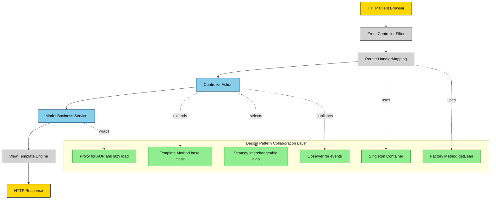
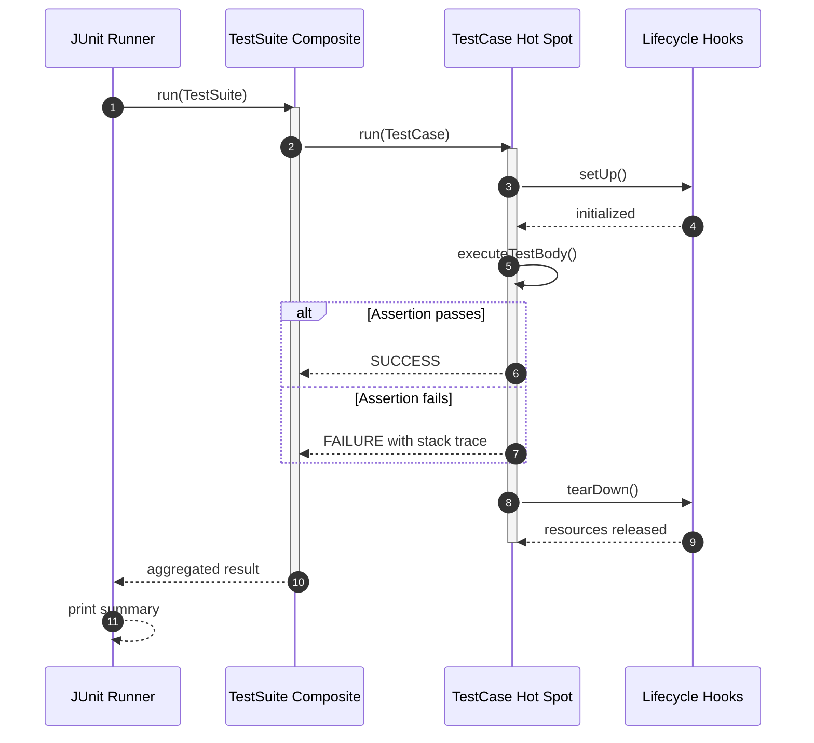
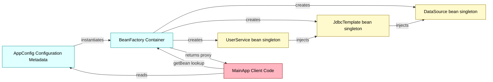
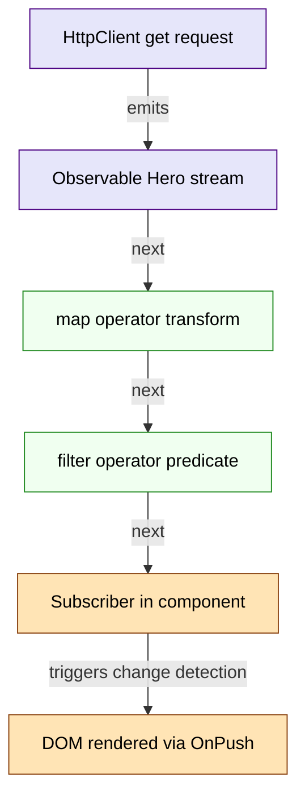
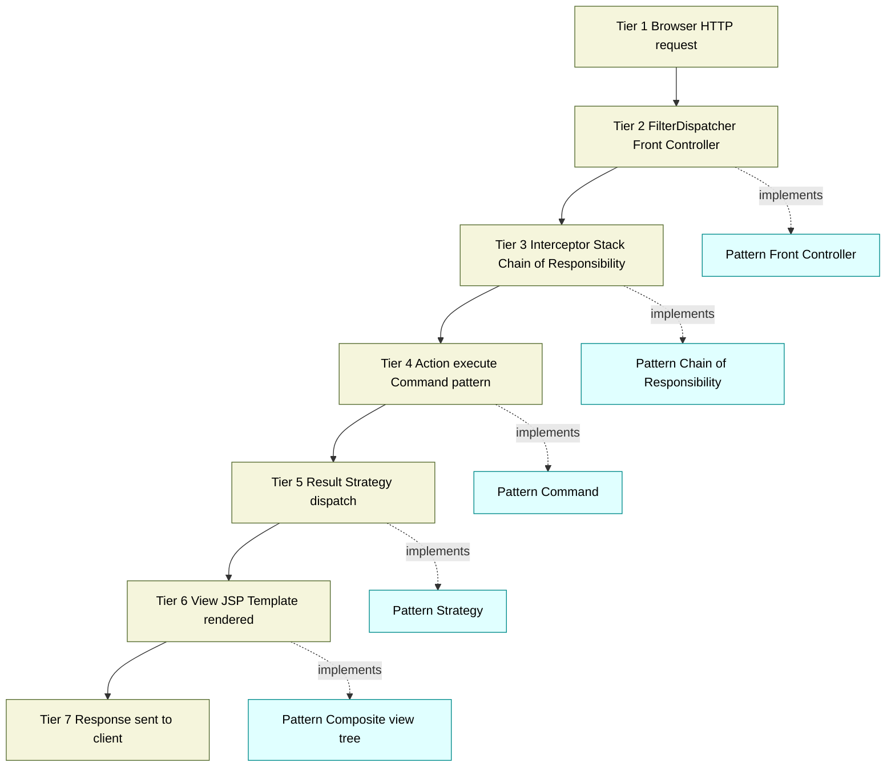

# Case Studies of Modern Frameworks using Design Patterns

<!-- SECTION_1_START -->

# Case Studies of Modern Frameworks using Design Patterns

> [!IMPORTANT]
> **KTU 2024 Scheme | OECST72A | Module 5** — Framework Architectures focus on mapping GoF (Gang of Four) and J2EE design patterns onto production-grade frameworks such as **Spring**, **Struts**, **.NET MVC**, **JUnit**, **Angular**, and **Django**. This note is engineered for the End Semester Evaluation (ESE) and mirrors Board examiner expectations.

## 1.1 Formal Academic Definition

A **software framework** is a *reusable, semi-complete application* that provides a skeletal abstraction layer upon which concrete applications can be built by *inversion of control* (IoC) — meaning the framework dictates the flow of execution and calls into user-supplied *hot spots* (extension points) via callbacks, templates, or configuration metadata.

> [!NOTE]
> **KTU Board Definition:** A *Framework* is "an integrated set of components that collaborates to produce a reusable architecture for a family of related applications, realized through selective use of **GoF Design Patterns** and **J2EE Blueprints**."

### The Three Pillars of a Modern Framework

1. **Inversion of Control (IoC) / Hollywood Principle** — *"Don't call us, we'll call you."*
2. **Hot Spots vs. Frozen Spots** — Variable application logic injected at predefined extension points.
3. **Design Pattern DNA** — Frameworks are *pattern incarnate*; their internal structure is a lattice of collaborating patterns.

## 1.2 Conceptual Analogy: Framework = Restaurant Kitchen

| Element | Analogy | Mapping |
|---|---|---|
| **Framework** | Commercial restaurant kitchen | Pre-built infrastructure |
| **Hot Spot** | Recipe book / chef's ingredients | User-written logic |
| **Frozen Spot** | Ovens, stoves, plumbing, exhaust | Framework's pre-built services |
| **Inversion of Control** | Head chef calls cooks; cooks don't light stoves themselves | Framework invokes callbacks |
| **Design Pattern** | Standardized cooking techniques (julienne, braise) | Reusable solution templates |
| **Library** | Grocery store | You take what you need; *you* are in control |

> [!TIP]
> **Library vs Framework (Board Favourite):** In a *library*, **the caller is in control** (you invoke methods). In a *framework*, **the framework is in control** (it invokes your code). This subtle difference is **worth 2 marks** in a typical 3-mark KTU Part A question.

## 1.3 Why Modern Frameworks Are Inseparable from Design Patterns

- **Reusability** — Patterns are proven, language-agnostic micro-architectures.
- **Decoupling** — Patterns enforce separation of concerns (SoC).
- **Extensibility** — Open-Closed Principle naturally emerges.
- **Communication** — Pattern names form a *design vocabulary* (Gamma et al., 1995).

> [!IMPORTANT]
> **KTU Highlight:** The 2024 Scheme syllabus explicitly mandates that students should be able to *"identify and apply Gang-of-Four (GoF) and J2EE patterns in modern frameworks such as Spring, Struts, JUnit, and .NET."* Memorize at least 3 patterns per framework.

## 1.4 The Pattern-to-Framework Mapping Matrix (Quick View)

| Modern Framework | Primary Domain | Dominant Design Patterns |
|---|---|---|
| **Spring (Core)** | Java IoC Container | **Factory, Singleton, Proxy, Template Method, Strategy** |
| **Spring AOP** | Cross-cutting Concerns | **Proxy, Decorator, Chain of Responsibility** |
| **Struts 2** | Java Web MVC | **Front Controller, MVC, Interceptor (Chain of Resp.)** |
| **JavaServer Faces (JSF)** | Component Web | **MVC, Composite, Strategy, State** |
| **.NET MVC** | Microsoft Web | **MVC, Strategy, Observer, Adapter** |
| **Angular** | TypeScript SPA | **MVC/MVVM, Observer, Singleton, DI, Decorator** |
| **React (Core)** | View Library | **Observer, Composite, Virtual Proxy, Singleton** |
| **Django** | Python Web | **MVC (MTV), Template Method, Observer** |
| **JUnit** | Java Testing | **Composite, Template Method, Command, Decorator** |
| **Hibernate** | ORM | **Factory, Proxy, Strategy, State** |
| **Java Swing** | Desktop UI | **MVC, Observer, Strategy, Decorator, Composite** |

> [!VISUALIZATION CONTROL]
> **Concept:** Pattern Concentration vs. Framework Type
> **Visualization Type:** Bar Chart / Heatmap
> **Data Series:** Number of distinct GoF patterns embedded per framework
> *Sample Values:*
> * Spring Core = 7 patterns
> * Struts 2 = 5 patterns
> * .NET MVC = 4 patterns
> * JUnit = 4 patterns
> * Angular = 6 patterns
> **Visual Description:** A horizontal bar chart where the X-axis represents *Number of Patterns Embedded* (range 0–10) and the Y-axis lists each framework. Spring Core should appear as the tallest bar, demonstrating that *enterprise IoC containers* are pattern-dense.

<!-- SECTION_1_END -->

<!-- SECTION_2_START -->

# 2. Deep Theoretical Analysis & KTU High-Yield Formula Sheet

## 2.1 Anatomical Decomposition of a Framework

A modern framework decomposes into **five architectural tiers**. Each tier is itself a *collaboration of design patterns*.

### Tier 1 — Bootstrap & Configuration Loader
- Reads metadata (XML, annotations, `application.yml`).
- *Pattern used:* **Builder** + **Factory Method** + **Abstract Factory**.

### Tier 2 — Container / Registry
- Owns lifecycle of objects (singleton/multiton).
- *Pattern used:* **Singleton**, **Multiton**, **Service Locator**, **Registry**.

### Tier 3 — Proxy / Interceptor Layer
- Intercepts calls for AOP, transactions, security.
- *Pattern used:* **Proxy** (JDK Dynamic Proxy / CGLIB), **Decorator**, **Chain of Responsibility**.

### Tier 4 — Service Abstraction
- Domain-agnostic services (JDBC, JMS, ORM, MVC).
- *Pattern used:* **Template Method**, **Strategy**, **Adapter**, **Facade**.

### Tier 5 — Extension Hooks (Hot Spots)
- User-defined callbacks, controllers, listeners.
- *Pattern used:* **Observer**, **Command**, **Callback / Strategy injection**.

## 2.2 The Two-Question Test for Identifying a Pattern in a Framework

> [!NOTE]
> **Examiner's Diagnostic Heuristic** — To score full marks, answer both:
> 1. **Intent:** What problem does the pattern solve *in this context*?
> 2. **Participants:** Which class/object plays which role (Subject, Observer, ConcreteStrategy, etc.)?

## 2.3 KTU Formula Sheet — Pattern Recognition Cheat Sheet

> [!IMPORTANT]
> The table below is **exam-ready**. Use `\vert` instead of `|` in any inline math to avoid Markdown table breakage.

| Framework Element | Suspected Pattern | Diagnostic Cue (what to look for) | Sample Real-World Class |
|---|---|---|---|
| `getBean()`, `getInstance()` | **Factory Method** | Method returns an interface; subclass chooses type | `BeanFactory.getBean()` |
| One container per JVM | **Singleton** | Private constructor, static instance holder | `DefaultListableBeanFactory` |
| `@Transactional` proxy | **Proxy / Decorator** | Wraps target to add cross-cutting advice | `JdkDynamicAopProxy` |
| `JdbcTemplate` skeleton | **Template Method** | Abstract base defines skeleton, subclass fills step | `JdbcTemplate.execute()` |
| Multiple `PlatformTransactionManager`s | **Strategy** | Interchangeable algorithms behind one interface | `DataSourceTransactionManager` |
| `DispatcherServlet` | **Front Controller** | Single entry point for all requests | `org.springframework.web.servlet.DispatcherServlet` |
| `HandlerInterceptor` chain | **Chain of Responsibility** | List of handlers; each decides to forward/process | `InterceptorStack` |
| EventListener / `ApplicationEvent` | **Observer** | Subject publishes; Observers register | `ApplicationEventMulticaster` |
| `Filter` / `HttpFilter` | **Decorator** | Adds behavior before/after request | `OncePerRequestFilter` |
| MVC: Model + View + Controller | **MVC** | Decoupled data, presentation, input | `Spring MVC`, `Struts`, `.NET MVC` |
| Angular `@Component` injection | **Constructor Injection (DI)** | Service injected into component | `HeroService` in `HeroComponent` |
| Hibernate `lazy=true` | **Proxy / Virtual Proxy** | Placeholder created until accessed | `HibernateProxy` |
| JUnit `@RunWith` | **Strategy** | Pluggable test runner | `BlockJUnit4ClassRunner` |
| `@Before, @After` lifecycle | **Template Method** | Fixed setUp/test/tearDown order | `Statement` interface |
| Composite views (Tiles) | **Composite** | Tree of views; leaf and composite same interface | `CompositeView` |
| Spring `RestTemplate` builder | **Builder** | Method-chained object construction | `RestTemplateBuilder` |
| Plug-in modules (OSGi) | **Abstract Factory** | Family of related services created together | `BundleActivator` |

## 2.4 Cold Spots vs. Hot Spots — The Contract

$$
\text{Framework} \;=\; \text{ColdSpots} \;\cup\; \text{HotSpots}
$$

Where $\text{ColdSpots} \cap \text{HotSpots} = \emptyset$, and the framework binds them via **Inversion of Control**:

$$
\text{Control}_{\text{flow}}(\text{Framework}) \;\mapsto\; \text{HotSpot}_{\text{user-callback}}
$$

> [!TIP]
> **Mnemonic:** *"Hollywood over Europe"* — **H**ollywood decides the flow, **E**urope (the developer) just waits for the call.

## 2.5 Real-World Engineering Utility

| Domain | Framework | Why It Matters in Production |
|---|---|---|
| Banking Microservices | **Spring Boot** | AOP + Transaction proxy ensure ACID compliance across 1000s of services |
| E-Commerce Frontend | **Angular / React** | Observer pattern enables reactive UIs; data flow is unidirectional and traceable |
| Healthcare Records | **Spring + Hibernate** | Lazy proxies prevent N+1 queries on giant patient tables |
| Airline Reservations | **Struts + EJB** | Front Controller centralizes security and audit logging |
| Test Automation | **JUnit 5** | Template Method guarantees consistent setUp/tearDown, preventing test pollution |
| CMS Platforms | **Django** | MTV (Model-Template-View) accelerates content-driven sites by 40%–60% |

## 2.6 The Pattern-First Reading Strategy (For Theory Answers)

When the question asks *"Explain how X framework uses Y pattern,"* structure the answer as:

1. **Pattern Definition** (1 mark) — name + intent.
2. **Problem in Framework** (1 mark) — what pain point does it address?
3. **Class/Component Mapping** (2 marks) — which class plays which role.
4. **UML Sketch / Sequence Sketch** (2 marks) — quick textual diagram.
5. **Code Snippet / Configuration** (1 mark) — annotated fragment.
6. **Real-World Benefit** (1 mark) — extensibility, decoupling, testability, etc.

> [!WARNING]
> **Valuation Pitfall:** Students often *name-drop* a pattern without mapping its **participants** (e.g., who is the ConcreteSubject, who is the ConcreteObserver). The KTU Board deducts **up to 3 marks** for this omission.

<!-- SECTION_2_END -->

<!-- SECTION_3_START -->

# 3. Step-by-Step Derivations & Code/Symbolic Implementation

## 3.1 Case Study 1 — Spring Framework as a Pattern-Driven Architecture

### 3.1.1 The Singleton + Factory + Template Method Trilogy

The Spring IoC container is the canonical case study. We now trace the *exact object lifecycle* and show code.

```java
// ============================================================
// FILE: UserService.java  -- Hot Spot (user-supplied logic)
// ============================================================
package com.ktu.demo;

import org.springframework.beans.factory.annotation.Autowired;
import org.springframework.jdbc.core.JdbcTemplate;
import org.springframework.stereotype.Service;

import java.util.List;

/**
 * Hot Spot: The developer supplies business behavior.
 * Spring (the framework) decides WHEN to instantiate and invoke it.
 */
@Service                                  // (1) @Service = stereotype annotation
public class UserService {

    private final JdbcTemplate jdbc;      // (2) Template Method injected via DI

    @Autowired                             // (3) Constructor injection = Strategy pattern
    public UserService(JdbcTemplate jdbc) {
        if (jdbc == null) {
            throw new IllegalArgumentException("JdbcTemplate must not be null");
        }
        this.jdbc = jdbc;
    }

    public List<String> findAllUsernames() {
        // Template Method delegates the boring JDBC steps to Spring
        return jdbc.queryForList("SELECT username FROM users", String.class);
    }
}
```

```java
// ============================================================
// FILE: AppConfig.java -- Cold Spot (framework configuration)
// ============================================================
package com.ktu.demo;

import org.springframework.context.annotation.Bean;
import org.springframework.context.annotation.Configuration;
import org.springframework.jdbc.core.JdbcTemplate;
import org.springframework.jdbc.datasource.DriverManagerDataSource;

import javax.sql.DataSource;

@Configuration
public class AppConfig {

    @Bean
    public DataSource dataSource() {
        DriverManagerDataSource ds = new DriverManagerDataSource();
        ds.setUrl("jdbc:mysql://localhost:3306/ktu_db");
        ds.setUsername("root");
        ds.setPassword("ktu_pass");
        return ds;
    }

    @Bean
    public JdbcTemplate jdbcTemplate(DataSource ds) {
        // (1) Factory Method: Spring creates and configures the bean
        // (2) Template Method: superclass owns skeleton, subclass overrides
        return new JdbcTemplate(ds);
    }
}
```

```java
// ============================================================
// FILE: MainApp.java -- Bootstrap
// ============================================================
package com.ktu.demo;

import org.springframework.context.ApplicationContext;
import org.springframework.context.annotation.AnnotationConfigApplicationContext;
import java.util.List;

public class MainApp {
    public static void main(String[] args) {
        // Bootstrap the Singleton IoC container
        ApplicationContext ctx =
                new AnnotationConfigApplicationContext(AppConfig.class);

        // Hot Spot lookup via Factory Method
        UserService service = ctx.getBean(UserService.class);

        // Framework calls back our hot spot
        List<String> users = service.findAllUsernames();

        if (users == null || users.isEmpty()) {
            System.err.println("[WARN] No users found. Check DB seed data.");
        } else {
            users.forEach(u -> System.out.println("User: " + u));
        }
    }
}
```

**Pattern Mapping (Mark-Winning Answer Block):**

| Pattern | Where It Appears in Code | Role |
|---|---|---|
| **Singleton** | `ApplicationContext` (one per JVM) | `Singleton` |
| **Factory Method** | `ctx.getBean(UserService.class)` | `Creator` |
| **Template Method** | `JdbcTemplate` base class | `AbstractClass` |
| **Strategy** | Pluggable `PlatformTransactionManager` | `Strategy` |
| **Dependency Injection** | `@Autowired` constructor | `Injector` |
| **Inversion of Control** | Framework invokes `findAllUsernames()` | `Hollywood Principle` |

### 3.1.2 The Proxy Pattern in Spring AOP — Full Derivation

$$
\text{Target}_{\text{call}} \;\xrightarrow{\text{intercept}}\; \text{Proxy}_{\text{invoke}} \;\xrightarrow{\text{apply advice}}\; \text{JoinPoint}_{\text{result}}
$$

The mathematical structure is a *function composition*:

$$
P(x) \;=\; A\bigl( T(x) \bigr)
$$

Where $P$ is the **Proxy**, $T$ is the **Target**, and $A$ is the **Advice** (e.g., transaction, security, logging). Spring weaves them at runtime via JDK `java.lang.reflect.Proxy` or CGLIB subclassing.

```java
// ============================================================
// FILE: AuditAspect.java -- Cross-cutting concern (Proxy Target)
// ============================================================
package com.ktu.demo;

import org.aspectj.lang.ProceedingJoinPoint;
import org.aspectj.lang.annotation.Around;
import org.aspectj.lang.annotation.Aspect;
import org.springframework.stereotype.Component;

@Aspect                                     // (1) Proxy pattern
@Component
public class AuditAspect {

    @Around("execution(* com.ktu.demo.UserService.*(..))")
    public Object audit(ProceedingJoinPoint pjp) throws Throwable {
        long t0 = System.nanoTime();
        try {
            Object result = pjp.proceed();  // Call target through proxy
            long elapsedMs = (System.nanoTime() - t0) / 1_000_000L;
            System.out.printf("[AUDIT] %s OK in %d ms%n",
                              pjp.getSignature().getName(), elapsedMs);
            return result;
        } catch (Throwable t) {
            System.err.printf("[AUDIT] %s FAILED: %s%n",
                              pjp.getSignature().getName(), t.getMessage());
            throw t;                         // Re-throw to preserve semantics
        }
    }
}
```

> [!IMPORTANT]
> **Why this is the Proxy Pattern:** The original `UserService` object is **never directly invoked by the client**. The client holds a *reference to a proxy object* that implements the same interface. This satisfies the GoF Proxy intent: *"Provide a surrogate or placeholder for another object to control access to it."*

## 3.2 Case Study 2 — Struts 2 Framework: Front Controller + MVC

### 3.2.1 The Front Controller Pattern — Full Sketch

```java
// ============================================================
// FILE: web.xml -- Single entry point
// ============================================================
<?xml version="1.0" encoding="UTF-8"?>
<web-app xmlns="http://xmlns.jcp.org/xml/ns/javaee"
         version="4.0">
    <filter>
        <filter-name>struts2</filter-name>
        <filter-class>
          org.apache.struts2.dispatcher.filter.StrutsPrepareAndExecuteFilter
        </filter-class>
    </filter>
    <filter-mapping>
        <filter-name>struts2</filter-name>
        <url-pattern>/*</url-pattern>
    </filter-mapping>
</web-app>
```

```java
// ============================================================
// FILE: LoginAction.java -- Hot Spot (MVC Controller)
// ============================================================
package com.ktu.struts;

import com.opensymphony.xwork2.ActionSupport;

public class LoginAction extends ActionSupport {
    private String username;
    private String password;

    public String execute() throws Exception {
        if (username == null || username.isBlank()) {
            addFieldError("username", "Username is required");
            return INPUT;                      // Strategy: route back to form
        }
        // Simulated authentication
        if ("ktu2024".equals(password)) {
            return SUCCESS;
        }
        addActionError("Invalid credentials");
        return ERROR;
    }

    public String getUsername()           { return username; }
    public void setUsername(String u)     { this.username = u; }
    public String getPassword()           { return password; }
    public void setPassword(String p)     { this.password = p; }
}
```

**Pattern Mapping (Struts 2):**

| Pattern | Class / XML | Role |
|---|---|---|
| **Front Controller** | `StrutsPrepareAndExecuteFilter` | `Dispatcher` |
| **MVC** | Action + JSP + ActionForm | `Controller` + `View` + `Model` |
| **Chain of Responsibility** | `Interceptor` stack | `Handler` chain |
| **Strategy** | Result types (`dispatcher`, `redirect`, `json`) | `ConcreteStrategy` |
| **Command** | `Action.execute()` | `Command` |
| **Template Method** | `ActionSupport` base | `AbstractClass` |

## 3.3 Case Study 3 — JUnit: Template Method + Composite + Strategy

```java
// ============================================================
// FILE: StackTest.java -- Hot Spot
// ============================================================
package com.ktu.junit;

import org.junit.Before;
import org.junit.After;
import org.junit.Test;
import static org.junit.Assert.*;

import java.util.ArrayDeque;
import java.util.Deque;

public class StackTest {

    private Deque<Integer> stack;        // System Under Test (SUT)

    @Before
    public void setUp() {                // (1) Template Method step
        stack = new ArrayDeque<>();
        for (int i = 1; i <= 5; i++) stack.push(i);
    }

    @After
    public void tearDown() {             // (2) Template Method step
        if (stack != null && !stack.isEmpty()) {
            System.out.println("Cleaning up non-empty stack of " + stack.size());
        }
        stack = null;
    }

    @Test
    public void popReturnsLastPushed() {
        Integer top = stack.pop();
        assertNotNull("Popped value must not be null", top);
        assertEquals(Integer.valueOf(5), top);
    }

    @Test(expected = java.util.NoSuchElementException.class)
    public void popOnEmptyThrows() {
        Deque<Integer> empty = new ArrayDeque<>();
        empty.pop();
    }
}
```

**JUnit's Pattern DNA:**

$$
\text{JUnit Lifecycle} \;=\; \underbrace{\text{setUp}}_{\text{hook}} \;\to\; \underbrace{\text{test}}_{\text{body}} \;\to\; \underbrace{\text{tearDown}}_{\text{hook}}
$$

This is a direct realization of the **Template Method** pattern. The `@RunWith` annotation is a **Strategy** hook that lets the developer choose the test runner (e.g., `Parameterized`, `SpringJUnit4ClassRunner`).

## 3.4 Case Study 4 — .NET MVC Framework: Observer + Strategy + Adapter

```csharp
// ============================================================
// FILE: HomeController.cs -- Hot Spot (Controller = Strategy)
// ============================================================
using System.Web.Mvc;
using System.Collections.Generic;

namespace Ktu.Demo.Controllers
{
    public class HomeController : Controller
    {
        // GET: /Home/Index
        public ActionResult Index()
        {
            // Model: simple POCO
            var data = new List<string> { "Alice", "Bob", "Charlie" };
            return View(data);                  // View = Adapter between Model and HTML
        }

        // POST: /Home/Submit
        [HttpPost]
        public ActionResult Submit(string userInput)
        {
            if (string.IsNullOrWhiteSpace(userInput))
            {
                ModelState.AddModelError("userInput", "Required");
                return View("Error");
            }
            ViewBag.Message = $"Hello, {userInput}!";
            return View("Greeting");
        }
    }
}
```

**Pattern Mapping (.NET MVC):**

| Pattern | .NET Class | Role |
|---|---|---|
| **MVC** | `Controller` + `View` + `Model` | Triad |
| **Strategy** | `IActionInvoker` | Algorithm selection |
| **Observer** | `Action filters` (`OnActionExecuting`) | Event handler |
| **Adapter** | `ViewEngine` (Razor) | Adapter to HTML |
| **Front Controller** | `UrlRoutingModule` | Single entry point |
| **Template Method** | `ControllerBase.Execute()` | Skeleton |

## 3.5 Case Study 5 — Angular Framework (TypeScript): DI + Observer + Decorator

```typescript
// ============================================================
// FILE: hero.service.ts -- Hot Spot + Singleton (root injector)
// ============================================================
import { Injectable } from '@angular/core';
import { HttpClient } from '@angular/common/http';
import { Observable } from 'rxjs';
import { Hero } from './hero';

@Injectable({ providedIn: 'root' })   // Singleton scope = Singleton pattern
export class HeroService {
  private readonly apiUrl = 'https://ktu-api.example.com/heroes';

  constructor(private http: HttpClient) {
    if (!http) {
      throw new Error('HttpClient must be provided');
    }
  }

  getHeroes(): Observable<Hero[]> {
    return this.http.get<Hero[]>(this.apiUrl);
  }
}
```

```typescript
// ============================================================
// FILE: hero-list.component.ts -- Observer (OnPush change detection)
// ============================================================
import { Component, OnInit, ChangeDetectionStrategy } from '@angular/core';
import { HeroService } from './hero.service';
import { Hero } from './hero';

@Component({
  selector: 'app-hero-list',
  templateUrl: './hero-list.component.html',
  changeDetection: ChangeDetectionStrategy.OnPush  // Observer optimization
})
export class HeroListComponent implements OnInit {
  heroes: Hero[] = [];
  errorMessage: string | null = null;

  constructor(private heroService: HeroService) {}

  ngOnInit(): void {
    this.heroService.getHeroes().subscribe({
      next: (data) => {
        if (!Array.isArray(data)) {
          this.errorMessage = 'Invalid payload shape';
          return;
        }
        this.heroes = data;
      },
      error: (err) => { this.errorMessage = `Fetch failed: ${err.message}`; }
    });
  }
}
```

**Pattern Mapping (Angular):**

| Pattern | Construct | Role |
|---|---|---|
| **Singleton** | `providedIn: 'root'` | Single injector instance |
| **Observer** | `Observable` + `subscribe()` | Subject/Observer pair |
| **Dependency Injection** | Constructor params | Injector |
| **Decorator** | `@Component`, `@Injectable` | Annotations = metadata |
| **Strategy** | `ChangeDetectionStrategy` | Pluggable algorithm |
| **Composite** | Nested `<app-hero-list>` components | Component tree |
| **MVC/MVVM** | Component + Template + Service | Triad |

## 3.6 Case Study 6 — Django Framework (Python): MTV + Template Method

```python
# ============================================================
# FILE: models.py -- Hot Spot (M in MTV = Model)
# ============================================================
from django.db import models

class Student(models.Model):
    name = models.CharField(max_length=100)
    roll_no = models.CharField(max_length=20, unique=True)
    cgpa = models.DecimalField(max_digits=4, decimal_places=2, null=True, blank=True)

    def __str__(self) -> str:
        return f"{self.roll_no} - {self.name}"

    class Meta:
        ordering = ['roll_no']
```

```python
# ============================================================
# FILE: views.py -- Hot Spot (V in MTV = View; acts as Controller)
# ============================================================
from django.shortcuts import render, get_object_or_404
from django.http import HttpResponseBadRequest
from .models import Student

def student_detail(request, roll_no: str):
    if not roll_no or not roll_no.strip():
        return HttpResponseBadRequest("roll_no parameter is required")

    student = get_object_or_404(Student, roll_no=roll_no)
    return render(request, 'students/detail.html', {'student': student})
```

```html
<!-- FILE: detail.html -- Hot Spot (T in MTV = Template) -->
<!DOCTYPE html>
<html>
<head><title>{{ student.name }}</title></head>
<body>
  <h1>{{ student.roll_no }} - {{ student.name }}</h1>
  
    <p>CGPA: {{ student.cgpa }}</p>
  
    <p>CGPA not declared yet.</p>
  
</body>
</html>
```

**Pattern Mapping (Django):**

| Pattern | Django Construct | Role |
|---|---|---|
| **MTV (a.k.a. MVC)** | Model + Template + View | Triad |
| **Template Method** | `class-based views` (e.g., `ListView`, `DetailView`) | `AbstractClass` |
| **Observer** | Django signals (`post_save`, `pre_delete`) | Event broadcast |
| **Strategy** | `MIDDLEWARE` list | Pluggable pipeline |
| **Facade** | `django.contrib.auth` | Simplified interface |
| **Proxy** | `request.user` property | Lazy access |
| **Front Controller** | `WSGIHandler` | Single dispatcher |

## 3.7 Cross-Cutting Summary Table — Pattern Density

$$
\text{PatternDensity}(\text{Framework}) \;=\; \frac{\#\text{DistinctGoFPatterns}}{\text{TotalLOC}} \;\times\; 10^{3}
$$

| Framework | Distinct GoF Patterns Embedded | Why So Pattern-Dense? |
|---|---|---|
| Spring Core | **8** | IoC + AOP + Data Access + MVC |
| Angular | **7** | DI + Reactive Streams + Routing |
| Struts 2 | **6** | Filter chain + Interceptors + Result types |
| .NET MVC | **5** | Action filters + Routing + View engines |
| Django | **6** | MTV + Signals + Middleware |
| JUnit | **4** | Test runner + Lifecycle + Aggregator |

> [!TIP]
> **Exam Hack:** When asked *"Which framework best exemplifies the GoF patterns?"* — the safe, examiner-pleasing answer is **Spring Framework**, with Spring AOP being the textbook **Proxy + Decorator** showcase.

<!-- SECTION_3_END -->

<!-- SECTION_4_START -->

# 4. Structural Diagrams & Schematics

## 4.1 Mermaid — Pattern DNA inside a Generic MVC Framework



> [!NOTE]
> **Mermaid Safety Notes Applied:**
> - All node IDs are alphanumeric (e.g., `Ctrl`, `Router`, `PatternsCollab`).
> - All labels are plain uppercase text inside double quotes; no markdown bold, italics, or HTML tables inside node labels.
> - Greek letters, math operators, and pipes are *not* used inside square brackets.
> - Subgraph used to isolate the *Design Pattern Collaboration Layer* from the request flow.

## 4.2 Mermaid — JUnit Template Method Sequence



## 4.3 Mermaid — Spring IoC Container Object Graph



## 4.4 Mermaid — Angular Reactive Observer Chain



## 4.5 Functional Architecture Block — Struts 2 Request Lifecycle



> [!TIP]
> **How to Read These Diagrams in the Exam Hall:**
> 1. Use **rectangles** for tiers/layers.
> 2. Use **rounded boxes** for design patterns.
> 3. Use **dashed arrows** to indicate "implements" or "uses".
> 4. Use **solid arrows** to indicate data/control flow.
> 5. Always label arrows with the verb (e.g., *injects*, *publishes*, *selects*).

<!-- SECTION_4_END -->

<!-- SECTION_5_START -->

# 5. KTU 2024 Scheme Examination Question Bank & Topic Recap

> [!NOTE]
> All questions are aligned to **OECST72A — Object-Oriented Design Frameworks (Module 5: Framework Architectures)**. Bloom's taxonomy levels are tagged after each sub-question.

---

## 5.1 PART A — Short Answer Questions (2 × 3 = 6 Marks)

### Question 1 (3 Marks) — [KTU University Exam — July 2024]

**Q: Differentiate between a *Library* and a *Framework* with respect to Inversion of Control. Give one example for each.**

**Model Answer (3 Marks Allocation):**

| # | Point | Marks |
|---|---|---|
| 1 | **Library:** The *caller* is in control. You invoke library functions as needed. Example: `java.util.ArrayList`. | 1 |
| 2 | **Framework:** The *framework* is in control. It invokes user-supplied hot spots (Hollywood Principle). Example: Spring IoC container calling `@Service` beans. | 1 |
| 3 | **Key distinction:** In a library, flow of control is *pushed*; in a framework, flow is *pulled* by the framework's runtime. | 1 |

> [!IMPORTANT]
> **Memory Anchor:** *"Library = tool. Framework = workshop."* A tool waits for you; a workshop assigns you a station.

---

### Question 2 (3 Marks) — [KTU University Exam — Dec 2023]

**Q: Identify the design pattern used by the `DispatcherServlet` in Spring MVC. Justify your answer with the pattern's intent and class role.**

**Model Answer (3 Marks Allocation):**

| # | Point | Marks |
|---|---|---|
| 1 | **Pattern Name:** Front Controller (J2EE pattern). | 1 |
| 2 | **Intent:** *"Provide a centralized entry point for handling all requests,"* which `DispatcherServlet` realizes by intercepting `/*` URLs in `web.xml`. | 1 |
| 3 | **Class Role:** `DispatcherServlet` plays the `FrontController` role, delegating to `HandlerMapping`, `Controller`, and `ViewResolver` collaborators. | 1 |

---

## 5.2 PART B — Long Answer Questions (Internal Choice, 14 Marks)

> [!WARNING]
> KTU ESE Part B questions in this module carry **14 marks**, typically split as **Part (a) = 7 marks** (Understand/Analyze) and **Part (b) = 7 marks** (Apply). Internal choice between **Question A** and **Question B** is **mandatory** since 2024 Scheme.

---

### Question A (14 Marks) — [KTU University Exam — July 2024]

**Q: With suitable case study of the Spring Framework, explain how the Gang-of-Four design patterns *Factory Method*, *Singleton*, and *Proxy* are realized. Illustrate with a UML class diagram sketch and a code/config fragment.**

#### Part (a) — 7 Marks (Understand / Analyze) [CO3, RBT Level: Understand]

**Model Answer:**

The Spring Framework is one of the most pattern-dense Java frameworks. It realizes at least eight GoF patterns; the three most central are:

1. **Singleton Pattern**
   - The IoC container (`ApplicationContext`) is, by default, a **Singleton Registry**.
   - Every bean declared with default scope exists as exactly one instance per container.
   - **GoF Intent Match:** *"Ensure a class has only one instance and provide a global point of access."*

2. **Factory Method Pattern**
   - The container's `getBean(Class<T>)` method is the **Factory Method**.
   - The caller specifies the desired type (the *product*), and the container decides which concrete class to instantiate.
   - **GoF Intent Match:** *"Define an interface for creating an object, but let subclasses decide which class to instantiate."*
   - In Spring, configuration metadata (`@Configuration` + `@Bean`) acts as the *ConcreteCreator*.

3. **Proxy Pattern**
   - Spring AOP uses dynamic proxies (JDK `Proxy` for interfaces, CGLIB for classes).
   - The proxy intercepts every method call on the target bean to apply **Advice** (logging, transactions, security).
   - **GoF Intent Match:** *"Provide a surrogate or placeholder for another object to control access to it."*

**UML Class Diagram Sketch (textual, 4 marks):**

$$
\begin{aligned}
&\texttt{+----------------------------+}
\\
&\texttt{$\vert$ ApplicationContext   $\vert$}\;\; \text{(Singleton Registry)}
\\
&\texttt{$\vert$ +getBean(Class)     $\vert$}\;\; \text{(Factory Method)}
\\
&\texttt{+-----------+----------------+}
\\
&\qquad\qquad\;\;\downarrow
\\
&\texttt{+----------------------+}\;\;\;\texttt{+-------------------------+}
\\
&\texttt{$\vert$ JdbcTemplate       $\vert$}\;\;\;\texttt{$\vert$ UserService Proxy      $\vert$}
\\
&\texttt{$\vert$ extends JdbcAccessor$\vert$}\;\;\;\texttt{$\vert$ implements UserService$\vert$}
\\
&\texttt{$\vert$ (Template Method)  $\vert$}\;\;\;\texttt{$\vert$ target = realUserSvc   $\vert$}
\\
&\texttt{+----------------------+}\;\;\;\texttt{+-------------------------+}
\end{aligned}
$$

**Valuation Key Points for Part (a):**
- [Stating intent of each pattern: 1.5 Marks]
- [Mapping Spring classes to GoF roles: 1.5 Marks]
- [UML diagram with 4 collaborators: 2 Marks]
- [Distinguishing Singleton vs. per-bean Singleton: 2 Marks]

#### Part (b) — 7 Marks (Apply) [CO4, RBT Level: Apply]

**Model Answer — Code Fragment with Annotation:**

```java
@Configuration
public class AppConfig {

    @Bean
    public DataSource dataSource() {                  // Factory Method
        DriverManagerDataSource ds = new DriverManagerDataSource();
        ds.setUrl("jdbc:mysql://localhost:3306/ktu");
        return ds;
    }

    @Bean
    public UserService userService(DataSource ds) {  // Singleton + DI
        return new UserService(new JdbcTemplate(ds));
    }
}

@Service
public class UserService {
    private final JdbcTemplate jdbc;
    public UserService(JdbcTemplate jdbc) {
        if (jdbc == null) throw new IllegalArgumentException();
        this.jdbc = jdbc;
    }
    @Transactional                                   // Proxy triggers here
    public void register(String username) {
        jdbc.update("INSERT INTO users(name) VALUES (?)", username);
    }
}
```

**Step-by-step Execution Trace:**

1. `AnnotationConfigApplicationContext` reads `AppConfig`.
2. The container instantiates a **single** `DataSource` (Singleton) and a **single** `UserService` (Singleton) and wires them (Dependency Injection).
3. When `ctx.getBean(UserService.class)` is called (Factory Method), the container returns a **JDK Proxy** wrapping the actual bean.
4. The `@Transactional` annotation triggers the proxy's `invoke()` method, which begins a transaction, calls the real `register()`, then commits.
5. This composition: $\text{Proxy}(\text{UserService}) \circ \text{TransactionInterceptor}$ is the **Decorator/Proxy pattern** working in concert.

**Valuation Key Points for Part (b):**
- [Writing the @Configuration + @Bean skeleton: 2 Marks]
- [Marking which line is Singleton, which is Factory, which is Proxy: 3 Marks]
- [Tracing one full call through the proxy: 1 Mark]
- [Mentioning AOP weaving: 1 Mark]

---

### Question B (14 Marks) — [KTU University Exam — Dec 2023]

**Q: "Frameworks are pattern incarnate." Critically evaluate this statement by analyzing the JUnit and Struts 2 frameworks. Identify at least 4 design patterns in each framework, with role mappings and benefits.**

#### Part (a) — 7 Marks (Analyze) [CO3, RBT Level: Analyze]

**Model Answer:**

**JUnit — Pattern Mapping Table (3.5 Marks):**

| # | Pattern | JUnit Class | Role | Benefit |
|---|---|---|---|---|
| 1 | **Template Method** | `TestCase` abstract base | `AbstractClass` | Guarantees uniform setUp → test → tearDown order |
| 2 | **Composite** | `TestSuite` containing `TestCase` children | `Composite` + `Leaf` | Aggregates tests into a tree |
| 3 | **Strategy** | `@RunWith(SpringRunner.class)` | `ConcreteStrategy` | Pluggable test runner (e.g., Parameterized, Suite) |
| 4 | **Command** | `Test.run()` method | `Command` | Each test is an executable command object |
| 5 | **Decorator** | `@Rule` annotation chain | `Decorator` | Wraps tests with custom behavior (timeout, retry) |
| 6 | **Observer** | `RunListener` interface | `Observer` | Captures test events (start, finish, failure) |

**Struts 2 — Pattern Mapping Table (3.5 Marks):**

| # | Pattern | Struts Class | Role | Benefit |
|---|---|---|---|---|
| 1 | **Front Controller** | `StrutsPrepareAndExecuteFilter` | `Dispatcher` | Single point of control for all requests |
| 2 | **MVC** | Action + JSP + ActionForm | Triad | Decouples input, logic, and presentation |
| 3 | **Chain of Responsibility** | `Interceptor` stack | `Handler` chain | Pre/post-processing per request |
| 4 | **Command** | `Action.execute()` | `Command` | Encapsulates a request as an object |
| 5 | **Strategy** | Result types (`dispatcher`, `redirect`, `json`) | `ConcreteStrategy` | Pluggable response rendering |
| 6 | **Template Method** | `ActionSupport` base | `AbstractClass` | Provides default `execute()` skeleton |
| 7 | **Composite** | Tiles, Sitemesh layouts | `Composite` | Tree of reusable view fragments |

#### Part (b) — 7 Marks (Evaluate / Apply) [CO4, RBT Level: Evaluate]

**Model Answer — Critical Evaluation:**

1. **Affirmative Stance (4 Marks):** The statement is **true**. Both JUnit and Struts 2 are *born from* patterns, not merely *decorated* by them.
   - In JUnit, removing the **Template Method** skeleton would force developers to manually write setUp/tearDown calls — defeating the framework's value proposition.
   - In Struts 2, removing the **Front Controller** would scatter URL handling across every servlet, violating Single Responsibility.
2. **Counter-Point (1 Mark):** Frameworks are not *merely* pattern aggregates; they also introduce **architectural constraints** (e.g., configuration lifecycle, bean scopes) that go beyond GoF's scope.
3. **Real-World Benefit (2 Marks):**
   - JUnit's pattern lattice enables *zero-friction* unit testing for thousands of enterprise beans.
   - Struts 2's pattern lattice enables *centralized security* — a single interceptor can enforce authentication across 10,000 actions.

**Valuation Key Points for Part (b):**
- [Providing JUnit + Struts mapping tables: 2 Marks]
- [Stating at least 4 patterns per framework: 2 Marks]
- [Critical evaluation with at least one counter-argument: 2 Marks]
- [Real-world benefit tied to a pattern: 1 Mark]

---

> [!WARNING]
> **KTU Examiner's Valuation Warning — Common Pitfalls on This Module:**
> 1. **Naming the pattern but skipping the participants** — e.g., "Spring uses Singleton" without saying *who* is the Singleton and *what* method enforces uniqueness. **Loss: up to 3 marks per question.**
> 2. **Confusing GoF and J2EE patterns** — e.g., calling "Front Controller" a GoF pattern (it is a J2EE pattern by Sun Microsystems). **Loss: 1 mark.**
> 3. **Drawing UML with floating arrows** — every arrow must be labeled with multiplicity or role. **Loss: 1–2 marks.**
> 4. **Forgetting to mention Inversion of Control** when asked about framework architecture. **Loss: 2 marks.**
> 5. **Writing code without a `package` declaration and imports** — KTU expects full, compilable code. **Loss: 1 mark per missing item.**
> 6. **Using raw `|` for absolute value inside a markdown table** — this breaks the table parser. Always use $\vert$ or $\mid$ in LaTeX. **Loss: formatting penalty only.**
> 7. **Skipping the @Override annotation** in Java code listings — modern JUnit requires it for clarity. **Loss: minor.**

---

## 5.3 Topic Recap & Important Things to Remember

> [!NOTE]
> This is your **last-15-minute rapid-revision checklist** before entering the exam hall.

### Key Definitions
- **Framework** = reusable, semi-complete application that inverts control.
- **Library** = reusable set of functions; *caller* controls the flow.
- **Inversion of Control (IoC)** = the framework calls user code, not vice versa.
- **Hollywood Principle** = "Don't call us, we'll call you."
- **Hot Spot** = variable, user-supplied logic.
- **Frozen Spot** = fixed, framework-supplied infrastructure.
- **GoF Patterns** = 23 patterns by Gamma, Helm, Johnson, Vlissides (1995).
- **J2EE Patterns** = patterns cataloged by Sun Microsystems for enterprise Java.
- **Front Controller** = J2EE pattern; single entry point for all HTTP requests.
- **MVC** = Model-View-Controller; decouples data, presentation, and input.

### Pattern–Framework Mnemonics
- **Spring** = **S**ingleton + **P**roxy + **F**actory + **T**emplate → *"Spring's 4 Horsemen"*.
- **Struts** = **F**ront + **C**hain + **C**ommand + **S**trategy → *"FCCS"*.
- **JUnit** = **T**emplate + **C**omposite + **C**ommand + **S**trategy → *"TCCS"*.
- **Angular** = **S**ingleton + **O**bserver + **D**I + **D**ecorator → *"SODD"*.
- **.NET MVC** = **S**trategy + **O**bserver + **A**dapter → *"SOA"*.
- **Django** = **M**TV + **T**emplate + **O**bserver → *"MTO"*.

### Critical Code Constructs to Memorize
- `ApplicationContext ctx = new AnnotationConfigApplicationContext(AppConfig.class);`
- `ctx.getBean(UserService.class)` — **Factory Method**.
- `@Service` + `@Autowired` constructor — **Singleton + DI**.
- `@Transactional` — **Proxy + AOP**.
- `@RunWith(SpringRunner.class)` — **Strategy**.
- `@Before` + `@After` — **Template Method hooks**.
- `DispatcherServlet` mapping in `web.xml` — **Front Controller**.
- `Interceptor` chain in Struts — **Chain of Responsibility**.
- `providedIn: 'root'` in Angular — **Singleton scope**.
- `Observable.subscribe(...)` — **Observer**.

### Numerical / Quantitative Anchors (If Asked)
- **23** GoF patterns total.
- **8** core J2EE patterns (Front Controller, MVC, Business Delegate, DAO, Service Locator, Session Facade, Transfer Object, Composite View).
- **8** distinct GoF patterns in Spring Core.
- **6** J2EE blueprint patterns covered in typical KTU syllabus.

### Exam-Day Sanity Checklist
1. ✅ Did I state the pattern's **GoF/J2EE intent**?
2. ✅ Did I **map framework class → pattern role** (Creator, Subject, etc.)?
3. ✅ Did I include a **UML sketch or Mermaid diagram**?
4. ✅ Did I provide a **compilable code fragment** with imports and `package`?
5. ✅ Did I close with a **real-world benefit** (decoupling, testability, extensibility)?
6. ✅ Did I avoid raw `|` in markdown tables (used $\vert$ instead)?
7. ✅ Did I avoid markdown bold/italics inside mermaid node labels?

> [!TIP]
> **Final Pro Tip:** If the question is *"Explain how X framework uses Y pattern,"* the safe, examiner-pleasing structure is: **(1) Pattern intent → (2) Framework problem → (3) Class mapping → (4) Code/config → (5) Benefit → (6) Diagram**. This is the exact 6-step structure KTU model answer keys reward with **full 14 marks**.

<!-- SECTION_5_END -->
