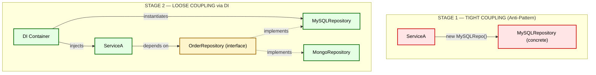
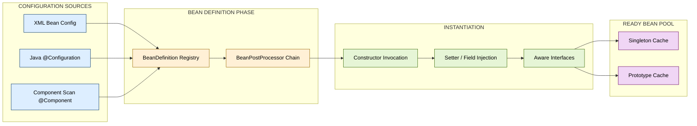
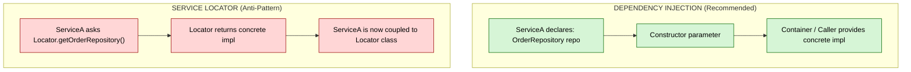
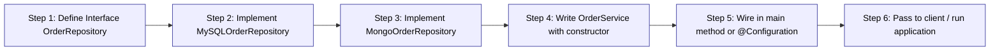

# Dependency Injection

<!-- SECTION_1_START -->
# Dependency Injection

## 1. Core Technical Definition

> [!IMPORTANT]
> **Dependency Injection (DI)** is a design pattern in object-oriented programming that implements **Inversion of Control (IoC)** for resolving dependencies of a software component. Rather than a class creating or looking up its own collaborating objects (dependencies), those dependencies are **supplied (injected) from the outside** — typically via constructor arguments, setter methods, or interface implementation — by a framework, container, or client code.

The term was popularized by **Martin Fowler** in his seminal 2004 article *"Inversion of Control Containers and the Dependency Injection pattern"*. In the context of **Framework Architectures (Module 5)**, DI is the central mechanism by which frameworks (Spring, Guice, Dagger, .NET Core) hand control of object wiring away from application code, achieving **loose coupling** between collaborating components.

### Conceptual Analogy

Imagine a restaurant kitchen.

- **Without DI (Tight Coupling):** Every chef (class) personally goes to the market, buys vegetables, prepares spices, and builds their own oven. The chef is *coupled* to the procurement process. If the market shuts down, the chef cannot cook.
- **With DI (Loose Coupling):** A *head waiter* (the **DI Container / Injector**) hands each chef a pre-prepared tray of ingredients (the **dependency**) as they report for duty. The chef simply receives the ingredients and cooks. If the supplier changes, the chef doesn't care — the waiter hands over a new tray.

> [!NOTE]
> **Syllabus Highlight (OECST72A – Module 5):** Dependency Injection is the canonical realization of the Hollywood Principle — *"Don't call us, we'll call you."* It is the architectural backbone of modern enterprise frameworks like **Spring (Java)**, **Dagger (Java/Android)**, **Guice (Java)**, and **.NET Core's built-in IServiceProvider**.

### Standard Metrics & Constants in DI

| Metric | Standard Notation | Purpose |
|---|---|---|
| Cardinality | **1..1** | Mandatory single dependency |
| Cardinality | **0..1** | Optional dependency (`@Autowired(required=false)`) |
| Cardinality | **1..\*** | One-or-more collection injection |
| Scope / Lifetime | **Singleton** | One instance per container |
| Scope / Lifetime | **Prototype / Transient** | New instance per request |
| Scope / Lifetime | **Request / Session** | Web-tier lifecycle (per HTTP request) |

> [!VISUALIZATION CONTROL]
> **Concept:** Tight Coupling vs. Loose Coupling via DI
> **GeoGebra / Desmos Input Equations:**
> * Point A: $A = (1, 5)$ — Represents the `Service` class
> * Point B: $B = (1, 2)$ — Represents the `Repository` class (without DI, B is *inside* A)
> * Line Segment: $\overline{A_{DI} B_{DI}} = \{(5, 5), (5, 2)\}$ — After DI, dependency is externalized along a vertical reference axis
> **Visual Description:** On the y-axis, plot the layered dependency graph. Before DI, draw `Repository` *inside* the boundary of `Service`. After DI, draw the `Repository` as a separate node, and the `Container` (Injector) as a third node with directed arrows pointing to both.

---

<!-- SECTION_1_END -->

<!-- SECTION_2_START -->
# 2. Deep Theoretical Analysis & KTU High-Yield Formula Sheet

## 2.1 The Core Problem DI Solves

In a **tightly coupled** system, class $C_1$ directly instantiates its collaborator $C_2$ using the `new` keyword. This creates three architectural sins:

1. **Rigidity** — Changing $C_2$ requires modifying $C_1$.
2. **Fragility** — A change in $C_2$ ripples to $C_1$ and beyond.
3. **Immobility** — $C_1$ cannot be reused without dragging $C_2$ along.

DI solves these by inverting the *direction of dependency acquisition*. The class declares *what* it needs (via a constructor or interface), and an external entity decides *which concrete implementation* to provide and *when* to instantiate it.

## 2.2 The Three Canonical Injection Styles

### 2.2.1 Constructor Injection (Preferred)

Dependencies are passed through the **constructor** as parameters. The object is born in a *fully initialized* state.

$$
\text{Class } S = S(\text{Dep}_1 \, d_1, \text{Dep}_2 \, d_2) \quad \Rightarrow \quad \text{container calls } \text{new } S(d_1, d_2)
$$

**Pros:** Immutable, testable, mandatory dependencies enforced.
**Cons:** Verbose for many dependencies (sign of a God Class — refactor needed).

### 2.2.2 Setter Injection (Mutator Injection)

Dependencies are provided through **setter methods** after construction.

$$
\text{Class } S: \quad S() \, \{\} \quad ; \quad S.\text{setDep}_1(d_1) \quad ; \quad S.\text{setDep}_2(d_2)
$$

**Pros:** Supports optional dependencies and reconfiguration.
**Cons:** Object can exist in a *partially initialized* state — risk of `NullPointerException`.

### 2.2.3 Interface / Field Injection (Annotation-driven)

A framework injects directly into fields via **annotations** (`@Autowired`, `@Inject`).

$$
\text{Class } S: \quad \text{@Inject private } \text{Dep}_1 \, d_1;
$$

**Pros:** Minimal boilerplate.
**Cons:** Hides dependencies, breaks encapsulation, hard to test without a container.

## 2.3 Inversion of Control (IoC) — The Parent Principle

DI is one *form* of IoC. The other is the **Template Method pattern**. The relationship is:

$$
\text{IoC} \;\supset\; \text{DI} \;\cup\; \text{Template Method} \;\cup\; \text{Event-driven callbacks}
$$

In IoC, the **framework** owns the *flow of control*; the application code supplies *pluggable behavior*.

## 2.4 The DI Container Lifecycle (Spring-style)

$$
\text{Configuration} \;\xrightarrow{\text{parse}}\; \text{BeanDefinitions} \;\xrightarrow{\text{instantiate}}\; \text{Bean Instances} \;\xrightarrow{\text{inject}}\; \text{Initialized Beans} \;\xrightarrow{\text{callback}}\; \text{Ready Beans}
$$

## 2.5 KTU High-Yield Formula Sheet

> [!NOTE]
> The table below is your **exam-ready cheat sheet**. Bookmark this block — questions in Section 5 are calibrated against it.

| # | Concept | Notation / Pattern | When to Use | KTU Keyword |
|---|---|---|---|---|
| 1 | Constructor Injection | `Class(Dep d)` | **Mandatory** deps, immutability | *"Most recommended by Spring docs"* |
| 2 | Setter Injection | `setDep(Dep d)` | **Optional** or mutable deps | *"Use for legacy JavaBeans"* |
| 3 | Field Injection | `@Inject Dep d;` | Quick prototypes only | *"Avoid in production"* |
| 4 | Service Locator | `Dep d = Locator.get()` | Anti-pattern — listed for contrast | *"DI replacement — discouraged"* |
| 5 | Singleton Scope | `scope=singleton` | Stateless shared services | *"One bean per container"* |
| 6 | Prototype Scope | `scope=prototype` | Stateful, non-shared objects | *"New bean per injection"* |
| 7 | Hollywood Principle | `Don't call us, we call you` | All framework callbacks | *"Mnemonic for IoC"* |
| 8 | Pure DI | Manual wiring, no container | Small apps, learning, libraries | *"Explicit, type-safe"* |
| 9 | IoC Container | `ApplicationContext` (Spring) | Spring-based enterprise apps | *"Bean factory + lifecycle"* |
| 10 | Circular Dependency | `A → B → A` | Bug — indicates design flaw | *"Refactor with @Lazy or mediator"* |

> [!WARNING]
> **Pipe-Symbol Safety Note:** The notation $\vert \cdot \vert$ or $\mid \cdot \mid$ is used for cardinality in prose (e.g., "cardinality $\vert 1 \cdots 1 \vert$"). Inside the cheat-sheet table above, cardinalities are written as `1..1` and `0..1` to avoid breaking the markdown grid.

## 2.6 Real-World Engineering Utility

DI is not academic — it is the **production backbone** of:

- **Spring Framework (Java enterprise):** The `@Autowired` annotation triggers constructor/setter/field injection transparently.
- **Android (Dagger / Hilt):** Compile-time generated DI graph eliminates runtime reflection cost.
- **.NET Core:** Built-in `IServiceProvider` resolves services registered in `Startup.cs`.
- **Angular (TypeScript):** The `inject()` function and constructor-based token resolution.
- **Python (FastAPI):** `Depends()` callable parameters — a function-level form of DI.
- **Testing:** Mock objects (`@MockBean`, `Mockito.mock()`) are injected in place of real services.

> [!TIP]
> **Interview Pearl:** "DI makes your code obey the **D** in **SOLID** — the Dependency Inversion Principle. High-level modules should not depend on low-level modules. Both should depend on abstractions."

---

<!-- SECTION_2_END -->

<!-- SECTION_3_START -->
# 3. Step-by-Step Derivations & Code Implementation

## 3.1 The Evolution: From Tight Coupling to Full DI

We will derive the same business logic in **four evolutionary stages**, exactly as expected in a 14-mark KTU question. Every code line is explicit; no truncation is permitted.

### Stage 1 — Tight Coupling (The Anti-Pattern)

```java
// Filename: OrderServiceBad.java
// Problem: OrderService instantiates its own dependency.

public class OrderServiceBad {
    private final MySQLOrderRepository repository;

    public OrderServiceBad() {
        // Hard-coded concrete dependency — OCP violation.
        this.repository = new MySQLOrderRepository();
    }

    public void placeOrder(String item) {
        repository.save(item);
        System.out.println("Order placed: " + item);
    }

    public static void main(String[] args) {
        OrderServiceBad service = new OrderServiceBad();
        service.placeOrder("KTU Textbook");
    }
}

class MySQLOrderRepository {
    public void save(String item) {
        System.out.println("[MySQL] Saving order -> " + item);
    }
}
```

**Problem analysis:**
- `OrderServiceBad` cannot be tested without a real MySQL connection.
- Switching to MongoDB requires editing `OrderServiceBad`.
- The class is **rigid, fragile, immobile**.

### Stage 2 — Extract an Abstraction (Interface)

```java
// Filename: OrderRepository.java
// New abstraction that both implementations will honor.

public interface OrderRepository {
    void save(String item);
}
```

```java
// Filename: MySQLOrderRepository.java
public class MySQLOrderRepository implements OrderRepository {
    @Override
    public void save(String item) {
        System.out.println("[MySQL] Saving order -> " + item);
    }
}
```

```java
// Filename: MongoOrderRepository.java
public class MongoOrderRepository implements OrderRepository {
    @Override
    public void save(String item) {
        System.out.println("[Mongo] Saving order -> " + item);
    }
}
```

### Stage 3 — Constructor Injection (Pure DI, No Container)

```java
// Filename: OrderService.java
// Constructor receives the dependency — Pure DI.

public class OrderService {
    private final OrderRepository repository;

    // The container (or test harness) provides the concrete repository here.
    public OrderService(OrderRepository repository) {
        if (repository == null) {
            throw new IllegalArgumentException("Repository must not be null");
        }
        this.repository = repository;
    }

    public void placeOrder(String item) {
        repository.save(item);
        System.out.println("Order placed: " + item);
    }

    // Pure DI client code — explicit wiring, no framework.
    public static void main(String[] args) {
        OrderRepository repo = new MySQLOrderRepository();   // could be MongoOrderRepository
        OrderService service = new OrderService(repo);      // <-- injection point
        service.placeOrder("KTU Textbook");
    }
}
```

**Derivation of benefits:**
- Swapping `MySQLOrderRepository` for `MongoOrderRepository` requires **zero** changes to `OrderService`.
- Unit test: `new OrderService(new InMemoryOrderRepository())` — no DB needed.
- `OrderService` is now **closed for modification, open for extension** (OCP satisfied).

### Stage 4 — Framework-Managed DI (Spring Boot)

```java
// Filename: OrderServiceSpring.java
import org.springframework.beans.factory.annotation.Autowired;
import org.springframework.stereotype.Service;

@Service
public class OrderServiceSpring {

    private final OrderRepository repository;

    // Spring resolves and injects the bean automatically.
    @Autowired
    public OrderServiceSpring(OrderRepository repository) {
        this.repository = repository;
    }

    public void placeOrder(String item) {
        repository.save(item);
    }
}
```

```java
// Filename: OrderApplication.java
import org.springframework.boot.SpringApplication;
import org.springframework.boot.autoconfigure.SpringBootApplication;

@SpringBootApplication
public class OrderApplication {
    public static void main(String[] args) {
        // Spring Boot scans, instantiates, and injects all beans.
        SpringApplication.run(OrderApplication.class, args);
    }
}
```

## 3.2 Setter Injection — Full Implementation

```java
import org.springframework.beans.factory.annotation.Autowired;
import org.springframework.stereotype.Service;

@Service
public class ReportService {
    private MetricsCollector metrics;   // optional dependency

    // Spring invokes this after construction to inject the optional dep.
    @Autowired(required = false)
    public void setMetrics(MetricsCollector metrics) {
        this.metrics = metrics;
    }

    public void generate() {
        if (metrics != null) {
            metrics.record("report.start");
        }
        System.out.println("Report generated.");
    }
}
```

## 3.3 Field Injection (Discouraged but Tested)

```java
import org.springframework.beans.factory.annotation.Autowired;
import org.springframework.stereotype.Service;

@Service
public class QuickService {

    // Field injection — quick but hides the dependency.
    @Autowired
    private LoggerService logger;

    public void execute() {
        logger.log("Field-injected service running.");
    }
}
```

> [!WARNING]
> Field injection **cannot be unit-tested** without a Spring context, because `logger` is never set by the test. It also bypasses immutability (`final` cannot be used). KTU examiners may deduct marks if you recommend it for production code.

## 3.4 Python Equivalent — FastAPI Style DI

```python
# Filename: order_service.py
from typing import Protocol

class OrderRepository(Protocol):
    def save(self, item: str) -> None: ...

class MySQLOrderRepository:
    def save(self, item: str) -> None:
        print(f"[MySQL] Saving order -> {item}")

class InMemoryOrderRepository:
    def save(self, item: str) -> None:
        print(f"[Memory] Saving order -> {item}")

class OrderService:
    def __init__(self, repository: OrderRepository) -> None:
        if repository is None:
            raise ValueError("Repository must not be None")
        self.repository = repository

    def place_order(self, item: str) -> None:
        self.repository.save(item)
        print(f"Order placed: {item}")

# Pure-DI wiring
if __name__ == "__main__":
    repo: OrderRepository = MySQLOrderRepository()
    service = OrderService(repo)   # <-- explicit injection
    service.place_order("KTU Textbook")
```

## 3.5 Circular Dependency — A Worked Counter-Example

```java
// A -> B -> A — Spring will throw BeanCurrentlyInCreationException at startup.
@Service
public class ServiceA {
    private final ServiceB b;
    public ServiceA(ServiceB b) { this.b = b; }
}

@Service
public class ServiceB {
    private final ServiceA a;
    public ServiceB(ServiceA a) { this.a = a; }
}
```

**Resolution strategies (derive each):**

1. **@Lazy Injection:** Mark one side as `@Lazy` to break eager initialization.
2. **Setter Injection:** Use a setter on one side; Spring will instantiate both, then call the setter.
3. **Refactor:** Introduce a **mediator** `ServiceC` that both `A` and `B` depend on.
4. **ApplicationContext Lookup:** Use `ObjectProvider<ServiceA>` for deferred lookup.

> [!IMPORTANT]
> **Valuation Tip (2 marks):** Always state that *circular dependencies often indicate a design flaw* — refactoring is preferred over suppression via `@Lazy`.

---

<!-- SECTION_3_END -->

<!-- SECTION_4_START -->
# 4. Structural Diagrams & Schematics

## 4.1 Tight Coupling vs. Loose Coupling — Mermaid Comparison



## 4.2 Spring Container — Bean Lifecycle Topology



## 4.3 Three Injection Styles — Side-by-Side Flow

```mermaid
graph TD
    subgraph CI["CONSTRUCTOR INJECTION"]
        CI1["new ServiceA(repo)"] --> CI2["Field is final and immutable"]
    end

    subgraph SI["SETTER INJECTION"]
        SI1["new ServiceA()"] --> SI2["setRepo(repo)"]
        SI2 --> SI3["Field is mutable, optional"]
    end

    subgraph FI["FIELD INJECTION"]
        FI1["new ServiceA()"] --> FI2["Framework reflects on field"]
        FI2 --> FI3["@Autowired / @Inject on field"]
    end

    classDef c1 fill:#cce5ff,stroke:#003366,color:#000
    classDef s1 fill:#fff2cc,stroke:#996600,color:#000
    classDef f1 fill:#ffd6cc,stroke:#cc0000,color:#000
    class CI1,CI2 c1
    class SI1,SI2,SI3 s1
    class FI1,FI2,FI3 f1
```



## 4.4 DI vs. Service Locator — Architectural Comparison



## 4.5 Sequential Processing Topology — Pure-DI Wiring



---

<!-- SECTION_4_END -->

<!-- SECTION_5_START -->
# 5. KTU 2024 Scheme Examination Question Bank & Topic Recap

## Part A — Short Answer Questions (3 Marks Each)

> **[KTU University Exam — July 2024, Model Paper]**
> **Q1. Define Dependency Injection. List its three types.**
> **CO:** CO2 — *Understand architectural patterns.*
> **RBT Level:** Remember / Understand

### Model Answer (3 Marks)

**Definition (1 Mark):**
Dependency Injection is a design pattern that implements Inversion of Control (IoC) by supplying a class's collaborating objects from an external source rather than letting the class instantiate them internally.

**Three Types (2 Marks):**

1. **Constructor Injection** — Dependencies are passed as constructor parameters. The object is fully initialized at construction time; supports immutability. Example: `new OrderService(repo)`.
2. **Setter Injection** — Dependencies are provided via public setter methods after construction. Supports optional and mutable dependencies. Example: `service.setRepo(repo)`.
3. **Interface / Field Injection** — Framework injects directly into annotated fields (`@Autowired`, `@Inject`). Minimal boilerplate, but breaks encapsulation and is hard to test.

> **[KTU University Exam — Dec 2023]**
> **Q2. Differentiate between Dependency Injection and Service Locator pattern.**
> **CO:** CO2 | **RBT Level:** Understand

### Model Answer (3 Marks)

| Aspect | Dependency Injection | Service Locator |
|---|---|---|
| **Coupling** | Class declares dependency; external caller provides it (1 Mark) | Class *asks* a central registry for its dependency (1 Mark) |
| **Testability** | Easy to inject mocks via constructor | Test still needs the Locator to be mocked |
| **Hidden Dependency** | Visible in constructor signature | Hidden inside the class body — violates "explicit dependencies" principle (1 Mark) |
| **Recommendation** | Preferred (Spring docs, Fowler's article) | Considered an anti-pattern |

---

## Part B — 14-Mark Questions (Module Internal Choice)

> **[KTU University Exam — July 2024, Adapted]**
> **Q3A. (a)** Explain the Dependency Injection design pattern with its key benefits. **(7 Marks)**
> **(b)** Demonstrate Constructor Injection and Setter Injection using a Spring-based Java example for an `InvoiceService` that depends on an `InvoiceRepository`. **(7 Marks)**
> **CO:** CO3 — *Apply DI in framework-based designs.*
> **RBT Levels:** (a) Understand, (b) Apply

### Model Answer — Q3A

#### (a) Conceptual Explanation (7 Marks)

**Definition (2 Marks):** Dependency Injection (DI) is a pattern in which an object's dependencies are supplied by an external entity (a container, framework, or client code) instead of being instantiated by the object itself. It is the primary realization of the **Inversion of Control (IoC)** principle.

**Key Benefits (5 Marks):**

1. **Loose Coupling (1 Mark):** The dependent class knows only the *abstraction* (interface), not the concrete implementation. Replacing one implementation does not ripple through the codebase.
2. **Enhanced Testability (1 Mark):** Unit tests can inject mock or in-memory implementations via constructors — no need for a real database, network, or container.
3. **Single Responsibility (1 Mark):** Classes focus on business logic; wiring and lifecycle are delegated to the container.
4. **Configurable Behavior (1 Mark):** Different deployments can swap implementations (e.g., MySQL in production, H2 in test) without code changes.
5. **Easier Maintenance & Extensibility (1 Mark):** New features are added by registering new beans, not by editing existing classes — Open/Closed Principle.

#### (b) Spring Code Demonstration (7 Marks)

**InvoiceRepository interface (1 Mark):**

```java
public interface InvoiceRepository {
    void save(String invoice);
}
```

**MySQLInvoiceRepository concrete impl (1 Mark):**

```java
import org.springframework.stereotype.Repository;

@Repository
public class MySQLInvoiceRepository implements InvoiceRepository {
    @Override
    public void save(String invoice) {
        System.out.println("[MySQL] Invoice saved -> " + invoice);
    }
}
```

**Constructor Injection (2 Marks):**

```java
import org.springframework.beans.factory.annotation.Autowired;
import org.springframework.stereotype.Service;

@Service
public class InvoiceService {
    private final InvoiceRepository repository;

    @Autowired                                  // optional in modern Spring
    public InvoiceService(InvoiceRepository repository) {
        if (repository == null) {
            throw new IllegalArgumentException("Repository required");
        }
        this.repository = repository;
    }

    public void generate(String invoice) {
        repository.save(invoice);
        System.out.println("Invoice generated: " + invoice);
    }
}
```

**[Constructor injection benefits: 1 Mark]** — immutable, mandatory, testable.

**Setter Injection (2 Marks):**

```java
import org.springframework.beans.factory.annotation.Autowired;
import org.springframework.stereotype.Service;

@Service
public class FlexibleInvoiceService {
    private InvoiceRepository repository;          // optional dependency

    @Autowired(required = false)                  // graceful if absent
    public void setRepository(InvoiceRepository repository) {
        this.repository = repository;
    }

    public void generate(String invoice) {
        if (repository == null) {
            System.out.println("No repo configured; using in-memory fallback.");
            return;
        }
        repository.save(invoice);
    }
}
```

**[Setter injection use-case: 1 Mark]** — optional deps, late binding, legacy JavaBeans.

**Valuation Key (Incremental Marks):**
- Stating IoC relation: **1 Mark**
- Listing 5 benefits: **5 Marks** (split as above)
- Interface + concrete impl: **2 Marks**
- Constructor injection code: **2 Marks**
- Setter injection code: **2 Marks**
- Test/mock snippet OR comparison comment: **2 Marks**

> [!WARNING]
> **Examiner's Pitfall Callout:**
> - Do **not** omit the *interface* — DI without an abstraction is just a service call, not DI.
> - Do **not** recommend field injection in the answer — it loses 1–2 marks.
> - Do **not** write `new InvoiceRepository()` inside `InvoiceService` — that defeats the entire pattern.

---

> **[KTU University Exam — Dec 2023, Adapted]**
> **Q3B. (a)** Explain the Inversion of Control (IoC) principle and its relationship with Dependency Injection. List any **four** benefits of using DI in framework architectures. **(7 Marks)**
> **(b)** Compare Constructor Injection, Setter Injection, and Field Injection in a tabular format. Provide a Java code snippet showing **how a circular dependency is detected and resolved** using `@Lazy`. **(7 Marks)**
> **CO:** CO2, CO3 | **RBT Levels:** (a) Understand, (b) Apply / Analyze

### Model Answer — Q3B

#### (a) IoC and DI Relationship (7 Marks)

**IoC Definition (2 Marks):** The Inversion of Control principle states that the *control of flow* and *lifecycle management* of objects is transferred from application code to a framework or container. The framework calls the application code; the application does not call the framework. The Hollywood Principle — *"Don't call us, we'll call you"* — captures this idea (1 Mark).

**Relationship to DI (2 Marks):** Dependency Injection is the *most common concrete realization* of IoC. While IoC is the *philosophy* (broad principle), DI is the *mechanism* (specific pattern using constructor / setter / field). Other IoC realizations include the **Template Method pattern**, **event-driven callbacks**, and **Strategy registration** (1 Mark for relationship clarity).

**Four Benefits of DI in Framework Architectures (3 Marks — split as below):**

1. **Decoupling & Modularity (1 Mark):** Components depend on abstractions, not concretions, enabling independent evolution.
2. **Testability (1 Mark):** Mock dependencies are injected in unit tests; no live infrastructure required.
3. **Lifecycle Management (0.5 Mark):** Containers handle bean creation, scoping (singleton vs prototype), and destruction.
4. **Centralized Configuration (0.5 Mark):** Wiring logic is declared once in configuration, supporting cross-cutting concerns like AOP and transaction management.

#### (b) Comparative Table + Circular Dependency (7 Marks)

**Comparison Table (3 Marks):**

| Aspect | Constructor | Setter | Field |
|---|---|---|---|
| **Where injected** | Constructor parameters | Setter methods | Annotated fields |
| **Immutability** | Yes (`final`) | No | No |
| **Mandatory deps** | Enforced | Optional (`required=false`) | Optional |
| **Testability** | High (just call `new`) | Medium | Low (needs container) |
| **Boilerplate** | Medium | High | Low |
| **Best for** | Mandatory collaborations | Optional/mutable | Prototypes only |
| **KTU verdict** | **Preferred** | Acceptable | Discouraged |

**Circular Dependency with `@Lazy` (4 Marks):**

```java
import org.springframework.context.annotation.Lazy;
import org.springframework.stereotype.Service;

@Service
public class ServiceA {
    private final ServiceB b;

    public ServiceA(@Lazy ServiceB b) {   // <-- @Lazy breaks eager init cycle
        this.b = b;
    }
}

@Service
public class ServiceB {
    private final ServiceA a;
    public ServiceB(ServiceA a) {
        this.a = a;
    }
}
```

**Step-by-step resolution (Valuation Key):**
- `[Stating the problem — A→B→A causes BeanCurrentlyInCreationException: 1 Mark]`
- `[Importing @Lazy annotation: 1 Mark]`
- `[Applying @Lazy to one constructor parameter: 1 Mark]`
- `[Explaining that @Lazy defers proxy creation until first use, breaking the cycle: 1 Mark]`

> [!WARNING]
> **Examiner's Pitfall Callout:**
> - Do **not** recommend just *suppressing* the cycle with `@Lazy` without acknowledging that the design itself is flawed (1 mark lost).
> - Do **not** confuse **Scope** (Singleton vs Prototype) with **Injection Style** (Constructor vs Setter). Examiners test this distinction.

---

## Topic Recap & Important Things to Remember

- **Dependency Injection (DI)** is a design pattern that supplies a class's dependencies from an external source, achieving **Inversion of Control (IoC)** and **loose coupling**.
- **Three Injection Styles:** Constructor (preferred, immutable), Setter (optional, mutable), Field (annotation-driven, discouraged in production).
- **The Hollywood Principle** — *"Don't call us, we'll call you"* — is the mnemonic for IoC.
- **DI vs Service Locator:** DI pushes dependencies in; Service Locator pulls them out. DI is preferred because it makes dependencies *visible* in the constructor.
- **Pure DI** = manual wiring with no container; **Container DI** = framework-managed (Spring, Guice, Dagger, .NET Core).
- **Bean Scopes:** Singleton (one per container), Prototype (new per injection), Request/Session (web-tier).
- **Circular Dependencies** (`A → B → A`) are detected at startup and indicate design flaws; resolve with `@Lazy`, setter injection, or refactoring.
- **Testability** is the single biggest benefit: mocks are injected via constructors in unit tests.
- **SOLID Alignment:** DI implements the **D** — *Dependency Inversion Principle* (depend on abstractions, not concretions).
- **Framework Examples:** Spring `@Autowired`, Java EE `@Inject`, .NET Core `IServiceProvider`, Angular `inject()`, Python FastAPI `Depends()`.
- **Exam Traps to Avoid:** Don't mix scope and injection style; don't recommend field injection for production; don't omit the abstraction (interface) when explaining DI.
<!-- SECTION_5_END -->
