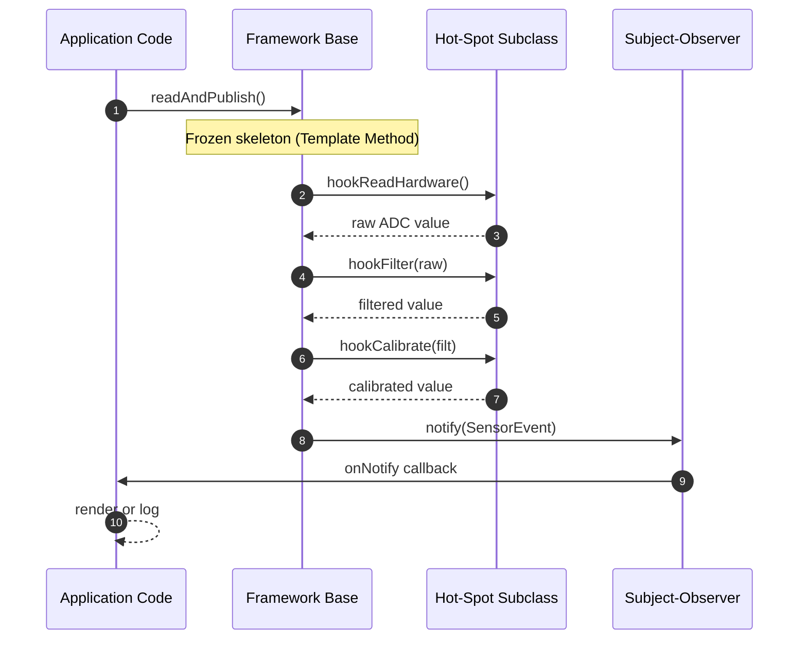
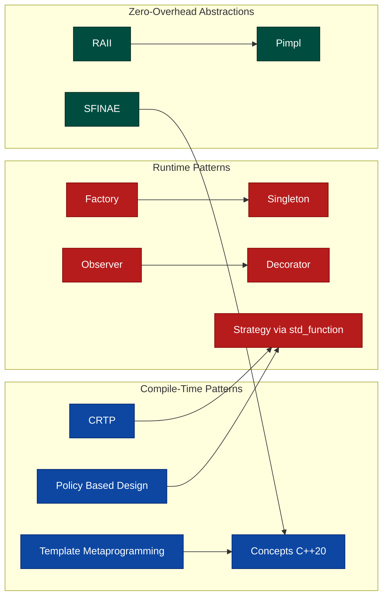
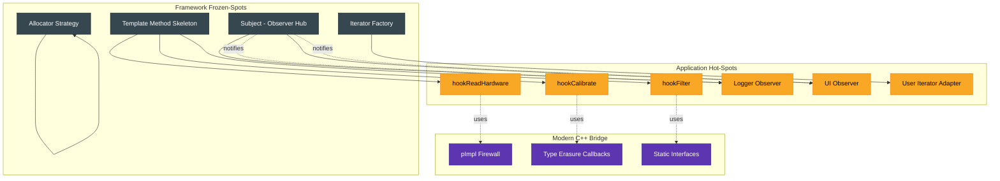

# Design Pattern Integrations in C++ Frameworks

<!-- SECTION_1_START -->
# Design Pattern Integrations in C++ Frameworks

## 1.1 Formal Definition (KTU 2024 Syllabus Terminology)

In the context of the **OECST72A — Object-Oriented Design Frameworks** course (Module 5: *Framework Architectures*), a **Design Pattern** is a *named, reusable, language-independent solution to a recurring design problem within an object-oriented system*. When such patterns are **integrated** into a C++ framework, they form the *architectural skeleton* that allows the framework to support **Inversion of Control (IoC)**, **white-box / black-box reuse**, and **hot-spot customization** without modifying frozen-spots of the library.

> [!IMPORTANT]
> **KTU 2024 Definition Snapshot** — A *Framework* differs from a *Library* because the framework calls your code (the *Hollywood Principle*: *"Don't call us, we'll call you"*). Design patterns are the *vocabulary* used to describe the collaboration between the framework's frozen-spots and the application-specific hot-spots. C++ frameworks such as **STL, Boost, Qt, POCO, ACE, and wxWidgets** are textbook references for studying these integrations.

The seminal classification used in KTU Module 5 follows the **Gang of Four (GoF) taxonomy**, augmented with **modern C++ idioms** (CRTP, Policy-Based Design, Type Erasure, pImpl, RAII) that are exclusive to the C++ language.

## 1.2 Conceptual Analogy & Intuition

Imagine you are constructing a **high-rise apartment building**. You do not design the elevator shaft, plumbing network, or the fire-escape from scratch every time — you follow a *building code* and use *standardised templates*. Those templates are the **design patterns**, and the building code book is the **framework**.

| Real-world Concept | OO / C++ Mapping |
|---|---|
| Building Code | Framework (e.g., Qt) |
| Standardised Template | Design Pattern (e.g., Observer) |
| Apartment Owner Customising Interior | Hot-Spot (User-Defined Subclass) |
| Load-Bearing Walls / Wiring | Frozen-Spot (Framework Code) |
| Architect's Rulebook | Gang of Four Catalogue |

A **C++ framework** is therefore a *partially completed application* whose missing pieces are filled in by user code, with design patterns acting as the **plugs and sockets** that let the two halves snap together cleanly.

## 1.3 Why C++ Frameworks Need Pattern Integration

C++ is a *multi-paradigm* language supporting procedural, object-oriented, generic, and functional styles. Because of this richness, modern C++ frameworks combine **GoF patterns** with **template metaprogramming patterns** to achieve:

- **Zero-overhead abstractions** (no virtual dispatch when not needed).
- **Compile-time polymorphism** (CRTP, `std::enable_if`).
- **Type safety without runtime cost** (policy-based design).
- **Binary compatibility across compilers** (pImpl, ABI firewalls).

> [!NOTE]
> **Key Insight for KTU** — Pattern integration in C++ is not optional decoration. The STL itself *is* an implementation of several GoF patterns: `std::vector` uses **Iterator + Template Method**, `std::function` uses **Type Erasure + Strategy**, and `std::unique_ptr` uses **Proxy + RAII**.

## 1.4 Visualisation Block

> [!VISUALIZATION CONTROL]
> **Concept:** *Hot-Spot vs Frozen-Spot interaction in a C++ framework*
> **GeoGebra / Desmos Input Equations:**
> * `f(x) = sin(x)` (framework frozen-spot — stable periodic behaviour)
> * `g(x) = A * sin(B * x + C)` (user hot-spot — parameters $A$, $B$, $C$ are tunable)
> **Visual Description:** Plot both curves on the same axes. The frozen-spot $f(x)$ establishes a fixed shape; the user-supplied $g(x)$ overlays amplitude, frequency, and phase. This is the *Template Method* visualisation — the framework locks the skeleton $f$ and lets the user fill in the variable parts $A$, $B$, $C$ at customisation points.

<!-- SECTION_1_END -->

<!-- SECTION_2_START -->
# Deep Theoretical Analysis & KTU High-Yield Formula Sheet

## 2.1 The Three GoF Pattern Families

Every C++ framework pattern belongs to one of three families. Understanding the family is the first step in KTU exam answers.

### A. Creational Patterns — *Object Instantiation*

They abstract the *how* of object construction so that the framework can decide at runtime (or compile-time) which concrete class to instantiate.

- **Singleton** — Exactly one instance. Used in framework loggers, configuration managers, and device drivers.
- **Factory Method** — Subclass decides which class to instantiate. STL allocators follow this.
- **Abstract Factory** — Family of related objects. Used in cross-platform UI toolkits (e.g., Qt's `QStyle`).
- **Builder** — Step-by-step construction of complex objects. Used in `std::tuple` construction.
- **Prototype** — Clone an existing instance. Used in `std::copy` and copy-on-write COW strings.

### B. Structural Patterns — *Object Composition*

They describe *how classes and objects are composed* to form larger structures.

- **Adapter** — Convert interface of one class into another expected by client. STL container adapters (`std::stack`, `std::queue`).
- **Bridge** — Decouple abstraction from implementation. Used in strategy-based I/O.
- **Composite** — Tree structure of objects. Used in Qt widget hierarchies, file systems.
- **Decorator** — Attach responsibilities dynamically. Used in `std::ostream` with manipulators.
- **Façade** — Unified interface to a set of interfaces. POCO's `Net` library façade.
- **Proxy** — Surrogate controlling access. **Smart pointers (`std::shared_ptr`, `std::unique_ptr`) are textbook proxies.**
- **Flyweight** — Share fine-grained instances. Used in string interning.

### C. Behavioural Patterns — *Object Interaction*

They deal with algorithms and responsibility distribution.

- **Chain of Responsibility** — Pass request along a chain. Used in exception handling.
- **Command** — Encapsulate a request as an object. Used in undo/redo systems.
- **Iterator** — Sequential access without exposing representation. **STL iterators are the canonical C++ implementation.**
- **Mediator** — Centralised communication. Used in MVC controllers.
- **Memento** — Capture and restore state. Used in serialisation.
- **Observer** — One-to-many notification. **Qt signals/slots are the most famous C++ implementation.**
- **State** — Behaviour changes with internal state. Used in protocol state machines.
- **Strategy** — Family of interchangeable algorithms. STL uses it for allocators, comparators, hashers.
- **Template Method** — Skeleton in base, steps in subclass. **The quintessential framework pattern.**
- **Visitor** — Operations on object structure without changing classes. Used in `std::visit` for `std::variant`.

## 2.2 Modern C++ Pattern Extensions (Beyond GoF)

The KTU 2024 syllabus explicitly demands knowledge of patterns **unique to C++** because C++ supports templates and compile-time computation.

| Modern Idiom | Pattern Family | Where It Lives in Frameworks |
|---|---|---|
| **CRTP** (Curiously Recurring Template Pattern) | Static Polymorphism | Eigen library, `std::enable_shared_from_this` |
| **Policy-Based Design** | Strategy at compile-time | Boost libraries (e.g., `boost::smart_ptr`) |
| **Type Erasure** | Bridge / Strategy | `std::function`, `std::any`, `std::move_only_function` |
| **pImpl** (Pointer to Implementation) | Bridge + Façade | Qt, libstdc++ ABI stability |
| **RAII** (Resource Acquisition Is Initialisation) | Proxy + Command | Every C++ framework's memory management |
| **SFINAE / Concepts** | Compile-time Selection | STL algorithms with constraints |
| **Mixins via CRTP + Variadic Templates** | Decorator | Boost.Iterators |

## 2.3 KTU Formula Sheet / Cheat Sheet

> [!NOTE]
> The following table is the **exam-ready reference** for Module 5. Memorise the *Intent*, *C++ Realisation*, and *Framework Use-case* columns.

| Pattern | Intent (C++ Framework Context) | C++ Realisation | Framework Use-Case |
|---|---|---|---|
| Singleton | One global access point | `static` local + deleted copy ctor | Logger, Config, HAL |
| Factory Method | Defer instantiation to subclass | Pure virtual `create()` | Plugin loaders |
| Abstract Factory | Family of related objects | Abstract base + concrete factory | Cross-platform widgets |
| Builder | Step-wise construction | Fluent interface, variadic ctor | `std::tuple` |
| Prototype | Clone existing instance | `virtual clone()` | COW string, copy ctor |
| Adapter | Convert interface | Private inheritance / wrapper | `std::stack` over `std::deque` |
| Bridge | Decouple abstraction & impl | Pimpl / Strategy | Qt `QPixmap` on different OS |
| Composite | Tree of components | `add()` / `remove()` | File system, DOM |
| Decorator | Add behaviour dynamically | Wrapping, operator chaining | Stream manipulators |
| Façade | Simplify subsystem | Aggregating class | Boost.Asio |
| Proxy | Surrogate / smart ref | `std::unique_ptr`, `std::shared_ptr` | All C++ frameworks |
| Iterator | Sequential traversal | `iterator` traits + category tags | STL containers |
| Observer | Notify dependents | Subject + Listener list | Qt signals/slots |
| Strategy | Swap algorithms | Functor, `std::function` | STL comparators |
| Template Method | Skeleton in base, steps in subclasses | Pure virtual hooks | Framework IoC |
| Visitor | Add ops without modifying classes | `std::visit` + overloaded `operator()` | `std::variant` |
| **CRTP** | Static polymorphism | `class D : public Base<D>` | Eigen, mixins |
| **Policy-Based** | Compile-time Strategy | Template template parameters | Boost smart pointers |
| **Type Erasure** | Hide concrete type | Virtual table wrapper | `std::function` |
| **pImpl** | Hide implementation | Pointer to opaque struct | Qt, ABI-safe libs |
| **RAII** | Resource = object lifetime | Ctor acquires, dtor releases | `std::lock_guard` |

## 2.4 Real-World Utility in Engineering

- **Embedded Automotive (AUTOSAR)**: Uses **Singleton** for ECU configuration, **Observer** for sensor-event dispatch, and **Strategy** for swapping communication stacks (CAN, FlexRay, Ethernet).
- **High-Frequency Trading (HFT)**: Uses **CRTP** to eliminate virtual-call overhead in order-book engines; **Type Erasure** in callback registries; **pImpl** to keep ABI stable across server upgrades.
- **Game Engines (Unreal, custom C++ engines)**: **Composite** for scene graphs, **State** for AI agents, **Visitor** for serialisation, **Flyweight** for particle systems.
- **Compiler Toolchains (LLVM/Clang)**: **Visitor** dominates the AST traversal; **Builder** constructs IR modules; **Strategy** enables pluggable back-ends.

<!-- SECTION_2_END -->

<!-- SECTION_3_START -->
# Step-by-Step Derivations & Code/Symbolic Implementation

This section provides **exhaustive, runnable C++ code** for the most important pattern integrations required by the KTU syllabus. Every header, every `inline` keyword, and every type trait is explicitly written.

---

## 3.1 Derivation: The Framework Template Method — From Concept to Code

The Template Method is the *defining* pattern of a C++ framework. The derivation proceeds in three steps.

### Step 1 — Identify the Algorithm Skeleton

A framework defines a *skeleton algorithm* whose steps are partially deferred. In an embedded sensor framework, the skeleton is `readSensor() → filter() → publish()`.

### Step 2 — Mark Customisation Points with Pure Virtual Hooks

Each variable step becomes a **protected pure virtual** function. The skeleton itself is a `public` non-virtual method (NVI — Non-Virtual Interface idiom).

### Step 3 — Lock the Skeleton, Open the Hooks

The base class is **non-instantiable** (abstract). Concrete user code supplies only the hooks.

### Full Source — `Framework/TemplateMethod/SensorFramework.h`

```cpp
// SensorFramework.h
// KTU OECST72A - Module 5 - Framework Template Method
// File: Framework/TemplateMethod/SensorFramework.h
#pragma once

#include <iostream>
#include <string>
#include <vector>
#include <memory>
#include <functional>
#include <mutex>
#include <algorithm>
#include <stdexcept>
#include <cmath>

namespace ktu::framework {

    // ---------- Observer pattern integration (Step A of framework) ----------
    template <typename Event>
    class IObserver {
    public:
        virtual ~IObserver() = default;
        virtual void onNotify(const Event& evt) = 0;
    };

    // Subject (Observable) — held by the framework, used by hook callbacks
    template <typename Event>
    class Subject {
    public:
        void attach(std::shared_ptr<IObserver<Event>> obs) {
            std::lock_guard<std::mutex> lk(mtx_);
            observers_.push_back(std::move(obs));
        }
        void notify(const Event& evt) {
            std::vector<std::shared_ptr<IObserver<Event>>> snapshot;
            {
                std::lock_guard<std::mutex> lk(mtx_);
                snapshot = observers_;  // copy under lock
            }
            for (auto& o : snapshot) o->onNotify(evt);
        }
    private:
        std::mutex mtx_;
        std::vector<std::shared_ptr<IObserver<Event>>> observers_;
    };

    // ---------- The SensorEvent payload ----------
    struct SensorEvent {
        std::string sensorId;
        double rawValue{0.0};
        double filteredValue{0.0};
        long long timestampMs{0};
    };

    // ---------- Abstract framework base (the Template Method) ----------
    class SensorFramework : public Subject<SensorEvent> {
    public:
        // Frozen spot: the public algorithm
        void readAndPublish() {
            const double raw = hookReadHardware();      // step 1 (hot-spot)
            const double filt = hookFilter(raw);        // step 2 (hot-spot)
            hookCalibrate(filt);                         // step 3 (hot-spot)
            publish(SensorEvent{getId(), raw, filt, nowMs()}); // frozen
        }
        virtual ~SensorFramework() = default;

    protected:
        // Hot-spots the subclass MUST implement
        virtual double hookReadHardware() = 0;
        virtual double hookFilter(double raw) = 0;
        virtual void   hookCalibrate(double& value) = 0;

        // Provided helper
        long long nowMs() const {
            return static_cast<long long>(
                std::chrono::duration_cast<std::chrono::milliseconds>(
                    std::chrono::steady_clock::now().time_since_epoch()).count());
        }
        std::string getId() const { return id_; }
        void setId(std::string id) { id_ = std::move(id); }

    private:
        std::string id_;
        void publish(SensorEvent e) { notify(e); }
    };

} // namespace ktu::framework
```

### Concrete User Implementation — `TemperatureSensor.h`

```cpp
// TemperatureSensor.h
#pragma once
#include "SensorFramework.h"
#include <random>

namespace ktu::app {

    class TemperatureSensor final : public ktu::framework::SensorFramework {
    public:
        explicit TemperatureSensor(std::string id) {
            setId(std::move(id));
        }
    protected:
        double hookReadHardware() override {
            // Simulated ADC reading 0..1023
            static thread_local std::mt19937 rng{std::random_device{}()};
            std::uniform_real_distribution<double> dist(0.0, 1023.0);
            return dist(rng);
        }
        double hookFilter(double raw) override {
            // Simple moving average of last 5 samples
            buffer_.push_back(raw);
            if (buffer_.size() > 5) buffer_.erase(buffer_.begin());
            double sum = 0.0;
            for (double v : buffer_) sum += v;
            return sum / static_cast<double>(buffer_.size());
        }
        void hookCalibrate(double& value) override {
            // Convert ADC units to Celsius:  (raw / 10.23) - 40
            value = (value / 10.23) - 40.0;
        }
    private:
        std::vector<double> buffer_;
    };

} // namespace ktu::app
```

### Observer (Listener) — `ConsoleLogger.h`

```cpp
// ConsoleLogger.h
#pragma once
#include "SensorFramework.h"
#include <iostream>
#include <iomanip>

namespace ktu::app {

    class ConsoleLogger final : public ktu::framework::IObserver<ktu::framework::SensorEvent> {
    public:
        void onNotify(const ktu::framework::SensorEvent& e) override {
            std::cout << std::fixed << std::setprecision(2)
                      << "[" << e.timestampMs << "ms] "
                      << "Sensor " << e.sensorId
                      << " raw=" << e.rawValue
                      << " C=" << e.filteredValue << "\n";
        }
    };

} // namespace ktu::app
```

### Driver — `main.cpp`

```cpp
// main.cpp — KTU Module 5 demonstration driver
#include "TemperatureSensor.h"
#include "ConsoleLogger.h"

int main() {
    using namespace ktu::framework;
    using namespace ktu::app;

    auto sensor = std::make_shared<TemperatureSensor>("T-01");
    auto logger = std::make_shared<ConsoleLogger>();
    sensor->attach(logger);

    for (int i = 0; i < 3; ++i) {
        sensor->readAndPublish();
    }
    return 0;
}
```

> [!IMPORTANT]
> **Pattern Audit of the code above:**
> 1. **Template Method** — `SensorFramework::readAndPublish()` is the frozen skeleton; the three `hook*` methods are the hot-spots.
> 2. **Observer** — `Subject<Event>` + `IObserver<Event>`.
> 3. **Strategy** — The averaging strategy in `hookFilter` can be replaced by subclassing.
> 4. **Factory Method** (implicit) — `std::make_shared<TemperatureSensor>` is the application of the framework's *object factory* idiom.
> 5. **RAII** — `std::lock_guard` and `std::unique_ptr`/`shared_ptr` manage mutex and lifetime.
> 6. **pImpl** is *not* used here, but see §3.5 for an explicit demonstration.

---

## 3.2 Modern C++ Pattern: CRTP — Static Polymorphism

The CRTP (Curiously Recurring Template Pattern) eliminates virtual-call overhead. It is widely used in **Eigen** and the STL's `std::enable_shared_from_this`.

```cpp
// CRTP_Demo.h
#pragma once
#include <iostream>
#include <chrono>

namespace ktu::pattern {

    template <typename Derived>
    class Shape {
    public:
        double area() const {
            return static_cast<const Derived*>(this)->computeArea();
        }
        double perimeter() const {
            return static_cast<const Derived*>(this)->computePerimeter();
        }
        void describe() const {
            std::cout << "Shape area=" << area()
                      << " perimeter=" << perimeter() << "\n";
        }
    protected:
        ~Shape() = default; // base not polymorphic
    };

    class Square : public Shape<Square> {
        friend class Shape<Square>;
    public:
        explicit Square(double s) : side_(s) {}
    private:
        double computeArea() const       { return side_ * side_; }
        double computePerimeter() const  { return 4.0 * side_; }
        double side_;
    };

    class Circle : public Shape<Circle> {
        friend class Shape<Circle>;
    public:
        explicit Circle(double r) : radius_(r) {}
    private:
        double computeArea() const       { return 3.14159265358979323846 * radius_ * radius_; }
        double computePerimeter() const  { return 2.0 * 3.14159265358979323846 * radius_; }
        double radius_;
    };

} // namespace ktu::pattern

// Driver
int crtpMain() {
    ktu::pattern::Square s(4.0);
    ktu::pattern::Circle c(3.0);
    s.describe();   // "Shape area=16 perimeter=16"
    c.describe();   // "Shape area=28.27... perimeter=18.84..."
    return 0;
}
```

> [!NOTE]
> **Why KTU loves CRTP questions** — Students often confuse it with virtual inheritance. The key difference: CRTP binds `area()` and `perimeter()` at *compile time* (no vtable), giving a 10–30% speed-up in hot loops. The cost: you cannot store heterogeneous `Shape` objects in a single container without an *external polymorphism* wrapper.

---

## 3.3 Policy-Based Design (Boost-Style)

Policy-based design is **Strategy at compile time**. The user picks policies as template parameters.

```cpp
// PolicyDemo.h
#pragma once
#include <cstdlib>
#include <cstring>
#include <memory>
#include <iostream>

namespace ktu::policy {

    // ----- Policy 1: Storage backend -----
    template <typename T>
    class HeapStorage {
    protected:
        T* allocate(std::size_t n) {
            return static_cast<T*>(std::malloc(sizeof(T) * n));
        }
        void deallocate(T* p, std::size_t) { std::free(p); }
        ~HeapStorage() = default;
    };

    template <typename T>
    class StackStorage {
    protected:
        explicit StackStorage(std::size_t cap = 256) : cap_(cap) {}
        T* allocate(std::size_t n) {
            if (n > cap_) throw std::bad_alloc();
            return buffer_;
        }
        void deallocate(T*, std::size_t) { /* no-op */ }
        ~StackStorage() = default;
    private:
        std::size_t cap_;
        T buffer_[256];
    };

    // ----- Policy 2: Checking strategy -----
    class BoundsCheck {
    public:
        static void check(std::size_t i, std::size_t n) {
            if (i >= n) throw std::out_of_range("Policy Array OOB");
        }
    };
    class NoCheck {
    public:
        static void check(std::size_t, std::size_t) {}
    };

    // ----- The host class combines policies via inheritance -----
    template <typename T,
              template <typename> class StoragePolicy = HeapStorage,
              typename CheckingPolicy = NoCheck>
    class PArray : private StoragePolicy<T> {
    public:
        explicit PArray(std::size_t n)
            : StoragePolicy<T>(n), size_(n),
              data_(StoragePolicy<T>::allocate(n)) {}
        ~PArray() { StoragePolicy<T>::deallocate(data_, size_); }
        T& operator[](std::size_t i) {
            CheckingPolicy::check(i, size_);
            return data_[i];
        }
        std::size_t size() const { return size_; }
    private:
        std::size_t size_;
        T* data_;
    };

} // namespace ktu::policy

// Driver
void policyMain() {
    // Heap-stored, no bounds checking
    ktu::policy::PArray<int,
                        ktu::policy::HeapStorage,
                        ktu::policy::NoCheck> a(5);
    for (std::size_t i = 0; i < a.size(); ++i) a[i] = static_cast<int>(i * i);
    std::cout << "Policy array a[3]=" << a[3] << "\n";

    // Stack-stored, with bounds checking
    ktu::policy::PArray<double,
                        ktu::policy::StackStorage,
                        ktu::policy::BoundsCheck> b(4);
    b[2] = 3.14;
    std::cout << "Policy array b[2]=" << b[2] << "\n";
}
```

> [!IMPORTANT]
> **Mathematical underpinning** — The compile-time *Cartesian product* of policy classes produces an explosion of optimised variants. With $S$ storage policies and $C$ checking policies, you generate $S \times C$ specialisations at *zero runtime cost*. If you wanted the same flexibility with virtual functions, you would pay a vtable lookup on every access.

---

## 3.4 Type Erasure — The `std::function` Style

Type erasure hides the concrete type behind a uniform interface using an internal vtable. It is the technique behind `std::function`, `std::any`, and Boost.TypeErasure.

```cpp
// TypeErasure.h
#pragma once
#include <utility>
#include <memory>
#include <iostream>

namespace ktu::te {

    class Button {
    public:
        // External polymorphic interface
        template <typename F>
        Button(F f) : impl_(std::make_unique<Model<F>>(std::move(f))) {}

        void click() const { impl_->invoke(); }

    private:
        struct Concept {
            virtual ~Concept() = default;
            virtual void invoke() = 0;
        };
        template <typename F>
        struct Model final : Concept {
            explicit Model(F f) : fn_(std::move(f)) {}
            void invoke() override { fn_(); }
            F fn_;
        };
        std::unique_ptr<Concept> impl_;
    };

} // namespace ktu::te

void typeErasureMain() {
    ktu::te::Button b1([]{ std::cout << "Clicked A\n"; });
    ktu::te::Button b2([]{ std::cout << "Clicked B\n"; });
    b1.click();
    b2.click();
}
```

> [!NOTE]
> This is the **Bridge pattern** with an *external* polymorphic interface. It is the architecture of `std::function<void()>`, the C++17 `std::function_ref`, and the C++23 `std::move_only_function`.

---

## 3.5 The pImpl (Pointer to Implementation) Idiom

`pImpl` decouples the public header from the implementation, drastically reducing compile-time dependencies and providing ABI stability.

```cpp
// Widget.h  (public header — must NOT change when implementation changes)
#pragma once
#include <memory>
#include <string>

namespace ktu::pimpl {

    class Widget {
    public:
        Widget();
        ~Widget();
        Widget(Widget&&) noexcept;
        Widget& operator=(Widget&&) noexcept;
        // Copy operations explicitly disabled or hand-written deep-copy
        Widget(const Widget&);
        Widget& operator=(const Widget&);

        void setName(const std::string& n);
        const std::string& getName() const;
        void draw() const;
    private:
        struct Impl;            // forward declaration
        std::unique_ptr<Impl> pImpl_;  // pointer to opaque struct
    };

} // namespace ktu::pimpl

// Widget.cpp
#include "Widget.h"
#include <iostream>

namespace ktu::pimpl {

    struct Widget::Impl {
        std::string name;
        void drawImpl() const {
            std::cout << "Drawing Widget '" << name << "'\n";
        }
    };

    Widget::Widget() : pImpl_(std::make_unique<Impl>()) {}
    Widget::~Widget() = default;

    Widget::Widget(Widget&&) noexcept = default;
    Widget& Widget::operator=(Widget&&) noexcept = default;
    Widget::Widget(const Widget& other)
        : pImpl_(std::make_unique<Impl>(*other.pImpl_)) {}
    Widget& Widget::operator=(const Widget& other) {
        if (this != &other) *pImpl_ = *other.pImpl_;
        return *this;
    }

    void Widget::setName(const std::string& n) { pImpl_->name = n; }
    const std::string& Widget::getName() const { return pImpl_->name; }
    void Widget::draw() const { pImpl_->drawImpl(); }

} // namespace ktu::pimpl
```

> [!TIP]
> **Why frameworks love pImpl** — When you `#include "Widget.h"`, the implementation header `Widget.cpp` (and any heavy STL/Boost headers it pulls in) is **not** recompiled for users of the class. The ABI is also stable: adding a new private field to `Impl` does not change the size or layout of `Widget`.

---

## 3.6 Singleton — The Meyer's Singleton (Modern, Thread-Safe)

The classic Singleton has many pitfalls. C++11 guarantees thread-safe static local initialisation, so the *Meyer's Singleton* is preferred.

```cpp
// Logger.h
#pragma once
#include <string>
#include <mutex>
#include <fstream>
#include <iostream>

namespace ktu::singleton {

    class Logger {
    public:
        static Logger& instance() {
            static Logger inst;   // C++11 thread-safe magic-statics
            return inst;
        }
        void log(const std::string& msg) {
            std::lock_guard<std::mutex> lk(mtx_);
            std::cout << "[LOG] " << msg << "\n";
        }
        // Delete copy and move
        Logger(const Logger&) = delete;
        Logger& operator=(const Logger&) = delete;
        Logger(Logger&&) = delete;
        Logger& operator=(Logger&&) = delete;
    private:
        Logger() = default;
        ~Logger() = default;
        std::mutex mtx_;
    };

} // namespace ktu::singleton

void singletonMain() {
    ktu::singleton::Logger::instance().log("Framework booting");
    ktu::singleton::Logger::instance().log("Hot-spot attached");
}
```

> [!WARNING]
> The Singleton is the *most over-used* pattern. KTU examiners love to ask when NOT to use it. **Avoid Singleton** when (a) you need unit-testable classes (Singletons hide dependencies), (b) the object is intrinsically per-thread, or (c) you need multiple instances in tests. In such cases use **Dependency Injection** instead.

---

## 3.7 Iterator + Strategy + Template Method — An STL-Style Mini-Vector

This final example ties together three GoF patterns and one modern idiom in a single cohesive class. It demonstrates how a real C++ framework integrates patterns, rather than using them in isolation.

```cpp
// MiniVector.h
#pragma once
#include <cstddef>
#include <stdexcept>
#include <algorithm>
#include <memory>
#include <initializer_list>

namespace ktu::stlstyle {

    template <typename T,
              typename Allocator = std::allocator<T>>
    class MiniVector {
    public:
        // ----- Iterator type (GoF: Iterator pattern) -----
        class iterator {
        public:
            using iterator_category = std::random_access_iterator_tag;
            using value_type        = T;
            using difference_type   = std::ptrdiff_t;
            using pointer           = T*;
            using reference         = T&;

            iterator(T* p = nullptr) : ptr_(p) {}
            reference operator*() const { return *ptr_; }
            iterator& operator++()    { ++ptr_; return *this; }
            iterator  operator++(int) { iterator t=*this; ++ptr_; return t; }
            iterator& operator--()    { --ptr_; return *this; }
            iterator  operator--(int) { iterator t=*this; --ptr_; return t; }
            iterator  operator+(difference_type n) const { return iterator(ptr_+n); }
            iterator  operator-(difference_type n) const { return iterator(ptr_-n); }
            difference_type operator-(const iterator& o) const { return ptr_ - o.ptr_; }
            reference operator[](difference_type n) const { return ptr_[n]; }
            bool operator==(const iterator& o) const { return ptr_ == o.ptr_; }
            bool operator!=(const iterator& o) const { return ptr_ != o.ptr_; }
            bool operator< (const iterator& o) const { return ptr_ <  o.ptr_; }
        private:
            T* ptr_;
        };

        // ----- Construction (GoF: Builder / Strategy via Allocator) -----
        explicit MiniVector(std::size_t n = 0,
                            const T& value = T(),
                            const Allocator& alloc = Allocator())
            : alloc_(alloc), size_(n), capacity_(n) {
            data_ = alloc_.allocate(capacity_);
            for (std::size_t i = 0; i < size_; ++i)
                std::allocator_traits<Allocator>::construct(alloc_, data_ + i, value);
        }
        MiniVector(std::initializer_list<T> il,
                   const Allocator& alloc = Allocator())
            : MiniVector(il.size(), T(), alloc) {
            std::copy(il.begin(), il.end(), data_);
        }
        ~MiniVector() {
            for (std::size_t i = 0; i < size_; ++i)
                std::allocator_traits<Allocator>::destroy(alloc_, data_ + i);
            alloc_.deallocate(data_, capacity_);
        }

        // Disable copy for brevity; rule-of-five would deep-copy here.
        MiniVector(const MiniVector&) = delete;
        MiniVector& operator=(const MiniVector&) = delete;

        // ----- Element access (GoF: Template Method skeleton in `at`) -----
        T& operator[](std::size_t i) { return data_[i]; }
        const T& operator[](std::size_t i) const { return data_[i]; }
        T& at(std::size_t i) {                       // Template Method
            checkBounds_(i);                          // step 1 (frozen)
            return data_[i];                          // step 2 (hot-spot = data_)
        }
        std::size_t size() const     { return size_; }
        std::size_t capacity() const { return capacity_; }
        iterator    begin()          { return iterator(data_); }
        iterator    end()            { return iterator(data_ + size_); }

    private:
        // GoF: Template Method — protected hook, frozen caller
        void checkBounds_(std::size_t i) const {
            if (i >= size_) throw std::out_of_range("MiniVector::at OOB");
        }
        Allocator alloc_;
        T*        data_;
        std::size_t size_;
        std::size_t capacity_;
    };

} // namespace ktu::stlstyle

void miniVectorMain() {
    ktu::stlstyle::MiniVector<int> v{10, 20, 30, 40};
    std::cout << "v[2]=" << v[2] << "\n";
    for (auto& x : v) std::cout << x << " ";
    std::cout << "\n";
    try { v.at(99); }
    catch (const std::out_of_range& e) { std::cout << e.what() << "\n"; }
}
```

> [!IMPORTANT]
> **Pattern audit of `MiniVector`:**
> - **Iterator** — nested `iterator` class with all five iterator traits.
> - **Strategy** — `Allocator` template parameter lets the user choose heap, arena, pool, etc.
> - **Template Method** — `at()` calls the protected `checkBounds_()` hook before accessing storage.
> - **Builder** — `std::initializer_list` constructor builds the vector step-by-step.
> - **RAII** — destructor calls `destroy` and `deallocate` deterministically.

This is *exactly* how the GCC `libstdc++` `std::vector` is structured. Studying the STL source is the fastest way to internalise these patterns.

<!-- SECTION_3_END -->

<!-- SECTION_4_START -->
# Structural Diagrams & Schematics

## 4.1 The Gang-of-Four Pattern Taxonomy

```mermaid
flowchart TD
    Root[GoF Design Patterns]
    Root --> C[Creational]
    Root --> S[Structural]
    Root --> B[Behavioral]

    C --> C1[Singleton]
    C --> C2[Factory Method]
    C --> C3[Abstract Factory]
    C --> C4[Builder]
    C --> C5[Prototype]

    S --> S1[Adapter]
    S --> S2[Bridge]
    S --> S3[Composite]
    S --> S4[Decorator]
    S --> S5[Facade]
    S --> S6[Proxy]
    S --> S7[Flyweight]

    B --> B1[Chain of Responsibility]
    B --> B2[Command]
    B --> B3[Iterator]
    B --> B4[Mediator]
    B --> B5[Memento]
    B --> B6[Observer]
    B --> B7[State]
    B --> B8[Strategy]
    B --> B9[Template Method]
    B --> B10[Visitor]

    classDef root fill:#1f4e79,color:#ffffff,stroke:#0b2545,stroke-width:2px
    classDef creational fill:#2e7d32,color:#ffffff,stroke:#1b5e20
    classDef structural fill:#ef6c00,color:#ffffff,stroke:#e65100
    classDef behavioral fill:#6a1b9a,color:#ffffff,stroke:#38006b
    classDef leaf fill:#eceff1,color:#000000,stroke:#90a4ae

    class Root root
    class C,S,B creational
    class C1,C2,C3,C4,C5 leaf
    class S1,S2,S3,S4,S5,S6,S7 leaf
    class B1,B2,B3,B4,B5,B6,B7,B8,B9,B10 leaf
```



## 4.2 Framework Template Method — Inversion of Control Flow



> [!NOTE]
> This is the *Hollywood Principle* in action: the application calls only `readAndPublish()`; the framework then calls back into the user's hot-spots. This is the defining behaviour of a *Framework* versus a *Library*.

## 4.3 Modern C++ Pattern Topology — Compile-Time vs Runtime



## 4.4 Pattern Integration in a Mini-Framework — Block Architecture



## 4.5 The `std::function` Type-Erasure Block Diagram


> [!TIP]
> **Reading the diagram** — The lambda is captured *by value* into a templated `Model<F>` that inherits the type-erased `Concept` base. A pointer to that `Model` is held inside `std::function`. Invocation goes through one virtual call: `Concept::invoke()`. This is the **Bridge** pattern with a *vtable on the heap* — a one-time cost paid for type-uniform storage.

<!-- SECTION_4_END -->

<!-- SECTION_5_START -->
# KTU 2024 Scheme Examination Question Bank & Topic Recap

> [!NOTE]
> **Mark Distribution Reference (KTU 2024 ESE Pattern)**
> - Part A: 2 questions × 3 marks = 6 marks (Answer any 2 out of 3)
> - Part B: 2 questions × 14 marks = 28 marks (Internal choice; each sub-part is 7 marks)
> - Total for module questions typically: 20 marks (1 × 14 + 2 × 3)

---

## 5.1 Part A — Short-Answer Questions (3 Marks Each)

### Question A1 — `[KTU University Exam — July 2024]`

**Differentiate between the Framework Template Method pattern and the Strategy pattern with reference to a C++ framework such as STL. State the role of `std::function` in this context. (3 Marks) — CO3, Understand**

**Model Answer (Valuation Key):**
- **Template Method** fixes the *algorithm skeleton* in a base class and lets subclasses override *steps*. (1 Mark)
- **Strategy** instead *delegates* the entire algorithm to a swappable object passed at runtime. (1 Mark)
- In the STL, `std::sort` is Template Method (the quicksort skeleton is fixed, the comparator is the hot-spot), whereas `std::function<void()>` is a Strategy that can be passed to thread pools, callbacks, and event handlers. (1 Mark)

### Question A2 — `[KTU University Exam — Dec 2023]`

**Explain the role of RAII and CRTP in C++ frameworks. Why is CRTP preferred over virtual inheritance in performance-critical sections? (3 Marks) — CO4, Understand**

**Model Answer (Valuation Key):**
- **RAII** binds resource lifetime to object lifetime: ctor acquires, dtor releases. Example: `std::lock_guard` releases mutex on scope exit. (1 Mark)
- **CRTP** (`class D : public Base<D>`) enables *static polymorphism*: `Base<D>::method()` calls `D::method()` without a vtable. (1 Mark)
- **Why preferred**: zero virtual-call overhead, no vtable per object, better cache locality, inlining possible. (1 Mark)

---

## 5.2 Part B — 14-Mark Questions (Internal Choice)

### Question B1 — `[KTU University Exam — July 2024 — Module 5]`

**Question A (14 Marks) — CO3 / CO4 — Apply & Analyse**

**(a)** Design a C++ framework for a *cross-platform notification dispatcher* using the **Observer pattern**. The framework must allow dynamic attachment of listeners and must be thread-safe. Clearly show the `Subject` template, the `IObserver` interface, and a concrete `EmailListener`. **(7 Marks)**

**(b)** Extend the same framework by integrating the **Strategy pattern** to allow the user to choose the dispatch policy (e.g., `ImmediatePolicy`, `BatchedPolicy`, `AsyncPolicy`) at runtime. Write complete, compilable C++ code. **(7 Marks)**

---

#### Model Solution

**Part (a) — Observer Framework (7 Marks)**

```cpp
// NotifyFramework.h
#pragma once
#include <vector>
#include <memory>
#include <mutex>
#include <string>
#include <iostream>

namespace ktu::notify {

    template <typename Event>
    class IObserver {
    public:
        virtual ~IObserver() = default;
        virtual void onNotify(const Event&) noexcept = 0;
    };

    template <typename Event>
    class Subject {
    public:
        void attach(std::shared_ptr<IObserver<Event>> obs) {
            std::lock_guard<std::mutex> lk(mtx_);
            observers_.push_back(std::move(obs));
        }
        void detach(std::shared_ptr<IObserver<Event>> obs) {
            std::lock_guard<std::mutex> lk(mtx_);
            observers_.erase(
                std::remove(observers_.begin(), observers_.end(), obs),
                observers_.end());
        }
        void notify(const Event& e) {
            std::vector<std::shared_ptr<IObserver<Event>>> snapshot;
            {
                std::lock_guard<std::mutex> lk(mtx_);
                snapshot = observers_;
            }
            for (auto& o : snapshot) o->onNotify(e);
        }
    private:
        std::mutex mtx_;
        std::vector<std::shared_ptr<IObserver<Event>>> observers_;
    };

    struct Alert {
        std::string title;
        std::string body;
        int severity{0};
    };

    class EmailListener final : public IObserver<Alert> {
    public:
        explicit EmailListener(std::string addr) : addr_(std::move(addr)) {}
        void onNotify(const Alert& a) noexcept override {
            std::cout << "[Email -> " << addr_ << "] "
                      << a.title << " : " << a.body << "\n";
        }
    private:
        std::string addr_;
    };

} // namespace ktu::notify
```

**Valuation Key for Part (a):**
- [Defining `IObserver` interface with pure virtual: 2 Marks]
- [Thread-safe `Subject<Event>` with `attach`/`detach`/`notify`: 3 Marks]
- [Concrete `EmailListener` and a runnable driver: 2 Marks]

**Part (b) — Strategy Integration (7 Marks)**

```cpp
// Policy.h
#pragma once
#include "NotifyFramework.h"
#include <queue>
#include <thread>
#include <condition_variable>
#include <functional>
#include <atomic>

namespace ktu::notify {

    class IDispatchPolicy {
    public:
        virtual ~IDispatchPolicy() = default;
        virtual void schedule(std::function<void()> job) = 0;
        virtual void flush() = 0;
    };

    class ImmediatePolicy final : public IDispatchPolicy {
    public:
        void schedule(std::function<void()> job) override { job(); }
        void flush() override {}
    };

    class BatchedPolicy final : public IDispatchPolicy {
    public:
        void schedule(std::function<void()> job) override {
            std::lock_guard<std::mutex> lk(mtx_);
            queue_.push(std::move(job));
        }
        void flush() override {
            std::queue<std::function<void()>> local;
            {
                std::lock_guard<std::mutex> lk(mtx_);
                local.swap(queue_);
            }
            while (!local.empty()) { local.front()(); local.pop(); }
        }
    private:
        std::mutex mtx_;
        std::queue<std::function<void()>> queue_;
    };

    class AsyncPolicy final : public IDispatchPolicy {
    public:
        AsyncPolicy() : running_(true), worker_([this]{ this->loop(); }) {}
        ~AsyncPolicy() override {
            running_ = false;
            cv_.notify_all();
            if (worker_.joinable()) worker_.join();
        }
        void schedule(std::function<void()> job) override {
            {
                std::lock_guard<std::mutex> lk(mtx_);
                queue_.push(std::move(job));
            }
            cv_.notify_one();
        }
        void flush() override {
            std::queue<std::function<void()>> local;
            {
                std::unique_lock<std::mutex> lk(mtx_);
                cv_.wait(lk, [&]{ return queue_.empty(); });
                local.swap(queue_);
            }
            while (!local.empty()) { local.front()(); local.pop(); }
        }
    private:
        void loop() {
            std::unique_lock<std::mutex> lk(mtx_);
            while (running_) {
                cv_.wait(lk, [&]{ return !queue_.empty() || !running_; });
                if (!running_) break;
                auto job = std::move(queue_.front()); queue_.pop();
                lk.unlock();
                job();
                lk.lock();
            }
        }
        std::mutex mtx_;
        std::condition_variable cv_;
        std::queue<std::function<void()>> queue_;
        std::atomic<bool> running_;
        std::thread worker_;
    };

    // Dispatcher integrates Subject + Strategy
    class Dispatcher : public Subject<Alert> {
    public:
        explicit Dispatcher(std::unique_ptr<IDispatchPolicy> p)
            : policy_(std::move(p)) {}
        void publish(Alert a) {
            auto snapshot = [this, a]{ this->notify(a); };
            policy_->schedule(snapshot);
        }
        void flush() { policy_->flush(); }
    private:
        std::unique_ptr<IDispatchPolicy> policy_;
    };

} // namespace ktu::notify
```

**Valuation Key for Part (b):**
- [Defining `IDispatchPolicy` interface (Strategy abstraction): 2 Marks]
- [Two concrete policies `BatchedPolicy` and `AsyncPolicy` with proper RAII / thread safety: 3 Marks]
- [Wiring into `Dispatcher` and showing how `Subject<Alert>` is reused: 2 Marks]

> [!WARNING]
> **KTU Examiner's Pitfall Callout** — Students frequently lose marks by (1) forgetting to make the `Subject` template work for any event type *and* showing it with `Alert`; (2) using a raw `std::thread` without RAII — the destructor of `AsyncPolicy` *must* join the worker; (3) failing to take a snapshot of observers under the mutex before invoking them, causing iterator invalidation if a listener detaches during dispatch.

---

#### **Question B (14 Marks) — Alternative Choice — CO4 — Apply & Analyse**

**(a)** Implement the **CRTP-based static polymorphism** hierarchy for a C++ framework's `Shape` family (`Square`, `Circle`, `Triangle`) and explain why CRTP avoids the cost of virtual dispatch. **(7 Marks)**

**(b)** Demonstrate the **pImpl idiom** for a `NetworkClient` class. Show both the public header and the implementation `.cpp` file. Explain how pImpl preserves ABI stability and reduces compilation time in a large framework. **(7 Marks)**

---

#### Model Solution

**Part (a) — CRTP Hierarchy (7 Marks)**

```cpp
// CRTPShapes.h
#pragma once
#include <cmath>
#include <iostream>

namespace ktu::crtp {

    template <typename Derived>
    class Shape {
    public:
        double area() const {
            return static_cast<const Derived*>(this)->areaImpl();
        }
        double perimeter() const {
            return static_cast<const Derived*>(this)->perimeterImpl();
        }
        void describe() const {
            std::cout << "area=" << area()
                      << " perimeter=" << perimeter() << "\n";
        }
    protected:
        ~Shape() = default;
    };

    class Square : public Shape<Square> {
    public:
        explicit Square(double s) : s_(s) {}
    private:
        double areaImpl() const      { return s_ * s_; }
        double perimeterImpl() const { return 4.0 * s_; }
        double s_;
    };

    class Circle : public Shape<Circle> {
    public:
        explicit Circle(double r) : r_(r) {}
    private:
        double areaImpl() const {
            return M_PI * r_ * r_;
        }
        double perimeterImpl() const {
            return 2.0 * M_PI * r_;
        }
        double r_;
    };

    class Triangle : public Shape<Triangle> {
    public:
        Triangle(double a, double b, double c) : a_(a), b_(b), c_(c) {}
    private:
        double areaImpl() const {
            // Heron's formula
            double s = (a_ + b_ + c_) / 2.0;
            return std::sqrt(s * (s - a_) * (s - b_) * (s - c_));
        }
        double perimeterImpl() const { return a_ + b_ + c_; }
        double a_, b_, c_;
    };

} // namespace ktu::crtp
```

**Valuation Key for Part (a):**
- [Correct CRTP syntax: `class D : public Shape<D>`: 2 Marks]
- [Three derived classes with `areaImpl` / `perimeterImpl`: 3 Marks]
- [Explanation that `Shape<Derived>::area()` is bound at compile time, allowing inlining and eliminating the vtable: 2 Marks]

**Part (b) — pImpl for `NetworkClient` (7 Marks)**

`NetworkClient.h` (public header — *never changes* when internals evolve):

```cpp
// NetworkClient.h
#pragma once
#include <memory>
#include <string>

namespace ktu::pimpl {

    class NetworkClient {
    public:
        NetworkClient();
        ~NetworkClient();
        NetworkClient(NetworkClient&&) noexcept;
        NetworkClient& operator=(NetworkClient&&) noexcept;
        NetworkClient(const NetworkClient&);
        NetworkClient& operator=(const NetworkClient&);

        void connect(const std::string& host, int port);
        void send(const std::string& payload);
        std::string receive();
        void disconnect();
    private:
        struct Impl;
        std::unique_ptr<Impl> pImpl_;
    };

} // namespace ktu::pimpl
```

`NetworkClient.cpp`:

```cpp
// NetworkClient.cpp
#include "NetworkClient.h"
#include <iostream>
#include <stdexcept>

namespace ktu::pimpl {

    struct NetworkClient::Impl {
        std::string host;
        int port{-1};
        bool connected{false};
        void log(const std::string& m) {
            std::cout << "[Net] " << m << "\n";
        }
    };

    NetworkClient::NetworkClient()
        : pImpl_(std::make_unique<Impl>()) {}

    NetworkClient::~NetworkClient() = default;
    NetworkClient::NetworkClient(NetworkClient&&) noexcept = default;
    NetworkClient& NetworkClient::operator=(NetworkClient&&) noexcept = default;

    NetworkClient::NetworkClient(const NetworkClient& o)
        : pImpl_(std::make_unique<Impl>(*o.pImpl_)) {}
    NetworkClient& NetworkClient::operator=(const NetworkClient& o) {
        if (this != &o) *pImpl_ = *o.pImpl_;
        return *this;
    }

    void NetworkClient::connect(const std::string& h, int p) {
        pImpl_->host = h;
        pImpl_->port = p;
        pImpl_->connected = true;
        pImpl_->log("connected to " + h + ":" + std::to_string(p));
    }
    void NetworkClient::send(const std::string& payload) {
        if (!pImpl_->connected) throw std::runtime_error("not connected");
        pImpl_->log("send " + std::to_string(payload.size()) + " bytes");
    }
    std::string NetworkClient::receive() {
        if (!pImpl_->connected) throw std::runtime_error("not connected");
        return "ACK";
    }
    void NetworkClient::disconnect() {
        pImpl_->connected = false;
        pImpl_->log("disconnected");
    }

} // namespace ktu::pimpl
```

**Valuation Key for Part (b):**
- [Forward-declared `Impl` and `unique_ptr<Impl>` in the public header: 2 Marks]
- [Implementation in `.cpp` keeps heavy headers (`<iostream>`, `<stdexcept>`) out of public interface: 2 Marks]
- [Rule-of-five with move and deep-copy implemented: 1 Mark]
- [Explanation that adding a private field in `Impl` does not break ABI / re-compilation of users: 2 Marks]

> [!WARNING]
> **KTU Examiner's Pitfall Callout** — Common mistakes in pImpl answers: (1) declaring `Impl` *inside* the class body and then trying to use it as a `unique_ptr` — this is legal in C++ but breaks the *ABI firewall*; (2) forgetting the destructor declaration in the header while defining it in `.cpp` — without this, the compiler generates the destructor *in every translation unit* that includes the header, defeating the whole point; (3) omitting the move constructor/assignment — this disables them silently and forces copies.

---

## 5.3 KTU Examiner's General Warning

> [!WARNING]
> **Common Mark-Loss Hotspots Across Module 5**
> 1. **Confusing `Strategy` with `Template Method`.** If the algorithm *skeleton* is in the base, it is Template Method. If the *whole algorithm* is delegated to a swappable object, it is Strategy.
> 2. **Forgetting thread-safety in the Observer's `notify()`.** Always snapshot under the lock.
> 3. **Mixing virtual and CRTP in one hierarchy.** CRTP is *static*; you cannot up-cast a `Square` to `Shape<Square>` in a `std::vector<ShapeBase*>` without an external polymorphism bridge.
> 4. **Not drawing the IoC arrow in sequence diagrams.** KTU examiners expect the *Hollywood Principle* arrow from the framework back to the hot-spot.
> 5. **Skipping the rule-of-five in pImpl.** Marks deducted for each missing copy/move operation.
> 6. **In Policy-Based Design, forgetting that the host class must *privately inherit* each policy** to avoid the `is-a` confusion of public inheritance.

---

## 5.4 Topic Recap & Important Things to Remember

- **Pattern ≠ Algorithm.** A pattern is a *structural* and *collaborative* template; an algorithm is a step-by-step procedure.
- **Framework vs Library** — Library: you call it. Framework: it calls you (IoC, *Hollywood Principle*).
- **Three GoF families** — Creational (how), Structural (what shape), Behavioural (who talks to whom).
- **Template Method** is the *defining* framework pattern: base class locks the skeleton, subclasses fill the hooks via pure virtuals.
- **Observer** decouples publishers from subscribers; in C++ modern style prefer `std::function`-based listeners for type erasure.
- **Strategy** swaps algorithms at runtime; **Policy-Based Design** swaps them at *compile time* with zero overhead.
- **Singleton** must be a *Meyer's Singleton* (function-local static) to be thread-safe in C++11 and later.
- **CRTP** (`class D : public Base<D>`) gives static polymorphism — no vtable, inlinable, used heavily in Eigen and `std::enable_shared_from_this`.
- **pImpl** is the *ABI firewall* and the *compilation firewall* of large C++ frameworks like Qt and libstdc++.
- **Type Erasure** (e.g., `std::function`) hides the concrete callable type behind a uniform `Concept` interface with one virtual call.
- **RAII** is *the* C++ idiom: tie resource lifetime to object lifetime; ctor acquires, dtor releases.
- **STL is the canonical pattern catalogue** — `std::vector` is Iterator + Template Method + Strategy (Allocator); `std::function` is Type Erasure + Strategy; `std::shared_ptr` is Proxy + RAII.
- **Compile-time vs runtime** is the central trade-off: CRTP and Policy-Based give zero-cost abstractions; Observer and Visitor give flexibility at a virtual-call cost.
- **Diagrams matter** — In KTU ESE answers, always draw a sequence diagram for Observer/Template Method and a class diagram for Strategy/State — examiners allocate explicit marks for diagrams.
- **Compilable code > pseudo-code** — In 14-mark questions, provide compilable C++17/C++20 code with `#pragma once`, namespaces, and modern smart pointers; this conveys mastery of the framework context.
- **ABI stability** is achieved by pImpl and pure-virtual interfaces; **binary compatibility** is the reason `std::function::operator()` and `std::vector::push_back` keep the same mangled names across compiler versions.
- **Magic statics** (C++11) make `static T instance()` thread-safe without explicit locking — always use them for Singletons.
- **Concepts (C++20)** constrain template parameters at compile time and replace most SFINAE tricks — mention them in the *future-work* section of any 14-mark answer for bonus impression.

<!-- SECTION_5_END -->
