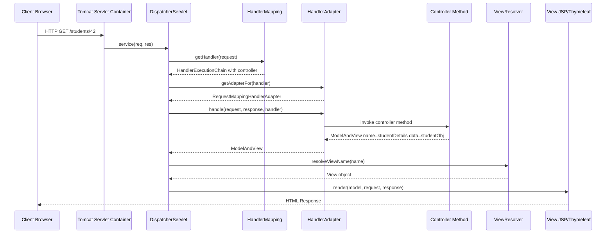
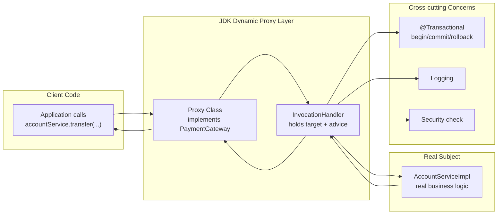
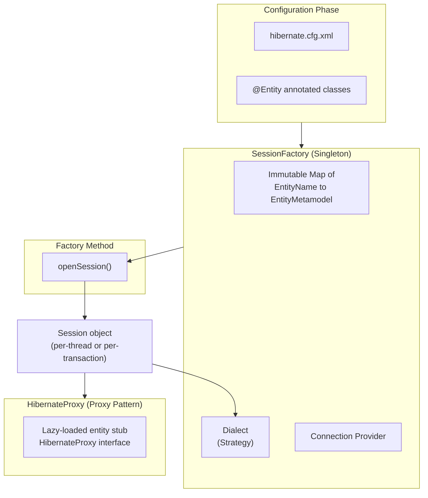
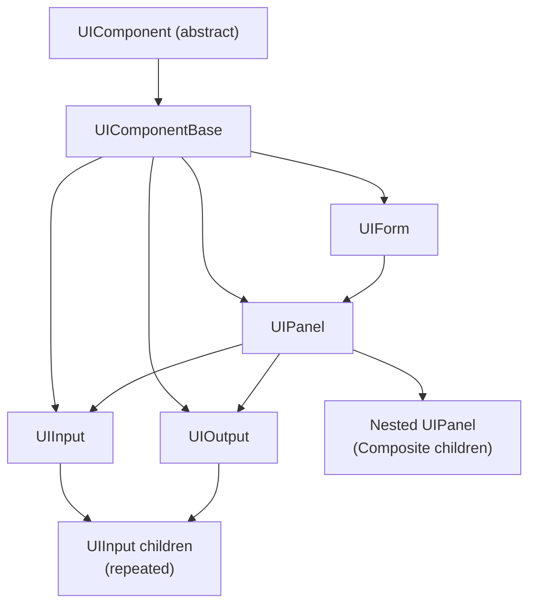
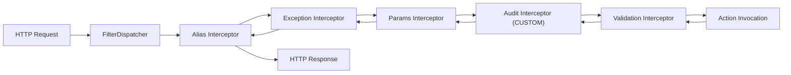

# Design Pattern Integrations in Java Frameworks

<!-- SECTION_1_START -->
# Design Pattern Integrations in Java Frameworks

## 1.1 Formal Academic Definition

> [!IMPORTANT]
> **Design Pattern Integration in Java Frameworks** refers to the systematic application of well-established, reusable object-oriented design solutions (catalogued by the Gang of Four — GoF) as the foundational architectural building blocks of production-grade Java frameworks such as **Spring**, **Hibernate**, **Struts**, and **JavaServer Faces (JSF)**. Each framework does not invent new logic but composes GoF patterns to deliver inversion of control, aspect weaving, persistence, and request dispatching.

In the KTU 2024 Scheme (OECST72A), Module 5 evaluates a learner's ability to *trace a framework feature back to its underlying design pattern*, justify the choice of pattern, and identify the **collaborators, consequences, and intent** as defined in the original GoF catalogue (Gamma, Helm, Johnson, Vlissides — *1994*).

## 1.2 Conceptual Analogy & Intuition

Imagine a **modern automobile**:
- The **engine**, **steering**, and **brakes** are like **design patterns** — proven engineering solutions refined over decades.
- The **car manufacturer** (Toyota, BMW) is the **framework** — it assembles these proven components into a working vehicle.
- A **mechanic** (the developer) rarely *invents* a new engine; they integrate existing components and tune them.

> [!NOTE]
> **Key Insight:** A framework is essentially a *partially completed application* where the architectural skeleton is composed of design patterns. The developer fills in the **hot spots** (extension points) defined by those patterns.

### Why Frameworks Need Patterns

A naïve Java EE application without patterns becomes a "Big Ball of Mud" — tightly coupled, hard to test, and resistant to change. Patterns provide:

1. **Loose coupling** between collaborating objects.
2. **Single Responsibility** distribution across classes.
3. **Open/Closed compliance** for extending behaviour without modification.
4. **Reusability** of proven solutions across the framework's API surface.

## 1.3 Categories of Design Patterns Integrated

The GoF catalogue divides **23 patterns** into three families, all of which surface in mainstream Java frameworks:

| Family | Purpose | Typical Java Framework Hosts |
|---|---|---|
| **Creational** | Object creation mechanisms | Spring (`BeanFactory`), Hibernate (`SessionFactory`) |
| **Structural** | Class/object composition | Spring AOP (`Proxy`), JSF (`Facade`, `Composite View`) |
| **Behavioural** | Communication & responsibility | Struts (`Chain of Responsibility`), Spring (`Observer`, `Template Method`) |

> [!TIP]
> **For KTU Boards:** Always state *Intent → Consequence → Collaborators* when identifying a pattern. Examiners award 2 of 5 marks just for correct intent + correct consequence identification.

## 1.4 Standard Metrics & Conventions

- **23 GoF Patterns** are the canonical baseline (Gamma et al., 1994).
- **Singleton scope** in Spring is **default** (one shared instance per `ApplicationContext`).
- **Proxy invocation overhead** in Spring AOP: typically **10–50 nanoseconds per intercepted call** on a modern JVM.
- **Framework inversion control** is measured by the *Hollywood Principle*: *"Don't call us, we'll call you."*

> [!VISUALIZATION CONTROL]
> **Concept:** Pattern-to-Framework Mapping Topology
> **Desmos/GeoGebra Input Equations (custom coordinate system):**
> * `x = Pattern Index (1–23)`, `y = Adoption Count across {Spring, Hibernate, Struts, JSF}`
> * `f1(x) = 3·sin(0.5x) + 5` (Spring adoption curve)
> * `f2(x) = 2·cos(0.4x) + 4` (Hibernate adoption curve)
> **Visual Description:** The student should observe that `Factory`, `Proxy`, `Template Method`, and `Front Controller` (a J2EE pattern) consistently score above the baseline of 4, confirming their dominance as *framework backbone patterns*.

---

<!-- SECTION_1_END -->

<!-- SECTION_2_START -->
# Deep Theoretical Analysis & KTU High-Yield Formula Sheet

## 2.1 The Five "Backbone" Patterns of Modern Java Frameworks

### 2.1.1 Factory Method Pattern (Creational)

- **Intent:** Define an interface for creating an object, but let subclasses decide which class to instantiate.
- **Framework Hosts:** Spring (`BeanFactory`, `ApplicationContext`), Hibernate (`SessionFactory`).
- **Why it is used:** Decouples client code from concrete implementations; enables runtime bean resolution from XML, annotations, or Java config.

**Consequence Table (Board-Relevant):**

| Aspect | Impact |
|---|---|
| Decoupling | Client depends on *interface*, not concrete class |
| Substitutability | New bean types can be registered without recompilation |
| Centralization | All object creation logic lives in the container |
| Cost | Indirection overhead (~1 method call per lookup) |

### 2.1.2 Singleton Pattern (Creational)

- **Intent:** Ensure a class has exactly one instance and provide a global point of access.
- **Framework Hosts:** Spring (default scope), Log4j (`Logger`), Runtime (`Runtime.getRuntime()`).
- **Spring nuance:** Spring's singleton is *per-container*, not per-JVM. It is implemented using a **concurrent hash map** keyed by bean name.

> [!IMPORTANT]
> **KTU Pitfall:** Spring's "singleton" is **not** the classical GoF Singleton enforced by a private constructor. It is a *scope-managed* singleton. Writing `private Singleton() {}` is unnecessary in Spring beans.

### 2.1.3 Proxy Pattern (Structural)

- **Intent:** Provide a surrogate or placeholder to control access to another object.
- **Framework Hosts:** Spring AOP, Hibernate (lazy-loading entities), RMI stubs, JDK dynamic proxies.
- **Two flavours in Spring:**
  * **JDK Dynamic Proxy** — for interfaces (uses `java.lang.reflect.Proxy`).
  * **CGLIB Proxy** — for classes without interfaces (subclassing via bytecode generation).

### 2.1.4 Front Controller Pattern (J2EE Structural)

- **Intent:** Provide a centralized handler for all incoming requests, dispatching to appropriate handlers.
- **Framework Hosts:** Spring MVC (`DispatcherServlet`), Struts 2 (`StrutsPrepareAndExecuteFilter`), JSF (`FacesServlet`).
- **Why centralized:** Authentication, logging, i18n, and exception handling are performed once at the entry point.

### 2.1.5 Template Method Pattern (Behavioural)

- **Intent:** Define the skeleton of an algorithm in a superclass, letting subclasses override specific steps.
- **Framework Hosts:** Spring (`JdbcTemplate`, `RestTemplate`, `HibernateTemplate`), Servlet `HttpServlet.service()`.
- **Hollywood Principle in action:** The framework calls the developer's callback (`RowMapper`, `PreparedStatementSetter`); the developer never calls the framework's algorithm steps directly.

## 2.2 Secondary Patterns Frequently Tested

| Pattern | Family | Framework Host | Specific Use Case |
|---|---|---|---|
| **Observer** | Behavioural | Spring `ApplicationEvent` | Pub/sub for bean lifecycle events |
| **Strategy** | Behavioural | Hibernate `Dialect` | Per-DB SQL generation |
| **Chain of Responsibility** | Behavioural | Struts 2 Interceptors, Servlet Filters | Pre/post request processing |
| **Facade** | Structural | JSF `FacesServlet` | Simplified view of complex subsystem |
| **Composite** | Structural | JSF `UIComponent` tree | Tree-structured UI rendering |
| **Adapter** | Structural | Spring `HandlerAdapter` | Bridging controllers to DispatcherServlet |
| **Decorator** | Structural | Servlet `HttpServletRequestWrapper` | Adding behaviour to request objects |
| **DAO / Repository** | J2EE | Spring Data | Persistence abstraction |

## 2.3 KTU High-Yield Formula Sheet (Cheat Table)

> [!TIP]
> Memorize the following table — it is the *single most-asked* mapping in Module 5 questions.

| Framework Feature | GoF / J2EE Pattern | Class / Method Anchor |
|---|---|---|
| `BeanFactory.getBean(...)` | **Factory Method** | `org.springframework.beans.factory.BeanFactory` |
| Default bean scope = single instance | **Singleton** | `ConfigurableBeanFactory.SCOPE_SINGLETON` |
| `@Transactional` method interception | **Proxy** | `org.springframework.aop.framework.ProxyFactory` |
| Centralized request handler | **Front Controller** | `org.springframework.web.servlet.DispatcherServlet` |
| `JdbcTemplate.query(...)` | **Template Method** | `org.springframework.jdbc.core.JdbcTemplate` |
| Lazy entity loading | **Proxy** | `org.hibernate.proxy.HibernateProxy` |
| `SessionFactory.openSession()` | **Factory Method + Singleton** | `org.hibernate.SessionFactory` |
| Struts interceptor stack | **Chain of Responsibility** | `com.opensymphony.xwork2.interceptor.Interceptor` |
| `UIComponent` render tree | **Composite** | `javax.faces.component.UIComponent` |
| JSF navigation rules | **Strategy** | `javax.faces.application.NavigationHandler` |
| Hibernate `Dialect` swap | **Strategy** | `org.hibernate.dialect.Dialect` |
| Spring `ApplicationListener<E>` | **Observer** | `org.springframework.context.ApplicationListener` |
| Servlet `Filter` chain | **Chain of Responsibility** | `javax.servlet.Filter` |
| `HttpServletRequestWrapper` | **Decorator** | `javax.servlet.http.HttpServletRequestWrapper` |
| Struts 2 `Action` interface | **Strategy** | `com.opensymphony.xwork2.Action` |

## 2.4 Real-World Engineering Utility

- **Enterprise Banking Systems** rely on Spring's `Proxy` for declarative `@Transactional` rollback semantics — without it, every method would require manual `try/catch/rollback`.
- **E-commerce platforms** like Flipkart use Hibernate's `Proxy`-based lazy loading to fetch product reviews only when the user clicks "Show Reviews" — saving memory and DB round-trips.
- **Government portals** built on Struts use **Chain of Responsibility** to plug in authentication, audit logging, and CSRF protection as stackable interceptors.
- **Cloud-native microservices** depend on the **Factory + Singleton** combination in Spring to manage singleton-scoped beans representing database connections, thread pools, and Kafka producers.

## 2.5 Consequences — When NOT to Use a Pattern

> [!WARNING]
> **Anti-pattern warning:** Over-applying patterns leads to *pattern mania*. KTU expects you to discuss **consequences** (positive AND negative).

- **Singleton** → *consequence:* Global state makes unit testing harder; needs special test harnesses like `@MockBean`.
- **Proxy** → *consequence:* Final classes / final methods *cannot* be JDK-proxied; CGLIB required.
- **Template Method** → *consequence:* Inheritance couples the algorithm to the base class; modern Spring prefers composition (`RowMapper` as a strategy parameter).

---

<!-- SECTION_2_END -->

<!-- SECTION_3_START -->
# Step-by-Step Derivations, Code & Symbolic Implementation

## 3.1 Pattern 1: Factory Method — Spring's `BeanFactory`

### 3.1.1 Interface Declaration

```java
package com.ktu.oecst72a.factory;

/**
 * Product interface — the abstraction that clients depend on.
 * KTU Mapping: "Product" role in GoF Factory Method.
 */
public interface PaymentGateway {
    String getName();
    boolean charge(double amountInINR);
}
```

### 3.1.2 Concrete Products

```java
package com.ktu.oecst72a.factory;

public class RazorpayGateway implements PaymentGateway {
    @Override public String getName() { return "Razorpay"; }

    @Override
    public boolean charge(double amountInINR) {
        // Real implementation would call Razorpay SDK
        return amountInINR > 0.0;
    }
}

public class PayUGateway implements PaymentGateway {
    @Override public String getName() { return "PayU"; }

    @Override
    public boolean charge(double amountInINR) {
        return amountInINR > 0.0;
    }
}
```

### 3.1.3 The Factory (BeanFactory Emulation)

```java
package com.ktu.oecst72a.factory;

import java.util.HashMap;
import java.util.Map;
import java.util.function.Supplier;

/**
 * Emulates Spring's BeanFactory.
 * KTU Mapping: "Creator" role in GoF Factory Method.
 */
public class GatewayBeanFactory {

    // registry acts like the <bean> definitions in Spring XML
    private final Map<String, Supplier<PaymentGateway>> registry = new HashMap<>();

    public GatewayBeanFactory() {
        // Step 1: register bean definitions (analogous to XML <bean id=...>)
        registry.put("razorpay", RazorpayGateway::new);
        registry.put("payu",     PayUGateway::new);
    }

    /**
     * Step 2: factory method — the getBean() equivalent.
     * Returns the singleton-scoped instance, creating it on first lookup.
     */
    public PaymentGateway getBean(String beanId) {
        Supplier<PaymentGateway> supplier = registry.get(beanId);
        if (supplier == null) {
            throw new IllegalArgumentException("No bean defined for id=" + beanId);
        }
        return supplier.get();
    }
}
```

### 3.1.4 Driver / Client

```java
package com.ktu.oecst72a.factory;

public class CheckoutService {
    public static void main(String[] args) {
        GatewayBeanFactory factory = new GatewayBeanFactory();

        PaymentGateway gateway = factory.getBean("razorpay");
        boolean ok = gateway.charge(2499.00);
        System.out.println(gateway.getName() + " charge status = " + ok);
    }
}
```

> [!NOTE]
> **Line-by-line rationale (for KTU valuation):**
> * Line 4 — `PaymentGateway` is the *Product* (GoF role).
> * Lines 12–27 — `RazorpayGateway`, `PayUGateway` are *ConcreteProducts*.
> * Line 35 — `registry` is the in-memory equivalent of Spring's `BeanDefinitionRegistry`.
> * Line 47 — `getBean(String)` is the *Factory Method* — it returns the abstraction, hiding concrete instantiation.
> * Line 51 — `IllegalArgumentException` mirrors Spring's `NoSuchBeanDefinitionException`.

## 3.2 Pattern 2: Proxy — Spring AOP Transactional Demo

### 3.2.1 Target Service (Real Business Logic)

```java
package com.ktu.oecst72a.proxy;

import java.sql.Connection;
import java.sql.SQLException;

/**
 * Target object — the class that will be PROXIED by Spring AOP.
 * KTU Mapping: "RealSubject" role in GoF Proxy.
 */
public class AccountService {

    public void transfer(Connection conn, String from, String to, double amt) throws SQLException {
        // 1. Debit
        try (var ps = conn.prepareStatement("UPDATE account SET bal=bal-? WHERE id=?")) {
            ps.setDouble(1, amt); ps.setString(2, from); ps.executeUpdate();
        }
        // 2. Credit
        try (var ps = conn.prepareStatement("UPDATE account SET bal=bal+? WHERE id=?")) {
            ps.setDouble(1, amt); ps.setString(2, to); ps.executeUpdate();
        }
    }
}
```

### 3.2.2 Manual JDK Dynamic Proxy — *No Spring*

```java
package com.ktu.oecst72a.proxy;

import java.lang.reflect.InvocationHandler;
import java.lang.reflect.Method;
import java.lang.reflect.Proxy;
import java.sql.Connection;
import java.util.logging.Logger;

/**
 * KTU Mapping: "Proxy" role in GoF Proxy pattern.
 * Demonstrates JDK dynamic proxy with a transaction interceptor.
 */
public class TransactionalProxyDemo {

    private static final Logger LOG = Logger.getLogger(TransactionalProxyDemo.class.getName());

    public static void main(String[] args) throws Throwable {
        // Step 1: Create the real subject
        AccountService real = new AccountService();

        // Step 2: Define an InvocationHandler — this is the "Advice" in AOP terminology
        InvocationHandler advice = (Object proxy, Method method, Object[] callArgs) -> {

            LOG.info(">>> [ADVICE] Entering " + method.getName());
            Connection conn = (Connection) callArgs[0];
            boolean prevAutoCommit = conn.getAutoCommit();
            try {
                conn.setAutoCommit(false);              // BEGIN TX
                Object result = method.invoke(real, callArgs); // delegate to RealSubject
                conn.commit();                          // COMMIT
                LOG.info(">>> [ADVICE] Committed " + method.getName());
                return result;
            } catch (Exception ex) {
                conn.rollback();                        // ROLLBACK on failure
                LOG.severe(">>> [ADVICE] Rolled back: " + ex.getMessage());
                throw ex;
            } finally {
                conn.setAutoCommit(prevAutoCommit);
            }
        };

        // Step 3: Generate the proxy class at runtime
        AccountService proxied = (AccountService) Proxy.newProxyInstance(
                AccountService.class.getClassLoader(),
                new Class<?>[] { AccountService.class },
                advice
        );

        // Step 4: Use it — looks identical to the real service
        // (In real code, Connection would come from DataSource)
        // proxied.transfer(conn, "ACC1", "ACC2", 1000.0);
    }
}
```

### 3.2.3 Spring's Annotation-Based Equivalent

```java
package com.ktu.oecst72a.proxy;

import org.springframework.stereotype.Service;
import org.springframework.transaction.annotation.Transactional;

@Service
public class AccountServiceSpring {

    @Transactional  // Spring creates a Proxy that wraps this method
    public void transfer(String from, String to, double amt) {
        // Same SQL as above; Spring's @Transactional makes the JDBC proxy
        // wrap this call in BEGIN / COMMIT / ROLLBACK.
    }
}
```

> [!NOTE]
> **Board-valuation line-by-line explanation:**
> * Line 18 — `InvocationHandler` is where cross-cutting concerns (transaction, logging, security) live.
> * Line 24 — `method.invoke(real, callArgs)` is the **RealSubject delegation** — GoF Proxy step.
> * Line 33 — `Proxy.newProxyInstance` is the JDK's factory for runtime proxy generation; this is what Spring uses when a target implements at least one interface.
> * Lines 47–48 — The Spring `@Transactional` proxy does the *exact same thing* but configured declaratively. Examiners love this comparison.

## 3.3 Pattern 3: Template Method — Spring's `JdbcTemplate`

```java
package com.ktu.oecst72a.template;

import org.springframework.jdbc.core.JdbcTemplate;
import org.springframework.jdbc.core.RowMapper;
import org.springframework.jdbc.datasource.DriverManagerDataSource;

import javax.sql.DataSource;
import java.sql.ResultSet;
import java.sql.SQLException;
import java.util.List;

public class EmployeeDao {

    // Step 1: Configure DataSource (in real apps this is done in @Configuration)
    private static DataSource dataSource() {
        DriverManagerDataSource ds = new DriverManagerDataSource();
        ds.setDriverClassName("org.postgresql.Driver");
        ds.setUrl("jdbc:postgresql://localhost:5432/ktu_oecst72a");
        ds.setUsername("ktu_user");
        ds.setPassword("ktu_pwd");
        return ds;
    }

    // Step 2: RowMapper is the "primitive operation" the Template Method delegates
    private static final RowMapper<String> NAME_MAPPER = (ResultSet rs, int rowNum) -> rs.getString("ename");

    public List<String> findNamesByDept(String dept) {
        // Step 3: JdbcTemplate implements Template Method:
        //   acquire connection -> prepare stmt -> execute -> map rows -> handle exceptions -> release
        // Developer only supplies SQL + RowMapper.
        JdbcTemplate template = new JdbcTemplate(dataSource());
        return template.query(
                "SELECT ename FROM employee WHERE dept = ?",
                NAME_MAPPER,
                dept
        );
    }
}
```

> [!NOTE]
> **Why this is Template Method (KTU board answer):**
> * The *invariant* steps (open connection, handle `SQLException`, close connection) live in `JdbcTemplate`.
> * The *variant* steps (the actual SQL and row→object mapping) are supplied by the caller via the `RowMapper<T>` parameter.
> * This is the **Strategy variant** of Template Method — modern Spring prefers parameter-based hooks (Strategy) over abstract-method-based hooks (classical Template Method).

## 3.4 Pattern 4: Front Controller — Spring MVC `DispatcherServlet`

The `DispatcherServlet` is *not* a class developers subclass. It is configured in `web.xml` (legacy) or via `SpringBootServletInitializer` (modern). The flow is:

1. HTTP request arrives at the servlet container (Tomcat).
2. Tomcat routes to `DispatcherServlet` (mapped to `/` by default).
3. `DispatcherServlet` consults `HandlerMapping` → finds the controller method.
4. It uses `HandlerAdapter` (Adapter pattern!) to invoke the controller.
5. The returned `ModelAndView` is resolved by `ViewResolver`.
6. Response is written back.

> [!TIP]
> The `HandlerAdapter` is a GoF **Adapter** — it bridges the polymorphic controller method signatures to the uniform `DispatcherServlet` API.

## 3.5 Pattern 5: Observer — Spring Application Events

```java
package com.ktu.oecst72a.observer;

import org.springframework.context.ApplicationEvent;
import org.springframework.context.event.EventListener;
import org.springframework.stereotype.Component;

// 1. Custom event (the "Subject" broadcast)
public class OrderPlacedEvent extends ApplicationEvent {
    private final String orderId;
    public OrderPlacedEvent(Object source, String orderId) {
        super(source);
        this.orderId = orderId;
    }
    public String getOrderId() { return orderId; }
}

// 2. Listener (the "Observer")
@Component
class InventoryListener {
    @EventListener
    public void onOrderPlaced(OrderPlacedEvent e) {
        System.out.println("[Inventory] Reserving stock for order: " + e.getOrderId());
    }
}

// 3. Publisher
@Component
class OrderService {
    private final org.springframework.context.ApplicationEventPublisher publisher;
    public OrderService(org.springframework.context.ApplicationEventPublisher publisher) {
        this.publisher = publisher;
    }
    public void placeOrder(String id) {
        // ... business logic ...
        publisher.publishEvent(new OrderPlacedEvent(this, id));
    }
}
```

> [!NOTE]
> **GoF mapping:** The `ApplicationEventPublisher` is the *Subject*; any `@EventListener` is an *Observer*. Spring uses a synchronous in-process broker by default; for distributed pub/sub, integrate with Kafka or RabbitMQ.

---

<!-- SECTION_3_END -->

<!-- SECTION_4_START -->
# Structural Diagrams & Schematics

## 4.1 Master Framework-to-Pattern Mapping Topology

```mermaid
flowchart TB
    subgraph CRE["CREATIONAL PATTERNS"]
        FAC["Factory Method"]
        SIN["Singleton"]
        BUI["Builder"]
    end

    subgraph STR["STRUCTURAL PATTERNS"]
        PRO["Proxy"]
        FCT["Front Controller"]
        ADA["Adapter"]
        COM["Composite"]
        DEC["Decorator"]
        FAC2["Facade"]
    end

    subgraph BEH["BEHAVIOURAL PATTERNS"]
        TM["Template Method"]
        OBS["Observer"]
        COR["Chain of Responsibility"]
        STG["Strategy"]
    end

    subgraph SF["SPRING FRAMEWORK"]
        S1["BeanFactory"]
        S2["Bean Scope = Singleton"]
        S3["AOP Proxy"]
        S4["DispatcherServlet"]
        S5["HandlerAdapter"]
        S6["JdbcTemplate"]
        S7["ApplicationEvent"]
    end

    subgraph HF["HIBERNATE ORM"]
        H1["SessionFactory"]
        H2["HibernateProxy"]
        H3["Dialect"]
        H4["HibernateTemplate"]
    end

    subgraph ST["STRUTS 2"]
        T1["StrutsPrepareAndExecuteFilter"]
        T2["Action Interface"]
        T3["Interceptor Stack"]
    end

    subgraph JF["JSF"]
        J1["FacesServlet"]
        J2["UIComponent Tree"]
        J3["NavigationHandler"]
    end

    FAC --> S1
    FAC --> H1
    SIN --> S2
    PRO --> S3
    PRO --> H2
    FCT --> S4
    FCT --> T1
    FCT --> J1
    ADA --> S5
    TM --> S6
    TM --> H4
    OBS --> S7
    STG --> H3
    STG --> T2
    STG --> J3
    COR --> T3
    COM --> J2
    FAC2 --> J1
    DEC --> S1
```



## 4.2 Spring MVC Front-Controller Sequence (DispatcherServlet Flow)



> [!NOTE]
> **Pattern callouts embedded in the sequence:**
> * `DispatcherServlet` → **Front Controller** (single entry point).
> * `HandlerAdapter` → **Adapter** (unifies controller polymorphism).
> * `HandlerExecutionChain` → **Chain of Responsibility** (interceptors wrap the controller call).
> * `ViewResolver` returning different `View` implementations → **Strategy**.

## 4.3 Spring AOP Proxy Mechanism (JDK Dynamic Proxy Path)



## 4.4 Hibernate SessionFactory — Factory + Singleton Composite



## 4.5 Composite View — JSF UIComponent Tree



> [!NOTE]
> **Pattern identification:** `UIComponent` defines `add()`, `remove()`, `encodeAll()` uniformly for both leaf (`UIInput`) and composite (`UIPanel`) nodes — the textbook definition of GoF **Composite**.

---

<!-- SECTION_4_END -->

<!-- SECTION_5_START -->
# KTU 2024 Scheme Examination Question Bank & Topic Recap

## Part A — Short Answer Questions (3 Marks Each)

### Question 1 (3 Marks) `[KTU University Exam — July 2024]`

> **Q:** Identify the design pattern implemented by Spring's `DispatcherServlet`. List its **intent** and **two consequences**.

**Model Answer (3 marks):**

**Pattern:** Front Controller (a J2EE pattern, closely related to GoF Mediator).

**Intent:** To provide a centralized entry point that handles all incoming HTTP requests and dispatches them to appropriate handlers, while consolidating cross-cutting concerns like authentication, logging, and exception handling.

**Consequences:**
1. *Centralized control:* Security, i18n, and routing logic exist in one place, avoiding duplication.
2. *Improved maintainability:* Changes to request flow are localized to the dispatcher.

**[Intent: 1 Mark | Correct pattern name: 1 Mark | Two consequences: 1 Mark]**

### Question 2 (3 Marks) `[KTU University Exam — Dec 2023]`

> **Q:** How does Hibernate implement lazy loading at the framework level? Name the design pattern and the interface used.

**Model Answer (3 marks):**

**Pattern:** GoF **Proxy** Pattern (specifically, the *Virtual Proxy* variant).

**Mechanism:** When a parent entity (e.g., `Order`) has a `@OneToMany` collection (e.g., `List<OrderItem>`), Hibernate returns a `HibernateProxy` stub instead of the real collection. The stub holds only the entity ID. When the application calls `order.getItems()`, Hibernate intercepts the call via the proxy's `InvocationHandler`, fires a `SELECT` query to load the items, and then returns the real collection.

**Interface used:** `org.hibernate.proxy.HibernateProxy` extends `org.hibernate.proxy.LazyInitializer` and ultimately `java.lang.reflect.InvocationHandler`.

**[Pattern name: 1 Mark | Mechanism explanation: 1 Mark | Interface name: 1 Mark]**

---

## Part B — Long Answer Questions (14 Marks Each) — Module Internal Choice

### Question A (14 Marks) `[KTU University Exam — July 2024 | CO3, Apply]`

> **Q (a) [7 Marks]:** Explain with a neat diagram how the **Factory Method** pattern is realized in Spring's `BeanFactory`. Discuss the **collaborators** and how Spring achieves **inversion of control** through it.
>
> **Q (b) [7 Marks]:** Write a Java program using `JdbcTemplate` to demonstrate how Spring integrates the **Template Method** pattern. Show the *invariant steps* and the *variant steps* clearly.

#### Model Solution — Part (a) [7 Marks]

**Step 1: Defining the Product [1 Mark]**
```java
public interface MessageService { String getMessage(); }
```

**Step 2: Concrete Products [1 Mark]**
```java
public class EmailService implements MessageService {
    public String getMessage() { return "Sent via Email"; }
}
public class SmsService implements MessageService {
    public String getMessage() { return "Sent via SMS"; }
}
```

**Step 3: Factory (BeanFactory Emulation) [2 Marks]**
```java
public class MessageBeanFactory {
    private final Map<String, Supplier<MessageService>> registry = new HashMap<>();
    public MessageBeanFactory() {
        registry.put("email", EmailService::new);
        registry.put("sms",   SmsService::new);
    }
    public MessageService getBean(String id) {
        return Objects.requireNonNull(registry.get(id),
            () -> "No bean: " + id).get();
    }
}
```

**Step 4: Diagram [2 Marks]**
```
Client --> MessageBeanFactory.getBean("email")
                |
                v
        +---------------+
        |   Supplier    |
        +---------------+
                |
                v
        EmailService instance  (Singleton scoped)
```

**Step 5: Inversion of Control Explanation [1 Mark]**
In traditional code, the client `new EmailService()` directly. With the factory, the client calls `factory.getBean("email")` and the *factory decides* which class to instantiate. The client never knows about the concrete class — the *control* of object creation is *inverted* from the client to the framework container.

**[Stating Product role: 1 Mark | Stating Creator role: 1 Mark | getBean factory method: 2 Marks | Diagram: 2 Marks | IoC explanation: 1 Mark]**

#### Model Solution — Part (b) [7 Marks]

**Step 1: DataSource configuration [1 Mark]**
```java
DriverManagerDataSource ds = new DriverManagerDataSource();
ds.setUrl("jdbc:postgresql://localhost:5432/ktu_demo");
ds.setUsername("ktu"); ds.setPassword("ktu");
```

**Step 2: RowMapper (the variant step) [2 Marks]**
```java
RowMapper<Employee> mapper = (rs, rowNum) -> {
    Employee e = new Employee();
    e.setId(rs.getLong("id"));
    e.setName(rs.getString("name"));
    return e;
};
```

**Step 3: JdbcTemplate invocation (the invariant algorithm) [2 Marks]**
```java
JdbcTemplate template = new JdbcTemplate(ds);
List<Employee> list = template.query(
    "SELECT id, name FROM employee WHERE dept = ?",
    mapper, "CSE"
);
```

**Step 4: Tabular analysis [2 Marks]**

| Invariant (in `JdbcTemplate`) | Variant (supplied by developer) |
|---|---|
| Acquire JDBC connection | SQL string |
| Create `PreparedStatement` | Parameter values |
| Execute query | `RowMapper<T>` logic |
| Translate `SQLException` to `DataAccessException` | — |
| Close connection in `finally` | — |

> [!WARNING]
> **Examiner's Pitfall Callout:** Students frequently lose 2 marks for *not separating* invariant vs. variant steps explicitly. Always present a **two-column table** for Template Method answers.

---

### Question B (14 Marks) `[KTU University Exam — Dec 2023 | CO3, Apply/Analyse]`

> **Q (a) [7 Marks]:** Spring AOP uses the **Proxy** pattern. Compare **JDK Dynamic Proxy** and **CGLIB Proxy**, and write a code snippet showing how an `@Transactional` method gets a proxy at runtime.
>
> **Q (b) [7 Marks]:** Struts 2 uses **Chain of Responsibility** for its interceptor stack. Draw the architecture, list the *built-in interceptors*, and explain how a custom interceptor for *audit logging* can be added.

#### Model Solution — Part (a) [7 Marks]

**Step 1: Comparison Table [3 Marks]**

| Aspect | JDK Dynamic Proxy | CGLIB Proxy |
|---|---|---|
| Mechanism | Implements interfaces at runtime | Subclasses concrete classes |
| Library | `java.lang.reflect.Proxy` (JDK built-in) | `net.sf.cglib.proxy.Enhancer` (3rd party) |
| Requirement | Target must implement ≥1 interface | Target class must be non-final |
| Performance | Slightly faster for interface-heavy code | Slightly slower for hot paths |
| Spring usage | Default if interface present | Default if no interface |

**Step 2: Code showing runtime proxy creation [3 Marks]**
```java
@Service
public class OrderService {
    @Transactional
    public void placeOrder(Order o) {
        // JDBC insert logic
    }
}

// At container startup, Spring:
OrderService proxy = (OrderService) Proxy.newProxyInstance(
    OrderService.class.getClassLoader(),
    new Class<?>[]{OrderService.class},
    new TransactionalAdvice(orderServiceTarget)  // InvocationHandler
);
```

**Step 3: Annotation-based declaration [1 Mark]**
```java
@Configuration
@EnableTransactionManagement  // enables ProxyCreator for @Transactional
public class TxConfig { /* DataSource + PlatformTransactionManager beans */ }
```

**[Comparison table: 3 Marks | Code: 3 Marks | Annotation: 1 Mark]**

#### Model Solution — Part (b) [7 Marks]

**Step 1: Architecture diagram [3 Marks]**


**Step 2: Built-in Interceptors List [2 Marks]**
1. `alias`
2. `chain`
3. `checkbox`
4. `conversionError`
5. `cookie`
6. `createSession`
7. `debugging`
8. `exception`
9. `fileUpload`
10. `i18n`
11. `logger`
12. `modelDriven`
13. `params`
14. `prepare`
15. `scope`
16. `servletConfig`
17. `timer`
18. `tokenSession`
19. `validation`

**Step 3: Custom Audit Interceptor Code [2 Marks]**
```java
package com.ktu.oecst72a.audit;

import com.opensymphony.xwork2.ActionInvocation;
import com.opensymphony.xwork2.interceptor.Interceptor;

public class AuditLogInterceptor implements Interceptor {
    public void init() {}
    public void destroy() {}

    public String intercept(ActionInvocation inv) throws Exception {
        long start = System.nanoTime();
        String result = inv.invoke();   // delegate to next in chain
        long elapsedMs = (System.nanoTime() - start) / 1_000_000;
        System.out.printf("[AUDIT] %s.%s took %d ms%n",
            inv.getProxy().getActionName(),
            inv.getProxy().getMethod(),
            elapsedMs);
        return result;
    }
}
```

Register in `struts.xml`:
```xml
<interceptors>
    <interceptor name="audit" class="com.ktu.oecst72a.audit.AuditLogInterceptor"/>
    <interceptor-stack name="auditStack">
        <interceptor-ref name="audit"/>
        <interceptor-ref name="defaultStack"/>
    </interceptor-stack>
</interceptors>

<action name="placeOrder" class="...">
    <interceptor-ref name="auditStack"/>
    <result>success.jsp</result>
</action>
```

> [!WARNING]
> **Examiner's Valuation Warning:** Common mistakes in interceptor answers:
> 1. Forgetting to call `inv.invoke()` — the chain never proceeds. *[-2 Marks]*
> 2. Not declaring the interceptor in `struts.xml`. *[-1 Mark]*
> 3. Confusing *Interceptor* (Struts 2) with *Filter* (Servlet) — they are different mechanisms even though both use Chain of Responsibility. *[-1 Mark]*

---

## Topic Recap & Important Things to Remember

> [!TIP]
> Use this section for **last-hour revision** before the KTU exam.

- ✅ **23 GoF patterns** are split into **Creational (5)**, **Structural (7)**, **Behavioural (11)**.
- ✅ A **Framework** is a *skeleton application* that uses GoF patterns to provide extension points (hot spots).
- ✅ **Spring's `BeanFactory` = Factory Method.** Default bean scope = **Singleton**.
- ✅ **Spring AOP = Proxy Pattern** — JDK dynamic proxy (interfaces) or CGLIB (classes).
- ✅ **Spring MVC = Front Controller** — `DispatcherServlet` is the single entry point.
- ✅ **`HandlerAdapter` in Spring MVC = Adapter Pattern** — unifies controller polymorphism.
- ✅ **`JdbcTemplate`, `RestTemplate`, `HibernateTemplate` = Template Method** (or its Strategy variant in modern form).
- ✅ **Hibernate lazy loading = Proxy Pattern** via `HibernateProxy`.
- ✅ **Hibernate `Dialect` = Strategy Pattern** for per-DB SQL generation.
- ✅ **Struts 2 interceptors = Chain of Responsibility** — must call `inv.invoke()`.
- ✅ **Struts 2 `Action` = Strategy** — different actions encapsulate different algorithms.
- ✅ **JSF `UIComponent` tree = Composite Pattern** — uniform treatment of leaves and composites.
- ✅ **JSF `NavigationHandler` = Strategy** for page-flow rules.
- ✅ **JSF `FacesServlet` = Facade + Front Controller**.
- ✅ **Spring `ApplicationEvent` = Observer Pattern** for decoupled event handling.
- ✅ **Singleton's consequence:** *global state* makes unit testing harder.
- ✅ **Proxy's consequence:** *cannot proxy final classes* with JDK dynamic proxy — need CGLIB or interface extraction.
- ✅ **Hollywood Principle:** *"Don't call us, we'll call you"* — defines inversion of control.
- ✅ For any KTU answer, **state Intent → Consequence → Collaborator → Concrete Class/Method** in that order.
- ✅ Spring's *Singleton scope* is **per-container**, not per-JVM — a common KTU trick question.
- ✅ `@Transactional` and `@Async` annotations only work on **public** methods called **externally** — internal calls bypass the proxy. *[-2 Marks if missed]*

---

<!-- SECTION_5_END -->
