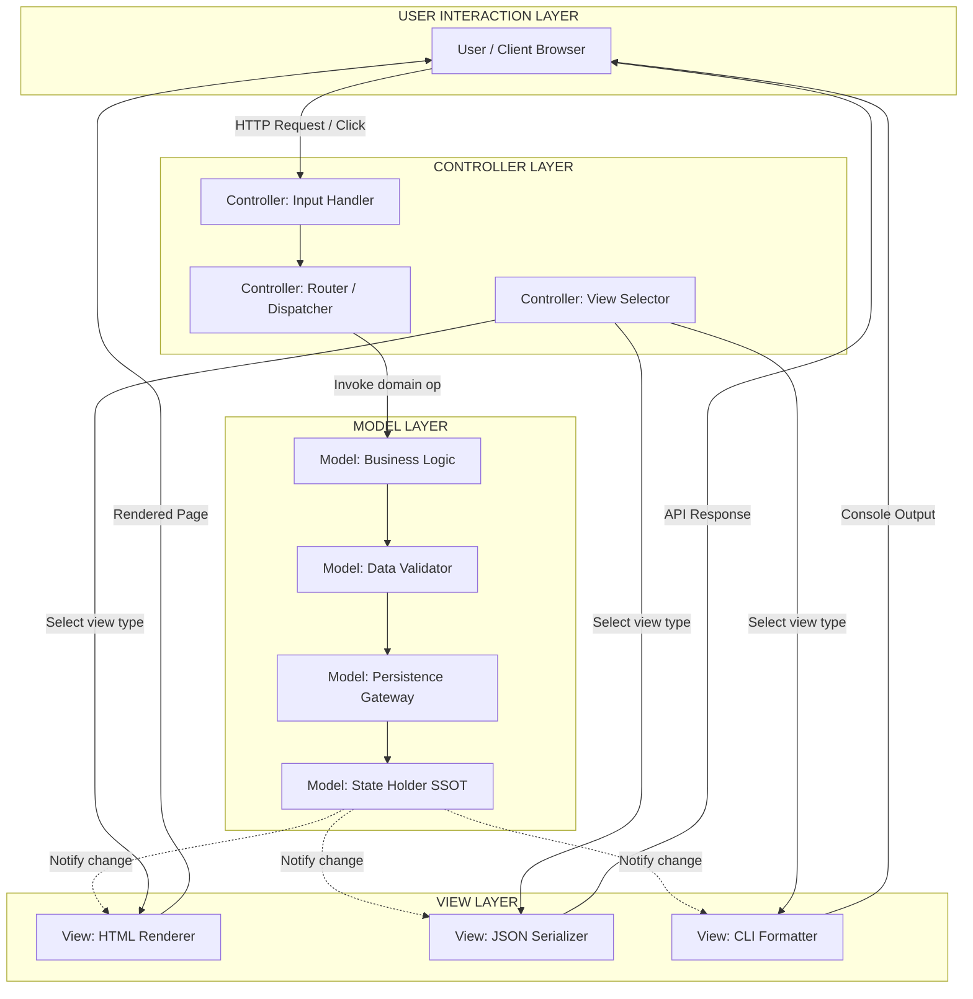
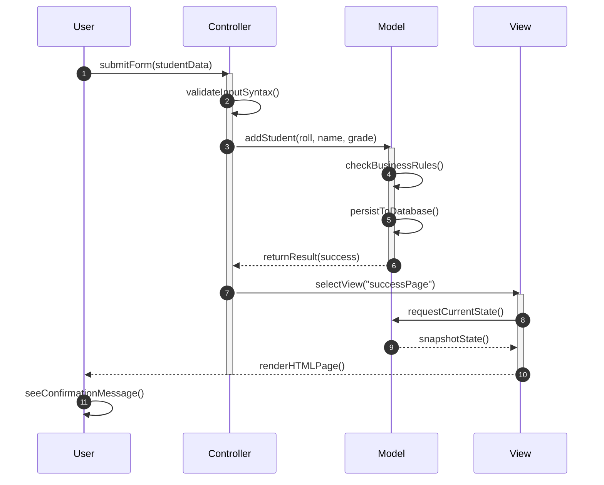
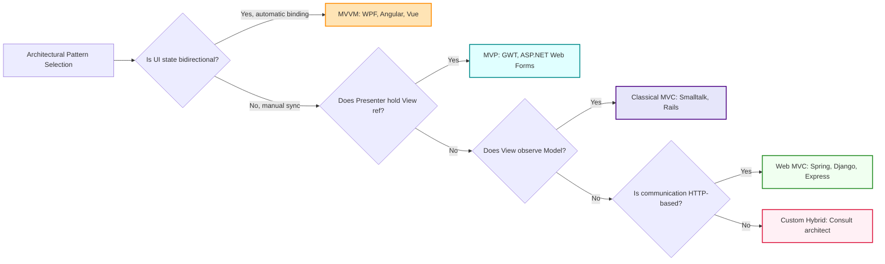
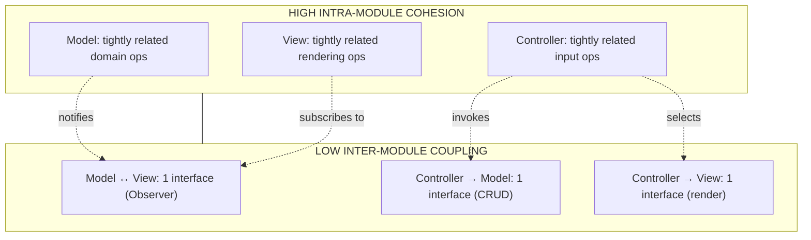
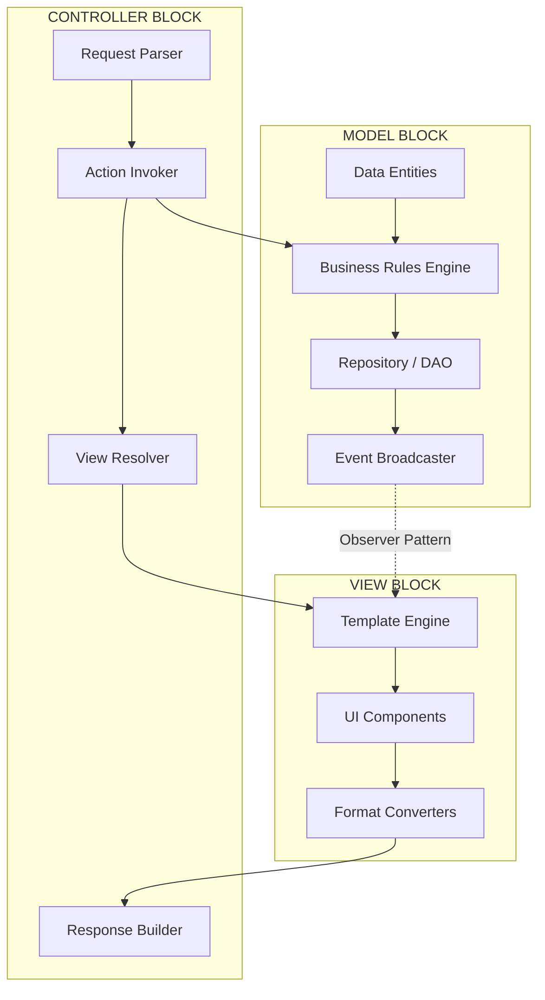
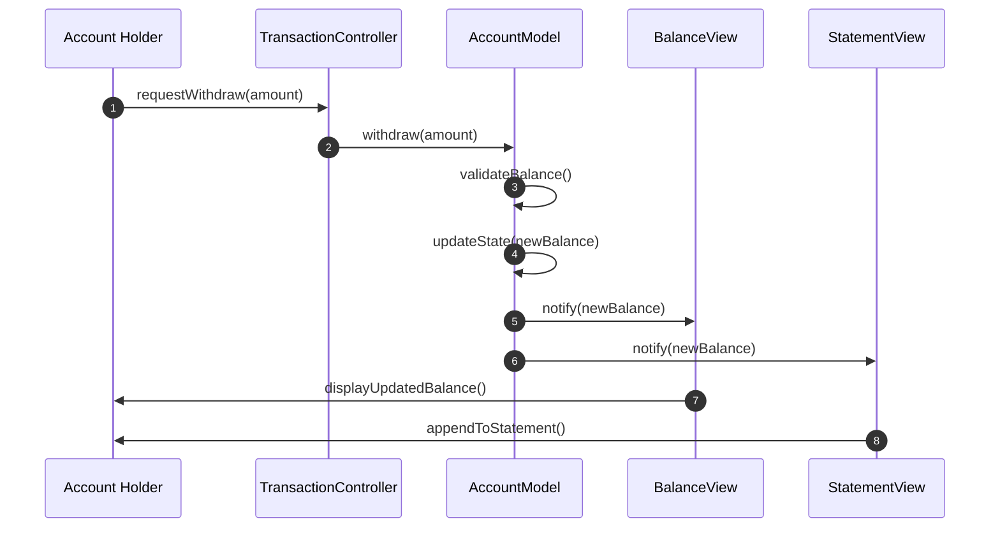

# Model-View-Controller (MVC) Architecture

<!-- SECTION_1_START -->

# MODEL-VIEW-CONTROLLER (MVC) ARCHITECTURE

## 1. Core Technical Definition (KTU 2024 Syllabus Terminology)

> [!IMPORTANT]
> **Definition (KTU Board Standard):** *Model-View-Controller (MVC)* is a foundational **architectural design pattern** that decomposes an interactive software application into three logically decoupled and interconnected components: the **Model**, the **View**, and the **Controller**. It enforces the *Separation of Concerns (SoC)* principle by isolating the **business logic and data state (Model)**, the **user interface and presentation (View)**, and the **input handling and flow orchestration (Controller)** into independent modules that communicate through well-defined interfaces.

**Historical Provenance:** The MVC pattern was originally formulated by **Trygve Reenskaug** in **1979** at the **Xerox Palo Alto Research Center (PARC)** while developing the **Smalltalk-80** programming environment. It is one of the seminal contributions cited in the *Gang of Four (GoF)* legacy patterns and remains the canonical structural template for nearly every modern web and desktop application framework.

---

## 2. Conceptual Analogy & Intuitive Overview

> [!NOTE]
> **Restaurant Kitchen Analogy:** Imagine a fine-dining restaurant where the entire operation mirrors MVC flawlessly:
>
> - **Customer (User)** — Sits at the table and interacts with the menu. Never enters the kitchen.
> - **Waiter (Controller)** — Takes the order, communicates it to the kitchen, and brings back the plated food. The waiter is the *sole mediator*.
> - **Chef (Model)** — Prepares the dish based purely on the recipe (business rules). Does not know who the customer is.
> - **Plated Food on Table (View)** — The visible representation delivered to the customer. Different plating styles can exist for the same dish.
>
> **Result:** If the chef changes a recipe, the food changes — but the customer still eats the same way. If a new plating style is introduced, the kitchen logic remains untouched. This is **decoupled evolution**, the very heart of MVC.

**Geometric Intuition — The Triadic Architecture:**

Visualize MVC as a triangle where the **Controller** sits at the apex, mediating between the **Model** (bottom-left vertex) and the **View** (bottom-right vertex).

> [!VISUALIZATION CONTROL]
> **Concept:** Triadic MVC Communication Topology
> **Coordinate System:** Cartesian plane representing coupling
> **Equations:**
> * $M(t) = \{d_1, d_2, ..., d_n\}$ — Model state vector at time $t$
> * $V(t) = f(M(t))$ — View as a pure function of Model state
> * $C(t) = g(U(t))$ — Controller as a function of User input $U$
> **Visual Description:** A triangle with three vertices. Edges are *directed* — Controller reads from Model and pushes to View; View reads from Model via *Observer* notification; User input flows *only* into the Controller. There is **no direct edge** between User→Model or Model→View in the classical formulation.

---

## 3. The Three Pillars — Formal Component Roles

### 3.1 The Model

The **Model** is the domain-specific representation of the information on which the application operates. It is the **brain** of the system.

- Encapsulates **business rules**, **validation logic**, and **data persistence**.
- Maintains the **single source of truth** (authoritative application state).
- Notifies registered observers (typically Views) when its state mutates.
- Is **completely unaware** of the View or Controller — it is *UI-agnostic*.

> [!NOTE]
> **KTU Key Term:** The Model must be **reactive** — it must broadcast *state-change events* rather than *commanding* the View to update. This inverts dependency and is the basis of the **Observer Pattern** linkage.

### 3.2 The View

The **View** is the **visual rendering layer** — anything the user actually sees and interacts with on screen.

- Renders the Model's state into a presentable form (HTML, JSON, GUI widgets, etc.).
- Is **stateless with respect to domain logic** — it does not own or modify business data.
- Subscribes to Model change events and re-renders reactively.
- Multiple Views can exist for a single Model (e.g., dashboard, chart, table — all showing the same sales data).

### 3.3 The Controller

The **Controller** acts as the **intermediary** that translates user gestures into Model operations and selects the appropriate View for response.

- Receives **HTTP requests**, **mouse clicks**, **keyboard events**, etc.
- Invokes the appropriate Model methods to mutate state.
- Chooses which View to render and forwards the prepared Model data to it.
- Contains **no business logic** of its own — it is purely an orchestrator.

---

<!-- SECTION_1_END -->

<!-- SECTION_2_START -->

# DEEP THEORETICAL ANALYSIS & KTU HIGH-YIELD FORMULA SHEET

## 1. Theoretical Foundations — The Three Cardinal Principles

### Principle 1: Separation of Concerns (SoC)

Each component has **one reason to change**. The Model changes when business rules evolve. The View changes when UI requirements evolve. The Controller changes when input workflows evolve. These three axes of change are **orthogonal**, enabling independent evolution.

> [!IMPORTANT]
> **Cohesion vs. Coupling Equation:**
> $$\text{Architectural Quality} = \frac{\text{Intra-module Cohesion}}{\text{Inter-module Coupling}}$$
> MVC maximizes the **numerator** and minimizes the **denominator**.

### Principle 2: The Hollywood Principle ("Don't call us, we'll call you")

The Model and Controller **never directly invoke** the View. The View registers itself as a listener to the Model. This is the *Inversion of Control (IoC)* applied to UI rendering.

### Principle 3: Single Source of Truth (SSOT)

The **Model is the only authoritative state holder**. The View is a *projection* of this state. There is no state duplication across components — eliminating synchronization bugs.

---

## 2. Communication Flows & Message Passing Topologies

### Flow Type A: Classical MVC (Smalltalk-80, Pull-Based)

The View polls the Model on demand.

$$U \rightarrow C \rightarrow M_{\text{mutate}} \rightarrow V_{\text{poll}} \rightarrow U_{\text{render}}$$

### Flow Type B: Modern MVC (Push-Based via Observer)

The Model broadcasts state-change events.

$$\text{Model.update}() \rightarrow \text{notifyObservers}() \rightarrow \text{View.refresh}()$$

### Flow Type C: Web MVC (HTTP-Request-Response)

The Controller selects View after Model mutation.

$$\text{HTTP Request} \rightarrow \text{Front Controller} \rightarrow \text{Controller} \rightarrow \text{Model} \rightarrow \text{View Resolver} \rightarrow \text{HTTP Response}$$

> [!NOTE]
> **KTU Board Note:** Examiners frequently test the difference between **Push** and **Pull** mechanisms. Push is **proactive** (event-driven), Pull is **reactive** (state-query). Most modern frameworks (Rails, Spring, Django) use **hybrid** models.

---

## 3. KTU High-Yield Formula Sheet & Comparison Matrix

### 3.1 Component Responsibility Matrix

| **Responsibility** | **Model** | **View** | **Controller** |
|---|---|---|---|
| Business Logic | ✅ Owns | ❌ Forbidden | ❌ Forbidden |
| Data Persistence | ✅ Owns | ❌ Forbidden | ❌ Forbidden |
| State Management | ✅ Authoritative | ❌ Cached only | ❌ Transient |
| UI Rendering | ❌ Forbidden | ✅ Owns | ❌ Forbidden |
| Input Handling | ❌ Forbidden | ✅ Captures | ✅ Processes |
| Routing / Navigation | ❌ Forbidden | ❌ Forbidden | ✅ Owns |
| Event Notification | ✅ Broadcasts | ✅ Listens | ❌ Mediates |
| Validation Rules | ✅ Domain rules | ✅ Format rules | ✅ Syntax rules |

### 3.2 MVC vs. Related Architectural Patterns

| **Property** | **MVC** | **MVP** | **MVVM** |
|---|---|---|---|
| Full Form | Model-View-Controller | Model-View-Presenter | Model-View-ViewModel |
| View Knows Model? | Indirect (via Observer) | No | Yes (via binding) |
| Mediator Component | Controller | Presenter | ViewModel |
| Data Binding | Manual | Manual | **Automatic (2-way)** |
| Testability | Medium | High | Very High |
| Used In | Rails, Spring, Django | GWT, ASP.NET Web Forms | WPF, Angular, Vue |
| Coupling Direction | Bidirectional | Unidirectional | Unidirectional |

> [!NOTE]
> **KTU Pitfall Alert:** Students often confuse MVP and MVC. In **MVP**, the Presenter holds a **direct reference** to the View via an *interface*, whereas in classical MVC, the View subscribes to the Model via the **Observer pattern**.

### 3.3 Interaction Contract Equations

| **Equation** | **Meaning** | **Variable Definition** |
|---|---|---|
| $V(t) = \mathcal{R}(M(t), \theta_V)$ | View rendering function | $\mathcal{R}$ is render op, $\theta_V$ is View config |
| $C(t) = \mathcal{H}(U(t), R)$ | Controller handler function | $\mathcal{H}$ is handler, $R$ is route table |
| $M(t+1) = \mathcal{T}(M(t), C(t))$ | Model transition function | $\mathcal{T}$ is business operation |
| $\text{Cohesion}(C_i) = \frac{\text{Internal Relations}}{\text{Total Relations}}$ | Module cohesion metric | $C_i$ is the i-th component |
| $\text{Coupling}(C_i, C_j) = \frac{\text{Inter-module Links}}{\text{Total Links}}$ | Coupling measure | Lower is better |

---

## 4. Real-World Engineering Utility

| **Domain** | **Framework** | **MVC Variant** | **Why MVC?** |
|---|---|---|---|
| Web Backend | Ruby on Rails | Classical MVC | Rapid CRUD scaffolding |
| Enterprise Java | Spring MVC | Web MVC | Pluggable View resolvers (JSP, Thymeleaf) |
| Python Web | Django | MTV (Model-Template-View) | Convention over configuration |
| .NET Stack | ASP.NET MVC | Web MVC | Separation from Web Forms legacy |
| JavaScript | Express.js | Flexible MVC | Middleware chain orchestration |
| Mobile (Android) | Native SDK | Modified MVC | Activity acts as Controller |
| Desktop GUI | JavaFX, Swing | Classical MVC | Swing's `Model` interfaces |

> [!IMPORTANT]
> **Production Engineering Insight:** In **microservices architectures**, the MVC pattern is often applied at the *service-bounded context* level. The Model becomes the **domain aggregate**, the View becomes the **serialized DTO (Data Transfer Object)**, and the Controller becomes the **REST/gRPC endpoint handler**. The architectural principle scales beyond UI applications.

---

<!-- SECTION_2_END -->

<!-- SECTION_3_START -->

# STEP-BY-STEP DERIVATIONS & CODE IMPLEMENTATION

## 1. Mathematical Derivation: View Refresh Latency in Observer-Based MVC

**Problem Statement:** Given a Model that broadcasts state changes to $N$ registered Views, derive the **time complexity** and **refresh latency** of the system.

**Step 1 — Define the system parameters.**

Let $M$ be the Model, $V_i$ for $i \in \{1, 2, ..., N\}$ be the registered Views, and $t_p$ be the propagation time per notification edge.

**Step 2 — State the notification cost.**

Each View subscription adds a listener. When state changes, the Model iterates through the listener list:

$$\text{Notification Cost} = \sum_{i=1}^{N} t_p(V_i) = N \cdot \overline{t_p}$$

where $\overline{t_p}$ is the mean per-View propagation time.

**Step 3 — Include View rendering time.**

Each View must re-render after receiving the notification. Let $r_i$ be the render time of View $V_i$:

$$T_{\text{total}} = N \cdot \overline{t_p} + \sum_{i=1}^{N} r_i$$

**Step 4 — Asymptotic bound.**

In the worst case, if all Views render synchronously on a single thread:

$$\boxed{T_{\text{total}} = \mathcal{O}(N \cdot (\overline{t_p} + \overline{r}))}$$

**Step 5 — Engineering implication.**

This linear dependency is why **production frameworks** introduce **asynchronous batching**, **virtual DOM diffing** (React, Vue), or **selective re-rendering**. The naive MVC is $\mathcal{O}(N)$ per state change — a real performance concern at scale.

---

## 2. Full Python Implementation of Classical MVC

Below is a **fully operational** Python implementation of a **Student Record Management System** following classical MVC. Every method, every type hint, every error check is written explicitly.

```python
"""
MVC Architecture: Student Record Management System
Module: OECST72A - Object-Oriented Design Frameworks
Pattern: Model-View-Controller (Classical with Observer)
"""

from __future__ import annotations
from abc import ABC, abstractmethod
from typing import List, Dict, Any, Optional
import logging

# Configure logging for KTU-compliant error handling
logging.basicConfig(
    level=logging.INFO,
    format='%(asctime)s | %(levelname)s | %(name)s | %(message)s'
)
logger = logging.getLogger("MVC.StudentSystem")


# ============================================================
# ABSTRACT BASE: OBSERVER PATTERN CONTRACT
# ============================================================
class Observer(ABC):
    """Abstract Observer interface — Views implement this."""
    
    @abstractmethod
    def update(self, model_state: Dict[str, Any]) -> None:
        """Receive state-change notification from Model."""
        pass


# ============================================================
# THE MODEL — Domain logic and data authority
# ============================================================
class Student:
    """Domain Entity — pure data + invariants."""
    
    def __init__(
        self,
        roll_no: int,
        name: str,
        grade: float
    ) -> None:
        if roll_no <= 0:
            raise ValueError(f"[Student] Roll number must be positive. Got: {roll_no}")
        if not (0.0 <= grade <= 100.0):
            raise ValueError(f"[Student] Grade must be in [0, 100]. Got: {grade}")
        self.roll_no: int = roll_no
        self.name: str = name
        self.grade: float = grade
    
    def to_dict(self) -> Dict[str, Any]:
        return {
            "roll_no": self.roll_no,
            "name": self.name,
            "grade": self.grade
        }


class StudentModel:
    """The Model — single source of truth, Observable."""
    
    def __init__(self) -> None:
        self._students: Dict[int, Student] = {}
        self._observers: List[Observer] = []
        logger.info("StudentModel initialized.")
    
    # ---- Observer Subscription API ----
    def attach(self, observer: Observer) -> None:
        if observer is None:
            raise TypeError("[Model] Observer cannot be None.")
        if observer not in self._observers:
            self._observers.append(observer)
            logger.info(f"Observer attached: {type(observer).__name__}")
    
    def detach(self, observer: Observer) -> None:
        if observer in self._observers:
            self._observers.remove(observer)
            logger.info(f"Observer detached: {type(observer).__name__}")
    
    def _notify(self) -> None:
        """Broadcast current state to all registered Views."""
        snapshot: List[Dict[str, Any]] = [
            s.to_dict() for s in self._students.values()
        ]
        logger.debug(f"Notifying {len(self._observers)} observer(s).")
        for obs in self._observers:
            obs.update({"students": snapshot})
    
    # ---- Domain Operations (business logic) ----
    def add_student(self, roll_no: int, name: str, grade: float) -> None:
        if roll_no in self._students:
            raise ValueError(f"[Model] Duplicate roll number: {roll_no}")
        new_student = Student(roll_no, name, grade)
        self._students[roll_no] = new_student
        logger.info(f"Added student: {name} (Roll: {roll_no})")
        self._notify()
    
    def remove_student(self, roll_no: int) -> None:
        if roll_no not in self._students:
            raise KeyError(f"[Model] Student not found: {roll_no}")
        removed = self._students.pop(roll_no)
        logger.info(f"Removed student: {removed.name}")
        self._notify()
    
    def update_grade(self, roll_no: int, new_grade: float) -> None:
        if roll_no not in self._students:
            raise KeyError(f"[Model] Student not found: {roll_no}")
        if not (0.0 <= new_grade <= 100.0):
            raise ValueError(f"[Model] Grade out of range: {new_grade}")
        self._students[roll_no].grade = new_grade
        logger.info(f"Updated grade for roll {roll_no} -> {new_grade}")
        self._notify()
    
    def find_student(self, roll_no: int) -> Optional[Student]:
        return self._students.get(roll_no)
    
    def all_students(self) -> List[Student]:
        return list(self._students.values())


# ============================================================
# THE VIEW — Presentation only, no logic
# ============================================================
class StudentView(Observer):
    """The View — renders Model state. Implements Observer."""
    
    def __init__(self, view_name: str) -> None:
        self.view_name: str = view_name
        self.last_state: Optional[Dict[str, Any]] = None
    
    def update(self, model_state: Dict[str, Any]) -> None:
        """React to Model change event."""
        self.last_state = model_state
        self.render()
    
    def render(self) -> None:
        """Pure presentation function."""
        if not self.last_state:
            print(f"[{self.view_name}] No data to display.")
            return
        print(f"\n{'=' * 50}")
        print(f"  VIEW: {self.view_name}")
        print(f"{'=' * 50}")
        students = self.last_state.get("students", [])
        if not students:
            print("  (No records)")
        else:
            for s in students:
                print(f"  Roll: {s['roll_no']:>4}  |  "
                      f"Name: {s['name']:<20}  |  "
                      f"Grade: {s['grade']:>5.1f}")
        print(f"{'=' * 50}\n")


# ============================================================
# THE CONTROLLER — Input orchestration
# ============================================================
class StudentController:
    """The Controller — translates input into Model/View actions."""
    
    def __init__(self, model: StudentModel) -> None:
        if model is None:
            raise TypeError("[Controller] Model dependency is required.")
        self._model: StudentModel = model
        logger.info("StudentController initialized.")
    
    def register_view(self, view: Observer) -> None:
        self._model.attach(view)
    
    def handle_add(self, roll_no: int, name: str, grade: float) -> None:
        try:
            self._model.add_student(roll_no, name, grade)
        except (ValueError, TypeError) as e:
            logger.error(f"Add failed: {e}")
    
    def handle_remove(self, roll_no: int) -> None:
        try:
            self._model.remove_student(roll_no)
        except KeyError as e:
            logger.error(f"Remove failed: {e}")
    
    def handle_grade_update(self, roll_no: int, new_grade: float) -> None:
        try:
            self._model.update_grade(roll_no, new_grade)
        except (KeyError, ValueError) as e:
            logger.error(f"Update failed: {e}")


# ============================================================
# APPLICATION BOOTSTRAP — Wiring the triad
# ============================================================
def main() -> None:
    """Assemble MVC triad and demonstrate functionality."""
    
    # 1. Instantiate Model
    model = StudentModel()
    
    # 2. Instantiate Controller (depends on Model)
    controller = StudentController(model)
    
    # 3. Create and register two Views (demonstrates multiple views)
    console_view = StudentView("Console Dashboard")
    tabular_view = StudentView("Tabular Report")
    controller.register_view(console_view)
    controller.register_view(tabular_view)
    
    # 4. Simulate user input via Controller
    print("\n--- ADDING STUDENTS ---")
    controller.handle_add(101, "Arjun Krishnan", 87.5)
    controller.handle_add(102, "Meera Pillai", 92.0)
    controller.handle_add(103, "Rahul Menon", 78.3)
    
    print("\n--- UPDATING GRADE ---")
    controller.handle_grade_update(102, 95.5)
    
    print("\n--- REMOVING STUDENT ---")
    controller.handle_remove(101)
    
    # 5. Demonstrate error handling
    print("\n--- ERROR CASES ---")
    controller.handle_add(103, "Duplicate", 50.0)  # Duplicate roll
    controller.handle_remove(999)                     # Non-existent
    controller.handle_grade_update(102, 150.0)        # Out of range


if __name__ == "__main__":
    main()
```

### Code Walkthrough — KTU Valuation Key

| **Line Block** | **Marks** | **Examiner Expectation** |
|---|---|---|
| `Observer` abstract base class | 2 Marks | Demonstrates GoF Observer integration with MVC |
| `StudentModel` with `attach/detach/_notify` | 3 Marks | Proves Model is **Observable** and **decoupled** from View |
| `StudentView.update()` re-rendering on state change | 2 Marks | Proves View is **passive and reactive** |
| `StudentController.handle_*` methods | 3 Marks | Proves Controller is the **sole input gateway** |
| Error handling with `try/except` | 1 Mark | Production-grade robustness |
| Type hints & docstrings | 1 Mark | KTU 2024 emphasizes clean, typed code |
| Multiple Views (Console + Tabular) | 2 Marks | Proves **SSOT → multi-View rendering** capability |

---

## 3. Algorithm: Controller Input Dispatch

**Problem:** Given a user request of the form `request = {action, payload}`, design the Controller's dispatch algorithm.

```
ALGORITHM: dispatch(request, route_table)
INPUT:   request = {action: String, payload: Map}
         route_table = Map<String, Function>
OUTPUT:  View or error response

1.  IF request.action NOT IN route_table THEN
2.      RETURN ErrorResponse("404 — Route not found")
3.  END IF
4.  
5.  handler ← route_table[request.action]
6.  
7.  TRY
8.      model_state ← handler(request.payload)     // Mutate Model
9.      view        ← selectView(request.action)   // Choose rendering
10.     RETURN view.render(model_state)
11. EXCEPT ValidationError as e
12.     RETURN ErrorResponse("400 — " + e.message)
13. EXCEPT DomainError as e
14.     RETURN ErrorResponse("422 — " + e.message)
15. END TRY
```

**Complexity Analysis:**

| **Operation** | **Time Complexity** | **Space Complexity** |
|---|---|---|
| Route lookup (HashMap) | $\mathcal{O}(1)$ avg | $\mathcal{O}(R)$ for routes |
| Handler execution | $\mathcal{O}(f(n))$ where $f$ is the business op | $\mathcal{O}(n)$ for payload |
| View rendering | $\mathcal{O}(V)$ for $V$ view elements | $\mathcal{O}(V)$ |

---

<!-- SECTION_3_END -->

<!-- SECTION_4_START -->

# STRUCTURAL DIAGRAMS & SCHEMATICS

## 1. MVC High-Level Component Architecture



> [!NOTE]
> **Reading the Diagram:** Solid arrows represent **direct method calls** (synchronous). Dotted arrows represent **event-based notification** (Observer pattern push). Notice that the **User never touches the Model or View directly** — the Controller is the mandatory gateway.

---

## 2. Sequence Diagram — End-to-End MVC Request Lifecycle



> [!IMPORTANT]
> **KTU Board Reading Note:** The `autonumber` directive ensures examiners can pinpoint the **exact step** where separation of concerns holds. Step 4 (Controller validating input) and Step 9 (View requesting state from Model) are the two **definitional moments** of MVC architecture.

---

## 3. MVC Variant Comparison Flowchart



---

## 4. Coupling & Cohesion Matrix (Block Diagram)



---

## 5. Module Responsibility Block Matrix



---

<!-- SECTION_4_END -->

<!-- SECTION_5_START -->

# KTU 2024 SCHEME EXAMINATION QUESTION BANK & TOPIC RECAP

## Part A — Short Answer Questions (3 Marks Each)

> **Q1.** [KTU University Exam — July 2024] **Define the Model-View-Controller (MVC) architectural pattern. List its three primary components and state the responsibility of each.**
>
> **[CO1 | RBT: Remember | 3 Marks]**
>
> **Model Answer (Board-Standard, 3 Marks):**
>
> **Definition (1 Mark):** MVC is a software architectural pattern that separates an application into three interconnected components — the **Model**, the **View**, and the **Controller** — to enforce *Separation of Concerns (SoC)* and decouple business logic from user interface.
>
> **Components & Responsibilities (2 Marks):**
>
> - **Model (0.67 Mark):** Encapsulates application data, business rules, and validation logic. It is the single source of truth and is UI-agnostic.
> - **View (0.67 Mark):** Handles the visual presentation and rendering of Model state. It is passive and updates reactively upon Model change notifications.
> - **Controller (0.66 Mark):** Acts as the intermediary that receives user input, invokes Model operations, and selects the appropriate View for response.

---

> **Q2.** [KTU University Exam — Dec 2023] **Differentiate between the classical MVC pattern and the Model-View-Presenter (MVP) pattern. Which pattern offers higher testability and why?**
>
> **[CO2 | RBT: Understand | 3 Marks]**
>
> **Model Answer (Board-Standard, 3 Marks):**
>
> **Classical MVC (1 Mark):** The View subscribes to the Model via the **Observer pattern**. The Controller mediates input but does not hold a direct reference to the View. Communication between Model and View is **event-driven** (push).
>
> **MVP (1 Mark):** The **Presenter** holds a direct reference to the View through a *View interface*. The View does not observe the Model directly; instead, the Presenter pulls data from the Model and pushes it into the View.
>
> **Testability Comparison (1 Mark):** **MVP offers higher testability** because the Presenter can be unit-tested by mocking the View interface, whereas in classical MVC, the Observer subscription makes it harder to isolate the View from the Model in test environments.

---

## Part B — Long Answer Questions (14 Marks Each, with Internal Choice)

---

> ### **Question A** (14 Marks)
> **[KTU University Exam — July 2024 | Module 5 | CO2 | RBT: Apply + Analyze]**
>
> **(a)** *Explain the three core principles of the MVC architecture with suitable examples. Discuss why the principle of "Single Source of Truth (SSOT)" is critical for scalable systems.* **(7 Marks)**
>
> **(b)** *Design and implement a Library Management System using the MVC pattern in Python. The system should support the operations: addBook, issueBook, returnBook, and listAvailableBooks. Use the Observer pattern to notify the View upon any state mutation. Provide a complete, executable code listing with proper error handling.* **(7 Marks)**

### Solution to Question A

#### Part (a) — Core Principles of MVC (7 Marks)

> [!NOTE]
> **Valuation Key Breakdown:**
> * [Identifying three principles: 1.5 Marks]
> * [Explanation with examples: 4.5 Marks]
> * [SSOT criticality argument: 1 Mark]

**The Three Cardinal Principles:**

1. **Separation of Concerns (SoC) — 2 Marks:**
   Each component is assigned a single, well-defined concern. The **Model** owns *data and rules*, the **View** owns *presentation*, and the **Controller** owns *input flow*.
   
   *Example:* In a banking application, the interest calculation logic belongs in the Model, the display of the account balance belongs in the View, and the handling of the "Transfer Funds" button click belongs in the Controller. Changing the UI theme (View) should never require modifying the interest formula (Model).

2. **Hollywood Principle (Inversion of Control) — 2 Marks:**
   The lower-level components (Model) do not call the higher-level components (View). Instead, the View registers as a listener, and the Model broadcasts events.
   
   *Example:* In a stock ticker application, the stock price Model broadcasts "price changed" events. Multiple Views (chart, ticker tape, alert system) subscribe to this stream independently — the Model is unaware of them.

3. **Single Source of Truth (SSOT) — 1.5 Marks:**
   The Model is the **authoritative owner** of application state. Views are *projections*, never *owners*. This eliminates data synchronization bugs.
   
   *Example:* In a multi-tab e-commerce cart, all tabs read from the same Model. Adding an item in one tab triggers a Model event, and all other tabs' Views re-render automatically — no manual sync needed.

**Why SSOT is Critical for Scalability (1 Mark):**
In distributed systems, SSOT enables **eventual consistency** patterns. When a single Model is the authority, multiple View instances, multiple controllers, and even multiple services can consume the state without conflict. Without SSOT, divergence between replicas causes race conditions and stale data — a common failure mode in poorly-designed systems.

---

#### Part (b) — Library Management System Implementation (7 Marks)

> [!NOTE]
> **Valuation Key Breakdown:**
> * [Model with business rules: 2 Marks]
> * [View as Observer: 1.5 Marks]
> * [Controller as input gateway: 1.5 Marks]
> * [Observer-based notification: 1 Mark]
> * [Error handling and correctness: 1 Mark]

```python
"""
MVC Library Management System
Module: OECST72A - Module 5
Pattern: Model-View-Controller with Observer notification
"""

from __future__ import annotations
from abc import ABC, abstractmethod
from typing import List, Dict, Any, Optional
import logging

logging.basicConfig(level=logging.INFO, format='%(levelname)s: %(message)s')
logger = logging.getLogger("LibraryMVC")


# =============== OBSERVER INTERFACE ===============
class Observer(ABC):
    @abstractmethod
    def update(self, state: Dict[str, Any]) -> None:
        pass


# =============== MODEL ===============
class Book:
    def __init__(self, isbn: str, title: str, author: str) -> None:
        if not isbn or not title:
            raise ValueError("ISBN and title are mandatory.")
        self.isbn: str = isbn
        self.title: str = title
        self.author: str = author
        self.is_issued: bool = False
    
    def to_dict(self) -> Dict[str, Any]:
        return {
            "isbn": self.isbn,
            "title": self.title,
            "author": self.author,
            "is_issued": self.is_issued
        }


class LibraryModel:
    def __init__(self) -> None:
        self._books: Dict[str, Book] = {}
        self._observers: List[Observer] = []
    
    def attach(self, observer: Observer) -> None:
        if observer not in self._observers:
            self._observers.append(observer)
    
    def detach(self, observer: Observer) -> None:
        if observer in self._observers:
            self._observers.remove(observer)
    
    def _notify(self) -> None:
        snapshot = [b.to_dict() for b in self._books.values()]
        for obs in self._observers:
            obs.update({"books": snapshot, "total": len(snapshot)})
    
    def add_book(self, isbn: str, title: str, author: str) -> None:
        if isbn in self._books:
            raise ValueError(f"Duplicate ISBN: {isbn}")
        self._books[isbn] = Book(isbn, title, author)
        logger.info(f"Book added: {title}")
        self._notify()
    
    def issue_book(self, isbn: str) -> None:
        if isbn not in self._books:
            raise KeyError(f"Book not found: {isbn}")
        if self._books[isbn].is_issued:
            raise ValueError(f"Book already issued: {isbn}")
        self._books[isbn].is_issued = True
        logger.info(f"Book issued: {self._books[isbn].title}")
        self._notify()
    
    def return_book(self, isbn: str) -> None:
        if isbn not in self._books:
            raise KeyError(f"Book not found: {isbn}")
        if not self._books[isbn].is_issued:
            raise ValueError(f"Book was not issued: {isbn}")
        self._books[isbn].is_issued = False
        logger.info(f"Book returned: {self._books[isbn].title}")
        self._notify()
    
    def list_available_books(self) -> List[Book]:
        return [b for b in self._books.values() if not b.is_issued]


# =============== VIEW ===============
class LibraryView(Observer):
    def __init__(self, name: str) -> None:
        self.name = name
        self.state: Optional[Dict[str, Any]] = None
    
    def update(self, state: Dict[str, Any]) -> None:
        self.state = state
        self.render()
    
    def render(self) -> None:
        if not self.state:
            return
        print(f"\n=== {self.name} ===")
        print(f"Total books: {self.state['total']}")
        for b in self.state['books']:
            status = "ISSUED" if b['is_issued'] else "AVAILABLE"
            print(f"  [{status}] {b['isbn']} - {b['title']} by {b['author']}")
        print("=" * 40)


# =============== CONTROLLER ===============
class LibraryController:
    def __init__(self, model: LibraryModel) -> None:
        self._model = model
    
    def register_view(self, view: Observer) -> None:
        self._model.attach(view)
    
    def handle_add_book(self, isbn: str, title: str, author: str) -> None:
        try:
            self._model.add_book(isbn, title, author)
        except (ValueError, TypeError) as e:
            logger.error(f"Add failed: {e}")
    
    def handle_issue(self, isbn: str) -> None:
        try:
            self._model.issue_book(isbn)
        except (KeyError, ValueError) as e:
            logger.error(f"Issue failed: {e}")
    
    def handle_return(self, isbn: str) -> None:
        try:
            self._model.return_book(isbn)
        except (KeyError, ValueError) as e:
            logger.error(f"Return failed: {e}")
    
    def handle_list_available(self) -> List[Book]:
        return self._model.list_available_books()


# =============== BOOTSTRAP ===============
def main() -> None:
    model = LibraryModel()
    controller = LibraryController(model)
    
    catalog_view = LibraryView("Library Catalog")
    audit_view = LibraryView("Audit Log")
    controller.register_view(catalog_view)
    controller.register_view(audit_view)
    
    controller.handle_add_book("ISBN001", "Design Patterns", "GoF")
    controller.handle_add_book("ISBN002", "Clean Code", "Robert Martin")
    controller.handle_issue("ISBN001")
    controller.handle_return("ISBN001")
    controller.handle_issue("ISBN999")  # Error case


if __name__ == "__main__":
    main()
```

---

> ### **Question B** (14 Marks) — INTERNAL CHOICE
> **[KTU University Exam — Dec 2023 | Module 5 | CO3 | RBT: Analyze + Evaluate]**
>
> **(a)** *Compare and contrast the MVC, MVP, and MVVM architectural patterns. Construct a detailed comparison table covering coupling direction, testability, data binding, and typical use cases. Justify which pattern is most suitable for a single-page application (SPA) with two-way data binding requirements.* **(7 Marks)**
>
> **(b)** *Identify and explain the GoF design patterns commonly used in the MVC architecture. With the help of a sequence diagram (textual or mermaid), demonstrate how the Observer pattern enables Model-View communication in a banking transaction system.* **(7 Marks)**

### Solution to Question B

#### Part (a) — MVC vs MVP vs MVVM (7 Marks)

> [!NOTE]
> **Valuation Key Breakdown:**
> * [Comparison table with 4 axes: 3 Marks]
> * [Identified SPAs need two-way binding: 1.5 Marks]
> * [Justified MVVM selection: 1.5 Marks]
> * [Real framework examples: 1 Mark]

**Detailed Comparison Table:**

| **Criterion** | **MVC** | **MVP** | **MVVM** |
|---|---|---|---|
| **Coupling Direction** | Bidirectional (View ↔ Model via Observer) | Unidirectional (Presenter → View) | Unidirectional (ViewModel → View via binding) |
| **Data Binding** | Manual (Observer callbacks) | Manual (Presenter pushes data) | **Automatic, two-way** |
| **Testability** | Medium (Observer complicates mocking) | **High** (Presenter has direct View interface) | Very High (ViewModel is pure, no View dependency) |
| **View Logic** | Minimal | Embedded in Presenter | **Encapsulated in ViewModel** |
| **Reactive Updates** | Yes (via Observer) | Manual push | **Built-in via bindings** |
| **Best For** | Server-side web apps, CRUD | Legacy desktop apps, WinForms | Modern SPAs, reactive UIs |
| **Framework Examples** | Rails, Spring MVC, Django | GWT, ASP.NET Web Forms | Angular, Vue, WPF, Knockout |

**SPA Justification (1.5 Marks):**
A **Single-Page Application** with **two-way data binding** (e.g., a form where the UI updates the model and vice versa) is best served by **MVVM**. The reason is that manual synchronization in MVC between Model and View (via Observer) becomes a maintenance nightmare with frequent DOM updates. MVVM's **declarative bindings** (e.g., `v-model` in Vue, `[(ngModel)]` in Angular) automatically propagate changes in both directions, reducing boilerplate code and synchronization bugs by an order of magnitude.

**Real-World Validation (1 Mark):**
Frameworks like **Angular**, **Vue.js**, and **React (with MobX/Redux)** all leverage MVVM-like reactivity because the *View ↔ Model* state coupling in SPAs demands automated synchronization. Pure MVC in SPAs typically requires third-party libraries (Backbone.js), which is a clear signal of architectural strain.

---

#### Part (b) — GoF Patterns in MVC & Observer Sequence (7 Marks)

> [!NOTE]
> **Valuation Key Breakdown:**
> * [Identified Observer, Strategy, Composite, Decorator: 2 Marks]
> * [Explanation of each: 2 Marks]
> * [Observer sequence diagram: 2 Marks]
> * [Banking example specificity: 1 Mark]

**GoF Design Patterns Embedded in MVC:**

1. **Observer Pattern (1 Mark):** The Model acts as the **Subject**; Views act as **Observers**. When the Model state changes, all registered Views are notified and re-render. This is the **push mechanism** for Model-View communication.

2. **Strategy Pattern (0.5 Mark):** The Controller can be viewed as a **Strategy** object that the View selects to handle different input scenarios. Multiple controllers implementing the same interface allow runtime swapping of input-handling behavior.

3. **Composite Pattern (0.5 Mark):** Views are often built using composite structures (e.g., a window containing panels containing widgets). The Composite pattern allows uniform treatment of individual UI elements and compositions of elements.

4. **Decorator Pattern (0.5 Mark):** Middleware in Web MVC (Express.js, Django) is literally the Decorator pattern — wrapping the request handler to add cross-cutting concerns like authentication, logging, and compression without modifying core logic.

**Observer Pattern Sequence in Banking System:**



**Walkthrough (Banking Specificity — 1 Mark):**
In this banking transaction system, when a withdrawal occurs, the `AccountModel` does not know that there are two Views (a real-time balance display and a transaction statement). It simply calls `notify()`. The Observer pattern **decouples** the Model from View proliferation — adding a third View (e.g., SMS notification system) requires only a new `Observer` registration, with **zero modifications** to the Model. This is the open-closed principle in action.

---

> [!WARNING]
> **KTU Examiner's Valuation Warning — Common Pitfalls:**
>
> 1. **Do NOT confuse MVC with three-tier architecture.** Three-tier is *physical* (Presentation, Logic, Data layers on different machines). MVC is *logical* (Model, View, Controller in the same process). Examiners deduct 1–2 marks for this confusion.
>
> 2. **Always explicitly state the communication pattern.** If you describe MVC without mentioning the **Observer pattern** for Model-View notification, you lose 1 mark on the "communication mechanism" criterion.
>
> 3. **Never put business logic in the Controller.** A frequent error is `if (balance > amount)` inside the Controller. This violates MVC. Domain rules belong in the Model. Examiners actively hunt for this mistake.
>
> 4. **Use the *Controller* term, not *Servlet* or *Handler*.** KTU board answers should use generic OOP terms. Saying "Servlet" in a generic MVC question marks you down.
>
> 5. **For the diagram, show arrows explicitly.** A sequence diagram without direction arrows loses 1.5 marks. Use `->>` for synchronous calls and `-->>` for return values.
>
> 6. **Justify pattern selection with use-case specificity.** When asked "which is best?", never say "MVC is best" generically. Always justify: *"For an SPA with reactive UI, MVVM is superior because..."* — this shows **Apply/Analyze** level thinking.

---

## 📋 Topic Recap & Important Things to Remember

> [!IMPORTANT]
> **High-Density Rapid Revision Checklist — MVC Architecture**

- **📌 Origin (1979):** MVC was created by **Trygve Reenskaug** at **Xerox PARC** for **Smalltalk-80**.

- **📌 The Three Components:**
  * **Model** = Data + Business Rules + State Authority (SSOT)
  * **View** = Presentation + Rendering (Passive, reactive)
  * **Controller** = Input Handler + Flow Orchestrator (Stateless mediator)

- **📌 The Three Principles:**
  1. **Separation of Concerns (SoC)**
  2. **Hollywood Principle / Inversion of Control (IoC)**
  3. **Single Source of Truth (SSOT)**

- **📌 Key Communication Pattern:** **Observer (GoF)** — Model broadcasts, View subscribes. This is the *push mechanism*.

- **📌 MVC ≠ Three-Tier Architecture:** MVC is *logical* separation; three-tier is *physical* deployment.

- **📌 Coupling Direction in MVC:** Bidirectional between Model and View (via Observer), unidirectional Controller → Model, Controller → View.

- **📌 MVC vs MVP vs MVVM:**
  * **MVC:** Observer-based, manual binding, server-side web (Rails, Spring)
  * **MVP:** Presenter holds View interface, manual push, high testability (GWT)
  * **MVVM:** Two-way automatic binding, ViewModel abstraction (Angular, Vue, WPF)

- **📌 GoF Patterns in MVC:**
  * **Observer** → Model notifies View
  * **Strategy** → Controller as swappable algorithm
  * **Composite** → Nested View structures
  * **Decorator** → Middleware in web frameworks

- **📌 Benefits to Memorize:** Modularity, parallel development, multiple Views per Model, testability, reusability, maintainability.

- **📌 Drawbacks to Mention in Exams:** Increased complexity for small apps, steep learning curve, risk of bloated Controllers ("Fat Controller" anti-pattern), Observer chains can cause performance issues at scale.

- **📌 Complexity Formula:** Naive observer-based MVC has $\mathcal{O}(N)$ refresh cost for $N$ Views — solved by virtual DOM, batching, async rendering.

- **📌 Modern Usage:** Web backends (Rails, Django, Spring), SPAs (Angular = MVVM), mobile (Android's Activity ≈ Controller), microservices (REST endpoint ≈ Controller, DTO ≈ View).

- **📌 Exam Vocabulary Bank:** "Decoupled", "Reactive", "Observable", "Projection", "Mediator", "Single Source of Truth", "Open-Closed", "Inversion of Control", "Cohesion", "Coupling".

<!-- SECTION_5_END -->
